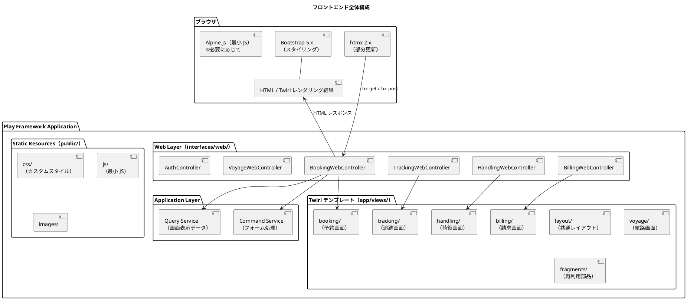
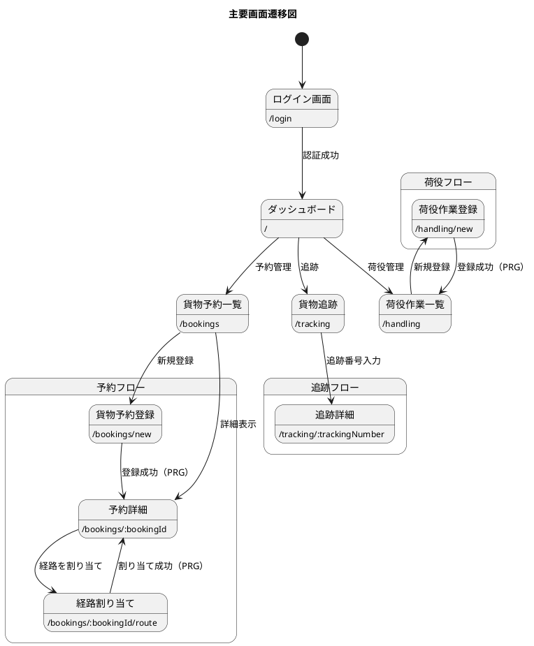
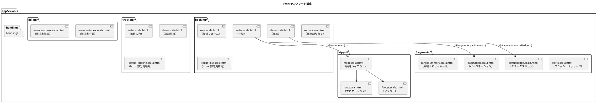
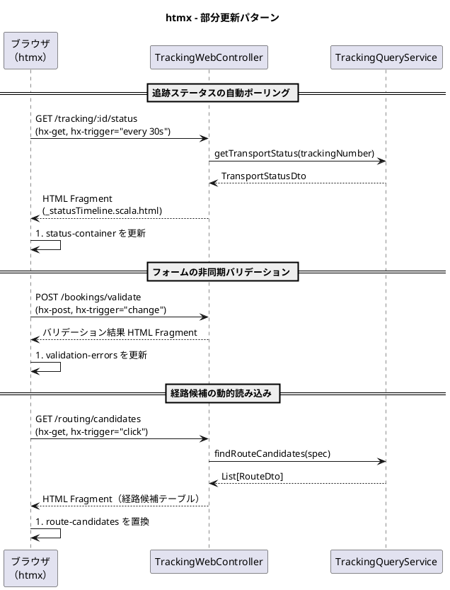
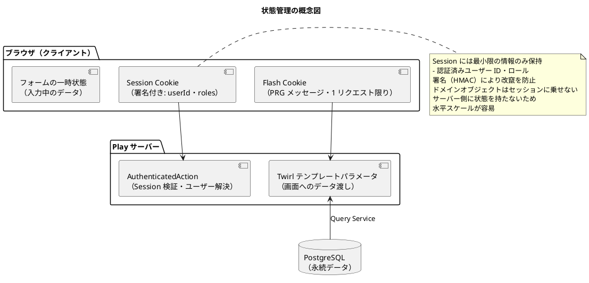

# フロントエンドアーキテクチャ - 国際貨物輸送管理システム

## 概要

本ドキュメントでは、国際貨物輸送管理システムのフロントエンドアーキテクチャを定義する。
業務系 Web システムとして、**Twirl による SSR（サーバーサイドレンダリング）** を基本とし、
部分的な動的更新に **htmx 2.x** を組み合わせることで、シンプルかつ保守性の高い UI を実現する。

## アーキテクチャパターン選択

### SSR + htmx の選定理由

| 評価軸 | SPA（React/Vue） | **SSR + htmx（採用）** |
| :--- | :--- | :--- |
| 実装複雑度 | 高（フロントエンドビルドパイプライン、状態管理が必要） | **低**（Play に統合、追加ビルド不要） |
| SEO / アクセシビリティ | 追加対応が必要 | **容易**（HTML がサーバーで生成される） |
| リアルタイム更新 | 容易（WebSocket / SSE） | **htmx で部分更新**（十分な要件を満たす） |
| 開発者体験（バックエンド重視） | フロント専門知識が必要 | **Scala エンジニアが一貫して開発可能** |
| 初期表示速度 | 遅い（JS バンドルの読み込み） | **速い**（HTML を直接レスポンス） |
| テンプレートの型安全性 | TypeScript で担保 | **Twirl はコンパイル時に型検査される**（パラメータ・式の誤りをビルドで検出） |

本システムは業務系 Web アプリケーションであり、画面数は限定的で、リアルタイム更新要件も荷物追跡ステータスの部分更新が主である。
SPA の複雑さを導入するメリットがなく、Play Framework との統合が容易な **Twirl + htmx** を採用する。
Twirl テンプレートは Scala コードにコンパイルされるため、テンプレートに渡すデータの型誤り・存在しないプロパティ参照をコンパイル時に検出できる点が Thymeleaf 等の動的テンプレートに対する優位点である。

## 全体構成



## 画面構成

### 主要画面一覧

| 画面 | URL パス | 説明 | アクター |
| :--- | :--- | :--- | :--- |
| ダッシュボード | `/` | 全体サマリー・最新荷役情報 | 全ロール |
| 貨物予約一覧 | `/bookings` | 予約済み貨物の一覧・検索 | 荷主、営業担当者 |
| 貨物予約登録 | `/bookings/new` | 新規予約フォーム | 営業担当者 |
| 予約詳細 | `/bookings/:bookingId` | 予約情報・経路・荷役履歴 | 荷主、営業担当者 |
| 経路割り当て | `/bookings/:bookingId/route` | 利用可能な航路から経路を選択 | 営業担当者 |
| 貨物追跡 | `/tracking` | 追跡番号入力・現在地確認 | 荷主、荷受人、追跡管理者 |
| 追跡詳細 | `/tracking/:trackingNumber` | 輸送ステータス履歴・マップ表示 | 荷主、荷受人 |
| 荷役作業登録 | `/handling/new` | 荷役イベントの登録フォーム | 荷役作業員 |
| 荷役作業一覧 | `/handling` | 荷役履歴の一覧・検索 | 荷役作業員、追跡管理者 |
| 航路一覧 | `/voyages` | 航路・スケジュール一覧 | 経路設計者 |
| 請求書一覧 | `/billing/invoices` | 請求書の一覧・ステータス管理 | 経理担当者 |
| ログイン | `/login` | フォームベースログイン画面 | 全ロール |

### 画面遷移図



## コンポーネント設計方針

### Twirl テンプレート構成



### Twirl テンプレート設計原則

| 原則 | 内容 |
| :--- | :--- |
| **レイアウト合成** | 共通レイアウトはパラメータにコンテンツ（`Html`）を受け取るテンプレート関数として定義し、各画面が `@layout.main("タイトル") { ... }` で合成する |
| **フラグメント分離** | 再利用可能な UI 部品は `fragments/` にパラメータ化されたテンプレート関数として切り出す |
| **htmx 用フラグメント** | 部分更新対象の HTML は `_` プレフィックス付きテンプレート（`_statusTimeline.scala.html`）として定義し、Controller から単体でレンダリングできるようにする |
| **フォームオブジェクト** | フォームデータは Play Form（`Form[BookCargoForm]`）でバインドし、テンプレートに `Form` を渡す |
| **DTO の使用** | テンプレートに渡すデータは Query Service からの DTO（`case class`）を使用する。ドメインモデルを直接渡さない |
| **型安全なパラメータ** | テンプレートの第 1 行でパラメータの型を宣言する（`@(summaries: List[BookingSummary])`）。型の不一致はコンパイルエラーになる |

```html
@* layout/main.scala.html - 共通レイアウト *@
@(title: String)(content: Html)(implicit request: RequestHeader, flash: Flash)
<!DOCTYPE html>
<html lang="ja">
  <head>
    <title>@title - Cargo Tracker</title>
    <link rel="stylesheet" href="@routes.Assets.versioned("css/bootstrap.min.css")">
    <script src="@routes.Assets.versioned("js/htmx.min.js")" defer></script>
  </head>
  <body>
    @layout.nav()
    <main class="container">
      @fragments.alerts()
      @content
    </main>
    @layout.footer()
  </body>
</html>
```

```html
@* booking/index.scala.html - 一覧画面 *@
@(summaries: List[BookingSummary], page: Pagination)(implicit request: RequestHeader, flash: Flash)
@layout.main("貨物予約一覧") {
  <h1>貨物予約一覧</h1>
  <table class="table">
    @for(summary <- summaries) {
      @booking._cargoRow(summary)
    }
  </table>
  @fragments.pagination(page)
}
```

## htmx による動的更新

### htmx 適用パターン



### htmx 使用ガイドライン

| ユースケース | htmx 属性 | 説明 |
| :--- | :--- | :--- |
| **フォーム送信（非同期）** | `hx-post`, `hx-target`, `hx-swap` | フォーム送信後に特定領域のみ更新 |
| **ステータスポーリング** | `hx-get`, `hx-trigger="every 30s"` | 追跡ステータスを定期取得 |
| **インクリメンタル検索** | `hx-get`, `hx-trigger="input changed delay:300ms"` | 検索フォームの入力に応じて結果を更新 |
| **確認ダイアログ** | `hx-confirm` | 削除・キャンセル操作前の確認ポップアップ |
| **ローディング表示** | `hx-indicator` | リクエスト中のスピナー表示 |
| **ページネーション** | `hx-get`, `hx-target` | ページ切り替えを部分更新で実現 |

### htmx コントローラー設計

htmx からのリクエストは `HX-Request: true` ヘッダーで識別する。
通常のページリクエストと htmx リクエストを同一エンドポイントで処理する場合は、
フラグメントのみを返すか全ページを返すかをヘッダーで判定する。

```scala
class TrackingWebController @Inject() (
    trackingQueryService: TrackingQueryService,
    cc: ControllerComponents
) extends AbstractController(cc):

  def status(trackingNumber: String): Action[AnyContent] = Action { implicit request =>
    val statusDto = trackingQueryService.getStatus(trackingNumber)
    val isHtmxRequest = request.headers.get("HX-Request").contains("true")
    // htmx リクエストの場合はフラグメントのみ返す
    if isHtmxRequest then Ok(views.html.tracking._statusTimeline(statusDto))
    else Ok(views.html.tracking.show(statusDto))
  }
```

## 状態管理

### サーバーサイド状態管理

SSR アーキテクチャでは、アプリケーション状態はサーバー側（DB）で管理する。
Play の Session は **署名付きクライアントサイド Cookie** であり、Spring のサーバーサイド HTTP Session とは異なる。
セッションに格納するのは最小限の認証情報のみとし、改竄は署名検証で防止する（内容の秘匿が必要な値は格納しない）。



### PRG パターン（Post-Redirect-Get）

フォーム送信後は必ず PRG パターンを適用し、ブラウザのリロードによる二重送信を防ぐ。

| 操作 | フロー |
| :--- | :--- |
| 予約登録成功 | `POST /bookings` → `Redirect(routes.BookingWebController.show(bookingId))` |
| 荷役登録成功 | `POST /handling` → `Redirect(routes.HandlingWebController.index())` |
| 経路割り当て成功 | `POST /bookings/:id/route` → `Redirect(routes.BookingWebController.show(id))` |

成功・エラーメッセージは `Redirect(...).flashing("success" -> "予約を登録しました")` で渡し、
`fragments/alerts.scala.html` フラグメントで表示する。

```scala
def create: Action[AnyContent] = authenticated.withRole(Role.Sales) { implicit request =>
  BookCargoForm.form.bindFromRequest().fold(
    formWithErrors => BadRequest(views.html.booking.`new`(formWithErrors)),
    form =>
      commandService.bookCargo(form.toCommand) match
        case Right(bookingId) =>
          Redirect(routes.BookingWebController.show(bookingId.value))
            .flashing("success" -> "貨物予約を登録しました")
        case Left(error) =>
          BadRequest(views.html.booking.`new`(BookCargoForm.form.fill(form)))
            .flashing("error" -> error.message)
  )
}
```

## セキュリティ考慮

### CSRF 対策

Play の **CSRF Filter** がデフォルトで有効になる。
Twirl のフォームヘルパーを使用することで、`<form>` タグに自動的に CSRF トークンが埋め込まれる。

```html
@* Twirl のフォームヘルパーは CSRF トークンを自動で含む *@
@helper.form(action = routes.BookingWebController.create()) {
  @helper.CSRF.formField
  @* フォームフィールド *@
}
```

htmx の `hx-post` / `hx-put` / `hx-delete` 使用時は、CSRF トークンをリクエストヘッダーに含める。

```html
@* meta タグに CSRF トークンを埋め込む（layout/main.scala.html） *@
<meta name="csrf-token" content="@helper.CSRF.getToken.value"/>

<!-- htmx のグローバル設定で CSRF ヘッダーを自動送信（public/js/app.js） -->
<script>
  document.addEventListener('htmx:configRequest', (event) => {
    const csrfToken = document.querySelector('meta[name="csrf-token"]').content;
    event.detail.headers['Csrf-Token'] = csrfToken;
  });
</script>
```

### 入力検証

フォームの入力検証は 3 段階で行う。

| 段階 | 実装 | 内容 |
| :--- | :--- | :--- |
| **クライアントサイド** | HTML5 / Bootstrap バリデーション | `required`, `pattern` 属性による即時フィードバック |
| **サーバーサイド（形式）** | Play Form（`Form[BookCargoForm]`） | 必須・型・範囲等の形式検証。エラーは `Form` に蓄積される |
| **サーバーサイド（業務ルール）** | ドメイン層のスマートコンストラクタ | `Either[DomainError, A]` によるビジネスルール検証 |

サーバーサイドバリデーションエラーは `form.fold` のエラーパスで受け取り、
Twirl のフォームヘルパー（`@helper.inputText(form("origin"))`）がフィールドごとにエラーメッセージを表示する。

### XSS 対策

Twirl の `@` 式は HTML エスケープを自動的に行う。
エスケープを回避する `Html(...)` ラップは原則として使用しない。
ユーザー入力を HTML として出力する場合は、DOMPurify 等でサニタイズする。

## ディレクトリ構成

```text
apps/cargo-tracker/
├── app/
│   ├── cargotracker/
│   │   ├── booking/
│   │   │   └── interfaces/
│   │   │       ├── web/
│   │   │       │   ├── BookingWebController.scala   # Twirl 画面用
│   │   │       │   └── BookCargoForm.scala          # Play Form 定義
│   │   │       └── rest/
│   │   │           └── CargoBookingRestController.scala  # htmx / API 用
│   │   ├── tracking/
│   │   │   └── interfaces/
│   │   │       └── web/
│   │   │           └── TrackingWebController.scala
│   │   └── （各コンテキスト同様）
│   │
│   └── views/
│       ├── layout/
│       │   ├── main.scala.html             # 共通レイアウト
│       │   ├── nav.scala.html              # ナビゲーション
│       │   └── footer.scala.html           # フッター
│       ├── fragments/
│       │   ├── alerts.scala.html           # フラッシュメッセージ
│       │   ├── pagination.scala.html       # ページネーション
│       │   └── statusBadge.scala.html      # ステータスバッジ
│       ├── booking/
│       │   ├── index.scala.html
│       │   ├── new.scala.html
│       │   ├── show.scala.html
│       │   ├── route.scala.html
│       │   └── _cargoRow.scala.html        # htmx 部分更新用フラグメント
│       ├── tracking/
│       │   ├── index.scala.html
│       │   ├── show.scala.html
│       │   └── _statusTimeline.scala.html  # htmx 部分更新用フラグメント
│       ├── handling/
│       │   ├── index.scala.html
│       │   └── new.scala.html
│       ├── billing/
│       │   └── invoices/
│       │       ├── index.scala.html
│       │       └── show.scala.html
│       └── auth/
│           └── login.scala.html
└── public/
    ├── css/
    │   └── custom.css                      # カスタムスタイル（Bootstrap 上書き）
    ├── js/
    │   ├── htmx.min.js                     # htmx 本体
    │   └── app.js                          # htmx 設定・最小 JS
    └── images/
```
