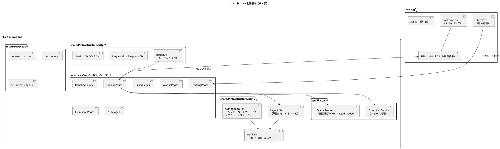
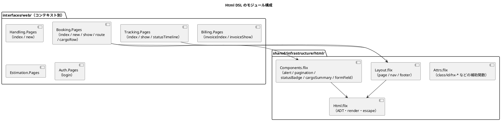
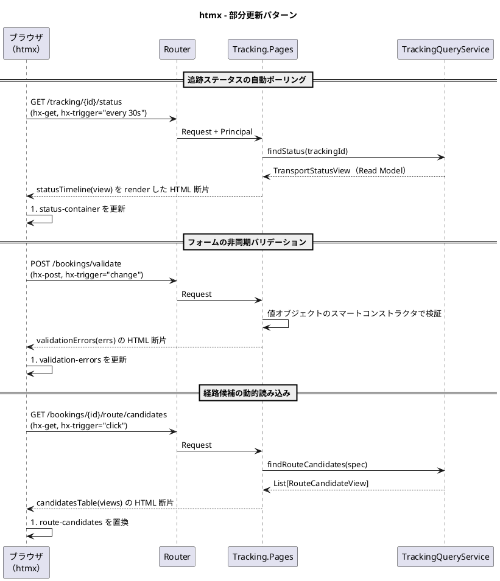
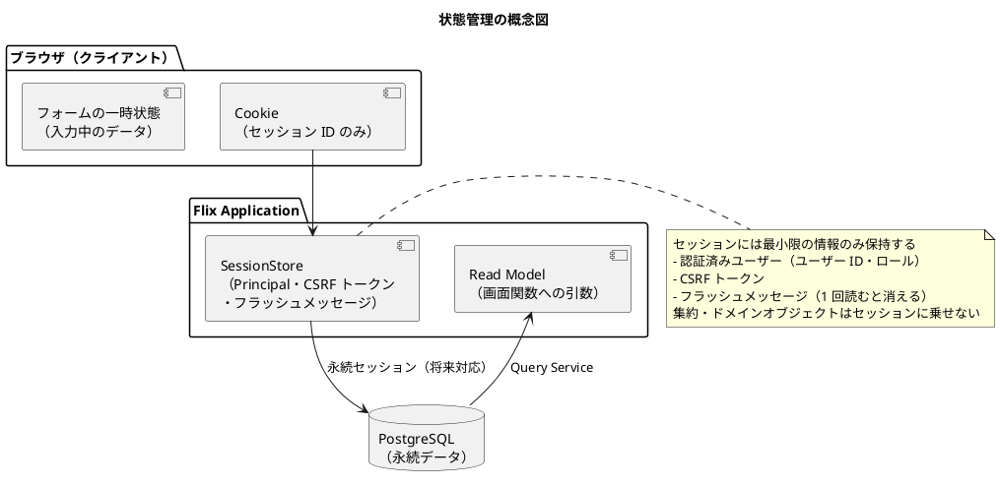

# フロントエンドアーキテクチャ - 国際貨物輸送管理システム（Flix 版）

## 概要

本ドキュメントでは、国際貨物輸送管理システムのフロントエンドアーキテクチャを定義する。
業務系 Web システムとして **SSR（サーバーサイドレンダリング）** を基本とし、部分的な動的更新に **htmx 2.x** を組み合わせる。

Java/Spring 版との最大の相違は、**テンプレートエンジンを使わず、Flix の `Html` DSL（代数的データ型と結合子）で HTML を生成する**点である。

## アーキテクチャパターン選択

### SSR + htmx の選定理由

| 評価軸 | SPA（React/Vue） | **SSR + htmx（採用）** |
| :--- | :--- | :--- |
| 実装複雑度 | 高（フロントエンドビルドパイプライン、状態管理が必要） | **低**（Flix アプリに統合、追加ビルド不要） |
| SEO / アクセシビリティ | 追加対応が必要 | **容易**（HTML がサーバーで生成される） |
| リアルタイム更新 | 容易（WebSocket / SSE） | **htmx で部分更新**（要件を満たす） |
| 開発者体験 | フロント専門知識と別言語が必要 | **Flix で一貫して開発できる** |
| 初期表示速度 | 遅い（JS バンドルの読み込み） | **速い**（HTML を直接レスポンス） |

本システムは業務系 Web アプリケーションであり、画面数は限定的で、リアルタイム更新要件も追跡ステータスの部分更新が主である。
SPA の複雑さを導入する利点がなく、SSR + htmx を採用する。

### テンプレートエンジンを採用しない理由

| 評価軸 | Java テンプレートエンジン（Thymeleaf 等）を相互運用で使う | **Flix `Html` DSL（採用）** |
| :--- | :--- | :--- |
| 型安全性 | テンプレート内の式が Flix の型検査の外に出る | **画面が Flix の関数であり、型検査・網羅性検査が効く** |
| リファクタリング | ドメイン型を変えてもテンプレートは壊れない（実行時に落ちる） | **コンパイルエラーで検出される** |
| テスト容易性 | テンプレート単体のテストが困難 | **`Html` を返す純粋関数として単体テストできる** |
| エスケープ | 属性・URL 文脈ごとの扱いを覚える必要がある | **テキストノードは既定でエスケープ。回避は明示的な関数のみ** |
| デザイナとの分業 | HTML ファイルを直接編集できる | **Flix ソースの編集が必要（本プロジェクトでは分業しないため許容）** |
| 記述量 | 少ない | 多い（`Components` モジュールで吸収する） |

Flix を採用する目的は型と効果による安全性の獲得であり、画面層だけをその外に出す判断は一貫性を欠く。
デザイナとの分業が発生しない本プロジェクトの体制を前提に、`Html` DSL を採用する。

## 全体構成



## 画面構成

画面一覧・画面遷移図・ワイヤーフレーム・画面ごとの項目定義は [UI 設計](ui_design.md) を正典とする。
本ドキュメントでは重複して定義せず、以下の対応節を参照すること。

| 参照先 | 内容 |
| :--- | :--- |
| [UI 設計 - 画面一覧](ui_design.md#画面一覧) | 全画面の URL パス・説明・主要アクター・対応ユーザーストーリー |
| [UI 設計 - 共通レイアウト設計](ui_design.md#共通レイアウト設計) | ナビゲーション構成、共通レイアウト、Bootstrap グリッド運用ルール |
| [UI 設計 - 画面遷移図](ui_design.md#画面遷移図) | 認証フロー・見積フロー・予約フロー・追跡フロー・荷役フロー・精算フローの遷移 |
| [UI 設計 - 画面詳細設計](ui_design.md#画面詳細設計) | 画面ごとのワイヤーフレームと仕様 |

アーキテクチャ上、UI 設計の内容は次の 3 箇所へ機械的に対応づく。**画面を追加・変更する際は、この 3 箇所を同一の変更で更新する。**

| UI 設計の要素 | 実装上の対応 |
| :--- | :--- |
| 画面一覧の URL パスとアクター | `Router` のルーティング表（メソッド・パスパターン・必要ロール・ハンドラ） |
| 各画面のワイヤーフレーム | `interfaces/web/` の画面関数（`Html` を返す純粋関数） |
| ナビゲーション構成 | `Layout.nav` とダッシュボードのロール別入口 |

> **ナビゲーション整合性**: 画面を追加した際は、個別画面だけでなく共通ナビゲーション（`Layout.nav`）・
> ダッシュボードのロール別入口・ナビゲーション検証テストを必ず同時に更新する。
> どれか 1 つが欠けると、受入基準を満たしていても該当ロールが画面に到達できない。

## `Html` DSL 設計

### 型と基本結合子

```flix
/// shared/infrastructure/html/Html.flix
pub enum Html {
    case Element(String, List[Attr], List[Html])   // タグ名, 属性, 子
    case Text(String)                              // 描画時にエスケープされる
    case RawUnsafe(String)                         // エスケープしない（使用箇所はレビュー必須）
    case Fragment(List[Html])                      // 複数ノードのまとめ（htmx 部分更新の戻り値）
    case Empty
}

pub enum Attr {
    case Attr(String, String)                      // 値は属性文脈でエスケープされる
    case BoolAttr(String)                          // required, disabled 等
}

pub def render(html: Html): String                 // 純粋関数。テストで直接検証できる
```

### モジュール構成



### 画面関数の設計原則

| 原則 | 内容 |
| :--- | :--- |
| **画面 = 純粋関数** | `def show(vm: BookingDetailView): Html` の形とする。効果を要求しない。テストで `render` した文字列を検証できる |
| **Read Model のみを受け取る** | 画面関数の引数は Query Service が返す Read Model 型に限る。集約（`Cargo` 等）を直接渡さない |
| **レイアウト適用** | 全ページは `Layout.page(title, principal, activeNav, body)` を経由する。ナビの活性状態を引数で強制する |
| **部分更新用関数の分離** | htmx が差し替える領域は独立した関数（例：`Tracking.Pages.statusTimeline`）として定義し、全ページ関数がそれを埋め込む。**同じ関数を全体描画と部分更新の両方で使う** |
| **エスケープ** | `Text` が既定。`RawUnsafe` の使用箇所は `arch-lint` で列挙し、レビュー必須とする |
| **状態バッジ** | `BookingStatus` / `TransportStatus` の `enum` を受け取り、パターンマッチで色とラベルを決める。状態追加時に**コンパイラが考慮漏れを検出する** |

## htmx による動的更新

### htmx 適用パターン



### htmx 使用ガイドライン

| ユースケース | htmx 属性 | 説明 |
| :--- | :--- | :--- |
| **フォーム送信（非同期）** | `hx-post`, `hx-target`, `hx-swap` | 送信後に特定領域のみ更新 |
| **ステータスポーリング** | `hx-get`, `hx-trigger="every 30s"` | 追跡ステータスを定期取得 |
| **インクリメンタル検索** | `hx-get`, `hx-trigger="input changed delay:300ms"` | 入力に応じて結果を更新 |
| **確認ダイアログ** | `hx-confirm` | 取消・削除操作前の確認 |
| **ローディング表示** | `hx-indicator` | リクエスト中のスピナー |
| **ページネーション** | `hx-get`, `hx-target` | ページ切り替えを部分更新で実現 |

htmx 属性は `Attrs.flix` の補助関数（`hxGet(url)`, `hxTrigger("every 30s")` 等）で生成し、
文字列リテラルを画面関数に散らさない。

### 全体描画と部分更新の同一エンドポイント処理

htmx からのリクエストは `HX-Request: true` ヘッダーで識別する。
Flix では、レスポンス生成を「断片を返す関数」と「断片をレイアウトで包む処理」に分けることで自然に表現できる。

```flix
/// interfaces/web/TrackingPages.flix
pub def statusRoute(req: Request, principal: Principal): Response \ ReadDb =
    let trackingId = Request.pathParam(req, "trackingId");
    let view       = TrackingQuery.findStatus(trackingId);
    let fragment   = statusTimeline(view);           // 部分更新でも全体描画でも同じ関数
    if (Request.isHtmx(req))
        Response.html(Html.render(fragment))
    else
        Response.html(Html.render(Layout.page("追跡詳細", principal, NavTracking, fragment)))
```

## 状態管理

### サーバーサイド状態管理

SSR アーキテクチャでは、アプリケーション状態はサーバー側で管理する。ブラウザ側には最小限のセッション情報のみを保持する。



`SessionStore` は `eff Session` として宣言する。ハンドラはローカル・テストではインメモリ、
**ステージング・本番では DB 実装**とする。非機能要件が「同一ユーザーの同時セッション数 1」を要求しており、
複数タスク構成ではインメモリでは実現できないためである。詳細は
[バックエンドアーキテクチャ - セッションストア](architecture_backend.md#セッションストア) を参照すること。

### PRG パターン（Post-Redirect-Get）

フォーム送信後は必ず PRG パターンを適用し、リロードによる二重送信を防ぐ。

| 操作 | フロー |
| :--- | :--- |
| 見積作成成功 | `POST /estimates` → `302 /estimates/{estimateId}` |
| 見積承認成功 | `POST /estimates/{id}/approve` → `302 /bookings/{bookingId}` |
| 予約登録成功 | `POST /bookings` → `302 /bookings/{bookingId}` |
| 経路割り当て成功 | `POST /bookings/{id}/route` → `302 /bookings/{id}` |
| 荷役登録成功 | `POST /handling` → `302 /handling` |

成功・エラーメッセージは `Session.flash(msg)` で退避し、次のリクエストで `Components.alert` として描画する。

## セキュリティ考慮

### CSRF 対策

CSRF トークンはセッション単位で発行し、状態変更メソッド（`POST` / `PUT` / `DELETE`）で検証する。
`Components.form` がトークンの hidden フィールドを**自動付与**するため、画面側で付け忘れが起きない。

```flix
/// Components.flix — form の生成は必ずこの関数を経由する
pub def form(action: String, method: HttpMethod, csrf: CsrfToken, children: List[Html]): Html =
    Element("form", Attr("action", action) :: Attr("method", methodName(method)) :: Nil,
        hiddenField("_csrf", CsrfToken.value(csrf)) :: children)
```

htmx の `hx-post` / `hx-put` / `hx-delete` 使用時は、`<meta>` タグのトークンをリクエストヘッダーへ自動付与する。

```html
<meta name="_csrf" content="...">
<script>
  document.addEventListener('htmx:configRequest', (event) => {
    event.detail.headers['X-CSRF-Token'] =
      document.querySelector('meta[name="_csrf"]').content;
  });
</script>
```

> `Html` DSL で `<form>` を直接構築することは `arch-lint` で禁止し、`Components.form` の使用を強制する。

### 入力検証

| 段階 | 実装 | 内容 |
| :--- | :--- | :--- |
| **クライアントサイド** | HTML5 / Bootstrap バリデーション | `required`, `pattern` による即時フィードバック（利便性のみ。信頼しない） |
| **サーバーサイド（形式）** | 値オブジェクトのスマートコンストラクタ | `TrackingId.of(s): Result[DomainError, TrackingId]` 等。不正値は型を得られない |
| **サーバーサイド（業務）** | 集約の状態遷移関数 | 「到着期限は出発日より後」等の業務ルールを `Result` で返す |

検証エラーは `List[FieldError]` として画面関数へ渡し、`Components.formField` がフィールド直下にメッセージを描画する。
**不正値のまま画面へ戻すのではなく、入力文字列とエラーを組にした ViewModel を渡す**ことで、再入力時の値保持と型安全性を両立する。

### XSS 対策

- `Html.Text` は描画時に HTML エスケープされる。これが既定である
- 属性値は属性文脈のエスケープを行う。URL 属性（`href` / `hx-get`）は `Attrs.url` を用い、`javascript:` スキームを拒否する
- `Html.RawUnsafe` の使用は原則禁止。使用する場合はサニタイズ済みであることをコメントで根拠付け、レビューを必須とする

## ディレクトリ構成

```
apps/cargo-tracker/
├── src/
│   ├── shared/infrastructure/
│   │   ├── html/
│   │   │   ├── Html.flix              # ADT・render・エスケープ
│   │   │   ├── Attrs.flix             # class/id/hx-* 等の属性補助
│   │   │   ├── Layout.flix            # page / nav / footer
│   │   │   └── Components.flix        # alert / pagination / statusBadge
│   │   │                              # / cargoSummary / form / formField
│   │   └── http/
│   │       ├── Router.flix            # ルーティング表（認可要件を含む）
│   │       ├── Request.flix           # isHtmx / pathParam / formParam
│   │       ├── Response.flix          # html / redirect / status
│   │       └── Session.flix           # eff Session（Principal・flash・CSRF）
│   ├── booking/interfaces/web/BookingPages.flix
│   ├── tracking/interfaces/web/TrackingPages.flix
│   ├── handling/interfaces/web/HandlingPages.flix
│   ├── billing/interfaces/web/BillingPages.flix
│   ├── estimation/interfaces/web/EstimationPages.flix
│   ├── routing/interfaces/web/VoyagePages.flix
│   └── shared/interfaces/web/{DashboardPages.flix, AuthPages.flix}
├── test/
│   └── web/                           # 画面関数の render 結果を検証
└── resources/static/
    ├── css/{bootstrap.min.css, custom.css}
    ├── js/{htmx.min.js, app.js}
    └── images/
```

## 画面層のテスト方針

| 対象 | 方法 |
| :--- | :--- |
| 画面関数 | 純粋関数のため、`render` した文字列に対して必須要素・ラベル・`hx-*` 属性の存在を検証する |
| ステータスバッジ | `enum` の全ケースに対する網羅テスト（新しい状態を追加するとコンパイルエラーで検出される） |
| ナビゲーション | 全ロールについて「ダッシュボード・ナビから到達可能な URL 集合」がルーティング表と一致することを検証する |
| CSRF / エスケープ | フォーム生成にトークンが含まれること、`<script>` を含む入力がエスケープされることを検証する |
| 画面遷移（PRG） | HTTP 統合テストで `302` とリダイレクト先を検証する |
| 表示崩れ・操作性 | Playwright による E2E（[テスト戦略](test_strategy.md) 参照） |
