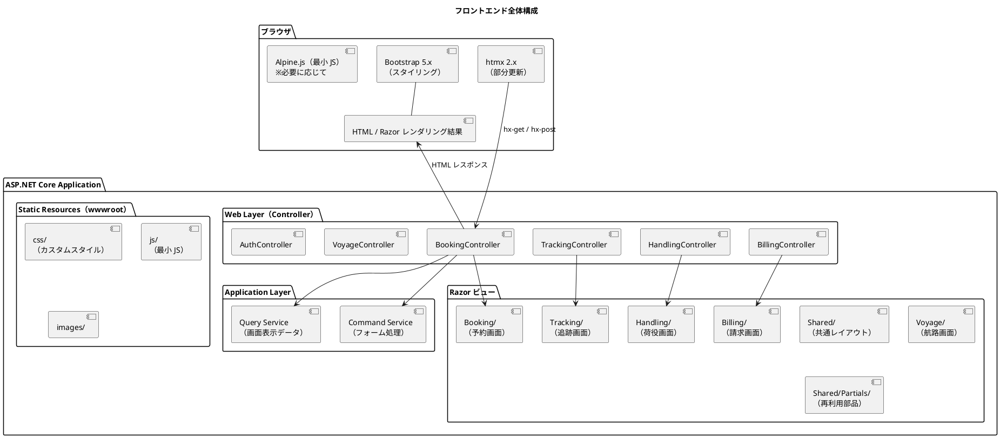
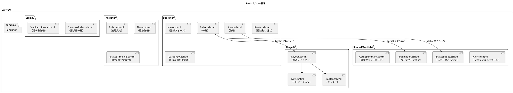
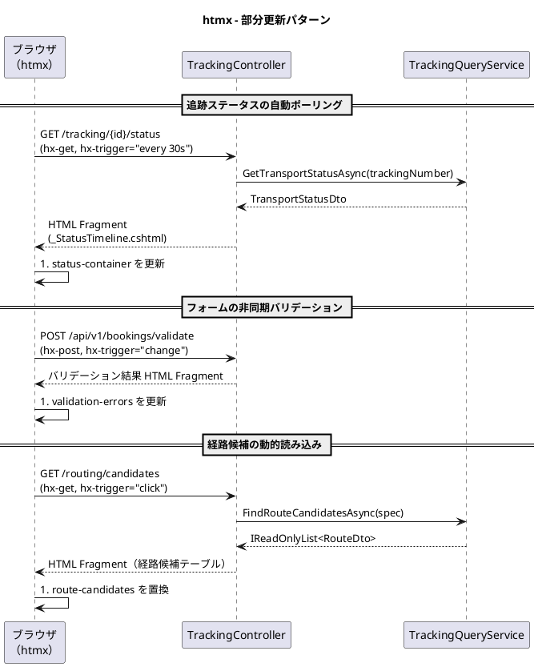
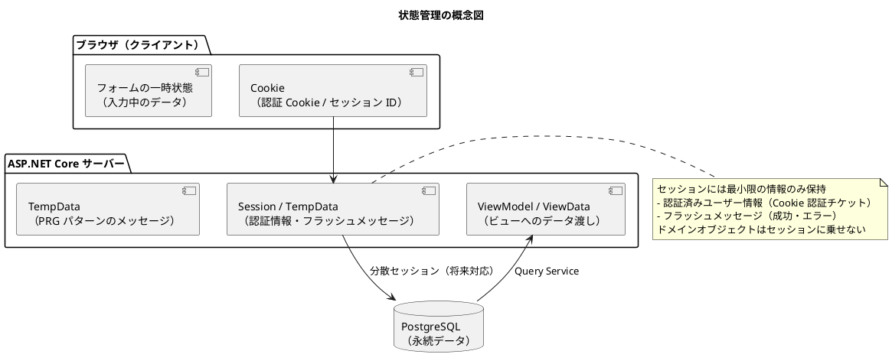

# フロントエンドアーキテクチャ - 国際貨物輸送管理システム

## 概要

本ドキュメントでは、国際貨物輸送管理システムのフロントエンドアーキテクチャを定義します。
業務系 Web システムとして、**Razor ビュー（ASP.NET Core MVC）による SSR（サーバーサイドレンダリング）** を基本とし、
部分的な動的更新に **htmx 2.x** を組み合わせることで、シンプルかつ保守性の高い UI を実現します。

## アーキテクチャパターン選択

### SSR + htmx の選定理由

| 評価軸 | SPA（React/Vue） | **SSR + htmx（採用）** |
| :--- | :--- | :--- |
| 実装複雑度 | 高（フロントエンドビルドパイプライン、状態管理が必要） | **低**（ASP.NET Core に統合、追加ビルド不要） |
| SEO / アクセシビリティ | 追加対応が必要 | **容易**（HTML がサーバーで生成される） |
| リアルタイム更新 | 容易（WebSocket / SSE） | **htmx で部分更新**（十分な要件を満たす） |
| 開発者体験（バックエンド重視） | フロント専門知識が必要 | **C# エンジニアが一貫して開発可能** |
| 初期表示速度 | 遅い（JS バンドルの読み込み） | **速い**（HTML を直接レスポンス） |

本システムは業務系 Web アプリケーションであり、画面数は限定的で、リアルタイム更新要件も荷物追跡ステータスの部分更新が主です。
SPA の複雑さを導入するメリットがなく、ASP.NET Core 10 MVC との統合が容易な **Razor + htmx** を採用します。

## 全体構成



## 画面構成

画面一覧・画面遷移図・各画面のワイヤーフレームは [UI 設計](ui_design.md) を正とし、本ドキュメントでは重複して定義しません。

- 画面一覧（全 17 画面・URL 設計・アクター）: [UI 設計 - 画面一覧](ui_design.md#画面一覧)
- 画面遷移図: [UI 設計 - 画面遷移図](ui_design.md#画面遷移図)
- 各画面のワイヤーフレーム・仕様: [UI 設計 - 画面詳細設計](ui_design.md#画面詳細設計)

本ドキュメントは、これらの画面を実現するための技術構成（Razor ビュー構成・htmx パターン・状態管理・セキュリティ）を定義します。

## コンポーネント設計方針

### Razor ビュー構成



### Razor ビュー設計原則

| 原則 | 内容 |
| :--- | :--- |
| **レイアウト継承** | `_ViewStart.cshtml` の `Layout` プロパティで共通レイアウト（`Shared/_Layout.cshtml`）を適用します |
| **パーシャルビュー分離** | 再利用可能な UI 部品は `Shared/Partials/` にパーシャルビュー（`_` プレフィックス）として切り出します |
| **htmx 用パーシャルビュー** | 部分更新対象の HTML は `_` プレフィックス付きパーシャルビューとして定義し、コントローラーから `PartialView()` で返します |
| **ViewComponent の活用** | サーバーサイドロジックを伴う再利用部品（ステータスバッジ、貨物サマリー等）は ViewComponent として実装します |
| **フォームオブジェクト** | フォームデータは専用のフォームオブジェクト（`BookCargoForm`）でモデルバインドします |
| **DTO の使用** | ビューに渡すデータは Query Service からの DTO（ViewModel）を使用します。ドメインモデルを直接渡しません |

## htmx による動的更新

### htmx 適用パターン



### htmx 使用ガイドライン

| ユースケース | htmx 属性 | 説明 |
| :--- | :--- | :--- |
| **フォーム送信（非同期）** | `hx-post`, `hx-target`, `hx-swap` | フォーム送信後に特定領域のみ更新 |
| **ステータスポーリング** | `hx-get`, `hx-trigger="every 30s"` | 追跡ステータスを定期取得 |
| **インクリメンタル検索** | `hx-get`, `hx-trigger="input changed delay:300ms"` | 検索フォームの入力に応じて結果を更新 |
| **確認ダイアログ** | `hx-confirm` | 削除・キャンセル操作前の確認ポップアップ |
| **ローディング表示** | `hx-indicator` | リクエスト中のスピナー表示 |
| **ページネーション** | `hx-get`, `hx-target` | ページ切り替えを部分更新で実現 |

### htmx コントローラー設計

htmx からのリクエストは `HX-Request: true` ヘッダーで識別します。
通常のページリクエストと htmx リクエストを同一エンドポイントで処理する場合は、
パーシャルビューのみを返すか全ページを返すかを `[FromHeader]` で受け取った `HX-Request` ヘッダーで判定します。

```csharp
[HttpGet("/tracking/{trackingNumber}/status")]
public async Task<IActionResult> GetTrackingStatus(
    string trackingNumber,
    [FromHeader(Name = "HX-Request")] bool isHtmxRequest)
{
    var status = await _trackingQueryService.GetStatusAsync(trackingNumber);

    // htmx リクエストの場合はパーシャルビューのみ返す
    if (isHtmxRequest)
    {
        return PartialView("_StatusTimeline", status);
    }
    return View("Show", status);
}
```

## 状態管理

### サーバーサイド状態管理

SSR アーキテクチャでは、アプリケーション状態はサーバー側で管理します。
ブラウザ側では最小限のセッション情報のみを保持します。



### PRG パターン（Post-Redirect-Get）

フォーム送信後は必ず PRG パターンを適用し、ブラウザのリロードによる二重送信を防ぎます。

| 操作 | フロー |
| :--- | :--- |
| 予約登録成功 | `POST /bookings` → `RedirectToAction("Show", new { bookingId })` |
| 荷役登録成功 | `POST /handling` → `RedirectToAction("Index")` |
| 経路割り当て成功 | `POST /bookings/{id}/route` → `RedirectToAction("Show", new { id })` |

成功・エラーメッセージは `TempData["SuccessMessage"]` / `TempData["ErrorMessage"]` で渡し、
`Shared/Partials/_Alerts.cshtml` パーシャルビューで表示します。

## セキュリティ考慮

### CSRF 対策

ASP.NET Core の Antiforgery（CSRF）保護を有効にします。
Razor のフォームタグヘルパーを使用することで、
`<form>` タグに自動的に Antiforgery トークンが埋め込まれます。

```html
<!-- Razor のフォームタグヘルパーは自動的に Antiforgery トークンを含む -->
<form asp-controller="Booking" asp-action="Create" method="post">
  <!-- __RequestVerificationToken hidden field が自動付与される -->
</form>
```

コントローラー側では `[ValidateAntiForgeryToken]`（またはグローバルの `AutoValidateAntiforgeryToken` フィルター）で検証します。

htmx の `hx-post` / `hx-put` / `hx-delete` 使用時は、Antiforgery トークンをリクエストヘッダーに含めます。

```html
<!-- meta タグに Antiforgery トークンを埋め込む -->
@inject Microsoft.AspNetCore.Antiforgery.IAntiforgery Antiforgery
@{
    var tokens = Antiforgery.GetAndStoreTokens(Context);
}
<meta name="_csrf" content="@tokens.RequestToken" />
<meta name="_csrf_header" content="RequestVerificationToken" />

<!-- htmx のグローバル設定で CSRF ヘッダーを自動送信 -->
<script>
  document.addEventListener('htmx:configRequest', (event) => {
    const csrfToken = document.querySelector('meta[name="_csrf"]').content;
    const csrfHeader = document.querySelector('meta[name="_csrf_header"]').content;
    event.detail.headers[csrfHeader] = csrfToken;
  });
</script>
```

### 入力検証

フォームの入力検証は 2 段階で行います。

| 段階 | 実装 | 内容 |
| :--- | :--- | :--- |
| **クライアントサイド** | HTML5 / Bootstrap バリデーション | `required`, `pattern` 属性による即時フィードバック |
| **サーバーサイド** | DataAnnotations + FluentValidation | `ModelState.IsValid` による詳細なビジネスルール検証 |

サーバーサイドバリデーションエラーは `ModelState` で受け取り、
Razor の `asp-validation-for` タグヘルパーでフィールドごとにエラーメッセージを表示します。

```html
<input asp-for="TrackingNumber" class="form-control" />
<span asp-validation-for="TrackingNumber" class="text-danger"></span>
```

### XSS 対策

Razor の `@` 式は HTML エスケープを自動的に行います。
HTML をそのまま出力する `Html.Raw()` は原則として使用しません。
ユーザー入力を HTML として出力する場合は、DOMPurify 等でサニタイズします。

## ディレクトリ構成

```
apps/backend/src/CargoTracker.Web/
├── Controllers/
│   ├── Booking/
│   │   ├── BookingController.cs          # Razor 画面用
│   │   └── BookingApiController.cs       # htmx / API 用
│   ├── Tracking/
│   │   └── TrackingController.cs
│   └── (各コンテキスト同様)
│
├── Views/
│   ├── Shared/
│   │   ├── _Layout.cshtml                # 共通レイアウト
│   │   ├── _Nav.cshtml                   # ナビゲーション
│   │   └── Partials/
│   │       ├── _Alerts.cshtml            # フラッシュメッセージ
│   │       ├── _Pagination.cshtml        # ページネーション
│   │       └── _StatusBadge.cshtml       # ステータスバッジ
│   ├── Booking/
│   │   ├── Index.cshtml
│   │   ├── New.cshtml
│   │   ├── Show.cshtml
│   │   ├── Route.cshtml
│   │   └── _CargoRow.cshtml              # htmx 部分更新用パーシャルビュー
│   ├── Tracking/
│   │   ├── Index.cshtml
│   │   ├── Show.cshtml
│   │   └── _StatusTimeline.cshtml        # htmx 部分更新用パーシャルビュー
│   ├── Handling/
│   │   ├── Index.cshtml
│   │   └── New.cshtml
│   ├── Billing/
│   │   └── Invoices/
│   │       ├── Index.cshtml
│   │       └── Show.cshtml
│   ├── Auth/
│   │   └── Login.cshtml
│   ├── _ViewStart.cshtml                 # レイアウト指定
│   └── _ViewImports.cshtml               # タグヘルパー・名前空間の共通インポート
│
└── wwwroot/
    ├── css/
    │   └── custom.css                    # カスタムスタイル（Bootstrap 上書き）
    ├── js/
    │   └── app.js                        # htmx 設定・最小 JS
    └── images/
```
