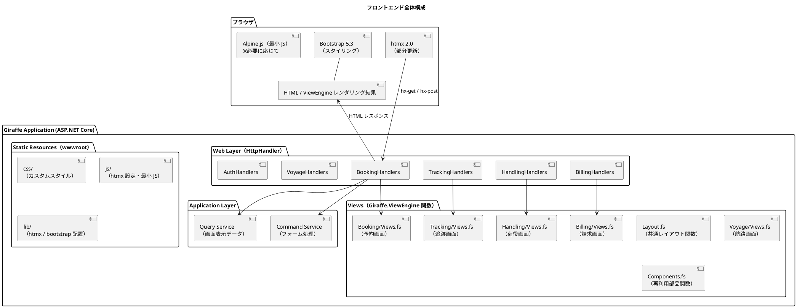
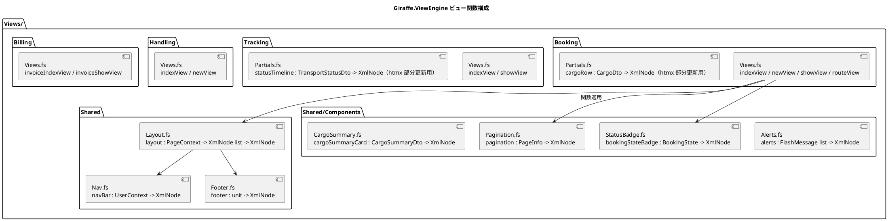
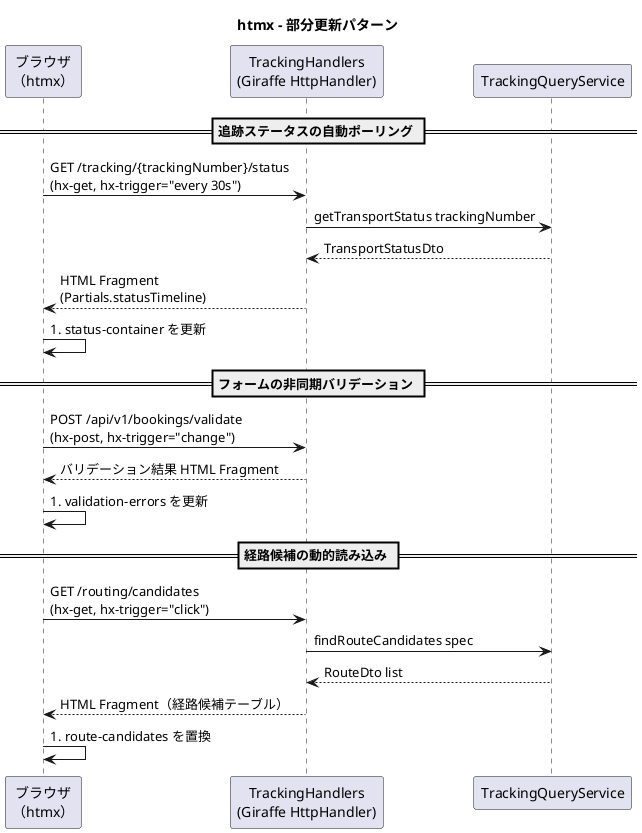
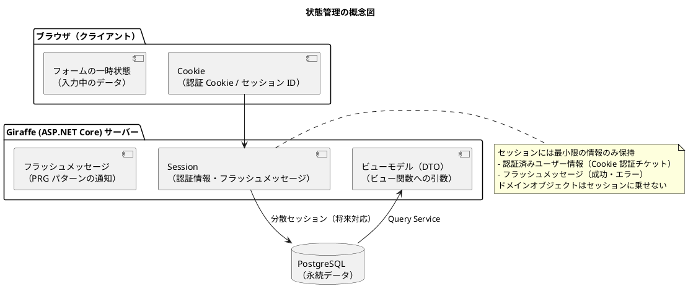

# フロントエンドアーキテクチャ - 国際貨物輸送管理システム

## 概要

本ドキュメントでは、国際貨物輸送管理システムのフロントエンドアーキテクチャを定義します。
業務系 Web システムとして、**Giraffe.ViewEngine（F# の関数型 HTML DSL）による SSR（サーバーサイドレンダリング）** を基本とし、
部分的な動的更新に **htmx 2.0** を組み合わせることで、シンプルかつ保守性の高い UI を実現します。

## アーキテクチャパターン選択

### SSR + htmx の選定理由

| 評価軸 | SPA（React/Vue） | **SSR + htmx（採用）** |
| :--- | :--- | :--- |
| 実装複雑度 | 高（フロントエンドビルドパイプライン、状態管理が必要） | **低**（Giraffe アプリに統合、追加ビルド不要） |
| SEO / アクセシビリティ | 追加対応が必要 | **容易**（HTML がサーバーで生成される） |
| リアルタイム更新 | 容易（WebSocket / SSE） | **htmx で部分更新**（十分な要件を満たす） |
| 開発者体験（バックエンド重視） | フロント専門知識が必要 | **F# エンジニアが一貫して開発可能** |
| 初期表示速度 | 遅い（JS バンドルの読み込み） | **速い**（HTML を直接レスポンス） |
| 型安全性 | テンプレートと分離しがち | **ビューも F# の関数・型で検査される** |

本システムは業務系 Web アプリケーションであり、画面数は限定的で、リアルタイム更新要件も荷物追跡ステータスの部分更新が主です。
SPA の複雑さを導入するメリットがなく、Giraffe（ASP.NET Core 上の F# Web フレームワーク）との統合が容易な **Giraffe.ViewEngine + htmx** を採用します。

Razor（.cshtml）ではなく Giraffe.ViewEngine を採用する理由は次のとおりです。

| 観点 | Razor | **Giraffe.ViewEngine（採用）** |
| :--- | :--- | :--- |
| 言語 | C# + テンプレート構文 | **F# のみ**（テンプレート言語不要） |
| 型検査 | ランタイム/ビルド時（Razor コンパイル） | **通常の F# コンパイル**でビュー全体を検査 |
| 部品化 | パーシャルビュー・タグヘルパー | **関数合成**（部分ビュー = 関数） |
| ロジックの混入 | テンプレート内に C# が書ける（濫用リスク） | 関数の引数（ビューモデル）に閉じる |
| リファクタリング | 文字列参照が残りやすい | **リネーム・シグネチャ変更がコンパイラで追跡可能** |

## 全体構成



## 静的アセット管理

LibMan は使用せず、次のいずれかで管理します。

| 方式 | 内容 | 採用判断 |
| :--- | :--- | :--- |
| **wwwroot 直接配置（採用）** | htmx 2.0 / Bootstrap 5.3 の配布ファイルを `wwwroot/lib/` にコミットして配置 | 依存が 2 つと少なく、ビルドパイプライン不要でシンプル |
| npm 管理 | `package.json` で管理し、ビルド時に `wwwroot/lib/` へコピー | 依存が増えた場合・バージョン更新を自動化したい場合に移行 |

`app.UseStaticFiles()`（Giraffe では `UseStaticFiles` ミドルウェア）で `wwwroot` を配信します。

## 画面構成

画面一覧・画面遷移図・各画面のワイヤーフレームは [UI 設計](ui_design.md) を正とし、本ドキュメントでは重複して定義しません。

- 画面一覧（URL 設計・アクター）: [UI 設計 - 画面一覧](ui_design.md#画面一覧)
- 画面遷移図: [UI 設計 - 画面遷移図](ui_design.md#画面遷移図)
- 各画面のワイヤーフレーム・仕様: [UI 設計 - 画面詳細設計](ui_design.md#画面詳細設計)

本ドキュメントは、これらの画面を実現するための技術構成（ビュー関数構成・htmx パターン・状態管理・セキュリティ）を定義します。

## コンポーネント設計方針

### ビュー関数構成

Giraffe.ViewEngine では、すべてのビューは `XmlNode`（または `XmlNode list`）を返す **F# の純粋関数** です。
レイアウト・ページ・部分ビューを関数合成で組み立てます。



### レイアウト関数

Razor の `_Layout.cshtml` + `_ViewStart.cshtml` に相当するものは、単なる関数適用で表現します。

```fsharp
module CargoTracker.Web.Views.Layout

open Giraffe.ViewEngine

type PageContext =
    { Title: string
      User: UserContext option
      Flash: FlashMessage list
      CsrfToken: string }

/// 共通レイアウト。各ページはコンテンツ（XmlNode list）を渡して合成する
let layout (ctx: PageContext) (content: XmlNode list) : XmlNode =
    html [ _lang "ja" ] [
        head [] [
            meta [ _charset "utf-8" ]
            meta [ _name "viewport"; _content "width=device-width, initial-scale=1" ]
            meta [ _name "_csrf"; _content ctx.CsrfToken ]
            title [] [ str $"{ctx.Title} - CargoTracker" ]
            link [ _rel "stylesheet"; _href "/lib/bootstrap/bootstrap.min.css" ]
            link [ _rel "stylesheet"; _href "/css/custom.css" ]
        ]
        body [] [
            Nav.navBar ctx.User
            main [ _id "main-content"; _class "container-fluid py-3" ] [
                yield Alerts.alerts ctx.Flash
                yield! content
            ]
            Footer.footer ()
            script [ _src "/lib/htmx/htmx.min.js" ] []
            script [ _src "/lib/bootstrap/bootstrap.bundle.min.js" ] []
            script [ _src "/js/app.js" ] []
        ]
    ]
```

### ビュー設計原則

| 原則 | 内容 |
| :--- | :--- |
| **レイアウトは関数合成** | 各ページビューは `layout ctx [ ... ]` の適用でレイアウトを継承します。暗黙のレイアウト解決（`_ViewStart` 相当）は行いません |
| **部分ビュー = 関数** | 再利用可能な UI 部品は `Shared/Components` のモジュール関数（`DTO -> XmlNode`）として切り出します |
| **htmx 用部分ビュー関数** | 部分更新対象の HTML はページビューとハンドラの両方から呼べる独立関数（`Partials.statusTimeline` 等）として定義し、ハンドラから `htmlView` で直接返します |
| **ViewComponent 相当も関数** | Razor の ViewComponent に相当するサーバーサイドロジック付き部品は「Query 結果の DTO を受け取る純関数」+「DTO を組み立てるハンドラ側の合成」で表現します |
| **型安全フォーム** | フォームはフォームモデル型（レコード）とフィールド名を対応付けるヘルパー関数で表現し、`ctx.BindFormAsync<'T>()` でバインドします（後述） |
| **DTO の使用** | ビュー関数に渡すデータは Query Service からの DTO（ビューモデル）を使用します。ドメインモデルを直接渡しません |

### 型安全フォーム

Razor Tag Helper（`asp-for`）の代替として、フォームモデル型のプロパティ名と `name` 属性の対応をヘルパー関数で一元化します。

```fsharp
module CargoTracker.Web.Views.Form

open Giraffe.ViewEngine

/// バリデーションエラー（フィールド名 -> メッセージ）
type ValidationErrors = Map<string, string list>

/// ラベル + input + エラー表示をまとめた型安全フィールド
let textField (name: string) (label': string) (value: string) (errors: ValidationErrors) =
    let hasError = errors.ContainsKey name
    div [ _class "mb-3" ] [
        label [ _class "form-label"; _for name ] [ str label' ]
        input [ _type "text"; _id name; _name name; _value value
                _class (if hasError then "form-control is-invalid" else "form-control") ]
        match errors.TryFind name with
        | Some msgs ->
            div [ _class "invalid-feedback d-block"; _roleAlert ] [
                for m in msgs -> str m ]
        | None -> ()
    ]
```

フィールド名の文字列化には `nameof` を使い、フォームモデルとの対応をコンパイル時に保ちます。

```fsharp
// フォームモデル（Giraffe のモデルバインディング対象）
[<CLIMutable>]
type BookCargoForm =
    { Origin: string
      Destination: string
      ArrivalDeadline: string
      CargoType: string
      WeightKg: decimal }

// ビュー側：nameof でフィールド名を参照（リネーム安全）
Form.textField (nameof Unchecked.defaultof<BookCargoForm>.Origin)
               "出発地（港コード）" form.Origin errors
```

## htmx による動的更新

### htmx 適用パターン



### htmx 使用ガイドライン

| ユースケース | htmx 属性 | 説明 |
| :--- | :--- | :--- |
| **フォーム送信（非同期）** | `hx-post`, `hx-target`, `hx-swap` | フォーム送信後に特定領域のみ更新 |
| **ステータスポーリング** | `hx-get`, `hx-trigger="every 30s"` | 追跡ステータスを定期取得（終端状態ではサーバーが HTTP 286 を返して停止。後述） |
| **インクリメンタル検索** | `hx-get`, `hx-trigger="input changed delay:300ms"` | 検索フォームの入力に応じて結果を更新 |
| **確認ダイアログ** | `hx-confirm` | 削除・キャンセル操作前の確認ポップアップ |
| **ローディング表示** | `hx-indicator` | リクエスト中のスピナー表示 |
| **ページネーション** | `hx-get`, `hx-target` | ページ切り替えを部分更新で実現 |

Giraffe.ViewEngine には htmx 属性のビルトインヘルパーはないため、`attr` で共通ヘルパーを定義して使用します。

```fsharp
module CargoTracker.Web.Views.Htmx

open Giraffe.ViewEngine

let _hxGet      = attr "hx-get"
let _hxPost     = attr "hx-post"
let _hxTarget   = attr "hx-target"
let _hxSwap     = attr "hx-swap"
let _hxTrigger  = attr "hx-trigger"
let _hxConfirm  = attr "hx-confirm"
let _hxIndicator = attr "hx-indicator"
let _hxPushUrl  = attr "hx-push-url"
```

### htmx ハンドラ設計

htmx からのリクエストは `HX-Request: true` ヘッダーで識別します。
通常のページリクエストと htmx リクエストを同一エンドポイントで処理する場合は、
部分ビュー関数のみを返すか全ページを返すかをヘッダーで判定します。

```fsharp
module CargoTracker.Web.Handlers.Tracking

open Giraffe
open Giraffe.ViewEngine

let private isHtmxRequest (ctx: HttpContext) =
    ctx.TryGetRequestHeader "HX-Request" = Some "true"

/// GET /tracking/{trackingNumber}/status
let getTrackingStatus (trackingNumber: string) : HttpHandler =
    fun next ctx ->
        task {
            let queryService = ctx.GetService<ITrackingQueryService>()
            let! status = queryService.GetStatus trackingNumber

            match status with
            | None ->
                return! (setStatusCode 404 >=> htmlView (Views.Errors.notFound ())) next ctx
            | Some dto when isHtmxRequest ctx ->
                // htmx リクエストの場合は部分ビュー関数のみ返す
                // 終端状態（CLAIMED / DELIVERED / CANCELLED）なら HTTP 286 でポーリングを停止させる
                let statusCode' = if TransportStatus.isTerminal dto.Status then 286 else 200
                return! (setStatusCode statusCode'
                         >=> htmlView (Views.Tracking.Partials.statusTimeline dto)) next ctx
            | Some dto ->
                let pageCtx = PageContext.from ctx $"追跡詳細 {trackingNumber}"
                return! htmlView (Views.Tracking.showView pageCtx dto) next ctx
        }

/// ルーティング定義（抜粋）
let routes : HttpHandler =
    choose [
        GET >=> routef "/tracking/%s/status" getTrackingStatus
        GET >=> routef "/tracking/%s" showTracking
        GET >=> route "/tracking" >=> trackingIndex
    ]
```

### ポーリングの停止条件（HTTP 286）

`hx-trigger="every 30s"` によるステータスポーリングは、貨物が終端状態（`CLAIMED` / `DELIVERED` / `CANCELLED`）に達したら停止します。
実現方法は **サーバーが終端状態時に HTTP 286 でフラグメントを返す** 方式に統一します。
htmx はステータスコード 286 のレスポンスを受け取ると当該要素のポーリングを停止する仕様のため、クライアント側の追加 JS は不要です。

| 状態 | サーバーレスポンス | クライアント挙動 |
| :--- | :--- | :--- |
| 非終端状態 | `200` + タイムラインフラグメント | 30 秒後に再ポーリング |
| 終端状態（CLAIMED / DELIVERED / CANCELLED） | `286` + タイムラインフラグメント | フラグメントを反映し、以降のポーリングを停止 |

### ポーリングと aria-live

ポーリングでタイムライン全体を `aria-live` 領域として差し替えると、更新のたびにスクリーンリーダーが全履歴を再読み上げしてしまいます。
`aria-live="polite"` は最新イベント 1 件のみを描画する差分領域（`#latest-event`、`aria-atomic="true"`）に付与し、読み上げを最新 1 件の差分に絞ります。
タイムライン本体（ポーリング対象の `#status-timeline`）には `aria-live` を付与しません（具体例は [UI 設計 - アクセシビリティ](ui_design.md#アクセシビリティ) を参照）。

## 状態管理

### サーバーサイド状態管理

SSR アーキテクチャでは、アプリケーション状態はサーバー側で管理します。
ブラウザ側では最小限のセッション情報のみを保持します。



Giraffe には Razor の `TempData` 相当のビルトインはないため、フラッシュメッセージは
ASP.NET Core の Session（`ctx.Session`）に書き込み、レイアウト関数が読み取り時に削除する
小さな `Flash` モジュールとして実装します。

```fsharp
module CargoTracker.Web.Flash

open Microsoft.AspNetCore.Http

let private key = "flash"

let set (ctx: HttpContext) (level: string) (message: string) =
    ctx.Session.SetString(key, $"{level}:{message}")

/// 読み取りと同時に削除（1 回限りの表示）
let pop (ctx: HttpContext) : FlashMessage list =
    match ctx.Session.GetString key with
    | null -> []
    | value ->
        ctx.Session.Remove key
        FlashMessage.parse value
```

### PRG パターン（Post-Redirect-Get）

フォーム送信後は必ず PRG パターンを適用し、ブラウザのリロードによる二重送信を防ぎます。

| 操作 | フロー |
| :--- | :--- |
| 予約登録成功 | `POST /bookings` → `redirectTo false $"/bookings/{bookingId}"` |
| 荷役登録成功 | `POST /handling` → `redirectTo false "/handling"` |
| 経路割り当て成功 | `POST /bookings/{id}/route` → `redirectTo false $"/bookings/{id}"` |

成功・エラーメッセージは `Flash.set` で渡し、`Shared/Components/Alerts.fs` の
`alerts` 関数（レイアウト経由で全ページに合成）で表示します。

```fsharp
/// POST /bookings
let createBooking : HttpHandler =
    fun next ctx ->
        task {
            let! form = ctx.BindFormAsync<BookCargoForm>()
            match BookCargoForm.validate form with
            | Error errors ->
                // エラー時は同画面を再描画（ステータス 422）
                let pageCtx = PageContext.from ctx "貨物予約登録"
                return! (setStatusCode 422
                         >=> htmlView (Views.Booking.newView pageCtx form errors)) next ctx
            | Ok command ->
                let service = ctx.GetService<IBookingCommandService>()
                let! bookingId = service.BookCargo command
                Flash.set ctx "success" $"貨物予約 {bookingId} を登録しました"
                return! redirectTo false $"/bookings/{bookingId}" next ctx
        }
```

## セキュリティ考慮

### CSRF 対策

ASP.NET Core の Antiforgery サービスを Giraffe から利用します。
フォームビュー関数には Antiforgery トークンの hidden フィールドを埋め込むヘルパーを用意します。

```fsharp
module CargoTracker.Web.Views.Csrf

open Giraffe.ViewEngine

/// Antiforgery トークンの hidden input（form 内に必ず含める）
let antiforgeryInput (token: string) =
    input [ _type "hidden"; _name "__RequestVerificationToken"; _value token ]
```

ハンドラ側では `IAntiforgery.ValidateRequestAsync` を呼ぶ検証ハンドラを `POST` 系ルートに合成します。

```fsharp
let validateAntiforgery : HttpHandler =
    fun next ctx ->
        task {
            let af = ctx.GetService<IAntiforgery>()
            let! isValid = af.IsRequestValidAsync ctx
            if isValid then return! next ctx
            else return! (setStatusCode 400 >=> text "Invalid CSRF token") earlyReturn ctx
        }

// ルーティングへの適用
POST >=> route "/bookings" >=> validateAntiforgery >=> createBooking
```

htmx の `hx-post` / `hx-put` / `hx-delete` 使用時は、レイアウト関数が出力する
`<meta name="_csrf">` からトークンを読み取り、リクエストヘッダーに自動付与します。

```javascript
// wwwroot/js/app.js
document.addEventListener('htmx:configRequest', (event) => {
  const csrfToken = document.querySelector('meta[name="_csrf"]').content;
  event.detail.headers['RequestVerificationToken'] = csrfToken;
});
```

### 入力検証

フォームの入力検証は 2 段階で行います。

| 段階 | 実装 | 内容 |
| :--- | :--- | :--- |
| **クライアントサイド** | HTML5 / Bootstrap バリデーション | `required`, `pattern` 属性による即時フィードバック |
| **サーバーサイド** | F# のバリデーション関数（`Result` 型） | `Form -> Result<Command, ValidationErrors>` によるビジネスルール検証 |

サーバーサイドバリデーションは DataAnnotations ではなく、フォームモデルを検証して
`Result<Command, ValidationErrors>` を返す純関数として実装します。
エラーは前述の `Form.textField` がフィールドごとに表示します。

```fsharp
module BookCargoForm =
    let validate (form: BookCargoForm) : Result<BookCargoCommand, ValidationErrors> =
        let errors =
            [ if not (UnLocode.isValid form.Origin) then
                  nameof form.Origin, "出発地は UN/LOCODE 形式（5 文字）で入力してください"
              if not (UnLocode.isValid form.Destination) then
                  nameof form.Destination, "目的地は UN/LOCODE 形式（5 文字）で入力してください"
              if form.WeightKg <= 0m then
                  nameof form.WeightKg, "重量は 1 kg 以上で入力してください" ]
        if List.isEmpty errors then Ok (BookCargoCommand.from form)
        else Error (ValidationErrors.ofList errors)
```

### XSS 対策

Giraffe.ViewEngine の `str` 関数は HTML エスケープを自動的に行います。
エスケープなしで HTML を出力する `rawText` は原則として使用しません（htmx / Bootstrap の
静的スクリプトタグ等、信頼できる固定文字列に限定します）。
ユーザー入力を HTML として出力する要件が生じた場合は、DOMPurify 等でサニタイズします。

## ディレクトリ構成

```
apps/backend/src/CargoTracker.Web/
├── Handlers/
│   ├── BookingHandlers.fs               # 画面 + htmx 部分更新ハンドラ
│   ├── TrackingHandlers.fs
│   ├── HandlingHandlers.fs
│   ├── BillingHandlers.fs
│   ├── VoyageHandlers.fs
│   └── AuthHandlers.fs
│
├── Views/
│   ├── Shared/
│   │   ├── Layout.fs                    # layout : PageContext -> XmlNode list -> XmlNode
│   │   ├── Nav.fs                       # ナビゲーション
│   │   ├── Footer.fs                    # フッター
│   │   └── Components/
│   │       ├── Alerts.fs                # フラッシュメッセージ
│   │       ├── Pagination.fs            # ページネーション
│   │       ├── StatusBadge.fs           # ステータスバッジ
│   │       └── Form.fs                  # 型安全フォームフィールド
│   ├── Htmx.fs                          # hx-* 属性ヘルパー
│   ├── Booking/
│   │   ├── Views.fs                     # indexView / newView / showView / routeView
│   │   └── Partials.fs                  # cargoRow（htmx 部分更新用）
│   ├── Tracking/
│   │   ├── Views.fs
│   │   └── Partials.fs                  # statusTimeline（htmx 部分更新用）
│   ├── Handling/
│   │   └── Views.fs
│   ├── Billing/
│   │   └── Views.fs
│   └── Auth/
│       └── Views.fs                     # loginView
│
├── Flash.fs                             # フラッシュメッセージ（Session ベース）
├── Router.fs                            # choose によるルーティング合成
├── Program.fs                           # ホスト構築・ミドルウェア設定
│
└── wwwroot/
    ├── css/
    │   └── custom.css                   # カスタムスタイル（Bootstrap 上書き）
    ├── js/
    │   └── app.js                       # htmx 設定（CSRF ヘッダー等）・最小 JS
    ├── lib/
    │   ├── htmx/htmx.min.js             # htmx 2.0（直接配置）
    │   └── bootstrap/                   # Bootstrap 5.3（直接配置）
    └── images/
```

F# プロジェクトはファイル順序がコンパイル順序を決めるため、`.fsproj` では
`Htmx.fs` → `Shared/Components/*.fs` → `Shared/Layout.fs` → 各コンテキストの `Partials.fs` → `Views.fs` → `Handlers/*.fs` → `Router.fs` → `Program.fs`
の順に並べ、ビュー関数がハンドラより先にコンパイルされるようにします。
