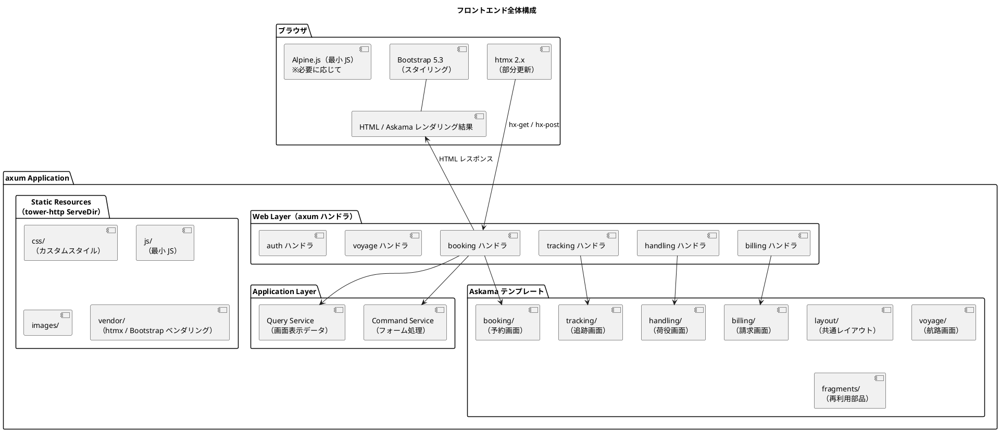
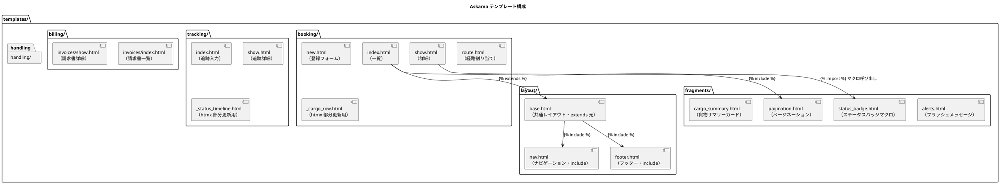
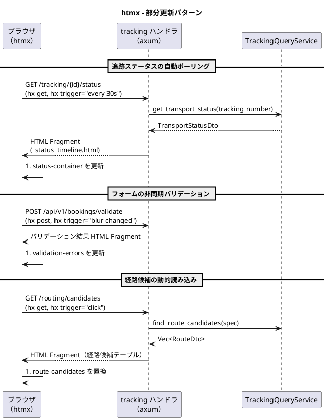
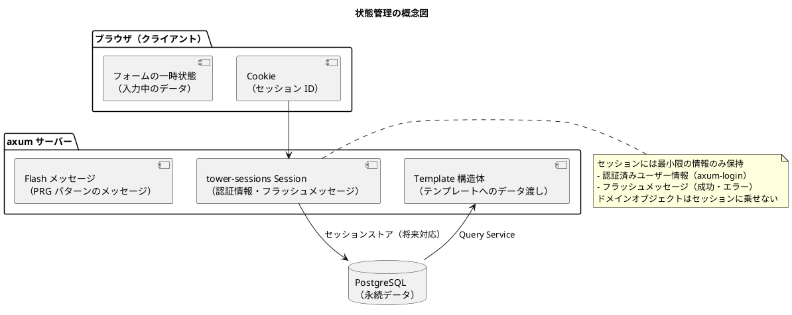

# フロントエンドアーキテクチャ - 国際貨物輸送管理システム

## 概要

本ドキュメントでは、国際貨物輸送管理システムのフロントエンドアーキテクチャを定義する。
業務系 Web システムとして、**Askama による SSR（サーバーサイドレンダリング）** を基本とし、
部分的な動的更新に **htmx 2.x** を組み合わせることで、シンプルかつ保守性の高い UI を実現する。

## アーキテクチャパターン選択

### SSR + htmx の選定理由

| 評価軸 | SPA（React/Vue） | **SSR + htmx（採用）** |
| :--- | :--- | :--- |
| 実装複雑度 | 高（フロントエンドビルドパイプライン、状態管理が必要） | **低**（axum アプリケーションに統合、追加ビルド不要） |
| SEO / アクセシビリティ | 追加対応が必要 | **容易**（HTML がサーバーで生成される） |
| リアルタイム更新 | 容易（WebSocket / SSE） | **htmx で部分更新**（十分な要件を満たす） |
| 開発者体験（バックエンド重視） | フロント専門知識が必要 | **Rust エンジニアが一貫して開発可能** |
| 初期表示速度 | 遅い（JS バンドルの読み込み） | **速い**（HTML を直接レスポンス） |
| テンプレートの型安全性 | TypeScript による型検査 | **Askama がコンパイル時にテンプレートを型検査** |

本システムは業務系 Web アプリケーションであり、画面数は限定的で、リアルタイム更新要件も荷物追跡ステータスの部分更新が主である。
SPA の複雑さを導入するメリットがなく、axum との統合が容易でコンパイル時型検査による安全性を持つ **Askama + htmx** を採用する。

## 全体構成



## 画面構成

画面一覧・画面遷移図・ワイヤーフレーム・インタラクション設計の詳細は [UI 設計](ui_design.md) を参照すること。

- 画面一覧（24 画面・URL パス・アクター）: [UI 設計 - 画面一覧](ui_design.md#画面一覧)
- 画面遷移図: [UI 設計 - 画面遷移図](ui_design.md#画面遷移図)

本ドキュメントでは、画面を実現するテンプレート構成・htmx 適用パターン・状態管理などのアーキテクチャ方針のみを扱う。

## コンポーネント設計方針

### Askama テンプレート構成



### Askama テンプレート設計原則

| 原則 | 内容 |
| :--- | :--- |
| **レイアウト継承** | `` で共通レイアウトを適用し、`` で画面固有部分を差し替える |
| **フラグメント分離** | 再利用可能な UI 部品は `fragments/` に切り出し、`` または ` + マクロ` で利用する |
| **htmx 用テンプレート** | 部分更新対象の HTML は `_prefix` 付きの独立テンプレート（専用 Template 構造体）として定義する |
| **テンプレート構造体** | 画面ごとに `#[derive(Template)]` を付与した Rust 構造体を定義し、コンパイル時に変数・型を検査する |
| **フォームオブジェクト** | フォームデータは `serde::Deserialize` を実装した専用のフォーム構造体（`BookCargoForm`）で受け取る |
| **DTO の使用** | テンプレートに渡すデータは Query Service からの DTO（ビューモデル）を使用する。ドメインモデルを直接渡さない |

### Askama テンプレートと Rust 構造体の対応例

レイアウト継承の基本形を示す。

```html
{# templates/layout/base.html #}
<!DOCTYPE html>
<html lang="ja">
<head>
  <meta charset="utf-8">
  <title>CargoTracker</title>
  <link rel="stylesheet" href="/static/vendor/bootstrap/bootstrap.min.css">
</head>
<body>
  
  <main id="main-content" class="container-fluid">
    
  </main>
  
  <script src="/static/vendor/htmx/htmx.min.js"></script>
  <script src="/static/js/app.js"></script>
</body>
</html>
```

```html
{# templates/booking/index.html #}


貨物予約一覧 - CargoTracker


<h1>貨物予約一覧</h1>

<div id="booking-list">
  
  <tr>
    <td>{{ booking.booking_id }}</td>
    <td>{{ booking.origin }}</td>
    <td>{{ booking.destination }}</td>
  </tr>
  
</div>


```

対応する Rust 構造体と axum ハンドラを定義する。

```rust
use askama::Template;

#[derive(Template)]
#[template(path = "booking/index.html")]
pub struct BookingIndexTemplate {
    pub bookings: Vec<BookingSummaryDto>,
    pub page: PageInfo,
    pub current_user: CurrentUser, // ロール別 UI 制御に使用
}

pub async fn index(
    auth_session: AuthSession, // axum-login
    Query(params): Query<BookingSearchParams>,
    State(state): State<AppState>,
) -> Result<impl IntoResponse, AppError> {
    let bookings = state.booking_query_service.search(&params).await?;
    let template = BookingIndexTemplate {
        bookings,
        page: params.page_info(),
        current_user: auth_session.into_current_user(),
    };
    Ok(Html(template.render()?))
}
```

### ロール別 UI 制御（Thymeleaf `sec:authorize` の代替）

axum-login のユーザー情報（ロール）をテンプレートコンテキスト（`current_user`）として渡し、
Askama の条件分岐で表示制御する。

```html
{# ROLE_SALES のみ新規登録ボタンを表示 #}

<a href="/bookings/new" class="btn btn-primary">+ 新規予約登録</a>

```

```rust
pub struct CurrentUser {
    pub username: String,
    pub roles: Vec<Role>,
}

impl CurrentUser {
    pub fn has_role(&self, role: &str) -> bool {
        self.roles.iter().any(|r| r.as_str() == role)
    }
}
```

ナビゲーションのメニュー項目も同じ仕組みで `layout/nav.html` 内の条件分岐により制御する。

## htmx による動的更新

### htmx 適用パターン



### htmx 使用ガイドライン

| ユースケース | htmx 属性 | 説明 |
| :--- | :--- | :--- |
| **フォーム送信（非同期）** | `hx-post`, `hx-target`, `hx-swap` | フォーム送信後に特定領域のみ更新 |
| **ステータスポーリング** | `hx-get`, `hx-trigger="every 30s"` | 追跡ステータスを定期取得 |
| **インラインバリデーション** | `hx-post`, `hx-trigger="blur changed"` | 業務フォームの項目単位検証。過剰発火を避けるため `blur changed` に統一（`change` トリガーは使用しない） |
| **インクリメンタル検索** | `hx-get`, `hx-trigger="input changed delay:300ms"` | 検索フォームの入力に応じて結果を更新 |
| **確認ダイアログ** | `hx-confirm` | 削除・キャンセル操作前の確認ポップアップ |
| **ローディング表示** | `hx-indicator` | リクエスト中のスピナー表示 |
| **ページネーション** | `hx-get`, `hx-target` | ページ切り替えを部分更新で実現 |

### htmx ハンドラ設計

htmx からのリクエストは `HX-Request: true` ヘッダーで識別する。
通常のページリクエストと htmx リクエストを同一エンドポイントで処理する場合は、
フラグメントテンプレートを返すか全ページテンプレートを返すかをヘッダーで判定する。

```rust
use axum::http::HeaderMap;

#[derive(Template)]
#[template(path = "tracking/_status_timeline.html")]
struct StatusTimelineFragment {
    status: TransportStatusDto,
}

#[derive(Template)]
#[template(path = "tracking/show.html")]
struct TrackingShowTemplate {
    status: TransportStatusDto,
    current_user: CurrentUser,
    // ... 画面全体のデータ
}

pub async fn get_tracking_status(
    Path(tracking_number): Path<String>,
    headers: HeaderMap,
    auth_session: AuthSession,
    State(state): State<AppState>,
) -> Result<impl IntoResponse, AppError> {
    let status = state.tracking_query_service.get_status(&tracking_number).await?;

    // htmx リクエストの場合はフラグメントのみ返す
    if headers.get("HX-Request").is_some() {
        let fragment = StatusTimelineFragment { status };
        return Ok(Html(fragment.render()?).into_response());
    }

    let template = TrackingShowTemplate {
        status,
        current_user: auth_session.into_current_user(),
        // ...
    };
    Ok(Html(template.render()?).into_response())
}
```

## 状態管理

### サーバーサイド状態管理

SSR アーキテクチャでは、アプリケーション状態はサーバー側で管理する。
ブラウザ側では最小限のセッション情報のみを保持する。



### PRG パターン（Post-Redirect-Get）

フォーム送信後は必ず PRG パターンを適用し、ブラウザのリロードによる二重送信を防ぐ。

| 操作 | フロー |
| :--- | :--- |
| 予約登録成功 | `POST /bookings` → `Redirect::to("/bookings/{booking_id}")` |
| 荷役登録成功 | `POST /handling` → `Redirect::to("/handling")` |
| 経路割り当て成功 | `POST /bookings/{id}/route` → `Redirect::to("/bookings/{id}")` |

成功・エラーメッセージは axum-messages（または tower-sessions ベースの Flash 実装）で
セッションに一時保存し、リダイレクト先の画面で `fragments/alerts.html` を通じて表示する。

```rust
pub async fn create_booking(
    messages: Messages, // axum-messages
    State(state): State<AppState>,
    Form(form): Form<BookCargoForm>,
) -> Result<impl IntoResponse, AppError> {
    let booking_id = state.booking_command_service.book_cargo(form.try_into()?).await?;
    messages.success(format!("貨物予約 {} を登録しました", booking_id));
    Ok(Redirect::to(&format!("/bookings/{}", booking_id)))
}
```

## セキュリティ考慮

### CSRF 対策

CSRF 保護はミドルウェア（`axum_csrf` 等）で行い、フォームに hidden フィールドとして
CSRF トークンを明示的に埋め込む。Askama テンプレートにはトークンをコンテキストで渡す。

```html
{# フォームに CSRF トークンを埋め込む #}
<form action="/bookings" method="post">
  <input type="hidden" name="csrf_token" value="{{ csrf_token }}">
  <!-- 入力フィールド -->
</form>
```

htmx の `hx-post` / `hx-put` / `hx-delete` 使用時は、CSRF トークンをリクエストヘッダーに含める。

```html
{# meta タグに CSRF トークンを埋め込む #}
<meta name="_csrf" content="{{ csrf_token }}">

<!-- htmx のグローバル設定で CSRF ヘッダーを自動送信 -->
<script>
  document.addEventListener('htmx:configRequest', (event) => {
    const csrfToken = document.querySelector('meta[name="_csrf"]').content;
    event.detail.headers['X-CSRF-Token'] = csrfToken;
  });
</script>
```

### 入力検証

フォームの入力検証は 2 段階で行う。

| 段階 | 実装 | 内容 |
| :--- | :--- | :--- |
| **クライアントサイド** | HTML5 / Bootstrap バリデーション | `required`, `pattern` 属性による即時フィードバック |
| **サーバーサイド** | validator クレート（`#[derive(Validate)]`） | フォーム構造体への検証属性で詳細なビジネスルール検証 |

サーバーサイドバリデーションエラーはフィールド名 → エラーメッセージのマップとして
テンプレート構造体に渡し、Askama の条件分岐でフィールドごとにエラーメッセージを表示する。

```rust
#[derive(Debug, serde::Deserialize, validator::Validate)]
pub struct BookCargoForm {
    #[validate(length(equal = 5, message = "港コードは 5 文字で入力してください"))]
    pub origin: String,
    #[validate(length(equal = 5, message = "港コードは 5 文字で入力してください"))]
    pub destination: String,
    #[validate(range(min = 1, message = "重量は 1 以上で入力してください"))]
    pub weight: u32,
    // ...
}
```

```html
<input type="text" id="origin" name="origin" value="{{ form.origin }}"
       class="form-control is-invalid">

<div class="invalid-feedback">{{ msg }}</div>

```

### XSS 対策

Askama は `{{ }}` による出力を既定で HTML エスケープする。
エスケープを無効化する `|safe` フィルタは原則として使用しない。
ユーザー入力を HTML として出力する場合は、ammonia 等でサニタイズする。

## 静的ファイル配信

htmx・Bootstrap は WebJars の代替として、ローカルベンダリング（`static/vendor/` に配置）
または CDN 参照で提供する。オフライン環境・バージョン固定の観点からローカルベンダリングを基本とする。

```rust
use tower_http::services::ServeDir;

let app = Router::new()
    .merge(page_routes())
    .nest_service("/static", ServeDir::new("apps/backend/static"));
```

## ディレクトリ構成

```
apps/backend/
├── src/
│   ├── booking/
│   │   └── infrastructure/
│   │       └── web/
│   │           ├── booking_handler.rs       # Askama 画面用ハンドラ
│   │           └── booking_api_handler.rs   # htmx / API 用ハンドラ
│   ├── tracking/
│   │   └── infrastructure/
│   │       └── web/
│   │           └── tracking_handler.rs
│   └── (各コンテキスト同様)
│
├── templates/                          # Askama テンプレート（コンパイル時に埋め込み）
│   ├── layout/
│   │   ├── base.html                   # 共通レイアウト（extends 元）
│   │   └── nav.html                    # ナビゲーション
│   ├── fragments/
│   │   ├── alerts.html                 # フラッシュメッセージ
│   │   ├── pagination.html             # ページネーション
│   │   └── status_badge.html           # ステータスバッジ（マクロ）
│   ├── booking/
│   │   ├── index.html
│   │   ├── new.html
│   │   ├── show.html
│   │   ├── route.html
│   │   └── _cargo_row.html             # htmx 部分更新用テンプレート
│   ├── tracking/
│   │   ├── index.html
│   │   ├── show.html
│   │   └── _status_timeline.html       # htmx 部分更新用テンプレート
│   ├── handling/
│   │   ├── index.html
│   │   └── new.html
│   ├── billing/
│   │   └── invoices/
│   │       ├── index.html
│   │       └── show.html
│   └── auth/
│       └── login.html
└── static/                             # tower-http ServeDir で配信
    ├── css/
    │   └── custom.css                  # カスタムスタイル（Bootstrap 上書き）
    ├── js/
    │   └── app.js                      # htmx 設定・最小 JS
    ├── vendor/
    │   ├── bootstrap/                  # Bootstrap 5.3（ローカルベンダリング）
    │   └── htmx/                       # htmx 2.x（ローカルベンダリング）
    └── images/
```
