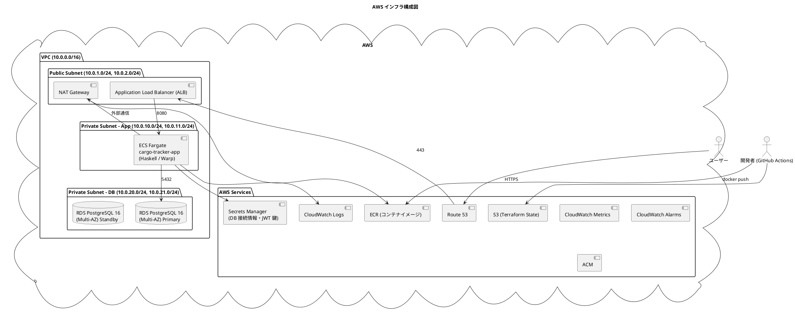
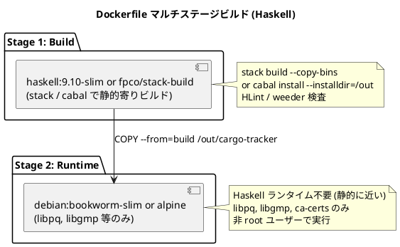
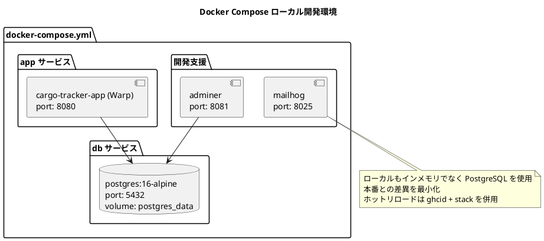
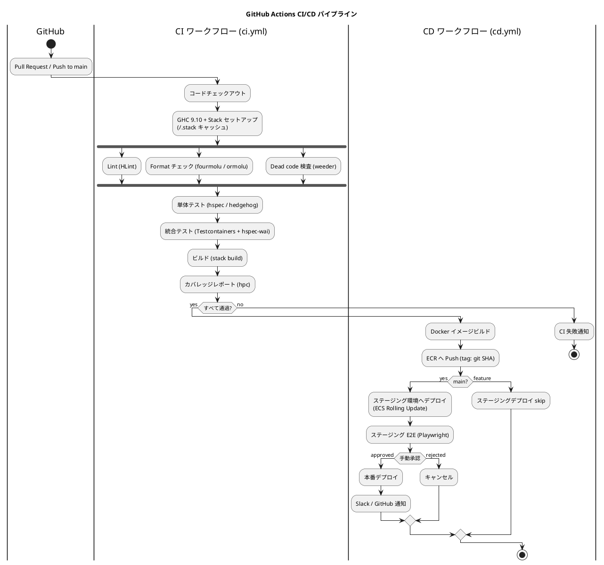
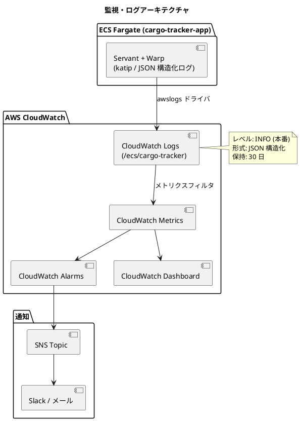
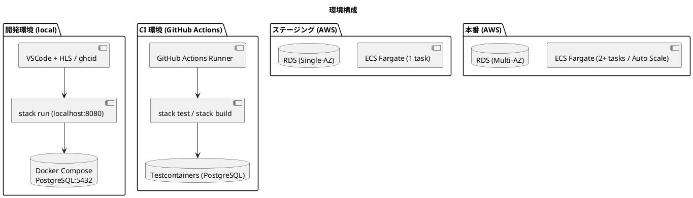
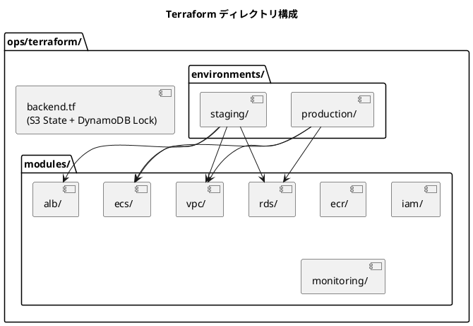

# インフラアーキテクチャ - 国際貨物輸送管理システム (Haskell 版)

## 概要

コンテナ化された Servant (Warp) アプリケーション (Haskell GHC 9.x) を **AWS ECS Fargate** 上で稼働させ、
**RDS PostgreSQL 16** でデータを永続化する。
**Terraform** によるインフラ IaC と **GitHub Actions** による CI/CD を整備する。

Java / Scala 版と AWS 構成・ネットワーク・監視設計は共通とし、差分は以下に集約される。

- ビルドツール: **Stack または Cabal** (Coursier の代わりに Stack の `~/.stack` / Cabal の `~/.cabal/store` をキャッシュ)
- ランタイム: **JVM 不要**。Haskell ネイティブバイナリを Alpine Linux 上で実行
- ヘルスチェック: 自作 `/health` エンドポイント (DB 疎通含む)
- 静的解析: HLint / weeder / 自作 import 規約チェッカ

## インフラ構成図



> Servant + Warp のデフォルト HTTP ポートは任意設定可能。本システムでは **8080** を使用する。
> ALB ターゲットグループのポートも 8080 に合わせる。

## コンテナ化戦略

### Dockerfile 設計方針

マルチステージビルドで本番イメージサイズを最小化する。
ビルドステージで Haskell バイナリを生成し、実行ステージにはバイナリと必要ランタイムライブラリのみをコピーする。



Dockerfile の設計原則:

| 原則 | 内容 |
| :--- | :--- |
| **マルチステージビルド** | GHC・Stack・ソースコードを本番イメージに含めない |
| **非 root ユーザー** | アプリ専用ユーザーで実行 |
| **依存キャッシュ最適化** | `stack.yaml` / `package.yaml` / `cargo-tracker.cabal` を先にコピー → `stack build --only-dependencies` をキャッシュし、ソースコピーを後にする |
| **ヘルスチェック** | `HEALTHCHECK` で `/health` を使用 |
| **環境変数による設定** | DB 接続情報・JWT 鍵は実行時環境変数で注入 |
| **静的バイナリ寄り** | `--ghc-options=-optl-static` まで攻めずとも、最低限の動的依存 (`libpq`, `libgmp`) のみに絞る |

### ヘルスチェックエンドポイント

| エンドポイント | 用途 | 内容 |
| :--- | :--- | :--- |
| `GET /health` | ALB / Docker HEALTHCHECK | アプリ生存確認 + DB 疎通確認 (`SELECT 1`)。正常 200 / 異常 503 |

```haskell
healthHandler :: AppM HealthResponse
healthHandler = do
  pool <- asks envDbPool
  result <- liftIO $ try $ withResource pool $ \conn ->
    query_ conn [sql| SELECT 1 |] :: IO [Only Int]
  case result of
    Right _ -> pure (HealthResponse "UP")
    Left (_ :: SomeException) -> throwError err503 { errBody = "{\"status\":\"DOWN\"}" }
```

### Docker Compose ローカル開発環境



## AWS 構成

### ECS Fargate 構成

| 項目 | 値 | 説明 |
| :--- | :--- | :--- |
| クラスター名 | `cargo-tracker-cluster` | - |
| タスク定義 | `cargo-tracker-app` | Haskell コンテナ |
| CPU | 256 (0.25 vCPU) | 初期設定 (JVM 不要のため Scala 版より小さく開始) |
| メモリ | 512 MB | Haskell バイナリ + GHC RTS の想定 |
| 希望タスク数 | 2 | 最小稼働 (高可用性) |
| 最大タスク数 | 10 | Auto Scaling 上限 |
| サービスディスカバリ | ALB ターゲットグループ | `/health` 経由 |

> Haskell ネイティブバイナリは JVM 比でメモリフットプリントが小さく、起動も高速。初期リソースは控えめでよい。
> JWT 鍵 (Secrets Manager) は全タスクで共有する。

### VPC・ネットワーク設計

Scala 版と共通 (詳細図は省略)。Public Subnet (ALB + NAT) / Private App / Private DB の 3 層構成。
各 Subnet は 2 AZ にまたがる。

### セキュリティグループ

| SG | インバウンド | アウトバウンド | 用途 |
| :--- | :--- | :--- | :--- |
| `sg-alb` | 0.0.0.0/0: 443 | ECS SG: 8080 | ALB |
| `sg-ecs-app` | ALB SG: 8080 | RDS SG: 5432, 0.0.0.0/0: 443 | ECS Fargate |
| `sg-rds` | ECS SG: 5432 | - | RDS |

### RDS 構成

| 項目 | 値 |
| :--- | :--- |
| エンジン | PostgreSQL 16.x |
| インスタンス | `db.t3.medium` (初期) |
| マルチ AZ | 有効 |
| 自動バックアップ | 7 日 |
| 暗号化 | KMS 有効 |
| パラメータグループ | カスタム (`shared_buffers`, `max_connections` を `postgresql-simple` のプールサイズと整合) |

## CI/CD パイプライン



### GitHub Actions ワークフロー構成

| ワークフロー | トリガー | 内容 |
| :--- | :--- | :--- |
| `ci.yml` | PR / push | Lint (HLint) / Format (fourmolu) / weeder / テスト / ビルド / hpc カバレッジ |
| `cd-staging.yml` | main push | ステージング自動デプロイ |
| `cd-production.yml` | 手動承認 / release tag | 本番デプロイ |
| `terraform-plan.yml` | `infra/` 変更 PR | `terraform plan` を PR にコメント |
| `terraform-apply.yml` | `infra/` 変更 main push | `terraform apply` |

### 品質チェックツール対応表 (Java/Scala 版との差分)

| 目的 | Java | Scala | **Haskell** |
| :--- | :--- | :--- | :--- |
| コードフォーマット | Checkstyle | scalafmt | **fourmolu** (または ormolu) |
| 静的解析 | SpotBugs | scalafix | **HLint** + 自作 import 規約チェッカ |
| デッドコード検出 | - | - | **weeder** |
| カバレッジ | JaCoCo | scoverage | **hpc** + `stack test --coverage` |
| 品質ゲート | SonarQube | SonarQube | SonarQube (Haskell 対応プラグインで hpc XML を取込) または GitHub PR コメント |
| ビルド | Gradle | sbt | **Stack** (推奨) または Cabal |

### デプロイ戦略

| 戦略 | 環境 | 内容 |
| :--- | :--- | :--- |
| **ローリングアップデート** | ステージング・本番 | ECS `minimumHealthyPercent: 50`, `maximumPercent: 200` でゼロダウンタイム |
| **ロールバック** | 本番 | 前バージョン ECR イメージ SHA で `ecs update-service` |
| **Blue/Green** | 将来 | CodeDeploy + ALB B/G |

## 監視・ログ設計



### 監視項目

| カテゴリー | メトリクス | 閾値 | アクション |
| :--- | :--- | :--- | :--- |
| アプリ | HTTP 5xx エラー率 | 5% 以上 | Slack 通知 |
| アプリ | レスポンスタイム P99 | 3s 以上 | Slack 通知 |
| ECS | CPU 使用率 | 80% 以上 | Auto Scaling |
| ECS | メモリ使用率 | 80% 以上 | アラート (GHC RTS 設定見直し) |
| RDS | DB 接続数 | 上限 80% | アラート (`postgresql-simple` Pool サイズ確認) |
| RDS | レプリケーション遅延 | 60s 以上 | アラート |
| ALB | HealthyHostCount | 0 | 緊急アラート |

### ログ設計

| 種別 | 出力先 | 形式 | 内容 |
| :--- | :--- | :--- | :--- |
| アプリログ | CloudWatch Logs `/ecs/cargo-tracker` | JSON | リクエスト・ビジネスイベント・エラー |
| アクセスログ | ALB Access Logs → S3 | ALB 形式 | HTTP 履歴 |
| 監査ログ | CloudWatch Logs `/ecs/cargo-tracker/audit` | JSON | 荷役登録・予約変更等の重要操作 |
| DB 低速クエリ | RDS → CloudWatch Logs | PostgreSQL | 1 秒以上 |

`katip` を JSON Sink で構成し Scala 版と同形式のログを出力する。

```json
{
  "timestamp": "2026-06-26T10:00:00.000Z",
  "level": "INFO",
  "traceId": "abc123",
  "userId": "user-001",
  "context": "booking",
  "message": "貨物予約を登録しました",
  "bookingId": "BK-2026-0001"
}
```

## 環境構成



### 環境別設定

環境切替は dhall 設定または環境変数で行う。共通設定をベースに環境別ファイルが差分のみ上書きする。

| 設定項目 | ローカル | ステージング | 本番 |
| :--- | :--- | :--- | :--- |
| DB | Docker PostgreSQL | RDS Single-AZ | RDS Multi-AZ |
| ECS タスク数 | - | 1 | 2〜10 (Auto Scaling) |
| ログレベル | DEBUG | INFO | INFO |
| 設定ファイル | `config/local.dhall` | `config/staging.dhall` | `config/production.dhall` |
| DB マイグレーション | 起動時自動 (`dbmate up` or 自作) | 起動時自動 | 起動時自動 |
| Clean (DB) | 許可 | 禁止 | 禁止 |
| シークレット | `.env` | AWS Secrets Manager | AWS Secrets Manager |
| JWT 鍵 | 開発用固定値 | Secrets Manager | Secrets Manager (全タスク共有) |

## Terraform IaC 構成



Terraform 運用方針:

| 原則 | 内容 |
| :--- | :--- |
| **State の S3 管理** | `terraform.tfstate` を S3。DynamoDB でロック |
| **モジュール分割** | 再利用可能なコンポーネントをモジュール化。staging / production で同一モジュール |
| **機密情報の管理** | `terraform.tfvars` に DB パスワード・JWT 鍵を含めない。Secrets Manager または環境変数 |
| **Plan レビュー** | `apply` 前に必ず `plan` をレビュー |
| **Drift 検出** | 定期 `plan` 実行で乖離検出 |

## 参照

- [バックエンドアーキテクチャ](architecture_backend.md)
- [フロントエンドアーキテクチャ](architecture_frontend.md)
- Scala 版参考: `tmp/case-study-cargo-tracker/docs/design/architecture_infrastructure.md`
