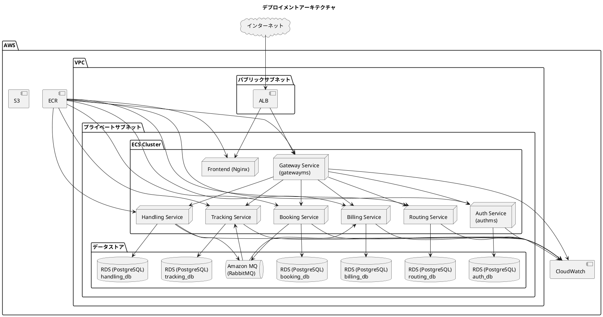
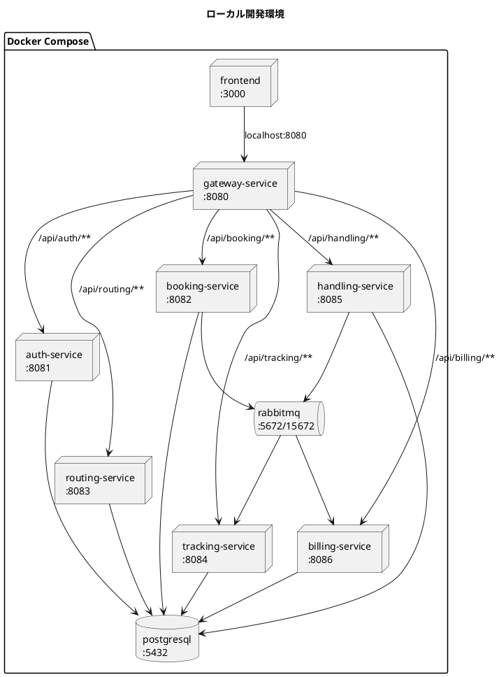
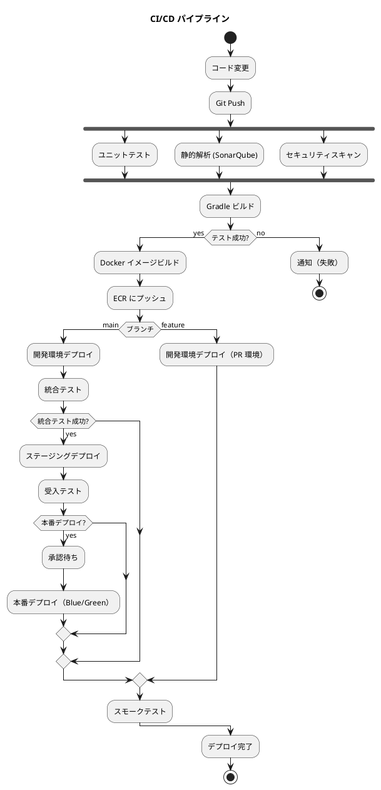
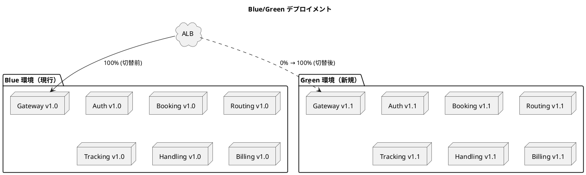

# インフラストラクチャアーキテクチャ設計

## 概要

マイクロサービスアーキテクチャを採用したバックエンドと React SPA フロントエンドを、コンテナベースのインフラ上で運用する。開発環境は Docker Compose、本番環境は AWS ECS（Fargate）を想定する。

## デプロイメントアーキテクチャ

### 全体構成



## 環境構成

### 環境一覧

| 環境 | 用途 | インフラ | デプロイ方式 |
| :--- | :--- | :--- | :--- |
| ローカル開発 | 開発者の PC | Docker Compose | docker-compose up |
| 開発 | 結合テスト | AWS ECS (Fargate) | CI/CD 自動デプロイ |
| ステージング | 受入テスト | AWS ECS (Fargate) | CI/CD 自動デプロイ |
| 本番 | 商用運用 | AWS ECS (Fargate) | CI/CD + 承認ゲート |

### ローカル開発環境（Docker Compose）



## ネットワーク設計

### VPC 設計

| サブネット | CIDR | 用途 |
| :--- | :--- | :--- |
| パブリック A | 10.0.1.0/24 | ALB, NAT Gateway |
| パブリック B | 10.0.2.0/24 | ALB（冗長化） |
| プライベート A | 10.0.11.0/24 | ECS タスク |
| プライベート B | 10.0.12.0/24 | ECS タスク（冗長化） |
| プライベート C | 10.0.21.0/24 | RDS, Amazon MQ |
| プライベート D | 10.0.22.0/24 | RDS（冗長化） |

### セキュリティグループ

| セキュリティグループ | インバウンド | 用途 |
| :--- | :--- | :--- |
| alb-sg | 80, 443 from 0.0.0.0/0 | ALB |
| ecs-sg | 8080-8086 from alb-sg | ECS タスク |
| rds-sg | 5432 from ecs-sg | RDS |
| mq-sg | 5672 from ecs-sg | Amazon MQ |

## コンテナ設計

### Dockerfile（バックエンドサービス共通）

```dockerfile
FROM eclipse-temurin:25-jre-alpine
WORKDIR /app
COPY build/libs/*.jar app.jar
EXPOSE 8080
ENTRYPOINT ["java", "-jar", "app.jar"]
```

### Dockerfile（フロントエンド）

```dockerfile
FROM node:22-alpine AS build
WORKDIR /app
COPY package*.json ./
RUN npm ci
COPY . .
RUN npm run build

FROM nginx:alpine
COPY --from=build /app/dist /usr/share/nginx/html
COPY nginx.conf /etc/nginx/conf.d/default.conf
EXPOSE 80
```

### コンテナリソース設定

| サービス | CPU | メモリ | 最小タスク数 | 最大タスク数 |
| :--- | :--- | :--- | :--- | :--- |
| Auth Service | 256 | 512 MB | 2 | 4 |
| Booking Service | 512 | 1024 MB | 2 | 4 |
| Routing Service | 256 | 512 MB | 2 | 4 |
| Tracking Service | 512 | 1024 MB | 2 | 6 |
| Handling Service | 512 | 1024 MB | 2 | 4 |
| Billing Service | 256 | 512 MB | 1 | 2 |
| Frontend | 256 | 512 MB | 2 | 4 |
| API Gateway | 256 | 512 MB | 2 | 4 |

## CI/CD パイプライン



### CI/CD ツール

| カテゴリ | ツール | 用途 |
| :--- | :--- | :--- |
| CI | GitHub Actions | ビルド・テスト・静的解析 |
| CD | GitHub Actions + AWS CDK | デプロイ自動化 |
| コンテナレジストリ | Amazon ECR | Docker イメージ管理 |
| IaC | Terraform | インフラプロビジョニング |
| 品質ゲート | SonarQube | コード品質・カバレッジ |

## デプロイメント戦略

### Blue/Green デプロイメント（本番環境）



- 本番環境: Blue/Green デプロイメントで即座にロールバック可能
- 開発/ステージング: ローリングアップデートで迅速にデプロイ

## 監視・ログ管理

### 監視対象

| カテゴリ | 監視項目 | ツール | アラート閾値 |
| :--- | :--- | :--- | :--- |
| インフラ | CPU/メモリ使用率 | CloudWatch | CPU > 80% |
| アプリケーション | レスポンスタイム | CloudWatch | p99 > 3s |
| アプリケーション | エラー率 | CloudWatch | > 1% |
| データベース | 接続数 | CloudWatch | > 80% |
| メッセージング | キュー深度 | CloudWatch | > 1000 |

### ログ管理

| ログ種別 | 保存先 | 保持期間 |
| :--- | :--- | :--- |
| アプリケーションログ | CloudWatch Logs | 30 日 |
| アクセスログ | CloudWatch Logs | 90 日 |
| 監査ログ | S3 | 1 年 |

## バックアップ・災害復旧

### バックアップ戦略

| 対象 | 方式 | 頻度 | 保持期間 |
| :--- | :--- | :--- | :--- |
| RDS | 自動スナップショット | 日次 | 7 日 |
| RDS | 手動スナップショット | リリース前 | 30 日 |

### RPO/RTO

| 指標 | 目標値 |
| :--- | :--- |
| RPO | 1 時間以内 |
| RTO | 4 時間以内 |

## セキュリティ

### 多層防御

| 層 | 対策 |
| :--- | :--- |
| ネットワーク | VPC, セキュリティグループ, プライベートサブネット |
| 通信 | TLS/SSL (ACM), HTTPS 強制 |
| 認証・認可 | Spring Security + JWT |
| データ保護 | RDS 暗号化（AES-256）、S3 暗号化 |
| アプリケーション | 入力検証、OWASP 対策 |

## コスト見積（月額概算）

| リソース | スペック | 月額概算 |
| :--- | :--- | :--- |
| ECS Fargate | 8 サービス × 2 タスク（gateway/auth/booking/routing/tracking/handling/billing/frontend） | $280 |
| RDS PostgreSQL | db.t3.medium × 6 | $600 |
| Amazon MQ | mq.m5.large | $200 |
| ALB | 1 台 | $30 |
| CloudWatch | ログ・メトリクス | $50 |
| ECR | イメージストレージ | $10 |
| **合計** | | **$1,170** |

## 参照

- [バックエンドアーキテクチャ設計](architecture_backend.md)
- [フロントエンドアーキテクチャ設計](architecture_frontend.md)
- [アーキテクチャ設計ガイド](../reference/アーキテクチャ設計ガイド.md)
