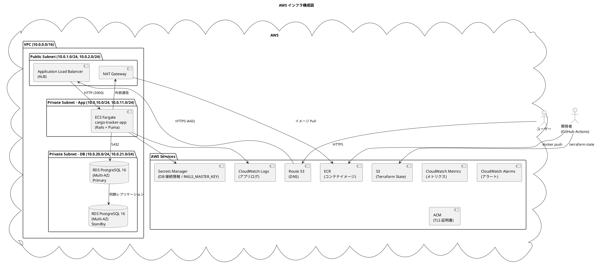
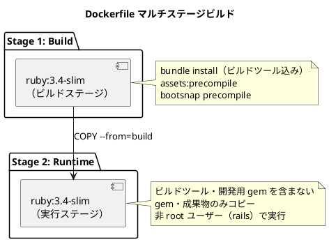
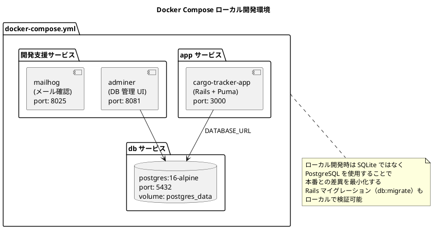
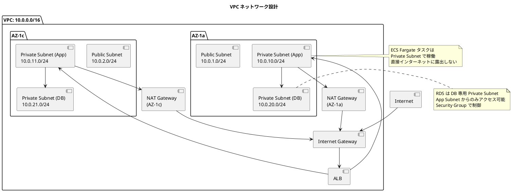
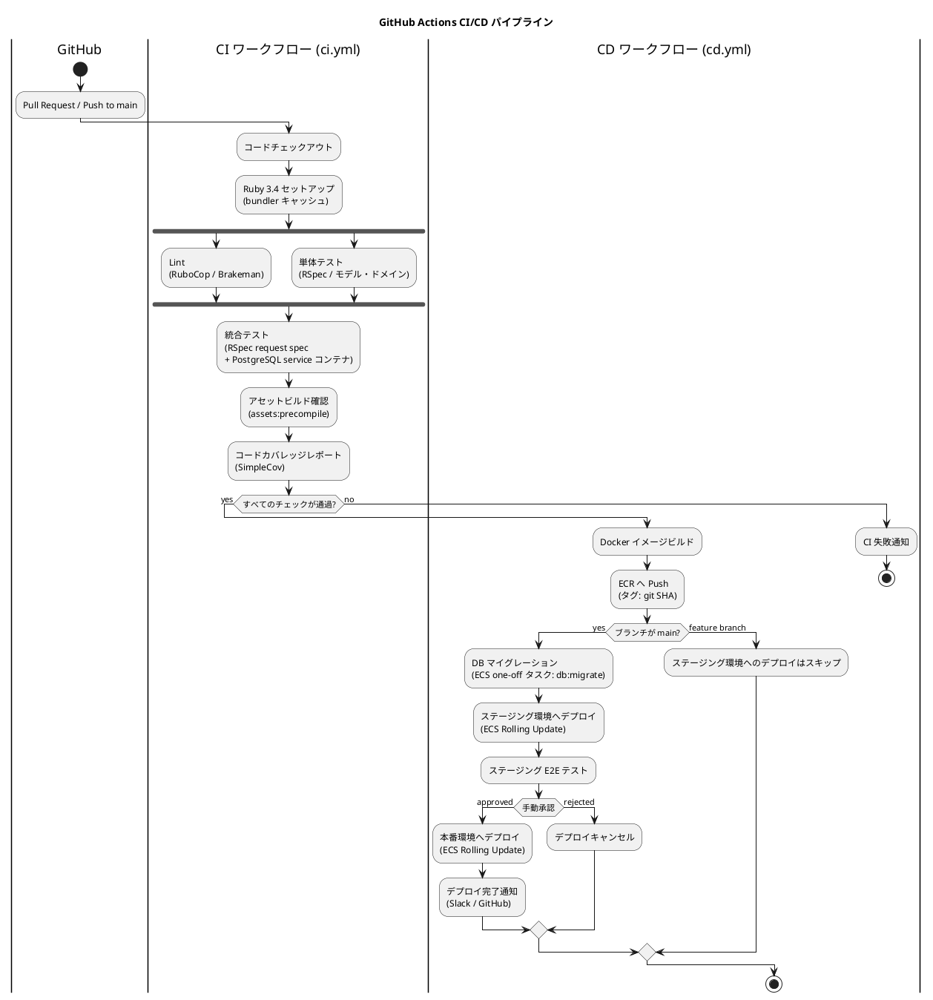
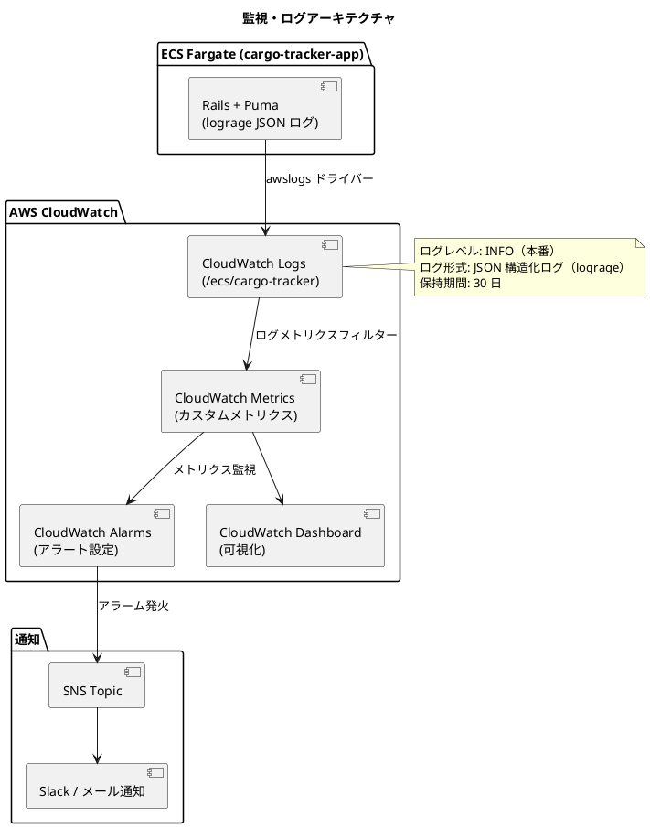
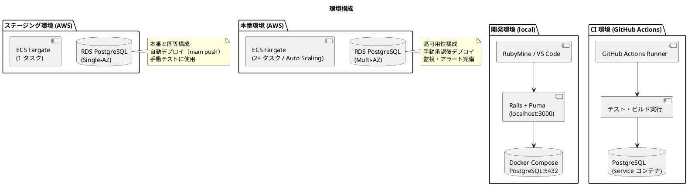
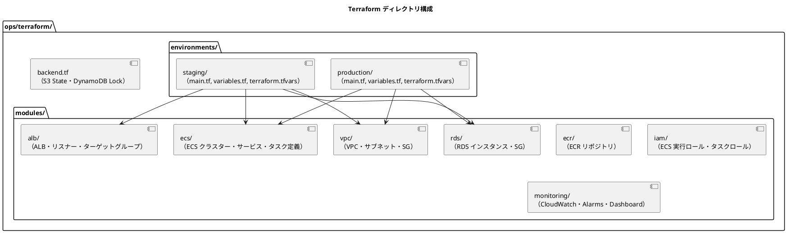

# インフラアーキテクチャ - 国際貨物輸送管理システム

## 概要

本ドキュメントでは、国際貨物輸送管理システムのインフラアーキテクチャを定義する。
コンテナ化された Ruby on Rails アプリケーションを **AWS ECS Fargate** 上で稼働させ、
**RDS PostgreSQL** でデータを永続化する。
アプリケーションサーバーには **Puma** を採用し、
**Terraform** によるインフラの IaC 管理と **GitHub Actions** による CI/CD パイプラインを整備する。

## インフラ構成図



## コンテナ化戦略

### Dockerfile 設計方針

マルチステージビルドを採用し、本番イメージのサイズを最小化する。



Dockerfile の設計原則：

| 原則 | 内容 |
| :--- | :--- |
| **マルチステージビルド** | ビルドツール（gcc、libpq-dev 等）や開発・テスト用 gem を本番イメージに含めない |
| **非 root ユーザー** | `groupadd / useradd` で `rails` ユーザーを作成して実行 |
| **レイヤーキャッシュの最適化** | `Gemfile` / `Gemfile.lock` を先にコピーして `bundle install` し、ソースコードのコピーを後にする |
| **起動時間の最適化** | `bootsnap precompile` と `assets:precompile` をビルド時に実行し、コンテナ起動を高速化する |
| **ヘルスチェック** | `HEALTHCHECK` で Rails 8 標準の `/up` エンドポイントを使用 |
| **環境変数による設定** | `DATABASE_URL`、`RAILS_MASTER_KEY` 等は実行時環境変数で注入。コードにハードコードしない |

### Puma 設定方針

JVM のヒープ設定に相当するチューニングは、Puma のプロセス数・スレッド数とコンテナメモリの整合で行う。

| 設定項目 | 環境変数 | 値（初期設定） | 説明 |
| :--- | :--- | :--- | :--- |
| ワーカープロセス数 | `WEB_CONCURRENCY` | 1 | コンテナ内は単一プロセス。スケールは ECS タスク数で行う |
| スレッド数 | `RAILS_MAX_THREADS` | 5 | DB コネクションプールサイズと一致させる |
| ポート | `PORT` | 3000 | ALB ターゲットグループのポートと一致 |
| メモリ | - | タスクメモリ 1024 MB | Ruby ヒープ + ネイティブメモリの余裕を確保 |

### Docker Compose ローカル開発環境



## AWS 構成

### ECS Fargate 構成

| 設定項目 | 値 | 説明 |
| :--- | :--- | :--- |
| クラスター名 | `cargo-tracker-cluster` | ECS クラスター |
| タスク定義 | `cargo-tracker-app` | Rails（Puma）コンテナ定義 |
| CPU | 512 (0.5 vCPU) | 初期設定。負荷に応じてスケール |
| メモリ | 1024 MB | Puma プロセスのメモリ使用量に合わせて調整 |
| 希望タスク数 | 2 | 最小稼働台数（高可用性） |
| 最大タスク数 | 6 | Auto Scaling 上限 |
| サービスディスカバリ | ALB ターゲットグループ | `/up` ヘルスチェック経由でルーティング |

### VPC・ネットワーク設計



### セキュリティグループ設計

| SG 名 | インバウンドルール | アウトバウンドルール | 用途 |
| :--- | :--- | :--- | :--- |
| `sg-alb` | 0.0.0.0/0: 443 (HTTPS) | ECS SG: 3000 | ALB |
| `sg-ecs-app` | ALB SG: 3000 | RDS SG: 5432, 0.0.0.0/0: 443 | ECS Fargate タスク |
| `sg-rds` | ECS SG: 5432 | - | RDS PostgreSQL |

### RDS 構成

| 設定項目 | 値 | 説明 |
| :--- | :--- | :--- |
| エンジン | PostgreSQL 16.x | 本番 DB |
| インスタンスクラス | `db.t3.medium` | 初期設定 |
| マルチ AZ | 有効 | フェイルオーバー対応 |
| 自動バックアップ | 7 日間保持 | 日次スナップショット |
| 暗号化 | 有効（AWS KMS） | データの暗号化 |
| パラメータグループ | カスタム | `shared_buffers`、`max_connections` 等の最適化 |

接続情報は Secrets Manager に格納し、ECS タスク定義の `secrets` で `DATABASE_URL` として注入する。
コネクションプールサイズは `RAILS_MAX_THREADS` と一致させ、`タスク数 × スレッド数` が RDS の `max_connections` を超えないよう管理する。

## シークレット・環境変数管理

| 変数 | 管理方法 | 説明 |
| :--- | :--- | :--- |
| `RAILS_MASTER_KEY` | AWS Secrets Manager | `credentials.yml.enc` の復号キー。タスク定義の `secrets` で注入 |
| `DATABASE_URL` | AWS Secrets Manager | RDS 接続文字列（ユーザー・パスワード含む） |
| `RAILS_ENV` | タスク定義の `environment` | `staging` / `production` |
| `RAILS_LOG_TO_STDOUT` | タスク定義の `environment` | `true`。ログを標準出力へ |
| `WEB_CONCURRENCY` / `RAILS_MAX_THREADS` | タスク定義の `environment` | Puma のプロセス・スレッド設定 |

## DB マイグレーション実行方針

| 方式 | 採用 | 内容 |
| :--- | :--- | :--- |
| **ECS one-off タスク** | 採用（標準） | デプロイ前に `bin/rails db:migrate` を単発の ECS タスクとして実行。CD ワークフローから `run-task` で起動し、完了を待ってからサービス更新する |
| entrypoint 実行 | 不採用 | 複数タスク同時起動時の競合リスクとロールバック制御の難しさがあるため採用しない（Rails のアドバイザリロックで多重実行自体は防止される） |

## CI/CD パイプライン



AWS 認証には GitHub Actions OIDC を使用し、長期クレデンシャルをリポジトリに保持しない。

### GitHub Actions ワークフロー構成

| ワークフロー | トリガー | 内容 |
| :--- | :--- | :--- |
| `ci.yml` | PR / push | Lint（RuboCop・Brakeman）・テスト（RSpec）・カバレッジ（SimpleCov） |
| `cd-staging.yml` | main push | ステージング環境への自動デプロイ（migrate → サービス更新） |
| `cd-production.yml` | 手動承認 / release タグ | 本番環境へのデプロイ |
| `terraform-plan.yml` | infra/ 変更の PR | `terraform plan` 結果を PR にコメント |
| `terraform-apply.yml` | infra/ 変更の main push | `terraform apply` でインフラ更新 |

### デプロイ戦略

| 戦略 | 環境 | 内容 |
| :--- | :--- | :--- |
| **ローリングアップデート** | ステージング・本番 | ECS の `minimumHealthyPercent: 50`, `maximumPercent: 200` でゼロダウンタイムデプロイ |
| **ロールバック** | 本番 | 前バージョンの ECR イメージ SHA で `ecs update-service` を実行。破壊的マイグレーションを避け、後方互換なスキーマ変更を徹底する |
| **Blue/Green** | 将来対応 | CodeDeploy + ALB の B/G デプロイ（高トラフィック時に検討） |

## 監視・ログ設計



### 監視項目

| 監視カテゴリー | メトリクス | 閾値（例） | アクション |
| :--- | :--- | :--- | :--- |
| **アプリケーション** | HTTP 5xx エラー率 | 5% 以上 | アラート → Slack 通知 |
| **アプリケーション** | レスポンスタイム（P99） | 3 秒以上 | アラート → Slack 通知 |
| **ECS** | CPU 使用率 | 80% 以上 | Auto Scaling トリガー |
| **ECS** | メモリ使用率 | 80% 以上 | アラート（Ruby プロセスの肥大化検知） |
| **RDS** | DB 接続数 | 上限の 80% | アラート |
| **RDS** | レプリケーション遅延 | 60 秒以上 | アラート |
| **ALB** | HealthyHostCount | 0 | 緊急アラート（PagerDuty 等） |

### ログ設計

Rails は `RAILS_LOG_TO_STDOUT=true` で標準出力にログを出力し、awslogs ドライバーが CloudWatch Logs へ転送する。
リクエストログは lograge で 1 リクエスト 1 行の JSON に構造化する。

| ログ種別 | 出力先 | 形式 | 内容 |
| :--- | :--- | :--- | :--- |
| アプリケーションログ | CloudWatch Logs `/ecs/cargo-tracker` | JSON（lograge） | リクエスト・ビジネスイベント・エラー |
| アクセスログ | ALB Access Logs → S3 | ALB 形式 | HTTP アクセス履歴 |
| 監査ログ | CloudWatch Logs `/ecs/cargo-tracker/audit` | JSON | 荷役登録・予約変更等の重要操作 |
| DB 低速クエリログ | RDS → CloudWatch Logs | PostgreSQL 形式 | 1 秒以上のクエリ |

構造化ログの形式（JSON）：

```json
{
  "timestamp": "2026-07-07T10:00:00.000Z",
  "level": "INFO",
  "request_id": "abc123",
  "user_id": "user-001",
  "context": "booking",
  "message": "貨物予約を登録しました",
  "booking_id": "BK-2026-0001"
}
```

## 環境構成



### 環境別設定一覧

| 設定項目 | ローカル | ステージング | 本番 |
| :--- | :--- | :--- | :--- |
| DB | Docker PostgreSQL | RDS（Single-AZ） | RDS（Multi-AZ） |
| ECS タスク数 | - | 1 | 2〜6（Auto Scaling） |
| ログレベル | DEBUG | INFO | INFO |
| `RAILS_ENV` | `development` | `staging` | `production` |
| DB マイグレーション | `bin/rails db:migrate`（手動） | ECS one-off タスク（自動） | ECS one-off タスク（承認後） |
| `db:schema:load` / リセット | 許可 | 禁止 | 禁止 |
| シークレット管理 | `.env` ファイル + `master.key` | AWS Secrets Manager | AWS Secrets Manager |

## Terraform IaC 構成



Terraform の運用方針：

| 原則 | 内容 |
| :--- | :--- |
| **State の S3 管理** | `terraform.tfstate` を S3 バケットで管理。DynamoDB でステートロック |
| **モジュール分割** | 再利用可能なコンポーネントはモジュール化。ステージング・本番で同一モジュールを使用 |
| **機密情報の管理** | `terraform.tfvars` に DB パスワードや `RAILS_MASTER_KEY` を含めない。AWS Secrets Manager または環境変数で管理 |
| **Plan レビュー** | `terraform apply` 前に必ず `terraform plan` を実施し、変更内容をレビュー |
| **Drift 検出** | 定期的に `terraform plan` を実行し、コードと実環境の乖離を検出する |
