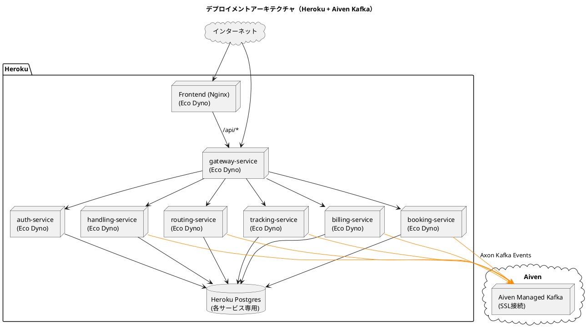
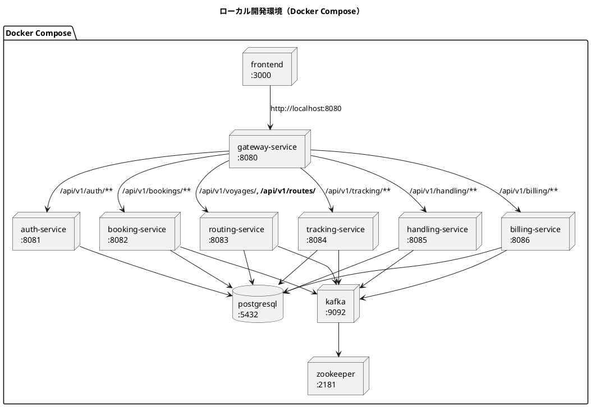
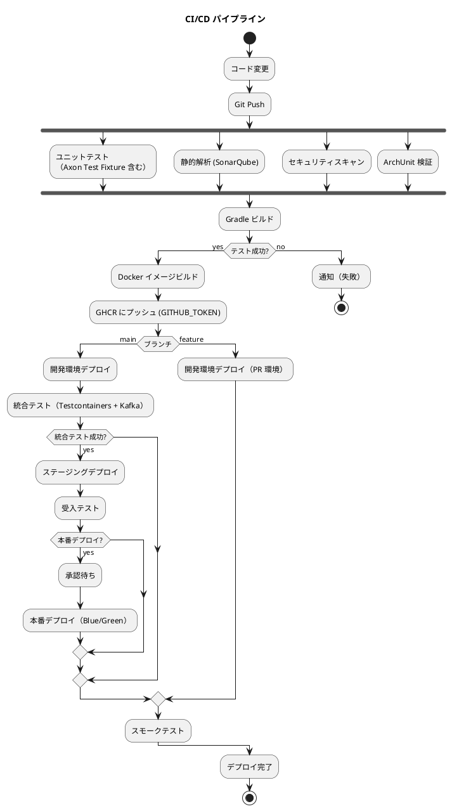
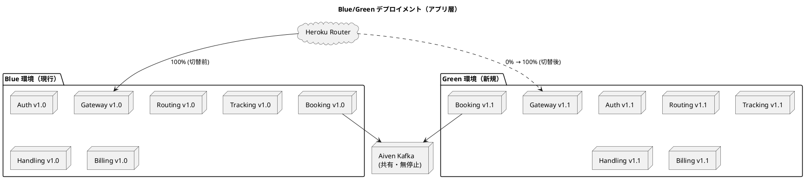

# インフラストラクチャアーキテクチャ設計

## 概要

マイクロサービスアーキテクチャを採用したバックエンドと React SPA フロントエンドを、コンテナベースのインフラ上で運用する。開発環境は Docker Compose、本番環境は **Heroku** を採用する。

メッセージング基盤は **Axon Framework 5 + Axon Kafka Extension** を採用し、イベントバスに **Aiven Managed Kafka** を使用する。Aiven Kafka はマネージドサービスのため、Kafka クラスターの運用管理が不要。SSL 接続で各マイクロサービスから接続する。Event Store は PostgreSQL ベースの JPA 実装（`JpaEventStorageEngine`）を使用する。

## デプロイメントアーキテクチャ

### 全体構成



## 環境構成

### 環境一覧

| 環境 | 用途 | インフラ | デプロイ方式 |
| :--- | :--- | :--- | :--- |
| ローカル開発 | 開発者の PC | Docker Compose | docker compose up |
| 開発 | 結合テスト | Heroku (Eco/Basic dyno) | CI/CD 自動デプロイ |
| ステージング | 受入テスト | Heroku (Eco/Basic dyno) | CI/CD 自動デプロイ |
| 本番 | 商用運用 | Heroku (Eco/Basic dyno) | CI/CD + 承認ゲート |

### ローカル開発環境（Docker Compose）



### docker-compose.yml の主要サービス例

```yaml
services:
  kafka:
    image: confluentinc/cp-kafka:7.6.0
    ports:
      - "9092:9092"
    environment:
      KAFKA_BROKER_ID: 1
      KAFKA_ZOOKEEPER_CONNECT: zookeeper:2181
      KAFKA_ADVERTISED_LISTENERS: PLAINTEXT://kafka:29092,PLAINTEXT_HOST://localhost:9092
      KAFKA_LISTENER_SECURITY_PROTOCOL_MAP: PLAINTEXT:PLAINTEXT,PLAINTEXT_HOST:PLAINTEXT
      KAFKA_OFFSETS_TOPIC_REPLICATION_FACTOR: 1
    depends_on:
      - zookeeper

  zookeeper:
    image: confluentinc/cp-zookeeper:7.6.0
    ports:
      - "2181:2181"
    environment:
      ZOOKEEPER_CLIENT_PORT: 2181

  postgresql:
    image: postgres:16
    ports:
      - "5432:5432"
    environment:
      POSTGRES_USER: cargo
      POSTGRES_PASSWORD: cargo
      POSTGRES_MULTIPLE_DATABASES: auth_db,booking_read_db,routing_read_db,tracking_read_db,handling_read_db,billing_read_db
    volumes:
      - postgres-data:/var/lib/postgresql/data

  bookingms:
    build: ./apps/backend/bookingms
    depends_on:
      kafka:
        condition: service_started
      postgresql:
        condition: service_started
    environment:
      KAFKA_BOOTSTRAP_SERVERS: kafka:29092
      SPRING_DATASOURCE_URL: jdbc:postgresql://postgresql:5432/booking_read_db
    ports:
      - "8082:8082"

volumes:
  postgres-data:
```

## ネットワーク設計

Heroku ではネットワーク設定は不要（Heroku が管理）。

- サービス間通信は HTTP（Heroku Internal Routing または外部 URL）
- Aiven Kafka への接続は SSL

## Aiven Kafka 接続設定

各サービスの Heroku Config Vars に以下を設定する。

- `KAFKA_BOOTSTRAP_SERVERS`: `<aiven-host>:<port>`
- `KAFKA_SECURITY_PROTOCOL`: `SSL`
- `KAFKA_SSL_TRUSTSTORE_PASSWORD`: （必要な場合）

Aiven が提供する CA 証明書を使用して SSL 接続する。

## コンテナ設計

### Dockerfile（バックエンドサービス共通）

```dockerfile
FROM eclipse-temurin:25-jre-alpine
WORKDIR /app
COPY build/libs/*.jar app.jar
EXPOSE 8080
ENTRYPOINT ["java", "-jar", "app.jar"]
```

### Dockerfile（フロントエンド）

```dockerfile
FROM node:22-alpine AS build
WORKDIR /app
COPY package*.json ./
RUN npm ci
COPY . .
RUN npm run build

FROM nginx:alpine
COPY --from=build /app/dist /usr/share/nginx/html
COPY nginx.conf /etc/nginx/conf.d/default.conf
EXPOSE 80
```

### コンテナリソース設定

| サービス | dyno タイプ | 起動数 |
| :--- | :--- | :--- |
| auth-service | Eco ($5/月) | 1 |
| booking-service | Eco ($5/月) | 1 |
| routing-service | Eco ($5/月) | 1 |
| tracking-service | Eco ($5/月) | 1 |
| handling-service | Eco ($5/月) | 1 |
| billing-service | Eco ($5/月) | 1 |
| gateway-service | Eco ($5/月) | 1 |
| frontend | Eco ($5/月) | 1 |

## CI/CD パイプライン



### CI/CD ツール

| カテゴリ | ツール | 用途 |
| :--- | :--- | :--- |
| CI | GitHub Actions | ビルド・テスト・静的解析 |
| CD | GitHub Actions + Heroku CLI | デプロイ自動化 |
| コンテナレジストリ | GitHub Container Registry (GHCR) | Docker イメージ管理（CI で `GITHUB_TOKEN` 認証、ADR-0003） |
| IaC | Terraform | インフラプロビジョニング |
| 品質ゲート | SonarQube | コード品質・カバレッジ |

## デプロイメント戦略

### Blue/Green デプロイメント（アプリ層）



- **アプリ層**: Blue/Green デプロイメントで即座にロールバック可能
- **Aiven Kafka**: Blue / Green で **共有** する。両環境のサービスが同じイベントトピックを読み書きするため、イベントスキーマの後方互換性を必ず維持する
- **開発 / ステージング**: ローリングアップデートで迅速にデプロイ
- **スキーマ進化**: Axon の **Upcaster** で旧バージョンのイベントを新バージョンへ変換する。コード変更にはアップキャスター実装をセットで含める

## 監視・ログ管理

### 監視対象

| カテゴリ | 監視項目 | ツール | アラート閾値 |
| :--- | :--- | :--- | :--- |
| インフラ | CPU/メモリ使用率 | Heroku Metrics | CPU > 80% |
| アプリケーション | レスポンスタイム | Heroku Metrics | p99 > 3s |
| アプリケーション | エラー率 | Heroku Metrics | > 1% |
| データベース | 接続数 | Heroku Postgres | > 80% |
| Kafka | コンシューマーラグ | Aiven Console | 一定値超過 |
| Kafka | メッセージスループット | Aiven Metrics | 想定値の 1.5 倍 |

### ログ管理

| ログ種別 | 保存先 | 保持期間 |
| :--- | :--- | :--- |
| アプリケーションログ | Heroku Logs / Papertrail | 30 日 |
| アクセスログ | Heroku Logs | 90 日 |
| 監査ログ（Event Store のイベント） | PostgreSQL (JpaEventStorageEngine) | 1 年（オンライン）+ 7 年（アーカイブ） |

> **特長**: Event Store のイベント自体が監査ログとして機能する。すべての状態変更が時系列で残るため、過去の任意時点の状態を再現可能。

## バックアップ・災害復旧

### バックアップ戦略

| 対象 | 方式 | 頻度 | 保持期間 |
| :--- | :--- | :--- | :--- |
| Heroku Postgres (Read Model) | 自動バックアップ（日次） | 日次 | 7 日 |
| Heroku Postgres (Read Model) | 手動スナップショット | リリース前 | 30 日 |
| **Heroku Postgres（Event Store）** | **Heroku Postgres 自動バックアップ（日次）** | **日次** | 7 日 |
| **Aiven Kafka** | **Aiven Kafka 保持ポリシー（7日間）** | **連続** | 7 日 |

### 復旧手順

| シナリオ | 復旧手順 |
| :--- | :--- |
| Read Model の不整合 | Axon Event Processor の Token をリセット → Event Store からリプレイ |
| Heroku Postgres 障害 | Heroku Postgres の最新バックアップからリストア |
| Aiven Kafka 障害 | Aiven マネージドサービスの自動復旧を待機。必要に応じて Aiven サポートへ連絡 |

### RPO/RTO

| 指標 | 目標値 |
| :--- | :--- |
| RPO（Event Store） | **24 時間以内**（Heroku Postgres 日次バックアップ） |
| RPO（Kafka トピック） | 7 日間（Aiven Kafka 保持ポリシー） |
| RPO（Read Model） | 24 時間以内（Heroku Postgres 自動バックアップ） |
| RTO | 4 時間以内 |

## セキュリティ

### 多層防御

| 層 | 対策 |
| :--- | :--- |
| ネットワーク | Heroku が管理、サービス間通信は Heroku Internal Routing |
| 通信 | TLS/SSL (Heroku 自動管理), HTTPS 強制、Aiven Kafka への SSL 接続 |
| 認証・認可 | Spring Security + JWT |
| データ保護 | Heroku Postgres 暗号化（AES-256）、Aiven Kafka の転送暗号化 |
| アプリケーション | 入力検証、OWASP 対策、Axon コマンドの権限チェック |

## コスト見積（月額概算）

| リソース | スペック | 月額概算 |
| :--- | :--- | :--- |
| Heroku Eco dyno × 8 サービス | $5/月 × 8 | $40 |
| Heroku Postgres（各サービス） | Mini plan $5/月 × 6 | $30 |
| Aiven Kafka | Hobbyist $19/月 | $19 |
| **合計** | | **約 $89** |

> **比較**: take-4 の AWS ECS $1,070 から大幅削減。Heroku + Aiven Kafka の組み合わせにより運用管理コストも低減。

## 参照

- [バックエンドアーキテクチャ設計](architecture_backend.md)
- [フロントエンドアーキテクチャ設計](architecture_frontend.md)
- [ADR-0001 メッセージング基盤として Axon Kafka + Aiven を採用する](../adr/0001-axon-framework-adoption.md)
- [ADR-0006 Heroku デプロイ](../adr/0006-heroku-deploy.md)
- [アーキテクチャ設計ガイド](../reference/アーキテクチャ設計ガイド.md)
