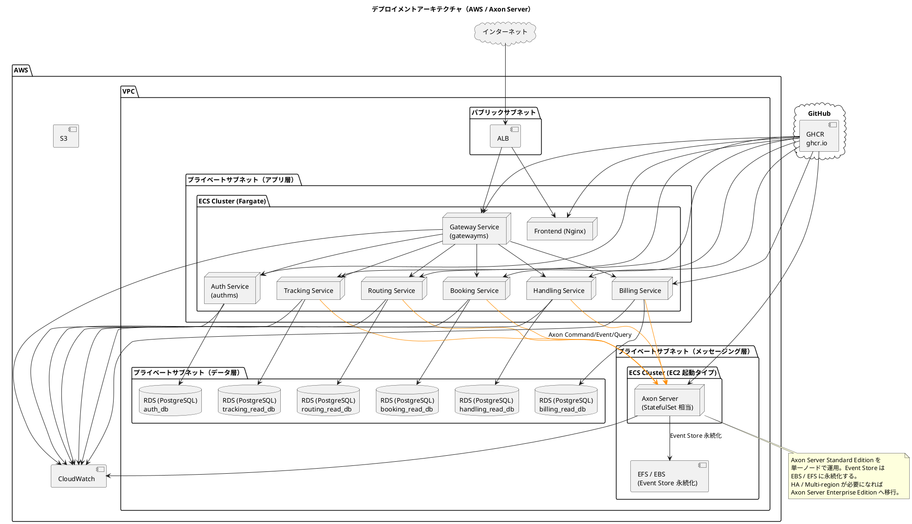
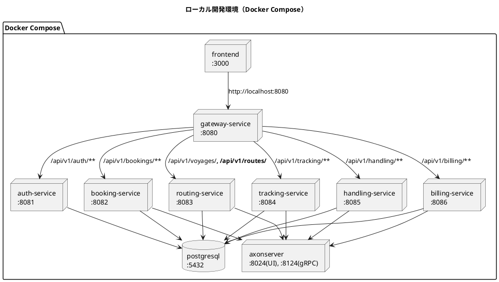
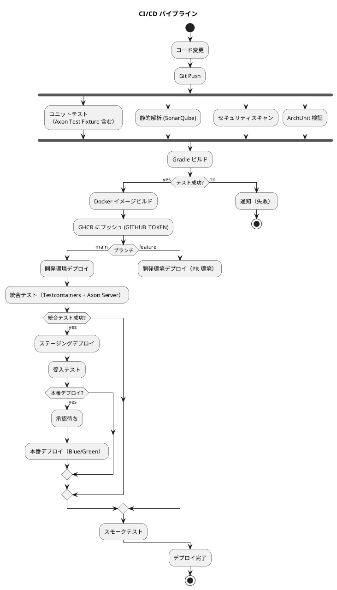
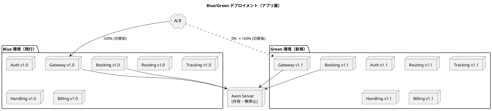

# インフラストラクチャアーキテクチャ設計

## 概要

マイクロサービスアーキテクチャを採用したバックエンドと React SPA フロントエンドを、コンテナベースのインフラ上で運用する。開発環境は Docker Compose、本番環境は AWS ECS（Fargate / EC2 起動タイプ併用）を想定する。

メッセージング基盤は **Axon Framework 5 + Axon Server（2024.x 系）** を採用しており、RabbitMQ / Kafka 等のメッセージブローカーは導入しない。Axon Server は Event Store（イベント永続化）と Command / Event / Query Bus の役割を兼ねるため、ステートフルなコンテナとして専用のストレージで運用する。

## デプロイメントアーキテクチャ

### 全体構成



## 環境構成

### 環境一覧

| 環境 | 用途 | インフラ | デプロイ方式 |
| :--- | :--- | :--- | :--- |
| ローカル開発 | 開発者の PC | Docker Compose | docker compose up |
| 開発 | 結合テスト | AWS ECS (Fargate + EC2 for Axon) | CI/CD 自動デプロイ |
| ステージング | 受入テスト | AWS ECS (Fargate + EC2 for Axon) | CI/CD 自動デプロイ |
| 本番 | 商用運用 | AWS ECS (Fargate + EC2 for Axon) | CI/CD + 承認ゲート |

### ローカル開発環境（Docker Compose）



### docker-compose.yml の主要サービス例

```yaml
services:
  axonserver:
    image: axoniq/axonserver:2026.0.0
    ports:
      - "8024:8024"   # HTTP（管理 UI / REST）
      - "8124:8124"   # gRPC（クライアント接続）
      - "8224:8224"   # クラスタ間通信（Enterprise 用 / 単一ノードでは未使用）
    volumes:
      - axonserver-data:/axonserver/data
      - axonserver-events:/axonserver/events
      - axonserver-config:/axonserver/config
    environment:
      AXONIQ_AXONSERVER_NAME: axonserver
      AXONIQ_AXONSERVER_HOSTNAME: axonserver
      AXONIQ_AXONSERVER_DEVMODE_ENABLED: "true"
    healthcheck:
      test: ["CMD", "curl", "-f", "http://localhost:8024/actuator/health"]
      interval: 10s
      retries: 12

  postgresql:
    image: postgres:16
    ports:
      - "5432:5432"
    environment:
      POSTGRES_USER: cargo
      POSTGRES_PASSWORD: cargo
      POSTGRES_MULTIPLE_DATABASES: auth_db,booking_read_db,routing_read_db,tracking_read_db,handling_read_db,billing_read_db
    volumes:
      - postgres-data:/var/lib/postgresql/data

  bookingms:
    build: ./apps/backend/bookingms
    depends_on:
      axonserver:
        condition: service_healthy
      postgresql:
        condition: service_started
    environment:
      AXON_AXONSERVER_SERVERS: axonserver:8124
      SPRING_DATASOURCE_URL: jdbc:postgresql://postgresql:5432/booking_read_db
    ports:
      - "8082:8082"

volumes:
  axonserver-data:
  axonserver-events:
  axonserver-config:
  postgres-data:
```

## ネットワーク設計

### VPC 設計

| サブネット | CIDR | 用途 |
| :--- | :--- | :--- |
| パブリック A | 10.0.1.0/24 | ALB, NAT Gateway |
| パブリック B | 10.0.2.0/24 | ALB（冗長化） |
| プライベート A | 10.0.11.0/24 | ECS タスク（アプリ） |
| プライベート B | 10.0.12.0/24 | ECS タスク（アプリ・冗長化） |
| プライベート C | 10.0.21.0/24 | RDS |
| プライベート D | 10.0.22.0/24 | RDS（冗長化） |
| プライベート E | 10.0.31.0/24 | Axon Server（EC2 起動タイプ ECS） |

### セキュリティグループ

| セキュリティグループ | インバウンド | 用途 |
| :--- | :--- | :--- |
| alb-sg | 80, 443 from 0.0.0.0/0 | ALB |
| ecs-sg | 8080-8086 from alb-sg | ECS タスク（アプリ） |
| rds-sg | 5432 from ecs-sg | RDS |
| axon-sg | 8124 (gRPC) from ecs-sg、8024 (HTTP UI) from VPN/踏み台 | Axon Server |

## コンテナ設計

### Dockerfile（バックエンドサービス共通）

```dockerfile
FROM eclipse-temurin:25-jre-alpine
WORKDIR /app
COPY build/libs/*.jar app.jar
EXPOSE 8080
ENTRYPOINT ["java", "-jar", "app.jar"]
```

### Dockerfile（フロントエンド）

```dockerfile
FROM node:22-alpine AS build
WORKDIR /app
COPY package*.json ./
RUN npm ci
COPY . .
RUN npm run build

FROM nginx:alpine
COPY --from=build /app/dist /usr/share/nginx/html
COPY nginx.conf /etc/nginx/conf.d/default.conf
EXPOSE 80
```

### Axon Server コンテナ

Axon Server は公式コンテナイメージ `axoniq/axonserver`（Axon Framework 5.1 と同時期リリースの 2026.0.0、Standard Edition）を利用する。Event Store の永続化のため、専用ボリュームをアタッチして運用する。Docker タグは連番リリースモデル（`<MAJOR>.<MINOR>.<PATCH>`）で、`-LTS` サフィックスは存在しない。

```text
axoniq/axonserver:2026.0.0
- 8024/tcp  : HTTP（管理 UI / REST API / Actuator）
- 8124/tcp  : gRPC（クライアント接続、Axon Framework 5 クライアント対応）
- 8224/tcp  : クラスタ間通信（Enterprise Edition）
Volumes:
- /axonserver/data    : メタデータ
- /axonserver/events  : Event Store（最重要・永続化必須）
- /axonserver/config  : 設定ファイル
```

### コンテナリソース設定

| サービス | CPU | メモリ | 起動タイプ | 最小タスク数 | 最大タスク数 |
| :--- | :--- | :--- | :--- | :--- | :--- |
| Auth Service | 256 | 512 MB | Fargate | 2 | 4 |
| Booking Service | 512 | 1024 MB | Fargate | 2 | 4 |
| Routing Service | 256 | 512 MB | Fargate | 2 | 4 |
| Tracking Service | 512 | 1024 MB | Fargate | 2 | 6 |
| Handling Service | 512 | 1024 MB | Fargate | 2 | 4 |
| Billing Service | 256 | 512 MB | Fargate | 1 | 2 |
| Frontend | 256 | 512 MB | Fargate | 2 | 4 |
| API Gateway | 256 | 512 MB | Fargate | 2 | 4 |
| **Axon Server** | **1024** | **2048 MB** | **EC2（EBS マウント）** | **1（固定）** | **1（SE）／ N（EE 移行時）** |

> **設計上の注意**:
>
> - Axon Server は **ステートフル** のため、Fargate ではなく **EC2 起動タイプ + EBS（または EFS）** で運用する
> - Standard Edition は単一ノード前提。HA / マルチゾーン構成が必要になった場合は Enterprise Edition へ移行する
> - Axon Server のコンテナは **常に 1 台のみ稼働** とし、Auto Scaling は無効にする
> - 起動時は EBS ボリュームを同一インスタンスにアタッチし直す運用を整える

## CI/CD パイプライン



### CI/CD ツール

| カテゴリ | ツール | 用途 |
| :--- | :--- | :--- |
| CI | GitHub Actions | ビルド・テスト・静的解析 |
| CD | GitHub Actions + AWS CDK / Terraform | デプロイ自動化 |
| コンテナレジストリ | GitHub Container Registry (GHCR) | Docker イメージ管理（CI で `GITHUB_TOKEN` 認証、ADR-0003） |
| IaC | Terraform | インフラプロビジョニング |
| 品質ゲート | SonarQube | コード品質・カバレッジ |

## デプロイメント戦略

### Blue/Green デプロイメント（アプリ層）



- **アプリ層**: Blue/Green デプロイメントで即座にロールバック可能
- **Axon Server**: Blue / Green で **共有** する。両環境のサービスが同じ Event Store を読み書きするため、イベント・コマンドスキーマの後方互換性を必ず維持する
- **開発 / ステージング**: ローリングアップデートで迅速にデプロイ
- **スキーマ進化**: Axon の **Upcaster** で旧バージョンのイベントを新バージョンへ変換する。コード変更にはアップキャスター実装をセットで含める

### Axon Server のデプロイ・更新手順

| 操作 | 内容 |
| :--- | :--- |
| 初回デプロイ | EC2 起動タイプの ECS サービスを 1 タスクで作成、EBS をアタッチ |
| バージョンアップ | メンテナンス時間帯にタスク差し替え（タスク停止 → 新タスク起動）。EBS は同一ボリュームを再アタッチ |
| バックアップ | EBS スナップショットを日次取得（後述） |
| 障害復旧 | EBS スナップショットから新 EBS を作成し、新タスクでマウントして再起動 |

## 監視・ログ管理

### 監視対象

| カテゴリ | 監視項目 | ツール | アラート閾値 |
| :--- | :--- | :--- | :--- |
| インフラ | CPU/メモリ使用率 | CloudWatch | CPU > 80% |
| アプリケーション | レスポンスタイム | CloudWatch | p99 > 3s |
| アプリケーション | エラー率 | CloudWatch | > 1% |
| データベース | 接続数 | CloudWatch | > 80% |
| Axon Server | Event Store ディスク使用率 | CloudWatch + Axon Metrics | > 80% |
| Axon Server | コマンド処理レイテンシ | Axon Metrics | p99 > 500ms |
| Axon Server | Event Processor の遅延（Token gap） | Axon Metrics | 一定値超過 |
| Axon Server | コネクション数 | Axon Metrics | 想定値の 1.5 倍 |

### ログ管理

| ログ種別 | 保存先 | 保持期間 |
| :--- | :--- | :--- |
| アプリケーションログ | CloudWatch Logs | 30 日 |
| アクセスログ | CloudWatch Logs | 90 日 |
| Axon Server ログ | CloudWatch Logs | 90 日 |
| 監査ログ（Event Store のイベント） | Axon Event Store + 日次 S3 エクスポート | 1 年（オンライン） + 7 年（アーカイブ） |

> **特長**: Event Store のイベント自体が監査ログとして機能する。すべての状態変更が時系列で残るため、過去の任意時点の状態を再現可能。

## バックアップ・災害復旧

### バックアップ戦略

| 対象 | 方式 | 頻度 | 保持期間 |
| :--- | :--- | :--- | :--- |
| RDS (Read Model) | 自動スナップショット | 日次 | 7 日 |
| RDS (Read Model) | 手動スナップショット | リリース前 | 30 日 |
| **Axon Server EBS** | **AWS Backup（EBS スナップショット）** | **1 時間ごと** | 24 時間（短期 24 件）+ 日次保持 7 日 |
| Axon Server EBS | 手動スナップショット | リリース前 | 30 日 |
| **Event Store S3 ストリーミングエクスポート** | **Axon REST API + Lambda（イベント追記検知）** | **連続（5 分以内）** | 1 年（オンライン）+ 7 年（Glacier アーカイブ） |
| Event Store S3 フルエクスポート | Axon REST API + Lambda | 日次 | 7 年（コンプライアンス対応） |

> **RPO 1 時間達成の構成**:
>
> 1. **EBS スナップショット**を 1 時間ごとに取得（AWS Backup プラン）。24 時間で 24 件、日次集約で 7 件保持
> 2. **Event Store ストリーミングエクスポート**: Axon Server の REST API（`/v1/events`）を Lambda が 5 分間隔でポーリングし、追記イベントを S3 へ JSON Lines 形式で書き込み。AZ 障害時の最終手段
> 3. **障害時の復旧**: EBS スナップショットから新ボリューム作成（数分）→ S3 ストリーミングから差分イベントを再投入（最大 5 分相当）→ 合計 RPO < 1 時間
> 4. **コスト**: EBS スナップショット 1h 頻度で月額 $20、S3 ストリーミングで月額 $10 増加（合計 +$25/月）

### 復旧手順

| シナリオ | 復旧手順 |
| :--- | :--- |
| Read Model の不整合 | Axon Event Processor の Token をリセット → Event Store からリプレイ |
| Axon Server インスタンス障害 | EBS を新インスタンスにアタッチし直して再起動 |
| Axon Server ボリューム破損 | 最新の EBS スナップショットからボリュームを復元 → 必要に応じて S3 エクスポートからイベントを補完 |
| AZ 障害 | EBS スナップショットから別 AZ で復旧（Enterprise Edition では自動フェイルオーバー） |

### RPO/RTO

| 指標 | 目標値 |
| :--- | :--- |
| RPO（Axon Event Store、フェーズ 1 / SE） | **1 時間以内**（1h EBS スナップショット + 連続 S3 ストリーミングエクスポート） |
| RPO（Axon Event Store、フェーズ 2 / EE 移行後） | 5 分以内（クラスタレプリケーション） |
| RPO（Read Model） | 1 時間以内（RDS 自動スナップショット） |
| RTO | 4 時間以内 |

> HA / クロスゾーン対応が必須になった段階で **Axon Server Enterprise Edition**（クラスタ・レプリケーション対応）への移行を検討する。RPO はその時点で大幅に改善する。

## セキュリティ

### 多層防御

| 層 | 対策 |
| :--- | :--- |
| ネットワーク | VPC, セキュリティグループ, プライベートサブネット、Axon UI は踏み台経由限定 |
| 通信 | TLS/SSL (ACM), HTTPS 強制、Axon クライアント-サーバ間も TLS（証明書配布） |
| 認証・認可 | Spring Security + JWT、Axon Server の Access Control（Token） |
| データ保護 | RDS 暗号化（AES-256）、EBS 暗号化、S3 暗号化 |
| アプリケーション | 入力検証、OWASP 対策、Axon コマンドの権限チェック |

## コスト見積（月額概算）

| リソース | スペック | 月額概算 |
| :--- | :--- | :--- |
| ECS Fargate（アプリ層） | 8 サービス × 2 タスク（gateway/auth/booking/routing/tracking/handling/billing/frontend） | $280 |
| ECS EC2（Axon Server） | t3.large × 1 + EBS gp3 100GB | $80 |
| RDS PostgreSQL | db.t3.medium × 6（Read Model 用） | $600 |
| ALB | 1 台 | $30 |
| CloudWatch | ログ・メトリクス | $50 |
| AWS Backup（Axon EBS スナップショット） | 1h 頻度 24h 短期 + 日次 7 日保持 | $20 |
| S3 ストリーミングエクスポート | Lambda 5 分間隔ポーリング + S3 PUT | $10 |
| GHCR | イメージストレージ（パブリック無料、プライベートは GitHub プラン枠内に収まる想定） | $0 |
| **合計** | | **$1,070** |

> **比較**: RabbitMQ 採用案（Amazon MQ mq.m5.large $200）から **Axon Server ECS EC2 $80** に置き換わることで月額約 $120 削減。一方で運用責任（バックアップ・スキーマ進化）は自社側に移る点を考慮する必要がある。

## 参照

- [バックエンドアーキテクチャ設計](architecture_backend.md)
- [フロントエンドアーキテクチャ設計](architecture_frontend.md)
- [ADR-0001 メッセージング基盤として Axon Framework を採用する](../adr/0001-axon-framework-adoption.md)
- [アーキテクチャ設計ガイド](../reference/アーキテクチャ設計ガイド.md)
