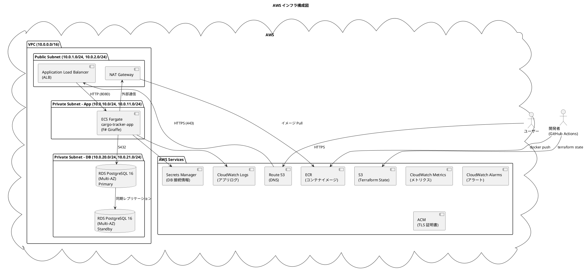
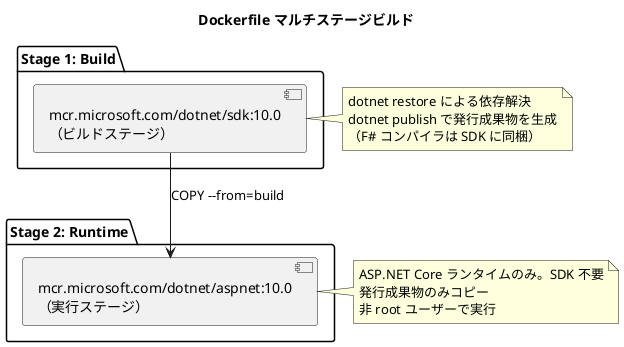
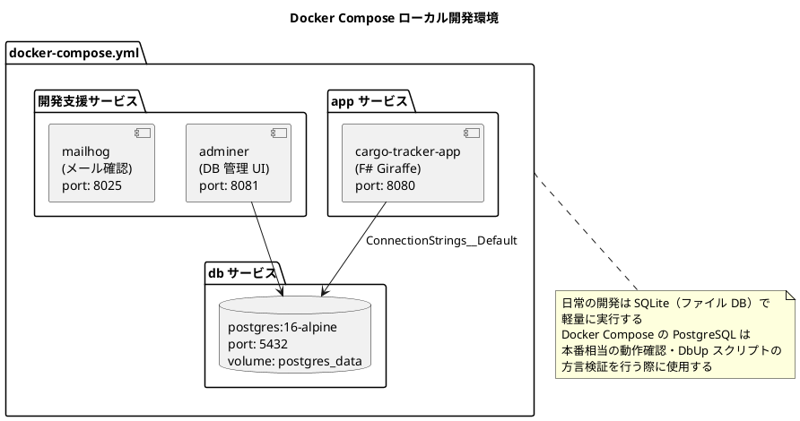
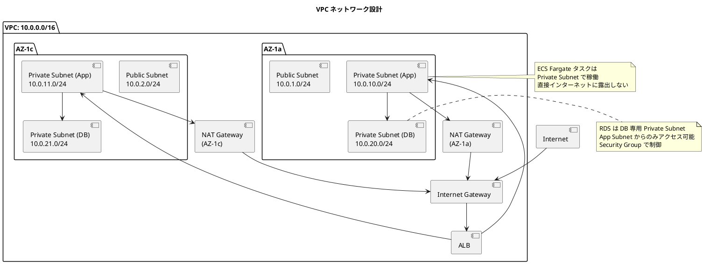
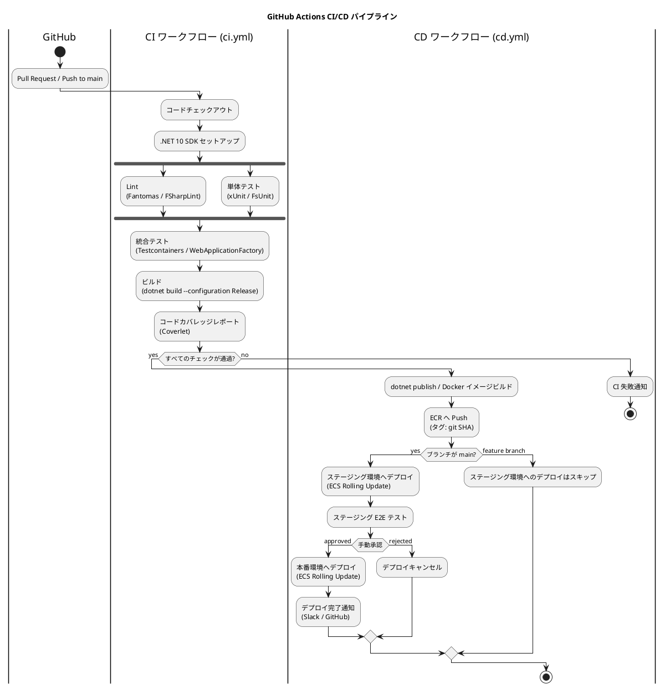
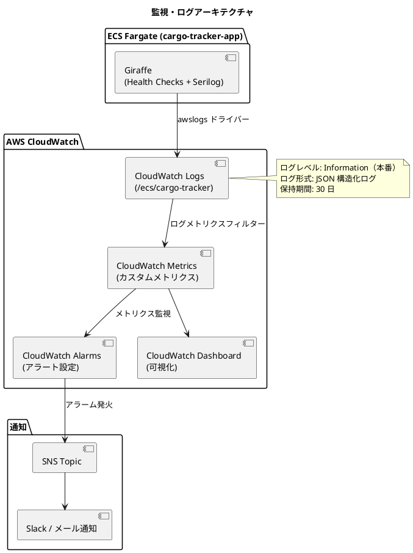
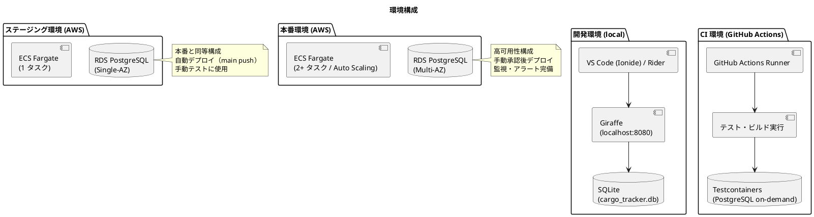
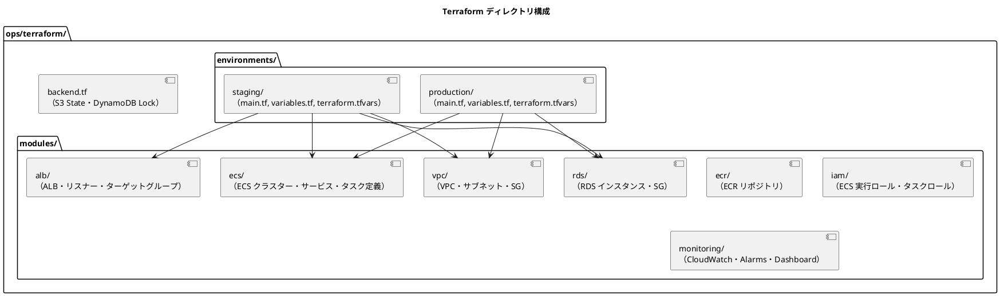

# インフラアーキテクチャ - 国際貨物輸送管理システム

## 概要

本ドキュメントでは、国際貨物輸送管理システムのインフラアーキテクチャを定義します。
コンテナ化された F# 9 + Giraffe（.NET 10）アプリケーションを **AWS ECS Fargate** 上で稼働させ、
**RDS PostgreSQL** でデータを永続化します。
**Terraform** によるインフラの IaC 管理と **GitHub Actions** による CI/CD パイプラインを整備します。

## インフラ構成図



## コンテナ化戦略

### Dockerfile 設計方針

マルチステージビルドを採用し、本番イメージのサイズを最小化します。



Dockerfile の設計原則：

| 原則 | 内容 |
| :--- | :--- |
| **マルチステージビルド** | ビルド依存関係（SDK・F# コンパイラ）を本番イメージに含めない |
| **非 root ユーザー** | `adduser` でアプリケーション専用ユーザー（または組み込みの `app` ユーザー）を作成して実行 |
| **レイヤーキャッシュの最適化** | 依存関係（`*.fsproj`）を先にコピーして `dotnet restore` し、ソースコードのコピーを後にする |
| **ヘルスチェック** | `HEALTHCHECK` で ASP.NET Core Health Checks の `/healthz` を使用 |
| **環境変数による設定** | DB 接続情報等は `ENV` / 実行時環境変数で注入。コードにハードコードしない |

### Docker Compose ローカル開発環境



## AWS 構成

### ECS Fargate 構成

| 設定項目 | 値 | 説明 |
| :--- | :--- | :--- |
| クラスター名 | `cargo-tracker-cluster` | ECS クラスター |
| タスク定義 | `cargo-tracker-app` | F# Giraffe コンテナ定義 |
| CPU | 512 (0.5 vCPU) | 初期設定。負荷に応じてスケール |
| メモリ | 1024 MB | .NET GC（Server GC / ヒープ制限）設定に合わせて調整 |
| 希望タスク数 | 2 | 最小稼働台数（高可用性） |
| 最大タスク数 | 6 | Auto Scaling 上限 |
| サービスディスカバリ | ALB ターゲットグループ | ヘルスチェック経由でルーティング |

### VPC・ネットワーク設計



### セキュリティグループ設計

| SG 名 | インバウンドルール | アウトバウンドルール | 用途 |
| :--- | :--- | :--- | :--- |
| `sg-alb` | 0.0.0.0/0: 443 (HTTPS) | ECS SG: 8080 | ALB |
| `sg-ecs-app` | ALB SG: 8080 | RDS SG: 5432, 0.0.0.0/0: 443 | ECS Fargate タスク |
| `sg-rds` | ECS SG: 5432 | - | RDS PostgreSQL |

### RDS 構成

| 設定項目 | 値 | 説明 |
| :--- | :--- | :--- |
| エンジン | PostgreSQL 16.x | 本番 DB |
| インスタンスクラス | `db.t3.medium` | 初期設定 |
| マルチ AZ | 有効 | フェイルオーバー対応 |
| 自動バックアップ | 7 日間保持 | 日次スナップショット |
| 暗号化 | 有効（AWS KMS） | データの暗号化 |
| パラメータグループ | カスタム | `shared_buffers`、`max_connections` 等の最適化 |

## CI/CD パイプライン



### GitHub Actions ワークフロー構成

| ワークフロー | トリガー | 内容 |
| :--- | :--- | :--- |
| `ci.yml` | PR / push | Lint・テスト・ビルド・カバレッジ（`dotnet restore` → `fantomas --check` / `dotnet fsharplint` → `dotnet build` → `dotnet test`） |
| `cd-staging.yml` | main push | ステージング環境への自動デプロイ |
| `cd-production.yml` | 手動承認 / release タグ | 本番環境へのデプロイ |
| `terraform-plan.yml` | infra/ 変更の PR | `terraform plan` 結果を PR にコメント |
| `terraform-apply.yml` | infra/ 変更の main push | `terraform apply` でインフラ更新 |

### デプロイ戦略

| 戦略 | 環境 | 内容 |
| :--- | :--- | :--- |
| **ローリングアップデート** | ステージング・本番 | ECS の `minimumHealthyPercent: 50`, `maximumPercent: 200` でゼロダウンタイムデプロイ |
| **ロールバック** | 本番 | 前バージョンの ECR イメージ SHA で `ecs update-service` を実行 |
| **Blue/Green** | 将来対応 | CodeDeploy + ALB の B/G デプロイ（高トラフィック時に検討） |

## 監視・ログ設計



### 監視項目

| 監視カテゴリー | メトリクス | 閾値（例） | アクション |
| :--- | :--- | :--- | :--- |
| **アプリケーション** | HTTP 5xx エラー率 | 5% 以上 | アラート → Slack 通知 |
| **アプリケーション** | レスポンスタイム（P99） | 3 秒以上 | アラート → Slack 通知 |
| **ECS** | CPU 使用率 | 80% 以上 | Auto Scaling トリガー |
| **ECS** | メモリ使用率 | 80% 以上 | アラート |
| **RDS** | DB 接続数 | 上限の 80% | アラート |
| **RDS** | レプリケーション遅延 | 60 秒以上 | アラート |
| **ALB** | HealthyHostCount | 0 | 緊急アラート（PagerDuty 等） |

### ログ設計

| ログ種別 | 出力先 | 形式 | 内容 |
| :--- | :--- | :--- | :--- |
| アプリケーションログ | CloudWatch Logs `/ecs/cargo-tracker` | JSON | リクエスト・ビジネスイベント・エラー |
| アクセスログ | ALB Access Logs → S3 | ALB 形式 | HTTP アクセス履歴 |
| 監査ログ | CloudWatch Logs `/ecs/cargo-tracker/audit` | JSON | 荷役登録・予約変更等の重要操作 |
| DB 低速クエリログ | RDS → CloudWatch Logs | PostgreSQL 形式 | 1 秒以上のクエリ |

構造化ログの形式（JSON）：

```json
{
  "timestamp": "2026-07-06T10:00:00.000Z",
  "level": "Information",
  "traceId": "abc123",
  "userId": "user-001",
  "context": "booking",
  "message": "貨物予約を登録しました",
  "bookingId": "BK-2026-0001"
}
```

## 環境構成



### 環境別設定一覧

| 設定項目 | ローカル | ステージング | 本番 |
| :--- | :--- | :--- | :--- |
| DB | SQLite（ファイル） | RDS（Single-AZ） | RDS（Multi-AZ） |
| ECS タスク数 | - | 1 | 2〜6（Auto Scaling） |
| ログレベル | Debug | Information | Information |
| ASPNETCORE_ENVIRONMENT | `Development` | `Staging` | `Production` |
| DB マイグレーション | 自動（起動時に DbUp 実行） | 自動（起動時に DbUp 実行） | 自動（起動時に DbUp 実行） |
| マイグレーションのクリーン実行 | 許可 | 禁止 | 禁止 |
| シークレット管理 | `.env` / User Secrets | AWS Secrets Manager | AWS Secrets Manager |

## Terraform IaC 構成



Terraform の運用方針：

| 原則 | 内容 |
| :--- | :--- |
| **State の S3 管理** | `terraform.tfstate` を S3 バケットで管理。DynamoDB でステートロック |
| **モジュール分割** | 再利用可能なコンポーネントはモジュール化。ステージング・本番で同一モジュールを使用 |
| **機密情報の管理** | `terraform.tfvars` に DB パスワード等を含めない。AWS Secrets Manager または環境変数で管理 |
| **Plan レビュー** | `terraform apply` 前に必ず `terraform plan` を実施し、変更内容をレビュー |
| **Drift 検出** | 定期的に `terraform plan` を実行し、コードと実環境の乖離を検出する |

## .NET ランタイムチューニング

コンテナ環境（0.5 vCPU / 1024 MB）に合わせて .NET ランタイムを調整します。

| 設定項目 | 値（例） | 説明 |
| :--- | :--- | :--- |
| `DOTNET_gcServer` | `0`（Workstation GC） | 1 vCPU 未満のタスクでは Server GC よりメモリ効率が良い |
| `DOTNET_GCHeapHardLimitPercent` | `75` | コンテナメモリ上限に対するヒープ上限を明示し OOM Kill を防ぐ |
| `DOTNET_ThreadPool_MinThreads` | 負荷特性に応じて調整 | ThreadPool のスレッド枯渇によるレイテンシ悪化を防ぐ |
| `ASPNETCORE_URLS` | `http://+:8080` | ALB ターゲットグループのポートと一致させる |
| Health Checks | `/healthz`（liveness）、`/healthz/ready`（readiness） | ALB・ECS のヘルスチェックエンドポイントとして使用 |
