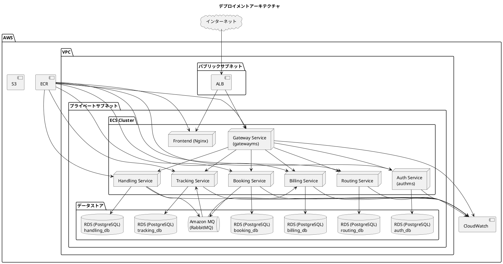
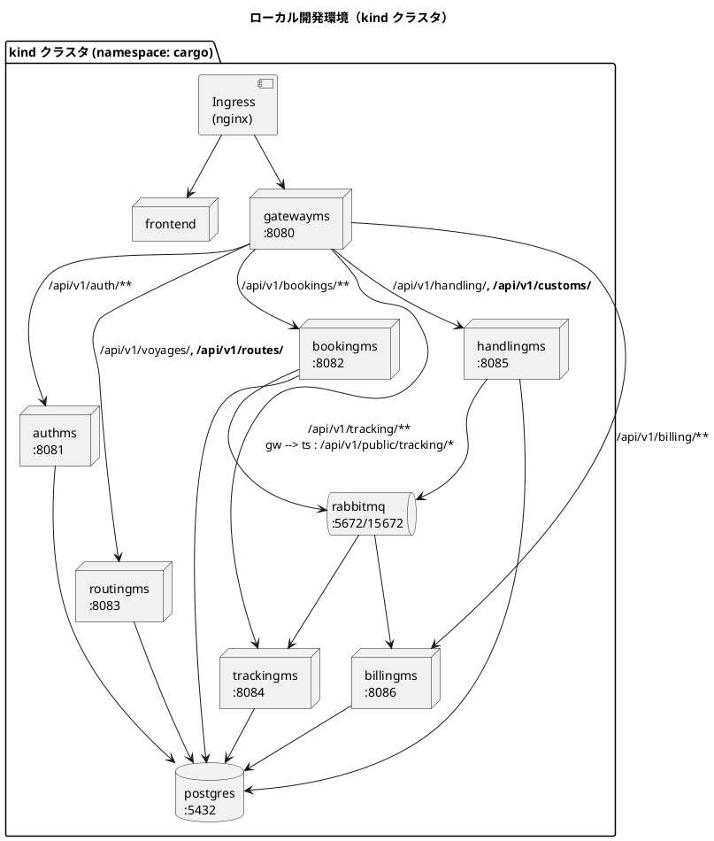
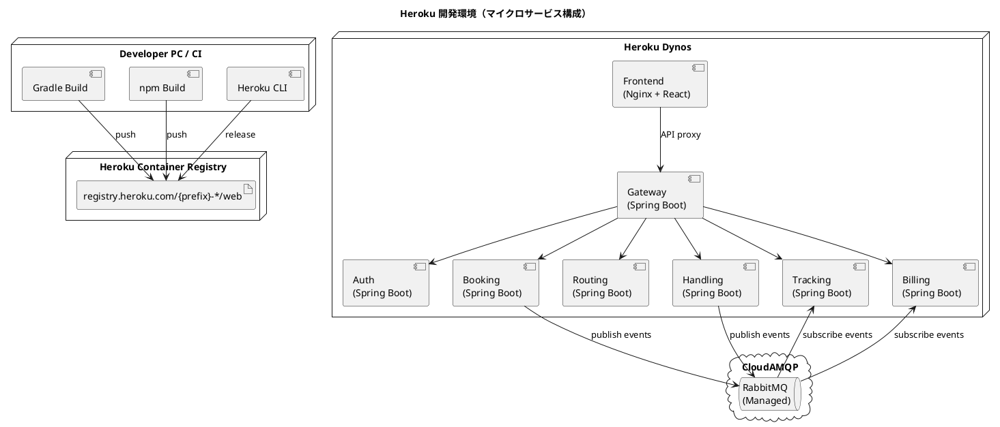
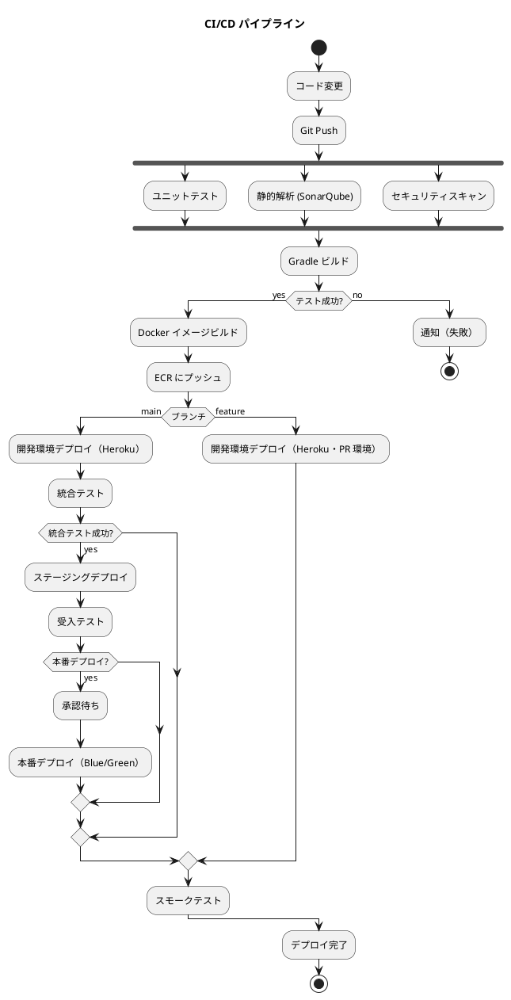
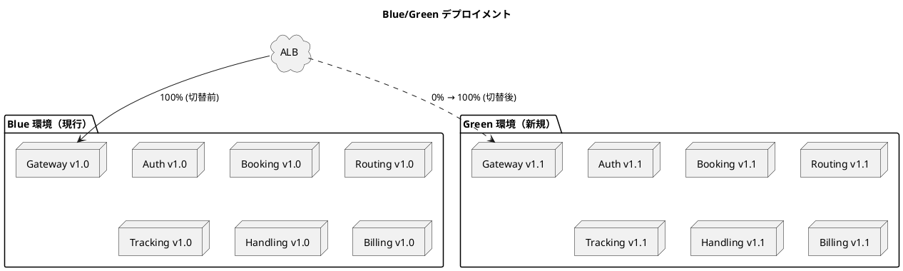

# インフラストラクチャアーキテクチャ設計

## 概要

マイクロサービスアーキテクチャを採用したバックエンドと React SPA フロントエンドを、コンテナベースのインフラ上で運用する。ローカル開発環境は Kubernetes（kind）+ Kustomize、開発環境（結合テスト）は Heroku Container Registry / Runtime、ステージング・本番環境は AWS ECS（Fargate）を想定する。
ローカルの Kustomize 構成は [Docker/Kubernetes 入門記事のケーススタディ 2（イベント駆動マイクロサービス）](../article/getting-start-docker-kubernetes/14-case-event-driven-kustomize-vs-helm.md) を参考にする。

## デプロイメントアーキテクチャ

### 全体構成



## 環境構成

### 環境一覧

| 環境 | 用途 | インフラ | デプロイ方式 |
| :--- | :--- | :--- | :--- |
| ローカル開発 | 開発者の PC | Kubernetes（kind）+ Kustomize | kubectl apply -k |
| 開発 | 結合テスト | Heroku Container Registry / Runtime + CloudAMQP | Heroku CLI / CI 自動デプロイ |
| ステージング | 受入テスト | AWS ECS (Fargate) | CI/CD 自動デプロイ |
| 本番 | 商用運用 | AWS ECS (Fargate) | CI/CD + 承認ゲート |

### ローカル開発環境（Kubernetes + Kustomize）

ローカルは kind クラスタ上に Kustomize で全サービスをデプロイする。素の Kubernetes マニフェストを base（共通の土台）と overlay（環境ごとの差分）に分け、テンプレート言語を使わずに合成する。`kubectl` に同梱されているため追加インストールは不要。



#### Kustomize ディレクトリ構成

```
ops/k8s/kustomize/
├── base/
│   ├── kustomization.yaml      # 束ねる定義 + configMapGenerator + images
│   ├── namespace.yaml
│   ├── secret.yaml             # DB 認証（ローカル用）
│   ├── init-databases.sql      # 6 DB 作成（ConfigMap 化）
│   ├── postgres.yaml
│   ├── rabbitmq.yaml
│   ├── authms.yaml             # ┐
│   ├── bookingms.yaml          # │ サービスごとに Deployment + Service を記述
│   ├── routingms.yaml          # │
│   ├── trackingms.yaml         # │
│   ├── handlingms.yaml         # │
│   ├── billingms.yaml          # ┘
│   ├── gatewayms.yaml
│   ├── frontend.yaml
│   └── ingress.yaml
└── overlays/
    └── local/
        └── kustomization.yaml  # ローカル差分（replicas: 1, イメージタグ等）
```

- 各バックエンドサービスは Deployment + Service を 1 ファイルにまとめ、DB 接続先・RabbitMQ 要否は `env` で切り替える。DB 認証は `secretKeyRef` で参照する
- 6 DB の初期化 SQL は `configMapGenerator` で ConfigMap 化し、postgres の初期化ボリュームにマウントする
- イメージタグは `kustomization.yaml` の `images` で集中管理する
- DB 起動待ちの再起動は `readinessProbe` の範囲で復帰させる（起動順序制御は作り込まない）

#### デプロイと動作確認

```bash
# 全サービスの jar を一度にビルドし、サービスごとにイメージ化
cd apps/backend && ./gradlew bootJar -x test
for s in gatewayms authms bookingms routingms trackingms handlingms billingms; do
  docker build -t "cargo-$s:0.0.1" "$s"
done
cd ../frontend && docker build -t cargo-frontend:0.0.1 .

# kind クラスタへイメージをロードして適用
kind load docker-image cargo-gatewayms:0.0.1 ...  # 8 イメージ分
kubectl kustomize ops/k8s/kustomize/overlays/local   # 合成結果の確認（クラスタに影響なし）
kubectl apply -k ops/k8s/kustomize/overlays/local
kubectl -n cargo get pods                             # 10 Pod がすべて 1/1 Running
```

> ローカルでは PostgreSQL 1 台の中に各サービス専用のデータベース（auth_db〜billing_db）を作成する。
> Database per Service の論理分離は保ちつつ、開発の起動コストを抑える。
> Kustomize の base はローカル・CI（統合テスト）で共有し、環境差分は overlay のみに置く。

### 開発環境（Heroku Container Registry / Runtime）

結合テスト用の開発環境は Heroku で運用する（take-3 の開発環境セットアップ手順書を踏襲）。各マイクロサービスとフロントエンドを個別の Heroku アプリとしてデプロイし、`product` profile（H2 メモリ DB + CloudAMQP）で動作確認を行う。

| 項目 | 内容 |
| :--- | :--- |
| 実行基盤 | Heroku Container Registry / Runtime（container stack） |
| デプロイ方式 | サービスごとに個別の Heroku アプリ |
| 命名規則 | `{prefix}-{service}`（例: `ct-gatewayms`） |
| データベース | H2（インメモリ）。`DB_URL` 等で将来 PostgreSQL に切替可能 |
| メッセージブローカー | CloudAMQP（Heroku アドオン / RabbitMQ マネージド、AMQPS/TLS 接続） |
| HTTP ポート | Heroku が注入する `$PORT` |
| Spring profile | `SPRING_PROFILES_ACTIVE=product`（Config Vars で設定、JMX 無効化） |



| サービス | Heroku アプリ名 |
| :--- | :--- |
| API Gateway | `{prefix}-gatewayms` |
| Auth Service | `{prefix}-authms` |
| Booking Service | `{prefix}-bookingms` |
| Routing Service | `{prefix}-routingms` |
| Tracking Service | `{prefix}-trackingms` |
| Handling Service | `{prefix}-handlingms` |
| Billing Service | `{prefix}-billingms` |
| Frontend | `{prefix}-frontend` |

- Heroku Container Runtime は `x86_64` イメージのみサポートするため、Apple Silicon では `linux/amd64` でビルドする
- Heroku Dev Center では container stack は高度な用途向けとされるが、Docker イメージを明示的に管理するため採用する
- 具体的なセットアップ手順・Config Vars・デプロイコマンドは `docs/operation/` の開発環境セットアップ手順書に記載する

### プロファイル構成

| プロファイル | DB | RabbitMQ | 用途 |
| :--- | :--- | :--- | :--- |
| `local` | PostgreSQL（kind 内） | RabbitMQ（kind 内） | ローカル開発 |
| `product` | H2 メモリ DB | CloudAMQP（AMQPS） | Heroku 開発環境 |
| `staging` / `production` | RDS PostgreSQL | Amazon MQ | ステージング・本番 |

## ネットワーク設計

### VPC 設計

| サブネット | CIDR | 用途 |
| :--- | :--- | :--- |
| パブリック A | 10.0.1.0/24 | ALB, NAT Gateway |
| パブリック B | 10.0.2.0/24 | ALB（冗長化） |
| プライベート A | 10.0.11.0/24 | ECS タスク |
| プライベート B | 10.0.12.0/24 | ECS タスク（冗長化） |
| プライベート C | 10.0.21.0/24 | RDS, Amazon MQ |
| プライベート D | 10.0.22.0/24 | RDS（冗長化） |

### セキュリティグループ

| セキュリティグループ | インバウンド | 用途 |
| :--- | :--- | :--- |
| alb-sg | 80, 443 from 0.0.0.0/0 | ALB |
| ecs-sg | 8080-8086 from alb-sg | ECS タスク |
| rds-sg | 5432 from ecs-sg | RDS |
| mq-sg | 5672 from ecs-sg | Amazon MQ |

## コンテナ設計

### Dockerfile（バックエンドサービス共通）

```dockerfile
FROM eclipse-temurin:25-jre-alpine
WORKDIR /app
COPY build/libs/*.jar app.jar
EXPOSE 8080
ENTRYPOINT ["java", "-jar", "app.jar"]
```

### Dockerfile（フロントエンド）

```dockerfile
FROM node:22-alpine AS build
WORKDIR /app
COPY package*.json ./
RUN npm ci
COPY . .
RUN npm run build

FROM nginx:alpine
COPY --from=build /app/dist /usr/share/nginx/html
COPY nginx.conf /etc/nginx/conf.d/default.conf
EXPOSE 80
```

### コンテナリソース設定

| サービス | CPU | メモリ | 最小タスク数 | 最大タスク数 |
| :--- | :--- | :--- | :--- | :--- |
| Auth Service | 256 | 512 MB | 2 | 4 |
| Booking Service | 512 | 1024 MB | 2 | 4 |
| Routing Service | 256 | 512 MB | 2 | 4 |
| Tracking Service | 512 | 1024 MB | 2 | 6 |
| Handling Service | 512 | 1024 MB | 2 | 4 |
| Billing Service | 256 | 512 MB | 1 | 2 |
| Frontend | 256 | 512 MB | 2 | 4 |
| API Gateway | 256 | 512 MB | 2 | 4 |

## CI/CD パイプライン



### CI/CD ツール

| カテゴリ | ツール | 用途 |
| :--- | :--- | :--- |
| CI | GitHub Actions | ビルド・テスト・静的解析 |
| CD | GitHub Actions | デプロイ自動化 |
| コンテナレジストリ | Amazon ECR | Docker イメージ管理 |
| IaC | Terraform | インフラプロビジョニング |
| 品質ゲート | SonarQube | コード品質・カバレッジ |

> CI はサービス単位のパスフィルタで変更のあったマイクロサービスのみビルド・デプロイする（モノレポでの独立デプロイ）。
> セキュリティ走査は導入失敗と検出が区別できるよう公式イメージの直接実行とする。

## デプロイメント戦略

### Blue/Green デプロイメント（本番環境）



- 本番環境: Blue/Green デプロイメントで即座にロールバック可能
- 開発環境（Heroku）: `heroku container:release` による単純な入れ替え
- ステージング: ローリングアップデートで迅速にデプロイ
- イベントスキーマの変更は後方互換を保ち、コンシューマ（trackingms, billingms）を先にデプロイする

## 監視・ログ管理

### 監視対象

| カテゴリ | 監視項目 | ツール | アラート閾値 |
| :--- | :--- | :--- | :--- |
| インフラ | CPU/メモリ使用率 | CloudWatch | CPU > 80% |
| アプリケーション | レスポンスタイム | CloudWatch | p99 > 3s |
| アプリケーション | エラー率 | CloudWatch | > 1% |
| データベース | 接続数 | CloudWatch | > 80% |
| メッセージング | キュー深度 / DLQ 滞留 | CloudWatch | 深度 > 1000, DLQ > 0 |

> ヘルスチェック（liveness / readiness）はレートリミット等の横断的防御の対象外とする（過負荷時の再起動ループを防ぐ）。

### ログ管理

| ログ種別 | 保存先 | 保持期間 |
| :--- | :--- | :--- |
| アプリケーションログ | CloudWatch Logs | 30 日 |
| アクセスログ | CloudWatch Logs | 90 日 |
| 監査ログ（通関状態変更・キャンセル承認・認証試行） | S3 | 1 年 |

## バックアップ・災害復旧

### バックアップ戦略

| 対象 | 方式 | 頻度 | 保持期間 |
| :--- | :--- | :--- | :--- |
| RDS | 自動スナップショット | 日次 | 7 日 |
| RDS | 手動スナップショット | リリース前 | 30 日 |

### RPO/RTO

| 指標 | 目標値 |
| :--- | :--- |
| RPO | 1 時間以内 |
| RTO | 4 時間以内 |

## セキュリティ

### 多層防御

| 層 | 対策 |
| :--- | :--- |
| ネットワーク | VPC, セキュリティグループ, プライベートサブネット |
| 通信 | TLS/SSL (ACM), HTTPS 強制 |
| 認証・認可 | Spring Security + JWT（Gateway で検証）、アカウントロック（US31） |
| データ保護 | RDS 暗号化（AES-256）、S3 暗号化 |
| アプリケーション | 入力検証、OWASP 対策 |

## コスト見積（月額概算）

| リソース | スペック | 月額概算 |
| :--- | :--- | :--- |
| ECS Fargate | 8 サービス × 2 タスク（gateway/auth/booking/routing/tracking/handling/billing/frontend） | $280 |
| RDS PostgreSQL | db.t3.medium × 6 | $600 |
| Amazon MQ | mq.m5.large | $200 |
| ALB | 1 台 | $30 |
| CloudWatch | ログ・メトリクス | $50 |
| ECR | イメージストレージ | $10 |
| **合計** | | **$1,170** |

> コストが制約になる場合の縮退案: ステージングは RDS を 1 インスタンス内の複数 DB に集約し（論理分離は維持）、Amazon MQ を小さいインスタンスにする。開発環境は Heroku の低コスト dyno + CloudAMQP 無料プランで賄う。

## 参照

- [バックエンドアーキテクチャ設計](architecture_backend.md)
- [フロントエンドアーキテクチャ設計](architecture_frontend.md)
- [アーキテクチャ設計ガイド](../reference/アーキテクチャ設計ガイド.md)
