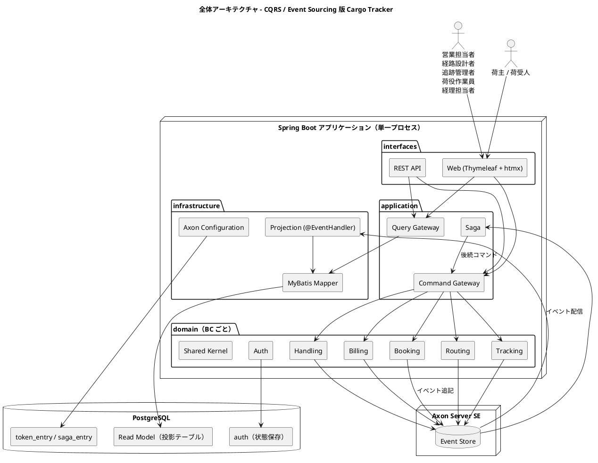
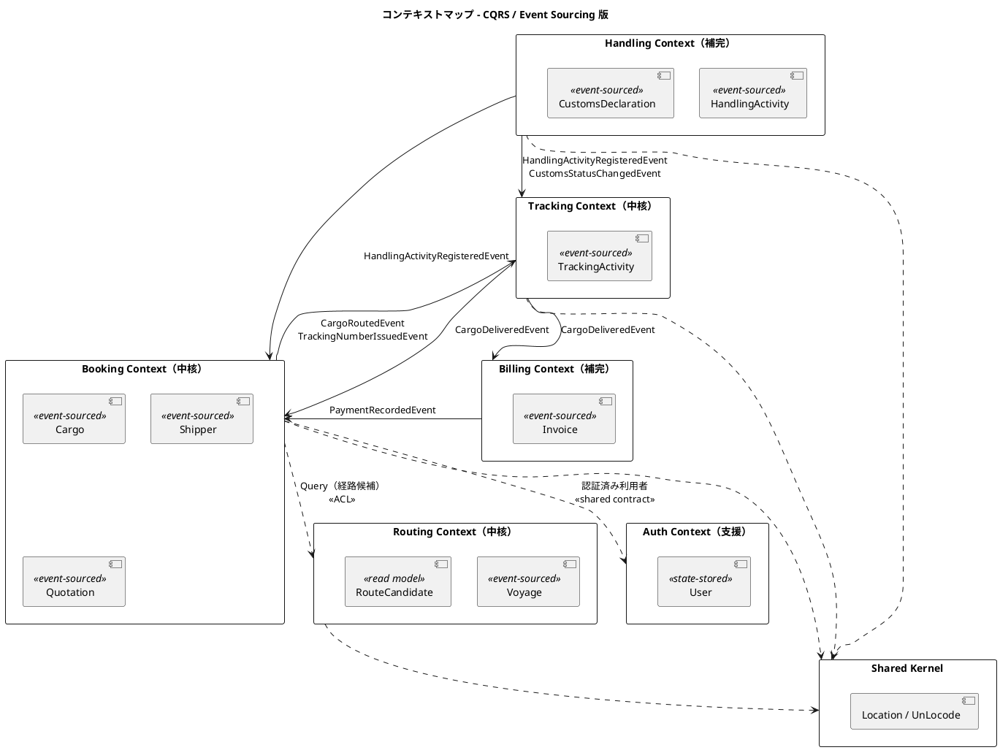
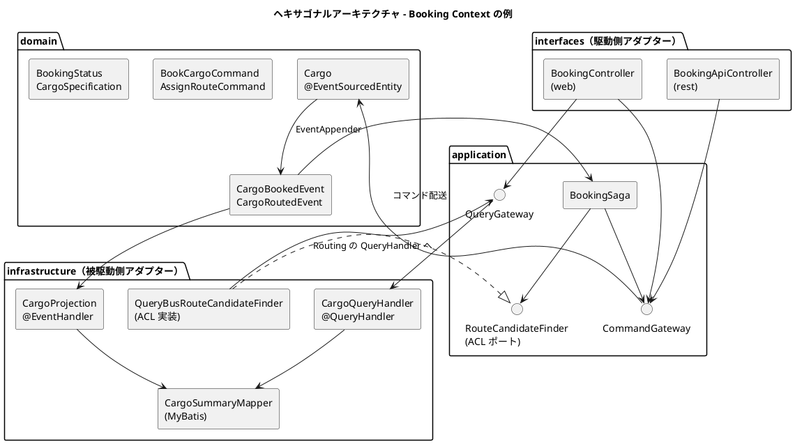
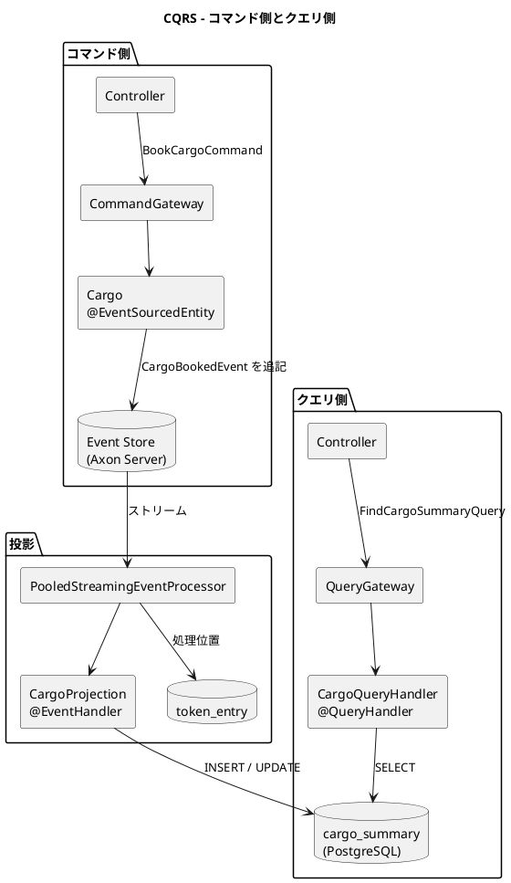
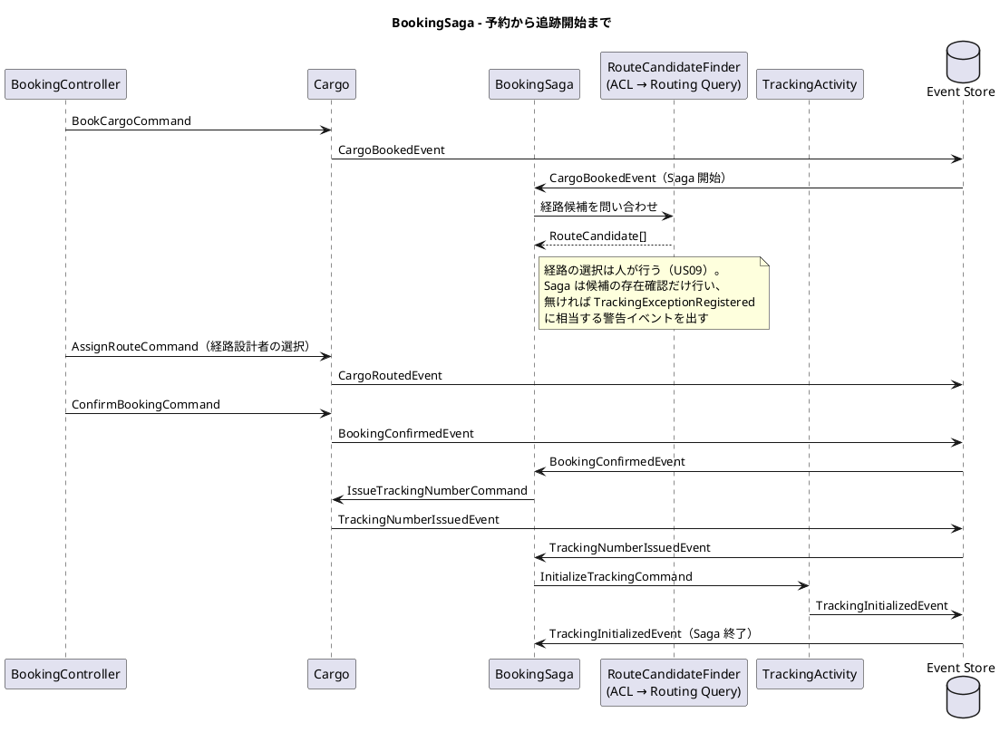

# バックエンドアーキテクチャ - 国際貨物輸送管理システム（CQRS / Event Sourcing 版）

## 概要

国際貨物輸送管理システム（Cargo Tracker）を、**Axon Framework 5 による CQRS + Event Sourcing** で再構成するためのバックエンドアーキテクチャ設計です。

本設計は次の 2 つの参照元を土台にしています。両者は別々の実装であり、設計判断がそのまま引き継がれているわけではありません。本設計がどちらから何を採り、何を変えたかは「参照元との対応」に記します。

| 参照元 | 実装の形 | 本設計が採るもの | 本設計が変えるもの |
| :--- | :--- | :--- | :--- |
| `tmp/take-4/docs/design/`（`java/take-4`） | マイクロサービス 7 + Gateway、Axon Framework 5 + Axon Server、MyBatis Read Model | Axon 5 の Entity API・Event Store・Projection・Saga の設計と、ADR-0007〜0009 で実機検証された統合パターン | サービス分割をやめ、**単一の Spring Boot アプリケーション（モジュラーモノリス）** にする |
| `docs/article/source/java-3/docs/design/`（`java/take-7`） | マイクロサービス 8 + 共有ライブラリ、RabbitMQ、現在状態を直接 UPDATE | BC の切り方、ヘキサゴナルの配置、ACL ポートの置き場、ドメインイベント契約の考え方（ADR-022） | RabbitMQ と手書きの発行・購読を Axon の Event Bus に置き換え、集約の永続化を **イベント列** にする |

**なぜモノリスに戻すのか。** 記事シリーズ「エンタープライズ Java における実践的 DDD」は、第 3 章がモジュラーモノリス（`java-2`）、第 4 章がプロセスを越えるイベント（`java-3`）を扱っています。第 5 章の主題は **CQRS / Event Sourcing そのもの**です。ここでマイクロサービスにすると、第 4 章で払った代金（契約テスト・デッドレター・結果整合の可視化）と、Event Sourcing の代金（イベント設計・投影・リプレイ・スナップショット）が混ざり、どちらが何を要求したのか読めなくなります。**変える軸を 1 つに絞る**ため、本設計はプロセス境界を第 3 章の形に戻し、永続化と読み書きの分離だけを変えます。判断の記録は [ADR-0001](../../adr/cargo-tracker/0001-cqrs-es-with-axon-in-modular-monolith.md) です。

### 技術基盤（調査時点 2026-09-02）

| 項目 | 採用 | 備考 |
| :--- | :--- | :--- |
| 言語 / ランタイム | Java 25 LTS | 参照元 2 つと同じ |
| フレームワーク | Spring Boot 4.1 系（Spring Framework 7 系） | 参照元と同系。Jackson 3 が既定 |
| CQRS / ES | Axon Framework 5.3 系 | 4 系の `@Aggregate` / `AggregateLifecycle` は **存在しない**（ADR-0007 の検証結果を引き継ぐ） |
| Event Store | Axon Server 2026.x Standard Edition（単一ノード） | 判断は [ADR-0002](../../adr/cargo-tracker/0002-event-store-axon-server-and-postgresql-read-models.md) |
| Read Model | PostgreSQL 16 + MyBatis 3 + Flyway | 参照元 2 つと同じ。JPA は採らない |
| ビルド | Gradle 9 系、単一モジュール | `settings.gradle` に `include` を書かない（第 3 章と同じ形） |

バージョンは調査時点の値です。実装着手時に `analyzing-tech-stack` で確定し、`tech_stack.md` を正とします。

## アーキテクチャパターン選択

### 業務領域カテゴリーの評価

[アーキテクチャ設計ガイド](../../reference/アーキテクチャ設計ガイド.md) の選択フローに従って評価します。

| 評価軸 | 評価 | 根拠 |
| :--- | :--- | :--- |
| 業務領域のカテゴリー | **中核の業務領域** | 予約・経路設計・追跡は運送会社の競争優位そのもの（[要件定義](../../requirements/requirements_definition.md) §システム価値） |
| データ構造の複雑さ | **複雑** | 予約→経路→追跡→荷役→精算の集約が相互に参照し、状態遷移表（貨物予約・追跡情報）を持つ |
| 金額を扱うか | **扱う** | 輸送料金算出・法人割引・精算（US21〜US23） |
| 監査記録が必要か | **必要** | 遅延・破損・紛失の例外処理（US19・US20）、誤配の再設計（US28）、通関申告（US29）は「いつ・誰が・何を根拠に」の履歴が問われる |
| 永続化モデルは複数か | **複数** | 書き込みはイベント列、読み取りは画面ごとの投影テーブル |

フローの結論は **イベント履歴式ドメインモデル + CQRS + ピラミッド形のテスト**です。参照元 `java-3` は「初期フェーズには複雑すぎる」として Event Sourcing を見送りました（`java-3` ADR-001）。本設計はその判断を否定するのではなく、**見送った選択肢を実際に払って比較できるようにする**ために採ります。

### 選択したアーキテクチャパターン

| パターン | 適用範囲 | 理由 |
| :--- | :--- | :--- |
| ドメインモデル | 全 BC | 業務ルールを集約に置く（参照元と同じ） |
| ポートとアダプター（ヘキサゴナル） | 全 BC | ドメインを Spring / Axon / MyBatis から切り離す |
| CQRS | 全 BC | コマンド側は集約、クエリ側は投影テーブルの MyBatis |
| Event Sourcing | Booking・Routing・Tracking・Handling・Billing | 履歴と監査が要る集約。**Auth と共有カーネルには適用しない** |
| Saga（プロセスマネージャ） | Booking を起点とする予約〜追跡開始、Tracking を起点とする配送完了〜精算 | 複数集約にまたがる業務連鎖を補償つきで調整する |
| モジュラーモノリス | 配置 | BC はパッケージ、プロセスは 1 つ。境界は ArchUnit で守る |

### 採用しないものと理由

| 採用しないもの | 理由 |
| :--- | :--- |
| マイクロサービス分割 | 変える軸を Event Sourcing に絞る（前述）。第 4 章との対比表を成立させる |
| JPA / Hibernate | 参照元 2 つが ADR で退けた判断を維持する。Read Model は MyBatis の SQL で画面ごとに最適化する |
| RabbitMQ / Kafka | 単一プロセスでは Axon の Event Bus と Event Store で足りる。外部へ出す必要が生じた時点で ADR を起こす |
| Auth の Event Sourcing | ユーザーとロックは現在状態だけが業務に要る。履歴は監査ログテーブルで足りる |
| Axon Server Enterprise | 単一ノードで学習目標を満たす。可用性要件は `non_functional.md` で扱い、必要なら再評価する |

## 全体アーキテクチャ



プロセスは 1 つですが、**書き込みの経路と読み取りの経路は交わりません**。画面はコマンドを Command Gateway に送り、結果は投影テーブルを Query Gateway 経由で読みます。集約は投影テーブルを読まず、投影はイベントだけを入力にします。

## 境界付けられたコンテキスト

### コンテキストマップ



矢印の実線は **イベント**（Axon Event Bus）、点線は **同期の問い合わせ**（Query Gateway 経由の ACL）です。BC 越しに状態を変える同期呼び出しは置きません。BC をまたぐ状態変更はすべてイベント、またはイベントを受けた Saga が発行するコマンドです。この線引きは `java-2` ADR-009 と同じで、違いは「同期の問い合わせ」も Axon の Query Bus を通ることです。

### 各コンテキストの説明

| BC | 分類 | 集約ルート | 永続化 | 主なアクター | 参照元での対応 |
| :--- | :--- | :--- | :--- | :--- | :--- |
| Booking | 中核 | `Cargo` / `Shipper` / `Quotation` | Event Sourcing | 営業担当者、荷主 | take-4 bookingms |
| Routing | 中核 | `Voyage` | Event Sourcing（経路候補は読み取り側） | 経路設計者 | take-4 routingms |
| Tracking | 中核 | `TrackingActivity` | Event Sourcing | 追跡管理者、荷主・荷受人 | take-4 trackingms |
| Handling | 補完 | `HandlingActivity` / `CustomsDeclaration` | Event Sourcing | 荷役作業員 | java-3 handlingms（通関申告 UC21） |
| Billing | 補完 | `Invoice` | Event Sourcing | 経理担当者 | take-4 billingms |
| Auth | 支援 | `User` | **状態保存（MyBatis）** | 全利用者 | java-3 authms（US31 アカウント保護） |
| Shared Kernel | 共有 | なし（`Location` / `UnLocode` の値オブジェクト） | なし | — | 両参照元とも `Location` のみ |

共有カーネルは `Location` / `UnLocode` と認証契約（`AuthenticatedUser` / `Role`）に限ります。`VoyageNumber` や `BookingId` は BC ごとに別の型として定義します。同じ予約を指す識別子が BC の数だけあるのは重複ではなく、境界を分けた代金です（`java-2` ADR-005 の判断を引き継ぐ）。

## ヘキサゴナルアーキテクチャ（ポートとアダプター）



### レイヤー責務一覧

| レイヤー | 責務 | 置くもの | 置かないもの |
| :--- | :--- | :--- | :--- |
| `domain` | 業務ルール。イベントを生む | `@EventSourcedEntity`、コマンド / イベントの `record`、値オブジェクト、ドメインサービス | Spring・MyBatis・Axon の設定。Axon の**アノテーションだけ**は許す（後述） |
| `application` | ユースケースの順序、Saga、ACL ポートの定義 | `@Saga`、出力ポート（interface）、Command / Query Gateway の利用 | SQL、HTTP |
| `infrastructure` | 投影、問い合わせ、ACL の実装、Axon の設定 | `@EventHandler` の Projection、`@QueryHandler`、MyBatis Mapper、`AxonConfig` | 業務ルール |
| `interfaces` | 入出力 | Thymeleaf + htmx の Controller、REST Controller、DTO | ドメインの直接操作（必ず Gateway を通す） |

**ドメイン層が Axon のアノテーションに依存すること**は、参照元 `take-4` と同じく許容します。`@EventSourcedEntity` / `@CommandHandler` / `@EventSourcingHandler` はコンパイル時依存だけで、実行時のフレームワーク呼び出しをドメインに持ち込みません。ArchUnit では「ドメイン層は Spring に依存しない」「ドメイン層は MyBatis に依存しない」を守り、Axon については `org.axonframework..annotation..` と `EventAppender` のみを許可リストにします。許可リストに無い Axon の型をドメインが使えば赤になります。

### パッケージ構成（正典）

```text
apps/cargo-tracker/src/main/java/com/example/cargotracker/
├── CargoTrackerApplication.java
├── shared/                                 # 共有カーネル + 横断
│   ├── domain/model/{Location, UnLocode}
│   ├── domain/auth/{AuthenticatedUser, Role}
│   └── infrastructure/axon/                # AxonConfig, JDBC TokenStore / SagaStore, Jackson シリアライザ
├── booking/
│   ├── domain/
│   │   ├── model/
│   │   │   ├── aggregates/Cargo.java       # @EventSourcedEntity(tagKey = "bookingId")
│   │   │   ├── commands/BookCargoCommand.java
│   │   │   ├── events/CargoBookedEvent.java
│   │   │   └── valueobjects/{BookingId, BookingStatus, CargoSpecification, ...}
│   │   └── service/                        # ドメインサービス（集約に入らない計算）
│   ├── application/
│   │   ├── saga/BookingSaga.java
│   │   └── port/RouteCandidateFinder.java  # ACL ポート（利用側が定義）
│   ├── infrastructure/
│   │   ├── projection/CargoProjection.java # @EventHandler → MyBatis
│   │   ├── query/CargoQueryHandler.java    # @QueryHandler
│   │   ├── persistence/CargoSummaryMapper.java
│   │   └── acl/QueryBusRouteCandidateFinder.java
│   └── interfaces/
│       ├── web/BookingController.java
│       └── rest/BookingApiController.java
├── routing/   ... 同じ 4 層
├── tracking/  ... 同じ 4 層
├── handling/  ... 同じ 4 層
├── billing/   ... 同じ 4 層
└── auth/      ... 状態保存のため projection/ と saga/ を持たない
```

`domain/model/` の内側を building block（`aggregates` / `commands` / `events` / `valueobjects`）で分けるのは `java-2` ADR-024 の判断です。イベントは **BC ごとに置き**、`shared` に集めません（`java-2` が `shared/domain/event` に集めていたのとは違う判断）。理由は、Event Sourcing ではイベントが集約の**永続化フォーマット**であり、その所有者は集約を持つ BC だからです。他 BC が購読するイベントは、購読側が自 BC の型に読み替えます。

## CQRS 設計（Axon Framework 5）



### CQRS 適用方針

| 操作 | 側 | 通る経路 | 例 |
| :--- | :--- | :--- | :--- |
| 状態を変える操作 | コマンド | Controller → `CommandGateway` → 集約 → Event Store | 予約登録・経路確定・荷役記録・精算 |
| 一覧・詳細・検索 | クエリ | Controller → `QueryGateway` → `@QueryHandler` → MyBatis | 予約一覧・追跡照会・航海スケジュール検索 |
| 経路候補の算出 | クエリ | Routing の `@QueryHandler` がドメインサービスを呼ぶ | US08（算出は状態を変えない） |
| BC 越しの参照 | クエリ | ACL ポート → `QueryGateway` → 提供側の `@QueryHandler` | Booking Saga が経路候補を要求する |
| BC 越しの状態変更 | イベント → Saga → コマンド | 提供側の `@EventHandler`（投影）または `@Saga` | 荷役登録 → 追跡と予約の更新 |

画面のボタン表示条件は、投影テーブルに写した `status` を読みますが、**遷移してよいかの判定は集約だけが持ちます**。投影で表示を絞っても、集約のコマンドハンドラが同じ規則で拒否します。二重の検査ではなく、表示は投影・判定は集約という分業です。

### Aggregate（Event-Sourced Entity）実装パターン

Axon 5 では「Aggregate」は API 上「Entity」と呼ばれます。参照元 `take-4` ADR-0007 が実機で確定した 5 系の API を、そのまま本設計の標準にします。

```java
package com.example.cargotracker.booking.domain.model.aggregates;

import org.axonframework.eventsourcing.annotation.EventSourcedEntity;
import org.axonframework.eventsourcing.annotation.EventSourcingHandler;
import org.axonframework.eventsourcing.annotation.reflection.EntityCreator;
import org.axonframework.messaging.commandhandling.annotation.CommandHandler;
import org.axonframework.messaging.eventhandling.gateway.EventAppender;

@EventSourcedEntity(tagKey = "bookingId")
public class Cargo {

    private BookingId bookingId;
    private ShipperId shipperId;
    private BookingStatus status;
    private RouteSpecification routeSpecification;

    @EntityCreator
    protected Cargo() {
        // Axon がイベント再生で生成する。コレクション型はここで初期化する
    }

    // 作成系コマンドは static。戻り値は識別子
    @CommandHandler
    public static String book(BookCargoCommand cmd, EventAppender appender) {
        var spec = CargoSpecification.of(cmd.cargoType(), cmd.hazardousDeclaration());
        appender.append(new CargoBookedEvent(
                cmd.bookingId(), cmd.shipperId(), cmd.origin(), cmd.destination(),
                cmd.arrivalDeadline(), spec));
        return cmd.bookingId();
    }

    // 更新系コマンドはインスタンスメソッド。不変条件はここで守る
    @CommandHandler
    public void assignRoute(AssignRouteCommand cmd, EventAppender appender) {
        if (!status.canTransitionTo(BookingStatus.ROUTED)) {
            throw new IllegalBookingStateException(bookingId, status, BookingStatus.ROUTED);
        }
        routeSpecification.requireSatisfiedBy(cmd.itinerary());
        appender.append(new CargoRoutedEvent(bookingId.value(), cmd.itinerary()));
    }

    // 状態の復元。判断を書かない
    @EventSourcingHandler
    public void on(CargoBookedEvent event) {
        this.bookingId = new BookingId(event.bookingId());
        this.shipperId = new ShipperId(event.shipperId());
        this.status = BookingStatus.PRELIMINARY;
        this.routeSpecification = new RouteSpecification(
                event.origin(), event.destination(), event.arrivalDeadline());
    }

    @EventSourcingHandler
    public void on(CargoRoutedEvent event) {
        this.status = BookingStatus.ROUTED;
    }
}
```

```java
public record BookCargoCommand(
        @TargetEntityId String bookingId,
        String shipperId,
        UnLocode origin,
        UnLocode destination,
        LocalDate arrivalDeadline,
        CargoType cargoType,
        HazardousDeclaration hazardousDeclaration) {
}

public record CargoBookedEvent(
        String bookingId, String shipperId,
        UnLocode origin, UnLocode destination,
        LocalDate arrivalDeadline, CargoSpecification specification) {
}
```

| 規則 | 内容 | 由来 |
| :--- | :--- | :--- |
| 作成系は `static`、更新系はインスタンス | Axon 5 の公式パターン | take-4 ADR-0007 |
| `AggregateLifecycle.apply()` は使わない | 5 系に存在しない。`EventAppender` を引数で受ける | take-4 ADR-0007 |
| `@EntityCreator` を必ず宣言 | リフレクションで生成される。コレクション初期化はここ | take-4 ADR-0007 |
| `@EventSourcingHandler` に判断を書かない | 再生時に例外が出ると集約が復元できない | 本設計 |
| 不変条件の検査は `@CommandHandler` | 状態遷移表と一致させ、テストで固定する | `java-2` `BookingStatus` |
| コマンド・イベントは `record` | 不変。Jackson でシリアライズ | 両参照元 |
| イベントに値オブジェクトを載せる場合はシリアライズ形を固定 | `CargoSpecification` などは JSON 形を契約として扱う | 本設計（後述「イベント契約」） |

### Projection 実装パターン（MyBatis）

```java
package com.example.cargotracker.booking.infrastructure.projection;

@Component
@ProcessingGroup("booking-projection")
public class CargoProjection {

    private final CargoSummaryMapper mapper;

    @EventHandler
    public void on(CargoBookedEvent event) {
        mapper.insert(CargoSummaryRow.from(event));
    }

    @EventHandler
    public void on(CargoRoutedEvent event) {
        mapper.updateStatusAndItinerary(event.bookingId(), "ROUTED", event.itinerary());
    }

    @EventHandler
    public void on(HandlingActivityRegisteredEvent event) {
        // 他 BC のイベント。荷役の事実を予約の一覧に写す（java-2 ADR-009 の同期プロジェクション）
        mapper.updateLastHandling(event.bookingId(), event.activityType(), event.location(), event.completedAt());
    }
}
```

| 規則 | 内容 |
| :--- | :--- |
| Projection は `infrastructure` に置く | イベントを SQL に写すだけ。判断を持たない |
| Processing Group は BC ごとに 1 つ以上 | `booking-projection` / `tracking-projection` … リプレイの単位になる |
| Processor は `pooled-streaming` | `token_entry` に処理位置を持つ。投影の更新とトークンの更新を同一 JDBC トランザクションで行う（take-4 ADR-0009） |
| 冪等に書く | 同じイベントが 2 度届いても結果が同じになるよう、`INSERT ... ON CONFLICT` か「先に存在確認」で書く |
| 他 BC のイベントを購読してよい | ただし購読側は**自 BC の投影テーブル**だけを更新する |

### Query Handler 実装パターン

```java
@Component
public class CargoQueryHandler {

    private final CargoSummaryMapper mapper;

    @QueryHandler
    public List<CargoSummaryView> handle(FindCargoSummariesQuery query) {
        return mapper.findByShipper(query.shipperId(), query.status());
    }

    @QueryHandler
    public Optional<CargoDetailView> handle(FindCargoDetailQuery query) {
        return Optional.ofNullable(mapper.findDetail(query.bookingId()));
    }
}
```

読み取りモデルは画面ごとに作ります。予約一覧が荷役の最新状態を必要とするなら、荷役の投影テーブルを JOIN するのではなく、荷役イベントを購読して予約の投影テーブルに列を足します。JOIN が要る時点で「投影が画面と合っていない」と考えます。

## イベント駆動設計（Axon Event Bus）

### ドメインイベント一覧

| イベント | 発行 BC | 購読 BC と用途 | 参照元での状態 |
| :--- | :--- | :--- | :--- |
| `ShipperRegisteredEvent` | Booking | Booking 投影 | take-4 |
| `QuotationCreatedEvent` | Booking | Booking 投影 | take-4 |
| `CargoBookedEvent` | Booking | Booking 投影、`BookingSaga` 開始 | take-4（java-3 では廃止） |
| `CargoRoutedEvent` | Booking | Booking 投影、Tracking 投影（予定経路） | take-4 |
| `TrackingNumberIssuedEvent` | Booking | Tracking：`TrackingActivity` 作成（Saga 経由） | java-3 ADR-022 の主イベント |
| `BookingConfirmedEvent` | Booking | Booking 投影 | take-4 |
| `CargoCancelledEvent` | Booking | Booking 投影、Tracking 投影 | java-3 |
| `VoyageRegisteredEvent` / `VoyageScheduleUpdatedEvent` | Routing | Routing 投影（航海スケジュール検索） | take-4 |
| `HandlingActivityRegisteredEvent` | Handling | Tracking：状態更新・誤配検知、Booking：一覧の同期投影 | 両参照元 |
| `CustomsStatusChangedEvent` | Handling | Tracking：通関保留の例外起票 | java-3 |
| `TransportStatusUpdatedEvent` | Tracking | Tracking 投影、Booking 投影 | take-4 |
| `TrackingExceptionRegisteredEvent` | Tracking | Tracking 投影 | take-4 |
| `CargoDeliveredEvent` | Tracking | Billing：`BillingSaga` 開始、Booking：状態更新 | take-4（java-3 では未実装） |
| `InvoiceCalculatedEvent` / `DiscountAppliedEvent` / `InvoiceIssuedEvent` | Billing | Billing 投影 | take-4 |
| `PaymentRecordedEvent` | Billing | Billing 投影、Booking：`SETTLED` へ（Saga 経由） | take-4 |

**「読む側の無い配線を先に敷かない」**（`java-3` の判断）は本設計でも守ります。上の表は候補であり、イテレーション計画で購読側のストーリーが入った時点で実装します。ただし Event Sourcing では、購読者がいなくても**集約が発行したイベントは Event Store に残ります**。「発行しない」判断は集約の設計判断であり、購読の有無とは別に決めます。

### イベント契約

Event Sourcing ではイベントが永続化フォーマットです。一度 Event Store に書いたイベントは書き換えられません。`java-3` ADR-022 が RabbitMQ の交換機に対して定めた「契約」を、本設計は **イベントのクラス名・フィールド・JSON 形**に対して定めます。

| 規則 | 内容 |
| :--- | :--- |
| イベントは追記専用 | フィールドの削除・型変更をしない。要るなら新しいイベント型を足す |
| Upcaster で吸収 | 既存イベントの形を変えざるを得ないときは Axon の Upcaster を書き、旧形式のテストイベントを残す |
| シリアライザは Jackson | `record` をそのまま JSON にする。`@JsonCreator` 無しで復元できる形に限る |
| 型名はメタデータに載る | クラスの移動・改名は `Revision` と Upcaster を伴う。パッケージ移動は「無料」ではない |
| 契約テスト | 各イベントについて「今の JSON 形」をゴールデンファイルで固定し、意図しない変更を赤にする |

### Axon Configuration の方針

```yaml
axon:
  axonserver:
    servers: ${AXON_AXONSERVER_SERVERS:localhost:8124}
    context: cargo-tracker
  eventhandling:
    processors:
      booking-projection:
        mode: pooled
        source: eventStore
      tracking-projection:
        mode: pooled
        source: eventStore
```

| 項目 | 方針 | 由来 |
| :--- | :--- | :--- |
| `axon-server-connector` を明示依存にする | starter の推移的依存に含まれず、無いと**無音で** in-memory にフォールバックする | take-4 ADR-0009 |
| Token Store / Saga Store は JDBC（PostgreSQL） | 投影と同じトランザクションに参加させる。`token_entry` / `saga_entry` / `association_value_entry` は Flyway で作る | take-4 ADR-0009 |
| Jackson 3 との整合を IT1 のスパイクで確定 | Spring Boot 4 は Jackson 3 が既定。Axon の自動設定が要求する `ObjectMapper` の系統を実機で確認する | take-4 ADR-0009 の未解決事項 |
| ローカルの軽量プロファイルでも Axon Server を使う | `subscribing` モードへの逃げ（take-4 ADR-0008）は投影が同期実行され本番と挙動が変わる。Docker Compose で Axon Server SE を常に立てる | 本設計。手前に逃げ道を足すと、後ろの守り（投影が非同期で動くこと）が検査されなくなる |
| `@EventHandler` を持つ Bean はテストで除外しない | 除外すると「投影が動くこと」が検証されない。Testcontainers で Axon Server を起動して統合テストを回す | 本設計 |

## Saga パターン（Axon Saga）

### 予約 Saga



### Saga 実装パターン

```java
@Saga
public class BookingSaga {

    @Autowired private transient CommandGateway commandGateway;

    @StartSaga
    @SagaEventHandler(associationProperty = "bookingId")
    public void on(CargoBookedEvent event) {
        // 開始。経路候補の存在確認は ACL ポート経由
    }

    @SagaEventHandler(associationProperty = "bookingId")
    public void on(TrackingNumberIssuedEvent event) {
        commandGateway.send(new InitializeTrackingCommand(
                event.trackingId(), event.bookingId(), event.origin(), event.destination()));
    }

    @EndSaga
    @SagaEventHandler(associationProperty = "bookingId")
    public void on(TrackingInitializedEvent event) {
    }

    @SagaEventHandler(associationProperty = "bookingId")
    public void on(CargoCancelledEvent event) {
        // 補償：追跡が作られていれば閉じる
        commandGateway.send(new CloseTrackingCommand(event.bookingId(), "予約キャンセル"));
        SagaLifecycle.end();
    }
}
```

Axon 5 の Saga API は 4 系から変わっている可能性があります。上のコードは take-4 の設計を引き継いだ**意図の記述**であり、実装着手前に IT1 のスパイクでアノテーション名と `SagaLifecycle` の有無を確定し、本節と ADR-0001 を更新します。

### 補償アクション

| 失敗 | 補償 |
| :--- | :--- |
| 追跡の初期化に失敗 | `Cargo` に `RevertTrackingNumberCommand`。予約は `CONFIRMED` に留まり、追跡管理者に警告を投影 |
| 配送完了後の請求書作成に失敗 | `BillingSaga` が再試行。上限を超えたら `InvoiceCreationFailedEvent` を出し、経理担当者の作業一覧に写す |
| 入金確認後の予約 `SETTLED` 化に失敗 | Saga が再試行し、失敗を **イベントとして残す**。戻り値を捨てて黙らない（`java-2` ADR-021 の教訓） |

## BC 間連携

| 方式 | 使うところ | 実装 |
| :--- | :--- | :--- |
| イベント購読（投影） | 他 BC の事実を自 BC の読み取りモデルに写す | `@EventHandler`、Processing Group は購読側 BC のもの |
| イベント購読（Saga） | 他 BC の事実を受けて自 BC の集約にコマンドを送る | `@Saga` + `CommandGateway` |
| 同期問い合わせ（ACL） | 業務判断のために他 BC の情報が今要る | ACL ポート（利用側が定義）→ `QueryGateway` → 提供側 `@QueryHandler` |
| 同期の状態変更 | **使わない** | BC 越しのコマンド送信は Saga だけに許す。ArchUnit で `CommandGateway` の利用箇所を `interfaces` と `application/saga` に限定する |

`java-2` の `CrossContextPortPolicyTest` は「状態を変える同期ポートの名簿」を固定していました。本設計ではその名簿が**空**であることを検査します。名簿が空でなくなるときは ADR を起こします。

## データベース設計方針

| 区分 | 置き場 | 管理 |
| :--- | :--- | :--- |
| イベント列・スナップショット | Axon Server（Event Store） | Axon Server が管理。バックアップは `operation.md` |
| 投影テーブル（Read Model） | PostgreSQL `cargo_tracker` スキーマ、BC ごとにテーブル接頭辞 | Flyway。**いつでも捨てて再構築できる**ことが設計条件 |
| `token_entry` / `saga_entry` / `association_value_entry` | PostgreSQL（投影と同じ DB） | Flyway |
| `users` / `roles` / `auth_audit_log` | PostgreSQL（状態保存） | Flyway |

投影テーブルは派生データです。マイグレーションで列を足すときは、既存行を UPDATE で埋めるのではなく、**該当 Processing Group のトークンをリセットしてリプレイ**します。リプレイ手順は `operation.md` に置き、Gulp タスクにします。

### トランザクション管理

| 範囲 | 境界 |
| :--- | :--- |
| 集約 1 つのコマンド処理 | Axon の Unit of Work。イベント追記の成否が結果 |
| 投影の更新 | Processor のバッチ単位。投影更新とトークン更新を同一 JDBC トランザクションで行う |
| 複数集約にまたがる業務 | Saga による結果整合。補償で戻す |
| Auth | Spring `@Transactional`（状態保存） |

## API 設計方針

| 項目 | 方針 |
| :--- | :--- |
| 主画面 | Thymeleaf + htmx（`java-2` と同じ）。HTML フラグメントで部分更新 |
| REST | `/api/v1/` を併設。外部（荷主のシステム）向けの追跡照会と予約登録に限る |
| コマンドの応答 | `202 Accepted` ではなく `201 Created` / `200 OK`。単一プロセスなので `CommandGateway.sendAndWait` で結果を待てる。投影の遅延で一覧に出ないことは画面側で「反映中」を出す |
| 読み取りの遅延 | 投影は非同期。登録直後の詳細表示は `bookingId` を返してクエリ側でポーリングするか、htmx の `hx-trigger="every 1s"` で追随する |

## セキュリティ設計

`java-3` authms の設計を単一プロセスに移します。JWT ではなく Spring Security のセッション認証を使い、`AuthenticatedUser` / `Role` を共有カーネルの契約とします。US31（認証失敗が続いたアカウントの保護）は `User` を状態保存で実装し、失敗回数とロック期限を `users` に持ちます。ロール別到達性（ダッシュボード・navbar・ログイン画面からの導線）は UI 設計で扱います。

## テスト戦略（概要）

| 対象 | 方法 | 補足 |
| :--- | :--- | :--- |
| 集約 | `AxonTestFixture`（`axon-test`）の Given-When-Then | 5 系は `with(ApplicationConfigurer)` を要求する（take-4 ADR-0007）。組み立て方は IT1 のスパイクで確定 |
| 投影 | Testcontainers（PostgreSQL + Axon Server）で実イベントを流す | `@EventHandler` の Bean を除外しない |
| Saga | Saga 用フィクスチャ、無ければ Testcontainers 統合テスト | 補償経路を必ず 1 本ずつ |
| イベント契約 | JSON ゴールデンファイル | 形が変わったら赤 |
| 境界 | ArchUnit：レイヤー依存、BC 独立、Axon 型の許可リスト、`CommandGateway` の利用箇所 | 名簿方式は「載っていないもの」を通さない |
| 画面 | Playwright | 投影の遅延を待つヘルパを共有する |

詳細は `test_strategy.md` で定めます。

## 参照元との対応

| 観点 | `java-2`（第 3 章） | `java-3`（第 4 章） | `take-4` | **本設計（第 5 章）** |
| :--- | :--- | :--- | :--- | :--- |
| プロセス | 1 | 8 | 7 + Gateway | **1** |
| 集約の永続化 | 現在状態を MyBatis で UPDATE | 同左 | イベント列（Axon Server） | **イベント列（Axon Server）** |
| 読み取り | 書き込みと同じテーブル | 同左（trackingms のみ分離） | 投影テーブル | **投影テーブル** |
| BC 間の状態伝播 | `ApplicationEventPublisher` | RabbitMQ | Axon Event Bus | **Axon Event Bus** |
| BC 間の問い合わせ | 同期ポート | REST | REST | **Query Bus（ACL ポート）** |
| 業務連鎖 | 購読の連鎖 | 購読の連鎖 | Saga | **Saga** |
| 取りこぼし | カウンタで可視化 | デッドレター | Event Store が保持 | **Event Store が保持。投影の失敗はトークンが止まる** |
| 新たに要るもの | — | 契約テスト・往復テスト | 投影・トークン・Saga Store | **同左 + イベント契約・リプレイ手順・Upcaster** |

## 設計上の注意（実装前に確定すること）

| # | 項目 | 確定の場 |
| :--- | :--- | :--- |
| 1 | Axon 5.3 と Spring Boot 4.1（Jackson 3）の自動設定の整合 | IT1 スパイク（タイムボックス 4h） |
| 2 | `AxonTestFixture.with(...)` の組み立て方 | 同上 |
| 3 | Saga のアノテーションと `SagaLifecycle` の 5 系での名称 | 同上 |
| 4 | `PostgresqlEventStorageEngine`（DCB 対応）の公開状況。公開済みなら Axon Server を外す選択肢を ADR-0002 で再評価 | 同上 |
| 5 | 投影の遅延を画面でどう見せるか | UI 設計 |

## 参照

- [要件定義](../../requirements/requirements_definition.md)
- [ユーザーストーリー](../../requirements/user_story.md)
- [ADR-0001 CQRS / Event Sourcing を Axon Framework 5 でモジュラーモノリスとして実装する](../../adr/cargo-tracker/0001-cqrs-es-with-axon-in-modular-monolith.md)
- [ADR-0002 Event Store は Axon Server SE、Read Model は PostgreSQL + MyBatis](../../adr/cargo-tracker/0002-event-store-axon-server-and-postgresql-read-models.md)
- [アーキテクチャ設計ガイド](../../reference/アーキテクチャ設計ガイド.md)
- 参照元：`tmp/take-4/docs/design/architecture_backend.md`、`tmp/take-4/docs/adr/0007〜0009`
- 参照元：[java-3 バックエンドアーキテクチャ](../../article/source/java-3/docs/design/architecture_backend.md)
- 記事：[エンタープライズ Java における実践的 DDD（draft-2）アウトライン §5](../../article/practical-ddd-in-enterprise-java/draft-2/outline.md)
