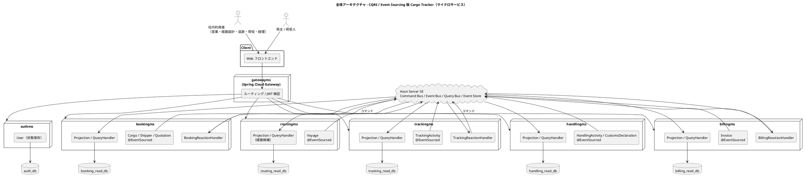
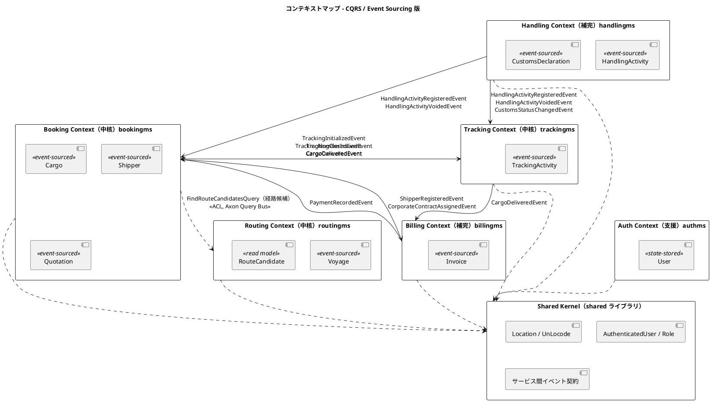
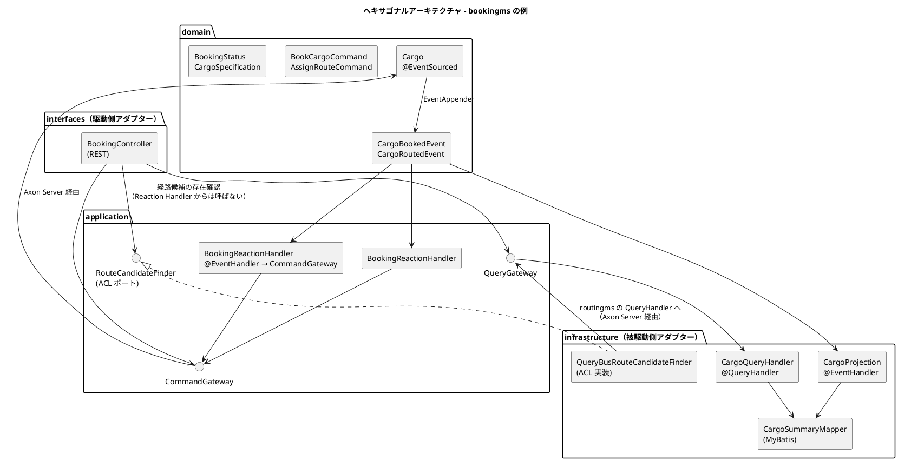
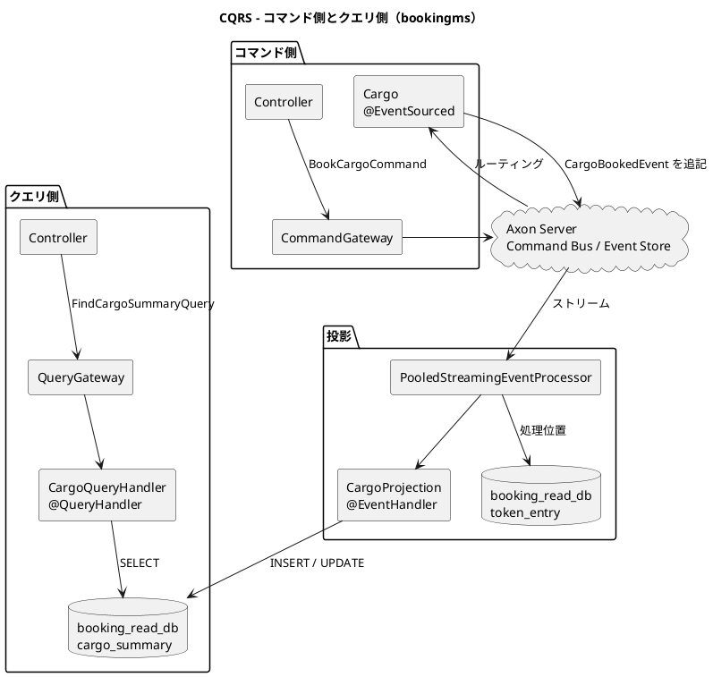
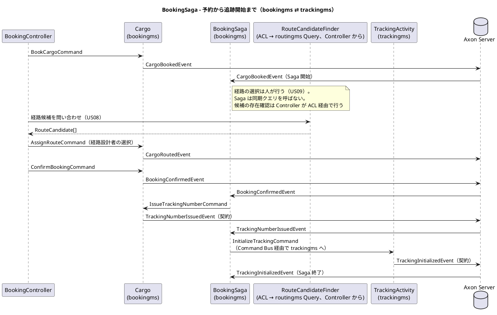

# バックエンドアーキテクチャ - 国際貨物輸送管理システム（CQRS / Event Sourcing 版）

## 概要

国際貨物輸送管理システム（Cargo Tracker）を、**Axon Framework 5 による CQRS + Event Sourcing** の**マイクロサービス**として構成するためのバックエンドアーキテクチャ設計です。

本設計は次の 2 つの参照元を土台にしています。両者は別々の実装であり、設計判断がそのまま引き継がれているわけではありません。本設計がどちらから何を採り、何を変えたかは「参照元との対応」に記します。

| 参照元 | 実装の形 | 本設計が採るもの | 本設計が変えるもの |
| :--- | :--- | :--- | :--- |
| `tmp/take-4/docs/design/`（`java/take-4`） | マイクロサービス 7 + Gateway、Axon Framework 5 + Axon Server、MyBatis Read Model | サービス分割、Axon 5 の Entity API・Event Store・Projection の設計、ADR-0007〜0009 で実機検証された統合パターン | サービス間の同期問い合わせを REST から **Axon Query Bus** に変え、ローカル環境での Event Processor のモード切り替えをやめる |
| `docs/article/source/java-3/docs/design/`（`java/take-7`） | マイクロサービス 8 + 共有ライブラリ、RabbitMQ、現在状態を直接 UPDATE | BC の切り方、ヘキサゴナルの配置、ACL ポートの置き場、ドメインイベント契約の考え方（ADR-022）、「読む側の無い配線を先に敷かない」判断 | RabbitMQ と手書きの発行・購読を Axon の Event Bus に置き換え、集約の永続化を **イベント列** にする |

**なぜマイクロサービスなのか。** 記事シリーズ「エンタープライズ Java における実践的 DDD」の第 4 章は、マイクロサービス版（`java-3`）で「プロセスを越えるイベント」を扱いました。第 5 章の主題は CQRS / Event Sourcing です。**プロセスの形を第 4 章と揃える**ことで、第 4 章との差分がそのまま Event Sourcing の代金になります。`java-3` が「初期フェーズには複雑すぎる」として見送った Event Sourcing を、同じサービス分割の上で実際に払い、第 6 章の比較表で並べられるようにします。判断の記録は [ADR-0001](../../adr/cargo-tracker/0001-cqrs-es-with-axon-in-microservices.md) です。

### 技術基盤（調査時点 2026-09-02）

| 項目 | 採用 | 備考 |
| :--- | :--- | :--- |
| 言語 / ランタイム | Java 25 LTS | 参照元 2 つと同じ |
| フレームワーク | Spring Boot 4.1 系（Spring Framework 7 系） | 参照元と同系。Jackson 3 が既定 |
| CQRS / ES / 分散バス | Axon Framework 5.1.0-RC2（固定） | 4 系の `@Aggregate` / `AggregateLifecycle` は **存在しない**（take-4 ADR-0007）。**Saga・Deadline・`@ProcessingGroup` も Axon 5 には存在しない**（IT1 スパイク）。版が 5.1.0-RC2 なのは `axon-server-connector` の公開が 5.1.0-RC2 までのためです（ADR-0001 決定 3） |
| Event Store / メッセージバス | Axon Server 2026.x Standard Edition（単一ノード） | Command / Event / Query Bus をサービス間で配送する。判断は [ADR-0002](../../adr/cargo-tracker/0002-event-store-axon-server-and-postgresql-read-models.md) |
| API Gateway | Spring Cloud Gateway | ルーティング、JWT 検証、CORS |
| Read Model | PostgreSQL 16（サービスごとに DB）+ MyBatis 3 + Flyway | 参照元 2 つと同じ。JPA は採らない |
| ビルド | Gradle 9 系、マルチプロジェクト（`apps/cargo-tracker/backend/`） | サービスごとに Gradle サブプロジェクト |

バージョンは調査時点の値です。実装着手時に `analyzing-tech-stack` で確定し、`tech_stack.md` を正とします。

## アーキテクチャパターン選択

### 業務領域カテゴリーの評価

[アーキテクチャ設計ガイド](../../reference/アーキテクチャ設計ガイド.md) の選択フローに従って評価します。

| 評価軸 | 評価 | 根拠 |
| :--- | :--- | :--- |
| 業務領域のカテゴリー | **中核の業務領域** | 予約・経路設計・追跡は運送会社の競争優位そのもの（[要件定義](../../requirements/requirements_definition.md) §システム価値） |
| データ構造の複雑さ | **複雑** | 予約→経路→追跡→荷役→精算の集約が相互に参照し、状態遷移表（貨物予約・追跡情報）を持つ |
| 金額を扱うか | **扱う** | 輸送料金算出・法人割引・精算（US21〜US23） |
| 監査記録が必要か | **必要** | 遅延・破損・紛失の例外処理（US19・US20）、誤配の再設計（US28）、通関申告（US29）は「いつ・誰が・何を根拠に」の履歴が問われる |
| 永続化モデルは複数か | **複数** | 書き込みはイベント列、読み取りはサービスごと・画面ごとの投影テーブル |

フローの結論は **イベント履歴式ドメインモデル + CQRS + ピラミッド形のテスト**です。

### 選択したアーキテクチャパターン

| パターン | 適用範囲 | 理由 |
| :--- | :--- | :--- |
| ドメインモデル | 全サービス | 業務ルールを集約に置く（参照元と同じ） |
| ポートとアダプター（ヘキサゴナル） | 全サービス | ドメインを Spring / Axon / MyBatis から切り離す |
| CQRS | 全サービス | コマンド側は集約、クエリ側は投影テーブルの MyBatis |
| Event Sourcing | bookingms・routingms・trackingms・handlingms・billingms | 履歴と監査が要る集約。**authms と共有カーネルには適用しない** |
| Reaction Handler（調整役） | bookingms（予約〜追跡開始）、billingms（配送完了〜精算） | 複数サービスにまたがる業務連鎖を調整する。**Axon 5 に Saga が無い**ため、連鎖の段数ぶん Reaction Handler を並べ、途中経過が要る場合はその BC の集約か専用の投影テーブルに持つ（ADR-0001 決定 6） |
| マイクロサービス | 配置 | BC ごとに独立デプロイ。Database per Service。サービス間は Axon Server 経由のメッセージだけ |

### 採用しないものと理由

| 採用しないもの | 理由 |
| :--- | :--- |
| サービス間の同期 REST 呼び出し | take-4 は経路候補の取得を REST で行った。本設計は Axon Query Bus に寄せ、サービス間の配送経路を 1 種類（Axon Server）にする。REST は Gateway からクライアント向けに限る |
| RabbitMQ / Kafka | Axon Server が Event Store と Event Bus を兼ねる。外部システムへ出す必要が生じた時点で ADR を起こす |
| JPA / Hibernate | 参照元 2 つが ADR で退けた判断を維持する。Read Model は MyBatis の SQL で画面ごとに最適化する |
| authms の Event Sourcing | ユーザーとロックは現在状態だけが業務に要る。履歴は監査ログテーブルで足りる |
| Axon Server Enterprise | 単一ノードで学習目標を満たす。可用性要件は `non_functional.md` で扱い、必要なら再評価する |
| ローカル用の `subscribing` モード | take-4 ADR-0008 が一時的に許し、ADR-0009 で構成不全の発見を遅らせた。全環境で `pooled`（`PooledStreamingEventProcessor`）にする |
| 投影からのコマンド送信 | 投影は SQL に写すだけにする。イベントを受けてコマンドを送る役割は `application/reaction` の Reaction Handler に置き、投影とは別の Processing Group にする（リプレイでコマンドが再送されない） |

## 全体アーキテクチャ



サービス間を結ぶ経路は **Axon Server だけ**です。コマンド・イベント・クエリの 3 種のメッセージがすべてそこを通ります。サービスは互いの DB にも REST にも触れません。クライアントからの入口は Gateway 経由の REST で、各サービスの Controller はコマンドを Command Gateway に、問い合わせを Query Gateway に渡すだけです。

## 境界付けられたコンテキスト

### コンテキストマップ



矢印の実線は **イベント**（Axon Event Bus）、点線は **同期の問い合わせ**（Axon Query Bus 経由の ACL）です。サービス越しに状態を変える同期呼び出しは置きません。サービスをまたぐ状態変更はすべてイベント、またはイベントを受けた Reaction Handler が発行するコマンドです。サービス越しに通るメッセージの名簿は **契約イベント 11 本、契約コマンド 2 本、契約クエリ 1 本（`FindRouteCandidatesQuery`）** です（「ドメインイベント一覧」参照）。同期の問い合わせは bookingms → routingms の 1 本だけで、billingms が請求時に要る荷主の契約情報は問い合わせでなく `ShipperRegisteredEvent` / `CorporateContractAssignedEvent` の購読で `shipper_contract_snapshot` に写します。この線引きは `java-2` ADR-009・`java-3` ADR-022 と同じで、違いは「同期の問い合わせ」も REST でなく Axon の Query Bus を通ることです。

### 各コンテキストの説明

| サービス | BC | 分類 | 集約ルート | 永続化 | DB | 主なアクター | 参照元での対応 |
| :--- | :--- | :--- | :--- | :--- | :--- | :--- | :--- |
| gatewayms | — | 基盤 | なし | なし | なし | 全クライアント | take-4 / java-3 gatewayms |
| authms | Auth | 支援 | `User` | **状態保存（MyBatis）** | `auth_db` | 全利用者 | java-3 authms（US31 アカウント保護） |
| bookingms | Booking | 中核 | `Cargo` / `Shipper` / `Quotation` | Event Sourcing | `booking_read_db` | 営業担当者、荷主 | take-4 bookingms |
| routingms | Routing | 中核 | `Voyage` | Event Sourcing（経路候補は読み取り側） | `routing_read_db` | 経路設計者 | take-4 routingms |
| trackingms | Tracking | 中核 | `TrackingActivity` | Event Sourcing | `tracking_read_db` | 追跡管理者、荷主・荷受人 | take-4 trackingms |
| handlingms | Handling | 補完 | `HandlingActivity` / `CustomsDeclaration` | Event Sourcing | `handling_read_db` | 荷役作業員 | java-3 handlingms（通関申告 UC21） |
| billingms | Billing | 補完 | `Invoice` | Event Sourcing | `billing_read_db` | 経理担当者 | take-4 billingms |
| shared | Shared Kernel | 共有 | なし | なし | なし | — | take-4 ADR-0005 / 0014、java-3 `SharedKernelScopeTest` |

### 共有カーネル（`shared` ライブラリ）の範囲

| 置くもの | 理由 |
| :--- | :--- |
| `Location` / `UnLocode` | 全 BC が同じ意味で使う唯一の値オブジェクト |
| `AuthenticatedUser` / `Role` と JWT 検証フィルタ | 認証契約。java-3 と同じ |
| **サービス間イベント契約**（`TrackingNumberIssuedEvent` など、他サービスが購読するイベントの `record`） | Axon はペイロードの型名で復元する。両側が同じクラスを持たないと購読側で読めない。take-4 ADR-0014 と同じ判断 |
| 置かないもの | `VoyageNumber` / `BookingId` などの識別子、サービス内で閉じるイベント、集約、ドメインサービス |

共有カーネルの範囲は ArchUnit（java-3 `SharedKernelScopeTest` 相当）で固定します。「サービス内で閉じるイベント」が後から他サービスに購読されるときは、`shared` に**移すのではなくコピーして契約にし**、元のイベントは Upcaster で契約型へ変換します。移すと既存の Event Store 上の型名と食い違うためです。

## ヘキサゴナルアーキテクチャ（ポートとアダプター）



### レイヤー責務一覧

| レイヤー | 責務 | 置くもの | 置かないもの |
| :--- | :--- | :--- | :--- |
| `domain` | 業務ルール。イベントを生む | `@EventSourced`、コマンド / イベントの `record`、値オブジェクト、ドメインサービス | Spring・MyBatis・Axon の設定。Axon の**アノテーションだけ**は許す（後述） |
| `application` | ユースケースの順序、Reaction Handler、ACL ポートの定義 | `application/reaction` の Reaction Handler（`@EventHandler` → `CommandGateway`）、出力ポート（interface）、Command / Query Gateway の利用 | SQL、HTTP、`application/reaction`（置かない） |
| `infrastructure` | 投影、問い合わせ、ACL の実装、Axon の設定 | `@EventHandler` の Projection、`@QueryHandler`、MyBatis Mapper、`AxonConfig` | 業務ルール、コマンドの送信（投影は `CommandGateway` を持たない） |
| `interfaces` | 入出力 | REST Controller、DTO、DTO とコマンドの変換 | ドメインの直接操作（必ず Gateway を通す） |

**ドメイン層が Axon のアノテーションに依存すること**は、参照元 `take-4` と同じく許容します。`@EventSourced` / `@CommandHandler` / `@EventSourcingHandler` はコンパイル時依存だけで、実行時のフレームワーク呼び出しをドメインに持ち込みません。ArchUnit では「ドメイン層は Spring に依存しない」「ドメイン層は MyBatis に依存しない」を守り、Axon については `org.axonframework..annotation..` と `EventAppender`、それに **`org.axonframework.extension.spring.stereotype.EventSourced` の 1 型だけ**を許可リストにします。`@EventSourced` は Spring stereotype（メタアノテーションに `@Component`）を含みますが、take-4 ADR-0008 が実機で確定したとおり、これ無しでは集約が Command Bus に登録されません。ドメインが持つ Spring 由来の型はこの 1 つに限り、`org.springframework..` への直接依存は引き続き禁止します。許可リストに無い Axon の型をドメインが使えば赤になります。IT1 スパイクで実機検証した結果、`@EventSourced` 単独で登録されること、`@EventSourcedEntity` は 5.1.0-RC2 に存在しないことが確認できたため、この許可リストは恒久です。

### パッケージ構成（正典）

```text
apps/cargo-tracker/backend/                     Gradle マルチプロジェクトルート
├── settings.gradle                             include: shared, gatewayms, authms, bookingms, routingms, trackingms, handlingms, billingms
├── shared/                                     共有カーネル（ライブラリ、デプロイしない）
│   └── src/main/java/com/example/cargotracker/shared/
│       ├── domain/model/{Location, UnLocode}
│       ├── domain/auth/{AuthenticatedUser, Role}
│       ├── contract/event/                     サービス間イベント契約（record）
│       ├── contract/command/                   サービス越しに送るコマンド（Reaction Handler 用）
│       ├── contract/query/                     サービス越しの問い合わせと応答 DTO
│       └── infrastructure/axon/                共通の AxonConfig 断片、JDBC TokenStore（SagaStore は無い）、Jackson シリアライザ
├── gatewayms/                                  Spring Cloud Gateway（ルーティング・JWT 検証・CORS）
├── authms/                                     状態保存。projection/ を持たない
│   └── src/main/java/com/example/cargotracker/auth/
│       ├── domain/model/{aggregates, valueobjects}
│       ├── application/
│       ├── infrastructure/{persistence, security}
│       └── interfaces/rest/
├── bookingms/
│   └── src/main/java/com/example/cargotracker/booking/
│       ├── BookingApplication.java
│       ├── domain/
│       │   ├── model/
│       │   │   ├── aggregates/Cargo.java       # @EventSourced(idType = String.class, tagKey = "bookingId")
│       │   │   ├── commands/BookCargoCommand.java
│       │   │   ├── events/CargoBookedEvent.java  # サービス内で閉じるイベント
│       │   │   └── valueobjects/{BookingId, BookingStatus, CargoSpecification, ...}
│       │   └── service/                        # ドメインサービス（集約に入らない計算）
│       ├── application/
│       │   ├── reaction/BookingReactionHandler.java
│       │   ├── reaction/BookingReactionHandler.java  # 契約イベント → 自集約へのコマンド（Processing Group: booking-reaction）
│       │   └── port/RouteCandidateFinder.java  # ACL ポート（利用側が定義）
│       ├── infrastructure/
│       │   ├── projection/CargoProjection.java # @EventHandler → MyBatis
│       │   ├── query/CargoQueryHandler.java    # @QueryHandler
│       │   ├── persistence/CargoSummaryMapper.java
│       │   ├── acl/QueryBusRouteCandidateFinder.java
│       │   └── config/AxonConfig.java
│       └── interfaces/rest/{BookingController, dto/, transform/}
├── routingms/   ... 同じ 4 層
├── trackingms/  ... 同じ 4 層
├── handlingms/  ... 同じ 4 層
└── billingms/   ... 同じ 4 層
```

`domain/model/` の内側を building block（`aggregates` / `commands` / `events` / `valueobjects`）で分けるのは `java-2` ADR-024 の判断です。イベントは原則 **サービスの中に置き**、他サービスが購読するものだけを `shared/contract/event/` に置きます。Event Sourcing ではイベントが集約の**永続化フォーマット**であり、その所有者は集約を持つサービスだからです。

## CQRS 設計（Axon Framework 5）



### CQRS 適用方針

| 操作 | 側 | 通る経路 | 例 |
| :--- | :--- | :--- | :--- |
| 状態を変える操作 | コマンド | Controller → `CommandGateway` → Axon Server → 集約 → Event Store | 予約登録・経路確定・荷役記録・精算 |
| 一覧・詳細・検索 | クエリ | Controller → `QueryGateway` → `@QueryHandler` → MyBatis | 予約一覧・追跡照会・航海スケジュール検索 |
| 経路候補の算出 | クエリ | routingms の `@QueryHandler` がドメインサービスを呼ぶ | US08（算出は状態を変えない） |
| サービス越しの参照 | クエリ | ACL ポート → `QueryGateway` → Axon Server → 提供側の `@QueryHandler` | bookingms が routingms に経路候補を要求する |
| サービス越しの状態変更 | イベント → Reaction Handler → コマンド | `application/reaction` の Reaction Handler（1 イベント → 1 コマンド）。**投影はコマンドを送らない** | 荷役登録 → 追跡と予約の更新 |

画面のボタン表示条件は、投影テーブルに写した `status` を読みますが、**遷移してよいかの判定は集約だけが持ちます**。投影で表示を絞っても、集約のコマンドハンドラが同じ規則で拒否します。二重の検査ではなく、表示は投影・判定は集約という分業です。

### Aggregate（Event-Sourced Entity）実装パターン

Axon 5 では「Aggregate」は API 上「Entity」と呼ばれます。参照元 `take-4` が実機で確定した 5 系の API を、そのまま本設計の標準にします。ただし集約の**登録 API** は ADR-0007 の `@EventSourcedEntity` ではなく、**ADR-0008 の最終決定 `@EventSourced(idType = String.class, tagKey = "bookingId")`**（`org.axonframework.extension.spring.stereotype`）です。ADR-0007 の形は統合テストが `CommandGateway` をモックしていたため見えず、bootJar の実機で `NoHandlerForCommandException` を出して退けられました（take-4 ADR-0008 の試行 A）。`@EventSourcedEntity` 単独では Spring Boot の自動設定が集約を Module として検出しません。

```java
package com.example.cargotracker.booking.domain.model.aggregates;

import org.axonframework.eventsourcing.annotation.EventSourcingHandler;
import org.axonframework.eventsourcing.annotation.reflection.EntityCreator;
import org.axonframework.extension.spring.stereotype.EventSourced;
import org.axonframework.messaging.commandhandling.annotation.CommandHandler;
import org.axonframework.messaging.eventhandling.gateway.EventAppender;

// Spring stereotype。@EventSourcedEntity 単独では Command Bus に登録されない（take-4 ADR-0008）
@EventSourced(idType = String.class, tagKey = "bookingId")
public class Cargo {

    private BookingId bookingId;
    private ShipperId shipperId;
    private BookingStatus status;
    private RouteSpecification routeSpecification;

    @EntityCreator
    protected Cargo() {
        // Axon がイベント再生で生成する。コレクション型はここで初期化する
    }

    // 作成系コマンドは static。戻り値は識別子
    @CommandHandler
    public static String book(BookCargoCommand cmd, EventAppender appender) {
        var spec = CargoSpecification.of(cmd.cargoType(), cmd.hazardousDeclaration());
        appender.append(new CargoBookedEvent(
                cmd.bookingId(), cmd.shipperId(), cmd.origin(), cmd.destination(),
                cmd.arrivalDeadline(), spec));
        return cmd.bookingId();
    }

    // 更新系コマンドはインスタンスメソッド。不変条件はここで守る
    @CommandHandler
    public void assignRoute(AssignRouteCommand cmd, EventAppender appender) {
        if (!status.canTransitionTo(BookingStatus.ROUTED)) {
            throw new IllegalBookingStateException(bookingId, status, BookingStatus.ROUTED);
        }
        routeSpecification.requireSatisfiedBy(cmd.itinerary());
        appender.append(new CargoRoutedEvent(bookingId.value(), cmd.itinerary()));
    }

    // 状態の復元。判断を書かない
    @EventSourcingHandler
    public void on(CargoBookedEvent event) {
        this.bookingId = new BookingId(event.bookingId());
        this.shipperId = new ShipperId(event.shipperId());
        this.status = BookingStatus.PRELIMINARY;
        this.routeSpecification = new RouteSpecification(
                event.origin(), event.destination(), event.arrivalDeadline());
    }

    @EventSourcingHandler
    public void on(CargoRoutedEvent event) {
        this.status = BookingStatus.ROUTED;
    }
}
```

```java
public record BookCargoCommand(
        @TargetEntityId String bookingId,
        String shipperId,
        UnLocode origin,
        UnLocode destination,
        LocalDate arrivalDeadline,
        CargoType cargoType,
        HazardousDeclaration hazardousDeclaration) {
}

public record CargoBookedEvent(
        String bookingId, String shipperId,
        UnLocode origin, UnLocode destination,
        LocalDate arrivalDeadline, CargoSpecification specification) {
}
```

| 規則 | 内容 | 由来 |
| :--- | :--- | :--- |
| 登録は `@EventSourced(idType, tagKey)`（Spring stereotype） | `@EventSourcedEntity` は 5.1.0-RC2 に存在しない。ArchUnit の許可リストにこの 1 型を明示的に加える。IT1 スパイクで実機確認済み（恒久） | take-4 ADR-0008 |
| 作成系は `static`、更新系はインスタンス | Axon 5 の公式パターン | take-4 ADR-0007 |
| `AggregateLifecycle.apply()` は使わない | 5 系に存在しない。`EventAppender` を引数で受ける | take-4 ADR-0007 |
| `@EntityCreator` を必ず宣言 | リフレクションで生成される。コレクション初期化はここ | take-4 ADR-0007 |
| `@EventSourcingHandler` に判断を書かない | 再生時に例外が出ると集約が復元できない | 本設計 |
| 不変条件の検査は `@CommandHandler` | 状態遷移表と一致させ、テストで固定する | `java-2` `BookingStatus` |
| コマンド・イベントは `record` | 不変。Jackson でシリアライズ | 両参照元 |
| イベントに値オブジェクトを載せる場合はシリアライズ形を固定 | `CargoSpecification` などは JSON 形を契約として扱う | 本設計（後述「イベント契約」） |

### Projection 実装パターン（MyBatis）

```java
package com.example.cargotracker.booking.infrastructure.projection;

@Component
// Processing Group は @ProcessingGroup（Axon 5 に無い）ではなく application.yml の
// axon.eventhandling.processors."[<このクラスのパッケージ名>]" で指定する。
// 名前の正典は data-model.md「Processing Group とテーブルの対応」
public class CargoProjection {

    private final CargoSummaryMapper mapper;

    @EventHandler
    public void on(CargoBookedEvent event) {
        mapper.insert(CargoSummaryRow.from(event));
    }

    @EventHandler
    public void on(CargoRoutedEvent event) {
        mapper.updateStatusAndItinerary(event.bookingId(), "ROUTED", event.itinerary());
    }

    @EventHandler
    public void on(HandlingActivityRegisteredEvent event) {
        // handlingms の契約イベント。荷役の事実を予約の一覧に写す（java-2 ADR-009 の同期プロジェクション）
        mapper.updateLastHandling(event.bookingId(), event.activityType(), event.location(), event.completedAt());
    }
}
```

| 規則 | 内容 |
| :--- | :--- |
| Projection は `infrastructure` に置く | イベントを SQL に写すだけ。判断を持たない |
| **コマンドを送らない** | Projection は `CommandGateway` を持たない（ArchUnit）。イベントを受けてコマンドを送るのは `application/reaction` の Reaction Handler（後述）。投影がコマンドを送ると、リプレイで他サービスの集約が動き、コマンド失敗が投影のトークンを止める |
| Processing Group は書くテーブルの単位 | `booking-shipper-projection` / `booking-cargo-projection` / `booking-quotation-projection` / `routing-voyage-projection` / `tracking-projection` / `handling-snapshot-projection` / `handling-activity-projection` / `billing-projection` の 8 つ（正典は `data-model.md`）。リプレイの単位であり `token_entry` の主キー |
| Processor は `pooled`（`PooledStreamingEventProcessor`、全環境） | `token_entry` に処理位置を持つ。投影の更新とトークンの更新を同一 JDBC トランザクションで行う（take-4 ADR-0009） |
| 冪等に書く | 同じイベントが 2 度届いても結果が同じになるよう、`INSERT ... ON CONFLICT` か「先に存在確認」で書く |
| 他サービスの契約イベントを購読してよい | ただし購読側は**自サービスの投影テーブル**だけを更新する |
| `cargo_summary.booking_status` の書き手は Cargo 自身のイベントだけ | 配送完了・精算は `CargoDeliveredEvent` / `PaymentRecordedEvent` から直接書かず、Reaction Handler が `Cargo` に送ったコマンドの結果である `BookingDeliveredEvent` / `BookingSettledEvent` を写す。状態の書き手を 1 本にする |

### Reaction Handler 実装パターン（イベント → コマンド）

他サービスの契約イベントを受けて**自サービスの集約にコマンドを送る**役割は、投影ではなく `application/reaction/<Name>ReactionHandler` に置きます。Reaction Handler は「1 イベントを受けたら 1 コマンドを送る」だけで状態を持ちません。Axon 5 に Saga が無いため、複数段の連鎖はこの Handler を段のぶん並べて表し、途中経過が要る場合はその BC の集約か専用の投影テーブルに持ちます（ADR-0001 決定 6）。

```java
package com.example.cargotracker.booking.application.reaction;

@Component
// 投影とは別パッケージに置き、application.yml で別 Processing Group にする。リプレイの対象にしない
public class BookingReactionHandler {

    private final CommandGateway commandGateway;

    @EventHandler
    public void on(HandlingActivityRegisteredEvent event) {
        commandGateway.sendAndWait(new RecordHandlingCommand(event.bookingId(), event.activityId(), event.activityType(), event.location(), event.completedAt()));
    }

    @EventHandler
    public void on(CargoDeliveredEvent event) {
        commandGateway.sendAndWait(new MarkDeliveredCommand(event.bookingId(), event.deliveredAt()));
    }

    @EventHandler
    public void on(PaymentRecordedEvent event) {
        commandGateway.sendAndWait(new SettleBookingCommand(event.bookingId(), event.invoiceId()));
    }
}
```

| 規則 | 内容 |
| :--- | :--- |
| 置き場は `application/reaction` | `CommandGateway` を使えるのは `interfaces`・`application/reaction` の 2 か所だけ（ArchUnit） |
| Processing Group は投影と分ける | `booking-reaction` / `tracking-reaction` / `billing-reaction`。投影の Group をリセットしてリプレイしても Reaction の Group は**リセットしない**。`ReplayIT` で、リプレイ中に `CommandGateway` が 1 度も呼ばれないことを固定する |
| 送るのは自サービスの集約へのコマンド | 他サービスの集約へ送るなら契約コマンドになり、名簿が増える（ADR を起こす） |
| 失敗は要確認へ | コマンドが拒否されたら `attention_item` に記録して Group を進める。投影のトークンを止めない |
| 担当 | bookingms：`RecordHandlingCommand` / `MarkDeliveredCommand` / `SettleBookingCommand`、trackingms：`AdvanceTrackingCommand`（荷役由来）・`UNLOAD` 後の `CloseTrackingCommand`（キャンセル時）、billingms：`shipper_contract_snapshot` は投影で足りるため当面空 |

### Query Handler 実装パターン

```java
@Component
public class CargoQueryHandler {

    private final CargoSummaryMapper mapper;

    @QueryHandler
    public List<CargoSummaryView> handle(FindCargoSummariesQuery query) {
        return mapper.findByShipper(query.shipperId(), query.status());
    }

    @QueryHandler
    public Optional<CargoDetailView> handle(FindCargoDetailQuery query) {
        return Optional.ofNullable(mapper.findDetail(query.bookingId()));
    }
}
```

読み取りモデルは画面ごとに作ります。予約一覧が荷役の最新状態を必要とするなら、handlingms の DB を JOIN するのではなく（そもそも別 DB で JOIN できない）、荷役の契約イベントを購読して予約の投影テーブルに列を足します。

### サービス越しの問い合わせ（ACL + Query Bus）

```java
// bookingms/application/port
public interface RouteCandidateFinder {
    List<RouteCandidate> find(RouteSpecification spec);
}

// bookingms/infrastructure/acl
@Component
public class QueryBusRouteCandidateFinder implements RouteCandidateFinder {

    private final QueryGateway queryGateway;

    @Override
    public List<RouteCandidate> find(RouteSpecification spec) {
        // クエリ型と応答 DTO は shared/contract/query に置く。routingms の型は持ち込まず自 BC の型に変換する
        // 同期問い合わせのタイムアウトは既定 5 秒（Resilience4j の TimeLimiter）。join() で無期限に待たない
        var response = queryGateway.query(
                new FindRouteCandidatesQuery(spec.origin().code(), spec.destination().code(), spec.arrivalDeadline()),
                ResponseTypes.multipleInstancesOf(RouteCandidateDto.class))
                .orTimeout(5, TimeUnit.SECONDS).join();
        return response.stream().map(RouteCandidate::from).toList();
    }
}
```

| 規則 | 内容 |
| :--- | :--- |
| タイムアウト既定 5 秒 | Query Bus の同期問い合わせは Resilience4j の TimeLimiter で 5 秒。超えたら `503` を返し、画面は再試行を促す |
| Saga から同期クエリを呼ばない | Saga の中で `.join()` すると Processing Group が止まる。経路候補の存在確認は Controller（US08 の経路検索）で行い、Saga と Reaction Handler は同期クエリを持たない（ArchUnit：`application/reaction` と `application/reaction` は `QueryGateway` に依存しない） |
| 契約クエリは 1 本 | `FindRouteCandidatesQuery` だけ。`FindShipperForBillingQuery` は廃止し、billingms は `ShipperRegisteredEvent` / `CorporateContractAssignedEvent` を購読して `shipper_contract_snapshot` を作る |

take-4 の `ExternalCargoRoutingService`（REST）と役割は同じです。違いは、配送を Axon Server に任せることで、サービスの所在（URL）を bookingms が知らなくてよくなることと、routingms が落ちているときに `NoHandlerForQueryException` で**明示的に**失敗することです。

## イベント駆動設計（Axon Event Bus）

### ドメインイベント一覧

契約（`shared/contract/event`）に置くイベントは **11 本**です。名簿は ArchUnit で固定し、`domain-model.md`・`test_strategy.md`・`non_functional.md` の数もこの 11 に揃えます。

| イベント | 発行サービス | 契約（shared） | 購読サービスと用途 | 参照元での状態 |
| :--- | :--- | :--- | :--- | :--- |
| `ShipperRegisteredEvent` | bookingms | **○** | bookingms 投影、billingms：`shipper_contract_snapshot`（個人情報は荷主鍵で暗号化。[ADR-0003](../../adr/cargo-tracker/0003-crypto-shredding-for-personal-data.md)） | take-4 |
| `ShipperContactUpdatedEvent` | bookingms | — | bookingms 投影（暗号化フィールドを持つ 2 本目） | 本設計 |
| `CorporateContractAssignedEvent` | bookingms | **○** | bookingms 投影、billingms：`shipper_contract_snapshot`（割引率） | 本設計（`FindShipperForBillingQuery` の代替） |
| `QuotationCreatedEvent` | bookingms | — | bookingms 投影 | take-4 |
| `CargoBookedEvent` | bookingms | — | bookingms 投影、`BookingReactionHandler` 起点 | take-4（java-3 では廃止） |
| `CargoRoutedEvent` | bookingms | — | bookingms 投影 | take-4 |
| `TrackingNumberIssuedEvent` | bookingms | **○** | trackingms：`TrackingActivity` 作成（Saga 経由）、handlingms：`cargo_snapshot` | java-3 ADR-022 の主イベント |
| `BookingConfirmedEvent` / `ShipperNotifiedEvent` | bookingms | — | bookingms 投影（通知履歴は宛先・要約を持つ。送信基盤はスコープ外） | take-4 |
| `CargoCancelledEvent` | bookingms | **○** | bookingms 投影、trackingms：陸揚げ地の記録（追跡は閉じない）、handlingms：`cargo_snapshot` | java-3 |
| `BookingMisroutedEvent` / `BookingDeliveredEvent` / `BookingSettledEvent` | bookingms | — | bookingms 投影（`cargo_summary.booking_status` の書き手）。`BookingMisroutedEvent` は trackingms の `CargoMisroutedEvent` と同名衝突を避けた名前 | 本設計 |
| `VoyageRegisteredEvent` / `VoyageScheduleUpdatedEvent` | routingms | — | routingms 投影（航海スケジュール検索） | take-4 |
| `HandlingActivityRegisteredEvent` | handlingms | **○** | trackingms：状態更新・誤配検知（Reaction）、bookingms：一覧の同期投影 + `RecordHandlingCommand`（Reaction） | 両参照元 |
| `HandlingActivityVoidedEvent` | handlingms | **○** | trackingms / bookingms：誤記録の取り消しを戻す（元の記録は残る） | 本設計（M18） |
| `CustomsStatusChangedEvent` | handlingms | **○** | trackingms：通関保留の例外起票。`heldBusinessDays` を billingms の調整根拠に渡す | java-3 |
| `TrackingInitializedEvent` | trackingms | **○** | bookingms：`BookingSaga` 終了（`@EndSaga`） | 本設計 |
| `TransportStatusUpdatedEvent` / `CargoMisroutedEvent` / `TrackingExceptionRegisteredEvent` | trackingms | — | trackingms 投影 | take-4 |
| `CargoDeliveredEvent` | trackingms | **○** | billingms：`BillingSaga` 開始、bookingms：`MarkDeliveredCommand`（Reaction） | take-4（java-3 では未実装） |
| `TrackingClosedEvent` | trackingms | **○** | bookingms：`BookingSaga` の補償完了 | 本設計 |
| `InvoiceCalculatedEvent` / `DiscountAppliedEvent` / `InvoiceIssuedEvent` | billingms | — | billingms 投影 | take-4 |
| `PaymentRecordedEvent` | billingms | **○** | billingms 投影、bookingms：`SettleBookingCommand`（Reaction） | take-4 |

契約の数は **イベント 11**（`ShipperRegisteredEvent`, `CorporateContractAssignedEvent`, `TrackingNumberIssuedEvent`, `CargoCancelledEvent`, `HandlingActivityRegisteredEvent`, `HandlingActivityVoidedEvent`, `CustomsStatusChangedEvent`, `TrackingInitializedEvent`, `CargoDeliveredEvent`, `TrackingClosedEvent`, `PaymentRecordedEvent`）、**コマンド 2**（`InitializeTrackingCommand`, `CreateInvoiceCommand`）、**クエリ 1**（`FindRouteCandidatesQuery`）です。

**「読む側の無い配線を先に敷かない」**（`java-3` の判断）は本設計でも守ります。上の表は候補であり、イテレーション計画で購読側のストーリーが入った時点で契約に昇格させます。ただし Event Sourcing では、購読者がいなくても**集約が発行したイベントは Event Store に残ります**。「発行しない」判断は集約の設計判断であり、購読の有無とは別に決めます。

### イベント契約

Event Sourcing ではイベントが永続化フォーマットです。一度 Event Store に書いたイベントは書き換えられません。`java-3` ADR-022 が RabbitMQ の交換機に対して定めた「契約」を、本設計は **イベントのクラス名・フィールド・JSON 形**に対して定めます。

| 規則 | 内容 |
| :--- | :--- |
| イベントは追記専用 | フィールドの削除・型変更をしない。要るなら新しいイベント型を足す |
| Upcaster で吸収 | 既存イベントの形を変えざるを得ないときは Axon の Upcaster を書き、旧形式のテストイベントを残す |
| シリアライザは Jackson | `record` をそのまま JSON にする。`@JsonCreator` 無しで復元できる形に限る |
| 型名はメタデータに載る | クラスの移動・改名は `Revision` と Upcaster を伴う。パッケージ移動は「無料」ではない |
| 契約イベントは `shared` に置き、両側が同じ 1 つを読む | 発行側・購読側それぞれに契約テストを置く（java-3 の「片側だけでは守れない」） |
| 契約テスト | 各イベントについて「今の JSON 形」をゴールデンファイルで固定し、意図しない変更を赤にする |

### Axon Configuration の方針

```yaml
# 全 Processing Group を明示列挙する（列挙漏れは設定ファイル走査で赤）。名前の正典は data-model.md
axon:
  axonserver:
    servers: ${AXON_AXONSERVER_SERVERS:localhost:8124}
    context: default
  eventhandling:
    processors:
      # bookingms
      booking-shipper-projection:   { mode: pooled, source: eventStore }
      booking-cargo-projection:     { mode: pooled, source: eventStore }
      booking-quotation-projection: { mode: pooled, source: eventStore }
      booking-reaction:             { mode: pooled, source: eventStore }
      # routingms
      routing-voyage-projection:    { mode: pooled, source: eventStore }
      # trackingms
      tracking-projection:          { mode: pooled, source: eventStore }
      tracking-reaction:            { mode: pooled, source: eventStore }
      # handlingms
      handling-snapshot-projection: { mode: pooled, source: eventStore }
      handling-activity-projection: { mode: pooled, source: eventStore }
      # billingms
      billing-projection:           { mode: pooled, source: eventStore }
      billing-reaction:             { mode: pooled, source: eventStore }
```

実際にはサービスごとの `application.yml` に自サービスの Group だけを書きます。上は全 Group（投影 8 + Reaction 3）の一覧を兼ねた表記です。`mode` は設定の実値 `pooled` に統一し、本文で `PooledStreamingEventProcessor` を指すときも `pooled` と書きます。

| 項目 | 方針 | 由来 |
| :--- | :--- | :--- |
| `axon-server-connector` を全サービスで明示依存にする | starter の推移的依存に含まれず、無いと**無音で** in-memory にフォールバックする。起動時に接続を検査し、失敗したら起動を止める | take-4 ADR-0009 |
| 起動時の接続検査は **context が DCB であること** まで見る | `@EventSourced(tagKey)` は DCB 前提。Axon Server 側は `AXONIQ_AXONSERVER_STANDALONE_DCB=true`（クラスタは `dcb=true`）。無いと接続が確立せず（2026.0.4 の実測は `AXONIQ-1302 default: not found in any replication group`）、**アプリケーションは起動を止めずに無限再接続する**。ログの検出に頼らず、接続後に context の DCB 可否を問い合わせて起動を止める（`dcbEventChannel().head()` の読み取り 1 回。Event Store を汚さない）。なお DCB を無効にした Axon Server では接続そのものが確立しないため、実環境では接続の検査が先に働き DCB の分岐は踏まれない。踏まない守りは壊れても気づけないので、DCB の分岐は単体テストで直接固定する（IT1 タスク 1.4） | take-4 ADR-0009 |
| Axon Server に接続するのは業務 5 サービスだけ | authms・gatewayms は接続しない。期待接続数は「5 × 台数」、接続数上限はサービスあたり 50・合計 250 で監視する | 本設計（M4） |
| Token Store / Saga Store はサービスごとの Read Model DB（JDBC） | 投影と同じトランザクションに参加させる。`token_entry`（`mask INTEGER NOT NULL` を含む take-4 実測スキーマ）/ `saga_entry` / `association_value_entry` は各サービスの Flyway で作る | take-4 ADR-0009 |
| Axon の `TransactionManager` Bean は **1 つだけ** | `SpringTransactionManager` は第 3 引数の `ConnectionProvider` を渡して作る（無いと Coordinator の `initializeTokenStore` で失敗）。`TransactionManager` 型の Bean が複数あると `getIfUnique()` が外れて `NoTransactionManager` に**無音で**落ちる。Bean が 1 つであることを起動時に検査する | take-4 ADR-0009 |
| Query Bus の同期問い合わせはタイムアウト 5 秒 | Resilience4j の TimeLimiter。Saga / Reaction からは呼ばない | 本設計（M1） |
| Jackson 3 との整合を IT1 のスパイクで確定 | Spring Boot 4 は Jackson 3 が既定。Axon の自動設定が要求する `ObjectMapper` の系統を実機で確認する | take-4 ADR-0009 の未解決事項 |
| 全環境で Axon Server を使い、`subscribing` に切り替えない | 切り替えると投影が同期実行され本番と挙動が変わる。ローカルは Docker Compose / kind で Axon Server SE を常に立てる | take-4 ADR-0008 / 0009 の教訓 |
| `@EventHandler` を持つ Bean はテストで除外しない | 除外すると「投影が動くこと」が検証されない。Testcontainers で Axon Server を起動して統合テストを回す | 本設計 |
| Axon Server の context は 1 つ | サービスごとに context を分けると、サービス越しのイベント購読に追加設定が要る。単一 context で全サービスが同じストリームを読む | 本設計 |

## Saga パターン（Axon Saga）

### 予約 Saga



Saga が他サービスの集約にコマンドを送るとき、コマンド型も両側が同じクラスを持つ必要があります。**サービス越しに送るコマンドは `shared/contract/command/` に置きます。** その数が増えることは「サービス間の結合が増えた」印であり、ArchUnit で名簿を固定し、増やすときは ADR を起こします。

### Saga 実装パターン

```java
@Saga
public class BookingSaga {

    @Autowired private transient CommandGateway commandGateway;

    @StartSaga
    @SagaEventHandler(associationProperty = "bookingId")
    public void on(CargoBookedEvent event) {
        // 開始。同期クエリは呼ばない（経路候補の存在確認は Controller 側）
    }

    @SagaEventHandler(associationProperty = "bookingId")
    public void on(TrackingNumberIssuedEvent event) {
        commandGateway.send(new InitializeTrackingCommand(
                event.trackingId(), event.bookingId(), event.origin(), event.destination()));
    }

    @EndSaga
    @SagaEventHandler(associationProperty = "bookingId")
    public void on(TrackingInitializedEvent event) {
    }

    @SagaEventHandler(associationProperty = "bookingId")
    public void on(CargoCancelledEvent event) {
        // 補償：追跡は閉じない。trackingms が dischargeLocation を記録し、
        // その港で UNLOAD を受けた後に TrackingReactionHandler が CloseTrackingCommand を送る
    }

    @EndSaga
    @SagaEventHandler(associationProperty = "bookingId")
    public void on(TrackingClosedEvent event) {
        // キャンセル時の陸揚げ完了で終了
    }
}
```

`CloseTrackingCommand` は BookingSaga から送りません。キャンセル承認後も貨物は船の上にあり、`CancellationDecision.dischargeLocation` で指定した港での荷降しが記録されるまで追跡を開けておく必要があるためです（US30）。

Axon 5 の Saga API は 4 系から変わっている可能性があります。上のコードは take-4 の設計を引き継いだ**意図の記述**であり、実装着手前に IT1 のスパイクでアノテーション名と `SagaLifecycle` の有無を確定し、本節と ADR-0001 を更新します。

### 補償アクション

| 失敗 | 補償 |
| :--- | :--- |
| trackingms が落ちていて追跡の初期化コマンドが届かない | Saga がタイムアウト後に再試行（再試行間隔は `Clock` を差し替えてテストする）。上限を超えたら `Cargo` に `RevertTrackingNumberCommand`。予約は `CONFIRMED` に留まり、追跡管理者の要確認一覧（`attention_item`）に写す |
| キャンセル承認後、陸揚げ地での荷降しが記録されない | 追跡は `dischargeLocation` を持ったまま開いている。当該港の `UNLOAD` を受けた `TrackingReactionHandler` が `CloseTrackingCommand` を送り、`TrackingClosedEvent` で Saga が終わる |
| 配送完了後の請求書作成に失敗 | `BillingSaga` が再試行。上限を超えたら `InvoiceCreationFailedEvent` を出し、経理担当者の作業一覧に写す |
| 入金確認後の予約 `SETTLED` 化に失敗 | Saga が再試行し、失敗を **イベントとして残す**。戻り値を捨てて黙らない（`java-2` ADR-021 の教訓） |

## マイクロサービス間通信

| 方式 | 使うところ | 実装 | take-4 との違い |
| :--- | :--- | :--- | :--- |
| イベント購読（投影） | 他サービスの事実を自サービスの読み取りモデルに写す | `@EventHandler`、契約イベントは `shared` | 同じ |
| イベント購読（Saga） | 他サービスの事実を受けて自サービスまたは他サービスの集約にコマンドを送る。複数段・補償あり | `@Saga` + `CommandGateway`、サービス越しのコマンドは `shared/contract/command` | 同じ |
| イベント購読（Reaction） | 他サービスの事実を受けて**自サービスの集約**にコマンドを 1 つ送る。状態を持たない | `application/reaction` の `@EventHandler` + `CommandGateway`。Processing Group は `<service>-reaction` | **新設**（take-4 は投影から送っていた） |
| 同期問い合わせ（ACL） | 業務判断のために他サービスの情報が今要る | ACL ポート → `QueryGateway` → Axon Server → 提供側 `@QueryHandler`。タイムアウト 5 秒。Saga / Reaction からは呼ばない | **REST から Query Bus へ** |
| 同期の状態変更 | **使わない** | サービス越しのコマンド送信は Saga だけに許す。ArchUnit で `CommandGateway` の利用箇所を `interfaces`・`application/reaction` に限定する | 同じ |
| クライアントからの入口 | Gateway 経由の REST | `gatewayms` がルーティングと JWT 検証を行う | 同じ |

`java-2` の `CrossContextPortPolicyTest` は「状態を変える同期ポートの名簿」を固定していました。本設計ではその名簿が**空**であることと、`shared/contract/command` の名簿を検査します。

## データベース設計方針

### Database per Service

| サービス | 用途 | DB | 主なテーブル |
| :--- | :--- | :--- | :--- |
| authms | 状態保存 | `auth_db` | `users`, `user_roles`, `user_shipper_link`, `auth_audit_log` |
| bookingms | Read Model | `booking_read_db` | `shipper`, `cargo_summary`, `cargo_leg`, `cancellation_request`, `quotation`, `quotation_candidate`, `attention_item`, `token_entry`, `saga_entry`, `association_value_entry` |
| routingms | Read Model | `routing_read_db` | `voyage`, `carrier_movement`, `voyage_accepted_cargo_type`, `token_entry` |
| trackingms | Read Model | `tracking_read_db` | `tracking_summary`, `tracking_event`, `tracking_exception`, `shipper_cargo_snapshot`, `attention_item`, `token_entry` |
| handlingms | Read Model | `handling_read_db` | `cargo_snapshot`, `cargo_snapshot_leg`, `handling_activity`, `customs_declaration`, `token_entry` |
| billingms | Read Model | `billing_read_db` | `invoice`, `invoice_line_item`, `payment`, `shipper_contract_snapshot`, `attention_item`, `token_entry`, `saga_entry`, `association_value_entry` |
| Axon Server | Event Store | 専用ボリューム | イベント列、スナップショット |

テーブルの正典は `data-model.md` です。通関状態の履歴（java-3 の `customs_status_history`）は作りません。履歴は Event Store のイベント列そのものであり、画面はイベント列から読みます。`attention_item` は投影が弾いた行・Reaction のコマンド拒否・Saga の補償失敗を「要確認」として受ける表で、bookingms / trackingms / billingms の 3 つに置きます（旧 `projection_rejection` を統合）。

投影テーブルは派生データです。マイグレーションで列を足すときは、既存行を UPDATE で埋めるのではなく、**該当 Processing Group のトークンをリセットしてリプレイ**します。リプレイ手順はサービス単位で `operation.md` に置き、Gulp タスクにします。

### トランザクション管理

| 範囲 | 境界 |
| :--- | :--- |
| 集約 1 つのコマンド処理 | Axon の Unit of Work。イベント追記の成否が結果 |
| 投影の更新 | Processor のバッチ単位。投影更新とトークン更新を同一 JDBC トランザクションで行う |
| 複数集約・複数サービスにまたがる業務 | Saga による結果整合。補償で戻す |
| authms | Spring `@Transactional`（状態保存） |

### 時刻の扱い

| 項目 | 方針 |
| :--- | :--- |
| 業務タイムゾーン | `Asia/Tokyo`。到着期限・支払期限・留置日数など「今日」を決める判定はすべてこれで行う |
| `BusinessClock` Bean | `shared/infrastructure/time` に `Clock` を 1 つ（`Clock.system(ZoneId.of("Asia/Tokyo"))`）。集約・Saga・投影・Query Handler は注入された `Clock` から「今日」を得る。`Clock.systemUTC()` / `LocalDate.now()` / `LocalDateTime.now()` の直呼びは ArchUnit で禁止。テストは同じ `Clock` を差し替える |
| 荷役の完了日時 | 港（UN/LOCODE）のローカル時刻で入力・表示し（JST 併記）、`OffsetDateTime` として `TIMESTAMPTZ` に保存する。期限との比較は業務タイムゾーンの日付に変換してから行う |
| 期限は日付 | `DATE` の期限と `TIMESTAMPTZ` の到着を素朴に比較しない。日付単位で比較し、当日着は間に合う |

## API 設計方針

| 項目 | 方針 |
| :--- | :--- |
| 入口 | すべて `gatewayms` 経由。`/api/v1/<service>/...` にルーティング |
| REST 設計 | リソース指向。コマンドは `POST` / `PUT`、クエリは `GET`。OpenAPI（springdoc）を各サービスが公開 |
| コマンドの応答 | `CommandGateway.sendAndWait` で集約の結果を待ち、`201 Created` / `200 OK` と識別子を返す。投影への反映は非同期であることを API 仕様に明記 |
| 読み取りの遅延 | 登録直後の詳細取得はクライアントが識別子でポーリングする。`GET` は投影が無ければ `404` でなく `202 Accepted` を返し「反映中」を区別する |
| 例外の変換 | ドメイン例外は `@RestControllerAdvice` で下表に写す。表に無い例外は `500` になるので、集約に例外を足したら表と Controller から踏むテストを同時に足す |
| フロントエンド | `architecture_frontend.md` で決める。本設計はクライアント種別に依存しない |

#### ドメイン例外と HTTP ステータスの対応

| 例外・状況 | HTTP | 本文 |
| :--- | :--- | :--- |
| `IllegalBookingStateException` ほか状態遷移違反（`canTransitionTo` が偽） | `409 Conflict` | `code`, `message`, `currentStatus`, **`lastEvent {action, actor, at}`**（直前のイベント）、**`allowedActions[]`**（再読込後に押せる操作） |
| 業務規則違反（期限を満たさない経路、危険物の受入不可、通関未済の引取、5 分以内の重複荷役） | `422 Unprocessable Entity` | `code`, `message`, 判定に使った値（例：`customsStatus`, `customsStatusAsOf`） |
| 集約が存在しない（Event Store にイベントが無い） | `404 Not Found` | `code`, `message` |
| 投影に未反映（コマンドは受け付け済み） | `202 Accepted` | `retryAfterSeconds` |
| 認可違反 | `403 Forbidden` | `code` のみ。入力仕様を教えない（認可は入力検証より先） |
| 入力形式の誤り（Bean Validation） | `400 Bad Request` | フィールドごとの理由 |
| Query Bus のタイムアウト・提供側不在（`NoHandlerForQueryException`） | `503 Service Unavailable` | `code`, `retryAfterSeconds` |

`409` の本文例。イベント列を持つのだから「状態が変わっています」で終わらせず、誰が何をしたかと次に押せる操作を返します。

```json
{
  "code": "BOOKING_STATE_CONFLICT",
  "message": "予約は既に確定されています",
  "currentStatus": "CONFIRMED",
  "lastEvent": { "action": "BookingConfirmed", "actor": "sales-tanaka", "at": "2026-09-02T10:15:30+09:00" },
  "allowedActions": ["NOTIFY_SHIPPER", "REQUEST_CANCELLATION"]
}
```

## セキュリティ設計

`java-3` authms の設計を引き継ぎます。`authms` が JWT を発行し、`gatewayms` が検証してユーザーとロールをヘッダーで後段に渡します。各サービスは `shared` の `AuthenticatedUserFilter` で `AuthenticatedUser` / `Role` に復元し、Controller の認可に使います。US31（認証失敗が続いたアカウントの保護）は `User` を状態保存で実装し、失敗回数とロック期限を `users` に持ちます。認可は入力検証より先に置きます。

## テスト戦略（概要）

| 対象 | 方法 | 補足 |
| :--- | :--- | :--- |
| 集約 | `AxonTestFixture`（`axon-test`）の Given-When-Then | 5 系は `with(ApplicationConfigurer)` を要求する（take-4 ADR-0007）。組み立て方は IT1 のスパイクで確定 |
| 投影 | Testcontainers（PostgreSQL + Axon Server）で実イベントを流す | `@EventHandler` の Bean を除外しない |
| Saga | Saga 用フィクスチャ、無ければ Testcontainers 統合テスト | 補償経路を必ず 1 本ずつ |
| イベント契約 | JSON ゴールデンファイル + 発行側・購読側の契約テスト | 形が変わったら赤。java-3 の往復テストに相当する「Axon Server を実際に経由する」テストを契約イベント 1 本につき 1 本 |
| サービス間 | 契約イベント・契約コマンドの名簿を ArchUnit で固定 | 名簿方式は「載っていないもの」を通さない |
| 境界 | ArchUnit：レイヤー依存、共有カーネルの範囲、Axon 型の許可リスト（`EventSourced` を含む）、`CommandGateway` の利用箇所（`interfaces` / `application/reaction` / `application/reaction`）、`Clock` の直呼び禁止 | サービスごとに同じルールセットを `shared` の testFixtures から適用する |
| リプレイ | `ReplayIT`：投影の Group をリセットして再生し、Reaction の Group が動かず `CommandGateway` が呼ばれないこと | 投影がコマンドを送っていないことの裏返し |
| API | Playwright / REST Assured | 投影の遅延を待つヘルパを共有する |

テスト形状は java-3 と同じ「サービス内ピラミッド + サービス間ダイヤモンド」を採り、詳細は `test_strategy.md` で定めます。

## 参照元との対応

| 観点 | `java-2`（第 3 章） | `java-3`（第 4 章） | `take-4` | **本設計（第 5 章）** |
| :--- | :--- | :--- | :--- | :--- |
| プロセス | 1 | 8 | 7 + Gateway | **7 + Gateway**（java-3 の simulationms は対象外） |
| 集約の永続化 | 現在状態を MyBatis で UPDATE | 同左 | イベント列（Axon Server） | **イベント列（Axon Server）** |
| 読み取り | 書き込みと同じテーブル | 同左（trackingms のみ分離） | 投影テーブル | **投影テーブル** |
| サービス間の状態伝播 | `ApplicationEventPublisher` | RabbitMQ | Axon Event Bus | **Axon Event Bus** |
| サービス間の問い合わせ | 同期ポート | REST | REST | **Axon Query Bus（ACL ポート）** |
| 業務連鎖 | 購読の連鎖 | 購読の連鎖 | Saga | **Saga** |
| 取りこぼし | カウンタで可視化 | デッドレター | Event Store が保持 | **Event Store が保持。投影の失敗はトークンが止まる** |
| 契約の置き場 | 不要 | `shared/testFixtures/contract` | `shared`（ADR-0014） | **`shared/contract/{event,command,query}`**（契約イベント 11・契約コマンド 2・契約クエリ 1。名簿は ArchUnit） |
| イベントを受けてコマンドを送る場所 | 購読側の ApplicationService | 購読側の ApplicationService | 投影（`@EventHandler` から Command） | **`application/reaction` の Reaction Handler（投影と別 Group）と Saga** |
| 新たに要るもの | — | 契約テスト・往復テスト | 投影・トークン・Saga Store | **同左 + イベント契約・リプレイ手順・Upcaster** |

## 設計上の注意（実装前に確定すること）

| # | 項目 | 確定の場 |
| :--- | :--- | :--- |
| 1 | **集約の登録 API**：Axon 5.3 系で `@EventSourcedEntity` 単独（Spring stereotype 無し）で集約が Command Bus に登録されるか。登録されなければ `@EventSourced` を標準とし、ArchUnit の許可リストに加える（take-4 ADR-0008） | IT1 スパイク（タイムボックス 4h）の**第 1 項目** |
| 2 | Axon 5.3 と Spring Boot 4.1（Jackson 3）の自動設定の整合。`TransactionManager` Bean が 1 つであること、`SpringTransactionManager` の第 3 引数、`token_entry.mask` | 同上 |
| 3 | `AxonTestFixture.with(...)` の組み立て方 | 同上 |
| 4 | Saga のアノテーションと `SagaLifecycle` の 5 系での名称 | 同上 |
| 5 | Axon Server 経由でサービス越しにクエリ・コマンドが届くこと（`shared/contract` の型で往復する）。接続検査が DCB 無効の context を赤にすること | 同上 |
| 6 | `PostgresqlEventStorageEngine`（DCB 対応）の公開状況。公開済みでも、サービス間バスとして Axon Server は残る | 同上 |
| 7 | S3 へエクスポートした Event Store からの**差分再投入**が可能か。RPO の根拠であり参照元で未検証 | 同上 |
| 8 | 投影の遅延を画面でどう見せるか | UI 設計 |

## 参照

- [要件定義](../../requirements/requirements_definition.md)
- [ユーザーストーリー](../../requirements/user_story.md)
- [ADR-0001 CQRS / Event Sourcing を Axon Framework 5 でマイクロサービスとして実装する](../../adr/cargo-tracker/0001-cqrs-es-with-axon-in-microservices.md)
- [ADR-0002 Event Store は Axon Server SE、Read Model は PostgreSQL + MyBatis](../../adr/cargo-tracker/0002-event-store-axon-server-and-postgresql-read-models.md)
- [アーキテクチャ設計ガイド](../../reference/アーキテクチャ設計ガイド.md)
- 参照元：`tmp/take-4/docs/design/architecture_backend.md`、`tmp/take-4/docs/adr/0004`（サービス分割）、`0005` / `0014`（shared）、`0007〜0009`（Axon 5）
- 参照元：[java-3 バックエンドアーキテクチャ](../../article/source/java-3/docs/design/architecture_backend.md)、[java-3 ADR-022](../../article/source/java-3/docs/adr/022-domain-event-contract.md)
- 記事：[エンタープライズ Java における実践的 DDD（draft-2）アウトライン §5](../../article/practical-ddd-in-enterprise-java/draft-2/outline.md)
