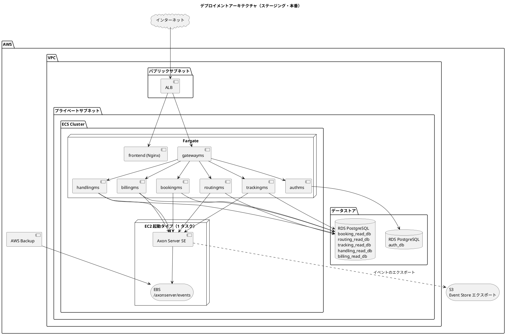
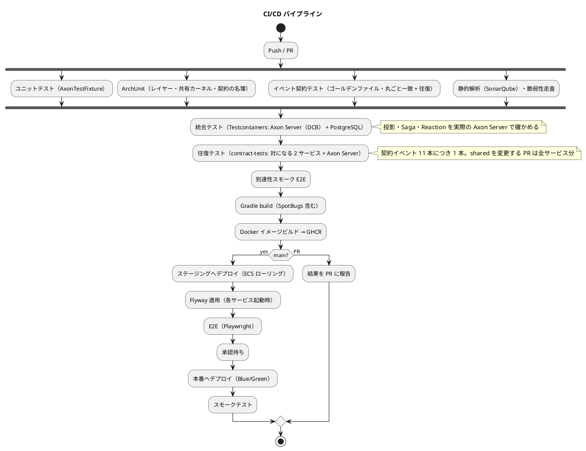

# インフラストラクチャアーキテクチャ - 国際貨物輸送管理システム（CQRS / Event Sourcing 版）

## 概要

[Axon Framework 5 による CQRS / Event Sourcing のマイクロサービス](architecture_backend.md)（7 サービス + Gateway）と React SPA を、コンテナ基盤の上で運用するための設計です。

インフラで CQRS / Event Sourcing に固有なのは **Axon Server** です。Axon Server は Event Store（唯一の真実）であり、同時に全サービスの Command / Event / Query Bus です。したがって次の 2 つが設計の中心になります。

1. **Axon Server は全環境で必ず動かす。** ローカルや開発環境で Axon Server を外し in-memory に逃げる構成は作りません。`take-4` は開発環境でそれを許し、Axon Server が落ちても正常応答する構成不全の発見が遅れました（`take-4` ADR-0009）。
2. **Event Store のバックアップが唯一の必須バックアップ。** 投影テーブル（PostgreSQL）は Event Store から再構築できます。

| 参照元 | 採るもの | 変えるもの |
| :--- | :--- | :--- |
| `tmp/take-4/docs/design/architecture_infrastructure.md` | Axon Server コンテナの構成、EC2 起動タイプ + EBS での運用、Event Store のバックアップ（EBS スナップショット + S3 エクスポート）、復旧手順 | 開発環境で Axon Server を無効化する構成をやめる |
| `docs/article/source/java-3/docs/design/architecture_infrastructure.md` | ローカルの kind + Kustomize、AWS ECS Fargate + RDS、Blue/Green、CI/CD、監視 | RabbitMQ を Axon Server に置き換える。Heroku の開発環境は採らない（後述） |

## デプロイメントアーキテクチャ



RDS は 1 インスタンスに 6 つのデータベースを作ります。Database per Service の要点は「サービスが他サービスの DB に接続しない」ことであり、インスタンスを分けることではありません。接続ユーザーを DB ごとに分け、他 DB への権限を与えません。

## 環境構成

### 環境一覧

| 環境 | 用途 | 基盤 | Axon Server | デプロイ |
| :--- | :--- | :--- | :--- | :--- |
| ローカル | 開発者の PC | kind + Kustomize | StatefulSet（PVC） | `kubectl apply -k` |
| ステージング | 受入テスト | AWS ECS Fargate + EC2（Axon）+ RDS | EC2 起動タイプ + EBS | CI/CD 自動 |
| 本番 | 商用運用 | 同上 | 同上 | CI/CD + 承認ゲート |

**Heroku の開発環境は採りません。** `java-3` は Heroku に各サービスを置き CloudAMQP を使いました。`take-4` は Heroku で Axon Server を無効化し、ローカルバスで動かしました（`take-4` ADR-0006）。Axon Server は永続ボリュームと gRPC の常時接続を要し、Heroku の dyno では運用できません。Axon Server 無しの環境を「開発環境」と呼ぶと、そこで緑になった検査が本番と違う条件で回ることになります。結合テストは CI の Testcontainers（Axon Server + PostgreSQL）とステージングで行います。

### ローカル開発環境（kind + Kustomize）

```text
ops/k8s/
├── base/
│   ├── axonserver/         # StatefulSet + PVC（/axonserver/events, /axonserver/data）+ Service（8024, 8124）
│   ├── postgres/           # StatefulSet + PVC + 初期化 SQL（6 DB と接続ユーザー）
│   ├── gatewayms/ authms/ bookingms/ routingms/ trackingms/ handlingms/ billingms/
│   ├── frontend/
│   └── kustomization.yaml
└── overlays/
    └── local/              # イメージタグ、リソース、NodePort、環境変数
```

| 項目 | 内容 |
| :--- | :--- |
| Axon Server | `axoniq/axonserver:2026.x`（Standard Edition）。`AXONIQ_AXONSERVER_STANDALONE_DCB=true` で **DCB を有効化**する（`tagKey` の集約は DCB 前提。無いと `AXONIQ-2308` で Coordinator が無限再試行し全業務サービスが起動しない）。PVC で `/axonserver/events` を永続化。`kind delete cluster` でも消えないよう hostPath を overlay で当てる |
| PostgreSQL | `postgres:16`。1 Pod に 6 DB。初期化 SQL で DB と接続ユーザーを作る |
| サービス | 7 サービスの Deployment。`AXON_AXONSERVER_SERVERS=axonserver:8124`。起動時に Axon Server への接続と **context が DCB であること**を確認し、どちらかに失敗したら起動を止める |
| 起動順 | Axon Server と PostgreSQL の readiness を待ってからサービスを起動（initContainer） |
| 反映 | イメージを作り直したら `images → rollout:image → rollout:restart` の 3 つを踏む。タグが同じだと `rollout:image` は Pod を作り直さない |
| Pod の待機 | ラベルだけで待たない。終了中の Pod にも一致する |

`docker compose` は採りません。ステージングと同じ「Service 名で解決する」形をローカルでも持つためです。

### プロファイル構成

| プロファイル | 用途 | Event Processor | DCB の有効化 | 備考 |
| :--- | :--- | :--- | :--- | :--- |
| `local` | kind | `pooled` | `AXONIQ_AXONSERVER_STANDALONE_DCB=true`（StatefulSet の env） | Axon Server あり |
| `test` | Testcontainers | `pooled` | `AxonServerContainer#withEnv("AXONIQ_AXONSERVER_STANDALONE_DCB", "true")` | Axon Server あり（コンテナ） |
| `staging` / `production` | AWS | `pooled` | `AXONIQ_AXONSERVER_STANDALONE_DCB=true`（ECS タスク定義の env。EE クラスタへ移行した場合は context 作成時に `dcb=true`） | Axon Server あり |

**Event Processor のモードをプロファイルで切り替えません。** `subscribing` に切り替えると投影が同期実行され、本番と挙動が変わります。モードの表記は設定の実値 `pooled`（`PooledStreamingEventProcessor`）に統一し、設定ファイルには `data-model.md` の対応表の全 Processing Group（投影 + `*-reaction`）を明示的に列挙します（列挙漏れは CI で赤）。

**DCB はすべての環境で有効にします。** 集約の登録に `tagKey` を使う以上、DCB でない context に繋ぐと起動しません。設定漏れを無音にしないため、各サービスは起動時の接続検査で「接続できる」に加えて「接続先 context が DCB である」ことを確かめ、失敗したら起動を止めます。

## コンテナ設計

### バックエンド（共通）

```dockerfile
FROM eclipse-temurin:25-jre-alpine
WORKDIR /app
COPY build/libs/*.jar app.jar
USER 1000
EXPOSE 8080
ENTRYPOINT ["java", "-XX:MaxRAMPercentage=75", "-jar", "app.jar"]
```

### Axon Server

```text
axoniq/axonserver:2026.x（Standard Edition）
- 8024/tcp  : HTTP（管理 UI / REST API / Actuator）
- 8124/tcp  : gRPC（クライアント接続）
Volumes:
- /axonserver/events  : Event Store。最重要。永続化必須
- /axonserver/data    : メタデータ
- /axonserver/config  : 設定
環境変数:
- AXONIQ_AXONSERVER_STANDALONE=true
- AXONIQ_AXONSERVER_STANDALONE_DCB=true（全環境。DCB を有効化）
- AXONIQ_AXONSERVER_ACCESSCONTROL_ENABLED=true（ステージング・本番）
```

Axon Server に接続するのは業務 5 サービス（bookingms・routingms・trackingms・handlingms・billingms）です。authms と gatewayms は接続しません。期待接続数は **5 × 台数**（初期は 2 台で 10）、上限はサービスあたり 50・合計 250 です。

管理 UI（8024）は VPC 内からだけ到達できるようにし、ALB には公開しません。

### リソース設定（初期値）

| コンテナ | CPU | メモリ | 台数 |
| :--- | :--- | :--- | :--- |
| gatewayms | 0.5 vCPU | 1 GB | 2 |
| 各業務サービス | 0.5 vCPU | 1 GB | 2（Event Processor のセグメントを 2 にして分担） |
| authms | 0.25 vCPU | 512 MB | 2 |
| frontend | 0.25 vCPU | 256 MB | 2 |
| Axon Server | 2 vCPU | 4 GB | **1**（SE） |

業務サービスを 2 台にするとき、Processing Group のセグメント数を 2 にし、投影の書き手が競合しないようにします。セグメント 1 のままなら 2 台目は投影に参加せず、コマンドとクエリだけを分担します。

## ネットワーク

| 項目 | 内容 |
| :--- | :--- |
| VPC | パブリック（ALB）とプライベート（ECS・RDS・Axon Server）の 2 層。2 AZ |
| セキュリティグループ | ALB → frontend / gatewayms の 8080 のみ。gatewayms → 各サービスの 8080。各サービス → Axon Server 8124、RDS 5432。Axon Server 8024 は踏み台からのみ |
| Service Discovery | ECS Service Connect。サービス名で解決（ローカルの Service 名と揃える） |
| TLS | ALB で終端。VPC 内は平文（Axon Server の gRPC も VPC 内） |

## CI/CD パイプライン



| 項目 | 方針 |
| :--- | :--- |
| ローカルの品質ゲート | CI と同じコマンド（`./gradlew build`）。`test` だけでは SpotBugs が抜ける |
| `contract-tests` | テスト専用サブプロジェクト（`apps/backend/contract-tests`）。業務サービスの数には数えない。CI の「往復テスト」段で対になる 2 サービスと Axon Server（DCB）を Testcontainers で起動して回す。`shared` を変更する PR は全サービス分を回す |
| セキュリティ走査 | 公式イメージの直実行。導入失敗と検出が同じ赤にならないようにする |
| 静的解析の抑制 | 指摘メッセージでなくルール ID で絞る（ロケールに依存させない） |
| イメージタグ | コミット SHA。同一タグの上書きをしない |
| 認証 | GitHub Actions → AWS は OIDC |

## デプロイメント戦略

### アプリケーション層：Blue/Green（本番）

ALB のターゲットグループを切り替えます。切り替え前に Green 側で Axon Server への接続とヘルスチェックを確認します。切り戻しはターゲットグループを戻すだけです。

### Event Processor と同時稼働

Blue と Green が同時に動く間、同じ Processing Group の Event Processor が両方で動きます。Axon Server がセグメントを割り当てるため二重投影は起きませんが、**投影のスキーマが Blue と Green で違う場合**は Green が先に Flyway で列を足し、Blue の投影がその列を知らないまま書く時間があります。列の追加は NULL 許容で行い、削除は次のリリースまで行いません。

### Axon Server の更新

| 操作 | 内容 |
| :--- | :--- |
| 初回 | EC2 起動タイプの ECS サービスを 1 タスクで作成、EBS をアタッチ |
| バージョンアップ | メンテナンス時間帯にタスクを差し替え。EBS は同一ボリュームを再アタッチ。**この間、全サービスのコマンドが止まる**（SE の制約。`non_functional.md` の可用性要件で扱う） |
| 停止時のサービス挙動 | 各サービスは接続を失うとコマンドを `503` で返す。**無音で in-memory に落ちない**ことを起動時と定期のヘルスチェックで確かめる |
| 起動時の接続検査 | (1) Axon Server に接続できる、(2) 接続先 context が DCB である、の 2 点。どちらかに失敗したら起動を止める（`take-4` ADR-0009 の接続検査に DCB を加える） |

### データベースマイグレーション

各サービスが起動時に Flyway を適用します。適用済みのファイルは編集しません（CI は緑のまま、既存環境だけが checksum mismatch で止まる）。投影への列追加は Flyway で列を足し、トークンをリセットしてリプレイします。リプレイは Gulp タスク（`projection:replay --service bookingms --group booking-cargo-projection`）にし、`operation.md` に手順を置きます。**リプレイの対象は投影の Processing Group だけ**で、`*-reaction`（イベント購読からコマンドを送る Reaction Handler の Group）はリセットしません。リセットするとコマンドが再送され、他サービスの集約が動きます。

## 監視・ログ

| 対象 | 監視項目 | 閾値・通知 |
| :--- | :--- | :--- |
| Axon Server | 稼働、gRPC 接続数、Event Store のディスク使用率、context が DCB であること | 接続数が期待値（業務 5 サービス × 台数）を下回ったら警告。上限（サービスあたり 50・合計 250）の 80% で警告。ディスク 70% で警告 |
| Event Processor | **トークンの遅れ**（最新イベントとの差）、エラーで止まった Processor | 遅れが 1,000 イベントまたは 5 分を超えたら警告。停止は即通知 |
| Saga | 未完了 Saga の滞留数・滞留時間 | 24 時間を超えた Saga を一覧化 |
| 要確認 | `attention_item` の未確認件数（投影の拒否・Reaction の失敗・Saga の補償） | 1 件以上で担当ロールの要確認一覧（S70）に表示 |
| サービス | CPU、メモリ、5xx 率、応答時間 | 5xx 1% 超で警告 |
| RDS | 接続数、ディスク、レプリカ遅延 | — |
| ログ | CloudWatch Logs。構造化 JSON。`traceId` と `bookingId` / `trackingNumber` を必ず載せる | Micrometer Tracing でサービスをまたぐ相関 |

Event Processor の遅れは CQRS / Event Sourcing 固有の監視項目です。遅れが増えると画面の「反映中」が長くなり、利用者には障害に見えます。

## バックアップ・災害復旧

### バックアップ戦略

| 対象 | 方式 | 頻度 | 保持 |
| :--- | :--- | :--- | :--- |
| **Axon Server EBS**（Event Store） | AWS Backup（EBS スナップショット） | 1 時間 | 24 時間分 + 日次 7 日 + リリース前の手動 30 日 |
| **Event Store エクスポート** | Axon Server REST API を Lambda が 5 分間隔でポーリングし、追記分を S3 に JSON Lines で書く | 連続 | 1 年 + Glacier 7 年 |
| RDS（投影・Auth） | 自動スナップショット | 日次 | 7 日 |

投影は Event Store から再構築できるため、RDS のバックアップは復旧時間を短くするためのものです。Auth（`auth_db`）だけは再構築できないので、RDS のバックアップが唯一の手段です。

### 復旧手順

| シナリオ | 手順 |
| :--- | :--- |
| 投影の不整合・破損 | 該当投影 Processing Group のトークンをリセット → リプレイ（Gulp タスク）。Reaction の Group は対象外 |
| Axon Server インスタンス障害 | EBS を新タスクにアタッチして再起動 |
| Axon Server ボリューム破損 | 最新の EBS スナップショットから復元 → S3 エクスポートから差分を再投入 |
| AZ 障害 | 別 AZ でスナップショットから復元（SE は手動。EE ならクラスタで自動） |
| `auth_db` 破損 | RDS スナップショットから復元 |

**バックアップは復元できて初めてバックアップです。** 四半期に 1 度、ステージングで EBS スナップショットからの復元とリプレイを実際に行い、投影の行数がイベント列から導いた期待値と一致することを確かめます。

### RPO / RTO

| 指標 | 目標 |
| :--- | :--- |
| RPO（Event Store） | 1 時間（EBS 1 時間 + S3 連続エクスポートで実質 5 分） |
| RPO（投影） | Event Store に従う（再構築） |
| RPO（`auth_db`） | 24 時間 |
| RTO | 4 時間 |

## セキュリティ

| 層 | 対策 |
| :--- | :--- |
| ネットワーク | プライベートサブネット、セキュリティグループの最小化、Axon Server の管理 UI を非公開 |
| Axon Server | アクセス制御を有効化し、サービスごとのトークンで接続。管理 UI は踏み台経由 |
| 認証・認可 | `authms` の JWT を `gatewayms` が検証。認可は入力検証より先 |
| シークレット | AWS Secrets Manager。ECS タスク定義から参照 |
| イメージ | 脆弱性走査を CI で実施。非 root で実行 |
| Event Store の個人情報 | イベントは削除できない。削除要求への対応は crypto-shredding（ADR-0003）。荷主ごとの鍵は KMS のエイリアス `alias/cargo-tracker/shipper/<shipperId>` |

## コスト見積（月額概算・本番）

| 項目 | 概算 |
| :--- | :--- |
| ECS Fargate（8 サービス × 2 台） | $250 |
| EC2（Axon Server, m6i.large）+ EBS 100 GB | $90 |
| RDS PostgreSQL（db.t4g.medium, Multi-AZ） | $120 |
| ALB | $30 |
| バックアップ（EBS スナップショット・S3） | $30 |
| CloudWatch | $30 |
| 合計 | 約 $550 |

数値は調査時点の概算です。確定は `non_functional.md` と `operation.md` で行います。

## 参照

- [バックエンドアーキテクチャ](architecture_backend.md)
- [データモデル設計](data-model.md)（Processing Group とテーブルの対応）
- [ADR-0002 Event Store は Axon Server SE、Read Model は PostgreSQL + MyBatis](../../adr/cargo-tracker/0002-event-store-axon-server-and-postgresql-read-models.md)
- [アーキテクチャ設計ガイド](../../reference/アーキテクチャ設計ガイド.md)
- 参照元：`tmp/take-4/docs/design/architecture_infrastructure.md`、`tmp/take-4/docs/adr/0006`、[java-3 インフラストラクチャアーキテクチャ](../../article/source/java-3/docs/design/architecture_infrastructure.md)
