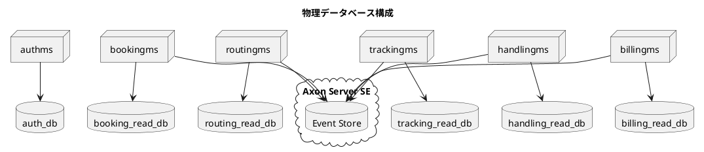
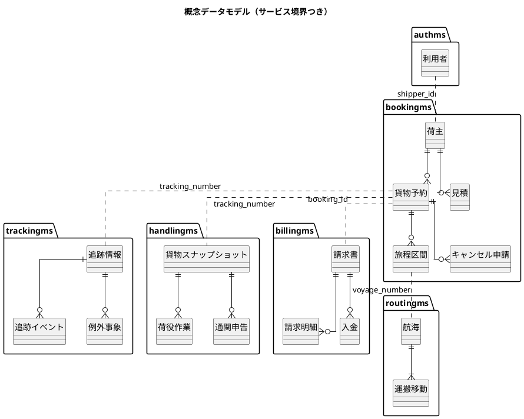
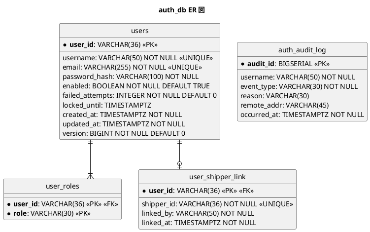
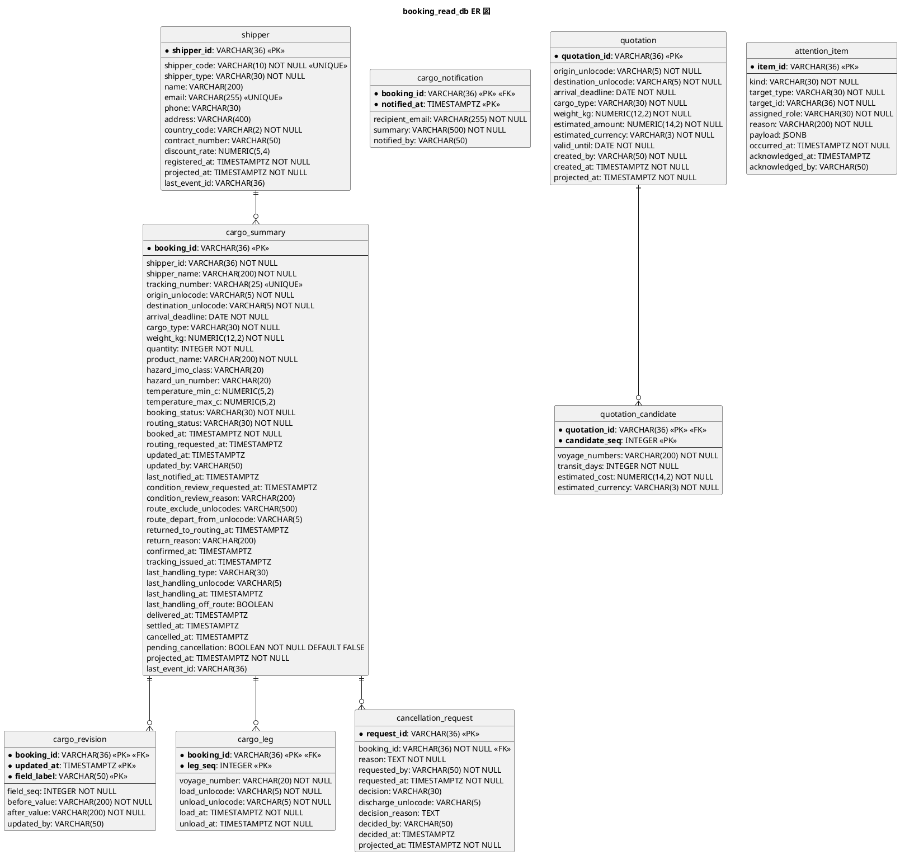
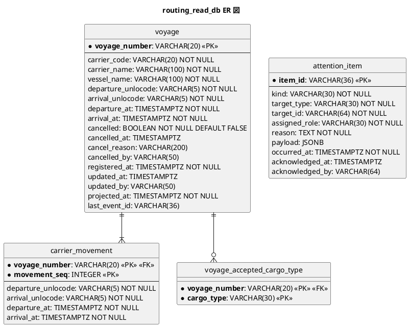
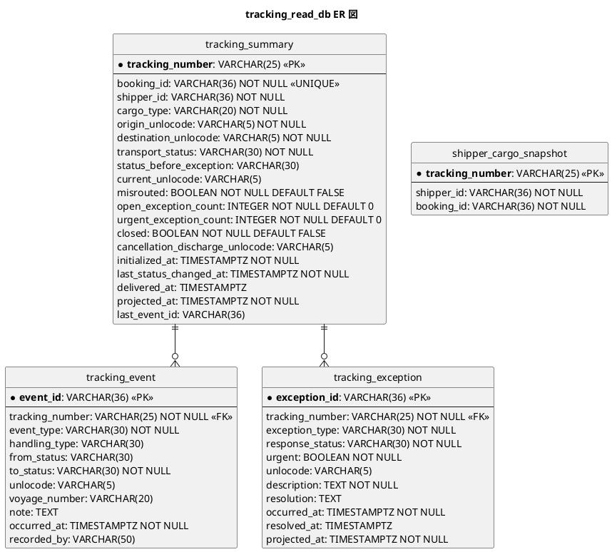
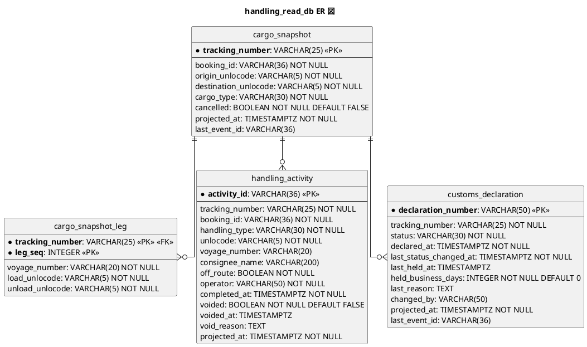
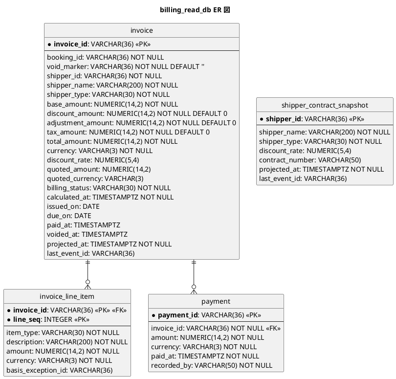
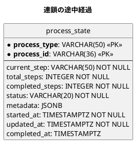
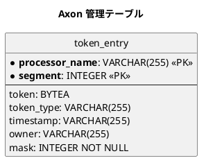

# データモデル設計 - 国際貨物輸送管理システム（CQRS / Event Sourcing 版）

## 概要

国際貨物輸送管理システム（Cargo Tracker）のデータモデルを定義します。前提は [バックエンドアーキテクチャ](architecture_backend.md) と [ドメインモデル設計](domain-model.md) で、集約の状態は Axon Server の Event Store にイベント列として保存され、PostgreSQL には**投影テーブル（Read Model）・Axon の管理テーブル・Auth の状態**だけを置きます。

本書が扱う範囲と扱わない範囲を先に示します。

| 範囲 | 内容 | 本書 |
| :--- | :--- | :--- |
| Event Store | 集約のイベント列・スナップショット | **扱わない**。Axon Server が管理し、アプリは SQL を発行しない。スキーマは参考として 1 節だけ載せる |
| 投影テーブル | 画面・API が読む読み取りモデル。サービスごとの DB | 扱う。**派生データであり、いつでも捨ててリプレイで再構築できる**ことが設計条件 |
| Axon 管理テーブル | `token_entry` のみ | 扱う。投影と同じ DB に置き、同一トランザクションで更新する。**`saga_entry` / `association_value_entry` は作らない**（Axon 5 に Saga が無い。ADR-0001 決定 6） |
| Auth の状態 | `users` など | 扱う。唯一の「書き込みモデルとしてのテーブル」 |

**投影テーブルは真実の情報源ではありません。** 真実は Event Store のイベント列です。したがって本書のテーブルは、ドメインモデルの集約と 1 対 1 に対応しません。画面ごとに必要な形で設計し、他サービスの DB を JOIN しません。

参照元との関係は次のとおりです。

| 参照元 | 採るもの | 変えるもの |
| :--- | :--- | :--- |
| `tmp/take-4/docs/design/data-model.md` | Database per Service、Event Store と Read Model の分離、監査カラム、命名規則、Flyway 方針 | 投影テーブルの列を本プロジェクトのドメインモデル（`ROUTE_NOTIFIED`、`ROUTING_REQUESTED`、通関、キャンセル申請）に合わせる |
| `docs/article/source/java-3/docs/design/data-model.md` | `cancellation_request`、`customs_declaration` + 追記専用の履歴、`auth_audit_log`、`user_shipper_link`、金額の表現 | 現在状態テーブルを投影に置き換える。履歴テーブルの多くはイベント列に置き換わる |

## 設計方針

| 方針 | 内容 | 理由 |
| :--- | :--- | :--- |
| Database per Service | サービスごとに PostgreSQL の DB を分ける。他サービスの DB へ接続しない | サービスの独立デプロイ。JOIN が要る時点で投影の設計が画面と合っていない |
| 投影は捨てられる | 投影テーブルに `NOT NULL` と UNIQUE 以外の業務制約（CHECK）を置かない。制約は集約が守る | 投影の CHECK が集約と食い違うと、リプレイが途中で止まる |
| 一意制約は投影で最終的に弾く | `shipper.email`、`voyage.voyage_number`、`invoice(booking_id, void_marker)` の UNIQUE。「事前の存在確認 + 投影の UNIQUE + 拒否の記録（`attention_item`）」の三段 | 集約 1 つでは全体の一意性を守れない。投影で弾いた事実は要確認として残す |
| 追記系投影は元イベントの識別子を UNIQUE にする | `tracking_event.event_id`、`handling_activity.activity_id`、`payment.payment_id` を PK（= UNIQUE）にする。UPDATE 系は `last_event_id` より古いイベントで上書きしない | 少なくとも 1 回配送の再配送で同じ行が二度入らない。冪等性の検査は同一 `event_id` の再配送で行う（`test_strategy.md`） |
| 個人情報の列は NULL 許容 | `shipper` の `name` / `email` / `phone` / `address`。`UNIQUE(email)` は NULL を許す | crypto-shredding（ADR-0003）で鍵を破棄した荷主はリプレイで個人情報が `NULL` になる。`NOT NULL` だとリプレイが止まる |
| 投影とトークンは同一トランザクション | `token_entry` を投影と同じ DB に置く | 分けると「投影は書けたがトークンは進まない」窓ができ、同じイベントが二度投影される |
| 履歴テーブルを作らない | 荷役履歴・状態変更履歴・通関状態履歴は Event Store が持つ。画面に要る履歴だけ投影する | 履歴の真実は 1 か所（イベント列） |
| 金額は `NUMERIC(14,2)` + ISO 4217 の `VARCHAR(3)` | 通貨混在を許さない | `Money` の JSON 形と一致させる |
| 列挙値は `VARCHAR(30)` | DB の ENUM 型を使わない | 値の追加がマイグレーションでなくリプレイで済む |
| 日時は `TIMESTAMPTZ`、業務日付は `DATE` | 期限の比較は日付単位で、業務タイムゾーンで行う | DATE と時刻付きの素朴な比較は期限当日着を誤って刈る |

## 物理データベース構成



| サービス | DB | 用途 | テーブル |
| :--- | :--- | :--- | :--- |
| Axon Server | （専用ボリューム） | Event Store | イベント列、スナップショット |
| authms | `auth_db` | 状態保存 | `users`, `user_roles`, `user_shipper_link`, `auth_audit_log` |
| bookingms | `booking_read_db` | 投影 + 受け皿 + Axon 管理 | `shipper`, `cargo_summary`, `cargo_revision`, `cargo_notification`, `cargo_leg`, `cancellation_request`, `quotation`, `quotation_candidate`, `attention_item`, `process_state`, `token_entry` |
| routingms | `routing_read_db` | 投影 + 受け皿 + Axon 管理 | `voyage`, `carrier_movement`, `voyage_accepted_cargo_type`, `attention_item`, `token_entry` |
| trackingms | `tracking_read_db` | 投影 + 受け皿 + Axon 管理 | `tracking_summary`, `tracking_event`, `tracking_exception`, `shipper_cargo_snapshot`, `attention_item`, `token_entry` |
| handlingms | `handling_read_db` | 投影 + Axon 管理 | `cargo_snapshot`, `cargo_snapshot_leg`, `handling_activity`, `customs_declaration`, `token_entry` |
| billingms | `billing_read_db` | 投影 + 受け皿 + Axon 管理 | `invoice`, `invoice_line_item`, `payment`, `shipper_contract_snapshot`, `attention_item`, `token_entry` |

`location` のマスタは各 DB に置きません。UN/LOCODE は共有カーネルの値オブジェクトであり、港名の表示に要る対応表は `shared` のリソース（CSV）から読みます。マスタを各 DB に複製すると更新の同期が要ります。

### 共通の監査カラム

投影テーブルにも監査カラムを置きます。ただし意味は「投影がいつ書かれたか」であり、業務上の発生時刻は各テーブルの `*_at` 列（イベントの `occurredAt` から写す）です。

| カラム | 型 | 用途 |
| :--- | :--- | :--- |
| `projected_at` | `TIMESTAMPTZ NOT NULL DEFAULT NOW()` | 投影が最後に書いた時刻 |
| `last_event_id` | `VARCHAR(36)` | 最後に反映したイベントの識別子。冪等性の確認と調査用 |

`version`（楽観ロック）は投影テーブルに置きません。投影の書き手は Event Processor 1 つであり、競合は Processor のセグメント割当で防ぎます。Auth の `users` だけは複数の書き手があるため `version` を持ちます。

## 概念データモデル

要件定義の情報モデルを、サービスの境界で切ったものです。実線はサービス内の関連、点線はサービスをまたぐ論理参照（識別子の値だけを持ち、外部キーを張らない）です。



## Event Store（Axon Server 管理・参考）

Axon Server が内部で管理します。アプリケーションは `EventStore` / `EventAppender` を介してアクセスし、SQL を発行しません。以下は Event Store が何を持つかを理解するための参考であり、本プロジェクトが作るテーブルではありません。

| 概念 | 内容 |
| :--- | :--- |
| イベント | `event_identifier`、集約の識別子（DCB ではタグ `bookingId=...`）、`sequence_number`、`payload_type`（イベントのクラス名）、`payload_revision`、`payload`（JSON）、`meta_data`、`time_stamp` |
| スナップショット | 集約の識別子、`sequence_number`、集約の状態のシリアライズ。イベント数が閾値を超えた集約に自動取得 |
| context | 単一の `default`。全サービスが同じストリームを読む |

Event Store の運用（バックアップ・復元・イベントの欠落検証）は `operation.md` で扱います。

## 論理データモデル

### `auth_db`（authms）



| テーブル | 説明 | 制約・インデックス |
| :--- | :--- | :--- |
| `users` | 利用者。US31 の失敗回数とロック期限を列に持つ | `UNIQUE(username)`, `UNIQUE(email)` |
| `user_roles` | ロール。`ROLE_SHIPPER` / `ROLE_SALES` / `ROLE_ROUTING` / `ROLE_TRACKER` / `ROLE_HANDLER` / `ROLE_ACCOUNTANT` / `ROLE_ADMIN` | 1 人 1 ロール以上（アプリで保証） |
| `user_shipper_link` | 利用者と荷主の紐付け。**これだけを正とし、名前やメールの一致で推測しない** | `UNIQUE(shipper_id)`。`shipper_id` は bookingms への論理参照（FK 無し） |
| `auth_audit_log` | 認証試行・ロック・解除の記録。`event_type` は `LOGIN_SUCCESS` / `LOGIN_FAILURE` / `LOCKED` / `UNLOCKED`。`reason` は `BAD_CREDENTIALS` / `LOCKED` / `DISABLED`（画面には出さない） | `INDEX(username, occurred_at)` |

### `booking_read_db`（bookingms）



| テーブル | 元になるイベント | 制約・インデックス | 備考 |
| :--- | :--- | :--- | :--- |
| `shipper` | `ShipperRegisteredEvent`, `ShipperContactUpdatedEvent`, `CorporateContractAssignedEvent` | `UNIQUE(email)`（NULL を許す）, `UNIQUE(shipper_code)` | `shipper_code` は投影側のシーケンス（`SHP-` + 連番 6 桁）で採番。UNIQUE 違反は `attention_item` に記録。`name` / `email` / `phone` / `address` は crypto-shredding 後に `NULL` になる（ADR-0003）。表示既定値は「（削除済み）」（`ui_design.md`） |
| `cargo_notification` | `ShipperNotifiedEvent` | `PK(booking_id, notified_at)`, `INDEX(booking_id, notified_at DESC)` | 荷主への通知履歴（US12 §受入基準 4）。1 行 = 1 回の通知。**送信基盤はスコープ外**で、通知は現行の手作業（電話・メール）で行う。ここに残るのは「いつ・誰に・何を伝えたか」で、荷主から「聞いていない」と言われたときに突き合わせる材料になる。`cargo_revision` と同じく**主キーに通知日時を含めるので、リプレイしても行が増えない**（採番すると積み上がる。[ADR-0008](../../adr/cargo-tracker/0008-cargo-revision-as-a-projection.md)）。再通知では行が増える。`notified_by` は NULL を許す——Gateway を通れば必ず入るが、入らなかったときに 500 で落とすのは違う（通知した事実は残し、画面で「—」と出す。`cargo_revision.updated_by` と同じ扱い） |
| `cargo_revision` | `CargoSpecificationUpdatedEvent` | `PK(booking_id, updated_at, field_label)`, `INDEX(booking_id, updated_at DESC)` | 修正で変わった項目（US32 §受入基準 4「何を変えたか」）。1 行 = 1 回の修正で変わった 1 項目。**投影の直前の行と修正イベントを丸ごと比べて作る**（項目の名簿を手で書くと、要素を足したときに書き忘れが黙って差分から消える）。主キーに修正時刻を含めるので、リプレイしても行が増えない。判断の経緯は [ADR-0008](../../adr/cargo-tracker/0008-cargo-revision-as-a-projection.md) |
| `cargo_summary` | `CargoBookedEvent` ほか Cargo の全イベント（`booking_status` の書き手は `BookingDeliveredEvent`・`BookingSettledEvent` を含む Cargo 自身のイベントだけ）、`HandlingActivityRegisteredEvent`・`HandlingActivityVoidedEvent`（契約、`last_handling_*` のみ） | `UNIQUE(tracking_number)`, `INDEX(shipper_id)`, `INDEX(booking_status)`, `INDEX(routing_status)` | `shipper_name` を非正規化して持つ（一覧が JOIN しない）。`last_handling_*` は荷役の契約イベントから写す。他サービスの `CargoDeliveredEvent`・`PaymentRecordedEvent` は投影が写さず、`booking-reaction` が Cargo へコマンドを送り、Cargo のイベントで `booking_status` が変わる。`INDEX(shipper_id)` は荷主向け一覧（`FindShipperBookingsQuery`）の索引を兼ねる。`updated_at` / `updated_by` は**最終更新だけ**を持つ（US32）。何を変えたかは `cargo_revision` が持つ（[ADR-0008](../../adr/cargo-tracker/0008-cargo-revision-as-a-projection.md)）。`routing_requested_at` は経路設計者へ引き渡した日時（US06）。S30 は到着期限が近い順に並ぶので、期限が遠い案件は下に沈む。引き渡しからどれだけ経ったかが読めないと放置に気づけない。`condition_review_requested_at` / `condition_review_reason` は営業への差し戻し（US10 §4）。**状態は動かさず記録で表す**（[ADR-0009](../../adr/cargo-tracker/0009-condition-review-is-not-a-state-transition.md)）。条件を調整すると消える（営業の手番が終わるため）。`route_exclude_unlocodes` / `route_depart_from_unlocode` は経路探索の条件（US10）。**候補を出すたびにここから組む**（画面から組み立てて送ると、条件を直したのに古い条件で探すことが起きる）。除外港はカンマ区切りで持つ。1 予約あたり数件で、絞り込みにも並び替えにも使わず、予約と一緒にしか読まない。`last_notified_at` は最後に荷主へ通知した日時（US12）。営業のダッシュボードが「まだ通知していない経路確定済みの予約」を、履歴テーブルを数えずに絞るために持つ。`returned_to_routing_at` / `return_reason` は通知後に経路設計へ戻した記録（US12）。**`routing_requested_at` とは別の列にする**——同じ列に書くと「引き渡した」と「通知後に戻した」が区別できなくなる |
| `cargo_leg` | `CargoRoutedEvent` | `INDEX(voyage_number)` | 再設計時は全行を入れ替える |
| `cancellation_request` | `CancellationRequestedEvent`, `CancellationApprovedEvent`, `CancellationRejectedEvent` | `INDEX(booking_id)`, `INDEX(decision)`（`NULL` = 承認待ち） | `decision` は `APPROVED` / `REJECTED` / `NULL` |
| `quotation` / `quotation_candidate` | `QuotationCreatedEvent` | `INDEX(created_at)` | 候補 0 件の見積も 1 行残る |
| `attention_item` | 投影が UNIQUE 違反で書けなかった事実（`kind = PROJECTION_REJECTED`）、Reaction Handler のコマンド失敗（`kind = REACTION_FAILED`）、Saga の補償（`kind = SAGA_COMPENSATED`） | `INDEX(assigned_role, occurred_at) WHERE acknowledged_at IS NULL`（部分インデックス） | 要確認一覧（S70）の受け皿。`assigned_role` で自ロール宛に絞り、`payload` に受け付けた内容を持ち「修正して再登録」の初期値にする。`target_type` / `target_id` は詳細への導線（投影に無い行でも `payload` から開ける）。**投影ではなく追記専用の受け皿**であり、リプレイで TRUNCATE しない。同じ定義を `routing_read_db`・`tracking_read_db`・`billing_read_db` にも置く（「事前の存在確認 + 投影の UNIQUE + 拒否の記録」の三段の最後） **`item_id` は採番せず「何が・どの対象で・なぜ」から導きます**（SHA-256 の先頭 128 ビットを 16 進 32 文字。導出は共有カーネルの `AttentionItemId` 1 か所）。採番すると、投影を読み直すたびに同じ内容の行が積み上がります（IT2 で実在した欠陥）。**UUID の見た目に整形しません**（導出値であることが読めなくなり、採番された値だと誤解した変更を招く。IT4 R.1）。 |

### `routing_read_db`（routingms）



| テーブル | 元になるイベント | 制約・インデックス | 備考 |
| :--- | :--- | :--- | :--- |
| `voyage` | `VoyageRegisteredEvent`, `VoyageScheduleUpdatedEvent`, `VoyageCancelledEvent` | `INDEX(departure_unlocode, departure_at)`, `INDEX(arrival_unlocode, arrival_at)` | 航海番号は自然キー。`departure_*` / `arrival_*` は最初と最後の移動を非正規化（一覧の検索用）。`updated_at` / `updated_by` は**最終更新だけ**を持つ。変更内容の履歴は Event Store が持ち、履歴テーブルは作らない（US25） |
| `carrier_movement` | 同上 | — | 経路探索の `VoyageGraph` はこのテーブルから組む。更新時は全行入れ替え |
| `voyage_accepted_cargo_type` | 同上 | — | 空なら一般貨物のみ |
| `attention_item` | 投影が UNIQUE 違反で書けなかった事実（`kind = PROJECTION_REJECTED`） | `INDEX(assigned_role, occurred_at) WHERE acknowledged_at IS NULL` | `booking_read_db` と同じ定義。**記録するだけでは誰にも見えない**ので、読み口（`GET /api/v1/routing/attention-items`）を対で置く。S70 は booking と routing の両方を束ねて出す **`item_id` は採番せず「何が・どの対象で・なぜ」から導きます**（SHA-256 の先頭 128 ビットを 16 進 32 文字。導出は共有カーネルの `AttentionItemId` 1 か所）。採番すると、投影を読み直すたびに同じ内容の行が積み上がります（IT2 で実在した欠陥）。**UUID の見た目に整形しません**（導出値であることが読めなくなり、採番された値だと誤解した変更を招く。IT4 R.1）。 |

経路候補（`RouteCandidate`）はテーブルに持ちません。`FindRouteCandidatesQuery` のたびに `carrier_movement` から探索します。候補を保存するのは Booking の `quotation_candidate` と `cargo_leg` です。

### `tracking_read_db`（trackingms）



| テーブル | 元になるイベント | 制約・インデックス | 備考 |
| :--- | :--- | :--- | :--- |
**`shipper_id` は IT7 では作っていません。** `TrackingInitializedEvent` に荷主 ID が無く、trackingms はそれを得る手段を持たないためです（載せる相手のいない `NOT NULL` は作れません）。荷主向け追跡（US18・IT8）で契約イベントに `shipperId` を足すときに、この列も足します。**荷役・例外・キャンセルの列も、それを書くイベントを実装する IT で足します**——中身の無い列を先に作ると、画面が読んで「常に 0 件」を出し、動いていると誤解されます。IT7 で作ったのは `tracking_number`・`booking_id`・`cargo_type`・端点・`transport_status`・日時だけです。

**予定の旅程は `tracking_leg` に持ちます**（IT7 で新設。`tracking_number` + `leg_seq` が主キーで、**積む順**に並びます）。荷役（US15・IT9）が予定と実績を照合する材料です。投影は入れ直しの前に消します（追記だけにすると、リプレイで区間が倍になります）。

| `tracking_summary` | `TrackingInitializedEvent`, `TransportStatusUpdatedEvent`, `CargoMisroutedEvent`, `TrackingException*Event`, `CancellationDischargePlannedEvent`, `TrackingClosedEvent` | `UNIQUE(booking_id)`, `INDEX(shipper_id)`, `INDEX(transport_status)`, `INDEX(urgent_exception_count DESC, last_status_changed_at)` | 例外の件数を非正規化して持ち、一覧が `tracking_exception` を数えない。`cancellation_discharge_unlocode` はキャンセル承認後の陸揚げ地（`CargoCancelledEvent.dischargeLocation` を `tracking-reaction` 経由で写す）。当該港の `UNLOAD` で `closed` になる |
| `tracking_event` | `TransportStatusUpdatedEvent`（荷役由来・手動由来）、`CargoMisroutedEvent` | `UNIQUE(event_id)`（PK。元イベントの識別子）, `INDEX(tracking_number, occurred_at)` | 画面の履歴用。`event_type` は `HANDLING` / `MANUAL` / `MISROUTE` / `EXCEPTION` / `RESOLVED` / `VOIDED`。追記系なので再配送は UNIQUE で弾く。真実は Event Store |
| `tracking_exception` | `TrackingExceptionRegisteredEvent`, `ExceptionResponseStartedEvent`, `TrackingExceptionResolvedEvent` | `INDEX(response_status, urgent DESC, occurred_at)` | `urgent` は `ExceptionType#urgent` の結果を写す |
| `shipper_cargo_snapshot` | `TrackingNumberIssuedEvent`（契約） | `INDEX(shipper_id)` | 荷主向け一覧・詳細の絞り込み。authms の `user_shipper_link` と突き合わせる |
| `attention_item` | `tracking-projection` の拒否、`tracking-reaction` のコマンド失敗 | `booking_read_db` と同じ | 定義は `booking_read_db` の `attention_item` と同一 |

### `handling_read_db`（handlingms）



| テーブル | 元になるイベント | 制約・インデックス | 備考 |
| :--- | :--- | :--- | :--- |
| `cargo_snapshot` / `cargo_snapshot_leg` | `TrackingNumberIssuedEvent`, `CargoCancelledEvent`（いずれも契約） | — | ACL の読み取りモデル。`HandlingActivity` の登録時に `isOffRoute` の判定に使う。Booking の型を持ち込まない |
| `handling_activity` | `HandlingActivityRegisteredEvent`, `HandlingActivityVoidedEvent` | `UNIQUE(activity_id)`（PK。クライアント生成の冪等キー）, `INDEX(tracking_number, completed_at)`, `INDEX(voyage_number, unlocode)` | `activity_id` は `RegisterHandlingActivityCommand` の冪等キー（クライアント生成 UUID）。再送信は集約が同一 `activityId` で弾き、投影は PK で弾く。重複登録の 5 分規則は集約が守る。訂正は `voided` を立てるだけで元の行は残る（`VoidHandlingActivityCommand`）。`completed_at` は港のローカル時刻で入力し `TIMESTAMPTZ` で保存。`INDEX(voyage_number, unlocode)` は `FindCargosOnVoyageQuery` 用（`cargo_snapshot_leg` と合わせる） |
| `customs_declaration` | `CustomsDeclarationRegisteredEvent`, `CustomsStatusUpdatedEvent` | `INDEX(tracking_number, status)`, `INDEX(status, held_business_days DESC)` | 状態変更の履歴は Event Store が持つ。画面の履歴表示は Event Store から読む（`FindCustomsDeclarationQuery` が最新状態、履歴はイベント列）。`held_business_days` は留置の営業日数（港の所在国の休日カレンダーで数え、`CustomsStatusChangedEvent.heldBusinessDays` から写す）。一覧は留置営業日の多い順 |

java-3 の `customs_status_history`（追記専用テーブル）は作りません。追記専用の履歴はイベント列そのものです。

### `billing_read_db`（billingms）



| テーブル | 元になるイベント | 制約・インデックス | 備考 |
| :--- | :--- | :--- | :--- |
| `invoice` | `InvoiceCalculatedEvent`, `DiscountAppliedEvent`, `InvoiceAdjustedEvent`, `InvoiceIssuedEvent`, `PaymentRecordedEvent`, `InvoiceVoidedEvent`, `CancellationFeeAppliedEvent` | `UNIQUE(booking_id, void_marker)`, `INDEX(billing_status, due_on)`, `INDEX(shipper_id)` | `void_marker` は有効中 `''`、取り消し時に `invoice_id` を入れる。有効な請求書は予約ごとに 1 通。**`overdue` 列は持たず**、一覧の SQL が `due_on < :today AND billing_status = 'INVOICED'` で判定する。`quoted_amount` / `quoted_currency` は見積時の概算（任意。見積を経ない予約は `NULL`）で、S61 が「見積時の概算 → 請求 → 差額」を出す。`INDEX(shipper_id)` は荷主向け請求書（`FindShipperInvoiceQuery`）の索引を兼ねる |
| `invoice_line_item` | 同上 | — | `item_type` は `BASE` / `DISCOUNT` / `ADJUSTMENT` / `CANCELLATION_FEE` / `TAX`。`basis_exception_id` は調整行の根拠になった例外 ID（任意。trackingms への論理参照）で、S61 から例外へリンクする |
| `payment` | `PaymentRecordedEvent` | `INDEX(invoice_id)` | |
| `shipper_contract_snapshot` | `ShipperRegisteredEvent`, `CorporateContractAssignedEvent`（いずれも契約）の購読。**IT2 時点で購読しているのは前者だけ**（`CorporateContractAssignedEvent` は US22 の IT13 で足す） | `PK(shipper_id)` | billingms が bookingms に同期問い合わせをしないための ACL の読み取りモデル（`FindShipperForBillingQuery` は廃止）。荷主の最新の契約を写し、請求書作成時に `invoice.discount_rate` へ複写する。作成後に割引率が変わっても請求書は変わらない。`shipper_name` は crypto-shredding 後に `NULL`（ADR-0003） |
| `attention_item` | `billing-projection` の拒否、`billing-reaction` のコマンド失敗、補償 | `booking_read_db` と同じ | 定義は `booking_read_db` の `attention_item` と同一 |

### 連鎖の途中経過（`process_state`）

Axon 5 に Saga が無いので、複数段にまたがる連鎖の途中経過は**自分のテーブルに明示的に持ちます**（[ADR-0001](../../adr/cargo-tracker/0001-cqrs-es-with-axon-in-microservices.md) 決定 6）。Saga のストアに直列化して埋めるのと違い、滞留の一覧化も管理画面もふつうの SQL で書けます。フィールドの型を変えても、リプレイの復元ではなくマイグレーションの問題になります。

**すべての連鎖に置くわけではありません。** 1 段で終わる連鎖は集約の状態から「今どの段か」が読めるので作りません。置くのは**複数段にまたがり、途中で止まったことを一覧にしたい連鎖**だけです。現時点の該当は予約 → 追跡番号発行 → 追跡開始（3 段、bookingms）。



| 列 | 用途 |
| :--- | :--- |
| `process_type` / `process_id` | 連鎖の種類と対象（例：`BOOKING_TO_TRACKING` と `bookingId`）。Saga の関連付けに相当する |
| `current_step` / `completed_steps` / `total_steps` | 今どの段か。止まった位置がそのまま読める |
| `status` | `RUNNING` / `COMPLETED` / `COMPENSATED`。完了で行を消さずに残すのは、あとから「いつ終わったか」を問えるようにするため |
| `metadata` | 連鎖の再開・補償に要る値。個人情報は入れない（消せなくなる） |

**滞留の検知。** Axon に Deadline が無いので、`status = 'RUNNING'` かつ `updated_at` が 24 時間より古い行を定期に走査します（`gulp reaction:stuck`）。超過したものは補償して `attention_item` に写します（`operation.md`）。

置く DB は連鎖の起点を持つサービスの Read Model DB です（予約 → 追跡開始なら `booking_read_db`）。**連鎖ごとに 1 つのサービスが持ち主になります。** 複数サービスで同じ連鎖の状態を持つと、どちらが正かが曖昧になります。

**イベントの再配信に耐えること。** Saga のインフラが隠していた冪等性を自分で持つ必要があるので、窓口（`ProcessStateService`）で次を守ります。実装は bookingms、検査は `ProcessStateServiceIT`。

| 守ること | なぜ |
| :--- | :--- |
| 同じ連鎖を 2 度始めても作り直さない | 作り直すと進んだ段が巻き戻る |
| 同じ段を 2 度受け取っても進めない | 進めると段が飛び、届いていない段を終えたことにする |
| 終わった連鎖は遅れて届いたイベントで再開しない | 完了が取り消される |
| 始まっていない連鎖は進められない（例外にする） | 黙って作ると、始まっていない連鎖が進んだことになる |

**制約は DB 側にも置きます。** `status` の値域、`completed_steps <= total_steps`、そして「`RUNNING` でないなら `completed_at` がある」を CHECK 制約にします。最後の 1 つが無いと、完了しているのに「いつ終わったか」を問えない行が作れてしまいます。

### Axon 管理テーブル（各 Read Model DB 共通）

各サービスの Flyway で作ります。列名は Axon 5 の `JdbcTokenStore` の既定に合わせ、`TokenSchema` で明示します（take-4 ADR-0009）。`JdbcSagaStore` は Axon 5 に存在しません（ADR-0001 決定 6）。



| テーブル | 置く DB | 用途 |
| :--- | :--- | :--- |
| `token_entry` | 全 Read Model DB | Processing Group ごとの処理位置。`mask INTEGER NOT NULL` はセグメントのマスク（take-4 の実測スキーマ。無いと起動時に落ちる）。`INDEX(processor_name)` |

## Processing Group とテーブルの対応

投影のリプレイは Processing Group 単位です。「どのテーブルを空にしてどのトークンをリセットするか」を固定します。

Processing Group は `@ProcessingGroup`（Axon 5 に存在しません）ではなく、`application.yml` の `axon.eventhandling.processors."[<ハンドラのパッケージ名>]"` で指定します。したがって**下表の Group 名はパッケージの分け方と 1:1 で対応させます**（IT1 スパイク・[ADR-0001](../../adr/cargo-tracker/0001-cqrs-es-with-axon-in-microservices.md) 決定 3）。

| サービス | Processing Group | 購読するイベント | 書くテーブル |
| :--- | :--- | :--- | :--- |
| bookingms | `booking-shipper-projection` | Shipper のイベント | `shipper` |
| bookingms | `booking-cargo-projection` | Cargo のイベント、`HandlingActivityRegisteredEvent`、`HandlingActivityVoidedEvent` | `cargo_summary`, `cargo_revision`, `cargo_leg`, `cancellation_request` |
| bookingms | `booking-quotation-projection` | Quotation のイベント | `quotation`, `quotation_candidate` |
| bookingms | `booking-reaction` | `CargoDeliveredEvent`、`PaymentRecordedEvent`、`HandlingActivityVoidedEvent`（契約） | **投影テーブルを書かない**。Cargo へコマンドを送る（`MarkDeliveredCommand`、`SettleBookingCommand` 等）。失敗だけを `attention_item` に書く |
| routingms | `routing-voyage-projection` | Voyage のイベント | `voyage`, `carrier_movement`, `voyage_accepted_cargo_type` |
| trackingms | `tracking-projection` | TrackingActivity のイベント、`TrackingNumberIssuedEvent` | `tracking_summary`, `tracking_event`, `tracking_exception`, `shipper_cargo_snapshot` |
| trackingms | `tracking-reaction` | `HandlingActivityRegisteredEvent`、`HandlingActivityVoidedEvent`、`CargoCancelledEvent`（契約）、`UNLOAD` 後の陸揚げ完了 | **投影テーブルを書かない**。TrackingActivity へコマンドを送る（`AdvanceTrackingCommand`、`CloseTrackingCommand` 等）。失敗だけを `attention_item` に書く |
| handlingms | `handling-snapshot-projection` | `TrackingNumberIssuedEvent`, `CargoCancelledEvent` | `cargo_snapshot`, `cargo_snapshot_leg` |
| handlingms | `handling-activity-projection` | HandlingActivity / CustomsDeclaration のイベント | `handling_activity`, `customs_declaration` |
| billingms | `billing-projection` | Invoice のイベント、`ShipperRegisteredEvent`、`CorporateContractAssignedEvent`（契約） | `invoice`, `invoice_line_item`, `payment`, `shipper_contract_snapshot` |
| billingms | `billing-reaction` | `CargoDeliveredEvent`、`CustomsStatusChangedEvent`（契約） | **投影テーブルを書かない**。Invoice へコマンドを送る。失敗だけを `attention_item` に書く |

1 つの投影テーブルを複数の Processing Group が書かないようにします。書き手が 1 つなら、リプレイの単位とテーブルの単位が一致します。`*-reaction` は `application/reaction` の Reaction Handler（イベント購読からコマンドを送る役割）の Group で、投影とは分けます。投影が SQL に写すだけであること、コマンドを送るのが Reaction だけであることを ArchUnit で固定します（`CommandGateway` を使えるのは `interfaces`・`application/reaction` の 2 か所）。

`attention_item` は投影ではなく追記専用の受け皿です。同じサービスの投影 Group（UNIQUE 拒否）・Reaction Group（コマンド失敗）・Saga（補償）が INSERT し、人が `acknowledged_*` を更新します。リプレイの対象ではないため TRUNCATE せず、1 テーブル 1 書き手の規則からも除きます。Reaction の Group はリプレイでリセットしません。リセットするとコマンドが再送され、他サービスの集約が動きます（`operation.md`、`ReplayIT`）。

設定ファイルには全 Group を明示的に列挙します（列挙漏れは `test_strategy.md` のソース走査で赤）。

## ドメインモデルとの対応

| 集約 | 投影テーブル | 対応の性質 |
| :--- | :--- | :--- |
| `Cargo` | `cargo_summary`, `cargo_revision`, `cargo_leg`, `cancellation_request` | 集約の現在状態 + 一覧に要る他 BC の事実（荷役・配送・入金） |
| `Shipper` | `shipper` | 1 対 1 |
| `Quotation` | `quotation`, `quotation_candidate` | 1 対 1 |
| `Voyage` | `voyage`, `carrier_movement`, `voyage_accepted_cargo_type` | 1 対 1 |
| `TrackingActivity` | `tracking_summary`, `tracking_event`, `tracking_exception` | 現在状態 + 画面用の履歴 |
| `HandlingActivity` | `handling_activity` | 1 対 1 |
| `CustomsDeclaration` | `customs_declaration` | 現在状態のみ（履歴は Event Store） |
| `Invoice` | `invoice`, `invoice_line_item`, `payment` | 1 対 1 |
| `User` | `users`, `user_roles`, `user_shipper_link` | 書き込みモデル（状態保存） |
| `CargoSnapshot`（ACL） | `cargo_snapshot`, `cargo_snapshot_leg` | 他 BC の契約イベントから作る読み取りモデル |
| `ShipperContractSnapshot`（ACL） | `shipper_contract_snapshot` | 他 BC の契約イベント（`ShipperRegisteredEvent`・`CorporateContractAssignedEvent`）から作る読み取りモデル |
| （集約なし） | `attention_item` | 要確認一覧の受け皿。投影でも書き込みモデルでもない追記専用 |

## 命名規則

| 対象 | 規則 | 例 |
| :--- | :--- | :--- |
| DB 名 | `<service>_read_db`、Auth は `auth_db` | `booking_read_db` |
| テーブル名 | 単数形 snake_case。サービス内で一意 | `cargo_summary`, `tracking_event` |
| 主キー | 集約識別子は `VARCHAR(36)`（UUID 文字列）。`voyage_number` / `tracking_number` / `declaration_number` は自然キー | `booking_id` |
| 他サービスへの参照 | 参照先の識別子名をそのまま列名に。FK は張らない | `shipper_id`（tracking_read_db） |
| 日時 / 日付 | `*_at` は `TIMESTAMPTZ`、`*_on` は `DATE` | `issued_on`, `paid_at` |
| 状態 | `<entity>_status`、`VARCHAR(30)` | `booking_status` |
| 投影メタ | `projected_at`, `last_event_id` | — |
| Flyway | `V<num>__<desc>.sql`。番号は 3 桁ゼロ埋め | `V001__create_shipper.sql` |

## マイグレーション戦略

| 種別 | ツール | 方針 |
| :--- | :--- | :--- |
| 投影テーブル・Axon 管理テーブル・Auth | Flyway（サービスごとの `db/migration/`） | 起動時に適用。**適用済みのファイルは編集しない**（CI は緑のまま既存環境だけが checksum mismatch で止まる） |
| Event Store | Axon Server | 管理しない |
| イベントの形の変更 | Axon Upcaster | 旧形式のイベントを新形式に読み替える。旧形式の JSON をテストのゴールデンファイルとして残す |
| 投影への列追加 | Flyway で列を追加 → 該当 Processing Group のトークンをリセット → リプレイ | **既存行を UPDATE で埋めない**。埋めるのは Event Store の事実 |
| 投影の作り直し | テーブルを TRUNCATE → トークンをリセット | サービス単位で `operation.md` の手順と Gulp タスクにする |

```text
apps/cargo-tracker/backend/bookingms/src/main/resources/db/migration/booking/
├── V001__create_axon_tables.sql        # token_entry のみ（Axon 5 に Saga は無い）
├── V002__create_shipper_and_attention.sql
├── V003__create_process_state.sql
└── V004__create_cargo_summary.sql

apps/cargo-tracker/backend/routingms/src/main/resources/db/migration/routing/
├── V001__create_axon_tables.sql
├── V002__create_voyage.sql
├── V003__create_carrier_movement.sql
├── V004__create_voyage_accepted_cargo_type.sql
└── V005__create_attention_item.sql
```

**置き場をサービス名のサブディレクトリに分けているのは、番号の取り合いを避けるためです。**
`classpath:db/migration` を全サービスで共有すると、2 つのサービスを同じ JVM に載せた
瞬間に双方の `V001` が衝突して起動しません（`Found more than one migration with version 001`）。
契約テストの往復（`contract-tests` の `roundTripTest`）は bookingms と billingms を同じ
JVM で起動するため、番号をサービス間で調整しない形が要ります。各サービスの
`application.yml` で `spring.flyway.locations: classpath:db/migration/<サービス名>` を
指定します。**ファイル名は変えていない**ので、`flyway_schema_history.script`（ファイル名のみを
保持する）は既存環境と食い違いません。詳細は [ADR-0005](../../adr/cargo-tracker/0005-flyway-locations-per-service.md)。

## 非機能要件への対応

| 観点 | 対応 |
| :--- | :--- |
| 性能 | 一覧の絞り込みキー（状態・荷主・期限）にインデックス。一覧が JOIN しないよう非正規化（`shipper_name`、`last_handling_*`、例外件数）。荷主向け画面（S45 / S46 / S62）は `cargo_summary(shipper_id)`・`invoice(shipper_id)`・`shipper_cargo_snapshot(shipper_id)` の既存索引で足り、追加の索引は置かない |
| データ量 | `tracking_event` は時系列で増える。月単位のパーティショニングは実トラフィックの計測後に判断 |
| 監査 | Event Store のイベント列が監査ログ。投影は監査に使わない |
| 災害復旧 | Read Model DB が壊れても Event Store から再構築できる。Event Store のバックアップが唯一の必須バックアップ |
| 削除 | 投影テーブルは物理削除しない。状態で表す（`CANCELLED`、`VOID`）。Event Store のイベントは削除しない |
| 個人情報 | 荷主の氏名・メール・電話・住所はイベントに載る。削除要求は crypto-shredding（ADR-0003）で対応し、投影の該当列は NULL 許容にする。Flyway で `NOT NULL` に戻されないことを検査する |

## トレーサビリティ（UC ↔ テーブル）

| UC | 書かれる投影 | 読まれる投影 |
| :--- | :--- | :--- |
| UC01 見積作成 | `quotation`, `quotation_candidate` | `carrier_movement`（Query Bus 経由） |
| UC02 荷主登録 | `shipper` | `shipper`（存在確認） |
| UC03 貨物予約登録 | `cargo_summary` | `shipper`, `quotation` |
| UC04 予約引き渡し | `cargo_summary`（`ROUTING_REQUESTED`） | `cargo_summary`（作業一覧） |
| UC05 航海検索 | — | `voyage`, `carrier_movement` |
| UC06 経路候補算出 | — | `carrier_movement`, `voyage_accepted_cargo_type` |
| UC07 / UC09 経路確定・紐付け | `cargo_summary`, `cargo_leg` | — |
| UC08 経路条件調整 | `cargo_summary` | — |
| UC10 確定経路通知 | `cargo_summary`（`ROUTE_NOTIFIED`） | `cargo_summary`, `cargo_leg`, `shipper` |
| UC11 予約確定 | `cargo_summary` | — |
| UC12 追跡番号発行 | `cargo_summary`, `tracking_summary`, `shipper_cargo_snapshot`, `cargo_snapshot`, `cargo_snapshot_leg` | — |
| UC13 荷役作業記録 | `handling_activity`, `tracking_summary`, `tracking_event`, `cargo_summary`（`last_handling_*`） | `cargo_snapshot`, `cargo_snapshot_leg`（航海番号起点の一覧）, `customs_declaration` |
| UC14 貨物状態更新 | `tracking_summary`, `tracking_event` | — |
| UC15 追跡情報照会 | — | `tracking_summary`, `tracking_event`, `tracking_exception`, `shipper_cargo_snapshot` |
| UC16 例外処理 | `tracking_exception`, `tracking_summary` | — |
| UC17 輸送料金算出 | `invoice`, `invoice_line_item`, `shipper_contract_snapshot` | — |
| UC18 精算処理 | `invoice`, `payment`, `cargo_summary`（`SETTLED`） | `invoice` |
| UC19 航海登録 | `voyage`, `carrier_movement`, `voyage_accepted_cargo_type` | `voyage`（存在確認） |
| UC20 認証 | `users`, `auth_audit_log` | `users`, `user_roles` |
| UC21 通関申告 | `customs_declaration`, `tracking_exception` | `customs_declaration`（未決着の確認） |
| UC22 キャンセル | `cancellation_request`, `cargo_summary`, `tracking_summary`（`cancellation_discharge_unlocode`）, `cargo_snapshot`, `invoice` | `cancellation_request`（承認待ち一覧） |

## 設計判断

### 1. 投影テーブルに業務 CHECK を置かない

`discount_rate BETWEEN 0 AND 0.3` のような CHECK は集約の不変条件と重複します。両者が食い違うと、正しいイベントを投影できずリプレイが止まります。投影に置く制約は `NOT NULL` と、全体の一意性を守るための UNIQUE だけです。

### 2. 一意制約は投影が最後の砦

**弾き方は例外ではなく `ON CONFLICT DO NOTHING` の戻り値で見ます。** PostgreSQL は制約違反でトランザクションを中断させるので、例外を捕まえても外側（投影とトークンの書き込み）が巻き添えになります。トークンが進まないため、**その 1 件で Processing Group 全体が止まり、以降のイベントが 1 件も反映されなくなります**（IT2 で実測。IT1 の受け入れテストは「要確認一覧に出る」ことだけを見ていて、その後も投影が動き続けることを見ていませんでした）。


`shipper.email` の一意性は、コマンド受付前の存在確認（`ExistsShipperEmailQuery`）、投影の UNIQUE、拒否の記録（`attention_item`）の三段で守ります。二段目で弾かれた事実は三段目の `attention_item` に `assigned_role = ROLE_SALES` で記録し、要確認一覧（S70）に出します。黙って捨てると、集約には登録済みなのに一覧に出ない荷主ができます。三段目を踏む検査は、存在確認を経由せず直接コマンドを 2 件送る経路で行います（`test_strategy.md`）。

### 3. 履歴テーブルは作らない

java-3 の `customs_status_history` や take-4 の `handling_event_projection` に相当する追記専用テーブルは、Event Sourcing ではイベント列そのものです。画面に履歴が要る場合だけ（`tracking_event`）投影します。真実を 2 か所に持たないためです。

### 4. 他サービスの事実は写す

`cargo_summary.last_handling_*`、`tracking_summary.shipper_id`、`invoice.shipper_name` は他サービスの事実です。JOIN できないので、契約イベントまたは契約クエリの応答から写します。写した値は「その時点の事実」であり、後から変わっても追随しません（請求書の割引率は作成時点のもの）。

### 5. 期限超過を列に持たない

`invoice.overdue` を列に持つと、更新する相手（バッチ）が要ります。`due_on < :today` で判定し、`today` は業務タイムゾーンで決めます。期限当日は超過ではありません。

### 6. 削除要求への備え

イベントは削除できません。荷主の個人情報がイベントに載る以上、削除要求には「暗号化キーの破棄で読めなくする」手段が要ります。**ADR-0003（crypto-shredding）で解決済み**です。本書での対応は、`shipper` の個人情報列（`name` / `email` / `phone` / `address`）と `shipper_contract_snapshot.shipper_name` を NULL 許容にし、`UNIQUE(email)` が NULL を許すことです。鍵の破棄後にリプレイすると該当列が `NULL` になり、画面は「（削除済み）」を出します。

## 参照

- [要件定義](../../requirements/requirements_definition.md)
- [バックエンドアーキテクチャ](architecture_backend.md)
- [ドメインモデル設計](domain-model.md)
- [ADR-0002 Event Store は Axon Server SE、Read Model は PostgreSQL + MyBatis](../../adr/cargo-tracker/0002-event-store-axon-server-and-postgresql-read-models.md)
- [ADR-0003 個人情報の crypto-shredding](../../adr/cargo-tracker/0003-crypto-shredding-for-personal-data.md)
- [データモデル設計ガイド](../../reference/データモデル設計ガイド.md)
- 参照元：`tmp/take-4/docs/design/data-model.md`、[java-3 データモデル設計](../../article/source/java-3/docs/design/data-model.md)
