# ドメインモデル設計 - 国際貨物輸送管理システム（CQRS / Event Sourcing 版）

## 概要

国際貨物輸送管理システム（Cargo Tracker）のドメインモデルを、[バックエンドアーキテクチャ](architecture_backend.md) が定めた 6 つの業務コンテキスト（Booking / Routing / Tracking / Handling / Billing / Auth）と共有カーネルに対して定義します。前提は Axon Framework 5 による CQRS + Event Sourcing で、Auth を除く集約はイベント列として永続化されます。

Event Sourcing では**イベントが集約の永続化フォーマット**です。従来の設計書がエンティティと値オブジェクトを中心に書くのに対し、本書は各集約について **コマンド → 不変条件 → イベント → 状態復元** の 4 つを対にして書きます。イベントは追記専用であり、一度 Event Store に書いたイベントは書き換えられません。したがって本書のイベント定義は、テーブル定義と同じ重さで扱います。

参照元は 2 つです。

| 参照元 | 採るもの | 変えるもの |
| :--- | :--- | :--- |
| `tmp/take-4/docs/design/domain-model.md` | Axon 5 前提の集約・コマンド・イベント・調整役の構成、レビュー指摘 28 件の反映結果（9 値の `TransportStatus`、`Money`、`CargoSnapshot` ACL など） | 4 系の `@Aggregate` 表記を 5 系の Entity API に読み替える。REST の ACL を Query Bus に置き換える |
| `docs/article/source/java-3/docs/design/domain-model.md` | 参照元 take-4 に無い業務（UC21 通関申告、UC22 輸送中キャンセルの承認、US28 誤配検知、US31 アカウント保護）、`HandlingType` が要件を自分で持つ設計、`ROUTE_NOTIFIED` の導入理由 | 現在状態の UPDATE をイベント列に置き換える |

## 戦略的設計（業務領域の分類）

各コンテキストを「差別化の度合い」と「業務ロジックの複雑さ」の 2 軸で分類します。中核には内製でリソースを集中し、補完・一般領域は既製の仕組みを使います。

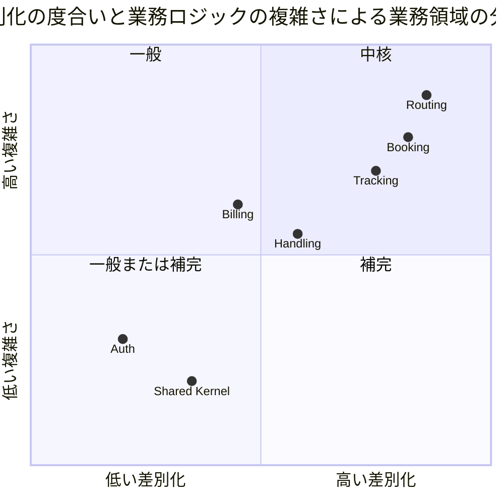

| コンテキスト | 分類 | 理由 | Event Sourcing |
| :--- | :--- | :--- | :--- |
| Routing | 中核 | 航海スケジュール・寄港地接続・貨物種別を考慮した経路候補算出は競合優位性そのもの | 適用（`Voyage`） |
| Booking | 中核 | 予約状態遷移と連鎖（確定 → 追跡番号 → 追跡開始）は基幹プロセス | 適用 |
| Tracking | 中核 | 追跡・例外管理は荷主との信頼を作る。**履歴そのものが価値**であり Event Sourcing の効果が最も出る | 適用 |
| Handling | 補完 | 荷役記録は基盤だが業界共通。通関申告は監査履歴が要る | 適用 |
| Billing | 補完 | 法人割引は固有だが精算自体は業界共通。金額を扱うため監査が要る | 適用 |
| Auth | 一般または補完 | 認証・認可は汎用機能 | **適用しない**（状態保存） |
| Shared Kernel | 一般 | UN/LOCODE 等の国際標準 | なし |

## ユビキタス言語

### コア概念

| 日本語 | 英語 | コード識別子 | 説明 |
| :--- | :--- | :--- | :--- |
| 貨物 | Cargo | `Cargo` | 輸送対象となる荷物。予約単位の集約ルート |
| 予約 | Booking | `Cargo` 集約 | 貨物の輸送予約。`BookingId` で識別 |
| 予約番号 | Booking ID | `BookingId` | 予約を識別する一意な番号 |
| 見積 | Quotation | `Quotation` | 予約前の概算。集約ルート |
| 追跡番号 | Tracking Number | `TrackingNumber` | 荷主が貨物を追跡するための一意な番号 |
| 経路仕様 | Route Specification | `RouteSpecification` | 出発地・目的地・到着期限の指定 |
| 旅程 | Itinerary | `CargoItinerary` | 確定した輸送区間（Leg）の順序付き列 |
| 輸送区間 | Leg | `Leg` | 航海単位の輸送区間（積込港・荷降港・日時・航海番号） |
| 荷主への通知 | Shipper Notification | `ShipperNotification` | 確定経路を荷主へ伝えた記録（宛先・内容・通知者・日時）。**集約は持たず** `ShipperNotifiedEvent` のペイロードの形として使い、投影（`cargo_notification`）が履歴として写す（US12） |
| 航海 | Voyage | `Voyage` | 運送会社が運航する 1 つの航海。集約ルート |
| 航海番号 | Voyage Number | `VoyageNumber` | 航海を識別する番号。**BC ごとに別の型** |
| 運搬移動 | Carrier Movement | `CarrierMovement` | 航海内の港間移動 |
| 運送会社 | Carrier | `Carrier` | 航海を運航する会社（コードと名称） |
| 船名 | Vessel Name | `VesselName` | 航海に就く船の名前。運送会社ではなく航海が持つ |
| 航海スケジュール | Schedule | `Schedule` | 航海の運搬移動の並び。時刻昇順・港の連結を自分で守る |
| 航海の検索条件 | Voyage Search Criteria | `VoyageSearchCriteria` | 出発地・目的地・出発期間・貨物種別。空の条件は「指定なし」として扱い、その判断をここ 1 か所に置く（US07） |
| 経路探索 | Route Search | `RouteSearchService` | 航海グラフから経路候補を探すドメインサービス。状態を変えないので Query 側。乗り継ぎ 3 回・候補 20 件で打ち切る（[ADR-0007](../../adr/cargo-tracker/0007-route-search-cutoff.md)） |
| 経路探索の結果 | Route Search Result | `RouteSearchResult` | 候補と「上限で切ったか」の組。候補件数だけでは、乗り継ぎ上限で捨てた枝が「候補 0 件」と同じ見え方になる |
| 経路探索の依頼 | Route Search Request | `RouteSearchRequest` | **bookingms 側**の探索条件（ACL ポートの入力）。集約の `RouteSpecification`（端点と期限）とは別の型。探索は貨物種別・除外港・起点を持ち、集約は持たない |
| 航海グラフ | Voyage Graph | `VoyageGraph` | 投影 `voyage` / `carrier_movement` から組む探索用の読み取りモデル |
| 経路の探索条件 | Route Search Specification | `RouteSearchSpecification` | 出発地・目的地・到着期限・貨物種別・除外港・起点（誤配の再設計）。探索の入力を 1 か所にまとめる |
| 経路 | Transit Path | `TransitPath` | 経路探索が返す 1 本の経路。期限超過日数を持つ |
| 経路の区間 | Transit Edge | `TransitEdge` | 経路 1 本を構成する 1 区間（航海番号・積込港・荷降港・日時）。`Leg`（Booking の確定旅程）と同じ形だが**別の型**で、探索の結果は確定していない |
| 貨物種別 | Cargo Type | `CargoType` | 一般貨物・危険物・冷凍冷蔵。**Booking と Routing で別の型**（Routing は航海が受け入れる種別として使う） |
| 経路候補 | Route Candidate | `RouteCandidate` | 経路仕様を満たす旅程の候補。**Booking と Routing で別の型**（`CargoType` と同じ）。Routing 側は探索の結果（`TransitPath` から組む読み取りモデル）、Booking 側は ACL が契約 DTO から変換した自 BC の型で、画面に出すのはこちら |
| 港湾コード | UN/LOCODE | `UnLocode` | 国連が定める港湾識別コード（例: `JPTYO`）。共有カーネル |
| 荷主 | Shipper | `Shipper` | 貨物の依頼主。個人または法人。集約ルート |
| 荷受人 | Consignee | `Consignee` | 貨物を受け取る人 |
| 法人契約 | Corporate Contract | `CorporateContract` | 法人荷主の割引契約 |
| 追跡活動 | Tracking Activity | `TrackingActivity` | 貨物の追跡状況。集約ルート |
| 輸送ステータス | Transport Status | `TransportStatus` | 貨物の輸送上の状態（9 値） |
| 例外事象 | Tracking Exception | `TrackingException` | 遅延・破損・紛失・誤配・税関保留の例外 |
| 荷役作業 | Handling Activity | `HandlingActivity` | 港湾での受領・積込・荷降し・引取作業。集約ルート |
| 荷役種別 | Handling Type | `HandlingType` | 荷役作業の種別。**種別ごとの要件を自分で持つ** |
| 通関申告 | Customs Declaration | `CustomsDeclaration` | 税関への申告と審査状態。集約ルート |
| 貨物スナップショット | Cargo Snapshot | `CargoSnapshot` | Handling が Booking のイベントから写し取った貨物の最小情報（ACL） |
| 請求書 | Invoice | `Invoice` | 輸送料金の請求書。集約ルート |
| 金額 | Money | `Money` | 通貨と数量を伴う金額。丸めは `Money` の中 1 か所 |
| キャンセル申請 | Cancellation Request | `CancellationRequest` | 輸送中の予約に対するキャンセルの申請・承認・却下の記録 |
| 契約イベント | Contract Event | `shared/contract/event` | 他サービスが購読するイベント。`shared` に置く |

### 状態の一覧

| 状態タイプ | 日本語 | コード | 備考 |
| :--- | :--- | :--- | :--- |
| 予約状態 `BookingStatus` | 仮受付 | `PRELIMINARY` | 要件定義「仮受付」 |
| | 経路提案中 | `ROUTE_PROPOSED` | 要件定義「経路提案中」。経路設計者の手番 |
| | 経路通知済 | `ROUTE_NOTIFIED` | 荷主へ経路を提示した状態。**通知していない予約は確定できない**（java-3 ADR-021） |
| | 予約確定 | `CONFIRMED` | ここから経路設計へは戻せない |
| | 追跡番号発行済 | `TRACKING_ISSUED` | |
| | 輸送中 | `IN_TRANSIT` | キャンセルは承認が要る |
| | 配送完了 | `DELIVERED` | 以降キャンセル不可。画面では文脈語を添えて「予約: 配送完了」 |
| | 精算済 | `SETTLED` | |
| | キャンセル | `CANCELLED` | 以降コマンドを受けない |
| 経路設定状態 `RoutingStatus` | 未設定 | `NOT_ROUTED` | |
| | 設計依頼中 | `ROUTING_REQUESTED` | 経路設計者の作業待ちに現れる |
| | 設定済 | `ROUTED` | |
| | 誤配 | `MISROUTED` | 予定ルート外の荷役を受けた（US28）。画面では「経路: 誤配」 |
| 輸送ステータス `TransportStatus` | 未受領 | `NOT_RECEIVED` | 9 値の日本語はこの表を正典とし、画面のバッジもこれに従う |
| | 受領済 | `RECEIVED` | |
| | 積込済 | `LOADED` | |
| | 輸送中 | `IN_TRANSIT` | 荷役では起きない。手動更新（US17） |
| | 荷降し済 | `UNLOADED` | 途中の港 |
| | 引取待ち | `AWAITING_CLAIM` | 目的港で荷降しされ、荷受人の引取を待つ |
| | 引取済 | `DELIVERED` | 精算の開始条件。`BookingStatus.DELIVERED` と区別するため画面では「輸送: 引取済」 |
| | 誤配 | `MISROUTED` | `RoutingStatus.MISROUTED` と区別するため画面では「輸送: 誤配」 |
| | 例外発生 | `EXCEPTION` | 未解決の例外があるあいだ |
| 荷役種別 `HandlingType` | 受領 / 積込 / 荷降し / 引取 | `RECEIVE` / `LOAD` / `UNLOAD` / `CLAIM` | 税関は荷役ではなく `CustomsDeclaration` で扱う |
| 例外種別 `ExceptionType` | 遅延 / 破損 / 紛失 / 誤配 / 税関保留 | `DELAY` / `DAMAGE` / `LOSS` / `MISROUTE` / `CUSTOMS_HOLD` | 緊急かどうかは種別が答える（`LOSS` のみ）。一覧の並びは `LOSS` → 期限までの残日数が少ない順 |
| 例外対応状態 `ResponseStatus` | 起票 / 対応中 / 解決 | `REPORTED` / `RESPONDING` / `RESOLVED` | |
| 通関状態 `CustomsStatus` | 審査中 / 通関済 / 留置 / 不可 | `PENDING` / `CLEARED` / `HELD` / `REJECTED` | 引取を許すのは `CLEARED` だけ。`REJECTED` の日本語は「不可」に統一（行動を要する赤） |
| 精算状態 `BillingStatus` | 算出待ち / 算出済 / 請求済 / 入金済 / 取消 | `PENDING` / `CALCULATED` / `INVOICED` / `PAID` / `VOID` | 期限超過は列に持たず `overdue(today)` で判定 |
| 荷主種別 `ShipperType` | 個人 / 法人 | `INDIVIDUAL` / `CORPORATE` | |
| 貨物種別 `CargoType` | 一般 / 危険物 / 冷凍 | `GENERAL` / `HAZARDOUS` / `REFRIGERATED` | |

## アクターとコンテキストの対応

| アクター | Auth | Booking | Routing | Tracking | Handling | Billing |
| :--- | :--: | :--: | :--: | :--: | :--: | :--: |
| 荷主 | ◯ | ◯（参照） | | ◯（参照） | | ◯（請求書受領） |
| 荷受人 | | | | ◯（参照・認証不要の公開追跡） | | |
| 営業担当者 | ◯ | ◎ | | | | |
| 経路設計者 | ◯ | ◯ | ◎ | | | |
| 追跡管理者 | ◯ | ◯（キャンセル承認） | | ◎ | ◯（通関状態更新） | |
| 荷役作業員 | ◯ | | | | ◎ | |
| 経理担当者 | ◯ | | | | | ◎ |
| システム管理者 | ◎ | | | | | |

凡例: ◎ 主たる利用、◯ 参照・付随的利用

## コンテキストマップ

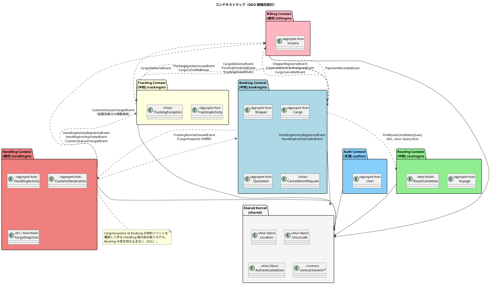

実線はイベント（Axon Event Bus）、点線の Query は Axon Query Bus です。サービス越しに状態を変える同期呼び出しはありません。契約は**イベント 11 本、コマンド 2 本、クエリ 1 本**（`FindRouteCandidatesQuery`）で、名簿は「ドメインイベント一覧（サービス横断）」を正典とします。billingms が要る荷主情報（種別・割引率）は同期クエリで取りに行かず、`ShipperRegisteredEvent` / `CorporateContractAssignedEvent` を購読して自前の `shipper_contract_snapshot` に写します。

## Shared Kernel（共有カーネル）

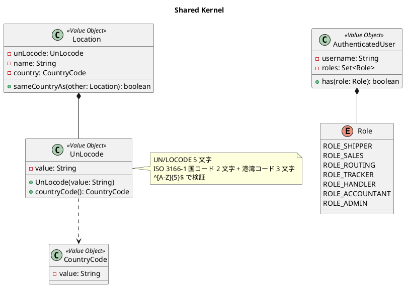

### 共有カーネルの範囲と不変条件

| 置くもの | 理由 |
| :--- | :--- |
| `Location` / `UnLocode` / `CountryCode` | 全 BC が同じ意味で使う。輸出免税の判定（Billing）にも国コードを使う |
| `AuthenticatedUser` / `Role` | Gateway が復元した認証情報の契約 |
| `contract/event/*`、`contract/command/*`、`contract/query/*` | サービス越しに送るメッセージ。両側が同じクラスを持つ必要がある |
| **置かないもの** | `VoyageNumber` / `BookingId` / `TrackingNumber` などの識別子、`Money`、集約、ドメインサービス、**列挙型**（`CargoType` / `BookingStatus` / `HandlingType` など。同じ名前でも BC ごとに値と意味が違う） |

- `UnLocode` は `^[A-Z]{5}$` を満たす
- `Location` の同一性は `UnLocode` の値で判定する
- 識別子は BC ごとに別の型で定義する（`BookingId` / `TrackingBookingId` / `CargoBookingId`）。同じ予約を指す識別子が BC の数だけあるのは重複ではなく、境界を分けた代金である

## Booking Context（中核）— bookingms

予約・荷主・見積を担います。`BookingReactionHandler` が確定 → 追跡番号発行 → 追跡開始を調整します。

### ドメインモデル図

```plantuml
@startuml
title Booking Context

class Cargo <<Aggregate Root>> <<@EventSourced(tagKey="bookingId")>> {
  - bookingId: BookingId
  - shipperId: ShipperId
  - cargoSpec: CargoSpecification
  - routeSpec: RouteSpecification
  - itinerary: CargoItinerary
  - bookingStatus: BookingStatus
  - routingStatus: RoutingStatus
  - trackingNumber: TrackingNumber
  - lastNotifiedAt: Instant
  - cancellationRequest: CancellationRequest
  - lastHandling: HandlingSnapshot
  .. @CommandHandler ..
  + book(BookCargoCommand)
  + updateSpecification(UpdateCargoSpecificationCommand)
  + requestRouting(RequestRoutingCommand)
  + assignRoute(AssignRouteCommand)
  + adjustRouteSpecification(AdjustRouteSpecificationCommand)
  + requestConditionReview(RequestConditionReviewCommand)
  + notifyShipper(NotifyShipperCommand)
  + returnToRouting(ReturnToRoutingCommand)
  + confirm(ConfirmBookingCommand)
  + issueTrackingNumber(IssueTrackingNumberCommand)
  + requestCancellation(RequestCancellationCommand)
  + approveCancellation(ApproveCancellationCommand)
  + rejectCancellation(RejectCancellationCommand)
  + recordHandling(RecordHandlingCommand)
  + revertHandling(RevertHandlingCommand)
  + markDelivered(MarkDeliveredCommand)
  + settle(SettleBookingCommand)
  .. @EventSourcingHandler ..
  + on(...)
}

class BookingId <<Value Object>>
class ShipperId <<Value Object>>
class TrackingNumber <<Value Object>>

class CargoSpecification <<Value Object>> {
  - cargoType: CargoType
  - weightKg: Weight
  - dimensions: Dimensions
  - quantity: int
  - productName: String
  - hazardousDeclaration: HazardousDeclaration [0..1]
  - temperatureRequirement: TemperatureRequirement [0..1]
  + {static} of(...): CargoSpecification
}
class HazardousDeclaration <<Value Object>> {
  - imoClass: String
  - unNumber: String
}
class TemperatureRequirement <<Value Object>> {
  - minCelsius: BigDecimal
  - maxCelsius: BigDecimal
}
class Dimensions <<Value Object>>
class Weight <<Value Object>>

class RouteSpecification <<Value Object>> {
  - origin: Location
  - destination: Location
  - arrivalDeadline: LocalDate
  ' 期限は日付で比べる。業務タイムゾーンを渡す（UTC で判断すると
  ' 時差の分だけ「期限当日」がずれる）
  + isSatisfiedBy(itinerary: CargoItinerary, zone: ZoneId): boolean
}

class CargoItinerary <<Value Object>> {
  - legs: List<Leg>
  ' 連結と時刻の昇順はここで守る（不変条件 4）。探索に置くと、
  ' 別の作り方で組まれた旅程が素通りする
  + origin(): Location
  + destination(): Location
  + finalArrival(): Instant
  + expects(type: HandlingType, location: Location): boolean
}
class Leg <<Value Object>> {
  ' 航海番号は文字列で持つ。VoyageNumber は Routing の識別子型で、
  ' 共有カーネルには置かない（持ち込むと採番規則の変更に巻き込まれる）
  - voyageNumber: String
  - loadLocation: Location
  - unloadLocation: Location
  - loadTime: Instant
  - unloadTime: Instant
}
class VoyageNumber <<Value Object>>

class CancellationRequest <<Entity>> {
  - requestId: CancellationRequestId
  - reason: String
  - requestedBy: String
  - requestedAt: Instant
  - decision: CancellationDecision [0..1]
}
class CancellationDecision <<Value Object>> {
  - approved: boolean
  - dischargeLocation: Location [0..1]
  - reason: String
  - decidedBy: String
  - decidedAt: Instant
  + {static} approve(dischargeLocation, current: Location, remainingPorts: List<Location>, ...)
}

class HandlingSnapshot <<Value Object>> {
  - type: HandlingType
  - location: Location
  - completedAt: Instant
  - offRoute: boolean
}

enum BookingStatus {
  PRELIMINARY
  ROUTE_PROPOSED
  ROUTE_NOTIFIED
  CONFIRMED
  TRACKING_ISSUED
  IN_TRANSIT
  DELIVERED
  SETTLED
  CANCELLED
  + canTransitionTo(next): boolean
  + cancellableImmediately(): boolean
}
enum RoutingStatus {
  NOT_ROUTED
  ROUTING_REQUESTED
  ROUTED
  MISROUTED
}
enum CargoType

class Shipper <<Aggregate Root>> <<@EventSourced(tagKey="shipperId")>> {
  - shipperId: ShipperId
  - shipperCode: ShipperCode
  - shipperType: ShipperType
  - name: ShipperName
  - address: Address
  - contact: ContactInfo
  - corporateContract: CorporateContract [0..1]
  + {static} register(RegisterShipperCommand)
  + updateContact(UpdateShipperContactCommand)
  + assignCorporateContract(AssignCorporateContractCommand)
}
class ShipperCode <<Value Object>>
class ContactInfo <<Value Object>>
class Email <<Value Object>>
class CorporateContract <<Value Object>> {
  - contractNumber: String
  - discountRate: DiscountRate
}
class DiscountRate <<Value Object>> {
  - value: BigDecimal  ' 0.0000〜0.3000
}
enum ShipperType

class Quotation <<Aggregate Root>> <<@EventSourced(tagKey="quotationId")>> {
  - quotationId: QuotationId
  - routeSpec: RouteSpecification
  - cargoType: CargoType
  - weightKg: Weight
  - candidates: List<QuotedRoute>
  - estimatedCharge: Money
  - validUntil: LocalDate
  + {static} create(CreateQuotationCommand)
  + diffAgainst(cargo: BookCargoCommand): List<String>
}
class QuotedRoute <<Value Object>>
class Money <<Value Object>>

Cargo *-- BookingId
Cargo *-- ShipperId
Cargo *-- CargoSpecification
Cargo *-- RouteSpecification
Cargo *-- "0..1" CargoItinerary
Cargo *-- BookingStatus
Cargo *-- RoutingStatus
Cargo *-- "0..1" TrackingNumber
Cargo *-- "0..1" CancellationRequest
Cargo *-- "0..1" HandlingSnapshot
CargoSpecification *-- CargoType
CargoSpecification *-- "0..1" HazardousDeclaration
CargoSpecification *-- "0..1" TemperatureRequirement
RouteSpecification *-- Location
CargoItinerary "1" *-- "1..*" Leg
Leg *-- VoyageNumber
CancellationRequest *-- "0..1" CancellationDecision
Shipper *-- ShipperId
Shipper *-- ShipperCode
Shipper *-- ShipperType
Shipper *-- ContactInfo
Shipper *-- "0..1" CorporateContract
CorporateContract *-- DiscountRate
ContactInfo *-- Email
Quotation *-- "0..*" QuotedRoute
Quotation *-- Money
@enduml
```

### BookingStatus 状態遷移（正典）

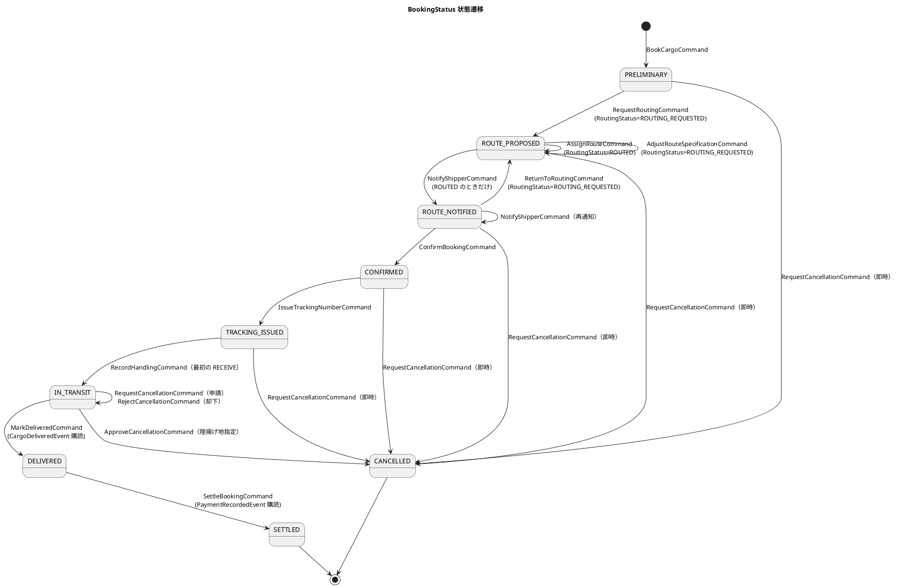

遷移の判定は `BookingStatus#canTransitionTo` の 1 か所に置き、コマンドハンドラはこれを呼びます。画面のボタン出し分けは投影の `status` を読みますが、判定を書き直しません。

### Cargo 集約の不変条件

| # | 不変条件 | 守る場所 |
| :--- | :--- | :--- |
| 1 | `BookingId` は不変。`ShipperId` は登録時に必須 | `book` |
| 2 | `RouteSpecification` の出発地と目的地は異なる | `RouteSpecification` の生成 |
| 3 | `HAZARDOUS` なら `hazardousDeclaration` 必須、`REFRIGERATED` なら `temperatureRequirement` 必須 | `CargoSpecification.of` |
| 4 | `CargoItinerary.legs` は 1 件以上、時刻昇順、`leg[i].unloadLocation == leg[i+1].loadLocation` | `CargoItinerary` の生成 |
| 5 | 旅程は経路仕様を満たす（起点・終点・期限。**期限は日付単位で比較し、期限当日着は満たす**） | `assignRoute` |
| 6 | 荷主に通知していない予約は確定できない（`ROUTE_NOTIFIED` からのみ `CONFIRMED`） | `confirm` |
| 7 | `CONFIRMED` 以降は経路設計へ戻せない | `returnToRouting` |
| 8 | 追跡番号は `CONFIRMED` の予約にだけ発行し、二重に発行しない | `issueTrackingNumber` |
| 9 | `IN_TRANSIT` のキャンセルは申請 → 承認（陸揚げ地必須）の 2 段階。`DELIVERED` 以降はキャンセル不可 | `requestCancellation` / `approveCancellation` |
| 9-2 | `CancellationDecision.dischargeLocation` は**現在地（`lastHandling.location`）または旅程の残りの寄港地のいずれか**。旅程に無い港や通過済みの港は指定できない | `CancellationDecision.approve` |
| 10 | 未決着の `CancellationRequest` は高々 1 件 | `requestCancellation` |
| 11 | `CANCELLED` の集約は以降のコマンドを拒否する | 全ハンドラ |
| 11-2 | 貨物仕様・経路仕様を修正できるのは `PRELIMINARY` の予約だけ。修正時も登録時と同じ検査を通す（危険物なら申告、冷凍・冷蔵なら温度管理条件が必須） | `updateSpecification` |
| 12 | 予定ルート外の荷役（`offRoute`）を受けたら `RoutingStatus = MISROUTED` にし `BookingMisroutedEvent` を出す。現在地起点の再設計（`assignRoute`）で `ROUTED` に復帰。再設計では期限超過の候補も選べる（US28） | `recordHandling` / `assignRoute` |
| 13 | 取り消された荷役（`HandlingActivityVoidedEvent`）を受けたら `lastHandling` を直前の荷役に戻す。`MISROUTED` の原因が取り消された荷役だけなら `ROUTED` に戻す | `revertHandling` |

### Cargo 集約のコマンドとイベント

| コマンド | アクター | 発行イベント | 契約 | UC / US |
| :--- | :--- | :--- | :--- | :--- |
| `BookCargoCommand` | 営業担当者 | `CargoBookedEvent` | — | UC03 / US04・US05 |
| `UpdateCargoSpecificationCommand` | 営業担当者 | `CargoSpecificationUpdatedEvent` | — | UC03 / US32 |
| `RequestRoutingCommand` | 営業担当者 | `RoutingRequestedEvent` | — | UC04 / US06 |
| `AssignRouteCommand` | 経路設計者 | `CargoRoutedEvent` | — | UC07・UC09 / US09・US11・US28 |
| `AdjustRouteSpecificationCommand` | 経路設計者 | `RouteSpecificationAdjustedEvent` | — | UC08 / US10 |
| `RequestConditionReviewCommand` | 経路設計者 | `ConditionReviewRequestedEvent` | — | UC08 / US10 |
| `NotifyShipperCommand` | 営業担当者 | `ShipperNotifiedEvent` | — | UC10 / US12 |
| `ReturnToRoutingCommand` | 営業担当者 | `ReturnedToRoutingEvent` | — | UC08 |
| `ConfirmBookingCommand` | 営業担当者 | `BookingConfirmedEvent` | — | UC11 / US13 |
| `IssueTrackingNumberCommand` | 経路設計者 / Reaction Handler | `TrackingNumberIssuedEvent` | **○** | UC12 / US14 |
| `RequestCancellationCommand` | 営業担当者 | `CancellationRequestedEvent` または `CargoCancelledEvent`（即時） | ○（後者） | UC22 / US30 |
| `ApproveCancellationCommand` | 追跡管理者 | `CancellationApprovedEvent` + `CargoCancelledEvent` | ○（後者） | UC22 / US30 |
| `RejectCancellationCommand` | 追跡管理者 | `CancellationRejectedEvent` | — | UC22 / US30 |
| `RecordHandlingCommand` | `BookingReactionHandler`（`HandlingActivityRegisteredEvent` 購読） | `HandlingRecordedEvent`、`BookingMisroutedEvent`（`offRoute` のとき） | — | US15・US28 |
| `RevertHandlingCommand` | `BookingReactionHandler`（`HandlingActivityVoidedEvent` 購読） | `HandlingRevertedEvent` | — | UC13 |
| `MarkDeliveredCommand` | `BookingReactionHandler`（`CargoDeliveredEvent` 購読） | `BookingDeliveredEvent` | — | UC14 |
| `SettleBookingCommand` | `BookingReactionHandler`（`PaymentRecordedEvent` 購読） | `BookingSettledEvent` | — | UC18 / US23 |

イベント購読からコマンドを送るのは `application/reaction/BookingReactionHandler`（Processing Group `booking-reaction`）です。投影（`infrastructure/projection`）は SQL に写すだけでコマンドを送りません。リプレイは投影の Group だけを対象にし、Reaction の Group はリセットしないので、リプレイで他サービスの集約が動くことはありません。`cargo_summary.booking_status` の書き手は `Cargo` 自身のイベント（`BookingDeliveredEvent`、`BookingSettledEvent`）だけです。

`AdjustRouteSpecificationCommand(bookingId, arrivalDeadline, excludeUnLocodes, departFromUnLocode, adjustedBy)` は経路の条件を調整します。**経路設計に入った予約（`ROUTE_PROPOSED`）は `UpdateCargoSpecificationCommand` が使えない**（`BookingStatus#canUpdateSpecification` は仮受付だけを許す）ので、到着期限を延ばす手段はこれだけです。**貨物種別は含めません**——種別を変えるのは「その貨物が何か」を変えることで、危険物申告や温度条件が付いて回るため、US32 が持ちます。調整すると `RoutingStatus` は `ROUTED` から `ROUTING_REQUESTED` へ戻りますが、**確定済みの旅程（`cargo_leg`）は消しません**（再設計で入れ替わるまで残す。[ADR-0009](../../adr/cargo-tracker/0009-condition-review-is-not-a-state-transition.md) 決定 3）。

`ConditionReviewRequestedEvent(bookingId, reason, requestedBy, requestedAt)` は「この条件では組めない」ことを営業へ返した記録です。**状態は動かしません**（ADR-0009 決定 1）。`NOT_ROUTED` へ戻すと「一度も設計していない予約」と区別が付かなくなり、S30 の一覧から消えて誰も設計を再開しません。差し戻せるのは `ROUTING_REQUESTED` のときだけで、**誤配（`MISROUTED`）は含めません**（誤配からの再設計は US28）。

`ShipperNotifiedEvent(bookingId, recipientEmail, summary, notifiedBy, notifiedAt)` は「荷主へ経路を提示した」という事実の記録です。宛先と要約を載せ、予約詳細（S22）に通知履歴（いつ・誰に・何を）として写します。**メール等の送信基盤は本リリースのスコープ外**です。通知は現行の手作業（電話・メール）で行い、システムは通知した事実だけを記録します。

### Shipper 集約

| 不変条件 | 守る場所 |
| :--- | :--- |
| `Email` はシステム全体で一意（登録前の存在確認 + 投影テーブルの UNIQUE + 拒否の記録 `attention_item` の三段） | `register` + 投影 |
| `CORPORATE` は `contractNumber` 必須、`INDIVIDUAL` は `corporateContract` を持てない | `register` / `assignCorporateContract` |
| `DiscountRate` は 0.0000〜0.3000 | `DiscountRate` の生成 |
| `ShipperCode` は投影側の採番（`SHP-` + 連番 6 桁）を使い、集約で MAX+1 しない | 投影 |

| コマンド | 発行イベント | 契約 | UC / US |
| :--- | :--- | :--- | :--- |
| `RegisterShipperCommand` | `ShipperRegisteredEvent` | **○**（billingms が `shipper_contract_snapshot` に写す） | UC02 / US02・US03 |
| `UpdateShipperContactCommand` | `ShipperContactUpdatedEvent` | — | UC02 |
| `AssignCorporateContractCommand` | `CorporateContractAssignedEvent` | **○**（billingms が割引率を写す） | UC02 / US03・US22 |

Event Sourcing での一意制約は集約 1 つでは守れません。`Email` の一意性は三段で守ります。（1）コマンド受付前に投影へ問い合わせて存在確認する、（2）投影テーブルの UNIQUE で最終的に弾く、（3）投影で弾かれた行は投影側が `attention_item` に記録し、営業担当者の要確認一覧（S70）に写す。同時登録のレース条件では 1 段目を素通りするので、2 段目と 3 段目が本当に踏まれることをテストで固定します。

### Quotation 集約

| 不変条件 | 守る場所 |
| :--- | :--- |
| 見積は出発地・目的地・希望期限・貨物種別・重量の 5 項目を持つ。出発地と目的地は異なる | `create` |
| 概算料金は Billing の `FreightCharge` と**同じ式・同じ料率**で出す。式と料率の同一性は契約テストで固定する。ただし見積は候補経路、請求は実際の区間を入力にするので、**金額は入力で変わる**（区間数の増減・誤配・留置）。差は請求書が `quotedAmount` と並べて説明する | `QuotationEstimator`（ドメインサービス）。式は `shared` に置かず、Billing の `RateTable` と同じ値を `application.yml` から読む。両者の一致は契約テストで固定 |
| 候補が 0 件でも見積は作れる | `create` |
| 予約との食い違いは断らず項目名で知らせる | `diffAgainst` |

| コマンド | 発行イベント | UC / US |
| :--- | :--- | :--- |
| `CreateQuotationCommand` | `QuotationCreatedEvent` | UC01 / US01 |

## Routing Context（中核）— routingms

航海スケジュールの管理と、経路候補の算出を担います。

### ドメインモデル図

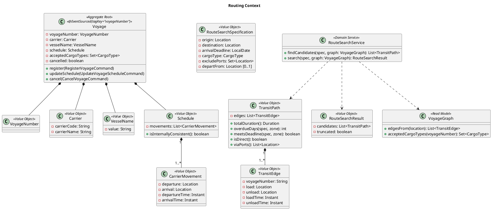

### Voyage 集約の不変条件

| # | 不変条件 |
| :--- | :--- |
| 1 | `VoyageNumber` は不変。同一番号の再登録は三段（登録前の存在確認 + 投影の UNIQUE + 拒否の記録 `attention_item`）で拒否 |
| 2 | `Schedule.movements` は時刻昇順、連続する移動の `arrival` と次の `departure` は同一港 |
| 3 | `arrivalTime > departureTime` |
| 4 | `acceptedCargoTypes` が空なら一般貨物のみ |
| 5 | キャンセル済みの航海は更新できない |

**`register` は static ではなくインスタンスのコマンドハンドラにします。** static（作る側）とインスタンス（既にある側）を両方置くと、集約が既に存在しても static のほうが呼ばれ、2 度目の登録が通ります（IT2 に `Cargo` で実測。同 IT の H1）。`@EntityCreator` が空の集約を用意するので、インスタンス側だけで不変条件 1 の「同一番号の再登録を拒否する」が書けます。

**航海の時刻は `Instant` で持ちます。** [非機能要件](non_functional.md) が既に「港のローカル時刻で入力・表示し、保存は `TIMESTAMPTZ`」と決めており、`HandlingActivity.completedAt`（不変条件 6）も同じ形です。`LocalDateTime` は時間帯を持たないので、出発港と到着港の時間帯が違う航海では「どちらの時刻か」が決まりません。旅程の `Leg.loadTime` / `unloadTime` も同じ理由で `Instant` に揃えました。新たな判断ではなく、既決の規約を航海に適用したものです。

**船名（`VesselName`）は航海が持ちます。** 運送会社（`Carrier`）は船を複数持ち、同じ船が別の航海に就くので、船名は運送会社側ではなく航海側の属性です（US24 の入力項目）。

| コマンド | 発行イベント | UC / US |
| :--- | :--- | :--- |
| `RegisterVoyageCommand` | `VoyageRegisteredEvent` | UC19 / US24 |
| `UpdateVoyageScheduleCommand` | `VoyageScheduleUpdatedEvent` | UC19 / US25 |
| `CancelVoyageCommand` | `VoyageCancelledEvent` | UC19 |

### ドメインサービス：RouteSearchService

経路候補の算出は `Voyage` の集約境界を越えるグラフ探索なので、集約ではなくドメインサービスに置きます。入力は投影テーブルから組んだ `VoyageGraph`、出力は `TransitPath` の候補です。**状態を変えないので Query 側**に置き、`FindRouteCandidatesQuery`（`shared/contract/query`）の `@QueryHandler` から呼びます。誤配の再設計（US28）は `departFrom` に現在地を与えて同じサービスを使います。

制約は [要件定義の経路設計の制約条件](../../requirements/requirements_definition.md) に従います。危険物・冷凍貨物は `acceptedCargoTypes` に含む航海だけを通し、到着期限は日付単位で比較します。

期限の扱いは `departFrom` の有無で変えます。通常の設計（`departFrom` 無し）では期限に間に合う候補だけを返します。誤配の再設計（`departFrom` 指定）では、すでに期限に間に合わないことが普通なので、**期限超過の候補も返し**、各候補に `overdueDays`（最終到着日 − 到着期限、日付単位。間に合う候補は 0）を持たせます。経路設計者は超過日数を見て選び、選んだ候補は `AssignRouteCommand` に載せます。`Cargo` 不変条件 5（旅程は期限を満たす）は再設計時に限り `overdueDays > 0` を許し、その事実を `CargoRoutedEvent` に載せて荷主への説明に使います。

## Tracking Context（中核）— trackingms

貨物の位置・状態の追跡と例外管理を担います。履歴そのものが価値であり、Event Sourcing の効果が最も出るコンテキストです。

### ドメインモデル図

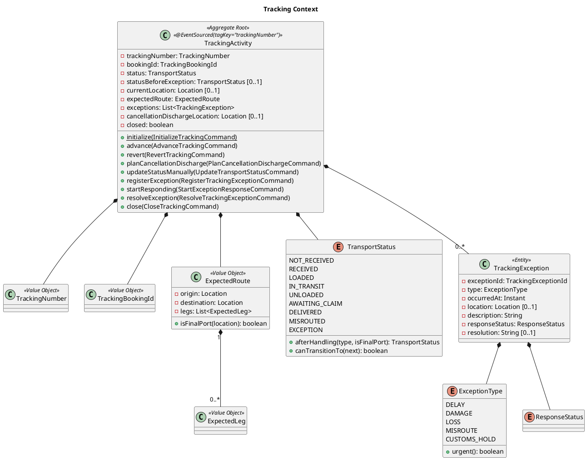

### TransportStatus 状態遷移

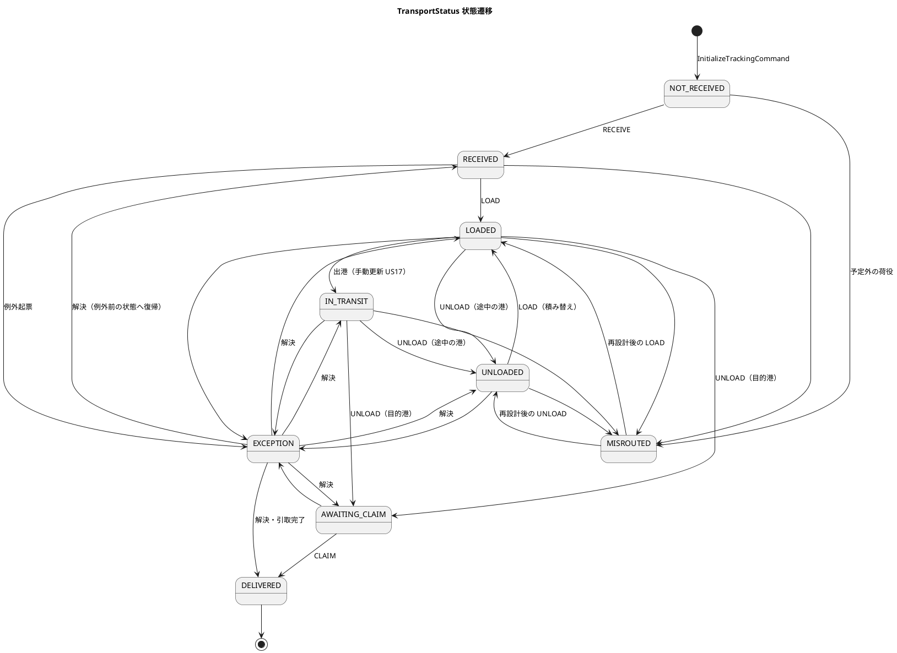

「同じ荷降しでも行き先が違う」判定は `TransportStatus#afterHandling(type, isFinalPort)` の 1 か所に置きます。集約も購読側もこの判定を書き直しません。

### TrackingActivity 集約の不変条件

| # | 不変条件 |
| :--- | :--- |
| 1 | `TrackingNumber` は Booking が採番し、Tracking は検証も採番もしない |
| 2 | 遷移は `TransportStatus#canTransitionTo` が許すものだけ |
| 3 | 予定ルート外の荷役を受けたら `MISROUTED` にし、`MISROUTE` 例外を自動起票する（US28） |
| 4 | `CustomsStatusChangedEvent(HELD)` を受けたら `CUSTOMS_HOLD` 例外を自動起票する（UC21） |
| 5 | `EXCEPTION` から復帰するときは、必ず起票中の例外がすべて `RESOLVED` であり、`statusBeforeException` へ戻る |
| 6 | 例外は追記のみ。解決しても事実は消えず、料金調整の根拠として残る |
| 7 | 緊急かどうかは `ExceptionType#urgent`（`LOSS` のみ真）が答える。属性には持たない。一覧の並びは `urgent` を先頭に、以降は到着期限までの残日数が少ない順（M16） |
| 8 | **知らない追跡番号の荷役では止まらない**。集約が無ければ `AdvanceTrackingCommand` は `UnknownTrackingRejectedEvent` に相当する記録を投影側に残し、後続の荷役を止めない |
| 9 | キャンセル承認（`CargoCancelledEvent`）を受けても**追跡は閉じない**。`dischargeLocation` を `cancellationDischargeLocation` に記録し（`CancellationDischargePlannedEvent`）、その港での `UNLOAD` を受けた後に `CloseTrackingCommand` で閉じる（`TrackingClosedEvent(reason = CANCELLED)`）。貨物が船の上にある間、陸揚げの荷役を記録できる |
| 10 | `closed` の集約はコマンドを拒否する |
| 11 | 取り消された荷役（`HandlingActivityVoidedEvent`）を受けたら、その荷役で進めた状態を直前の状態に戻す（`RevertTrackingCommand`）。取り消しの事実はイベントとして残る |

| コマンド | アクター | 発行イベント | 契約 | UC / US |
| :--- | :--- | :--- | :--- | :--- |
| `InitializeTrackingCommand` | `BookingReactionHandler`（`shared/contract/command`） | `TrackingInitializedEvent` | ○ | UC12 / US14 |
| `AdvanceTrackingCommand` | `TrackingReactionHandler`（`HandlingActivityRegisteredEvent` 購読） | `TransportStatusUpdatedEvent`、`CargoMisroutedEvent` | — | UC14 / US15・US28 |
| `RevertTrackingCommand` | `TrackingReactionHandler`（`HandlingActivityVoidedEvent` 購読） | `TransportStatusRevertedEvent` | — | UC13 |
| `PlanCancellationDischargeCommand` | `TrackingReactionHandler`（`CargoCancelledEvent` 購読） | `CancellationDischargePlannedEvent` | — | UC22 / US30 |
| `UpdateTransportStatusCommand` | 追跡管理者 | `TransportStatusUpdatedEvent` | — | UC14 / US17 |
| `RegisterTrackingExceptionCommand` | 追跡管理者 / 自動起票 | `TrackingExceptionRegisteredEvent` | — | UC16 / US19・US20 |
| `StartExceptionResponseCommand` | 追跡管理者 | `ExceptionResponseStartedEvent` | — | UC16 |
| `ResolveTrackingExceptionCommand` | 追跡管理者 | `TrackingExceptionResolvedEvent` | — | UC16 |
| （`advance` が `CLAIM` を受けたとき） | — | `CargoDeliveredEvent` | **○** | UC14 → UC17 |
| `CloseTrackingCommand`（`shared/contract/command`） | `TrackingReactionHandler`（`cancellationDischargeLocation` での `UNLOAD` を受けた後） | `TrackingClosedEvent` | ○ | UC22 |

`CargoDeliveredEvent` はコマンドに 1 対 1 で対応しません。`AdvanceTrackingCommand(CLAIM)` が `TransportStatusUpdatedEvent(DELIVERED)` と `CargoDeliveredEvent` の 2 つを発行します。前者は Tracking 内部の永続化フォーマット、後者は Billing と Booking への契約です。1 つのイベントに両方の役割を持たせると、内部の形を変えるたびに契約が動きます。

`CargoMisroutedEvent` は trackingms の内部イベントです。bookingms 側の同じ意味のイベントは `BookingMisroutedEvent` と名付け、同名クラスが契約に昇格した瞬間に衝突するのを避けます。イベント購読からコマンドを送るのは `application/reaction/TrackingReactionHandler`（Processing Group `tracking-reaction`）で、投影はコマンドを送りません。

## Handling Context（補完）— handlingms

港湾での荷役作業と通関申告を記録します。

### ドメインモデル図

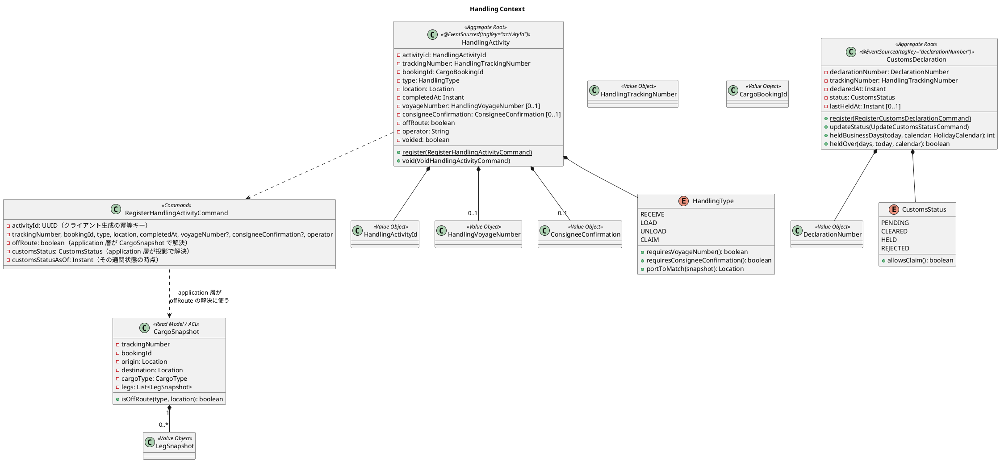

### 荷役種別ごとの要件

要件は `HandlingType` 自身が持ちます。呼び出し側に `if (type == LOAD)` を書かせると、種別が増えたときに書き換える場所が散らばります。

| 種別 | 航海番号 | 荷受人の確認 | 照合する港 | 通関 | 一致しないとき |
| :--- | :--- | :--- | :--- | :--- | :--- |
| `RECEIVE` | 不要 | 不要 | 出発港 | — | 警告し `offRoute = true` で記録 |
| `LOAD` | 必須 | 不要 | 旅程の積込港 | — | 同上 |
| `UNLOAD` | 必須 | 不要 | 旅程の荷降港 | — | 同上 |
| `CLAIM` | 不要 | 必須 | 目的港 | **`CLEARED` のみ許可** | 同上（通関は警告でなく拒否） |

### HandlingActivity 集約の不変条件

| # | 不変条件 |
| :--- | :--- |
| 1 | 種別ごとの必須項目（上表）を満たす |
| 2 | 場所の照合は `CargoSnapshot#isOffRoute` が答え、application 層が結果を `RegisterHandlingActivityCommand.offRoute` に載せる（Axon のコマンドハンドラは読み取りモデルを引数に取れない）。集約は載った値を再検査し（種別と場所の組がスナップショットの旅程と食い違えば拒否）、**一致しなくても記録は拒まない**（現場ではすでに作業が終わっている） |
| 3 | 旅程が無い貨物の `LOAD` / `UNLOAD` は `offRoute` とする（分からないときは予定外に倒す） |
| 4 | `CLAIM` はコマンドに載った `customsStatus` が `CLEARED` のときだけ登録できる。**拒否時は判定に使った通関状態と時点（`customsStatus`, `customsStatusAsOf`）を返す**。画面はこれを「直近で変わった可能性があります」と再確認ボタンに使う（US29・H17） |
| 5 | 同一 `activityId` の再送は冪等（二重登録せず、同じ応答を返す）。`activityId` が違っても同一追跡番号・同一種別・同一場所・5 分以内の重複登録は拒否する |
| 6 | `completedAt` は登録時刻以前。港のローカル時刻で受け取り、`Instant` に変換して保持する |
| 7 | 取り消し（`void`）は元の記録を残したまま `voided = true` にする。取り消し済みの再取り消しは拒否する。理由は必須 |

### CustomsDeclaration 集約の不変条件

| # | 不変条件 |
| :--- | :--- |
| 1 | 追跡番号・申告番号・申告日時は必須。初期状態は `PENDING`。**申告番号の書式は検査しない**（採番するのは税関） |
| 2 | 状態更新には理由が必須。登録も含め、変更はすべてイベントとして残る（監査履歴） |
| 3 | 未決着（`PENDING` / `HELD`）の申告は貨物あたり高々 1 件。`REJECTED` の後は出し直せる。`CLEARED` の後は断る |
| 4 | 留置 3 日超の判定は最新の `HELD` 遷移日時から、**営業日**（港の所在国の休日カレンダー `HolidayCalendar`）で、日付単位で、業務タイムゾーンで数える。留置営業日数は `HELD` から次の状態へ変わるときの `CustomsStatusChangedEvent.heldBusinessDays` に載せ、Billing の調整根拠に渡す（M14） |
| 5 | 通関申告は**輸入港（目的港）での輸入通関のみ**を想定する。輸出通関は扱わない。不変条件 3 の「貨物あたり高々 1 件」はこの前提に立つ（M15） |

| コマンド | アクター | 発行イベント | 契約 | UC / US |
| :--- | :--- | :--- | :--- | :--- |
| `RegisterHandlingActivityCommand` | 荷役作業員 | `HandlingActivityRegisteredEvent` | **○** | UC13 / US15・US16 |
| `VoidHandlingActivityCommand(activityId, reason)` | 荷役作業員 | `HandlingActivityVoidedEvent` | **○**（trackingms / bookingms が購読して戻す） | UC13 |
| `RegisterCustomsDeclarationCommand` | 荷役作業員 | `CustomsDeclarationRegisteredEvent` | — | UC21 / US29 |
| `UpdateCustomsStatusCommand` | 追跡管理者 | `CustomsStatusUpdatedEvent`、`CustomsStatusChangedEvent` | ○（後者） | UC21 / US29 |

`CargoSnapshot` は Booking の契約イベント（`TrackingNumberIssuedEvent`、`CargoCancelledEvent`）を購読して Handling 側が作る読み取りモデルです。旅程の情報は `TrackingNumberIssuedEvent` に載せます。Booking の型は持ち込みません。荷役画面（S50）は航海番号を起点に「この船から降ろす貨物」を出すので、投影 `cargo_snapshot_leg` に航海番号と港で引ける形で写します（`FindCargosOnVoyageQuery`）。

## Billing Context（補完）— billingms

輸送料金の算出・割引・請求・入金を担います。

### ドメインモデル図

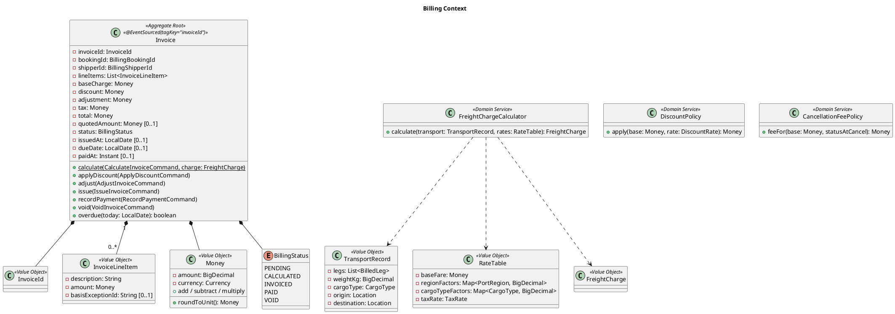

### 料金計算（正典）

```text
基本料金 = 基準運賃 × 区間係数 × 重量係数 × 貨物種別係数
  基準運賃     = 50,000 円（1 区間・1,000kg・一般貨物）
  区間係数     = 区間ごとの地域係数の合計（国内 1.0 / 近海 2.5 / 遠洋 6.0。両端の区分が違えば重いほう）
  重量係数     = 重量（kg）÷ 1,000（下限 0.1）
  貨物種別係数 = GENERAL 1.0 / HAZARDOUS 1.8 / REFRIGERATED 1.5
消費税 = 10%。出発地と目的地の国が異なれば輸出免税（0%）
割引後料金 = 基本料金 × (1 − 割引率)。CORPORATE は 0〜30%、INDIVIDUAL は 0%
キャンセル料 = 基本料金 × 状態別料率（輸送開始前は低率、輸送中は高率 + 陸揚げ実費）
端数は 1 円単位で四捨五入。丸めは Money の中 1 か所だけ
```

Booking の `Quotation` はこの式と同じ料率で概算を出します。式と料率の同一性は、同じ入力に対する出力を突き合わせる契約テストで固定します。ただし見積の入力は候補経路、請求の入力は実際に通った区間なので、金額そのものは一致しません。困るのは差ではなく説明できないことなので、`Invoice` は見積時の概算 `quotedAmount`（任意）を持ち、請求詳細（S61）に「見積時の概算 → 請求 → 差額」と差の理由（区間数の増減・誤配・留置）を出します。調整行 `InvoiceLineItem` は根拠となる例外の ID（`basisExceptionId`、任意）を持ち、Tracking の例外へリンクします。留置による調整は `CustomsStatusChangedEvent.heldBusinessDays` を根拠にします。

### Invoice 集約の不変条件

| # | 不変条件 |
| :--- | :--- |
| 1 | `total = base − discount + adjustment + tax`。通貨は集約内で一貫 |
| 2 | 有効な請求書は予約ごとに 1 通。`VOID` は数えない。三段（作成前の存在確認 + 投影の `(booking_id, void_marker)` UNIQUE + 拒否の記録 `attention_item`）で守る |
| 3 | `INVOICED` になるとき `issuedAt` と `dueDate = issuedAt + 30 日` が確定する |
| 4 | 期限超過は列に持たず `overdue(today)` で判定する。期限当日は超過ではない。`today` は業務タイムゾーンで決める |
| 5 | `PAID` になるとき `paidAt` は必須 |
| 6 | `VOID` の請求書は再発行しない。新規に発行する |
| 7 | `quotedAmount` は `CalculateInvoiceCommand` に載った見積時の概算をそのまま持つ。計算し直さない |

| コマンド | アクター | 発行イベント | 契約 | UC / US |
| :--- | :--- | :--- | :--- | :--- |
| `CalculateInvoiceCommand` | `BillingReactionHandler`（`CargoDeliveredEvent` 購読。荷主の種別・割引率は自前の `shipper_contract_snapshot` から）/ 経理担当者 | `InvoiceCalculatedEvent` | — | UC17 / US21 |
| `ApplyDiscountCommand` | Reaction Handler / 経理担当者 | `DiscountAppliedEvent` | — | UC17 / US22 |
| `AdjustInvoiceCommand` | 経理担当者 | `InvoiceAdjustedEvent` | — | UC17 |
| `IssueInvoiceCommand` | 経理担当者 | `InvoiceIssuedEvent` | — | UC18 / US23 |
| `RecordPaymentCommand` | 経理担当者 | `PaymentRecordedEvent` | **○** | UC18 / US23 |
| `VoidInvoiceCommand` | 経理担当者 | `InvoiceVoidedEvent` | — | UC18 |
| `ApplyCancellationFeeCommand` | Reaction Handler（`CargoCancelledEvent` 購読） | `CancellationFeeAppliedEvent` | — | UC22 |

## Auth Context（支援）— authms

状態保存です。Event Sourcing は適用しません。

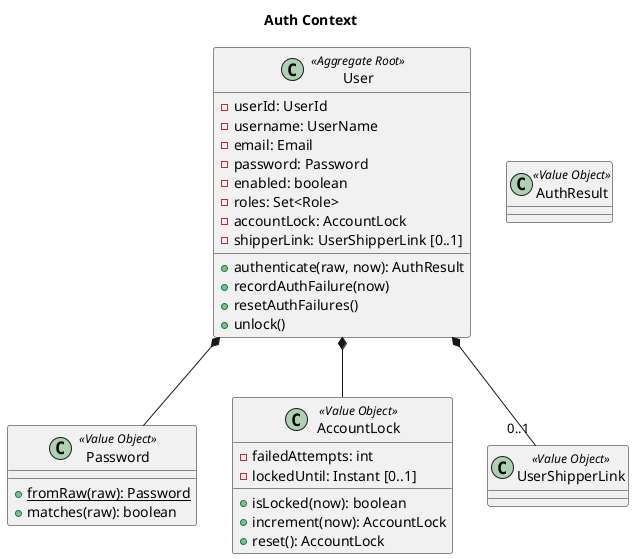

| # | 不変条件 |
| :--- | :--- |
| 1 | `Email` はシステム全体で一意。パスワードは BCrypt ハッシュのみ保持 |
| 2 | 1 つ以上の `Role` を持つ。`enabled = false` は認証拒否 |
| 3 | 認証失敗 5 回連続でロック。ロック中は正しいパスワードでも拒否（US31） |
| 4 | ロック中・認証情報誤り・無効化で**同一のエラーメッセージ**を返す。理由は監査ログにだけ残す |
| 5 | 成功時に失敗回数をリセット。解除は時間経過または `UnlockAccountCommand` |
| 6 | 利用者と荷主の紐付けは `UserShipperLink` だけを正とする。名前やメールの一致で推測しない |

| コマンド | アクター | UC / US |
| :--- | :--- | :--- |
| `LoginCommand` | 全利用者 | UC20 / US26 |
| `LogoutCommand` | 全利用者 | UC20 / US27 |
| `RegisterUserCommand` | システム管理者 | — |
| `UnlockAccountCommand` | システム管理者 | US31 |
| `LinkUserToShipperCommand` / `UnlinkUserFromShipperCommand` | システム管理者 | — |

## ドメインイベント一覧（サービス横断）

### 契約イベント（`shared/contract/event`）

他サービスが購読するイベントです。追記専用で、フィールドの削除・型変更をしません。

| イベント | 発行 | 購読と用途 | 主なフィールド |
| :--- | :--- | :--- | :--- |
| `TrackingNumberIssuedEvent` | bookingms | trackingms（Reaction Handler → 追跡開始）、handlingms（`CargoSnapshot`） | `bookingId`, `trackingNumber`, `origin`, `destination`, `cargoType`, `legs[]`, `issuedAt` |
| `CargoCancelledEvent` | bookingms | trackingms（陸揚げ地を記録。閉じるのは当該港の `UNLOAD` 後）、handlingms（`CargoSnapshot` 更新）、billingms（キャンセル料） | `bookingId`, `trackingNumber?`, `statusAtCancel`, `dischargeLocation?`, `cancelledAt` |
| `HandlingActivityRegisteredEvent` | handlingms | trackingms（`TrackingReactionHandler` が状態を進める・誤配検知）、bookingms（投影に写す。`BookingReactionHandler` が `RecordHandlingCommand`） | `activityId`, `trackingNumber`, `bookingId`, `type`, `location`, `voyageNumber?`, `completedAt`, `offRoute` |
| `HandlingActivityVoidedEvent` | handlingms | trackingms（`RevertTrackingCommand`）、bookingms（`RevertHandlingCommand`）。元の記録は残る | `activityId`, `trackingNumber`, `bookingId`, `type`, `location`, `reason`, `voidedBy`, `voidedAt` |
| `CustomsStatusChangedEvent` | handlingms | trackingms（`HELD` で例外起票）、billingms（留置の調整根拠） | `declarationNumber`, `trackingNumber`, `from`, `to`, `reason`, `heldBusinessDays?`（`HELD` から出るとき）, `changedAt` |
| `CargoDeliveredEvent` | trackingms | billingms（`BillingReactionHandler` 開始）、bookingms（`DELIVERED`） | `trackingNumber`, `bookingId`, `deliveredAt`, `location` |
| `TrackingInitializedEvent` | trackingms | bookingms（`BookingReactionHandler`。連鎖の終わり） | `bookingId`, `trackingNumber`, `initializedAt` |
| `TrackingClosedEvent` | trackingms | bookingms（キャンセル完了を投影に写す） | `bookingId`, `trackingNumber`, `closedAt`, `reason` |
| `PaymentRecordedEvent` | billingms | bookingms（`SETTLED`） | `invoiceId`, `bookingId`, `paidAt`, `amount` |
| `ShipperRegisteredEvent` | bookingms | billingms（`shipper_contract_snapshot` を作る） | `shipperId`, `shipperCode`, `shipperType`, `name`, `email`, `phone`, `address`, `corporateContract?`, `registeredAt`。`name` / `email` / `phone` / `address` は荷主ごとの鍵で暗号化して載せる（crypto-shredding、ADR-0003） |
| `CorporateContractAssignedEvent` | bookingms | billingms（`shipper_contract_snapshot` の割引率を更新） | `shipperId`, `contractNumber`, `discountRate`, `assignedAt` |

契約イベントは **11 本**です。ArchUnit の名簿はこの表と一致させ、増やすときは本書と ADR を同じ変更で更新します。

### 契約コマンド（`shared/contract/command`）

Reaction Handler が送る、サービス境界をまたぐ意味を持つコマンドです。数が増えることは結合が増えたことなので、ArchUnit で名簿を固定し、増やすときは ADR を起こします。契約コマンドは **2 本**です。

| コマンド | 送信 | 宛先 | 用途 |
| :--- | :--- | :--- | :--- |
| `InitializeTrackingCommand` | bookingms `BookingReactionHandler` | trackingms `TrackingActivity` | 追跡開始 |
| `CloseTrackingCommand` | trackingms `TrackingReactionHandler`（`cancellationDischargeLocation` での `UNLOAD` を受けた後） | trackingms `TrackingActivity` | キャンセル承認後、陸揚げの荷降しが記録されてから追跡を閉じる。`BookingReactionHandler` からは送らない |

### 契約クエリ（`shared/contract/query`）

| クエリ | 送信 | 応答側 | 応答 |
| :--- | :--- | :--- | :--- |
| `FindRouteCandidatesQuery` | bookingms（ACL `RouteCandidateFinder`。Controller から呼ぶ。Reaction Handler からは呼ばない） | routingms | `List<RouteCandidateDto>` |

契約クエリは **1 本**です。billingms が要る荷主の種別・割引率は同期クエリ（旧 `FindShipperForBillingQuery`）で取りに行かず、`ShipperRegisteredEvent` / `CorporateContractAssignedEvent` を購読して `shipper_contract_snapshot` を作ります。請求が bookingms の稼働に依存しなくなります。同期クエリのタイムアウト既定は 5 秒です。

### イベントの流れ

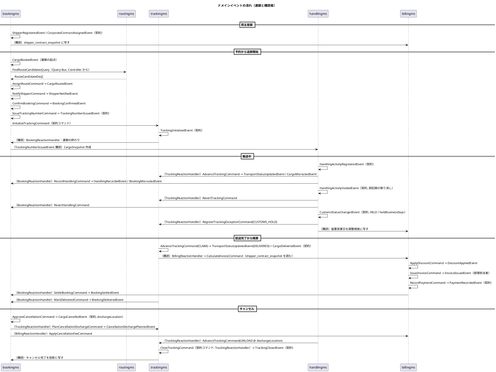

## 業務プロセスの連鎖（Reaction Handler）

Axon 5 には Saga がありません（`Saga`・`Deadline`・`@ProcessingGroup` を含むクラスが 1 つも無いことを IT1 スパイクで確認済み。公式リファレンスの Sagas は 4 系の解説が残っていますが、冒頭に "Sagas do not have a replacement yet in Axon Framework 5." と書かれています。[ADR-0001](../../adr/cargo-tracker/0001-cqrs-es-with-axon-in-microservices.md) 決定 6）。**Axon が Saga を出したら本節を見直します。** 発動条件と判定方法は ADR-0001 決定 6「再評価の発動条件」にあります。複数段の業務連鎖は `application/reaction` の Reaction Handler を段のぶん並べて表し、**連鎖の途中経過は集約そのものが持ちます**。フレームワークが関連付けと終了を面倒見てくれないので、「今どの段か」は `Cargo` / `Invoice` の状態から読めることが条件になります。

### 予約 → 追跡開始の連鎖（bookingms → trackingms）

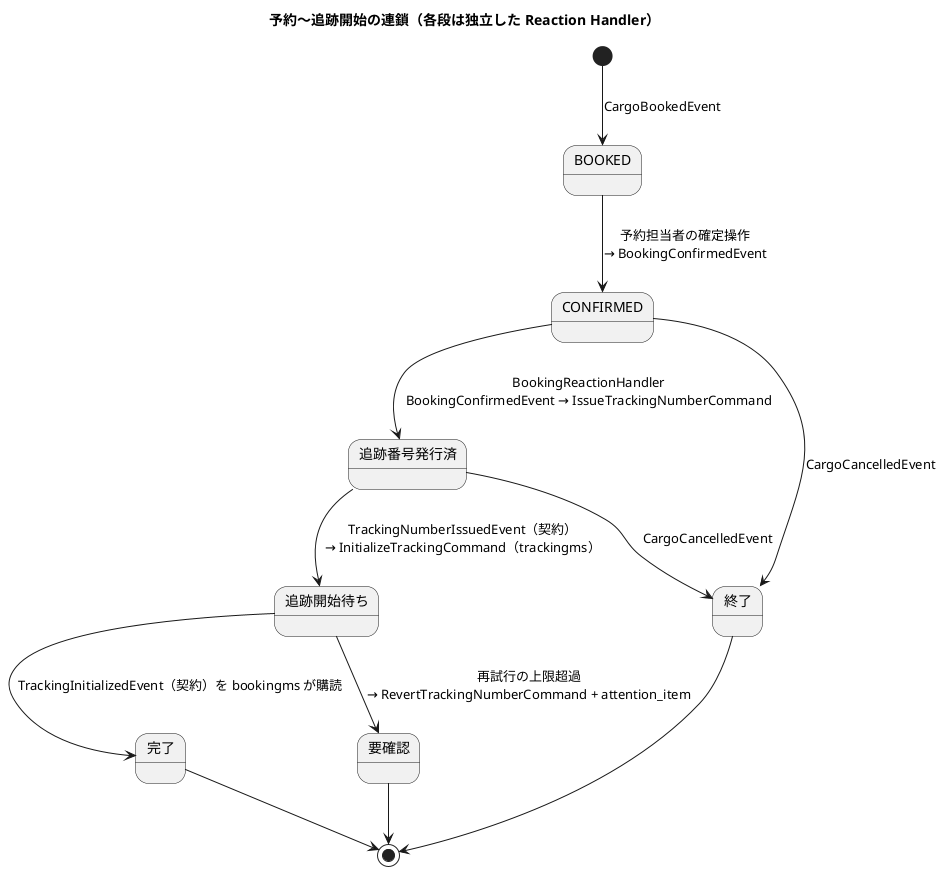

| 段 | 購読するイベント | 送るコマンド | 途中経過の置き場 |
| :--- | :--- | :--- | :--- |
| 1 | `BookingConfirmedEvent`（自サービス） | `IssueTrackingNumberCommand` | `process_state` の行を作る（`RUNNING`） |
| 2 | `TrackingNumberIssuedEvent`（契約） | `InitializeTrackingCommand`（trackingms） | `process_state.completed_steps` を進める |
| 3 | `TrackingInitializedEvent`（契約） | 無し（連鎖の終わり） | `process_state.status = 'COMPLETED'` にする |

**Saga が持っていた「関連付け」「終了」「タイムアウト」の代わり。** 3 段にまたがるので、途中経過は `process_state`（`process_type = 'BOOKING_TO_TRACKING'`、`process_id = bookingId`）に明示的に持ちます（[データモデル](data-model.md)「連鎖の途中経過」）。Saga のストアに直列化して埋めるのと違い、止まった位置がそのまま SQL で読めます。

- **関連付け** = `process_state` の行そのもの（`SagaLifecycle.associateWith()` の代わりに行を作る）
- **終了** = 3 段目のイベントで `status = 'COMPLETED'` にする（`@EndSaga` の代わり。行は消さず、いつ終わったかを残す）
- **タイムアウト** = Axon に Deadline が無いため、`status = 'RUNNING'` かつ `updated_at` が 24 時間より古い行を定期に走査する運用ジョブ（`gulp reaction:stuck`）で検知します。上限を超えたものに `RevertTrackingNumberCommand` を送り、`status = 'COMPENSATED'` にして `attention_item` に写します。予約は `CONFIRMED` に留まります

一方、配送完了 → 精算のように **1 段で終わる連鎖には `process_state` を置きません。** `Invoice` の有無から「今どの段か」が読めるので、増やすと持ち主が二重になります。

`BookingReactionHandler` は同期クエリを呼びません。経路候補の存在確認（候補 0 件の検知）は `RequestRoutingCommand` を受ける Controller が `FindRouteCandidatesQuery` で行い、Reaction Handler の外に置きます。Reaction Handler の中で `.join()` すると Processing Group が止まるためです。`CloseTrackingCommand` も bookingms から送らず、trackingms の `TrackingReactionHandler` が陸揚げ地での `UNLOAD` を受けた後に送ります（`TrackingActivity` 不変条件 9）。

### 配送完了 → 精算の連鎖（billingms）

| 購読するイベント | 送るコマンド | 失敗時 |
| :--- | :--- | :--- |
| `CargoDeliveredEvent` | `CalculateInvoiceCommand`（`shipper_contract_snapshot` から荷主の種別・割引率を読む） | 荷主が無い（購読が遅れている）→ 再試行、上限超過で `InvoiceCreationFailedEvent` を出し経理担当者の要確認一覧（`attention_item`）に写す |
| `CargoCancelledEvent` | `ApplyCancellationFeeCommand` | 同上 |

以降の発行・入金は経理担当者の操作です。再試行の回数と打ち切りは Resilience4j で自前に組みます（Axon 5 が面倒を見ないため）。

Reaction Handler の再試行と補償は「例外にしない」ではなく「イベントとして残す」で扱います。戻り値を捨てて黙ると、失敗が誰にも見えないまま業務の守りが外れます。

## クエリ一覧（読み取りモデル）

| サービス | クエリ | 戻り型 | UC |
| :--- | :--- | :--- | :--- |
| bookingms | `FindCargoSummariesQuery(shipperId?, status?, page)` | `List<CargoSummaryView>` | UC03・UC04・UC11 |
| bookingms | `FindCargoDetailQuery(bookingId)` | `CargoDetailView` | UC03・UC07・UC11 |
| bookingms | `FindRoutingWorklistQuery()` | `List<RoutingWorkItemView>`（`ROUTING_REQUESTED` の予約） | UC04・UC07 |
| bookingms | `FindCancellationRequestsQuery()` | `List<CancellationRequestView>` | UC22 |
| bookingms | `FindShipperQuery(shipperId)` / `ExistsShipperEmailQuery(email)` | `ShipperView` / `boolean` | UC02 |
| bookingms | `FindQuotationQuery(quotationId)` | `QuotationView` | UC01 |
| bookingms | `FindShipperBookingsQuery(shipperId, page)` | `List<ShipperBookingSummaryView>`（荷主向け S45。authms の紐付けで絞る） | UC03・UC15 |
| bookingms | `FindShipperBookingProgressQuery(shipperId, bookingId)` | `ShipperBookingProgressView`（状態バッジ・進み具合・確定旅程・通知履歴のみ。金額・社内メモ無し。S46） | UC10・UC11 |
| routingms | `FindVoyagesQuery(filter)` / `FindVoyageQuery(voyageNumber)` | `List<VoyageView>` / `VoyageView` | UC05・UC19 |
| routingms | `FindRouteCandidatesQuery(spec)`（契約） | `List<RouteCandidateDto>` | UC06 |
| trackingms | `FindTrackingQuery(trackingNumber)` | `TrackingView`（現在状態 + 履歴 + 例外） | UC15 |
| trackingms | `FindPublicTrackingQuery(trackingNumber)` | `PublicTrackingView`（認証不要・荷受人向け） | UC15 |
| trackingms | `FindShipperTrackingsQuery(shipperId)` | `List<TrackingSummaryView>`（自社貨物のみ） | UC15 |
| trackingms | `FindOpenExceptionsQuery()` | `List<ExceptionView>`（`ExceptionType#urgent` を先頭、以降は到着期限までの残日数が少ない順） | UC16 |
| handlingms | `FindHandlingHistoryQuery(trackingNumber)` | `List<HandlingActivityView>`（取り消し済みも `voided` 付きで残す） | UC13 |
| handlingms | `FindCargosOnVoyageQuery(voyageNumber, unlocode)` | `List<CargoOnVoyageView>`（航海番号起点の荷役 S50。投影 `cargo_snapshot_leg` から） | UC13 |
| handlingms | `FindCustomsDeclarationQuery(trackingNumber)` / `FindHeldDeclarationsQuery()` | `CustomsDeclarationView` / `List<...>`（留置 3 日超を強調） | UC21 |
| billingms | `FindInvoiceQuery(invoiceId)` / `FindInvoicesQuery(filter)` | `InvoiceView` / `List<InvoiceView>`（`overdue` を今日で判定。`quotedAmount` と差額・理由を含む） | UC17・UC18 |
| billingms | `FindShipperInvoiceQuery(shipperId, invoiceId)` | `ShipperInvoiceView`（荷主向け S62。自社の請求書のみ） | UC18 |

読み取りモデルは画面ごとに作り、他サービスの DB を JOIN しません。予約一覧に荷役の最新状態が要るなら、`HandlingActivityRegisteredEvent` を購読して `cargo_summary` に列を足します。

## トレーサビリティ（UC ↔ 集約・コマンド・イベント）

| UC | 主集約 | 主コマンド | 主イベント |
| :--- | :--- | :--- | :--- |
| UC01 見積作成 | `Quotation` | `CreateQuotationCommand` | `QuotationCreatedEvent` |
| UC02 荷主登録 | `Shipper` | `RegisterShipperCommand`, `AssignCorporateContractCommand` | `ShipperRegisteredEvent`, `CorporateContractAssignedEvent` |
| UC03 貨物予約登録 | `Cargo` | `BookCargoCommand` | `CargoBookedEvent` |
| UC04 予約引渡 | `Cargo` | `RequestRoutingCommand` | `RoutingRequestedEvent` |
| UC05 航海検索 | — | `FindVoyagesQuery` | — |
| UC06 経路候補算出 | — | `FindRouteCandidatesQuery` + `RouteSearchService` | — |
| UC07 経路選択・確定 | `Cargo` | `AssignRouteCommand` | `CargoRoutedEvent` |
| UC08 経路条件調整 | `Cargo` | `AdjustRouteSpecificationCommand`, `RequestConditionReviewCommand`, `ReturnToRoutingCommand` | `RouteSpecificationAdjustedEvent`, `ConditionReviewRequestedEvent`, `ReturnedToRoutingEvent` |
| UC09 経路情報紐付 | `Cargo` | `AssignRouteCommand` | `CargoRoutedEvent` |
| UC10 確定経路通知 | `Cargo` | `NotifyShipperCommand` | `ShipperNotifiedEvent` |
| UC11 予約確定 | `Cargo` | `ConfirmBookingCommand` | `BookingConfirmedEvent` |
| UC12 追跡番号発行 | `Cargo` → `TrackingActivity` | `IssueTrackingNumberCommand`, `InitializeTrackingCommand` | `TrackingNumberIssuedEvent`, `TrackingInitializedEvent` |
| UC13 荷役作業記録 | `HandlingActivity` | `RegisterHandlingActivityCommand`, `VoidHandlingActivityCommand` | `HandlingActivityRegisteredEvent`, `HandlingActivityVoidedEvent` |
| UC14 貨物状態更新 | `TrackingActivity` | `AdvanceTrackingCommand`, `UpdateTransportStatusCommand` | `TransportStatusUpdatedEvent`, `CargoDeliveredEvent` |
| UC15 追跡情報照会 | — | `FindTrackingQuery`, `FindPublicTrackingQuery` | — |
| UC16 例外処理 | `TrackingActivity` | `RegisterTrackingExceptionCommand`, `ResolveTrackingExceptionCommand` | `TrackingExceptionRegisteredEvent`, `TrackingExceptionResolvedEvent` |
| UC17 輸送料金算出 | `Invoice` | `CalculateInvoiceCommand`, `ApplyDiscountCommand` | `InvoiceCalculatedEvent`, `DiscountAppliedEvent` |
| UC18 精算処理 | `Invoice` → `Cargo` | `IssueInvoiceCommand`, `RecordPaymentCommand`, `SettleBookingCommand` | `InvoiceIssuedEvent`, `PaymentRecordedEvent`, `BookingSettledEvent` |
| UC19 航海スケジュール登録 | `Voyage` | `RegisterVoyageCommand`, `UpdateVoyageScheduleCommand` | `VoyageRegisteredEvent`, `VoyageScheduleUpdatedEvent` |
| UC20 ユーザー認証 | `User` | `LoginCommand`, `UnlockAccountCommand` | （状態保存・監査ログ） |
| UC21 通関申告管理 | `CustomsDeclaration` → `TrackingActivity` | `RegisterCustomsDeclarationCommand`, `UpdateCustomsStatusCommand` | `CustomsStatusChangedEvent`, `TrackingExceptionRegisteredEvent(CUSTOMS_HOLD)` |
| UC22 予約キャンセル | `Cargo` → `TrackingActivity` / `Invoice` | `RequestCancellationCommand`, `ApproveCancellationCommand`, `PlanCancellationDischargeCommand`, `CloseTrackingCommand`（陸揚げ地の `UNLOAD` 後）, `ApplyCancellationFeeCommand` | `CargoCancelledEvent`, `CancellationDischargePlannedEvent`, `TrackingClosedEvent`, `CancellationFeeAppliedEvent` |
| US28 誤配検知・再設計 | `HandlingActivity` → `TrackingActivity` / `Cargo` | `RegisterHandlingActivityCommand`（`offRoute`）, `AssignRouteCommand`（現在地起点、期限超過候補も可） | `CargoMisroutedEvent`（trackingms）, `BookingMisroutedEvent`（bookingms）, `CargoRoutedEvent` |
| US31 アカウント保護 | `User` | `LoginCommand`（失敗）, `UnlockAccountCommand` | （状態保存・監査ログ） |

## 設計判断

### 集約の粒度

- `Cargo` は `bookingId` 1 件分を境界とし、`Shipper` / `Quotation` は別集約にする。`CancellationRequest` は `Cargo` の内側のエンティティにする（承認の判定が予約状態に依存するため）
- `CargoItinerary` は値オブジェクト。順序・連結の整合は `Cargo` が保証する
- `TrackingException` は解決状態が変わるためエンティティだが、`TrackingActivity` の内側に閉じる
- `HandlingActivity` は 1 作業 1 集約。履歴は投影が持つ。`CustomsDeclaration` は監査履歴が要るため別集約にする
- 経路候補（`RouteCandidate`）は集約にしない。算出は状態を変えないので Query 側のドメインサービスで行う

### 識別子

- すべて値オブジェクト。BC ごとに別の型（`BookingId` / `TrackingBookingId` / `CargoBookingId` / `BillingBookingId`）
- `BookingId` と `TrackingNumber` は bookingms が採番する。`TrackingNumber` は荷主に共有されるため推測されにくい形式（`TRK-` + 大文字英数字 10 桁）
- `ShipperCode` は投影側の採番。集約で MAX+1 しない
- Axon 5 の `@EventSourced(tagKey)` には識別子の**文字列値**を渡す。イベントの `record` には値オブジェクトでなく文字列として載せ、`@EventSourcingHandler` で値オブジェクトに包み直す（イベントの JSON 形を値オブジェクトの実装から切り離す）

### イベントの設計規則

**イベントは自分のタグを宣言する。** 集約の識別子に当たる項目へ `@EventTag(key = "<tagKey>")` を付ける。`@EventSourced(tagKey)` は集約側の宣言でしかなく、これが無いとイベントにタグが書かれない。タグの無いイベントは復元時に引けないので、**集約は毎回空のまま復元され、状態を見る不変条件が丸ごと素通りする**（[ADR-0001](../../adr/cargo-tracker/0001-cqrs-es-with-axon-in-microservices.md) 決定 5 第 8 項）。集約の単体テストでは判別できないため、状態を見る守りは実 Axon Server の統合テストで固定する。


| 規則 | 理由 |
| :--- | :--- |
| 内部イベントと契約イベントを分ける（`TransportStatusUpdatedEvent` と `CargoDeliveredEvent`） | 内部の形を変えるたびに契約が動くのを防ぐ |
| イベント名は過去形の事実。コマンド名は命令形 | 「何が起きたか」と「何をしてほしいか」を混同しない |
| イベントには判断結果だけを載せ、判断材料を載せない | 再生時に判断をやり直さない |
| `occurredAt` はイベントに載せる。Axon のタイムスタンプに頼らない | リプレイしても業務上の時刻が変わらない |
| 値オブジェクトは JSON 形を固定して載せる。`Money` は `{amount, currency}`、`Location` は UN/LOCODE の文字列 | Upcaster なしで読み続けられる形にする |
| 一意制約（`Email`・`VoyageNumber`・請求書 1 通）は「事前の存在確認 + 投影の UNIQUE + 拒否の記録（`attention_item`）」の三段で守る | 集約 1 つでは全体の一意性を守れない。レース条件では 1 段目を素通りするので 2・3 段目を踏むテストを置く |
| イベント購読からコマンドを送るのは `application/reaction` の Reaction Handler だけ。投影はコマンドを送らない | リプレイでコマンドが再送されない。コマンドの失敗が投影のトークンを止めない |

### Axon Framework 5 との対応

| モデル要素 | Axon 5 |
| :--- | :--- |
| 集約ルート | `@org.axonframework.extension.spring.stereotype.EventSourced(idType = String.class, tagKey = "<識別子>")`（Spring stereotype、take-4 ADR-0008 の最終決定）+ `@EntityCreator`。`@EventSourcedEntity` 単独は実機で `NoHandlerForCommandException` を出して退けられた。**IT1 スパイクの第 1 項目で、5.3 系で stereotype 無し（`@EventSourcedEntity` 単独）で登録できるかを確かめ**、できなければ ArchUnit の許可リストに `EventSourced` を明示的に加え、ドメインが Spring stereotype を 1 つだけ持つ理由を ADR-0001 に書く |
| 作成系コマンド | `static @CommandHandler`。`EventAppender` で発行 |
| 更新系コマンド | インスタンス `@CommandHandler` |
| 状態復元 | `@EventSourcingHandler`。判断を書かない |
| 集約内エンティティ | 集約のフィールド。イベントで作成・更新 |
| 値オブジェクト | `record`。イベントには JSON 形を固定して載せる |
| ドメインサービス | Spring Bean にせず、コマンドハンドラの引数か Query Handler から呼ぶ純粋なクラス |
| 読み取りモデル | `@EventHandler` 投影（`infrastructure/projection`、Processing Group `<service>-*-projection`）+ MyBatis + `@QueryHandler`。コマンドは送らない |
| Reaction Handler | `application/reaction/<Name>ReactionHandler`（`BookingReactionHandler` / `TrackingReactionHandler` / `BillingReactionHandler`）。契約イベントの `@EventHandler` から `CommandGateway` でコマンドを送る。Processing Group は投影と分けて `booking-reaction` / `tracking-reaction` / `billing-reaction`。リプレイではリセットしない（`ReplayIT` で `CommandGateway` が呼ばれないことを固定） |
| 連鎖の調整役 | `@EventHandler` + `CommandGateway` の Reaction Handler（Axon 5 に Saga は無い。IT1 スパイクで確定） |
| 契約 | `shared/contract/{event,command,query}` の `record` |

## データモデルとの対応

投影テーブルは `data-model.md` で定義します。本書の集約はテーブルに対応しません。Event Store のスキーマは Axon Server が持ち、`data-model.md` はサービスごとの投影テーブル・`token_entry`・`saga_entry`・Auth の状態テーブルを扱います。

## 参照

- [要件定義](../../requirements/requirements_definition.md)
- [ビジネスユースケース](../../requirements/business_usecase.md)
- [システムユースケース](../../requirements/system_usecase.md)
- [ユーザーストーリー](../../requirements/user_story.md)
- [バックエンドアーキテクチャ](architecture_backend.md)
- [ADR-0001](../../adr/cargo-tracker/0001-cqrs-es-with-axon-in-microservices.md)、[ADR-0002](../../adr/cargo-tracker/0002-event-store-axon-server-and-postgresql-read-models.md)
- [ドメインモデル設計ガイド](../../reference/ドメインモデル設計ガイド.md)
- [ドメインモデル分析レビュー（2026-03-31）](../../review/ドメインモデル分析_review_20260331.md)
- 参照元：`tmp/take-4/docs/design/domain-model.md`、[java-3 ドメインモデル設計](../../article/source/java-3/docs/design/domain-model.md)
