# ドメインモデル設計 - 国際貨物輸送管理システム（CQRS / Event Sourcing 版）

## 概要

国際貨物輸送管理システム（Cargo Tracker）のドメインモデルを、[バックエンドアーキテクチャ](architecture_backend.md) が定めた 6 つの業務コンテキスト（Booking / Routing / Tracking / Handling / Billing / Auth）と共有カーネルに対して定義します。前提は Axon Framework 5 による CQRS + Event Sourcing + Saga で、Auth を除く集約はイベント列として永続化されます。

Event Sourcing では**イベントが集約の永続化フォーマット**です。従来の設計書がエンティティと値オブジェクトを中心に書くのに対し、本書は各集約について **コマンド → 不変条件 → イベント → 状態復元** の 4 つを対にして書きます。イベントは追記専用であり、一度 Event Store に書いたイベントは書き換えられません。したがって本書のイベント定義は、テーブル定義と同じ重さで扱います。

参照元は 2 つです。

| 参照元 | 採るもの | 変えるもの |
| :--- | :--- | :--- |
| `tmp/take-4/docs/design/domain-model.md` | Axon 5 前提の集約・コマンド・イベント・Saga の構成、レビュー指摘 28 件の反映結果（9 値の `TransportStatus`、`Money`、`CargoSnapshot` ACL など） | 4 系の `@Aggregate` 表記を 5 系の Entity API に読み替える。REST の ACL を Query Bus に置き換える |
| `docs/article/source/java-3/docs/design/domain-model.md` | 参照元 take-4 に無い業務（UC21 通関申告、UC22 輸送中キャンセルの承認、US28 誤配検知、US31 アカウント保護）、`HandlingType` が要件を自分で持つ設計、`ROUTE_NOTIFIED` の導入理由 | 現在状態の UPDATE をイベント列に置き換える |

## 戦略的設計（業務領域の分類）

各コンテキストを「差別化の度合い」と「業務ロジックの複雑さ」の 2 軸で分類します。中核には内製でリソースを集中し、補完・一般領域は既製の仕組みを使います。

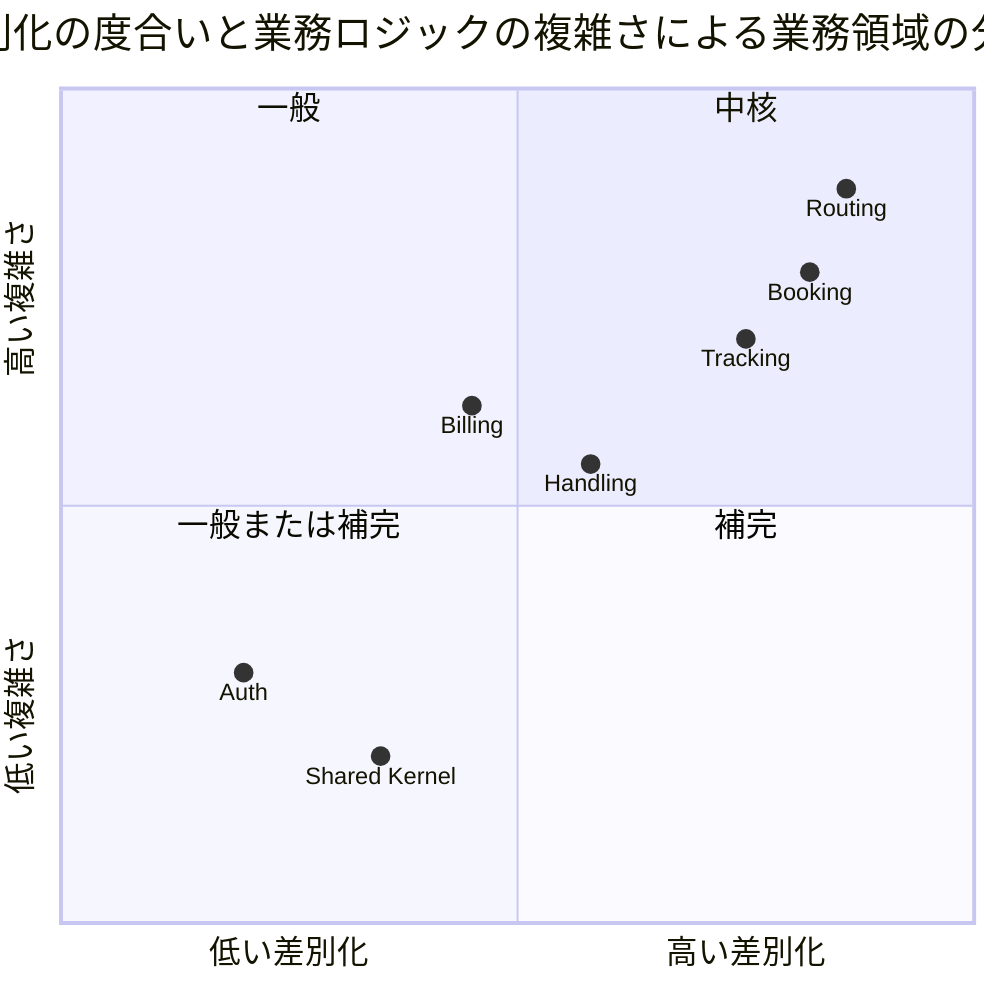

| コンテキスト | 分類 | 理由 | Event Sourcing |
| :--- | :--- | :--- | :--- |
| Routing | 中核 | 航海スケジュール・寄港地接続・貨物種別を考慮した経路候補算出は競合優位性そのもの | 適用（`Voyage`） |
| Booking | 中核 | 予約状態遷移と Saga（確定 → 追跡番号 → 追跡開始）は基幹プロセス | 適用 |
| Tracking | 中核 | 追跡・例外管理は荷主との信頼を作る。**履歴そのものが価値**であり Event Sourcing の効果が最も出る | 適用 |
| Handling | 補完 | 荷役記録は基盤だが業界共通。通関申告は監査履歴が要る | 適用 |
| Billing | 補完 | 法人割引は固有だが精算自体は業界共通。金額を扱うため監査が要る | 適用 |
| Auth | 一般または補完 | 認証・認可は汎用機能 | **適用しない**（状態保存） |
| Shared Kernel | 一般 | UN/LOCODE 等の国際標準 | なし |

## ユビキタス言語

### コア概念

| 日本語 | 英語 | コード識別子 | 説明 |
| :--- | :--- | :--- | :--- |
| 貨物 | Cargo | `Cargo` | 輸送対象となる荷物。予約単位の集約ルート |
| 予約 | Booking | `Cargo` 集約 | 貨物の輸送予約。`BookingId` で識別 |
| 予約番号 | Booking ID | `BookingId` | 予約を識別する一意な番号 |
| 見積 | Quotation | `Quotation` | 予約前の概算。集約ルート |
| 追跡番号 | Tracking Number | `TrackingNumber` | 荷主が貨物を追跡するための一意な番号 |
| 経路仕様 | Route Specification | `RouteSpecification` | 出発地・目的地・到着期限の指定 |
| 旅程 | Itinerary | `CargoItinerary` | 確定した輸送区間（Leg）の順序付き列 |
| 輸送区間 | Leg | `Leg` | 航海単位の輸送区間（積込港・荷降港・日時・航海番号） |
| 航海 | Voyage | `Voyage` | 運送会社が運航する 1 つの航海。集約ルート |
| 航海番号 | Voyage Number | `VoyageNumber` | 航海を識別する番号。**BC ごとに別の型** |
| 運搬移動 | Carrier Movement | `CarrierMovement` | 航海内の港間移動 |
| 経路候補 | Route Candidate | `RouteCandidate` | 経路仕様を満たす旅程の候補。Routing の読み取りモデル |
| 港湾コード | UN/LOCODE | `UnLocode` | 国連が定める港湾識別コード（例: `JPTYO`）。共有カーネル |
| 荷主 | Shipper | `Shipper` | 貨物の依頼主。個人または法人。集約ルート |
| 荷受人 | Consignee | `Consignee` | 貨物を受け取る人 |
| 法人契約 | Corporate Contract | `CorporateContract` | 法人荷主の割引契約 |
| 追跡活動 | Tracking Activity | `TrackingActivity` | 貨物の追跡状況。集約ルート |
| 輸送ステータス | Transport Status | `TransportStatus` | 貨物の輸送上の状態（9 値） |
| 例外事象 | Tracking Exception | `TrackingException` | 遅延・破損・紛失・誤配・税関保留の例外 |
| 荷役作業 | Handling Activity | `HandlingActivity` | 港湾での受領・積込・荷降し・引取作業。集約ルート |
| 荷役種別 | Handling Type | `HandlingType` | 荷役作業の種別。**種別ごとの要件を自分で持つ** |
| 通関申告 | Customs Declaration | `CustomsDeclaration` | 税関への申告と審査状態。集約ルート |
| 貨物スナップショット | Cargo Snapshot | `CargoSnapshot` | Handling が Booking のイベントから写し取った貨物の最小情報（ACL） |
| 請求書 | Invoice | `Invoice` | 輸送料金の請求書。集約ルート |
| 金額 | Money | `Money` | 通貨と数量を伴う金額。丸めは `Money` の中 1 か所 |
| キャンセル申請 | Cancellation Request | `CancellationRequest` | 輸送中の予約に対するキャンセルの申請・承認・却下の記録 |
| 契約イベント | Contract Event | `shared/contract/event` | 他サービスが購読するイベント。`shared` に置く |

### 状態の一覧

| 状態タイプ | 日本語 | コード | 備考 |
| :--- | :--- | :--- | :--- |
| 予約状態 `BookingStatus` | 仮受付 | `PRELIMINARY` | 要件定義「仮受付」 |
| | 経路提案中 | `ROUTE_PROPOSED` | 要件定義「経路提案中」。経路設計者の手番 |
| | 経路通知済 | `ROUTE_NOTIFIED` | 荷主へ経路を提示した状態。**通知していない予約は確定できない**（java-3 ADR-021） |
| | 予約確定 | `CONFIRMED` | ここから経路設計へは戻せない |
| | 追跡番号発行済 | `TRACKING_ISSUED` | |
| | 輸送中 | `IN_TRANSIT` | キャンセルは承認が要る |
| | 配送完了 | `DELIVERED` | 以降キャンセル不可 |
| | 精算済 | `SETTLED` | |
| | キャンセル | `CANCELLED` | 以降コマンドを受けない |
| 経路設定状態 `RoutingStatus` | 未設定 | `NOT_ROUTED` | |
| | 設計依頼中 | `ROUTING_REQUESTED` | 経路設計者の作業待ちに現れる |
| | 設定済 | `ROUTED` | |
| | 誤配 | `MISROUTED` | 予定ルート外の荷役を受けた（US28） |
| 輸送ステータス `TransportStatus` | 未受領 | `NOT_RECEIVED` | |
| | 受領済 | `RECEIVED` | |
| | 積込済 | `LOADED` | |
| | 輸送中 | `IN_TRANSIT` | 荷役では起きない。手動更新（US17） |
| | 荷降し済 | `UNLOADED` | 途中の港 |
| | 引取待ち | `AWAITING_CLAIM` | 目的港 |
| | 引取済 | `DELIVERED` | 精算の開始条件 |
| | 誤配 | `MISROUTED` | |
| | 例外発生 | `EXCEPTION` | |
| 荷役種別 `HandlingType` | 受領 / 積込 / 荷降し / 引取 | `RECEIVE` / `LOAD` / `UNLOAD` / `CLAIM` | 税関は荷役ではなく `CustomsDeclaration` で扱う |
| 例外種別 `ExceptionType` | 遅延 / 破損 / 紛失 / 誤配 / 税関保留 | `DELAY` / `DAMAGE` / `LOSS` / `MISROUTE` / `CUSTOMS_HOLD` | 緊急かどうかは種別が答える（`LOSS` のみ） |
| 例外対応状態 `ResponseStatus` | 起票 / 対応中 / 解決 | `REPORTED` / `RESPONDING` / `RESOLVED` | |
| 通関状態 `CustomsStatus` | 審査中 / 通関済 / 留置 / 却下 | `PENDING` / `CLEARED` / `HELD` / `REJECTED` | 引取を許すのは `CLEARED` だけ |
| 精算状態 `BillingStatus` | 算出待ち / 算出済 / 請求済 / 入金済 / 取消 | `PENDING` / `CALCULATED` / `INVOICED` / `PAID` / `VOID` | 期限超過は列に持たず `overdue(today)` で判定 |
| 荷主種別 `ShipperType` | 個人 / 法人 | `INDIVIDUAL` / `CORPORATE` | |
| 貨物種別 `CargoType` | 一般 / 危険物 / 冷凍 | `GENERAL` / `HAZARDOUS` / `REFRIGERATED` | |

## アクターとコンテキストの対応

| アクター | Auth | Booking | Routing | Tracking | Handling | Billing |
| :--- | :--: | :--: | :--: | :--: | :--: | :--: |
| 荷主 | ◯ | ◯（参照） | | ◯（参照） | | ◯（請求書受領） |
| 荷受人 | | | | ◯（参照・認証不要の公開追跡） | | |
| 営業担当者 | ◯ | ◎ | | | | |
| 経路設計者 | ◯ | ◯ | ◎ | | | |
| 追跡管理者 | ◯ | ◯（キャンセル承認） | | ◎ | ◯（通関状態更新） | |
| 荷役作業員 | ◯ | | | | ◎ | |
| 経理担当者 | ◯ | | | | | ◎ |
| システム管理者 | ◎ | | | | | |

凡例: ◎ 主たる利用、◯ 参照・付随的利用

## コンテキストマップ

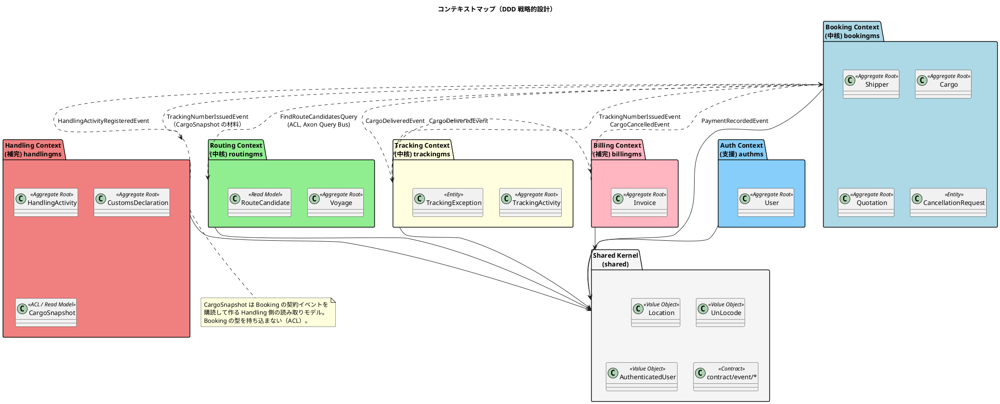

実線はイベント（Axon Event Bus）、点線の Query は Axon Query Bus です。サービス越しに状態を変える同期呼び出しはありません。

## Shared Kernel（共有カーネル）

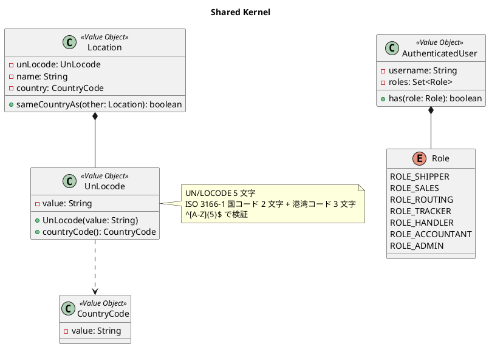

### 共有カーネルの範囲と不変条件

| 置くもの | 理由 |
| :--- | :--- |
| `Location` / `UnLocode` / `CountryCode` | 全 BC が同じ意味で使う。輸出免税の判定（Billing）にも国コードを使う |
| `AuthenticatedUser` / `Role` | Gateway が復元した認証情報の契約 |
| `contract/event/*`、`contract/command/*`、`contract/query/*` | サービス越しに送るメッセージ。両側が同じクラスを持つ必要がある |
| **置かないもの** | `VoyageNumber` / `BookingId` / `TrackingNumber` などの識別子、`Money`、集約、ドメインサービス |

- `UnLocode` は `^[A-Z]{5}$` を満たす
- `Location` の同一性は `UnLocode` の値で判定する
- 識別子は BC ごとに別の型で定義する（`BookingId` / `TrackingBookingId` / `CargoBookingId`）。同じ予約を指す識別子が BC の数だけあるのは重複ではなく、境界を分けた代金である

## Booking Context（中核）— bookingms

予約・荷主・見積を担います。`BookingSaga` が確定 → 追跡番号発行 → 追跡開始を調整します。

### ドメインモデル図

```plantuml
@startuml
title Booking Context

class Cargo <<Aggregate Root>> <<@EventSourcedEntity(tagKey="bookingId")>> {
  - bookingId: BookingId
  - shipperId: ShipperId
  - cargoSpec: CargoSpecification
  - routeSpec: RouteSpecification
  - itinerary: CargoItinerary
  - bookingStatus: BookingStatus
  - routingStatus: RoutingStatus
  - trackingNumber: TrackingNumber
  - lastNotifiedAt: Instant
  - cancellationRequest: CancellationRequest
  - lastHandling: HandlingSnapshot
  .. @CommandHandler ..
  + {static} book(BookCargoCommand)
  + requestRouting(RequestRoutingCommand)
  + assignRoute(AssignRouteCommand)
  + adjustRouteSpecification(AdjustRouteSpecificationCommand)
  + notifyShipper(NotifyShipperCommand)
  + returnToRouting(ReturnToRoutingCommand)
  + confirm(ConfirmBookingCommand)
  + issueTrackingNumber(IssueTrackingNumberCommand)
  + requestCancellation(RequestCancellationCommand)
  + approveCancellation(ApproveCancellationCommand)
  + rejectCancellation(RejectCancellationCommand)
  + recordHandling(RecordHandlingCommand)
  + markDelivered(MarkDeliveredCommand)
  + settle(SettleBookingCommand)
  .. @EventSourcingHandler ..
  + on(...)
}

class BookingId <<Value Object>>
class ShipperId <<Value Object>>
class TrackingNumber <<Value Object>>

class CargoSpecification <<Value Object>> {
  - cargoType: CargoType
  - weightKg: Weight
  - dimensions: Dimensions
  - quantity: int
  - productName: String
  - hazardousDeclaration: HazardousDeclaration [0..1]
  - temperatureRequirement: TemperatureRequirement [0..1]
  + {static} of(...): CargoSpecification
}
class HazardousDeclaration <<Value Object>> {
  - imoClass: String
  - unNumber: String
}
class TemperatureRequirement <<Value Object>> {
  - minCelsius: BigDecimal
  - maxCelsius: BigDecimal
}
class Dimensions <<Value Object>>
class Weight <<Value Object>>

class RouteSpecification <<Value Object>> {
  - origin: Location
  - destination: Location
  - arrivalDeadline: LocalDate
  + isSatisfiedBy(itinerary: CargoItinerary): boolean
}

class CargoItinerary <<Value Object>> {
  - legs: List<Leg>
  + finalArrivalDate(): LocalDate
  + finalDestination(): Location
  + expects(type: HandlingType, location: Location): boolean
}
class Leg <<Value Object>> {
  - voyageNumber: VoyageNumber
  - loadLocation: Location
  - unloadLocation: Location
  - loadTime: LocalDateTime
  - unloadTime: LocalDateTime
}
class VoyageNumber <<Value Object>>

class CancellationRequest <<Entity>> {
  - requestId: CancellationRequestId
  - reason: String
  - requestedBy: String
  - requestedAt: Instant
  - decision: CancellationDecision [0..1]
}
class CancellationDecision <<Value Object>> {
  - approved: boolean
  - dischargeLocation: Location [0..1]
  - reason: String
  - decidedBy: String
  - decidedAt: Instant
}

class HandlingSnapshot <<Value Object>> {
  - type: HandlingType
  - location: Location
  - completedAt: Instant
  - offRoute: boolean
}

enum BookingStatus {
  PRELIMINARY
  ROUTE_PROPOSED
  ROUTE_NOTIFIED
  CONFIRMED
  TRACKING_ISSUED
  IN_TRANSIT
  DELIVERED
  SETTLED
  CANCELLED
  + canTransitionTo(next): boolean
  + cancellableImmediately(): boolean
}
enum RoutingStatus {
  NOT_ROUTED
  ROUTING_REQUESTED
  ROUTED
  MISROUTED
}
enum CargoType

class Shipper <<Aggregate Root>> <<@EventSourcedEntity(tagKey="shipperId")>> {
  - shipperId: ShipperId
  - shipperCode: ShipperCode
  - shipperType: ShipperType
  - name: ShipperName
  - address: Address
  - contact: ContactInfo
  - corporateContract: CorporateContract [0..1]
  + {static} register(RegisterShipperCommand)
  + updateContact(UpdateShipperContactCommand)
  + assignCorporateContract(AssignCorporateContractCommand)
}
class ShipperCode <<Value Object>>
class ContactInfo <<Value Object>>
class Email <<Value Object>>
class CorporateContract <<Value Object>> {
  - contractNumber: String
  - discountRate: DiscountRate
}
class DiscountRate <<Value Object>> {
  - value: BigDecimal  ' 0.0000〜0.3000
}
enum ShipperType

class Quotation <<Aggregate Root>> <<@EventSourcedEntity(tagKey="quotationId")>> {
  - quotationId: QuotationId
  - routeSpec: RouteSpecification
  - cargoType: CargoType
  - weightKg: Weight
  - candidates: List<QuotedRoute>
  - estimatedCharge: Money
  - validUntil: LocalDate
  + {static} create(CreateQuotationCommand)
  + diffAgainst(cargo: BookCargoCommand): List<String>
}
class QuotedRoute <<Value Object>>
class Money <<Value Object>>

Cargo *-- BookingId
Cargo *-- ShipperId
Cargo *-- CargoSpecification
Cargo *-- RouteSpecification
Cargo *-- "0..1" CargoItinerary
Cargo *-- BookingStatus
Cargo *-- RoutingStatus
Cargo *-- "0..1" TrackingNumber
Cargo *-- "0..1" CancellationRequest
Cargo *-- "0..1" HandlingSnapshot
CargoSpecification *-- CargoType
CargoSpecification *-- "0..1" HazardousDeclaration
CargoSpecification *-- "0..1" TemperatureRequirement
RouteSpecification *-- Location
CargoItinerary "1" *-- "1..*" Leg
Leg *-- VoyageNumber
CancellationRequest *-- "0..1" CancellationDecision
Shipper *-- ShipperId
Shipper *-- ShipperCode
Shipper *-- ShipperType
Shipper *-- ContactInfo
Shipper *-- "0..1" CorporateContract
CorporateContract *-- DiscountRate
ContactInfo *-- Email
Quotation *-- "0..*" QuotedRoute
Quotation *-- Money
@enduml
```

### BookingStatus 状態遷移（正典）

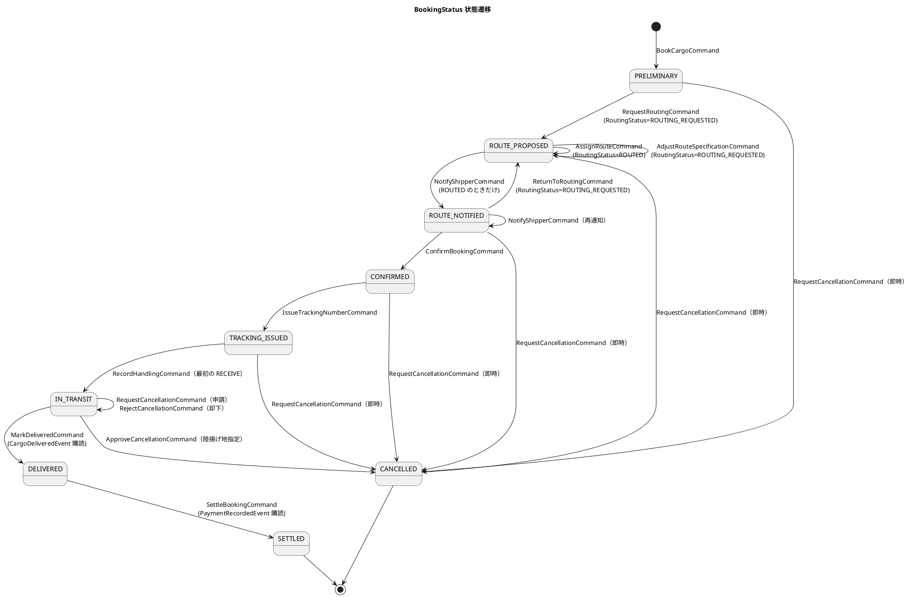

遷移の判定は `BookingStatus#canTransitionTo` の 1 か所に置き、コマンドハンドラはこれを呼びます。画面のボタン出し分けは投影の `status` を読みますが、判定を書き直しません。

### Cargo 集約の不変条件

| # | 不変条件 | 守る場所 |
| :--- | :--- | :--- |
| 1 | `BookingId` は不変。`ShipperId` は登録時に必須 | `book` |
| 2 | `RouteSpecification` の出発地と目的地は異なる | `RouteSpecification` の生成 |
| 3 | `HAZARDOUS` なら `hazardousDeclaration` 必須、`REFRIGERATED` なら `temperatureRequirement` 必須 | `CargoSpecification.of` |
| 4 | `CargoItinerary.legs` は 1 件以上、時刻昇順、`leg[i].unloadLocation == leg[i+1].loadLocation` | `CargoItinerary` の生成 |
| 5 | 旅程は経路仕様を満たす（起点・終点・期限。**期限は日付単位で比較し、期限当日着は満たす**） | `assignRoute` |
| 6 | 荷主に通知していない予約は確定できない（`ROUTE_NOTIFIED` からのみ `CONFIRMED`） | `confirm` |
| 7 | `CONFIRMED` 以降は経路設計へ戻せない | `returnToRouting` |
| 8 | 追跡番号は `CONFIRMED` の予約にだけ発行し、二重に発行しない | `issueTrackingNumber` |
| 9 | `IN_TRANSIT` のキャンセルは申請 → 承認（陸揚げ地必須）の 2 段階。`DELIVERED` 以降はキャンセル不可 | `requestCancellation` / `approveCancellation` |
| 10 | 未決着の `CancellationRequest` は高々 1 件 | `requestCancellation` |
| 11 | `CANCELLED` の集約は以降のコマンドを拒否する | 全ハンドラ |
| 12 | 予定ルート外の荷役（`offRoute`）を受けたら `RoutingStatus = MISROUTED`。現在地起点の再設計（`assignRoute`）で `ROUTED` に復帰 | `recordHandling` / `assignRoute` |

### Cargo 集約のコマンドとイベント

| コマンド | アクター | 発行イベント | 契約 | UC / US |
| :--- | :--- | :--- | :--- | :--- |
| `BookCargoCommand` | 営業担当者 | `CargoBookedEvent` | — | UC03 / US04・US05 |
| `RequestRoutingCommand` | 営業担当者 | `RoutingRequestedEvent` | — | UC04 / US06 |
| `AssignRouteCommand` | 経路設計者 | `CargoRoutedEvent` | — | UC07・UC09 / US09・US11・US28 |
| `AdjustRouteSpecificationCommand` | 経路設計者 | `RouteSpecificationAdjustedEvent` | — | UC08 / US10 |
| `NotifyShipperCommand` | 営業担当者 | `ShipperNotifiedEvent` | — | UC10 / US12 |
| `ReturnToRoutingCommand` | 営業担当者 | `ReturnedToRoutingEvent` | — | UC08 |
| `ConfirmBookingCommand` | 営業担当者 | `BookingConfirmedEvent` | — | UC11 / US13 |
| `IssueTrackingNumberCommand` | 経路設計者 / Saga | `TrackingNumberIssuedEvent` | **○** | UC12 / US14 |
| `RequestCancellationCommand` | 営業担当者 | `CancellationRequestedEvent` または `CargoCancelledEvent`（即時） | ○（後者） | UC22 / US30 |
| `ApproveCancellationCommand` | 追跡管理者 | `CancellationApprovedEvent` + `CargoCancelledEvent` | ○（後者） | UC22 / US30 |
| `RejectCancellationCommand` | 追跡管理者 | `CancellationRejectedEvent` | — | UC22 / US30 |
| `RecordHandlingCommand` | Saga / 投影（`HandlingActivityRegisteredEvent` 購読） | `HandlingRecordedEvent`、`CargoMisroutedEvent`（`offRoute` のとき） | — | US15・US28 |
| `MarkDeliveredCommand` | イベント購読（`CargoDeliveredEvent`） | `BookingDeliveredEvent` | — | UC14 |
| `SettleBookingCommand` | イベント購読（`PaymentRecordedEvent`） | `BookingSettledEvent` | — | UC18 / US23 |

### Shipper 集約

| 不変条件 | 守る場所 |
| :--- | :--- |
| `Email` はシステム全体で一意（投影テーブルの UNIQUE と、登録前の `QueryGateway` による存在確認の二段） | `register` + 投影 |
| `CORPORATE` は `contractNumber` 必須、`INDIVIDUAL` は `corporateContract` を持てない | `register` / `assignCorporateContract` |
| `DiscountRate` は 0.0000〜0.3000 | `DiscountRate` の生成 |
| `ShipperCode` は投影側の採番（`SHP-` + 連番 6 桁）を使い、集約で MAX+1 しない | 投影 |

| コマンド | 発行イベント | UC / US |
| :--- | :--- | :--- |
| `RegisterShipperCommand` | `ShipperRegisteredEvent` | UC02 / US02・US03 |
| `UpdateShipperContactCommand` | `ShipperContactUpdatedEvent` | UC02 |
| `AssignCorporateContractCommand` | `CorporateContractAssignedEvent` | UC02 / US03・US22 |

Event Sourcing での一意制約は集約 1 つでは守れません。`Email` の一意性は、コマンド受付前に投影へ問い合わせて存在確認し、投影テーブルの UNIQUE で最終的に弾きます。投影で弾かれた場合は `ShipperRegistrationRejectedEvent` を投影側が出し、営業担当者の作業一覧に写します。

### Quotation 集約

| 不変条件 | 守る場所 |
| :--- | :--- |
| 見積は出発地・目的地・希望期限・貨物種別・重量の 5 項目を持つ。出発地と目的地は異なる | `create` |
| 概算料金は Billing の `FreightCharge` と同じ式で出す（見積と請求が違う金額にならない） | `QuotationEstimator`（ドメインサービス）。式は `shared` に置かず、Billing の `RateTable` と同じ値を `application.yml` から読む。両者の一致は契約テストで固定 |
| 候補が 0 件でも見積は作れる | `create` |
| 予約との食い違いは断らず項目名で知らせる | `diffAgainst` |

| コマンド | 発行イベント | UC / US |
| :--- | :--- | :--- |
| `CreateQuotationCommand` | `QuotationCreatedEvent` | UC01 / US01 |

## Routing Context（中核）— routingms

航海スケジュールの管理と、経路候補の算出を担います。

### ドメインモデル図

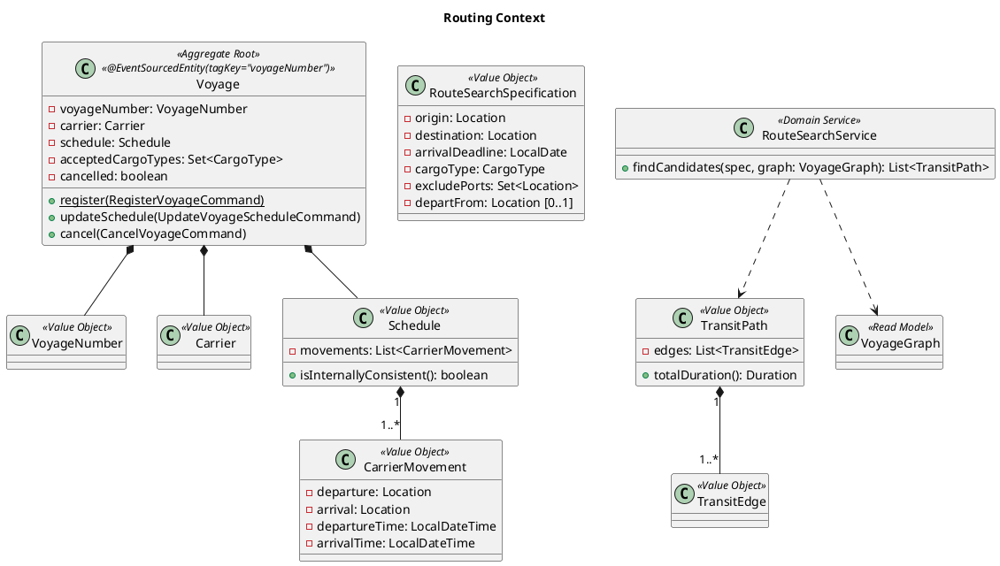

### Voyage 集約の不変条件

| # | 不変条件 |
| :--- | :--- |
| 1 | `VoyageNumber` は不変。同一番号の再登録は投影の存在確認で拒否 |
| 2 | `Schedule.movements` は時刻昇順、連続する移動の `arrival` と次の `departure` は同一港 |
| 3 | `arrivalTime > departureTime` |
| 4 | `acceptedCargoTypes` が空なら一般貨物のみ |
| 5 | キャンセル済みの航海は更新できない |

| コマンド | 発行イベント | UC / US |
| :--- | :--- | :--- |
| `RegisterVoyageCommand` | `VoyageRegisteredEvent` | UC19 / US24 |
| `UpdateVoyageScheduleCommand` | `VoyageScheduleUpdatedEvent` | UC19 / US25 |
| `CancelVoyageCommand` | `VoyageCancelledEvent` | UC19 |

### ドメインサービス：RouteSearchService

経路候補の算出は `Voyage` の集約境界を越えるグラフ探索なので、集約ではなくドメインサービスに置きます。入力は投影テーブルから組んだ `VoyageGraph`、出力は `TransitPath` の候補です。**状態を変えないので Query 側**に置き、`FindRouteCandidatesQuery`（`shared/contract/query`）の `@QueryHandler` から呼びます。誤配の再設計（US28）は `departFrom` に現在地を与えて同じサービスを使います。

制約は [要件定義の経路設計の制約条件](../../requirements/requirements_definition.md) に従います。危険物・冷凍貨物は `acceptedCargoTypes` に含む航海だけを通し、到着期限は日付単位で比較します。

## Tracking Context（中核）— trackingms

貨物の位置・状態の追跡と例外管理を担います。履歴そのものが価値であり、Event Sourcing の効果が最も出るコンテキストです。

### ドメインモデル図

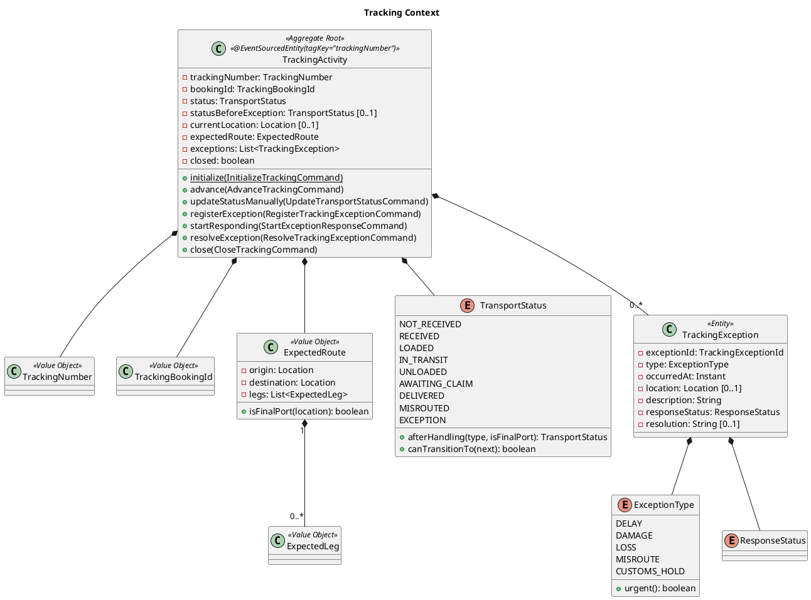

### TransportStatus 状態遷移

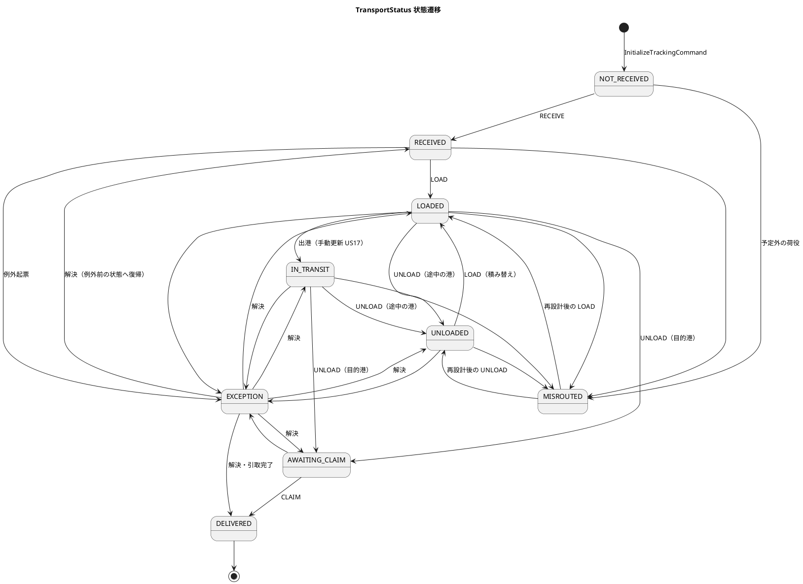

「同じ荷降しでも行き先が違う」判定は `TransportStatus#afterHandling(type, isFinalPort)` の 1 か所に置きます。集約も購読側もこの判定を書き直しません。

### TrackingActivity 集約の不変条件

| # | 不変条件 |
| :--- | :--- |
| 1 | `TrackingNumber` は Booking が採番し、Tracking は検証も採番もしない |
| 2 | 遷移は `TransportStatus#canTransitionTo` が許すものだけ |
| 3 | 予定ルート外の荷役を受けたら `MISROUTED` にし、`MISROUTE` 例外を自動起票する（US28） |
| 4 | `CustomsStatusChangedEvent(HELD)` を受けたら `CUSTOMS_HOLD` 例外を自動起票する（UC21） |
| 5 | `EXCEPTION` から復帰するときは、必ず起票中の例外がすべて `RESOLVED` であり、`statusBeforeException` へ戻る |
| 6 | 例外は追記のみ。解決しても事実は消えず、料金調整の根拠として残る |
| 7 | 緊急かどうかは `ExceptionType#urgent`（`LOSS` のみ真）が答える。属性には持たない |
| 8 | **知らない追跡番号の荷役では止まらない**。集約が無ければ `AdvanceTrackingCommand` は `UnknownTrackingRejectedEvent` に相当する記録を投影側に残し、後続の荷役を止めない |
| 9 | `closed` の集約はコマンドを拒否する（予約キャンセル時） |

| コマンド | アクター | 発行イベント | 契約 | UC / US |
| :--- | :--- | :--- | :--- | :--- |
| `InitializeTrackingCommand` | `BookingSaga`（`shared/contract/command`） | `TrackingInitializedEvent` | ○ | UC12 / US14 |
| `AdvanceTrackingCommand` | 投影（`HandlingActivityRegisteredEvent` 購読） | `TransportStatusUpdatedEvent`、`CargoMisroutedEvent` | — | UC14 / US15・US28 |
| `UpdateTransportStatusCommand` | 追跡管理者 | `TransportStatusUpdatedEvent` | — | UC14 / US17 |
| `RegisterTrackingExceptionCommand` | 追跡管理者 / 自動起票 | `TrackingExceptionRegisteredEvent` | — | UC16 / US19・US20 |
| `StartExceptionResponseCommand` | 追跡管理者 | `ExceptionResponseStartedEvent` | — | UC16 |
| `ResolveTrackingExceptionCommand` | 追跡管理者 | `TrackingExceptionResolvedEvent` | — | UC16 |
| （`advance` が `CLAIM` を受けたとき） | — | `CargoDeliveredEvent` | **○** | UC14 → UC17 |
| `CloseTrackingCommand` | `BookingSaga` | `TrackingClosedEvent` | ○ | UC22 |

`CargoDeliveredEvent` はコマンドに 1 対 1 で対応しません。`AdvanceTrackingCommand(CLAIM)` が `TransportStatusUpdatedEvent(DELIVERED)` と `CargoDeliveredEvent` の 2 つを発行します。前者は Tracking 内部の永続化フォーマット、後者は Billing と Booking への契約です。1 つのイベントに両方の役割を持たせると、内部の形を変えるたびに契約が動きます。

## Handling Context（補完）— handlingms

港湾での荷役作業と通関申告を記録します。

### ドメインモデル図

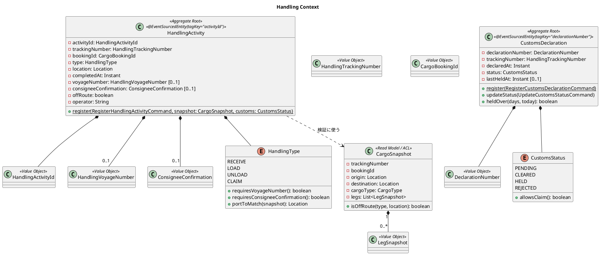

### 荷役種別ごとの要件

要件は `HandlingType` 自身が持ちます。呼び出し側に `if (type == LOAD)` を書かせると、種別が増えたときに書き換える場所が散らばります。

| 種別 | 航海番号 | 荷受人の確認 | 照合する港 | 通関 | 一致しないとき |
| :--- | :--- | :--- | :--- | :--- | :--- |
| `RECEIVE` | 不要 | 不要 | 出発港 | — | 警告し `offRoute = true` で記録 |
| `LOAD` | 必須 | 不要 | 旅程の積込港 | — | 同上 |
| `UNLOAD` | 必須 | 不要 | 旅程の荷降港 | — | 同上 |
| `CLAIM` | 不要 | 必須 | 目的港 | **`CLEARED` のみ許可** | 同上（通関は警告でなく拒否） |

### HandlingActivity 集約の不変条件

| # | 不変条件 |
| :--- | :--- |
| 1 | 種別ごとの必須項目（上表）を満たす |
| 2 | 場所の照合は `CargoSnapshot#isOffRoute` が答える。**一致しなくても記録は拒まない**（現場ではすでに作業が終わっている） |
| 3 | 旅程が無い貨物の `LOAD` / `UNLOAD` は `offRoute` とする（分からないときは予定外に倒す） |
| 4 | `CLAIM` は対象貨物の `CustomsDeclaration` が `CLEARED` のときだけ登録できる。拒否時は現在の通関状態を提示する（US29） |
| 5 | 同一追跡番号・同一種別・同一場所・5 分以内の重複登録は拒否する |
| 6 | `completedAt` は登録時刻以前 |

### CustomsDeclaration 集約の不変条件

| # | 不変条件 |
| :--- | :--- |
| 1 | 追跡番号・申告番号・申告日時は必須。初期状態は `PENDING`。**申告番号の書式は検査しない**（採番するのは税関） |
| 2 | 状態更新には理由が必須。登録も含め、変更はすべてイベントとして残る（監査履歴） |
| 3 | 未決着（`PENDING` / `HELD`）の申告は貨物あたり高々 1 件。`REJECTED` の後は出し直せる。`CLEARED` の後は断る |
| 4 | 留置 3 日超の判定は最新の `HELD` 遷移日時から、日付単位で、業務タイムゾーンで数える |

| コマンド | アクター | 発行イベント | 契約 | UC / US |
| :--- | :--- | :--- | :--- | :--- |
| `RegisterHandlingActivityCommand` | 荷役作業員 | `HandlingActivityRegisteredEvent` | **○** | UC13 / US15・US16 |
| `RegisterCustomsDeclarationCommand` | 荷役作業員 | `CustomsDeclarationRegisteredEvent` | — | UC21 / US29 |
| `UpdateCustomsStatusCommand` | 追跡管理者 | `CustomsStatusUpdatedEvent`、`CustomsStatusChangedEvent` | ○（後者） | UC21 / US29 |

`CargoSnapshot` は Booking の契約イベント（`TrackingNumberIssuedEvent`、`CargoCancelledEvent`）を購読して Handling 側が作る読み取りモデルです。旅程の情報は `TrackingNumberIssuedEvent` に載せます。Booking の型は持ち込みません。

## Billing Context（補完）— billingms

輸送料金の算出・割引・請求・入金を担います。

### ドメインモデル図

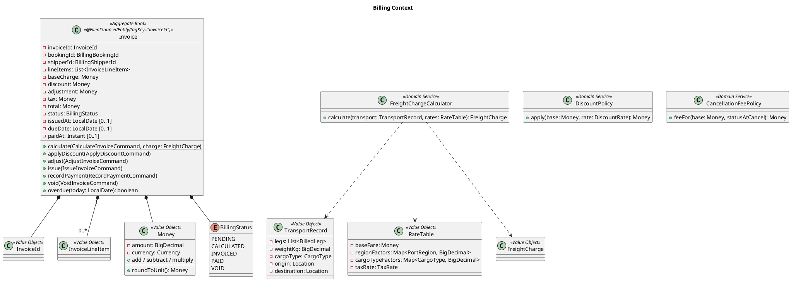

### 料金計算（正典）

```text
基本料金 = 基準運賃 × 区間係数 × 重量係数 × 貨物種別係数
  基準運賃     = 50,000 円（1 区間・1,000kg・一般貨物）
  区間係数     = 区間ごとの地域係数の合計（国内 1.0 / 近海 2.5 / 遠洋 6.0。両端の区分が違えば重いほう）
  重量係数     = 重量（kg）÷ 1,000（下限 0.1）
  貨物種別係数 = GENERAL 1.0 / HAZARDOUS 1.8 / REFRIGERATED 1.5
消費税 = 10%。出発地と目的地の国が異なれば輸出免税（0%）
割引後料金 = 基本料金 × (1 − 割引率)。CORPORATE は 0〜30%、INDIVIDUAL は 0%
キャンセル料 = 基本料金 × 状態別料率（輸送開始前は低率、輸送中は高率 + 陸揚げ実費）
端数は 1 円単位で四捨五入。丸めは Money の中 1 か所だけ
```

Booking の `Quotation` はこの式と同じ値で概算を出します。両者の一致は、同じ入力に対する出力を突き合わせる契約テストで固定します。

### Invoice 集約の不変条件

| # | 不変条件 |
| :--- | :--- |
| 1 | `total = base − discount + adjustment + tax`。通貨は集約内で一貫 |
| 2 | 有効な請求書は予約ごとに 1 通。`VOID` は数えない（投影の `(booking_id, void_marker)` UNIQUE と、作成前の存在確認） |
| 3 | `INVOICED` になるとき `issuedAt` と `dueDate = issuedAt + 30 日` が確定する |
| 4 | 期限超過は列に持たず `overdue(today)` で判定する。期限当日は超過ではない。`today` は業務タイムゾーンで決める |
| 5 | `PAID` になるとき `paidAt` は必須 |
| 6 | `VOID` の請求書は再発行しない。新規に発行する |

| コマンド | アクター | 発行イベント | 契約 | UC / US |
| :--- | :--- | :--- | :--- | :--- |
| `CalculateInvoiceCommand` | `BillingSaga`（`CargoDeliveredEvent` 購読）/ 経理担当者 | `InvoiceCalculatedEvent` | — | UC17 / US21 |
| `ApplyDiscountCommand` | Saga / 経理担当者 | `DiscountAppliedEvent` | — | UC17 / US22 |
| `AdjustInvoiceCommand` | 経理担当者 | `InvoiceAdjustedEvent` | — | UC17 |
| `IssueInvoiceCommand` | 経理担当者 | `InvoiceIssuedEvent` | — | UC18 / US23 |
| `RecordPaymentCommand` | 経理担当者 | `PaymentRecordedEvent` | **○** | UC18 / US23 |
| `VoidInvoiceCommand` | 経理担当者 | `InvoiceVoidedEvent` | — | UC18 |
| `ApplyCancellationFeeCommand` | Saga（`CargoCancelledEvent` 購読） | `CancellationFeeAppliedEvent` | — | UC22 |

## Auth Context（支援）— authms

状態保存です。Event Sourcing は適用しません。

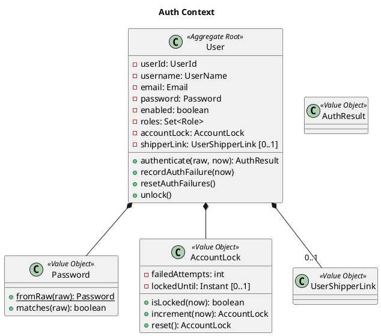

| # | 不変条件 |
| :--- | :--- |
| 1 | `Email` はシステム全体で一意。パスワードは BCrypt ハッシュのみ保持 |
| 2 | 1 つ以上の `Role` を持つ。`enabled = false` は認証拒否 |
| 3 | 認証失敗 5 回連続でロック。ロック中は正しいパスワードでも拒否（US31） |
| 4 | ロック中・認証情報誤り・無効化で**同一のエラーメッセージ**を返す。理由は監査ログにだけ残す |
| 5 | 成功時に失敗回数をリセット。解除は時間経過または `UnlockAccountCommand` |
| 6 | 利用者と荷主の紐付けは `UserShipperLink` だけを正とする。名前やメールの一致で推測しない |

| コマンド | アクター | UC / US |
| :--- | :--- | :--- |
| `LoginCommand` | 全利用者 | UC20 / US26 |
| `LogoutCommand` | 全利用者 | UC20 / US27 |
| `RegisterUserCommand` | システム管理者 | — |
| `UnlockAccountCommand` | システム管理者 | US31 |
| `LinkUserToShipperCommand` / `UnlinkUserFromShipperCommand` | システム管理者 | — |

## ドメインイベント一覧（サービス横断）

### 契約イベント（`shared/contract/event`）

他サービスが購読するイベントです。追記専用で、フィールドの削除・型変更をしません。

| イベント | 発行 | 購読と用途 | 主なフィールド |
| :--- | :--- | :--- | :--- |
| `TrackingNumberIssuedEvent` | bookingms | trackingms（Saga → 追跡開始）、handlingms（`CargoSnapshot`） | `bookingId`, `trackingNumber`, `origin`, `destination`, `cargoType`, `legs[]`, `issuedAt` |
| `CargoCancelledEvent` | bookingms | trackingms（追跡を閉じる）、handlingms（`CargoSnapshot` 更新）、billingms（キャンセル料） | `bookingId`, `trackingNumber?`, `statusAtCancel`, `dischargeLocation?`, `cancelledAt` |
| `HandlingActivityRegisteredEvent` | handlingms | trackingms（状態を進める・誤配検知）、bookingms（一覧の同期投影・`MISROUTED`） | `activityId`, `trackingNumber`, `bookingId`, `type`, `location`, `voyageNumber?`, `completedAt`, `offRoute` |
| `CustomsStatusChangedEvent` | handlingms | trackingms（`HELD` で例外起票） | `declarationNumber`, `trackingNumber`, `from`, `to`, `reason`, `changedAt` |
| `CargoDeliveredEvent` | trackingms | billingms（`BillingSaga` 開始）、bookingms（`DELIVERED`） | `trackingNumber`, `bookingId`, `deliveredAt`, `location` |
| `PaymentRecordedEvent` | billingms | bookingms（`SETTLED`） | `invoiceId`, `bookingId`, `paidAt`, `amount` |

### 契約コマンド（`shared/contract/command`）

Saga が他サービスの集約へ送るコマンドです。数が増えることは結合が増えたことなので、ArchUnit で名簿を固定し、増やすときは ADR を起こします。

| コマンド | 送信 | 宛先 | 用途 |
| :--- | :--- | :--- | :--- |
| `InitializeTrackingCommand` | bookingms `BookingSaga` | trackingms `TrackingActivity` | 追跡開始 |
| `CloseTrackingCommand` | bookingms `BookingSaga` | trackingms `TrackingActivity` | キャンセル時に追跡を閉じる |

### 契約クエリ（`shared/contract/query`）

| クエリ | 送信 | 応答側 | 応答 |
| :--- | :--- | :--- | :--- |
| `FindRouteCandidatesQuery` | bookingms（ACL `RouteCandidateFinder`） | routingms | `List<RouteCandidateDto>` |
| `FindShipperForBillingQuery` | billingms（ACL `ShipperContractFinder`） | bookingms | `ShipperContractDto`（種別・割引率） |

### イベントの流れ

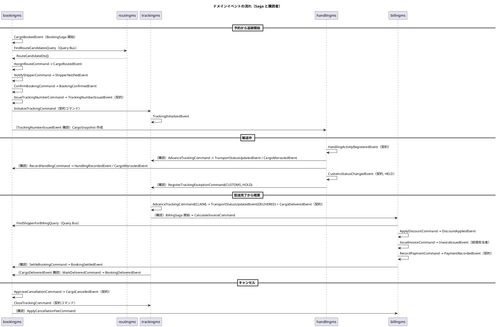

## Saga（業務プロセス）

### BookingSaga（bookingms）

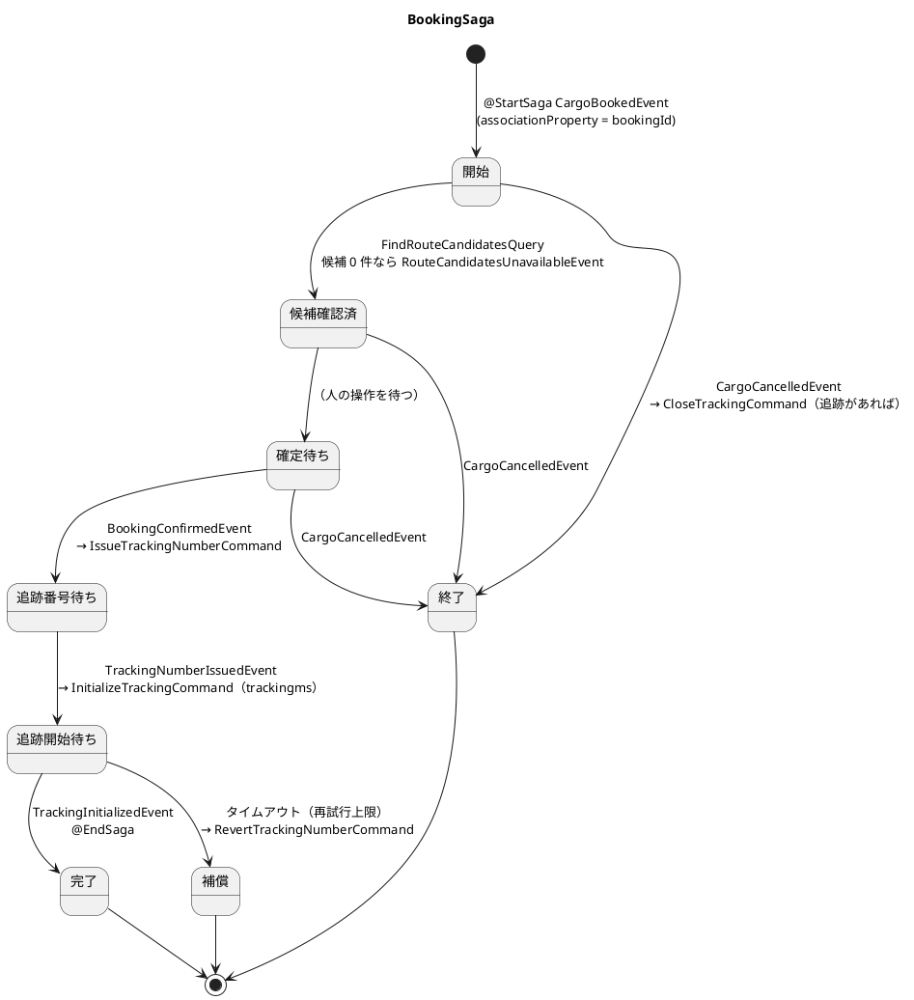

| 起動 | 完了 | 補償 |
| :--- | :--- | :--- |
| `CargoBookedEvent` | `TrackingInitializedEvent` | 追跡の初期化が届かない → 再試行、上限超過で `RevertTrackingNumberCommand`。予約は `CONFIRMED` に留まり、追跡管理者の作業一覧に警告を投影 |

### BillingSaga（billingms）

| 起動 | 完了 | 補償 |
| :--- | :--- | :--- |
| `CargoDeliveredEvent` | `InvoiceCalculatedEvent` + `DiscountAppliedEvent`（以降の発行・入金は経理担当者の操作） | 荷主情報の問い合わせに失敗 → 再試行、上限超過で `InvoiceCreationFailedEvent` を出し経理担当者の作業一覧に写す |
| `CargoCancelledEvent` | `CancellationFeeAppliedEvent` | 同上 |

Saga の再試行と補償は「例外にしない」ではなく「イベントとして残す」で扱います。戻り値を捨てて黙ると、失敗が誰にも見えないまま業務の守りが外れます。

## クエリ一覧（読み取りモデル）

| サービス | クエリ | 戻り型 | UC |
| :--- | :--- | :--- | :--- |
| bookingms | `FindCargoSummariesQuery(shipperId?, status?, page)` | `List<CargoSummaryView>` | UC03・UC04・UC11 |
| bookingms | `FindCargoDetailQuery(bookingId)` | `CargoDetailView` | UC03・UC07・UC11 |
| bookingms | `FindRoutingWorklistQuery()` | `List<RoutingWorkItemView>`（`ROUTING_REQUESTED` の予約） | UC04・UC07 |
| bookingms | `FindCancellationRequestsQuery()` | `List<CancellationRequestView>` | UC22 |
| bookingms | `FindShipperQuery(shipperId)` / `ExistsShipperEmailQuery(email)` | `ShipperView` / `boolean` | UC02 |
| bookingms | `FindQuotationQuery(quotationId)` | `QuotationView` | UC01 |
| routingms | `FindVoyagesQuery(filter)` / `FindVoyageQuery(voyageNumber)` | `List<VoyageView>` / `VoyageView` | UC05・UC19 |
| routingms | `FindRouteCandidatesQuery(spec)`（契約） | `List<RouteCandidateDto>` | UC06 |
| trackingms | `FindTrackingQuery(trackingNumber)` | `TrackingView`（現在状態 + 履歴 + 例外） | UC15 |
| trackingms | `FindPublicTrackingQuery(trackingNumber)` | `PublicTrackingView`（認証不要・荷受人向け） | UC15 |
| trackingms | `FindShipperTrackingsQuery(shipperId)` | `List<TrackingSummaryView>`（自社貨物のみ） | UC15 |
| trackingms | `FindOpenExceptionsQuery()` | `List<ExceptionView>`（緊急を先頭） | UC16 |
| handlingms | `FindHandlingHistoryQuery(trackingNumber)` | `List<HandlingActivityView>` | UC13 |
| handlingms | `FindCustomsDeclarationQuery(trackingNumber)` / `FindHeldDeclarationsQuery()` | `CustomsDeclarationView` / `List<...>`（留置 3 日超を強調） | UC21 |
| billingms | `FindInvoiceQuery(invoiceId)` / `FindInvoicesQuery(filter)` | `InvoiceView` / `List<InvoiceView>`（`overdue` を今日で判定） | UC17・UC18 |

読み取りモデルは画面ごとに作り、他サービスの DB を JOIN しません。予約一覧に荷役の最新状態が要るなら、`HandlingActivityRegisteredEvent` を購読して `cargo_summary` に列を足します。

## トレーサビリティ（UC ↔ 集約・コマンド・イベント）

| UC | 主集約 | 主コマンド | 主イベント |
| :--- | :--- | :--- | :--- |
| UC01 見積作成 | `Quotation` | `CreateQuotationCommand` | `QuotationCreatedEvent` |
| UC02 荷主登録 | `Shipper` | `RegisterShipperCommand`, `AssignCorporateContractCommand` | `ShipperRegisteredEvent`, `CorporateContractAssignedEvent` |
| UC03 貨物予約登録 | `Cargo` | `BookCargoCommand` | `CargoBookedEvent` |
| UC04 予約引渡 | `Cargo` | `RequestRoutingCommand` | `RoutingRequestedEvent` |
| UC05 航海検索 | — | `FindVoyagesQuery` | — |
| UC06 経路候補算出 | — | `FindRouteCandidatesQuery` + `RouteSearchService` | — |
| UC07 経路選択・確定 | `Cargo` | `AssignRouteCommand` | `CargoRoutedEvent` |
| UC08 経路条件調整 | `Cargo` | `AdjustRouteSpecificationCommand`, `ReturnToRoutingCommand` | `RouteSpecificationAdjustedEvent`, `ReturnedToRoutingEvent` |
| UC09 経路情報紐付 | `Cargo` | `AssignRouteCommand` | `CargoRoutedEvent` |
| UC10 確定経路通知 | `Cargo` | `NotifyShipperCommand` | `ShipperNotifiedEvent` |
| UC11 予約確定 | `Cargo` | `ConfirmBookingCommand` | `BookingConfirmedEvent` |
| UC12 追跡番号発行 | `Cargo` → `TrackingActivity` | `IssueTrackingNumberCommand`, `InitializeTrackingCommand` | `TrackingNumberIssuedEvent`, `TrackingInitializedEvent` |
| UC13 荷役作業記録 | `HandlingActivity` | `RegisterHandlingActivityCommand` | `HandlingActivityRegisteredEvent` |
| UC14 貨物状態更新 | `TrackingActivity` | `AdvanceTrackingCommand`, `UpdateTransportStatusCommand` | `TransportStatusUpdatedEvent`, `CargoDeliveredEvent` |
| UC15 追跡情報照会 | — | `FindTrackingQuery`, `FindPublicTrackingQuery` | — |
| UC16 例外処理 | `TrackingActivity` | `RegisterTrackingExceptionCommand`, `ResolveTrackingExceptionCommand` | `TrackingExceptionRegisteredEvent`, `TrackingExceptionResolvedEvent` |
| UC17 輸送料金算出 | `Invoice` | `CalculateInvoiceCommand`, `ApplyDiscountCommand` | `InvoiceCalculatedEvent`, `DiscountAppliedEvent` |
| UC18 精算処理 | `Invoice` → `Cargo` | `IssueInvoiceCommand`, `RecordPaymentCommand`, `SettleBookingCommand` | `InvoiceIssuedEvent`, `PaymentRecordedEvent`, `BookingSettledEvent` |
| UC19 航海スケジュール登録 | `Voyage` | `RegisterVoyageCommand`, `UpdateVoyageScheduleCommand` | `VoyageRegisteredEvent`, `VoyageScheduleUpdatedEvent` |
| UC20 ユーザー認証 | `User` | `LoginCommand`, `UnlockAccountCommand` | （状態保存・監査ログ） |
| UC21 通関申告管理 | `CustomsDeclaration` → `TrackingActivity` | `RegisterCustomsDeclarationCommand`, `UpdateCustomsStatusCommand` | `CustomsStatusChangedEvent`, `TrackingExceptionRegisteredEvent(CUSTOMS_HOLD)` |
| UC22 予約キャンセル | `Cargo` → `TrackingActivity` / `Invoice` | `RequestCancellationCommand`, `ApproveCancellationCommand`, `CloseTrackingCommand`, `ApplyCancellationFeeCommand` | `CargoCancelledEvent`, `TrackingClosedEvent`, `CancellationFeeAppliedEvent` |
| US28 誤配検知・再設計 | `HandlingActivity` → `TrackingActivity` / `Cargo` | `RegisterHandlingActivityCommand`（`offRoute`）, `AssignRouteCommand`（現在地起点） | `CargoMisroutedEvent`, `CargoRoutedEvent` |
| US31 アカウント保護 | `User` | `LoginCommand`（失敗）, `UnlockAccountCommand` | （状態保存・監査ログ） |

## 設計判断

### 集約の粒度

- `Cargo` は `bookingId` 1 件分を境界とし、`Shipper` / `Quotation` は別集約にする。`CancellationRequest` は `Cargo` の内側のエンティティにする（承認の判定が予約状態に依存するため）
- `CargoItinerary` は値オブジェクト。順序・連結の整合は `Cargo` が保証する
- `TrackingException` は解決状態が変わるためエンティティだが、`TrackingActivity` の内側に閉じる
- `HandlingActivity` は 1 作業 1 集約。履歴は投影が持つ。`CustomsDeclaration` は監査履歴が要るため別集約にする
- 経路候補（`RouteCandidate`）は集約にしない。算出は状態を変えないので Query 側のドメインサービスで行う

### 識別子

- すべて値オブジェクト。BC ごとに別の型（`BookingId` / `TrackingBookingId` / `CargoBookingId` / `BillingBookingId`）
- `BookingId` と `TrackingNumber` は bookingms が採番する。`TrackingNumber` は荷主に共有されるため推測されにくい形式（`TRK-` + 大文字英数字 10 桁）
- `ShipperCode` は投影側の採番。集約で MAX+1 しない
- Axon 5 の `@EventSourcedEntity(tagKey)` には識別子の**文字列値**を渡す。イベントの `record` には値オブジェクトでなく文字列として載せ、`@EventSourcingHandler` で値オブジェクトに包み直す（イベントの JSON 形を値オブジェクトの実装から切り離す）

### イベントの設計規則

| 規則 | 理由 |
| :--- | :--- |
| 内部イベントと契約イベントを分ける（`TransportStatusUpdatedEvent` と `CargoDeliveredEvent`） | 内部の形を変えるたびに契約が動くのを防ぐ |
| イベント名は過去形の事実。コマンド名は命令形 | 「何が起きたか」と「何をしてほしいか」を混同しない |
| イベントには判断結果だけを載せ、判断材料を載せない | 再生時に判断をやり直さない |
| `occurredAt` はイベントに載せる。Axon のタイムスタンプに頼らない | リプレイしても業務上の時刻が変わらない |
| 値オブジェクトは JSON 形を固定して載せる。`Money` は `{amount, currency}`、`Location` は UN/LOCODE の文字列 | Upcaster なしで読み続けられる形にする |
| 一意制約（`Email`・`VoyageNumber`・請求書 1 通）は「事前の存在確認 + 投影の UNIQUE + 拒否イベント」の三段で守る | 集約 1 つでは全体の一意性を守れない |

### Axon Framework 5 との対応

| モデル要素 | Axon 5 |
| :--- | :--- |
| 集約ルート | `@EventSourcedEntity(tagKey = "<識別子>")` + `@EntityCreator` |
| 作成系コマンド | `static @CommandHandler`。`EventAppender` で発行 |
| 更新系コマンド | インスタンス `@CommandHandler` |
| 状態復元 | `@EventSourcingHandler`。判断を書かない |
| 集約内エンティティ | 集約のフィールド。イベントで作成・更新 |
| 値オブジェクト | `record`。イベントには JSON 形を固定して載せる |
| ドメインサービス | Spring Bean にせず、コマンドハンドラの引数か Query Handler から呼ぶ純粋なクラス |
| 読み取りモデル | `@EventHandler` 投影 + MyBatis + `@QueryHandler` |
| Saga | `@Saga`（API 名は IT1 スパイクで確定） |
| 契約 | `shared/contract/{event,command,query}` の `record` |

## データモデルとの対応

投影テーブルは `data-model.md` で定義します。本書の集約はテーブルに対応しません。Event Store のスキーマは Axon Server が持ち、`data-model.md` はサービスごとの投影テーブル・`token_entry`・`saga_entry`・Auth の状態テーブルを扱います。

## 参照

- [要件定義](../../requirements/requirements_definition.md)
- [ビジネスユースケース](../../requirements/business_usecase.md)
- [システムユースケース](../../requirements/system_usecase.md)
- [ユーザーストーリー](../../requirements/user_story.md)
- [バックエンドアーキテクチャ](architecture_backend.md)
- [ADR-0001](../../adr/cargo-tracker/0001-cqrs-es-with-axon-in-microservices.md)、[ADR-0002](../../adr/cargo-tracker/0002-event-store-axon-server-and-postgresql-read-models.md)
- [ドメインモデル設計ガイド](../../reference/ドメインモデル設計ガイド.md)
- [ドメインモデル分析レビュー（2026-03-31）](../../review/ドメインモデル分析_review_20260331.md)
- 参照元：`tmp/take-4/docs/design/domain-model.md`、[java-3 ドメインモデル設計](../../article/source/java-3/docs/design/domain-model.md)
