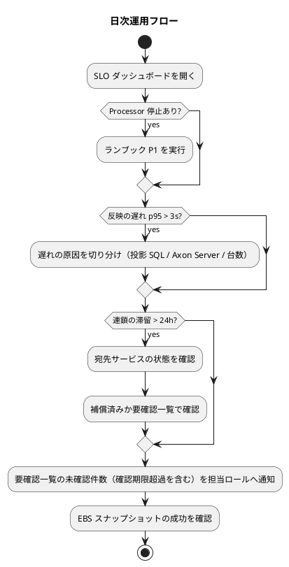

# 運用要件 - 国際貨物輸送管理システム（CQRS / Event Sourcing 版）

## 概要

[CQRS / Event Sourcing のマイクロサービス](architecture_backend.md)（Axon Framework 5 + Axon Server SE）を本番で運用するための要件です。[インフラストラクチャ](architecture_infrastructure.md) と [非機能要件](non_functional.md) を前提に、運用フロー・監視・バックアップと復元・障害対応・変更管理・運用スクリプトを定めます。

CQRS / Event Sourcing に固有の運用は次の 4 つです。

1. **投影のリプレイ**。列の追加・投影の不整合・新しい読み取りモデルの追加はすべてリプレイで対応する。リプレイは日常の操作であり、障害対応ではない
2. **Event Store の復元演習**。Event Store が唯一の真実であり、投影は再構築できる。復元できて初めてバックアップである
3. **Event Processor の遅れと停止**。遅れは利用者から障害に見え、停止は投影が古いまま止まる。どちらも固有の監視項目
4. **連鎖の滞留と補償**。宛先サービスの停止で連鎖が止まる。滞留の一覧化と補償後の要確認一覧への転記

| 参照元 | 採るもの | 変えるもの |
| :--- | :--- | :--- |
| `tmp/take-4/docs/design/operation.md` | 運用体制、日次〜年次の運用フロー、監視カテゴリ、エスカレーション、Axon Server の復元手順、Gulp タスクの一覧、ポストモーテム | Token リセットを「障害対応」でなく日常操作に置き直す。鍵の破棄（crypto-shredding）の手順を追加 |
| `docs/article/source/java-3/docs/design/operation.md` | リリースフロー、ロールバック、セキュリティ運用、アクセス権限棚卸 | RabbitMQ のデッドレター運用を Event Processor と Reaction Handler の運用に置き換える |

## 1. 運用体制

| ロール | 責任 |
| :--- | :--- |
| サービスオーナー | SLO の所有、エラーバジェットの判断、リリース承認 |
| 運用担当（オンコール） | 一次対応、ランブックの実行、エスカレーション |
| 開発チーム | 二次対応、Upcaster・投影の修正、ポストモーテム |
| セキュリティ担当 | 脆弱性の判断、鍵の破棄の承認、アクセス権限の棚卸 |

オンコールは平日 8:00–20:00 JST を主要時間帯とし、夜間・休日は公開追跡照会と Axon Server の停止だけを対象にします。

## 2. 運用フロー

| 頻度 | 作業 |
| :--- | :--- |
| 日次 | SLO ダッシュボード確認（反映の遅れ・Processor 停止・連鎖の滞留・5xx）、要確認一覧（`attention_item`）の未確認件数と**営業日内の確認期限**を過ぎた件数、Event Store ディスク使用率、EBS スナップショットの成功確認 |
| 週次 | 連鎖の滞留の棚卸（24 時間超）、脆弱性走査の結果確認、留置 3 営業日超の通関申告の件数（業務側への通知が届いているか） |
| 月次 | Axon Server のバージョンアップ判断（計画停止）、容量計画の更新、アクセスログの確認、コストレポート |
| 四半期 | **復元演習**（EBS スナップショットから Axon Server を復元し、S3 差分を再投入、全投影をリプレイ、**復元した集約へコマンドを 1 本送って通ること**、RTO 内か計測）、Axon Server 停止時の挙動確認、アクセス権限の棚卸 |
| 年次 | ペネトレーションテスト、保存期間満了の荷主の鍵破棄、DR 訓練（AZ 障害） |



## 3. 監視設計

### 3.1 監視項目

| カテゴリ | 項目 | 閾値 | 重要度 |
| :--- | :--- | :--- | :--- |
| **Event Processor** | 停止（エラーで止まった Processing Group） | 1 件 | **P1** |
| **Event Processor** | 遅れ（最新イベントとの差） | 1,000 イベントまたは 5 分 | P2 |
| **反映** | コマンド → 投影 p95 | 3 秒超が 5 分継続 | P2（画面ヘッダに表示） |
| **連鎖** | 滞留（`process_state.status = 'RUNNING'` が 24 時間超） | 1 件 | P3 |
| **連鎖** | 補償に至った件数 | 1 件 | P3（要確認一覧に転記済みか確認） |
| **要確認** | `attention_item` の未確認件数（投影の拒否・Reaction Handler の失敗・補償）。営業日内の確認期限を過ぎた件数 | 1 件 / 期限超過 1 件 | P3 / P2 |
| Axon Server | 稼働 | 停止 | **P1** |
| Axon Server | 接続数 | 期待数（**業務 5 サービス × 台数**。authms・gatewayms は接続しない）未満、または上限（サービスあたり 50・合計 250）の 80% 超 | P2 |
| Axon Server | Event Store ディスク使用率 | 70% / 85% | P3 / P2 |
| Axon Server | コマンド処理の待ち時間 p95 | 500ms | P3 |
| サービス | 5xx 率 | 1% | P2 |
| サービス | 起動失敗（Axon Server 接続検査で停止） | 1 件 | P2 |
| サービス | CPU / メモリ | 80% | P3 |
| RDS | 接続数・ディスク・フェイルオーバー | — | P2 |
| バックアップ | EBS スナップショット失敗、S3 エクスポートの遅れ（15 分超） | 1 件 | P2 |
| セキュリティ | 認証失敗の急増（10 分で 100 件）、ロックの急増 | — | P2 |

### 3.2 ダッシュボード

| ダッシュボード | 内容 |
| :--- | :--- |
| SLO | 稼働率、反映の遅れ p95、Processor の遅れ、5xx 率、エラーバジェット残 |
| Event Sourcing | Processing Group ごとの位置と遅れ、連鎖の滞留数、Event Store の書き込み速度とディスク |
| 業務 | 要確認一覧の未確認件数（ロール別）、留置 3 営業日超の通関申告、承認待ちのキャンセル申請、期限超過の請求 |

### 3.3 エスカレーション

| 重要度 | 内容 | 初動 | 通知 |
| :--- | :--- | :--- | :--- |
| P1 | Axon Server 停止、Processor 停止、業務画面の全断 | 15 分以内 | 電話 + チャット |
| P2 | 反映の遅れ、5xx、接続数の減少、バックアップ失敗 | 1 時間以内 | チャット |
| P3 | 連鎖の滞留、要確認の未確認、容量 70% | 翌営業日 | チケット |

## 4. バックアップと復元

### 4.1 バックアップ方針

| 対象 | 方式 | 頻度 | 保持 |
| :--- | :--- | :--- | :--- |
| Event Store（Axon Server EBS） | AWS Backup のスナップショット | 1 時間 | 24 時間分 + 日次 7 日 + リリース前 30 日 |
| Event Store（エクスポート） | Axon Server REST API → Lambda → S3（JSON Lines）。**タグを別に書き出す**（下の注） | 5 分間隔 | 1 年 + Glacier 7 年 |
| 投影 DB（RDS） | 自動スナップショット | 日次 | 7 日 |
| `auth_db`（RDS） | 自動スナップショット | 日次 | 7 日 |
| 荷主ごとの暗号化鍵（KMS） | KMS の管理。破棄は監査ログに残す | — | 保存期間満了まで |

**Event Store のイベントは物理削除しない。** 誤ったイベントは補正イベントで打ち消します。

**エクスポートはタグ（DCB の label）を別に書き出します。** Axon Server 2026.0.4 は、書き込んだタグを読み返す口を持ちません（REST の `/v2/dcbEvents/source` も gRPC の `SourceEventsResponse` / `StreamEventsResponse` も、タグを含まない `Event` を返す。[ADR-0001](../../adr/cargo-tracker/0001-cqrs-es-with-axon-in-microservices.md) 決定 5 第 7 項）。**タグの無いイベントを復元しても、集約は読めません。** 件数も内容も一致し、投影のリプレイも成功するのに、その集約に次のコマンドを送った瞬間に空の状態から始まります。

そのため、エクスポートは各イベントの `payload` から集約の識別子を取り出してタグを組み立てて併記します。`payloadContentType=application/json` を指定して取り出します（既定の `application/octet-stream` は payload が base64 になり、識別子を取り出せません）。**タグの組み立ては集約ごとに違うので、集約を足したらエクスポートにも足します。** 対応は `domain-model.md` の `@EventSourced(tagKey)` の一覧を正とします。

**再投入は `id` で重複を除きます。** スナップショットと 5 分間隔のエクスポートは必ず重なりますが、Axon Server の追記は冪等ではなく、同じ `id` のイベントがそのまま 2 件になります。

### 4.2 復元手順

#### A. 投影の不整合・列の追加（日常操作）

```bash
# Processing Group 単位でトークンをリセットしてリプレイする
gulp projection:replay --env staging --service bookingms --group booking-cargo-projection
```

1. 対象の Processing Group が書くテーブルを `data-model.md` の対応表で確認する。**`*-reaction` の Group は対象にしない**（`projection:replay` は `--group` が `-reaction` で終わる場合に拒否する）。Reaction をリセットするとコマンドが再送され、他サービスの集約が動く
2. Event Processor を停止し、対象テーブルを TRUNCATE、トークンをリセット。`attention_item` は投影ではないので TRUNCATE しない
3. Event Processor を再開。遅れが 0 になるまで監視
4. 投影の行数がイベント列から導いた期待値と一致することを確認

所要時間の目安は 100 万イベントで 1.5 時間（200 evt/s）。TRUNCATE 方式ではリプレイ中に該当画面が「反映中」になるため、業務時間外に行います。業務時間内に行う必要がある場合は、新しい投影を別テーブル（`<table>_next`）に作って完了後に切り替え、**古い投影が読める状態を保ちます**（`non_functional.md` 2.3）。

#### B. Axon Server インスタンス障害

1. P1 検知。サービスはコマンドを `503` で返し、クエリは投影から応答している
2. ECS が新タスクを起動し、同じ EBS をアタッチ
3. 接続サービス数が期待数に戻ることを確認
4. Event Processor がトークンから再開し、遅れが 0 になることを確認

#### C. Axon Server ボリューム破損

1. 最新の EBS スナップショットから新ボリュームを作成
2. 新タスクでマウントして起動
3. S3 エクスポートから、スナップショット以降のイベントを再投入（`POST /v2/dcbEvents`）。**`minSequence` による差分の切り出しと再投入は実測済み**（[ADR-0001](../../adr/cargo-tracker/0001-cqrs-es-with-axon-in-microservices.md) 決定 5 第 7 項）。**タグを併記し、`id` で重複を除く**（4.1 の注）
4. 全サービスの投影をリプレイ（A の手順を全投影 Group で。Reaction Group は除く）
5. **復元した集約へコマンドを 1 本送り、通ることを確かめる。** ここを省くと、タグの欠落に気づけない。件数の突き合わせも投影のリプレイも成功してしまう
6. RPO・RTO の実績を記録

#### D. AZ 障害

1. 業務サービスと RDS は別 AZ で継続
2. Axon Server を C の手順で別 AZ に再構築
3. RTO 4 時間以内。実績は演習で計測

#### E. 誤ったイベントの補正

1. 物理削除はしない。補正コマンドで打ち消しイベント（例：`CargoRoutedEvent` に対する `RouteCorrectedEvent`）を発行
2. 集約の `@EventSourcingHandler` が補正イベントを扱えることを確認（無ければ実装が先）
3. 投影は通常どおり追随する。追随しない投影はリプレイ

#### F. Axon Server 停止中の荷役（紙 → 後入力）

Axon Server の停止中はコマンドを受け付けません。荷役作業員は現行どおり**紙（荷役記録票）に作業種別・場所・完了日時・航海番号を書き**、復旧後に S50 から入力します。

1. 停止を荷役の現場に連絡する（P1 の通知先に荷役責任者を含める）
2. 復旧後、記録票の順に S50 で入力する。**完了日時には記録票の過去日時を入れる**（既定の「今」を上書きする）。`RegisterHandlingActivityCommand` は過去日時を受け付ける（集約が弾くのは未来日時と 5 分以内の重複だけ）
3. 入力順が実際の順序と違っても、追跡は `completed_at` 順に並び直す。ただし `CLAIM` は通関状態の判定を伴うため、通関状態の更新を先に入力する
4. 入力済みの記録票に印を付け、二重入力を防ぐ。誤入力は `VoidHandlingActivityCommand` で無効化する（元の記録は残る）

### 4.3 復元演習

| 演習 | 頻度 | 内容 |
| :--- | :--- | :--- |
| 投影のリプレイ | 四半期 | ステージングで全 Processing Group をリプレイし、行数と所要時間を記録 |
| Event Store の復元 | 四半期 | EBS スナップショットから復元し、S3 から差分を再投入。**復元した集約へコマンドを 1 本送って通ること**を合格条件に含める。RPO・RTO を計測 |
| Axon Server 停止時の挙動 | 四半期 | 停止してコマンド `503`・クエリ応答・再接続・再開を確認 |
| DR（AZ 障害） | 年次 | 別 AZ で再構築 |

演習の結果は `docs/journal/cargo-tracker/` に記録し、RTO を超えたら非機能要件を見直します。

## 5. 障害対応

### 5.1 ランブック

| ID | 症状 | 一次対応 | 二次対応 |
| :--- | :--- | :--- | :--- |
| P1 | Processing Group が停止 | ログで失敗したイベントと SQL を確認。投影の不具合ならサービスを一段戻す | 投影の修正 → デプロイ → 該当 Group をリプレイ |
| P2 | 反映の遅れ p95 > 3 秒 | Axon Server の負荷、投影 SQL の遅延、台数を確認 | セグメント数と台数の調整、SQL の計測 |
| P3 | 連鎖の滞留 | 宛先サービスの稼働と `NoHandlerForCommandException` を確認 | 宛先の復旧後に Reaction Handler の再試行を確認。補償済みなら要確認一覧の対応を業務側へ |
| P4 | Axon Server 停止 | 4.2 B | ボリューム破損なら 4.2 C |
| P5 | サービスが起動しない（接続検査で停止） | Axon Server の稼働、context が DCB か（`AXONIQ_AXONSERVER_STANDALONE_DCB=true`）、`axon-server-connector` の依存を確認 | **無音で in-memory に落ちる構成に戻さない** |
| P6 | 要確認（`attention_item`）が急増 | `kind` で切り分ける。`PROJECTION_REJECTED` は UNIQUE 違反の理由を確認し業務側に問い合わせ、`REACTION_FAILED` は宛先集約の状態を確認 | 事前の存在確認が働いていない経路、または Reaction の前提が崩れた状態遷移を修正 |
| P7 | 契約イベントが読めない（購読側で例外） | 発行側の直近リリースで契約が変わったか確認 | 発行側を戻すか、購読側に Upcaster を追加 |
| P8 | 公開追跡照会のスパイク | CloudFront のキャッシュとレート制限を確認 | リードレプリカの追加 |

### 5.2 ポストモーテム

障害後 3 営業日以内に作成し、`docs/journal/cargo-tracker/` に置きます。

```markdown
## サマリ
## タイムライン
## 根本原因
## 短期対応
## 改善アクション（検査に落とすものを含む）
## 学んだこと
```

「学んだこと」は文章にとどめず、同じ変更の中で検査（ArchUnit・統合テスト・監視の閾値）に落とします。落とさなければ守られません。

## 6. 変更管理

### 6.1 リリース手順

1. `main` へのマージで CI がステージングへ配備。Flyway が各サービスの起動時に適用
2. E2E とスモークテスト
3. 承認（サービスオーナー）
4. 本番へ Blue/Green。Green で Axon Server への接続と Processor の再開を確認してから切り替え
5. 切り替え後 30 分、反映の遅れと 5xx を監視

### 6.2 イベントの形を変えるリリース

| 変更 | 手順 |
| :--- | :--- |
| フィールドの追加（NULL 許容） | Upcaster 不要。購読側が先、発行側が後 |
| フィールドの意味・型の変更 | 新しいイベント型を足す。旧型は Upcaster で読み替え。ゴールデン JSON の旧版を残す |
| 契約イベントの追加 | ADR を起こし名簿を更新 → `shared` を先にリリース → 購読側 → 発行側 |
| クラスの移動・改名 | `Revision` + Upcaster。パッケージ移動は無料ではない |

### 6.3 投影のスキーマを変えるリリース

| 変更 | 手順 |
| :--- | :--- |
| 列の追加 | Flyway で NULL 許容の列を追加 → デプロイ → 該当 Group をリプレイ（4.2 A）。**既存行を UPDATE で埋めない** |
| 列の削除 | 次のリリースまで残す（Blue/Green の同時稼働中に Blue が書く） |
| テーブルの追加（新しい読み取りモデル） | Flyway → 新しい Processing Group を追加（設定に明示列挙。列挙漏れは CI で赤） → 最初からリプレイ |
| Reaction Handler の追加 | `*-reaction` の Group を設定に列挙し、**初期トークンを最新（head）に置く**。最初からにするとコマンドが過去分まで送られる |

### 6.4 Axon Server のバージョンアップ

月 1 回以内、業務時間外のメンテナンスウィンドウ（10 分）。手順は 4.2 B と同じで、同一 EBS を再アタッチします。直前に手動スナップショットを取ります。

### 6.5 ロールバック

| 対象 | 手順 |
| :--- | :--- |
| アプリケーション | ターゲットグループを Blue に戻す |
| 投影のスキーマ | 列の追加は戻さない（NULL 許容）。誤った投影はリプレイで直す |
| イベントの形 | **戻せない**。発行済みのイベントは残る。購読側に Upcaster を追加して読めるようにする |
| Flyway | 適用済みファイルは編集しない。戻すなら新しいマイグレーションで |

## 7. 容量管理

| 項目 | 監視 | 拡張トリガー |
| :--- | :--- | :--- |
| Event Store ディスク | 使用率 | 70% で EBS を拡張（オンライン） |
| 投影 DB | ディスク・接続数 | 70% でストレージ拡張、読み取り負荷でリードレプリカ |
| Event Processor | 遅れの傾向 | 通常時の遅れが 100 イベントを超え続けたらセグメント数と台数を増やす |
| Axon Server | CPU・コマンド待ち時間 | 70% でインスタンスタイプを上げる。年間 1,000 万イベントで EE を再評価 |

## 8. セキュリティ運用

| 項目 | 内容 |
| :--- | :--- |
| アクセス管理 | Axon Server 管理 UI と RDS は踏み台経由。四半期に権限を棚卸 |
| 脆弱性 | CI の走査結果を週次で確認。高深刻度は 7 日以内に対応 |
| **鍵の破棄（crypto-shredding）** | 削除要求または保存期間満了で、セキュリティ担当の承認のもと KMS の荷主鍵（`alias/cargo-tracker/shipper/<shipperId>`）を破棄 → `booking-shipper-projection`・`booking-cargo-projection`・`billing-projection` を**全件リプレイ**（荷主単位の部分リプレイはできない） → 投影と復元した集約に個人情報が無いことを確認 → 監査ログに記録。所要時間は 100 万イベントで 1.5 時間（ADR-0003）。削除要求は月に 1 度まとめて業務時間外に処理する |
| 監査ログ | イベントのメタデータ（操作者・`traceId`）と `auth_audit_log` を保持期間まで保存 |
| インシデント | 認証失敗の急増はロックの状況と送信元を確認。必要なら Gateway でレート制限を強化 |

## 9. 運用スクリプト（Gulp タスク）

`operating-script` スキルで実装し、手順書（`docs/operation/cargo-tracker/`）に記載します。手順があるのに一時スクリプトを書きません。

| タスク | 内容 |
| :--- | :--- |
| `gulp projection:replay --env --service --group` | 投影の Processing Group のトークンをリセットしてリプレイ。終了後に行数を検証。`-reaction` の Group は拒否する |
| `gulp projection:status --env` | 全 Processing Group の位置・遅れ・停止の一覧 |
| `gulp reaction:stuck --env --older-than 24h` | 滞留している連鎖の一覧 |
| `gulp axon:backup:snapshot --env` | Axon Server EBS の手動スナップショット（リリース前・バージョンアップ前） |
| `gulp axon:restore --env --snapshot-id` | スナップショットからの復元と S3 差分の再投入 |
| `gulp axon:export:verify --env` | S3 エクスポートに欠落が無いことの検証 |
| `gulp ops:health --env` | 全サービスのヘルスと Axon Server 接続の確認 |
| `gulp ops:drill:restore --env staging` | 復元演習の一括実行（復元 → 全リプレイ → 検証 → 所要時間の記録） |
| `gulp shipper:shred --env --shipper-id` | 荷主鍵の破棄と関連 3 Group の全件リプレイ。所要時間の目安 1.5 時間 / 100 万イベント。開始前に確認プロンプトで所要時間を出す |
| `gulp ops:logs:tail --env --service` | ログの tail |

## 10. 運用 KPI

| KPI | 目標 |
| :--- | :--- |
| 反映の遅れ p95 | < 3 秒（月次） |
| Processor 停止の MTTR | < 30 分 |
| 補償の発生率 | < 0.1% |
| 復元演習の RTO 実績 | < 4 時間（四半期） |
| 要確認の未確認滞留 | 営業日内の確認期限までに 0。3 営業日超は 0 |
| エラーバジェット消費 | 月の 50% を超えたら機能リリースを止め、信頼性の改善を優先 |

## 参照

- [インフラストラクチャ](architecture_infrastructure.md)、[非機能要件](non_functional.md)、[データモデル設計](data-model.md)（Processing Group とテーブルの対応）
- [ADR-0002](../../adr/cargo-tracker/0002-event-store-axon-server-and-postgresql-read-models.md)、[ADR-0003](../../adr/cargo-tracker/0003-crypto-shredding-for-personal-data.md)
- [運用要件定義ガイド](../../reference/運用要件定義ガイド.md)
- 参照元：`tmp/take-4/docs/design/operation.md`、[java-3 運用要件](../../article/source/java-3/docs/design/operation.md)
