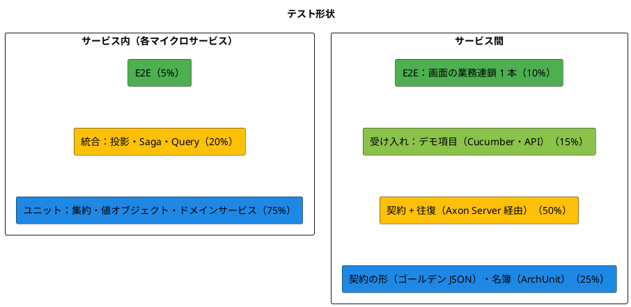
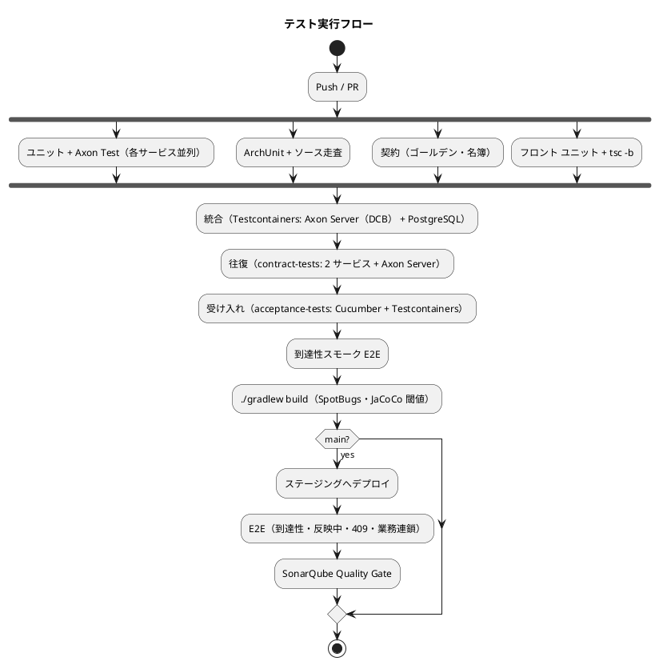

# テスト戦略 - 国際貨物輸送管理システム（CQRS / Event Sourcing 版）

## 概要

[CQRS / Event Sourcing のマイクロサービス](architecture_backend.md)（Axon Framework 5、7 サービス + Gateway）と React SPA のテスト戦略を定めます。

Event Sourcing では「集約が正しい」と「画面に出る」のあいだに投影と Saga が挟まります。集約のユニットテストが全緑でも、投影が動かなければ一覧は空のままで、Saga が届かなければ追跡は始まりません。したがって本戦略は、**集約・投影・Saga・イベント契約・境界・受け入れ（デモ項目）**の 6 種を別々の検査として置き、それぞれが何を判別し何を判別しないかを明記します。

| 参照元 | 採るもの | 変えるもの |
| :--- | :--- | :--- |
| `tmp/take-4/docs/design/test_strategy.md` | Axon Test（`AxonTestFixture`）のレベル、Object Mother、CI 統合、Flaky 対策 | `subscribing` モードやプロファイル除外で投影を「テストから外す」構成をやめる |
| `docs/article/source/java-3/docs/design/test_strategy.md` | ハイブリッド形（サービス内ピラミッド + サービス間ダイヤモンド）、品質ゲート、契約テストと往復テスト、Testcontainers、命名規則 | REST / RabbitMQ の契約を Axon のイベント・コマンド・クエリの契約に置き換える |

**受け入れテスト（Cucumber）は参照元 2 つのどちらにもありません。** 本プロジェクトで足します。[開発戦略](../../development/cargo-tracker/development_strategy.md) が「デモ項目を受け入れ基準とし、緑でなければイテレーションをクローズしない」と定めた以上、デモ項目を実行できる形にする層が要ります。参照元は画面 E2E だけでその役を担わせていましたが、画面を触るたびに業務ルールの検査が巻き添えで落ちます。

## テスト形状の選択

### 評価

| 特性 | 評価 | テストへの含意 |
| :--- | :--- | :--- |
| ドメインの厚さ | 厚い（状態遷移表・料金計算・荷役の妥当性・通関） | 集約のユニットテストが土台 |
| サービス間の結合点 | イベント 11 本・コマンド 2 本・クエリ 1 本（契約。名簿は `domain-model.md`） | 結合点を Axon Server 経由で実際に往復させる検査が要る |
| 非同期の経路 | 集約 → Event Store → 投影 / Saga | 「発行した」と「届いて反映した」は別。統合テストの比重が上がる |
| 画面の到達性 | ロール × 状態で操作が変わる | E2E は業務シナリオでなく到達性と反映待ちに絞る |

### 選択：ハイブリッド形（サービス内ピラミッド + サービス間ダイヤモンド）



サービス内は `java-3` と同じくピラミッドですが、統合の比率を 15% から 20% に上げます。投影と Saga は集約のユニットテストでは判別できないためです。

**比率は目安であり、測定しません。** 守るのは「各レベルに判別する対象がある」ことと品質ゲートであって、件数の割合ではありません。四半期のふりかえりでレベルごとの件数を数え、あるレベルが空なら理由を書きます。

### Axon 5 の API が未確定な箇所の扱い

本戦略は `AxonTestFixture` の組み立て方、`@EventSourced` stereotype の登録、DCB の `tagKey` を Axon Framework 5.3 系の API として前提にしています。これらは IT1 スパイク（ADR-0001 決定 5）で確定します。スパイクが失敗した場合のフォールバックは、(1) 集約の登録は take-4 ADR-0008 の最終決定（`@EventSourced(idType, tagKey)` Spring stereotype）に戻し ArchUnit の許可リストに `EventSourced` を加える、(2) `AxonTestFixture` が組み立てられなければ集約のユニットテストを「イベント列を `@EventSourcingHandler` に直接流して状態を作り、コマンドハンドラを直接呼ぶ」素の JUnit に落とす、(3) いずれも本戦略の判別対象（不変条件・状態遷移・発行イベント）は変えない、の 3 点です。フォールバックを採ったら ADR-0001 を改訂し、本書の該当節を差し替えます。バージョンは固定し、上げるときは同じスパイクを再実行します。

## テストレベルの定義（バックエンド）

### レベル 1：ユニットテスト

| 対象 | 方法 | 判別すること | 判別しないこと |
| :--- | :--- | :--- | :--- |
| 集約 | `AxonTestFixture`（`axon-test`）の Given-When-Then。Given にイベント列、When にコマンド、Then に発行イベントまたは例外 | 不変条件、状態遷移、発行するイベントの内容 | イベントが Event Store に書かれること、投影が動くこと |
| 値オブジェクト | JUnit 5 + AssertJ | 生成時の検証、等価性、丸め（`Money`） | — |
| ドメインサービス | JUnit 5 | 料金計算（式の各項）、経路探索（候補の順序・期限の日付比較） | — |
| 期限の境界値 | `@ParameterizedTest` で **4 点 + 1 点**：期限前日 23:59、期限当日 00:00、期限当日 23:59、翌日 00:00（いずれも `Asia/Tokyo`）に加え、UTC に換算すると日付がずれる 1 点（当日 08:59 JST = 前日 23:59 UTC） | 日付単位の比較が業務タイムゾーンで行われること | — |
| 状態遷移表 | `@ParameterizedTest` で全状態 × 全コマンドを回す | 遷移表と `canTransitionTo` の一致。**列挙に値を足したら全箇所を回る** | — |
| `@EventSourcingHandler` | Given のイベント列から状態を復元し、次のコマンドの判定に使われることを確かめる | 復元の正しさ。**復元で判断しない**こと（例外を投げない） | — |

```java
class CargoTest {

    private AxonTestFixture fixture;

    @BeforeEach
    void setUp() {
        // 組み立て方は IT1 スパイクで確定する（with は ApplicationConfigurer を要求する）
        fixture = AxonTestFixture.with(CargoTestConfiguration.configurer());
    }

    @AfterEach
    void tearDown() {
        fixture.stop();
    }

    @Test
    void 通知していない予約は確定できない() {
        fixture.given()
                .events(CargoEvents.booked("B-001"), CargoEvents.routed("B-001"))
                .when()
                .command(new ConfirmBookingCommand("B-001"))
                .then()
                .exception(IllegalBookingStateException.class)
                .noEvents();
    }

    @Test
    void 期限当日に着く旅程は経路仕様を満たす() {
        fixture.given()
                .events(CargoEvents.booked("B-001", arrivalDeadline("2026-10-15")))
                .when()
                .command(new AssignRouteCommand("B-001", itineraryArrivingAt("2026-10-15T23:30+09:00")))
                .then()
                .success()
                .events(CargoEvents.routed("B-001"));
    }
}
```

「壊して赤」を必ず確かめます。不変条件を 1 つ外して赤くならないテストは、判定を検査していません。

### レベル 2：統合テスト（投影・Saga・Query）

Testcontainers で **Axon Server と PostgreSQL を実際に起動**します。`@EventHandler` の Bean をプロファイルで除外しません。除外すると「投影が動くこと」が検証されないまま緑になります（`take-4` ADR-0008 の教訓）。

| 対象 | 方法 | 判別すること |
| :--- | :--- | :--- |
| 投影 | イベントを `EventGateway` で発行し、投影テーブルの行を待って検証（`Awaitility`） | イベントから行への写し。他サービスの契約イベントの購読 |
| 投影の冪等性（`ProjectionIdempotencyIT`） | 本番の重複を再現する。**同一 `event_id` の再配送**：投影が 1 件処理した後に `token_entry` を 1 件分巻き戻し、同じイベントをもう一度配送する。追記系（`tracking_event`・`handling_activity`・`payment`）は行数が増えないこと（UNIQUE で弾く）、UPDATE 系は古いイベントを後から流しても新しい値を上書きしないこと（`last_event_id` の比較） | 少なくとも 1 回配送に対する冪等性。「同じイベントを 2 度 `publish` する」だけでは判別しない（別の `event_id` になる） |
| 投影とトークン | 投影の SQL を故意に失敗させ、`token_entry` が進まないことを確かめる | 同一トランザクション（**安全装置は破るテストで固定する**） |
| `TransactionManager` | アプリケーションコンテキストに `TransactionManager` Bean が **1 つ**だけあり、`SpringTransactionManager` がそれを受け取っていること | `NoTransactionManager` への無音のフォールバック（take-4 の実測）。`token_entry.mask INTEGER NOT NULL` が Flyway にあること |
| 投影の再構築（`ReplayIT`） | テーブルを TRUNCATE してトークンをリセットし、リプレイ後に同じ行が復元されること。**リプレイ中に `CommandGateway` が一度も呼ばれない**こと（`CommandGateway` をスパイに差し替え、投影 Group のみリセットし Reaction Group はリセットしない） | 投影が派生データであること。リプレイが他サービスの集約を動かさないこと |
| Reaction Handler | 契約イベントを流し、`application/reaction` が送るコマンド（`MarkDeliveredCommand` 等）を `CommandGateway` のスパイで検証。コマンドが失敗した場合に `attention_item`（`kind = REACTION_FAILED`）に記録され、Reaction Group のトークンは進むこと | イベント購読からコマンドへの写し。失敗が投影を止めず、黙って捨てられもしないこと |
| 一意制約の三段 | **存在確認を経由せず**、同じメールの `RegisterShipperCommand` を直接 2 件送る（レース条件の再現）。2 件目が集約には受け付けられ、投影の UNIQUE で弾かれ、`attention_item`（`kind = PROJECTION_REJECTED`、`assigned_role = ROLE_SALES`）に記録されること | 投影が最後の砦であること。逐次登録で 1 段目が止めてしまうと、2 段目と 3 段目は踏まれずに緑になる |
| Saga | 開始イベントを流し、送られるコマンドと終了を検証。補償経路（宛先が居ない・タイムアウト）を 1 本ずつ。**再試行とタイムアウトは `Clock` とスケジューラを差し替え**、「再試行した」「補償に落ちた」のどちらの分岐に入ったかで判定する。経過時間はアサートしない | 業務連鎖と補償。**「例外にしない」は「記録しない」ではない**（失敗がイベントとして残り `attention_item` に写ること） |
| Query Handler | 投影テーブルに行を入れ、`QueryGateway` で問い合わせる | SQL の正しさ、期限超過の判定（`today` を `BusinessClock` から業務タイムゾーン `Asia/Tokyo` で渡す） |
| Controller と HTTP 対応 | `@WebMvcTest` で集約の例外を投げるスタブを置き、`IllegalBookingStateException` → `409`（本文に `lastEvent` と `allowedActions[]`）、業務規則違反 → `422`、未存在 → `404`、認可 → `403`、投影未反映 → `202` を Controller から踏む | 対応表（`architecture_backend.md` の API 設計方針）が実装されていること。無ければ `500` になり、集約の守りが画面から壊れて見える |
| 起動時の接続検査 | Axon Server を止めた状態で起動し、**起動が止まること**。Axon Server は動くが context が DCB でない状態で起動し、**起動が止まること**（Testcontainers に `AXONIQ_AXONSERVER_STANDALONE_DCB=true` を付けた版と付けない版） | 無音で in-memory に落ちないこと（`take-4` ADR-0009）。DCB でない context に繋いで Coordinator が無限再試行しないこと（AXONIQ-2308） |
| MyBatis の方言 | 全 Mapper の SQL を PostgreSQL で実行 | H2 は使わない。方言差の検査は実 DB で行う |

```java
@SpringBootTest
@Testcontainers
class CargoProjectionIT {

    @Container static AxonServerContainer axon = new AxonServerContainer("axoniq/axonserver:2026.x")
            .withEnv("AXONIQ_AXONSERVER_STANDALONE_DCB", "true"); // DCB を有効にしないと tagKey の集約が動かない
    @Container static PostgreSQLContainer<?> db = new PostgreSQLContainer<>("postgres:16");

    @Test
    void 荷役の契約イベントで予約一覧の最新荷役が更新される() {
        eventGateway.publish(CargoEvents.booked("B-001"));
        eventGateway.publish(HandlingContract.registered("B-001", UNLOAD, "SGSIN", offRoute(true)));

        await().atMost(10, SECONDS).untilAsserted(() ->
                assertThat(mapper.findDetail("B-001").lastHandling())
                        .satisfies(h -> {
                            assertThat(h.type()).isEqualTo("UNLOAD");
                            assertThat(h.offRoute()).isTrue();
                        }));
    }
}
```

### レベル 3：契約テスト（サービス間）

契約は `shared/contract/{event,command,query}` の型と JSON 形です。`java-3` が RabbitMQ の交換機に対して置いた検査を、Axon のメッセージに対して置きます。

| 検査 | 内容 | 置き場 |
| :--- | :--- | :--- |
| ゴールデン JSON（丸ごと一致） | 契約イベント・コマンド・クエリごとに「今の JSON 形」をファイルで固定し、シリアライズ結果を**文字列として丸ごと**比較する（キー集合・順序・型を含む）。フィールドの追加・改名・削除はこれで赤になる | `shared/src/test` |
| ゴールデン JSON（往復） | ゴールデンの JSON からデシリアライズし、再シリアライズして元と一致する | `shared/src/test` |
| 全リビジョンの保持 | `Revision` を上げても旧版のゴールデンを消さない（`<Event>.r1.json`, `<Event>.r2.json`）。Upcaster の検査が旧版を読む | `shared/src/test/resources/golden/` |
| 発行側の契約（`BookingSide<契約名>ContractTest`） | 発行側の集約が出すイベントがゴールデンと丸ごと一致する | 各発行サービス |
| 購読側の契約（`TrackingSide<契約名>ContractTest` 等） | 購読側の投影・Saga・Reaction がゴールデンの JSON から復元して処理できる | 各購読サービス |
| 往復 | 発行側の集約に実際のコマンドを送り、購読側の投影が更新されるまでを **Axon Server 経由**で確かめる。契約イベント 1 本につき 1 本（11 本） | `apps/backend/contract-tests`（両サービスを起動） |
| Upcaster | 旧形式の JSON（ゴールデンの旧版）を Upcaster で読み替え、新形式で復元できる | 各サービス |
| 名簿 | `shared/contract` の型の一覧を ArchUnit で固定。増えたら赤。ADR を起こして名簿を更新する | `shared/src/test` |
| 個人情報の名簿 | 個人情報フィールドを持つイベントが `ShipperRegisteredEvent`・`ShipperContactUpdatedEvent` 以外に無いこと。ゴールデンは論理形（平文）と物理形（暗号化後のエンベロープ）を分けて固定する（ADR-0003） | `shared/src/test` |

**両側が同じ 1 つを読む**ことと、**片側だけでは守れない**ことを同時に守ります。発行側だけのゴールデンは、購読側が別の形を期待していても緑になります。往復だけでは、フィールドを足しても両側が同じコードを使う限り緑になります。だから丸ごと一致と往復を分けます。

ゴールデンを置いたら**「壊して赤」を一度確かめます**。契約の型にフィールドを 1 つ足して丸ごと一致が赤になること、ゴールデンのキーを 1 つ改名して往復が赤になることを、ゴールデンを最初に置く変更の中で確認し、コミットメッセージに書きます。

`apps/backend/contract-tests` はテスト専用のサブプロジェクトで、業務サービスではありません。ADR-0001 の「`settings.gradle.kts` の include が 8 つと一致」の検査は、テスト専用（`contract-tests`）を除いた業務プロジェクトを数えます（ADR-0001 に明記）。`contract-tests` は CI の「往復」段で、対になる 2 サービスと Axon Server を起動して実行します。

### レベル 4：境界の検査（ArchUnit + ソース走査）

| ルール | 内容 |
| :--- | :--- |
| レイヤー依存 | `domain` は Spring・MyBatis に依存しない。Axon は `..annotation..` と `EventAppender` の許可リストのみ |
| 共有カーネルの範囲 | `shared` に置けるパッケージの名簿（`domain/model`・`domain/auth`・`contract/*`・`infrastructure/axon`） |
| サービス間の依存 | 各サービスは `shared` 以外の他サービスのパッケージに依存しない |
| コマンドの送信箇所 | `CommandGateway` を使えるのは `interfaces`・`application/saga`・`application/reaction` だけ。`infrastructure/projection` は SQL に写すだけで、`CommandGateway` を参照しない |
| 契約の向き | 契約イベント・コマンド・クエリを送る（`CommandGateway#send`、`EventAppender`、`QueryGateway#query`）または購読する（`@EventHandler`、`@CommandHandler`、`@QueryHandler`）メソッドの引数型が、自サービスの内部型でも `shared/contract` でもない場合は赤。サービスをまたぐものは `shared/contract` の型に限る |
| 業務タイムゾーン | `BusinessClock` Bean（`Asia/Tokyo`）を `shared` に 1 つだけ置く。`Clock.systemUTC()`・`Clock.systemDefaultZone()`・`LocalDate.now()`・`LocalDateTime.now()`・`Instant.now()` の直呼びは `domain`・`application`・`interfaces` で赤（時刻は `BusinessClock` から取る） |
| 同期の状態変更ポート | 名簿が空であること（`java-2` `CrossContextPortPolicyTest` の逆） |
| `RestClient` の禁止 | `infrastructure/acl` で REST を使わない（サービス間は Axon Server だけ） |
| 4 系 API | `org.axonframework.modelling.command..` への参照が無い（コンパイルで止まるが、念のため） |
| authms の Event Sourcing 禁止 | `auth` パッケージに `@EventSourcedEntity` が無い |
| Event Processor のモード | 設定ファイルを走査し、`mode` が `pooled` 以外にならない |
| Processing Group の列挙 | 設定ファイルに `data-model.md` の対応表の全 Group（投影 + `*-reaction`）が明示的に列挙されていること。コード側の `@ProcessingGroup` と突合し、**列挙漏れ（既定値に落ちる Group）が赤** |
| Reaction の置き場 | `@ProcessingGroup("*-reaction")` を持つクラスは `application/reaction` にだけあり、`@ProcessingGroup("*-projection")` を持つクラスは `infrastructure/projection` にだけある |
| データソース | 各サービスの `spring.datasource.url` が自サービスの DB だけを指す |
| Processing Group の書き手 | 1 テーブルを書く Mapper が 1 つの Processing Group からしか呼ばれない（`data-model.md` の対応表を読んで突合） |
| Flyway | 適用済みファイルの checksum を CI で比較し、編集されていたら赤 |

**名簿方式は「載っていないもの」を通さない**ように書きます。「載っているものが正しい」だけの検査は、載せ忘れたものほど漏れます。名簿の向きは「載っていれば正しい」ではなく「`shared/contract` 以外の型でサービスをまたいだら赤」です。

ArchUnit ルール自体のメタテストは、**実コードと同じ形のフィクスチャ**（Spring の stereotype、Axon のアノテーション、パッケージ構成を実サービスと同じにした違反例）で行います。「最小の違反例」だけだとメタテストが緑でも実コードの違反を見逃します（Flix IT2 の教訓）。

### レベル 5：受け入れテスト（Cucumber・API）

**デモ項目をそのまま実行できる形にする層です。** 各 `iteration_plan-N.md` のデモ項目は「誰が・何を操作し・何が起きるか」で書かれているので、Gherkin の Feature にほぼそのまま写せます。イテレーションのクローズ判定（デモ項目テストが全緑）をここで自動化します。

**なぜ画面 E2E と分けるか。** Playwright は画面の到達性・反映中・`409` の**見え方**を判別します。Cucumber は業務ルールと連鎖（通知していない予約は確定できない、通関済でないと引取できない、承認後の陸揚げまで追跡が閉じない）を判別します。壊れ方が違うので、画面を触るたびに業務ルールの検査が巻き添えで落ちる形にしません。画面 E2E はステージングでリリース前に回りますが、Cucumber は CI の Testcontainers で回るため、フィードバックも早くなります。

| 項目 | 内容 |
| :--- | :--- |
| 実行対象 | `gatewayms` 経由の REST API。画面を通さない |
| 実行環境 | Testcontainers（Axon Server（DCB 有効）+ PostgreSQL）+ 対象サービスの起動。デモ項目が複数サービスに跨るため、専用サブプロジェクト `apps/backend/acceptance-tests` に置く |
| 記法 | Gherkin。`# language: ja` で日本語（`前提` / `もし` / `ならば` / `かつ`）。用語は [ドメインモデル設計](domain-model.md) のユビキタス言語に揃える |
| 反映の待ち | `Awaitility` で投影の反映を待つ。**`sleep` を書かない。** 共通ステップ「`ならば N 秒以内に ...`」に閉じ、個々のシナリオに待ち方を書かせない |
| 判別すること | 業務ルール、サービス越しの連鎖、拒否の理由（`409` / `422` の本文）、反映が起きること |
| 判別しないこと | 画面の見え方、到達性、アクセシビリティ（レベル 6） |

```gherkin
# language: ja
機能: 荷主の登録

  シナリオ: 同じメールアドレスの荷主は要確認一覧に出る
    前提 営業担当者 "sales01" でログインしている
    かつ メールアドレス "shipper@example.com" の荷主 "山田商事" が登録されている
    もし メールアドレス "shipper@example.com" で荷主 "山田商事（新）" を登録する
    ならば 受付は成功する
    かつ 5 秒以内に要確認一覧に "メールアドレスの重複" が 1 件現れる
    かつ その要確認の担当ロールは "ROLE_SALES" である
```

**デモ項目と Feature は 1 対 1 に対応させます。** `iteration_plan-1.md` のデモ項目 #4 が `shipper-registration.feature` のシナリオ 1 本、という形です。対応は各イテレーション計画の完了条件に置き、**緑でなければイテレーションをクローズしません**。

**追加した Feature は以降のすべての IT で回します。** 過去のデモ項目が壊れたら、それは新しい変更の責任です。IT が進むと Feature が積み上がるので、実行時間が 10 分を超えたらタグ（`@it1` `@it7`）で分割し、PR では変更に関わるサービスのタグだけ、マージ時は全件を回します。

**失敗する側も書きます。** デモ項目が「拒否 → 成功」のペアで書かれているので、シナリオもその順で並べます。拒否のシナリオが無い Feature は、安全装置が働くことを検査していません。

### レベル 6：E2E（画面）

| 対象 | 方法 | 内容 |
| :--- | :--- | :--- |
| 業務連鎖（画面） | Playwright（ステージング） | 予約 → 経路 → 通知 → 確定 → 追跡番号 → 荷役 → 引取 → 請求 → 入金 → 精算済 を **画面から** 1 本。業務ルールそのものはレベル 5（Cucumber）が判別済みなので、ここは**画面から通しで操作できること**だけを見る。**反映待ちのヘルパ**（`waitForProjected(bookingId)`）を共有し、`sleep` を書かない |
| 到達性 | Playwright | ロール × 画面（サイドナビとダッシュボードから開けるか）、状態 × 操作（その状態のレコードからボタンが出て押せるか）、認証不要の入口（ログイン画面とポータルから公開追跡へ） |
| 反映中 | Playwright | 登録直後の詳細で「反映中」が出て、`200` で消えること。30 秒で再読込ボタンに切り替わること（Event Processor を止めて確かめる） |
| 409 | Playwright | 2 つのブラウザで同じ予約を開き、片方が「経路設計へ戻す」後にもう片方が「確定」を押して、`role="alert"` で「状態が変わっています」と直前の操作（誰が・いつ・何を）と押せる操作が出ること |
| 409（キーボードのみ） | Playwright | マウスを使わず Tab / Enter だけで上記を再現し、`aria-disabled` のボタンからフォーカスが消えないこと、`alert` が読み上げ対象になること |
| 日時 | 共有ヘルパ | テストデータの日時は業務タイムゾーン `Asia/Tokyo` で作る。CI（UTC）で 1 日中落ちる `toISOString()` を使わない。**TZ=UTC で一度回す** |

到達性 E2E のうち「ロール × サイドナビ」と「認証不要の入口」のサブセットを **PR マージ時のスモーク**として回します（`reachability-smoke.spec.ts`、5 分以内）。リリース直前まで残すと手戻りが大きいためです。

### レベル 7：性能・復元演習

`non_functional.md` の目標値に対応する検査です。CI では回さず、頻度と手段を固定します。定義しただけの目標は守られません。

| 要件 | 手段 | 頻度 | 判別すること |
| :--- | :--- | :--- | :--- |
| 反映の遅れ p95 < 3 秒 | k6 でコマンドを流し、詳細が `202` → `200` になるまでを計測 | リリース前 + 月次 | 投影の SQL とセグメント数が規模に合っていること |
| 一覧 p95 < 800ms | k6（ピーク 200 req/s） | リリース前 + 四半期 | 索引の有無 |
| RTO 4 時間・RPO 1 時間 | 復元演習（`gulp ops:drill:restore`）で所要時間を記録 | 四半期 | バックアップから復元できること |
| 個人情報の削除 | 鍵の破棄 → リプレイ → 投影と復元集約に個人情報が無いこと | リリース前 + 年次 | ADR-0003 の決定 |

## テストレベルの定義（フロントエンド）

| レベル | ツール | 対象 |
| :--- | :--- | :--- |
| ユニット | Vitest + Testing Library | Presentational、Hooks（`202` → `pending`、ポーリングの停止、無操作タイムアウト） |
| 統合 | Vitest + MSW | Container + API クライアント。**MSW のモックは本物より甘くしない**（OpenAPI の型・日付形式に合わせ、`202` / `409` / `422` を返せる） |
| E2E | Playwright | 上記 |
| 型 | `tsc -b` | `tsc --noEmit` はプロジェクト参照構成では何も検査しない |

## カバレッジ目標と品質ゲート

### カバレッジ（バックエンド、サービスごと・レイヤー別）

| レイヤー | 行カバレッジ | 備考 |
| :--- | :--- | :--- |
| `domain` | 90% | 集約・値オブジェクト・ドメインサービス |
| `application` | 85% | Saga・ポート |
| `infrastructure` | 70% | 投影・Query Handler・ACL。統合テストで計測 |
| `interfaces` | 60% | Controller |
| 全体 | 80% | JaCoCo。レイヤー別の閾値をビルドに置く |

レイヤー別の集計は、JaCoCo の `violationRules` にパッケージの `includes`（`..domain..`、`..application..`、`..infrastructure..`、`..interfaces..`）を分けた rule を 4 つ置き、`jacocoTestReport` はユニットと統合（`integrationTest` タスク）の実行データを `executionData` で合算して 1 レポートにします。`infrastructure` の投影・Query Handler は統合テストでしか通らないため、合算しないと閾値に届きません。

フロントエンドは Hooks 90%、コンポーネント 70%、全体 75%。

### 品質ゲート

| ゲート | 基準 | タイミング |
| :--- | :--- | :--- |
| ユニット・Axon Test | 失敗 0 | PR |
| ArchUnit・ソース走査 | 違反 0 | PR |
| 契約（ゴールデン・名簿） | 失敗 0 | PR |
| 統合（Testcontainers） | 失敗 0 | PR マージ |
| 往復（Axon Server 経由・`contract-tests`） | 失敗 0。**`shared` を変更する PR は全サービスの往復を通す** | PR マージ |
| **受け入れ（Cucumber・当該 IT のデモ項目）** | 失敗 0。**緑でなければイテレーションをクローズしない** | PR マージ |
| 到達性スモーク E2E | 失敗 0 | PR マージ |
| カバレッジ | 上表 | PR マージ |
| `./gradlew build`（SpotBugs 含む） | 成功 | PR。**ローカルも同じコマンド** |
| SonarQube Quality Gate | Passed。Bug・Vulnerability 0。Security Hotspot は中身を読んでから判断 | リリース前 |
| E2E | 失敗 0 | リリース前 |

**たまに落ちるテストは 2 回目で追います。** 再実行で通ることを理由に進めると、本物の赤も見逃します。

## テストデータ

| 手段 | 用途 |
| :--- | :--- |
| Object Mother（`CargoEvents.booked(...)`、`HandlingContract.registered(...)`） | イベント列の組み立て。**契約イベントの Object Mother は `shared` の testFixtures に置き、両側が同じものを使う** |
| Test Data Builder | 値オブジェクトの組み立て |
| ゴールデン JSON | 契約の形の固定。全リビジョンのファイルを残す |
| 採番 | レベルごとに使い分ける。ユニット（`AxonTestFixture`）は Object Mother の固定値（`B-001`、`SHP-000001`）で読みやすさを優先する。統合・往復・E2E は本番の経路（投影のシーケンス、集約の採番）で採る。MAX+1 の自前採番はしない |
| 日時 | `BusinessClock`（`Asia/Tokyo`）のテスト用実装を `shared` の testFixtures に置き、テストも同じ `Clock` で「今日」を決める |

## TDD の運用

| 局面 | アプローチ |
| :--- | :--- |
| 集約 | インサイドアウト。`AxonTestFixture` の Given-When-Then から書く。不変条件 1 つにつきテスト 1 つ |
| 投影・Query | 統合テストから書く（Testcontainers）。イベントを流して行を待つ |
| Saga | 統合テストから書く。正常 1 本と補償 1 本を対で |
| 契約 | ゴールデン JSON を先に置き、発行側と購読側の両方を赤から始める |
| 画面 | アウトサイドイン。Playwright の到達性テストから書き、MSW の統合テスト、ユニットへ降りる |

「〜しない」「〜まで確かめる」というコメントを書いたら、同じ変更の中で赤になる検査も書きます。宣言しただけで守った気になるためです。

## CI/CD との連携



| 項目 | 目標 |
| :--- | :--- |
| ユニット + Axon Test | 3 分以内（サービスごと） |
| 統合 + 往復 | 10 分以内 |
| 受け入れ（Cucumber） | 10 分以内。超えたらタグで分割する |
| E2E | 15 分以内 |
| 失敗時 | 赤の原因が一意に分かること。セキュリティ走査の導入失敗と検出を同じ赤にしない |

## トレーサビリティ

受入基準は書き写さず、`user_story.md` の項番で引用します（「US18 §受入基準 4」は US18 の受入基準の 4 番目）。正典が変わっても本表は追随し、書き写した条件が古いまま「未達」を記録し続けることを防ぎます。

受入基準からの追跡がこの表、**デモ項目からの追跡は `iteration_plan-N.md` のデモ項目 ↔ `.feature` のシナリオの 1 対 1 対応**（レベル 5）です。前者は「ストーリーが満たされたか」、後者は「イテレーションをクローズしてよいか」を見ます。

| US | 引用する受入基準 | 主な検査 |
| :--- | :--- | :--- |
| US01 見積作成 | §受入基準 2〜5 | `QuotationTest`（候補 0 件でも 1 行）、`QuotationEstimatorTest`（概算の式）、`RouteCandidatesRoundTripIT`（Query Bus 往復）、`QuotationProjectionIT` |
| US02 荷主登録 | §受入基準 2, 3 | `ShipperTest`、`ShipperUniquenessIT`（三段：直接コマンド 2 件 → `attention_item`）、`ShipperProjectionIT`（`shipper_code` の採番）、`ShipperShredIT`（ADR-0003） |
| US03 法人荷主 | §受入基準 2, 4 | `ShipperTest`（割引率 0〜30%）、`BillingSideCorporateContractAssignedContractTest`、`CorporateContractAssignedRoundTripIT` |
| US04 予約登録 | §受入基準 4, 6 | `CargoTest`、`CargoProjectionIT`、E2E（反映中。予約番号はコマンド応答で即返る） |
| US05 危険物・冷凍 | §受入基準 1〜3 | `CargoTest`（必須項目）、`RouteSearchServiceTest`（対応航海だけを候補に） |
| US06 引き渡し | §受入基準 2, 4 | `CargoTest`（`ROUTING_REQUESTED` への遷移）、E2E（到達性：経路設計者の作業一覧） |
| US07 航海検索 | §受入基準 3〜7 | `VoyageQueryIT`（条件・0 件・貨物種別の絞り込み）、`UnLocodeTest` |
| US08 経路候補 | §受入基準 1, 4〜6 | `RouteSearchServiceTest`（順序・直行優先・期限内 0 件）、`RouteCandidatesRoundTripIT` |
| US09 経路確定 | §受入基準 2, 3 | `CargoTest`（期限当日着・境界値 4+1 点）、`CargoProjectionIT`（`cargo_leg` の入れ替え） |
| US10 条件調整 | §受入基準 2〜4 | `RouteSearchServiceTest`（期限延長）、`CargoTest`（`ROUTING_REQUESTED` へ戻す） |
| US11 紐付け | §受入基準 2, 3 | `CargoTest`（`assignRoute` の端点・期限の不変条件） |
| US12 通知 | §受入基準 3, 4 | `CargoTest`（`ShipperNotifiedEvent` に宛先・要約）、`CargoProjectionIT`（通知履歴） |
| US13 確定 | §受入基準 2, 4 | `CargoTest`（通知していない予約は確定できない、戻す）、`BookingControllerTest`（409 の本文）、E2E（409・キーボードのみ） |
| US14 追跡番号 | §受入基準 1〜3 | `BookingSagaIT`（追跡開始と補償・`Clock` 差し替え）、`BookingSideTrackingNumberIssuedContractTest` / `TrackingSideTrackingNumberIssuedContractTest`、`TrackingNumberIssuedRoundTripIT`、`TrackingInitializedRoundTripIT` |
| US15 荷役記録 | §受入基準 1〜4, 6, 7 | `HandlingActivityTest`（種別ごとの要件・`offRoute`・冪等キー `activityId`）、`TrackingActivityTest`（`afterHandling`）、`HandlingActivityRegisteredRoundTripIT`、`HandlingActivityVoidedRoundTripIT`、`CargosOnVoyageQueryIT`（航海番号起点） |
| US16 引取 | §受入基準 2〜4 | `HandlingActivityTest`（`CLAIM` の荷受人確認）、`TrackingActivityTest`（`CLAIMED`）、`CargoDeliveredRoundTripIT`（`booking-reaction` → `BookingDeliveredEvent`） |
| US17 手動更新 | §受入基準 2, 3 | `TrackingActivityTest`（手動遷移表）、`TrackingProjectionIT`（`tracking_event` に `MANUAL`） |
| US18 追跡照会 | §受入基準 1〜5 | `TrackingQueryIT`（履歴の順序・見つからない）、E2E（認証不要の入口：ログイン画面とポータルから） |
| US19 遅延例外 | §受入基準 1, 2, 5 | `TrackingActivityTest`（`EXCEPTION` と復帰）、`TrackingProjectionIT`（残り N 件） |
| US20 破損・紛失 | §受入基準 1〜3 | `ExceptionTypeTest`（`LOSS` は `urgent`）、`TrackingQueryIT`（LOSS → 残日数順）、E2E（`ROLE_HANDLER` が破損・紛失を起票できる） |
| US21 料金算出 | §受入基準 1, 3, 5, 6 | `FreightChargeCalculatorTest`（各項・輸出免税・丸め）、`InvoiceTest`（調整行に `basisExceptionId`）、`BillingSagaIT` |
| US22 法人割引 | §受入基準 1〜4 | `InvoiceTest`（割引率の複写）、`ShipperContractSnapshotProjectionIT`（契約イベント購読）、`QuotationEstimatorConsistencyTest`（見積と請求の式と料率が同一。両サービスの実際の設定ファイルを読む） |
| US23 精算 | §受入基準 1, 4 | `InvoiceTest`、`InvoiceQueryIT`（期限超過の日付判定・境界値 4+1 点）、`PaymentRecordedRoundTripIT`（`booking-reaction` → `BookingSettledEvent`） |
| US24 航海登録 | §受入基準 3〜5 | `VoyageTest`（日付の整合・寄港地の順序）、`VoyageUniquenessIT`（三段） |
| US25 航海更新 | §受入基準 2, 3, 5 | `VoyageTest`（差分は丸ごと比べる）、`VoyageProjectionIT`（`carrier_movement` の入れ替え） |
| US26 ログイン | §受入基準 1, 3, 5, 6 | `UserTest`、`AuthControllerIT`（同一メッセージ・403）、E2E（到達性：未ログインはログイン画面へ） |
| US27 ログアウト | §受入基準 1, 2 | フロント ユニット（`sessionStorage` の破棄）、E2E（ブラウザバックで戻れない） |
| US28 誤配 | §受入基準 1, 2, 5 | `HandlingActivityTest`（`offRoute` の警告）、`TrackingActivityTest`（`MISROUTED`）、`RouteSearchServiceTest`（`departFrom` 指定時は期限超過候補も `overdueDays` つきで返す）、E2E（S22 → S31） |
| US29 通関 | §受入基準 3, 5, 6 | `CustomsDeclarationTest`（未決着 1 件・留置は営業日で数える・`heldBusinessDays`）、`HandlingActivityTest`（`CLEARED` 以外の引取拒否と `customsStatusAsOf`）、`CustomsStatusChangedRoundTripIT` |
| US30 キャンセル | §受入基準 1, 5, 6, 8 | `CargoTest`（状態ごとの即時 / 申請）、`CancellationDecisionTest`（陸揚げ地は現在地または残りの寄港地）、`TrackingActivityTest`（陸揚げ地の `UNLOAD` まで閉じない）、`CargoCancelledRoundTripIT`、`TrackingClosedRoundTripIT` |
| US31 アカウント保護 | §受入基準 1, 2, 5, 8 | `UserTest`（5 回でロック・同一メッセージ）、`AuthControllerIT`（認可が入力検証より先） |
| 横断 | — | `ArchitectureTest`（名簿・向き・`BusinessClock`・Processing Group の列挙）、`ProjectionIdempotencyIT`、`TokenTransactionIT`、`TransactionManagerIT`、`ReplayIT`（`CommandGateway` が呼ばれない）、`StartupWithoutAxonServerIT`、`StartupWithoutDcbIT` |

## テスト命名規則

| 種別 | 規則 | 例 |
| :--- | :--- | :--- |
| ユニット | `<対象>Test`、メソッドは日本語で振る舞い | `CargoTest.通知していない予約は確定できない` |
| 統合 | `<対象>IT` | `CargoProjectionIT` |
| 契約 | `<側><契約名>ContractTest`。側の接頭辞（`BookingSide` / `TrackingSide` / `HandlingSide` / `BillingSide` / `RoutingSide`）で赤の出所が一意に分かる | `BookingSideTrackingNumberIssuedContractTest`, `TrackingSideTrackingNumberIssuedContractTest` |
| 往復 | `<契約名>RoundTripIT` | `HandlingActivityRegisteredRoundTripIT` |
| 受け入れ | `<機能>.feature`（`acceptance-tests/src/test/resources/features/`）。ステップ定義は `<機能>Steps`。IT のタグ（`@it1`）を Feature に付ける | `shipper-registration.feature`, `ShipperRegistrationSteps` |
| E2E | `<画面 or シナリオ>.spec.ts`。PR スモークは `-smoke` を付ける | `reachability.spec.ts`, `reachability-smoke.spec.ts`, `pending-projection.spec.ts` |

## 参照

- [バックエンドアーキテクチャ](architecture_backend.md)、[フロントエンドアーキテクチャ](architecture_frontend.md)
- [ドメインモデル設計](domain-model.md)（不変条件・契約の名簿）、[データモデル設計](data-model.md)（Processing Group とテーブルの対応）
- [ADR-0001](../../adr/cargo-tracker/0001-cqrs-es-with-axon-in-microservices.md)（コンプライアンスの検査）、[ADR-0003](../../adr/cargo-tracker/0003-crypto-shredding-for-personal-data.md)（crypto-shredding の検査）
- [テスト戦略ガイド](../../reference/テスト戦略ガイド.md)
- 参照元：`tmp/take-4/docs/design/test_strategy.md`、[java-3 テスト戦略](../../article/source/java-3/docs/design/test_strategy.md)
