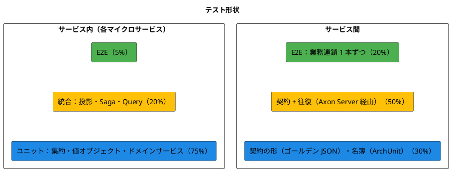
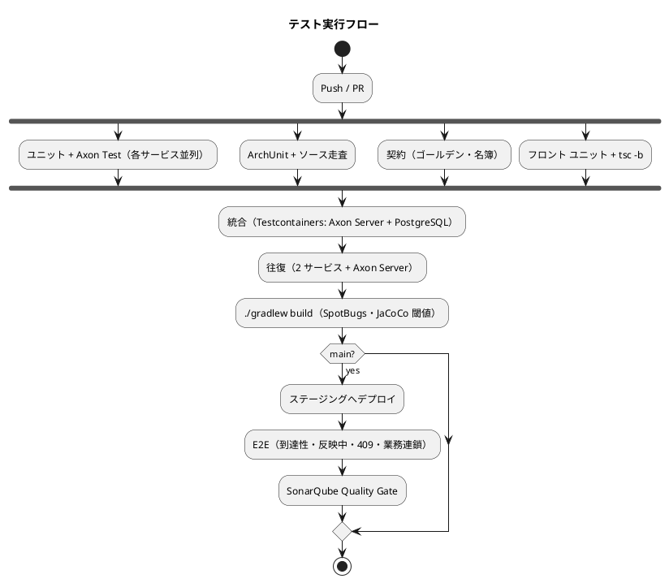

# テスト戦略 - 国際貨物輸送管理システム（CQRS / Event Sourcing 版）

## 概要

[CQRS / Event Sourcing のマイクロサービス](architecture_backend.md)（Axon Framework 5、7 サービス + Gateway）と React SPA のテスト戦略を定めます。

Event Sourcing では「集約が正しい」と「画面に出る」のあいだに投影と Saga が挟まります。集約のユニットテストが全緑でも、投影が動かなければ一覧は空のままで、Saga が届かなければ追跡は始まりません。したがって本戦略は、**集約・投影・Saga・イベント契約・境界**の 5 種を別々の検査として置き、それぞれが何を判別し何を判別しないかを明記します。

| 参照元 | 採るもの | 変えるもの |
| :--- | :--- | :--- |
| `tmp/take-4/docs/design/test_strategy.md` | Axon Test（`AxonTestFixture`）のレベル、Object Mother、CI 統合、Flaky 対策 | `subscribing` モードやプロファイル除外で投影を「テストから外す」構成をやめる |
| `docs/article/source/java-3/docs/design/test_strategy.md` | ハイブリッド形（サービス内ピラミッド + サービス間ダイヤモンド）、品質ゲート、契約テストと往復テスト、Testcontainers、命名規則 | REST / RabbitMQ の契約を Axon のイベント・コマンド・クエリの契約に置き換える |

## テスト形状の選択

### 評価

| 特性 | 評価 | テストへの含意 |
| :--- | :--- | :--- |
| ドメインの厚さ | 厚い（状態遷移表・料金計算・荷役の妥当性・通関） | 集約のユニットテストが土台 |
| サービス間の結合点 | イベント 6 本・コマンド 2 本・クエリ 2 本（契約） | 結合点を Axon Server 経由で実際に往復させる検査が要る |
| 非同期の経路 | 集約 → Event Store → 投影 / Saga | 「発行した」と「届いて反映した」は別。統合テストの比重が上がる |
| 画面の到達性 | ロール × 状態で操作が変わる | E2E は業務シナリオでなく到達性と反映待ちに絞る |

### 選択：ハイブリッド形（サービス内ピラミッド + サービス間ダイヤモンド）



サービス内は `java-3` と同じくピラミッドですが、統合の比率を 15% から 20% に上げます。投影と Saga は集約のユニットテストでは判別できないためです。

## テストレベルの定義（バックエンド）

### レベル 1：ユニットテスト

| 対象 | 方法 | 判別すること | 判別しないこと |
| :--- | :--- | :--- | :--- |
| 集約 | `AxonTestFixture`（`axon-test`）の Given-When-Then。Given にイベント列、When にコマンド、Then に発行イベントまたは例外 | 不変条件、状態遷移、発行するイベントの内容 | イベントが Event Store に書かれること、投影が動くこと |
| 値オブジェクト | JUnit 5 + AssertJ | 生成時の検証、等価性、丸め（`Money`） | — |
| ドメインサービス | JUnit 5 | 料金計算（式の各項）、経路探索（候補の順序・期限の日付比較） | — |
| 状態遷移表 | `@ParameterizedTest` で全状態 × 全コマンドを回す | 遷移表と `canTransitionTo` の一致。**列挙に値を足したら全箇所を回る** | — |
| `@EventSourcingHandler` | Given のイベント列から状態を復元し、次のコマンドの判定に使われることを確かめる | 復元の正しさ。**復元で判断しない**こと（例外を投げない） | — |

```java
class CargoTest {

    private AxonTestFixture fixture;

    @BeforeEach
    void setUp() {
        // 組み立て方は IT1 スパイクで確定する（with は ApplicationConfigurer を要求する）
        fixture = AxonTestFixture.with(CargoTestConfiguration.configurer());
    }

    @AfterEach
    void tearDown() {
        fixture.stop();
    }

    @Test
    void 通知していない予約は確定できない() {
        fixture.given()
                .events(CargoEvents.booked("B-001"), CargoEvents.routed("B-001"))
                .when()
                .command(new ConfirmBookingCommand("B-001"))
                .then()
                .exception(IllegalBookingStateException.class)
                .noEvents();
    }

    @Test
    void 期限当日に着く旅程は経路仕様を満たす() {
        fixture.given()
                .events(CargoEvents.booked("B-001", arrivalDeadline("2026-10-15")))
                .when()
                .command(new AssignRouteCommand("B-001", itineraryArrivingAt("2026-10-15T23:30+09:00")))
                .then()
                .success()
                .events(CargoEvents.routed("B-001"));
    }
}
```

「壊して赤」を必ず確かめます。不変条件を 1 つ外して赤くならないテストは、判定を検査していません。

### レベル 2：統合テスト（投影・Saga・Query）

Testcontainers で **Axon Server と PostgreSQL を実際に起動**します。`@EventHandler` の Bean をプロファイルで除外しません。除外すると「投影が動くこと」が検証されないまま緑になります（`take-4` ADR-0008 の教訓）。

| 対象 | 方法 | 判別すること |
| :--- | :--- | :--- |
| 投影 | イベントを `EventGateway` で発行し、投影テーブルの行を待って検証（`Awaitility`） | イベントから行への写し。他サービスの契約イベントの購読。**冪等性**（同じイベントを 2 度流して結果が同じ） |
| 投影とトークン | 投影の SQL を故意に失敗させ、`token_entry` が進まないことを確かめる | 同一トランザクション（**安全装置は破るテストで固定する**） |
| 投影の再構築 | テーブルを TRUNCATE してトークンをリセットし、リプレイ後に同じ行が復元されること | 投影が派生データであること |
| 一意制約の三段 | 同じメールの荷主を 2 件登録し、2 件目が `projection_rejection` に記録されること | 投影が最後の砦であること |
| Saga | 開始イベントを流し、送られるコマンドと終了を検証。補償経路（宛先が居ない・タイムアウト）を 1 本ずつ | 業務連鎖と補償。**「例外にしない」は「記録しない」ではない**（失敗がイベントとして残ること） |
| Query Handler | 投影テーブルに行を入れ、`QueryGateway` で問い合わせる | SQL の正しさ、期限超過の判定（`today` を業務タイムゾーンで渡す） |
| 起動時の接続検査 | Axon Server を止めた状態で起動し、**起動が止まること** | 無音で in-memory に落ちないこと（`take-4` ADR-0009） |
| MyBatis の方言 | 全 Mapper の SQL を PostgreSQL で実行 | H2 は使わない。方言差の検査は実 DB で行う |

```java
@SpringBootTest
@Testcontainers
class CargoProjectionIT {

    @Container static AxonServerContainer axon = new AxonServerContainer("axoniq/axonserver:2026.x");
    @Container static PostgreSQLContainer<?> db = new PostgreSQLContainer<>("postgres:16");

    @Test
    void 荷役の契約イベントで予約一覧の最新荷役が更新される() {
        eventGateway.publish(CargoEvents.booked("B-001"));
        eventGateway.publish(HandlingContract.registered("B-001", UNLOAD, "SGSIN", offRoute(true)));

        await().atMost(10, SECONDS).untilAsserted(() ->
                assertThat(mapper.findDetail("B-001").lastHandling())
                        .satisfies(h -> {
                            assertThat(h.type()).isEqualTo("UNLOAD");
                            assertThat(h.offRoute()).isTrue();
                        }));
    }
}
```

### レベル 3：契約テスト（サービス間）

契約は `shared/contract/{event,command,query}` の型と JSON 形です。`java-3` が RabbitMQ の交換機に対して置いた検査を、Axon のメッセージに対して置きます。

| 検査 | 内容 | 置き場 |
| :--- | :--- | :--- |
| ゴールデン JSON | 契約イベント・コマンド・クエリごとに「今の JSON 形」をファイルで固定。シリアライズして一致、デシリアライズして復元 | `shared/src/test` |
| 発行側の契約 | 発行側の集約が出すイベントがゴールデンと一致する | 各発行サービス |
| 購読側の契約 | 購読側の投影・Saga がゴールデンの JSON から復元して処理できる | 各購読サービス |
| 往復 | 発行側の集約に実際のコマンドを送り、購読側の投影が更新されるまでを **Axon Server 経由**で確かめる。契約イベント 1 本につき 1 本 | `apps/backend/contract-tests`（両サービスを起動） |
| Upcaster | 旧形式の JSON（ゴールデンの旧版）を Upcaster で読み替え、新形式で復元できる | 各サービス |
| 名簿 | `shared/contract` の型の一覧を ArchUnit で固定。増えたら赤。ADR を起こして名簿を更新する | `shared/src/test` |

**両側が同じ 1 つを読む**ことと、**片側だけでは守れない**ことを同時に守ります。発行側だけのゴールデンは、購読側が別の形を期待していても緑になります。

### レベル 4：境界の検査（ArchUnit + ソース走査）

| ルール | 内容 |
| :--- | :--- |
| レイヤー依存 | `domain` は Spring・MyBatis に依存しない。Axon は `..annotation..` と `EventAppender` の許可リストのみ |
| 共有カーネルの範囲 | `shared` に置けるパッケージの名簿（`domain/model`・`domain/auth`・`contract/*`・`infrastructure/axon`） |
| サービス間の依存 | 各サービスは `shared` 以外の他サービスのパッケージに依存しない |
| コマンドの送信箇所 | `CommandGateway` を使えるのは `interfaces` と `application/saga` だけ |
| 同期の状態変更ポート | 名簿が空であること（`java-2` `CrossContextPortPolicyTest` の逆） |
| `RestClient` の禁止 | `infrastructure/acl` で REST を使わない（サービス間は Axon Server だけ） |
| 4 系 API | `org.axonframework.modelling.command..` への参照が無い（コンパイルで止まるが、念のため） |
| authms の Event Sourcing 禁止 | `auth` パッケージに `@EventSourcedEntity` が無い |
| Event Processor のモード | 設定ファイルを走査し、`mode` が `pooled` 以外にならない |
| データソース | 各サービスの `spring.datasource.url` が自サービスの DB だけを指す |
| Processing Group の書き手 | 1 テーブルを書く Mapper が 1 つの Processing Group からしか呼ばれない（`data-model.md` の対応表を読んで突合） |
| Flyway | 適用済みファイルの checksum を CI で比較し、編集されていたら赤 |

**名簿方式は「載っていないもの」を通さない**ように書きます。「載っているものが正しい」だけの検査は、載せ忘れたものほど漏れます。

### レベル 5：E2E（API / 画面）

| 対象 | 方法 | 内容 |
| :--- | :--- | :--- |
| 業務連鎖 | Playwright（ステージング） | 予約 → 経路 → 通知 → 確定 → 追跡番号 → 荷役 → 引取 → 請求 → 入金 → 精算済 を 1 本。**反映待ちのヘルパ**（`waitForProjected(bookingId)`）を共有し、`sleep` を書かない |
| 到達性 | Playwright | ロール × 画面（サイドナビとダッシュボードから開けるか）、状態 × 操作（その状態のレコードからボタンが出て押せるか）、認証不要の入口（ログイン画面とポータルから公開追跡へ） |
| 反映中 | Playwright | 登録直後の詳細で「反映中」が出て、`200` で消えること。30 秒で再読込ボタンに切り替わること（Event Processor を止めて確かめる） |
| 409 | Playwright | 2 つのブラウザで同じ予約を開き、片方が「経路設計へ戻す」後にもう片方が「確定」を押して「状態が変わっています」が出ること |
| 日時 | 共有ヘルパ | テストデータの日時は業務タイムゾーンで作る。CI（UTC）で 1 日中落ちる `toISOString()` を使わない。**TZ=UTC で一度回す** |

## テストレベルの定義（フロントエンド）

| レベル | ツール | 対象 |
| :--- | :--- | :--- |
| ユニット | Vitest + Testing Library | Presentational、Hooks（`202` → `pending`、ポーリングの停止、無操作タイムアウト） |
| 統合 | Vitest + MSW | Container + API クライアント。**MSW のモックは本物より甘くしない**（OpenAPI の型・日付形式に合わせ、`202` / `409` / `422` を返せる） |
| E2E | Playwright | 上記 |
| 型 | `tsc -b` | `tsc --noEmit` はプロジェクト参照構成では何も検査しない |

## カバレッジ目標と品質ゲート

### カバレッジ（バックエンド、サービスごと・レイヤー別）

| レイヤー | 行カバレッジ | 備考 |
| :--- | :--- | :--- |
| `domain` | 90% | 集約・値オブジェクト・ドメインサービス |
| `application` | 85% | Saga・ポート |
| `infrastructure` | 70% | 投影・Query Handler・ACL。統合テストで計測 |
| `interfaces` | 60% | Controller |
| 全体 | 80% | JaCoCo。レイヤー別の閾値をビルドに置く |

フロントエンドは Hooks 90%、コンポーネント 70%、全体 75%。

### 品質ゲート

| ゲート | 基準 | タイミング |
| :--- | :--- | :--- |
| ユニット・Axon Test | 失敗 0 | PR |
| ArchUnit・ソース走査 | 違反 0 | PR |
| 契約（ゴールデン・名簿） | 失敗 0 | PR |
| 統合（Testcontainers） | 失敗 0 | PR マージ |
| 往復（Axon Server 経由） | 失敗 0 | PR マージ |
| カバレッジ | 上表 | PR マージ |
| `./gradlew build`（SpotBugs 含む） | 成功 | PR。**ローカルも同じコマンド** |
| SonarQube Quality Gate | Passed。Bug・Vulnerability 0。Security Hotspot は中身を読んでから判断 | リリース前 |
| E2E | 失敗 0 | リリース前 |

**たまに落ちるテストは 2 回目で追います。** 再実行で通ることを理由に進めると、本物の赤も見逃します。

## テストデータ

| 手段 | 用途 |
| :--- | :--- |
| Object Mother（`CargoEvents.booked(...)`、`HandlingContract.registered(...)`） | イベント列の組み立て。**契約イベントの Object Mother は `shared` の testFixtures に置き、両側が同じものを使う** |
| Test Data Builder | 値オブジェクトの組み立て |
| ゴールデン JSON | 契約の形の固定。バージョンごとにファイルを残す |
| 採番 | テストデータの `ShipperCode` も本番の経路（投影のシーケンス）で採る。MAX+1 の自前採番はしない |
| 日時 | 業務タイムゾーンのヘルパ。テストも同じ `Clock` で「今日」を決める |

## TDD の運用

| 局面 | アプローチ |
| :--- | :--- |
| 集約 | インサイドアウト。`AxonTestFixture` の Given-When-Then から書く。不変条件 1 つにつきテスト 1 つ |
| 投影・Query | 統合テストから書く（Testcontainers）。イベントを流して行を待つ |
| Saga | 統合テストから書く。正常 1 本と補償 1 本を対で |
| 契約 | ゴールデン JSON を先に置き、発行側と購読側の両方を赤から始める |
| 画面 | アウトサイドイン。Playwright の到達性テストから書き、MSW の統合テスト、ユニットへ降りる |

「〜しない」「〜まで確かめる」というコメントを書いたら、同じ変更の中で赤になる検査も書きます。宣言しただけで守った気になるためです。

## CI/CD との連携



| 項目 | 目標 |
| :--- | :--- |
| ユニット + Axon Test | 3 分以内（サービスごと） |
| 統合 + 往復 | 10 分以内 |
| E2E | 15 分以内 |
| 失敗時 | 赤の原因が一意に分かること。セキュリティ走査の導入失敗と検出を同じ赤にしない |

## トレーサビリティ

| US / UC | 主な検査 |
| :--- | :--- |
| US04・US05 予約登録 | `CargoTest`（危険物・冷凍の必須項目）、`CargoProjectionIT`、E2E（反映中） |
| US09・US11 経路確定 | `CargoTest`（期限当日着）、`RouteSearchServiceTest`、`RouteCandidatesRoundTripIT`（Query Bus 往復） |
| US12・US13 通知・確定 | `CargoTest`（通知していない予約は確定できない）、E2E（409） |
| US14 追跡番号発行 | `BookingSagaIT`（追跡開始と補償）、`TrackingNumberIssuedContractTest`（両側）、往復 |
| US15・US28 荷役・誤配 | `HandlingActivityTest`（種別ごとの要件・`offRoute`）、`TrackingActivityTest`（`afterHandling`）、`HandlingActivityRegisteredRoundTripIT` |
| US19・US20 例外 | `TrackingActivityTest`（`EXCEPTION` からの復帰）、E2E（緊急を先頭） |
| US21〜US23 料金・精算 | `FreightChargeCalculatorTest`（各項・輸出免税・丸め）、`QuotationEstimatorConsistencyTest`（見積と請求の一致）、`BillingSagaIT`、`InvoiceQueryIT`（期限超過の日付判定） |
| US29 通関 | `CustomsDeclarationTest`（未決着 1 件・留置 3 日超）、`HandlingActivityTest`（`CLEARED` 以外の引取拒否）、`CustomsStatusChangedRoundTripIT` |
| US30 キャンセル | `CargoTest`（状態ごとの即時 / 申請）、`BookingSagaIT`（追跡を閉じる）、`CargoCancelledRoundTripIT` |
| US31 アカウント保護 | `UserTest`（5 回でロック・同一メッセージ）、`AuthControllerIT`（認可が入力検証より先） |
| 横断 | `ArchitectureTest`（名簿）、`ProjectionIdempotencyIT`、`TokenTransactionIT`、`ReplayIT`、`StartupWithoutAxonServerIT` |

## テスト命名規則

| 種別 | 規則 | 例 |
| :--- | :--- | :--- |
| ユニット | `<対象>Test`、メソッドは日本語で振る舞い | `CargoTest.通知していない予約は確定できない` |
| 統合 | `<対象>IT` | `CargoProjectionIT` |
| 契約 | `<契約名>ContractTest`（両側に同名） | `TrackingNumberIssuedContractTest` |
| 往復 | `<契約名>RoundTripIT` | `HandlingActivityRegisteredRoundTripIT` |
| E2E | `<画面 or シナリオ>.spec.ts` | `reachability.spec.ts`, `pending-projection.spec.ts` |

## 参照

- [バックエンドアーキテクチャ](architecture_backend.md)、[フロントエンドアーキテクチャ](architecture_frontend.md)
- [ドメインモデル設計](domain-model.md)（不変条件・契約の名簿）、[データモデル設計](data-model.md)（Processing Group とテーブルの対応）
- [ADR-0001](../../adr/cargo-tracker/0001-cqrs-es-with-axon-in-microservices.md)（コンプライアンスの検査）
- [テスト戦略ガイド](../../reference/テスト戦略ガイド.md)
- 参照元：`tmp/take-4/docs/design/test_strategy.md`、[java-3 テスト戦略](../../article/source/java-3/docs/design/test_strategy.md)
