# UI 設計 - 国際貨物輸送管理システム（CQRS / Event Sourcing 版）

## 概要

[フロントエンドアーキテクチャ](architecture_frontend.md)（React SPA）を前提に、画面一覧・画面遷移・画面イメージ・インタラクションを定めます。バックエンドは [CQRS / Event Sourcing のマイクロサービス](architecture_backend.md) です。

UI 設計で CQRS / Event Sourcing に固有なのは **「反映中」という状態が画面に存在する**ことです。コマンドは集約に受け付けられた時点で成功を返しますが、一覧・詳細は投影テーブルから読むため、数秒のあいだ「登録したのに見えない」が起きます。本書はこれを隠さず、画面共通の規約として扱います。

| 参照元 | 採るもの | 変えるもの |
| :--- | :--- | :--- |
| `tmp/take-4/docs/design/ui_design.md` | OOUX による業務オブジェクトの整理、左サイドナビ + トップヘッダ、結果整合性を伴う操作のパターン、エラー処理パターン | 「反映中」を画面共通の規約に格上げし、ボタンの出し分けと集約の判定の関係を明記 |
| `docs/article/source/java-3/docs/design/ui_design.md` | 画面共通の規約（一覧・入力・表示）、認証・認可ポリシー、ステータスバッジ定義、公開追跡の導線 | — |

## 業務オブジェクト（OOUX）

| オブジェクト | 主な属性 | アクション | 関係 |
| :--- | :--- | :--- | :--- |
| 見積（Quotation） | 見積番号・出発地・目的地・期限・貨物種別・重量・概算料金・候補 | 作成 / 表示 | 予約 (1:0..1) |
| 荷主（Shipper） | 荷主コード・種別・名前・連絡先・法人契約 | 登録 / 表示 / 連絡先更新 / 法人契約付与 | 見積・予約・請求 (1:N) |
| 予約（Cargo） | 予約番号・荷主・経路仕様・旅程・予約状態・経路設定状態・追跡番号・最新の荷役 | 登録 / 経路設計依頼 / 経路確定 / 条件調整 / 荷主通知 / 確定 / 追跡番号発行 / キャンセル申請・承認・却下 | 荷主 (N:1)、追跡 (1:0..1)、請求 (1:0..1)、航海 (N:N via 区間) |
| キャンセル申請（CancellationRequest） | 理由・申請者・申請日時・判断・陸揚げ地 | 申請 / 承認 / 却下 | 予約 (N:1) |
| 航海（Voyage） | 航海番号・運送会社・運搬移動・受入貨物種別 | 登録 / 更新 / キャンセル | 予約 (区間経由 1:N) |
| 経路候補（RouteCandidate） | 区間の列・所要日数・概算費用 | 算出 / 選択 | 予約 (N:1) |
| 追跡情報（TrackingActivity） | 追跡番号・輸送ステータス・現在地・例外件数 | 状態手動更新 / 例外起票・対応・解決 | 予約 (1:1)、荷役 (1:N)、例外 (1:N) |
| 例外（TrackingException） | 種別・緊急・場所・対応状態・解決内容 | 起票 / 対応開始 / 解決 | 追跡 (N:1) |
| 荷役作業（HandlingActivity） | 種別・場所・航海番号・完了日時・予定外フラグ | 登録 | 追跡 (N:1) |
| 通関申告（CustomsDeclaration） | 申告番号・通関状態・申告日時・留置日数 | 登録 / 状態更新 | 追跡番号 (N:1) |
| 請求書（Invoice） | 基本料金・割引・調整・税・合計・状態・期限 | 算出 / 割引適用 / 調整 / 発行 / 入金記録 / 取消 | 予約 (1:1)、荷主 (N:1) |
| 反映の拒否（ProjectionRejection） | 種別・対象・理由・確認済み | 確認 | （横断） |

ナビゲーションは **左サイドナビ + トップヘッダ**です。サイドナビは業務オブジェクト単位、ロール別に表示を制御します。

## 画面共通の規約

### 反映中の規約（CQRS / Event Sourcing 固有）

| 場面 | 規約 |
| :--- | :--- |
| コマンドが成功した | トースト「受け付けました」を出す。**「保存しました」とは言わない**（一覧にはまだ出ない） |
| 登録直後の詳細 | API が `202` のあいだ、詳細画面の位置に「反映中」バナーとスケルトンを出し、1 秒間隔で再取得する。30 秒で「反映に時間がかかっています」に切り替え、再読込ボタンを出す |
| 送信直後の一覧 | 「登録しました。一覧への反映には数秒かかります」を一覧の上部に出す。行が出たら消す |
| 状態を進めるボタン | 押した直後にバッジを次の状態に変え、ボタンを無効化する（楽観的更新）。失敗したら戻し、理由を出す |
| 投影が古くて操作が拒否された（`409`） | 「状態が変わっています」と再読込ボタン。**拒否は集約の判定であり、画面の誤りではない** |
| 反映の拒否（重複メール等） | 集約は受け付けたが投影が弾いた事実を、該当ロールの作業一覧に「要確認」として出す。黙って捨てない |
| Event Processor の遅れ | 全画面のヘッダに「反映が遅れています（約 N 分）」を出す（`/actuator` の遅れ指標を Gateway が返す）。利用者に障害と誤解させない |

### 一覧規約

- 既定の絞り込みと並び順は「その利用者が毎朝どう使うか」で決める。終わったもの（出港済みの航海・精算済みの予約・解決済みの例外）が既定で先頭に来ないことを確かめる
- 件数の上限で切ったときは、総件数とともにその事実を伝える
- 0 件のときは、どの条件が効いているかを示し、その条件を外す操作を置く
- 件数や警告を出すときは、そこから対象へ行けるようにする

### 入力規約

- 編集は今の内容が入った状態で開く
- UN/LOCODE を直接入力させず、一覧から選ばせる。表示は「JPTYO 東京」
- 決まった値のあるもの（貨物種別・荷役種別・例外種別・通関状態）は選択式
- 重複や競合は拒否ではなく問いかけにする（荷主のメール重複は「同じメールの荷主が居ます。続けますか」）

### 表示規約

- 列挙名（`GENERAL`）や UTC のまま見せない。利用者の言葉と業務タイムゾーンで出す
- 確定していない値は確定していないと書く（見積の概算、請求の算出済み）
- 状態はバッジで常時表示する（付録）
- 次のイテレーションで使えるようになる操作は、押せないボタンとして置かない

### 認証・認可ポリシー

- 業務画面はログイン必須。未ログインならログイン画面へ、権限が無ければ 403 画面
- **公開追跡照会（`/track/:trackingNumber`）は認証不要**。ログイン画面とポータルに入口を置く。ログイン済みで開いたときは共通レイアウトの中に置き、戻り先はダッシュボード
- `ROLE_SHIPPER` は予約管理を読まない。自社貨物は `/tracking`（追跡コンテキスト）から、authms の紐付けで絞って読む
- 15 分無操作で警告、20 分で認証ストアを破棄。警告には入力中の内容が保存されないことを明示
- ログイン失敗は理由を問わず同一メッセージ
- 画面の表示制御と API の実行可否は同一の RBAC マトリクスに従う。最終的に守るのはサーバー側の `403`

## 画面一覧

| ID | 画面 | ルート | ロール | UC | 反映中の扱い |
| :--- | :--- | :--- | :--- | :--- | :--- |
| S00 | ログイン | `/login` | 未認証 | UC20 | — |
| S01 | ポータル（公開） | `/portal` | 未認証 | UC15 | — |
| S02 | ダッシュボード | `/` | 全ロール | — | ポーリング |
| S10 | 荷主一覧 | `/shippers` | 営業、経理 | UC02 | 送信直後の一覧 |
| S11 | 荷主登録・編集 | `/shippers/new`, `/shippers/:id/edit` | 営業 | UC02 | 重複は問いかけ、拒否は要確認 |
| S12 | 見積作成 | `/quotations/new` | 営業 | UC01 | 登録直後の詳細 |
| S13 | 見積詳細 | `/quotations/:id` | 営業 | UC01 | — |
| S20 | 予約一覧 | `/bookings` | 営業、経路設計、追跡 | UC03 | 送信直後の一覧 |
| S21 | 予約登録 | `/bookings/new` | 営業 | UC03 | 登録直後の詳細 |
| S22 | 予約詳細 | `/bookings/:id` | 営業、経路設計、追跡 | UC04・UC10・UC11・UC12・UC22 | 楽観的更新 |
| S23 | キャンセル承認一覧 | `/bookings/cancellations` | 追跡 | UC22 | ポーリング |
| S30 | 経路設計作業一覧 | `/routing/worklist` | 経路設計 | UC04 | ポーリング |
| S31 | 経路設計ワークベンチ | `/routing/bookings/:id` | 経路設計 | UC05〜UC09、US28 | 候補算出は同期。確定は楽観的更新 |
| S32 | 航海スケジュール一覧 | `/voyages` | 経路設計 | UC05・UC19 | 送信直後の一覧 |
| S33 | 航海スケジュール登録・更新 | `/voyages/new`, `/voyages/:no/edit` | 経路設計 | UC19 | 重複は問いかけ |
| S40 | 追跡一覧 | `/tracking` | 追跡、荷主（自社のみ） | UC15 | ポーリング |
| S41 | 追跡詳細・管理 | `/tracking/:trackingNumber` | 追跡、荷主（自社のみ） | UC14・UC15・UC16 | ポーリング、楽観的更新 |
| S42 | 例外一覧 | `/tracking/exceptions` | 追跡 | UC16 | 緊急を先頭。ポーリング |
| S43 | 例外起票 | `/tracking/:trackingNumber/exceptions/new` | 追跡 | UC16 | 登録直後の詳細 |
| S44 | 公開追跡照会 | `/track/:trackingNumber` | 認証不要 | UC15 | ポーリング |
| S50 | 荷役作業記録 | `/handling/new` | 荷役 | UC13 | 予定外は登録前に警告。通関未済の引取は拒否 |
| S51 | 荷役履歴 | `/handling/:trackingNumber` | 荷役、追跡 | UC13 | ポーリング |
| S52 | 通関申告一覧 | `/customs` | 荷役、追跡 | UC21 | 留置 3 日超を強調 |
| S53 | 通関申告登録・状態更新 | `/customs/new`, `/customs/:no` | 荷役（登録）、追跡（状態更新） | UC21 | 楽観的更新 |
| S60 | 請求一覧 | `/invoices` | 経理 | UC17・UC18 | 期限超過は今日で判定 |
| S61 | 請求詳細・算出・入金 | `/invoices/:id` | 経理 | UC17・UC18 | 楽観的更新 |
| S70 | 要確認一覧（反映の拒否・失敗した Saga） | `/worklist/rejections` | 営業、経理、追跡 | — | ポーリング |
| S90 | 利用者管理 | `/admin/users` | 管理者 | US31 | — |

## ロール別ナビゲーション

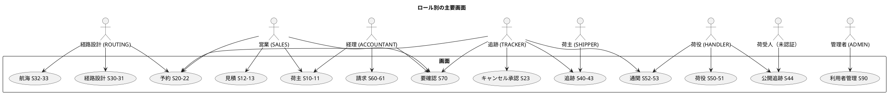

サイドナビの表示は上の対応に従います。ダッシュボード（S02）はロールごとに「今日の作業」を出し、各項目からその画面へ行けるようにします。ロール × 画面の到達性は E2E で固定します。

## 画面遷移図

### 全体遷移（業務フロー視点）

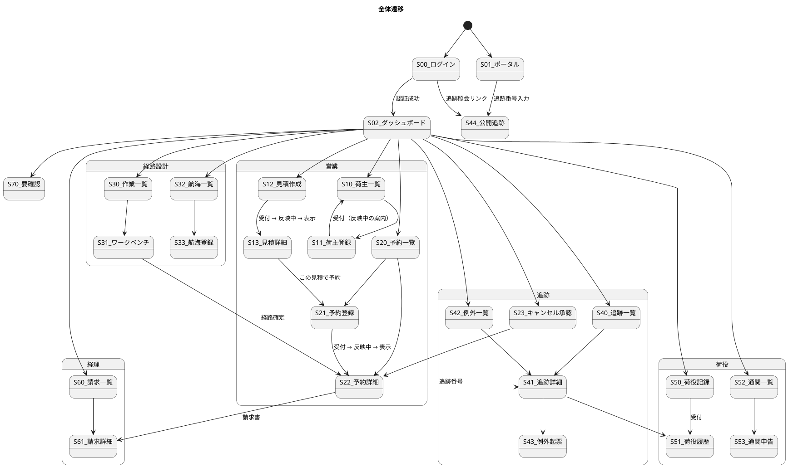

### 予約詳細（S22）の操作と状態

ボタンの出し分けは投影の `booking_status` / `routing_status` を読み、遷移の可否は集約の `BookingStatus#canTransitionTo` が判定します。両者は同じ遷移表（[ドメインモデル設計](domain-model.md)）から作ります。

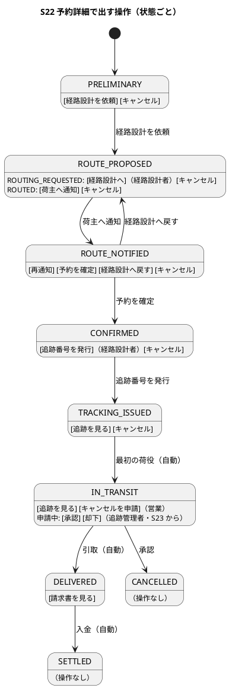

## 画面イメージ（salt）

### S02: ダッシュボード（営業）

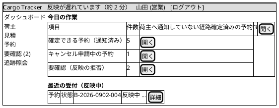

ヘッダの「反映が遅れています」は Event Processor の遅れが閾値を超えたときだけ出ます。「今日の作業」の各行は対象の一覧（絞り込み済み）へ遷移します。

### S21: 予約登録

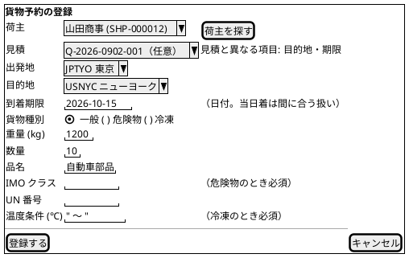

見積を選ぶと 5 項目を写し、予約で変えた項目は「見積と異なる項目」として項目名で知らせます（断らない）。

### S22: 予約詳細（反映中 → 表示）

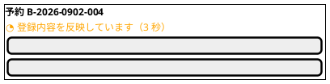

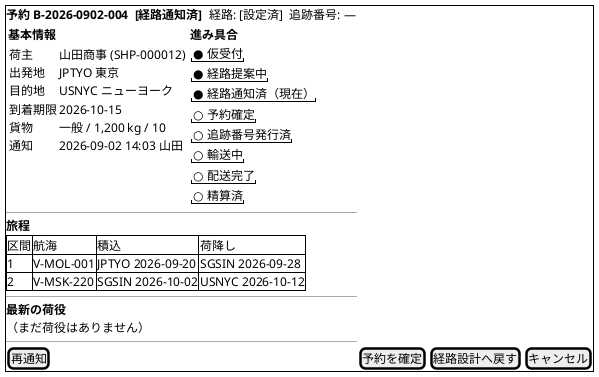

「予約を確定」を押すと、バッジが即座に「予約確定」になりボタンが無効化されます。集約が拒否したら（例：別の担当者が先に「経路設計へ戻す」を押していた）バッジを戻し、「状態が変わっています」と再読込ボタンを出します。

### S31: 経路設計ワークベンチ

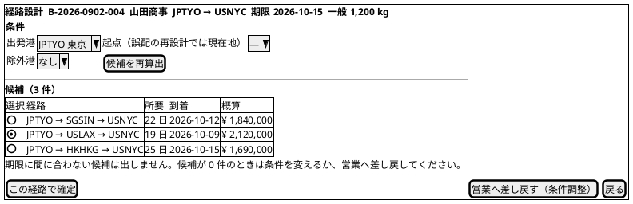

候補の算出は Query Bus 経由の同期処理で、反映中はありません。「この経路で確定」は楽観的更新です。

### S50: 荷役作業記録

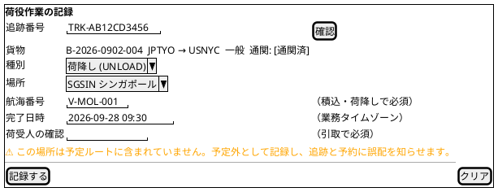

予定外の警告は登録前に出しますが、記録は拒みません。引取で通関が `CLEARED` でないときだけ拒否し、現在の通関状態を出します。

### S41: 追跡詳細・管理

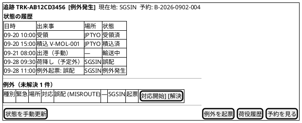

### S53: 通関申告

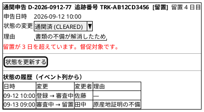

履歴は投影テーブルではなく Event Store のイベント列から読みます。

### S61: 請求詳細・算出・入金

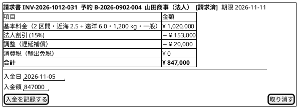

期限超過は `due_on < 今日`（業務タイムゾーン）で判定し、当日は超過ではありません。

### S70: 要確認一覧

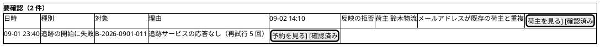

集約は受け付けたが投影が弾いたもの、Saga が補償に至ったものをここに出します。「例外にしない」は「記録しない」ではありません。

### S44: 公開追跡照会

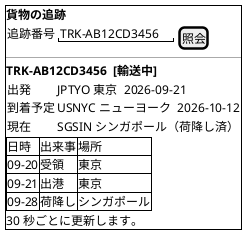

公開画面には例外の詳細・荷主名・金額を出しません。

## インタラクション設計

### 一般原則

| 観点 | 方針 |
| :--- | :--- |
| フォーム送信 | 送信中はボタン無効化 + スピナー。二重送信を防ぐ |
| コマンド成功 | トースト「受け付けました」。反映の案内は画面共通の規約に従う |
| 反映待ち | 詳細は `202` のあいだ 1 秒間隔、上限 30 秒。一覧は `invalidateQueries` + 5 秒後の再取得 1 回 |
| 楽観的更新 | 状態を進める操作で先行表示。失敗時に戻す |
| バリデーション | クライアントで即時検証、サーバーの `400` はフィールドに対応付ける |
| 認可 | 表示制御はロールで、最終的な拒否はサーバーの `403`。認可は入力検証より先に返る |
| 離脱 | 未保存のフォームから離れるときは確認 |

### コマンド送信から反映までの流れ

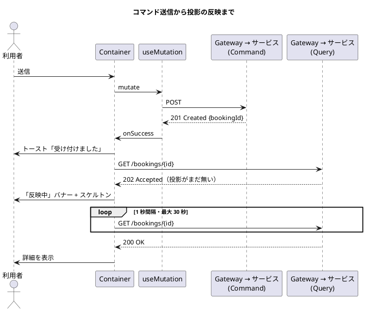

### エラー処理

| 種別 | 表示 | 復帰 |
| :--- | :--- | :--- |
| 入力エラー（`400`） | フィールド直下に赤字、先頭にフォーカス | 修正して再送信 |
| 未認証（`401`） | ログイン画面へ。トースト「セッションが切れました」 | 再ログイン |
| 権限なし（`403`） | 403 画面 | 戻る |
| 見つからない（`404`） | 専用画面 | 一覧へ |
| 反映待ち（`202`） | 「反映中」バナー | 自動再取得 |
| 状態の競合（`409`） | 「状態が変わっています」+ 再読込 | 再読込して再操作 |
| 業務規則違反（`422`） | 理由をモーダルで表示（例：「通関が完了していないため引取を記録できません。現在の状態: 留置」） | 操作を見直す |
| 提供側サービスの停止（経路候補の算出など、`503`） | 「経路サービスが応答していません」+ 再試行 | 時間をおく |
| 通信エラー / `5xx` | 汎用トースト | 再試行 |
| 反映が長引く | 30 秒で「反映に時間がかかっています」+ 再読込 | 手動更新。ヘッダの遅れ表示を確認 |

### 主要操作シナリオ

| シナリオ | 手順 | 反映中の見え方 |
| :--- | :--- | :--- |
| 荷主を登録し予約を作る | S11 で登録 → 一覧に「反映には数秒」→ 行が出る → S21 で荷主を選び登録 → S22 が反映中 → 表示 | S11 直後の一覧に行が無い時間がある |
| 経路を設計して確定する | S30 で依頼を選ぶ → S31 で候補を算出・選択 → 確定 → S22 に戻り「経路: 設定済」 | 確定は楽観的更新 |
| 荷主へ通知し確定する | S22 で「荷主へ通知」→ バッジが「経路通知済」→「予約を確定」→「予約確定」 | 楽観的更新。競合時は戻る |
| 荷役を記録し誤配を扱う | S50 で予定外の警告を見て記録 → S41 に「誤配」と例外 → S31 で現在地起点の再設計 → 確定 | S41 への反映は数秒 |
| 通関を留置から通関済みにする | S52 で留置 3 日超を見る → S53 で理由を書き更新 → S41 の例外が解決可能に | S41 への反映は数秒 |
| 輸送中の予約をキャンセルする | 営業が S22 で申請 → 追跡管理者が S23 で陸揚げ地を指定して承認 → S22 が「キャンセル」、S41 が閉じる | 承認は楽観的更新 |
| 請求と入金 | 配送完了で S61 に算出済みが現れる → 発行 → 入金記録 → S22 が「精算済」 | S22 への反映は数秒 |

## レスポンシブ・アクセシビリティ

| 項目 | 方針 |
| :--- | :--- |
| 荷役記録（S50）と公開追跡（S44） | モバイル幅で使える。入力は 1 列、ボタンは画面幅いっぱい |
| その他の業務画面 | デスクトップ前提。1024px 以上 |
| キーボード | すべての操作をキーボードで完了できる。フォーカス可視 |
| 状態バッジ | 色だけに頼らず文字を併記 |
| 反映中バナー | `aria-live="polite"` で読み上げ |
| コントラスト | WCAG AA |

## 付録：ステータスバッジ

| 種別 | 値 | 表示 | 色 |
| :--- | :--- | :--- | :--- |
| BookingStatus | `PRELIMINARY` | 仮受付 | グレー |
| | `ROUTE_PROPOSED` | 経路提案中 | 青 |
| | `ROUTE_NOTIFIED` | 経路通知済 | 青 |
| | `CONFIRMED` | 予約確定 | 緑 |
| | `TRACKING_ISSUED` | 追跡番号発行済 | 緑 |
| | `IN_TRANSIT` | 輸送中 | 緑 |
| | `DELIVERED` | 配送完了 | 緑 |
| | `SETTLED` | 精算済 | グレー |
| | `CANCELLED` | キャンセル | 赤 |
| RoutingStatus | `NOT_ROUTED` / `ROUTING_REQUESTED` / `ROUTED` / `MISROUTED` | 未設定 / 設計依頼中 / 設定済 / 誤配 | グレー / 黄 / 緑 / 赤 |
| TransportStatus | `NOT_RECEIVED` … `DELIVERED` | 未受領 … 引取済 | グレー → 緑 |
| | `MISROUTED` / `EXCEPTION` | 誤配 / 例外発生 | 赤 |
| CustomsStatus | `PENDING` / `CLEARED` / `HELD` / `REJECTED` | 審査中 / 通関済 / 留置 / 却下 | 黄 / 緑 / 赤 / グレー |
| BillingStatus | `PENDING` / `CALCULATED` / `INVOICED` / `PAID` / `VOID` | 算出待ち / 算出済 / 請求済 / 入金済 / 取消 | グレー / 黄 / 青 / 緑 / グレー |
| 反映 | `pending` | 反映中 | オレンジ |

## トレーサビリティ（UC ↔ 画面）

| UC | 画面 |
| :--- | :--- |
| UC01 見積作成 | S12, S13 |
| UC02 荷主登録 | S10, S11 |
| UC03 貨物予約登録 | S20, S21, S22 |
| UC04 予約引渡 | S22, S30 |
| UC05 航海検索 | S32 |
| UC06〜UC09 経路候補算出・選択・調整・紐付 | S31 |
| UC10 確定経路通知 | S22 |
| UC11 予約確定 | S22 |
| UC12 追跡番号発行 | S22 |
| UC13 荷役作業記録 | S50, S51 |
| UC14 貨物状態更新 | S41 |
| UC15 追跡情報照会 | S40, S41, S44 |
| UC16 例外処理 | S41, S42, S43 |
| UC17 輸送料金算出 | S61 |
| UC18 精算処理 | S60, S61 |
| UC19 航海スケジュール登録 | S32, S33 |
| UC20 認証 | S00 |
| UC21 通関申告 | S52, S53 |
| UC22 予約キャンセル | S22, S23 |
| US28 誤配 | S50, S41, S31 |
| US31 アカウント保護 | S00, S90 |

## 参照

- [フロントエンドアーキテクチャ](architecture_frontend.md)
- [ドメインモデル設計](domain-model.md)（状態遷移表・バッジの値）
- [ユーザーストーリー](../../requirements/user_story.md)、[システムユースケース](../../requirements/system_usecase.md)
- [UI 設計ガイド](../../reference/UI設計ガイド.md)
- 参照元：`tmp/take-4/docs/design/ui_design.md`、[java-3 UI 設計](../../article/source/java-3/docs/design/ui_design.md)
