# UI 設計 - 国際貨物輸送管理システム（CQRS / Event Sourcing 版）

## 概要

[フロントエンドアーキテクチャ](architecture_frontend.md)（React SPA）を前提に、画面一覧・画面遷移・画面イメージ・インタラクションを定めます。バックエンドは [CQRS / Event Sourcing のマイクロサービス](architecture_backend.md) です。

UI 設計で CQRS / Event Sourcing に固有なのは **「反映中」という状態が画面に存在する**ことです。コマンドは集約に受け付けられた時点で成功を返しますが、一覧・詳細は投影テーブルから読むため、数秒のあいだ「登録したのに見えない」が起きます。本書はこれを隠さず、画面共通の規約として扱います。

| 参照元 | 採るもの | 変えるもの |
| :--- | :--- | :--- |
| `tmp/take-4/docs/design/ui_design.md` | OOUX による業務オブジェクトの整理、左サイドナビ + トップヘッダ、結果整合性を伴う操作のパターン、エラー処理パターン | 「反映中」を画面共通の規約に格上げし、ボタンの出し分けと集約の判定の関係を明記 |
| `docs/article/source/java-3/docs/design/ui_design.md` | 画面共通の規約（一覧・入力・表示）、認証・認可ポリシー、ステータスバッジ定義、公開追跡の導線 | — |

## 業務オブジェクト（OOUX）

| オブジェクト | 主な属性 | アクション | 関係 |
| :--- | :--- | :--- | :--- |
| 見積（Quotation） | 見積番号・出発地・目的地・期限・貨物種別・重量・概算料金・候補 | 作成 / 表示 | 予約 (1:0..1) |
| 荷主（Shipper） | 荷主コード・種別・名前・連絡先・法人契約 | 登録 / 表示 / 連絡先更新 / 法人契約付与 | 見積・予約・請求 (1:N) |
| 予約（Cargo） | 予約番号・荷主・経路仕様・旅程・予約状態・経路設定状態・追跡番号・最新の荷役 | 登録 / 経路設計依頼 / 経路確定 / 条件調整 / 荷主通知 / 確定 / 追跡番号発行 / キャンセル申請・承認・却下 | 荷主 (N:1)、追跡 (1:0..1)、請求 (1:0..1)、航海 (N:N via 区間) |
| キャンセル申請（CancellationRequest） | 理由・申請者・申請日時・判断・陸揚げ地 | 申請 / 承認 / 却下 | 予約 (N:1) |
| 航海（Voyage） | 航海番号・運送会社・運搬移動・受入貨物種別 | 登録 / 更新 / キャンセル | 予約 (区間経由 1:N) |
| 経路候補（RouteCandidate） | 区間の列・所要日数・概算費用 | 算出 / 選択 | 予約 (N:1) |
| 追跡情報（TrackingActivity） | 追跡番号・輸送ステータス・現在地・例外件数 | 状態手動更新 / 例外起票・対応・解決 | 予約 (1:1)、荷役 (1:N)、例外 (1:N) |
| 例外（TrackingException） | 種別・緊急・場所・対応状態・解決内容 | 起票 / 対応開始 / 解決 | 追跡 (N:1) |
| 荷役作業（HandlingActivity） | 種別・場所・航海番号・完了日時・予定外フラグ | 登録 | 追跡 (N:1) |
| 通関申告（CustomsDeclaration） | 申告番号・通関状態・申告日時・留置営業日数 | 登録 / 状態更新 | 追跡番号 (N:1) |
| 請求書（Invoice） | 見積時概算・基本料金・割引・調整（根拠の例外）・税・合計・差額と理由・状態・期限 | 算出 / 割引適用 / 調整 / 発行 / 入金記録 / 取消 | 予約 (1:1)、荷主 (N:1) |
| 要確認項目（AttentionItem） | 種別・対象・担当ロール・理由・受け付けた内容・発生日時・確認期限・確認済み | 確認 / 修正して再登録 | （横断。各 Read DB の `attention_item`） |

ナビゲーションは **左サイドナビ + トップヘッダ**です。サイドナビは業務オブジェクト単位、ロール別に表示を制御します。

## 画面共通の規約

### 反映中の規約（CQRS / Event Sourcing 固有）

| 場面 | 規約 |
| :--- | :--- |
| コマンドが成功した | トースト「受け付けました」を出す。**「保存しました」とは言わない**（一覧にはまだ出ない） |
| 登録直後の詳細 | API が `202` のあいだ、詳細画面の位置に「反映中」バナーとスケルトンを出し、1 秒間隔で再取得する。**待ち上限は 30 秒**。上限に達したら「登録内容が一覧に出るまで少し時間がかかっています（登録自体は受け付けています）」に切り替え、受付内容（予約番号と入力値）と再読込ボタンを出す。**ヘッダの遅れ表示が出ているあいだは待たずに最初の `202` で切り替える**（30 秒回してから同じ案内を出すのは二度手間） |
| 送信直後の一覧 | コマンド応答の識別子と送信した入力値から**「反映中」バッジ付きの行を作り、一覧の先頭に差し込む**。投影に同じ識別子の行が出たら差し替える。上部の案内文「登録しました。一覧への反映には数秒かかります」は差し込んだ行が置き換わるまで出す。差し込んだ行は本ブラウザのセッションに限る（`sessionStorage`。他の利用者には投影に出るまで見えない） |
| 状態を進めるボタン | **適用基準（次表）に従う**。単独作業だけ楽観的更新（押した直後にバッジを次の状態に変える）。複数ロールが同じ集約を触る遷移は「送信中…」を出し、コマンド応答で確定表示にする。どちらもボタンは `aria-disabled` にし、失敗したら戻して理由を出す |
| 投影が古くて操作が拒否された（`409`） | 「状態が変わっています」に加え、**応答本文の直前のイベント（誰が・いつ・何を）と再読込後に押せる操作**を出す（「インタラクション設計」の「エラー処理」）。**拒否は集約の判定であり、画面の誤りではない** |
| 反映の拒否（重複メール等） | 集約は受け付けたが投影が弾いた事実を `attention_item` に記録し、担当ロールの要確認一覧（S70）に出す。黙って捨てない。「修正して再登録」へ繋ぐ |
| Event Processor の遅れ | 全画面のヘッダに**「登録内容が一覧に出るまで少し時間がかかっています（登録自体は受け付けています）」**を出し、続けて**「業務はそのまま進めてかまいません。予約番号は受付時の内容で案内できます」**を添える。出典は `/actuator` の遅れ指標（各 Processing Group の遅れの最大値）を Gateway が返したもので、閾値は反映の p95 目標（3 秒）の 10 倍（30 秒）を超え続けたとき。**一度出したら最低 5 分は出し続ける**（点滅させない）。「障害」「遅延」の語は使わない |
| ダッシュボードのカウンタ | 「今日の作業」の件数は**投影から数える**（反映中を含まない）。反映中のものは「最近の受付（反映中）」に本セッションで受け付けた識別子から別枠で出す。件数と一覧の内訳は同じクエリで数え、食い違わせない |

反映の待ち方は上の 1 本に揃えます。詳細の待ち上限（30 秒）・一覧への差し込み・ヘッダの遅れ表示は同じ遅れ指標から決め、画面ごとに別の秒数を持ちません。

#### 楽観的更新の適用基準

| 操作の性質 | 表示 | 該当する操作 | 理由 |
| :--- | :--- | :--- | :--- |
| **単独作業**（同じ集約を同時に触るロールが他に無い） | 楽観的更新。押した直後にバッジ・一覧を次の状態にし、失敗したら戻す | 荷役記録（S50）、例外の起票・対応開始・解決（S41・S43）、状態の手動更新（S41）、航海の登録・更新（S33） | 拒否がまれで、先行表示の巻き戻りが起きにくい |
| **複数ロールが触る集約の遷移** | 「送信中…」→ コマンド応答で確定表示。先行表示はしない | S22 の予約を確定 / 経路設計へ戻す / 荷主へ通知 / キャンセル申請、S23 の承認・却下、S31 の経路確定、S53 の通関状態更新、S61 の入金記録・取消 | 営業・経路設計・追跡が同じ予約を触る。頻繁に巻き戻る先行表示は「押せたのか分からない」を生む |

どちらもボタンは送信中 `aria-disabled="true"` にしてフォーカスを保ち、`disabled` にはしません（フォーカスが本文先頭へ飛ぶ）。「送信中…」はボタンの文言を置き換え、`role="status"` の領域にも同じ語を出します。

### 一覧規約

- 既定の絞り込みと並び順は「その利用者が毎朝どう使うか」で決める。終わったもの（出港済みの航海・精算済みの予約・解決済みの例外）が既定で先頭に来ないことを確かめる
- 件数の上限で切ったときは、総件数とともにその事実を伝える
- 0 件のときは、どの条件が効いているかを示し、その条件を外す操作を置く
- 件数や警告を出すときは、そこから対象へ行けるようにする
- **一覧が上限で切れたら、そのことを出す。** 件数の上限は画面の都合であって業務の都合ではない。無音で切ると、載らなかったものは誰の目にも入らないまま残る。応答の全件数と表示件数を並べて出す（IT2 で荷主一覧・予約一覧に適用。荷主が切れると予約登録の選択肢からも消え、その日から予約が取れなくなる）

#### 一覧の既定条件

| 画面 | 既定で除外するもの | 既定の並び順 | 外す操作 |
| :--- | :--- | :--- | :--- |
| S10 荷主一覧 | （除外なし） | 荷主コード順 | — |
| S20 予約一覧 | 精算済（`SETTLED`）・キャンセル（`CANCELLED`） | 到着期限が近い順 | 「終了したものも表示」 |
| S23 キャンセル承認一覧 | 承認済・却下済 | 申請日時が古い順 | 「判断済みも表示」 |
| S30 経路設計作業一覧 | 設計済（`ROUTED`）。誤配（`MISROUTED`）は含める | 誤配 → 到着期限が近い順 | — |
| S32 航海スケジュール一覧 | 出港済み（最初の出港日が今日より前）・キャンセル | 出港日が近い順 | 「出港済み・キャンセルも表示」 |
| S40 追跡一覧 | 引取済（`DELIVERED`） | 例外あり → 到着予定が近い順 | 「引取済も表示」 |
| S42 例外一覧 | 解決済 | 紛失（`LOSS`）→ 到着期限までの残日数が少ない順 | 「解決済も表示」 |
| S45 自社予約一覧 | 精算済・キャンセル | 到着期限が近い順 | 「終了したものも表示」 |
| S52 通関申告一覧 | 通関済（`CLEARED`） | 留置営業日数が多い順 | 「通関済も表示」 |
| S60 請求一覧 | 入金済（`PAID`）・取消（`VOID`） | 支払期限が近い順 | 「入金済も表示」 |
| S70 要確認一覧 | 確認済。**他ロール宛** | 未確認 3 日超 → 発生日時が古い順 | 「全ロール分を表示」 |

「今日」「営業日」は業務タイムゾーン（`Asia/Tokyo`）の日付で判定します。

### 入力規約

- 編集は今の内容が入った状態で開く
- UN/LOCODE を直接入力させず、一覧から選ばせる。表示は「JPTYO 東京」
- 決まった値のあるもの（貨物種別・荷役種別・例外種別・通関状態）は選択式
- 重複や競合は拒否ではなく問いかけにする（荷主のメール重複は「同じメールの荷主が居ます。続けますか」）

### 表示規約

- 列挙名（`GENERAL`）や UTC のまま見せない。利用者の言葉と業務タイムゾーンで出す
- 確定していない値は確定していないと書く（見積の概算、請求の算出済み）
- 状態はバッジで常時表示する（付録）
- 次のイテレーションで使えるようになる操作は、押せないボタンとして置かない。これは**未実装の操作**の話であり、送信中に一時的に `aria-disabled` にすること（「楽観的更新の適用基準」）とは別
- 個人情報を削除した荷主（crypto-shredding 後）の名前・連絡先は「（削除済み）」と出す

### 認証・認可ポリシー

- 業務画面はログイン必須。未ログインならログイン画面へ、権限が無ければ 403 画面
- **公開追跡照会（`/track/:trackingNumber`）は認証不要**。ログイン画面とポータルに入口を置く。ログイン済みで開いたときは共通レイアウトの中に置き、戻り先はダッシュボード
- `ROLE_SHIPPER` は社内の予約管理（S20〜S23）を読まない。自社の予約は荷主向け画面（S45・S46）、自社の請求書は S62、自社貨物の追跡は `/tracking` から、いずれも authms の紐付け（荷主 ID）で絞って読む。金額（S62 を除く）・社内メモ・他社の情報は出さない
- 15 分無操作で警告、20 分で認証ストアを破棄。警告には入力中の内容が保存されないことを明示。**荷役ロールの画面（S50〜S53）だけは 60 分**（屋外で断続的に使う。端末は個人持ちのモバイルで共用しないことを運用条件にする）
- ログアウト（US27）：ヘッダの `[ログアウト]` から `/logout`（S03）へ。認証ストアと `sessionStorage` を破棄し、authms にログアウトを記録してから S00 へ戻す。業務画面はキャッシュ不可（`Cache-Control: no-store`）にし、ブラウザバックで戻っても `RequireRole` が S00 へ送る
- ログイン失敗は理由を問わず同一メッセージ
- 画面の表示制御と API の実行可否は同一の RBAC マトリクスに従う。最終的に守るのはサーバー側の `403`
- **荷主・荷受人への通知の送信基盤（メール等）は本リリースのスコープ外**。通知は現行の手作業（電話・メール）で行い、システムは通知した事実（いつ・誰に・何を）だけを `ShipperNotifiedEvent` に記録して S22・S46 の通知履歴に出す。US12・US14・US23・US29・US30 の「通知される」は、この記録と手作業の組で満たす

## 画面一覧

| ID | 画面 | ルート | ロール | UC | 反映中の扱い |
| :--- | :--- | :--- | :--- | :--- | :--- |
| S00 | ログイン | `/login` | 未認証 | UC20 | — |
| S01 | ポータル（公開） | `/portal` | 未認証 | UC15 | — |
| S03 | ログアウト | `/logout` | 全ロール | UC20（US27） | —（ヘッダの `[ログアウト]` から） |
| S02 | ダッシュボード | `/` | 全ロール | — | ポーリング |
| S10 | 荷主一覧 | `/shippers` | 営業、経理 | UC02 | 送信直後の一覧 |
| S11 | 荷主登録・編集 | `/shippers/new`, `/shippers/:id/edit` | 営業 | UC02 | 重複は問いかけ、拒否は要確認。登録後は S10 に反映中の行を差し込む。S70 の「修正して再登録」は受け付けた内容を初期値に開く |
| S12 | 見積作成 | `/quotations/new` | 営業 | UC01 | 登録直後の詳細 |
| S13 | 見積詳細 | `/quotations/:id` | 営業 | UC01 | 登録直後の詳細（S12 から） |
| S20 | 予約一覧 | `/bookings` | 営業、経路設計、追跡 | UC03 | 送信直後の一覧 |
| S21 | 予約登録 | `/bookings/new` | 営業 | UC03 | 登録直後の詳細 |
| S22 | 予約詳細 | `/bookings/:id` | 営業、経路設計、追跡 | UC04・UC10・UC11・UC12・UC22、US28 | 登録直後の詳細。状態遷移は送信中表示。誤配バナーと通知履歴 |
| S23 | キャンセル承認一覧 | `/bookings/cancellations` | 追跡 | UC22（US30） | ポーリング。承認・却下は送信中表示 |
| S30 | 経路設計作業一覧 | `/routing/worklist` | 経路設計 | UC04 | ポーリング |
| S31 | 経路設計ワークベンチ | `/routing/bookings/:id` | 経路設計 | UC05〜UC09、US28 | 候補算出は同期。確定は送信中表示。誤配の再設計では期限超過候補も超過日数つきで出す |
| S32 | 航海スケジュール一覧 | `/voyages` | 経路設計 | UC05・UC19 | 送信直後の一覧 |
| S33 | 航海スケジュール登録・更新 | `/voyages/new`, `/voyages/:no/edit` | 経路設計 | UC19 | 重複は問いかけ |
| S40 | 追跡一覧 | `/tracking` | 追跡、荷主（自社のみ） | UC15 | ポーリング |
| S41 | 追跡詳細・管理 | `/tracking/:trackingNumber` | 追跡、荷主（自社のみ） | UC14・UC15・UC16、US28 | ポーリング。手動更新・例外は楽観的更新。誤配時は S31 へ |
| S42 | 例外一覧 | `/tracking/exceptions` | 追跡 | UC16 | 紛失 → 残日数が少ない順。ポーリング |
| S43 | 例外起票 | `/tracking/:trackingNumber/exceptions/new` | 追跡 | UC16 | 登録直後の詳細 |
| S44 | 公開追跡照会 | `/track/:trackingNumber` | 認証不要 | UC15（US18） | ポーリング。見つからないときは案内と問い合わせの出口 |
| S45 | 自社予約一覧 | `/shipper/bookings` | 荷主 | UC15 | ポーリング |
| S46 | 自社予約の進み具合 | `/shipper/bookings/:id` | 荷主 | UC10・UC15 | ポーリング。状態・進み具合・確定旅程・通知履歴のみ |
| S50 | 荷役作業記録（航海起点・連続記録） | `/handling/voyages/:voyageNumber` | 荷役 | UC13（US15・US16・US28） | 反映中の待ち合わせなし（コマンド応答で完了、送信済みが積み上がる）。予定外は場所選択直後にインライン警告。通関未済の引取は判定時点つきで拒否 |
| S51 | 荷役履歴 | `/handling/:trackingNumber` | 荷役、追跡 | UC13 | ポーリング |
| S52 | 通関申告一覧 | `/customs` | 荷役、追跡 | UC21 | 留置 3 営業日超を強調。「通関済で引取未記録」を辿れる |
| S53 | 通関申告登録・状態更新 | `/customs/new`, `/customs/:no` | 荷役（登録）、追跡（状態更新） | UC21 | 状態更新は送信中表示 |
| S60 | 請求一覧 | `/invoices` | 経理 | UC17・UC18 | 期限超過は今日で判定 |
| S61 | 請求詳細・算出・入金 | `/invoices/:id` | 経理 | UC17・UC18 | 入金記録・取消は送信中表示。見積時概算との差額と理由 |
| S62 | 自社請求書 | `/shipper/invoices/:id` | 荷主 | UC18 | ポーリング。自社分のみ |
| S70 | 要確認一覧（反映の拒否・失敗した連鎖） | `/worklist/attention` | 営業、経理、追跡、経路設計 | — | ポーリング。既定は自ロール宛。3 日超を強調。供給元は BC ごとの `attention_item`（booking と routing）で、画面が束ねる |
| S90 | 利用者管理 | `/admin/users` | 管理者 | US31 | — |

## ロール別ナビゲーション

```plantuml
@startuml
title ロール別の主要画面

actor "営業 (SALES)" as sales
actor "経路設計 (ROUTING)" as routing
actor "追跡 (TRACKER)" as tracker
actor "荷役 (HANDLER)" as handler
actor "経理 (ACCOUNTANT)" as acc
actor "荷主 (SHIPPER)" as shipper
actor "荷受人（未認証）" as consignee
actor "管理者 (ADMIN)" as admin

rectangle 画面 {
  usecase "荷主 S10-11" as s
  usecase "見積 S12-13" as q
  usecase "予約 S20-22" as b
  usecase "キャンセル承認 S23" as c
  usecase "経路設計 S30-31" as r
  usecase "航海 S32-33" as v
  usecase "追跡 S40-43" as t
  usecase "荷役 S50-51" as h
  usecase "通関 S52-53" as cu
  usecase "請求 S60-61" as i
  usecase "公開追跡 S44" as pub
  usecase "自社予約 S45-46" as sb
  usecase "自社請求書 S62" as si
  usecase "要確認 S70" as w
  usecase "利用者管理 S90" as u
}

sales --> s
sales --> q
sales --> b
sales --> w
routing --> r
routing --> v
routing --> b
tracker --> t
tracker --> c
tracker --> cu
tracker --> b
tracker --> w
handler --> h
handler --> cu
handler --> pub
acc --> i
acc --> s
acc --> w
shipper --> sb
shipper --> si
shipper --> t
consignee --> pub
admin --> u
@enduml
```

**サイドナビに載る画面は次の 18 です。** 残りは他の画面から辿って開くもの（詳細・特定の対象を起点にする画面・公開画面）で、サイドナビには載せません。登録フォームは載せます。毎日使う入口なので、一覧を経由させると 1 手増えます。実装の正典は `shared/ui/navigation.ts` で、ここと食い違ったら実装側を直します。

| サイドナビ項目 | 画面 | 表示ロール |
| :--- | :--- | :--- |
| ダッシュボード | S02 | 全ロール |
| 荷主一覧 | S10 | 営業、経理 |
| 荷主登録 | S11 | 営業 |
| 見積 | S12 | 営業 |
| 予約一覧 | S20 | 営業、経路設計、追跡 |
| 予約登録 | S21 | 営業 |
| キャンセル承認 | S23 | 追跡 |
| 経路設計作業 | S30 | 経路設計 |
| 航海スケジュール | S32 | 経路設計 |
| 航海登録 | S33 | 経路設計 |
| 追跡 | S40 | 追跡、荷主 |
| 例外 | S42 | 追跡 |
| 荷役 | S51 | 荷役、追跡 |
| 通関 | S52 | 荷役、追跡 |
| 請求 | S60 | 経理 |
| 自社予約 | S45 | 荷主 |
| 要確認一覧 | S70 | 営業、経理、追跡、経路設計 |
| 利用者管理 | S90 | 管理者 |

サイドナビの表示は上の対応に従います。ヘッダは全ロール共通で、利用者名・ロール・`[ログアウト]`（S03）と、反映の遅れがあるときだけその案内を出します。荷役ロールはモバイル幅で使うため、サイドナビの代わりに画面下部のタブ（本日の航海 / 引取待ち / 通関 / 追跡照会）を置きます（「画面イメージ」の S02 ダッシュボード（荷役・モバイル幅））。ダッシュボード（S02）はロールごとに「今日の作業」を出し、各項目からその画面へ行けるようにします。ロール × 画面の到達性は E2E で固定します。

## 画面遷移図

### 全体遷移（業務フロー視点）

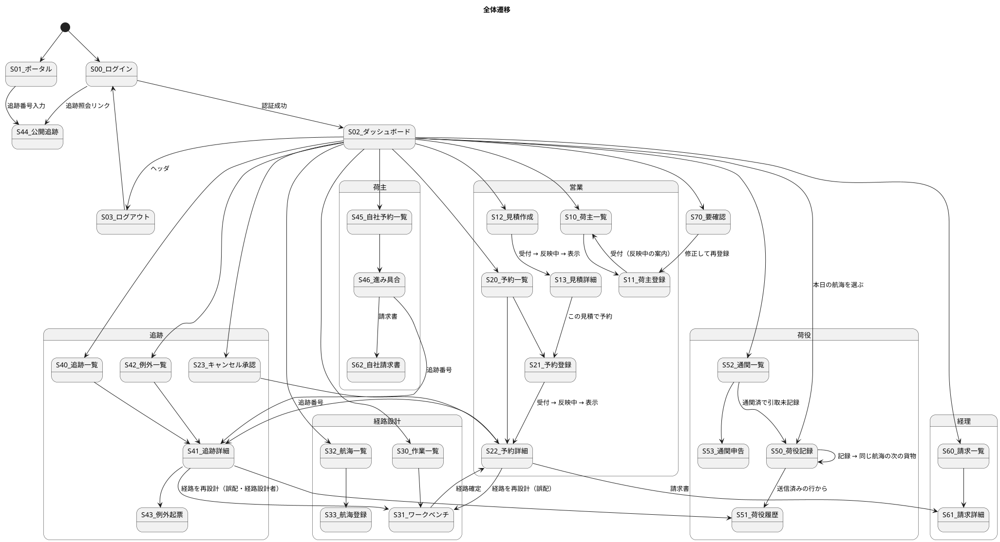

### 予約詳細（S22）の操作と状態

ボタンの出し分けは投影の `booking_status` / `routing_status` を読み、遷移の可否は集約の `BookingStatus#canTransitionTo` が判定します。両者は同じ遷移表（[ドメインモデル設計](domain-model.md)）から作ります。

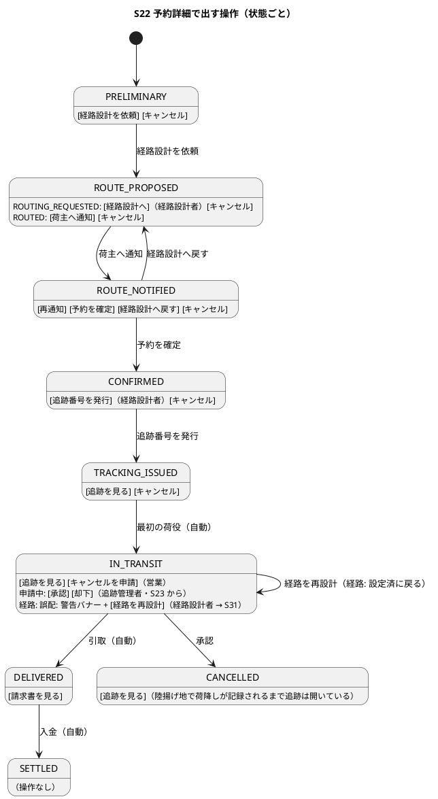

## 画面イメージ（salt）

### S00: ログイン

認証の外にある唯一の入口です。**公開追跡への導線をここに置きます。** ロール別の到達性は認証済みの利用者にしか働かないので、荷受人が使う経路は認証の外にも入口が要ります。

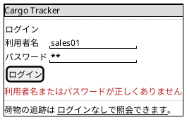

失敗の文言は 1 種類だけです。「利用者が居ない」「パスワードが違う」「ロック中」を出し分けると、利用者名の存在を攻撃者に教えてしまいます。送信中のボタンは `disabled` にせず `aria-disabled` にしてフォーカスを保ちます。

**開発環境では、この画面の上に動作確認用の利用者の一覧が出ます**（[ADR-0004](../../adr/cargo-tracker/0004-demo-login-for-development.md)）。担当ごとの利用者名を選ぶと入力欄に反映され、パスワードは全員共通です。既定は無効で、有効なときは「開発環境です」と画面にはっきり出します。事前入力していることを隠すと、本番同様の画面だと思い込まれます。

### S03: ログアウト（ヘッダ）

独立した画面ではなく、全画面のヘッダに置く操作です。押すと認証を捨ててログイン画面へ **replace** で移ります。履歴を置き換えるので、ブラウザバックで業務画面に戻ることはありません。


### S10: 荷主一覧

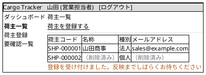

個人情報を削除した荷主は**空欄にせず「（削除済み）」と出します**。空欄だと「入力し忘れ」と区別がつきません。荷主コードと種別は残ります。

### S11: 荷主登録

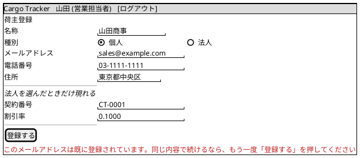

契約番号と割引率は**法人を選んだときだけ**出します。常に出すと「個人なのに契約番号を求められる」ことになります。

重複は**断らずに問いかけます**。1 段目の存在確認は助言であって断定ではありません（同名・同メールで登録したい事情もあります）。続けると登録は受け付けられ、投影の UNIQUE で弾かれた場合は要確認一覧（S70）に出ます。

### S90: 利用者管理（管理者）

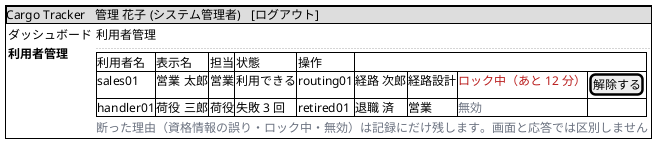

**ロック中は残り時間まで出します。** 「ロック中」だけだと、待てば入れるのか解除が要るのかが分かりません。

**失敗回数はロックに至っていなくても出します。** 打ち間違いが続いている利用者に先に気づけると、ロックしてから問い合わせを受ける流れを避けられます。

**解除ボタンはロック中の行にだけ出します。** ロックされていない利用者に「解除する」を出すと、押した結果が何も変わらず、押した人が状態を読み違えます。

**この画面でも断った理由は出しません。** 画面に理由を出すと、管理者の端末を覗いた第三者に「その利用者名は実在する」と伝わります。理由は `auth_audit_log` に残し、必要なときに問い合わせます。

### S20: 予約一覧

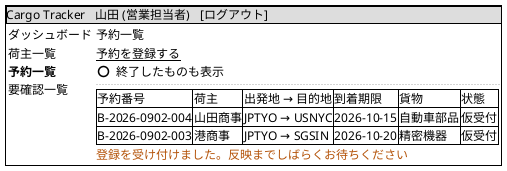

既定では**精算済とキャンセルを外し、到着期限が近い順**に並べます（「一覧の既定条件」）。終わった予約が混ざると、一覧全体が「今日やること」として信用されなくなります。外す操作は「終了したものも表示」です。

**経路設計担当もこの一覧を開きます。** ただし経路設計者の作業の入口は S30（経路設計作業一覧）です。ダッシュボード（S02 経路設計）の「経路設計を待っている予約」は S30 へ入り、S20 は予約全体を横断して見たいときに開きます。予約登録の通知（US04 §受入基準 5）と経路設計依頼の通知（US06 §受入基準 3）は送信基盤を持たないので、この件数表示が通知の代わりです。

### S02: ダッシュボード（営業）

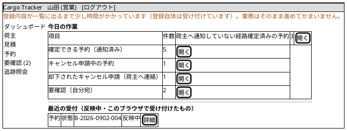

ヘッダ直下の案内は Event Processor の遅れが閾値を超えたときだけ出ます（「反映中の規約」。一度出したら最低 5 分）。「今日の作業」の件数は投影から数え、各行は対象の一覧（絞り込み済み）へ遷移します。「却下されたキャンセル申請」は却下理由を荷主へ伝える営業の仕事なので、気づく手段として置きます。「最近の受付」は本セッションでコマンド応答を受けた識別子から作り、投影に出たら消えます。

### S02: ダッシュボード（荷役・モバイル幅）

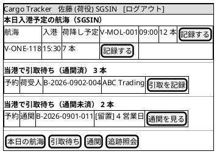

荷役作業員は港に居るので、ダッシュボードは「当港」で絞ります（港は利用者の所属から既定を決め、変更できます）。入力は 1 列、ボタンは画面幅いっぱい、ナビは下部タブです。`[記録する]` は航海番号を起点に S50 を開きます。

### S02: ダッシュボード（経路設計）

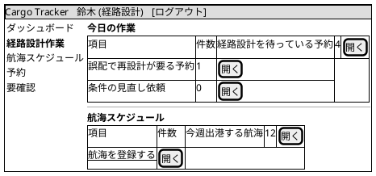

**経路設計者の入口はここです。** 経路設計依頼の通知（US06 §受入基準 3）は送信基盤を持たないので、「経路設計を待っている予約」の件数がその代わりになります。件数を出すだけでは仕事が進まないので、各行は対象を絞り込んだ一覧（S30）へ遷移します。「誤配で再設計が要る予約」は先頭に置きます。

**IT3 で作ったのは「経路設計を待っている予約」の 1 行と、S30 への導線だけです。** 誤配は S30 の先頭に出るところまで（件数の行は未実装）、「条件の見直し依頼」は US10（IT5）、「今週出港する航海」は US07（IT4）で作ります。**描いたまま誰も作らない行を残さない**ため、ここに対応するストーリーを書いておきます。

**「引き渡していない予約」の件数は営業に出します。** 引き渡すのは営業の仕事（US06）なので、経路設計者に出しても打てる手がありません。営業のダッシュボード（S02 営業）に「経路設計者へ引き渡していない予約が N 件あります」を出します。

### S30: 経路設計作業一覧

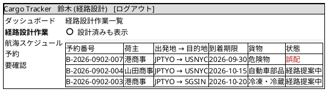

**並び順は誤配が先、そのあと到着期限が近い順**です（「画面一覧」の一覧規約）。誤配は現在地からの再設計が要り、放っておくほど選べる航海が減るためです。既定では**設計済み（`ROUTED`）を外し、誤配は含めます**。行を開くと経路設計ワークベンチ（S31）に入ります。**S31 は IT5 で作ります。それまでは予約詳細（S22）を開きます**（開く先が無い状態で一覧だけを出しても仕事にならないため）。

貨物の欄には種別を出します。危険物・冷凍冷蔵は対応する航海が限られるので、一覧の時点で分かるほうが着手の順番を決めやすくなります。

**データの供給元は予約（bookingms）です。** `routing_read_db` に予約の表は無く、この一覧のために写しは作りません（写しを作ると Booking の状態と二重管理になります）。Gateway のルートとロールで、経路設計ロールに `/api/v1/bookings` を開けます。

### S32: 航海スケジュール一覧

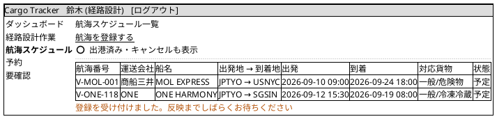

既定では**出港済みとキャンセルを外し、出発日が近い順**に並べます。出港してしまった便が混ざると、一覧全体が「これから使える航海」として信用されなくなります（S20 と同じ理由）。

日時は**当面 UTC で表示し、UTC であることを明示**します（保存は `TIMESTAMPTZ`）。出発と到着で港が違えば時間帯も違うので、利用者の居る場所の時刻に揃えると出港に間に合うかの判断を誤ります。港ごとの時間帯を持つまでは、どの時刻かを明示して出すことでその誤りを避けます。港のローカル時刻での表示は、港マスタに時間帯を持ってから行います。

**検索条件（出発地・目的地・期間）はここには置きません。** 航海スケジュール検索は US07（IT4）です。二度手間を避けて、検索は US07 でまとめて入れます。

### S33: 航海スケジュール登録

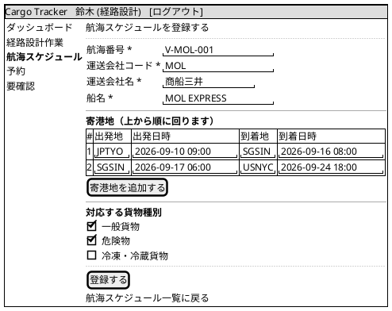

**寄港地は順序つきで 1 件以上**入れます。2 行目以降の出発地は前の行の到着地と同じでなければならず（不変条件 2）、到着日時は出発日時より後でなければなりません（不変条件 3）。**この 2 つを見るのは集約だけです。** 画面は必須項目と入力の形（UN/LOCODE は英大文字 5 文字）しか見ず、繋がっていない寄港地は送信後の 422 で分かります。同じ判断を 2 か所に置くと片方が古くなるため、判断はドメインの 1 か所に置いています。送信前に気づける形にするかは、画面を編集可能にする US25 で決めます。

**運送会社はコードと名称を入力します。** 選択肢にしていないのは、運送会社のマスタを持っていないためです（マスタを設けるかは US25 以降で判断します）。

**行の `[削除]` と `[キャンセル]` は IT3 では作っていません。** US25（更新）で行の編集が要るときに一緒に入れます。

**対応する貨物種別を 1 つも選ばないと一般貨物のみ**になります（不変条件 4）。危険物・冷凍冷蔵の予約はその種別を選んだ航海だけが候補になるので、選び忘れるとその航海が候補から消えます。既定で「一般貨物」を選んだ状態にします。

**同じ航海番号が既にあるときは、送信後に「V-MOL-001 は既に登録されています（登録済みの航海を開くか、番号を直してください）」と出します。** 登録済みの航海へのリンクは IT3 では出していません（US25 で航海詳細を作るときに繋ぎます）。押し切って登録された場合は投影の UNIQUE が弾き、その事実が要確認一覧（S70）に残ります（三段のうちの残り 2 つ）。

**更新（`/voyages/:no/edit`）は US25（IT4）です。** IT3 は登録だけを作ります。

### S21: 予約登録

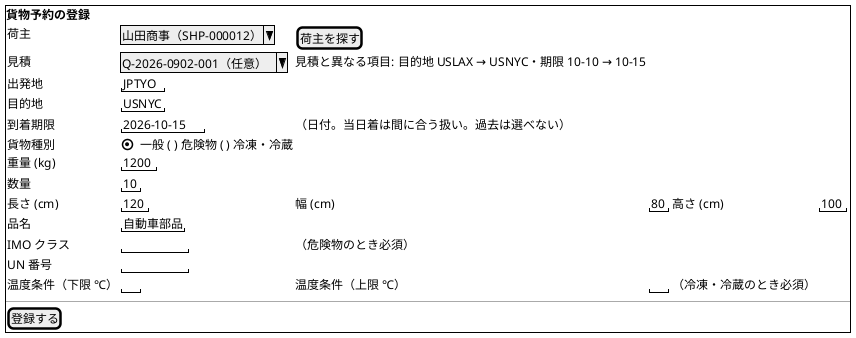

見積を選ぶと 5 項目を写し、予約で変えた項目は「見積と異なる項目」として**項目名と「何から何へ」**で知らせます（断らない。意図した変更かを判断できるようにする）。

**荷主は選びます。** 識別子を打たせると、営業は荷主一覧を開いて UUID を書き写すことになります。`[荷主を探す]` は件数が増えたときの絞り込みで、荷主が増える IT で足します。

**見積の欄と `[荷主を探す]` は US01（IT14）と荷主の増加まで出しません。** 選べない欄を先に置くと「使えない機能がある」ようにしか見えません。

**IMO クラス・UN 番号・温度条件は、その種別を選んだときだけ現れます。** 常に出すと「一般貨物なのに危険物申告を求められる」ことになります。

### S22: 予約詳細（反映中 → 表示）

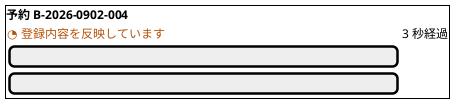

「3 秒経過」は経過秒数で、`aria-live` の領域の外に置きます（毎秒読み上げない）。30 秒で「登録内容が一覧に出るまで少し時間がかかっています（登録自体は受け付けています）」に切り替え、受付内容と再読込ボタンを出します。表示に切り替わったらフォーカスを見出し（予約番号）へ移します。

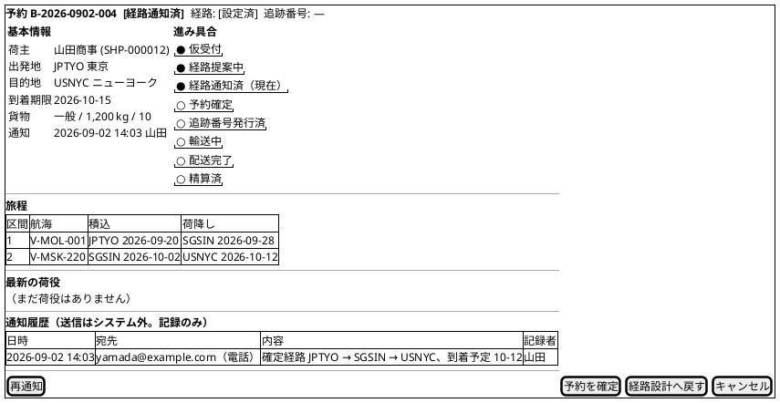

「予約を確定」を押すとボタンが「送信中…」になり（`aria-disabled`）、コマンド応答でバッジが「予約確定」になります（先行表示はしない。「楽観的更新の適用基準」に従う）。集約が拒否したら（例：別の担当者が先に「経路設計へ戻す」を押していた）`409` の本文から「田中さんが 14:05 に『経路設計へ戻す』を実行しました。再読込すると『経路設計へ』が押せます」と出し、再読込ボタンを置きます。通知履歴は `ShipperNotifiedEvent`（宛先・要約・記録者・日時）から出します。

### S22: 予約詳細（誤配）

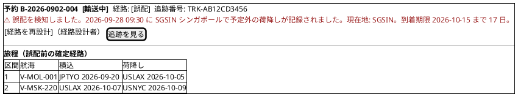

`routing_status = MISROUTED` のあいだバナー（`role="alert"`）を出し、検知した荷役（場所・日時）と現在地を示します（US18・US28）。`[経路を再設計]` は経路設計者だけに出し、S31 を現在地起点で開きます。追跡管理者・営業には「経路設計者に再設計を依頼済み」と出します。再設計で経路が確定すると経路バッジは「設定済」に戻り、旅程が新しい区間に置き換わります。到着予定が当初の期限を超えるときは差分（N 日超過）を旅程の上に出し、荷主への通知内容にも含めます。

### S23: キャンセル承認一覧・承認

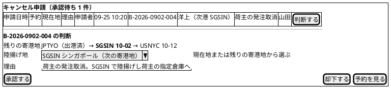

陸揚げ地の選択肢は**現在地の港（停泊中のとき）または残りの寄港地**だけです（`CancellationDecision.dischargeLocation` の不変条件と同じ規則）。承認は「送信中…」→確定表示で、承認後も予約は「キャンセル」になりますが、**追跡は陸揚げ地での荷降しが記録されるまで開いたまま**です（US30「陸揚げ地への荷降しが手配され」）。S22 と S41 に「陸揚げ待ち: SGSIN」を出し、当該港で `UNLOAD` が記録されたら追跡が閉じます。却下は理由が必須で、営業のダッシュボードに「却下されたキャンセル申請」として現れます。

### S31: 経路設計ワークベンチ

```plantuml
@startsalt
{+
  <b>経路設計  B-2026-0902-004  山田商事  JPTYO → USNYC  期限 2026-10-15  一般 1,200 kg
  {
    <b>条件
    { 出発港 | ^JPTYO 東京^ | 起点（誤配の再設計では現在地） | ^—^
      除外港 | ^なし^ | [候補を再算出] }
  }
  ---
  <b>候補（3 件）
  {#
    選択 | 経路 | 所要 | 到着 | 期限超過 | 概算
    ( ) | JPTYO → SGSIN → USNYC | 22 日 | 2026-10-12 | — | ¥ 1,840,000
    (X) | JPTYO → USLAX → USNYC | 19 日 | 2026-10-09 | — | ¥ 2,120,000
    ( ) | JPTYO → HKHKG → USNYC | 25 日 | 2026-10-15 | — | ¥ 1,690,000
  }
  通常の設計では期限に間に合わない候補は出しません。候補が 0 件のときは条件を変えるか、営業へ差し戻してください。
  ---
  [この経路で確定] | [営業へ差し戻す（条件調整）] | [戻る]
}
@endsalt
```

候補の算出は Query Bus 経由の同期処理（`GET /api/v1/routing/route-candidates`）で、反映中はありません。「この経路で確定」は複数ロールが触る予約の遷移なので「送信中…」→確定表示です。

**誤配の再設計**（S22・S41 の `[経路を再設計]` から開いたとき）は規則が変わります。出発港は現在地に固定し、目的地と期限は元の予約から引き継ぎます。**期限に間に合わない候補も出し**、「期限超過」列に超過日数（例「3 日超過」）を赤字で出します（`overdueDays`）。超過候補を確定するときは確認ダイアログで超過日数を再掲し、確定後の S22 と荷主への通知内容に差分を含めます（US28）。候補を隠すと誤配時に 0 件になり、貨物が動かせなくなるためです。

### S50: 荷役作業記録（航海起点・連続記録）

```plantuml
@startsalt
{+
  <b>荷役の記録  航海 V-MOL-001  SGSIN シンガポール  荷降し予定 12 本（済 3）
  {
    種別 | ^荷降し (UNLOAD)^ | （この航海で固定。変えるときだけ選ぶ）
    場所 | ^SGSIN シンガポール^ | （既定は当港）
    完了日時 | "2026-09-28 09:30" | SGT（JST 10:30）既定は今
    貨物 | [スキャン] | "TRK-AB12CD3456" | （手入力は補助）
    確認 | B-2026-0902-004  JPTYO → USNYC  一般  通関: —
  }
  <color:#B45309>⚠ SGSIN はこの貨物の予定ルートに含まれていません。予定外として記録し、追跡と予約に誤配を知らせます。</color>
  [記録する] | [クリア]
  ---
  <b>この航海で送信済み（3 本）
  {#
    時刻 | 貨物 | 結果 |
    09:28 | TRK-AB12CD3455 | 記録済 | [取り消す]
    09:26 | TRK-AB12CD3452 | 記録済 | [取り消す]
    09:25 | TRK-AB12CD3449 | 記録済（予定外） | [取り消す]
  }
  ---
  <b>この航海で未記録（9 本）
  {#
    貨物 | 予約 | 荷受人
    TRK-AB12CD3460 | B-2026-0902-010 | ABC Trading
  }
}
@endsalt
```

荷役作業員は 1 隻から 20〜50 本を連続で記録します。使い方に合わせて次の規則にします。

| 観点 | 規則 |
| :--- | :--- |
| 起点 | ダッシュボードで航海を選び、`FindCargosOnVoyageQuery(voyageNumber, unlocode)` で「この船からこの港で降ろす貨物」を出す。追跡番号は現場が持っていないので、貨物はスキャン（追跡番号のバーコード / QR）で特定する。手入力は補助 |
| 連続記録 | 記録後は同じフォームに戻り、種別・場所・航海番号は保ったまま貨物だけ空にする。送信済みは下に積み上がり、未記録の残りが減る。**反映中の待ち合わせは持ち込まない**（コマンド応答 `201` で完了。投影を待たない） |
| 完了日時 | 既定は「今」。入力・表示は**港（UN/LOCODE）のローカル時刻**で、JST を併記する。保存は `TIMESTAMPTZ`。期限・請求の判定は業務タイムゾーンで行い、荷役の時刻とは別の概念として扱う |
| 過去日時 | 通信不能時は紙に控えて後から入れる運用があるため、過去の日時を通す（未来は拒否） |
| 冪等 | `RegisterHandlingActivityCommand` にクライアント生成の `activityId`（UUID）を載せる。通信断で再送しても二重記録にならない。送信中に画面を閉じても、再開時に未応答の分を再送する |
| 予定外の警告 | 場所を選んだ直後（記録ボタンを押す前）に、貨物の予定ルートと突き合わせてインラインで出す。記録は拒まない（US28） |
| 引取（CLAIM） | 通関が `CLEARED` でないときだけ拒否し、**判定に使った通関状態と `customsStatusAsOf`（判定時点）**を出す。「直近で変わった可能性があります」の一文と `[通関状態を再確認]` を添える（S53 で更新した直後は投影が数秒遅れるため）。引取では荷受人の確認（サイン・氏名）が必須 |
| 訂正 | 送信済みの行の `[取り消す]` は `VoidHandlingActivityCommand(activityId, reason)`。元の記録は残り、取り消した事実が履歴に出る |

拒否メッセージの例：「通関が完了していないため引取を記録できません。判定に使った通関状態: 留置（2026-09-28 09:00 時点）。直近で変わった可能性があります。[通関状態を再確認]」。再確認は通関の投影を読み直し、`CLEARED` になっていればそのまま記録できます。

### S41: 追跡詳細・管理

```plantuml
@startsalt
{+
  <b>追跡 TRK-AB12CD3456  <b>[例外発生]</b>  現在地: SGSIN  予約: B-2026-0902-004
  {
    <b>状態の履歴
    {#
      日時 | 出来事 | 場所 | 状態
      09-20 10:00 | 受領 | JPTYO | 受領済
      09-20 15:00 | 積込 V-MOL-001 | JPTYO | 積込済
      09-21 08:00 | 出港（手動） | — | 輸送中
      09-28 09:30 | 荷降し（予定外） | SGSIN | 誤配
      09-28 11:00 | 例外起票: 誤配 | SGSIN | 例外発生
    }
  }
  ---
  <b>例外（未解決 1 件）
  <color:#991B1B>未解決の例外があるあいだ、輸送の状態は「例外発生」のままです（残り 1 件）。すべて解決すると直前の状態（誤配）に戻ります。</color>
  {#
    種別 | 緊急 | 場所 | 対応 |
    誤配 (MISROUTE) | — | SGSIN | 起票 | [対応開始] [解決]
  }
  { 推定到着日 | 2026-10-12（誤配前の旅程による。再設計後に更新） | 陸揚げ待ち | — }
  ---
  [状態を手動更新] | [例外を起票] | [経路を再設計]（経路設計者） | [荷役履歴] | [予約を見る]
}
@endsalt
```

未解決の例外がある間は `[状態を手動更新]` を押しても「例外発生」から動かないため、残り件数と復帰先（解決後に戻る状態）を先に書きます。推定到着日は確定旅程の最終区間の荷降し日で、遅延・誤配の後は再設計で更新されるまで「誤配前の旅程による」と注記します（US18）。誤配（`MISROUTED`）のときは `[経路を再設計]` を出し、S31 を現在地起点で開きます（経路設計者のみ。他ロールには「経路設計者に依頼済み」）。キャンセル承認後は「陸揚げ待ち: SGSIN」を出し、当該港の荷降しが記録されると追跡が閉じます。

### S53: 通関申告

```plantuml
@startsalt
{+
  <b>通関申告 D-2026-0912-77  追跡番号 TRK-AB12CD3456  <b>[留置]</b>  留置 4 営業日目
  {
    申告日時 | 2026-09-12 10:00
    状態の変更 | ^通関済 (CLEARED)^
    理由 | "書類の不備が解消したため"
  }
  <color:#991B1B>留置が 3 営業日を超えています。督促対象です。</color>
  ---
  [状態を更新する]
  ---
  <b>状態の履歴（イベント列から）
  {#
    日時 | 変更 | 変更者 | 理由
    09-12 10:00 | 登録 → 審査中 | 佐藤 | —
    09-13 09:00 | 審査中 → 留置 | 田中 | 原産地証明の不備
  }
}
@endsalt
```

履歴は投影テーブルではなく Event Store のイベント列から読みます。留置日数は港の所在国の休日カレンダーで数えた営業日で、画面には「営業日」と書きます。状態の更新は追跡管理者が行い、送信中表示です。更新直後の引取は投影が遅れることがあるため、S50 は判定時点を出して再確認できます。

### S61: 請求詳細・算出・入金

```plantuml
@startsalt
{+
  <b>請求書 INV-2026-1012-031  予約 B-2026-0902-004  山田商事（法人）  <b>[請求済]</b>  期限 2026-11-11
  {#
    項目 | 金額 | 根拠
    見積時の概算（Q-2026-0902-001・2 区間） | ¥ 1,020,000 | 見積の候補経路
    基本料金（3 区間・近海 2.5 + 遠洋 6.0 + 近海 2.5・1,200 kg・一般） | ¥ 1,190,000 | 実際の旅程
    法人割引 (15%) | − ¥ 178,500 | 法人契約 C-0012
    調整（誤配による再設計） | − ¥ 40,000 | [例外 EX-2026-0928-03]
    調整（留置 4 営業日の保管料） | ¥ 12,000 | [例外 EX-2026-0913-01]
    消費税（輸出免税） | ¥ 0 |
    <b>合計 | <b>¥ 983,500 |
  }
  <color:#B45309>見積時の概算との差額: + ¥ 136,500（区間数 2 → 3（誤配の再設計）、留置 4 営業日）</color>
  ---
  {
    入金日 | "2026-11-05"
    入金額 | "983500"
  }
  [入金を記録する] | [入金の記録を取り消す]
}
@endsalt
```

見積は候補経路、請求は実際の区間で計算するため、式と料率が同じでも金額は変わります。困るのは差ではなく説明できないことなので、**見積時の概算 → 請求 → 差額**と差の理由（区間数の増減・誤配・留置）を必ず出し、調整行には根拠の例外 ID（`basisExceptionId`）へのリンクを置きます（US28「料金調整の根拠として参照できる」）。見積を経ない予約では概算行と差額を出しません。`[入金の記録を取り消す]` は直前の入金記録を取り消して「請求済」に戻す操作で（請求書自体の取消は別。理由が必須）、入金記録と同じく送信中表示です。期限超過は `due_on < 今日`（業務タイムゾーン）で判定し、当日は超過ではありません。

### S70: 要確認一覧

```plantuml
@startsalt
{+
  <b>要確認（自分宛 2 件）  [ ] 全ロール分を表示
  {#
    発生 | 種別 | 対象 | 理由 | 確認期限 |
    <color:#991B1B>08-29 14:10（4 日経過）</color> | 反映の拒否 | 荷主 SHP-000048 | メールアドレスが既存の荷主と重複 | 08-30 | [既存の荷主を見る] [修正して再登録] [確認済み]
    09-01 23:40 | 追跡の開始に失敗 | B-2026-0901-011 | 追跡サービスの応答なし（再試行 5 回） | 09-02 | [予約を見る] [再試行] [確認済み]
  }
}
@endsalt
```

集約は受け付けたが投影が弾いたもの、連鎖が補償に至ったものを `attention_item`（bookingms・trackingms・billingms の各 Read DB）から出します。「例外にしない」は「記録しない」ではありません。

| 観点 | 規則 |
| :--- | :--- |
| 誰が直すか | 各項目は `assigned_role` を持ち、**既定で自ロール宛だけ**を出す（全員に見えるものは誰も直さない）。荷主の重複は営業、Saga の失敗は追跡、請求の失敗は経理 |
| どう直すか | 「反映の拒否」は投影に行が無いので `[荷主を見る]` は 404 になる。重複相手は **`[既存の荷主を見る]`** で開く（重複なのだから、多くの場合はこれで済む）。**`[修正して再登録]` は空の S11 を開く**。受け付けた内容（`payload`）には個人情報が入っており、応答に載せると鍵を破棄しても要確認一覧に平文が残るため（[ADR-0003](../../adr/cargo-tracker/0003-crypto-shredding-for-personal-data.md) 決定 6）。**空である理由を画面に書く** |
| 期限 | 発生日の翌営業日を確認期限とし、未確認のまま **3 日を超えた行を強調**する。件数はダッシュボードの「要確認（自分宛）」に出る |
| 確認済み | `acknowledged_at` / `acknowledged_by` を記録して既定表示から外す。消さない |

### S44: 公開追跡照会

```plantuml
@startsalt
{+
  <b>貨物の追跡
  { 追跡番号 | "TRK-AB12CD3456" | [照会] }
  ---
  <b>TRK-AB12CD3456  <b>[輸送中]</b>
  {
    出発 | JPTYO 東京  2026-09-21
    到着予定 | USNYC ニューヨーク  2026-10-12
    現在 | SGSIN シンガポール（荷降し済）
  }
  {#
    日時 | 出来事 | 場所
    09-20 | 受領 | 東京
    09-21 | 出港 | 東京
    09-28 | 荷降し | シンガポール
  }
  30 秒ごとに更新します。
  ---
  到着が遅れる場合のお問い合わせ: support@example.com / 03-xxxx-xxxx（予約番号または追跡番号をお伝えください）
}
@endsalt
```

```plantuml
@startsalt
{+
  <b>貨物の追跡
  { 追跡番号 | "TRK-AB12CD345" | [照会] }
  <color:#991B1B>追跡番号が見つかりません。</color>
  追跡番号は「TRK-」で始まる 14 桁です（例: TRK-AB12CD3456）。予約確定の案内に記載されています。
  見つからない場合は出荷元の担当者、またはお問い合わせ窓口にご連絡ください。
}
@endsalt
```

| 観点 | 規則 |
| :--- | :--- |
| 見つからない | 「追跡番号が見つかりません」と入力形式のヒント、問い合わせの出口を出す（US18）。存在しない番号と権限の無い番号を区別しない |
| 入力形式 | 大文字小文字・ハイフン有無を吸収し、形式が違えば照会前に赤字で知らせる |
| 問い合わせの出口 | 遅延中の荷受人が次に取れる行動として、窓口の連絡先を常に出す。遅延・誤配の詳細は出さない |
| 総当たり対策 | 同一 IP から 1 分に 10 回を超える照会は Gateway で `429` にし、「しばらく待ってから再度お試しください」を出す。追跡番号は推測しにくい形式（英数 10 桁）にする |

公開画面には例外の詳細・荷主名・金額を出しません。

### S46: 自社予約の進み具合（荷主）

```plantuml
@startsalt
{+
  <b>予約 B-2026-0902-004  <b>[経路通知済]</b>  JPTYO 東京 → USNYC ニューヨーク  到着期限 2026-10-15
  {
    {
      <b>進み具合
      "● 仮受付  09-02"
      "● 経路提案中  09-02"
      "● 経路通知済（現在）  09-02"
      "○ 予約確定"
      "○ 追跡番号発行"
      "○ 輸送中"
      "○ 配送完了"
    } |
    {
      <b>確定旅程
      {#
        区間 | 航海 | 積込 | 荷降し
        1 | V-MOL-001 | JPTYO 09-20 | SGSIN 09-28
        2 | V-MSK-220 | SGSIN 10-02 | USNYC 10-12
      }
      到着予定 2026-10-12（期限内）
    }
  }
  ---
  <b>ご連絡の記録
  {#
    日時 | 内容
    09-02 14:03 | 確定経路と到着予定をお電話でご案内しました
  }
  ---
  [予約一覧へ] | [追跡を見る]（追跡番号発行後） | [請求書を見る]（請求後）
}
@endsalt
```

追跡番号は予約確定後に発行されるため、予約から確定までの数日間は荷主に何も見えません。S45（自社予約一覧）と S46 でその期間を埋めます。出すのは状態バッジ・進み具合・確定旅程・通知履歴だけで、金額・社内メモ・担当者名は出しません（`FindShipperBookingProgressQuery`。authms の荷主 ID で絞る）。S62（自社請求書）は S61 のうち金額の内訳と差額の理由だけを出し、入金の操作は置きません。

## インタラクション設計

### 一般原則

| 観点 | 方針 |
| :--- | :--- |
| フォーム送信 | 送信中はボタンを `aria-disabled` + スピナー（フォーカスは保つ）。二重送信を防ぐ。荷役記録は冪等キーでも守る |
| コマンド成功 | トースト「受け付けました」。反映の案内は画面共通の規約に従う |
| 反映待ち | 詳細は `202` のあいだ 1 秒間隔、上限 30 秒（ヘッダの遅れ表示中は最初の `202` で案内に切り替え）。一覧は `invalidateQueries` + 反映中の行の差し込み。荷役記録（S50）は投影を待たない |
| 楽観的更新 | 「楽観的更新の適用基準」に従う。単独作業だけ先行表示、複数ロールが触る遷移は「送信中…」→確定表示 |
| バリデーション | クライアントで即時検証、サーバーの `400` はフィールドに対応付ける |
| 認可 | 表示制御はロールで、最終的な拒否はサーバーの `403`。認可は入力検証より先に返る |
| 離脱 | 未保存のフォームから離れるときは確認 |

### コマンド送信から反映までの流れ

```plantuml
@startuml
title コマンド送信から投影の反映まで

actor 利用者
participant "Container" as C
participant "useMutation" as M
participant "Gateway → サービス\n(Command)" as Cmd
participant "Gateway → サービス\n(Query)" as Q

利用者 -> C : 送信
C -> M : mutate
M -> Cmd : POST
Cmd --> M : 201 Created {bookingId}
M -> C : onSuccess
C -> 利用者 : トースト「受け付けました」
C -> Q : GET /bookings/{id}
Q --> C : 202 Accepted（投影がまだ無い）
C -> 利用者 : 「反映中」バナー + スケルトン
loop 1 秒間隔・最大 30 秒
  C -> Q : GET /bookings/{id}
end
Q --> C : 200 OK
C -> 利用者 : 詳細を表示
@enduml
```

### エラー処理

| 種別 | 表示 | 復帰 |
| :--- | :--- | :--- |
| 入力エラー（`400`） | フィールド直下に赤字、先頭にフォーカス | 修正して再送信 |
| 未認証（`401`） | ログイン画面へ。トースト「セッションが切れました」 | 再ログイン |
| 権限なし（`403`） | 403 画面 | 戻る |
| 見つからない（`404`） | 専用画面 | 一覧へ |
| 反映待ち（`202`） | 「反映中」バナー | 自動再取得 |
| 状態の競合（`409`） | 「状態が変わっています」+ 本文の `lastEvent {action, actor, at}` から「田中さんが 14:05 に『経路設計へ戻す』を実行しました」+ `allowedActions[]` から「再読込すると『経路設計へ』が押せます」+ 再読込。`role="alert"` | 再読込して予告された操作を行う |
| 業務規則違反（`422`） | 理由をモーダル（`role="alert"`）で表示。通関未済の引取は判定に使った状態と時点を出す（例：「通関が完了していないため引取を記録できません。判定に使った通関状態: 留置（09-28 09:00 時点）。直近で変わった可能性があります」）+ `[通関状態を再確認]` | 操作を見直す。再確認で通っていればそのまま記録 |
| 提供側サービスの停止（経路候補の算出など、`503`） | 「経路サービスが応答していません」+ 再試行 | 時間をおく |
| 通信エラー / `5xx` | 汎用トースト | 再試行 |
| 反映が長引く | 30 秒（ヘッダの遅れ表示中は即時）で「登録内容が一覧に出るまで少し時間がかかっています（登録自体は受け付けています）」+ 受付内容 + 再読込 | 業務は受付内容で進める。手動更新 |
| 照会の連打（`429`、S44） | 「しばらく待ってから再度お試しください」 | 時間をおく |

### 主要操作シナリオ

| シナリオ | 手順 | 反映中の見え方 |
| :--- | :--- | :--- |
| 荷主を登録し予約を作る | S11 で登録 → 一覧に「反映には数秒」→ 行が出る → S21 で荷主を選び登録 → S22 が反映中 → 表示 | S11 直後の一覧に行が無い時間がある |
| 経路を設計して確定する | S30 で依頼を選ぶ → S31 で候補を算出・選択 → 確定 → S22 に戻り「経路: 設定済」 | 確定は送信中表示 |
| 荷主へ通知し確定する | S22 で「荷主へ通知」（宛先・要約を記録。送信は手作業）→ バッジが「経路通知済」→「予約を確定」→「予約確定」 | 送信中表示。競合時は 409 の本文で誰が何をしたかを出す |
| 荷役を記録し誤配を扱う | 荷役 S02 で航海を選ぶ → S50 でスキャン → 場所選択直後に予定外の警告 → 記録 → S22・S41 に誤配バナー → 経路設計者が `[経路を再設計]` で S31 を現在地起点で開き、超過日数を見て確定 → S22 の旅程が更新 | S50 は待たない。S41・S22 への反映は数秒 |
| 通関を留置から通関済みにする | S52 で留置 3 営業日超を見る → S53 で理由を書き更新 → S41 の例外が解決可能に → S50 で引取。直後に拒否されたら判定時点を見て再確認 | S41・S50 への反映は数秒 |
| 輸送中の予約をキャンセルする | 営業が S22 で申請 → 追跡管理者が S23 で陸揚げ地（現在地または残りの寄港地）を指定して承認 → S22 が「キャンセル」、S41 は「陸揚げ待ち」→ 陸揚げ地で荷降しを記録 → S41 が閉じる | 承認は送信中表示 |
| 却下されたキャンセル申請に気づく | 追跡管理者が S23 で却下 → 営業の S02 に「却下されたキャンセル申請」→ S22 の履歴で理由を見て荷主へ連絡（記録） | S02 への反映は数秒 |
| 請求と入金 | 配送完了で S61 に算出済みが現れる（見積時概算との差額と理由つき）→ 発行 → 入金記録 → S22 が「精算済」 | S22 への反映は数秒 |
| 荷主が進み具合を見る | S45 で自社予約を選ぶ → S46 で進み具合・確定旅程・連絡の記録 → 追跡番号発行後は S41、請求後は S62 | ポーリング |
| 反映の拒否を直す | S11 で登録 → S10 に反映中の行 → 投影が重複で弾く → S70（営業宛）に出る → `[修正して再登録]` で受付内容入りの S11 → 修正して登録 | 差し込んだ行は S70 に移る |

## レスポンシブ・アクセシビリティ

| 項目 | 方針 |
| :--- | :--- |
| 荷役ロールの画面（S02 荷役・S50〜S53）と公開追跡（S44） | モバイル幅で使える。入力は 1 列、ボタンは画面幅いっぱい、ナビは下部タブ。荷役の無操作タイムアウトは 60 分 |
| その他の業務画面 | デスクトップ前提。1024px 以上 |
| キーボード | すべての操作をキーボードで完了できる。フォーカス可視。**キーボードだけで `409` を受けて再読込し、予告された操作を押す E2E を 1 本置く** |
| 状態バッジ | 色だけに頼らず文字を併記 |
| コントラスト | WCAG AA（次の色トークン表） |

### アクセシビリティの難所（axe-core が検出しない 4 点）

| 場面 | 規約 |
| :--- | :--- |
| バッジの変化 | 状態バッジの親に `role="status"`（`aria-live="polite"`）を置き、「予約確定になりました」と文で読み上げる。バッジの色変化だけにしない |
| `409` / `422` | モーダルまたはバナーを `role="alert"`（`aria-live="assertive"`）にし、開いたらフォーカスを本文へ移す。閉じたら押したボタンへ戻す |
| 送信中のボタン | `disabled` にしない（フォーカスが本文先頭へ飛び、読み上げが途切れる）。`aria-disabled="true"` にしてフォーカスを保ち、クリック・Enter を無視する |
| 秒カウンタ | 「N 秒経過」は `aria-live` 領域の**外**に置く（毎秒読み上げない）。反映中バナー本文だけ `aria-live="polite"` |
| 反映中 → 表示 | 詳細が出たらフォーカスを見出し（`<h1>` の予約番号）へ移し、「予約 B-… を表示しました」と `role="status"` で 1 回だけ読み上げる |

### 色トークン

| トークン | 用途 | 前景 / 背景 | コントラスト比 |
| :--- | :--- | :--- | :--- |
| `badge-pending` | 反映中 | `#B45309` on `#FFFBEB` | 5.9 : 1（AA） |
| `badge-neutral` | 未設定・仮受付・精算済・取消 | `#374151` on `#F3F4F6` | 9.4 : 1（AA） |
| `badge-info` | 経路提案中・経路通知済・請求済 | `#1E40AF` on `#DBEAFE` | 8.6 : 1（AA） |
| `badge-success` | 予約確定〜配送完了・通関済・入金済 | `#065F46` on `#D1FAE5` | 7.4 : 1（AA） |
| `badge-warning` | 設計依頼中・審査中・算出済・予定外 | `#92400E` on `#FEF3C7` | 7.6 : 1（AA） |
| `badge-danger` | 誤配・例外発生・留置・不可・キャンセル・3 日超 | `#991B1B` on `#FEE2E2` | 7.9 : 1（AA） |
| `text-link` | リンク | `#1D4ED8` on `#FFFFFF` | 6.3 : 1（AA） |

橙・黄は淡色背景に濃色の文字で組み、白地に橙文字（`#F59E0B` on `#FFFFFF` は 2.2 : 1）を使いません。ダークテーマは同じ比率を満たす別トークンを用意し、実装時に axe-core と手動で確かめます。

## 付録：ステータスバッジ

| 種別 | 値 | 表示 | 色 |
| :--- | :--- | :--- | :--- |
| BookingStatus | `PRELIMINARY` | 仮受付 | グレー |
| | `ROUTE_PROPOSED` | 経路提案中 | 青 |
| | `ROUTE_NOTIFIED` | 経路通知済 | 青 |
| | `CONFIRMED` | 予約確定 | 緑 |
| | `TRACKING_ISSUED` | 追跡番号発行済 | 緑 |
| | `IN_TRANSIT` | 輸送中 | 緑 |
| | `DELIVERED` | 配送完了 | 緑 |
| | `SETTLED` | 精算済 | グレー |
| | `CANCELLED` | キャンセル | 赤 |
| RoutingStatus | `NOT_ROUTED` | 未設定 | グレー |
| | `ROUTING_REQUESTED` | 設計依頼中 | 黄 |
| | `ROUTED` | 設定済 | 緑 |
| | `MISROUTED` | 誤配 | 赤 |
| TransportStatus | `NOT_RECEIVED` | 未受領 | グレー |
| | `RECEIVED` | 受領済 | 緑 |
| | `LOADED` | 積込済 | 緑 |
| | `IN_TRANSIT` | 輸送中 | 緑 |
| | `UNLOADED` | 荷降し済 | 緑 |
| | `AWAITING_CLAIM` | 引取待ち | 黄 |
| | `DELIVERED` | 引取済 | 緑 |
| | `MISROUTED` | 誤配 | 赤 |
| | `EXCEPTION` | 例外発生 | 赤 |
| CustomsStatus | `PENDING` | 審査中 | 黄 |
| | `CLEARED` | 通関済 | 緑 |
| | `HELD` | 留置 | 赤 |
| | `REJECTED` | 不可 | 赤（行動を要する。グレーにしない） |
| BillingStatus | `PENDING` / `CALCULATED` / `INVOICED` / `PAID` / `VOID` | 算出待ち / 算出済 / 請求済 / 入金済 / 取消 | グレー / 黄 / 青 / 緑 / グレー |
| 反映 | `pending` | 反映中 | オレンジ（`badge-pending`） |

同じ英語名が別の種別にあるもの（`DELIVERED`・`MISROUTED`）は、S22 のヘッダのように複数の種別が並ぶ場所では**文脈語**を付けます：「予約: 配送完了」「輸送: 引取済」「経路: 誤配」「輸送: 誤配」。単独のバッジ（一覧の 1 列）では列見出しが文脈語の代わりになるので付けません。色は「色トークン」の定義に対応します（グレー = `badge-neutral`、黄 = `badge-warning`、青 = `badge-info`、緑 = `badge-success`、赤 = `badge-danger`）。

## トレーサビリティ（UC ↔ 画面）

| UC | 画面 |
| :--- | :--- |
| UC01 見積作成 | S12, S13 |
| UC02 荷主登録 | S10, S11 |
| UC03 貨物予約登録 | S20, S21, S22 |
| UC04 予約引渡 | S22, S30 |
| UC05 航海検索 | S32 |
| UC06〜UC09 経路候補算出・選択・調整・紐付 | S31 |
| UC10 確定経路通知 | S22 |
| UC11 予約確定 | S22 |
| UC12 追跡番号発行 | S22 |
| UC13 荷役作業記録 | S50, S51 |
| UC14 貨物状態更新 | S41 |
| UC15 追跡情報照会 | S40, S41, S44 |
| UC16 例外処理 | S41, S42, S43 |
| UC17 輸送料金算出 | S61 |
| UC18 精算処理 | S60, S61 |
| UC19 航海スケジュール登録 | S32, S33 |
| UC20 認証 | S00 |
| UC21 通関申告 | S52, S53 |
| UC22 予約キャンセル | S22, S23 |
| US28 誤配 | S50, S22, S41, S31 |
| US31 アカウント保護 | S00, S90 |

## トレーサビリティ（US ↔ 画面）

UC が 1 対 1 で US に落ちないストーリー（US05・US10・US16・US20・US22・US27）も含め、全 31 US を画面に対応付けます。受入基準は書き写さず「US18 §受入基準 4」のように引用します。

| US | 画面 | 備考 |
| :--- | :--- | :--- |
| US01 輸送見積を作成する | S12, S13 | S12 → S13 は登録直後の詳細 |
| US02 荷主を登録する | S10, S11, S70 | メール重複は問いかけ。投影の拒否は S70 から「修正して再登録」 |
| US03 法人荷主を登録する | S11 | 種別「法人」で契約番号を入力 |
| US04 貨物予約を登録する | S20, S21, S22 | 予約番号はコマンド応答で即座に返る |
| US05 危険物・冷凍貨物の予約を登録する | S21 | IMO クラス・UN 番号・温度条件の条件付き必須 |
| US06 予約情報を経路設計者に引き渡す | S22, S30 | |
| US07 航海スケジュールを検索する | S32 | |
| US08 経路候補を算出する | S31 | |
| US09 経路を選択・確定する | S31, S22 | |
| US10 経路条件を調整して再算出する | S31 | 出発港・除外港を変えて再算出、営業へ差し戻し |
| US11 経路情報を予約に紐付ける | S22 | 旅程 |
| US12 確定経路を荷主に通知する | S22, S46 | 通知した事実の記録。送信はスコープ外 |
| US13 予約を確定する | S22 | 通知していない予約は確定できない（`409` の本文で予告） |
| US14 追跡番号を発行する | S22, S41 | |
| US15 荷役作業を記録する | S02（荷役）, S50, S51 | 航海起点・連続記録・現地時刻 |
| US16 引取作業を記録する | S50 | 通関未済は判定時点つきで拒否。荷受人の確認必須 |
| US17 貨物状態を手動更新する | S41 | 未解決の例外があるあいだは動かない旨を先に出す |
| US18 追跡情報を照会する | S44, S40, S41, S45, S46 | 見つからない表示・推定到着日 |
| US19 遅延例外を処理する | S41, S42, S43 | |
| US20 破損・紛失例外を処理する | S41, S42, S43 | 紛失は一覧の先頭 |
| US21 輸送料金を算出する | S61 | 見積時概算との差額と理由 |
| US22 法人割引を適用する | S61 | 割引行に契約番号 |
| US23 精算を処理する | S60, S61, S62, S22 | |
| US24 航海スケジュールを新規登録する | S32, S33 | |
| US25 既存航海スケジュールを更新する | S32, S33 | |
| US26 システムにログインする | S00, S02 | |
| US27 システムからログアウトする | S03（ヘッダの `[ログアウト]`） | セッション破棄後に S00。ブラウザバックで戻れない |
| US28 誤配を検知して経路を再設計する | S50, S22, S41, S31, S42 | 警告バナー・`[経路を再設計]`・超過日数 |
| US29 通関申告を登録・管理する | S52, S53, S50 | 留置 3 営業日超の強調。通関直後の引取は再確認 |
| US30 輸送中の予約キャンセルを承認する | S22, S23, S41, S02（営業） | 陸揚げ地の制約。承認後も荷降しまで追跡は開く。却下は営業のダッシュボードへ |
| US31 認証失敗が続いたアカウントを保護する | S00, S90 | |

## 参照

- [フロントエンドアーキテクチャ](architecture_frontend.md)
- [ドメインモデル設計](domain-model.md)（状態遷移表・バッジの値）
- [ユーザーストーリー](../../requirements/user_story.md)、[システムユースケース](../../requirements/system_usecase.md)
- [UI 設計ガイド](../../reference/UI設計ガイド.md)
- 参照元：`tmp/take-4/docs/design/ui_design.md`、[java-3 UI 設計](../../article/source/java-3/docs/design/ui_design.md)
