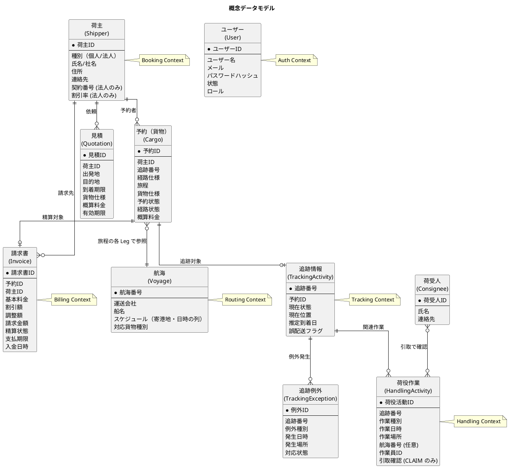
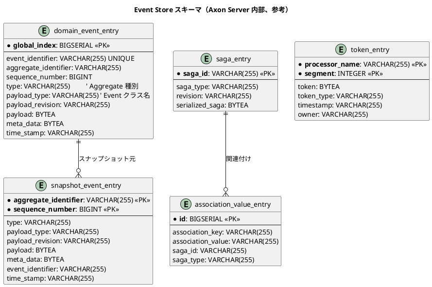
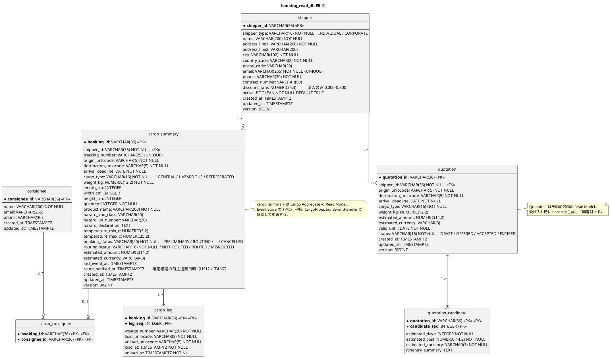
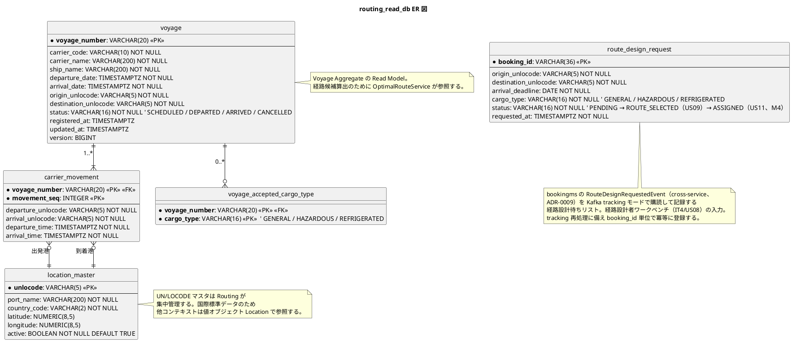
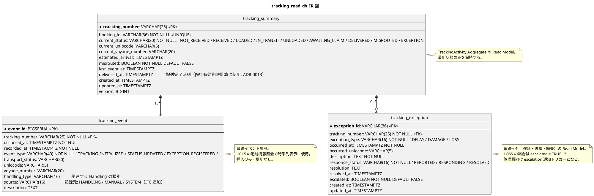
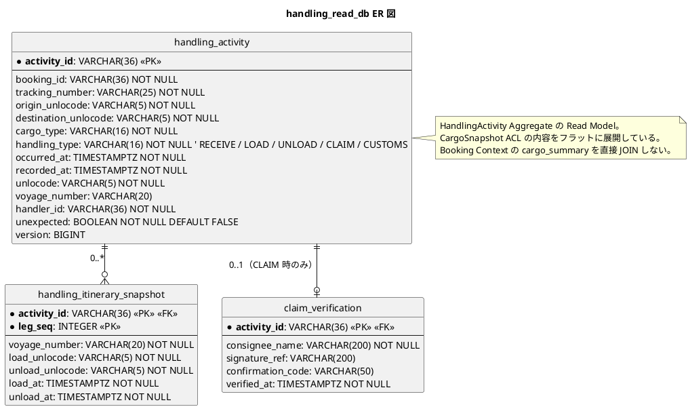
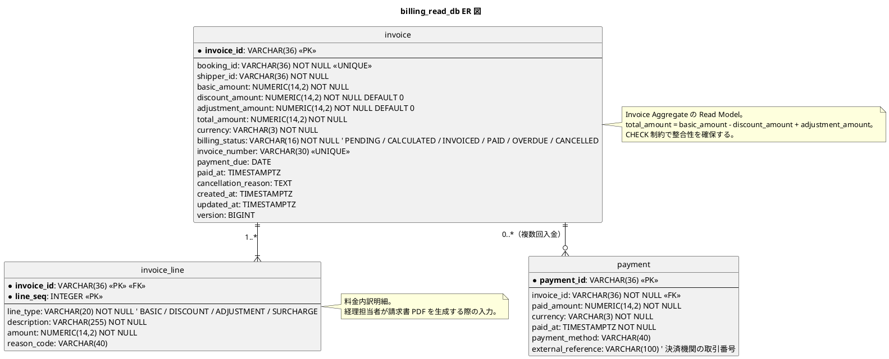
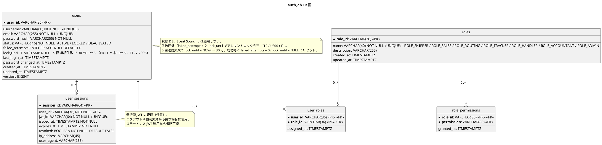

# データモデル設計 - 国際貨物輸送管理システム

## 概要

本ドキュメントでは、国際貨物輸送管理システムの永続化データモデルを定義する。Axon Framework 5 の CQRS + Event Sourcing アーキテクチャに基づき、データは次の 4 種類に分かれる。

| 種別 | 役割 | 永続化先 | 管理主体 |
| :--- | :--- | :--- | :--- |
| **Event Store** | すべての状態変更を不変イベント列として保持する真実の単一情報源 | Axon Server（EBS / EFS） | Axon Server |
| **Saga Store** | 実行中の Saga インスタンスの関連付け・状態 | Axon Server | Axon Server |
| **Read Model（Projection）** | クエリ最適化された読み取り用の状態 | 各マイクロサービス専用の PostgreSQL | 各マイクロサービス |
| **状態 DB（Auth のみ）** | Event Sourcing 適用外の CRUD データ | `auth_db`（PostgreSQL） | Auth Service |

ドメインモデル（[`domain-model.md`](domain-model.md)）との整合を保ち、Aggregate はイベント列として Event Store に保存され、Read Model は `@EventHandler` で更新される。

## 概念データモデル

業務概念レベルでのエンティティとリレーションシップ。コンテキスト境界を越える参照は識別子値（値オブジェクト）で表現する。



## 物理データベース構成（Database per Service）

各マイクロサービスは専用の PostgreSQL データベースを持つ。Event Store のみが横断的に Axon Server に集約される。

| サービス | データベース名 | 用途 | 主要テーブル |
| :--- | :--- | :--- | :--- |
| Axon Server | （Axon 内部ストレージ） | Event Store | `domain_event_entry`, `snapshot_event_entry` |
| authms | `auth_db` | 認証・認可（CRUD）+ Axon Token Store | `users`, `roles`, `user_roles` + `token_entry`, `saga_entry`, `association_value_entry` |
| bookingms | `booking_read_db` | 予約 Read Model + Axon Token / Saga Store | `cargo_summary`, `cargo_leg`, `shipper`, `quotation`, `quotation_candidate` + `token_entry`, `saga_entry`, `association_value_entry` |
| routingms | `routing_read_db` | 航海 Read Model + 経路設計依頼（cross-service）+ Axon Token Store | `voyage`, `carrier_movement`, `voyage_accepted_cargo_type`, `route_design_request` + `token_entry`, `saga_entry`, `association_value_entry` |
| trackingms | `tracking_read_db` | 追跡 Read Model + Axon Token Store | `tracking_summary`, `tracking_event`, `tracking_exception` + `token_entry`, `saga_entry`, `association_value_entry` |
| handlingms | `handling_read_db` | 荷役 Read Model + Axon Token Store | `handling_activity`, `claim_verification` + `token_entry`, `saga_entry`, `association_value_entry` |
| billingms | `billing_read_db` | 精算 Read Model + Axon Token Store | `invoice`, `payment` + `token_entry`, `saga_entry`, `association_value_entry` |

> **データアクセス方式**: 本プロジェクトは **MyBatis** を採用する。Read Model / Auth DB のすべてのテーブルは MyBatis Mapper（XML / Annotation）でアクセスする。Axon の `JdbcTokenStore` / `JdbcSagaStore` は標準実装を使用し、Read Model と同一 DataSource を共有することで `@EventHandler` 内の Projection 更新と Token 更新が **同一 JDBC トランザクション** で処理される。

すべてのテーブルに共通で監査カラムを持たせる。

| カラム | 型 | 用途 |
| :--- | :--- | :--- |
| `created_at` | `TIMESTAMP WITH TIME ZONE NOT NULL DEFAULT NOW()` | 作成日時 |
| `updated_at` | `TIMESTAMP WITH TIME ZONE NOT NULL DEFAULT NOW()` | 更新日時 |
| `version` | `BIGINT NOT NULL DEFAULT 0` | 楽観的並行制御用バージョン番号 |

## Event Store（Axon Server 管理）

Axon Server がデフォルトで管理するスキーマ。マイクロサービスのコードはこのテーブルへ直接 SQL を発行せず、Axon の `EventStore` API を介してアクセスする。



### 運用上の注意

- **アクセス方式**: コードからは `EventStore` / `EventGateway` を介し、SQL 直接アクセス禁止
- **スナップショット**: イベント数が一定（既定 50 件）を超えた集約には自動でスナップショットを取得
- **トークン管理**: 各 `@EventHandler`（Tracking Event Processor）の進捗を `token_entry` で記録
- **再生**: Token をリセットすると Projection を Event Store から再構築可能（H1 / M11 / M12 対応で重要）
- **バックアップ**: EBS スナップショット + S3 エクスポート（インフラ設計参照）

## Read Model 詳細設計

### Booking Read Model（`booking_read_db`）



#### インデックス・制約

| テーブル | インデックス・制約 | 用途 |
| :--- | :--- | :--- |
| `shipper` | `UNIQUE(email)` | 重複登録チェック（UC02 拡張 4a） |
| `shipper` | `CHECK(discount_rate BETWEEN 0 AND 0.3)` | 割引率 0〜30% の制約（US03） |
| `shipper` | `CHECK(shipper_type = 'CORPORATE' OR (contract_number IS NULL AND discount_rate IS NULL))` | 個人荷主は契約情報を持たない |
| `cargo_summary` | `UNIQUE(tracking_number)` | 追跡番号の一意性 |
| `cargo_summary` | `INDEX(shipper_id)`, `INDEX(booking_status)`, `INDEX(routing_status)` | 一覧画面の絞り込み |
| `cargo_summary` | `CHECK(arrival_deadline >= CURRENT_DATE - INTERVAL '5 years')` | 不正な期限の検出 |
| `cargo_leg` | `INDEX(voyage_number)` | 航海変更時の影響範囲特定 |
| `quotation` | `INDEX(shipper_id, status)` | 荷主別の見積検索 |
| `cargo_summary` | `INDEX(created_at DESC)` | 一覧のデフォルトソート・LIMIT/OFFSET ページネーション（ADR-0008、IT3 で Flyway 追加予定） |

### Routing Read Model（`routing_read_db`）



#### インデックス・制約

| テーブル | インデックス・制約 | 用途 |
| :--- | :--- | :--- |
| `voyage` | `INDEX(origin_unlocode, destination_unlocode, departure_date)` | 経路検索の高速化（UC05） |
| `voyage` | `CHECK(arrival_date > departure_date)` | 日付整合性（UC19 拡張 3b） |
| `carrier_movement` | `CHECK(arrival_time > departure_time)` | 移動ごとの整合性 |
| `voyage_accepted_cargo_type` | `INDEX(cargo_type)` | 貨物種別での絞り込み |
| `location_master` | `INDEX(country_code)` | 国別のマスタ管理 |

### Tracking Read Model（`tracking_read_db`）



#### インデックス・制約

| テーブル | インデックス・制約 | 用途 |
| :--- | :--- | :--- |
| `tracking_summary` | `UNIQUE(booking_id)` | 予約と追跡の 1:1 |
| `tracking_summary` | `INDEX(current_status)`, `INDEX(misrouted)` | 例外監視ダッシュボード用 |
| `tracking_event` | `INDEX(tracking_number, occurred_at)` | 時系列照会の高速化（UC15） |
| `tracking_event` | `INDEX(event_type, recorded_at)` | 監査・分析クエリ |
| `tracking_exception` | `INDEX(tracking_number, response_status)` | 例外対応ダッシュボード |
| `tracking_exception` | `CHECK(resolved_at IS NULL OR response_status = 'RESOLVED')` | 解決時刻の整合性 |

### Handling Read Model（`handling_read_db`）



#### インデックス・制約

| テーブル | インデックス・制約 | 用途 |
| :--- | :--- | :--- |
| `handling_activity` | `INDEX(tracking_number, occurred_at)` | 追跡番号別の作業履歴 |
| `handling_activity` | `INDEX(voyage_number)` | 航海単位での作業集計 |
| `handling_activity` | `INDEX(handler_id)` | 作業員別の実績 |
| `handling_activity` | `UNIQUE(tracking_number, handling_type, unlocode, date_trunc('minute', occurred_at))` | 重複登録防止（5 分粒度） |
| `claim_verification` | `CHECK(signature_ref IS NOT NULL OR confirmation_code IS NOT NULL)` | 引取時の確認手段必須（US16） |

### Billing Read Model（`billing_read_db`）



#### インデックス・制約

| テーブル | インデックス・制約 | 用途 |
| :--- | :--- | :--- |
| `invoice` | `UNIQUE(booking_id)` | 1 予約 1 請求 |
| `invoice` | `UNIQUE(invoice_number) WHERE invoice_number IS NOT NULL` | 請求書番号の一意性（発行後のみ） |
| `invoice` | `INDEX(shipper_id, billing_status)` | 荷主別の請求一覧 |
| `invoice` | `INDEX(billing_status, payment_due)` | 督促対象の抽出 |
| `invoice` | `CHECK(total_amount = basic_amount - discount_amount + adjustment_amount)` | 金額の整合性 |
| `invoice` | `CHECK(discount_amount >= 0 AND adjustment_amount >= 0 AND basic_amount >= 0)` | 非負制約 |
| `payment` | `INDEX(invoice_id)` | 請求書ごとの入金履歴 |

### Auth DB（`auth_db`）

Event Sourcing 適用外。通常の状態 DB として CRUD で運用する。



#### インデックス・制約

| テーブル | インデックス・制約 | 用途 |
| :--- | :--- | :--- |
| `users` | `UNIQUE(username)`, `UNIQUE(email)` | 一意性保証 |
| `users` | `INDEX(status)` | アクティブユーザー検索 |
| `user_sessions` | `INDEX(user_id, revoked)`, `INDEX(expires_at)` | 失効処理・セッション検索 |

## ドメインモデルとのマッピング

ドメインモデル（[`domain-model.md`](domain-model.md)）の集約・値オブジェクトと物理テーブルの対応。

| コンテキスト | Aggregate / 値オブジェクト | Event Store | Read Model テーブル |
| :--- | :--- | :--- | :--- |
| Booking | `Cargo`（集約） | Axon Server | `cargo_summary`, `cargo_leg`, `cargo_consignee` |
| Booking | `Shipper`（集約） | Axon Server | `shipper` |
| Booking | `Consignee`（エンティティ） | （Cargo の一部） | `consignee` |
| Booking | `Quotation`（集約） | Axon Server | `quotation`, `quotation_candidate` |
| Routing | `Voyage`（集約） | Axon Server | `voyage`, `carrier_movement`, `voyage_accepted_cargo_type` |
| Routing | `Location`（VO・マスタ） | - | `location_master`（マスタ） |
| Tracking | `TrackingActivity`（集約） | Axon Server | `tracking_summary`, `tracking_event` |
| Tracking | `TrackingException`（エンティティ） | （TrackingActivity の一部） | `tracking_exception` |
| Handling | `HandlingActivity`（集約） | Axon Server | `handling_activity`, `handling_itinerary_snapshot`, `claim_verification` |
| Billing | `Invoice`（集約） | Axon Server | `invoice`, `invoice_line`, `payment` |
| Auth | `User`（集約） | - | `users`, `user_roles`, `user_sessions` |
| Auth | `Role`（エンティティ） | - | `roles`, `role_permissions` |

## 命名規則

| 対象 | 規則 | 例 |
| :--- | :--- | :--- |
| データベース名 | `<service>_<purpose>_db` 形式（snake_case） | `booking_read_db`, `auth_db` |
| テーブル名 | コンテキスト内で一意な単数形 snake_case | `cargo_summary`, `tracking_event`, `invoice` |
| カラム名 | snake_case。意味のある業務用語 | `booking_id`, `arrival_deadline`, `discount_rate` |
| 主キー | `<entity>_id`（識別子は VARCHAR(36) で UUID 文字列） | `booking_id`, `voyage_number`（自然キー） |
| 外部キー | 参照先のカラム名と同一 | `shipper_id` → `shipper(shipper_id)` |
| 監査カラム | 全テーブル共通 | `created_at`, `updated_at`, `version` |
| 状態カラム | `<entity>_status` または `status`、VARCHAR の列挙文字列 | `booking_status`, `billing_status` |

## マイグレーション戦略

| 種別 | ツール | 適用先 |
| :--- | :--- | :--- |
| Read Model スキーマ | **Flyway**（Versioned migrations） | 各マイクロサービスの起動時、`booking_read_db` 等 |
| Auth DB スキーマ | **Flyway** | authms 起動時 |
| Event Store スキーマ | Axon Server 自動管理 | - |
| Event Schema 進化 | **Axon Upcaster** | コードで配備 |

### Flyway ファイル命名規則

```
db/migration/
├── V001__create_cargo_summary.sql
├── V002__create_cargo_leg.sql
├── V003__create_shipper.sql
├── V010__add_index_to_cargo_summary.sql
└── V020__add_quotation_tables.sql
```

| 接頭辞 | 意味 |
| :--- | :--- |
| `V<num>__<desc>.sql` | 適用順序付きの変更（Versioned） |
| `R__<desc>.sql` | リピーティング（ビュー定義など） |

## 非機能要件への対応

| 観点 | 対応 |
| :--- | :--- |
| パフォーマンス | 検索キー（追跡番号・予約ID・荷主ID・状態）にインデックス、結合に外部キー、`tracking_event` は時系列インデックス |
| データ量 | `tracking_event` は時系列で増加するため、`occurred_at` 月単位のパーティショニングを将来検討 |
| バックアップ | Read Model は日次自動スナップショット（RDS）、Event Store は EBS スナップショット + S3 日次エクスポート（インフラ設計） |
| 災害復旧 | Read Model 破損時は Event Store からトークンリセットして再構築可能 |
| 監査 | Event Store のイベント列が監査ログを兼ねる（全変更が時系列で残る） |
| データ削除 | マスタは論理削除（`active = FALSE`）、トランザクションは物理削除しない（イベントは不変） |

## トレーサビリティ（UC ↔ テーブル）

| UC | 主に書き込まれるテーブル | 主に読み取られるテーブル |
| :--- | :--- | :--- |
| UC01 見積作成 | `quotation`, `quotation_candidate` | `voyage`, `location_master` |
| UC02 荷主登録 | `shipper` | `shipper`（重複チェック） |
| UC03 貨物予約登録 | `cargo_summary` | `shipper`, `quotation` |
| UC04 予約引き渡し | `cargo_summary`（status 更新） | - |
| UC05 航海検索 | - | `voyage`, `carrier_movement`, `voyage_accepted_cargo_type`, `location_master` |
| UC06 経路候補算出 | - | `voyage`, `carrier_movement` |
| UC07 経路選択・確定 | `cargo_summary`, `cargo_leg` | - |
| UC08 経路条件調整 | `cargo_summary` | - |
| UC09 経路情報紐付 | `cargo_summary`, `cargo_leg` | - |
| UC10 確定経路通知 | （外部 ACL） | `cargo_summary`, `cargo_leg`, `shipper` |
| UC11 予約確定 | `cargo_summary` | - |
| UC12 追跡番号発行 | `cargo_summary`, `tracking_summary` | - |
| UC13 荷役作業記録 | `handling_activity`, `claim_verification` | - |
| UC14 貨物状態更新 | `tracking_summary`, `tracking_event` | - |
| UC15 追跡情報照会 | - | `tracking_summary`, `tracking_event`, `tracking_exception` |
| UC16 例外処理 | `tracking_exception`, `tracking_summary`, `tracking_event` | - |
| UC17 輸送料金算出 | `invoice`, `invoice_line` | `cargo_summary`, `cargo_leg`, `handling_activity`, `shipper` |
| UC18 精算処理 | `invoice`, `payment` | `invoice` |
| UC19 航海登録 | `voyage`, `carrier_movement`, `voyage_accepted_cargo_type` | `voyage`（重複チェック） |

## 設計判断と推奨事項

### Event Store と Read Model の分離

- **Event Store は真実の単一情報源**。Read Model は再構築可能な「キャッシュ」と捉える
- スキーマ変更時、Read Model は気軽にドロップ＆再構築できる（Token リセット）

### 識別子の方針

- 集約識別子は **UUID 文字列（VARCHAR(36)）** を採用。Axon の `@AggregateIdentifier` と整合
- 例外的に `voyage_number` は自然キー（業界の運用上の値）
- 追跡番号は `TRK-` + 大文字英数 10 桁（推測困難な書式）

### 通貨の扱い

- `Money` を表すカラムは常に `NUMERIC(14,2)` + ISO 4217 の `VARCHAR(3)` 通貨カラムのペアで保持
- 集約内・テーブル内では通貨混在を許さない（CHECK 制約や Aggregate 不変条件で保証）

### 削除の方針

- マスタ（`shipper`, `voyage`, `location_master`）: 論理削除（`active = FALSE`）
- トランザクション（`cargo_summary`, `tracking_*`, `handling_*`, `invoice`）: 物理削除なし。状態遷移で表現（例: `CANCELLED`）
- Event Store のイベントは絶対に削除しない（監査要件）

### パーティショニング（将来）

- `tracking_event` が年間 1 千万件超を見込む場合、`occurred_at` の月単位レンジパーティショニングを導入
- 採用は実トラフィックの計測後

## 参照

- [要件定義書](../requirements/requirements_definition.md)
- [ビジネスユースケース](../requirements/business_usecase.md)
- [システムユースケース](../requirements/system_usecase.md)
- [ユーザーストーリー](../requirements/user_story.md)
- [バックエンドアーキテクチャ](architecture_backend.md)
- [ドメインモデル設計](domain-model.md)
- [ADR-0001 メッセージング基盤として Axon Framework 5 を採用する](../adr/0001-axon-framework-adoption.md)
- [データモデル設計ガイド](../reference/データモデル設計ガイド.md)
