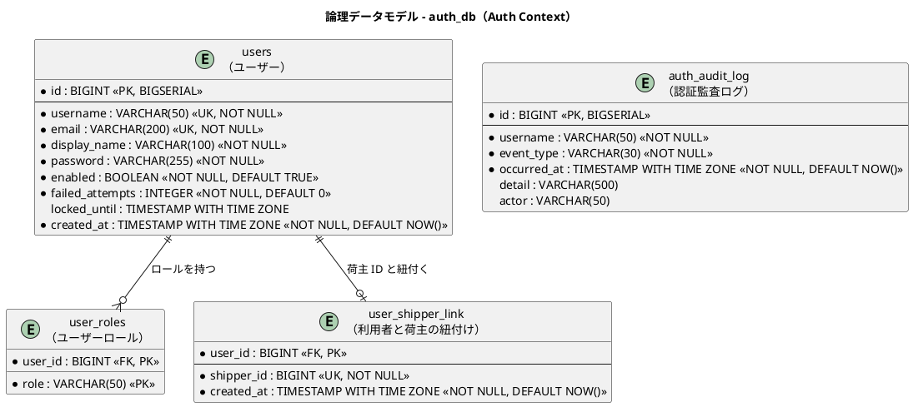
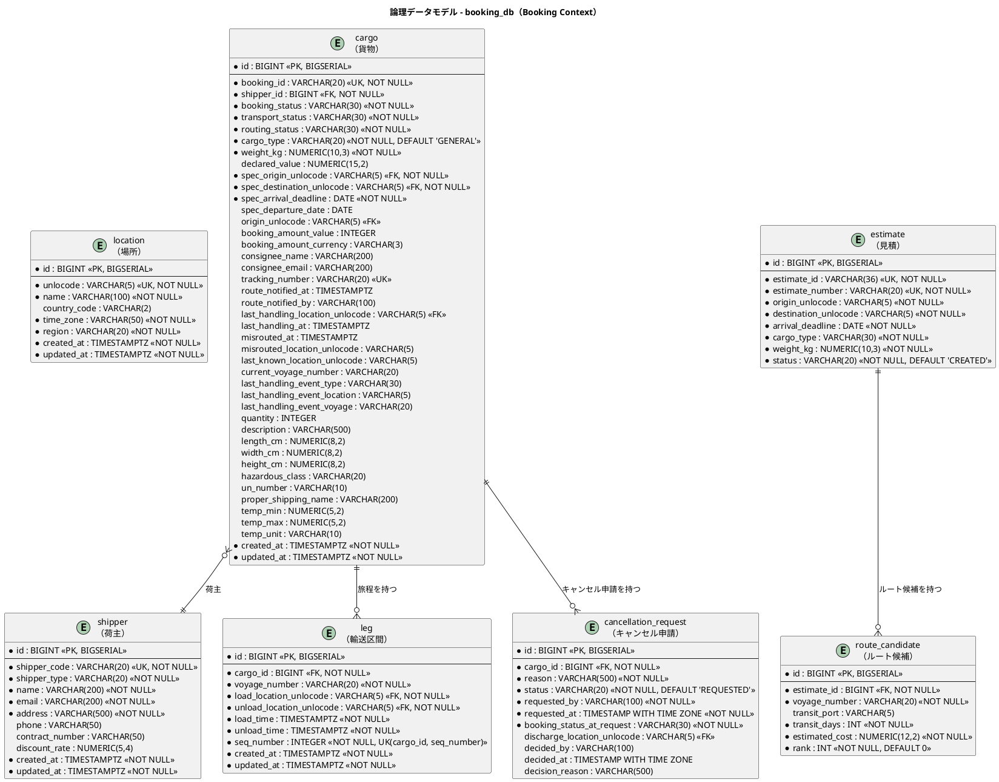
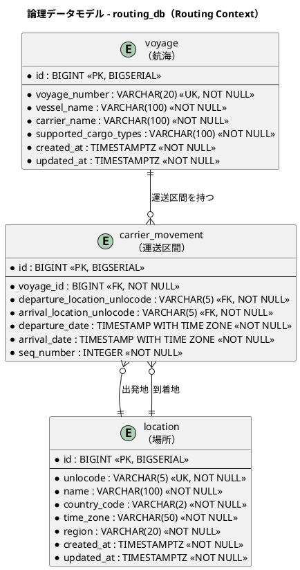
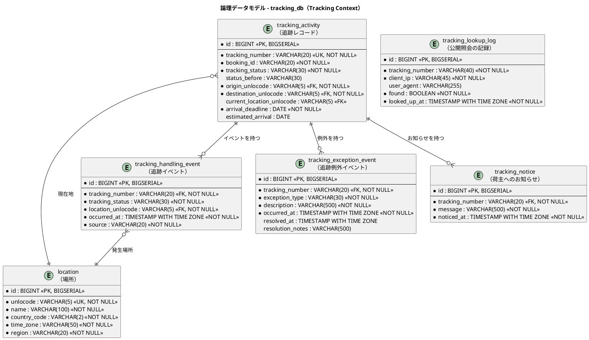
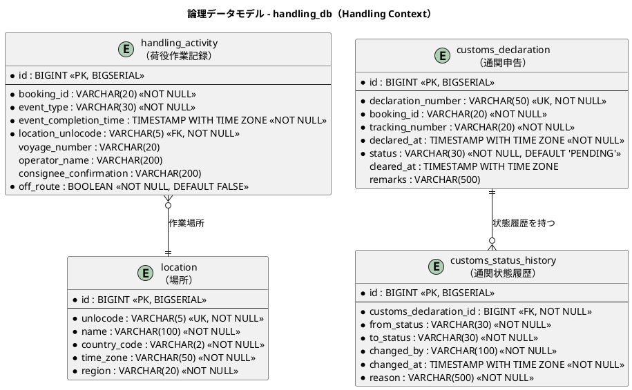
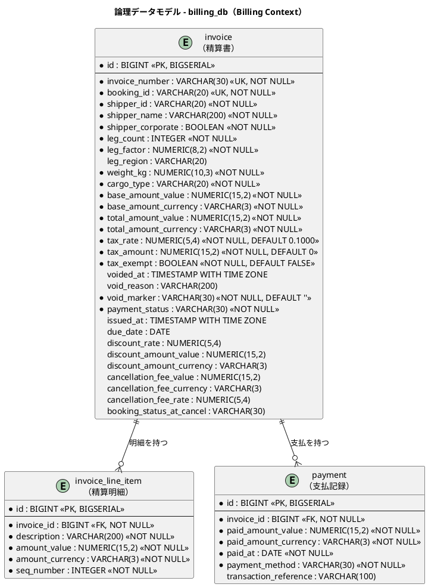

# データモデル設計 - 国際貨物輸送管理システム

## 概要

本ドキュメントは、国際貨物輸送管理システムの永続化層データモデルを定義する。
バックエンドアーキテクチャで定義した 7 つの境界付けられたコンテキスト（Auth / Booking / Routing / Tracking / Handling / Billing / Shared Domain）に対応する **6 つの独立データベース** と **23 テーブル** を設計する。
マイクロサービスアーキテクチャの **Database per Service** パターンに従い、各サービスが専用のデータベースを持つ。

take-3 のデータモデルを基礎とし、本プロジェクトの要件差分として
アカウント保護カラム・認証監査ログ（US31）・キャンセル申請（UC22）・通関申告の独立集約化と状態変更履歴（UC21）・キャンセル料（UC22）・利用者と荷主 ID の明示的な紐付け（US33）を反映している。

### 設計方針

- **アーキテクチャ**: Database per Service（マイクロサービスパターン）
- **DB**: PostgreSQL 16.x（本番）、H2（開発環境 Heroku・テスト）
- **ORM**: MyBatis（XML マッパー）
- **マイグレーション**: Flyway（`V1__init.sql` 形式）— サービスごとに独立管理
- **ID 戦略**: サロゲートキー（`BIGSERIAL`）+ 業務キー（`VARCHAR`）の併用
- **命名規則**: スネークケース（PostgreSQL 慣習）
- **監査カラム**: 全テーブルに `created_at` / `updated_at` を付与
- **コンテキスト間整合性**: DB 外部キー制約ではなくイベント連携と内部 API 契約で保証

### データベース配置

| サービス | データベース名 | 管理テーブル |
| :--- | :--- | :--- |
| authms | `auth_db` | `users`, `user_roles`, `auth_audit_log`, `user_shipper_link` |
| bookingms | `booking_db` | `location`, `shipper`, `cargo`, `leg`, `estimate`, `route_candidate`, `cancellation_request` |
| routingms | `routing_db` | `location`, `voyage`, `carrier_movement` |
| trackingms | `tracking_db` | `location`, `tracking_activity`, `tracking_handling_event`, `tracking_exception_event` |
| handlingms | `handling_db` | `location`, `handling_activity`, `customs_declaration`, `customs_status_history` |
| billingms | `billing_db` | `invoice`, `invoice_line_item`, `payment` |
| simulationms | `simulation_db` | `simulation_run`, `simulation_step_result`, `simulation_session` |

> **`location` テーブルの重複について**: Shared Domain の `Location`（UN/LOCODE）は共有カーネルとして定義されるが、Database per Service パターンでは各サービスが自身の DB 内に `location` テーブルを保持する。初期データは共通の Flyway シードスクリプトから投入し、データの同期は必要に応じてイベントで行う。
>
> **形（[ADR-010](../adr/010-location-master-shape.md)）**: 主キーはサロゲート（`id BIGSERIAL`）、`unlocode` に UNIQUE 制約を置く。参照側（`cargo` 等）は `unlocode` で持つ。`time_zone` は **NOT NULL**（到着期限を目的地の暦で判断するために必要で、後から必須にすると既存行が読めなくなる）。`region` は **NOT NULL**（`DOMESTIC` / `NEAR_SEA` / `OCEAN`。IT12 で追加）——**距離の代わりに区間係数を決める**（[ADR-027](../adr/027-transport-charge-calculation.md) 決定 1 の改訂）。列を足すときは既存行を埋めてから NOT NULL にする。マスタの正は bookingms が持ち、他サービスへの複製の同期方法は [ADR-014](../adr/014-location-replica-sync.md) で決めた。同一内容の種データマイグレーションを地点を使う全サービスへ配り、ずれは `LocationSeedReplicaTest`（shared）が落とす。実行時のイベント同期は行わない。

---

## 概念データモデル

全コンテキストのエンティティとその主要リレーションシップを俯瞰する。マイクロサービス境界（データベース境界）を明示し、コンテキスト間の参照は業務キー（`booking_id`、`voyage_number` 等）による論理参照とする。

```plantuml
@startuml
title 概念データモデル - 国際貨物輸送管理システム（マイクロサービス）

skinparam entity {
  BackgroundColor White
  BorderColor Black
}

package "auth_db\n(Auth Context)" #LightSkyBlue {
  entity "users\n（ユーザー）" as users {
    * id : BIGINT <<PK>>
    --
    * username : VARCHAR(50) <<UK>>
    * email : VARCHAR(200) <<UK>>
    * password : VARCHAR(255)
    * enabled : BOOLEAN
    * failed_attempts : INTEGER
    locked_until : TIMESTAMP
  }

  entity "user_roles\n（ユーザーロール）" as user_roles {
    * user_id : BIGINT <<FK, PK>>
    * role : VARCHAR(50) <<PK>>
  }

  entity "auth_audit_log\n（認証監査ログ）" as auth_audit_log {
    * id : BIGINT <<PK>>
    --
    * username : VARCHAR(50)
    * event_type : VARCHAR(30)
    * occurred_at : TIMESTAMP
  }

  entity "user_shipper_link\n（利用者と荷主の紐付け）" as user_shipper_link {
    * user_id : BIGINT <<FK, PK>>
    --
    * shipper_id : BIGINT <<UK>>
  }
}

package "booking_db\n(Booking Context)" #LightBlue {
  entity "location\n（場所）" as b_location {
    * id : BIGINT <<PK>>
    --
    * unlocode : VARCHAR(5) <<UK>>
    * name : VARCHAR(100)
  }

  entity "shipper\n（荷主）" as shipper {
    * id : BIGINT <<PK>>
    --
    * shipper_code : VARCHAR(20) <<UK>>
    * shipper_type : VARCHAR(20)
    * name : VARCHAR(200)
    * email : VARCHAR(200)
  }

  entity "cargo\n（貨物）" as cargo {
    * id : BIGINT <<PK>>
    --
    * booking_id : VARCHAR(20) <<UK>>
    * shipper_id : BIGINT <<FK>>
    * booking_status : VARCHAR(30)
    * transport_status : VARCHAR(30)
    * routing_status : VARCHAR(30)
    * cargo_type : VARCHAR(20)
    * weight_kg : NUMERIC(10,3)
  }

  entity "leg\n（輸送区間）" as leg {
    * id : BIGINT <<PK>>
    --
    * cargo_id : BIGINT <<FK>>
    * voyage_number : VARCHAR(20)
    * load_location_unlocode : VARCHAR(5) <<FK>>
    * unload_location_unlocode : VARCHAR(5) <<FK>>
  }

  entity "estimate\n（見積）" as estimate {
    * id : BIGINT <<PK>>
    --
    * estimate_id : VARCHAR(36) <<UK>>
    estimate_number : VARCHAR(20) <<UK>>
    * origin_unlocode : VARCHAR(5)
    * destination_unlocode : VARCHAR(5)
    * status : VARCHAR(20)
  }

  entity "route_candidate\n（ルート候補）" as route_candidate {
    * id : BIGINT <<PK>>
    --
    * estimate_id : BIGINT <<FK>>
    * voyage_number : VARCHAR(20)
    * rank : INT
  }

  entity "cancellation_request\n（キャンセル申請）" as cancellation_request {
    * id : BIGINT <<PK>>
    --
    * cargo_id : BIGINT <<FK>>
    * reason : VARCHAR(500)
    * status : VARCHAR(20)
    * requested_by : VARCHAR(100)
    * requested_at : TIMESTAMP
    discharge_location_unlocode : VARCHAR(5)
    decided_by : VARCHAR(100)
    decided_at : TIMESTAMP
    decision_reason : VARCHAR(500)
  }
}

package "routing_db\n(Routing Context)" #LightGreen {
  entity "location\n（場所）" as r_location {
    * id : BIGINT <<PK>>
    --
    * unlocode : VARCHAR(5) <<UK>>
  }

  entity "voyage\n（航海）" as voyage {
    * id : BIGINT <<PK>>
    --
    * voyage_number : VARCHAR(20) <<UK>>
  }

  entity "carrier_movement\n（運送区間）" as carrier_movement {
    * id : BIGINT <<PK>>
    --
    * voyage_id : BIGINT <<FK>>
    * departure_location_unlocode : VARCHAR(5) <<FK>>
    * arrival_location_unlocode : VARCHAR(5) <<FK>>
  }
}

package "tracking_db\n(Tracking Context)" #LightYellow {
  entity "location\n（場所）" as t_location {
    * id : BIGINT <<PK>>
    --
    * unlocode : VARCHAR(5) <<UK>>
  }

  entity "tracking_activity\n（追跡レコード）" as tracking_activity {
    * id : BIGINT <<PK>>
    --
    * tracking_number : VARCHAR(20) <<UK>>
    * booking_id : VARCHAR(20)
    * transport_status : VARCHAR(30)
  }

  entity "tracking_handling_event\n（追跡イベント）" as tracking_handling_event {
    * id : BIGINT <<PK>>
    --
    * tracking_id : BIGINT <<FK>>
    * event_type : VARCHAR(30)
    * event_time : TIMESTAMP
  }

  entity "tracking_exception_event\n（追跡例外イベント）" as tracking_exception_event {
    * id : BIGINT <<PK>>
    --
    * tracking_id : BIGINT <<FK>>
    * exception_type : VARCHAR(50)
    * occurred_at : TIMESTAMP
    * escalation_flag : BOOLEAN
    resolved_at : TIMESTAMP
  }
}

package "handling_db\n(Handling Context)" #LightCoral {
  entity "location\n（場所）" as h_location {
    * id : BIGINT <<PK>>
    --
    * unlocode : VARCHAR(5) <<UK>>
  }

  entity "handling_activity\n（荷役作業記録）" as handling_activity {
    * id : BIGINT <<PK>>
    --
    * booking_id : VARCHAR(20)
    * event_type : VARCHAR(30)
    * event_completion_time : TIMESTAMP
    * location_unlocode : VARCHAR(5) <<FK>>
      voyage_number : VARCHAR(20)
    * operator_name : VARCHAR(200)
      consignee_confirmation : VARCHAR(200)
    * off_route : BOOLEAN
  }

  entity "customs_declaration\n（通関申告）" as customs_declaration {
    * id : BIGINT <<PK>>
    --
    * declaration_number : VARCHAR(50) <<UK>>
    * booking_id : VARCHAR(20)
    * tracking_number : VARCHAR(20)
    * declared_at : TIMESTAMP
    * status : VARCHAR(30)
    cleared_at : TIMESTAMP
  }

  entity "customs_status_history\n（通関状態履歴）" as customs_status_history {
    * id : BIGINT <<PK>>
    --
    * customs_declaration_id : BIGINT <<FK>>
    * from_status : VARCHAR(30)
    * to_status : VARCHAR(30)
    * changed_by : VARCHAR(100)
    * changed_at : TIMESTAMP
    * reason : VARCHAR(500)
  }
}

package "billing_db\n(Billing Context)" #LightPink {
  entity "invoice\n（精算書）" as invoice {
    * id : BIGINT <<PK>>
    --
    * invoice_number : VARCHAR(30) <<UK>>
    * booking_id : VARCHAR(20) <<UK>>
    * payment_status : VARCHAR(30)
    cancellation_fee_value : INTEGER
  }

  entity "invoice_line_item\n（精算明細）" as invoice_line_item {
    * id : BIGINT <<PK>>
    --
    * invoice_id : BIGINT <<FK>>
    * description : VARCHAR(200)
  }

  entity "payment\n（支払記録）" as payment {
    * id : BIGINT <<PK>>
    --
    * invoice_id : BIGINT <<FK>>
    * paid_at : TIMESTAMP
  }
}

' ===== DB 内リレーション（実線） =====

' auth_db
users ||--o{ user_roles : "ロールを持つ"
users ||--o| user_shipper_link : "荷主 ID と紐付く"

' booking_db
cargo }o--|| shipper : "荷主"
cargo ||--o{ leg : "旅程を持つ"
cargo ||--o{ cancellation_request : "キャンセル申請を持つ"
leg }o--|| b_location : "積込場所"
leg }o--|| b_location : "荷降場所"
estimate ||--o{ route_candidate : "ルート候補を持つ"

' routing_db
voyage ||--o{ carrier_movement : "運送区間を持つ"
carrier_movement }o--|| r_location : "出発地"
carrier_movement }o--|| r_location : "到着地"

' tracking_db
tracking_activity ||--o{ tracking_handling_event : "イベントを持つ"
tracking_activity ||--o{ tracking_exception_event : "例外を持つ"
tracking_handling_event }o--o| t_location : "発生場所"

' handling_db
customs_declaration ||--o{ customs_status_history : "状態履歴を持つ"
handling_activity }o--|| h_location : "作業場所"

' billing_db
invoice ||--o{ invoice_line_item : "明細を持つ"
invoice ||--o{ payment : "支払を持つ"

' ===== コンテキスト間の論理参照（点線）=====
cargo .right.> voyage : "voyage_number\n（論理参照）"
user_shipper_link ..> shipper : "shipper_id\n（論理参照）"
tracking_activity ..> cargo : "booking_id\n（論理参照）"
handling_activity ..> cargo : "booking_id\n（論理参照）"
customs_declaration ..> cargo : "booking_id\n（論理参照）"
invoice ..> cargo : "booking_id\n（論理参照）"

@enduml
```



---

## 論理データモデル

> **適用済みのマイグレーションは編集しない。** 内容を変えるとチェックサムが変わり、
> 既に適用した環境の起動が止まる（IT1 で V3 を書き換えて kind の authms が
> `Migration checksum mismatch` で落ちた）。既存データに手を入れたいときは、
> 新しい番号のマイグレーションを足す。

### auth_db — Auth Context

ユーザー認証・認可テーブル。JWT トークン発行・検証のために `authms` が専有する。
アカウント保護（US31）のため `failed_attempts` / `locked_until` を保持し、認証試行・ロック・解除は `auth_audit_log` に記録する。荷主向け追跡（US33）のため、authms の利用者と bookingms の荷主 ID は `user_shipper_link` で明示的に結ぶ。



---

### booking_db — Booking Context

貨物の予約・旅程・見積・キャンセル申請を管理する。`cargo` が集約ルートで、`leg` が旅程の各区間、`cancellation_request` がキャンセル承認フロー（UC22）を表す。荷主情報は `shipper` テーブルに正規化し、FK 参照とする。

> **状態列と料金列（[ADR-009](../adr/009-cargo-status-columns-from-the-start.md)）**: `transport_status` / `routing_status` は「まだ動いていない」という意味のある状態（`NOT_RECEIVED` / `NOT_ROUTED`）を持つため、最初から **NOT NULL** とする。一方 `booking_amount_*` は計算結果であり、料金を算出する US18（IT11）まで値が無い。**NULL を許し、0 で埋めない**（0 円と未算出が区別できなくなり、算出漏れが無料の予約として通る）。後から NOT NULL にもしない（見積の無い期間に入った行が読めなくなる）。
>
> **経路候補の「費用の概算」を `booking_amount_*` に書かない（IT5 で追記）。** [ADR-018](../adr/018-route-search-rules.md) の概算は、経路設計者が候補を見比べるための目安であり、荷主に請求する金額ではない。ここへ書くと、US18（料金算出）が入るまでのあいだ**概算が請求額として振る舞う**。列が埋まっていることと、算出が済んでいることは違う。経路を割り当てても `booking_amount_*` は NULL のままにする。



> **識別子は 2 つ持つ**（[ADR-028](../adr/028-settlement-and-quotation.md) 決定 7）。
> `estimate_id` は UUID で、URL と内部の識別子として使う——**推測できないこと**に意味がある
> （連番だけにすると、URL を 1 つ増減させて他の荷主の見積が開ける）。`estimate_number` は
> 荷主と電話で読み合わせる番号（`EST-YYYY` + 6 桁。受入基準 01-4）。
>
> 型を `UUID` ではなく `VARCHAR(36)` にしているのは、H2 と PostgreSQL の双方で
> ドライバの扱いを揃えるためである（文字列として読み書きする）。


---

### routing_db — Routing Context

航海スケジュールと運送区間を管理する。`voyage` が集約ルートで、`carrier_movement` が個々の移動区間を表す。（take-3 と同一構成）



> **船名・運送会社（IT3 / US24）**: どちらも NOT NULL とする。どの船かが分からないと、荷役と問い合わせで貨物を追えない。後から必須にすると、それらの無い期間に入った航海が読めなくなる。
>
> **対応貨物種別（`supported_cargo_types`）**: 危険物・冷凍は運べる船が限られるため、航海が「何を運べるか」を持つ。カンマ区切りの `VARCHAR` とし、別テーブルにはしない。値は 3 つで、航海ごとの検索条件としてしか使わない（種別そのものを主語にした集計をしていない）。集計が要るようになったら別テーブルへ切り出す。**空文字は許さない**（「何も運べない航海」は登録の誤りであり、検索から静かに消える形で表れると原因が分からない）。
>
> **地点マスタ（`location`）**: bookingms と同一内容の種データを配る（[ADR-014](../adr/014-location-replica-sync.md)）。ずれは `LocationSeedReplicaTest` が落とす。
>
> **経路候補は永続化しない（IT4 / US08・[ADR-017](../adr/017-route-candidates-api.md)）**: `routing_db` に経路候補・旅程・探索結果のキャッシュを置かない。候補は航海スケジュールの写像であり、スケジュールが変われば古くなる。保存すると「保存した時点では正しかった候補」を持ち続けることになる。保存が要るのは**選んだあと**で、それは US09 で `booking_db` の `leg` として持つ。`booking_db.route_candidate` は `estimate_id` を必須に持つ**見積（US01）のための表**であり、US08 の候補を入れる場所ではない。この決定は `RouteCandidatesAreNotPersistedTest` が検査する（許した表以外を作ると落ちる）。

---

### tracking_db — Tracking Context

貨物追跡の状態・イベント・例外を管理する。`tracking_activity` が集約ルート。Booking Context / Handling Context からのイベントをサブスクライブしてデータを構築する。
例外種別に `MISROUTE`（誤配、US28）と `CUSTOMS_HOLD`（税関保留、UC21）を含むが、**手で起票できるのは `DELAY` / `DAMAGE` / `LOST` の 3 つだけ**である（[ADR-024](../adr/024-tracking-manual-update-and-exceptions.md) 決定 11）。



> **状態は `tracking_status` である。** IT6 の実装は `transport_status` と名付けていたが、その名前は設計では **Booking Context の `Delivery` が持つもの**であり、BC をまたいで同じ名前が別物を指していた。IT7 で改名した（`V3__rename_transport_status.sql`）。

> **例外の発生前状態は列に持つ**（[ADR-024](../adr/024-tracking-manual-update-and-exceptions.md) 決定 2）。`status_before` を置かず履歴から再導出すると、1 リクエストの中では履歴が手元にあるので正しく見え、**行に残っていないことに気づけない**。ユニットが緑のままクロスリクエストで誤復帰する。未解決の例外が無ければ NULL である。

> **`estimated_arrival` は `arrival_deadline` とは別物である。** 期限は「いつまでに届けるか」、こちらは「いつ届く見込みか」。経路が決まるまでは分からないため **NULL を許し、0 や現在時刻で埋めない**（US18-2。埋めると荷主は「今日着く」と読む）。値は `TrackingNumberIssued` が運ぶ（決定 4）。

> **`escalation_flag` は列に持たない。** 緊急かどうかは種別が答える（`ExceptionType#urgent`。決定 3）。列に持つと、種別と列が食い違った行を誰も検出できない。

> **`tracking_notice` はメール送信の記録ではない。** 送信の**代替**である（決定 9）。メールの実体はまだ無く、荷主は公開の追跡照会でこれを読む。

> **`tracking_lookup_log` は成否に関わらず残す**（決定 7）。見つからなかった照会こそ、総当たりを見つける材料である。認証が無い経路なので「誰が」は IP と `User-Agent` である。

---

### handling_db — Handling Context

荷役作業の実績と通関申告を管理する。`handling_activity` と `customs_declaration` の 2 つの集約ルートを持つ（ドメインモデル設計の集約昇格判断に対応）。
通関申告は `booking_id` / `tracking_number` で貨物を論理参照し、状態変更は必ず `customs_status_history` に記録する（UC21）。



---

### billing_db — Billing Context

精算書・明細・支払記録を管理する。Tracking Context からの `CargoDeliveredEvent`、Booking Context からの `CargoCancelledEvent` をサブスクライブして精算書を自動生成する。キャンセル料は算定根拠（キャンセル時の予約状態・料率）とともに保持する（UC22）。



---

## テーブル定義

> take-3 と共通のテーブル（`location`・`shipper`・`cargo`・`leg`・`estimate`・`route_candidate`・`voyage`・`carrier_movement`・`tracking_*`・`invoice_line_item`・`payment`）のカラム仕様は take-3 版を踏襲する。以下は take-7 で追加・変更したテーブルを中心に定義する。

### auth_db

#### `users`（ユーザー）― 変更

| カラム名 | データ型 | 制約 | 説明 |
| :--- | :--- | :--- | :--- |
| `id` | `BIGINT` | `PK, NOT NULL` | サロゲートキー（BIGSERIAL） |
| `username` | `VARCHAR(50)` | `UK, NOT NULL` | ログイン名 |
| `email` | `VARCHAR(200)` | `UK, NOT NULL` | メールアドレス |
| `display_name` | `VARCHAR(100)` | `NOT NULL` | 画面に表示する呼び名（IT1 で追加。利用者 ID やメールアドレスで代用すると誰として入っているかが読みにくい） |
| `password` | `VARCHAR(255)` | `NOT NULL` | パスワード（BCrypt ハッシュ） |
| `enabled` | `BOOLEAN` | `NOT NULL, DEFAULT TRUE` | アカウント有効フラグ |
| `failed_attempts` | `INTEGER` | `NOT NULL, DEFAULT 0` | 連続認証失敗回数（成功時に 0 リセット、US31） |
| `locked_until` | `TIMESTAMP WITH TIME ZONE` | | ロック期限（NULL = 未ロック。5 回失敗で設定） |
| `created_at` | `TIMESTAMP WITH TIME ZONE` | `NOT NULL, DEFAULT NOW()` | レコード作成日時 |

##### DDL

```sql
CREATE TABLE users (
    id              BIGSERIAL PRIMARY KEY,
    username        VARCHAR(50)  NOT NULL UNIQUE,
    email           VARCHAR(200) NOT NULL UNIQUE,
    display_name    VARCHAR(100) NOT NULL,
    password        VARCHAR(255) NOT NULL,  -- BCrypt ハッシュ
    enabled         BOOLEAN NOT NULL DEFAULT TRUE,
    failed_attempts INTEGER NOT NULL DEFAULT 0,
    locked_until    TIMESTAMP WITH TIME ZONE,
    created_at      TIMESTAMP WITH TIME ZONE NOT NULL DEFAULT NOW()
);
```

#### `user_roles`（ユーザーロール）

| カラム名 | データ型 | 制約 | 説明 |
| :--- | :--- | :--- | :--- |
| `user_id` | `BIGINT` | `PK, FK → users.id, NOT NULL` | 親ユーザー ID |
| `role` | `VARCHAR(50)` | `PK, NOT NULL` | ロール名（`ROLE_SHIPPER` / `ROLE_SALES` / `ROLE_ROUTING` / `ROLE_HANDLER` / `ROLE_TRACKER` / `ROLE_ACCOUNTANT` / `ROLE_ADMIN`。IT1 でロール名を 7 値に確定。ui_design.md と同一） |

#### `auth_audit_log`（認証監査ログ）― 追加

認証試行・ロック・解除・無効化アカウントのログイン試行を記録する（US31）。

| カラム名 | データ型 | 制約 | 説明 |
| :--- | :--- | :--- | :--- |
| `id` | `BIGINT` | `PK, NOT NULL` | サロゲートキー（BIGSERIAL） |
| `username` | `VARCHAR(50)` | `NOT NULL` | 対象ユーザー名（未登録名の試行も記録するため FK は張らない） |
| `event_type` | `VARCHAR(30)` | `NOT NULL` | `LOGIN_SUCCESS` / `LOGIN_FAILURE` / `LOCKED` / `UNLOCKED` / `DISABLED_ATTEMPT` / `LOGOUT` |
| `occurred_at` | `TIMESTAMP WITH TIME ZONE` | `NOT NULL, DEFAULT NOW()` | 発生日時 |
| `detail` | `VARCHAR(500)` | | 補足情報（接続元等） |
| `actor` | `VARCHAR(50)` | | **操作した利用者**（US32-3。IT6 で追加）。本人の操作（ログイン等）では NULL。管理者による解除のように**対象と操作者が違う**事象で埋める。列が無かったころの行が読めなくなるため NOT NULL にしない |

##### DDL

```sql
CREATE TABLE auth_audit_log (
    id          BIGSERIAL PRIMARY KEY,
    username    VARCHAR(50)  NOT NULL,
    event_type  VARCHAR(30)  NOT NULL,
    occurred_at TIMESTAMP WITH TIME ZONE NOT NULL DEFAULT NOW(),
    detail      VARCHAR(500)
);
CREATE INDEX idx_auth_audit_log_username ON auth_audit_log (username, occurred_at);
```

#### `user_shipper_link`（利用者と荷主の紐付け）― 追加

`ROLE_SHIPPER` の利用者と bookingms 側の荷主 ID を明示的に結ぶ（US33・[ADR-029](../adr/029-shipper-tracking-boundary-and-inactivity-timeout.md)）。`shipper_id` は bookingms の `shipper.id` への論理参照であり、Database per Service を越えるため DB FK は張らない。参照整合は authms の内部 API と契約テストで守る。

| カラム名 | データ型 | 制約 | 説明 |
| :--- | :--- | :--- | :--- |
| `user_id` | `BIGINT` | `PK, FK → users.id, NOT NULL` | 荷主ロールの利用者 ID |
| `shipper_id` | `BIGINT` | `UK, NOT NULL` | bookingms の荷主 ID。サービス境界を越える論理参照 |
| `created_at` | `TIMESTAMP WITH TIME ZONE` | `NOT NULL, DEFAULT NOW()` | 紐付け作成日時 |

##### DDL

```sql
CREATE TABLE user_shipper_link (
    user_id    BIGINT NOT NULL REFERENCES users (id),
    shipper_id BIGINT NOT NULL,
    created_at TIMESTAMP WITH TIME ZONE NOT NULL DEFAULT NOW(),
    CONSTRAINT pk_user_shipper_link PRIMARY KEY (user_id),
    CONSTRAINT uq_user_shipper_link_shipper UNIQUE (shipper_id)
);
CREATE INDEX idx_user_shipper_link_shipper ON user_shipper_link (shipper_id);
```

---

### booking_db

#### `leg`（輸送区間）― 追加（IT5）

経路が決まった予約が持つ旅程。1 つの航海で運ばれる 1 区間を 1 行にする（US09・[ADR-020](../adr/020-itinerary-assignment-transitions.md)）。

| カラム名 | データ型 | 制約 | 説明 |
| :--- | :--- | :--- | :--- |
| `id` | `BIGINT` | `PK, NOT NULL` | サロゲートキー（BIGSERIAL） |
| `cargo_id` | `BIGINT` | `FK → cargo.id, NOT NULL` | 対象貨物 ID |
| `voyage_number` | `VARCHAR(20)` | `NOT NULL` | どの航海で運ぶか。Routing Context の航海番号を論理参照する（DB が分かれているため FK は張らない） |
| `load_location_unlocode` | `VARCHAR(5)` | `FK → location.unlocode, NOT NULL` | 積込地 |
| `unload_location_unlocode` | `VARCHAR(5)` | `FK → location.unlocode, NOT NULL` | 荷降し地 |
| `load_time` | `TIMESTAMP WITH TIME ZONE` | `NOT NULL` | 積込日時 |
| `unload_time` | `TIMESTAMP WITH TIME ZONE` | `NOT NULL` | 荷降し日時 |
| `seq_number` | `INTEGER` | `NOT NULL, UNIQUE(cargo_id, seq_number)` | 区間の順序（1 始まり） |
| `created_at` | `TIMESTAMP WITH TIME ZONE` | `NOT NULL, DEFAULT NOW()` | レコード作成日時 |
| `updated_at` | `TIMESTAMP WITH TIME ZONE` | `NOT NULL, DEFAULT NOW()` | レコード更新日時 |

**時刻の型**: `TIMESTAMPTZ` にする（他テーブルと揃える）。港はそれぞれ別のタイムゾーンにあり、`DATE` や素の `TIMESTAMP` では「現地の何時か」が決まらない。

**監査カラム**: 全テーブルに置く決定に従う。旅程は差し替えが起こるため、「いつ入れ直したか」が追えないと遅延対応の経緯が残らない。

##### DDL

```sql
CREATE TABLE leg (
    id                       BIGSERIAL PRIMARY KEY,
    cargo_id                 BIGINT      NOT NULL REFERENCES cargo (id),
    voyage_number            VARCHAR(20) NOT NULL,
    load_location_unlocode   VARCHAR(5)  NOT NULL REFERENCES location (unlocode),
    unload_location_unlocode VARCHAR(5)  NOT NULL REFERENCES location (unlocode),
    load_time                TIMESTAMP WITH TIME ZONE NOT NULL,
    unload_time              TIMESTAMP WITH TIME ZONE NOT NULL,
    seq_number               INTEGER     NOT NULL,
    created_at               TIMESTAMP WITH TIME ZONE NOT NULL DEFAULT NOW(),
    updated_at               TIMESTAMP WITH TIME ZONE NOT NULL DEFAULT NOW(),
    CONSTRAINT uk_leg_cargo_seq UNIQUE (cargo_id, seq_number)
);
CREATE INDEX idx_leg_cargo ON leg (cargo_id);
```

> **`(cargo_id, seq_number)` に一意制約を置く。** 置かないと、消し忘れた行が混ざったときに旅程が二重になり、しかも順序は保たれるため、画面上は「区間が増えた」ようにしか見えない（IT3 で同型の事故があった）。
>
> **旅程の差し替えは「消してから入れ直す」。** IT3 の航海スケジュールと同じ判断。差分更新は順序の付け替えが要り、途中で失敗するとつながっていない旅程が残る。

---

#### `cancellation_request`（キャンセル申請）― 追加

キャンセル承認フロー（UC22）の申請・承認・却下の記録。理由は申請・却下ともに必須。

| カラム名 | データ型 | 制約 | 説明 |
| :--- | :--- | :--- | :--- |
| `id` | `BIGINT` | `PK, NOT NULL` | サロゲートキー（BIGSERIAL） |
| `cargo_id` | `BIGINT` | `FK → cargo.id, NOT NULL` | 対象貨物 ID |
| `reason` | `VARCHAR(500)` | `NOT NULL` | キャンセル理由（申請時必須） |
| `status` | `VARCHAR(20)` | `NOT NULL, DEFAULT 'REQUESTED'` | `REQUESTED` / `APPROVED` / `REJECTED` |
| `requested_by` | `VARCHAR(100)` | `NOT NULL` | 申請者（営業担当者） |
| `requested_at` | `TIMESTAMP WITH TIME ZONE` | `NOT NULL` | 申請日時 |
| `booking_status_at_request` | `VARCHAR(30)` | `NOT NULL` | 申請時の予約状態（キャンセル料算定の根拠） |
| `discharge_location_unlocode` | `VARCHAR(5)` | `FK → location.unlocode` | 陸揚げ地（輸送中キャンセル承認時に指定） |
| `decided_by` | `VARCHAR(100)` | | 承認・却下の実行者（追跡管理者） |
| `decided_at` | `TIMESTAMP WITH TIME ZONE` | | 承認・却下日時 |
| `decision_reason` | `VARCHAR(500)` | | 承認・却下理由（却下時必須はアプリ層で検証） |
| `created_at` | `TIMESTAMP WITH TIME ZONE` | `NOT NULL, DEFAULT NOW()` | レコード作成日時 |
| `updated_at` | `TIMESTAMP WITH TIME ZONE` | `NOT NULL, DEFAULT NOW()` | レコード更新日時 |

##### DDL

```sql
CREATE TABLE cancellation_request (
    id                          BIGSERIAL PRIMARY KEY,
    cargo_id                    BIGINT       NOT NULL REFERENCES cargo(id),
    reason                      VARCHAR(500) NOT NULL,
    status                      VARCHAR(20)  NOT NULL DEFAULT 'REQUESTED',
    requested_by                VARCHAR(100) NOT NULL,
    requested_at                TIMESTAMP WITH TIME ZONE NOT NULL,
    booking_status_at_request   VARCHAR(30)  NOT NULL,
    discharge_location_unlocode VARCHAR(5),
    decided_by                  VARCHAR(100),
    decided_at                  TIMESTAMP WITH TIME ZONE,
    decision_reason             VARCHAR(500),
    created_at                  TIMESTAMP WITH TIME ZONE NOT NULL DEFAULT NOW(),
    updated_at                  TIMESTAMP WITH TIME ZONE NOT NULL DEFAULT NOW()
);
CREATE INDEX idx_cancellation_request_status ON cancellation_request (status);
```

> 承認待ち一覧（追跡管理者）は `status = 'REQUESTED'` のクエリで提供する（CQRS のクエリ側）。

---

### handling_db

#### `handling_activity`（荷役作業記録）― 変更

`event_type` は `RECEIVE` / `LOAD` / `UNLOAD` / `CLAIM` の 4 種（take-3 の `CUSTOMS` は通関申告の集約独立に伴い廃止）。引取（CLAIM）時は荷受人確認を記録する。

| カラム名 | データ型 | 制約 | 説明 |
| :--- | :--- | :--- | :--- |
| `id` | `BIGINT` | `PK, NOT NULL` | サロゲートキー（BIGSERIAL） |
| `booking_id` | `VARCHAR(20)` | `NOT NULL` | 予約 ID（`booking_db` への論理参照） |
| `event_type` | `VARCHAR(30)` | `NOT NULL` | 荷役タイプ（`RECEIVE` / `LOAD` / `UNLOAD` / `CLAIM`） |
| `event_completion_time` | `TIMESTAMP WITH TIME ZONE` | `NOT NULL` | 荷役完了日時 |
| `location_unlocode` | `VARCHAR(5)` | `FK → location.unlocode, NOT NULL` | 作業場所（UN/LOCODE） |
| `voyage_number` | `VARCHAR(20)` | | 関連する航海番号（LOAD / UNLOAD 時に必須） |
| `operator_name` | `VARCHAR(200)` | | 作業員名 |
| `consignee_confirmation` | `VARCHAR(200)` | | 荷受人確認（署名または確認コード。CLAIM 時に設定） |
| `created_at` | `TIMESTAMP WITH TIME ZONE` | `NOT NULL, DEFAULT NOW()` | レコード作成日時 |
| `updated_at` | `TIMESTAMP WITH TIME ZONE` | `NOT NULL, DEFAULT NOW()` | レコード更新日時 |

#### `customs_declaration`（通関申告）― 変更

take-3 の `handling_activity_id` FK を廃止し、独立した集約ルートとして `booking_id` / `tracking_number` の論理参照に変更した（ドメインモデル設計の集約昇格判断に対応）。

| カラム名 | データ型 | 制約 | 説明 |
| :--- | :--- | :--- | :--- |
| `id` | `BIGINT` | `PK, NOT NULL` | サロゲートキー（BIGSERIAL） |
| `declaration_number` | `VARCHAR(50)` | `UK, NOT NULL` | 申告番号（業務キー） |
| `booking_id` | `VARCHAR(20)` | `NOT NULL` | 予約 ID（論理参照。検索キー） |
| `tracking_number` | `VARCHAR(20)` | `NOT NULL` | 追跡番号（論理参照。申告登録時の入力キー） |
| `declared_at` | `TIMESTAMP WITH TIME ZONE` | `NOT NULL` | 申告日時 |
| `status` | `VARCHAR(30)` | `NOT NULL, DEFAULT 'PENDING'` | 通関状態（`PENDING` / `CLEARED` / `HELD` / `REJECTED`） |
| `cleared_at` | `TIMESTAMP WITH TIME ZONE` | | 通関完了日時（NULL = 未完了） |
| `remarks` | `VARCHAR(500)` | | 備考・メモ |
| `created_at` | `TIMESTAMP WITH TIME ZONE` | `NOT NULL, DEFAULT NOW()` | レコード作成日時 |
| `updated_at` | `TIMESTAMP WITH TIME ZONE` | `NOT NULL, DEFAULT NOW()` | レコード更新日時 |

##### DDL

```sql
CREATE TABLE customs_declaration (
    id                 BIGSERIAL PRIMARY KEY,
    declaration_number VARCHAR(50) NOT NULL UNIQUE,
    booking_id         VARCHAR(20) NOT NULL,
    tracking_number    VARCHAR(20) NOT NULL,
    declared_at        TIMESTAMP WITH TIME ZONE NOT NULL,
    status             VARCHAR(30) NOT NULL DEFAULT 'PENDING',
    cleared_at         TIMESTAMP WITH TIME ZONE,
    remarks            VARCHAR(500),
    created_at         TIMESTAMP WITH TIME ZONE NOT NULL DEFAULT NOW(),
    updated_at         TIMESTAMP WITH TIME ZONE NOT NULL DEFAULT NOW()
);
CREATE INDEX idx_customs_declaration_booking ON customs_declaration (booking_id);
CREATE INDEX idx_customs_declaration_status ON customs_declaration (status, declared_at);
```

> 「HELD のまま 3 日超」の督促対象は `status = 'HELD' AND` 最終 HELD 遷移日時（`customs_status_history` の最新 `changed_at`）で判定する。CLAIM 荷役の通関ガードは `booking_id` で最新の申告を参照して `status = 'CLEARED'` を検証する。

#### `customs_status_history`（通関状態履歴）― 追加

通関状態変更の監査履歴（UC21）。状態更新には理由が必須。

| カラム名 | データ型 | 制約 | 説明 |
| :--- | :--- | :--- | :--- |
| `id` | `BIGINT` | `PK, NOT NULL` | サロゲートキー（BIGSERIAL） |
| `customs_declaration_id` | `BIGINT` | `FK → customs_declaration.id, NOT NULL` | 親申告 ID |
| `from_status` | `VARCHAR(30)` | `NOT NULL` | 変更前状態 |
| `to_status` | `VARCHAR(30)` | `NOT NULL` | 変更後状態 |
| `changed_by` | `VARCHAR(100)` | `NOT NULL` | 変更者（追跡管理者） |
| `changed_at` | `TIMESTAMP WITH TIME ZONE` | `NOT NULL` | 変更日時 |
| `reason` | `VARCHAR(500)` | `NOT NULL` | 変更理由（必須） |

##### DDL

```sql
CREATE TABLE customs_status_history (
    id                     BIGSERIAL PRIMARY KEY,
    customs_declaration_id BIGINT       NOT NULL REFERENCES customs_declaration(id),
    from_status            VARCHAR(30)  NOT NULL,
    to_status              VARCHAR(30)  NOT NULL,
    changed_by             VARCHAR(100) NOT NULL,
    changed_at             TIMESTAMP WITH TIME ZONE NOT NULL,
    reason                 VARCHAR(500) NOT NULL
);
```

---

### simulation_db

IT14（US34・US35）で追加した。**実行そのもの**と**工程ごとの結果**を分けて持つ。

#### `simulation_run`（実行）

| カラム名 | データ型 | 制約 | 説明 |
| :--- | :--- | :--- | :--- |
| `id` | `BIGSERIAL` | PK | |
| `run_id` | `VARCHAR(40)` | UK, NOT NULL | 実行 ID（`SIM-YYYYMMDD-NNNN`。その日の連番）。**採番を裁くのはこの一意制約である**——「今日の件数 + 1」は同時開始で衝突するため、断られたら次の番号を採る（IT15） |
| `scenario_id` | `VARCHAR(40)` | NOT NULL | シナリオ |
| `steps` | `VARCHAR(500)` | NOT NULL | **実行時の工程の並び**。シナリオ ID だけでは、定義を変えたあとに過去の実行を正しく復元できない |
| `started_by` | `VARCHAR(50)` | NOT NULL | 指示した利用者。継続実行が始めた実行はセッション ID が入る |
| `started_at` | `TIMESTAMP WITH TIME ZONE` | NOT NULL | |
| `seed` | `BIGINT` | NOT NULL | 使った乱数の種（IT15 追加）。**手で押した実行は 0**。NULL 可にすると、記録し忘れても行が書けてしまう |
| `session_id` | `BIGINT` | FK | `simulation_session.id`（IT15 追加）。**NULL 可**——手で押した実行はセッションを持たない |

> **状態と終了時刻は列に持たない**（IT15 の V2 で削除）。どちらも挿入時に一度書かれる
> だけで更新されず、読み出しでは集約が工程の結果から導き直していた。残すと、DB を
> 直接見た人は**すべての実行が RUNNING のまま**という嘘を読む。導けるものを列にも
> 置くと、片方だけ更新された行が生まれる（[ADR-030](../adr/030-business-simulation-execution.md) 決定 5）。

#### `simulation_session`（継続実行）

**乱数で選んだシナリオを流し続ける 1 回分**（US37・[ADR-031]）。

| カラム名 | データ型 | 制約 | 説明 |
| :--- | :--- | :--- | :--- |
| `id` | `BIGSERIAL` | PK | |
| `session_id` | `VARCHAR(40)` | UK, NOT NULL | セッション ID（`SES-YYYYMMDD-NNNN`） |
| `seed` | `BIGINT` | NOT NULL | 乱数の種。**同じ種を指定すると同じ並びが再現される**（決定 1）。指定しなかった場合もシステムが作って記録する——記録しないと、指定しなかった実行だけが再現できない |
| `interval_seconds` | `INTEGER` | NOT NULL | 実行の間隔 |
| `max_concurrent` | `INTEGER` | NOT NULL | 同時に走らせる本数 |
| `exception_ratio` | `NUMERIC(3,2)` | NOT NULL | 例外シナリオを選ぶ割合（0〜1） |
| `status` | `VARCHAR(20)` | NOT NULL | `RUNNING` / `STOPPING` / `STOPPED`。**「止めた」と「止まった」を分ける**（決定 4）——分けないと、進行中が残っているのに停止済みと表示され、統計が確定していない状態で読まれる |
| `started_by` | `VARCHAR(50)` | NOT NULL | 開始を指示した利用者 |
| `started_at` | `TIMESTAMP WITH TIME ZONE` | NOT NULL | |
| `stopped_at` | `TIMESTAMP WITH TIME ZONE` | | 進行中が尽きた時刻。停止処理中のあいだは NULL |

> **ここは更新する。** 実行の記録（`simulation_run`）と違い、停止の指示と進行中が
> 尽きたことは状態そのものの変化である。常に INSERT する save は、作成しか起きない
> うちは成立し、最初の停止で行を増やす。

#### `simulation_step_result`（工程の結果）

**追記だけを行う。** 失敗しても巻き戻さない（[ADR-030](../adr/030-business-simulation-execution.md)
決定 5）——巻き戻すと、どこまで通ったかという US35 が見たいものが、失敗したときだけ残らない。

| カラム名 | データ型 | 制約 | 説明 |
| :--- | :--- | :--- | :--- |
| `id` | `BIGSERIAL` | PK | |
| `run_id` | `BIGINT` | FK, NOT NULL | `simulation_run.id` |
| `step` | `VARCHAR(40)` | NOT NULL | 工程 |
| `outcome` | `VARCHAR(20)` | NOT NULL | `SUCCEEDED` / `FAILED` |
| `elapsed_ms` | `INTEGER` | NOT NULL | 所要時間 |
| `created_identifier` | `VARCHAR(40)` | | その工程が生んだ識別子（予約番号・追跡番号・精算書番号） |
| `failure_reason` | `TEXT` | | 止まった理由。**「失敗しました」だけにしない**——応答本文まで載せるため、長さで切らない |
| `recorded_at` | `TIMESTAMP WITH TIME ZONE` | NOT NULL | |

---

### billing_db

#### `invoice`（精算書）― 変更

IT11（US21・US22）で実装した。キャンセル料の算定根拠（UC22）に加え、
**基本料金の根拠**と**割引率**を持つ（[ADR-027](../adr/027-transport-charge-calculation.md)）。

| カラム名 | データ型 | 制約 | 説明 |
| :--- | :--- | :--- | :--- |
| `id` | `BIGSERIAL` | PK | |
| `invoice_number` | `VARCHAR(30)` | UK, NOT NULL | 請求番号（`INV-YYYY` + 6 桁。シーケンスで採番） |
| `booking_id` | `VARCHAR(20)` | UK, NOT NULL | **UK が二重請求を防ぐ**（決定 4・ビジネスルール 5） |
| `shipper_id` | `VARCHAR(20)` | NOT NULL | 荷主参照 |
| `shipper_name` | `VARCHAR(200)` | NOT NULL | **発行した時点の社名**。荷主 ID から引き直さない——社名を変えても、発行済みの請求書の宛名は変わらない |
| `shipper_corporate` | `BOOLEAN` | NOT NULL | 法人か |
| `leg_count` | `INTEGER` | NOT NULL | 旅程の区間数。**距離の代わり**（決定 1） |
| `weight_kg` | `NUMERIC(10,3)` | NOT NULL | 重量（基本料金の根拠） |
| `cargo_type` | `VARCHAR(20)` | NOT NULL | 貨物種別（基本料金の根拠） |
| `base_amount_value` | `NUMERIC(15,2)` | NOT NULL | 基本料金 |
| `base_amount_currency` | `VARCHAR(3)` | NOT NULL | |
| `discount_rate` | `NUMERIC(5,4)` | | 契約割引率。**未設定は 0% ではない**（[ADR-012]）ため NULL を許す。額から割り戻すと丸めの分ずれるため率も持つ（22-4） |
| `discount_amount_value` | `NUMERIC(15,2)` | NOT NULL, DEFAULT 0 | 割引額 |
| `discount_amount_currency` | `VARCHAR(3)` | NOT NULL, DEFAULT 'JPY' | |
| `cancellation_fee_value` | `NUMERIC(15,2)` | | キャンセル料（NULL = キャンセルなし） |
| `cancellation_fee_currency` | `VARCHAR(3)` | | |
| `cancellation_fee_rate` | `NUMERIC(5,4)` | | 適用した料率 |
| `booking_status_at_cancel` | `VARCHAR(30)` | | **申請した時点**の予約状態（料率の根拠）。bookingms 側の列名は `booking_status_at_request` |
| `tax_rate` | `NUMERIC(5,4)` | NOT NULL, DEFAULT 0.1000 | 消費税率（決定 8。業務として扱うのは US23） |
| `tax_amount` | `NUMERIC(15,2)` | NOT NULL, DEFAULT 0 | 消費税 |
| `total_amount_value` | `NUMERIC(15,2)` | NOT NULL | 合計 |
| `total_amount_currency` | `VARCHAR(3)` | NOT NULL | |
| `payment_status` | `VARCHAR(30)` | NOT NULL | 支払いの状態。**発行の時点は `PENDING`**（決定 3） |
| `issued_at` | `TIMESTAMP WITH TIME ZONE` | NOT NULL | 発行日時 |
| `due_date` | `DATE` | | 支払期限（US23 で使う） |

> **金額は `NUMERIC(15,2)` である**（[ADR-027] 決定 2・IT11 の注 3）。take-3 版は
> `INTEGER`（最小通貨単位）だったが、**丸めの単位（円）と保存の単位を一致させる**ほうが、
> 読んだときに何が起きたか分かる。丸めは `Money` が済ませており、保存するのは丸めたあとの値である。

#### `invoice_line_item`（精算明細）― 変更

料金調整を基本料金に混ぜず、根拠つきで積む（決定 6）。金額列を `NUMERIC(15,2)` に揃えた。

| カラム名 | データ型 | 制約 | 説明 |
| :--- | :--- | :--- | :--- |
| `id` | `BIGSERIAL` | PK | |
| `invoice_id` | `BIGINT` | FK, NOT NULL | |
| `description` | `VARCHAR(200)` | NOT NULL | **調整の内容（根拠）。空は断る**——金額だけ残ると、あとから誰も理由を言えない |
| `amount_value` | `NUMERIC(15,2)` | NOT NULL | 減額は負、補償費用は正 |
| `amount_currency` | `VARCHAR(3)` | NOT NULL | |
| `seq_number` | `INTEGER` | NOT NULL | 積んだ順 |

### `payment`（支払記録・IT12）

| カラム | 型 | 制約 | 備考 |
| :--- | :--- | :--- | :--- |
| `id` | `BIGSERIAL` | PK | |
| `invoice_id` | `BIGINT` | FK, NOT NULL | |
| `paid_amount_value` | `NUMERIC(15,2)` | NOT NULL | **`invoice` 側に揃える**（論理モデルの `INTEGER` から変更） |
| `paid_amount_currency` | `VARCHAR(3)` | NOT NULL | |
| `paid_at` | `DATE` | NOT NULL | **日付である**——通帳に時刻は無い |
| `payment_method` | `VARCHAR(30)` | NOT NULL | 銀行振込 / 手形 / 相殺 / その他 |
| `transaction_reference` | `VARCHAR(100)` | | 振込の照会番号など。**あとから裏を取るための手がかり** |

> **請求書の属性にしない**（[ADR-028](../adr/028-settlement-and-quotation.md) 決定 2）。
> 入金は請求書に起きた別の出来事であり、発行した請求書の金額は動かない
> （[ADR-027](../adr/027-transport-charge-calculation.md) 決定 4）。分割入金を列に持つと、
> それは列の増設になる。

> **取り消し（赤伝）は 3 列で表す**（決定 3）。`voided_at` / `void_reason` に加え、
> `void_marker` を持つ。**部分 UNIQUE は使えない**——`WHERE voided_at IS NULL` を
> H2 が解釈できず（実測）、CI（PostgreSQL）は緑のままローカル起動だけが落ちる。
> 有効な請求書は `void_marker = ''`、取り消した請求書は請求番号が入るため、
> `(booking_id, void_marker)` の素の UNIQUE で「有効な請求書は予約ごとに 1 通」を守れる。

---

## 設計上の判断

### 1. Database per Service パターン

**判断**: 各マイクロサービスが専用のデータベースを持つ。コンテキスト間のデータ参照には DB 外部キー制約を設けず、業務キー（`booking_id`、`voyage_number` 等）による論理参照とする。

**根拠**: マイクロサービスアーキテクチャの基本原則として、各サービスのデータ独立性を確保する。整合性はドメインイベント（RabbitMQ + Spring Cloud Stream）で結果整合性として保証する。

### 2. `location` テーブルの各 DB への配置

**判断**: 共有カーネルである `Location`（UN/LOCODE）を各サービスの DB にローカルコピーとして配置する。

**根拠**: Database per Service パターンでは、サービス間で DB テーブルを共有することは禁止される。`location` は参照データ（マスタ）であり、変更頻度が極めて低い。初期データは共通の Flyway シードスクリプトから投入する。

### 3. サロゲートキーと業務キーの併用

**判断**: 全テーブルに `BIGSERIAL` のサロゲートキー（`id`）を設け、業務上の識別子には `UNIQUE` 制約を付与する。

**根拠**: DB 内の外部キー参照を `BIGINT` に統一することでインデックス効率が向上する。サービス間の論理参照は業務キー（文字列）を使用する。

### 4. 金額の表現（`INTEGER` + `VARCHAR(3)`）

**判断**: 金額を `INTEGER`（最小通貨単位）と `VARCHAR(3)`（ISO 4217 通貨コード）の 2 カラムで表現する。

**根拠**: 浮動小数点演算による精度誤差を排除する。ドメインモデルの `Money` 値オブジェクトに対応する。

### 5. 列挙値のカラム型（`VARCHAR(30)`）

**判断**: 列挙型カラムは `VARCHAR(30)` で表現し、PostgreSQL の `ENUM` 型は使用しない。

**根拠**: `ENUM` 型は値の追加・変更にスキーマ ALTER が必要でリスクが高い。`VARCHAR` + CHECK 制約なら H2 との互換性も維持できる。

### 6. コンテキスト間の結果整合性

**判断**: コンテキスト間の整合性はドメインイベント経由の結果整合性で保証する。DB レベルの分散トランザクション（2PC）は使用しない。

**根拠**: 貨物輸送業務の特性上、数秒〜数十秒の遅延は許容される。

### 7. 監査カラムの全テーブル付与

**判断**: `created_at`・`updated_at` を全テーブルに `NOT NULL DEFAULT NOW()` で付与する（`user_roles`・`customs_status_history` 等の追記専用テーブルを除く）。

**根拠**: 国際貨物輸送は規制上の監査要件が高い。H2 との互換性を優先してアプリケーション側で更新を制御する。

### 8. キャンセル申請を独立テーブルにする（take-7 追加）

**判断**: キャンセル申請は `cargo` のカラムではなく `cancellation_request` テーブル（1 対多）で管理する。

**根拠**: 却下後の再申請があり得るため履歴が必要（UC22 の受け入れ基準「申請・承認・却下の履歴が参照できる」）。申請時の予約状態（`booking_status_at_request`）を保存することでキャンセル料率の算定根拠を残す。集約としては Cargo 集約内エンティティであり、同一 DB・同一トランザクションで状態遷移と整合させる。

### 9. 通関申告の独立テーブル化と履歴の追記専用管理（take-7 変更）

**判断**: `customs_declaration` は `handling_activity` への FK を持たず、`booking_id` / `tracking_number` の論理参照とする。状態変更履歴 `customs_status_history` は UPDATE しない追記専用テーブルとする。

**根拠**: 通関申告は荷役作業とライフサイクルが独立している（ドメインモデル設計の集約昇格判断）。履歴は監査証跡であり、改変を防ぐため追記専用とする（`updated_at` を持たない）。

### 10. アカウント保護カラムの永続化（take-7 追加）

**判断**: 失敗回数（`failed_attempts`）とロック期限（`locked_until`）を `users` テーブルのカラムとして永続化する。ログや履歴からの再導出は行わない。

**根拠**: 集約状態を履歴から再導出すると、クロスリクエストで誤復帰する偽の安全網になる。ロック判定に必要な状態は必ずカラムに永続化する。

### 12. シミュレーション由来は荷主コードの帯で識別する（take-7 追加・IT14）

**判断**: シミュレーションが作った荷主は荷主コードを `SIM-` の帯で採番する。
**専用の列は持たない**（[ADR-030](../adr/030-business-simulation-execution.md) 決定 3）。
連番は実業務と同じシーケンスを使い、**分けるのは帯だけ**である。

**根拠**: 帯と列の両方を持つと、食い違う行が生まれ、どちらが正しいかを決める規則がまた要る。
貨物・請求書・追跡はすべて荷主から辿れるため、帯 1 本で判断できる。別のシーケンスにすると、
片方だけ進んだ状態で番号が衝突する。

除外は**除外する側**の問い合わせに書く（`shipper_code NOT LIKE 'SIM-%'`）。
**名指しの照会では外さない**——外すと、シミュレーション自身の料金算出が通らず、
精算まで通ることを確かめる手段が消える。

---

### 11. 利用者と荷主 ID の紐付け（take-7 追加）

**判断**: `ROLE_SHIPPER` の利用者と bookingms の荷主 ID は authms の `user_shipper_link` で保持する。`shipper_id` は DB FK ではなく論理参照とし、authms の内部 API と shared contract test で参照契約を守る。

**根拠**: bookingms の `shipper` に authms の利用者 ID を混ぜるとサービス境界が曖昧になる。username・email・shipper_code の文字列一致で推測すると、偶然一致や名称変更で他社貨物が見えるため、明示的な紐付けだけを正とする。

---

## Flyway マイグレーション方針

### サービス別マイグレーション管理

各サービスが独自のマイグレーションスクリプトを管理する。

```
apps/backend/
├── authms/
│   └── src/main/resources/db/migration/
│       ├── V1__init.sql               # スキーマ初期化
│       ├── V2__init_auth.sql          # users, user_roles, auth_audit_log
│       ├── V3__seed_users.sql         # 初期ユーザーデータ
│       ├── V4__seed_disabled_user.sql # 無効化アカウント（US31 の動作確認用）
│       ├── V5__add_auth_audit_actor.sql # 監査ログに「誰が操作したか」（US32）
│       ├── V6__seed_admin_user.sql    # 管理者ユーザー
│       └── V7__add_user_shipper_link.sql # 利用者と荷主 ID の紐付け（US33）
│
├── bookingms/
│   └── src/main/resources/db/migration/
│       ├── V1__init.sql                # スキーマ初期化
│       ├── V2__init_booking.sql        # shipper
│       ├── V3__init_booking_cargo.sql  # location（種データ含む）, cargo
│       ├── V4__normalize_hazard_class.sql # 危険物クラスの正規化
│       ├── V5__add_leg.sql             # leg（旅程の輸送区間。IT5）
│       ├── V6__add_route_notification_and_tracking_number.sql # 通知の記録・追跡番号（IT6）
│       ├── V7__fix_tracking_number_numbering.sql # 追跡番号採番修正
│       ├── V8__add_last_handling.sql   # 最終荷役イベント
│       ├── V9__cancellation_request.sql # キャンセル申請
│       ├── V10__add_misroute.sql       # 誤配状態
│       ├── V11__add_location_region.sql # 地域区分
│       └── V12__estimate.sql           # 見積
│
├── routingms/
│   └── src/main/resources/db/migration/
│       ├── V1__init.sql               # スキーマ初期化
│       └── V2__init_routing.sql       # location, voyage, carrier_movement（種データ含む）
│
├── trackingms/
│   └── src/main/resources/db/migration/
│       ├── V1__init.sql               # スキーマ初期化
│       ├── V2__init_tracking.sql      # location（種データ含む）, tracking_activity（IT6）
│       ├── V3__rename_transport_status.sql # 状態列名の整理
│       ├── V4__tracking_manual_update_and_exceptions.sql # 手動更新・例外
│       └── V5__add_location_region.sql # 地域区分
│
├── handlingms/
│   └── src/main/resources/db/migration/
│       ├── V1__init_handling.sql      # location, handling_activity
│       ├── V2__seed_locations.sql     # UN/LOCODE マスタ（共通）
│       └── V3__add_customs.sql        # customs_declaration, customs_status_history
│
└── billingms/
    └── src/main/resources/db/migration/
        └── V1__init_billing.sql       # invoice, invoice_line_item, payment
```

### マイグレーションルール

- バージョン番号はサービスごとに独立した連番とし、番号の欠番を作らない
- 既存マイグレーションファイルの編集は禁止（Flyway チェックサム検証）
- `location` テーブルのシードスクリプトは共通テンプレートからコピーして各サービスに配置する
- 本番（PostgreSQL）と開発環境・テスト（H2）で同一マイグレーションスクリプトを使用するため、**方言固有の構文を書かない**。全マイグレーション SQL は CI で H2 / PostgreSQL の両方に対して実行できることを確認する（方言差は両方向に起きる）
- テストデータの採番はシーケンス等の本番経路を使う（MAX+1 の自前採番は UNIQUE 制約衝突の原因になる）

### 共通シードデータ（`location`）

```sql
-- 共通 UN/LOCODE シードデータ（各サービスの V2__seed_locations.sql にコピー）
INSERT INTO location (unlocode, name, country_code, time_zone) VALUES
    ('JPTYO', 'Tokyo',      'JP', 'Asia/Tokyo'),
    ('JPOSA', 'Osaka',      'JP', 'Asia/Tokyo'),
    ('JPNGO', 'Nagoya',     'JP', 'Asia/Tokyo'),
    ('CNSHA', 'Shanghai',   'CN', 'Asia/Shanghai'),
    ('CNHKG', 'Hong Kong',  'CN', 'Asia/Hong_Kong'),
    ('KRPUS', 'Busan',      'KR', 'Asia/Seoul'),
    ('SGSIN', 'Singapore',  'SG', 'Asia/Singapore'),
    ('USNYC', 'New York',   'US', 'America/New_York'),
    ('USLAX', 'Los Angeles','US', 'America/Los_Angeles'),
    ('NLRTM', 'Rotterdam',  'NL', 'Europe/Amsterdam'),
    ('DEHAM', 'Hamburg',    'DE', 'Europe/Berlin'),
    ('GBFXT', 'Felixstowe', 'GB', 'Europe/London'),
    ('AUMEL', 'Melbourne',  'AU', 'Australia/Melbourne');
```

---

## 参照

- [要件定義書](../requirements/requirements_definition.md)
- [ドメインモデル設計](domain-model.md)
- [バックエンドアーキテクチャ設計](architecture_backend.md)
- [データモデル設計ガイド](../reference/データモデル設計ガイド.md)
