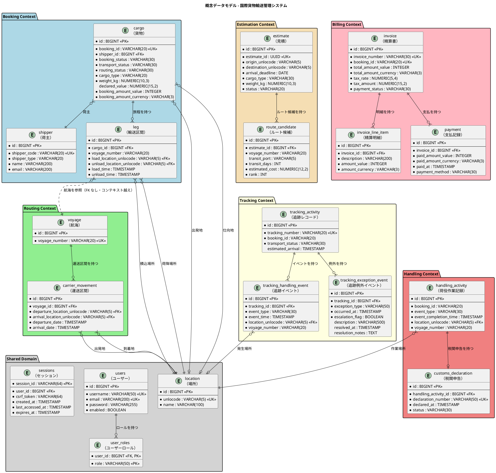
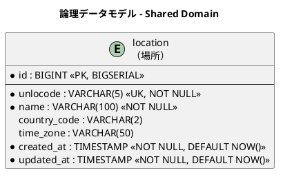
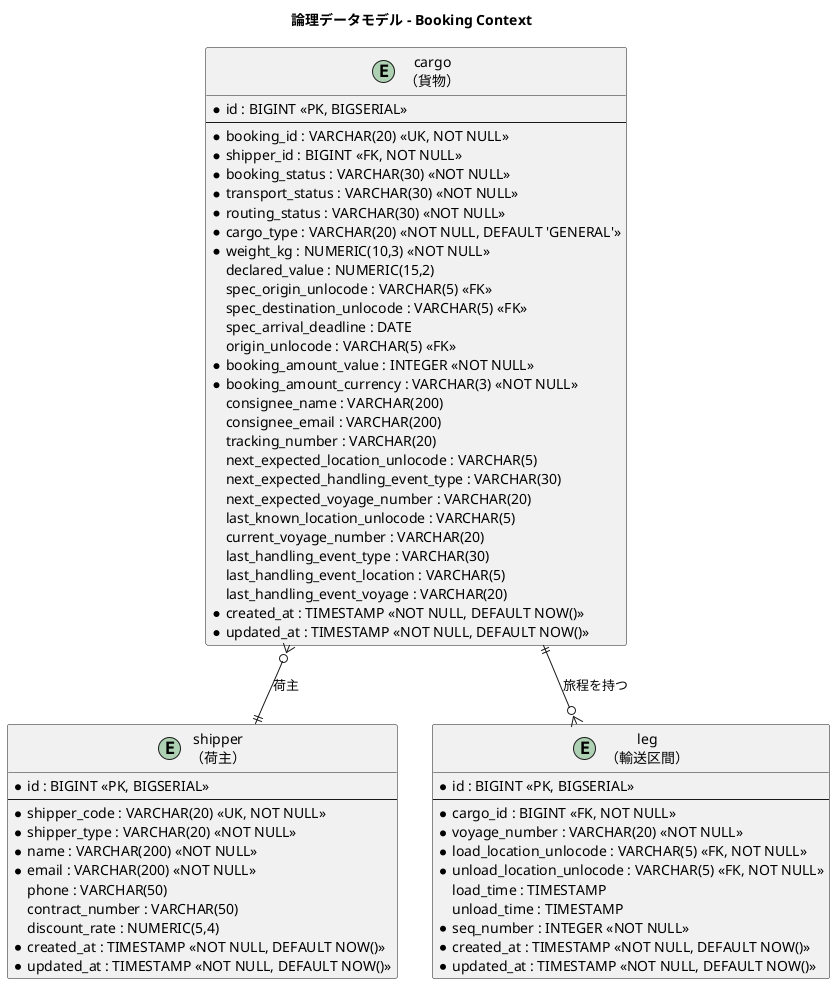
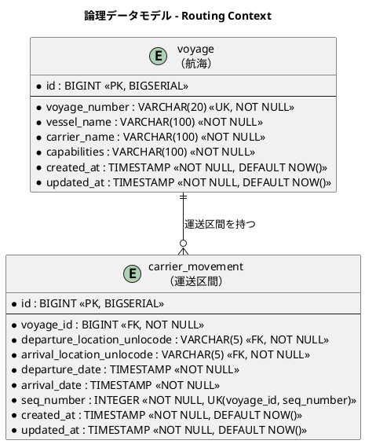
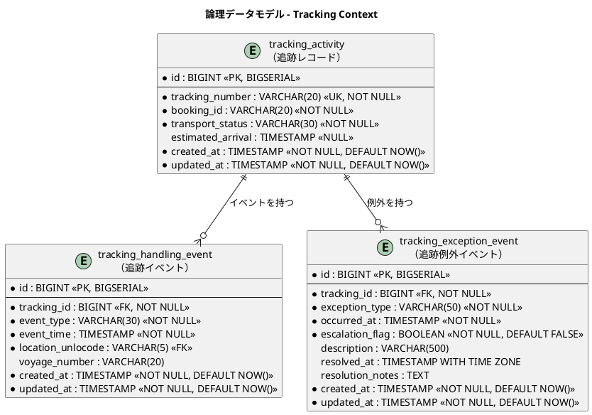
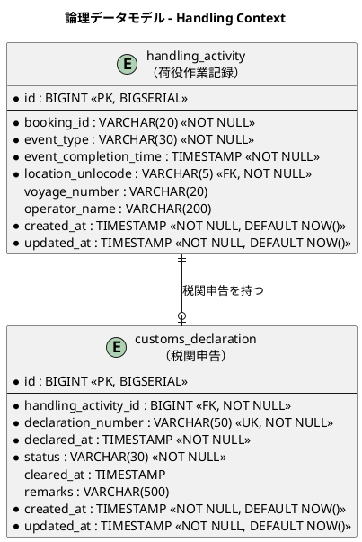
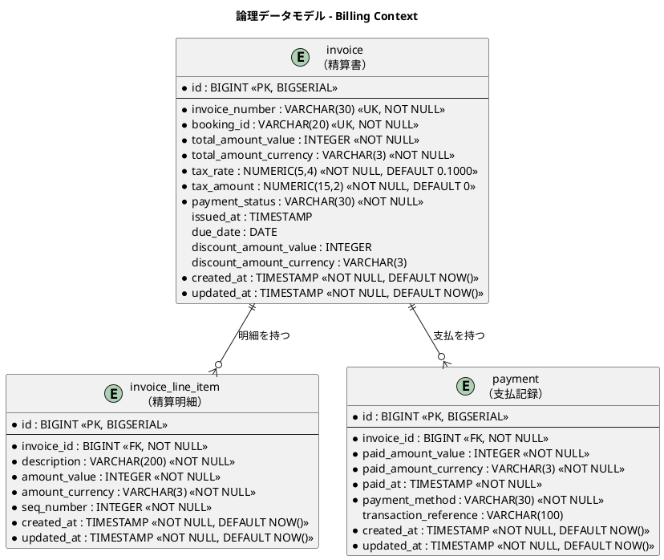
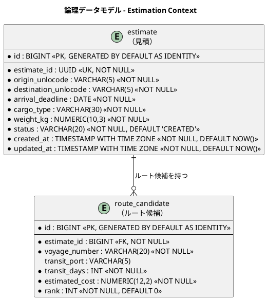
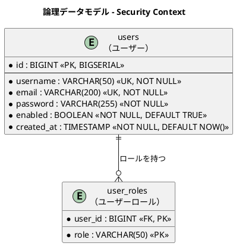

# データモデル設計 - 国際貨物輸送管理システム

## 概要

本ドキュメントは、国際貨物輸送管理システムの永続化層データモデルを定義する。
ドメインモデル分析で識別した 7 つの境界付けられたコンテキスト（Booking / Routing / Tracking / Handling / Billing / Estimation / Shared Domain）に対応する 18 テーブルを設計する。
`shipper`（荷主）テーブルと、自作認証機構が参照する `users` / `user_roles` テーブルを含む。

テーブル設計自体は実装言語に依存しないが、Flix 実装では ORM を使わず JDBC を直接扱うため、行 ⇄ ドメイン型の変換方針を「設計上の判断」に追記している。

### 設計方針

- **DB**: PostgreSQL 16.x（本番）、H2（テスト）
- **データアクセス**: ORM を使わず、`java.sql`（JDBC）を Flix の `Db` 効果ハンドラ内で直接使用する。SQL は Flix ソース内の定数として管理する
- **マイグレーション**: Flyway（`V1__init.sql` 形式）
- **ID 戦略**: サロゲートキー（`BIGSERIAL`）+ 業務キー（`VARCHAR`）の併用
- **命名規則**: スネークケース（PostgreSQL 慣習）
- **監査カラム**: 全テーブルに `created_at` / `updated_at` を付与

---

## 概念データモデル

全コンテキストのエンティティとその主要リレーションシップを俯瞰する。



---

## 論理データモデル

### Shared Domain

共有ドメインとして全コンテキストが参照する場所マスタ。UN/LOCODE（国連貿易港コード）を業務キーとする。



---

### Booking Context

貨物の予約・旅程情報を管理する。`cargo` が集約ルートで、`leg` が旅程の各区間を表す。荷主情報は `shipper` テーブルに正規化し、FK 参照とする。



---

### Routing Context

航海スケジュールと運送区間を管理する。`voyage` が集約ルートで、`carrier_movement` が個々の移動区間を表す。



---

### Tracking Context

貨物追跡の状態・イベント・例外を管理する。`tracking_activity` が集約ルート。



---

### Handling Context

荷役作業の実績と税関申告を管理する。`handling_activity` が集約ルート。

> **実装状況**: `handling_activity` は **IT10 で作成済み**（`V12__add_handling_activity.sql`・US15）。
> 設計からの変更は 2 列である。
>
> - `booking_id` → **`tracking_number`**。US15 受入基準 1 が「追跡番号の入力で貨物を
>   特定できる」と定めており、荷役作業員が現場で手にしているのは追跡番号である
> - **`validity` を追加**（VALID / WARNED / MISROUTED）。判定結果を残さないと、
>   後から MISROUTED の経緯を追えない
>
> `event_type` / `event_completion_time` / `operator_name` は**改名しない**——
> 既存の `tracking_handling_event` と揃った命名である。
> `customs_declaration` は US16（IT11）まで作らない。



---

### Billing Context

精算書・明細・支払記録を管理する。参考実装には存在しない新規コンテキスト。



---

### Estimation Context

輸送見積とルート候補を管理する。`estimate` が集約ルートで、`route_candidate` が各ルート候補を表す。



---

### Security Context

自作認証機構（`Auth` 効果のハンドラ）が参照するユーザー認証・認可テーブル。



---

## テーブル定義

### `location`（場所マスタ）

| カラム名 | データ型 | 制約 | 説明 |
| :--- | :--- | :--- | :--- |
| `id` | `BIGINT` | `PK, NOT NULL` | サロゲートキー（BIGSERIAL） |
| `unlocode` | `VARCHAR(5)` | `UK, NOT NULL` | UN/LOCODE（業務キー。例: `JPTYO`） |
| `name` | `VARCHAR(100)` | `NOT NULL` | 場所名称（例: `Tokyo`） |
| `country_code` | `VARCHAR(2)` | | ISO 3166-1 alpha-2 国コード |
| `time_zone` | `VARCHAR(50)` | | タイムゾーン（例: `Asia/Tokyo`） |
| `created_at` | `TIMESTAMP WITH TIME ZONE` | `NOT NULL, DEFAULT NOW()` | レコード作成日時 |
| `updated_at` | `TIMESTAMP WITH TIME ZONE` | `NOT NULL, DEFAULT NOW()` | レコード更新日時 |

---

### `shipper`（荷主）

> **注記**: 旧設計で `cargo` テーブルに存在した `shipper_name`・`shipper_email` カラムは本テーブルへの正規化に伴い削除した。
>
> **IT4 での是正（3 点）**: 実装（`V4__add_shipper.sql`）と同一の変更で本節を直した。
>
> | 是正 | 内容 |
> | :--- | :--- |
> | `address` の追加 | ドメインモデルの `Shipper` は `Address`（最大 500 文字）を持ち、US02 の受入基準も住所の入力を求めるが、本表に該当カラムがなかった |
> | 割引率の上限を 30% へ | 本表は 15% としていたが、[ユーザーストーリー](../requirements/user_story.md) US03 とドメインモデルのビジネスルール 4 は 0〜30% である。**要件を正**とした |
> | `shipper_id`（業務キー）の併置 | `cargo.shipper_id` は `UUID` で `shipper.id`（`BIGSERIAL`）を参照する定義になっており FK として成立していなかった。「1. サロゲートキーと業務キーの併用」に従い業務キーを併置する |

| カラム名 | データ型 | 制約 | 説明 |
| :--- | :--- | :--- | :--- |
| `id` | `BIGINT` | `PK, NOT NULL` | サロゲートキー（BIGSERIAL） |
| `shipper_id` | `VARCHAR(36)` | `UK, NOT NULL` | 荷主 ID（業務キー。UUID の文字列表現）。他コンテキストはこの値で参照する |
| `shipper_code` | `VARCHAR(20)` | `UK, NOT NULL` | 荷主コード（業務識別コード。SHP-XXXXXXXX 形式） |
| `shipper_type` | `VARCHAR(20)` | `NOT NULL` | 荷主種別（`INDIVIDUAL` / `CORPORATE`） |
| `name` | `VARCHAR(200)` | `NOT NULL` | 荷主名称 |
| `email` | `VARCHAR(200)` | `UK, NOT NULL` | メールアドレス。**システム全体で一意**（ドメインのビジネスルール 2） |
| `phone` | `VARCHAR(50)` | | 電話番号 |
| `address` | `VARCHAR(500)` | | 住所 |
| `contract_number` | `VARCHAR(50)` | | 契約番号（法人のみ。NULLable） |
| `discount_rate` | `NUMERIC(5,4)` | | 割引率（0.0000〜0.3000、最大 30%）。個人は NULL |
| `created_at` | `TIMESTAMP WITH TIME ZONE` | `NOT NULL, DEFAULT NOW()` | レコード作成日時 |
| `updated_at` | `TIMESTAMP WITH TIME ZONE` | `NOT NULL, DEFAULT NOW()` | レコード更新日時 |

> **`discount_rate` に既定値 0 を置かない理由**: 個人荷主に「割引率 0%」を持たせると、
> 「割引の対象外」と「割引率が 0% と決められている」を区別できない。`NULL` を
> 「法人ではない」の表現に使い、`shipper_type = 'CORPORATE'` のときのみ値を持つ。

#### DDL

```sql
CREATE TABLE shipper (
    id              BIGSERIAL PRIMARY KEY,
    shipper_id      VARCHAR(36)  NOT NULL UNIQUE,  -- 業務キー（UUID の文字列表現）
    shipper_code    VARCHAR(20)  NOT NULL UNIQUE,  -- SHP-XXXXXXXX 形式
    shipper_type    VARCHAR(20)  NOT NULL,          -- INDIVIDUAL / CORPORATE
    name            VARCHAR(200) NOT NULL,
    email           VARCHAR(200) NOT NULL UNIQUE,
    phone           VARCHAR(50),
    address         VARCHAR(500),
    contract_number VARCHAR(50),                   -- 法人のみ（NULLable）
    discount_rate   NUMERIC(5,4),                  -- 0.0000〜0.3000（最大 30%）
    created_at      TIMESTAMP WITH TIME ZONE NOT NULL DEFAULT NOW(),
    updated_at      TIMESTAMP WITH TIME ZONE NOT NULL DEFAULT NOW()
);

CREATE INDEX idx_shipper_email ON shipper(email);
```

---

### `cargo`（貨物）

> **注記**: `shipper_name`・`shipper_email` カラムは削除し、`shipper_id` による参照に変更した。
>
> **IT4 での是正（2 点）**:
>
> | 是正 | 内容 |
> | :--- | :--- |
> | `booking_id` を `VARCHAR(20)` へ | `UUID` としていたが、IT1 で作成済みの `tracking_activity.booking_id` は `VARCHAR(20)` であり**突合できなかった**。ドメインモデルの `BookingId` も `String`、UI の表示も `BK-1234` 形式である。IT1 の実装とドメインモデルが一致する `VARCHAR(20)` を正とした |
> | `shipper_id` の FK を外す | Booking と Shipper は別コンテキストであり、「5. コンテキスト間の参照整合性」に反していた。整合性は `ShipperExistenceChecker` ACL がアプリケーション層で保証する |
>
> **実装状況**: `cargo` テーブルは **IT4 で作成済み**（`V5__add_cargo.sql`）。
> **危険物申告・温度管理条件の 6 列は IT5 で追加済み**（`V7__add_cargo_special_requirements.sql`・US05）。
> **`routing_status` と `leg` テーブルは IT9 で追加済み**（`V10__add_cargo_itinerary.sql`・US09/US11）。
> **`tracking_number` は IT10 で追加済み**（`V11__add_tracking_number.sql`・US14）。
> `NULL` 許容だが **UNIQUE** を張る——追跡番号は荷主が問い合わせに使う唯一の手掛かりであり、
> 重複すると別の貨物の状況が見える。発行は予約確定の後なので、登録時点では存在しない。
> `routing_status` は `VARCHAR(30) NOT NULL DEFAULT 'NOT_ROUTED'` で、`booking_status` とは
> **独立した 2 軸**として扱う（経路の割り当ては `routing_status` だけを動かす）。
> 金額・追跡番号は「将来追加予定カラム」節のとおり後続イテレーションで追加する。
>
> 特別要件の列に `NOT NULL` や `CHECK` を付けないのは、**種別と値の対応という
> ビジネスルールの正典をドメインに置く**ためである（`BookingModel.checkSpecialRequirements`）。
> 同じルールを DB にも書くと、片方だけが変わる。
>
> 本ドキュメントに残る「IT1/IT2 実装状況」の記述は
> `tmp/case-study-cargo-tracker`（Jakarta EE 参考実装）の実績である。

| カラム名 | データ型 | 制約 | 説明 |
| :--- | :--- | :--- | :--- |
| `id` | `BIGINT` | `PK, NOT NULL` | サロゲートキー（`BIGINT GENERATED BY DEFAULT AS IDENTITY`） |
| `booking_id` | `VARCHAR(20)` | `UK, NOT NULL` | 予約 ID（業務キー。`BK-XXXX` 形式） |
| `shipper_id` | `VARCHAR(36)` | `NOT NULL` | 荷主 ID（`shipper.shipper_id` と同じ値域。**FK は張らない**） |
| `cargo_type` | `VARCHAR(30)` | `NOT NULL` | 貨物種別（`GENERAL` / `HAZARDOUS` / `REFRIGERATED`） |
| `weight` | `NUMERIC(10,3)` | `NOT NULL, > 0` | 重量（kg） |
| `origin_unlocode` | `VARCHAR(5)` | `NOT NULL` | 出発地（RouteSpecification） |
| `destination_unlocode` | `VARCHAR(5)` | `NOT NULL` | 仕向地（RouteSpecification） |
| `arrival_deadline` | `DATE` | `NOT NULL` | 到着期限（RouteSpecification） |
| `booking_status` | `VARCHAR(30)` | `NOT NULL, DEFAULT 'PRELIMINARY'` | 予約状態（BookingStatus 列挙値） |
| `dimension_length` | `NUMERIC(10,3)` | | 貨物の長さ（cm、オプション） |
| `dimension_width` | `NUMERIC(10,3)` | | 貨物の幅（cm、オプション） |
| `dimension_height` | `NUMERIC(10,3)` | | 貨物の高さ（cm、オプション） |
| `quantity` | `INTEGER` | | 貨物個数（オプション、1 以上） |
| `description` | `VARCHAR(500)` | | 品名（オプション） |
| `hazardous_class` | `VARCHAR(10)` | | 危険物クラス（HAZARDOUS 時のみ） |
| `un_number` | `VARCHAR(10)` | | UN 番号（HAZARDOUS 時のみ） |
| `proper_shipping_name` | `VARCHAR(200)` | | 正式輸送品名（HAZARDOUS 時のみ） |
| `min_temperature` | `NUMERIC(10,3)` | | 最低温度（REFRIGERATED 時のみ） |
| `max_temperature` | `NUMERIC(10,3)` | | 最高温度（REFRIGERATED 時のみ） |
| `temperature_unit` | `VARCHAR(20)` | | 温度単位（`CELSIUS` / `FAHRENHEIT`、REFRIGERATED 時のみ） |
| `created_at` | `TIMESTAMP WITH TIME ZONE` | `NOT NULL, DEFAULT NOW()` | レコード作成日時 |
| `updated_at` | `TIMESTAMP WITH TIME ZONE` | `NOT NULL, DEFAULT NOW()` | レコード更新日時 |

#### 将来追加予定カラム（IT4+）

| カラム名 | データ型 | 説明 | 追加フェーズ |
| :--- | :--- | :--- | :--- |
| `transport_status` | `VARCHAR(30)` | 輸送状態（TransportStatus 列挙値） | Tracking Context 実装時 |
| `booking_amount_value` | `INTEGER` | 予約金額（最小通貨単位） | Billing Context 実装時 |
| `booking_amount_currency` | `VARCHAR(3)` | 通貨コード（ISO 4217） | Billing Context 実装時 |
| `consignee_name` | `VARCHAR(200)` | 荷受人名 | 荷受人管理実装時 |
| `consignee_email` | `VARCHAR(200)` | 荷受人メールアドレス | 荷受人管理実装時 |
| `next_expected_*` | 各種 | 次の予定荷役情報 | Tracking Context 実装時 |
| `last_handling_event_*` | 各種 | 最後の荷役イベント情報 | Handling Context 実装時 |

---

### `leg`（輸送区間）

| カラム名 | データ型 | 制約 | 説明 |
| :--- | :--- | :--- | :--- |
| `id` | `BIGINT` | `PK, NOT NULL` | サロゲートキー（BIGSERIAL） |
| `cargo_id` | `BIGINT` | `FK → cargo.id, NOT NULL` | 親貨物 ID |
| `voyage_number` | `VARCHAR(20)` | `NOT NULL`（**FK は張らない**） | 航海番号 |
| `load_location_unlocode` | `VARCHAR(5)` | `FK → location.unlocode, NOT NULL` | 積込場所（UN/LOCODE） |
| `unload_location_unlocode` | `VARCHAR(5)` | `FK → location.unlocode, NOT NULL` | 荷降場所（UN/LOCODE） |
| `load_time` | `TIMESTAMP` | | 積込予定日時 |
| `unload_time` | `TIMESTAMP` | | 荷降予定日時 |
| `seq_number` | `INTEGER` | `NOT NULL` | 区間順序（1 始まり） |
| `created_at` | `TIMESTAMP` | `NOT NULL, DEFAULT NOW()` | レコード作成日時 |
| `updated_at` | `TIMESTAMP` | `NOT NULL, DEFAULT NOW()` | レコード更新日時 |

---

### `voyage`（航海）

| カラム名 | データ型 | 制約 | 説明 |
| :--- | :--- | :--- | :--- |
| `id` | `BIGINT` | `PK, NOT NULL` | サロゲートキー（BIGSERIAL） |
| `voyage_number` | `VARCHAR(20)` | `UK, NOT NULL` | 航海番号（業務キー・利用者が決める。採番しない） |
| `vessel_name` | `VARCHAR(100)` | `NOT NULL` | 船名 |
| `carrier_name` | `VARCHAR(100)` | `NOT NULL` | 運送会社名 |
| `capabilities` | `VARCHAR(100)` | `NOT NULL` | 対応可能な貨物種別の集合。区切り文字で囲む（例 `,GENERAL,REFRIGERATED,`） |
| `created_at` | `TIMESTAMP` | `NOT NULL, DEFAULT NOW()` | レコード作成日時 |
| `updated_at` | `TIMESTAMP` | `NOT NULL, DEFAULT NOW()` | レコード更新日時 |

> **`capabilities` を 1 列に持つ理由**（IT6・US24）: 値は 3 種（`GENERAL` /
> `HAZARDOUS` / `REFRIGERATED`）に限られ、検索は「この種別に対応しているか」の
> 1 パターンしかない。別テーブルにすると結合が増え、得るものが無い。
>
> **検索は `LIKE '%GENERAL%'` ではなく区切り文字を含めた一致で行う**。
> 将来 `GENERAL_CARGO` のような値が増えたとき、部分一致は誤検出する。
> 値の前後に区切りを置くのは、そのためである。

---

### `carrier_movement`（運送区間）

| カラム名 | データ型 | 制約 | 説明 |
| :--- | :--- | :--- | :--- |
| `id` | `BIGINT` | `PK, NOT NULL` | サロゲートキー（BIGSERIAL） |
| `voyage_id` | `BIGINT` | `FK → voyage.id, NOT NULL` | 親航海 ID |
| `departure_location_unlocode` | `VARCHAR(5)` | `FK → location.unlocode, NOT NULL` | 出発地（UN/LOCODE） |
| `arrival_location_unlocode` | `VARCHAR(5)` | `FK → location.unlocode, NOT NULL` | 到着地（UN/LOCODE） |
| `departure_date` | `TIMESTAMP` | `NOT NULL` | 出発日時 |
| `arrival_date` | `TIMESTAMP` | `NOT NULL` | 到着日時 |
| `seq_number` | `INTEGER` | `NOT NULL, UK(voyage_id, seq_number)` | 区間順序（1 始まり） |
| `created_at` | `TIMESTAMP` | `NOT NULL, DEFAULT NOW()` | レコード作成日時 |
| `updated_at` | `TIMESTAMP` | `NOT NULL, DEFAULT NOW()` | レコード更新日時 |

---

### `tracking_activity`（追跡レコード）

| カラム名 | データ型 | 制約 | 説明 |
| :--- | :--- | :--- | :--- |
| `id` | `BIGINT` | `PK, NOT NULL` | サロゲートキー（BIGSERIAL） |
| `tracking_number` | `VARCHAR(20)` | `UK, NOT NULL` | 追跡番号（業務キー） |
| `booking_id` | `VARCHAR(20)` | `NOT NULL` | 予約 ID（参照整合性は書き込み側で保証） |
| `transport_status` | `VARCHAR(30)` | `NOT NULL` | 輸送状態（TransportStatus 列挙値） |
| `estimated_arrival` | `TIMESTAMP` | `NULL 許容` | 推定到着日。経路が未確定の貨物では到着予定が定まらないため NULL を許容する（画面では「未定」と表示） |
| `created_at` | `TIMESTAMP` | `NOT NULL, DEFAULT NOW()` | レコード作成日時 |
| `updated_at` | `TIMESTAMP` | `NOT NULL, DEFAULT NOW()` | レコード更新日時 |

---

### `tracking_handling_event`（追跡イベント）

> **誰が書くか**（IT11・US15/US16）: 荷役の登録が
> [ADR-0012](../adr/ADR-0012-cross-context-writes-go-through-the-target-aggregate.md) の
> ACL を通り、`TrackingActivity` の集約メソッド（`applyHandling`）経由で 1 行足す。
> `handling_activity`（Handling Context の業務記録）とは**同じ出来事の別の側面**であり、
> 一方をもう一方の表示に流用しない——荷役の妥当性判定は荷主の画面に出さない。
>
> **IT10 では誰も書いていなかった**。テーブルはあり公開追跡はこれを読んでいたが、
> 荷役は `handling_activity` だけへ書いていたため、荷主にはバッジが変わるだけで
> 「いつ・どこで積まれたか」が出なかった（IT10 レビュー H8）。

| カラム名 | データ型 | 制約 | 説明 |
| :--- | :--- | :--- | :--- |
| `id` | `BIGINT` | `PK, NOT NULL` | サロゲートキー（BIGSERIAL） |
| `tracking_id` | `BIGINT` | `FK → tracking_activity.id, NOT NULL` | 親追跡レコード ID |
| `event_type` | `VARCHAR(30)` | `NOT NULL` | 荷役タイプ（HandlingType 列挙値） |
| `event_time` | `TIMESTAMP` | `NOT NULL` | イベント発生日時 |
| `location_unlocode` | `VARCHAR(5)` | `FK → location.unlocode` | イベント発生場所（UN/LOCODE） |
| `voyage_number` | `VARCHAR(20)` | | 関連する航海番号 |
| `created_at` | `TIMESTAMP` | `NOT NULL, DEFAULT NOW()` | レコード作成日時 |
| `updated_at` | `TIMESTAMP` | `NOT NULL, DEFAULT NOW()` | レコード更新日時 |

---

### `tracking_exception_event`（追跡例外イベント）

| カラム名 | データ型 | 制約 | 説明 |
| :--- | :--- | :--- | :--- |
| `id` | `BIGINT` | `PK, NOT NULL` | サロゲートキー（BIGSERIAL） |
| `tracking_id` | `BIGINT` | `FK → tracking_activity.id, NOT NULL` | 親追跡レコード ID |
| `exception_type` | `VARCHAR(50)` | `NOT NULL` | 例外種別（例: `CUSTOMS_HOLD`, `DAMAGE`, `DELAY`） |
| `occurred_at` | `TIMESTAMP WITH TIME ZONE` | `NOT NULL` | 例外発生日時 |
| `escalation_flag` | `BOOLEAN` | `NOT NULL, DEFAULT FALSE` | エスカレーション判定フラグ（US15 紛失時） |
| `description` | `VARCHAR(500)` | | 例外内容の詳細 |
| `resolved_at` | `TIMESTAMP WITH TIME ZONE` | | 解決日時（NULL = 未解決） |
| `resolution_notes` | `TEXT` | | 対応内容メモ |
| `created_at` | `TIMESTAMP WITH TIME ZONE` | `NOT NULL, DEFAULT NOW()` | レコード作成日時 |
| `updated_at` | `TIMESTAMP WITH TIME ZONE` | `NOT NULL, DEFAULT NOW()` | レコード更新日時 |

---

### `handling_activity`（荷役作業記録）

| カラム名 | データ型 | 制約 | 説明 |
| :--- | :--- | :--- | :--- |
| `id` | `BIGINT` | `PK, NOT NULL` | サロゲートキー（BIGSERIAL） |
| `booking_id` | `VARCHAR(20)` | `NOT NULL` | 予約 ID（参照整合性は書き込み側で保証） |
| `event_type` | `VARCHAR(30)` | `NOT NULL` | 荷役タイプ（RECEIVE / LOAD / UNLOAD / CUSTOMS / CLAIM） |
| `event_completion_time` | `TIMESTAMP` | `NOT NULL` | 荷役完了日時 |
| `location_unlocode` | `VARCHAR(5)` | `FK → location.unlocode, NOT NULL` | 作業場所（UN/LOCODE） |
| `voyage_number` | `VARCHAR(20)` | | 関連する航海番号（LOAD / UNLOAD 時に設定） |
| `operator_name` | `VARCHAR(200)` | | 作業員名 |
| `created_at` | `TIMESTAMP` | `NOT NULL, DEFAULT NOW()` | レコード作成日時 |
| `updated_at` | `TIMESTAMP` | `NOT NULL, DEFAULT NOW()` | レコード更新日時 |

---

### `customs_declaration`（税関申告）

| カラム名 | データ型 | 制約 | 説明 |
| :--- | :--- | :--- | :--- |
| `id` | `BIGINT` | `PK, NOT NULL` | サロゲートキー（BIGSERIAL） |
| `handling_activity_id` | `BIGINT` | `FK → handling_activity.id, NOT NULL` | 関連荷役作業 ID |
| `declaration_number` | `VARCHAR(50)` | `UK, NOT NULL` | 申告番号（業務キー） |
| `declared_at` | `TIMESTAMP` | `NOT NULL` | 申告日時 |
| `status` | `VARCHAR(30)` | `NOT NULL` | 申告状態（例: `PENDING`, `CLEARED`, `HELD`） |
| `cleared_at` | `TIMESTAMP` | | 通関完了日時（NULL = 未完了） |
| `remarks` | `VARCHAR(500)` | | 備考・メモ |
| `created_at` | `TIMESTAMP` | `NOT NULL, DEFAULT NOW()` | レコード作成日時 |
| `updated_at` | `TIMESTAMP` | `NOT NULL, DEFAULT NOW()` | レコード更新日時 |

---

### `invoice`（精算書）

| カラム名 | データ型 | 制約 | 説明 |
| :--- | :--- | :--- | :--- |
| `id` | `BIGINT` | `PK, NOT NULL` | サロゲートキー（BIGSERIAL） |
| `invoice_number` | `VARCHAR(30)` | `UK, NOT NULL` | 精算書番号（業務キー） |
| `booking_id` | `VARCHAR(20)` | `UK, NOT NULL` | 予約 ID（UNIQUE 制約で二重請求を防止） |
| `total_amount_value` | `INTEGER` | `NOT NULL` | 合計金額（最小通貨単位） |
| `total_amount_currency` | `VARCHAR(3)` | `NOT NULL` | 通貨コード（ISO 4217） |
| `tax_rate` | `NUMERIC(5,4)` | `NOT NULL, DEFAULT 0.1000` | 消費税率（デフォルト 10%） |
| `tax_amount` | `NUMERIC(15,2)` | `NOT NULL, DEFAULT 0` | 消費税額 |
| `payment_status` | `VARCHAR(30)` | `NOT NULL` | 支払状態（`PENDING` / `CONFIRMED` / `OVERDUE` / `REFUNDED`） |
| `issued_at` | `TIMESTAMP WITH TIME ZONE` | | 発行日時 |
| `due_date` | `DATE` | | 支払期日 |
| `discount_amount_value` | `INTEGER` | | 割引金額（最小通貨単位） |
| `discount_amount_currency` | `VARCHAR(3)` | | 割引通貨コード |
| `created_at` | `TIMESTAMP WITH TIME ZONE` | `NOT NULL, DEFAULT NOW()` | レコード作成日時 |
| `updated_at` | `TIMESTAMP WITH TIME ZONE` | `NOT NULL, DEFAULT NOW()` | レコード更新日時 |

---

### `invoice_line_item`（精算明細）

| カラム名 | データ型 | 制約 | 説明 |
| :--- | :--- | :--- | :--- |
| `id` | `BIGINT` | `PK, NOT NULL` | サロゲートキー（BIGSERIAL） |
| `invoice_id` | `BIGINT` | `FK → invoice.id, NOT NULL` | 親精算書 ID |
| `description` | `VARCHAR(200)` | `NOT NULL` | 明細項目説明 |
| `amount_value` | `INTEGER` | `NOT NULL` | 明細金額（最小通貨単位） |
| `amount_currency` | `VARCHAR(3)` | `NOT NULL` | 通貨コード（ISO 4217） |
| `seq_number` | `INTEGER` | `NOT NULL` | 明細順序（1 始まり） |
| `created_at` | `TIMESTAMP` | `NOT NULL, DEFAULT NOW()` | レコード作成日時 |
| `updated_at` | `TIMESTAMP` | `NOT NULL, DEFAULT NOW()` | レコード更新日時 |

---

### `payment`（支払記録）

| カラム名 | データ型 | 制約 | 説明 |
| :--- | :--- | :--- | :--- |
| `id` | `BIGINT` | `PK, NOT NULL` | サロゲートキー（BIGSERIAL） |
| `invoice_id` | `BIGINT` | `FK → invoice.id, NOT NULL` | 親精算書 ID |
| `paid_amount_value` | `INTEGER` | `NOT NULL` | 支払金額（最小通貨単位） |
| `paid_amount_currency` | `VARCHAR(3)` | `NOT NULL` | 通貨コード（ISO 4217） |
| `paid_at` | `TIMESTAMP` | `NOT NULL` | 支払日時 |
| `payment_method` | `VARCHAR(30)` | `NOT NULL` | 支払方法（例: `BANK_TRANSFER`, `CREDIT_CARD`） |
| `transaction_reference` | `VARCHAR(100)` | | 取引参照番号（外部決済システムの ID） |
| `created_at` | `TIMESTAMP WITH TIME ZONE` | `NOT NULL, DEFAULT NOW()` | レコード作成日時 |
| `updated_at` | `TIMESTAMP WITH TIME ZONE` | `NOT NULL, DEFAULT NOW()` | レコード更新日時 |

---

### `users`（ユーザー）

自作認証機構がログイン時に参照するユーザー認証テーブル。

| カラム名 | データ型 | 制約 | 説明 |
| :--- | :--- | :--- | :--- |
| `id` | `BIGINT` | `PK, NOT NULL` | サロゲートキー（BIGSERIAL） |
| `username` | `VARCHAR(50)` | `UK, NOT NULL` | ログイン名 |
| `email` | `VARCHAR(200)` | `UK, NOT NULL` | メールアドレス |
| `password` | `VARCHAR(255)` | `NOT NULL` | パスワード（BCrypt ハッシュ） |
| `enabled` | `BOOLEAN` | `NOT NULL, DEFAULT TRUE` | アカウント有効フラグ |
| `failed_attempts` | `INTEGER` | `NOT NULL, DEFAULT 0` | 連続ログイン失敗回数。成功時に 0 へ戻す |
| `locked_until` | `TIMESTAMP` | `NULL 許容` | ロック解除時刻。5 回失敗で「現在時刻 + 30 分」を設定する（[非機能要件](non_functional.md) 4.1） |
| `shipper_id` | `VARCHAR(36)` | `NULL 許容` | 所属する荷主（`shipper.shipper_id` と同じ値域。**FK は張らない**） |
| `created_at` | `TIMESTAMP WITH TIME ZONE` | `NOT NULL, DEFAULT NOW()` | レコード作成日時 |
| `updated_at` | `TIMESTAMP` | `NOT NULL, DEFAULT NOW()` | レコード更新日時（失敗回数・ロックの更新で書き換わる） |

#### DDL

```sql
CREATE TABLE users (
    id           BIGSERIAL PRIMARY KEY,
    username     VARCHAR(50)  NOT NULL UNIQUE,
    email        VARCHAR(200) NOT NULL UNIQUE,
    password        VARCHAR(255) NOT NULL,  -- BCrypt ハッシュ（コスト 12）
    enabled         BOOLEAN NOT NULL DEFAULT TRUE,
    failed_attempts INTEGER NOT NULL DEFAULT 0,
    locked_until    TIMESTAMP,
    -- 荷主ロールの利用者が「自分の予約だけ」を見るために要る（IT6・TS11）。
    -- 営業担当者・経路設計者・管理者は特定の荷主に属さないため NULL を許す。
    -- `users` は共有（認証）、`shipper` は Shipper Context であり、
    -- コンテキストをまたぐ参照は FK で縛らない（「5. コンテキスト間の参照整合性」）
    shipper_id      VARCHAR(36),
    created_at      TIMESTAMP WITH TIME ZONE NOT NULL DEFAULT NOW(),
    updated_at      TIMESTAMP NOT NULL DEFAULT NOW()
);

CREATE INDEX idx_users_shipper_id ON users(shipper_id);
```

---

### `user_roles`（ユーザーロール）

| カラム名 | データ型 | 制約 | 説明 |
| :--- | :--- | :--- | :--- |
| `user_id` | `BIGINT` | `PK, FK → users.id, NOT NULL` | 親ユーザー ID |
| `role` | `VARCHAR(50)` | `NOT NULL` | ロール名（`ROLE_ADMIN` / `ROLE_SALES` / `ROLE_ROUTER` / `ROLE_HANDLER` / `ROLE_TRACKER` / `ROLE_ACCOUNTANT` / `ROLE_SHIPPER` / `ROLE_CONSIGNEE` の 8 種） |

> **1 利用者 1 ロール**: 主キーは `user_id` のみとする。`Principal` が単一の `Role` を持ち
> 認可判定も単一ロール前提のため、複数行あると「どの行が返るか」で権限が変わる
> （非決定的な認可）。兼務が要件になった時点で `Principal` を複数ロール対応にし、
> この制約を外す（IT3 レビューでの指摘）。

#### DDL

```sql
CREATE TABLE user_roles (
    user_id  BIGINT      NOT NULL REFERENCES users(id),
    role     VARCHAR(50) NOT NULL,  -- ROLE_ADMIN / ROLE_SALES / ROLE_ROUTER / ROLE_HANDLER
                                   -- / ROLE_TRACKER / ROLE_ACCOUNTANT / ROLE_SHIPPER / ROLE_CONSIGNEE
    PRIMARY KEY (user_id)           -- 1 利用者 1 ロール（上記の注を参照）
);
```

---

### `sessions`（セッション）

自作認証機構のセッションストア。**インメモリではなく DB に置く**のは、
ECS を複数タスクで運用する際に別タスクが保持するセッションを無効化する手段が必要になるためである
（[バックエンドアーキテクチャ](architecture_backend.md) のセッションストア、[ADR-0003](../adr/ADR-0003-session-concurrency.md)）。

| カラム名 | データ型 | 制約 | 説明 |
| :--- | :--- | :--- | :--- |
| `session_id` | `VARCHAR(64)` | `PK, NOT NULL` | セッション ID（`SecureRandom` 由来の 256bit を 16 進表現） |
| `user_id` | `BIGINT` | `FK → users.id, NOT NULL` | セッションの所有者 |
| `csrf_token` | `VARCHAR(64)` | `NOT NULL` | セッション単位の CSRF トークン |
| `created_at` | `TIMESTAMP` | `NOT NULL, DEFAULT NOW()` | 作成日時 |
| `last_accessed_at` | `TIMESTAMP` | `NOT NULL, DEFAULT NOW()` | 最終アクセス日時（タイムアウトの起点） |
| `expires_at` | `TIMESTAMP` | `NOT NULL` | 失効時刻（`ROLE_HANDLER` は 2 時間、その他は 30 分） |

#### DDL

```sql
CREATE TABLE sessions (
    session_id       VARCHAR(64) PRIMARY KEY,
    user_id          BIGINT      NOT NULL REFERENCES users(id),
    csrf_token       VARCHAR(64) NOT NULL,
    created_at       TIMESTAMP   NOT NULL DEFAULT NOW(),
    last_accessed_at TIMESTAMP   NOT NULL DEFAULT NOW(),
    expires_at       TIMESTAMP   NOT NULL
);

CREATE INDEX idx_sessions_user_id ON sessions(user_id);
CREATE INDEX idx_sessions_expires_at ON sessions(expires_at);
```

> **同時セッション数 1**（[ADR-0003](../adr/ADR-0003-session-concurrency.md)）: ログイン成功時に
> 同一 `user_id` の既存行を削除してから新しい行を作る。`user_id` の索引はこの削除のためにある。

---

### `estimate`（見積）

| カラム名 | データ型 | 制約 | 説明 |
| :--- | :--- | :--- | :--- |
| `id` | `BIGINT` | `PK, NOT NULL` | サロゲートキー（`GENERATED BY DEFAULT AS IDENTITY`） |
| `estimate_id` | `VARCHAR(36)` | `UK, NOT NULL` | 見積 ID（業務キー。`EST-XXXXXXXX`。**IT8 で `UUID` から変更**——利用者が電話口で読み上げる番号を URL と一致させるため。予約の `BK-`・荷主の `SHP-` と同じ形） |
| `origin_unlocode` | `VARCHAR(5)` | `NOT NULL` | 出発地（UN/LOCODE） |
| `destination_unlocode` | `VARCHAR(5)` | `NOT NULL` | 仕向地（UN/LOCODE） |
| `arrival_deadline` | `DATE` | `NOT NULL` | 到着期限 |
| `cargo_type` | `VARCHAR(30)` | `NOT NULL` | 貨物種別（`GENERAL` / `HAZARDOUS` / `REFRIGERATED`） |
| `weight_kg` | `NUMERIC(10,3)` | `NOT NULL` | 重量（kg） |
| `status` | `VARCHAR(20)` | `NOT NULL, DEFAULT 'CREATED'` | 見積状態（`CREATED` / `EXPIRED`） |
| `created_at` | `TIMESTAMP` | `NOT NULL, DEFAULT CURRENT_TIMESTAMP` | レコード作成日時（一覧の並び順に使う） |
| `updated_at` | `TIMESTAMP` | `NOT NULL, DEFAULT CURRENT_TIMESTAMP` | レコード更新日時 |

> **実装済み**（IT8・`V9__add_estimate.sql`）。
>
> **`TIMESTAMP WITH TIME ZONE` ではなく `TIMESTAMP`** を使う。開発・テストは H2 で動かしており、
> 既存の全テーブル（`cargo`・`voyage` ほか）も `TIMESTAMP` である。
> **1 つの表だけ型を変えると、時刻の比較が表をまたいだ瞬間に壊れる**。

#### DDL

```sql
CREATE TABLE estimate (
    id                    BIGINT GENERATED BY DEFAULT AS IDENTITY PRIMARY KEY,
    estimate_id           UUID NOT NULL UNIQUE,
    origin_unlocode       VARCHAR(5) NOT NULL,
    destination_unlocode  VARCHAR(5) NOT NULL,
    arrival_deadline      DATE NOT NULL,
    cargo_type            VARCHAR(30) NOT NULL,
    weight_kg             NUMERIC(10, 3) NOT NULL,
    status                VARCHAR(20) NOT NULL DEFAULT 'CREATED',
    created_at            TIMESTAMP WITH TIME ZONE NOT NULL DEFAULT NOW(),
    updated_at            TIMESTAMP WITH TIME ZONE NOT NULL DEFAULT NOW()
);
```

---

### `route_candidate`（ルート候補）

| カラム名 | データ型 | 制約 | 説明 |
| :--- | :--- | :--- | :--- |
| `id` | `BIGINT` | `PK, NOT NULL` | サロゲートキー（`GENERATED BY DEFAULT AS IDENTITY`） |
| `estimate_id` | `BIGINT` | `FK → estimate.id, NOT NULL` | 親見積 ID（CASCADE 削除） |
| `voyage_number` | `VARCHAR(120)` | `NOT NULL` | 航海番号。**積替のある候補は複数**になるため `|` で連結して入れる（IT8 で `VARCHAR(20)` から拡張） |
| `transit_port` | `VARCHAR(120)` | | 経由港（UN/LOCODE）。**複数の経由港を `|` で連結**して入れる。直行便は `NULL`（IT8 で `VARCHAR(5)` から拡張——寄港地が 2 つある候補を 1 列で表せなかった） |
| `transit_days` | `INT` | `NOT NULL` | 輸送日数 |
| `estimated_cost` | `NUMERIC(12,2)` | `NOT NULL` | 見積コスト |
| `rank` | `INT` | `NOT NULL, DEFAULT 0` | ルート候補の優先順位 |

#### DDL

```sql
CREATE TABLE route_candidate (
    id              BIGINT GENERATED BY DEFAULT AS IDENTITY PRIMARY KEY,
    estimate_id     BIGINT NOT NULL REFERENCES estimate(id) ON DELETE CASCADE,
    voyage_number   VARCHAR(20) NOT NULL,
    transit_port    VARCHAR(5),
    transit_days    INT NOT NULL,
    estimated_cost  NUMERIC(12, 2) NOT NULL,
    rank            INT NOT NULL DEFAULT 0
);
```

---

## 設計上の判断

### 1. サロゲートキーと業務キーの併用

**判断**: 全テーブルに `BIGSERIAL` のサロゲートキー（`id`）を設け、業務上の識別子（`booking_id`、`voyage_number`、`unlocode` 等）には `UNIQUE` 制約を付与する。

**根拠**: 外部キー参照を `BIGINT` に統一することでインデックス効率が向上する。業務キーはドメインモデルの一部であり、別途管理することで業務ルールの変更に対応しやすい。

---

### 2. `location` テーブルへの参照方式

**判断**: 参考実装では `VARCHAR` で場所 ID を文字列管理していたが、本設計では `location.unlocode` を外部キーとして参照する。

**根拠**: UN/LOCODE は国際標準の 5 文字コードであり、それ自体が意味を持つ自然キーである。文字列参照でも JOIN 効率は許容範囲内であり、可読性が高まる。

---

### 3. 金額の表現（`INTEGER` + `VARCHAR(3)`）

**判断**: 金額を `INTEGER`（最小通貨単位）と `VARCHAR(3)`（ISO 4217 通貨コード）の 2 カラムで表現する。`NUMERIC` / `DECIMAL` は使用しない。

**根拠**: 浮動小数点演算による精度誤差を排除するため、円・セントなど最小通貨単位で整数管理する。複数通貨対応のため通貨コードを常に付随させる。これはドメインモデルの `MoneyAmount` 値オブジェクトに対応する。

---

### 4. 列挙値のカラム型（`VARCHAR(30)`）

**判断**: `BookingStatus`、`TransportStatus`、`HandlingType` 等の列挙型カラムは `VARCHAR(30)` で表現し、PostgreSQL の `ENUM` 型は使用しない。

**根拠**: PostgreSQL `ENUM` 型は値の追加・変更にスキーマ ALTER が必要でマイグレーション時のリスクが高い。`VARCHAR` ならば Flyway マイグレーションで CHECK 制約を追加・変更するだけで済み、テスト（H2）との互換性も維持できる。

---

### 5. コンテキスト間の参照整合性

**判断**: 異なるコンテキスト間（例: `handling_activity.booking_id` → `cargo.booking_id`）には DB 外部キー制約を設けない。コンテキスト内の参照（例: `leg.cargo_id` → `cargo.id`）には外部キー制約を設ける。

**根拠**: DDD の境界付けられたコンテキスト間はイベント連携を前提とする疎結合設計であり、DB 外部キーによる強結合は将来のサービス分割を妨げる。整合性はアプリケーション層で保証する。

---

### 6. `Billing Context` の新規設計

**判断**: 参考実装（Jakarta EE）には `Billing Context` が存在しなかったが、本設計では `invoice`・`invoice_line_item`・`payment` の 3 テーブルを新規追加する。

**根拠**: ドメインモデル分析で識別した `SETTLED`（BookingStatus）と `Invoice` エンティティを実現するために必要。経理担当者のユースケース（精算書生成・支払確認）を支える永続化構造として設計した。

---

### 7. 監査カラムの全テーブル付与

**判断**: `created_at`・`updated_at` を全テーブルに `NOT NULL DEFAULT NOW()` で付与する。`updated_at` の更新は JDBC ハンドラ側の UPDATE 文で `CURRENT_TIMESTAMP` をセットする。

**根拠**: 国際貨物輸送は規制上の監査要件が高く、全レコードの作成・更新タイムスタンプが必要。PostgreSQL のトリガーで自動更新する方法もあるが、H2 との互換性を優先してアプリケーション側で制御する。

---

### 8. 行 ⇄ ドメイン型の変換方針（Flix 実装）

**判断**: ORM を用いず、テーブルごとに「行レコード型」（例：`CargoRow`）と、`ResultSet` からの手書きデコーダ、
およびドメイン型との相互変換関数を `infrastructure/mapper/` に置く。

**根拠**:

- Flix からアノテーション駆動の ORM を扱う手段がない
- 変換を明示的な関数にすることで、DB のカラム型（`VARCHAR(30)` の列挙値など）とドメインの `enum` の対応が
  1 箇所に集約され、パターンマッチの網羅性検査で値の追加漏れをコンパイラが検出できる
- 列挙値のデコードに失敗した場合は `Result[DecodeError, t]` で失敗させ、不正データを黙って通さない

**規約**:

| 規約 | 内容 |
| :--- | :--- |
| 行レコード型 | テーブル 1 つにつき 1 つ。カラムと 1 対 1 に対応させる（結合結果は別途 Read Model 型を定義する） |
| デコード | `ResultSet` → 行レコード型 → ドメイン型の 2 段階。中間の行レコード型は SQL とドメインの変更を疎結合にする |
| CQRS クエリ側 | 集約を再構築せず、JOIN 結果を画面表示用の Read Model 型へ直接デコードする |
| NULL | `NULL` 許容カラムは `Option[t]` へ変換する。ドメイン側で `Option` を潰さない |
| 金額 | `INTEGER`（最小通貨単位）+ `VARCHAR(3)`（通貨コード）を `Money` 値オブジェクトへ変換する。浮動小数点数を経由しない |

---

## Flyway マイグレーション方針

### ファイル命名規則

```
apps/cargo-tracker/resources/db/migration/
  V1__init.sql                  # Shared Domain（location）と Tracking Context（IT1）
  V2__add_estimated_arrival.sql # 推定到着日（IT2）
  V3__add_auth.sql              # users / user_roles / sessions（IT3）
  V4__add_shipper.sql           # shipper（IT4）
  V5__add_cargo.sql             # cargo（IT4）
  V6__shipper_email_case_insensitive.sql # 荷主メールの大文字小文字非依存化（IT5）
  V7__add_cargo_special_requirements.sql # 危険物申告・温度管理条件（IT5）
  V8__add_user_shipper_and_voyage_details.sql # 利用者と荷主の紐付け・航海詳細（IT7）
  V9__add_estimate.sql          # estimate / route_candidate（IT8）
  V10__add_cargo_itinerary.sql  # cargo.routing_status / leg（IT9）
  V11__add_tracking_number.sql  # cargo.tracking_number（IT10・US14）
  V12__add_handling_activity.sql # handling_activity（IT10・US15）
  R__location_master.sql        # マスタデータ（location）の再実行可能マイグレーション
```

> **実装の進め方**: 全テーブルを `V1__init.sql` で先に作らず、**そのコンテキストを実装する
> イテレーションでテーブルを追加する**。使われないテーブルが先に存在すると、設計変更のたびに
> 未使用のスキーマを直すことになるため（IT1 の判断）。

### マイグレーションルール

- バージョン番号は連番とし、番号の欠番を作らない
- 既存マイグレーションファイルの編集は禁止（Flyway チェックサム検証）
- **ロールバックは前方修正で行う**（新しい `V` を追加して打ち消す）。Flyway Community は
  Undo マイグレーション（`U` プレフィックス）に対応していないため、書いても実行できない
- 本番とテスト（H2）で同一マイグレーションスクリプトを使用するため、PostgreSQL 固有の構文（`BIGSERIAL` など）は H2 互換形式で記述する

### スキーマ全体の構成イメージ

```sql
-- Shared Domain
CREATE TABLE location ( ... );

-- Security Context
CREATE TABLE users ( ... );
CREATE TABLE user_roles ( ... );

-- Booking Context
CREATE TABLE shipper ( ... );
CREATE TABLE cargo ( ... );   -- shipper_id FK あり
CREATE TABLE leg ( ... );  -- voyage_number は FK なし（Routing Context 越え）

-- Routing Context
CREATE TABLE voyage ( ... );
CREATE TABLE carrier_movement ( ... );

-- Tracking Context
CREATE TABLE tracking_activity ( ... );
CREATE TABLE tracking_handling_event ( ... );
CREATE TABLE tracking_exception_event ( ... );  -- escalation_flag / resolution_notes あり

-- Handling Context
CREATE TABLE handling_activity ( ... );
CREATE TABLE customs_declaration ( ... );

-- Billing Context
CREATE TABLE invoice ( ... );  -- tax_rate / tax_amount / booking_id UNIQUE あり
CREATE TABLE invoice_line_item ( ... );
CREATE TABLE payment ( ... );

-- Estimation Context (V9__add_estimate.sql)
CREATE TABLE estimate ( ... );       -- estimate_id UUID UNIQUE あり
CREATE TABLE route_candidate ( ... ); -- estimate FK (CASCADE 削除) あり
```
