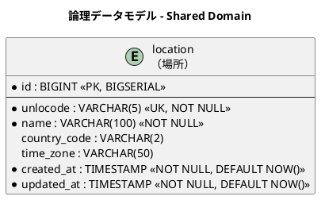
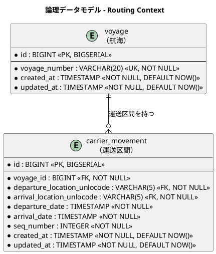
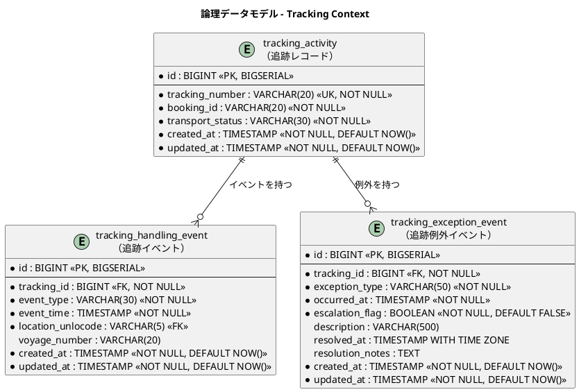
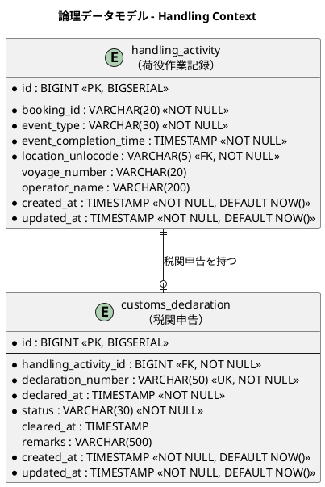
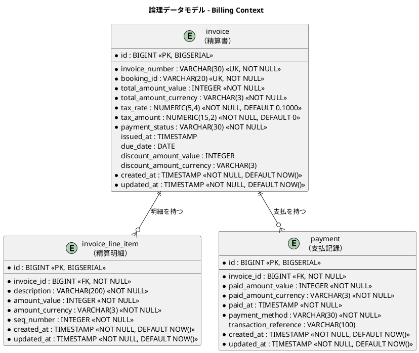
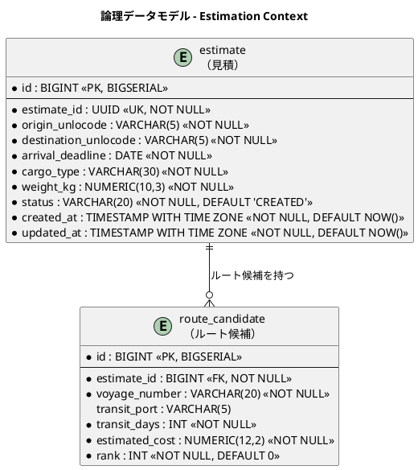
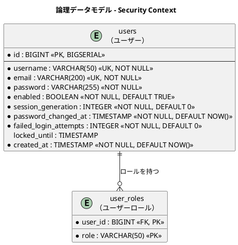

# データモデル設計 - 国際貨物輸送管理システム

## 概要

本ドキュメントは、国際貨物輸送管理システム（Scala 版）の永続化層データモデルを定義する。
境界付けられたコンテキスト（Booking / Routing / Tracking / Handling / Billing / Estimation / Shared Domain）に対応する 18 テーブルを設計する。
`shipper`（荷主）テーブルと、Play の認証（AuthenticatedAction）が参照する `users` / `user_roles` テーブルを含む。

> Estimation Context（見積）は UC01（輸送見積を作成する）を支える軽量コンテキストであり、
> [バックエンドアーキテクチャ](architecture_backend.md) のコンテキストマップには未掲載。ドメインモデル設計時に詳細化する。

### 設計方針

- **DB**: PostgreSQL 16.x（本番）、Testcontainers PostgreSQL（テスト）
- **データアクセス**: ScalikeJDBC（SQL interpolation による SQL 明示管理）
- **マイグレーション**: Flyway（flyway-play モジュール、`V1__init.sql` 形式）
- **ID 戦略**: サロゲートキー（`BIGSERIAL`）+ 業務キー（`VARCHAR`）の併用
- **命名規則**: スネークケース（PostgreSQL 慣習）
- **監査カラム**: 全テーブルに `created_at` / `updated_at` を付与

> Java 版（テスト DB に H2 を使用）と異なり、テストも Testcontainers の実 PostgreSQL を使用するため、
> H2 互換性の制約を受けず PostgreSQL ネイティブ構文（`BIGSERIAL`・`TIMESTAMP WITH TIME ZONE` 等）をそのまま使用できる。

---

## 概念データモデル

全コンテキストのエンティティとその主要リレーションシップを俯瞰する。

> **フェーズについて**: 概念データモデルはシステムの**最終形**を示す。一部の属性（`cargo` の `transport_status` / `routing_status` / `booking_amount_*` 等）は初期イテレーションのテーブル定義には含まれず、対応するコンテキストの実装イテレーションでマイグレーションにより追加する（各テーブル定義の「将来追加予定カラム」を参照）。


---

## 論理データモデル

### Shared Domain

共有ドメインとして全コンテキストが参照する場所マスタ。UN/LOCODE（国連貿易港コード）を業務キーとする。



---

### Booking Context

貨物の予約・旅程情報を管理する。`cargo` が集約ルートで、`leg` が旅程の各区間を表す。荷主情報は `shipper` テーブルに正規化し、FK 参照とする。


---

### Routing Context

航海スケジュールと運送区間を管理する。`voyage` が集約ルートで、`carrier_movement` が個々の移動区間を表す。



---

### Tracking Context

貨物追跡の状態・イベント・例外を管理する。`tracking_activity` が集約ルート。



---

### Handling Context

荷役作業の実績と税関申告を管理する。`handling_activity` が集約ルート。



---

### Billing Context

精算書・明細・支払記録を管理する。



---

### Estimation Context

輸送見積とルート候補を管理する。`estimate` が集約ルートで、`route_candidate` が各ルート候補を表す。



---

### Security Context

Play の認証（`AuthenticatedAction` / ログイン処理）が参照するユーザー認証・認可テーブル。



---

## テーブル定義

### `location`（場所マスタ）

| カラム名 | データ型 | 制約 | 説明 |
| :--- | :--- | :--- | :--- |
| `id` | `BIGINT` | `PK, NOT NULL` | サロゲートキー（BIGSERIAL） |
| `unlocode` | `VARCHAR(5)` | `UK, NOT NULL` | UN/LOCODE（業務キー。例: `JPTYO`） |
| `name` | `VARCHAR(100)` | `NOT NULL` | 場所名称（例: `Tokyo`） |
| `country_code` | `VARCHAR(2)` | | ISO 3166-1 alpha-2 国コード |
| `time_zone` | `VARCHAR(50)` | | タイムゾーン（例: `Asia/Tokyo`） |
| `created_at` | `TIMESTAMP WITH TIME ZONE` | `NOT NULL, DEFAULT NOW()` | レコード作成日時 |
| `updated_at` | `TIMESTAMP WITH TIME ZONE` | `NOT NULL, DEFAULT NOW()` | レコード更新日時 |

---

### `shipper`（荷主）

| カラム名 | データ型 | 制約 | 説明 |
| :--- | :--- | :--- | :--- |
| `id` | `BIGINT` | `PK, NOT NULL` | サロゲートキー（BIGSERIAL） |
| `shipper_code` | `VARCHAR(20)` | `UK, NOT NULL` | 荷主コード（業務キー。SHP-XXXXXX 形式） |
| `shipper_type` | `VARCHAR(20)` | `NOT NULL` | 荷主種別（`INDIVIDUAL` / `CORPORATE`） |
| `name` | `VARCHAR(200)` | `NOT NULL` | 荷主名称 |
| `email` | `VARCHAR(200)` | `NOT NULL` | メールアドレス |
| `phone` | `VARCHAR(50)` | | 電話番号 |
| `contract_number` | `VARCHAR(50)` | | 契約番号（法人のみ。NULLable） |
| `discount_rate` | `NUMERIC(5,4)` | `DEFAULT 0.0000, CHECK (0 <= discount_rate AND discount_rate <= 0.3000)` | 割引率（0.0000〜0.3000、最大 30%。US03 / US22 に対応） |
| `created_at` | `TIMESTAMP WITH TIME ZONE` | `NOT NULL, DEFAULT NOW()` | レコード作成日時 |
| `updated_at` | `TIMESTAMP WITH TIME ZONE` | `NOT NULL, DEFAULT NOW()` | レコード更新日時 |

#### DDL

```sql
CREATE TABLE shipper (
    id              BIGSERIAL PRIMARY KEY,
    shipper_code    VARCHAR(20)  NOT NULL UNIQUE,  -- SHP-XXXXXX 形式
    shipper_type    VARCHAR(20)  NOT NULL,         -- INDIVIDUAL / CORPORATE
    name            VARCHAR(200) NOT NULL,
    email           VARCHAR(200) NOT NULL,
    phone           VARCHAR(50),
    contract_number VARCHAR(50),                   -- 法人のみ（NULLable）
    discount_rate   NUMERIC(5,4) DEFAULT 0.0000
        CHECK (discount_rate >= 0 AND discount_rate <= 0.3000),  -- 最大 30%
    created_at      TIMESTAMP WITH TIME ZONE NOT NULL DEFAULT NOW(),
    updated_at      TIMESTAMP WITH TIME ZONE NOT NULL DEFAULT NOW()
);
```

---

### `cargo`（貨物）

> **注記**: 荷主情報は `shipper` テーブルに正規化し、`shipper_id`（FK → `shipper.id`）で参照する。
> 初期フェーズ（Booking Context 実装時）は下表のカラムで開始し、後続コンテキストの実装に合わせて「将来追加予定カラム」をマイグレーションで追加する。

| カラム名 | データ型 | 制約 | 説明 |
| :--- | :--- | :--- | :--- |
| `id` | `BIGINT` | `PK, NOT NULL` | サロゲートキー（BIGSERIAL） |
| `booking_id` | `VARCHAR(20)` | `UK, NOT NULL` | 予約 ID（業務キー。BK-XXXXXX 形式） |
| `shipper_id` | `BIGINT` | `FK → shipper.id, NOT NULL` | 荷主 ID |
| `cargo_type` | `VARCHAR(20)` | `NOT NULL, DEFAULT 'GENERAL'` | 貨物種別（`GENERAL` / `HAZARDOUS` / `REFRIGERATED`） |
| `weight_kg` | `NUMERIC(10,3)` | `NOT NULL, CHECK (weight_kg > 0)` | 重量（kg） |
| `spec_origin_unlocode` | `VARCHAR(5)` | `FK → location.unlocode, NOT NULL` | 出発地（RouteSpecification） |
| `spec_destination_unlocode` | `VARCHAR(5)` | `FK → location.unlocode, NOT NULL` | 仕向地（RouteSpecification） |
| `spec_arrival_deadline` | `DATE` | `NOT NULL` | 到着期限（RouteSpecification） |
| `booking_status` | `VARCHAR(30)` | `NOT NULL, DEFAULT 'PRELIMINARY'` | 予約状態（`BookingStatus` 列挙値） |
| `declared_value` | `NUMERIC(15,2)` | | 申告価額 |
| `dimension_length` | `NUMERIC(10,3)` | | 貨物の長さ（cm、オプション） |
| `dimension_width` | `NUMERIC(10,3)` | | 貨物の幅（cm、オプション） |
| `dimension_height` | `NUMERIC(10,3)` | | 貨物の高さ（cm、オプション） |
| `quantity` | `INTEGER` | `CHECK (quantity >= 1)` | 貨物個数（オプション） |
| `description` | `VARCHAR(500)` | | 品名（オプション） |
| `hazardous_class` | `VARCHAR(10)` | | 危険物クラス（HAZARDOUS 時のみ） |
| `un_number` | `VARCHAR(10)` | | UN 番号（HAZARDOUS 時のみ） |
| `proper_shipping_name` | `VARCHAR(200)` | | 正式輸送品名（HAZARDOUS 時のみ） |
| `min_temperature` | `NUMERIC(10,3)` | | 最低温度（REFRIGERATED 時のみ） |
| `max_temperature` | `NUMERIC(10,3)` | | 最高温度（REFRIGERATED 時のみ） |
| `temperature_unit` | `VARCHAR(20)` | | 温度単位（`CELSIUS` / `FAHRENHEIT`、REFRIGERATED 時のみ） |
| `created_at` | `TIMESTAMP WITH TIME ZONE` | `NOT NULL, DEFAULT NOW()` | レコード作成日時 |
| `updated_at` | `TIMESTAMP WITH TIME ZONE` | `NOT NULL, DEFAULT NOW()` | レコード更新日時 |

#### 将来追加予定カラム

| カラム名 | データ型 | 説明 | 追加フェーズ |
| :--- | :--- | :--- | :--- |
| `transport_status` | `VARCHAR(30)` | 輸送状態（`TransportStatus` 列挙値） | Tracking Context 実装時 |
| `routing_status` | `VARCHAR(30)` | 経路決定状態（`ROUTED` / `MISROUTED` / `NOT_ROUTED`） | Routing Context 実装時 |
| `booking_amount_value` | `INTEGER` | 予約金額（最小通貨単位） | Billing Context 実装時 |
| `booking_amount_currency` | `VARCHAR(3)` | 通貨コード（ISO 4217） | Billing Context 実装時 |
| `consignee_name` | `VARCHAR(200)` | 荷受人名 | 荷受人管理実装時 |
| `consignee_email` | `VARCHAR(200)` | 荷受人メールアドレス | 荷受人管理実装時 |
| `tracking_number` | `VARCHAR(20)` | 追跡番号（発行後に設定） | Tracking Context 実装時 |
| `next_expected_*` | 各種 | 次の予定荷役情報 | Tracking Context 実装時 |
| `last_handling_event_*` | 各種 | 最後の荷役イベント情報 | Handling Context 実装時 |

---

### `leg`（輸送区間）

| カラム名 | データ型 | 制約 | 説明 |
| :--- | :--- | :--- | :--- |
| `id` | `BIGINT` | `PK, NOT NULL` | サロゲートキー（BIGSERIAL） |
| `cargo_id` | `BIGINT` | `FK → cargo.id, NOT NULL` | 親貨物 ID |
| `voyage_number` | `VARCHAR(20)` | `FK → voyage.voyage_number, NOT NULL` | 航海番号 |
| `load_location_unlocode` | `VARCHAR(5)` | `FK → location.unlocode, NOT NULL` | 積込場所（UN/LOCODE） |
| `unload_location_unlocode` | `VARCHAR(5)` | `FK → location.unlocode, NOT NULL` | 荷降場所（UN/LOCODE） |
| `load_time` | `TIMESTAMP` | | 積込予定日時 |
| `unload_time` | `TIMESTAMP` | | 荷降予定日時 |
| `seq_number` | `INTEGER` | `NOT NULL` | 区間順序（1 始まり） |
| `created_at` | `TIMESTAMP` | `NOT NULL, DEFAULT NOW()` | レコード作成日時 |
| `updated_at` | `TIMESTAMP` | `NOT NULL, DEFAULT NOW()` | レコード更新日時 |

---

### `voyage`（航海）

| カラム名 | データ型 | 制約 | 説明 |
| :--- | :--- | :--- | :--- |
| `id` | `BIGINT` | `PK, NOT NULL` | サロゲートキー（BIGSERIAL） |
| `voyage_number` | `VARCHAR(20)` | `UK, NOT NULL` | 航海番号（業務キー） |
| `created_at` | `TIMESTAMP` | `NOT NULL, DEFAULT NOW()` | レコード作成日時 |
| `updated_at` | `TIMESTAMP` | `NOT NULL, DEFAULT NOW()` | レコード更新日時 |

---

### `carrier_movement`（運送区間）

| カラム名 | データ型 | 制約 | 説明 |
| :--- | :--- | :--- | :--- |
| `id` | `BIGINT` | `PK, NOT NULL` | サロゲートキー（BIGSERIAL） |
| `voyage_id` | `BIGINT` | `FK → voyage.id, NOT NULL` | 親航海 ID |
| `departure_location_unlocode` | `VARCHAR(5)` | `FK → location.unlocode, NOT NULL` | 出発地（UN/LOCODE） |
| `arrival_location_unlocode` | `VARCHAR(5)` | `FK → location.unlocode, NOT NULL` | 到着地（UN/LOCODE） |
| `departure_date` | `TIMESTAMP` | `NOT NULL` | 出発日時 |
| `arrival_date` | `TIMESTAMP` | `NOT NULL, CHECK (arrival_date > departure_date)` | 到着日時（US24 の日付整合性検証に対応） |
| `seq_number` | `INTEGER` | `NOT NULL` | 区間順序（1 始まり） |
| `created_at` | `TIMESTAMP` | `NOT NULL, DEFAULT NOW()` | レコード作成日時 |
| `updated_at` | `TIMESTAMP` | `NOT NULL, DEFAULT NOW()` | レコード更新日時 |

---

### `tracking_activity`（追跡レコード）

| カラム名 | データ型 | 制約 | 説明 |
| :--- | :--- | :--- | :--- |
| `id` | `BIGINT` | `PK, NOT NULL` | サロゲートキー（BIGSERIAL） |
| `tracking_number` | `VARCHAR(20)` | `UK, NOT NULL` | 追跡番号（業務キー） |
| `booking_id` | `VARCHAR(20)` | `NOT NULL` | 予約 ID（参照整合性は書き込み側で保証） |
| `transport_status` | `VARCHAR(30)` | `NOT NULL` | 輸送状態（`TransportStatus` 列挙値） |
| `created_at` | `TIMESTAMP` | `NOT NULL, DEFAULT NOW()` | レコード作成日時 |
| `updated_at` | `TIMESTAMP` | `NOT NULL, DEFAULT NOW()` | レコード更新日時 |

---

### `tracking_handling_event`（追跡イベント）

| カラム名 | データ型 | 制約 | 説明 |
| :--- | :--- | :--- | :--- |
| `id` | `BIGINT` | `PK, NOT NULL` | サロゲートキー（BIGSERIAL） |
| `tracking_id` | `BIGINT` | `FK → tracking_activity.id, NOT NULL` | 親追跡レコード ID |
| `event_type` | `VARCHAR(30)` | `NOT NULL` | 荷役タイプ（`HandlingType` 列挙値） |
| `event_time` | `TIMESTAMP` | `NOT NULL` | イベント発生日時 |
| `location_unlocode` | `VARCHAR(5)` | `FK → location.unlocode` | イベント発生場所（UN/LOCODE） |
| `voyage_number` | `VARCHAR(20)` | | 関連する航海番号 |
| `created_at` | `TIMESTAMP` | `NOT NULL, DEFAULT NOW()` | レコード作成日時 |
| `updated_at` | `TIMESTAMP` | `NOT NULL, DEFAULT NOW()` | レコード更新日時 |

---

### `tracking_exception_event`（追跡例外イベント）

| カラム名 | データ型 | 制約 | 説明 |
| :--- | :--- | :--- | :--- |
| `id` | `BIGINT` | `PK, NOT NULL` | サロゲートキー（BIGSERIAL） |
| `tracking_id` | `BIGINT` | `FK → tracking_activity.id, NOT NULL` | 親追跡レコード ID |
| `exception_type` | `VARCHAR(50)` | `NOT NULL` | 例外種別（`DELAY` / `DAMAGE` / `LOST` / `CUSTOMS_HOLD`） |
| `occurred_at` | `TIMESTAMP WITH TIME ZONE` | `NOT NULL` | 例外発生日時 |
| `escalation_flag` | `BOOLEAN` | `NOT NULL, DEFAULT FALSE` | エスカレーション判定フラグ（US20 紛失時） |
| `description` | `VARCHAR(500)` | | 例外内容の詳細 |
| `resolved_at` | `TIMESTAMP WITH TIME ZONE` | | 解決日時（NULL = 未解決） |
| `resolution_notes` | `TEXT` | | 対応内容メモ |
| `created_at` | `TIMESTAMP WITH TIME ZONE` | `NOT NULL, DEFAULT NOW()` | レコード作成日時 |
| `updated_at` | `TIMESTAMP WITH TIME ZONE` | `NOT NULL, DEFAULT NOW()` | レコード更新日時 |

---

### `handling_activity`（荷役作業記録）

| カラム名 | データ型 | 制約 | 説明 |
| :--- | :--- | :--- | :--- |
| `id` | `BIGINT` | `PK, NOT NULL` | サロゲートキー（BIGSERIAL） |
| `booking_id` | `VARCHAR(20)` | `NOT NULL` | 予約 ID（参照整合性は書き込み側で保証） |
| `event_type` | `VARCHAR(30)` | `NOT NULL` | 荷役タイプ（`RECEIVE` / `LOAD` / `UNLOAD` / `CUSTOMS` / `CLAIM`） |
| `event_completion_time` | `TIMESTAMP` | `NOT NULL` | 荷役完了日時 |
| `location_unlocode` | `VARCHAR(5)` | `FK → location.unlocode, NOT NULL` | 作業場所（UN/LOCODE） |
| `voyage_number` | `VARCHAR(20)` | | 関連する航海番号（LOAD / UNLOAD 時に設定） |
| `operator_name` | `VARCHAR(200)` | | 作業員名 |
| `created_at` | `TIMESTAMP` | `NOT NULL, DEFAULT NOW()` | レコード作成日時 |
| `updated_at` | `TIMESTAMP` | `NOT NULL, DEFAULT NOW()` | レコード更新日時 |

---

### `customs_declaration`（税関申告）

| カラム名 | データ型 | 制約 | 説明 |
| :--- | :--- | :--- | :--- |
| `id` | `BIGINT` | `PK, NOT NULL` | サロゲートキー（BIGSERIAL） |
| `handling_activity_id` | `BIGINT` | `FK → handling_activity.id, NOT NULL` | 関連荷役作業 ID |
| `declaration_number` | `VARCHAR(50)` | `UK, NOT NULL` | 申告番号（業務キー） |
| `declared_at` | `TIMESTAMP` | `NOT NULL` | 申告日時 |
| `status` | `VARCHAR(30)` | `NOT NULL` | 申告状態（`PENDING` / `CLEARED` / `HELD`） |
| `cleared_at` | `TIMESTAMP` | | 通関完了日時（NULL = 未完了） |
| `remarks` | `VARCHAR(500)` | | 備考・メモ |
| `created_at` | `TIMESTAMP` | `NOT NULL, DEFAULT NOW()` | レコード作成日時 |
| `updated_at` | `TIMESTAMP` | `NOT NULL, DEFAULT NOW()` | レコード更新日時 |

---

### `invoice`（精算書）

| カラム名 | データ型 | 制約 | 説明 |
| :--- | :--- | :--- | :--- |
| `id` | `BIGINT` | `PK, NOT NULL` | サロゲートキー（BIGSERIAL） |
| `invoice_number` | `VARCHAR(30)` | `UK, NOT NULL` | 精算書番号（業務キー） |
| `booking_id` | `VARCHAR(20)` | `UK, NOT NULL` | 予約 ID（UNIQUE 制約で二重請求を防止） |
| `total_amount_value` | `INTEGER` | `NOT NULL` | 合計金額（最小通貨単位） |
| `total_amount_currency` | `VARCHAR(3)` | `NOT NULL` | 通貨コード（ISO 4217） |
| `tax_rate` | `NUMERIC(5,4)` | `NOT NULL, DEFAULT 0.1000` | 消費税率（デフォルト 10%） |
| `tax_amount` | `NUMERIC(15,2)` | `NOT NULL, DEFAULT 0` | 消費税額 |
| `payment_status` | `VARCHAR(30)` | `NOT NULL` | 支払状態（`PENDING` / `CONFIRMED` / `OVERDUE` / `REFUNDED`） |
| `issued_at` | `TIMESTAMP WITH TIME ZONE` | | 発行日時 |
| `due_date` | `DATE` | | 支払期日 |
| `discount_amount_value` | `INTEGER` | | 割引金額（最小通貨単位） |
| `discount_amount_currency` | `VARCHAR(3)` | | 割引通貨コード |
| `created_at` | `TIMESTAMP WITH TIME ZONE` | `NOT NULL, DEFAULT NOW()` | レコード作成日時 |
| `updated_at` | `TIMESTAMP WITH TIME ZONE` | `NOT NULL, DEFAULT NOW()` | レコード更新日時 |

---

### `invoice_line_item`（精算明細）

| カラム名 | データ型 | 制約 | 説明 |
| :--- | :--- | :--- | :--- |
| `id` | `BIGINT` | `PK, NOT NULL` | サロゲートキー（BIGSERIAL） |
| `invoice_id` | `BIGINT` | `FK → invoice.id, NOT NULL` | 親精算書 ID |
| `description` | `VARCHAR(200)` | `NOT NULL` | 明細項目説明 |
| `amount_value` | `INTEGER` | `NOT NULL` | 明細金額（最小通貨単位） |
| `amount_currency` | `VARCHAR(3)` | `NOT NULL` | 通貨コード（ISO 4217） |
| `seq_number` | `INTEGER` | `NOT NULL` | 明細順序（1 始まり） |
| `created_at` | `TIMESTAMP` | `NOT NULL, DEFAULT NOW()` | レコード作成日時 |
| `updated_at` | `TIMESTAMP` | `NOT NULL, DEFAULT NOW()` | レコード更新日時 |

---

### `payment`（支払記録）

| カラム名 | データ型 | 制約 | 説明 |
| :--- | :--- | :--- | :--- |
| `id` | `BIGINT` | `PK, NOT NULL` | サロゲートキー（BIGSERIAL） |
| `invoice_id` | `BIGINT` | `FK → invoice.id, NOT NULL` | 親精算書 ID |
| `paid_amount_value` | `INTEGER` | `NOT NULL` | 支払金額（最小通貨単位） |
| `paid_amount_currency` | `VARCHAR(3)` | `NOT NULL` | 通貨コード（ISO 4217） |
| `paid_at` | `TIMESTAMP` | `NOT NULL` | 支払日時 |
| `payment_method` | `VARCHAR(30)` | `NOT NULL` | 支払方法（`BANK_TRANSFER` / `CREDIT_CARD` 等） |
| `transaction_reference` | `VARCHAR(100)` | | 取引参照番号（外部決済システムの ID） |
| `created_at` | `TIMESTAMP WITH TIME ZONE` | `NOT NULL, DEFAULT NOW()` | レコード作成日時 |
| `updated_at` | `TIMESTAMP WITH TIME ZONE` | `NOT NULL, DEFAULT NOW()` | レコード更新日時 |

---

### `users`（ユーザー）

Play のログイン処理（`AuthController`）と `AuthenticatedAction` が参照するユーザー認証テーブル。

| カラム名 | データ型 | 制約 | 説明 |
| :--- | :--- | :--- | :--- |
| `id` | `BIGINT` | `PK, NOT NULL` | サロゲートキー（BIGSERIAL） |
| `username` | `VARCHAR(50)` | `UK, NOT NULL` | ログイン名 |
| `email` | `VARCHAR(200)` | `UK, NOT NULL` | メールアドレス |
| `password` | `VARCHAR(255)` | `NOT NULL` | パスワード（bcrypt ハッシュ） |
| `enabled` | `BOOLEAN` | `NOT NULL, DEFAULT TRUE` | アカウント有効フラグ |
| `session_generation` | `INTEGER` | `NOT NULL, DEFAULT 0` | セッション世代番号。ログイン時にインクリメントし、旧セッションの Cookie を無効化する（同時セッション数 1 の制御） |
| `password_changed_at` | `TIMESTAMP WITH TIME ZONE` | `NOT NULL, DEFAULT NOW()` | パスワード最終変更日時（90 日有効期限の判定に使用） |
| `failed_login_attempts` | `INTEGER` | `NOT NULL, DEFAULT 0` | 連続ログイン失敗回数（5 回でロック） |
| `locked_until` | `TIMESTAMP WITH TIME ZONE` | `NULL` | アカウントロック解除日時（NULL は未ロック） |
| `created_at` | `TIMESTAMP WITH TIME ZONE` | `NOT NULL, DEFAULT NOW()` | レコード作成日時 |

認証ポリシー（セッションタイムアウト・同時セッション制御・パスワード有効期限・アカウントロック）の要件値は [非機能要件定義](non_functional.md) を参照。

> **パスワード履歴**: 非機能要件の「過去 5 世代のパスワード再利用禁止」には `password_history`（`user_id` / `password` / `created_at`）テーブルが必要となる。認証機能の実装イテレーションでマイグレーションにより追加する。

#### DDL

```sql
CREATE TABLE users (
    id                    BIGSERIAL PRIMARY KEY,
    username              VARCHAR(50)  NOT NULL UNIQUE,
    email                 VARCHAR(200) NOT NULL UNIQUE,
    password              VARCHAR(255) NOT NULL,  -- bcrypt ハッシュ
    enabled               BOOLEAN NOT NULL DEFAULT TRUE,
    session_generation    INTEGER NOT NULL DEFAULT 0,
    password_changed_at   TIMESTAMP WITH TIME ZONE NOT NULL DEFAULT NOW(),
    failed_login_attempts INTEGER NOT NULL DEFAULT 0,
    locked_until          TIMESTAMP WITH TIME ZONE,
    created_at            TIMESTAMP WITH TIME ZONE NOT NULL DEFAULT NOW()
);
```

---

### `user_roles`（ユーザーロール）

ロール値はバックエンドアーキテクチャの `enum Role` に対応する文字列を格納する。

| カラム名 | データ型 | 制約 | 説明 |
| :--- | :--- | :--- | :--- |
| `user_id` | `BIGINT` | `PK, FK → users.id, NOT NULL` | 親ユーザー ID |
| `role` | `VARCHAR(50)` | `PK, NOT NULL` | ロール名（`SHIPPER` / `SALES` / `ROUTE_DESIGNER` / `HANDLER` / `TRACKER` / `ACCOUNTANT` / `ADMIN`） |

#### DDL

```sql
CREATE TABLE user_roles (
    user_id  BIGINT      NOT NULL REFERENCES users(id),
    role     VARCHAR(50) NOT NULL,  -- SHIPPER / SALES / ROUTE_DESIGNER / HANDLER / TRACKER / ACCOUNTANT / ADMIN
    PRIMARY KEY (user_id, role)
);
```

---

### `estimate`（見積）

| カラム名 | データ型 | 制約 | 説明 |
| :--- | :--- | :--- | :--- |
| `id` | `BIGINT` | `PK, NOT NULL` | サロゲートキー（BIGSERIAL） |
| `estimate_id` | `UUID` | `UK, NOT NULL` | 見積 ID（業務キー） |
| `origin_unlocode` | `VARCHAR(5)` | `NOT NULL` | 出発地（UN/LOCODE） |
| `destination_unlocode` | `VARCHAR(5)` | `NOT NULL` | 仕向地（UN/LOCODE） |
| `arrival_deadline` | `DATE` | `NOT NULL` | 到着期限 |
| `cargo_type` | `VARCHAR(30)` | `NOT NULL` | 貨物種別（`GENERAL` / `HAZARDOUS` / `REFRIGERATED`） |
| `weight_kg` | `NUMERIC(10,3)` | `NOT NULL` | 重量（kg） |
| `status` | `VARCHAR(20)` | `NOT NULL, DEFAULT 'CREATED'` | 見積状態（`CREATED` / `EXPIRED`） |
| `created_at` | `TIMESTAMP WITH TIME ZONE` | `NOT NULL, DEFAULT NOW()` | レコード作成日時 |
| `updated_at` | `TIMESTAMP WITH TIME ZONE` | `NOT NULL, DEFAULT NOW()` | レコード更新日時 |

#### DDL

```sql
CREATE TABLE estimate (
    id                    BIGSERIAL PRIMARY KEY,
    estimate_id           UUID NOT NULL UNIQUE,
    origin_unlocode       VARCHAR(5) NOT NULL,
    destination_unlocode  VARCHAR(5) NOT NULL,
    arrival_deadline      DATE NOT NULL,
    cargo_type            VARCHAR(30) NOT NULL,
    weight_kg             NUMERIC(10, 3) NOT NULL,
    status                VARCHAR(20) NOT NULL DEFAULT 'CREATED',
    created_at            TIMESTAMP WITH TIME ZONE NOT NULL DEFAULT NOW(),
    updated_at            TIMESTAMP WITH TIME ZONE NOT NULL DEFAULT NOW()
);
```

---

### `route_candidate`（ルート候補）

| カラム名 | データ型 | 制約 | 説明 |
| :--- | :--- | :--- | :--- |
| `id` | `BIGINT` | `PK, NOT NULL` | サロゲートキー（BIGSERIAL） |
| `estimate_id` | `BIGINT` | `FK → estimate.id, NOT NULL` | 親見積 ID（CASCADE 削除） |
| `voyage_number` | `VARCHAR(20)` | `NOT NULL` | 航海番号 |
| `transit_port` | `VARCHAR(5)` | | 経由港（UN/LOCODE、オプション） |
| `transit_days` | `INT` | `NOT NULL` | 輸送日数 |
| `estimated_cost` | `NUMERIC(12,2)` | `NOT NULL` | 見積コスト |
| `rank` | `INT` | `NOT NULL, DEFAULT 0` | ルート候補の優先順位 |

#### DDL

```sql
CREATE TABLE route_candidate (
    id              BIGSERIAL PRIMARY KEY,
    estimate_id     BIGINT NOT NULL REFERENCES estimate(id) ON DELETE CASCADE,
    voyage_number   VARCHAR(20) NOT NULL,
    transit_port    VARCHAR(5),
    transit_days    INT NOT NULL,
    estimated_cost  NUMERIC(12, 2) NOT NULL,
    rank            INT NOT NULL DEFAULT 0
);
```

### `route_candidate_selection`（経路選択）

US09 で営業担当者が複数候補から選んだ経路を予約に紐付ける記録。Flyway V9 で新設（IT4 タスク 1.2）。

| カラム名 | データ型 | 制約 | 説明 |
| :--- | :--- | :--- | :--- |
| `id` | `BIGINT` | `PK, NOT NULL` | サロゲートキー（BIGSERIAL） |
| `booking_id` | `VARCHAR(20)` | `NOT NULL, UNIQUE` | 予約番号（業務キー、1 予約 1 選択） |
| `voyage_numbers` | `VARCHAR(200)` | `NOT NULL` | カンマ区切りの航海番号列（経路を構成する Voyage の順序） |
| `status` | `VARCHAR(20)` | `NOT NULL` | `Pending` / `Confirmed`（US09 確定後は `Confirmed`） |
| `version` | `INTEGER` | `NOT NULL, DEFAULT 0` | 楽観ロック |
| `created_at` | `TIMESTAMP WITH TIME ZONE` | `NOT NULL` | 監査 |
| `updated_at` | `TIMESTAMP WITH TIME ZONE` | `NOT NULL` | 監査 |

#### DDL

```sql
CREATE TABLE route_candidate_selection (
    id              BIGSERIAL PRIMARY KEY,
    booking_id      VARCHAR(20) NOT NULL UNIQUE,
    voyage_numbers  VARCHAR(200) NOT NULL,
    status          VARCHAR(20) NOT NULL,
    version         INTEGER NOT NULL DEFAULT 0,
    created_at      TIMESTAMP WITH TIME ZONE NOT NULL DEFAULT CURRENT_TIMESTAMP,
    updated_at      TIMESTAMP WITH TIME ZONE NOT NULL DEFAULT CURRENT_TIMESTAMP,
    CONSTRAINT ck_route_candidate_selection_status
      CHECK (status IN ('Pending', 'Confirmed'))
);
CREATE INDEX idx_route_candidate_selection_booking ON route_candidate_selection (booking_id);
```

### `notification_log`（通知ログ）

US12（経路通知）/ US13（予約確定通知）で発行された通知の永続記録。Flyway V10 で新設（IT4 タスク 3.2）。

IT4 はメール送信を行わず DB ログのみ。IT5 以降で MailHog 経由のメール送信を追加する。

| カラム名 | データ型 | 制約 | 説明 |
| :--- | :--- | :--- | :--- |
| `id` | `BIGINT` | `PK, NOT NULL` | サロゲートキー（BIGSERIAL） |
| `booking_id` | `VARCHAR(20)` | `NOT NULL` | 通知対象の予約番号 |
| `type` | `VARCHAR(30)` | `NOT NULL` | `RouteNotified` / `BookingConfirmed` / `BookingCancelled` |
| `sent_at` | `TIMESTAMP WITH TIME ZONE` | `NOT NULL` | 通知発行時刻 |
| `payload` | `TEXT` | `NOT NULL` | 通知本文 JSON（経路概要・料金概算・追跡番号等） |
| `version` | `INTEGER` | `NOT NULL, DEFAULT 0` | 楽観ロック |
| `created_at` | `TIMESTAMP WITH TIME ZONE` | `NOT NULL` | 監査 |
| `updated_at` | `TIMESTAMP WITH TIME ZONE` | `NOT NULL` | 監査 |

#### DDL

```sql
CREATE TABLE notification_log (
    id          BIGSERIAL PRIMARY KEY,
    booking_id  VARCHAR(20) NOT NULL,
    type        VARCHAR(30) NOT NULL,
    sent_at     TIMESTAMP WITH TIME ZONE NOT NULL,
    payload     TEXT NOT NULL,
    version     INTEGER NOT NULL DEFAULT 0,
    created_at  TIMESTAMP WITH TIME ZONE NOT NULL DEFAULT CURRENT_TIMESTAMP,
    updated_at  TIMESTAMP WITH TIME ZONE NOT NULL DEFAULT CURRENT_TIMESTAMP,
    CONSTRAINT ck_notification_log_type
      CHECK (type IN ('RouteNotified', 'BookingConfirmed', 'BookingCancelled'))
);
CREATE INDEX idx_notification_log_booking_sent ON notification_log (booking_id, sent_at DESC);
```

---

## ScalikeJDBC マッピング方針

ドメインモデル（イミュータブル case class・opaque type）と DB スキーマの間の変換規約を定める。
マッピングはインフラ層のリポジトリ実装に閉じ込め、ドメイン層に DB の都合を漏らさない。

### 型マッピング規約

| ドメイン型 | DB 型 | 変換方法 |
| :--- | :--- | :--- |
| `opaque type BookingId = String` | `VARCHAR(20)` | リポジトリ内で `rs.string` → スマートコンストラクタ。書き込みは素の値に開示 |
| `enum BookingStatus` | `VARCHAR(30)` | `BookingStatus.valueOf` / `.toString`。不正値は `DomainError` でなく永続化バグとして fail-fast |
| `Money(value: Long, currency: Currency)` | `INTEGER` + `VARCHAR(3)` | 2 カラムへ分解・合成 |
| `Option[A]` | NULLable カラム | `rs.stringOpt` / `rs.timestampOpt` 等で対応 |
| `java.time.Instant` | `TIMESTAMP WITH TIME ZONE` | ScalikeJDBC 標準の `TypeBinder` を使用 |
| `java.time.LocalDate` | `DATE` | ScalikeJDBC 標準の `TypeBinder` を使用 |

### マッピング実装例（Booking Context）

```scala
// infrastructure/repositories/ScalikeJdbcCargoRepository.scala
class ScalikeJdbcCargoRepository extends CargoRepository:

  override def findByBookingId(bookingId: BookingId)(using session: DBSession): Option[Cargo] =
    sql"""
      SELECT booking_id, shipper_id, cargo_type, weight_kg,
             spec_origin_unlocode, spec_destination_unlocode, spec_arrival_deadline,
             booking_status
      FROM cargo WHERE booking_id = ${bookingId.value}
    """.map(toCargo).single.apply()

  override def save(cargo: Cargo)(using session: DBSession): Unit =
    sql"""
      INSERT INTO cargo (booking_id, shipper_id, cargo_type, weight_kg,
                         spec_origin_unlocode, spec_destination_unlocode,
                         spec_arrival_deadline, booking_status)
      VALUES (${cargo.bookingId.value}, ${cargo.shipperId.value},
              ${cargo.cargoType.toString}, ${cargo.weightKg.value},
              ${cargo.routeSpecification.origin.unlocode},
              ${cargo.routeSpecification.destination.unlocode},
              ${cargo.routeSpecification.arrivalDeadline},
              ${cargo.status.toString})
      ON CONFLICT (booking_id) DO UPDATE SET
        booking_status = EXCLUDED.booking_status,
        updated_at     = NOW()
    """.update.apply()

  // 行 → 集約の再構築。永続化済みデータは検証済みとみなし unsafe 系ファクトリで復元する
  private def toCargo(rs: WrappedResultSet): Cargo =
    Cargo.reconstruct(
      bookingId = BookingId.unsafe(rs.string("booking_id")),
      shipperId = ShipperId(rs.long("shipper_id")),
      cargoType = CargoType.valueOf(rs.string("cargo_type")),
      weightKg = Weight.unsafe(rs.bigDecimal("weight_kg")),
      routeSpecification = RouteSpecification(
        origin = Location.unsafe(rs.string("spec_origin_unlocode")),
        destination = Location.unsafe(rs.string("spec_destination_unlocode")),
        arrivalDeadline = rs.localDate("spec_arrival_deadline")
      ),
      status = BookingStatus.valueOf(rs.string("booking_status"))
    )
```

### マッピング規約

| 規約 | 内容 |
| :--- | :--- |
| **セッションの引き回し** | リポジトリのメソッドは `(using session: DBSession)` を受け取る。トランザクション境界（`DB.localTx`）はアプリケーションサービスが管理する |
| **復元はバリデーションを通さない** | DB から読み出した値は登録時に検証済みとみなし、`reconstruct` / `unsafe` 系ファクトリで再構築する。スマートコンストラクタの再検証はしない（不変条件が変わった場合はマイグレーションで対応） |
| **`updated_at` の更新** | UPDATE 文で明示的に `updated_at = NOW()` をセットする（トリガーは使用しない） |
| **クエリ側 DTO** | CQRS のクエリ側はドメインモデルを経由せず、JOIN 結果をフラットな DTO case class に直接マッピングする（バックエンドアーキテクチャ参照） |

---

## 設計上の判断

### 1. サロゲートキーと業務キーの併用

**判断**: 全テーブルに `BIGSERIAL` のサロゲートキー（`id`）を設け、業務上の識別子（`booking_id`、`voyage_number`、`unlocode` 等）には `UNIQUE` 制約を付与する。

**根拠**: 外部キー参照を `BIGINT` に統一することでインデックス効率が向上する。業務キーはドメインモデルの値オブジェクト（`BookingId`、`VoyageNumber` 等の opaque type）に対応し、別途管理することで業務ルールの変更に対応しやすい。

---

### 2. `location` テーブルへの参照方式

**判断**: `location.unlocode` を外部キーとして参照する。

**根拠**: UN/LOCODE は国際標準の 5 文字コードであり、それ自体が意味を持つ自然キーである。文字列参照でも JOIN 効率は許容範囲内であり、可読性が高まる。共有カーネルの `Location` 値オブジェクトと 1 対 1 に対応する。

---

### 3. 金額の表現（`INTEGER` + `VARCHAR(3)`）

**判断**: 金額を `INTEGER`（最小通貨単位）と `VARCHAR(3)`（ISO 4217 通貨コード）の 2 カラムで表現する。`NUMERIC` / `DECIMAL` は使用しない。

**根拠**: 浮動小数点演算による精度誤差を排除するため、円・セントなど最小通貨単位で整数管理する。複数通貨対応のため通貨コードを常に付随させる。これはドメインモデルの `Money` 値オブジェクト（`case class Money(value: Long, currency: Currency)`）に対応する。

---

### 4. 列挙値のカラム型（`VARCHAR(30)`）

**判断**: `BookingStatus`、`TransportStatus`、`HandlingType` 等の列挙型カラムは `VARCHAR(30)` で表現し、PostgreSQL の `ENUM` 型は使用しない。

**根拠**: PostgreSQL `ENUM` 型は値の追加・変更にスキーマ ALTER が必要でマイグレーション時のリスクが高い。`VARCHAR` ならば Flyway マイグレーションで CHECK 制約を追加・変更するだけで済む。Scala 3 `enum` との変換は `valueOf` / `toString` で機械的に行え、網羅性はコンパイル時に検査される。

---

### 5. コンテキスト間の参照整合性

**判断**: 異なるコンテキスト間（例: `handling_activity.booking_id` → `cargo.booking_id`）には DB 外部キー制約を設けない。コンテキスト内の参照（例: `leg.cargo_id` → `cargo.id`）には外部キー制約を設ける。

**根拠**: DDD の境界付けられたコンテキスト間はイベント連携（`DomainEventPublisher`）を前提とする疎結合設計であり、DB 外部キーによる強結合は将来のサービス分割を妨げる。整合性はアプリケーション層で保証する。

---

### 6. `Billing Context` の設計

**判断**: 参考実装（Jakarta EE）には存在しない `invoice`・`invoice_line_item`・`payment` の 3 テーブルを設計する。

**根拠**: 要件定義の精算管理（BUC18〜BUC20）と `BookingStatus.Settled` を実現するために必要。経理担当者のユースケース（精算書生成・支払確認）を支える永続化構造として設計した。

---

### 7. 監査カラムの全テーブル付与

**判断**: `created_at`・`updated_at` を全テーブルに `NOT NULL DEFAULT NOW()` で付与する。`updated_at` の更新は ScalikeJDBC リポジトリの UPDATE 文で明示的にセットする。

**根拠**: 国際貨物輸送は規制上の監査要件が高く、全レコードの作成・更新タイムスタンプが必要。DB トリガーでなくアプリケーション側で制御することで、更新経路がコード上で追跡可能になる。

---

### 8. ドメインモデルとのマッピングをリポジトリに閉じ込める

**判断**: ORM のエンティティマッピング（アノテーション等）は使用せず、ScalikeJDBC の `WrappedResultSet` → case class 変換関数をリポジトリ実装内に手書きする。

**根拠**: ドメインモデル（opaque type・enum・ネストした値オブジェクト）とテーブル（フラットなカラム）の構造は一致しないため、自動マッピングよりも明示的な変換関数のほうが安全で読みやすい。変換はインフラ層に閉じ、ドメイン層は永続化を一切意識しない（ヘキサゴナルアーキテクチャの依存方向と一致）。

---

### 9. 楽観ロック用 `version` カラムの集約ルートテーブルへの付与

**判断**: 更新系操作を持つ集約ルートテーブル（`cargo`・`voyage`・`tracking_activity`・`invoice`・`estimate`・`shipper`）に `version INTEGER NOT NULL DEFAULT 0` を付与する。リポジトリの UPDATE は `SET version = version + 1 ... WHERE id = ? AND version = ?` の比較更新とし、更新行数 0 を競合（`DomainError.ConcurrentModification`）として扱う。

**根拠**: 複数ユーザーが同じ集約を同時に編集する lost update（US17 の手動状態更新、US25 の航海スケジュール上書き等）を防ぐ。追記のみのイベント系テーブル（`tracking_handling_event` 等）は上書きが発生しないため対象外。方針の詳細は [ドメインモデル設計](domain-model.md) の「並行性制御（楽観ロック）」を参照。

---

## Flyway マイグレーション方針

### ファイル命名規則

flyway-play モジュールの規約に従い、`conf/db/migration/default/` 配下に配置する（`default` は Play の DB 名）。

```text
conf/db/migration/default/
  V1__init.sql           # 初期スキーマ全テーブル作成
  V2__seed_locations.sql # 初期 UN/LOCODE マスタデータ
  V3__add_xxx.sql        # 機能追加に伴うスキーマ変更
```

### マイグレーションルール

- バージョン番号は連番とし、番号の欠番を作らない
- 既存マイグレーションファイルの編集は禁止（Flyway チェックサム検証）
- ロールバックは `U` プレフィックスのファイル（Undo マイグレーション）で対応する
- テストは Testcontainers の実 PostgreSQL に同一スクリプトを適用するため、PostgreSQL ネイティブ構文（`BIGSERIAL`・`TIMESTAMP WITH TIME ZONE`・`ON CONFLICT` 等）を使用してよい

### `V1__init.sql` の構成イメージ

```sql
-- Shared Domain
CREATE TABLE location ( ... );

-- Security Context
CREATE TABLE users ( ... );
CREATE TABLE user_roles ( ... );

-- Booking Context
CREATE TABLE shipper ( ... );
CREATE TABLE cargo ( ... );   -- shipper_id FK あり
CREATE TABLE leg ( ... );

-- Routing Context
CREATE TABLE voyage ( ... );
CREATE TABLE carrier_movement ( ... );

-- Tracking Context
CREATE TABLE tracking_activity ( ... );
CREATE TABLE tracking_handling_event ( ... );
CREATE TABLE tracking_exception_event ( ... );  -- escalation_flag / resolution_notes あり

-- Handling Context
CREATE TABLE handling_activity ( ... );
CREATE TABLE customs_declaration ( ... );

-- Billing Context
CREATE TABLE invoice ( ... );  -- tax_rate / tax_amount / booking_id UNIQUE あり
CREATE TABLE invoice_line_item ( ... );
CREATE TABLE payment ( ... );

-- Estimation Context（見積機能の実装フェーズで追加）
CREATE TABLE estimate ( ... );        -- estimate_id UUID UNIQUE あり
CREATE TABLE route_candidate ( ... ); -- estimate FK (CASCADE 削除) あり
```

> イテレーション開発では全テーブルを V1 で一括作成せず、実装するコンテキストの単位でマイグレーションを分割してよい
> （例: V1 = Shared + Security + Booking、以降のイテレーションで Routing / Tracking / Handling / Billing / Estimation を追加）。

---

## 参照

- [バックエンドアーキテクチャ](architecture_backend.md)
- [要件定義書](../requirements/requirements_definition.md)（情報モデル・状態モデル）
- [ユーザーストーリー](../requirements/user_story.md)
