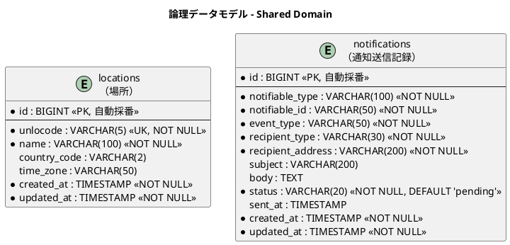
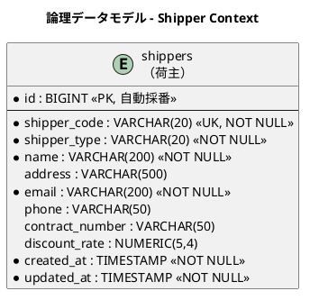
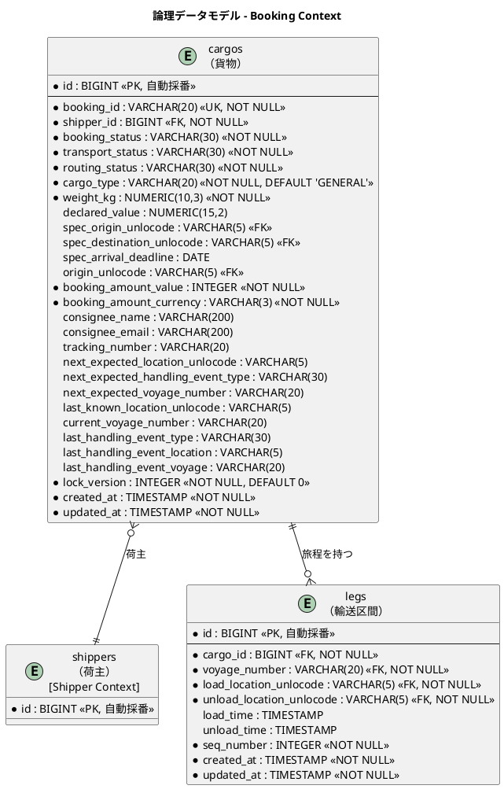
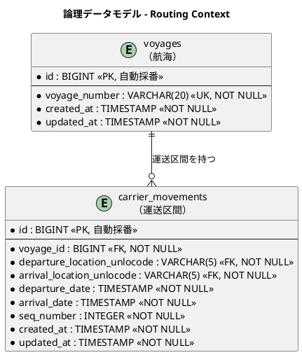
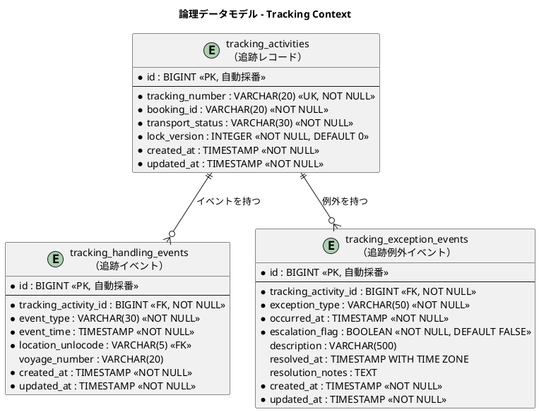
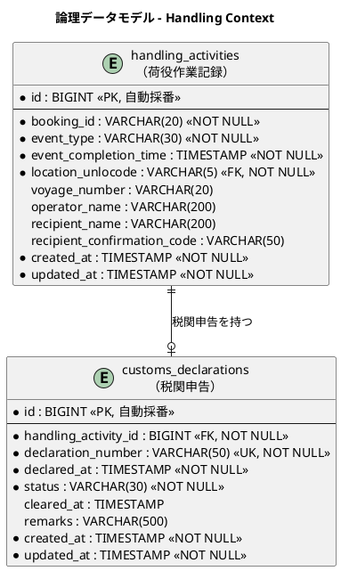
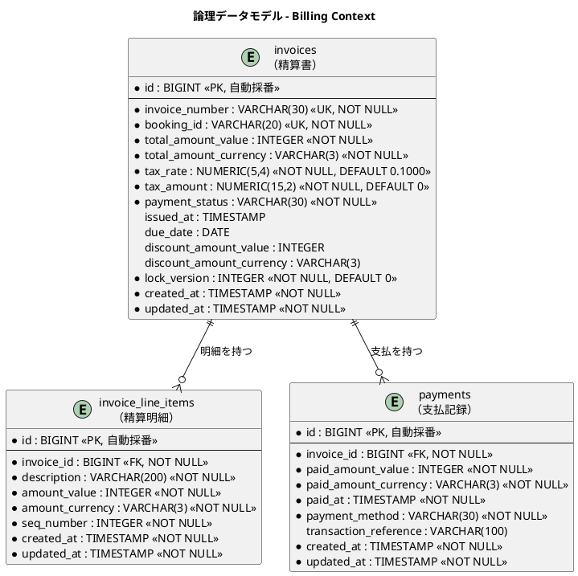
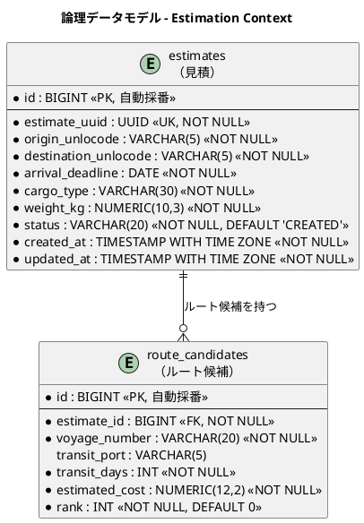
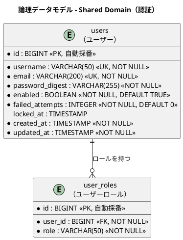

# データモデル設計 - 国際貨物輸送管理システム

## 概要

本ドキュメントは、国際貨物輸送管理システムの永続化層データモデルを定義します。
ドメインモデル分析で識別した 8 つの境界付けられたコンテキスト（Booking / Shipper / Routing / Tracking / Handling / Billing / Estimation / Shared Domain）に対応する 19 テーブルを設計します。
Shipper Context の `shippers`（荷主）テーブルと、Rails 8 標準認証（`has_secure_password` + Session）用の `users` / `user_roles` テーブルを含みます。

### 設計方針

- **DB**: PostgreSQL 16.x（開発・テスト・本番の全環境で統一）
- **ORM**: Active Record（Rails 標準）
- **マイグレーション**: Active Record マイグレーション（`db/migrate/YYYYMMDDHHMMSS_*.rb` 形式）
- **ID 戦略**: サロゲートキー（`id: bigint`、Rails 標準の自動採番）+ 業務キー（`string`）の併用
- **命名規則**: Rails 規約に準拠。テーブル名は**複数形 snake_case**（`cargos`、`voyages` 等）、主キーは `id: bigint`、外部キーは `xxx_id`、タイムスタンプは `created_at` / `updated_at`（`t.timestamps`）
- **監査カラム**: 全テーブルに `created_at` / `updated_at` を付与（`t.timestamps` で自動生成）
- **楽観ロック**: 集約ルートのテーブルに `lock_version`（Active Record 標準の楽観ロック）を付与
- **enum カラム**: Rails の `enum` マクロを使用し、DB カラムは **string 型**で保持する（値の可読性と将来のサービス分割を優先。詳細は「設計上の判断」を参照）

> **Java 版からの命名調整**: 参考実装（Java / MyBatis）ではテーブル名が単数形（`cargo`、`shipper` 等）でしたが、本設計では Rails 規約に合わせて複数形に統一しました（`cargo` → `cargos`、`shipper` → `shippers`、`leg` → `legs` 等）。カラム構成・制約はデータモデルとして言語非依存のため維持しています。

---

## 概念データモデル

全コンテキストのエンティティとその主要リレーションシップを俯瞰します。

```plantuml
@startuml
title 概念データモデル - 国際貨物輸送管理システム

skinparam entity {
  BackgroundColor White
  BorderColor Black
}

package "Shared Domain" #lightgray {
  entity "locations\n（場所）" as locations {
    * id : BIGINT <<PK>>
    --
    * unlocode : VARCHAR(5) <<UK>>
    * name : VARCHAR(100)
  }

  entity "users\n（ユーザー）" as users {
    * id : BIGINT <<PK>>
    --
    * username : VARCHAR(50) <<UK>>
    * email : VARCHAR(200) <<UK>>
    * password_digest : VARCHAR(255)
    * enabled : BOOLEAN
    * failed_attempts : INTEGER
    locked_at : TIMESTAMP
  }

  entity "user_roles\n（ユーザーロール）" as user_roles {
    * id : BIGINT <<PK>>
    --
    * user_id : BIGINT <<FK>>
    * role : VARCHAR(50)
  }

  entity "notifications\n（通知送信記録）" as notifications {
    * id : BIGINT <<PK>>
    --
    * notifiable_type : VARCHAR(100)
    * notifiable_id : VARCHAR(50)
    * event_type : VARCHAR(50)
    * recipient_type : VARCHAR(30)
    * recipient_address : VARCHAR(200)
    * status : VARCHAR(20)
    sent_at : TIMESTAMP
  }
}

package "Shipper Context" #lightcyan {
  entity "shippers\n（荷主）" as shippers {
    * id : BIGINT <<PK>>
    --
    * shipper_code : VARCHAR(20) <<UK>>
    * shipper_type : VARCHAR(20)
    * name : VARCHAR(200)
    * email : VARCHAR(200)
  }
}

package "Booking Context" #lightblue {
  entity "cargos\n（貨物）" as cargos {
    * id : BIGINT <<PK>>
    --
    * booking_id : VARCHAR(20) <<UK>>
    * shipper_id : BIGINT <<FK>>
    * booking_status : VARCHAR(30)
    * transport_status : VARCHAR(30)
    * routing_status : VARCHAR(30)
    * cargo_type : VARCHAR(20)
    * weight_kg : NUMERIC(10,3)
    declared_value : NUMERIC(15,2)
    * booking_amount_value : INTEGER
    * booking_amount_currency : VARCHAR(3)
  }

  entity "legs\n（輸送区間）" as legs {
    * id : BIGINT <<PK>>
    --
    * cargo_id : BIGINT <<FK>>
    * voyage_number : VARCHAR(20) <<FK>>
    * load_location_unlocode : VARCHAR(5) <<FK>>
    * unload_location_unlocode : VARCHAR(5) <<FK>>
    * load_time : TIMESTAMP
    * unload_time : TIMESTAMP
  }
}

package "Routing Context" #lightgreen {
  entity "voyages\n（航海）" as voyages {
    * id : BIGINT <<PK>>
    --
    * voyage_number : VARCHAR(20) <<UK>>
  }

  entity "carrier_movements\n（運送区間）" as carrier_movements {
    * id : BIGINT <<PK>>
    --
    * voyage_id : BIGINT <<FK>>
    * departure_location_unlocode : VARCHAR(5) <<FK>>
    * arrival_location_unlocode : VARCHAR(5) <<FK>>
    * departure_date : TIMESTAMP
    * arrival_date : TIMESTAMP
  }
}

package "Tracking Context" #lightyellow {
  entity "tracking_activities\n（追跡レコード）" as tracking_activities {
    * id : BIGINT <<PK>>
    --
    * tracking_number : VARCHAR(20) <<UK>>
    * booking_id : VARCHAR(20)
    * transport_status : VARCHAR(30)
  }

  entity "tracking_handling_events\n（追跡イベント）" as tracking_handling_events {
    * id : BIGINT <<PK>>
    --
    * tracking_activity_id : BIGINT <<FK>>
    * event_type : VARCHAR(30)
    * event_time : TIMESTAMP
    * location_unlocode : VARCHAR(5) <<FK>>
    * voyage_number : VARCHAR(20)
  }

  entity "tracking_exception_events\n（追跡例外イベント）" as tracking_exception_events {
    * id : BIGINT <<PK>>
    --
    * tracking_activity_id : BIGINT <<FK>>
    * exception_type : VARCHAR(50)
    * occurred_at : TIMESTAMP
    * escalation_flag : BOOLEAN
    description : VARCHAR(500)
    resolved_at : TIMESTAMP
    resolution_notes : TEXT
  }
}

package "Handling Context" #lightcoral {
  entity "handling_activities\n（荷役作業記録）" as handling_activities {
    * id : BIGINT <<PK>>
    --
    * booking_id : VARCHAR(20)
    * event_type : VARCHAR(30)
    * event_completion_time : TIMESTAMP
    * location_unlocode : VARCHAR(5) <<FK>>
    * voyage_number : VARCHAR(20)
  }

  entity "customs_declarations\n（税関申告）" as customs_declarations {
    * id : BIGINT <<PK>>
    --
    * handling_activity_id : BIGINT <<FK>>
    * declaration_number : VARCHAR(50) <<UK>>
    * declared_at : TIMESTAMP
    * status : VARCHAR(30)
  }
}

package "Estimation Context" #wheat {
  entity "estimates\n（見積）" as estimates {
    * id : BIGINT <<PK>>
    --
    * estimate_uuid : UUID <<UK>>
    * origin_unlocode : VARCHAR(5)
    * destination_unlocode : VARCHAR(5)
    * arrival_deadline : DATE
    * cargo_type : VARCHAR(30)
    * weight_kg : NUMERIC(10,3)
    * status : VARCHAR(20)
  }

  entity "route_candidates\n（ルート候補）" as route_candidates {
    * id : BIGINT <<PK>>
    --
    * estimate_id : BIGINT <<FK>>
    * voyage_number : VARCHAR(20)
    transit_port : VARCHAR(5)
    * transit_days : INT
    * estimated_cost : NUMERIC(12,2)
    * rank : INT
  }
}

package "Billing Context" #lightpink {
  entity "invoices\n（精算書）" as invoices {
    * id : BIGINT <<PK>>
    --
    * invoice_number : VARCHAR(30) <<UK>>
    * booking_id : VARCHAR(20) <<UK>>
    * total_amount_value : INTEGER
    * total_amount_currency : VARCHAR(3)
    * tax_rate : NUMERIC(5,4)
    * tax_amount : NUMERIC(15,2)
    * payment_status : VARCHAR(30)
  }

  entity "invoice_line_items\n（精算明細）" as invoice_line_items {
    * id : BIGINT <<PK>>
    --
    * invoice_id : BIGINT <<FK>>
    * description : VARCHAR(200)
    * amount_value : INTEGER
    * amount_currency : VARCHAR(3)
  }

  entity "payments\n（支払記録）" as payments {
    * id : BIGINT <<PK>>
    --
    * invoice_id : BIGINT <<FK>>
    * paid_amount_value : INTEGER
    * paid_amount_currency : VARCHAR(3)
    * paid_at : TIMESTAMP
    * payment_method : VARCHAR(30)
  }
}

' Booking Context relations
cargos }o--|| shippers : "荷主"
cargos ||--o{ legs : "旅程を持つ"
legs }o--|| voyages : "航海を参照"
legs }o--|| locations : "積込場所"
legs }o--|| locations : "荷降場所"
cargos }o--o| locations : "出発地"
cargos }o--o| locations : "仕向地"

' Routing Context relations
voyages ||--o{ carrier_movements : "運送区間を持つ"
carrier_movements }o--|| locations : "出発地"
carrier_movements }o--|| locations : "到着地"

' Tracking Context relations
tracking_activities ||--o{ tracking_handling_events : "イベントを持つ"
tracking_activities ||--o{ tracking_exception_events : "例外を持つ"
tracking_handling_events }o--o| locations : "発生場所"

' Handling Context relations
handling_activities ||--o| customs_declarations : "税関申告を持つ"
handling_activities }o--|| locations : "作業場所"

' Estimation Context relations
estimates ||--o{ route_candidates : "ルート候補を持つ"

' Billing Context relations
invoices ||--o{ invoice_line_items : "明細を持つ"
invoices ||--o{ payments : "支払を持つ"

' Security relations
users ||--o{ user_roles : "ロールを持つ"

' Notification relations（ポリモーフィック参照）
notifications }o..o| cargos : "対象集約（例）"
notifications }o..o| invoices : "対象集約（例）"

@enduml
```



---

## 論理データモデル

### Shared Domain

共有ドメインとして全コンテキストが参照する場所マスタと、各集約をポリモーフィック参照する通知送信記録を管理します。`locations` は UN/LOCODE（国連貿易港コード）を業務キーとします。



---

### Shipper Context

荷主情報を管理します。`shippers` が集約ルートで、Booking Context の `cargos` から FK 参照されます。



---

### Booking Context

貨物の予約・旅程情報を管理します。`cargos` が集約ルートで、`legs` が旅程の各区間を表します。荷主情報は Shipper Context の `shippers` テーブルに正規化し、FK 参照とします。



---

### Routing Context

航海スケジュールと運送区間を管理します。`voyages` が集約ルートで、`carrier_movements` が個々の移動区間を表します。



---

### Tracking Context

貨物追跡の状態・イベント・例外を管理します。`tracking_activities` が集約ルートです。



---

### Handling Context

荷役作業の実績と税関申告を管理します。`handling_activities` が集約ルートです。



---

### Billing Context

精算書・明細・支払記録を管理します。参考実装には存在しない新規コンテキストです。



---

### Estimation Context

輸送見積とルート候補を管理します。`estimates` が集約ルートで、`route_candidates` が各ルート候補を表します。



---

### Shared Domain（認証）

Rails 8 標準認証（`has_secure_password` + Session）が利用するユーザー認証・認可テーブルです。パスワードは Rails 規約に従い `password_digest` カラム（BCrypt ハッシュ）で保持します。



> **Rails 規約への調整**: Java 版では `user_roles` は `(user_id, role)` の複合主キーでしたが、Active Record は複合主キーとの相性がよくないため、Rails 標準のサロゲートキー `id` を付与し、`(user_id, role)` には複合 UNIQUE インデックスを設定します。

---

## テーブル定義

### `locations`（場所マスタ）

| カラム名 | データ型 | 制約 | 説明 |
| :--- | :--- | :--- | :--- |
| `id` | `bigint` | `PK, NOT NULL` | サロゲートキー（自動採番） |
| `unlocode` | `string(5)` | `UK, NOT NULL` | UN/LOCODE（業務キー。例: `JPTYO`） |
| `name` | `string(100)` | `NOT NULL` | 場所名称（例: `Tokyo`） |
| `country_code` | `string(2)` | | ISO 3166-1 alpha-2 国コード |
| `time_zone` | `string(50)` | | タイムゾーン（例: `Asia/Tokyo`） |
| `created_at` | `datetime` | `NOT NULL` | レコード作成日時 |
| `updated_at` | `datetime` | `NOT NULL` | レコード更新日時 |

---

### `shippers`（荷主）

> **注記**: 旧設計で `cargos` テーブルに存在した `shipper_name`・`shipper_email` カラムは本テーブルへの正規化に伴い削除しました。

| カラム名 | データ型 | 制約 | 説明 |
| :--- | :--- | :--- | :--- |
| `id` | `bigint` | `PK, NOT NULL` | サロゲートキー（自動採番） |
| `shipper_code` | `string(20)` | `UK, NOT NULL` | 荷主コード（業務キー。SHP-XXXXXX 形式） |
| `shipper_type` | `string(20)` | `NOT NULL` | 荷主種別（`INDIVIDUAL` / `CORPORATE`、Rails enum） |
| `name` | `string(200)` | `NOT NULL` | 荷主名称 |
| `address` | `string(500)` | | 住所（`Address` 値オブジェクト。最大 500 文字） |
| `email` | `string(200)` | `NOT NULL` | メールアドレス |
| `phone` | `string(50)` | | 電話番号 |
| `contract_number` | `string(50)` | | 契約番号（法人のみ。NULLable） |
| `discount_rate` | `decimal(5,4)` | `DEFAULT 0.0` | 割引率（0.0000〜0.3000、最大 30%） |
| `created_at` | `datetime` | `NOT NULL` | レコード作成日時 |
| `updated_at` | `datetime` | `NOT NULL` | レコード更新日時 |

#### マイグレーション

```ruby
class CreateShippers < ActiveRecord::Migration[8.0]
  def change
    create_table :shippers do |t|
      t.string  :shipper_code, limit: 20, null: false  # SHP-XXXXXX 形式
      t.string  :shipper_type, limit: 20, null: false  # INDIVIDUAL / CORPORATE
      t.string  :name, limit: 200, null: false
      t.string  :address, limit: 500                   # Address 値オブジェクト（最大 500 文字）
      t.string  :email, limit: 200, null: false
      t.string  :phone, limit: 50
      t.string  :contract_number, limit: 50            # 法人のみ（NULLable）
      t.decimal :discount_rate, precision: 5, scale: 4, default: 0.0  # 0.0000〜0.3000（最大 30%）
      t.timestamps
    end
    add_index :shippers, :shipper_code, unique: true
  end
end
```

---

### `cargos`（貨物）

> **注記**: `shipper_name`・`shipper_email` カラムは削除し、`shipper_id`（FK → `shippers.id`）による参照に変更しました。
>
> **実装状況**: 初期イテレーションでは基本カラムのみを作成し、機能追加ごとにカラムを追加します。IT4（経路確定・荷主通知）で `consignee_name`・`consignee_email`・`routing_status` を追加済みです。未実装のカラム（`transport_status`・`booking_amount_*`・`tracking_number` 等）は下表の「将来追加予定」節に記載します。

| カラム名 | データ型 | 制約 | 説明 |
| :--- | :--- | :--- | :--- |
| `id` | `bigint` | `PK, NOT NULL` | サロゲートキー（自動採番） |
| `booking_id` | `string(20)` | `UK, NOT NULL` | 予約 ID（業務キー） |
| `shipper_id` | `bigint` | `FK → shippers.id, NOT NULL` | 荷主 ID |
| `cargo_type` | `string(30)` | `NOT NULL` | 貨物種別（`GENERAL` / `HAZARDOUS` / `REFRIGERATED`、Rails enum） |
| `weight_kg` | `decimal(10,3)` | `NOT NULL, > 0` | 重量（kg） |
| `origin_unlocode` | `string(5)` | `NOT NULL` | 出発地（RouteSpecification） |
| `destination_unlocode` | `string(5)` | `NOT NULL` | 仕向地（RouteSpecification） |
| `arrival_deadline` | `date` | `NOT NULL` | 到着期限（RouteSpecification） |
| `booking_status` | `string(30)` | `NOT NULL, DEFAULT 'preliminary'` | 予約状態（BookingStatus 9 値: `PRELIMINARY` / `ROUTE_REQUESTED` / `ROUTE_PROPOSED` / `CONFIRMED` / `TRACKING_ISSUED` / `IN_TRANSIT` / `DELIVERED` / `SETTLED` / `CANCELLED`。文字列カラム。ドメインは大文字、DB には小文字で格納しリポジトリで相互変換） |
| `dimension_length` | `decimal(10,3)` | | 貨物の長さ（cm、オプション） |
| `dimension_width` | `decimal(10,3)` | | 貨物の幅（cm、オプション） |
| `dimension_height` | `decimal(10,3)` | | 貨物の高さ（cm、オプション） |
| `quantity` | `integer` | | 貨物個数（オプション、1 以上） |
| `description` | `string(500)` | | 品名（オプション） |
| `hazardous_class` | `string(10)` | | 危険物クラス（HAZARDOUS 時のみ） |
| `un_number` | `string(10)` | | UN 番号（HAZARDOUS 時のみ） |
| `proper_shipping_name` | `string(200)` | | 正式輸送品名（HAZARDOUS 時のみ） |
| `min_temperature` | `decimal(10,3)` | | 最低温度（REFRIGERATED 時のみ） |
| `max_temperature` | `decimal(10,3)` | | 最高温度（REFRIGERATED 時のみ） |
| `temperature_unit` | `string(20)` | | 温度単位（`CELSIUS` / `FAHRENHEIT`、REFRIGERATED 時のみ） |
| `consignee_name` | `string(200)` | | 荷受人名（US12 荷主通知の宛先。IT4 追加） |
| `consignee_email` | `string(200)` | | 荷受人メールアドレス（US12 荷主通知の宛先。IT4 追加） |
| `routing_status` | `string(30)` | `NOT NULL, DEFAULT 'NOT_ROUTED'` | 経路決定状態（`NOT_ROUTED` / `ROUTED` / `MISROUTED`。旅程有無から導出。IT4 追加） |
| `lock_version` | `integer` | `NOT NULL, DEFAULT 0` | 楽観ロック用バージョン（Active Record 標準） |
| `created_at` | `datetime` | `NOT NULL` | レコード作成日時 |
| `updated_at` | `datetime` | `NOT NULL` | レコード更新日時 |

#### 将来追加予定カラム（IT4+）

| カラム名 | データ型 | 説明 | 追加フェーズ |
| :--- | :--- | :--- | :--- |
| `transport_status` | `string(30)` | 輸送状態（TransportStatus 列挙値） | Tracking Context 実装時 |
| `booking_amount_value` | `integer` | 予約金額（最小通貨単位） | Billing Context 実装時 |
| `booking_amount_currency` | `string(3)` | 通貨コード（ISO 4217） | Billing Context 実装時 |
| `tracking_number` | `string(20)` | 追跡番号（発行後に設定） | Tracking Context 実装時 |
| `next_expected_*` | 各種 | 次の予定荷役情報 | Tracking Context 実装時 |
| `last_handling_event_*` | 各種 | 最後の荷役イベント情報 | Handling Context 実装時 |

---

### `legs`（輸送区間）

> **用途**: Booking Context の `CargoItinerary`（旅程）値オブジェクトの永続化に用います。IT4 で `Cargo#assign_itinerary` により、経路候補から生成した `Leg` 一覧を `cargo_id` 単位で全置換保存します（`seq_number` は 1 始まりの区間順序）。

| カラム名 | データ型 | 制約 | 説明 |
| :--- | :--- | :--- | :--- |
| `id` | `bigint` | `PK, NOT NULL` | サロゲートキー（自動採番） |
| `cargo_id` | `bigint` | `FK → cargos.id, NOT NULL` | 親貨物 ID |
| `voyage_number` | `string(30)` | `FK → voyages.voyage_number, NOT NULL` | 航海番号 |
| `load_location_unlocode` | `string(5)` | `FK → locations.unlocode, NOT NULL` | 積込場所（UN/LOCODE） |
| `unload_location_unlocode` | `string(5)` | `FK → locations.unlocode, NOT NULL` | 荷降場所（UN/LOCODE） |
| `load_time` | `datetime` | | 積込予定日時 |
| `unload_time` | `datetime` | | 荷降予定日時 |
| `seq_number` | `integer` | `NOT NULL` | 区間順序（1 始まり） |
| `created_at` | `datetime` | `NOT NULL` | レコード作成日時 |
| `updated_at` | `datetime` | `NOT NULL` | レコード更新日時 |

---

### `voyages`（航海）

| カラム名 | データ型 | 制約 | 説明 |
| :--- | :--- | :--- | :--- |
| `id` | `bigint` | `PK, NOT NULL` | サロゲートキー（自動採番） |
| `voyage_number` | `string(20)` | `UK, NOT NULL` | 航海番号（業務キー） |
| `carrier_name` | `string(100)` | `NOT NULL` | 運送会社（US24） |
| `ship_name` | `string(100)` | | 船名（US24） |
| `supported_cargo_types` | `string(100)` | `NOT NULL, DEFAULT 'GENERAL'` | 対応貨物種別（カンマ区切り: `GENERAL,HAZARDOUS,REFRIGERATED`）。US07 の危険物/冷凍絞り込みに使用 |
| `created_at` | `datetime` | `NOT NULL` | レコード作成日時 |
| `updated_at` | `datetime` | `NOT NULL` | レコード更新日時 |

---

### `carrier_movements`（運送区間）

| カラム名 | データ型 | 制約 | 説明 |
| :--- | :--- | :--- | :--- |
| `id` | `bigint` | `PK, NOT NULL` | サロゲートキー（自動採番） |
| `voyage_id` | `bigint` | `FK → voyages.id, NOT NULL` | 親航海 ID |
| `departure_location_unlocode` | `string(5)` | `FK → locations.unlocode, NOT NULL` | 出発地（UN/LOCODE） |
| `arrival_location_unlocode` | `string(5)` | `FK → locations.unlocode, NOT NULL` | 到着地（UN/LOCODE） |
| `departure_date` | `datetime` | `NOT NULL` | 出発日時 |
| `arrival_date` | `datetime` | `NOT NULL` | 到着日時 |
| `seq_number` | `integer` | `NOT NULL` | 区間順序（1 始まり） |
| `created_at` | `datetime` | `NOT NULL` | レコード作成日時 |
| `updated_at` | `datetime` | `NOT NULL` | レコード更新日時 |

---

### `tracking_activities`（追跡レコード）

| カラム名 | データ型 | 制約 | 説明 |
| :--- | :--- | :--- | :--- |
| `id` | `bigint` | `PK, NOT NULL` | サロゲートキー（自動採番） |
| `tracking_number` | `string(20)` | `UK, NOT NULL` | 追跡番号（業務キー） |
| `booking_id` | `string(20)` | `NOT NULL` | 予約 ID（参照整合性は書き込み側で保証） |
| `transport_status` | `string(30)` | `NOT NULL` | 輸送状態（TransportStatus 列挙値、Rails enum） |
| `lock_version` | `integer` | `NOT NULL, DEFAULT 0` | 楽観ロック用バージョン |
| `created_at` | `datetime` | `NOT NULL` | レコード作成日時 |
| `updated_at` | `datetime` | `NOT NULL` | レコード更新日時 |

---

### `tracking_handling_events`（追跡イベント）

| カラム名 | データ型 | 制約 | 説明 |
| :--- | :--- | :--- | :--- |
| `id` | `bigint` | `PK, NOT NULL` | サロゲートキー（自動採番） |
| `tracking_activity_id` | `bigint` | `FK → tracking_activities.id, NOT NULL` | 親追跡レコード ID |
| `event_type` | `string(30)` | `NOT NULL` | 荷役タイプ（HandlingType 列挙値、Rails enum） |
| `event_time` | `datetime` | `NOT NULL` | イベント発生日時 |
| `location_unlocode` | `string(5)` | `FK → locations.unlocode` | イベント発生場所（UN/LOCODE） |
| `voyage_number` | `string(20)` | | 関連する航海番号 |
| `created_at` | `datetime` | `NOT NULL` | レコード作成日時 |
| `updated_at` | `datetime` | `NOT NULL` | レコード更新日時 |

---

### `tracking_exception_events`（追跡例外イベント）

| カラム名 | データ型 | 制約 | 説明 |
| :--- | :--- | :--- | :--- |
| `id` | `bigint` | `PK, NOT NULL` | サロゲートキー（自動採番） |
| `tracking_activity_id` | `bigint` | `FK → tracking_activities.id, NOT NULL` | 親追跡レコード ID |
| `exception_type` | `string(50)` | `NOT NULL` | 例外種別（例: `CUSTOMS_HOLD`, `DAMAGE`, `DELAY`） |
| `occurred_at` | `datetime` | `NOT NULL` | 例外発生日時 |
| `escalation_flag` | `boolean` | `NOT NULL, DEFAULT FALSE` | エスカレーション判定フラグ（US15 紛失時） |
| `description` | `string(500)` | | 例外内容の詳細 |
| `resolved_at` | `datetime` | | 解決日時（NULL = 未解決） |
| `resolution_notes` | `text` | | 対応内容メモ |
| `created_at` | `datetime` | `NOT NULL` | レコード作成日時 |
| `updated_at` | `datetime` | `NOT NULL` | レコード更新日時 |

---

### `handling_activities`（荷役作業記録）

| カラム名 | データ型 | 制約 | 説明 |
| :--- | :--- | :--- | :--- |
| `id` | `bigint` | `PK, NOT NULL` | サロゲートキー（自動採番） |
| `booking_id` | `string(20)` | `NOT NULL` | 予約 ID（参照整合性は書き込み側で保証） |
| `event_type` | `string(30)` | `NOT NULL` | 荷役タイプ（RECEIVE / LOAD / UNLOAD / CUSTOMS / CLAIM、Rails enum） |
| `event_completion_time` | `datetime` | `NOT NULL` | 荷役完了日時 |
| `location_unlocode` | `string(5)` | `FK → locations.unlocode, NOT NULL` | 作業場所（UN/LOCODE） |
| `voyage_number` | `string(20)` | | 関連する航海番号（LOAD / UNLOAD 時に設定） |
| `operator_name` | `string(200)` | | 作業員名 |
| `recipient_name` | `string(200)` | | 荷受人名（NULL 可） |
| `recipient_confirmation_code` | `string(50)` | | 荷受人確認コード（NULL 可） |
| `created_at` | `datetime` | `NOT NULL` | レコード作成日時 |
| `updated_at` | `datetime` | `NOT NULL` | レコード更新日時 |

> **アプリ層制約**: `recipient_name`・`recipient_confirmation_code` は `event_type = CLAIM`（引き渡し）時に必須です。DB では NULL 可とし、モデルのバリデーションで CLAIM 時の必須制約を保証します。

---

### `customs_declarations`（税関申告）

| カラム名 | データ型 | 制約 | 説明 |
| :--- | :--- | :--- | :--- |
| `id` | `bigint` | `PK, NOT NULL` | サロゲートキー（自動採番） |
| `handling_activity_id` | `bigint` | `FK → handling_activities.id, NOT NULL` | 関連荷役作業 ID |
| `declaration_number` | `string(50)` | `UK, NOT NULL` | 申告番号（業務キー） |
| `declared_at` | `datetime` | `NOT NULL` | 申告日時 |
| `status` | `string(30)` | `NOT NULL` | 申告状態（例: `PENDING`, `CLEARED`, `HELD`、Rails enum） |
| `cleared_at` | `datetime` | | 通関完了日時（NULL = 未完了） |
| `remarks` | `string(500)` | | 備考・メモ |
| `created_at` | `datetime` | `NOT NULL` | レコード作成日時 |
| `updated_at` | `datetime` | `NOT NULL` | レコード更新日時 |

---

### `invoices`（精算書）

| カラム名 | データ型 | 制約 | 説明 |
| :--- | :--- | :--- | :--- |
| `id` | `bigint` | `PK, NOT NULL` | サロゲートキー（自動採番） |
| `invoice_number` | `string(30)` | `UK, NOT NULL` | 精算書番号（業務キー） |
| `booking_id` | `string(20)` | `UK, NOT NULL` | 予約 ID（UNIQUE 制約で二重請求を防止） |
| `total_amount_value` | `integer` | `NOT NULL` | 合計金額（最小通貨単位） |
| `total_amount_currency` | `string(3)` | `NOT NULL` | 通貨コード（ISO 4217） |
| `tax_rate` | `decimal(5,4)` | `NOT NULL, DEFAULT 0.1` | 消費税率（デフォルト 10%） |
| `tax_amount` | `decimal(15,2)` | `NOT NULL, DEFAULT 0` | 消費税額 |
| `payment_status` | `string(30)` | `NOT NULL` | 支払状態（`PENDING` / `CONFIRMED` / `OVERDUE` / `REFUNDED`、Rails enum） |
| `issued_at` | `datetime` | | 発行日時 |
| `due_date` | `date` | | 支払期日 |
| `discount_amount_value` | `integer` | | 割引金額（最小通貨単位） |
| `discount_amount_currency` | `string(3)` | | 割引通貨コード |
| `lock_version` | `integer` | `NOT NULL, DEFAULT 0` | 楽観ロック用バージョン |
| `created_at` | `datetime` | `NOT NULL` | レコード作成日時 |
| `updated_at` | `datetime` | `NOT NULL` | レコード更新日時 |

---

### `invoice_line_items`（精算明細）

| カラム名 | データ型 | 制約 | 説明 |
| :--- | :--- | :--- | :--- |
| `id` | `bigint` | `PK, NOT NULL` | サロゲートキー（自動採番） |
| `invoice_id` | `bigint` | `FK → invoices.id, NOT NULL` | 親精算書 ID |
| `description` | `string(200)` | `NOT NULL` | 明細項目説明 |
| `amount_value` | `integer` | `NOT NULL` | 明細金額（最小通貨単位） |
| `amount_currency` | `string(3)` | `NOT NULL` | 通貨コード（ISO 4217） |
| `seq_number` | `integer` | `NOT NULL` | 明細順序（1 始まり） |
| `created_at` | `datetime` | `NOT NULL` | レコード作成日時 |
| `updated_at` | `datetime` | `NOT NULL` | レコード更新日時 |

---

### `payments`（支払記録）

| カラム名 | データ型 | 制約 | 説明 |
| :--- | :--- | :--- | :--- |
| `id` | `bigint` | `PK, NOT NULL` | サロゲートキー（自動採番） |
| `invoice_id` | `bigint` | `FK → invoices.id, NOT NULL` | 親精算書 ID |
| `paid_amount_value` | `integer` | `NOT NULL` | 支払金額（最小通貨単位） |
| `paid_amount_currency` | `string(3)` | `NOT NULL` | 通貨コード（ISO 4217） |
| `paid_at` | `datetime` | `NOT NULL` | 支払日時 |
| `payment_method` | `string(30)` | `NOT NULL` | 支払方法（例: `BANK_TRANSFER`, `CREDIT_CARD`、Rails enum） |
| `transaction_reference` | `string(100)` | | 取引参照番号（外部決済システムの ID） |
| `created_at` | `datetime` | `NOT NULL` | レコード作成日時 |
| `updated_at` | `datetime` | `NOT NULL` | レコード更新日時 |

---

### `users`（ユーザー）

Rails 8 標準認証（`has_secure_password` + Session）が参照するユーザー認証テーブルです。

| カラム名 | データ型 | 制約 | 説明 |
| :--- | :--- | :--- | :--- |
| `id` | `bigint` | `PK, NOT NULL` | サロゲートキー（自動採番） |
| `username` | `string(50)` | `UK, NOT NULL` | ログイン名 |
| `email` | `string(200)` | `UK, NOT NULL` | メールアドレス |
| `password_digest` | `string(255)` | `NOT NULL` | パスワード（BCrypt ハッシュ、`has_secure_password` 規約） |
| `enabled` | `boolean` | `NOT NULL, DEFAULT TRUE` | アカウント有効フラグ |
| `failed_attempts` | `integer` | `NOT NULL, DEFAULT 0` | 連続認証失敗回数（US26 アカウントロック。5 回でロック） |
| `locked_at` | `datetime` | | ロック日時（NULL=未ロック） |
| `created_at` | `datetime` | `NOT NULL` | レコード作成日時 |
| `updated_at` | `datetime` | `NOT NULL` | レコード更新日時 |

#### マイグレーション

```ruby
class CreateUsers < ActiveRecord::Migration[8.0]
  def change
    create_table :users do |t|
      t.string  :username, limit: 50, null: false
      t.string  :email, limit: 200, null: false
      t.string  :password_digest, limit: 255, null: false  # BCrypt ハッシュ
      t.boolean :enabled, null: false, default: true
      t.integer :failed_attempts, null: false, default: 0   # US26 アカウントロック（5 回でロック）
      t.datetime :locked_at                                 # ロック日時（NULL=未ロック）
      t.timestamps
    end
    add_index :users, :username, unique: true
    add_index :users, :email, unique: true
  end
end
```

---

### `user_roles`（ユーザーロール）

| カラム名 | データ型 | 制約 | 説明 |
| :--- | :--- | :--- | :--- |
| `id` | `bigint` | `PK, NOT NULL` | サロゲートキー（自動採番、Rails 規約） |
| `user_id` | `bigint` | `FK → users.id, NOT NULL` | 親ユーザー ID |
| `role` | `string(50)` | `NOT NULL` | ロール名（`sales` / `handler` / `tracker` / `billing` / `admin` の 5 ロール RBAC） |

#### マイグレーション

```ruby
class CreateUserRoles < ActiveRecord::Migration[8.0]
  def change
    create_table :user_roles do |t|
      t.references :user, null: false, foreign_key: true
      t.string :role, limit: 50, null: false  # sales / handler / tracker / billing / admin（5 ロール RBAC）
    end
    add_index :user_roles, [:user_id, :role], unique: true
  end
end
```

---

### `estimates`（見積）

| カラム名 | データ型 | 制約 | 説明 |
| :--- | :--- | :--- | :--- |
| `id` | `bigint` | `PK, NOT NULL` | サロゲートキー（自動採番） |
| `estimate_uuid` | `uuid` | `UK, NOT NULL` | 見積 ID（業務キー。カラム名は FK 規約 `xxx_id` との混同を避けるため `estimate_uuid` とする） |
| `origin_unlocode` | `string(5)` | `NOT NULL` | 出発地（UN/LOCODE） |
| `destination_unlocode` | `string(5)` | `NOT NULL` | 仕向地（UN/LOCODE） |
| `arrival_deadline` | `date` | `NOT NULL` | 到着期限 |
| `cargo_type` | `string(30)` | `NOT NULL` | 貨物種別（`GENERAL` / `HAZARDOUS` / `REFRIGERATED`。文字列カラム。ドメイン VO と同じ大文字で格納） |
| `weight_kg` | `decimal(10,3)` | `NOT NULL` | 重量（kg） |
| `status` | `string(20)` | `NOT NULL, DEFAULT 'CREATED'` | 見積状態（`CREATED` / `EXPIRED`、Rails enum） |
| `created_at` | `datetime` | `NOT NULL` | レコード作成日時 |
| `updated_at` | `datetime` | `NOT NULL` | レコード更新日時 |

#### マイグレーション

```ruby
class CreateEstimates < ActiveRecord::Migration[8.0]
  def change
    create_table :estimates do |t|
      t.uuid    :estimate_uuid, null: false
      t.string  :origin_unlocode, limit: 5, null: false
      t.string  :destination_unlocode, limit: 5, null: false
      t.date    :arrival_deadline, null: false
      t.string  :cargo_type, limit: 30, null: false
      t.decimal :weight_kg, precision: 10, scale: 3, null: false
      t.string  :status, limit: 20, null: false, default: "CREATED"
      t.timestamps
    end
    add_index :estimates, :estimate_uuid, unique: true
  end
end
```

---

### `route_candidates`（ルート候補）

| カラム名 | データ型 | 制約 | 説明 |
| :--- | :--- | :--- | :--- |
| `id` | `bigint` | `PK, NOT NULL` | サロゲートキー（自動採番） |
| `estimate_id` | `bigint` | `FK → estimates.id, NOT NULL` | 親見積 ID（CASCADE 削除） |
| `voyage_number` | `string(20)` | `NOT NULL` | 航海番号 |
| `transit_port` | `string(5)` | | 経由港（UN/LOCODE、オプション） |
| `transit_days` | `integer` | `NOT NULL` | 輸送日数 |
| `estimated_cost` | `decimal(12,2)` | `NOT NULL` | 見積コスト |
| `rank` | `integer` | `NOT NULL, DEFAULT 0` | ルート候補の優先順位 |

#### マイグレーション

```ruby
class CreateRouteCandidates < ActiveRecord::Migration[8.0]
  def change
    create_table :route_candidates do |t|
      t.references :estimate, null: false,
                   foreign_key: { on_delete: :cascade }
      t.string  :voyage_number, limit: 20, null: false
      t.string  :transit_port, limit: 5
      t.integer :transit_days, null: false
      t.decimal :estimated_cost, precision: 12, scale: 2, null: false
      t.integer :rank, null: false, default: 0
    end
  end
end
```

---

### `notifications`（通知送信記録）

貨物予約確定・追跡番号発行・引き渡し完了などのイベントに伴う通知の送信記録を管理します。対象集約（`cargos`・`invoices` 等）はポリモーフィック関連（`notifiable_type` / `notifiable_id`）で参照します。

| カラム名 | データ型 | 制約 | 説明 |
| :--- | :--- | :--- | :--- |
| `id` | `bigint` | `PK, NOT NULL` | サロゲートキー（自動採番） |
| `notifiable_type` | `string(100)` | `NOT NULL` | 対象集約のクラス名（ポリモーフィック。例: `Cargo`、`Invoice`） |
| `notifiable_id` | `string(50)` | `NOT NULL` | 対象集約の業務自然キー（ポリモーフィック。例: 予約 ID `booking_id`）。サロゲート `id` ではなくドメインの自然キーを保持するため文字列型とする |
| `event_type` | `string(50)` | `NOT NULL` | 通知契機イベント（例: `BOOKING_CONFIRMED`、`TRACKING_ISSUED`、`DELIVERED`） |
| `recipient_type` | `string(30)` | `NOT NULL` | 宛先種別（例: `SHIPPER`、`CONSIGNEE`、`OPERATOR`） |
| `recipient_address` | `string(200)` | `NOT NULL` | 宛先アドレス（メールアドレス等） |
| `subject` | `string(200)` | | 通知件名 |
| `body` | `text` | | 通知本文 |
| `status` | `string(20)` | `NOT NULL, DEFAULT 'pending'` | 送信状態（`pending` / `sent` / `failed`、Rails enum） |
| `sent_at` | `datetime` | | 送信完了日時（NULL = 未送信） |
| `created_at` | `datetime` | `NOT NULL` | レコード作成日時 |
| `updated_at` | `datetime` | `NOT NULL` | レコード更新日時 |

#### マイグレーション

```ruby
class CreateNotifications < ActiveRecord::Migration[8.0]
  def change
    create_table :notifications do |t|
      # 対象集約（Cargo / Invoice 等）。notifiable_id はサロゲート id ではなく
      # 業務自然キー（例: booking_id）を保持するため string(50) とする
      t.string :notifiable_type, limit: 100, null: false
      t.string :notifiable_id, limit: 50, null: false
      t.string   :event_type, limit: 50, null: false
      t.string   :recipient_type, limit: 30, null: false
      t.string   :recipient_address, limit: 200, null: false
      t.string   :subject, limit: 200
      t.text     :body
      t.string   :status, limit: 20, null: false, default: "pending"  # pending / sent / failed
      t.datetime :sent_at
      t.timestamps
    end
    add_index :notifications, [:notifiable_type, :notifiable_id, :event_type]
  end
end
```

---

## 設計上の判断

### 1. サロゲートキーと業務キーの併用

**判断**: 全テーブルに Rails 標準のサロゲートキー（`id: bigint`、自動採番）を設け、業務上の識別子（`booking_id`、`voyage_number`、`unlocode` 等）には UNIQUE インデックスを付与します。

**根拠**: 外部キー参照を `bigint` に統一することでインデックス効率が向上します。業務キーはドメインモデルの一部であり、別途管理することで業務ルールの変更に対応しやすくなります。Rails の `belongs_to` / `has_many` 関連も `id` / `xxx_id` 規約に沿うことで設定なしに機能します。

---

### 2. `locations` テーブルへの参照方式

**判断**: 参考実装では `VARCHAR` で場所 ID を文字列管理していましたが、本設計では `locations.unlocode` を外部キーとして参照します。Active Record 側では `belongs_to :location, primary_key: :unlocode, foreign_key: :location_unlocode` のように主キーをオーバーライドして関連を定義します。

**根拠**: UN/LOCODE は国際標準の 5 文字コードであり、それ自体が意味を持つ自然キーです。文字列参照でも JOIN 効率は許容範囲内であり、可読性が高まります。

---

### 3. 金額の表現（`integer` + `string(3)`）

**判断**: 金額を `integer`（最小通貨単位）と `string(3)`（ISO 4217 通貨コード）の 2 カラムで表現します。`decimal` は税率・税額など比率計算が必要な箇所に限定します。

**根拠**: 浮動小数点演算による精度誤差を排除するため、円・セントなど最小通貨単位で整数管理します。複数通貨対応のため通貨コードを常に付随させます。これはドメインモデルの `MoneyAmount` 値オブジェクトに対応し、Active Record モデルでは `composed_of` またはカスタム値オブジェクトへのマッピングで表現します。

---

### 4. 列挙値のカラム型（Rails enum + string カラム）

**判断**: `BookingStatus`、`TransportStatus`、`HandlingType` 等の列挙型カラムは **string 型**（`VARCHAR(30)` 相当）で保持し、モデル側で Rails の `enum` マクロ（`enum :booking_status, { preliminary: "preliminary", route_requested: "route_requested", ..., cancelled: "cancelled" }`）を定義します。`BookingStatus` は 9 値（`PRELIMINARY` / `ROUTE_REQUESTED` / `ROUTE_PROPOSED` / `CONFIRMED` / `TRACKING_ISSUED` / `IN_TRANSIT` / `DELIVERED` / `SETTLED` / `CANCELLED`）で、DB カラムには小文字で格納します。integer 型の enum や PostgreSQL の `ENUM` 型は使用しません。

**根拠**: integer enum は DB 上の値が意味を持たず、SQL 直接参照時や他システム連携時の可読性が低くなります。string enum ならば DB の値がそのままドメインの列挙値と一致し、値の追加もマイグレーション不要です。PostgreSQL `ENUM` 型は値の追加・変更にスキーマ ALTER が必要でリスクが高いため採用しません。必要に応じて CHECK 制約で不正値を防止します。

---

### 5. コンテキスト間の参照整合性

**判断**: 異なるコンテキスト間（例: `handling_activities.booking_id` → `cargos.booking_id`）には DB 外部キー制約を設けません。コンテキスト内の参照（例: `legs.cargo_id` → `cargos.id`）には `foreign_key: true` で外部キー制約を設けます。

**根拠**: DDD の境界付けられたコンテキスト間はイベント連携を前提とする疎結合設計であり、DB 外部キーによる強結合は将来のサービス分割を妨げます。整合性はアプリケーション層（Service Object / ドメインサービス）で保証します。

---

### 6. `Billing Context` の新規設計

**判断**: 参考実装（Jakarta EE）には `Billing Context` が存在しませんでしたが、本設計では `invoices`・`invoice_line_items`・`payments` の 3 テーブルを新規追加します。

**根拠**: ドメインモデル分析で識別した `SETTLED`（BookingStatus）と `Invoice` エンティティを実現するために必要です。経理担当者のユースケース（精算書生成・支払確認）を支える永続化構造として設計しました。

---

### 7. 監査カラムの全テーブル付与

**判断**: `created_at`・`updated_at` を全テーブルに `t.timestamps`（`null: false`）で付与します。更新は Active Record が自動でセットするため、アプリケーションコードでの明示的な設定は不要です。

**根拠**: 国際貨物輸送は規制上の監査要件が高く、全レコードの作成・更新タイムスタンプが必要です。Active Record の標準機能で自動管理できるため、Java 版のようにマッパー側で `CURRENT_TIMESTAMP` を設定する実装コストが不要になります。

---

### 8. 楽観ロック（`lock_version`）

**判断**: 集約ルートに相当するテーブル（`cargos`・`tracking_activities`・`invoices` 等、並行更新が想定されるもの）に `lock_version: integer, null: false, default: 0` カラムを付与し、Active Record 標準の楽観ロックを有効化します。

**根拠**: 予約変更と荷役イベント反映など、複数のユースケースが同一集約を更新する可能性があります。`lock_version` カラムを置くだけで Active Record が自動的にバージョン検査を行い、競合時は `ActiveRecord::StaleObjectError` を送出するため、追加実装なしに更新の喪失を防止できます。

---

### 9. データアクセス層の構成（Active Record モデル / Query Object）

**判断**: 永続化は Active Record モデル（`app/models/`）で行い、複雑な検索・集計は Query Object（`app/queries/`）に切り出します。Java 版の MyBatis XML マッパーに相当する SQL 定義は不要です。

**根拠**: 単純な CRUD は Active Record の規約で完結し、コード量を大幅に削減できます。一方、追跡一覧やレポートなど複雑なクエリをモデルに書くと肥大化するため、Query Object パターンで単一責任を保ちます。集約の不変条件はモデルのバリデーションとドメイン層のサービスで保証します。

---

## Active Record マイグレーション方針

### ファイル命名規則

```
db/migrate/
  20260707000001_create_locations.rb        # 場所マスタ
  20260707000002_create_users.rb            # 認証テーブル
  20260707000003_create_shippers.rb         # 荷主
  20260707000004_create_cargos.rb           # 貨物（機能追加ごとに add_xxx_to_cargos.rb を追加）
  ...
db/seeds.rb                                 # 初期 UN/LOCODE マスタデータ等
```

### マイグレーションルール

- ファイル名はタイムスタンプ + snake_case の説明的な名前とする（`rails generate migration` で生成）
- 一度 main ブランチにマージした（または共有環境に適用した）マイグレーションファイルの編集は禁止。変更は新しいマイグレーションで行う
- 可逆な `change` メソッドを基本とし、不可逆な変更は `up` / `down` を明示的に定義してロールバック（`rails db:rollback`）に対応する
- スキーマの正は `db/schema.rb` とし、マイグレーション適用後は必ずコミットする
- マスタデータの投入は `db/seeds.rb`（冪等に書く）で行い、スキーマ変更と混在させない

### 初期マイグレーションの構成イメージ

```ruby
# Shared Domain
create_table :locations
create_table :notifications  # notifiable ポリモーフィック参照あり

# Shared Domain（認証: Rails 8 標準）
create_table :users
create_table :user_roles

# Shipper Context
create_table :shippers

# Booking Context
create_table :cargos        # shipper_id FK・lock_version あり
create_table :legs

# Routing Context
create_table :voyages
create_table :carrier_movements

# Tracking Context
create_table :tracking_activities        # lock_version あり
create_table :tracking_handling_events
create_table :tracking_exception_events  # escalation_flag / resolution_notes あり

# Handling Context
create_table :handling_activities
create_table :customs_declarations

# Billing Context
create_table :invoices           # tax_rate / tax_amount / booking_id UNIQUE / lock_version あり
create_table :invoice_line_items
create_table :payments

# Estimation Context（後続イテレーションで追加）
create_table :estimates          # estimate_uuid UNIQUE あり
create_table :route_candidates   # estimate FK（CASCADE 削除）あり
```
