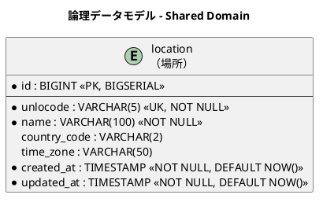
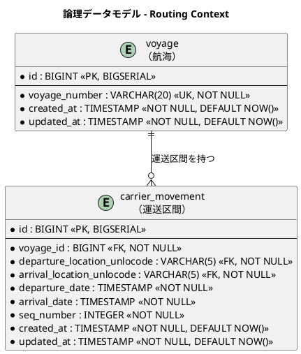
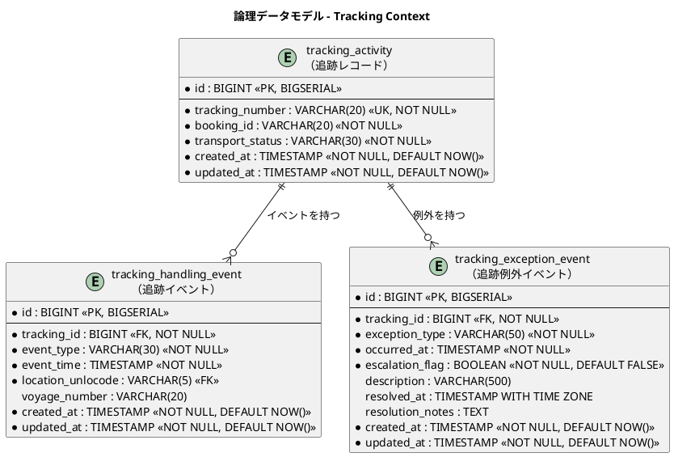
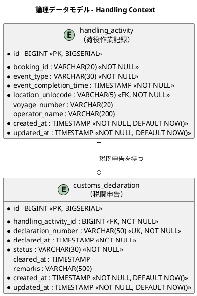
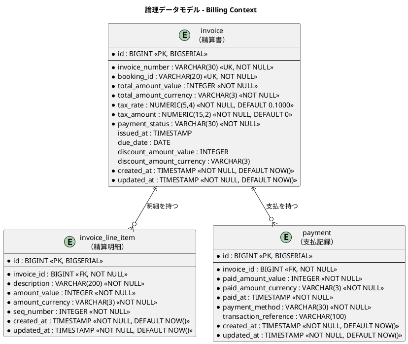
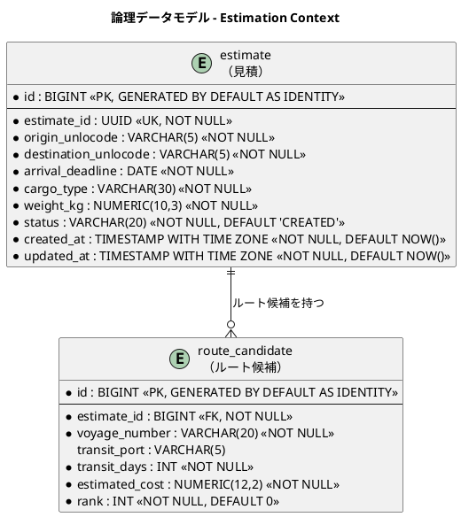
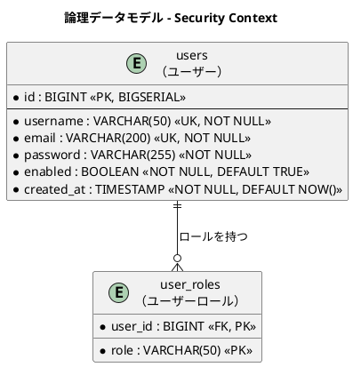

# データモデル設計 - 国際貨物輸送管理システム

## 概要

本ドキュメントは、国際貨物輸送管理システム（C# / .NET 版）の永続化層データモデルを定義します。
ドメインモデル分析で識別した 7 つの境界付けられたコンテキスト（Booking / Routing / Tracking / Handling / Billing / Estimation / Shared Domain）に対応する 18 テーブルを設計します。
`shipper`（荷主）テーブルと、ASP.NET Core 認証用の `users` / `user_roles` テーブルを含みます。

### 設計方針

- **DB**: PostgreSQL 16.x（本番・ステージング）、SQLite 3.x（開発環境）、Testcontainers による PostgreSQL（テスト）
- **データアクセス**: Dapper 2.x + ADO.NET プロバイダ（Npgsql / Microsoft.Data.Sqlite）。SQL は手書きし、リポジトリ実装（各コンテキストの `Infrastructure/Repositories` 名前空間）内に記述する
- **マイグレーション**: DbUp（`Scripts/0001_xxx.sql` 形式のバージョン付き SQL スクリプト、forward-only、プロバイダ別ディレクトリで方言差異を吸収）
- **SQL 方言方針**: リポジトリの SQL は ANSI 標準の範囲を基本とし、PostgreSQL 固有機能（JSONB・配列型等）は使用しない
- **ID 戦略**: サロゲートキー（`BIGSERIAL`）+ 業務キー（`VARCHAR`）の併用
- **命名規則**: スネークケース（PostgreSQL 慣習。`DefaultTypeMap.MatchNamesWithUnderscores = true` によりプロパティへマッピング）
- **監査カラム**: 全テーブルに `created_at` / `updated_at` を付与

---

## 概念データモデル

全コンテキストのエンティティとその主要リレーションシップを俯瞰します。


---

## 論理データモデル

### Shared Domain

共有ドメインとして全コンテキストが参照する場所マスタです。UN/LOCODE（国連貿易港コード）を業務キーとします。



---

### Booking Context

貨物の予約・旅程情報を管理します。`cargo` が集約ルートで、`leg` が旅程の各区間を表します。荷主情報は `shipper` テーブルに正規化し、FK 参照とします。


---

### Routing Context

航海スケジュールと運送区間を管理します。`voyage` が集約ルートで、`carrier_movement` が個々の移動区間を表します。



---

### Tracking Context

貨物追跡の状態・イベント・例外を管理します。`tracking_activity` が集約ルートです。



---

### Handling Context

荷役作業の実績と税関申告を管理します。`handling_activity` が集約ルートです。



---

### Billing Context

精算書・明細・支払記録を管理します。参考実装には存在しない新規コンテキストです。



---

### Estimation Context

輸送見積とルート候補を管理します。`estimate` が集約ルートで、`route_candidate` が各ルート候補を表します。



---

### Security Context

ASP.NET Core の Cookie / JWT 認証で利用するユーザー認証・認可テーブルです。カスタムのユーザーストア実装が参照します。



---

## テーブル定義

### `location`（場所マスタ）

| カラム名 | データ型 | 制約 | 説明 |
| :--- | :--- | :--- | :--- |
| `id` | `BIGINT` | `PK, NOT NULL` | サロゲートキー（BIGSERIAL） |
| `unlocode` | `VARCHAR(5)` | `UK, NOT NULL` | UN/LOCODE（業務キー。例: `JPTYO`） |
| `name` | `VARCHAR(100)` | `NOT NULL` | 場所名称（例: `Tokyo`） |
| `country_code` | `VARCHAR(2)` | | ISO 3166-1 alpha-2 国コード |
| `time_zone` | `VARCHAR(50)` | | タイムゾーン（例: `Asia/Tokyo`） |
| `created_at` | `TIMESTAMP WITH TIME ZONE` | `NOT NULL, DEFAULT NOW()` | レコード作成日時 |
| `updated_at` | `TIMESTAMP WITH TIME ZONE` | `NOT NULL, DEFAULT NOW()` | レコード更新日時 |

---

### `shipper`（荷主）

> **注記**: 旧設計で `cargo` テーブルに存在した `shipper_name`・`shipper_email` カラムは本テーブルへの正規化に伴い削除しました。

| カラム名 | データ型 | 制約 | 説明 |
| :--- | :--- | :--- | :--- |
| `id` | `BIGINT` | `PK, NOT NULL` | サロゲートキー（BIGSERIAL） |
| `shipper_code` | `VARCHAR(20)` | `UK, NOT NULL` | 荷主コード（業務キー。SHP-XXXXXX 形式） |
| `shipper_type` | `VARCHAR(20)` | `NOT NULL` | 荷主種別（`INDIVIDUAL` / `CORPORATE`） |
| `name` | `VARCHAR(200)` | `NOT NULL` | 荷主名称 |
| `email` | `VARCHAR(200)` | `NOT NULL` | メールアドレス |
| `phone` | `VARCHAR(50)` | | 電話番号 |
| `contract_number` | `VARCHAR(50)` | | 契約番号（法人のみ。NULLable） |
| `discount_rate` | `NUMERIC(5,4)` | `DEFAULT 0.0000` | 割引率（0.0000〜0.1500、最大 15%） |
| `created_at` | `TIMESTAMP WITH TIME ZONE` | `NOT NULL, DEFAULT NOW()` | レコード作成日時 |
| `updated_at` | `TIMESTAMP WITH TIME ZONE` | `NOT NULL, DEFAULT NOW()` | レコード更新日時 |
| `version` | `BIGINT` | `NOT NULL, DEFAULT 0` | 楽観的ロック用バージョン（ADR-0001） |

#### DDL

```sql
CREATE TABLE shipper (
    id              BIGSERIAL PRIMARY KEY,
    shipper_code    VARCHAR(20)  NOT NULL UNIQUE,  -- SHP-XXXXXX 形式
    shipper_type    VARCHAR(20)  NOT NULL,          -- INDIVIDUAL / CORPORATE
    name            VARCHAR(200) NOT NULL,
    email           VARCHAR(200) NOT NULL,
    phone           VARCHAR(50),
    contract_number VARCHAR(50),                   -- 法人のみ（NULLable）
    discount_rate   NUMERIC(5,4) DEFAULT 0.0000,   -- 0.0000〜0.1500 (最大 15%)
    created_at      TIMESTAMP WITH TIME ZONE NOT NULL DEFAULT NOW(),
    updated_at      TIMESTAMP WITH TIME ZONE NOT NULL DEFAULT NOW()
);
```

#### Dapper リポジトリ実装例

カラム名とプロパティの対応は snake_case マッピング（`DefaultTypeMap.MatchNamesWithUnderscores = true`）で自動解決します。enum ⇔ `VARCHAR` 変換は `SqlMapper.TypeHandler<T>` で行います。

```csharp
// アプリケーション起動時に一度だけ設定
DefaultTypeMap.MatchNamesWithUnderscores = true;
SqlMapper.AddTypeHandler(new ShipperTypeHandler());

// enum ⇔ VARCHAR 変換用 TypeHandler
public class ShipperTypeHandler : SqlMapper.TypeHandler<ShipperType>
{
    public override ShipperType Parse(object value)
        => Enum.Parse<ShipperType>((string)value);

    public override void SetValue(IDbDataParameter parameter, ShipperType value)
        => parameter.Value = value.ToString();
}

// CargoTracker.Web/Shipper/Infrastructure/Repositories/ShipperRepository.cs
// 接続は IDbConnection 抽象で受け、開発（SQLite）/ 本番（PostgreSQL）を透過的に扱う（ADR-0003）
public class ShipperRepository(IDbConnection connection) : IShipperRepository
{
    public async Task<Shipper?> FindByCodeAsync(string shipperCode)
    {
        const string sql = """
            SELECT id, shipper_code, shipper_type, name, email,
                   phone, contract_number, discount_rate,
                   created_at, updated_at
            FROM shipper
            WHERE shipper_code = @ShipperCode
            """;
        return await connection.QuerySingleOrDefaultAsync<Shipper>(
            sql, new { ShipperCode = shipperCode });
    }

    public async Task AddAsync(Shipper shipper, IDbTransaction tx)
    {
        // RETURNING は PostgreSQL 方言のため使用しない（ADR-0003）。
        // 呼び出し側は業務キー（shipper_code）で参照する
        const string sql = """
            INSERT INTO shipper (shipper_code, shipper_type, name, email,
                                 phone, contract_number, discount_rate,
                                 created_at, updated_at)
            VALUES (@ShipperCode, @ShipperType, @Name, @Email,
                    @Phone, @ContractNumber, @DiscountRate,
                    @Now, @Now)
            """;
        var parameters = new DynamicParameters(shipper);
        parameters.Add("Now", DateTimeOffset.UtcNow);
        await connection.ExecuteAsync(sql, parameters, tx);
    }
}
```

---

### `cargo`（貨物）

> **注記**: `shipper_name`・`shipper_email` カラムは削除し、`shipper_id`（FK → `shipper.id`）による参照に変更しました。
>
> **IT2 実装状況**: IT2 完了時点で初期マイグレーション群が適用済みです。
> 将来フェーズで追加予定のカラム（`transport_status`・`routing_status`・`booking_amount_*`・`consignee_*`・`tracking_number` 等）は下表の「将来追加予定」節に記載します。

| カラム名 | データ型 | 制約 | 説明 |
| :--- | :--- | :--- | :--- |
| `id` | `BIGINT` | `PK, NOT NULL` | サロゲートキー（`BIGINT GENERATED BY DEFAULT AS IDENTITY`） |
| `booking_id` | `VARCHAR(20)` | `UK, NOT NULL` | 予約 ID（業務キー。ドメインの `BookingId(string)` に対応） |
| `shipper_id` | `BIGINT` | `FK → shipper.id, NOT NULL` | 荷主 ID（サロゲートキー参照） |
| `cargo_type` | `VARCHAR(30)` | `NOT NULL` | 貨物種別（`GENERAL` / `HAZARDOUS` / `REFRIGERATED`） |
| `weight` | `NUMERIC(10,3)` | `NOT NULL, > 0` | 重量（kg） |
| `origin_unlocode` | `VARCHAR(5)` | `NOT NULL` | 出発地（RouteSpecification） |
| `destination_unlocode` | `VARCHAR(5)` | `NOT NULL` | 仕向地（RouteSpecification） |
| `arrival_deadline` | `DATE` | `NOT NULL` | 到着期限（RouteSpecification） |
| `booking_status` | `VARCHAR(30)` | `NOT NULL, DEFAULT 'PRELIMINARY'` | 予約状態（BookingStatus 列挙値） |
| `dimension_length` | `NUMERIC(10,3)` | | 貨物の長さ（cm、オプション） |
| `dimension_width` | `NUMERIC(10,3)` | | 貨物の幅（cm、オプション） |
| `dimension_height` | `NUMERIC(10,3)` | | 貨物の高さ（cm、オプション） |
| `quantity` | `INTEGER` | | 貨物個数（オプション、1 以上） |
| `description` | `VARCHAR(500)` | | 品名（オプション） |
| `hazardous_class` | `VARCHAR(10)` | | 危険物クラス（HAZARDOUS 時のみ） |
| `un_number` | `VARCHAR(10)` | | UN 番号（HAZARDOUS 時のみ） |
| `proper_shipping_name` | `VARCHAR(200)` | | 正式輸送品名（HAZARDOUS 時のみ） |
| `min_temperature` | `NUMERIC(10,3)` | | 最低温度（REFRIGERATED 時のみ） |
| `max_temperature` | `NUMERIC(10,3)` | | 最高温度（REFRIGERATED 時のみ） |
| `temperature_unit` | `VARCHAR(20)` | | 温度単位（`CELSIUS` / `FAHRENHEIT`、REFRIGERATED 時のみ） |
| `created_at` | `TIMESTAMP WITH TIME ZONE` | `NOT NULL, DEFAULT NOW()` | レコード作成日時 |
| `updated_at` | `TIMESTAMP WITH TIME ZONE` | `NOT NULL, DEFAULT NOW()` | レコード更新日時 |
| `version` | `BIGINT` | `NOT NULL, DEFAULT 0` | 楽観的ロック用バージョン（ADR-0001） |

#### 将来追加予定カラム（IT4+）

| カラム名 | データ型 | 説明 | 追加フェーズ |
| :--- | :--- | :--- | :--- |
| `transport_status` | `VARCHAR(30)` | 輸送状態（TransportStatus 列挙値） | Tracking Context 実装時 |
| `routing_status` | `VARCHAR(30)` | 経路決定状態（ROUTED / MISROUTED / NOT_ROUTED） | Routing Context 実装時 |
| `booking_amount_value` | `INTEGER` | 予約金額（最小通貨単位） | Billing Context 実装時 |
| `booking_amount_currency` | `VARCHAR(3)` | 通貨コード（ISO 4217） | Billing Context 実装時 |
| `consignee_name` | `VARCHAR(200)` | 荷受人名 | 荷受人管理実装時 |
| `consignee_email` | `VARCHAR(200)` | 荷受人メールアドレス | 荷受人管理実装時 |
| `tracking_number` | `VARCHAR(20)` | 追跡番号（発行後に設定） | Tracking Context 実装時 |
| `next_expected_*` | 各種 | 次の予定荷役情報 | Tracking Context 実装時 |
| `last_handling_event_*` | 各種 | 最後の荷役イベント情報 | Handling Context 実装時 |

---

### `leg`（輸送区間）

| カラム名 | データ型 | 制約 | 説明 |
| :--- | :--- | :--- | :--- |
| `id` | `BIGINT` | `PK, NOT NULL` | サロゲートキー（BIGSERIAL） |
| `cargo_id` | `BIGINT` | `FK → cargo.id, NOT NULL` | 親貨物 ID |
| `voyage_number` | `VARCHAR(20)` | `FK → voyage.voyage_number, NOT NULL` | 航海番号 |
| `load_location_unlocode` | `VARCHAR(5)` | `FK → location.unlocode, NOT NULL` | 積込場所（UN/LOCODE） |
| `unload_location_unlocode` | `VARCHAR(5)` | `FK → location.unlocode, NOT NULL` | 荷降場所（UN/LOCODE） |
| `load_time` | `TIMESTAMP` | | 積込予定日時 |
| `unload_time` | `TIMESTAMP` | | 荷降予定日時 |
| `seq_number` | `INTEGER` | `NOT NULL` | 区間順序（1 始まり） |
| `created_at` | `TIMESTAMP` | `NOT NULL, DEFAULT NOW()` | レコード作成日時 |
| `updated_at` | `TIMESTAMP` | `NOT NULL, DEFAULT NOW()` | レコード更新日時 |

---

### `voyage`（航海）

| カラム名 | データ型 | 制約 | 説明 |
| :--- | :--- | :--- | :--- |
| `id` | `BIGINT` | `PK, NOT NULL` | サロゲートキー（BIGSERIAL） |
| `voyage_number` | `VARCHAR(20)` | `UK, NOT NULL` | 航海番号（業務キー） |
| `created_at` | `TIMESTAMP` | `NOT NULL, DEFAULT NOW()` | レコード作成日時 |
| `updated_at` | `TIMESTAMP` | `NOT NULL, DEFAULT NOW()` | レコード更新日時 |
| `version` | `BIGINT` | `NOT NULL, DEFAULT 0` | 楽観的ロック用バージョン（ADR-0001） |

---

### `carrier_movement`（運送区間）

| カラム名 | データ型 | 制約 | 説明 |
| :--- | :--- | :--- | :--- |
| `id` | `BIGINT` | `PK, NOT NULL` | サロゲートキー（BIGSERIAL） |
| `voyage_id` | `BIGINT` | `FK → voyage.id, NOT NULL` | 親航海 ID |
| `departure_location_unlocode` | `VARCHAR(5)` | `FK → location.unlocode, NOT NULL` | 出発地（UN/LOCODE） |
| `arrival_location_unlocode` | `VARCHAR(5)` | `FK → location.unlocode, NOT NULL` | 到着地（UN/LOCODE） |
| `departure_date` | `TIMESTAMP` | `NOT NULL` | 出発日時 |
| `arrival_date` | `TIMESTAMP` | `NOT NULL` | 到着日時 |
| `seq_number` | `INTEGER` | `NOT NULL` | 区間順序（1 始まり） |
| `created_at` | `TIMESTAMP` | `NOT NULL, DEFAULT NOW()` | レコード作成日時 |
| `updated_at` | `TIMESTAMP` | `NOT NULL, DEFAULT NOW()` | レコード更新日時 |

---

### `tracking_activity`（追跡レコード）

| カラム名 | データ型 | 制約 | 説明 |
| :--- | :--- | :--- | :--- |
| `id` | `BIGINT` | `PK, NOT NULL` | サロゲートキー（BIGSERIAL） |
| `tracking_number` | `VARCHAR(20)` | `UK, NOT NULL` | 追跡番号（業務キー） |
| `booking_id` | `VARCHAR(20)` | `NOT NULL` | 予約 ID（参照整合性は書き込み側で保証） |
| `transport_status` | `VARCHAR(30)` | `NOT NULL` | 輸送状態（TransportStatus 列挙値） |
| `created_at` | `TIMESTAMP` | `NOT NULL, DEFAULT NOW()` | レコード作成日時 |
| `updated_at` | `TIMESTAMP` | `NOT NULL, DEFAULT NOW()` | レコード更新日時 |
| `version` | `BIGINT` | `NOT NULL, DEFAULT 0` | 楽観的ロック用バージョン（ADR-0001） |

---

### `tracking_handling_event`（追跡イベント）

| カラム名 | データ型 | 制約 | 説明 |
| :--- | :--- | :--- | :--- |
| `id` | `BIGINT` | `PK, NOT NULL` | サロゲートキー（BIGSERIAL） |
| `tracking_id` | `BIGINT` | `FK → tracking_activity.id, NOT NULL` | 親追跡レコード ID |
| `event_type` | `VARCHAR(30)` | `NOT NULL` | 荷役タイプ（HandlingType 列挙値） |
| `event_time` | `TIMESTAMP` | `NOT NULL` | イベント発生日時 |
| `location_unlocode` | `VARCHAR(5)` | `FK → location.unlocode` | イベント発生場所（UN/LOCODE） |
| `voyage_number` | `VARCHAR(20)` | | 関連する航海番号 |
| `created_at` | `TIMESTAMP` | `NOT NULL, DEFAULT NOW()` | レコード作成日時 |
| `updated_at` | `TIMESTAMP` | `NOT NULL, DEFAULT NOW()` | レコード更新日時 |

---

### `tracking_exception_event`（追跡例外イベント）

| カラム名 | データ型 | 制約 | 説明 |
| :--- | :--- | :--- | :--- |
| `id` | `BIGINT` | `PK, NOT NULL` | サロゲートキー（BIGSERIAL） |
| `tracking_id` | `BIGINT` | `FK → tracking_activity.id, NOT NULL` | 親追跡レコード ID |
| `exception_type` | `VARCHAR(50)` | `NOT NULL` | 例外種別（例: `CUSTOMS_HOLD`, `DAMAGE`, `DELAY`） |
| `occurred_at` | `TIMESTAMP WITH TIME ZONE` | `NOT NULL` | 例外発生日時 |
| `escalation_flag` | `BOOLEAN` | `NOT NULL, DEFAULT FALSE` | エスカレーション判定フラグ（US20 紛失時） |
| `description` | `VARCHAR(500)` | | 例外内容の詳細 |
| `resolved_at` | `TIMESTAMP WITH TIME ZONE` | | 解決日時（NULL = 未解決） |
| `resolution_notes` | `TEXT` | | 対応内容メモ |
| `created_at` | `TIMESTAMP WITH TIME ZONE` | `NOT NULL, DEFAULT NOW()` | レコード作成日時 |
| `updated_at` | `TIMESTAMP WITH TIME ZONE` | `NOT NULL, DEFAULT NOW()` | レコード更新日時 |

---

### `handling_activity`（荷役作業記録）

| カラム名 | データ型 | 制約 | 説明 |
| :--- | :--- | :--- | :--- |
| `id` | `BIGINT` | `PK, NOT NULL` | サロゲートキー（BIGSERIAL） |
| `booking_id` | `VARCHAR(20)` | `NOT NULL` | 予約 ID（参照整合性は書き込み側で保証） |
| `event_type` | `VARCHAR(30)` | `NOT NULL` | 荷役タイプ（RECEIVE / LOAD / UNLOAD / CUSTOMS / CLAIM） |
| `event_completion_time` | `TIMESTAMP` | `NOT NULL` | 荷役完了日時 |
| `location_unlocode` | `VARCHAR(5)` | `FK → location.unlocode, NOT NULL` | 作業場所（UN/LOCODE） |
| `voyage_number` | `VARCHAR(20)` | | 関連する航海番号（LOAD / UNLOAD 時に設定） |
| `operator_name` | `VARCHAR(200)` | | 作業員名 |
| `created_at` | `TIMESTAMP` | `NOT NULL, DEFAULT NOW()` | レコード作成日時 |
| `updated_at` | `TIMESTAMP` | `NOT NULL, DEFAULT NOW()` | レコード更新日時 |
| `version` | `BIGINT` | `NOT NULL, DEFAULT 0` | 楽観的ロック用バージョン（ADR-0001） |

---

### `customs_declaration`（税関申告）

| カラム名 | データ型 | 制約 | 説明 |
| :--- | :--- | :--- | :--- |
| `id` | `BIGINT` | `PK, NOT NULL` | サロゲートキー（BIGSERIAL） |
| `handling_activity_id` | `BIGINT` | `FK → handling_activity.id, NOT NULL` | 関連荷役作業 ID |
| `declaration_number` | `VARCHAR(50)` | `UK, NOT NULL` | 申告番号（業務キー） |
| `declared_at` | `TIMESTAMP` | `NOT NULL` | 申告日時 |
| `status` | `VARCHAR(30)` | `NOT NULL` | 申告状態（例: `PENDING`, `CLEARED`, `HELD`） |
| `cleared_at` | `TIMESTAMP` | | 通関完了日時（NULL = 未完了） |
| `remarks` | `VARCHAR(500)` | | 備考・メモ |
| `created_at` | `TIMESTAMP` | `NOT NULL, DEFAULT NOW()` | レコード作成日時 |
| `updated_at` | `TIMESTAMP` | `NOT NULL, DEFAULT NOW()` | レコード更新日時 |

---

### `invoice`（精算書）

| カラム名 | データ型 | 制約 | 説明 |
| :--- | :--- | :--- | :--- |
| `id` | `BIGINT` | `PK, NOT NULL` | サロゲートキー（BIGSERIAL） |
| `invoice_number` | `VARCHAR(30)` | `UK, NOT NULL` | 精算書番号（業務キー） |
| `booking_id` | `VARCHAR(20)` | `UK, NOT NULL` | 予約 ID（UNIQUE 制約で二重請求を防止） |
| `total_amount_value` | `INTEGER` | `NOT NULL` | 合計金額（最小通貨単位） |
| `total_amount_currency` | `VARCHAR(3)` | `NOT NULL` | 通貨コード（ISO 4217） |
| `tax_rate` | `NUMERIC(5,4)` | `NOT NULL, DEFAULT 0.1000` | 消費税率（デフォルト 10%） |
| `tax_amount` | `NUMERIC(15,2)` | `NOT NULL, DEFAULT 0` | 消費税額 |
| `payment_status` | `VARCHAR(30)` | `NOT NULL` | 支払状態（`PENDING` / `CONFIRMED` / `OVERDUE` / `REFUNDED`） |
| `issued_at` | `TIMESTAMP WITH TIME ZONE` | | 発行日時 |
| `due_date` | `DATE` | | 支払期日 |
| `discount_amount_value` | `INTEGER` | | 割引金額（最小通貨単位） |
| `discount_amount_currency` | `VARCHAR(3)` | | 割引通貨コード |
| `created_at` | `TIMESTAMP WITH TIME ZONE` | `NOT NULL, DEFAULT NOW()` | レコード作成日時 |
| `updated_at` | `TIMESTAMP WITH TIME ZONE` | `NOT NULL, DEFAULT NOW()` | レコード更新日時 |
| `version` | `BIGINT` | `NOT NULL, DEFAULT 0` | 楽観的ロック用バージョン（ADR-0001） |

---

### `invoice_line_item`（精算明細）

| カラム名 | データ型 | 制約 | 説明 |
| :--- | :--- | :--- | :--- |
| `id` | `BIGINT` | `PK, NOT NULL` | サロゲートキー（BIGSERIAL） |
| `invoice_id` | `BIGINT` | `FK → invoice.id, NOT NULL` | 親精算書 ID |
| `description` | `VARCHAR(200)` | `NOT NULL` | 明細項目説明 |
| `amount_value` | `INTEGER` | `NOT NULL` | 明細金額（最小通貨単位） |
| `amount_currency` | `VARCHAR(3)` | `NOT NULL` | 通貨コード（ISO 4217） |
| `seq_number` | `INTEGER` | `NOT NULL` | 明細順序（1 始まり） |
| `created_at` | `TIMESTAMP` | `NOT NULL, DEFAULT NOW()` | レコード作成日時 |
| `updated_at` | `TIMESTAMP` | `NOT NULL, DEFAULT NOW()` | レコード更新日時 |

---

### `payment`（支払記録）

| カラム名 | データ型 | 制約 | 説明 |
| :--- | :--- | :--- | :--- |
| `id` | `BIGINT` | `PK, NOT NULL` | サロゲートキー（BIGSERIAL） |
| `invoice_id` | `BIGINT` | `FK → invoice.id, NOT NULL` | 親精算書 ID |
| `paid_amount_value` | `INTEGER` | `NOT NULL` | 支払金額（最小通貨単位） |
| `paid_amount_currency` | `VARCHAR(3)` | `NOT NULL` | 通貨コード（ISO 4217） |
| `paid_at` | `TIMESTAMP` | `NOT NULL` | 支払日時 |
| `payment_method` | `VARCHAR(30)` | `NOT NULL` | 支払方法（例: `BANK_TRANSFER`, `CREDIT_CARD`） |
| `transaction_reference` | `VARCHAR(100)` | | 取引参照番号（外部決済システムの ID） |
| `created_at` | `TIMESTAMP WITH TIME ZONE` | `NOT NULL, DEFAULT NOW()` | レコード作成日時 |
| `updated_at` | `TIMESTAMP WITH TIME ZONE` | `NOT NULL, DEFAULT NOW()` | レコード更新日時 |

---

### `users`（ユーザー）

ASP.NET Core 認証のカスタムユーザーストアが参照するユーザー認証テーブルです。

| カラム名 | データ型 | 制約 | 説明 |
| :--- | :--- | :--- | :--- |
| `id` | `BIGINT` | `PK, NOT NULL` | サロゲートキー（BIGSERIAL） |
| `username` | `VARCHAR(50)` | `UK, NOT NULL` | ログイン名 |
| `email` | `VARCHAR(200)` | `UK, NOT NULL` | メールアドレス |
| `password` | `VARCHAR(255)` | `NOT NULL` | パスワード（BCrypt ハッシュ） |
| `enabled` | `BOOLEAN` | `NOT NULL, DEFAULT TRUE` | アカウント有効フラグ |
| `created_at` | `TIMESTAMP WITH TIME ZONE` | `NOT NULL, DEFAULT NOW()` | レコード作成日時 |

#### DDL

```sql
CREATE TABLE users (
    id           BIGSERIAL PRIMARY KEY,
    username     VARCHAR(50)  NOT NULL UNIQUE,
    email        VARCHAR(200) NOT NULL UNIQUE,
    password     VARCHAR(255) NOT NULL,  -- BCrypt ハッシュ
    enabled      BOOLEAN NOT NULL DEFAULT TRUE,
    created_at   TIMESTAMP WITH TIME ZONE NOT NULL DEFAULT NOW()
);
```

---

### `user_roles`（ユーザーロール）

| カラム名 | データ型 | 制約 | 説明 |
| :--- | :--- | :--- | :--- |
| `user_id` | `BIGINT` | `PK, FK → users.id, NOT NULL` | 親ユーザー ID |
| `role` | `VARCHAR(50)` | `PK, NOT NULL` | ロール名（`ROLE_ADMIN` / `ROLE_OPERATOR` / `ROLE_SHIPPER` 等） |

#### DDL

```sql
CREATE TABLE user_roles (
    user_id  BIGINT      NOT NULL REFERENCES users(id),
    role     VARCHAR(50) NOT NULL,  -- ROLE_ADMIN / ROLE_OPERATOR / ROLE_SHIPPER 等
    PRIMARY KEY (user_id, role)
);
```

---

### `estimate`（見積）

| カラム名 | データ型 | 制約 | 説明 |
| :--- | :--- | :--- | :--- |
| `id` | `BIGINT` | `PK, NOT NULL` | サロゲートキー（`GENERATED BY DEFAULT AS IDENTITY`） |
| `estimate_id` | `UUID` | `UK, NOT NULL` | 見積 ID（業務キー） |
| `origin_unlocode` | `VARCHAR(5)` | `NOT NULL` | 出発地（UN/LOCODE） |
| `destination_unlocode` | `VARCHAR(5)` | `NOT NULL` | 仕向地（UN/LOCODE） |
| `arrival_deadline` | `DATE` | `NOT NULL` | 到着期限 |
| `cargo_type` | `VARCHAR(30)` | `NOT NULL` | 貨物種別（`GENERAL` / `HAZARDOUS` / `REFRIGERATED`） |
| `weight_kg` | `NUMERIC(10,3)` | `NOT NULL` | 重量（kg） |
| `status` | `VARCHAR(20)` | `NOT NULL, DEFAULT 'CREATED'` | 見積状態（`CREATED` / `EXPIRED`） |
| `created_at` | `TIMESTAMP WITH TIME ZONE` | `NOT NULL, DEFAULT NOW()` | レコード作成日時 |
| `updated_at` | `TIMESTAMP WITH TIME ZONE` | `NOT NULL, DEFAULT NOW()` | レコード更新日時 |
| `version` | `BIGINT` | `NOT NULL, DEFAULT 0` | 楽観的ロック用バージョン（ADR-0001） |

#### DDL

```sql
CREATE TABLE estimate (
    id                    BIGINT GENERATED BY DEFAULT AS IDENTITY PRIMARY KEY,
    estimate_id           UUID NOT NULL UNIQUE,
    origin_unlocode       VARCHAR(5) NOT NULL,
    destination_unlocode  VARCHAR(5) NOT NULL,
    arrival_deadline      DATE NOT NULL,
    cargo_type            VARCHAR(30) NOT NULL,
    weight_kg             NUMERIC(10, 3) NOT NULL,
    status                VARCHAR(20) NOT NULL DEFAULT 'CREATED',
    created_at            TIMESTAMP WITH TIME ZONE NOT NULL DEFAULT NOW(),
    updated_at            TIMESTAMP WITH TIME ZONE NOT NULL DEFAULT NOW()
);
```

---

### `route_candidate`（ルート候補）

| カラム名 | データ型 | 制約 | 説明 |
| :--- | :--- | :--- | :--- |
| `id` | `BIGINT` | `PK, NOT NULL` | サロゲートキー（`GENERATED BY DEFAULT AS IDENTITY`） |
| `estimate_id` | `BIGINT` | `FK → estimate.id, NOT NULL` | 親見積 ID（CASCADE 削除） |
| `voyage_number` | `VARCHAR(20)` | `NOT NULL` | 航海番号 |
| `transit_port` | `VARCHAR(5)` | | 経由港（UN/LOCODE、オプション） |
| `transit_days` | `INT` | `NOT NULL` | 輸送日数 |
| `estimated_cost` | `NUMERIC(12,2)` | `NOT NULL` | 見積コスト |
| `rank` | `INT` | `NOT NULL, DEFAULT 0` | ルート候補の優先順位 |

#### DDL

```sql
CREATE TABLE route_candidate (
    id              BIGINT GENERATED BY DEFAULT AS IDENTITY PRIMARY KEY,
    estimate_id     BIGINT NOT NULL REFERENCES estimate(id) ON DELETE CASCADE,
    voyage_number   VARCHAR(20) NOT NULL,
    transit_port    VARCHAR(5),
    transit_days    INT NOT NULL,
    estimated_cost  NUMERIC(12, 2) NOT NULL,
    rank            INT NOT NULL DEFAULT 0
);
```

---

## 設計上の判断

### 1. サロゲートキーと業務キーの併用

**判断**: 全テーブルに `BIGSERIAL` のサロゲートキー（`id`）を設け、業務上の識別子（`booking_id`、`voyage_number`、`unlocode` 等）には `UNIQUE` 制約を付与します。

**根拠**: 外部キー参照を `BIGINT` に統一することでインデックス効率が向上します。業務キーはドメインモデルの一部であり、別途管理することで業務ルールの変更に対応しやすくなります。業務キーの一意性は DDL の `UNIQUE` 制約で宣言し、Dapper のクエリでは業務キーによる検索（`WHERE booking_id = @BookingId`）を明示的に記述します。

---

### 2. `location` テーブルへの参照方式

**判断**: 参考実装では `VARCHAR` で場所 ID を文字列管理していましたが、本設計では `location.unlocode` を外部キーとして参照します。

**根拠**: UN/LOCODE は国際標準の 5 文字コードであり、それ自体が意味を持つ自然キーです。文字列参照でも JOIN 効率は許容範囲内であり、可読性が高まります。外部キーは DDL で `REFERENCES location (unlocode)` として宣言し、Dapper のクエリでは `JOIN location ON ...` を明示的に記述します。

---

### 3. 金額の表現（`INTEGER` + `VARCHAR(3)`）

**判断**: 金額を `INTEGER`（最小通貨単位）と `VARCHAR(3)`（ISO 4217 通貨コード）の 2 カラムで表現します。`NUMERIC` / `DECIMAL` は使用しません。

**根拠**: 浮動小数点演算による精度誤差を排除するため、円・セントなど最小通貨単位で整数管理します。複数通貨対応のため通貨コードを常に付随させます。これはドメインモデルの `Money` 値オブジェクト（最小通貨単位の整数）に対応し、Dapper では 2 カラムを SELECT してリポジトリ内で `Money` に組み立てます（マルチマッピングまたはコンストラクタでの変換）。

---

### 4. 列挙値のカラム型（`VARCHAR(30)`）

**判断**: `BookingStatus`、`TransportStatus`、`HandlingType` 等の列挙型カラムは `VARCHAR(30)` で表現し、PostgreSQL の `ENUM` 型は使用しません。

**根拠**: PostgreSQL `ENUM` 型は値の追加・変更にスキーマ ALTER が必要でマイグレーション時のリスクが高いためです。`VARCHAR` ならば DbUp のマイグレーションスクリプトで CHECK 制約を追加・変更するだけで済みます。C# の `enum` とは `SqlMapper.TypeHandler<T>`（または `Enum.Parse` / `ToString` によるリポジトリ内変換）で相互変換します。

---

### 5. コンテキスト間の参照整合性

**判断**: 異なるコンテキスト間（例: `handling_activity.booking_id` → `cargo.booking_id`）には DB 外部キー制約を設けません。コンテキスト内の参照（例: `leg.cargo_id` → `cargo.id`）には外部キー制約を設けます。

**根拠**: DDD の境界付けられたコンテキスト間はイベント連携を前提とする疎結合設計であり、DB 外部キーによる強結合は将来のサービス分割を妨げます。整合性はアプリケーション層で保証します。リポジトリ実装でもコンテキストをまたぐ JOIN は行わず、業務キーの値のみを保持します。

---

### 6. `Billing Context` の新規設計

**判断**: 参考実装（Jakarta EE）には `Billing Context` が存在しませんでしたが、本設計では `invoice`・`invoice_line_item`・`payment` の 3 テーブルを新規追加します。

**根拠**: ドメインモデル分析で識別した `SETTLED`（BookingStatus）と `Invoice` エンティティを実現するために必要です。経理担当者のユースケース（精算書生成・支払確認）を支える永続化構造として設計しました。

---

### 7. 監査カラムの全テーブル付与

**判断**: `created_at`・`updated_at` を全テーブルに `NOT NULL` で付与します。タイムスタンプは C# 側で `DateTimeOffset.UtcNow` を生成し、INSERT / UPDATE 文のパラメータとして常に渡します（DB 関数 `NOW()` は SQLite 非互換のため実行時 SQL では使用しません。ADR-0003）。

**根拠**: 国際貨物輸送は規制上の監査要件が高く、全レコードの作成・更新タイムスタンプが必要です。Dapper は SQL を明示管理するため、UPDATE 文のテンプレートに `updated_at = @Now` を必ず含めるルールをリポジトリ実装規約とし、開発（SQLite）・本番（PostgreSQL）で同一の SQL が動作するようにします。

```csharp
public async Task UpdateAsync(Cargo cargo, IDbTransaction tx)
{
    const string sql = """
        UPDATE cargo
        SET    booking_status = @BookingStatus,
               destination    = @Destination,
               updated_at     = @Now
        WHERE  booking_id = @BookingId
        """;
    await tx.Connection!.ExecuteAsync(sql, new
    {
        BookingStatus = cargo.BookingStatus.ToString(),
        Destination   = cargo.RouteSpecification.Destination.UnLocode,
        BookingId     = cargo.BookingId.Value,
        Now           = DateTimeOffset.UtcNow
    }, tx);
}
```

---

### 8. 楽観的ロック（`version` 列）

**判断**: 集約ルートに対応する 7 テーブル（`shipper`・`cargo`・`voyage`・`tracking_activity`・`handling_activity`・`invoice`・`estimate`）に `version BIGINT NOT NULL DEFAULT 0` を付与します。UPDATE 文は `SET version = version + 1 ... WHERE id = @Id AND version = @ExpectedVersion` とし、更新件数が 0 の場合は並行更新の競合として `ConcurrencyException` を送出します。

**根拠**: 追跡管理者と荷役作業員が同一貨物を同時に更新するケース（例外登録と荷役記録の競合等）でロストアップデートを防ぐためです。子テーブル（`leg` 等）は集約ルート経由でのみ更新されるため（ADR-0001）、version 列は集約ルート表にのみ付与します。方式の詳細は ADR-0001 を参照してください。

---

## DbUp マイグレーション方針

### マイグレーションの作成と適用

マイグレーションはバージョン番号付きの SQL スクリプトとして管理し、DbUp がアプリケーション起動時（または CI/CD の専用ステップ）に未適用スクリプトを順次実行します。

```
src/CargoTracker.Web/Scripts/
  postgresql/                   # ステージング・本番・テスト（Testcontainers）用
    0001_initial_schema.sql     # 初期スキーマ全テーブル作成
    0002_seed_locations.sql     # 初期 UN/LOCODE マスタデータ
    0003_add_xxx.sql            # 機能追加に伴うスキーマ変更
  sqlite/                       # 開発環境用（同一バージョン番号で対応スクリプトを管理）
    0001_initial_schema.sql     # BIGSERIAL → INTEGER PRIMARY KEY AUTOINCREMENT 等の方言差分のみ
    0002_seed_locations.sql
    0003_add_xxx.sql
```

```csharp
// マイグレーション適用（Program.cs またはデプロイ用コンソール）
var upgrader = DeployChanges.To
    .PostgresqlDatabase(connectionString)
    .WithScriptsEmbeddedInAssembly(typeof(InfrastructureMarker).Assembly)
    .WithTransactionPerScript()
    .LogToConsole()
    .Build();

var result = upgrader.PerformUpgrade();
if (!result.Successful) throw new InvalidOperationException("マイグレーションに失敗しました", result.Error);
```

### マイグレーションルール

- スクリプトは連番（またはタイムスタンプ）付きファイル名で時系列に管理し、適用順序を保証します
- 適用済みスクリプトの編集は禁止します（journal テーブル `schemaversions` に記録されたハッシュ・履歴との整合性が崩れるため）
- DbUp は forward-only であり Down マイグレーションを持ちません。ロールバックは新しいスクリプトで元の状態に戻す Forward マイグレーション方式で対応します
- 本番とテスト（Testcontainers による PostgreSQL）で同一スクリプトを使用するため、方言差異は発生しません
- シードデータ（UN/LOCODE マスタ等）もデータ専用スクリプトとして管理します
- スクリプトは生 SQL のためそのままレビュー可能であり、CI/CD では専用ステップで適用してからアプリケーションをデプロイします

### `0001_initial_schema.sql` の構成イメージ

```sql
-- Shared Domain
CREATE TABLE location (...);

-- Security Context
CREATE TABLE users (...);
CREATE TABLE user_roles (...);

-- Booking Context
CREATE TABLE shipper (...);
CREATE TABLE cargo (...);   -- shipper_id FK あり
CREATE TABLE leg (...);

-- Routing Context
CREATE TABLE voyage (...);
CREATE TABLE carrier_movement (...);

-- Tracking Context
CREATE TABLE tracking_activity (...);
CREATE TABLE tracking_handling_event (...);
CREATE TABLE tracking_exception_event (...);  -- escalation_flag / resolution_notes あり

-- Handling Context
CREATE TABLE handling_activity (...);
CREATE TABLE customs_declaration (...);

-- Billing Context
CREATE TABLE invoice (...);  -- tax_rate / tax_amount / booking_id UNIQUE あり
CREATE TABLE invoice_line_item (...);
CREATE TABLE payment (...);

-- Estimation Context（後続スクリプト 000x_add_estimate.sql で追加）
-- estimate        -- estimate_id UUID UNIQUE あり
-- route_candidate -- estimate FK (CASCADE 削除) あり
```
