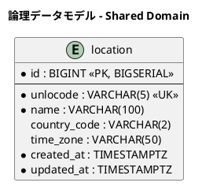

# データモデル設計 - 国際貨物輸送管理システム (Haskell 版)

## 概要

本ドキュメントは、国際貨物輸送管理システム (Haskell 版) の永続化層データモデルを定義する。
境界付けられたコンテキスト (Booking / Routing / Tracking / Handling / Billing / Estimation / Shared Domain) に対応する 20 テーブルを設計する。
`shipper` (荷主) テーブル、Servant 認証 (`AuthHandler`) が参照する `users` / `user_roles` テーブル、経路選択 (`route_candidate_selection`)・通知ログ (`notification_log`) を含む。

### 設計方針

- **DB**: PostgreSQL 16.x (本番)、Testcontainers PostgreSQL (テスト)
- **データアクセス**: postgresql-simple (SQL QuasiQuoter `[sql| ... |]` による SQL 明示管理)
- **マイグレーション**: dbmate (SQL ファイルベース `db/migrations/YYYYMMDDHHMMSS_*.sql`)
- **ID 戦略**: サロゲートキー (`BIGSERIAL`) + 業務キー (`VARCHAR` / UUID) の併用
- **命名規則**: スネークケース (PostgreSQL 慣習)
- **監査カラム**: 全テーブルに `created_at` / `updated_at` を付与

> 全環境で PostgreSQL を使用するため、PostgreSQL ネイティブ構文 (`BIGSERIAL`・`TIMESTAMP WITH TIME ZONE`・`ON CONFLICT`・`LATERAL` 等) をそのまま使用できる。

---

## 概念データモデル

全コンテキストのエンティティとその主要リレーションシップを俯瞰する。

> **フェーズについて**: 概念データモデルはシステムの最終形を示す。一部の属性 (`cargo` の `transport_status` / `routing_status` / `booking_amount_*` 等) は初期イテレーションのテーブル定義には含まれず、対応するコンテキストの実装イテレーションでマイグレーションにより追加する。

```plantuml
@startuml
title 概念データモデル

' avoid problems with angled crows feet
skinparam linetype ortho
hide circle

package "Shared Domain" #lightgray {
  entity "location" as location {
    * id : BIGINT <<PK>>
    --
    * unlocode : VARCHAR(5) <<UK>>
    * name : VARCHAR(100)
  }
  entity "users" as users {
    * id : BIGINT <<PK>>
    --
    * username : VARCHAR(50) <<UK>>
    * email : VARCHAR(200) <<UK>>
    * password : VARCHAR(255)
    * enabled : BOOLEAN
  }
  entity "user_roles" as user_roles {
    * user_id : BIGINT <<FK, PK>>
    * role : VARCHAR(50) <<PK>>
  }
}

package "Booking Context" #lightblue {
  entity "shipper" as shipper {
    * id : BIGINT <<PK>>
    --
    * shipper_code : VARCHAR(20) <<UK>>
    * shipper_type : VARCHAR(20)
    * name : VARCHAR(200)
    * email : VARCHAR(200)
  }
  entity "cargo" as cargo {
    * id : BIGINT <<PK>>
    --
    * booking_id : VARCHAR(20) <<UK>>
    * shipper_id : BIGINT <<FK>>
    * booking_status : VARCHAR(30)
    * cargo_type : VARCHAR(20)
    * weight_kg : NUMERIC(10,3)
    * booking_amount_value : BIGINT
    * booking_amount_currency : VARCHAR(3)
  }
  entity "leg" as leg {
    * id : BIGINT <<PK>>
    --
    * cargo_id : BIGINT <<FK>>
    * voyage_number : VARCHAR(20) <<FK>>
    * load_location_unlocode : VARCHAR(5) <<FK>>
    * unload_location_unlocode : VARCHAR(5) <<FK>>
  }
}

package "Routing Context" #lightgreen {
  entity "voyage" as voyage {
    * id : BIGINT <<PK>>
    --
    * voyage_number : VARCHAR(20) <<UK>>
  }
  entity "carrier_movement" as carrier_movement {
    * id : BIGINT <<PK>>
    --
    * voyage_id : BIGINT <<FK>>
    * departure_location_unlocode : VARCHAR(5) <<FK>>
    * arrival_location_unlocode : VARCHAR(5) <<FK>>
  }
}

package "Tracking Context" #lightyellow {
  entity "tracking_activity" as tracking_activity {
    * id : BIGINT <<PK>>
    --
    * tracking_number : VARCHAR(20) <<UK>>
    * booking_id : VARCHAR(20)
    * transport_status : VARCHAR(30)
  }
  entity "tracking_handling_event" as tracking_handling_event {
    * id : BIGINT <<PK>>
    --
    * tracking_id : BIGINT <<FK>>
    * event_type : VARCHAR(30)
    * event_time : TIMESTAMPTZ
  }
  entity "tracking_exception_event" as tracking_exception_event {
    * id : BIGINT <<PK>>
    --
    * tracking_id : BIGINT <<FK>>
    * exception_type : VARCHAR(50)
    * occurred_at : TIMESTAMPTZ
  }
}

package "Handling Context" #lightcoral {
  entity "handling_activity" as handling_activity {
    * id : BIGINT <<PK>>
    --
    * booking_id : VARCHAR(20)
    * event_type : VARCHAR(30)
    * location_unlocode : VARCHAR(5) <<FK>>
  }
  entity "customs_declaration" as customs_declaration {
    * id : BIGINT <<PK>>
    --
    * handling_activity_id : BIGINT <<FK>>
    * declaration_number : VARCHAR(50) <<UK>>
    * status : VARCHAR(30)
  }
}

package "Estimation Context" #wheat {
  entity "estimate" as estimate {
    * id : BIGINT <<PK>>
    --
    * estimate_id : UUID <<UK>>
    * cargo_type : VARCHAR(30)
    * status : VARCHAR(20)
  }
  entity "route_candidate" as route_candidate {
    * id : BIGINT <<PK>>
    --
    * estimate_id : BIGINT <<FK>>
    * voyage_number : VARCHAR(20)
    * rank : INT
  }
  entity "route_candidate_selection" as route_candidate_selection {
    * id : BIGINT <<PK>>
    --
    * booking_id : VARCHAR(20) <<UK>>
    * voyage_numbers : VARCHAR(200)
    * status : VARCHAR(20)
  }
}

package "Billing Context" #lightpink {
  entity "invoice" as invoice {
    * id : BIGINT <<PK>>
    --
    * invoice_number : VARCHAR(30) <<UK>>
    * booking_id : VARCHAR(20) <<UK>>
    * payment_status : VARCHAR(30)
  }
  entity "invoice_line_item" as invoice_line_item {
    * id : BIGINT <<PK>>
    --
    * invoice_id : BIGINT <<FK>>
    * amount_value : BIGINT
  }
}

package "Cross-cutting" #lavender {
  entity "notification_log" as notification_log {
    * id : BIGINT <<PK>>
    --
    * booking_id : VARCHAR(20)
    * type : VARCHAR(30)
    * sent_at : TIMESTAMPTZ
  }
}

' リレーション (左 = 親 / 右 = 子)
shipper ||--o{ cargo
cargo ||--o{ leg
voyage ||--o{ leg
voyage ||--o{ carrier_movement
location ||--o{ leg
location ||--o{ carrier_movement
location ||--o{ handling_activity
tracking_activity ||--o{ tracking_handling_event
tracking_activity ||--o{ tracking_exception_event
handling_activity ||--o| customs_declaration
estimate ||--o{ route_candidate
invoice ||--o{ invoice_line_item
users ||--o{ user_roles

' コンテキスト間の業務的関連 (DB 制約なし、識別子参照のみ)
cargo .. tracking_activity : booking_id
cargo .. handling_activity : booking_id
cargo .. invoice : booking_id
cargo .. route_candidate_selection : booking_id
cargo .. notification_log : booking_id

@enduml
```



---

## 論理データモデル

### Shared Domain

共有ドメインとして全コンテキストが参照する場所マスタ。UN/LOCODE を業務キーとする。



### Booking / Routing / Tracking / Handling / Billing / Estimation Context

各コンテキストの論理モデルは Scala 版と同一構造とする (詳細図省略)。
Scala 版 `data-model.md` を参照し、命名・カラム構造を踏襲する。

---

## テーブル定義

### `location` (場所マスタ)

| カラム | 型 | 制約 | 説明 |
| :--- | :--- | :--- | :--- |
| `id` | `BIGINT` | `PK` (BIGSERIAL) | サロゲートキー |
| `unlocode` | `VARCHAR(5)` | `UK, NOT NULL` | UN/LOCODE 業務キー |
| `name` | `VARCHAR(100)` | `NOT NULL` | 場所名称 |
| `country_code` | `VARCHAR(2)` | | ISO 3166-1 alpha-2 |
| `time_zone` | `VARCHAR(50)` | | タイムゾーン |
| `created_at` | `TIMESTAMPTZ` | `NOT NULL DEFAULT NOW()` | 作成日時 |
| `updated_at` | `TIMESTAMPTZ` | `NOT NULL DEFAULT NOW()` | 更新日時 |

### `shipper` (荷主)

| カラム | 型 | 制約 | 説明 |
| :--- | :--- | :--- | :--- |
| `id` | `BIGINT` | `PK` | サロゲートキー |
| `shipper_code` | `VARCHAR(20)` | `UK, NOT NULL` | `SHP-XXXXXXXX` |
| `shipper_type` | `VARCHAR(20)` | `NOT NULL` | `INDIVIDUAL` / `CORPORATE` |
| `name` | `VARCHAR(200)` | `NOT NULL` | 名称 |
| `email` | `VARCHAR(200)` | `NOT NULL UNIQUE` | 一意 |
| `phone` | `VARCHAR(50)` | | |
| `address` | `VARCHAR(500)` | | 最大 500 文字 |
| `contract_number` | `VARCHAR(50)` | | 法人のみ |
| `discount_rate` | `NUMERIC(5,4)` | `DEFAULT 0 CHECK (discount_rate BETWEEN 0 AND 0.3000)` | 0〜30% |
| `version` | `INTEGER` | `NOT NULL DEFAULT 0` | 楽観ロック |
| `created_at` / `updated_at` | `TIMESTAMPTZ` | | 監査 |

```sql
CREATE TABLE shipper (
    id              BIGSERIAL PRIMARY KEY,
    shipper_code    VARCHAR(20)  NOT NULL UNIQUE,
    shipper_type    VARCHAR(20)  NOT NULL CHECK (shipper_type IN ('INDIVIDUAL','CORPORATE')),
    name            VARCHAR(200) NOT NULL,
    email           VARCHAR(200) NOT NULL UNIQUE,
    phone           VARCHAR(50),
    address         VARCHAR(500),
    contract_number VARCHAR(50),
    discount_rate   NUMERIC(5,4) DEFAULT 0
        CHECK (discount_rate >= 0 AND discount_rate <= 0.3000),
    version         INTEGER NOT NULL DEFAULT 0,
    created_at      TIMESTAMPTZ NOT NULL DEFAULT NOW(),
    updated_at      TIMESTAMPTZ NOT NULL DEFAULT NOW()
);
```

### `cargo` (貨物)

| カラム | 型 | 制約 | 説明 |
| :--- | :--- | :--- | :--- |
| `id` | `BIGINT` | `PK` | サロゲートキー |
| `booking_id` | `VARCHAR(20)` | `UK, NOT NULL` | `BK-XXXXXX` |
| `shipper_id` | `BIGINT` | `FK → shipper.id` | 荷主 |
| `cargo_type` | `VARCHAR(20)` | `NOT NULL DEFAULT 'GENERAL' CHECK (cargo_type IN ('GENERAL','HAZARDOUS','REFRIGERATED'))` | 貨物種別 |
| `weight_kg` | `NUMERIC(10,3)` | `NOT NULL CHECK (weight_kg > 0)` | 重量 |
| `spec_origin_unlocode` | `VARCHAR(5)` | `FK → location.unlocode` | RouteSpec 出発地 |
| `spec_destination_unlocode` | `VARCHAR(5)` | `FK → location.unlocode` | RouteSpec 仕向地 |
| `spec_arrival_deadline` | `DATE` | `NOT NULL` | 到着期限 |
| `booking_status` | `VARCHAR(30)` | `NOT NULL DEFAULT 'PRELIMINARY' CHECK (booking_status IN ('PRELIMINARY','ROUTE_PROPOSED','ROUTE_ASSIGNED','CONFIRMED','TRACKING_ISSUED','IN_TRANSIT','DELIVERED','SETTLED','CANCELLED'))` | 予約状態 (BookingStatus 9 値) |
| `declared_value` | `NUMERIC(15,2)` | | 申告価額 |
| `dimension_length/width/height` | `NUMERIC(10,3)` | | 寸法 (cm) |
| `quantity` | `INTEGER` | `CHECK (quantity >= 1)` | 個数 |
| `description` | `VARCHAR(500)` | | 品名 |
| `hazardous_class` / `un_number` / `proper_shipping_name` | `VARCHAR` | | HAZARDOUS 時 |
| `min_temperature` / `max_temperature` / `temperature_unit` | | | REFRIGERATED 時 |
| `version` | `INTEGER` | `NOT NULL DEFAULT 0` | 楽観ロック |
| `created_at` / `updated_at` | `TIMESTAMPTZ` | | 監査 |

#### 将来追加予定カラム (各コンテキスト実装時にマイグレーション)

| カラム | 型 | 追加フェーズ |
| :--- | :--- | :--- |
| `transport_status` | `VARCHAR(30)` | Tracking 実装時 |
| `routing_status` | `VARCHAR(30)` | Routing 実装時 |
| `booking_amount_value` | `BIGINT` | Billing 実装時 |
| `booking_amount_currency` | `VARCHAR(3)` | Billing 実装時 |
| `consignee_name` / `consignee_email` | `VARCHAR` | 荷受人管理時 |
| `tracking_number` | `VARCHAR(20)` | Tracking 実装時 |
| `last_handling_*` | `VARCHAR` | Handling 実装時 |

### `leg` (輸送区間)

| カラム | 型 | 制約 | 説明 |
| :--- | :--- | :--- | :--- |
| `id` | `BIGINT` | `PK` | |
| `cargo_id` | `BIGINT` | `FK → cargo.id` | |
| `voyage_number` | `VARCHAR(20)` | `NOT NULL` | |
| `load_location_unlocode` | `VARCHAR(5)` | `FK → location.unlocode` | |
| `unload_location_unlocode` | `VARCHAR(5)` | `FK → location.unlocode` | |
| `load_time` / `unload_time` | `TIMESTAMPTZ` | | |
| `seq_number` | `INTEGER` | `NOT NULL` | 1 始まり |
| `created_at` / `updated_at` | `TIMESTAMPTZ` | | 監査 |

### `voyage` (航海)

| カラム | 型 | 制約 |
| :--- | :--- | :--- |
| `id` | `BIGINT` | `PK` |
| `voyage_number` | `VARCHAR(20)` | `UK, NOT NULL` |
| `version` | `INTEGER` | `NOT NULL DEFAULT 0` |
| `created_at` / `updated_at` | `TIMESTAMPTZ` | |

### `carrier_movement` (運送区間)

| カラム | 型 | 制約 |
| :--- | :--- | :--- |
| `id` | `BIGINT` | `PK` |
| `voyage_id` | `BIGINT` | `FK → voyage.id` |
| `departure_location_unlocode` | `VARCHAR(5)` | `FK → location.unlocode` |
| `arrival_location_unlocode` | `VARCHAR(5)` | `FK → location.unlocode` |
| `departure_date` | `TIMESTAMPTZ` | `NOT NULL` |
| `arrival_date` | `TIMESTAMPTZ` | `NOT NULL CHECK (arrival_date > departure_date)` |
| `seq_number` | `INTEGER` | `NOT NULL` |
| `created_at` / `updated_at` | `TIMESTAMPTZ` | |

### `tracking_activity` (追跡レコード)

| カラム | 型 | 制約 |
| :--- | :--- | :--- |
| `id` | `BIGINT` | `PK` |
| `tracking_number` | `VARCHAR(20)` | `UK, NOT NULL` |
| `booking_id` | `VARCHAR(20)` | `NOT NULL` |
| `transport_status` | `VARCHAR(30)` | `NOT NULL CHECK (transport_status IN ('NOT_RECEIVED','RECEIVED','LOADED','ONBOARD_CARRIER','UNLOADED','AWAITING_CLAIM','CLAIMED','IN_EXCEPTION','UNKNOWN'))` |
| `version` | `INTEGER` | `NOT NULL DEFAULT 0` |
| `created_at` / `updated_at` | `TIMESTAMPTZ` | |

### `tracking_handling_event` (追跡イベント)

| カラム | 型 | 制約 |
| :--- | :--- | :--- |
| `id` | `BIGINT` | `PK` |
| `tracking_id` | `BIGINT` | `FK → tracking_activity.id` |
| `event_type` | `VARCHAR(30)` | `NOT NULL CHECK (event_type IN ('RECEIVE','LOAD','UNLOAD','CUSTOMS','CLAIM'))` |
| `event_time` | `TIMESTAMPTZ` | `NOT NULL` |
| `location_unlocode` | `VARCHAR(5)` | `FK → location.unlocode` |
| `voyage_number` | `VARCHAR(20)` | |
| `created_at` / `updated_at` | `TIMESTAMPTZ` | |

### `tracking_exception_event` (追跡例外イベント)

| カラム | 型 | 制約 |
| :--- | :--- | :--- |
| `id` | `BIGINT` | `PK` |
| `tracking_id` | `BIGINT` | `FK → tracking_activity.id` |
| `exception_type` | `VARCHAR(50)` | `NOT NULL CHECK (exception_type IN ('DELAY','DAMAGE','LOST','CUSTOMS_HOLD'))` |
| `occurred_at` | `TIMESTAMPTZ` | `NOT NULL` |
| `escalation_flag` | `BOOLEAN` | `NOT NULL DEFAULT FALSE` |
| `description` | `VARCHAR(500)` | |
| `resolved_at` | `TIMESTAMPTZ` | NULL = 未解決 |
| `resolution_notes` | `TEXT` | |
| `created_at` / `updated_at` | `TIMESTAMPTZ` | |

### `confirmation_code` (引取確認コード / IT5 追加)

US16 (引取作業を記録する) の受入基準「確認コード検証成功時のみ CLAIM イベントを発行」を実現するテーブル。1 追跡活動につき 0..1 の確認コードを持つ。平文コードは保存せず bcrypt (cost=10) ハッシュのみを保存する (SEC-04)。

| カラム | 型 | 制約 | 説明 |
| :--- | :--- | :--- | :--- |
| `id` | `BIGINT` | `PK` (BIGSERIAL) | サロゲートキー |
| `confirmation_code_id` | `UUID` | `UK, NOT NULL` | 業務キー |
| `tracking_id` | `BIGINT` | `NOT NULL UNIQUE, FK → tracking_activity.id` | 1 追跡活動 = 0..1 確認コード |
| `code_hash` | `VARCHAR(72)` | `NOT NULL` | bcrypt cost=10 (72 バイト) |
| `issued_at` | `TIMESTAMPTZ` | `NOT NULL` | 発行時刻 |
| `used_at` | `TIMESTAMPTZ` | | 検証成功時刻 (NULL = 未使用) |
| `attempt_count` | `INTEGER` | `NOT NULL DEFAULT 0 CHECK (attempt_count >= 0 AND attempt_count <= 5)` | 検証失敗回数 (5 で lock) |
| `version` | `INTEGER` | `NOT NULL DEFAULT 0` | 楽観ロック |
| `created_at` / `updated_at` | `TIMESTAMPTZ` | `NOT NULL DEFAULT NOW()` | 監査 |

```sql
-- db/migrations/YYYYMMDDHHMMSS_create_confirmation_code.sql
-- migrate:up
CREATE TABLE confirmation_code (
    id                    BIGSERIAL PRIMARY KEY,
    confirmation_code_id  UUID NOT NULL UNIQUE,
    tracking_id           BIGINT NOT NULL UNIQUE
                          REFERENCES tracking_activity(id) ON DELETE CASCADE,
    code_hash             VARCHAR(72) NOT NULL,
    issued_at             TIMESTAMPTZ NOT NULL,
    used_at               TIMESTAMPTZ,
    attempt_count         INTEGER NOT NULL DEFAULT 0
                          CHECK (attempt_count >= 0 AND attempt_count <= 5),
    version               INTEGER NOT NULL DEFAULT 0,
    created_at            TIMESTAMPTZ NOT NULL DEFAULT NOW(),
    updated_at            TIMESTAMPTZ NOT NULL DEFAULT NOW()
);
CREATE INDEX idx_confirmation_code_tracking ON confirmation_code (tracking_id);

-- migrate:down
DROP TABLE confirmation_code;
```

**設計判断 (IT5)**:

- **`tracking_number` は既存の `tracking_activity.tracking_number` VARCHAR(20) を業務キーとして使用**し、UUID には変更しない (data-model.md §1 サロゲートキー + 業務キー規約に準拠)
- **`handling_activity` への `tracking_number` FK 追加は不要**: 既存の `booking_id` 経由で紐付け可能。`tracking_activity.booking_id` と `handling_activity.booking_id` を JOIN する
- **平文コード非保存**: `code_hash` のみ保存。Application 層で `bcryptHash` (IO) してから INSERT

### `handling_activity` (荷役作業記録)

| カラム | 型 | 制約 |
| :--- | :--- | :--- |
| `id` | `BIGINT` | `PK` |
| `booking_id` | `VARCHAR(20)` | `NOT NULL` |
| `event_type` | `VARCHAR(30)` | `NOT NULL CHECK (event_type IN ('RECEIVE','LOAD','UNLOAD','CUSTOMS','CLAIM'))` |
| `event_completion_time` | `TIMESTAMPTZ` | `NOT NULL` |
| `location_unlocode` | `VARCHAR(5)` | `FK → location.unlocode` |
| `voyage_number` | `VARCHAR(20)` | `LOAD` / `UNLOAD` 時に必須 |
| `operator_name` | `VARCHAR(200)` | |
| `created_at` / `updated_at` | `TIMESTAMPTZ` | |

### `customs_declaration` (税関申告)

> **最終形 (Handling Context 実装後)**: handling_activity_id を FK で持ち、税関連携 (CustomsClearancePort) からの状態更新を受ける。
>
> **IT3 実装形 (US27 / U-09 注記)**: Handling Context (`handling_activity`) が未実装のため、IT3 では US27 が必要とする最小カラムで新規作成した。Handling Context 実装時 (IT4+) に `handling_activity_id` / `declaration_number` / `declared_at` / `cleared_at` / `remarks` 等を ALTER で追加する。

#### 最終形カラム (将来)

| カラム | 型 | 制約 |
| :--- | :--- | :--- |
| `id` | `BIGINT` | `PK` |
| `handling_activity_id` | `BIGINT` | `FK → handling_activity.id` (IT4+) |
| `declaration_number` | `VARCHAR(50)` | `UK, NOT NULL` (IT4+) |
| `declared_at` | `TIMESTAMPTZ` | `NOT NULL` (IT4+) |
| `status` | `VARCHAR(30)` | `NOT NULL CHECK (status IN ('PENDING','CLEARED','HELD','REJECTED'))` |
| `cleared_at` | `TIMESTAMPTZ` | (IT4+) |
| `remarks` | `VARCHAR(500)` | (IT4+) |
| `created_at` / `updated_at` | `TIMESTAMPTZ` | |

#### IT3 実装カラム (`db/migrations/20260803100000_create_customs_declaration.sql`)

| カラム | 型 | 制約 | 説明 |
| :--- | :--- | :--- | :--- |
| `id` | `BIGSERIAL` | `PK` | サロゲートキー |
| `booking_id` | `VARCHAR(20)` | `NOT NULL UNIQUE` | 1 予約 = 0..1 通関情報。`ON CONFLICT (booking_id) DO UPDATE` による upsert を可能にする |
| `hs_code` | `VARCHAR(10)` | `NOT NULL CHECK (6-10 桁の数字)` | HS コード (US27) |
| `broker_name` | `VARCHAR(100)` | `NOT NULL CHECK (1-100 文字)` | 通関業者名 (US27) |
| `declaration_status` | `VARCHAR(20)` | `NOT NULL DEFAULT 'PENDING' CHECK IN ('PENDING','CLEARED','HELD','REJECTED')` | 申告ステータス |
| `version` | `BIGINT` | `NOT NULL DEFAULT 1` | 楽観ロック |
| `created_at` / `updated_at` | `TIMESTAMPTZ` | `NOT NULL DEFAULT NOW()` | 監査 |

インデックス: `idx_customs_declaration_booking (booking_id)` / `idx_customs_declaration_status (declaration_status)`

### `invoice` (精算書)

| カラム | 型 | 制約 |
| :--- | :--- | :--- |
| `id` | `BIGINT` | `PK` |
| `invoice_number` | `VARCHAR(30)` | `UK, NOT NULL` |
| `booking_id` | `VARCHAR(20)` | `UK, NOT NULL` (1 予約 1 請求) |
| `base_amount_value` | `BIGINT` | `NOT NULL` (最小通貨単位) |
| `base_amount_currency` | `VARCHAR(3)` | `NOT NULL` |
| `discount_rate` | `NUMERIC(5,4)` | `DEFAULT 0` |
| `final_amount_value` | `BIGINT` | `NOT NULL` |
| `final_amount_currency` | `VARCHAR(3)` | `NOT NULL` |
| `tax_rate` | `NUMERIC(5,4)` | `NOT NULL DEFAULT 0.1000` |
| `tax_amount` | `BIGINT` | `NOT NULL DEFAULT 0` |
| `payment_status` | `VARCHAR(30)` | `NOT NULL CHECK (payment_status IN ('PENDING','CONFIRMED','OVERDUE','REFUNDED'))` |
| `issued_at` | `TIMESTAMPTZ` | |
| `due_date` | `DATE` | |
| `paid_at` | `TIMESTAMPTZ` | |
| `payment_reference` | `VARCHAR(64)` | 手動入力 |
| `version` | `INTEGER` | `NOT NULL DEFAULT 0` |
| `created_at` / `updated_at` | `TIMESTAMPTZ` | |

> **Payment は独立集約とせず**、Invoice 集約内のステータスとして表現する (Scala 版 ADR 0019 と同方針)。
> `paid_at` / `payment_reference` を invoice に統合し、`confirmPayment` で更新する。

### `invoice_line_item` (精算明細)

| カラム | 型 | 制約 |
| :--- | :--- | :--- |
| `id` | `BIGINT` | `PK` |
| `invoice_id` | `BIGINT` | `FK → invoice.id` |
| `description` | `VARCHAR(200)` | `NOT NULL` |
| `amount_value` | `BIGINT` | `NOT NULL` |
| `amount_currency` | `VARCHAR(3)` | `NOT NULL` |
| `seq_number` | `INTEGER` | `NOT NULL` |
| `created_at` / `updated_at` | `TIMESTAMPTZ` | |

### `users` (ユーザー)

Servant `AuthHandler` が参照する認証テーブル。

| カラム | 型 | 制約 |
| :--- | :--- | :--- |
| `id` | `BIGINT` | `PK` |
| `username` | `VARCHAR(50)` | `UK, NOT NULL` |
| `email` | `VARCHAR(200)` | `UK, NOT NULL` |
| `password` | `VARCHAR(255)` | `NOT NULL` (bcrypt) |
| `enabled` | `BOOLEAN` | `NOT NULL DEFAULT TRUE` |
| `session_generation` | `INTEGER` | `NOT NULL DEFAULT 0` JWT/Cookie 無効化用 |
| `password_changed_at` | `TIMESTAMPTZ` | `NOT NULL DEFAULT NOW()` |
| `failed_login_attempts` | `INTEGER` | `NOT NULL DEFAULT 0` |
| `locked_until` | `TIMESTAMPTZ` | NULL = 未ロック |
| `created_at` | `TIMESTAMPTZ` | `NOT NULL DEFAULT NOW()` |

```sql
CREATE TABLE users (
    id                    BIGSERIAL PRIMARY KEY,
    username              VARCHAR(50)  NOT NULL UNIQUE,
    email                 VARCHAR(200) NOT NULL UNIQUE,
    password              VARCHAR(255) NOT NULL,
    enabled               BOOLEAN NOT NULL DEFAULT TRUE,
    session_generation    INTEGER NOT NULL DEFAULT 0,
    password_changed_at   TIMESTAMPTZ NOT NULL DEFAULT NOW(),
    failed_login_attempts INTEGER NOT NULL DEFAULT 0,
    locked_until          TIMESTAMPTZ,
    created_at            TIMESTAMPTZ NOT NULL DEFAULT NOW()
);
```

### `user_roles` (ユーザーロール)

| カラム | 型 | 制約 |
| :--- | :--- | :--- |
| `user_id` | `BIGINT` | `PK, FK → users.id` |
| `role` | `VARCHAR(50)` | `PK` (`SHIPPER` / `SALES` / `ROUTE_DESIGNER` / `HANDLER` / `TRACKER` / `ACCOUNTANT` / `ADMIN`) |

### `estimate` (見積)

```sql
CREATE TABLE estimate (
    id                    BIGSERIAL PRIMARY KEY,
    estimate_id           UUID NOT NULL UNIQUE,
    origin_unlocode       VARCHAR(5) NOT NULL,
    destination_unlocode  VARCHAR(5) NOT NULL,
    arrival_deadline      DATE NOT NULL,
    cargo_type            VARCHAR(30) NOT NULL CHECK (cargo_type IN ('GENERAL','HAZARDOUS','REFRIGERATED')),
    weight_kg             NUMERIC(10, 3) NOT NULL CHECK (weight_kg > 0),
    status                VARCHAR(20) NOT NULL DEFAULT 'CREATED' CHECK (status IN ('CREATED','EXPIRED')),
    version               INTEGER NOT NULL DEFAULT 0,
    created_at            TIMESTAMPTZ NOT NULL DEFAULT NOW(),
    updated_at            TIMESTAMPTZ NOT NULL DEFAULT NOW()
);
```

### `route_candidate` (ルート候補)

```sql
CREATE TABLE route_candidate (
    id              BIGSERIAL PRIMARY KEY,
    estimate_id     BIGINT NOT NULL REFERENCES estimate(id) ON DELETE CASCADE,
    voyage_number   VARCHAR(20) NOT NULL,
    transit_port    VARCHAR(5),
    transit_days    INT NOT NULL CHECK (transit_days > 0),
    estimated_cost  NUMERIC(12, 2) NOT NULL CHECK (estimated_cost > 0),
    rank            INT NOT NULL DEFAULT 0
);
```

### `route_candidate_selection` (経路選択)

US09 で営業担当者が選んだ経路を予約に紐付ける記録。

```sql
CREATE TABLE route_candidate_selection (
    id              BIGSERIAL PRIMARY KEY,
    booking_id      VARCHAR(20) NOT NULL UNIQUE,
    voyage_numbers  VARCHAR(200) NOT NULL,
    status          VARCHAR(20) NOT NULL CHECK (status IN ('Pending','Confirmed')),
    version         INTEGER NOT NULL DEFAULT 0,
    created_at      TIMESTAMPTZ NOT NULL DEFAULT NOW(),
    updated_at      TIMESTAMPTZ NOT NULL DEFAULT NOW()
);
CREATE INDEX idx_rcs_booking ON route_candidate_selection (booking_id);
```

### `notification_log` (通知ログ)

US12 (経路通知) / US13 (予約確定通知) で発行された通知の永続記録。初期は DB ログのみ、後続イテレーションでメール送信を追加。

```sql
CREATE TABLE notification_log (
    id          BIGSERIAL PRIMARY KEY,
    booking_id  VARCHAR(20) NOT NULL,
    type        VARCHAR(30) NOT NULL CHECK (type IN ('RouteNotified','BookingConfirmed','BookingCancelled','LostEscalated')),
    sent_at     TIMESTAMPTZ NOT NULL,
    payload     TEXT NOT NULL,
    version     INTEGER NOT NULL DEFAULT 0,
    created_at  TIMESTAMPTZ NOT NULL DEFAULT NOW(),
    updated_at  TIMESTAMPTZ NOT NULL DEFAULT NOW()
);
CREATE INDEX idx_notif_log_booking_sent ON notification_log (booking_id, sent_at DESC);
```

---

## postgresql-simple マッピング方針

ドメインモデル (`newtype` + `data` レコード) と DB スキーマの間の変換規約を定める。
マッピングはインフラ層のリポジトリ実装に閉じ込め、ドメイン層に DB の都合を漏らさない。

### 型マッピング規約

| ドメイン型 | DB 型 | 変換方法 |
| :--- | :--- | :--- |
| `newtype BookingId = Text` | `VARCHAR(20)` | `field` 取得 → `unsafeBookingId`。書き込みは `unBookingId` で素の値に開示 |
| `data BookingStatus = ...` (sum type) | `VARCHAR(30)` | `Read` / `Show` ベースの変換関数。不正値は永続化バグとして fail-fast |
| `Money { amount :: Integer, currency :: Currency }` | `BIGINT` + `VARCHAR(3)` | 2 カラムへ分解・合成 |
| `Maybe a` | NULLable カラム | postgresql-simple の `Maybe a` インスタンスで対応 |
| `UTCTime` | `TIMESTAMPTZ` | postgresql-simple 標準 |
| `Day` | `DATE` | postgresql-simple 標準 |
| `UUID` | `UUID` | `postgresql-simple-uuid` |

### マッピング実装例 (Booking Context)

```haskell
-- src/Cargotracker/Booking/Infrastructure/Repository/PostgresCargoRepository.hs
{-# LANGUAGE QuasiQuotes #-}
module Cargotracker.Booking.Infrastructure.Repository.PostgresCargoRepository where

import Database.PostgreSQL.Simple
import Database.PostgreSQL.Simple.SqlQQ (sql)
import Database.PostgreSQL.Simple.FromRow

-- DB 行 → ドメイン集約への再構築
-- 永続化済みデータは検証済みとみなし unsafe 系で復元する
instance FromRow CargoRow where
  fromRow = CargoRow
    <$> field   -- booking_id
    <*> field   -- shipper_id
    <*> field   -- cargo_type
    <*> field   -- weight_kg
    <*> field   -- spec_origin_unlocode
    <*> field   -- spec_destination_unlocode
    <*> field   -- spec_arrival_deadline
    <*> field   -- booking_status
    <*> field   -- version

findByBookingId :: Connection -> BookingId -> IO (Maybe Cargo)
findByBookingId conn bid = do
  rows <- query conn
    [sql|
      SELECT booking_id, shipper_id, cargo_type, weight_kg,
             spec_origin_unlocode, spec_destination_unlocode,
             spec_arrival_deadline, booking_status, version
      FROM cargo WHERE booking_id = ?
    |] (Only (unBookingId bid))
  pure $ reconstructCargo <$> listToMaybe rows

-- 楽観ロック付き UPDATE
saveCargo :: Connection -> Cargo -> IO (Either DomainError ())
saveCargo conn cargo = do
  n <- execute conn
    [sql|
      UPDATE cargo
      SET booking_status = ?, version = version + 1, updated_at = NOW()
      WHERE booking_id = ? AND version = ?
    |]
    ( show (cargoStatus cargo)
    , unBookingId (cargoBookingId cargo)
    , cargoVersion cargo
    )
  pure $ if n == 0
    then Left (ConcurrentModification (unBookingId (cargoBookingId cargo)))
    else Right ()
```

### マッピング規約

| 規約 | 内容 |
| :--- | :--- |
| **Connection の引き回し** | リポジトリ関数は `Connection` を引数で受ける。トランザクション境界 (`withTransaction`) はアプリケーションサービスが管理 |
| **復元はバリデーションを通さない** | DB からの値は検証済みとみなし、`reconstructXxx` / `unsafeXxx` で再構築。スマートコンストラクタの再検証はしない |
| **`updated_at` の更新** | UPDATE 文で明示的に `updated_at = NOW()` をセット (トリガーは使用しない) |
| **クエリ側 DTO** | CQRS のクエリ側はドメインモデルを経由せず、JOIN 結果をフラットな `data` レコードに直接マッピング |
| **`Currency` / `enum` の変換** | `Read` / `Show` 経由の変換関数 `parseEnum`, `enumToText` を共有モジュールに集約 |

---

## 設計上の判断

### 1. サロゲートキーと業務キーの併用

**判断**: 全テーブルに `BIGSERIAL` のサロゲートキー (`id`) を設け、業務識別子 (`booking_id`、`voyage_number`、`unlocode` 等) には `UNIQUE` 制約を付与する。

**根拠**: 外部キー参照を `BIGINT` に統一することでインデックス効率が向上する。業務キーはドメインモデルの値オブジェクト (`BookingId`、`VoyageNumber` 等の newtype) に対応し、別途管理することで業務ルールの変更に対応しやすい。

### 2. `location` テーブルへの参照方式

**判断**: `location.unlocode` を外部キーとして参照する。

**根拠**: UN/LOCODE は国際標準の 5 文字コードで自然キー。文字列参照でも JOIN 効率は許容範囲内で可読性が高まる。共有カーネルの `Location` 値オブジェクトと 1 対 1。

### 3. 金額の表現 (`BIGINT` + `VARCHAR(3)`)

**判断**: 金額を `BIGINT` (最小通貨単位) と `VARCHAR(3)` (ISO 4217) の 2 カラムで表現。`NUMERIC` / `DECIMAL` は使用しない。

**根拠**: 浮動小数点演算による精度誤差を排除するため、円・セントなど最小通貨単位で整数管理する。`Money { amount :: Integer, currency :: Currency }` と対応。`Integer` (任意精度) をドメインで使うが、DB は `BIGINT` (64bit) で十分。

### 4. 列挙値のカラム型 (`VARCHAR` + CHECK)

**判断**: `BookingStatus`、`TransportStatus`、`HandlingType` 等は `VARCHAR(20-50)` + `CHECK` 制約で表現し、PostgreSQL `ENUM` 型は使用しない。

**根拠**: PostgreSQL `ENUM` は値の追加・変更にスキーマ ALTER が必要でマイグレーション時のリスクが高い。`VARCHAR` ならば `CHECK` 制約を追加・変更するだけで済む。Haskell の sum type との変換は `Read` / `Show` で機械的に行え、網羅性はコンパイル時に検査される。

### 5. コンテキスト間の参照整合性

**判断**: 異なるコンテキスト間 (例: `handling_activity.booking_id` → `cargo.booking_id`) には DB 外部キー制約を設けない。コンテキスト内の参照 (例: `leg.cargo_id` → `cargo.id`) には外部キー制約を設ける。

**根拠**: DDD の境界付けられたコンテキスト間はイベント連携を前提とする疎結合設計であり、DB 外部キーによる強結合は将来のサービス分割を妨げる。整合性はアプリケーション層で保証する。

### 6. `Billing Context` の設計

**判断**: `invoice`・`invoice_line_item` の 2 テーブルを設計し、`payment` は独立テーブルとせず `invoice` に統合する。

**根拠**: 要件定義の精算管理 (BUC18〜BUC20) と `BookingStatus.Settled` を実現するために必要。Payment は Invoice 集約内のステータスとして表現する方針 (Scala 版 ADR 0019 と同方針) に従い、`paid_at` / `payment_reference` を invoice テーブルに含める。

### 7. 監査カラムの全テーブル付与

**判断**: `created_at`・`updated_at` を全テーブルに `TIMESTAMPTZ NOT NULL DEFAULT NOW()` で付与する。`updated_at` の更新はリポジトリの UPDATE 文で明示。

**根拠**: 国際貨物輸送は規制上の監査要件が高く、全レコードのタイムスタンプが必要。DB トリガーでなくアプリケーション側で制御することで、更新経路がコード上で追跡可能になる。

### 8. ドメインモデルとのマッピングをリポジトリに閉じ込める

**判断**: ORM のエンティティマッピング (Persistent 等) は使用せず、postgresql-simple の `FromRow` / `ToRow` 変換関数をリポジトリ実装内に手書きする。

**根拠**: ドメインモデル (newtype・sum type・ネストした値オブジェクト) とテーブル (フラットなカラム) の構造は一致しないため、自動マッピングよりも明示的な変換関数のほうが安全で読みやすい。変換はインフラ層に閉じ、ドメイン層は永続化を一切意識しない (ヘキサゴナルアーキテクチャの依存方向と一致)。

### 9. 楽観ロック用 `version` カラム

**判断**: 更新系操作を持つ集約ルートテーブル (`cargo`・`voyage`・`tracking_activity`・`invoice`・`estimate`・`shipper`) に `version INTEGER NOT NULL DEFAULT 0` を付与する。リポジトリの UPDATE は `SET version = version + 1 ... WHERE id = ? AND version = ?` の比較更新とし、更新行数 0 を競合 (`DomainError.ConcurrentModification`) として扱う。

**根拠**: 複数ユーザーが同じ集約を同時に編集する lost update を防ぐ。追記のみのイベント系テーブル (`tracking_handling_event` 等) は対象外。

### 10. UUID の使用範囲

**判断**: `estimate.estimate_id` のみ `UUID` 型を使用し、他の業務キー (`booking_id`、`voyage_number` 等) は `VARCHAR` の業務的 ID。

**根拠**: `EstimateId` はクライアントが直接参照する公開 ID であり、推測不能性が望ましい。他の業務キーは人間可読性を優先 (例: `BK-A1B2C3`)。

---

## dbmate マイグレーション方針

### ファイル命名規則

```text
db/migrations/
  20260626100000_create_location.sql
  20260626100100_create_users_and_roles.sql
  20260626100200_create_shipper.sql
  20260626100300_create_cargo.sql
  ...
```

dbmate の規約: `YYYYMMDDHHMMSS_description.sql`。各ファイルは `-- migrate:up` / `-- migrate:down` セクションを持つ。

### マイグレーションルール

- バージョン番号 (タイムスタンプ) は連番性は不要だが、コミット順と一致させる
- 既存マイグレーションファイルの編集は禁止 (適用済み環境への影響回避)
- ロールバックは `-- migrate:down` セクションで対応
- テストは Testcontainers の実 PostgreSQL に同一スクリプトを適用するため、PostgreSQL ネイティブ構文を使用してよい
- マイグレーションは Warp 起動前に `dbmate up` を実行 (Docker `ENTRYPOINT` または起動スクリプトに組み込み)

### 初回マイグレーションの構成イメージ

```sql
-- migrate:up

-- Shared Domain
CREATE TABLE location ( ... );

-- Security
CREATE TABLE users ( ... );
CREATE TABLE user_roles ( ... );

-- Booking Context
CREATE TABLE shipper ( ... );
CREATE TABLE cargo ( ... );   -- shipper_id FK あり
CREATE TABLE leg ( ... );

-- Routing
CREATE TABLE voyage ( ... );
CREATE TABLE carrier_movement ( ... );

-- Tracking
CREATE TABLE tracking_activity ( ... );
CREATE TABLE tracking_handling_event ( ... );
CREATE TABLE tracking_exception_event ( ... );

-- Handling
CREATE TABLE handling_activity ( ... );
CREATE TABLE customs_declaration ( ... );

-- Billing
CREATE TABLE invoice ( ... );
CREATE TABLE invoice_line_item ( ... );

-- Estimation
CREATE TABLE estimate ( ... );
CREATE TABLE route_candidate ( ... );
CREATE TABLE route_candidate_selection ( ... );

-- Cross-cutting
CREATE TABLE notification_log ( ... );

-- migrate:down
DROP TABLE notification_log;
DROP TABLE route_candidate_selection;
-- ... (逆順で DROP)
```

> イテレーション開発では全テーブルを初回マイグレーションで一括作成せず、実装するコンテキストの単位でマイグレーションを分割してよい
> (例: 初回 = Shared + Security + Booking、以降のイテレーションで Routing / Tracking / Handling / Billing / Estimation を追加)。

### 適用済マイグレーション一覧 (U-09 同期, 2026-08 時点)

| ファイル名 | IT | 内容 |
| :--- | :---: | :--- |
| `20260706120000_create_users_and_roles.sql` | IT1 | `users` + `user_roles` (Servant 認証) |
| `20260706120100_create_location.sql` | IT1 | `location` 共有マスタ |
| `20260706120200_create_shipper.sql` | IT1 | `shipper` (個人 / 法人 sum type) |
| `20260706120300_create_cargo.sql` | IT1 | `cargo` (予約・状態遷移) |
| `20260706120400_create_voyage_and_carrier_movement.sql` | IT1 | `voyage` + `carrier_movement` |
| `20260706120500_seed_users.sql` | IT1 | seed: admin / sales / router / handler |
| `20260720100000_extend_cargo_for_special_types.sql` | IT2 | `cargo` に `cargo_type` / 危険物 / 冷凍カラム追加 (US04+US05) |
| `20260720100100_create_estimate.sql` | IT2 | `estimate` (US01 輸送見積) |
| `20260720100200_create_route_candidate.sql` | IT2 | `route_candidate` (見積に紐づく候補) |
| `20260803100000_create_customs_declaration.sql` | IT3 | `customs_declaration` (US27 通関情報、本ドキュメント §customs_declaration 参照) |
| `20260831100000_create_session.sql` | IT5 | `session` (ADR-0010 セッション認証、opaque Cookie + Postgres KV) |
| `20260831110000_create_itinerary_and_leg.sql` | IT5 (IT4 繰越) | `itinerary` + `leg` (US09 経路確定、iteration_plan-4.md §4.3 DDL) |
| `20260831110100_extend_cargo_for_confirmation.sql` | IT5 (IT4 繰越) | `cargo` に itinerary_id / cancellation_* / confirmed_at / cancelled_at 追加 (US13 ADR-0007) |

> Handling Context (`handling_activity` 等)、Tracking Context、Billing Context のテーブルは IT4 以降のイテレーションで追加する。IT4 の Itinerary+Leg 実装 (Domain/Application) は IT5 で Postgres migration 化 (上記 2 本)。IT5 の `confirmation_code` は `tracking_activity` 依存のため tracking テーブル追加後に投入する。

---

## 参照

- [バックエンドアーキテクチャ](architecture_backend.md)
- [ドメインモデル設計](domain-model.md)
- [要件定義書](../requirements/requirements_definition.md) (情報モデル・状態モデル)
- [ユーザーストーリー](../requirements/user_story.md)
- Scala 版参考: `tmp/case-study-cargo-tracker/docs/design/data-model.md`
