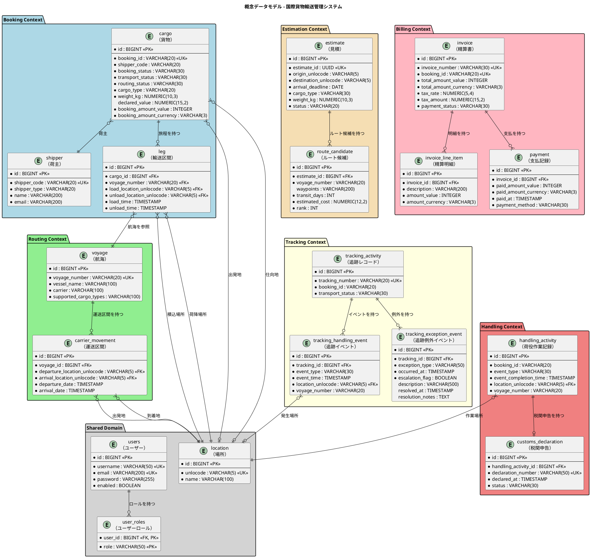
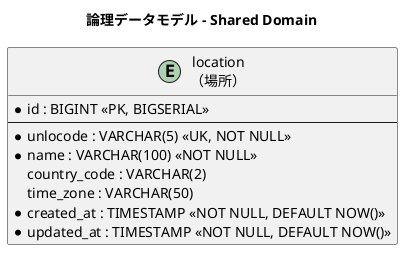
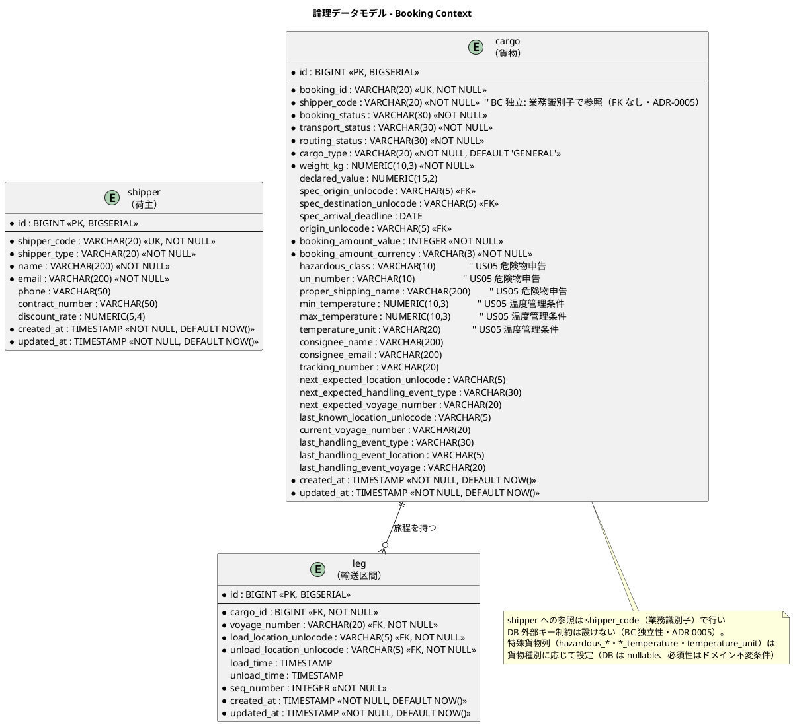
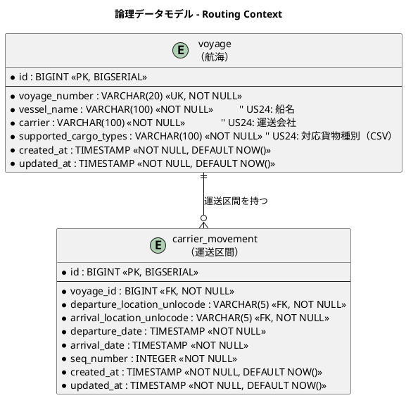
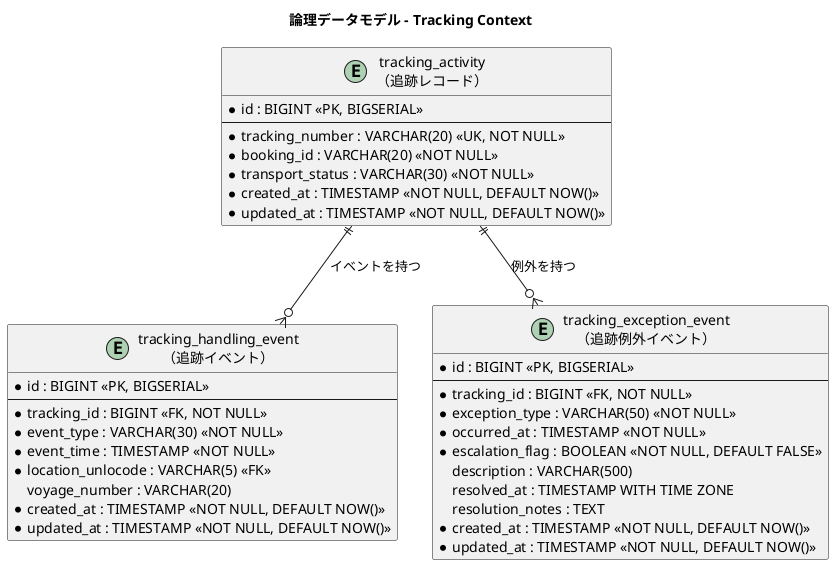
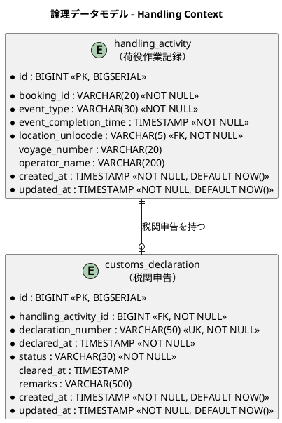
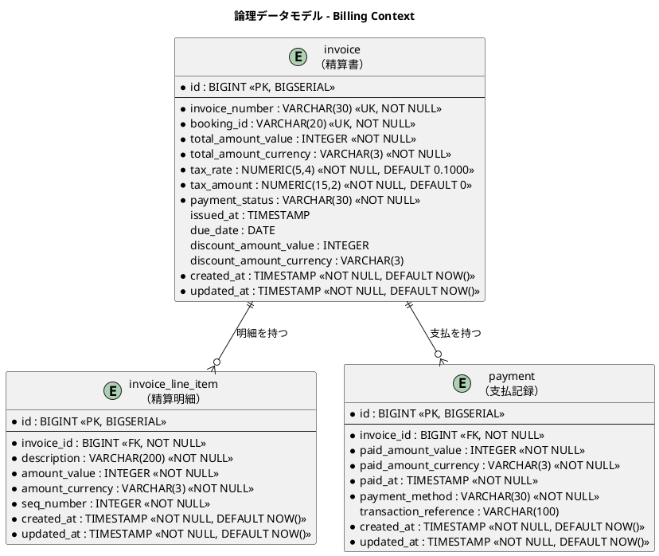
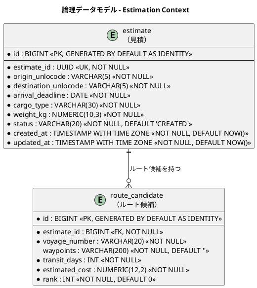
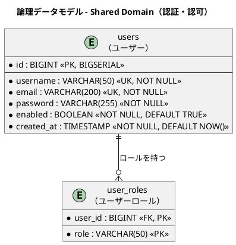

# データモデル設計 - 国際貨物輸送管理システム（Go 版）

## 概要

本ドキュメントは、国際貨物輸送管理システム（Go 移植版）の永続化層データモデルを定義します。
ドメインモデル分析で識別した 7 つの境界付けられたコンテキストと共有ドメイン（Shared Domain）に対応する 18 テーブルを設計します。
`shipper`（荷主）テーブルと、Shared Domain 配下のサポート領域である認証・認可用の `users` / `user_roles` テーブルを含みます。

### 設計方針

- **DB**: PostgreSQL 16.x（本番）、testcontainers-go による実 PostgreSQL（テスト）
- **DB アクセス**: sqlc（`query.sql` から型安全な Go コードを生成）+ pgx v5
- **マイグレーション**: golang-migrate（`000001_xxx.up.sql` / `000001_xxx.down.sql` 形式）
- **ID 戦略**: サロゲートキー（`BIGSERIAL`）+ 業務キー（`VARCHAR`）の併用
- **命名規則**: スネークケース（PostgreSQL 慣習）
- **監査カラム**: 全テーブルに `created_at` / `updated_at` を付与

---

## 概念データモデル

全コンテキストのエンティティとその主要リレーションシップを俯瞰します。



---

## 論理データモデル

### Shared Domain

共有ドメインとして全コンテキストが参照する場所マスタです。UN/LOCODE（国連貿易港コード）を業務キーとします。



---

### Booking Context

貨物の予約・旅程情報を管理します。`cargo` が集約ルートで、`leg` が旅程の各区間を表します。荷主は BC 独立性のため業務識別子 `shipper_code`（SHP-XXXXXX 形式）で参照し、DB 外部キー制約は設けません（ADR-0005）。



---

### Routing Context

航海スケジュールと運送区間を管理します。`voyage` が集約ルートで、`carrier_movement` が個々の移動区間を表します。



---

### Tracking Context

貨物追跡の状態・イベント・例外を管理します。`tracking_activity` が集約ルートです。



---

### Handling Context

荷役作業の実績と税関申告を管理します。`handling_activity` が集約ルートです。



---

### Billing Context

精算書・明細・支払記録を管理します。参考実装には存在しない新規コンテキストです。



---

### Estimation Context

輸送見積とルート候補を管理します。`estimate` が集約ルートで、`route_candidate` が各ルート候補を表します。



---

### Shared Domain（認証・認可）

Shared Domain 配下のサポート領域として、認証ミドルウェア（セッション / JWT）が利用するユーザー認証・認可テーブルを定義します。概念データモデルの Shared Domain パッケージ（`users` / `user_roles`）に対応します。



---

## テーブル定義

### `location`（場所マスタ）

| カラム名 | データ型 | 制約 | 説明 |
| :--- | :--- | :--- | :--- |
| `id` | `BIGINT` | `PK, NOT NULL` | サロゲートキー（BIGSERIAL） |
| `unlocode` | `VARCHAR(5)` | `UK, NOT NULL` | UN/LOCODE（業務キー。例: `JPTYO`） |
| `name` | `VARCHAR(100)` | `NOT NULL` | 場所名称（例: `Tokyo`） |
| `country_code` | `VARCHAR(2)` | | ISO 3166-1 alpha-2 国コード |
| `time_zone` | `VARCHAR(50)` | | タイムゾーン（例: `Asia/Tokyo`） |
| `created_at` | `TIMESTAMP WITH TIME ZONE` | `NOT NULL, DEFAULT NOW()` | レコード作成日時 |
| `updated_at` | `TIMESTAMP WITH TIME ZONE` | `NOT NULL, DEFAULT NOW()` | レコード更新日時 |

---

### `shipper`（荷主）

> **注記**: 旧設計で `cargo` テーブルに存在した `shipper_name`・`shipper_email` カラムは本テーブルへの正規化に伴い削除しました。

| カラム名 | データ型 | 制約 | 説明 |
| :--- | :--- | :--- | :--- |
| `id` | `BIGINT` | `PK, NOT NULL` | サロゲートキー（BIGSERIAL） |
| `shipper_code` | `VARCHAR(20)` | `UK, NOT NULL` | 荷主コード（業務キー。SHP-XXXXXX 形式） |
| `shipper_type` | `VARCHAR(20)` | `NOT NULL` | 荷主種別（`INDIVIDUAL` / `CORPORATE`） |
| `name` | `VARCHAR(200)` | `NOT NULL` | 荷主名称 |
| `email` | `VARCHAR(200)` | `NOT NULL` | メールアドレス |
| `phone` | `VARCHAR(50)` | | 電話番号 |
| `address` | `VARCHAR(500)` | | 住所（オプション） |
| `contract_number` | `VARCHAR(50)` | | 契約番号（法人のみ。NULLable） |
| `discount_rate` | `NUMERIC(5,4)` | `DEFAULT 0.0000, CHECK (discount_rate BETWEEN 0.0000 AND 0.3000)` | 割引率（0.0000〜0.3000、最大 30%） |
| `created_at` | `TIMESTAMP WITH TIME ZONE` | `NOT NULL, DEFAULT NOW()` | レコード作成日時 |
| `updated_at` | `TIMESTAMP WITH TIME ZONE` | `NOT NULL, DEFAULT NOW()` | レコード更新日時 |

#### DDL

```sql
CREATE TABLE shipper (
    id              BIGSERIAL PRIMARY KEY,
    shipper_code    VARCHAR(20)  NOT NULL UNIQUE,  -- SHP-XXXXXX 形式
    shipper_type    VARCHAR(20)  NOT NULL,          -- INDIVIDUAL / CORPORATE
    name            VARCHAR(200) NOT NULL,
    email           VARCHAR(200) NOT NULL,
    phone           VARCHAR(50),
    address         VARCHAR(500),                  -- 住所（オプション）
    contract_number VARCHAR(50),                   -- 法人のみ（NULLable）
    discount_rate   NUMERIC(5,4) DEFAULT 0.0000
                    CHECK (discount_rate BETWEEN 0.0000 AND 0.3000),  -- 0.0000〜0.3000 (最大 30%)
    created_at      TIMESTAMP WITH TIME ZONE NOT NULL DEFAULT NOW(),
    updated_at      TIMESTAMP WITH TIME ZONE NOT NULL DEFAULT NOW()
);
```

---

### `cargo`（貨物）

> **注記**: `shipper_name`・`shipper_email` カラムは削除し、荷主参照は業務識別子 `shipper_code`（SHP-XXXXXX 形式）に変更しました。BC 独立性のため DB 外部キー制約は設けません（ADR-0005）。
>
> 将来フェーズで追加予定のカラム（`transport_status`・`consignee_*`・`tracking_number` 等）は下表の「将来追加予定」節に記載します。`routing_status` は IT4（US09）で追加済み（migration 000009）。

| カラム名 | データ型 | 制約 | 説明 |
| :--- | :--- | :--- | :--- |
| `id` | `BIGINT` | `PK, NOT NULL` | サロゲートキー（`BIGINT GENERATED BY DEFAULT AS IDENTITY`） |
| `booking_id` | `VARCHAR(20)` | `UK, NOT NULL` | 予約 ID（業務キー。例: `BKG-YYYYMMDD-NNNN`） |
| `shipper_code` | `VARCHAR(20)` | `NOT NULL` | 荷主参照コード（業務キー。SHP-XXXXXX。FK なし・ADR-0005） |
| `cargo_type` | `VARCHAR(30)` | `NOT NULL` | 貨物種別（`GENERAL` / `HAZARDOUS` / `REFRIGERATED`） |
| `weight_kg` | `NUMERIC(10,3)` | `NOT NULL, > 0` | 重量（kg） |
| `origin_unlocode` | `VARCHAR(5)` | `NOT NULL` | 出発地（RouteSpecification） |
| `destination_unlocode` | `VARCHAR(5)` | `NOT NULL` | 仕向地（RouteSpecification） |
| `arrival_deadline` | `DATE` | `NOT NULL` | 到着期限（RouteSpecification） |
| `booking_status` | `VARCHAR(30)` | `NOT NULL, DEFAULT 'PRELIMINARY'` | 予約状態（BookingStatus 列挙値） |
| `routing_status` | `VARCHAR(20)` | `NOT NULL, DEFAULT 'NOT_ROUTED'` | 経路決定状態（`NOT_ROUTED` / `ROUTED` / `MISROUTED`）。US09 で ROUTED に更新（migration 000009） |
| `dimension_length` | `NUMERIC(10,3)` | | 貨物の長さ（cm、オプション） |
| `dimension_width` | `NUMERIC(10,3)` | | 貨物の幅（cm、オプション） |
| `dimension_height` | `NUMERIC(10,3)` | | 貨物の高さ（cm、オプション） |
| `quantity` | `INTEGER` | | 貨物個数（オプション、1 以上） |
| `description` | `VARCHAR(500)` | | 品名（オプション） |
| `hazardous_class` | `VARCHAR(10)` | | 危険物クラス（HAZARDOUS 時のみ） |
| `un_number` | `VARCHAR(10)` | | UN 番号（HAZARDOUS 時のみ） |
| `proper_shipping_name` | `VARCHAR(200)` | | 正式輸送品名（HAZARDOUS 時のみ） |
| `min_temperature` | `NUMERIC(10,3)` | | 最低温度（REFRIGERATED 時のみ） |
| `max_temperature` | `NUMERIC(10,3)` | | 最高温度（REFRIGERATED 時のみ） |
| `temperature_unit` | `VARCHAR(20)` | | 温度単位（`CELSIUS` / `FAHRENHEIT`、REFRIGERATED 時のみ） |
| `created_at` | `TIMESTAMP WITH TIME ZONE` | `NOT NULL, DEFAULT NOW()` | レコード作成日時 |
| `updated_at` | `TIMESTAMP WITH TIME ZONE` | `NOT NULL, DEFAULT NOW()` | レコード更新日時 |

#### 将来追加予定カラム

| カラム名 | データ型 | 説明 | 追加フェーズ |
| :--- | :--- | :--- | :--- |
| `transport_status` | `VARCHAR(30)` | 輸送状態（TransportStatus 列挙値） | Tracking Context 実装時 |
| `booking_amount_value` | `INTEGER` | 予約金額（最小通貨単位） | Billing Context 実装時 |
| `booking_amount_currency` | `VARCHAR(3)` | 通貨コード（ISO 4217） | Billing Context 実装時 |
| `consignee_name` | `VARCHAR(200)` | 荷受人名 | 荷受人管理実装時 |
| `consignee_email` | `VARCHAR(200)` | 荷受人メールアドレス | 荷受人管理実装時 |
| `tracking_number` | `VARCHAR(20)` | 追跡番号（発行後に設定） | Tracking Context 実装時 |
| `next_expected_*` | 各種 | 次の予定荷役情報 | Tracking Context 実装時 |
| `last_handling_event_*` | 各種 | 最後の荷役イベント情報 | Handling Context 実装時 |

---

### `leg`（輸送区間）

| カラム名 | データ型 | 制約 | 説明 |
| :--- | :--- | :--- | :--- |
| `id` | `BIGINT` | `PK, NOT NULL` | サロゲートキー（BIGSERIAL） |
| `cargo_id` | `BIGINT` | `FK → cargo.id, NOT NULL` | 親貨物 ID |
| `voyage_number` | `VARCHAR(20)` | `FK → voyage.voyage_number, NOT NULL` | 航海番号 |
| `load_location_unlocode` | `VARCHAR(5)` | `FK → location.unlocode, NOT NULL` | 積込場所（UN/LOCODE） |
| `unload_location_unlocode` | `VARCHAR(5)` | `FK → location.unlocode, NOT NULL` | 荷降場所（UN/LOCODE） |
| `load_time` | `TIMESTAMP` | | 積込予定日時 |
| `unload_time` | `TIMESTAMP` | | 荷降予定日時 |
| `seq_number` | `INTEGER` | `NOT NULL` | 区間順序（1 始まり） |
| `created_at` | `TIMESTAMP` | `NOT NULL, DEFAULT NOW()` | レコード作成日時 |
| `updated_at` | `TIMESTAMP` | `NOT NULL, DEFAULT NOW()` | レコード更新日時 |

---

### `notification`（確定経路の荷主通知記録）

US12（確定経路を荷主に通知する）の送信記録。荷主参照は BC 独立性のため業務識別子 `shipper_code` で保持する（FK なし・ADR-0005）。実送信は `NotificationPort`（booking/application の出力ポート・ログ実装）で抽象化し、本テーブルには送信記録を残す（migration 000011）。

| カラム名 | データ型 | 制約 | 説明 |
| :--- | :--- | :--- | :--- |
| `id` | `BIGINT` | `PK, NOT NULL` | サロゲートキー（BIGSERIAL） |
| `cargo_id` | `BIGINT` | `FK → cargo.id, NOT NULL` | 親貨物 ID（CASCADE 削除） |
| `shipper_code` | `VARCHAR(20)` | `NOT NULL` | 宛先荷主コード（業務キー・FK なし） |
| `summary` | `VARCHAR(500)` | `NOT NULL` | 通知内容サマリ（経由港・所要日数・到着予定日・料金概算） |
| `sent_at` | `TIMESTAMP` | `NOT NULL` | 送信日時 |
| `created_at` | `TIMESTAMP` | `NOT NULL, DEFAULT NOW()` | レコード作成日時 |

---

### `voyage`（航海）

| カラム名 | データ型 | 制約 | 説明 |
| :--- | :--- | :--- | :--- |
| `id` | `BIGINT` | `PK, NOT NULL` | サロゲートキー（BIGSERIAL） |
| `voyage_number` | `VARCHAR(20)` | `UK, NOT NULL` | 航海番号（業務キー） |
| `vessel_name` | `VARCHAR(100)` | `NOT NULL` | 船名（US24） |
| `carrier` | `VARCHAR(100)` | `NOT NULL` | 運送会社（US24） |
| `supported_cargo_types` | `VARCHAR(100)` | `NOT NULL` | 対応貨物種別（CSV 例: `GENERAL,REFRIGERATED`。US07 の絞り込みに使用。ADR-0006） |
| `created_at` | `TIMESTAMP` | `NOT NULL, DEFAULT NOW()` | レコード作成日時 |
| `updated_at` | `TIMESTAMP` | `NOT NULL, DEFAULT NOW()` | レコード更新日時 |

---

### `carrier_movement`（運送区間）

| カラム名 | データ型 | 制約 | 説明 |
| :--- | :--- | :--- | :--- |
| `id` | `BIGINT` | `PK, NOT NULL` | サロゲートキー（BIGSERIAL） |
| `voyage_id` | `BIGINT` | `FK → voyage.id, NOT NULL` | 親航海 ID |
| `departure_location_unlocode` | `VARCHAR(5)` | `FK → location.unlocode, NOT NULL` | 出発地（UN/LOCODE） |
| `arrival_location_unlocode` | `VARCHAR(5)` | `FK → location.unlocode, NOT NULL` | 到着地（UN/LOCODE） |
| `departure_date` | `TIMESTAMP` | `NOT NULL` | 出発日時 |
| `arrival_date` | `TIMESTAMP` | `NOT NULL` | 到着日時 |
| `seq_number` | `INTEGER` | `NOT NULL` | 区間順序（1 始まり） |
| `created_at` | `TIMESTAMP` | `NOT NULL, DEFAULT NOW()` | レコード作成日時 |
| `updated_at` | `TIMESTAMP` | `NOT NULL, DEFAULT NOW()` | レコード更新日時 |

---

### `tracking_activity`（追跡レコード）

| カラム名 | データ型 | 制約 | 説明 |
| :--- | :--- | :--- | :--- |
| `id` | `BIGINT` | `PK, NOT NULL` | サロゲートキー（BIGSERIAL） |
| `tracking_number` | `VARCHAR(20)` | `UK, NOT NULL` | 追跡番号（業務キー） |
| `booking_id` | `VARCHAR(20)` | `NOT NULL` | 予約 ID（参照整合性は書き込み側で保証） |
| `transport_status` | `VARCHAR(30)` | `NOT NULL` | 輸送状態（TransportStatus 列挙値） |
| `created_at` | `TIMESTAMP` | `NOT NULL, DEFAULT NOW()` | レコード作成日時 |
| `updated_at` | `TIMESTAMP` | `NOT NULL, DEFAULT NOW()` | レコード更新日時 |

---

### `tracking_handling_event`（追跡イベント）

| カラム名 | データ型 | 制約 | 説明 |
| :--- | :--- | :--- | :--- |
| `id` | `BIGINT` | `PK, NOT NULL` | サロゲートキー（BIGSERIAL） |
| `tracking_id` | `BIGINT` | `FK → tracking_activity.id, NOT NULL` | 親追跡レコード ID |
| `event_type` | `VARCHAR(30)` | `NOT NULL` | 荷役タイプ（HandlingType 列挙値） |
| `event_time` | `TIMESTAMP` | `NOT NULL` | イベント発生日時 |
| `location_unlocode` | `VARCHAR(5)` | `FK → location.unlocode` | イベント発生場所（UN/LOCODE） |
| `voyage_number` | `VARCHAR(20)` | | 関連する航海番号 |
| `created_at` | `TIMESTAMP` | `NOT NULL, DEFAULT NOW()` | レコード作成日時 |
| `updated_at` | `TIMESTAMP` | `NOT NULL, DEFAULT NOW()` | レコード更新日時 |

---

### `tracking_exception_event`（追跡例外イベント）

| カラム名 | データ型 | 制約 | 説明 |
| :--- | :--- | :--- | :--- |
| `id` | `BIGINT` | `PK, NOT NULL` | サロゲートキー（BIGSERIAL） |
| `tracking_id` | `BIGINT` | `FK → tracking_activity.id, NOT NULL` | 親追跡レコード ID |
| `exception_type` | `VARCHAR(50)` | `NOT NULL` | 例外種別（例: `CUSTOMS_HOLD`, `DAMAGE`, `DELAY`） |
| `occurred_at` | `TIMESTAMP WITH TIME ZONE` | `NOT NULL` | 例外発生日時 |
| `escalation_flag` | `BOOLEAN` | `NOT NULL, DEFAULT FALSE` | エスカレーション判定フラグ（US15 紛失時） |
| `description` | `VARCHAR(500)` | | 例外内容の詳細 |
| `resolved_at` | `TIMESTAMP WITH TIME ZONE` | | 解決日時（NULL = 未解決） |
| `resolution_notes` | `TEXT` | | 対応内容メモ |
| `created_at` | `TIMESTAMP WITH TIME ZONE` | `NOT NULL, DEFAULT NOW()` | レコード作成日時 |
| `updated_at` | `TIMESTAMP WITH TIME ZONE` | `NOT NULL, DEFAULT NOW()` | レコード更新日時 |

---

### `handling_activity`（荷役作業記録）

| カラム名 | データ型 | 制約 | 説明 |
| :--- | :--- | :--- | :--- |
| `id` | `BIGINT` | `PK, NOT NULL` | サロゲートキー（BIGSERIAL） |
| `booking_id` | `VARCHAR(20)` | `NOT NULL` | 予約 ID（参照整合性は書き込み側で保証） |
| `event_type` | `VARCHAR(30)` | `NOT NULL` | 荷役タイプ（RECEIVE / LOAD / UNLOAD / CUSTOMS / CLAIM） |
| `event_completion_time` | `TIMESTAMP` | `NOT NULL` | 荷役完了日時 |
| `location_unlocode` | `VARCHAR(5)` | `FK → location.unlocode, NOT NULL` | 作業場所（UN/LOCODE） |
| `voyage_number` | `VARCHAR(20)` | | 関連する航海番号（LOAD / UNLOAD 時に設定） |
| `consignee_confirmation` | `VARCHAR(200)` | | 荷受人確認（署名または確認コード。CLAIM 時に必須・US16・IT6 注3） |
| `operator_name` | `VARCHAR(200)` | | 作業員名 |
| `created_at` | `TIMESTAMP` | `NOT NULL, DEFAULT NOW()` | レコード作成日時 |

---

### `customs_declaration`（税関申告）

| カラム名 | データ型 | 制約 | 説明 |
| :--- | :--- | :--- | :--- |
| `id` | `BIGINT` | `PK, NOT NULL` | サロゲートキー（BIGSERIAL） |
| `handling_activity_id` | `BIGINT` | `FK → handling_activity.id, NOT NULL` | 関連荷役作業 ID |
| `declaration_number` | `VARCHAR(50)` | `UK, NOT NULL` | 申告番号（業務キー） |
| `declared_at` | `TIMESTAMP` | `NOT NULL` | 申告日時 |
| `status` | `VARCHAR(30)` | `NOT NULL` | 申告状態（例: `PENDING`, `CLEARED`, `HELD`） |
| `cleared_at` | `TIMESTAMP` | | 通関完了日時（NULL = 未完了） |
| `remarks` | `VARCHAR(500)` | | 備考・メモ |
| `created_at` | `TIMESTAMP` | `NOT NULL, DEFAULT NOW()` | レコード作成日時 |
| `updated_at` | `TIMESTAMP` | `NOT NULL, DEFAULT NOW()` | レコード更新日時 |

---

### `invoice`（精算書）

| カラム名 | データ型 | 制約 | 説明 |
| :--- | :--- | :--- | :--- |
| `id` | `BIGINT` | `PK, NOT NULL` | サロゲートキー（BIGSERIAL） |
| `invoice_number` | `VARCHAR(30)` | `UK, NOT NULL` | 精算書番号（業務キー） |
| `booking_id` | `VARCHAR(20)` | `UK, NOT NULL` | 予約 ID（UNIQUE 制約で二重請求を防止） |
| `total_amount_value` | `INTEGER` | `NOT NULL` | 合計金額（最小通貨単位） |
| `total_amount_currency` | `VARCHAR(3)` | `NOT NULL` | 通貨コード（ISO 4217） |
| `tax_rate` | `NUMERIC(5,4)` | `NOT NULL, DEFAULT 0.1000` | 消費税率（デフォルト 10%） |
| `tax_amount` | `NUMERIC(15,2)` | `NOT NULL, DEFAULT 0` | 消費税額 |
| `payment_status` | `VARCHAR(30)` | `NOT NULL` | 支払状態（`PENDING` / `CONFIRMED` / `OVERDUE` / `REFUNDED`） |
| `issued_at` | `TIMESTAMP WITH TIME ZONE` | | 発行日時 |
| `due_date` | `DATE` | | 支払期日 |
| `discount_amount_value` | `INTEGER` | | 割引金額（最小通貨単位） |
| `discount_amount_currency` | `VARCHAR(3)` | | 割引通貨コード |
| `created_at` | `TIMESTAMP WITH TIME ZONE` | `NOT NULL, DEFAULT NOW()` | レコード作成日時 |
| `updated_at` | `TIMESTAMP WITH TIME ZONE` | `NOT NULL, DEFAULT NOW()` | レコード更新日時 |

---

### `invoice_line_item`（精算明細）

| カラム名 | データ型 | 制約 | 説明 |
| :--- | :--- | :--- | :--- |
| `id` | `BIGINT` | `PK, NOT NULL` | サロゲートキー（BIGSERIAL） |
| `invoice_id` | `BIGINT` | `FK → invoice.id, NOT NULL` | 親精算書 ID |
| `description` | `VARCHAR(200)` | `NOT NULL` | 明細項目説明 |
| `amount_value` | `INTEGER` | `NOT NULL` | 明細金額（最小通貨単位） |
| `amount_currency` | `VARCHAR(3)` | `NOT NULL` | 通貨コード（ISO 4217） |
| `seq_number` | `INTEGER` | `NOT NULL` | 明細順序（1 始まり） |
| `created_at` | `TIMESTAMP` | `NOT NULL, DEFAULT NOW()` | レコード作成日時 |
| `updated_at` | `TIMESTAMP` | `NOT NULL, DEFAULT NOW()` | レコード更新日時 |

---

### `payment`（支払記録）

| カラム名 | データ型 | 制約 | 説明 |
| :--- | :--- | :--- | :--- |
| `id` | `BIGINT` | `PK, NOT NULL` | サロゲートキー（BIGSERIAL） |
| `invoice_id` | `BIGINT` | `FK → invoice.id, NOT NULL` | 親精算書 ID |
| `paid_amount_value` | `INTEGER` | `NOT NULL` | 支払金額（最小通貨単位） |
| `paid_amount_currency` | `VARCHAR(3)` | `NOT NULL` | 通貨コード（ISO 4217） |
| `paid_at` | `TIMESTAMP` | `NOT NULL` | 支払日時 |
| `payment_method` | `VARCHAR(30)` | `NOT NULL` | 支払方法（例: `BANK_TRANSFER`, `CREDIT_CARD`） |
| `transaction_reference` | `VARCHAR(100)` | | 取引参照番号（外部決済システムの ID） |
| `created_at` | `TIMESTAMP WITH TIME ZONE` | `NOT NULL, DEFAULT NOW()` | レコード作成日時 |
| `updated_at` | `TIMESTAMP WITH TIME ZONE` | `NOT NULL, DEFAULT NOW()` | レコード更新日時 |

---

### `users`（ユーザー）

認証ミドルウェアが参照するユーザー認証テーブルです。パスワードは Go の `golang.org/x/crypto/bcrypt` でハッシュ化して保存します。

| カラム名 | データ型 | 制約 | 説明 |
| :--- | :--- | :--- | :--- |
| `id` | `BIGINT` | `PK, NOT NULL` | サロゲートキー（BIGSERIAL） |
| `username` | `VARCHAR(50)` | `UK, NOT NULL` | ログイン名 |
| `email` | `VARCHAR(200)` | `UK, NOT NULL` | メールアドレス |
| `password` | `VARCHAR(255)` | `NOT NULL` | パスワード（bcrypt ハッシュ） |
| `enabled` | `BOOLEAN` | `NOT NULL, DEFAULT TRUE` | アカウント有効フラグ |
| `created_at` | `TIMESTAMP WITH TIME ZONE` | `NOT NULL, DEFAULT NOW()` | レコード作成日時 |

#### DDL

```sql
CREATE TABLE users (
    id           BIGSERIAL PRIMARY KEY,
    username     VARCHAR(50)  NOT NULL UNIQUE,
    email        VARCHAR(200) NOT NULL UNIQUE,
    password     VARCHAR(255) NOT NULL,  -- bcrypt ハッシュ
    enabled      BOOLEAN NOT NULL DEFAULT TRUE,
    created_at   TIMESTAMP WITH TIME ZONE NOT NULL DEFAULT NOW()
);
```

---

### `user_roles`（ユーザーロール）

| カラム名 | データ型 | 制約 | 説明 |
| :--- | :--- | :--- | :--- |
| `user_id` | `BIGINT` | `PK, FK → users.id, NOT NULL` | 親ユーザー ID |
| `role` | `VARCHAR(50)` | `PK, NOT NULL` | ロール名（`ROLE_ADMIN` / `ROLE_OPERATOR` / `ROLE_SHIPPER` 等） |

#### DDL

```sql
CREATE TABLE user_roles (
    user_id  BIGINT      NOT NULL REFERENCES users(id),
    role     VARCHAR(50) NOT NULL,  -- ROLE_ADMIN / ROLE_OPERATOR / ROLE_SHIPPER 等
    PRIMARY KEY (user_id, role)
);
```

---

### `estimate`（見積）

| カラム名 | データ型 | 制約 | 説明 |
| :--- | :--- | :--- | :--- |
| `id` | `BIGINT` | `PK, NOT NULL` | サロゲートキー（`GENERATED BY DEFAULT AS IDENTITY`） |
| `estimate_id` | `UUID` | `UK, NOT NULL` | 見積 ID（業務キー） |
| `origin_unlocode` | `VARCHAR(5)` | `NOT NULL` | 出発地（UN/LOCODE） |
| `destination_unlocode` | `VARCHAR(5)` | `NOT NULL` | 仕向地（UN/LOCODE） |
| `arrival_deadline` | `DATE` | `NOT NULL` | 到着期限 |
| `cargo_type` | `VARCHAR(30)` | `NOT NULL` | 貨物種別（`GENERAL` / `HAZARDOUS` / `REFRIGERATED`） |
| `weight_kg` | `NUMERIC(10,3)` | `NOT NULL` | 重量（kg） |
| `status` | `VARCHAR(20)` | `NOT NULL, DEFAULT 'CREATED'` | 見積状態（`CREATED` / `EXPIRED`） |
| `created_at` | `TIMESTAMP WITH TIME ZONE` | `NOT NULL, DEFAULT NOW()` | レコード作成日時 |
| `updated_at` | `TIMESTAMP WITH TIME ZONE` | `NOT NULL, DEFAULT NOW()` | レコード更新日時 |

#### DDL

```sql
CREATE TABLE estimate (
    id                    BIGINT GENERATED BY DEFAULT AS IDENTITY PRIMARY KEY,
    estimate_id           UUID NOT NULL UNIQUE,
    origin_unlocode       VARCHAR(5) NOT NULL,
    destination_unlocode  VARCHAR(5) NOT NULL,
    arrival_deadline      DATE NOT NULL,
    cargo_type            VARCHAR(30) NOT NULL,
    weight_kg             NUMERIC(10, 3) NOT NULL,
    status                VARCHAR(20) NOT NULL DEFAULT 'CREATED',
    created_at            TIMESTAMP WITH TIME ZONE NOT NULL DEFAULT NOW(),
    updated_at            TIMESTAMP WITH TIME ZONE NOT NULL DEFAULT NOW()
);
```

---

### `route_candidate`（ルート候補）

| カラム名 | データ型 | 制約 | 説明 |
| :--- | :--- | :--- | :--- |
| `id` | `BIGINT` | `PK, NOT NULL` | サロゲートキー（`GENERATED BY DEFAULT AS IDENTITY`） |
| `estimate_id` | `BIGINT` | `FK → estimate.id, NOT NULL` | 親見積 ID（CASCADE 削除） |
| `voyage_number` | `VARCHAR(20)` | `NOT NULL` | 航海番号（複数区間は `+` 連結表記） |
| `waypoints` | `VARCHAR(200)` | `NOT NULL, DEFAULT ''` | 経由港（UN/LOCODE の CSV、直行時は空。migration 000010） |
| `transit_days` | `INT` | `NOT NULL` | 輸送日数 |
| `estimated_cost` | `NUMERIC(12,2)` | `NOT NULL` | 見積コスト |
| `rank` | `INT` | `NOT NULL, DEFAULT 0` | ルート候補の優先順位 |

#### DDL

```sql
CREATE TABLE route_candidate (
    id              BIGINT GENERATED BY DEFAULT AS IDENTITY PRIMARY KEY,
    estimate_id     BIGINT NOT NULL REFERENCES estimate(id) ON DELETE CASCADE,
    voyage_number   VARCHAR(20) NOT NULL,
    waypoints       VARCHAR(200) NOT NULL DEFAULT '',
    transit_days    INT NOT NULL,
    estimated_cost  NUMERIC(12, 2) NOT NULL,
    rank            INT NOT NULL DEFAULT 0
);
```

---

## PostgreSQL 型と Go 型のマッピング

sqlc（`sql_package: "pgx/v5"`）で生成されるモデルの型対応を以下に示します。

| PostgreSQL 型 | Go 型（NOT NULL） | Go 型（NULLable） | 備考 |
| :--- | :--- | :--- | :--- |
| `BIGINT` / `BIGSERIAL` | `int64` | `pgtype.Int8` | サロゲートキー・FK |
| `INTEGER` | `int32` | `pgtype.Int4` | 金額（最小通貨単位）・順序 |
| `VARCHAR` / `TEXT` | `string` | `pgtype.Text` | 業務キー・列挙値・名称 |
| `BOOLEAN` | `bool` | `pgtype.Bool` | フラグ |
| `NUMERIC` | `pgtype.Numeric` | `pgtype.Numeric` | 重量・税率など精度が必要な数値 |
| `DATE` | `pgtype.Date` | `pgtype.Date` | 到着期限・支払期日 |
| `TIMESTAMP` | `pgtype.Timestamp` | `pgtype.Timestamp` | ローカル日時 |
| `TIMESTAMP WITH TIME ZONE` | `time.Time` | `pgtype.Timestamptz` | 監査カラム・イベント日時 |
| `UUID` | `uuid.UUID` | `pgtype.UUID` | `overrides` で `github.com/google/uuid` にマッピング |

列挙値（`BookingStatus` / `TransportStatus` / `HandlingType` 等）はドメイン層で `type BookingStatus string` として定義し、DB 上は `VARCHAR(30)` に文字列として保存します。

---

## sqlc によるデータアクセス

### 構成

```
internal/infrastructure/persistence/
  sqlc.yaml            # sqlc 設定
  schema/              # golang-migrate のマイグレーション（スキーマ定義の入力）
  queries/
    cargo.sql          # コンテキストごとのクエリ定義
    shipper.sql
    ...
  gen/                 # sqlc が生成する型安全な Go コード（編集禁止）
    models.go
    cargo.sql.go
    ...
```

### `sqlc.yaml` の例

```yaml
version: "2"
sql:
  - engine: "postgresql"
    schema: "db/migrations"
    queries: "internal/infrastructure/persistence/queries"
    gen:
      go:
        package: "gen"
        out: "internal/infrastructure/persistence/gen"
        sql_package: "pgx/v5"
        emit_json_tags: false
        overrides:
          - db_type: "uuid"
            go_type: "github.com/google/uuid.UUID"
```

### クエリ定義の例（`queries/shipper.sql`）

```sql
-- name: GetShipperByCode :one
SELECT * FROM shipper
WHERE shipper_code = $1;

-- name: CreateShipper :one
INSERT INTO shipper (
    shipper_code, shipper_type, name, email, phone, contract_number, discount_rate
) VALUES (
    $1, $2, $3, $4, $5, $6, $7
)
RETURNING *;

-- name: UpdateShipper :exec
UPDATE shipper
SET name = $2,
    email = $3,
    phone = $4,
    updated_at = NOW()
WHERE shipper_code = $1;
```

### リポジトリ実装の例

```go
type ShipperRepository struct {
	queries *gen.Queries
}

func NewShipperRepository(pool *pgxpool.Pool) *ShipperRepository {
	return &ShipperRepository{queries: gen.New(pool)}
}

func (r *ShipperRepository) FindByCode(ctx context.Context, code string) (*booking.Shipper, error) {
	row, err := r.queries.GetShipperByCode(ctx, code)
	if err != nil {
		if errors.Is(err, pgx.ErrNoRows) {
			return nil, booking.ErrShipperNotFound
		}
		return nil, fmt.Errorf("find shipper by code: %w", err)
	}
	return toDomainShipper(row), nil
}
```

---

## 設計上の判断

### 1. サロゲートキーと業務キーの併用

**判断**: 全テーブルに `BIGSERIAL` のサロゲートキー（`id`）を設け、業務上の識別子（`booking_id`、`voyage_number`、`unlocode` 等）には `UNIQUE` 制約を付与します。

**根拠**: 外部キー参照を `BIGINT` に統一することでインデックス効率が向上します。業務キーはドメインモデルの一部であり、別途管理することで業務ルールの変更に対応しやすくなります。

---

### 2. `location` テーブルへの参照方式

**判断**: 参考実装では `VARCHAR` で場所 ID を文字列管理していましたが、本設計では `location.unlocode` を外部キーとして参照します。

**根拠**: UN/LOCODE は国際標準の 5 文字コードであり、それ自体が意味を持つ自然キーです。文字列参照でも JOIN 効率は許容範囲内であり、可読性が高まります。

---

### 3. 金額の表現（`INTEGER` + `VARCHAR(3)`）

**判断**: 金額を `INTEGER`（最小通貨単位）と `VARCHAR(3)`（ISO 4217 通貨コード）の 2 カラムで表現します。`NUMERIC` / `DECIMAL` は使用しません。

**根拠**: 浮動小数点演算による精度誤差を排除するため、円・セントなど最小通貨単位で整数管理します。複数通貨対応のため通貨コードを常に付随させます。これはドメインモデルの `MoneyAmount` 値オブジェクト（Go では `int64` の金額と通貨コードを持つ struct）に対応します。

---

### 4. 列挙値のカラム型（`VARCHAR(30)`）

**判断**: `BookingStatus`、`TransportStatus`、`HandlingType` 等の列挙型カラムは `VARCHAR(30)` で表現し、PostgreSQL の `ENUM` 型は使用しません。

**根拠**: PostgreSQL `ENUM` 型は値の追加・変更にスキーマ ALTER が必要でマイグレーション時のリスクが高くなります。`VARCHAR` ならば golang-migrate のマイグレーションで CHECK 制約を追加・変更するだけで済みます。Go 側では `type BookingStatus string` の定義と検証関数で不正値を防ぎます。

---

### 5. コンテキスト間の参照整合性

**判断**: 異なるコンテキスト間（例: `handling_activity.booking_id` → `cargo.booking_id`）には DB 外部キー制約を設けません。コンテキスト内の参照（例: `leg.cargo_id` → `cargo.id`）には外部キー制約を設けます。

**根拠**: DDD の境界付けられたコンテキスト間はイベント連携を前提とする疎結合設計であり、DB 外部キーによる強結合は将来のサービス分割を妨げます。整合性はアプリケーション層で保証します。

---

### 6. `Billing Context` の新規設計

**判断**: 参考実装（Jakarta EE）には `Billing Context` が存在しませんでしたが、本設計では `invoice`・`invoice_line_item`・`payment` の 3 テーブルを新規追加します。

**根拠**: ドメインモデル分析で識別した `SETTLED`（BookingStatus）と `Invoice` エンティティを実現するために必要です。経理担当者のユースケース（精算書生成・支払確認）を支える永続化構造として設計しました。

---

### 7. 監査カラムの全テーブル付与

**判断**: `created_at`・`updated_at` を全テーブルに `NOT NULL DEFAULT NOW()` で付与します。`updated_at` の更新は sqlc のクエリ定義（UPDATE 文）で `NOW()` をセットします。

**根拠**: 国際貨物輸送は規制上の監査要件が高く、全レコードの作成・更新タイムスタンプが必要です。PostgreSQL のトリガーで自動更新する方法もありますが、クエリ定義に明示することで挙動が追跡しやすく、テスト（testcontainers-go の実 PostgreSQL）でも同一の挙動を検証できます。

---

### 8. テスト DB 戦略（testcontainers-go）

**判断**: テストではインメモリ DB（H2 相当）を使わず、testcontainers-go で起動した実 PostgreSQL コンテナに golang-migrate で全マイグレーションを適用して検証します。

**根拠**: 本番と同一の PostgreSQL を使うことで、方言差異（`BIGSERIAL`・`NUMERIC`・`TIMESTAMP WITH TIME ZONE` 等）による偽陰性・偽陽性を排除できます。Go では H2 のような組み込み互換 DB が存在しないため、コンテナベースの統合テストが標準的な選択です。

```go
func setupTestDB(t *testing.T) *pgxpool.Pool {
	ctx := context.Background()
	container, err := postgres.Run(ctx,
		"postgres:16-alpine",
		postgres.WithDatabase("cargo_tracker_test"),
		postgres.BasicWaitStrategies(),
	)
	testcontainers.CleanupContainer(t, container)
	require.NoError(t, err)

	dsn, err := container.ConnectionString(ctx, "sslmode=disable")
	require.NoError(t, err)

	m, err := migrate.New("file://../../db/migrations", dsn)
	require.NoError(t, err)
	require.NoError(t, m.Up())

	pool, err := pgxpool.New(ctx, dsn)
	require.NoError(t, err)
	t.Cleanup(pool.Close)
	return pool
}
```

---

## golang-migrate マイグレーション方針

### ファイル命名規則

```
db/migrations/
  000001_init.up.sql             # 初期スキーマ全テーブル作成
  000001_init.down.sql           # 初期スキーマのロールバック
  000002_seed_locations.up.sql   # 初期 UN/LOCODE マスタデータ
  000002_seed_locations.down.sql
  000003_add_xxx.up.sql          # 機能追加に伴うスキーマ変更
  000003_add_xxx.down.sql
```

### マイグレーションルール

- バージョン番号は 6 桁ゼロ埋めの連番とし、番号の欠番を作りません
- 適用済みマイグレーションファイルの編集は禁止します（`schema_migrations` テーブルの dirty 状態を招くため）
- ロールバックは必ず対になる `.down.sql` を同時に作成して対応します
- 本番とテスト（testcontainers-go の実 PostgreSQL）で同一マイグレーションスクリプトを使用するため、PostgreSQL 固有の構文（`BIGSERIAL` など）をそのまま使用できます
- CLI（`migrate -path db/migrations -database "$DATABASE_URL" up`）またはコード（`golang-migrate/migrate/v4`）から適用します

### `000001_init.up.sql` の構成イメージ

```sql
-- Shared Domain
CREATE TABLE location ( ... );

-- Shared Domain（認証・認可）
CREATE TABLE users ( ... );
CREATE TABLE user_roles ( ... );

-- Booking Context
CREATE TABLE shipper ( ... );
CREATE TABLE cargo ( ... );   -- shipper_code で参照（FK なし・ADR-0005）
CREATE TABLE leg ( ... );

-- Routing Context
CREATE TABLE voyage ( ... );
CREATE TABLE carrier_movement ( ... );

-- Tracking Context
CREATE TABLE tracking_activity ( ... );
CREATE TABLE tracking_handling_event ( ... );
CREATE TABLE tracking_exception_event ( ... );  -- escalation_flag / resolution_notes あり

-- Handling Context
CREATE TABLE handling_activity ( ... );
CREATE TABLE customs_declaration ( ... );

-- Billing Context
CREATE TABLE invoice ( ... );  -- tax_rate / tax_amount / booking_id UNIQUE あり
CREATE TABLE invoice_line_item ( ... );
CREATE TABLE payment ( ... );

-- Estimation Context (000008_add_estimate.up.sql)
CREATE TABLE estimate ( ... );       -- estimate_id UUID UNIQUE あり
CREATE TABLE route_candidate ( ... ); -- estimate FK (CASCADE 削除) あり
```
