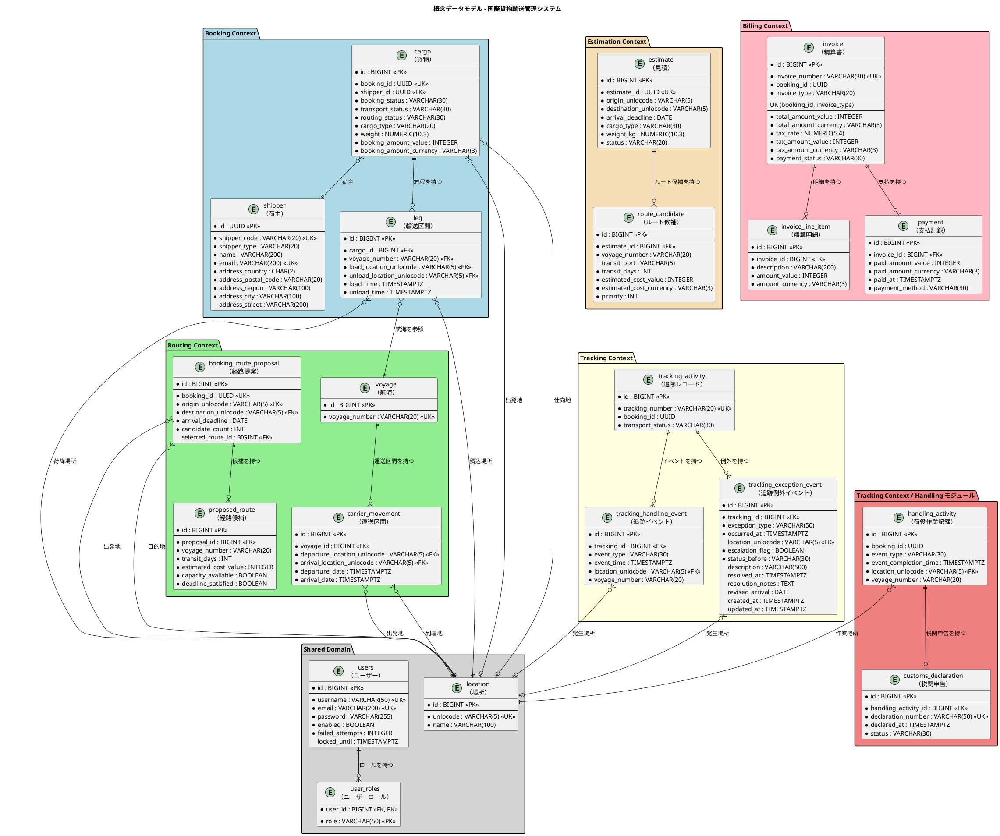
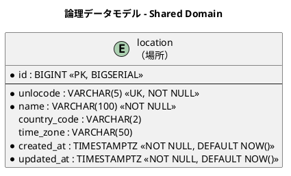
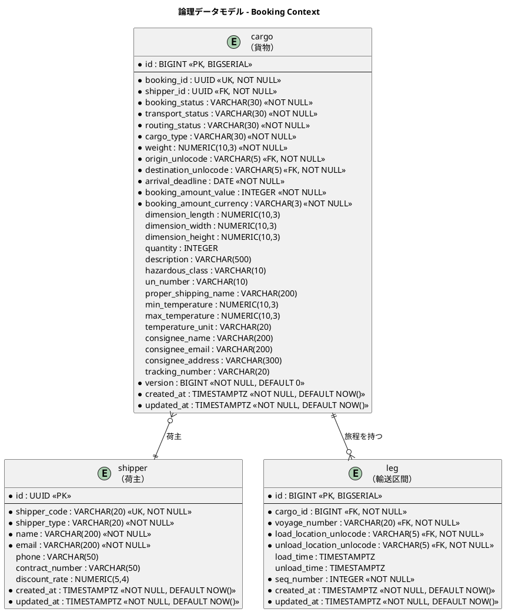
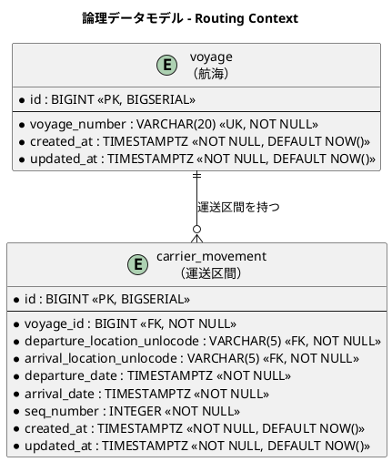
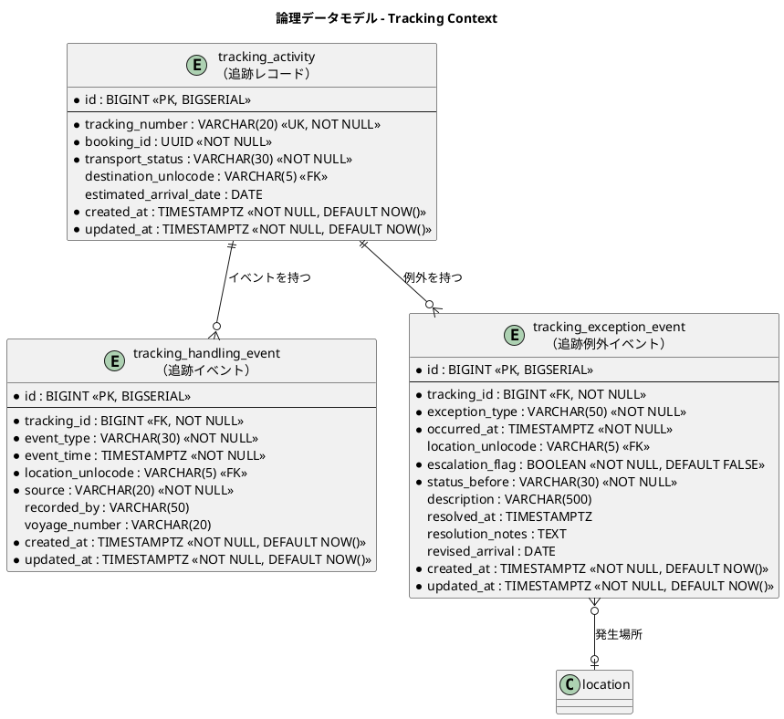
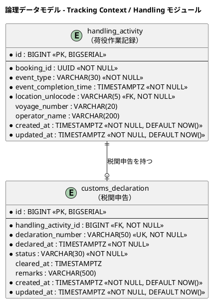
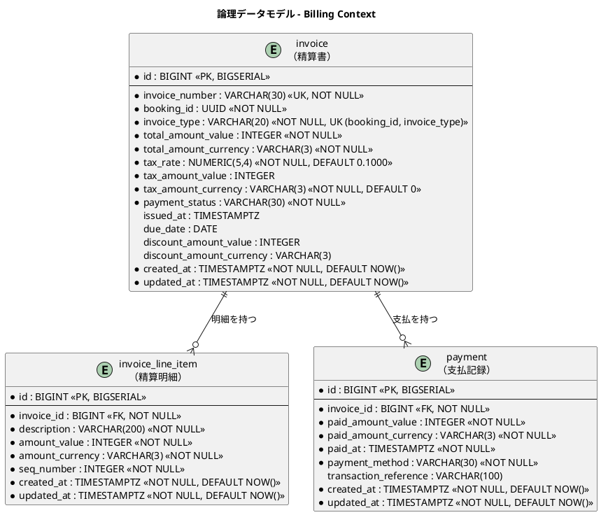
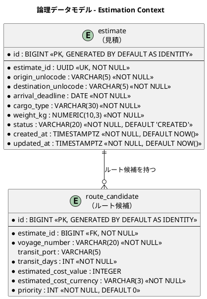
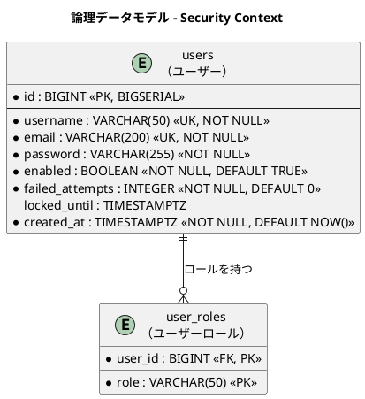

# データモデル設計 - 国際貨物輸送管理システム

## 概要

本ドキュメントは、国際貨物輸送管理システムの永続化層データモデルを定義する。
ドメインモデル分析で識別した 6 つの境界付けられたコンテキスト（Booking / Shipper / Routing / Tracking / Billing / Estimation）と共有ドメイン（Shared Domain）、および支援サブドメインである Security に対応する 20 テーブルを設計する。荷役・通関申告のテーブルは Tracking Context に属する（ADR-002。**BC を統合してもテーブルは分割したまま維持する**）。
`shipper`（荷主）テーブルと、Spring Security 用の `users` / `user_roles` テーブルを含む。

> **本ドキュメントの ER 図は「設計」である。** 実際に Flyway が構築したスキーマの ER 図は
> jig-erd で生成できる（`./gradlew jigErd`）。**設計と実装の乖離は、図を目視で見比べるのではなく
> 生成物との差分で検出する。** 手で図を更新し続ける運用は、マイグレーションを追加したのに
> 図だけ古いという状態を必ず生む。
>
> なお jig-erd が扱うのはテーブルと外部キーの関連のみである。PK・データ型・制約の正典は本ドキュメントである。

### 設計方針

- **DB**: PostgreSQL 16.x（本番・Repository テスト・E2E）、H2 PostgreSQL 互換モード（ローカル起動のみ — ADR-003）
- **ORM**: MyBatis（XML マッパー）
- **マイグレーション**: Flyway。`db/migration/common`（両 DB 共通）と `db/migration/{vendor}`（ベンダー固有）に分離する
- **ID 戦略**: サロゲートキー（`BIGSERIAL`）+ 業務キー（`VARCHAR`）の併用。例外として `shipper.id` と `cargo.booking_id` / `cargo.shipper_id` は `UUID`（V3/V4 マイグレーション）
- **命名規則**: スネークケース（PostgreSQL 慣習）
- **監査カラム**: 全テーブルに `created_at` / `updated_at` を付与

---

## 概念データモデル

全コンテキストのエンティティとその主要リレーションシップを俯瞰する。



---

## 論理データモデル

### Shared Domain

共有ドメインとして全コンテキストが参照する場所マスタ。UN/LOCODE（国連貿易港コード）を業務キーとする。



---

### Booking Context

貨物の予約・旅程情報を管理する。`cargo` が集約ルートで、`leg` が旅程の各区間を表す。荷主情報は `shipper` テーブルに正規化し、FK 参照とする。



---

### Routing Context

航海スケジュールと運送区間を管理する。`voyage` が集約ルートで、`carrier_movement` が個々の移動区間を表す。



---

### Tracking Context

貨物追跡の状態・イベント・例外を管理する。`tracking_activity` が集約ルート。



---

### Handling Context

荷役作業の実績と税関申告を管理する。`handling_activity` が集約ルート。**独立した境界付けられたコンテキストである**（ADR-010）。



---

### Billing Context

精算書・明細・支払記録を管理する。参考実装には存在しない新規コンテキスト。



---

### Estimation Context

輸送見積とルート候補を管理する。`estimate` が集約ルートで、`route_candidate` が各ルート候補を表す。



---

### Security Context

Spring Security の `UserDetailsService` が利用するユーザー認証・認可テーブル。



---

## テーブル定義

### `location`（場所マスタ）

> **本テーブルは業務マスタであり、データは `common/V6__location_master.sql` で投入する**
> （`db/seed` や `db/demo` ではない）。`carrier_movement` が外部キーを持つため、
> **空のままでは航海スケジュールを 1 件も登録できない**。IT3 の計画時、
> テーブルはあるがデータが 1 件も無いことが突合で見つかった。
> 空でないことは `LocationMasterTest` が検証する。

| カラム名 | データ型 | 制約 | 説明 |
| :--- | :--- | :--- | :--- |
| `id` | `BIGINT` | `PK, NOT NULL` | サロゲートキー（BIGSERIAL） |
| `unlocode` | `VARCHAR(5)` | `UK, NOT NULL` | UN/LOCODE（業務キー。例: `JPTYO`） |
| `name` | `VARCHAR(100)` | `NOT NULL` | 場所名称（例: `Tokyo`） |
| `country_code` | `VARCHAR(2)` | | ISO 3166-1 alpha-2 国コード（**V6 で追加**） |
| `time_zone` | `VARCHAR(50)` | | タイムゾーン（例: `Asia/Tokyo`）（**V6 で追加**） |
| `created_at` | `TIMESTAMPTZ` | `NOT NULL, DEFAULT NOW()` | レコード作成日時 |
| `updated_at` | `TIMESTAMPTZ` | `NOT NULL, DEFAULT NOW()` | レコード更新日時 |

---

### `shipper`（荷主）

> **注記**: 旧設計で `cargo` テーブルに存在した `shipper_name`・`shipper_email` カラムは本テーブルへの正規化に伴い削除した。

| カラム名 | データ型 | 制約 | 説明 |
| :--- | :--- | :--- | :--- |
| `id` | `UUID` | `PK, NOT NULL` | サロゲートキー（UUID。アプリケーション側で採番） |
| `shipper_code` | `VARCHAR(20)` | `UK, NOT NULL` | 荷主コード（業務キー。SHP-XXXXXX 形式） |
| `shipper_type` | `VARCHAR(20)` | `NOT NULL` | 荷主種別（`INDIVIDUAL` / `CORPORATE`） |
| `name` | `VARCHAR(200)` | `NOT NULL` | 荷主名称 |
| `email` | `VARCHAR(200)` | **`UK`**, `NOT NULL` | メールアドレス。US02 の受入基準「同一メールアドレスが既に登録されている場合はエラー」を **DB で保証する** |
| `phone` | `VARCHAR(50)` | | 電話番号 |
| `address_country` | `CHAR(2)` | `NOT NULL` | 国コード（ISO 3166-1 alpha-2） |
| `address_postal_code` | `VARCHAR(20)` | `NOT NULL` | 郵便番号 |
| `address_region` | `VARCHAR(100)` | `NOT NULL` | 都道府県 / 州 |
| `address_city` | `VARCHAR(100)` | `NOT NULL` | 市区町村 |
| `address_street` | `VARCHAR(200)` | | 番地・建物名 |
| `contract_number` | `VARCHAR(50)` | | 契約番号（法人のみ。NULLable） |
| `discount_rate` | `NUMERIC(5,4)` | `NOT NULL, DEFAULT 0.0000` | **契約**割引率（0.0000〜0.3000、上限 30%）。US22 で `ShipperDiscountPort` から参照される |
| `version` | `BIGINT` | `NOT NULL, DEFAULT 0` | 楽観的ロック（判断 8） |
| `created_at` | `TIMESTAMPTZ` | `NOT NULL, DEFAULT NOW()` | レコード作成日時 |
| `updated_at` | `TIMESTAMPTZ` | `NOT NULL, DEFAULT NOW()` | レコード更新日時 |

> **住所カラムはドメインの `Address` 値オブジェクトに対応する。** US02 の受入基準は住所の入力を求めており、`domain-model.md` にも `Address` 値オブジェクトが定義されているが、旧版のテーブルには住所を保持する列が 1 つも無かった。**受入基準を満たせないスキーマは、実装時に必ず作り直しになる。**
>
> **メールアドレスの一意性はアプリケーションだけで担保しない。** 画面の非同期チェックは同時登録の競合に対して無力であり、DB の UNIQUE 制約が最後の防波堤になる。

#### DDL

```sql
CREATE TABLE shipper (
    id                  UUID PRIMARY KEY,
    shipper_code        VARCHAR(20)  NOT NULL UNIQUE,  -- SHP-XXXXXX 形式
    shipper_type        VARCHAR(20)  NOT NULL,         -- INDIVIDUAL / CORPORATE
    name                VARCHAR(200) NOT NULL,
    email               VARCHAR(200) NOT NULL UNIQUE,  -- US02 の重複チェックを DB で保証
    phone               VARCHAR(50),
    address_country     CHAR(2)      NOT NULL,         -- ISO 3166-1 alpha-2
    address_postal_code VARCHAR(20)  NOT NULL,
    address_region      VARCHAR(100) NOT NULL,
    address_city        VARCHAR(100) NOT NULL,
    address_street      VARCHAR(200),
    contract_number     VARCHAR(50),                   -- 法人のみ（NULLable）
    discount_rate       NUMERIC(5,4) NOT NULL DEFAULT 0.0000,
    version             BIGINT       NOT NULL DEFAULT 0,
    created_at          TIMESTAMPTZ  NOT NULL DEFAULT NOW(),
    updated_at          TIMESTAMPTZ  NOT NULL DEFAULT NOW(),
    CONSTRAINT chk_shipper_discount_rate
        CHECK (discount_rate >= 0.0000 AND discount_rate <= 0.3000),
    CONSTRAINT chk_shipper_corporate_contract
        CHECK (shipper_type <> 'CORPORATE' OR contract_number IS NOT NULL)
);
```

---

### `cargo`（貨物）

> **注記**: `shipper_name`・`shipper_email` カラムは削除し、`shipper_id`（FK → `shipper.id`）による参照に変更した。
>
> **実装状況（2026-08-06 時点 / IT1 完了時）**: `V1__init.sql` で `cargo` テーブルは作成済み。
> ただし**全カラムが揃っているわけではない。**
>
> | 区分 | カラム | 追加時期 |
> | :--- | :--- | :--- |
> | ✅ V1 で作成済み | `booking_id`・`shipper_id`・`cargo_type`・`weight`・`origin_unlocode`・`destination_unlocode`・`arrival_deadline`・`booking_status`・`transport_status`・`routing_status`・`booking_amount_*`・`consignee_*`・`tracking_number`・`version` | — |
> | ✅ V3 で作成済み | `dimension_length`・`dimension_width`・`dimension_height`・`quantity`・`description` | IT2（US04 の受入基準） |
> | ✅ V21 で作成済み | `hazardous_class`・`un_number`・`proper_shipping_name`・`min_temperature`・`max_temperature`・`temperature_unit` | IT9（US05） |
>
> **種別との整合は DB の CHECK で書かない。** 「危険物なら 3 列すべて必要、冷凍なら別の 3 列、
> 一般ならどちらも NULL」は SQL でも書けるが、種別が増えるたびに条件が伸びて読めなくなる。
> 判断はドメイン（`CargoSpecification`）が持ち、DB は**書ける値の形だけ**を決める
> （温度単位の列挙、最低 ≦ 最高の 2 件）。
>
> **「テーブルがある」と「カラムが揃っている」は別である。** 初期スキーマで全テーブルを
> 作成する方針を採ったため、テーブルの存在だけを見て揃っていると判断すると実装で詰まる。

| カラム名 | データ型 | 制約 | 説明 |
| :--- | :--- | :--- | :--- |
| `id` | `BIGINT` | `PK, NOT NULL` | サロゲートキー（`BIGINT GENERATED BY DEFAULT AS IDENTITY`） |
| `booking_id` | `UUID` | `UK, NOT NULL` | 予約 ID（業務キー） |
| `shipper_id` | `UUID` | `FK → shipper.id, NOT NULL` | 荷主 ID |
| `cargo_type` | `VARCHAR(30)` | `NOT NULL` | 貨物種別（`GENERAL` / `HAZARDOUS` / `REFRIGERATED`） |
| `weight` | `NUMERIC(10,3)` | `NOT NULL, > 0` | 重量（kg） |
| `origin_unlocode` | `VARCHAR(5)` | `NOT NULL` | 出発地（RouteSpecification） |
| `destination_unlocode` | `VARCHAR(5)` | `NOT NULL` | 仕向地（RouteSpecification） |
| `arrival_deadline` | `DATE` | `NOT NULL` | 到着期限（RouteSpecification） |
| `booking_status` | `VARCHAR(30)` | `NOT NULL, DEFAULT 'PRELIMINARY'` | 予約状態（BookingStatus 列挙値） |
| `dimension_length` | `NUMERIC(10,3)` | | 貨物の長さ（cm、オプション） |
| `dimension_width` | `NUMERIC(10,3)` | | 貨物の幅（cm、オプション） |
| `dimension_height` | `NUMERIC(10,3)` | | 貨物の高さ（cm、オプション） |
| `quantity` | `INTEGER` | | 貨物個数（オプション、1 以上） |
| `description` | `VARCHAR(500)` | | 品名（オプション） |
| `claim_code` | `VARCHAR(12)` | | 引取確認コード（US35。確定時に採番。NULL 可）。**追跡番号とは別の値** |
| `hazardous_class` | `VARCHAR(10)` | | 危険物クラス（HAZARDOUS 時のみ） |
| `un_number` | `VARCHAR(10)` | | UN 番号（HAZARDOUS 時のみ） |
| `proper_shipping_name` | `VARCHAR(200)` | | 正式輸送品名（HAZARDOUS 時のみ） |
| `min_temperature` | `NUMERIC(10,3)` | | 最低温度（REFRIGERATED 時のみ） |
| `max_temperature` | `NUMERIC(10,3)` | | 最高温度（REFRIGERATED 時のみ） |
| `temperature_unit` | `VARCHAR(20)` | | 温度単位（`CELSIUS` / `FAHRENHEIT`、REFRIGERATED 時のみ） |
| `version` | `BIGINT` | `NOT NULL, DEFAULT 0` | 楽観的ロック（判断 8）。集約ルートのテーブルにのみ付与する |
| `created_at` | `TIMESTAMPTZ` | `NOT NULL, DEFAULT NOW()` | レコード作成日時 |
| `updated_at` | `TIMESTAMPTZ` | `NOT NULL, DEFAULT NOW()` | レコード更新日時 |

#### 将来追加予定カラム（IT4+）

| カラム名 | データ型 | 説明 | 追加フェーズ |
| :--- | :--- | :--- | :--- |
| `transport_status` | `VARCHAR(30)` | **使用しない。** 輸送状態の所有は Tracking Context であり（ADR-005）、正は `tracking_activity.transport_status` である。両方に持つと同じ事実が 2 か所に存在し、必ず片方だけが更新される。列そのものは V1 で作られており、削除は別途判断する | — |
| `routing_status` | `VARCHAR(30)` | 経路決定状態（ROUTED / MISROUTED / NOT_ROUTED） | Routing Context 実装時 |
| `booking_amount_value` | `INTEGER` | 予約金額（最小通貨単位） | Billing Context 実装時 |
| `booking_amount_currency` | `VARCHAR(3)` | 通貨コード（ISO 4217） | Billing Context 実装時 |
| `consignee_name` | `VARCHAR(200)` | 荷受人名（V1。**IT7 で使い始めた**）。**3 項目とも NULL 許容のままとする** — 国際輸送では荷受人が後から決まる | **US16（引取作業を記録する）** |
| `consignee_email` | `VARCHAR(200)` | 荷受人メールアドレス（V1） | **US16（引取作業を記録する）** |
| `consignee_address` | `VARCHAR(500)` | 荷受人住所（**V14 で追加**） | **US16（引取作業を記録する）** |
| `misrouted_at` | `TIMESTAMPTZ` | | **誤配を検知した荷役の作業日時**（US28 / IT12）。誤配でなければ NULL |
| `misrouted_location_unlocode` | `VARCHAR(5)` | `FK → location.unlocode` | **誤配を検知した荷役の場所**（＝貨物の現在地）。<br>**Handling のテーブルを読みに行かないための写しである**（結果整合。ADR-009）。IT11 は `handling_activity` を JOIN していたが、**BC をまたぐ SQL は ArchUnit にも JIG にも映らない** |
| `tracking_number` | `VARCHAR(20)` | 追跡番号（発行後に設定）。**V11 で UNIQUE 制約を追加**。発行前は NULL であり、NULL は一意制約の対象外である（発行済みの番号だけが一意になる） | IT6 |
| `next_expected_*` | 各種 | 次の予定荷役情報 | Tracking Context 実装時 |
| `last_handling_event_*` | 各種 | 最後の荷役イベント情報 | Handling モジュール実装時 |

---

### `leg`（輸送区間）

| カラム名 | データ型 | 制約 | 説明 |
| :--- | :--- | :--- | :--- |
| `id` | `BIGINT` | `PK, NOT NULL` | サロゲートキー（BIGSERIAL） |
| `cargo_id` | `BIGINT` | `FK → cargo.id, NOT NULL` | 親貨物 ID |
| `voyage_number` | `VARCHAR(20)` | `NOT NULL` | 航海番号。**外部キーは張らない**（`voyage` は Routing Context であり、BC をまたぐ参照に FK を設けない方針。DDL もそうなっている） |
| `load_location_unlocode` | `VARCHAR(5)` | `FK → location.unlocode, NOT NULL` | 積込場所（UN/LOCODE） |
| `unload_location_unlocode` | `VARCHAR(5)` | `FK → location.unlocode, NOT NULL` | 荷降場所（UN/LOCODE） |
| `load_time` | `TIMESTAMPTZ` | | 積込予定日時（**経路を確定した時点の日程**。以後は動かさない） |
| `unload_time` | `TIMESTAMPTZ` | | 荷降予定日時（同上） |
| `current_load_time` | `TIMESTAMPTZ` | | **いまの積込日時の写し**（US25 / C3）。航海の更新イベントを Booking が購読して写す。**NULL は「写しが無い」であり、日程が変わっていないのと同じ扱いにする** |
| `current_unload_time` | `TIMESTAMPTZ` | | **いまの荷降日時の写し**（同上） |
| `seq_number` | `INTEGER` | `NOT NULL` | 区間順序（1 始まり） |
| `created_at` | `TIMESTAMPTZ` | `NOT NULL, DEFAULT NOW()` | レコード作成日時 |
| `updated_at` | `TIMESTAMPTZ` | `NOT NULL, DEFAULT NOW()` | レコード更新日時 |

> **当初の日程と「いまの日程」を別の列で持つ**（IT13 / C3）。差が「日程が変わりました」の
> 印そのものであり、両方を上書きすると何が変わったのか分からなくなる。
>
> **写しを持つのは BC の越境をやめるためである。** IT11 までは予約詳細が
> `voyage` / `carrier_movement` を JOIN していた。どちらも Routing の持ち物であり、
> `MapperTableOwnershipTest` の許容リストに「次に返す候補」として名前を残していた（ADR-015）。

---

### `voyage`（航海）

| カラム名 | データ型 | 制約 | 説明 |
| :--- | :--- | :--- | :--- |
| `id` | `BIGINT` | `PK, NOT NULL` | サロゲートキー（BIGSERIAL） |
| `voyage_number` | `VARCHAR(20)` | `UK, NOT NULL` | 航海番号（業務キー） |
| `vessel_name` | `VARCHAR(100)` | | 船名（**V5 で追加**。US24） |
| `carrier_name` | `VARCHAR(100)` | | 運送会社（**V5 で追加**。US24） |
| `cargo_types` | `VARCHAR(100)` | `NOT NULL` | 取り扱える貨物種別。カンマ区切り（**V5 で追加**。US24） |
| `capacity_weight_kg` | `NUMERIC(12, 3)` | `NOT NULL` | 積載可能重量（**V9 で追加**。US09）。**容量が分からない便を作らない**ため必須 |
| `version` | `BIGINT` | `NOT NULL, DEFAULT 0` | 楽観的ロック（判断 8）。集約ルートのテーブルにのみ付与する |
| `created_at` | `TIMESTAMPTZ` | `NOT NULL, DEFAULT NOW()` | レコード作成日時 |
| `updated_at` | `TIMESTAMPTZ` | `NOT NULL, DEFAULT NOW()` | レコード更新日時 |

> **出発港・到着港・出発日・到着日は本テーブルに持たない。** 航海の端点は
> `carrier_movement` の最初と最後の区間から導く。**同じ事実を 2 か所に持つと、
> 区間を足したときに端点だけ古いままになる**（`domain-model.md` ビジネスルール 2-2）。
>
> **`cargo_types` を正規化していない。** 値は 3 種類で固定であり、検索は
> 「この航海はこの種別を運べるか」の包含判定のみである。別テーブルにすると
> 一覧のたびに JOIN が 1 つ増えるだけで得るものがない。

---

### `booking_route_proposal`（経路提案）

予約 1 件に対して算出した経路候補の集合。**US09（選択・確定）と US10（条件変更・再算出）の置き場**であり、見積の `route_candidate` とは目的も生存期間も異なるため統合しない。

| カラム名 | データ型 | 制約 | 説明 |
| :--- | :--- | :--- | :--- |
| `id` | `BIGINT` | `PK, NOT NULL` | サロゲートキー（BIGSERIAL） |
| `booking_id` | `UUID` | `UK, NOT NULL` | 予約 ID（1 予約につき 1 提案。参照整合性は書き込み側で保証） |
| `origin_unlocode` | `VARCHAR(5)` | `FK → location.unlocode, NOT NULL` | 探索条件: 出発地（誤配の再設計時は**貨物の現在地**が入る。US28） |
| `destination_unlocode` | `VARCHAR(5)` | `FK → location.unlocode, NOT NULL` | 探索条件: 目的地 |
| `arrival_deadline` | `DATE` | `NOT NULL` | 探索条件: 希望到着期限（US10 で緩められる） |
| `original_arrival_deadline` | `DATE` | `NOT NULL` | **当初**の希望期限。US10 で延長した場合の差分を荷主通知に含めるため保持する |
| `cargo_type` | `VARCHAR(30)` | `NOT NULL` | 探索条件: 貨物種別（**V8 で追加**。IT4） |
| `weight` | `NUMERIC(10, 3)` | `NOT NULL` | 探索条件: 重量。概算費用の基礎になる（**V8 で追加**。IT4） |
| `max_transit_count` | `INTEGER` | `NOT NULL, DEFAULT 2` | 探索条件: 経由回数の上限（US10 で緩められる） |
| `calculation_count` | `INTEGER` | `NOT NULL, DEFAULT 1` | 何回目の算出か（再算出のたびに加算） |
| `candidate_count` | `INTEGER` | `NOT NULL, DEFAULT 0` | 算出された候補件数。**0 は「候補ゼロ」を意味し、経路割り当て待ち一覧に表示される** |
| `selected_route_id` | `BIGINT` | `FK → proposed_route.id` | 選択・確定した候補（未確定は NULL） |
| `version` | `BIGINT` | `NOT NULL, DEFAULT 0` | 楽観的ロック（判断 8）。集約ルートのテーブルにのみ付与する |
| `created_at` | `TIMESTAMPTZ` | `NOT NULL, DEFAULT NOW()` | レコード作成日時 |
| `updated_at` | `TIMESTAMPTZ` | `NOT NULL, DEFAULT NOW()` | レコード更新日時 |

> **`cargo_type` と `weight` は V8 で追加した。** `domain-model.md` の `RoutingCriteria` は
> どちらも含むのに列が無く、**保存した提案から探索条件を復元できなかった**。予約から
> 読み直す案は採らない。**探索条件は「そのとき何で探したか」であり、予約の現在値とは
> 別の事実**である。予約側が後から変わっても、算出済みの候補がどの条件で出たものかは変わらない。

---

### `proposed_route`（経路候補）

`booking_route_proposal` に従属する候補 1 件。**再算出時は親提案に紐づく行を全削除して入れ替える。**

| カラム名 | データ型 | 制約 | 説明 |
| :--- | :--- | :--- | :--- |
| `id` | `BIGINT` | `PK, NOT NULL` | サロゲートキー（BIGSERIAL） |
| `proposal_id` | `BIGINT` | `FK → booking_route_proposal.id, NOT NULL` | 親提案 ID |
| `voyage_number` | `VARCHAR(20)` | `NOT NULL` | 航海番号 |
| `transit_ports` | `VARCHAR(200)` | | 経由港（UN/LOCODE のカンマ区切り。直行は NULL） |
| `boarding_index` | `INTEGER` | `NOT NULL` | **乗る区間の添字**（V10 で追加）。確定時に旅程へ写す区間をここから絞る。時刻の範囲で絞ると、同じ港を 2 度通る航海でどの周回かが時刻に委ねられる（IT5 レビュー L1） |
| `landing_index` | `INTEGER` | `NOT NULL` | **降りる区間の添字**（両端を含む）。`boarding_index` 以上であることを CHECK 制約で守る（行の中で完結するため DB で守れる） |
| `departure_date` | `TIMESTAMPTZ` | `NOT NULL` | 出発日時 |
| `arrival_date` | `TIMESTAMPTZ` | `NOT NULL` | 到着予定日時 |
| `transit_days` | `INTEGER` | `NOT NULL` | 所要日数 |
| `estimated_cost_value` | `INTEGER` | `NOT NULL` | 費用（最小通貨単位の整数）。US08 の受入基準に含まれる |
| `estimated_cost_currency` | `VARCHAR(3)` | `NOT NULL` | 費用の通貨コード（ISO 4217） |
| `capacity_available` | `BOOLEAN` | `NOT NULL` | 空き容量の有無。**false でも一覧には残し、選択不可の理由として示す**。IT4 では判定の材料が無く常に `TRUE` を入れていたが、**IT5 で `voyage.capacity_weight_kg` と確定済み貨物の重量合計から判定するようにした** |
| `hazardous_allowed` | `BOOLEAN` | `NOT NULL` | 危険物の取扱可否（US05 / US07 の受入基準） |
| `refrigerated_allowed` | `BOOLEAN` | `NOT NULL` | 冷凍・冷蔵の取扱可否 |
| `deadline_satisfied` | `BOOLEAN` | `NOT NULL` | 希望期限を満たすか。**判定は日付単位で行う**（`domain-model.md` ビジネスルール 2-1） |
| `priority` | `INTEGER` | `NOT NULL, DEFAULT 0` | 表示順（`rank` は SQL の予約語のため使わない） |
| `created_at` | `TIMESTAMPTZ` | `NOT NULL, DEFAULT NOW()` | レコード作成日時 |
| `updated_at` | `TIMESTAMPTZ` | `NOT NULL, DEFAULT NOW()` | レコード更新日時 |

#### DDL

```sql
CREATE TABLE booking_route_proposal (
    id                        BIGINT GENERATED BY DEFAULT AS IDENTITY PRIMARY KEY,
    booking_id                UUID        NOT NULL UNIQUE,
    origin_unlocode           VARCHAR(5)  NOT NULL REFERENCES location(unlocode),
    destination_unlocode      VARCHAR(5)  NOT NULL REFERENCES location(unlocode),
    arrival_deadline          DATE        NOT NULL,
    original_arrival_deadline DATE        NOT NULL,
    cargo_type                VARCHAR(30) NOT NULL,   -- V8 で追加
    weight                    NUMERIC(10, 3) NOT NULL, -- V8 で追加
    max_transit_count         INTEGER     NOT NULL DEFAULT 2,
    calculation_count         INTEGER     NOT NULL DEFAULT 1,
    candidate_count           INTEGER     NOT NULL DEFAULT 0,
    selected_route_id         BIGINT,
    version                   BIGINT      NOT NULL DEFAULT 0,
    created_at                TIMESTAMPTZ NOT NULL DEFAULT NOW(),
    updated_at                TIMESTAMPTZ NOT NULL DEFAULT NOW()
);

CREATE TABLE proposed_route (
    id                      BIGINT GENERATED BY DEFAULT AS IDENTITY PRIMARY KEY,
    proposal_id             BIGINT      NOT NULL
                            REFERENCES booking_route_proposal(id) ON DELETE CASCADE,
    voyage_number           VARCHAR(20) NOT NULL,
    transit_ports           VARCHAR(200),
    departure_date          TIMESTAMPTZ NOT NULL,
    arrival_date            TIMESTAMPTZ NOT NULL,
    transit_days            INTEGER     NOT NULL,
    estimated_cost_value    INTEGER     NOT NULL,
    estimated_cost_currency VARCHAR(3)  NOT NULL,
    capacity_available      BOOLEAN     NOT NULL,
    hazardous_allowed       BOOLEAN     NOT NULL,
    refrigerated_allowed    BOOLEAN     NOT NULL,
    deadline_satisfied      BOOLEAN     NOT NULL,
    priority                INTEGER     NOT NULL DEFAULT 0,
    created_at              TIMESTAMPTZ NOT NULL DEFAULT NOW(),
    updated_at              TIMESTAMPTZ NOT NULL DEFAULT NOW()
);

-- selected_route_id の FK は proposed_route 作成後に追加する（循環参照の回避）
ALTER TABLE booking_route_proposal
    ADD CONSTRAINT fk_proposal_selected_route
    FOREIGN KEY (selected_route_id) REFERENCES proposed_route(id);

CREATE INDEX idx_proposal_booking ON booking_route_proposal (booking_id);
CREATE INDEX idx_proposed_route_proposal ON proposed_route (proposal_id, priority);
```

---

### `carrier_movement`（運送区間）

| カラム名 | データ型 | 制約 | 説明 |
| :--- | :--- | :--- | :--- |
| `id` | `BIGINT` | `PK, NOT NULL` | サロゲートキー（BIGSERIAL） |
| `voyage_id` | `BIGINT` | `FK → voyage.id, NOT NULL` | 親航海 ID |
| `departure_location_unlocode` | `VARCHAR(5)` | `FK → location.unlocode, NOT NULL` | 出発地（UN/LOCODE） |
| `arrival_location_unlocode` | `VARCHAR(5)` | `FK → location.unlocode, NOT NULL` | 到着地（UN/LOCODE） |
| `departure_date` | `TIMESTAMPTZ` | `NOT NULL` | 出発日時 |
| `arrival_date` | `TIMESTAMPTZ` | `NOT NULL` | 到着日時 |
| `seq_number` | `INTEGER` | `NOT NULL` | 区間順序（1 始まり） |
| `created_at` | `TIMESTAMPTZ` | `NOT NULL, DEFAULT NOW()` | レコード作成日時 |
| `updated_at` | `TIMESTAMPTZ` | `NOT NULL, DEFAULT NOW()` | レコード更新日時 |

---

### `tracking_activity`（追跡レコード）

| カラム名 | データ型 | 制約 | 説明 |
| :--- | :--- | :--- | :--- |
| `id` | `BIGINT` | `PK, NOT NULL` | サロゲートキー（BIGSERIAL） |
| `tracking_number` | `VARCHAR(20)` | `UK, NOT NULL` | 追跡番号（業務キー） |
| `booking_id` | `UUID` | `NOT NULL` | 予約 ID（参照整合性は書き込み側で保証。型は `cargo.booking_id` と統一） |
| `transport_status` | `VARCHAR(30)` | `NOT NULL` | 輸送状態（TransportStatus 列挙値） |
| `destination_unlocode` | `VARCHAR(5)` | `FK → location.unlocode` | 目的地。**追跡番号の発行時に Booking から渡される**（ADR-012）。問い合わせると Booking ⇄ Tracking が循環する |
| `estimated_arrival_date` | `DATE` | | 推定到着日（確定した旅程の最終区間の荷降予定日）。経路が未確定なら NULL。**結果整合の写し**であり `CargoRoutedEvent` の購読で追随する |
| `version` | `BIGINT` | `NOT NULL, DEFAULT 0` | 楽観的ロック（判断 8）。集約ルートのテーブルにのみ付与する |
| `created_at` | `TIMESTAMPTZ` | `NOT NULL, DEFAULT NOW()` | レコード作成日時 |
| `updated_at` | `TIMESTAMPTZ` | `NOT NULL, DEFAULT NOW()` | レコード更新日時 |

---

### `tracking_handling_event`（追跡イベント）

| カラム名 | データ型 | 制約 | 説明 |
| :--- | :--- | :--- | :--- |
| `id` | `BIGINT` | `PK, NOT NULL` | サロゲートキー（BIGSERIAL） |
| `tracking_id` | `BIGINT` | `FK → tracking_activity.id, NOT NULL` | 親追跡レコード ID |
| `event_type` | `VARCHAR(30)` | `NOT NULL` | 荷役タイプ（HandlingType 列挙値） |
| `event_time` | `TIMESTAMPTZ` | `NOT NULL` | イベント発生日時 |
| `location_unlocode` | `VARCHAR(5)` | `FK → location.unlocode` | イベント発生場所（UN/LOCODE） |
| `voyage_number` | `VARCHAR(20)` | | 関連する航海番号 |
| `source` | `VARCHAR(20)` | `NOT NULL, DEFAULT 'HANDLING'` | 出どころ（`HANDLING` / `MANUAL`）。**荷役由来と手動更新（US17）を区別する。** 混ぜると「誰がいつ手で入れたか」を追えない |
| `recorded_by` | `VARCHAR(50)` | | 手動更新の記録者。荷役由来では NULL（担当者は `handling_activity` が持つ） |
| `created_at` | `TIMESTAMPTZ` | `NOT NULL, DEFAULT NOW()` | レコード作成日時 |
| `updated_at` | `TIMESTAMPTZ` | `NOT NULL, DEFAULT NOW()` | レコード更新日時 |

> `event_type` は `RECEIVE` / `LOAD` / `UNLOAD` / `CUSTOMS` / `CLAIM` に加え、
> **手動更新でのみ入る 3 種**（`DEPART` 出港 / `ARRIVE` 入港 / `AWAIT_CLAIM` 引取待ち）を許す。
> **出港・入港は荷役作業ではない。** 船が出入りしたことは荷役の記録に現れず、
> 手で入れる以外に追跡へ反映する手段が無い（US17 の起票理由）。

---

### `booking_notification`（通知の送信記録）

荷主への通知を送った事実（US12）。**ADR-006 により外部へは送らないため、
このテーブルが「通知」の実体そのものである。**

| カラム名 | データ型 | 制約 | 説明 |
| :--- | :--- | :--- | :--- |
| `id` | `BIGINT` | `PK, NOT NULL` | サロゲートキー（BIGSERIAL） |
| `booking_id` | `UUID` | `NOT NULL` | 予約 ID（参照整合性は書き込み側で保証。`tracking_activity` と同じ形） |
| `notification_type` | `VARCHAR(30)` | `NOT NULL` | 種別（`ROUTE_CONFIRMED` / `SCHEDULE_CHANGED` / `EXCEPTION_RAISED` / `EXCEPTION_RESOLVED` / `STATUS_UPDATED`）。**発生と対応報告は別種別で積む**（同じにすると通知履歴で区別できない。V22） |
| `recipient_email` | `VARCHAR(200)` | `NOT NULL` | 送信先 |
| `content` | `TEXT` | `NOT NULL` | **送った文面そのもの。** 経路や期限は後から変わるため、組み立て直すと「送った内容」と違うものが出る |
| `sent_at` | `TIMESTAMPTZ` | `NOT NULL, DEFAULT NOW()` | 送信日時 |
| `sent_by` | `VARCHAR(50)` | `NOT NULL` | 送信者 |
| `result` | `VARCHAR(20)` | `NOT NULL` | 結果（`SUCCEEDED` / `FAILED`）。**失敗も残す** |
| `failure_reason` | `VARCHAR(500)` | | 失敗の理由 |
| `version` | `BIGINT` | `NOT NULL, DEFAULT 0` | 楽観的ロック（判断 8） |
| `created_at` / `updated_at` | `TIMESTAMPTZ` | `NOT NULL, DEFAULT NOW()` | 監査カラム |

> **「送ったつもり」を検知できることが目的である。** 送信操作だけを実装して履歴を
> 残さないと、荷主から「聞いていない」と言われたときに確認する手段が無い。

---

### `tracking_exception_event`（追跡例外イベント）

| カラム名 | データ型 | 制約 | 説明 |
| :--- | :--- | :--- | :--- |
| `id` | `BIGINT` | `PK, NOT NULL` | サロゲートキー（BIGSERIAL） |
| `tracking_id` | `BIGINT` | `FK → tracking_activity.id, NOT NULL` | 親追跡レコード ID |
| `exception_type` | `VARCHAR(50)` | `NOT NULL` | 例外種別（例: `CUSTOMS_HOLD`, `DAMAGE`, `DELAY`） |
| `occurred_at` | `TIMESTAMPTZ` | `NOT NULL` | 例外発生日時 |
| `location_unlocode` | `VARCHAR(5)` | `FK → location.unlocode` | **発生場所**（US19 / US20 の受入基準「発生状況（場所・日時・理由）」）。V22 で追加した |
| `escalation_flag` | `BOOLEAN` | `NOT NULL, DEFAULT FALSE` | エスカレーション判定フラグ（US15 紛失時） |
| `status_before` | `VARCHAR(30)` | `NOT NULL` | **例外発生直前の `TransportStatus`。** 解決時の復帰先をここから読む |
| `description` | `VARCHAR(500)` | | 例外内容の詳細 |
| `resolved_at` | `TIMESTAMPTZ` | | 解決日時（NULL = 未解決） |
| `resolution_notes` | `TEXT` | | 対応内容メモ（対応方針） |
| `revised_arrival` | `DATE` | | 対応で決まった**新しい到着予定日**（US19）。NULL 可。列が無かったころに解決された例外には値が無く、**読み戻す側が拒んではならない** |

> **`status_before` を永続化する理由**: `domain-model.md` と `ui_design.md` は「例外解決時に例外発生前の状態に復帰する」を不変条件としている。この列が無いと復帰先を荷役イベント履歴から**再導出**するしかなく、ユニットテストが緑でもリクエストをまたぐと誤った状態に復帰する。**発生前の状態は導出せず永続化する。**
>
> **`location_unlocode` は NULL 可のままとする**: V1 の時点でこの列は無く、当時起票された例外は場所を持ちようがない。`NOT NULL` にすると**列が無かったころの行を読み戻せなくなる**（IT9 で `CargoSpecification` に起きたのと同じ形）。新規の起票で必須にするのは集約の仕事である。
>
> なお `DAMAGE`（破損）は「解決した = 元通り」ではない。破損の事実は貨物に残り続けて US21 の料金調整の根拠になるため、復帰と併せて破損の記録を保持する（`domain-model.md` のビジネスルールを参照）。
| `created_at` | `TIMESTAMPTZ` | `NOT NULL, DEFAULT NOW()` | レコード作成日時 |
| `updated_at` | `TIMESTAMPTZ` | `NOT NULL, DEFAULT NOW()` | レコード更新日時 |

---

### `handling_activity`（荷役作業記録）

| カラム名 | データ型 | 制約 | 説明 |
| :--- | :--- | :--- | :--- |
| `id` | `BIGINT` | `PK, NOT NULL` | サロゲートキー（BIGSERIAL） |
| `booking_id` | `UUID` | `NOT NULL` | 予約 ID（参照整合性は書き込み側で保証。型は `cargo.booking_id` と統一） |
| `event_type` | `VARCHAR(30)` | `NOT NULL` | 荷役タイプ（RECEIVE / LOAD / UNLOAD / CUSTOMS / CLAIM） |
| `event_completion_time` | `TIMESTAMPTZ` | `NOT NULL` | 荷役完了日時 |
| `location_unlocode` | `VARCHAR(5)` | `FK → location.unlocode, NOT NULL` | 作業場所（UN/LOCODE） |
| `voyage_number` | `VARCHAR(20)` | | 関連する航海番号（LOAD / UNLOAD 時に設定） |
| `tracking_number` | `VARCHAR(20)` | | **読み取った追跡番号**（V13 で追加）。`cargo` への外部キーは張らず、join でも引かない。**これは予約への参照ではなく「そのとき何を読み取ったか」という作業自体の事実**である（誤読した場合、誤った番号がそのまま残るほうが追跡できる）。IT6 以前の行は NULL であり、**後から埋めない**（記録されていたことと区別がつかなくなる） |
| `claim_confirmation_method` | `VARCHAR(30)` | | **引取確認の方法**（V14 で追加。`CONFIRMATION_CODE`）。引取以外では NULL |
| `claim_confirmation_code` | `VARCHAR(50)` | | 荷受人へ事前送付した確認コード（V14） |
| `claim_consignee_name` | `VARCHAR(200)` | | **実際に受け取った人**の氏名（V14）。予約の荷受人と異なりうる（代理受領は実務で頻繁に起きる） |
| `operator_name` | `VARCHAR(200)` | | 作業員名 |
| `version` | `BIGINT` | `NOT NULL, DEFAULT 0` | 楽観的ロック（判断 8）。集約ルートのテーブルにのみ付与する |
| `created_at` | `TIMESTAMPTZ` | `NOT NULL, DEFAULT NOW()` | レコード作成日時 |
| `updated_at` | `TIMESTAMPTZ` | `NOT NULL, DEFAULT NOW()` | レコード更新日時 |

---

### `customs_declaration`（税関申告）

| カラム名 | データ型 | 制約 | 説明 |
| :--- | :--- | :--- | :--- |
| `id` | `BIGINT` | `PK, NOT NULL` | サロゲートキー（BIGSERIAL） |
| `handling_activity_id` | `BIGINT` | `FK → handling_activity.id, NOT NULL` | 関連荷役作業 ID |
| `declaration_number` | `VARCHAR(50)` | `UK, NOT NULL` | 申告番号（業務キー） |
| `declared_at` | `TIMESTAMPTZ` | `NOT NULL` | 申告日時 |
| `status` | `VARCHAR(30)` | `NOT NULL` | 申告状態（例: `PENDING`, `CLEARED`, `HELD`） |
| `cleared_at` | `TIMESTAMPTZ` | | 通関完了日時（NULL = 未完了） |
| `held_since` | `TIMESTAMPTZ` | | **いまの留置が始まった日時**（US29）。解除して再び留置したら数え直す。最初の留置日から数え続けると、審査に戻して 1 日で再留置した申告がいきなり警告になる |
| `remarks` | `VARCHAR(500)` | | 備考・メモ。**理由は持たない**（更新のたびに上書きされ、「なぜ留置されたのか」が最後の 1 回しか残らない）。理由は `customs_status_history` が持つ |
| `created_at` | `TIMESTAMPTZ` | `NOT NULL, DEFAULT NOW()` | レコード作成日時 |
| `updated_at` | `TIMESTAMPTZ` | `NOT NULL, DEFAULT NOW()` | レコード更新日時 |

---

### `customs_status_history`（通関状態の変更履歴）

**US29「変更履歴（日時・変更者・理由）が申告詳細から参照できる」を満たすために新設した**（IT11）。監査ログはアプリのログであり画面から読めない。「参照できる」を満たすには永続化した履歴が要る。

| カラム名 | データ型 | 制約 | 説明 |
| :--- | :--- | :--- | :--- |
| `id` | `BIGINT` | `PK, NOT NULL` | サロゲートキー（BIGSERIAL） |
| `declaration_id` | `BIGINT` | `FK → customs_declaration.id, NOT NULL` | 申告 ID |
| `status_from` | `VARCHAR(30)` | `NOT NULL` | 変更前の状態 |
| `status_to` | `VARCHAR(30)` | `NOT NULL` | 変更後の状態 |
| `reason` | `VARCHAR(500)` | `NOT NULL` | **理由。必須**（なぜ止めたのか・通したのかが残らないと後から検証できない） |
| `changed_by` | `VARCHAR(100)` | `NOT NULL` | 変更者 |
| `changed_at` | `TIMESTAMPTZ` | `NOT NULL` | 変更日時 |
| `created_at` | `TIMESTAMPTZ` | `NOT NULL, DEFAULT NOW()` | レコード作成日時 |

> **`status_from <> status_to` を CHECK で縛る。** 同じ状態への更新は集約が拒むが、
> 変わっていないものが履歴に積まれると「何回留置されたのか」が読めなくなる。

---

### `invoice`（精算書）

| カラム名 | データ型 | 制約 | 説明 |
| :--- | :--- | :--- | :--- |
| `id` | `BIGINT` | `PK, NOT NULL` | サロゲートキー（BIGSERIAL） |
| `invoice_number` | `VARCHAR(30)` | `UK, NOT NULL` | 精算書番号（業務キー） |
| `booking_id` | `UUID` | `NOT NULL` | 予約 ID（型は `cargo.booking_id` と統一）。**単独では UNIQUE でない** — `invoice_type` との組で一意である（ADR-020） |
| `invoice_type` | `VARCHAR(20)` | `NOT NULL, DEFAULT 'TRANSPORT'` | **請求書の種別**（`TRANSPORT` / `CANCELLATION`。IT15 で追加。ADR-020）。輸送料金は運んだことへの対価、キャンセル料は運ばなかったことへの対価であり、混ぜると月次の締めで「輸送で得た売上」を数えられない。**`(booking_id, invoice_type)` の UK が二重請求を防ぐ** |
| `total_amount_value` | `INTEGER` | `NOT NULL` | 合計金額（最小通貨単位） |
| `total_amount_currency` | `VARCHAR(3)` | `NOT NULL` | 通貨コード（ISO 4217） |
| `tax_rate` | `NUMERIC(5,4)` | `NOT NULL, DEFAULT 0.1000` | 消費税率（デフォルト 10%） |
| `base_amount_value` | `INTEGER` | `NOT NULL` | 割引適用**前**の基本料金（最小通貨単位） |
| `base_amount_currency` | `VARCHAR(3)` | `NOT NULL` | 基本料金の通貨コード（ISO 4217） |
| `discount_rate` | `NUMERIC(5,4)` | `NOT NULL, DEFAULT 0` | 適用した割引率（0.0000〜0.3000）。US22 の受入基準「割引計算の根拠が精算書に記載される」を満たすため永続化する |
| `tax_amount_value` | `INTEGER` | `NOT NULL, DEFAULT 0` | 消費税額（最小通貨単位の整数。判断 3 に従い `NUMERIC` を使わない） |
| `tax_amount_currency` | `VARCHAR(3)` | `NOT NULL` | 消費税額の通貨コード（ISO 4217） |
| `charge_status` | `VARCHAR(20)` | `NOT NULL, DEFAULT 'DRAFT'` | **料金の状態**（`DRAFT` / `CONFIRMED`。IT13 で追加）。**`payment_status` とは別の軸である**（ADR-017）。1 つにまとめると「料金は確定したが未入金」と「料金が未確定」が同じ `PENDING` になり、督促の対象を選べなくなる |
| `payment_status` | `VARCHAR(30)` | `NOT NULL` | 支払状態（`PENDING` / `CONFIRMED` / `OVERDUE`）。**`REFUNDED` は CHECK に残るが使わない**（ADR-018 の関連）。**`CONFIRMED` へ動かせるのは `charge_status = 'CONFIRMED'` のときだけ**（V31 の CHECK。ADR-017） |
| `shipper_id` | `UUID` | | 荷主 ID（IT13 で追加）。割引の可否は荷主種別で決まるため精算書自身が持つ。**FK は張らない**（BC が違う） |
| `adjustment_reduction_value` | `INTEGER` | | **料金調整の減額**（IT13 で追加。US21 の受入基準 6） |
| `adjustment_compensation_value` | `INTEGER` | | 料金調整の補償費用 |
| `adjustment_currency` | `VARCHAR(3)` | | 料金調整の通貨コード |
| `adjustment_reason` | `VARCHAR(200)` | | 料金調整の理由。**3 列と対で `CHECK` が守る** — 理由の無い調整は後から根拠を説明できない |
| `issued_at` | `TIMESTAMPTZ` | | 発行日時 |
| `due_date` | `DATE` | | 支払期日 |
| `discount_amount_value` | `INTEGER` | | 割引金額（最小通貨単位） |
| `discount_amount_currency` | `VARCHAR(3)` | | 割引通貨コード |
| `version` | `BIGINT` | `NOT NULL, DEFAULT 0` | 楽観的ロック（判断 8）。集約ルートのテーブルにのみ付与する |
| `created_at` | `TIMESTAMPTZ` | `NOT NULL, DEFAULT NOW()` | レコード作成日時 |
| `updated_at` | `TIMESTAMPTZ` | `NOT NULL, DEFAULT NOW()` | レコード更新日時 |

---

### `invoice_line_item`（精算明細）

> **IT13 では作らない**（ADR-016）。明細行を要求する受入基準が 1 つも無く、
> 料金調整は 2 種類しかないため `invoice` の列で持つ。
> **種類が 3 つ以上に増えたら本テーブルへ移す。**
> **定義は残す** — 作らない判断であって、設計から消したのではない。

| カラム名 | データ型 | 制約 | 説明 |
| :--- | :--- | :--- | :--- |
| `id` | `BIGINT` | `PK, NOT NULL` | サロゲートキー（BIGSERIAL） |
| `invoice_id` | `BIGINT` | `FK → invoice.id, NOT NULL` | 親精算書 ID |
| `description` | `VARCHAR(200)` | `NOT NULL` | 明細項目説明 |
| `amount_value` | `INTEGER` | `NOT NULL` | 明細金額（最小通貨単位） |
| `amount_currency` | `VARCHAR(3)` | `NOT NULL` | 通貨コード（ISO 4217） |
| `seq_number` | `INTEGER` | `NOT NULL` | 明細順序（1 始まり） |
| `created_at` | `TIMESTAMPTZ` | `NOT NULL, DEFAULT NOW()` | レコード作成日時 |
| `updated_at` | `TIMESTAMPTZ` | `NOT NULL, DEFAULT NOW()` | レコード更新日時 |

---

### `payment`（支払記録）

| カラム名 | データ型 | 制約 | 説明 |
| :--- | :--- | :--- | :--- |
| `id` | `BIGINT` | `PK, NOT NULL` | サロゲートキー（BIGSERIAL） |
| `invoice_id` | `BIGINT` | `FK → invoice.id, NOT NULL` | 親精算書 ID |
| `paid_amount_value` | `INTEGER` | `NOT NULL` | 支払金額（最小通貨単位） |
| `paid_amount_currency` | `VARCHAR(3)` | `NOT NULL` | 通貨コード（ISO 4217） |
| `paid_at` | `TIMESTAMPTZ` | `NOT NULL` | 支払日時 |
| `payment_method` | `VARCHAR(30)` | `NOT NULL` | 支払方法（例: `BANK_TRANSFER`, `CREDIT_CARD`） |
| `transaction_reference` | `VARCHAR(100)` | | 取引参照番号（外部決済システムの ID） |
| `created_at` | `TIMESTAMPTZ` | `NOT NULL, DEFAULT NOW()` | レコード作成日時 |
| `updated_at` | `TIMESTAMPTZ` | `NOT NULL, DEFAULT NOW()` | レコード更新日時 |

---

### `invoice_reminder`（督促の記録）

> **督促は「気づくこと」で終わらない**（IT14 レビュー C3）。
> 支払期限を過ぎた請求書に気づいても、**いつ・誰が・何を伝えたか**が残らなければ、
> 二重に催促するか、逆に誰も連絡しないまま月をまたぐ。
>
> **請求書とは別のテーブルにする。** 督促は 1 通とは限らず、
> 請求書の不変条件（金額・状態）と一緒に守るものでもない。

| カラム名 | データ型 | 制約 | 説明 |
| :--- | :--- | :--- | :--- |
| `id` | `BIGINT` | `PK, NOT NULL` | サロゲートキー（BIGSERIAL） |
| `invoice_id` | `BIGINT` | `FK → invoice.id, NOT NULL` | 親精算書 ID |
| `reminded_at` | `TIMESTAMPTZ` | `NOT NULL` | 督促した日時 |
| `reminded_by` | `VARCHAR(50)` | `NOT NULL` | 督促した人 |
| `note` | `VARCHAR(500)` | | 伝えた内容。**空でよい**（電話で伝えたことだけが事実の場合がある） |
| `created_at` | `TIMESTAMPTZ` | `NOT NULL, DEFAULT NOW()` | レコード作成日時 |
| `updated_at` | `TIMESTAMPTZ` | `NOT NULL, DEFAULT NOW()` | レコード更新日時 |

---

### `users`（ユーザー）

Spring Security の `UserDetailsService` が参照するユーザー認証テーブル。

| カラム名 | データ型 | 制約 | 説明 |
| :--- | :--- | :--- | :--- |
| `id` | `BIGINT` | `PK, NOT NULL` | サロゲートキー（BIGSERIAL） |
| `username` | `VARCHAR(50)` | `UK, NOT NULL` | ログイン名 |
| `email` | `VARCHAR(200)` | `UK, NOT NULL` | メールアドレス |
| `password` | `VARCHAR(255)` | `NOT NULL` | パスワード（BCrypt ハッシュ） |
| `enabled` | `BOOLEAN` | `NOT NULL, DEFAULT TRUE` | アカウント有効フラグ |
| `failed_attempts` | `INTEGER` | `NOT NULL, DEFAULT 0` | 連続ログイン失敗回数（成功時に 0 へ戻す） |
| `locked_until` | `TIMESTAMPTZ` | | ロック解除時刻。`NULL` はロックされていないことを表す |
| `shipper_id` | `UUID` | `FK → shipper.id` | 紐づく荷主（US25 / IT9）。**社内ロールは `NULL`** |
| `created_at` | `TIMESTAMPTZ` | `NOT NULL, DEFAULT NOW()` | レコード作成日時 |

> **`shipper_id` は `NULL` を許す。** 社内ロール（営業・経路設計者・追跡管理者・荷役作業員・
> 管理者）は荷主に紐づかない。全員が紐づく形にすると、社内利用者を作るたびに
> ダミーの荷主が要る。**「紐付けが無い = 全部見える」にはしない**（US34）。
> 紐付けの無い荷主アカウントは予約を 1 件も見ない — **設定漏れが情報漏洩に直結する形を作らない**。
> どの BC がこの紐付けを持つかは [ADR-013](../adr/013-user-shipper-link.md) を参照。

> ロックは**発生前状態を永続化する**。ログイン履歴から都度導出すると、リクエストをまたいだときに誤って解除される。
> 閾値（5 回）とロック時間（30 分）の正典は `non_functional.md` §4.1 であり、実装は `UserAccount` が保持する。

#### DDL

```sql
CREATE TABLE users (
    id           BIGSERIAL PRIMARY KEY,
    username     VARCHAR(50)  NOT NULL UNIQUE,
    email        VARCHAR(200) NOT NULL UNIQUE,
    password     VARCHAR(255) NOT NULL,  -- BCrypt ハッシュ
    enabled      BOOLEAN NOT NULL DEFAULT TRUE,
    failed_attempts INTEGER NOT NULL DEFAULT 0,
    locked_until TIMESTAMPTZ,
    shipper_id   UUID REFERENCES shipper (id),  -- US34。社内ロールは NULL
    created_at   TIMESTAMPTZ NOT NULL DEFAULT NOW()
);
```

---

### `user_roles`（ユーザーロール）

| カラム名 | データ型 | 制約 | 説明 |
| :--- | :--- | :--- | :--- |
| `user_id` | `BIGINT` | `PK, FK → users.id, NOT NULL` | 親ユーザー ID |
| `role` | `VARCHAR(50)` | `PK, NOT NULL` | ロール名（`ROLE_ADMIN` / `ROLE_SALES` / `ROLE_SHIPPER` 等。正典は非機能要件の RBAC ロール定義） |

#### DDL

```sql
CREATE TABLE user_roles (
    user_id    BIGINT      NOT NULL REFERENCES users(id),
    role       VARCHAR(50) NOT NULL,  -- ROLE_ADMIN / ROLE_SALES / ROLE_SHIPPER 等
    created_at TIMESTAMPTZ NOT NULL DEFAULT NOW(),
    updated_at TIMESTAMPTZ NOT NULL DEFAULT NOW(),
    PRIMARY KEY (user_id, role)
);
```

---

### `estimate`（見積）

| カラム名 | データ型 | 制約 | 説明 |
| :--- | :--- | :--- | :--- |
| `id` | `BIGINT` | `PK, NOT NULL` | サロゲートキー（`GENERATED BY DEFAULT AS IDENTITY`） |
| `estimate_id` | `UUID` | `UK, NOT NULL` | 見積 ID（業務キー） |
| `origin_unlocode` | `VARCHAR(5)` | `NOT NULL` | 出発地（UN/LOCODE） |
| `destination_unlocode` | `VARCHAR(5)` | `NOT NULL` | 仕向地（UN/LOCODE） |
| `arrival_deadline` | `DATE` | `NOT NULL` | 到着期限 |
| `cargo_type` | `VARCHAR(30)` | `NOT NULL` | 貨物種別（`GENERAL` / `HAZARDOUS` / `REFRIGERATED`） |
| `weight_kg` | `NUMERIC(10,3)` | `NOT NULL` | 重量（kg） |
| `status` | `VARCHAR(20)` | `NOT NULL, DEFAULT 'CREATED'` | 見積状態（`CREATED` / `EXPIRED`） |
| `version` | `BIGINT` | `NOT NULL, DEFAULT 0` | 楽観的ロック（判断 8）。集約ルートのテーブルにのみ付与する |
| `created_at` | `TIMESTAMPTZ` | `NOT NULL, DEFAULT NOW()` | レコード作成日時 |
| `updated_at` | `TIMESTAMPTZ` | `NOT NULL, DEFAULT NOW()` | レコード更新日時 |

#### DDL

```sql
CREATE TABLE estimate (
    id                    BIGINT GENERATED BY DEFAULT AS IDENTITY PRIMARY KEY,
    estimate_id           UUID NOT NULL UNIQUE,
    origin_unlocode       VARCHAR(5) NOT NULL,
    destination_unlocode  VARCHAR(5) NOT NULL,
    arrival_deadline      DATE NOT NULL,
    cargo_type            VARCHAR(30) NOT NULL,
    weight_kg             NUMERIC(10, 3) NOT NULL,
    status                VARCHAR(20) NOT NULL DEFAULT 'CREATED',
    version         BIGINT      NOT NULL DEFAULT 0,
    created_at            TIMESTAMPTZ NOT NULL DEFAULT NOW(),
    updated_at            TIMESTAMPTZ NOT NULL DEFAULT NOW()
);
```

---

### `route_candidate`（ルート候補）

| カラム名 | データ型 | 制約 | 説明 |
| :--- | :--- | :--- | :--- |
| `id` | `BIGINT` | `PK, NOT NULL` | サロゲートキー（`GENERATED BY DEFAULT AS IDENTITY`） |
| `estimate_id` | `BIGINT` | `FK → estimate.id, NOT NULL` | 親見積 ID（CASCADE 削除） |
| `voyage_number` | `VARCHAR(20)` | `NOT NULL` | 航海番号 |
| `transit_port` | `VARCHAR(5)` | | 経由港（UN/LOCODE、オプション） |
| `transit_days` | `INT` | `NOT NULL` | 輸送日数 |
| `estimated_cost_value` | `INTEGER` | `NOT NULL` | 見積コスト（最小通貨単位の整数） |
| `estimated_cost_currency` | `VARCHAR(3)` | `NOT NULL` | 見積コストの通貨コード（ISO 4217） |
| `priority` | `INT` | `NOT NULL, DEFAULT 0` | ルート候補の優先順位（`rank` は SQL の予約語のため改名） |
| `created_at` | `TIMESTAMPTZ` | `NOT NULL, DEFAULT NOW()` | レコード作成日時 |
| `updated_at` | `TIMESTAMPTZ` | `NOT NULL, DEFAULT NOW()` | レコード更新日時 |

#### DDL

```sql
CREATE TABLE route_candidate (
    id              BIGINT GENERATED BY DEFAULT AS IDENTITY PRIMARY KEY,
    estimate_id     BIGINT NOT NULL REFERENCES estimate(id) ON DELETE CASCADE,
    voyage_number   VARCHAR(20) NOT NULL,
    transit_port    VARCHAR(5),
    transit_days    INT NOT NULL,
    estimated_cost_value    INTEGER NOT NULL,
    estimated_cost_currency VARCHAR(3) NOT NULL,
    priority        INT NOT NULL DEFAULT 0,  -- rank は SQL の予約語のため priority を用いる
    created_at      TIMESTAMPTZ NOT NULL DEFAULT NOW(),
    updated_at      TIMESTAMPTZ NOT NULL DEFAULT NOW()
);

CREATE INDEX idx_route_candidate_estimate ON route_candidate (estimate_id);
```

---

## 設計上の判断

### 1. サロゲートキーと業務キーの併用

**判断**: 全テーブルに `BIGSERIAL` のサロゲートキー（`id`）を設け、業務上の識別子（`booking_id`、`voyage_number`、`unlocode` 等）には `UNIQUE` 制約を付与する。

**根拠**: 外部キー参照を `BIGINT` に統一することでインデックス効率が向上する。業務キーはドメインモデルの一部であり、別途管理することで業務ルールの変更に対応しやすい。

**例外**: `shipper.id` はアプリケーション側で採番する `UUID` を採用している（V3 マイグレーション）。荷主 ID はアプリケーションサービスが `UUID` を採番して `ShipperId` 値オブジェクトとして保持するため、DB 採番に依存しない。これに伴い `cargo.shipper_id`・`cargo.booking_id`（`BookingId` も同様に `UUID` 採番）も `UUID` である（V4 マイグレーション）。

---

### 2. `location` テーブルへの参照方式

**判断**: 参考実装では `VARCHAR` で場所 ID を文字列管理していたが、本設計では `location.unlocode` を外部キーとして参照する。

**根拠**: UN/LOCODE は国際標準の 5 文字コードであり、それ自体が意味を持つ自然キーである。文字列参照でも JOIN 効率は許容範囲内であり、可読性が高まる。

---

### 3. 金額の表現（`INTEGER` + `VARCHAR(3)`）

**判断**: 金額を `INTEGER`（最小通貨単位）と `VARCHAR(3)`（ISO 4217 通貨コード）の 2 カラムで表現する。`NUMERIC` / `DECIMAL` は使用しない。

**根拠**: 浮動小数点演算による精度誤差を排除するため、円・セントなど最小通貨単位で整数管理する。複数通貨対応のため通貨コードを常に付随させる。これはドメインモデルの `Money` 値オブジェクトに対応する。

---

### 4. 列挙値のカラム型（`VARCHAR(30)`）

**判断**: `BookingStatus`、`TransportStatus`、`HandlingType` 等の列挙型カラムは `VARCHAR(30)` で表現し、PostgreSQL の `ENUM` 型は使用しない。

**根拠**: PostgreSQL `ENUM` 型は値の追加・変更にスキーマ ALTER が必要でマイグレーション時のリスクが高い。`VARCHAR` ならば Flyway マイグレーションで CHECK 制約を追加・変更するだけで済む。

---

### 5. コンテキスト間の参照整合性

**判断**: 異なるコンテキスト間（例: `handling_activity.booking_id` → `cargo.booking_id`）には DB 外部キー制約を設けない。コンテキスト内の参照（例: `leg.cargo_id` → `cargo.id`）には外部キー制約を設ける。

**根拠**: DDD の境界付けられたコンテキスト間はイベント連携を前提とする疎結合設計であり、DB 外部キーによる強結合は将来のサービス分割を妨げる。整合性はアプリケーション層で保証する。

---

### 6. `Billing Context` の新規設計

**判断**: 参考実装（Jakarta EE）には `Billing Context` が存在しなかったが、本設計では `invoice`・`invoice_line_item`・`payment` の 3 テーブルを新規追加する。

**根拠**: ドメインモデル分析で識別した `SETTLED`（BookingStatus）と `Invoice` エンティティを実現するために必要。経理担当者のユースケース（精算書生成・支払確認）を支える永続化構造として設計した。

---

### 7. 監査カラムの全テーブル付与

**判断**: `created_at`・`updated_at` を全テーブルに `NOT NULL DEFAULT NOW()` で付与する。**例外は設けない**（旧版は `user_roles` と `route_candidate` が本方針に違反していたため是正した）。`updated_at` の更新は MyBatis マッパー側で `CURRENT_TIMESTAMP` をセットする。

**根拠**: 国際貨物輸送は規制上の監査要件が高く、全レコードの作成・更新タイムスタンプが必要。PostgreSQL のトリガーで自動更新する方法もあるが、更新経路をアプリケーション側に集約したほうが「いつ誰が更新したか」をコード上で追跡でき、テストからも制御しやすいため、マッパー側で制御する。

> 本判断の根拠は当初「H2 との互換性」だったが、更新経路をアプリケーション側に集約する理由に差し替えた。ADR-003 の改訂で H2 はローカル起動用に復活したが、この判断の根拠としては用いない（ローカルと本番で更新経路が変わってはならないため）。

---

### 8. 楽観的ロック（`version` カラム）

**判断**: 集約ルートに対応するテーブル（`cargo` / `shipper` / `voyage` / `tracking_activity` / `handling_activity` / `invoice` / `estimate`）に `version BIGINT NOT NULL DEFAULT 0` を付与し、UPDATE 時に `WHERE id = ? AND version = ?` で競合を検出する。更新が 0 行だった場合は `OptimisticLockingFailureException` を送出する。

**根拠**: 荷役登録イベント（`HandlingActivityRegisteredEvent`）は `tracking_activity` と `cargo` の両方を更新する設計であり（`architecture_backend.md`）、荷役は本システムで最も頻度の高い操作である。**最も頻度の高い操作が複数集約の同時更新を伴う以上、lost update は例外ではなく日常的に起きる。**

`test_strategy.md` は統合テストの検証対象に楽観的ロックを挙げていたが、この列が無いため**検証対象が存在せず、テストが書けない状態**だった。文言だけの安全装置は安全装置ではない。

**コンプライアンス**: 「同一の `Cargo` を 2 スレッドから更新すると後勝ちが `OptimisticLockingFailureException` になる」統合テストを DoD に含める。**安全装置は「入れたこと」ではなく「働くこと」を、実際に競合を起こすテストで固定する。**

---

### 9. インデックス設計

**判断**: 主キー・UNIQUE 制約による自動インデックスに加え、以下に明示的なインデックスを作成する。

| テーブル | インデックス対象 | 用途 |
| :--- | :--- | :--- |
| `cargo` | `shipper_id` | 荷主別の予約一覧 |
| `cargo` | `booking_status` | ダッシュボードの状態別件数・一覧の絞り込み |
| `leg` | `cargo_id` | 旅程の取得（集約ロード時に必ず引く） |
| `leg` | `voyage_number` | 航海に紐づく貨物の逆引き |
| `carrier_movement` | `voyage_id` | 航海スケジュールの取得 |
| `tracking_activity` | `booking_id` | 予約からの追跡レコード引き当て |
| `tracking_handling_event` | `tracking_id, event_time DESC` | タイムライン表示（時系列降順が既定の並び） |
| `tracking_exception_event` | `tracking_id` | 例外一覧 |
| `tracking_exception_event` | `resolved_at`（部分インデックス: `WHERE resolved_at IS NULL`） | **未解決例外の一覧**。ダッシュボードで毎朝引く最重要クエリ |
| `handling_activity` | `booking_id` | 予約別の荷役履歴 |
| `handling_activity` | `event_completion_time DESC` | 最新荷役の一覧 |
| `customs_declaration` | `handling_activity_id` | 荷役からの通関申告引き当て |
| `invoice` | `booking_id`, `invoice_type` | 予約と種別からの請求書引き当て（UK `uq_invoice_booking_type` により自動作成。ADR-020） |
| `invoice` | `payment_status`, `due_date` | 支払期限超過の抽出 |
| `route_candidate` | `estimate_id` | 見積のルート候補取得 |
| `booking_route_proposal` | `booking_id` | 予約からの経路提案引き当て（UNIQUE により自動作成） |
| `proposed_route` | `proposal_id, priority` | 候補一覧の取得（表示順で引く） |

**根拠**: `non_functional.md` は公開追跡 API に p95 200ms を要求しているが、旧版のデータモデルには `CREATE INDEX` が 1 件も無く、**性能目標が物理設計として裏づけられていなかった**。FK 相当の列と一覧画面の絞り込み条件には索引が要る。

**部分インデックス（`WHERE resolved_at IS NULL`）は PostgreSQL 固有の機能であり、`db/migration/postgresql/` に隔離する**（ADR-003）。H2 は部分インデックスを解釈できないため、`common/` に置くとローカル起動が失敗する。

その結果、**ローカル（H2）ではこのインデックスが存在しない**。ローカルで「未解決例外の一覧」が速いことは、本番で速いことを意味しない。**インデックスの効果は Repository テスト（実 PostgreSQL）と負荷試験で確認する。**

**コンプライアンス**: 追跡 API に対する負荷試験を Release 0.1〜1.0 で 1 本実施し（`docs/development/release_scope.md`）、実行計画が Index Scan になっていることを確認する。

---

## Flyway マイグレーション方針

### ファイル命名規則

```text
src/main/resources/db/migration/
├── common/                    # H2 と PostgreSQL の両方で実行される
│   ├── V1__init.sql           # 初期スキーマ全テーブル作成
│   ├── V2__seed_locations.sql # 初期 UN/LOCODE マスタデータ
│   └── V3__add_xxx.sql        # 機能追加に伴うスキーマ変更
├── postgresql/                # PostgreSQL でのみ実行
│   ├── V101__partial_indexes.sql
│   └── V103__drop_invoice_booking_unique.sql
└── h2/                        # H2 でのみ実行（原則として空）
    └── V103__drop_invoice_booking_unique.sql
```

バージョン番号は `common/` と `postgresql/` で重複させない（`postgresql/` は 101 番台から始める）。

> **`common/` に置ける型は両 DB の共通部分に限られる。** 実装時に `CLOB` が PostgreSQL に存在せず失敗したため `TEXT` に変更した経緯がある（`TEXT` は H2 でも受け付けられる）。**片方でしか動かない型は、もう片方で起動して初めて分かる。** 追加時は必ず両方で確認すること。Flyway は両方のロケーションを 1 つの系列として扱うため、重複するとチェックサム検証で失敗する。

### マイグレーションルール

- バージョン番号は連番とし、番号の欠番を作らない
- 既存マイグレーションファイルの編集は禁止（Flyway チェックサム検証）
- ロールバックは Undo マイグレーション（`U` プレフィックス）ではなく、**Forward マイグレーション + Expand-Contract パターン**で対応する（Undo は Flyway Community Edition では実行できない。`operation.md` の記述が正典）
- **`db/migration/common/` に置く DDL は H2 と PostgreSQL の両方で動く構文に限る**（ADR-003）。ローカル起動に H2 を使うためである
- **PostgreSQL 固有の構文は `db/migration/postgresql/` に隔離する**。部分インデックスが該当する
- `db/migration/h2/` は原則として空にする。**ここにテーブル定義が増え始めたら、共通部分が分岐している兆候**であり設計を見直す合図とする
  - **例外は「名前の付き方」の違いである**（IT15。ADR-020）。名前を付けずに書いた制約は DBMS が自動で命名するため（PostgreSQL は `invoice_booking_id_key`、H2 は `CONSTRAINT_74D6` のような通し番号）、**それを落とす DDL だけは共通に書けない**。この場合でもスキーマは分岐しておらず、両者は同じ結果に着地する。**制約には最初から名前を付ける**のが再発防止である
- 分離の代償として、**開発中に見ているスキーマと本番のスキーマは完全には一致しない**。この差分を許容する代わりに、SQL の検証は実 PostgreSQL で行う

### `V1__init.sql` の構成イメージ

```sql
-- Shared Domain
CREATE TABLE location ( ... );

-- Security Context
CREATE TABLE users ( ... );
CREATE TABLE user_roles ( ... );

-- Booking Context
CREATE TABLE shipper ( ... );
CREATE TABLE cargo ( ... );   -- shipper_id FK あり
CREATE TABLE leg ( ... );
CREATE TABLE booking_notification ( ... );  -- 通知の送信記録（US12 / V16）

-- Routing Context
CREATE TABLE voyage ( ... );
CREATE TABLE carrier_movement ( ... );
CREATE TABLE booking_route_proposal ( ... );  -- 予約に紐づく経路候補の置き場（US09 / US10）
CREATE TABLE proposed_route ( ... );

-- Tracking Context
CREATE TABLE tracking_activity ( ... );
CREATE TABLE tracking_handling_event ( ... );
CREATE TABLE tracking_exception_event ( ... );  -- location_unlocode / escalation_flag / status_before / resolution_notes / revised_arrival あり

-- Tracking Context / Handling モジュール
CREATE TABLE handling_activity ( ... );
CREATE TABLE customs_declaration ( ... );

-- Billing Context
CREATE TABLE invoice ( ... );  -- tax_rate / tax_amount / booking_id UNIQUE あり
CREATE TABLE invoice_line_item ( ... );
CREATE TABLE payment ( ... );

-- Estimation Context (V8__add_estimate.sql)
CREATE TABLE estimate ( ... );       -- estimate_id UUID UNIQUE あり
CREATE TABLE route_candidate ( ... ); -- estimate FK (CASCADE 削除) あり
```
