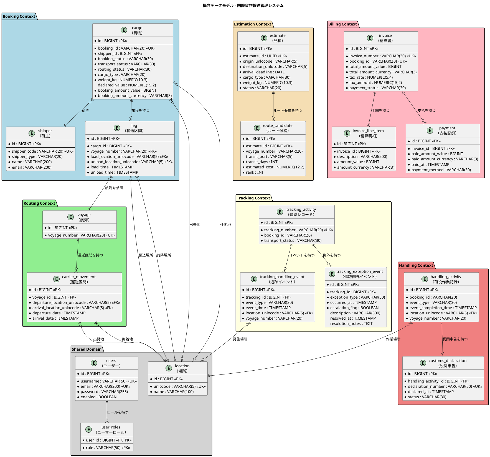
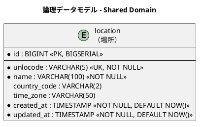
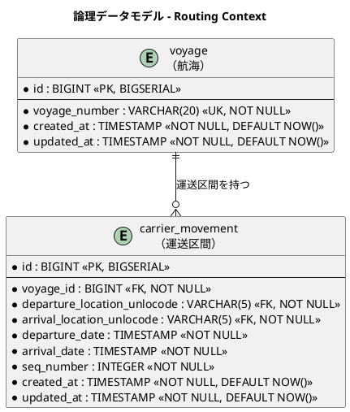
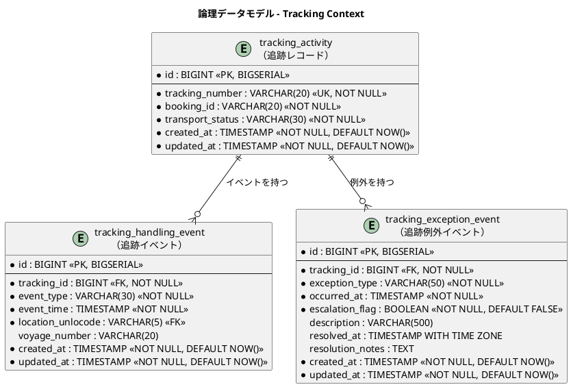
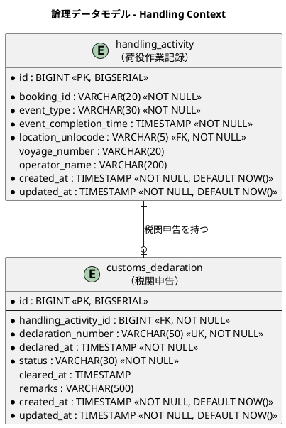
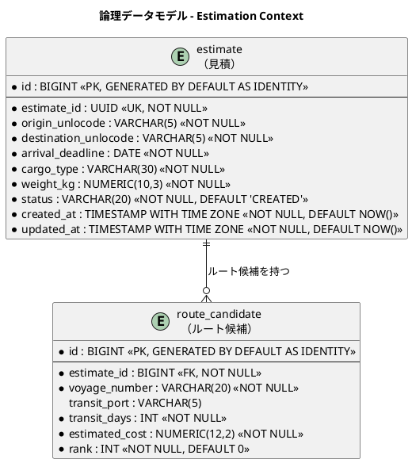
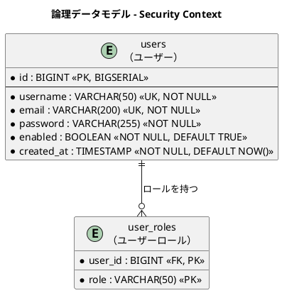

# データモデル設計 - 国際貨物輸送管理システム（F# 版）

## 概要

本ドキュメントは、国際貨物輸送管理システム（F# / .NET 版）の永続化層データモデルを定義します。
ドメインモデル分析で識別した 7 つの境界付けられたコンテキスト（Booking / Routing / Tracking / Handling / Billing / Estimation / Shared Domain）に対応する 18 テーブルを設計します。
`shipper`（荷主）テーブルと、認証用の `users` / `user_roles` テーブルを含みます。

DB スキーマは言語非依存であるため、テーブル構造・ER 図・マイグレーション方針は C# 版設計を踏襲します。データアクセス層のみ、F# のイディオム（レコード・判別共用体・Option 型・スマートコンストラクタ）に適合する Donald ベースのマッピングに置き換えます。

### 設計方針

- **DB**: PostgreSQL 16.x（本番・ステージング）、SQLite 3.x（開発環境）、Testcontainers による PostgreSQL（テスト）
- **データアクセス**: Donald（F# 向け ADO.NET 薄ラッパ）+ ADO.NET プロバイダ（Npgsql / Microsoft.Data.Sqlite）。SQL は手書きし、リポジトリ実装（各コンテキストの `Infrastructure.Repositories` モジュール）内に記述する
- **マッピング**: 自動マッピングは使用せず、`ofDataReader : IDataReader -> 'T` を手書きする。永続化用 DTO ↔ ドメイン型（レコード・判別共用体）の相互変換はスマートコンストラクタ経由で行う
- **マイグレーション**: DbUp（`Scripts/0001_xxx.sql` 形式のバージョン付き SQL スクリプト、forward-only、プロバイダ別ディレクトリで方言差異を吸収）
- **SQL 方言方針**: リポジトリの SQL は ANSI 標準の範囲を基本とし、PostgreSQL 固有機能（JSONB・配列型等）は使用しない
- **ID 戦略**: サロゲートキー（`BIGSERIAL`）+ 業務キー（`VARCHAR`）の併用
- **命名規則**: スネークケース（PostgreSQL 慣習。`ofDataReader` 内でカラム名を明示指定して F# レコードへマッピング）
- **監査カラム**: 全テーブルに `created_at` / `updated_at` を付与
- **時刻・日付の格納型**: アプリは全時刻を `DateTimeOffset` の ISO 8601 文字列として一貫して読み書きするため、PostgreSQL でも時刻・日付列は `timestamptz`/`date` ではなく `TEXT` で保持する（SQLite と挙動を統一。Npgsql の text→timestamp 暗黙キャスト不可を回避。IT8 本番環境整備で確定）

---

## 概念データモデル

全コンテキストのエンティティとその主要リレーションシップを俯瞰します。



---

## 論理データモデル

### Shared Domain

共有ドメインとして全コンテキストが参照する場所マスタです。UN/LOCODE（国連貿易港コード）を業務キーとします。



---

### Booking Context

貨物の予約・旅程情報を管理します。`cargo` が集約ルートで、`leg` が旅程の各区間を表します。荷主情報は `shipper` テーブルに正規化し、FK 参照とします。


---

### Routing Context

航海スケジュールと運送区間を管理します。`voyage` が集約ルートで、`carrier_movement` が個々の移動区間を表します。



---

### Tracking Context

貨物追跡の状態・イベント・例外を管理します。`tracking_activity` が集約ルートです。



---

### Handling Context

荷役作業の実績と税関申告を管理します。`handling_activity` が集約ルートです。



---

### Billing Context

精算書・明細・支払記録を管理します。参考実装には存在しない新規コンテキストです。


---

### Estimation Context

輸送見積とルート候補を管理します。`estimate` が集約ルートで、`route_candidate` が各ルート候補を表します。



---

### Security Context

Cookie / JWT 認証で利用するユーザー認証・認可テーブルです。カスタムのユーザーストア実装が参照します。



---

## テーブル定義

### `location`（場所マスタ）

| カラム名 | データ型 | 制約 | 説明 |
| :--- | :--- | :--- | :--- |
| `id` | `BIGINT` | `PK, NOT NULL` | サロゲートキー（BIGSERIAL） |
| `unlocode` | `VARCHAR(5)` | `UK, NOT NULL` | UN/LOCODE（業務キー。例: `JPTYO`） |
| `name` | `VARCHAR(100)` | `NOT NULL` | 場所名称（例: `Tokyo`） |
| `country_code` | `VARCHAR(2)` | | ISO 3166-1 alpha-2 国コード |
| `time_zone` | `VARCHAR(50)` | | タイムゾーン（例: `Asia/Tokyo`） |
| `created_at` | `TIMESTAMP WITH TIME ZONE` | `NOT NULL, DEFAULT NOW()` | レコード作成日時 |
| `updated_at` | `TIMESTAMP WITH TIME ZONE` | `NOT NULL, DEFAULT NOW()` | レコード更新日時 |

---

### `shipper`（荷主）

> **注記**: 旧設計で `cargo` テーブルに存在した `shipper_name`・`shipper_email` カラムは本テーブルへの正規化に伴い削除しました。

| カラム名 | データ型 | 制約 | 説明 |
| :--- | :--- | :--- | :--- |
| `id` | `BIGINT` | `PK, NOT NULL` | サロゲートキー（BIGSERIAL） |
| `shipper_code` | `VARCHAR(20)` | `UK, NOT NULL` | 荷主コード（業務キー。SHP-XXXXXX 形式） |
| `shipper_uuid` | `UUID` | | ShipperId（Guid）。Booking Context が横断参照する識別子（ADR-0008・マイグレーション 0005 で追加） |
| `shipper_type` | `VARCHAR(20)` | `NOT NULL` | 荷主種別（`INDIVIDUAL` / `CORPORATE`） |
| `name` | `VARCHAR(200)` | `NOT NULL` | 荷主名称 |
| `email` | `VARCHAR(200)` | `NOT NULL` | メールアドレス |
| `phone` | `VARCHAR(50)` | | 電話番号 |
| `contract_number` | `VARCHAR(50)` | | 契約番号（法人のみ。NULLable） |
| `discount_rate` | `NUMERIC(5,4)` | `DEFAULT 0.0000` | 割引率（0.0000〜0.3000、最大 30%） |
| `created_at` | `TIMESTAMP WITH TIME ZONE` | `NOT NULL, DEFAULT NOW()` | レコード作成日時 |
| `updated_at` | `TIMESTAMP WITH TIME ZONE` | `NOT NULL, DEFAULT NOW()` | レコード更新日時 |
| `version` | `BIGINT` | `NOT NULL, DEFAULT 0` | 楽観的ロック用バージョン（ADR-0001） |

#### DDL

```sql
CREATE TABLE shipper (
    id              BIGSERIAL PRIMARY KEY,
    shipper_code    VARCHAR(20)  NOT NULL UNIQUE,  -- SHP-XXXXXX 形式
    shipper_uuid    UUID,                          -- ShipperId（Guid）横断参照識別子（ADR-0008・0005 で追加）
    shipper_type    VARCHAR(20)  NOT NULL,          -- INDIVIDUAL / CORPORATE
    name            VARCHAR(200) NOT NULL,
    email           VARCHAR(200) NOT NULL,
    phone           VARCHAR(50),
    contract_number VARCHAR(50),                   -- 法人のみ（NULLable）
    discount_rate   NUMERIC(5,4) DEFAULT 0.0000,   -- 0.0000〜0.3000 (最大 30%)
    created_at      TIMESTAMP WITH TIME ZONE NOT NULL DEFAULT NOW(),
    updated_at      TIMESTAMP WITH TIME ZONE NOT NULL DEFAULT NOW()
);
```

#### Donald リポジトリ実装例

Donald では自動マッピングを行わず、`IDataReader` からレコードを組み立てる `ofDataReader` 関数を手書きします。カラム名は SQL とマッピング関数の両方に明示され、スネークケースの変換規約に依存しません。判別共用体（`ShipperType` 等）⇔ `VARCHAR` の変換はドメイン型のモジュールに定義した `toString` / `ofString`（スマートコンストラクタ）で行います。

```fsharp
// ドメイン型（Booking.Domain）
type ShipperType =
    | Individual
    | Corporate

module ShipperType =
    let toString = function
        | Individual -> "INDIVIDUAL"
        | Corporate  -> "CORPORATE"

    let ofString (s: string) : Result<ShipperType, string> =
        match s with
        | "INDIVIDUAL" -> Ok Individual
        | "CORPORATE"  -> Ok Corporate
        | other        -> Error $"不正な shipper_type: {other}"

// Infrastructure/Repositories/ShipperRepository.fs
// 接続は IDbConnection 抽象で受け、開発（SQLite）/ 本番（PostgreSQL）を透過的に扱う（ADR-0003）
module ShipperRepository =

    open System.Data
    open Donald

    /// IDataReader -> Shipper（カラム名を明示して読み取る）
    let private ofDataReader (rd: IDataReader) : Shipper =
        { ShipperCode    = rd.ReadString "shipper_code" |> ShipperCode
          ShipperType    = rd.ReadString "shipper_type"
                           |> ShipperType.ofString
                           |> Result.defaultWith (fun e -> failwith e)
          Name           = rd.ReadString "name"
          Email          = rd.ReadString "email"
          Phone          = rd.ReadStringOption "phone"          // NULL 列 → Option
          ContractNumber = rd.ReadStringOption "contract_number"
          DiscountRate   = rd.ReadDecimalOption "discount_rate"
                           |> Option.defaultValue 0.0000m }

    let findByCode (conn: IDbConnection) (ShipperCode code) : Shipper option =
        conn
        |> Db.newCommand """
            SELECT shipper_code, shipper_type, name, email,
                   phone, contract_number, discount_rate
            FROM shipper
            WHERE shipper_code = @shipper_code
            """
        |> Db.setParams [ "shipper_code", SqlType.String code ]
        |> Db.querySingle ofDataReader

    let add (conn: IDbConnection) (tx: IDbTransaction) (now: DateTimeOffset) (shipper: Shipper) : unit =
        // RETURNING は PostgreSQL 方言のため使用しない（ADR-0003）。
        // 呼び出し側は業務キー（shipper_code）で参照する
        conn
        |> Db.newCommand """
            INSERT INTO shipper (shipper_code, shipper_type, name, email,
                                 phone, contract_number, discount_rate,
                                 created_at, updated_at)
            VALUES (@shipper_code, @shipper_type, @name, @email,
                    @phone, @contract_number, @discount_rate,
                    @now, @now)
            """
        |> Db.setTransaction tx
        |> Db.setParams
            [ "shipper_code",    SqlType.String (ShipperCode.value shipper.ShipperCode)
              "shipper_type",    SqlType.String (ShipperType.toString shipper.ShipperType)
              "name",            SqlType.String shipper.Name
              "email",           SqlType.String shipper.Email
              "phone",           match shipper.Phone with
                                 | Some p -> SqlType.String p
                                 | None   -> SqlType.Null
              "contract_number", match shipper.ContractNumber with
                                 | Some c -> SqlType.String c
                                 | None   -> SqlType.Null
              "discount_rate",   SqlType.Decimal shipper.DiscountRate
              "now",             SqlType.DateTimeOffset now ]
        |> Db.exec
```

---

### `cargo`（貨物）

> **注記**: `shipper_name`・`shipper_email` カラムは削除し、`shipper_id`（FK → `shipper.id`）による参照に変更しました。
>
> **IT2 実装状況**: IT2 完了時点で初期マイグレーション群が適用済みです。
> 将来フェーズで追加予定のカラム（`transport_status`・`routing_status`・`booking_amount_*`・`consignee_*`・`tracking_number` 等）は下表の「将来追加予定」節に記載します。

| カラム名 | データ型 | 制約 | 説明 |
| :--- | :--- | :--- | :--- |
| `id` | `BIGINT` | `PK, NOT NULL` | サロゲートキー（`BIGINT GENERATED BY DEFAULT AS IDENTITY`） |
| `booking_id` | `VARCHAR(20)` | `UK, NOT NULL` | 予約 ID（業務キー。ドメインの単一ケース DU `BookingId of string` に対応） |
| `shipper_id` | `UUID` | `NOT NULL` | 荷主 ID（ShipperId の Guid。物理 FK ではなく業務識別子で参照・ADR-0008。BC 分離のため shipper サロゲートキーへの結合を避ける） |
| `cargo_type` | `VARCHAR(30)` | `NOT NULL` | 貨物種別（`GENERAL` / `HAZARDOUS` / `REFRIGERATED`） |
| `weight` | `NUMERIC(10,3)` | `NOT NULL, > 0` | 重量（kg） |
| `origin_unlocode` | `VARCHAR(5)` | `NOT NULL` | 出発地（RouteSpecification） |
| `destination_unlocode` | `VARCHAR(5)` | `NOT NULL` | 仕向地（RouteSpecification） |
| `arrival_deadline` | `DATE` | `NOT NULL` | 到着期限（RouteSpecification） |
| `booking_status` | `VARCHAR(30)` | `NOT NULL, DEFAULT 'PRELIMINARY'` | 予約状態（BookingState の文字列表現。`PRELIMINARY` / `ROUTING_REQUESTED`〔ADR-0007〕/ `ROUTE_PROPOSED` / … / `CANCELLED`） |
| `dimension_length` | `NUMERIC(10,3)` | | 貨物の長さ（cm、オプション） |
| `dimension_width` | `NUMERIC(10,3)` | | 貨物の幅（cm、オプション） |
| `dimension_height` | `NUMERIC(10,3)` | | 貨物の高さ（cm、オプション） |
| `quantity` | `INTEGER` | | 貨物個数（オプション、1 以上） |
| `description` | `VARCHAR(500)` | | 品名（オプション） |
| `hazardous_class` | `VARCHAR(10)` | | 危険物クラス（HAZARDOUS 時のみ） |
| `un_number` | `VARCHAR(10)` | | UN 番号（HAZARDOUS 時のみ） |
| `proper_shipping_name` | `VARCHAR(200)` | | 正式輸送品名（HAZARDOUS 時のみ） |
| `min_temperature` | `NUMERIC(10,3)` | | 最低温度（REFRIGERATED 時のみ） |
| `max_temperature` | `NUMERIC(10,3)` | | 最高温度（REFRIGERATED 時のみ） |
| `temperature_unit` | `VARCHAR(20)` | | 温度単位（`CELSIUS` / `FAHRENHEIT`、REFRIGERATED 時のみ） |
| `created_at` | `TIMESTAMP WITH TIME ZONE` | `NOT NULL, DEFAULT NOW()` | レコード作成日時 |
| `updated_at` | `TIMESTAMP WITH TIME ZONE` | `NOT NULL, DEFAULT NOW()` | レコード更新日時 |
| `version` | `BIGINT` | `NOT NULL, DEFAULT 0` | 楽観的ロック用バージョン（ADR-0001） |

> **F# マッピング注記**: `cargo_type` と種別依存カラム群（`hazardous_class` 等）はドメインでは `CargoType` 判別共用体（`General` / `Hazardous of HazardousSpec` / `Refrigerated of TemperatureRange`）1 つに畳み込まれます。永続化時は DU ケースを判別子カラム + ケース固有カラム（他ケースでは NULL）に展開し、復元時は判別子で分岐してケース固有カラムを読み取ります（後述「Donald マッピング方針」参照）。

> **ドメイン未対応カラム注記**: `weight`・`declared_value` は C# 版スキーマ踏襲によりドメインモデル（domain-model.md）の Cargo 集約に対応フィールドが無いカラムです。実装フェーズでドメインへの反映（値オブジェクト追加）または削除を判断します。

#### 将来追加予定カラム（IT4+）

| カラム名 | データ型 | 説明 | 追加フェーズ |
| :--- | :--- | :--- | :--- |
| `transport_status` | `VARCHAR(30)` | 輸送状態（TransportStatus） | Tracking Context 実装時 |
| `routing_status` | `VARCHAR(30)` | 経路決定状態（ROUTED / MISROUTED / NOT_ROUTED） | Routing Context 実装時 |
| `booking_amount_value` | `BIGINT` | 予約金額（最小通貨単位） | Billing Context 実装時 |
| `booking_amount_currency` | `VARCHAR(3)` | 通貨コード（ISO 4217） | Billing Context 実装時 |
| `consignee_name` | `VARCHAR(200)` | 荷受人名 | 荷受人管理実装時 |
| `consignee_email` | `VARCHAR(200)` | 荷受人メールアドレス | 荷受人管理実装時 |
| `tracking_number` | `VARCHAR(20)` | 追跡番号（発行後に設定） | Tracking Context 実装時 |
| `next_expected_*` | 各種 | 次の予定荷役情報 | Tracking Context 実装時 |
| `last_handling_event_*` | 各種 | 最後の荷役イベント情報 | Handling Context 実装時 |

---

### `leg`（輸送区間）

> **IT4 実装状況**: マイグレーション 0007 で作成（US09-13 経路確定・旅程永続化）。`cargo` 集約に属し、集約ルート経由でのみ更新する（ADR-0001）。`cargo_id` にはコンテキスト内参照として FK 制約を設ける。`voyage_number`・`load_location_unlocode`・`unload_location_unlocode` は BC 分離のため物理 FK は張らず業務キーとして保持する。

| カラム名 | データ型 | 制約 | 説明 |
| :--- | :--- | :--- | :--- |
| `id` | `BIGINT` | `PK, NOT NULL` | サロゲートキー（BIGSERIAL） |
| `cargo_id` | `BIGINT` | `FK → cargo.id, NOT NULL` | 親貨物 ID |
| `voyage_number` | `VARCHAR(20)` | `FK → voyage.voyage_number, NOT NULL` | 航海番号 |
| `load_location_unlocode` | `VARCHAR(5)` | `FK → location.unlocode, NOT NULL` | 積込場所（UN/LOCODE） |
| `unload_location_unlocode` | `VARCHAR(5)` | `FK → location.unlocode, NOT NULL` | 荷降場所（UN/LOCODE） |
| `load_time` | `TIMESTAMP` | | 積込予定日時 |
| `unload_time` | `TIMESTAMP` | | 荷降予定日時 |
| `seq_number` | `INTEGER` | `NOT NULL` | 区間順序（1 始まり） |
| `created_at` | `TIMESTAMP` | `NOT NULL, DEFAULT NOW()` | レコード作成日時 |
| `updated_at` | `TIMESTAMP` | `NOT NULL, DEFAULT NOW()` | レコード更新日時 |

---

### `voyage`（航海）

> **IT3 実装状況**: マイグレーション 0006 で `vessel_name`・`carrier_name`・`supported_cargo_types` を追加（US24 の船名・運送会社・対応貨物種別要件に対応）。ドメインの `Voyage` 集約（`VesselName`・`CarrierName`・`Set<CargoTypeTag>`）に対応する。

| カラム名 | データ型 | 制約 | 説明 |
| :--- | :--- | :--- | :--- |
| `id` | `BIGINT` | `PK, NOT NULL` | サロゲートキー（BIGSERIAL） |
| `voyage_number` | `VARCHAR(20)` | `UK, NOT NULL` | 航海番号（業務キー） |
| `vessel_name` | `VARCHAR(100)` | `NOT NULL` | 船名（US24・0006 で追加） |
| `carrier_name` | `VARCHAR(100)` | `NOT NULL` | 運送会社名（US24・0006 で追加） |
| `supported_cargo_types` | `VARCHAR(50)` | `NOT NULL` | 対応貨物種別（`GENERAL,HAZARDOUS,REFRIGERATED` のカンマ区切り・US24・0006 で追加） |
| `created_at` | `TIMESTAMP` | `NOT NULL, DEFAULT NOW()` | レコード作成日時 |
| `updated_at` | `TIMESTAMP` | `NOT NULL, DEFAULT NOW()` | レコード更新日時 |
| `version` | `BIGINT` | `NOT NULL, DEFAULT 0` | 楽観的ロック用バージョン（ADR-0001） |

---

### `carrier_movement`（運送区間）

| カラム名 | データ型 | 制約 | 説明 |
| :--- | :--- | :--- | :--- |
| `id` | `BIGINT` | `PK, NOT NULL` | サロゲートキー（BIGSERIAL） |
| `voyage_id` | `BIGINT` | `FK → voyage.id, NOT NULL` | 親航海 ID |
| `departure_location_unlocode` | `VARCHAR(5)` | `FK → location.unlocode, NOT NULL` | 出発地（UN/LOCODE） |
| `arrival_location_unlocode` | `VARCHAR(5)` | `FK → location.unlocode, NOT NULL` | 到着地（UN/LOCODE） |
| `departure_date` | `TIMESTAMP` | `NOT NULL` | 出発日時 |
| `arrival_date` | `TIMESTAMP` | `NOT NULL` | 到着日時 |
| `seq_number` | `INTEGER` | `NOT NULL` | 区間順序（1 始まり） |
| `created_at` | `TIMESTAMP` | `NOT NULL, DEFAULT NOW()` | レコード作成日時 |
| `updated_at` | `TIMESTAMP` | `NOT NULL, DEFAULT NOW()` | レコード更新日時 |

---

### `tracking_activity`（追跡レコード）

> **IT5 実装状況**: マイグレーション 0009 で作成（US14/US18）。`transport_status` はイベント履歴からの導出値（`currentStatus`）をクエリ用に非正規化保持する（復元時は tracking_handling_event から導出し直す）。公開追跡ページ（US18・未認証）用に `access_token`（`VARCHAR(64) UK`・推測困難トークン）を追加した。`booking_id`・`tracking_number` は BC をまたぐ参照のため物理 FK を張らず業務キー保持。

| カラム名 | データ型 | 制約 | 説明 |
| :--- | :--- | :--- | :--- |
| `id` | `BIGINT` | `PK, NOT NULL` | サロゲートキー（BIGSERIAL） |
| `tracking_number` | `VARCHAR(20)` | `UK, NOT NULL` | 追跡番号（業務キー。単一ケース DU `TrackingNumber of string` に対応） |
| `booking_id` | `VARCHAR(20)` | `NOT NULL` | 予約 ID（参照整合性は書き込み側で保証） |
| `transport_status` | `VARCHAR(30)` | `NOT NULL` | 輸送状態（TransportStatus・導出値の非正規化キャッシュ） |
| `access_token` | `VARCHAR(64)` | `UK, NOT NULL` | 公開追跡照会用トークン（US18・IT5 0009 で追加） |
| `created_at` | `TIMESTAMP` | `NOT NULL, DEFAULT NOW()` | レコード作成日時 |
| `updated_at` | `TIMESTAMP` | `NOT NULL, DEFAULT NOW()` | レコード更新日時 |
| `version` | `BIGINT` | `NOT NULL, DEFAULT 0` | 楽観的ロック用バージョン（ADR-0001） |

---

### `notification_log`（荷主通知記録）

> **IT4 実装状況**: マイグレーション 0008 で作成（US12 荷主通知）。経路確定などの通知イベントを記録する最小実装。実送信（メール等）は後続 IT で差し替える。`booking_id` はコンテキストをまたぐ参照のため物理 FK は張らず業務キーとして保持する。

| カラム名 | データ型 | 制約 | 説明 |
| :--- | :--- | :--- | :--- |
| `id` | `BIGINT` | `PK, NOT NULL` | サロゲートキー（BIGSERIAL） |
| `booking_id` | `VARCHAR(20)` | `NOT NULL` | 予約 ID（参照整合性は書き込み側で保証） |
| `recipient` | `VARCHAR(255)` | `NOT NULL` | 通知先（荷主識別子） |
| `message` | `TEXT` | `NOT NULL` | 通知本文 |
| `notified_at` | `TIMESTAMP` | `NOT NULL` | 通知日時 |
| `created_at` | `TIMESTAMP` | `NOT NULL, DEFAULT NOW()` | レコード作成日時 |

---

### `tracking_handling_event`（追跡イベント）

| カラム名 | データ型 | 制約 | 説明 |
| :--- | :--- | :--- | :--- |
| `id` | `BIGINT` | `PK, NOT NULL` | サロゲートキー（BIGSERIAL） |
| `tracking_id` | `BIGINT` | `FK → tracking_activity.id, NOT NULL` | 親追跡レコード ID |
| `event_type` | `VARCHAR(30)` | `NOT NULL` | 荷役タイプ（HandlingType） |
| `event_time` | `TIMESTAMP` | `NOT NULL` | イベント発生日時 |
| `location_unlocode` | `VARCHAR(5)` | `FK → location.unlocode` | イベント発生場所（UN/LOCODE） |
| `voyage_number` | `VARCHAR(20)` | | 関連する航海番号 |
| `created_at` | `TIMESTAMP` | `NOT NULL, DEFAULT NOW()` | レコード作成日時 |
| `updated_at` | `TIMESTAMP` | `NOT NULL, DEFAULT NOW()` | レコード更新日時 |

---

### `tracking_exception_event`（追跡例外イベント）

| カラム名 | データ型 | 制約 | 説明 |
| :--- | :--- | :--- | :--- |
| `id` | `BIGINT` | `PK, NOT NULL` | サロゲートキー（BIGSERIAL） |
| `tracking_id` | `BIGINT` | `FK → tracking_activity.id, NOT NULL` | 親追跡レコード ID |
| `exception_type` | `VARCHAR(50)` | `NOT NULL` | 例外種別（例: `CUSTOMS_HOLD`, `DAMAGE`, `DELAY`） |
| `occurred_at` | `TIMESTAMP WITH TIME ZONE` | `NOT NULL` | 例外発生日時 |
| `escalation_flag` | `BOOLEAN` | `NOT NULL, DEFAULT FALSE` | エスカレーション判定フラグ（US20 紛失時） |
| `description` | `VARCHAR(500)` | | 例外内容の詳細 |
| `resolved_at` | `TIMESTAMP WITH TIME ZONE` | | 解決日時（NULL = 未解決。F# では `DateTimeOffset option`） |
| `resolution_notes` | `TEXT` | | 対応内容メモ |
| `created_at` | `TIMESTAMP WITH TIME ZONE` | `NOT NULL, DEFAULT NOW()` | レコード作成日時 |
| `updated_at` | `TIMESTAMP WITH TIME ZONE` | `NOT NULL, DEFAULT NOW()` | レコード更新日時 |

---

### `handling_activity`（荷役作業記録）

> **IT5 実装状況**: マイグレーション 0010 で作成（US15/US16）。引取（CLAIM）時の荷受人確認（署名または確認コード）を `consignee_confirmation` に保持する。`booking_id` は BC をまたぐ参照のため物理 FK を張らず業務キー保持。通関（customs_declaration）は次 IT。

| カラム名 | データ型 | 制約 | 説明 |
| :--- | :--- | :--- | :--- |
| `id` | `BIGINT` | `PK, NOT NULL` | サロゲートキー（BIGSERIAL） |
| `booking_id` | `VARCHAR(20)` | `NOT NULL` | 予約 ID（参照整合性は書き込み側で保証） |
| `event_type` | `VARCHAR(30)` | `NOT NULL` | 荷役タイプ（RECEIVE / LOAD / UNLOAD / CUSTOMS / CLAIM） |
| `event_completion_time` | `TIMESTAMP` | `NOT NULL` | 荷役完了日時 |
| `location_unlocode` | `VARCHAR(5)` | `FK → location.unlocode, NOT NULL` | 作業場所（UN/LOCODE） |
| `voyage_number` | `VARCHAR(20)` | | 関連する航海番号（LOAD / UNLOAD 時に設定） |
| `consignee_confirmation` | `VARCHAR(255)` | | 引取時の荷受人確認（US16・IT5 0010 で追加） |
| `operator_name` | `VARCHAR(200)` | | 作業員名 |
| `created_at` | `TIMESTAMP` | `NOT NULL, DEFAULT NOW()` | レコード作成日時 |
| `updated_at` | `TIMESTAMP` | `NOT NULL, DEFAULT NOW()` | レコード更新日時 |
| `version` | `BIGINT` | `NOT NULL, DEFAULT 0` | 楽観的ロック用バージョン（ADR-0001） |

---

### `customs_declaration`（税関申告）

| カラム名 | データ型 | 制約 | 説明 |
| :--- | :--- | :--- | :--- |
| `id` | `BIGINT` | `PK, NOT NULL` | サロゲートキー（BIGSERIAL） |
| `handling_activity_id` | `BIGINT` | `FK → handling_activity.id, NOT NULL` | 関連荷役作業 ID |
| `declaration_number` | `VARCHAR(50)` | `UK, NOT NULL` | 申告番号（業務キー） |
| `declared_at` | `TIMESTAMP` | `NOT NULL` | 申告日時 |
| `status` | `VARCHAR(30)` | `NOT NULL` | 申告状態（例: `PENDING`, `CLEARED`, `HELD`） |
| `cleared_at` | `TIMESTAMP` | | 通関完了日時（NULL = 未完了） |
| `remarks` | `VARCHAR(500)` | | 備考・メモ |
| `created_at` | `TIMESTAMP` | `NOT NULL, DEFAULT NOW()` | レコード作成日時 |
| `updated_at` | `TIMESTAMP` | `NOT NULL, DEFAULT NOW()` | レコード更新日時 |

---

### `invoice`（精算書）

> **IT7 実装状況（マイグレーション 0013・実装が正）**: 下表は C# 版踏襲の当初設計。IT7 の実装スキーマは以下で、消費税・合計金額・楽観ロックは未導入（domain-model の `Invoice` 準拠）。当初設計の `total_amount_*`/`tax_rate`/`tax_amount`/`discount_amount_*`/`version` は本 IT では採用せず、消費税・付加料金は精算強化 IT で `invoice_line_item`＋`tax_amount` として実装予定（retro-7 Try#5）。
>
> 実装カラム: `id`・`invoice_number`(UK)・`booking_id`(UK)・`shipper_id`・`base_amount_value`/`base_amount_currency`（基本料金）・`discount_rate`（NUMERIC・0〜0.3）・`final_amount_value`/`final_amount_currency`（割引後）・`payment_status`（PENDING/CONFIRMED/OVERDUE/REFUNDED）・`issued_at`・`due_date`・`paid_at`・`created_at`・`updated_at`。`Money` は `*_value`＋`*_currency` の 2 カラム、`PaymentState` DU は `payment_status`＋`due_date`/`paid_at` へ写像する。

| カラム名 | データ型 | 制約 | 説明 |
| :--- | :--- | :--- | :--- |
| `id` | `BIGINT` | `PK, NOT NULL` | サロゲートキー（BIGSERIAL） |
| `invoice_number` | `VARCHAR(30)` | `UK, NOT NULL` | 精算書番号（業務キー） |
| `booking_id` | `VARCHAR(20)` | `UK, NOT NULL` | 予約 ID（UNIQUE 制約で二重請求を防止） |
| `total_amount_value` | `BIGINT` | `NOT NULL` | 合計金額（最小通貨単位） |
| `total_amount_currency` | `VARCHAR(3)` | `NOT NULL` | 通貨コード（ISO 4217） |
| `tax_rate` | `NUMERIC(5,4)` | `NOT NULL, DEFAULT 0.1000` | 消費税率（デフォルト 10%） |
| `tax_amount` | `NUMERIC(15,2)` | `NOT NULL, DEFAULT 0` | 消費税額 |
| `payment_status` | `VARCHAR(30)` | `NOT NULL` | 支払状態（`PENDING` / `CONFIRMED` / `OVERDUE` / `REFUNDED`） |
| `issued_at` | `TIMESTAMP WITH TIME ZONE` | | 発行日時 |
| `due_date` | `DATE` | | 支払期日 |
| `discount_amount_value` | `BIGINT` | | 割引金額（最小通貨単位） |
| `discount_amount_currency` | `VARCHAR(3)` | | 割引通貨コード |
| `created_at` | `TIMESTAMP WITH TIME ZONE` | `NOT NULL, DEFAULT NOW()` | レコード作成日時 |
| `updated_at` | `TIMESTAMP WITH TIME ZONE` | `NOT NULL, DEFAULT NOW()` | レコード更新日時 |
| `version` | `BIGINT` | `NOT NULL, DEFAULT 0` | 楽観的ロック用バージョン（ADR-0001） |

> **F# マッピング注記（当初設計・未実装）**: 当初は割引を `discount_amount_value`/`discount_amount_currency`（`DiscountAmount : Money option`）で持つ設計だったが、**IT7 実装では割引を `discount_rate`（率）で保持し、割引後金額を `final_amount_*` に確定して持つ**方式に変更した（`Invoice.generate` が割引適用済みの `FinalAmount` を算出）。当初設計の `DiscountAmount` フィールドは実装に存在しない。

> **ドメイン未対応カラム注記（当初設計・未実装）**: `tax_rate`・`tax_amount`・`total_amount_*` は当初設計（C# 版踏襲）のカラムで、IT7 の Invoice 集約には対応フィールドが無く未実装。消費税・付加料金は精算強化 IT で実装する（retro-7 Try#5）。

---

### `invoice_line_item`（精算明細）

| カラム名 | データ型 | 制約 | 説明 |
| :--- | :--- | :--- | :--- |
| `id` | `BIGINT` | `PK, NOT NULL` | サロゲートキー（BIGSERIAL） |
| `invoice_id` | `BIGINT` | `FK → invoice.id, NOT NULL` | 親精算書 ID |
| `description` | `VARCHAR(200)` | `NOT NULL` | 明細項目説明 |
| `amount_value` | `BIGINT` | `NOT NULL` | 明細金額（最小通貨単位） |
| `amount_currency` | `VARCHAR(3)` | `NOT NULL` | 通貨コード（ISO 4217） |
| `seq_number` | `INTEGER` | `NOT NULL` | 明細順序（1 始まり） |
| `created_at` | `TIMESTAMP` | `NOT NULL, DEFAULT NOW()` | レコード作成日時 |
| `updated_at` | `TIMESTAMP` | `NOT NULL, DEFAULT NOW()` | レコード更新日時 |

---

### `payment`（支払記録）

| カラム名 | データ型 | 制約 | 説明 |
| :--- | :--- | :--- | :--- |
| `id` | `BIGINT` | `PK, NOT NULL` | サロゲートキー（BIGSERIAL） |
| `invoice_id` | `BIGINT` | `FK → invoice.id, NOT NULL` | 親精算書 ID |
| `paid_amount_value` | `BIGINT` | `NOT NULL` | 支払金額（最小通貨単位） |
| `paid_amount_currency` | `VARCHAR(3)` | `NOT NULL` | 通貨コード（ISO 4217） |
| `paid_at` | `TIMESTAMP` | `NOT NULL` | 支払日時 |
| `payment_method` | `VARCHAR(30)` | `NOT NULL` | 支払方法（例: `BANK_TRANSFER`, `CREDIT_CARD`） |
| `transaction_reference` | `VARCHAR(100)` | | 取引参照番号（外部決済システムの ID） |
| `created_at` | `TIMESTAMP WITH TIME ZONE` | `NOT NULL, DEFAULT NOW()` | レコード作成日時 |
| `updated_at` | `TIMESTAMP WITH TIME ZONE` | `NOT NULL, DEFAULT NOW()` | レコード更新日時 |

---

### `discount_policy`（割引ポリシーマスタ）

> **IT7 実装状況**: マイグレーション 0012 で作成（US-ADM-01）。運用管理者（ROLE_ADMIN）が登録・変更・無効化する法人割引ポリシーのマスタ。有効期間内かつ `active = true` のポリシーのみ US22 の割引計算に使う（`DiscountPolicyMaster.isEffectiveOn`）。`policy_type` は `DiscountPolicy` DU（`CORPORATE_STANDARD`/`VOLUME_DISCOUNT`/`SEASONAL`/`NO_DISCOUNT`）に対応。

| カラム名 | データ型 | 制約 | 説明 |
| :--- | :--- | :--- | :--- |
| `id` | `BIGINT` | `PK, NOT NULL` | サロゲートキー（BIGSERIAL） |
| `policy_type` | `VARCHAR(30)` | `NOT NULL` | 割引方針（`DiscountPolicy` DU の永続値） |
| `discount_rate` | `NUMERIC(5,4)` | `NOT NULL` | 割引率（0.0000〜0.3000・最大 30%） |
| `applicable_condition` | `VARCHAR(200)` | | 適用条件（自由記述） |
| `effective_from` | `DATE` | `NOT NULL` | 有効開始日 |
| `effective_to` | `DATE` | | 有効終了日（NULL = 無期限） |
| `active` | `BOOLEAN` | `NOT NULL, DEFAULT TRUE` | 有効フラグ（無効化で FALSE） |
| `created_at` | `TIMESTAMP` | `NOT NULL, DEFAULT NOW()` | レコード作成日時 |
| `updated_at` | `TIMESTAMP` | `NOT NULL, DEFAULT NOW()` | レコード更新日時 |

---

### `users`（ユーザー）

認証のカスタムユーザーストアが参照するユーザー認証テーブルです。

| カラム名 | データ型 | 制約 | 説明 |
| :--- | :--- | :--- | :--- |
| `id` | `BIGINT` | `PK, NOT NULL` | サロゲートキー（BIGSERIAL） |
| `username` | `VARCHAR(50)` | `UK, NOT NULL` | ログイン名 |
| `email` | `VARCHAR(200)` | `UK, NOT NULL` | メールアドレス |
| `password` | `VARCHAR(255)` | `NOT NULL` | パスワード（BCrypt ハッシュ） |
| `enabled` | `BOOLEAN` | `NOT NULL, DEFAULT TRUE` | アカウント有効フラグ |
| `created_at` | `TIMESTAMP WITH TIME ZONE` | `NOT NULL, DEFAULT NOW()` | レコード作成日時 |

#### DDL

```sql
CREATE TABLE users (
    id           BIGSERIAL PRIMARY KEY,
    username     VARCHAR(50)  NOT NULL UNIQUE,
    email        VARCHAR(200) NOT NULL UNIQUE,
    password     VARCHAR(255) NOT NULL,  -- BCrypt ハッシュ
    enabled      BOOLEAN NOT NULL DEFAULT TRUE,
    created_at   TIMESTAMP WITH TIME ZONE NOT NULL DEFAULT NOW()
);
```

---

### `user_roles`（ユーザーロール）

| カラム名 | データ型 | 制約 | 説明 |
| :--- | :--- | :--- | :--- |
| `user_id` | `BIGINT` | `PK, FK → users.id, NOT NULL` | 親ユーザー ID |
| `role` | `VARCHAR(50)` | `PK, NOT NULL` | ロール名（`ROLE_ADMIN` / `ROLE_OPERATOR` / `ROLE_SHIPPER` 等） |

#### DDL

```sql
CREATE TABLE user_roles (
    user_id  BIGINT      NOT NULL REFERENCES users(id),
    role     VARCHAR(50) NOT NULL,  -- ROLE_ADMIN / ROLE_OPERATOR / ROLE_SHIPPER 等
    PRIMARY KEY (user_id, role)
);
```

---

### `estimate`（見積）

| カラム名 | データ型 | 制約 | 説明 |
| :--- | :--- | :--- | :--- |
| `id` | `BIGINT` | `PK, NOT NULL` | サロゲートキー（`GENERATED BY DEFAULT AS IDENTITY`） |
| `estimate_id` | `UUID` | `UK, NOT NULL` | 見積 ID（業務キー） |
| `origin_unlocode` | `VARCHAR(5)` | `NOT NULL` | 出発地（UN/LOCODE） |
| `destination_unlocode` | `VARCHAR(5)` | `NOT NULL` | 仕向地（UN/LOCODE） |
| `arrival_deadline` | `DATE` | `NOT NULL` | 到着期限 |
| `cargo_type` | `VARCHAR(30)` | `NOT NULL` | 貨物種別（`GENERAL` / `HAZARDOUS` / `REFRIGERATED`） |
| `weight_kg` | `NUMERIC(10,3)` | `NOT NULL` | 重量（kg） |
| `status` | `VARCHAR(20)` | `NOT NULL, DEFAULT 'CREATED'` | 見積状態（`CREATED` / `EXPIRED`） |
| `created_at` | `TIMESTAMP WITH TIME ZONE` | `NOT NULL, DEFAULT NOW()` | レコード作成日時 |
| `updated_at` | `TIMESTAMP WITH TIME ZONE` | `NOT NULL, DEFAULT NOW()` | レコード更新日時 |
| `version` | `BIGINT` | `NOT NULL, DEFAULT 0` | 楽観的ロック用バージョン（ADR-0001） |

#### DDL

```sql
CREATE TABLE estimate (
    id                    BIGINT GENERATED BY DEFAULT AS IDENTITY PRIMARY KEY,
    estimate_id           UUID NOT NULL UNIQUE,
    origin_unlocode       VARCHAR(5) NOT NULL,
    destination_unlocode  VARCHAR(5) NOT NULL,
    arrival_deadline      DATE NOT NULL,
    cargo_type            VARCHAR(30) NOT NULL,
    weight_kg             NUMERIC(10, 3) NOT NULL,
    status                VARCHAR(20) NOT NULL DEFAULT 'CREATED',
    created_at            TIMESTAMP WITH TIME ZONE NOT NULL DEFAULT NOW(),
    updated_at            TIMESTAMP WITH TIME ZONE NOT NULL DEFAULT NOW()
);
```

---

### `route_candidate`（ルート候補）

| カラム名 | データ型 | 制約 | 説明 |
| :--- | :--- | :--- | :--- |
| `id` | `BIGINT` | `PK, NOT NULL` | サロゲートキー（`GENERATED BY DEFAULT AS IDENTITY`） |
| `estimate_id` | `BIGINT` | `FK → estimate.id, NOT NULL` | 親見積 ID（CASCADE 削除） |
| `voyage_number` | `VARCHAR(20)` | `NOT NULL` | 航海番号 |
| `transit_port` | `VARCHAR(5)` | | 経由港（UN/LOCODE、オプション） |
| `transit_days` | `INT` | `NOT NULL` | 輸送日数 |
| `estimated_cost` | `NUMERIC(12,2)` | `NOT NULL` | 見積コスト |
| `rank` | `INT` | `NOT NULL, DEFAULT 0` | ルート候補の優先順位 |

#### DDL

```sql
CREATE TABLE route_candidate (
    id              BIGINT GENERATED BY DEFAULT AS IDENTITY PRIMARY KEY,
    estimate_id     BIGINT NOT NULL REFERENCES estimate(id) ON DELETE CASCADE,
    voyage_number   VARCHAR(20) NOT NULL,
    transit_port    VARCHAR(5),
    transit_days    INT NOT NULL,
    estimated_cost  NUMERIC(12, 2) NOT NULL,
    rank            INT NOT NULL DEFAULT 0
);
```

---

## Donald マッピング方針

Dapper（C# 版）の自動マッピング + `TypeHandler` に代わり、F# 版では Donald の `Db.newCommand` / `Db.query` と手書きの `ofDataReader` 関数でマッピングします。マッピングを明示的な関数にすることで、コンパイル時にカラム読み取りとドメイン型の対応が検証可能になり、リフレクションベースの実行時エラー（プロパティ名不一致等）を排除できます。

### 基本パターン: `ofDataReader` + スマートコンストラクタ

永続化層は「DB の行 → 永続化用 DTO → ドメイン型」の 2 段階で復元します。DB に保存されている値は過去に不変条件を満たして保存されたものですが、復元時もスマートコンストラクタ（`ofString` / `create`）を通し、スキーマ変更や手動データ修正による不正値を境界で検出します。

```fsharp
// ドメイン型（値オブジェクトは判別共用体、集約はレコード）
type BookingId = private BookingId of string

module BookingId =
    let create (s: string) : Result<BookingId, string> =
        if System.String.IsNullOrWhiteSpace s then Error "BookingId は空にできません"
        elif s.Length > 20 then Error "BookingId は 20 文字以内です"
        else Ok (BookingId s)

    let value (BookingId s) = s

type BookingState =
    | NotBooked
    | Booked
    | Settled
    | Cancelled

module BookingState =
    let toString = function
        | NotBooked -> "NOT_BOOKED"
        | Booked    -> "BOOKED"
        | Settled   -> "SETTLED"
        | Cancelled -> "CANCELLED"

    let ofString = function
        | "NOT_BOOKED" -> Ok NotBooked
        | "BOOKED"     -> Ok Booked
        | "SETTLED"    -> Ok Settled
        | "CANCELLED"  -> Ok Cancelled
        | other        -> Error $"不正な booking_status: {other}"
```

```fsharp
// 永続化用 DTO（DB の行と 1:1。プリミティブ型 + Option のみで構成）
type CargoRow =
    { BookingId          : string
      ShipperCode        : string
      BookingState      : string
      CargoType          : string
      WeightKg           : decimal
      OriginUnlocode     : string
      DestinationUnlocode: string
      ArrivalDeadline    : DateTime
      DeclaredValue      : decimal option    // NULL 列
      TrackingNumber     : string option     // NULL 列
      Version            : int64 }

module CargoRow =

    open System.Data
    open Donald

    /// IDataReader -> CargoRow（Donald の Read* 拡張でカラム名を明示）
    let ofDataReader (rd: IDataReader) : CargoRow =
        { BookingId           = rd.ReadString "booking_id"
          ShipperCode         = rd.ReadString "shipper_code"
          BookingState       = rd.ReadString "booking_status"
          CargoType           = rd.ReadString "cargo_type"
          WeightKg            = rd.ReadDecimal "weight"
          OriginUnlocode      = rd.ReadString "origin_unlocode"
          DestinationUnlocode = rd.ReadString "destination_unlocode"
          ArrivalDeadline     = rd.ReadDateTime "arrival_deadline"
          DeclaredValue       = rd.ReadDecimalOption "declared_value"   // DBNull -> None
          TrackingNumber      = rd.ReadStringOption "tracking_number"   // DBNull -> None
          Version             = rd.ReadInt64 "version" }

    /// CargoRow -> Cargo（スマートコンストラクタ経由の復元。失敗は Result で表現）
    let toDomain (row: CargoRow) : Result<Cargo, string> =
        result {
            let! bookingId   = BookingId.create row.BookingId
            let! status      = BookingState.ofString row.BookingState
            let! origin      = UnLocode.create row.OriginUnlocode
            let! destination = UnLocode.create row.DestinationUnlocode
            let! weight      = Weight.create row.WeightKg
            let! cargoType   = CargoType.ofString row.CargoType
            let! trackingNumber  =
                row.TrackingNumber
                |> Option.map (TrackingId.create >> Result.map Some)
                |> Option.defaultValue (Ok None)
            return
                { BookingId     = bookingId
                  BookingState = status
                  CargoType     = cargoType
                  Weight        = weight
                  RouteSpec     = { Origin          = origin
                                    Destination     = destination
                                    ArrivalDeadline = DateOnly.FromDateTime row.ArrivalDeadline }
                  DeclaredValue = row.DeclaredValue
                  TrackingId    = trackingNumber
                  Version       = row.Version }
        }
```

```fsharp
// リポジトリ実装（Booking.Infrastructure.Repositories.CargoRepository）
module CargoRepository =

    open System.Data
    open Donald

    let findByBookingId (conn: IDbConnection) (bookingId: BookingId) : Result<Cargo option, string> =
        conn
        |> Db.newCommand """
            SELECT c.booking_id, s.shipper_code, c.booking_status, c.cargo_type,
                   c.weight, c.origin_unlocode, c.destination_unlocode,
                   c.arrival_deadline, c.declared_value, c.tracking_number, c.version
            FROM cargo c
            JOIN shipper s ON s.id = c.shipper_id
            WHERE c.booking_id = @booking_id
            """
        |> Db.setParams [ "booking_id", SqlType.String (BookingId.value bookingId) ]
        |> Db.querySingle CargoRow.ofDataReader     // IDataReader -> CargoRow option
        |> function
           | Some row -> CargoRow.toDomain row |> Result.map Some
           | None     -> Ok None

    let findAll (conn: IDbConnection) : Result<Cargo list, string> =
        conn
        |> Db.newCommand "SELECT ... FROM cargo c JOIN shipper s ON s.id = c.shipper_id"
        |> Db.query CargoRow.ofDataReader           // IDataReader -> CargoRow list
        |> List.map CargoRow.toDomain
        |> List.fold (fun acc r ->                  // Result list -> Result<list>
            match acc, r with
            | Ok xs, Ok x    -> Ok (x :: xs)
            | Error e, _     -> Error e
            | _, Error e     -> Error e) (Ok [])
        |> Result.map List.rev
```

書き込み側は「ドメイン型 → SQL パラメータ」への展開で、DU は `toString`、単一ケース DU は `value`、Option は `SqlType.Null` へ変換します。

```fsharp
    let update (conn: IDbConnection) (tx: IDbTransaction) (now: DateTimeOffset) (cargo: Cargo) : Result<unit, ConcurrencyError> =
        let affected =
            conn
            |> Db.newCommand """
                UPDATE cargo
                SET    booking_status       = @booking_status,
                       destination_unlocode = @destination_unlocode,
                       tracking_number      = @tracking_number,
                       version              = version + 1,
                       updated_at           = @now
                WHERE  booking_id = @booking_id
                AND    version    = @expected_version
                """
            |> Db.setTransaction tx
            |> Db.setParams
                [ "booking_status",       SqlType.String (BookingState.toString cargo.BookingState)
                  "destination_unlocode", SqlType.String (UnLocode.value cargo.RouteSpec.Destination)
                  "tracking_number",      match cargo.TrackingId with
                                          | Some tid -> SqlType.String (TrackingId.value tid)
                                          | None     -> SqlType.Null
                  "now",                  SqlType.DateTimeOffset now
                  "booking_id",           SqlType.String (BookingId.value cargo.BookingId)
                  "expected_version",     SqlType.Int64 cargo.Version ]
            |> Db.execReturningRowsAffected     // 実装は ExecuteNonQuery の戻り値を利用
        if affected = 0 then Error ConcurrencyError.VersionConflict else Ok ()
```

### Option 型と NULL 列の対応

| DB | F#（DTO / ドメイン） | 読み取り | 書き込み |
| :--- | :--- | :--- | :--- |
| NULLable カラム（`phone` 等） | `string option` / `decimal option` 等 | `rd.ReadStringOption` 等（`DBNull` → `None`） | `Some x` → `SqlType.String x`、`None` → `SqlType.Null` |
| `NOT NULL` カラム | 非 Option 型 | `rd.ReadString` 等（`DBNull` なら例外 = スキーマ不整合の即時検出） | 常に値を渡す |
| NULLable カラムのペア（`discount_amount_*`） | `Money option` 1 フィールド | 両方 `Some` のときのみ `Some Money`、両方 `None` なら `None`、片方のみは `Error` | `Some` なら 2 カラムとも値、`None` なら 2 カラムとも `SqlType.Null` |

原則:

- **NULLable カラムは必ず Option 型に対応させる**。`null` 文字列や `Unchecked.defaultof` をドメイン型に持ち込まない
- **`NOT NULL` カラムは非 Option 型で受ける**。`ReadXxxOption` を保険的に使わない（NULL 混入はスキーマ不整合であり、握り潰さず即時失敗させる）
- **ドメインの `option` と DB の NULLable は 1:1 対応**を基本とし、対応がずれる場合（Money のような複数カラム値オブジェクト）は DTO → ドメイン変換関数内で不変条件を検証する

### 単一ケース DU（TrackingId 等）の文字列カラムへのマッピング

`TrackingId`・`BookingId`・`VoyageNumber`・`UnLocode`・`ShipperCode` 等の識別子は、プリミティブ型の取り違えを防ぐため単一ケース判別共用体（private コンストラクタ + スマートコンストラクタ）で定義します。DB 上は単なる `VARCHAR` カラムです。

```fsharp
type TrackingId = private TrackingId of string

module TrackingId =
    let create (s: string) : Result<TrackingId, string> =
        if Regex.IsMatch(s, "^TRK-[0-9]{8}$")
        then Ok (TrackingId s)
        else Error $"不正な TrackingId 形式: {s}"

    let value (TrackingId s) = s
```

マッピング方針:

- **書き込み**: `TrackingId.value` で中身の `string` を取り出し、`SqlType.String` としてパラメータに渡す。DU をそのまま ADO.NET に渡さない
- **読み取り**: `rd.ReadString "tracking_number"` で `string` を読み、`TrackingId.create` を通して復元する。復元失敗（形式不正）は `Result.Error` として上位に伝播し、データ破損を可視化する
- **NULLable な識別子カラム**（`cargo.tracking_number` 等）は `TrackingId option` とし、`ReadStringOption` の結果を `Option.map TrackingId.create` の要領で変換する
- Dapper の `SqlMapper.TypeHandler<T>` に相当するグローバル登録機構は使わない。変換は各 `ofDataReader` / パラメータ構築に明示的に書き、変換ロジックは値オブジェクトのモジュール（`create` / `value`）に一元化する

### 列挙的 DU（ステータス等）の文字列カラムへのマッピング

`BookingState`・`TransportStatus`・`HandlingType`・`ShipperType` 等のケースのみの DU は、`toString` / `ofString` の関数ペアで `VARCHAR(30)` と相互変換します。`ofString` は網羅的パターンマッチ + `Error` フォールバックとし、DB に未知の値が入っていた場合に検出できるようにします（`Enum.Parse` のような例外ベース・リフレクションベースの変換は使いません）。

> **BookingState との対応**: ドメインモデル（domain-model.md）の予約状態はケースのみの列挙ではなく、各ケースが必要なデータ（`CargoItinerary`・`TrackingNumber` 等）を保持するデータ付き DU `BookingState` として定義されています。一方、DB カラム `booking_status` は状態の判別子（文字列）のみを保持します。この非対称の吸収、すなわち「`BookingState` の各ケースを判別子文字列 + 関連カラム（`tracking_number` 等、他ケースでは NULL）に展開して書き込み、読み取り時は判別子で分岐して関連カラムから該当ケースを復元する」変換は、永続化マッピング層（`toParams` / `ofRow`）の責務です。ドメイン層の `BookingState` は DB スキーマの表現形式を関知せず、マッピング関数が両者の橋渡しを一手に担います（次節「データ付き DU（CargoType 等）のマッピング」と同じ方針）。

### データ付き DU（CargoType 等）のマッピング

`CargoType = General | Hazardous of HazardousSpec | Refrigerated of TemperatureRange` のようなデータ付き DU は、判別子カラム（`cargo_type`）+ ケース固有カラム群（他ケースでは NULL）に展開します。

```fsharp
module CargoType =
    /// 復元: 判別子で分岐し、ケース固有カラムを読む
    let ofRow (rd: IDataReader) : Result<CargoType, string> =
        match rd.ReadString "cargo_type" with
        | "GENERAL" -> Ok General
        | "HAZARDOUS" ->
            result {
                let! cls  = rd.ReadStringOption "hazardous_class"
                            |> Result.requireSome "HAZARDOUS なのに hazardous_class が NULL"
                let! unNo = rd.ReadStringOption "un_number"
                            |> Result.requireSome "HAZARDOUS なのに un_number が NULL"
                return Hazardous { Class = cls; UnNumber = unNo }
            }
        | "REFRIGERATED" ->
            result {
                let! minT = rd.ReadDecimalOption "min_temperature"
                            |> Result.requireSome "REFRIGERATED なのに min_temperature が NULL"
                let! maxT = rd.ReadDecimalOption "max_temperature"
                            |> Result.requireSome "REFRIGERATED なのに max_temperature が NULL"
                return Refrigerated { Min = minT; Max = maxT }
            }
        | other -> Error $"不正な cargo_type: {other}"

    /// 永続化: 全ケース固有カラムのパラメータを常に生成（非該当ケースは Null）
    let toParams (t: CargoType) =
        let disc, hazCls, unNo, minT, maxT =
            match t with
            | General        -> "GENERAL",      SqlType.Null, SqlType.Null, SqlType.Null, SqlType.Null
            | Hazardous h    -> "HAZARDOUS",    SqlType.String h.Class, SqlType.String h.UnNumber, SqlType.Null, SqlType.Null
            | Refrigerated r -> "REFRIGERATED", SqlType.Null, SqlType.Null, SqlType.Decimal r.Min, SqlType.Decimal r.Max
        [ "cargo_type",      SqlType.String disc
          "hazardous_class", hazCls
          "un_number",       unNo
          "min_temperature", minT
          "max_temperature", maxT ]
```

---

## 設計上の判断

### 1. サロゲートキーと業務キーの併用

**判断**: 全テーブルに `BIGSERIAL` のサロゲートキー（`id`）を設け、業務上の識別子（`booking_id`、`voyage_number`、`unlocode` 等）には `UNIQUE` 制約を付与します。

**根拠**: 外部キー参照を `BIGINT` に統一することでインデックス効率が向上します。業務キーはドメインモデルの一部（単一ケース DU）であり、別途管理することで業務ルールの変更に対応しやすくなります。業務キーの一意性は DDL の `UNIQUE` 制約で宣言し、Donald のクエリでは業務キーによる検索（`WHERE booking_id = @booking_id`）を明示的に記述します。サロゲートキー `id` はドメイン型に持ち込まず、永続化層内部に閉じ込めます。

---

### 2. `location` テーブルへの参照方式

**判断**: 参考実装では `VARCHAR` で場所 ID を文字列管理していましたが、本設計では `location.unlocode` を外部キーとして参照します。

**根拠**: UN/LOCODE は国際標準の 5 文字コードであり、それ自体が意味を持つ自然キーです。文字列参照でも JOIN 効率は許容範囲内であり、可読性が高まります。外部キーは DDL で `REFERENCES location (unlocode)` として宣言し、Donald のクエリでは `JOIN location ON ...` を明示的に記述します。ドメインでは `UnLocode` 単一ケース DU に対応します。

---

### 3. 金額の表現（`BIGINT` + `VARCHAR(3)`）

**判断**: 金額を `BIGINT`（最小通貨単位）と `VARCHAR(3)`（ISO 4217 通貨コード）の 2 カラムで表現します。`NUMERIC` / `DECIMAL` は使用しません。

**根拠**: 浮動小数点演算による精度誤差を排除するため、円・セントなど最小通貨単位で整数管理します。複数通貨対応のため通貨コードを常に付随させます。これはドメインモデルの `Money` 値オブジェクト（レコード `{ Amount : int64; Currency : CurrencyCode }`）に対応し、`int64` の値域を DB 側でも失わないようカラム型は `BIGINT` とします。Donald では 2 カラムを SELECT して `ofDataReader` 内（`rd.ReadInt64` + `CurrencyCode.ofString`）で `Money.create` を通して組み立てます。

---

### 4. 列挙値のカラム型（`VARCHAR(30)`）

**判断**: `BookingState`、`TransportStatus`、`HandlingType` 等の列挙型カラムは `VARCHAR(30)` で表現し、PostgreSQL の `ENUM` 型は使用しません。

**根拠**: PostgreSQL `ENUM` 型は値の追加・変更にスキーマ ALTER が必要でマイグレーション時のリスクが高いためです。`VARCHAR` ならば DbUp のマイグレーションスクリプトで CHECK 制約を追加・変更するだけで済みます。F# の判別共用体とは各モジュールの `toString` / `ofString` 関数ペアで相互変換します。`ofString` の網羅的パターンマッチにより、DU にケースを追加した際は `toString` 側がコンパイル警告（不完全マッチ）で追随を強制し、変換漏れを静的に検出できます。

---

### 5. コンテキスト間の参照整合性

**判断**: 異なるコンテキスト間（例: `handling_activity.booking_id` → `cargo.booking_id`）には DB 外部キー制約を設けません。コンテキスト内の参照（例: `leg.cargo_id` → `cargo.id`）には外部キー制約を設けます。

**根拠**: DDD の境界付けられたコンテキスト間はイベント連携を前提とする疎結合設計であり、DB 外部キーによる強結合は将来のサービス分割を妨げます。整合性はアプリケーション層で保証します。リポジトリ実装でもコンテキストをまたぐ JOIN は行わず、業務キーの値（単一ケース DU）のみを保持します。

---

### 6. `Billing Context` の新規設計

**判断**: 参考実装（Jakarta EE）には `Billing Context` が存在しませんでしたが、本設計では `invoice`・`invoice_line_item`・`payment` の 3 テーブルを新規追加します。

**根拠**: ドメインモデル分析で識別した `Settled`（BookingState）と `Invoice` エンティティを実現するために必要です。経理担当者のユースケース（精算書生成・支払確認）を支える永続化構造として設計しました。

---

### 7. 監査カラムの全テーブル付与

**判断**: `created_at`・`updated_at` を全テーブルに `NOT NULL` で付与します。タイムスタンプは F# 側で `DateTimeOffset.UtcNow` を生成し、INSERT / UPDATE 文のパラメータとして常に渡します（DB 関数 `NOW()` は SQLite 非互換のため実行時 SQL では使用しません。ADR-0003）。

**根拠**: 国際貨物輸送は規制上の監査要件が高く、全レコードの作成・更新タイムスタンプが必要です。Donald は SQL を明示管理するため、UPDATE 文のテンプレートに `updated_at = @now` を必ず含めるルールをリポジトリ実装規約とし、開発（SQLite）・本番（PostgreSQL）で同一の SQL が動作するようにします。テスタビリティのため `now` はリポジトリ関数の引数として外部（クロックポート）から注入します。

```fsharp
let update (conn: IDbConnection) (tx: IDbTransaction) (now: DateTimeOffset) (cargo: Cargo) =
    conn
    |> Db.newCommand """
        UPDATE cargo
        SET    booking_status = @booking_status,
               destination_unlocode = @destination_unlocode,
               updated_at     = @now
        WHERE  booking_id = @booking_id
        """
    |> Db.setTransaction tx
    |> Db.setParams
        [ "booking_status",       SqlType.String (BookingState.toString cargo.BookingState)
          "destination_unlocode", SqlType.String (UnLocode.value cargo.RouteSpec.Destination)
          "booking_id",           SqlType.String (BookingId.value cargo.BookingId)
          "now",                  SqlType.DateTimeOffset now ]
    |> Db.exec
```

---

### 8. 楽観的ロック（`version` 列）

**判断**: 集約ルートに対応する 7 テーブル（`shipper`・`cargo`・`voyage`・`tracking_activity`・`handling_activity`・`invoice`・`estimate`）に `version BIGINT NOT NULL DEFAULT 0` を付与します。UPDATE 文は `SET version = version + 1 ... WHERE id = @id AND version = @expected_version` とし、更新件数が 0 の場合は並行更新の競合として `Result` の `Error`（`ConcurrencyError`）を返します。

**根拠**: 追跡管理者と荷役作業員が同一貨物を同時に更新するケース（例外登録と荷役記録の競合等）でロストアップデートを防ぐためです。F# では例外送出でなく `Result<unit, ConcurrencyError>` で競合を型として表現し、呼び出し側にハンドリングを強制します。子テーブル（`leg` 等）は集約ルート経由でのみ更新されるため（ADR-0001）、version 列は集約ルート表にのみ付与します。方式の詳細は ADR-0001 を参照してください。

---

## DbUp マイグレーション方針

### マイグレーションの作成と適用

マイグレーションはバージョン番号付きの SQL スクリプトとして管理し、DbUp がアプリケーション起動時（または CI/CD の専用ステップ）に未適用スクリプトを順次実行します。DbUp は C# 製ライブラリですが .NET ライブラリとして F# からそのまま利用できます。

```
src/CargoTracker.Web/Scripts/
  postgresql/                   # ステージング・本番・テスト（Testcontainers）用
    0001_initial_schema.sql     # 初期スキーマ全テーブル作成
    0002_seed_locations.sql     # 初期 UN/LOCODE マスタデータ
    0003_add_xxx.sql            # 機能追加に伴うスキーマ変更
  sqlite/                       # 開発環境用（同一バージョン番号で対応スクリプトを管理）
    0001_initial_schema.sql     # BIGSERIAL → INTEGER PRIMARY KEY AUTOINCREMENT 等の方言差分のみ
    0002_seed_locations.sql
    0003_add_xxx.sql
```

```fsharp
// マイグレーション適用（Program.fs またはデプロイ用コンソール）
open DbUp

let migrate (connectionString: string) =
    let upgrader =
        DeployChanges.To
            .PostgresqlDatabase(connectionString)
            .WithScriptsEmbeddedInAssembly(typeof<InfrastructureMarker>.Assembly)
            .WithTransactionPerScript()
            .LogToConsole()
            .Build()

    let result = upgrader.PerformUpgrade()
    if not result.Successful then
        failwith $"マイグレーションに失敗しました: {result.Error.Message}"
```

### マイグレーションルール

- スクリプトは連番（またはタイムスタンプ）付きファイル名で時系列に管理し、適用順序を保証します
- 適用済みスクリプトの編集は禁止します（journal テーブル `schemaversions` に記録されたハッシュ・履歴との整合性が崩れるため）
- DbUp は forward-only であり Down マイグレーションを持ちません。ロールバックは新しいスクリプトで元の状態に戻す Forward マイグレーション方式で対応します
- 本番とテスト（Testcontainers による PostgreSQL）で同一スクリプトを使用するため、方言差異は発生しません
- シードデータ（UN/LOCODE マスタ等）もデータ専用スクリプトとして管理します
- スクリプトは生 SQL のためそのままレビュー可能であり、CI/CD では専用ステップで適用してからアプリケーションをデプロイします

### `0001_initial_schema.sql` の構成イメージ

```sql
-- Shared Domain
CREATE TABLE location (...);

-- Security Context
CREATE TABLE users (...);
CREATE TABLE user_roles (...);

-- Booking Context
CREATE TABLE shipper (...);
CREATE TABLE cargo (...);   -- shipper_id FK あり
CREATE TABLE leg (...);

-- Routing Context
CREATE TABLE voyage (...);
CREATE TABLE carrier_movement (...);

-- Tracking Context
CREATE TABLE tracking_activity (...);
CREATE TABLE tracking_handling_event (...);
CREATE TABLE tracking_exception_event (...);  -- escalation_flag / resolution_notes あり

-- Handling Context
CREATE TABLE handling_activity (...);
CREATE TABLE customs_declaration (...);

-- Billing Context
CREATE TABLE invoice (...);  -- tax_rate / tax_amount / booking_id UNIQUE あり
CREATE TABLE invoice_line_item (...);
CREATE TABLE payment (...);

-- Estimation Context（後続スクリプト 000x_add_estimate.sql で追加）
-- estimate        -- estimate_id UUID UNIQUE あり
-- route_candidate -- estimate FK (CASCADE 削除) あり
```
