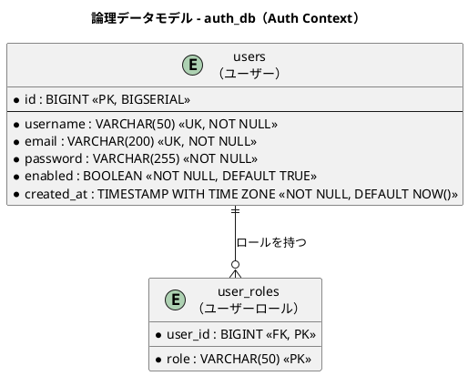
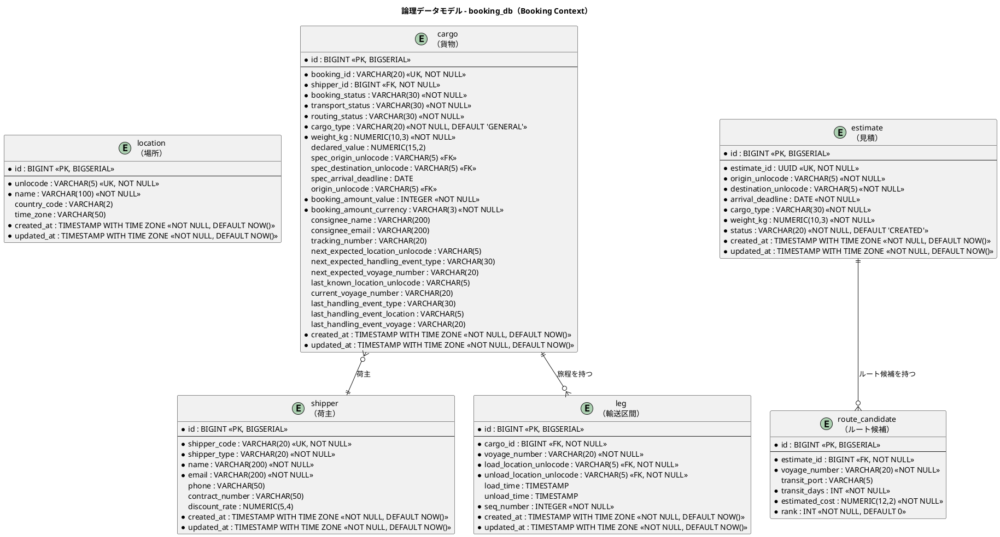
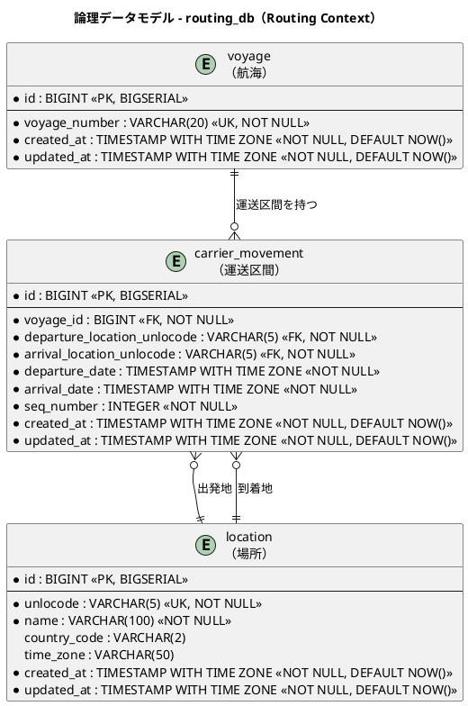
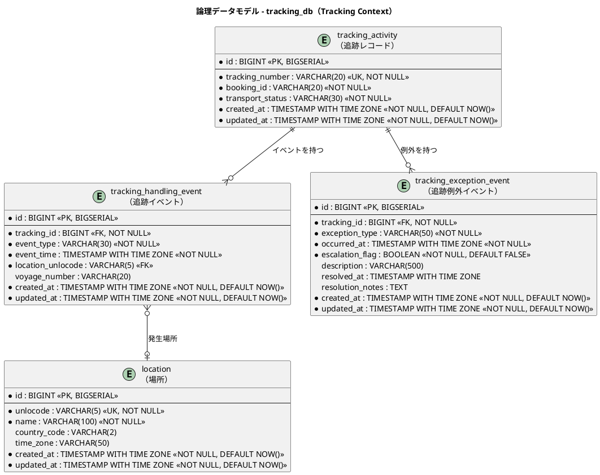
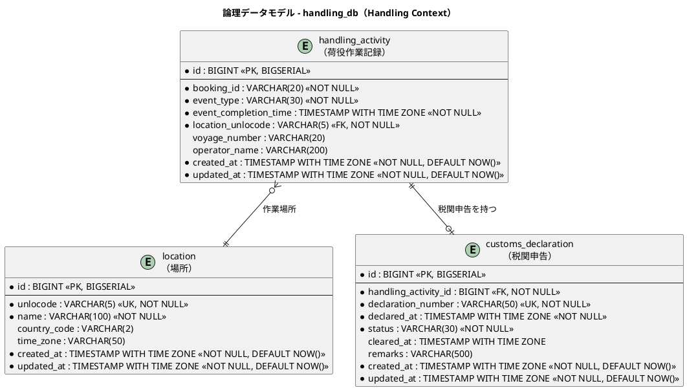
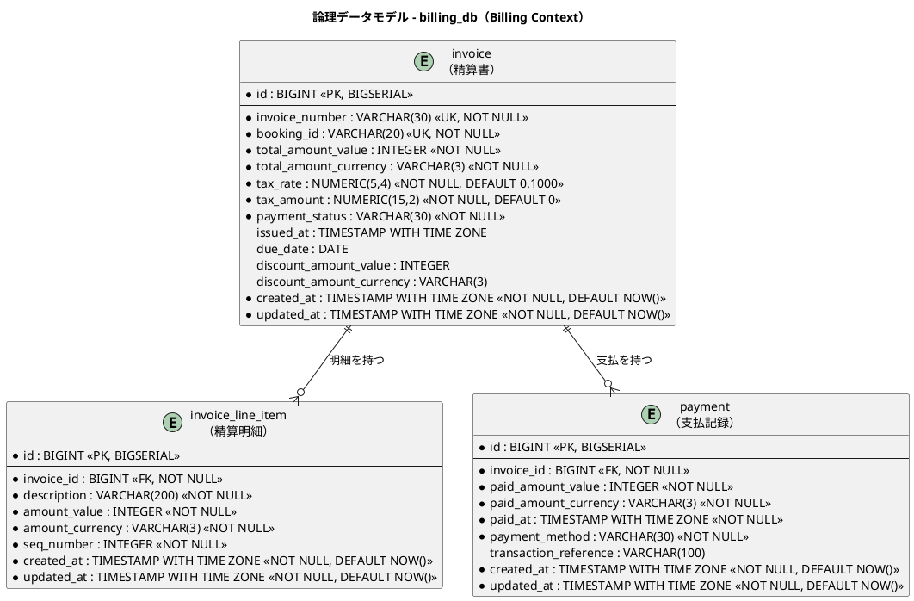

# データモデル設計 - 国際貨物輸送管理システム

## 概要

本ドキュメントは、国際貨物輸送管理システムの永続化層データモデルを定義する。
バックエンドアーキテクチャで定義した 7 つの境界付けられたコンテキスト（Auth / Booking / Routing / Tracking / Handling / Billing / Shared Domain）に対応する **6 つの独立データベース** と **19 テーブル** を設計する。
マイクロサービスアーキテクチャの **Database per Service** パターンに従い、各サービスが専用のデータベースを持つ。

### 設計方針

- **アーキテクチャ**: Database per Service（マイクロサービスパターン）
- **DB**: PostgreSQL 16.x（本番）、H2（テスト）
- **ORM**: MyBatis（XML マッパー）
- **マイグレーション**: Flyway（`V1__init.sql` 形式）— サービスごとに独立管理
- **ID 戦略**: サロゲートキー（`BIGSERIAL`）+ 業務キー（`VARCHAR`）の併用
- **命名規則**: スネークケース（PostgreSQL 慣習）
- **監査カラム**: 全テーブルに `created_at` / `updated_at` を付与
- **コンテキスト間整合性**: DB 外部キー制約ではなくイベント連携で保証

### データベース配置

| サービス | データベース名 | 管理テーブル |
| :--- | :--- | :--- |
| authms | `auth_db` | `users`, `user_roles` |
| bookingms | `booking_db` | `location`, `shipper`, `cargo`, `leg`, `estimate`, `route_candidate` |
| routingms | `routing_db` | `location`, `voyage`, `carrier_movement` |
| trackingms | `tracking_db` | `location`, `tracking_activity`, `tracking_handling_event`, `tracking_exception_event` |
| handlingms | `handling_db` | `location`, `handling_activity`, `customs_declaration` |
| billingms | `billing_db` | `invoice`, `invoice_line_item`, `payment` |

> **`location` テーブルの重複について**: Shared Domain の `Location`（UN/LOCODE）は共有カーネルとして定義されるが、Database per Service パターンでは各サービスが自身の DB 内に `location` テーブルを保持する。初期データは共通の Flyway シードスクリプトから投入し、データの同期は必要に応じてイベントで行う。

---

## 概念データモデル

全コンテキストのエンティティとその主要リレーションシップを俯瞰する。マイクロサービス境界（データベース境界）を明示し、コンテキスト間の参照は業務キー（`booking_id`、`voyage_number` 等）による論理参照とする。

```plantuml
@startuml
title 概念データモデル - 国際貨物輸送管理システム（マイクロサービス）

skinparam entity {
  BackgroundColor White
  BorderColor Black
}

package "auth_db\n(Auth Context)" #LightSkyBlue {
  entity "users\n（ユーザー）" as users {
    * id : BIGINT <<PK>>
    --
    * username : VARCHAR(50) <<UK>>
    * email : VARCHAR(200) <<UK>>
    * password : VARCHAR(255)
    * enabled : BOOLEAN
  }

  entity "user_roles\n（ユーザーロール）" as user_roles {
    * user_id : BIGINT <<FK, PK>>
    * role : VARCHAR(50) <<PK>>
  }
}

package "booking_db\n(Booking Context)" #LightBlue {
  entity "location\n（場所）" as b_location {
    * id : BIGINT <<PK>>
    --
    * unlocode : VARCHAR(5) <<UK>>
    * name : VARCHAR(100)
  }

  entity "shipper\n（荷主）" as shipper {
    * id : BIGINT <<PK>>
    --
    * shipper_code : VARCHAR(20) <<UK>>
    * shipper_type : VARCHAR(20)
    * name : VARCHAR(200)
    * email : VARCHAR(200)
  }

  entity "cargo\n（貨物）" as cargo {
    * id : BIGINT <<PK>>
    --
    * booking_id : VARCHAR(20) <<UK>>
    * shipper_id : BIGINT <<FK>>
    * booking_status : VARCHAR(30)
    * transport_status : VARCHAR(30)
    * routing_status : VARCHAR(30)
    * cargo_type : VARCHAR(20)
    * weight_kg : NUMERIC(10,3)
    declared_value : NUMERIC(15,2)
    * booking_amount_value : INTEGER
    * booking_amount_currency : VARCHAR(3)
  }

  entity "leg\n（輸送区間）" as leg {
    * id : BIGINT <<PK>>
    --
    * cargo_id : BIGINT <<FK>>
    * voyage_number : VARCHAR(20)
    * load_location_unlocode : VARCHAR(5) <<FK>>
    * unload_location_unlocode : VARCHAR(5) <<FK>>
    * load_time : TIMESTAMP
    * unload_time : TIMESTAMP
  }

  entity "estimate\n（見積）" as estimate {
    * id : BIGINT <<PK>>
    --
    * estimate_id : UUID <<UK>>
    * origin_unlocode : VARCHAR(5)
    * destination_unlocode : VARCHAR(5)
    * arrival_deadline : DATE
    * cargo_type : VARCHAR(30)
    * weight_kg : NUMERIC(10,3)
    * status : VARCHAR(20)
  }

  entity "route_candidate\n（ルート候補）" as route_candidate {
    * id : BIGINT <<PK>>
    --
    * estimate_id : BIGINT <<FK>>
    * voyage_number : VARCHAR(20)
    transit_port : VARCHAR(5)
    * transit_days : INT
    * estimated_cost : NUMERIC(12,2)
    * rank : INT
  }
}

package "routing_db\n(Routing Context)" #LightGreen {
  entity "location\n（場所）" as r_location {
    * id : BIGINT <<PK>>
    --
    * unlocode : VARCHAR(5) <<UK>>
    * name : VARCHAR(100)
  }

  entity "voyage\n（航海）" as voyage {
    * id : BIGINT <<PK>>
    --
    * voyage_number : VARCHAR(20) <<UK>>
  }

  entity "carrier_movement\n（運送区間）" as carrier_movement {
    * id : BIGINT <<PK>>
    --
    * voyage_id : BIGINT <<FK>>
    * departure_location_unlocode : VARCHAR(5) <<FK>>
    * arrival_location_unlocode : VARCHAR(5) <<FK>>
    * departure_date : TIMESTAMP
    * arrival_date : TIMESTAMP
  }
}

package "tracking_db\n(Tracking Context)" #LightYellow {
  entity "location\n（場所）" as t_location {
    * id : BIGINT <<PK>>
    --
    * unlocode : VARCHAR(5) <<UK>>
    * name : VARCHAR(100)
  }

  entity "tracking_activity\n（追跡レコード）" as tracking_activity {
    * id : BIGINT <<PK>>
    --
    * tracking_number : VARCHAR(20) <<UK>>
    * booking_id : VARCHAR(20)
    * transport_status : VARCHAR(30)
  }

  entity "tracking_handling_event\n（追跡イベント）" as tracking_handling_event {
    * id : BIGINT <<PK>>
    --
    * tracking_id : BIGINT <<FK>>
    * event_type : VARCHAR(30)
    * event_time : TIMESTAMP
    * location_unlocode : VARCHAR(5)
    voyage_number : VARCHAR(20)
  }

  entity "tracking_exception_event\n（追跡例外イベント）" as tracking_exception_event {
    * id : BIGINT <<PK>>
    --
    * tracking_id : BIGINT <<FK>>
    * exception_type : VARCHAR(50)
    * occurred_at : TIMESTAMP
    * escalation_flag : BOOLEAN
    description : VARCHAR(500)
    resolved_at : TIMESTAMP
    resolution_notes : TEXT
  }
}

package "handling_db\n(Handling Context)" #LightCoral {
  entity "location\n（場所）" as h_location {
    * id : BIGINT <<PK>>
    --
    * unlocode : VARCHAR(5) <<UK>>
    * name : VARCHAR(100)
  }

  entity "handling_activity\n（荷役作業記録）" as handling_activity {
    * id : BIGINT <<PK>>
    --
    * booking_id : VARCHAR(20)
    * event_type : VARCHAR(30)
    * event_completion_time : TIMESTAMP
    * location_unlocode : VARCHAR(5) <<FK>>
    voyage_number : VARCHAR(20)
  }

  entity "customs_declaration\n（税関申告）" as customs_declaration {
    * id : BIGINT <<PK>>
    --
    * handling_activity_id : BIGINT <<FK>>
    * declaration_number : VARCHAR(50) <<UK>>
    * declared_at : TIMESTAMP
    * status : VARCHAR(30)
  }
}

package "billing_db\n(Billing Context)" #LightPink {
  entity "invoice\n（精算書）" as invoice {
    * id : BIGINT <<PK>>
    --
    * invoice_number : VARCHAR(30) <<UK>>
    * booking_id : VARCHAR(20) <<UK>>
    * total_amount_value : INTEGER
    * total_amount_currency : VARCHAR(3)
    * tax_rate : NUMERIC(5,4)
    * tax_amount : NUMERIC(15,2)
    * payment_status : VARCHAR(30)
  }

  entity "invoice_line_item\n（精算明細）" as invoice_line_item {
    * id : BIGINT <<PK>>
    --
    * invoice_id : BIGINT <<FK>>
    * description : VARCHAR(200)
    * amount_value : INTEGER
    * amount_currency : VARCHAR(3)
  }

  entity "payment\n（支払記録）" as payment {
    * id : BIGINT <<PK>>
    --
    * invoice_id : BIGINT <<FK>>
    * paid_amount_value : INTEGER
    * paid_amount_currency : VARCHAR(3)
    * paid_at : TIMESTAMP
    * payment_method : VARCHAR(30)
  }
}

' ===== DB 内リレーション（実線） =====

' auth_db
users ||--o{ user_roles : "ロールを持つ"

' booking_db
cargo }o--|| shipper : "荷主"
cargo ||--o{ leg : "旅程を持つ"
leg }o--|| b_location : "積込場所"
leg }o--|| b_location : "荷降場所"
cargo }o--o| b_location : "出発地"
cargo }o--o| b_location : "仕向地"
estimate ||--o{ route_candidate : "ルート候補を持つ"

' routing_db
voyage ||--o{ carrier_movement : "運送区間を持つ"
carrier_movement }o--|| r_location : "出発地"
carrier_movement }o--|| r_location : "到着地"

' tracking_db
tracking_activity ||--o{ tracking_handling_event : "イベントを持つ"
tracking_activity ||--o{ tracking_exception_event : "例外を持つ"
tracking_handling_event }o--o| t_location : "発生場所"

' handling_db
handling_activity ||--o| customs_declaration : "税関申告を持つ"
handling_activity }o--|| h_location : "作業場所"

' billing_db
invoice ||--o{ invoice_line_item : "明細を持つ"
invoice ||--o{ payment : "支払を持つ"

' ===== コンテキスト間の論理参照（点線）=====
cargo .right.> voyage : "voyage_number\n（論理参照）"
tracking_activity ..> cargo : "booking_id\n（論理参照）"
handling_activity ..> cargo : "booking_id\n（論理参照）"
invoice ..> cargo : "booking_id\n（論理参照）"

@enduml
```



---

## 論理データモデル

### auth_db — Auth Context

ユーザー認証・認可テーブル。JWT トークン発行・検証のために `authms` が専有する。



---

### booking_db — Booking Context

貨物の予約・旅程・見積情報を管理する。`cargo` が集約ルートで、`leg` が旅程の各区間を表す。荷主情報は `shipper` テーブルに正規化し、FK 参照とする。見積機能（`estimate` / `route_candidate`）は予約プロセスの一環として `booking_db` に含める。



---

### routing_db — Routing Context

航海スケジュールと運送区間を管理する。`voyage` が集約ルートで、`carrier_movement` が個々の移動区間を表す。



---

### tracking_db — Tracking Context

貨物追跡の状態・イベント・例外を管理する。`tracking_activity` が集約ルート。Booking Context / Handling Context からのイベント（`CargoBookedEvent` / `HandlingActivityRegisteredEvent`）をサブスクライブしてデータを構築する CQRS 読み取り側モデル。



---

### handling_db — Handling Context

荷役作業の実績と税関申告を管理する。`handling_activity` が集約ルート。Booking Context の `booking_id` を論理参照し、`CargoSnapshot`（ACL）を介して Booking 情報を取得する。



---

### billing_db — Billing Context

精算書・明細・支払記録を管理する。Tracking Context からの `CargoDeliveredEvent` をサブスクライブして精算書を自動生成する。



---

## テーブル定義

### auth_db

#### `users`（ユーザー）

Spring Security の `UserDetailsService` が参照するユーザー認証テーブル。`authms` が専有する。

| カラム名 | データ型 | 制約 | 説明 |
| :--- | :--- | :--- | :--- |
| `id` | `BIGINT` | `PK, NOT NULL` | サロゲートキー（BIGSERIAL） |
| `username` | `VARCHAR(50)` | `UK, NOT NULL` | ログイン名 |
| `email` | `VARCHAR(200)` | `UK, NOT NULL` | メールアドレス |
| `password` | `VARCHAR(255)` | `NOT NULL` | パスワード（BCrypt ハッシュ） |
| `enabled` | `BOOLEAN` | `NOT NULL, DEFAULT TRUE` | アカウント有効フラグ |
| `created_at` | `TIMESTAMP WITH TIME ZONE` | `NOT NULL, DEFAULT NOW()` | レコード作成日時 |

##### DDL

```sql
CREATE TABLE users (
    id           BIGSERIAL PRIMARY KEY,
    username     VARCHAR(50)  NOT NULL UNIQUE,
    email        VARCHAR(200) NOT NULL UNIQUE,
    password     VARCHAR(255) NOT NULL,  -- BCrypt ハッシュ
    enabled      BOOLEAN NOT NULL DEFAULT TRUE,
    created_at   TIMESTAMP WITH TIME ZONE NOT NULL DEFAULT NOW()
);
```

---

#### `user_roles`（ユーザーロール）

| カラム名 | データ型 | 制約 | 説明 |
| :--- | :--- | :--- | :--- |
| `user_id` | `BIGINT` | `PK, FK → users.id, NOT NULL` | 親ユーザー ID |
| `role` | `VARCHAR(50)` | `PK, NOT NULL` | ロール名（`ROLE_ADMIN` / `ROLE_OPERATOR` / `ROLE_SHIPPER` 等） |

##### DDL

```sql
CREATE TABLE user_roles (
    user_id  BIGINT      NOT NULL REFERENCES users(id),
    role     VARCHAR(50) NOT NULL,  -- ROLE_ADMIN / ROLE_OPERATOR / ROLE_SHIPPER 等
    PRIMARY KEY (user_id, role)
);
```

---

### booking_db

#### `location`（場所マスタ）

共有カーネルの `Location`（UN/LOCODE）。Database per Service パターンにより、`booking_db` 内にローカルコピーを持つ。初期データは共通シードスクリプトから投入する。

| カラム名 | データ型 | 制約 | 説明 |
| :--- | :--- | :--- | :--- |
| `id` | `BIGINT` | `PK, NOT NULL` | サロゲートキー（BIGSERIAL） |
| `unlocode` | `VARCHAR(5)` | `UK, NOT NULL` | UN/LOCODE（業務キー。例: `JPTYO`） |
| `name` | `VARCHAR(100)` | `NOT NULL` | 場所名称（例: `Tokyo`） |
| `country_code` | `VARCHAR(2)` | | ISO 3166-1 alpha-2 国コード |
| `time_zone` | `VARCHAR(50)` | | タイムゾーン（例: `Asia/Tokyo`） |
| `created_at` | `TIMESTAMP WITH TIME ZONE` | `NOT NULL, DEFAULT NOW()` | レコード作成日時 |
| `updated_at` | `TIMESTAMP WITH TIME ZONE` | `NOT NULL, DEFAULT NOW()` | レコード更新日時 |

> **注記**: `routing_db`、`tracking_db`、`handling_db` にも同一構造の `location` テーブルが存在する。DDL は共通の Flyway シードスクリプトで管理する。

---

#### `shipper`（荷主）

| カラム名 | データ型 | 制約 | 説明 |
| :--- | :--- | :--- | :--- |
| `id` | `BIGINT` | `PK, NOT NULL` | サロゲートキー（BIGSERIAL） |
| `shipper_code` | `VARCHAR(20)` | `UK, NOT NULL` | 荷主コード（業務キー。SHP-XXXXXX 形式） |
| `shipper_type` | `VARCHAR(20)` | `NOT NULL` | 荷主種別（`INDIVIDUAL` / `CORPORATE`） |
| `name` | `VARCHAR(200)` | `NOT NULL` | 荷主名称 |
| `email` | `VARCHAR(200)` | `NOT NULL` | メールアドレス |
| `phone` | `VARCHAR(50)` | | 電話番号 |
| `contract_number` | `VARCHAR(50)` | | 契約番号（法人のみ。NULLable） |
| `discount_rate` | `NUMERIC(5,4)` | `DEFAULT 0.0000` | 割引率（0.0000〜0.3000、最大 30%） |
| `created_at` | `TIMESTAMP WITH TIME ZONE` | `NOT NULL, DEFAULT NOW()` | レコード作成日時 |
| `updated_at` | `TIMESTAMP WITH TIME ZONE` | `NOT NULL, DEFAULT NOW()` | レコード更新日時 |

##### DDL

```sql
CREATE TABLE shipper (
    id              BIGSERIAL PRIMARY KEY,
    shipper_code    VARCHAR(20)  NOT NULL UNIQUE,  -- SHP-XXXXXX 形式
    shipper_type    VARCHAR(20)  NOT NULL,          -- INDIVIDUAL / CORPORATE
    name            VARCHAR(200) NOT NULL,
    email           VARCHAR(200) NOT NULL,
    phone           VARCHAR(50),
    contract_number VARCHAR(50),                   -- 法人のみ（NULLable）
    discount_rate   NUMERIC(5,4) DEFAULT 0.0000,   -- 0.0000〜0.3000 (最大 30%)
    created_at      TIMESTAMP WITH TIME ZONE NOT NULL DEFAULT NOW(),
    updated_at      TIMESTAMP WITH TIME ZONE NOT NULL DEFAULT NOW()
);
```

---

#### `cargo`（貨物）

`booking_db` の集約ルート。`Cargo` エンティティの永続化構造。

| カラム名 | データ型 | 制約 | 説明 |
| :--- | :--- | :--- | :--- |
| `id` | `BIGINT` | `PK, NOT NULL` | サロゲートキー（BIGSERIAL） |
| `booking_id` | `VARCHAR(20)` | `UK, NOT NULL` | 予約 ID（業務キー） |
| `shipper_id` | `BIGINT` | `FK → shipper.id, NOT NULL` | 荷主 ID |
| `booking_status` | `VARCHAR(30)` | `NOT NULL, DEFAULT 'PRELIMINARY'` | 予約状態（BookingStatus 列挙値） |
| `transport_status` | `VARCHAR(30)` | `NOT NULL, DEFAULT 'NOT_RECEIVED'` | 輸送状態（TransportStatus 列挙値） |
| `routing_status` | `VARCHAR(30)` | `NOT NULL, DEFAULT 'NOT_ROUTED'` | 経路決定状態 |
| `cargo_type` | `VARCHAR(20)` | `NOT NULL, DEFAULT 'GENERAL'` | 貨物種別（`GENERAL` / `HAZARDOUS` / `REFRIGERATED`） |
| `weight_kg` | `NUMERIC(10,3)` | `NOT NULL` | 重量（kg） |
| `declared_value` | `NUMERIC(15,2)` | | 申告価額 |
| `spec_origin_unlocode` | `VARCHAR(5)` | `FK → location.unlocode` | 出発地（RouteSpecification） |
| `spec_destination_unlocode` | `VARCHAR(5)` | `FK → location.unlocode` | 仕向地（RouteSpecification） |
| `spec_arrival_deadline` | `DATE` | | 到着期限（RouteSpecification） |
| `origin_unlocode` | `VARCHAR(5)` | `FK → location.unlocode` | 現在の出発地 |
| `booking_amount_value` | `INTEGER` | `NOT NULL, DEFAULT 0` | 予約金額（最小通貨単位） |
| `booking_amount_currency` | `VARCHAR(3)` | `NOT NULL, DEFAULT 'JPY'` | 通貨コード（ISO 4217） |
| `consignee_name` | `VARCHAR(200)` | | 荷受人名 |
| `consignee_email` | `VARCHAR(200)` | | 荷受人メールアドレス |
| `tracking_number` | `VARCHAR(20)` | | 追跡番号（発行後に設定） |
| `next_expected_location_unlocode` | `VARCHAR(5)` | | 次の予定荷役場所 |
| `next_expected_handling_event_type` | `VARCHAR(30)` | | 次の予定荷役タイプ |
| `next_expected_voyage_number` | `VARCHAR(20)` | | 次の予定航海番号 |
| `last_known_location_unlocode` | `VARCHAR(5)` | | 最後の既知場所 |
| `current_voyage_number` | `VARCHAR(20)` | | 現在の航海番号 |
| `last_handling_event_type` | `VARCHAR(30)` | | 最後の荷役イベントタイプ |
| `last_handling_event_location` | `VARCHAR(5)` | | 最後の荷役イベント場所 |
| `last_handling_event_voyage` | `VARCHAR(20)` | | 最後の荷役イベント航海番号 |
| `created_at` | `TIMESTAMP WITH TIME ZONE` | `NOT NULL, DEFAULT NOW()` | レコード作成日時 |
| `updated_at` | `TIMESTAMP WITH TIME ZONE` | `NOT NULL, DEFAULT NOW()` | レコード更新日時 |

---

#### `leg`（輸送区間）

| カラム名 | データ型 | 制約 | 説明 |
| :--- | :--- | :--- | :--- |
| `id` | `BIGINT` | `PK, NOT NULL` | サロゲートキー（BIGSERIAL） |
| `cargo_id` | `BIGINT` | `FK → cargo.id, NOT NULL` | 親貨物 ID |
| `voyage_number` | `VARCHAR(20)` | `NOT NULL` | 航海番号（`routing_db` への論理参照） |
| `load_location_unlocode` | `VARCHAR(5)` | `FK → location.unlocode, NOT NULL` | 積込場所（UN/LOCODE） |
| `unload_location_unlocode` | `VARCHAR(5)` | `FK → location.unlocode, NOT NULL` | 荷降場所（UN/LOCODE） |
| `load_time` | `TIMESTAMP WITH TIME ZONE` | | 積込予定日時 |
| `unload_time` | `TIMESTAMP WITH TIME ZONE` | | 荷降予定日時 |
| `seq_number` | `INTEGER` | `NOT NULL` | 区間順序（1 始まり） |
| `created_at` | `TIMESTAMP WITH TIME ZONE` | `NOT NULL, DEFAULT NOW()` | レコード作成日時 |
| `updated_at` | `TIMESTAMP WITH TIME ZONE` | `NOT NULL, DEFAULT NOW()` | レコード更新日時 |

> **注記**: `voyage_number` は `routing_db.voyage.voyage_number` への論理参照であり、DB 外部キー制約は設けない。Booking Context は Routing Context の REST API を介して航海情報を取得する。

---

#### `estimate`（見積）

| カラム名 | データ型 | 制約 | 説明 |
| :--- | :--- | :--- | :--- |
| `id` | `BIGINT` | `PK, NOT NULL` | サロゲートキー（BIGSERIAL） |
| `estimate_id` | `UUID` | `UK, NOT NULL` | 見積 ID（業務キー） |
| `origin_unlocode` | `VARCHAR(5)` | `NOT NULL` | 出発地（UN/LOCODE） |
| `destination_unlocode` | `VARCHAR(5)` | `NOT NULL` | 仕向地（UN/LOCODE） |
| `arrival_deadline` | `DATE` | `NOT NULL` | 到着期限 |
| `cargo_type` | `VARCHAR(30)` | `NOT NULL` | 貨物種別 |
| `weight_kg` | `NUMERIC(10,3)` | `NOT NULL` | 重量（kg） |
| `status` | `VARCHAR(20)` | `NOT NULL, DEFAULT 'CREATED'` | 見積状態（`CREATED` / `EXPIRED`） |
| `created_at` | `TIMESTAMP WITH TIME ZONE` | `NOT NULL, DEFAULT NOW()` | レコード作成日時 |
| `updated_at` | `TIMESTAMP WITH TIME ZONE` | `NOT NULL, DEFAULT NOW()` | レコード更新日時 |

##### DDL

```sql
CREATE TABLE estimate (
    id                    BIGSERIAL PRIMARY KEY,
    estimate_id           UUID NOT NULL UNIQUE,
    origin_unlocode       VARCHAR(5) NOT NULL,
    destination_unlocode  VARCHAR(5) NOT NULL,
    arrival_deadline      DATE NOT NULL,
    cargo_type            VARCHAR(30) NOT NULL,
    weight_kg             NUMERIC(10, 3) NOT NULL,
    status                VARCHAR(20) NOT NULL DEFAULT 'CREATED',
    created_at            TIMESTAMP WITH TIME ZONE NOT NULL DEFAULT NOW(),
    updated_at            TIMESTAMP WITH TIME ZONE NOT NULL DEFAULT NOW()
);
```

---

#### `route_candidate`（ルート候補）

| カラム名 | データ型 | 制約 | 説明 |
| :--- | :--- | :--- | :--- |
| `id` | `BIGINT` | `PK, NOT NULL` | サロゲートキー（BIGSERIAL） |
| `estimate_id` | `BIGINT` | `FK → estimate.id, NOT NULL` | 親見積 ID（CASCADE 削除） |
| `voyage_number` | `VARCHAR(20)` | `NOT NULL` | 航海番号 |
| `transit_port` | `VARCHAR(5)` | | 経由港（UN/LOCODE、オプション） |
| `transit_days` | `INT` | `NOT NULL` | 輸送日数 |
| `estimated_cost` | `NUMERIC(12,2)` | `NOT NULL` | 見積コスト |
| `rank` | `INT` | `NOT NULL, DEFAULT 0` | ルート候補の優先順位 |

##### DDL

```sql
CREATE TABLE route_candidate (
    id              BIGSERIAL PRIMARY KEY,
    estimate_id     BIGINT NOT NULL REFERENCES estimate(id) ON DELETE CASCADE,
    voyage_number   VARCHAR(20) NOT NULL,
    transit_port    VARCHAR(5),
    transit_days    INT NOT NULL,
    estimated_cost  NUMERIC(12, 2) NOT NULL,
    rank            INT NOT NULL DEFAULT 0
);
```

---

### routing_db

#### `voyage`（航海）

| カラム名 | データ型 | 制約 | 説明 |
| :--- | :--- | :--- | :--- |
| `id` | `BIGINT` | `PK, NOT NULL` | サロゲートキー（BIGSERIAL） |
| `voyage_number` | `VARCHAR(20)` | `UK, NOT NULL` | 航海番号（業務キー） |
| `created_at` | `TIMESTAMP WITH TIME ZONE` | `NOT NULL, DEFAULT NOW()` | レコード作成日時 |
| `updated_at` | `TIMESTAMP WITH TIME ZONE` | `NOT NULL, DEFAULT NOW()` | レコード更新日時 |

---

#### `carrier_movement`（運送区間）

| カラム名 | データ型 | 制約 | 説明 |
| :--- | :--- | :--- | :--- |
| `id` | `BIGINT` | `PK, NOT NULL` | サロゲートキー（BIGSERIAL） |
| `voyage_id` | `BIGINT` | `FK → voyage.id, NOT NULL` | 親航海 ID |
| `departure_location_unlocode` | `VARCHAR(5)` | `FK → location.unlocode, NOT NULL` | 出発地（UN/LOCODE） |
| `arrival_location_unlocode` | `VARCHAR(5)` | `FK → location.unlocode, NOT NULL` | 到着地（UN/LOCODE） |
| `departure_date` | `TIMESTAMP WITH TIME ZONE` | `NOT NULL` | 出発日時 |
| `arrival_date` | `TIMESTAMP WITH TIME ZONE` | `NOT NULL` | 到着日時 |
| `seq_number` | `INTEGER` | `NOT NULL` | 区間順序（1 始まり） |
| `created_at` | `TIMESTAMP WITH TIME ZONE` | `NOT NULL, DEFAULT NOW()` | レコード作成日時 |
| `updated_at` | `TIMESTAMP WITH TIME ZONE` | `NOT NULL, DEFAULT NOW()` | レコード更新日時 |

---

### tracking_db

#### `tracking_activity`（追跡レコード）

| カラム名 | データ型 | 制約 | 説明 |
| :--- | :--- | :--- | :--- |
| `id` | `BIGINT` | `PK, NOT NULL` | サロゲートキー（BIGSERIAL） |
| `tracking_number` | `VARCHAR(20)` | `UK, NOT NULL` | 追跡番号（業務キー） |
| `booking_id` | `VARCHAR(20)` | `NOT NULL` | 予約 ID（`booking_db` への論理参照） |
| `transport_status` | `VARCHAR(30)` | `NOT NULL` | 輸送状態（TransportStatus 列挙値） |
| `created_at` | `TIMESTAMP WITH TIME ZONE` | `NOT NULL, DEFAULT NOW()` | レコード作成日時 |
| `updated_at` | `TIMESTAMP WITH TIME ZONE` | `NOT NULL, DEFAULT NOW()` | レコード更新日時 |

> **注記**: `booking_id` は `booking_db.cargo.booking_id` への論理参照。DB 外部キー制約は設けず、`CargoBookedEvent` 受信時にアプリケーション層で整合性を保証する。

---

#### `tracking_handling_event`（追跡イベント）

| カラム名 | データ型 | 制約 | 説明 |
| :--- | :--- | :--- | :--- |
| `id` | `BIGINT` | `PK, NOT NULL` | サロゲートキー（BIGSERIAL） |
| `tracking_id` | `BIGINT` | `FK → tracking_activity.id, NOT NULL` | 親追跡レコード ID |
| `event_type` | `VARCHAR(30)` | `NOT NULL` | 荷役タイプ（HandlingType 列挙値） |
| `event_time` | `TIMESTAMP WITH TIME ZONE` | `NOT NULL` | イベント発生日時 |
| `location_unlocode` | `VARCHAR(5)` | `FK → location.unlocode` | イベント発生場所（UN/LOCODE） |
| `voyage_number` | `VARCHAR(20)` | | 関連する航海番号 |
| `created_at` | `TIMESTAMP WITH TIME ZONE` | `NOT NULL, DEFAULT NOW()` | レコード作成日時 |
| `updated_at` | `TIMESTAMP WITH TIME ZONE` | `NOT NULL, DEFAULT NOW()` | レコード更新日時 |

---

#### `tracking_exception_event`（追跡例外イベント）

| カラム名 | データ型 | 制約 | 説明 |
| :--- | :--- | :--- | :--- |
| `id` | `BIGINT` | `PK, NOT NULL` | サロゲートキー（BIGSERIAL） |
| `tracking_id` | `BIGINT` | `FK → tracking_activity.id, NOT NULL` | 親追跡レコード ID |
| `exception_type` | `VARCHAR(50)` | `NOT NULL` | 例外種別（例: `CUSTOMS_HOLD`, `DAMAGE`, `DELAY`） |
| `occurred_at` | `TIMESTAMP WITH TIME ZONE` | `NOT NULL` | 例外発生日時 |
| `escalation_flag` | `BOOLEAN` | `NOT NULL, DEFAULT FALSE` | エスカレーション判定フラグ |
| `description` | `VARCHAR(500)` | | 例外内容の詳細 |
| `resolved_at` | `TIMESTAMP WITH TIME ZONE` | | 解決日時（NULL = 未解決） |
| `resolution_notes` | `TEXT` | | 対応内容メモ |
| `created_at` | `TIMESTAMP WITH TIME ZONE` | `NOT NULL, DEFAULT NOW()` | レコード作成日時 |
| `updated_at` | `TIMESTAMP WITH TIME ZONE` | `NOT NULL, DEFAULT NOW()` | レコード更新日時 |

---

### handling_db

#### `handling_activity`（荷役作業記録）

| カラム名 | データ型 | 制約 | 説明 |
| :--- | :--- | :--- | :--- |
| `id` | `BIGINT` | `PK, NOT NULL` | サロゲートキー（BIGSERIAL） |
| `booking_id` | `VARCHAR(20)` | `NOT NULL` | 予約 ID（`booking_db` への論理参照） |
| `event_type` | `VARCHAR(30)` | `NOT NULL` | 荷役タイプ（RECEIVE / LOAD / UNLOAD / CUSTOMS / CLAIM） |
| `event_completion_time` | `TIMESTAMP WITH TIME ZONE` | `NOT NULL` | 荷役完了日時 |
| `location_unlocode` | `VARCHAR(5)` | `FK → location.unlocode, NOT NULL` | 作業場所（UN/LOCODE） |
| `voyage_number` | `VARCHAR(20)` | | 関連する航海番号（LOAD / UNLOAD 時に設定） |
| `operator_name` | `VARCHAR(200)` | | 作業員名 |
| `created_at` | `TIMESTAMP WITH TIME ZONE` | `NOT NULL, DEFAULT NOW()` | レコード作成日時 |
| `updated_at` | `TIMESTAMP WITH TIME ZONE` | `NOT NULL, DEFAULT NOW()` | レコード更新日時 |

---

#### `customs_declaration`（税関申告）

| カラム名 | データ型 | 制約 | 説明 |
| :--- | :--- | :--- | :--- |
| `id` | `BIGINT` | `PK, NOT NULL` | サロゲートキー（BIGSERIAL） |
| `handling_activity_id` | `BIGINT` | `FK → handling_activity.id, NOT NULL` | 関連荷役作業 ID |
| `declaration_number` | `VARCHAR(50)` | `UK, NOT NULL` | 申告番号（業務キー） |
| `declared_at` | `TIMESTAMP WITH TIME ZONE` | `NOT NULL` | 申告日時 |
| `status` | `VARCHAR(30)` | `NOT NULL` | 申告状態（`PENDING` / `CLEARED` / `HELD`） |
| `cleared_at` | `TIMESTAMP WITH TIME ZONE` | | 通関完了日時（NULL = 未完了） |
| `remarks` | `VARCHAR(500)` | | 備考・メモ |
| `created_at` | `TIMESTAMP WITH TIME ZONE` | `NOT NULL, DEFAULT NOW()` | レコード作成日時 |
| `updated_at` | `TIMESTAMP WITH TIME ZONE` | `NOT NULL, DEFAULT NOW()` | レコード更新日時 |

---

### billing_db

#### `invoice`（精算書）

| カラム名 | データ型 | 制約 | 説明 |
| :--- | :--- | :--- | :--- |
| `id` | `BIGINT` | `PK, NOT NULL` | サロゲートキー（BIGSERIAL） |
| `invoice_number` | `VARCHAR(30)` | `UK, NOT NULL` | 精算書番号（業務キー） |
| `booking_id` | `VARCHAR(20)` | `UK, NOT NULL` | 予約 ID（UNIQUE 制約で二重請求を防止） |
| `total_amount_value` | `INTEGER` | `NOT NULL` | 合計金額（最小通貨単位） |
| `total_amount_currency` | `VARCHAR(3)` | `NOT NULL` | 通貨コード（ISO 4217） |
| `tax_rate` | `NUMERIC(5,4)` | `NOT NULL, DEFAULT 0.1000` | 消費税率（デフォルト 10%） |
| `tax_amount` | `NUMERIC(15,2)` | `NOT NULL, DEFAULT 0` | 消費税額 |
| `payment_status` | `VARCHAR(30)` | `NOT NULL` | 支払状態（`PENDING` / `CONFIRMED` / `OVERDUE` / `REFUNDED`） |
| `issued_at` | `TIMESTAMP WITH TIME ZONE` | | 発行日時 |
| `due_date` | `DATE` | | 支払期日 |
| `discount_amount_value` | `INTEGER` | | 割引金額（最小通貨単位） |
| `discount_amount_currency` | `VARCHAR(3)` | | 割引通貨コード |
| `created_at` | `TIMESTAMP WITH TIME ZONE` | `NOT NULL, DEFAULT NOW()` | レコード作成日時 |
| `updated_at` | `TIMESTAMP WITH TIME ZONE` | `NOT NULL, DEFAULT NOW()` | レコード更新日時 |

---

#### `invoice_line_item`（精算明細）

| カラム名 | データ型 | 制約 | 説明 |
| :--- | :--- | :--- | :--- |
| `id` | `BIGINT` | `PK, NOT NULL` | サロゲートキー（BIGSERIAL） |
| `invoice_id` | `BIGINT` | `FK → invoice.id, NOT NULL` | 親精算書 ID |
| `description` | `VARCHAR(200)` | `NOT NULL` | 明細項目説明 |
| `amount_value` | `INTEGER` | `NOT NULL` | 明細金額（最小通貨単位） |
| `amount_currency` | `VARCHAR(3)` | `NOT NULL` | 通貨コード（ISO 4217） |
| `seq_number` | `INTEGER` | `NOT NULL` | 明細順序（1 始まり） |
| `created_at` | `TIMESTAMP WITH TIME ZONE` | `NOT NULL, DEFAULT NOW()` | レコード作成日時 |
| `updated_at` | `TIMESTAMP WITH TIME ZONE` | `NOT NULL, DEFAULT NOW()` | レコード更新日時 |

---

#### `payment`（支払記録）

| カラム名 | データ型 | 制約 | 説明 |
| :--- | :--- | :--- | :--- |
| `id` | `BIGINT` | `PK, NOT NULL` | サロゲートキー（BIGSERIAL） |
| `invoice_id` | `BIGINT` | `FK → invoice.id, NOT NULL` | 親精算書 ID |
| `paid_amount_value` | `INTEGER` | `NOT NULL` | 支払金額（最小通貨単位） |
| `paid_amount_currency` | `VARCHAR(3)` | `NOT NULL` | 通貨コード（ISO 4217） |
| `paid_at` | `TIMESTAMP WITH TIME ZONE` | `NOT NULL` | 支払日時 |
| `payment_method` | `VARCHAR(30)` | `NOT NULL` | 支払方法（`BANK_TRANSFER` / `CREDIT_CARD`） |
| `transaction_reference` | `VARCHAR(100)` | | 取引参照番号（外部決済システムの ID） |
| `created_at` | `TIMESTAMP WITH TIME ZONE` | `NOT NULL, DEFAULT NOW()` | レコード作成日時 |
| `updated_at` | `TIMESTAMP WITH TIME ZONE` | `NOT NULL, DEFAULT NOW()` | レコード更新日時 |

---

## 設計上の判断

### 1. Database per Service パターン

**判断**: 各マイクロサービスが専用のデータベースを持つ。コンテキスト間のデータ参照には DB 外部キー制約を設けず、業務キー（`booking_id`、`voyage_number` 等）による論理参照とする。

**根拠**: マイクロサービスアーキテクチャの基本原則として、各サービスのデータ独立性を確保する。これにより、サービスごとの独立デプロイ・スケーリング・技術選択が可能になる。整合性はドメインイベント（RabbitMQ + Spring Cloud Stream）で結果整合性として保証する。

---

### 2. `location` テーブルの各 DB への配置

**判断**: 共有カーネルである `Location`（UN/LOCODE）を各サービスの DB にローカルコピーとして配置する。

**根拠**: Database per Service パターンでは、サービス間で DB テーブルを共有することは禁止される。`location` は参照データ（マスタ）であり、変更頻度が極めて低い（UN/LOCODE は国際標準）。初期データは共通の Flyway シードスクリプトから投入し、新規拠点追加時は各サービスのマイグレーションで対応する。

---

### 3. サロゲートキーと業務キーの併用

**判断**: 全テーブルに `BIGSERIAL` のサロゲートキー（`id`）を設け、業務上の識別子（`booking_id`、`voyage_number`、`unlocode` 等）には `UNIQUE` 制約を付与する。

**根拠**: DB 内の外部キー参照を `BIGINT` に統一することでインデックス効率が向上する。サービス間の論理参照は業務キー（文字列）を使用し、内部参照はサロゲートキーを使用する二重戦略で、効率性と疎結合性を両立する。

---

### 4. 金額の表現（`INTEGER` + `VARCHAR(3)`）

**判断**: 金額を `INTEGER`（最小通貨単位）と `VARCHAR(3)`（ISO 4217 通貨コード）の 2 カラムで表現する。

**根拠**: 浮動小数点演算による精度誤差を排除するため、円・セントなど最小通貨単位で整数管理する。複数通貨対応のため通貨コードを常に付随させる。これはドメインモデルの `Money` 値オブジェクトに対応する。

---

### 5. 列挙値のカラム型（`VARCHAR(30)`）

**判断**: `BookingStatus`、`TransportStatus`、`HandlingType` 等の列挙型カラムは `VARCHAR(30)` で表現し、PostgreSQL の `ENUM` 型は使用しない。

**根拠**: PostgreSQL `ENUM` 型は値の追加・変更にスキーマ ALTER が必要でマイグレーション時のリスクが高い。`VARCHAR` ならば Flyway マイグレーションで CHECK 制約を追加・変更するだけで済み、テスト（H2）との互換性も維持できる。

---

### 6. コンテキスト間の結果整合性

**判断**: コンテキスト間の整合性はドメインイベント経由の結果整合性（Eventual Consistency）で保証する。DB レベルの分散トランザクション（2PC）は使用しない。

**根拠**: マイクロサービス間で強い整合性を求めると、分散トランザクションの複雑さとパフォーマンスコストが発生する。貨物輸送業務の特性上、数秒〜数十秒の遅延は許容される。例: 荷役イベント登録（`handling_db`）→ `HandlingActivityRegisteredEvent` → 追跡状態更新（`tracking_db`）。

---

### 7. 監査カラムの全テーブル付与

**判断**: `created_at`・`updated_at` を全テーブルに `NOT NULL DEFAULT NOW()` で付与する。`updated_at` の更新は MyBatis マッパー側で `CURRENT_TIMESTAMP` をセットする。

**根拠**: 国際貨物輸送は規制上の監査要件が高く、全レコードの作成・更新タイムスタンプが必要。PostgreSQL のトリガーで自動更新する方法もあるが、H2 との互換性を優先してアプリケーション側で制御する。

---

## Flyway マイグレーション方針

### サービス別マイグレーション管理

マイクロサービスアーキテクチャでは、各サービスが独自のマイグレーションスクリプトを管理する。

```
cargo-tracker/
├── authms/
│   └── src/main/resources/db/migration/
│       ├── V1__init_auth.sql          # users, user_roles
│       └── V2__seed_users.sql         # 初期ユーザーデータ
│
├── bookingms/
│   └── src/main/resources/db/migration/
│       ├── V1__init_booking.sql       # location, shipper, cargo, leg
│       ├── V2__seed_locations.sql     # UN/LOCODE マスタ
│       ├── V3__add_estimate.sql       # estimate, route_candidate
│       └── V4__add_xxx.sql            # 機能追加
│
├── routingms/
│   └── src/main/resources/db/migration/
│       ├── V1__init_routing.sql       # location, voyage, carrier_movement
│       ├── V2__seed_locations.sql     # UN/LOCODE マスタ（共通）
│       └── V3__seed_voyages.sql       # 初期航海データ
│
├── trackingms/
│   └── src/main/resources/db/migration/
│       ├── V1__init_tracking.sql      # location, tracking_*
│       └── V2__seed_locations.sql     # UN/LOCODE マスタ（共通）
│
├── handlingms/
│   └── src/main/resources/db/migration/
│       ├── V1__init_handling.sql      # location, handling_activity, customs_declaration
│       └── V2__seed_locations.sql     # UN/LOCODE マスタ（共通）
│
└── billingms/
    └── src/main/resources/db/migration/
        └── V1__init_billing.sql       # invoice, invoice_line_item, payment
```

### マイグレーションルール

- バージョン番号はサービスごとに独立した連番とし、番号の欠番を作らない
- 既存マイグレーションファイルの編集は禁止（Flyway チェックサム検証）
- `location` テーブルのシードスクリプト（`V2__seed_locations.sql`）は共通テンプレートからコピーして各サービスに配置する
- 本番とテスト（H2）で同一マイグレーションスクリプトを使用するため、PostgreSQL 固有の構文は H2 互換形式で記述する

### 共通シードデータ（`location`）

```sql
-- 共通 UN/LOCODE シードデータ（各サービスの V2__seed_locations.sql にコピー）
INSERT INTO location (unlocode, name, country_code, time_zone) VALUES
    ('JPTYO', 'Tokyo',      'JP', 'Asia/Tokyo'),
    ('JPOSA', 'Osaka',      'JP', 'Asia/Tokyo'),
    ('JPNGO', 'Nagoya',     'JP', 'Asia/Tokyo'),
    ('CNSHA', 'Shanghai',   'CN', 'Asia/Shanghai'),
    ('CNHKG', 'Hong Kong',  'CN', 'Asia/Hong_Kong'),
    ('KRPUS', 'Busan',      'KR', 'Asia/Seoul'),
    ('SGSIN', 'Singapore',  'SG', 'Asia/Singapore'),
    ('USNYC', 'New York',   'US', 'America/New_York'),
    ('USLAX', 'Los Angeles','US', 'America/Los_Angeles'),
    ('NLRTM', 'Rotterdam',  'NL', 'Europe/Amsterdam'),
    ('DEHAM', 'Hamburg',     'DE', 'Europe/Berlin'),
    ('GBFXT', 'Felixstowe', 'GB', 'Europe/London'),
    ('AUMEL', 'Melbourne',  'AU', 'Australia/Melbourne');
```
