# ドメインモデル設計 - 国際貨物輸送管理システム

## 概要

本ドキュメントは、国際貨物輸送管理システム（Scala 版）の DDD（ドメイン駆動設計）戦術的設計を定義する。システムは以下の 8 つの境界付けられたコンテキスト（Bounded Context）で構成される。

| コンテキスト | 日本語名 | 主な責務 |
|---|---|---|
| Booking Context | 予約コンテキスト | 貨物予約の受付・旅程管理・状態遷移 |
| Shipper Context | 荷主コンテキスト | 荷主の登録・管理・法人割引 |
| Routing Context | 経路コンテキスト | 航海スケジュール・経路情報の管理 |
| Tracking Context | 追跡コンテキスト | 貨物追跡・例外イベント管理 |
| Handling Context | 荷役コンテキスト | 荷役作業登録・通関申告管理 |
| Billing Context | 精算コンテキスト | 請求書発行・割引・支払い管理 |
| Estimation Context | 見積コンテキスト | 輸送見積の作成・ルート候補の管理 |
| Shared Domain | 共有ドメイン | 共有カーネル（Location・ShipperId・TransportStatus） |

各コンテキストは自律的に変更可能な集約を持ち、コンテキスト間の連携はドメインイベントおよび ACL（Anti-Corruption Layer）ポートを通じて行う。

> [バックエンドアーキテクチャ](architecture_backend.md) のコンテキストマップは主要 5 コンテキスト + 共有カーネルの概観であり、
> 本ドキュメントが Shipper / Estimation を含む戦術的設計の正とする。

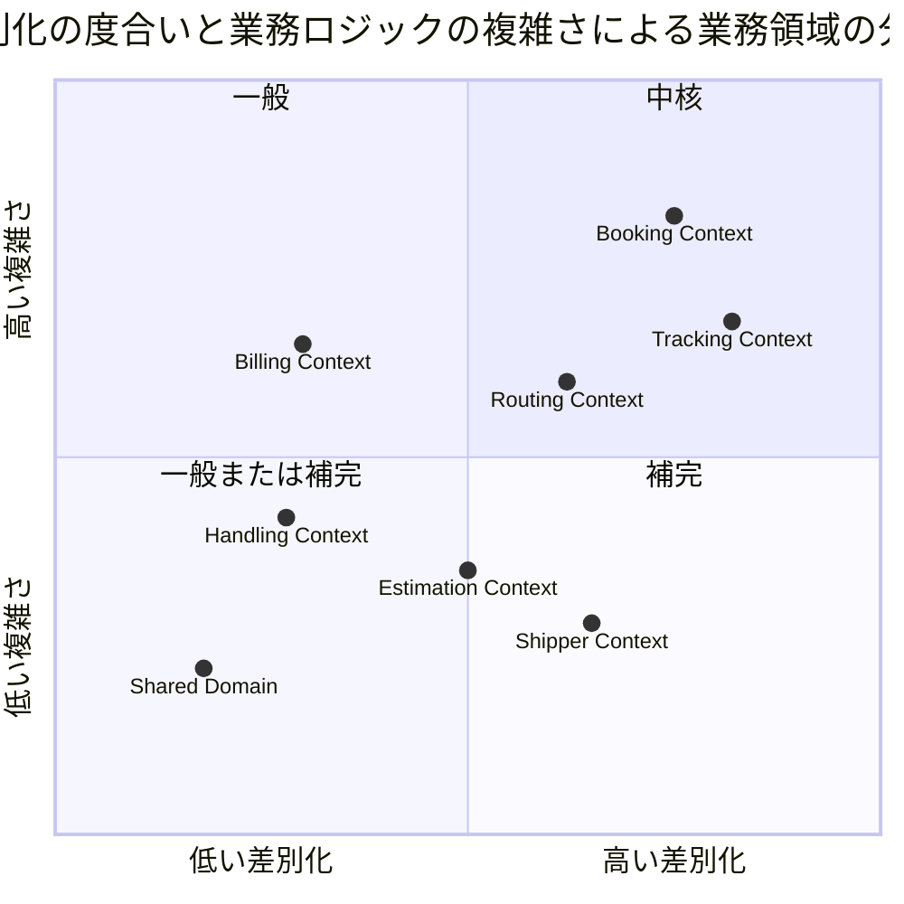

## Scala 3 によるドメインモデル表現規約

ドメイン層はフレームワーク・DB・エフェクトシステムに依存しない純粋な Scala 3 で表現する
（[バックエンドアーキテクチャ](architecture_backend.md) の表現方針を本ドキュメントで具体化する）。

| DDD 概念 | Scala 3 での表現 | 規約 |
|---|---|---|
| 集約ルート・エンティティ | イミュータブル `final case class` | 状態変更メソッドは `Either[DomainError, Self]` で新インスタンスを返す。同一性は識別子フィールドで判定する |
| 値オブジェクト（単一値） | `opaque type` + スマートコンストラクタ | `apply` が `Either[DomainError, A]` を返す。永続化からの復元は `unsafe` を使用 |
| 値オブジェクト（複合値） | `final case class` + コンパニオンのスマートコンストラクタ | 等価性は `case class` の構造比較をそのまま使用 |
| サブタイプを持つ概念 | `sealed trait` + `final case class`（ADT） | 継承でなく代数的データ型で表現し、パターンマッチの網羅性検査を効かせる |
| 状態・種別（列挙） | `enum` | 状態遷移の可否判定は enum のメソッドとして実装する |
| コマンド | `final case class` | アプリケーションサービスへの入力。`domain/model/commands/` に配置 |
| ドメインイベント | `sealed trait DomainEvent` を継承した `final case class` | 過去形で命名（`CargoBookedEvent`） |
| ドメインサービス | `object` の純粋関数、または依存を引数に取る `class` | 状態を持たない |
| リポジトリ（出力ポート） | `trait` | ドメイン層に定義し、インフラ層が実装する |
| ファクトリ | コンパニオンオブジェクトの `create`（検証あり）/ `reconstruct`（永続化復元・検証なし） | 生成経路を 2 系統に限定する |

```scala
// 値オブジェクト（単一値）: opaque type + スマートコンストラクタ
opaque type BookingId = String

object BookingId:
  def apply(value: String): Either[DomainError, BookingId] =
    if value.matches("BK-[A-Z0-9]{6}") then Right(value)
    else Left(DomainError.InvalidBookingId(value))
  def unsafe(value: String): BookingId = value
  extension (id: BookingId) def value: String = id

// 値オブジェクト（複合値）: 金額は最小通貨単位の Long で保持（データモデル設計判断 3 と対応）
final case class Money(amount: Long, currency: Currency):
  def add(other: Money): Either[DomainError, Money] =
    if currency == other.currency then Right(copy(amount = amount + other.amount))
    else Left(DomainError.CurrencyMismatch(currency, other.currency))
  def multiply(factor: BigDecimal): Money =
    copy(amount = (BigDecimal(amount) * factor).setScale(0, BigDecimal.RoundingMode.HALF_UP).toLong)

// 状態列挙: 遷移可否を enum のメソッドで表現
enum BookingStatus:
  case Preliminary, RouteProposed, Confirmed, TrackingIssued,
       InTransit, Delivered, Settled, Cancelled

  def canTransitionTo(next: BookingStatus): Boolean = (this, next) match
    case (Preliminary, RouteProposed) | (RouteProposed, Confirmed) |
         (Confirmed, TrackingIssued) | (TrackingIssued, InTransit) |
         (InTransit, Delivered) | (Delivered, Settled) => true
    case (Preliminary | RouteProposed | Confirmed, Cancelled) => true
    case _ => false

// 集約: 状態変更は Either で検証して新インスタンスを返す
final case class Cargo(
    bookingId: BookingId,
    shipperId: ShipperId,
    routeSpecification: RouteSpecification,
    itinerary: Option[CargoItinerary],
    delivery: Delivery,
    status: BookingStatus
):
  def assignRoute(newItinerary: CargoItinerary): Either[DomainError, Cargo] =
    for
      _ <- Either.cond(routeSpecification.isSatisfiedBy(newItinerary), (),
             DomainError.RouteNotSatisfied(bookingId))
      next <- transitionTo(BookingStatus.RouteProposed)
    yield next.copy(itinerary = Some(newItinerary))

  private def transitionTo(next: BookingStatus): Either[DomainError, Cargo] =
    Either.cond(status.canTransitionTo(next), copy(status = next),
      DomainError.InvalidStatusTransition(bookingId, status, next))
```

## ユビキタス言語

| 英語（コード名） | 日本語（業務用語） | 使用コンテキスト | 説明 |
|---|---|---|---|
| Cargo | 貨物 | Booking Context | 予約の中心的エンティティ。荷主から荷受人へ輸送される物品 |
| Shipper | 荷主 | Shipper Context | 貨物を発送する主体。個人・法人の 2 種別 |
| CorporateShipper | 法人荷主 | Shipper Context | Shipper の法人バリアント。契約番号と割引率を持つ |
| Address | 住所 | Shipper Context | 荷主の住所情報（最大 500 文字） |
| Dimensions | 寸法 | Booking Context | 貨物の長さ・幅・高さ（オプション） |
| Quantity | 個数 | Booking Context | 貨物の個数（オプション、1 以上） |
| Description | 品名 | Booking Context | 貨物の品名（オプション、最大 500 文字） |
| HazardousDeclaration | 危険物申告 | Booking Context | 危険物クラス・UN 番号・正式輸送品名 |
| TemperatureRequirement | 温度管理条件 | Booking Context | 最低温度・最高温度・温度単位 |
| ShipperExistenceChecker | 荷主存在確認 ACL | Booking Context | 荷主コンテキストへの存在確認ポート |
| Consignee | 荷受人 | Booking Context | 貨物を受け取る主体。氏名・住所・連絡先を保持 |
| BookingId | 予約 ID | Booking Context | 予約を一意に識別する値オブジェクト |
| RouteSpecification | ルート仕様 | Booking Context | 出発地・目的地・到着期限の要件定義 |
| CargoItinerary | 旅程 | Booking Context | 貨物の輸送経路全体。1 つ以上の Leg で構成 |
| Leg | 輸送区間 | Booking Context | 単一航海での積込港から荷降港までの区間 |
| Delivery | 配送状況 | Booking Context | 現在の輸送状態・経路状態・最終荷役イベントの集合 |
| Voyage | 航海 | Routing Context | 特定の船舶が実施する一連の運送区間 |
| Schedule | 航海スケジュール | Routing Context | 航海を構成する時系列の運送区間一覧 |
| CarrierMovement | 運送区間 | Routing Context | 出発港・到着港・出発時刻・到着時刻を持つ区間単位 |
| TrackingActivity | 追跡レコード | Tracking Context | 貨物の追跡情報全体を管理する集約 |
| TrackingNumber | 追跡番号 | Tracking Context | 追跡活動を一意に識別する番号 |
| TrackingActivityEvent | 追跡イベント | Tracking Context | 時系列で記録される追跡の出来事 |
| TrackingExceptionEvent | 追跡例外イベント | Tracking Context | 遅延・損傷・紛失・税関保留などの例外事象 |
| HandlingActivity | 荷役作業 | Handling Context | 実際に行われた荷役作業の記録 |
| HandlingActivityHistory | 荷役履歴 | Handling Context | クエリ専用の荷役作業履歴（Read Model） |
| Invoice | 精算書 | Billing Context | 貨物輸送 1 件に対して発行される請求書 |
| DiscountPolicy | 割引方針 | Billing Context | 法人・ボリューム・シーズン割引のポリシー |
| Location | 位置情報 | Shared Domain | UN/LOCODE で識別される港湾・地点の共有カーネル |
| TransportStatus | 輸送状態 | Shared Domain | 貨物の現在の輸送フェーズを表す共有列挙型 |
| RoutingStatus | 経路状態 | Shared Domain | 経路の妥当性状態（NotRouted / Routed / Misrouted） |
| BookingStatus | 予約状態 | Booking Context | 予約ライフサイクルの状態（8 値） |
| CargoType | 貨物種別 | Booking Context | General / Hazardous / Refrigerated |
| ExceptionType | 例外種別 | Tracking Context | Delay / Damage / Lost / CustomsHold |
| CustomsStatus | 通関状態 | Handling Context | Pending / Cleared / Held / Rejected |
| PaymentStatus | 支払い状態 | Billing Context | Pending / Confirmed / Overdue / Refunded |
| Estimate | 見積 | Estimation Context | 輸送見積の中心エンティティ。出発地・仕向地・期限・貨物種別・重量を保持 |
| EstimateId | 見積 ID | Estimation Context | UUID ベースの見積一意識別子 |
| RouteCandidate | ルート候補 | Estimation Context | 見積に紐づく輸送ルート候補。航海番号・経由港・輸送日数・見積コストを保持 |
| EstimateStatus | 見積状態 | Estimation Context | Created（作成済）/ Expired（期限切れ） |

> 列挙値は DB には `SCREAMING_SNAKE_CASE` 文字列（例: `ROUTE_PROPOSED`）で永続化し、
> Scala コード上は enum ケース名（例: `RouteProposed`）で表現する（データモデル設計のマッピング規約参照）。

## アクターとコンテキストの対応

| アクター | 対話するコンテキスト | 主要コマンド / 操作 |
|---|---|---|
| 営業担当者 | Booking Context・Estimation Context | `BookCargoCommand`・`RouteCargoCommand`・`CreateEstimateCommand` |
| 経路設計者 | Routing Context + Booking Context | `RegisterVoyageCommand`・`RouteCargoCommand`・`AssignTrackingNumberCommand` |
| 荷役作業員 | Handling Context | `HandlingActivityRegistrationCommand` |
| 追跡管理者 | Tracking Context | `AddTrackingEventCommand`・例外登録 |
| 荷主 | Booking Context（読取）+ Tracking Context（読取） | 追跡照会・状態確認 |
| 荷受人 | Tracking Context（読取）+ Booking Context（読取） | 到着確認・引取手続き |
| 経理担当者 | Billing Context | `GenerateInvoiceCommand`・`ConfirmPaymentCommand` |

## 境界付けられたコンテキスト概要

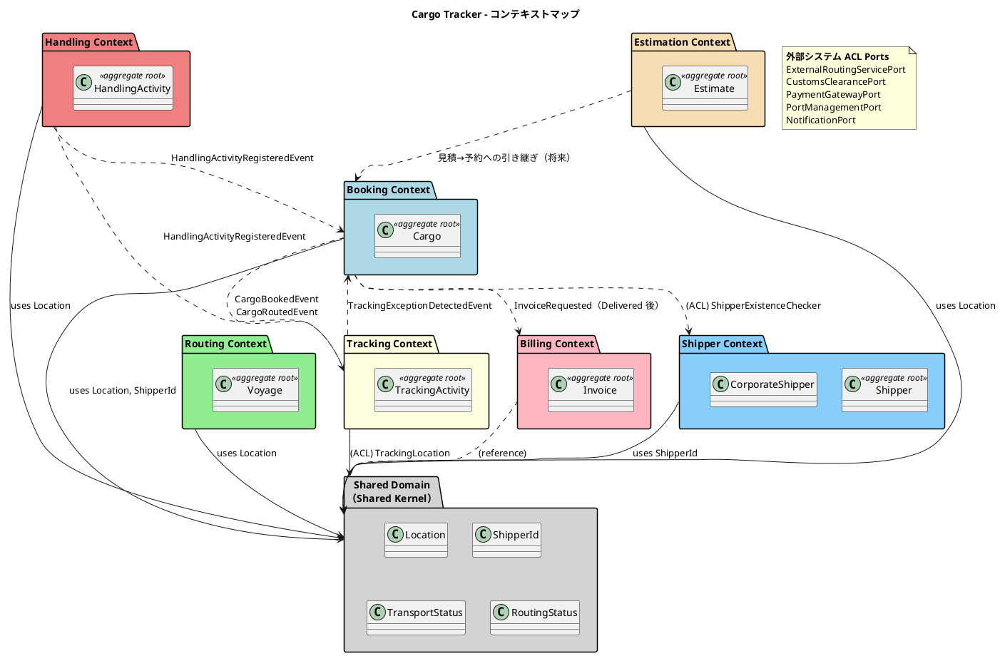

## 1. Booking Context（予約コンテキスト）

### ドメインモデル図

```plantuml
@startuml
title Booking Context - ドメインモデル

package "Aggregate（集約）" {
  class Cargo <<aggregate root>> {
    -bookingId: BookingId
    -shipperId: ShipperId
    -consignee: Option[Consignee]
    -routeSpecification: RouteSpecification
    -itinerary: Option[CargoItinerary]
    -delivery: Delivery
    -bookingAmount: Money
    -status: BookingStatus
    -cargoType: CargoType
    -dimensions: Option[Dimensions]
    -quantity: Option[Quantity]
    -description: Option[Description]
    -hazardousDeclaration: Option[HazardousDeclaration]
    -temperatureRequirement: Option[TemperatureRequirement]
    +assignRoute(itinerary): Either[DomainError, Cargo]
    +confirm(): Either[DomainError, Cargo]
    +issueTracking(number): Either[DomainError, Cargo]
    +cancel(): Either[DomainError, Cargo]
  }
}

package "Value Objects（値オブジェクト）" {
  class BookingId <<opaque type>> {
    String
  }
  class ShipperId <<value object>> {
    -id: UUID
    -shipperType: ShipperType
  }
  class Consignee <<value object>> {
    -name: String
    -address: String
    -contactEmail: Email
  }
  class RouteSpecification <<value object>> {
    -origin: Location
    -destination: Location
    -arrivalDeadline: LocalDate
    +isSatisfiedBy(itinerary): Boolean
  }
  class CargoItinerary <<value object>> {
    -legs: List[Leg]
    +expectedArrivalTime(): Instant
  }
  class Leg <<value object>> {
    -loadLocation: Location
    -unloadLocation: Location
    -loadTime: Instant
    -unloadTime: Instant
    -voyage: VoyageNumber
  }
  class Delivery <<value object>> {
    -transportStatus: TransportStatus
    -routingStatus: RoutingStatus
    -lastCargoHandledEvent: Option[CargoHandlingActivity]
  }
  class Money <<value object>> {
    -amount: Long（最小通貨単位）
    -currency: Currency
    +add(other: Money): Either[DomainError, Money]
    +multiply(factor: BigDecimal): Money
  }
  class CargoHandlingActivity <<value object>> {
    -handlingType: String
    -location: Location
    -completionTime: Instant
  }
  enum BookingStatus {
    Preliminary
    RouteProposed
    Confirmed
    TrackingIssued
    InTransit
    Delivered
    Settled
    Cancelled
  }
  enum ShipperType {
    Individual
    Corporate
  }
  class Dimensions <<value object>> {
    -length: BigDecimal
    -width: BigDecimal
    -height: BigDecimal
  }
  class Quantity <<opaque type>> {
    Int（1 以上）
  }
  class Description <<opaque type>> {
    String（最大 500 文字）
  }
  class HazardousDeclaration <<value object>> {
    -hazardousClass: String
    -unNumber: String
    -properShippingName: String
  }
  class TemperatureRequirement <<value object>> {
    -minTemperature: BigDecimal
    -maxTemperature: BigDecimal
    -unit: TemperatureUnit
  }
  enum CargoType {
    General
    Hazardous
    Refrigerated
  }
  enum RoutingStatus {
    NotRouted
    Routed
    Misrouted
  }
}

interface ShipperExistenceChecker <<ACL Port>> {
  +exists(shipperId: ShipperId): Boolean
}

Cargo *-- BookingId
Cargo *-- ShipperId
Cargo *-o Consignee
Cargo *-- RouteSpecification
Cargo *-o CargoItinerary
Cargo *-- Delivery
Cargo *-- Money
Cargo *-- BookingStatus
Cargo *-- CargoType
Cargo *-o Dimensions
Cargo *-o Quantity
Cargo *-o Description
Cargo *-o HazardousDeclaration
Cargo *-o TemperatureRequirement
ShipperId *-- ShipperType
CargoItinerary *-- Leg
Delivery *-- RoutingStatus

@enduml
```

### 集約・エンティティ・値オブジェクト一覧

| 種別 | クラス名 | 日本語名 | Scala 表現 | 責務 |
|---|---|---|---|---|
| 集約ルート | Cargo | 貨物 | `final case class` | 予約の中心。状態遷移・旅程・配送状況を統括 |
| 値オブジェクト | BookingId | 予約 ID | `opaque type String` | 予約の一意識別（`BK-XXXXXX` 形式） |
| 値オブジェクト | ShipperId | 荷主識別子 | `final case class` | 荷主 ID と種別（個人・法人）の保持 |
| 値オブジェクト | Consignee | 荷受人情報 | `final case class` | 荷受人の名前・住所・連絡先メール |
| 値オブジェクト | RouteSpecification | ルート仕様 | `final case class` | 出発地・目的地・到着期限の要件定義 |
| 値オブジェクト | CargoItinerary | 旅程 | `final case class`（`List[Leg]`） | 輸送区間の集合と到着時刻計算。Leg 連結制約を生成時に検証 |
| 値オブジェクト | Leg | 輸送区間 | `final case class` | 単一航海での積込港から荷降港までの区間 |
| 値オブジェクト | Delivery | 配送状況 | `final case class` | 現在の輸送状態・経路状態・最終荷役イベント |
| 値オブジェクト | Money | 金額 | `final case class`（`Long` 最小通貨単位） | 金額と通貨コードのペア。多通貨対応 |
| 値オブジェクト | CargoHandlingActivity | 荷役活動（参照用） | `final case class` | 最終荷役イベントの記録 |
| 列挙型 | BookingStatus | 予約状態 | `enum`（`canTransitionTo` 内包） | 8 段階の予約ライフサイクル |
| 列挙型 | ShipperType | 荷主種別 | `enum` | Individual / Corporate |
| 値オブジェクト | Dimensions | 寸法 | `final case class` | 貨物の長さ・幅・高さ（オプション） |
| 値オブジェクト | Quantity | 個数 | `opaque type Int` | 貨物の個数（1 以上、オプション） |
| 値オブジェクト | Description | 品名 | `opaque type String` | 貨物の品名（最大 500 文字、オプション） |
| 値オブジェクト | HazardousDeclaration | 危険物申告 | `final case class` | 危険物クラス・UN 番号・正式輸送品名 |
| 値オブジェクト | TemperatureRequirement | 温度管理条件 | `final case class` | 最低/最高温度・温度単位 |
| 列挙型 | CargoType | 貨物種別 | `enum` | General / Hazardous / Refrigerated |
| 列挙型 | RoutingStatus | 経路状態 | `enum` | NotRouted / Routed / Misrouted |
| ACL ポート | ShipperExistenceChecker | 荷主存在確認 | `trait` | Shipper Context への ACL。荷主 ID の存在確認 |

### ビジネスルール

1. 貨物は必ず BookingId・ShipperId・CargoType を持つ
2. RouteSpecification の出発地と目的地は異なる（UN/LOCODE 形式で検証）。スマートコンストラクタで生成時に保証する
3. CargoItinerary は 1 つ以上の Leg で構成される。`legs(n).unloadLocation == legs(n+1).loadLocation` の連結制約を `CargoItinerary.apply` で検証し、違反時は `Left(DomainError.DisconnectedLegs)` を返す
4. BookingStatus の遷移は `Preliminary → RouteProposed → Confirmed → TrackingIssued → InTransit → Delivered → Settled` の順に進む。`Preliminary` / `RouteProposed` / `Confirmed` からは `Cancelled` に遷移可能。遷移可否は `BookingStatus.canTransitionTo` に集約し、違反は `DomainError.InvalidStatusTransition` で表現する
5. Corporate の荷主は割引適用の対象となる（割引率上限 30%）
6. Hazardous / Refrigerated の CargoType は指定港のみ取扱可能
7. CargoType が Hazardous の場合 `hazardousDeclaration` は `Some` でなければならない（`Cargo.create` で検証）
8. CargoType が Refrigerated の場合 `temperatureRequirement` は `Some` でなければならない（`Cargo.create` で検証）
9. Booking Context は Shipper Context に直接依存せず、ShipperExistenceChecker ACL ポートを通じて荷主の存在を確認する

### コマンド一覧

コマンドは `final case class` として `domain/model/commands/` に定義する。

| コマンド | 実行アクター | 主な処理 |
|---|---|---|
| BookCargoCommand | 営業担当者 | 貨物予約の新規登録（Preliminary 状態で作成） |
| AssignToRoutingCommand | 営業担当者 | 予約情報を経路設計者に引き渡す（Preliminary → RouteProposed に遷移） |
| ConfirmBookingCommand | 営業担当者 | 予約を確定する（RouteProposed → Confirmed に遷移） |
| CancelBookingCommand | 営業担当者 | 予約をキャンセルする（Cancelled に遷移） |
| RouteCargoCommand | 経路設計者 | CargoItinerary を Cargo に割り当てる |
| AssignTrackingNumberCommand | 経路設計者 | TrackingNumber を Cargo に紐付け、TrackingIssued に遷移 |
| UpdateBookingStatusCommand | システム | BookingStatus の状態遷移を更新 |

## 2. Shipper Context（荷主コンテキスト）

### ドメインモデル図

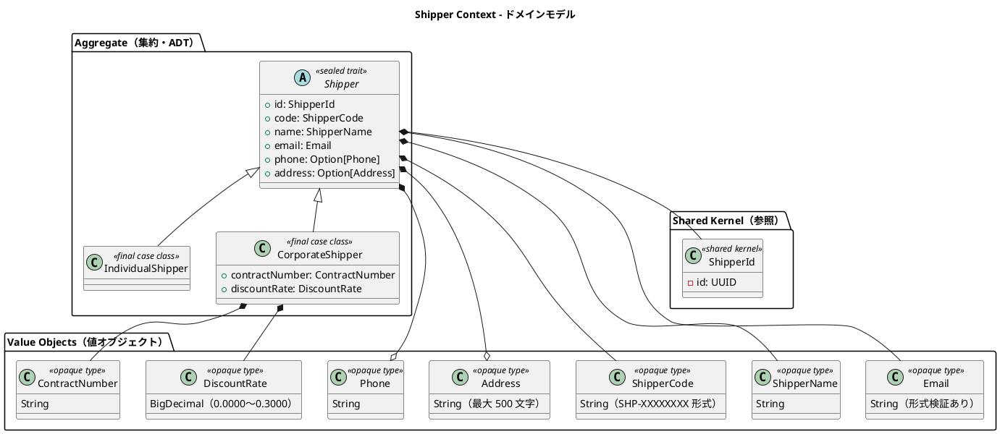

Java 版の継承（`CorporateShipper extends Shipper`）は、Scala 版では **ADT（`sealed trait` + `final case class`）** で表現する。
パターンマッチの網羅性検査により「法人のみ割引適用」のような分岐の漏れをコンパイル時に検出できる。

```scala
sealed trait Shipper:
  def id: ShipperId
  def code: ShipperCode
  def name: ShipperName
  def email: Email
  def phone: Option[Phone]
  def address: Option[Address]

final case class IndividualShipper(
    id: ShipperId, code: ShipperCode, name: ShipperName,
    email: Email, phone: Option[Phone], address: Option[Address]
) extends Shipper

final case class CorporateShipper(
    id: ShipperId, code: ShipperCode, name: ShipperName,
    email: Email, phone: Option[Phone], address: Option[Address],
    contractNumber: ContractNumber, discountRate: DiscountRate
) extends Shipper

// 利用側: 網羅性検査が効く
def discountRateOf(shipper: Shipper): DiscountRate = shipper match
  case c: CorporateShipper => c.discountRate
  case _: IndividualShipper => DiscountRate.zero
```

### 集約・エンティティ・値オブジェクト一覧

| 種別 | クラス名 | 日本語名 | Scala 表現 | 責務 |
|---|---|---|---|---|
| 集約ルート | Shipper | 荷主 | `sealed trait` | 荷主情報の管理。個人・法人の 2 バリアント |
| 集約バリアント | IndividualShipper | 個人荷主 | `final case class` | 個人荷主。割引なし |
| 集約バリアント | CorporateShipper | 法人荷主 | `final case class` | 法人荷主。契約番号と割引率を追加保持 |
| 値オブジェクト | ShipperCode | 荷主コード | `opaque type String` | 自動生成される荷主の業務識別コード |
| 値オブジェクト | ShipperName | 荷主名 | `opaque type String` | 荷主の氏名または社名 |
| 値オブジェクト | Email | メール | `opaque type String` | メールアドレス。一意制約あり |
| 値オブジェクト | Phone | 電話番号 | `opaque type String` | 電話番号（オプション） |
| 値オブジェクト | Address | 住所 | `opaque type String` | 住所（オプション、最大 500 文字） |
| 値オブジェクト | ContractNumber | 契約番号 | `opaque type String` | 法人荷主の契約番号 |
| 値オブジェクト | DiscountRate | 割引率 | `opaque type BigDecimal` | 法人荷主の割引率（0〜30%）。範囲検証付き |
| 共有カーネル参照 | ShipperId | 荷主識別子 | `final case class`（UUID） | 一意識別子。Shared Domain に配置 |

### ビジネスルール

1. 荷主は必ず ShipperId・ShipperCode・ShipperName・Email を持つ
2. Email はシステム全体で一意（重複は `DomainError.EmailAlreadyRegistered` で表現し、アプリケーションサービスがリポジトリ照会で検出する）
3. 法人荷主は ContractNumber と DiscountRate が必須（ADT の構造で型的に保証され、実行時検証が不要になる）
4. DiscountRate の値域は 0.0000〜0.3000（0%〜30%）。スマートコンストラクタで検証する
5. ShipperCode は自動生成（`SHP-` プレフィックス + UUID 先頭 8 文字）

### コマンド一覧

| コマンド | 実行アクター | 主な処理 |
|---|---|---|
| RegisterShipperCommand | 営業担当者 | 荷主の新規登録。Email 重複チェックと ShipperCode 自動生成 |

## 3. Routing Context（経路コンテキスト）

### ドメインモデル図

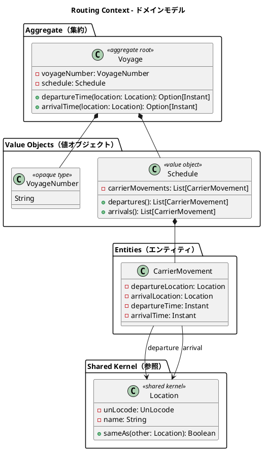

### 集約・エンティティ・値オブジェクト一覧

| 種別 | クラス名 | 日本語名 | Scala 表現 | 責務 |
|---|---|---|---|---|
| 集約ルート | Voyage | 航海 | `final case class` | 航路スケジュールを管理する中心エンティティ |
| 値オブジェクト | VoyageNumber | 航海番号 | `opaque type String` | Routing Context 固有の航海一意識別子 |
| 値オブジェクト | Schedule | 航海スケジュール | `final case class`（`List[CarrierMovement]`） | 時系列の運送区間一覧。順序・連続性を生成時に検証 |
| エンティティ | CarrierMovement | 運送区間 | `final case class` | 出発地・到着地・出発時刻・到着時刻の区間単位 |
| 共有カーネル参照 | Location | 位置情報 | `final case class` | UN/LOCODE で識別される港湾・地点 |

### ビジネスルール

1. 航海は必ず一意の VoyageNumber を持つ
2. Schedule は時系列順の CarrierMovement で構成される。`Schedule.apply` で順序・連続性を検証する
3. CarrierMovement の出発地と到着地は異なる。出発時刻は到着時刻より前である（US24 の日付整合性検証に対応）
4. Location は UN/LOCODE で一意に識別される（例: `JPOSA` = 大阪、`USLAX` = LA）

### コマンド一覧

| コマンド | 実行アクター | 主な処理 |
|---|---|---|
| RegisterVoyageCommand | 経路設計者 | 新規航海スケジュールの登録（US24） |
| UpdateScheduleCommand | 経路設計者 | 運送区間の追加・変更（US25。既存スケジュールの上書き更新） |

## 4. Tracking Context（追跡コンテキスト）

### ドメインモデル図

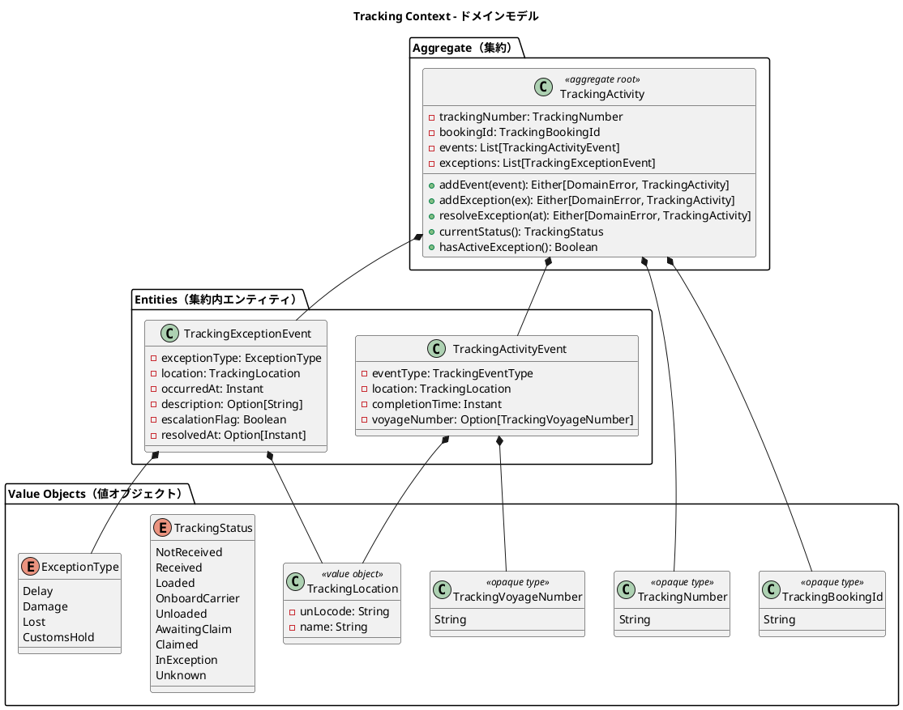

### 集約・エンティティ・値オブジェクト一覧

| 種別 | クラス名 | 日本語名 | Scala 表現 | 責務 |
|---|---|---|---|---|
| 集約ルート | TrackingActivity | 追跡レコード | `final case class` | 貨物の追跡情報全体を管理。イベント追加は新インスタンスを返す |
| エンティティ（集約内） | TrackingActivityEvent | 追跡イベント | `final case class` | 時系列で記録される追跡の出来事 |
| エンティティ（集約内） | TrackingExceptionEvent | 追跡例外イベント | `final case class` | 遅延・損傷・紛失・税関保留の例外記録 |
| 値オブジェクト | TrackingNumber | 追跡番号 | `opaque type String` | 追跡活動を一意に識別 |
| 値オブジェクト | TrackingBookingId | 予約参照 ID | `opaque type String` | Booking Context との関連を保持 |
| 値オブジェクト | TrackingLocation | 追跡位置情報 | `final case class` | コンテキスト固有の位置情報型（ACL 変換） |
| 値オブジェクト | TrackingVoyageNumber | 追跡航海番号 | `opaque type String` | Tracking Context 固有の航海番号型 |
| 列挙型 | TrackingStatus | 追跡状態 | `enum` | 9 段階の追跡フェーズ。`currentStatus()` がイベント履歴から導出 |
| 列挙型 | ExceptionType | 例外種別 | `enum` | Delay / Damage / Lost / CustomsHold |

> `currentStatus()` は保持する状態フィールドでなく、イベント履歴と未解決例外から**導出する純粋関数**として実装する。
> 状態とイベントの二重管理による不整合を構造的に排除する。

### ビジネスルール

1. 追跡活動は必ず一意の TrackingNumber を持つ
2. TrackingActivityEvent は時系列順で管理される。イベントごとに位置と時刻が必須。`addEvent` は最終イベントより過去の時刻を拒否する
3. ExceptionType が Lost の場合、`escalationFlag` を `true` に設定し上位管理者へエスカレーションする（US20）
4. CustomsHold 例外は税関システム（CustomsClearancePort）からの通知によって自動登録される
5. `ResolveExceptionCommand` の実行により TrackingStatus は例外発生前の状態に復帰する（`currentStatus()` の導出ロジックで自然に実現される）

### コマンド一覧

| コマンド | 実行アクター | 主な処理 |
|---|---|---|
| AssignTrackingNumberCommand | Booking Context（イベント駆動） | TrackingActivity を新規作成し TrackingNumber を割り当て |
| AddTrackingEventCommand | 追跡管理者 | TrackingActivityEvent を時系列で追加 |
| RegisterExceptionCommand | 追跡管理者・税関システム | TrackingExceptionEvent を登録 |
| ResolveExceptionCommand | 追跡管理者 | 例外を解決し TrackingStatus を復帰 |

## 5. Handling Context（荷役コンテキスト）

### ドメインモデル図

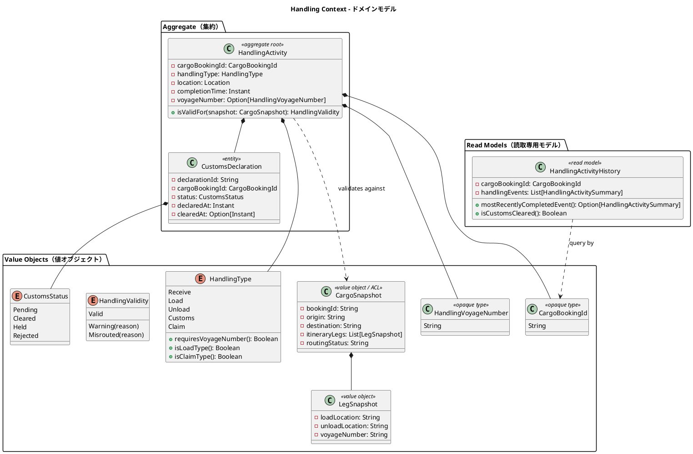

### 集約・エンティティ・値オブジェクト一覧

| 種別 | クラス名 | 日本語名 | Scala 表現 | 責務 |
|---|---|---|---|---|
| 集約ルート | HandlingActivity | 荷役作業 | `final case class` | 荷役作業の登録と妥当性検証 |
| エンティティ（集約内） | CustomsDeclaration | 通関申告 | `final case class` | 通関申告の状態管理 |
| 値オブジェクト | CargoBookingId | 貨物予約識別子 | `opaque type String` | Booking Context との関連識別子 |
| 列挙型 | HandlingType | 荷役種別 | `enum`（判定メソッド内包） | Receive / Load / Unload / Customs / Claim。VoyageNumber 必須判定を内包 |
| 値オブジェクト | CargoSnapshot | 貨物スナップショット | `final case class` | ACL 経由で取得した貨物情報。妥当性検証に使用 |
| 値オブジェクト | LegSnapshot | 旅程区間スナップショット | `final case class` | CargoSnapshot 内の区間情報 |
| 値オブジェクト | HandlingVoyageNumber | 航海番号 | `opaque type String` | Handling Context 固有の航海番号型 |
| 列挙型 | HandlingValidity | 荷役妥当性 | `enum`（パラメータ付きケース） | Valid / Warning / Misrouted の検証結果 |
| 列挙型 | CustomsStatus | 通関状態 | `enum` | Pending / Cleared / Held / Rejected |
| Read Model | HandlingActivityHistory | 荷役履歴 | `final case class`（Query DTO） | クエリ専用の荷役作業履歴。集約と切り離して管理 |

### ビジネスルール

荷役妥当性検証（`isValidFor`）のデシジョンテーブル。検証結果はパラメータ付き enum `HandlingValidity` で表現し、
警告（続行可能）と MISROUTED（経路逸脱確定）を型で区別する：

| 荷役タイプ | VoyageNumber 必須 | 場所チェック | 不一致時の判定 |
|---|---|---|---|
| Receive（受領） | 不要 | 出発港（RouteSpecification.origin）と一致 | `Warning` |
| Load（積込） | 必須 | Itinerary の積込港（Leg.loadLocation）と一致 | `Misrouted` |
| Unload（荷降し） | 必須 | Itinerary の荷降港（Leg.unloadLocation）と一致 | `Misrouted` |
| Claim（引取） | 不要 | 目的港（RouteSpecification.destination）と一致 | `Warning` |

追加ルール：

1. Load / Unload 作業で `Misrouted` が確定した場合、Booking Context の RoutingStatus を Misrouted に更新する（イベント経由）
2. CustomsDeclaration が Cleared 状態になるまで Claim（引取）は実施できない
3. HandlingActivityHistory はクエリ専用の Read Model として管理され、集約とは切り離す（CQRS のクエリ側 DTO）

### コマンド一覧

| コマンド | 実行アクター | 主な処理 |
|---|---|---|
| HandlingActivityRegistrationCommand | 荷役作業員 | 荷役作業を登録し、CargoSnapshot で妥当性を検証 |
| RegisterCustomsDeclarationCommand | 荷役作業員 | 通関申告を新規登録（Pending 状態で作成） |
| UpdateCustomsStatusCommand | 税関システム（ACL） | 通関申告の状態を更新（Cleared / Held / Rejected） |

## 6. Billing Context（精算コンテキスト）

### ドメインモデル図

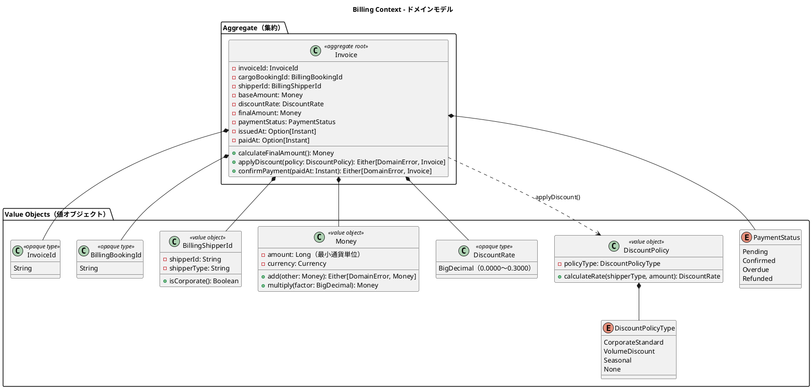

### 集約・エンティティ・値オブジェクト一覧

| 種別 | クラス名 | 日本語名 | Scala 表現 | 責務 |
|---|---|---|---|---|
| 集約ルート | Invoice | 精算書 | `final case class` | 貨物輸送 1 件に対する請求書の発行・管理 |
| 値オブジェクト | InvoiceId | 請求書 ID | `opaque type String` | 精算書の一意識別子 |
| 値オブジェクト | BillingBookingId | 予約参照 ID | `opaque type String` | Booking Context の Cargo との関連識別子 |
| 値オブジェクト | BillingShipperId | 荷主参照 ID | `final case class` | 法人判定（isCorporate）を内包 |
| 値オブジェクト | Money | 金額 | `final case class`（`Long` 最小通貨単位） | 金額と通貨コードのペア |
| 値オブジェクト | DiscountRate | 割引率 | `opaque type BigDecimal` | 0〜30% の割引率。範囲バリデーション付き |
| 値オブジェクト | DiscountPolicy | 割引方針 | `final case class` | 法人・ボリューム・シーズン割引のロジック |
| 列挙型 | PaymentStatus | 支払い状態 | `enum` | Pending / Confirmed / Overdue / Refunded |
| 列挙型 | DiscountPolicyType | 割引方針種別 | `enum` | CorporateStandard / VolumeDiscount / Seasonal / None |

### ビジネスルール

1. Invoice は貨物配送完了（BookingStatus = Delivered）後にのみ発行できる
2. 法人荷主（Corporate）には最大 30% の割引が適用される
3. 支払期限（issuedAt + 30 日）を超過した場合、PaymentStatus を Overdue に更新する
4. 支払い確定（Confirmed）後のキャンセルは `IssueRefundCommand` で対応し、Refunded 状態に遷移する

料金計算ロジック：

```text
基本料金 = 距離係数 × 重量（kg） × 貨物種別係数
  - General（一般貨物）: 係数 1.0
  - Hazardous（危険物）: 係数 1.8
  - Refrigerated（冷凍・冷蔵）: 係数 1.5

割引後料金 = 基本料金 × (1 - 割引率)
  - Corporate 荷主: 割引率 0〜30%
  - Individual 荷主: 割引なし（割引率 0%）
```

> 金額計算は `Money`（最小通貨単位の `Long`）上で行い、端数は `HALF_UP` で丸める。
> 浮動小数点（`Double`）は金額計算に使用しない。

### コマンド一覧

| コマンド | 実行アクター | 主な処理 |
|---|---|---|
| GenerateInvoiceCommand | 経理担当者 | 請求書を新規発行（Pending 状態で作成） |
| ConfirmPaymentCommand | 経理担当者 | 支払い確認を記録し Confirmed に遷移 |

## 7. Estimation Context（見積コンテキスト）

### ドメインモデル図

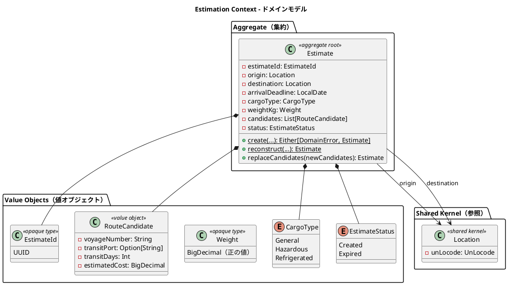

### 集約・エンティティ・値オブジェクト一覧

| 種別 | クラス名 | 日本語名 | Scala 表現 | 責務 |
|---|---|---|---|---|
| 集約ルート | Estimate | 見積 | `final case class` | 輸送見積の中心エンティティ。出発地・仕向地・貨物種別・重量・ルート候補を管理 |
| 値オブジェクト | EstimateId | 見積 ID | `opaque type UUID` | 見積一意識別子。`generate()` で自動生成 |
| 値オブジェクト | RouteCandidate | ルート候補 | `final case class` | 航海番号・経由港・輸送日数・見積コストを保持。Estimate に複数紐づく |
| 値オブジェクト | Weight | 重量 | `opaque type BigDecimal` | 正の値のみ許容する重量（kg） |
| 列挙型 | CargoType | 貨物種別 | `enum` | General / Hazardous / Refrigerated（Booking Context と同一値） |
| 列挙型 | EstimateStatus | 見積状態 | `enum` | Created（作成済）/ Expired（期限切れ） |
| リポジトリ | EstimateRepository | 見積リポジトリ | `trait` | `save` / `findByEstimateId` / `findAll` |

### ビジネスルール

1. 見積は必ず EstimateId・origin・destination・arrivalDeadline・CargoType・weightKg を持つ
2. origin と destination は異なる（同一地点への見積は不可。`Estimate.create` で検証）
3. weightKg は正の値でなければならない（`Weight` の opaque type で型的に保証）
4. RouteCandidate の voyageNumber は空でない文字列、transitDays は正の値、estimatedCost は正の値
5. 見積作成時のデフォルトステータスは `Created`
6. ルート候補はスタブ実装（固定値）で生成される。将来、外部ルーティングサービス（ExternalRoutingServicePort）との連携時にアダプターを差し替える

### コマンド一覧

| コマンド | 実行アクター | 主な処理 |
|---|---|---|
| CreateEstimateCommand | 営業担当者 | 見積を新規作成し、スタブのルート候補を自動付与 |

### Booking Context との関係

Estimation Context は Booking Context と以下の関係を持つ。

- **共有**: CargoType 列挙型は両コンテキストで同一の値（General / Hazardous / Refrigerated）を使用する
- **参照**: Location（Shared Domain）を経由して出発地・仕向地を共有する
- **将来の連携**: 見積から予約への引き継ぎ（見積情報を基に Cargo を作成するフロー）は将来イテレーションで実装予定

## 8. Shared Domain（共有ドメイン）

### ドメインモデル図

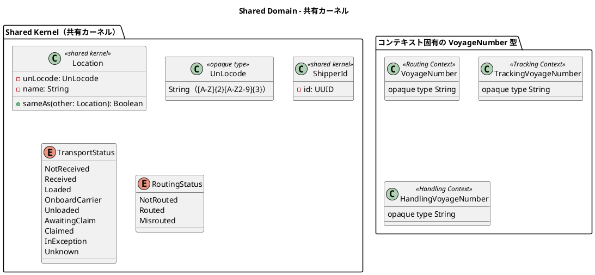

### 共有コンポーネント一覧

| 種別 | クラス名 | 日本語名 | Scala 表現 | 責務 |
|---|---|---|---|---|
| 共有カーネル | Location | 位置情報 | `final case class` | UN/LOCODE で識別される港湾・地点。全コンテキストで共有 |
| 共有カーネル | UnLocode | UN/LOCODE | `opaque type String` | 国際標準 5 文字コード。形式をスマートコンストラクタで検証 |
| 共有カーネル | ShipperId | 荷主識別子 | `final case class`（UUID） | Booking Context と Shipper Context で共有 |
| 共有列挙型 | TransportStatus | 輸送状態 | `enum` | 9 段階の輸送フェーズ。Booking・Tracking で共有 |
| 共有列挙型 | RoutingStatus | 経路状態 | `enum` | NotRouted / Routed / Misrouted。Booking・Handling で共有 |
| 共有 | DomainEvent | ドメインイベント基底 | `sealed trait`（コンテキスト別に拡張） | イベント発行ポートの契約型 |
| 共有 | DomainError | ドメインエラー基底 | `trait`（コンテキスト別 enum が実装） | `Either` の Left 側の契約型 |

> **TransportStatus の値について**: 本ドキュメントの 9 値
> （`NotReceived / Received / Loaded / OnboardCarrier / Unloaded / AwaitingClaim / Claimed / InException / Unknown`）を正とする。
> [バックエンドアーキテクチャ](architecture_backend.md) のコンテキスト概要の値一覧も本定義に統一済み。
> 要件定義の貨物状態遷移（受領待ち〜引取済・例外発生）との対応: 受領待ち = NotReceived、受領済 = Received、
> 積込済 = Loaded、輸送中 = OnboardCarrier、荷降し済 = Unloaded、引取待ち = AwaitingClaim、引取済 = Claimed、
> 例外発生・対応中 = InException。

### TransportStatus と TrackingStatus の関係

Tracking Context の `TrackingStatus` と共有ドメインの `TransportStatus` は同じ 9 段階のフェーズを表すが、
意図的に**別の型**として定義する（VoyageNumber のコンテキスト分離と同じ原則）。役割分担は次のとおり。

| 型 | 所属 | 役割 |
|---|---|---|
| `TrackingStatus` | Tracking Context 固有 | `TrackingActivity.currentStatus()` がイベント履歴から**導出**するコンテキスト内部の状態。Tracking のドメインロジック（例外復帰等）はこちらを使う |
| `TransportStatus` | Shared Domain | コンテキスト間連携（イベントペイロード）・画面表示・Booking の状態同期で使う**公開語彙** |

連携規約:

- Tracking Context の出口（イベント発行・クエリサービス）で `TrackingStatus.toTransportStatus` により変換する。変換は**全域かつ 1 対 1**（9 値 ↔ 9 値）とする
- 他コンテキストが `TrackingStatus` を直接参照することを禁止する（ArchUnit ルールの対象）
- 両 enum の対応は `TableDrivenPropertyChecks` による全網羅テストで検証し、片方への値追加時の乖離をコンパイルエラー（`match` の網羅性検査）とテストの双方で検出する（[テスト戦略](test_strategy.md) 参照）

### VoyageNumber のコンテキスト分離設計

VoyageNumber は各コンテキストが独自の opaque type を保持する。これにより各コンテキストの自律性を保ちながら、
型レベルでコンテキスト間の取り違えを防止する（`VoyageNumber` を `TrackingVoyageNumber` の引数に渡すとコンパイルエラー）。

| コンテキスト | 型名 | 役割 |
|---|---|---|
| Routing Context | VoyageNumber | 航海スケジュールの識別子 |
| Tracking Context | TrackingVoyageNumber | 追跡イベントに紐づく航海番号（ACL 変換） |
| Handling Context | HandlingVoyageNumber | 荷役作業に紐づく航海番号（ACL 変換） |

### ビジネスルール

1. Location の変更は全コンテキストチームの合意のもとに行う（Shared Kernel の制約）
2. UN/LOCODE は国際規格（ISO 3166-1 alpha-2 + 3 文字のロケーションコード）に従う。`UnLocode` のスマートコンストラクタで検証する
3. TransportStatus と RoutingStatus は Booking Context と Tracking / Handling Context の間で整合性を保つ（イベント連携で同期）

## ドメインイベント

イベントは `sealed trait DomainEvent` を継承した `final case class` として、発生元コンテキストの `domain/model/events/` に定義する。

| イベント名 | 発生元 | 処理先 | 内容 |
|---|---|---|---|
| CargoBookedEvent | Booking Context | Tracking Context | 新規貨物予約後、追跡番号割り当て依頼を通知 |
| CargoRoutedEvent | Booking Context | Tracking Context | 旅程確定後、経路・旅程情報を追跡コンテキストに同期 |
| HandlingActivityRegisteredEvent | Handling Context | Tracking Context・Booking Context | 荷役作業完了後、TransportStatus と BookingStatus を同期 |
| TrackingExceptionDetectedEvent | Tracking Context | Booking Context・Notification | 例外（遅延・損傷・紛失・税関保留）検知後、通知を配信 |
| InvoiceCreatedEvent | Billing Context | Notification | 請求書発行後、荷主への通知を配信 |

### ドメインイベントフロー

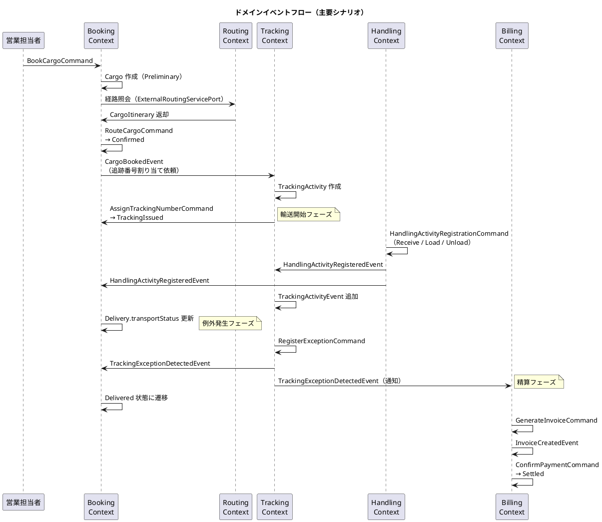

## 外部システム ACL Ports

| ポート名 | 対応外部システム | 責務 |
|---|---|---|
| ExternalRoutingServicePort | 外部経路最適化システム | 出発地・目的地・期限を渡し最適 CargoItinerary を取得 |
| CustomsClearancePort | 税関システム | 通関申告の提出・状態照会・CustomsHold 例外の自動通知受信 |
| PaymentGatewayPort | 決済機関 | 支払い処理の実行と支払い確認の受信 |
| PortManagementPort | 港湾管理システム | 港湾の取扱可能貨物種別（Hazardous / Refrigerated）の照会 |
| NotificationPort | 通知システム | 荷主・荷受人へのメール / SMS 通知の送信 |

各ポートはヘキサゴナルアーキテクチャの出力ポート（`trait`）として定義され、インフラ層のアダプター（Play WS クライアント等）が実装を担う。これにより外部システムの変更がドメインロジックに影響しない。

## 並行性制御（楽観ロック）

イミュータブル集約は単一トランザクション内の整合性を保証するが、**複数ユーザーが同じ集約を同時に開いて別々に上書きする lost update** は別の問題であり、楽観ロックで防止する。

- すべての集約ルートテーブルに `version` カラム（`INTEGER NOT NULL DEFAULT 0`）を持たせる（[データモデル設計](data-model.md) 参照）
- リポジトリの `save` は `UPDATE ... SET version = version + 1 WHERE id = ? AND version = ?` で比較更新し、更新行数 0 の場合は `DomainError.ConcurrentModification` を返す（先勝ち）
- アプリケーションサービスは `Left(ConcurrentModification)` を受けたら HTTP 409 相当として扱い、UI は「他のユーザーが更新しました。最新の内容を確認して再度操作してください」と再読み込みを促す
- 対象は更新系操作を持つ集約（Cargo・Voyage・TrackingActivity・Invoice・Estimate・Shipper）。追記のみのテーブル（イベント系）は対象外
- 競合シナリオ（US17 の手動状態更新、US25 の航海スケジュール上書き等）の並行更新は統合テストで検証する（[テスト戦略](test_strategy.md) 参照）

## 集約設計の判断

### Booking Context：Cargo 集約

Cargo を集約ルートとし、BookingId・ShipperId・RouteSpecification・CargoItinerary・Delivery を集約内に含める設計とした。

**根拠**：予約の状態遷移（BookingStatus）はこれらのオブジェクトが一体として整合性を保つ必要がある。特に CargoItinerary の Leg 連結制約（`legs(n).unloadLocation == legs(n+1).loadLocation`）は単一トランザクション内で検証しなければ不整合が生じる。Consignee は Cargo に対して 1 対 1 であるため、独立した集約とせず値オブジェクトとして含める。イミュータブル設計により、検証に失敗した中間状態の集約はそもそも存在し得ない。

### Shipper Context：Shipper 集約（ADT）

Shipper を `sealed trait` とし、IndividualShipper / CorporateShipper の 2 バリアントで表現する設計とした。

**根拠**：Java 版の継承（`CorporateShipper extends Shipper`）と同じ概念を ADT で表現することで、「法人のみが契約番号・割引率を持つ」という制約が型構造そのものになり、null チェックや実行時検証が不要になる。割引適用などの分岐はパターンマッチの網羅性検査で漏れを防げる。

### Routing Context：Voyage 集約

Voyage を集約ルートとし、Schedule（CarrierMovement のリスト）を内包する設計とした。

**根拠**：Schedule と CarrierMovement は Voyage の文脈でのみ意味を持つ。Schedule の時系列整合性（CarrierMovement の順序・連続性）は Voyage 単位で保証する必要があるため、単一集約に含める。整合性検証は `Schedule.apply`（スマートコンストラクタ）に集約する。

### Tracking Context：TrackingActivity 集約

TrackingActivity を集約ルートとし、TrackingActivityEvent と TrackingExceptionEvent を集約内エンティティとして管理する設計とした。

**根拠**：追跡状態（TrackingStatus）は時系列の全イベントと例外状態を総合的に判定するため、単一集約としてまとめる必要がある。Scala 版では `currentStatus()` をイベント履歴からの**導出関数**として実装し、状態フィールドの二重管理を排除する。「例外発生前の状態に復帰」も、例外解決後に導出ロジックが自然に元の状態を返すことで実現される。

### Handling Context：HandlingActivity 集約 + Read Model 分離

HandlingActivity を集約ルートとし、CustomsDeclaration を集約内エンティティとした。荷役履歴は Read Model（HandlingActivityHistory）として集約と切り離す設計とした。

**根拠**：個々の荷役作業は独立した記録単位であり、互いに強い整合性制約を持たない。一方、通関申告（CustomsDeclaration）と荷役作業は「Cleared にならないと Claim 不可」という不変条件があるため、同一集約に含める。クエリ専用の履歴参照は Read Model（CQRS クエリ側のフラットな DTO）として分離することで、コマンド側（集約）の複雑性を低減する。妥当性検証の結果はパラメータ付き enum `HandlingValidity` で表現し、警告と経路逸脱を型で区別する。

### Billing Context：Invoice 集約

Invoice を集約ルートとし、DiscountPolicy はドメインサービスではなく値オブジェクトとして Invoice に委譲する設計とした。

**根拠**：請求書 1 件の整合性（基本料金・割引率・最終金額の一貫性）は Invoice 集約内で保証される。DiscountPolicy の割引率計算ロジックは Invoice の `applyDiscount()` 内で完結するため、外部ドメインサービスとして切り出す必要はない。支払い状態（PaymentStatus）の遷移も Invoice 集約が責任を持つ。金額は `Money`（最小通貨単位の `Long`）で表現し、データモデルの `*_amount_value` + `*_amount_currency` カラムに対応する。

### Estimation Context：Estimate 集約

Estimate を集約ルートとし、RouteCandidate（ルート候補）のリストを集約内に保持する設計とした。

**根拠**：見積とルート候補は 1 対多の関係にあり、ルート候補は見積の文脈でのみ意味を持つ。`replaceCandidates` でルート候補の一括入替を行うため、トランザクション整合性の観点から単一集約に含める。RouteCandidate は `final case class` で実装し、不変性を保証する。現在のルート候補生成はスタブ実装（重量ベースの固定コスト計算）であり、将来の外部ルーティングサービス連携時にアダプターを差し替える設計とした。

## 参照

- [バックエンドアーキテクチャ](architecture_backend.md)
- [データモデル設計](data-model.md)
- [要件定義書](../requirements/requirements_definition.md)（情報モデル・状態モデル）
- [システムユースケース](../requirements/system_usecase.md)
- [ユーザーストーリー](../requirements/user_story.md)
