# ドメインモデル設計 - 国際貨物輸送管理システム（F# 版）

## 概要

本ドキュメントは、国際貨物輸送管理システムの DDD（ドメイン駆動設計）戦術的設計を定義する。システムは以下の 7 つの境界付けられたコンテキスト（Bounded Context）— Booking / Shipper / Routing / Tracking / Handling / Billing / Estimation — で構成される。Shared Domain（Shared Kernel）は全コンテキストが参照する共有カーネルであり、コンテキスト数には含めない。

実装は F# / .NET を前提とし、以下のモデリング方針を採用する。

- **値オブジェクト**：単一ケース判別共用体（Single-Case DU）またはレコード。スマートコンストラクタ（`create : ... -> Result<T, DomainError>`）で不変条件を保証する
- **状態**：判別共用体（DU）で表現し、不正な状態を型で表現不能にする（Make Illegal States Unrepresentable）
- **集約操作**：純粋関数 `Cargo -> Command -> Result<Cargo * DomainEvent list, DomainError>` の形式。副作用を持たず、状態遷移と発行イベントを戻り値で返す
- **エラー**：`DomainError` 判別共用体 + Railway Oriented Programming（[FsToolkit.ErrorHandling](https://github.com/demystifyfp/FsToolkit.ErrorHandling) の `result` / `validation` CE）
- **名前空間**：垂直スライスのモジュール階層 `CargoTracker.<Context>.Domain`（例: `CargoTracker.Booking.Domain`）で表現する（ADR-0001 参照）

| コンテキスト | 日本語名 | モジュール | 主な責務 | 対応ユーザーストーリー |
|---|---|---|---|---|
| Booking Context | 予約コンテキスト | `CargoTracker.Booking.Domain` | 貨物予約の受付・旅程管理・状態遷移 | US04〜US06, US09, US11〜US14 |
| Shipper Context | 荷主コンテキスト | `CargoTracker.Shipper.Domain` | 荷主の登録・管理・法人割引 | US02, US03 |
| Routing Context | 経路コンテキスト | `CargoTracker.Routing.Domain` | 航海スケジュール・経路情報の管理 | US07, US08, US10, US24, US25 |
| Tracking Context | 追跡コンテキスト | `CargoTracker.Tracking.Domain` | 貨物追跡・例外イベント管理 | US14, US17〜US20 |
| Handling Context | 荷役コンテキスト | `CargoTracker.Handling.Domain` | 荷役作業登録・通関申告管理 | US15, US16 |
| Billing Context | 精算コンテキスト | `CargoTracker.Billing.Domain` | 精算書発行・割引・支払い管理 | US21〜US23 |
| Estimation Context | 見積コンテキスト | `CargoTracker.Estimation.Domain` | 輸送見積の作成・ルート候補の管理 | US01 |
| Shared Domain（Shared Kernel、コンテキスト数には含めない） | 共有ドメイン | `CargoTracker.Shared.Domain` | 共有カーネル（Location・ShipperId・TransportStatus・DomainEvent） | —（全 US を横断的に支援） |

ユーザーストーリー（US）の定義は [ユーザーストーリー](../requirements/user_story.md) を参照。

各コンテキストは自律的に変更可能な集約を持ち、コンテキスト間の連携はドメインイベント（`DomainEvent` 判別共用体）および ACL（Anti-Corruption Layer）ポート（関数型インターフェース）を通じて行う。

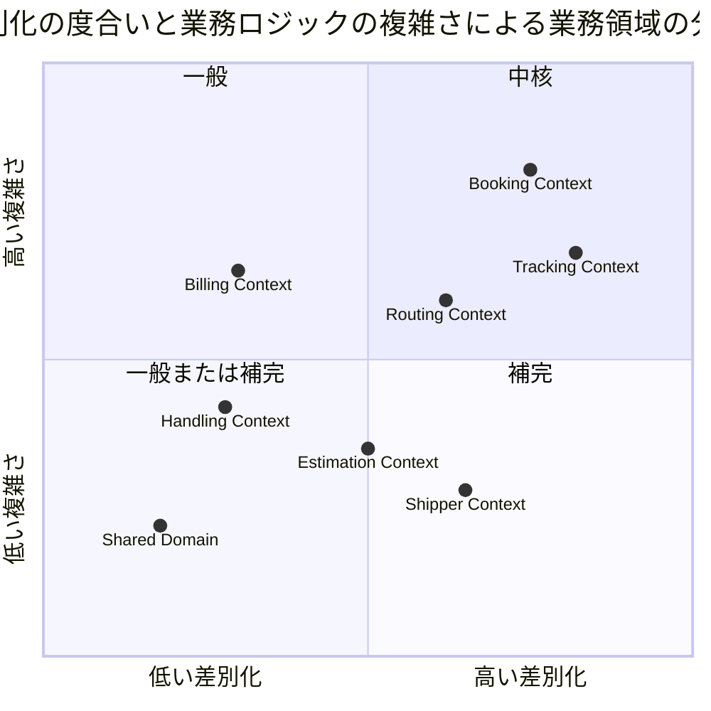

## F# モデリングの基本方針

C# 版との対応関係を以下に示す。

| C# 版の表現 | F# 版の表現 | 意図 |
|---|---|---|
| `record`（値オブジェクト） | 単一ケース DU またはレコード + スマートコンストラクタ | 不変性 + 不正値の生成を型で防止 |
| `enum`（状態） | 判別共用体（データ付きケースも可） | 網羅的パターンマッチで遷移漏れをコンパイルエラーに |
| クラス + ミュータブルなメソッド | イミュータブルレコード + 純粋関数 | 状態遷移を `Result<'State * DomainEvent list, DomainError>` で表現 |
| `interface`（ACL / リポジトリポート） | 関数型（`ShipperId -> Async<bool>`）またはレコード of 関数 | 依存の最小化・テスト容易性 |
| MediatR `INotification` | `DomainEvent` 判別共用体 | イベントは集約操作の戻り値として純粋に発行 |
| 例外（`throw`） | `DomainError` DU + `Result` | Railway Oriented Programming |
| nullable / `?` | `option` | 欠損を型で明示 |

```fsharp
// 全コンテキスト共通のエラー表現（各コンテキストで拡張）
type DomainError =
    | ValidationError of field: string * message: string
    | InvalidStateTransition of current: string * attempted: string
    | BusinessRuleViolation of rule: string * message: string
    | NotFound of entity: string * id: string

// 集約操作の標準シグネチャ
// execute : State -> Command -> Result<State * DomainEvent list, DomainError>
```

### 値オブジェクトの等価性

値オブジェクトの等価性は、F# のレコード / 判別共用体が備える**構造的等価性**（全フィールドの値が等しければ等しい）に従う。C# 版のような `Equals` / `GetHashCode` のオーバーライドは不要であり、`=` 演算子による比較・`Set` / `Map` のキー利用・`List.distinct` による重複排除がそのまま業務的に正しい意味を持つ（例: Estimation Context の RouteCandidate の重複排除は構造的等価を基準とする）。ただし、業務的な同一性が構造的等価と一致しない場合は専用の判定関数を定義する（例: `Location.sameAs` は `Name` を無視し `UnLocode` のみで同一性を判定する）。

## ユビキタス言語

| 英語（コード名） | 日本語（業務用語） | 使用コンテキスト | 説明 |
|---|---|---|---|
| Cargo | 貨物 | Booking Context | 予約の中心的エンティティ。荷主から荷受人へ輸送される物品 |
| Shipper | 荷主 | Shipper Context | 貨物を発送する主体。個人・法人の 2 種別 |
| CorporateShipper | 法人荷主 | Shipper Context | Shipper の DU ケース。契約番号と割引率を持つ |
| Address | 住所 | Shipper Context | 荷主の住所情報（最大 500 文字） |
| Dimensions | 寸法 | Booking Context | 貨物の長さ・幅・高さ（オプション） |
| Quantity | 個数 | Booking Context | 貨物の個数（オプション、1 以上） |
| Description | 品名 | Booking Context | 貨物の品名（オプション、最大 500 文字） |
| HazardousDeclaration | 危険物申告 | Booking Context | 危険物クラス・UN 番号・正式輸送品名 |
| TemperatureRequirement | 温度管理条件 | Booking Context | 最低温度・最高温度・温度単位 |
| ShipperExistenceChecker | 荷主存在確認 ACL | Booking Context | 荷主コンテキストへの存在確認ポート（関数型） |
| Consignee | 荷受人 | Booking Context | 貨物を受け取る主体。氏名・住所・連絡先を保持 |
| BookingId | 予約 ID | Booking Context | 予約を一意に識別する単一ケース DU |
| RouteSpecification | ルート仕様 | Booking Context | 出発地・目的地・到着期限の要件定義 |
| CargoItinerary | 旅程 | Booking Context | 貨物の輸送経路全体。1 つ以上の Leg で構成（非空リスト） |
| Leg | 輸送区間 | Booking Context | 単一航海での積込港から荷降港までの区間 |
| Delivery | 配送状況 | Booking Context | 現在の輸送状態・経路状態・最終荷役イベントの集合 |
| Voyage | 航海 | Routing Context | 特定の船舶が実施する一連の運送区間 |
| Schedule | 航海スケジュール | Routing Context | 航海を構成する時系列の運送区間一覧 |
| CarrierMovement | 運送区間 | Routing Context | 出発港・到着港・出発時刻・到着時刻を持つ区間単位 |
| TrackingActivity | 追跡レコード | Tracking Context | 貨物の追跡情報全体を管理する集約 |
| TrackingNumber | 追跡番号 | Tracking Context | 追跡活動を一意に識別する番号 |
| TrackingActivityEvent | 追跡イベント | Tracking Context | 時系列で記録される追跡の出来事 |
| TrackingExceptionEvent | 追跡例外イベント | Tracking Context | 遅延・損傷・紛失・税関保留などの例外事象 |
| HandlingActivity | 荷役作業 | Handling Context | 実際に行われた荷役作業の記録 |
| HandlingActivityHistory | 荷役履歴 | Handling Context | クエリ専用の荷役作業履歴（Read Model） |
| Invoice | 精算書 | Billing Context | 貨物輸送 1 件に対して発行される精算書（請求番号・請求金額・支払い期限を記載。US23 参照） |
| DiscountPolicy | 割引方針 | Billing Context | 法人・ボリューム・シーズン割引のポリシー |
| Location | 位置情報 | Shared Domain | UN/LOCODE で識別される港湾・地点の共有カーネル |
| TransportStatus | 輸送状態 | Shared Domain | 貨物の現在の輸送フェーズを表す共有 DU |
| RoutingStatus | 経路状態 | Shared Domain | 経路の妥当性状態（NotRouted / Routed / Misrouted） |
| BookingState | 予約状態 | Booking Context | 予約ライフサイクルの状態（8 ケースのデータ付き DU）。DB カラム `booking_status`（文字列判別子）との対応付けは data-model 側の責務 |
| CargoType | 貨物種別 | Booking Context | General / Hazardous / Refrigerated（データ付き DU） |
| ExceptionType | 例外種別 | Tracking Context | Delay / Damage / Lost / CustomsHold |
| CustomsStatus | 通関状態 | Handling Context | Pending / Cleared / Held / Rejected |
| PaymentState | 支払い状態 | Billing Context | Pending / Confirmed / Overdue / Refunded（各ケースに時刻データ付き DU） |
| Estimate | 見積 | Estimation Context | 輸送見積の中心エンティティ。出発地・仕向地・期限・貨物種別・重量を保持 |
| EstimateId | 見積 ID | Estimation Context | UUID（`Guid`）ベースの見積一意識別子 |
| RouteCandidate | ルート候補 | Estimation Context | 見積に紐づく輸送ルート候補。航海番号・経由港・輸送日数・見積コストを保持 |
| CargoType | 貨物種別 | Estimation Context | General / Hazardous / Refrigerated（Booking Context と共通） |
| EstimateStatus | 見積状態 | Estimation Context | Created（作成済）/ Expired（期限切れ） |

## アクターとコンテキストの対応

| アクター | 対話するコンテキスト | 主要コマンド / 操作 |
|---|---|---|
| 営業担当者 | Booking Context・Estimation Context | `BookCargo`・`RouteCargo`・`CreateEstimate` |
| 経路設計者 | Routing Context + Booking Context | `RouteCargo`・`IssueTrackingNumber` |
| 荷役作業員 | Handling Context | `RegisterHandlingActivity` |
| 追跡管理者 | Tracking Context | `AddTrackingEvent`・例外登録 |
| 荷主 | Booking Context（読取）+ Tracking Context（読取） | 追跡照会・状態確認 |
| 荷受人 | Tracking Context（読取）+ Booking Context（読取） | 到着確認・引取手続き |
| 経理担当者 | Billing Context | `GenerateInvoice`・`ConfirmPayment` |

## 境界付けられたコンテキスト概要

> 注記：以下の PlantUML 図では `class` 表記を使用しているが、F# 実装では集約ルートはレコード、`<<record>>` の値オブジェクトは単一ケース DU またはレコード、`enum` は判別共用体に対応する。

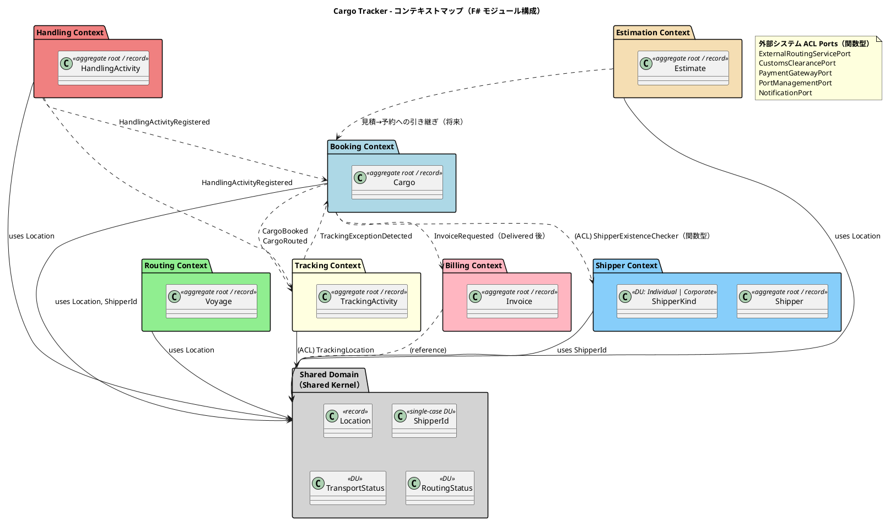

## 1. Booking Context（予約コンテキスト）

モジュール：`CargoTracker.Booking.Domain`

対応 US：US04〜US06, US09, US11〜US14

### ドメインモデル図

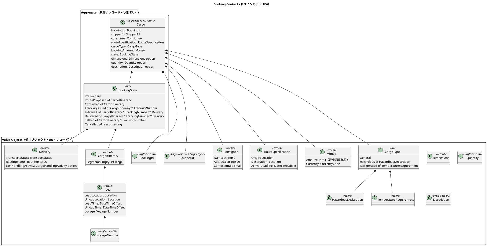

### 実装表現（F#）

不正状態を型で表現不能にする（Make Illegal States Unrepresentable）ことが設計の中心である。

- C# 版の `BookingStatus` 列挙型 + nullable な `CargoItinerary` / `TrackingNumber` は、「Preliminary なのに旅程を持つ」「TrackingIssued なのに追跡番号が null」という不正状態を許してしまう。F# 版では `BookingState` DU の各ケースが必要なデータのみを保持することで、これらを型レベルで排除する
- C# 版の `CargoType` 列挙型 + オプショナルな `HazardousDeclaration` / `TemperatureRequirement` は、「Hazardous なのに危険物申告がない」を実行時検証に頼る。F# 版は `Hazardous of HazardousDeclaration` としてデータを DU ケースに埋め込み、検証を不要にする

```fsharp
namespace CargoTracker.Booking.Domain

open CargoTracker.Shared.Domain

// ---- 値オブジェクト（単一ケース DU + スマートコンストラクタ）----

type BookingId = private BookingId of string

module BookingId =
    let create (value: string) : Result<BookingId, DomainError> =
        if System.String.IsNullOrWhiteSpace value then
            Error (ValidationError ("BookingId", "予約 ID は空にできません。"))
        else
            Ok (BookingId value)

    let value (BookingId v) = v

/// 品名：最大 500 文字の制約をスマートコンストラクタで保証
type Description = private Description of string

module Description =
    let create (value: string) : Result<Description, DomainError> =
        if System.String.IsNullOrWhiteSpace value then
            Error (ValidationError ("Description", "品名は空にできません。"))
        elif value.Length > 500 then
            Error (ValidationError ("Description", "品名は 500 文字以内でなければなりません。"))
        else
            Ok (Description value)

// ---- 貨物種別：必須データを DU ケースに埋め込む ----

type HazardousDeclaration =
    { HazardousClass: string
      UnNumber: string
      ProperShippingName: string }

type TemperatureUnit = Celsius | Fahrenheit

type TemperatureRequirement =
    { MinTemperature: decimal
      MaxTemperature: decimal
      Unit: TemperatureUnit }

/// Hazardous には HazardousDeclaration が、Refrigerated には
/// TemperatureRequirement が「必ず」存在する。検証コードは不要。
type CargoType =
    | General
    | Hazardous of HazardousDeclaration
    | Refrigerated of TemperatureRequirement

// ---- ルート仕様と旅程 ----

type RouteSpecification =
    { Origin: Location
      Destination: Location
      ArrivalDeadline: System.DateTimeOffset }

module RouteSpecification =
    let create origin destination deadline : Result<RouteSpecification, DomainError> =
        if Location.sameAs origin destination then
            Error (BusinessRuleViolation ("SameOriginDestination", "出発地と目的地は異なる必要があります。"))
        else
            Ok { Origin = origin; Destination = destination; ArrivalDeadline = deadline }

    let isSatisfiedBy (itinerary: CargoItinerary) (spec: RouteSpecification) : bool =
        CargoItinerary.firstLoadLocation itinerary = spec.Origin
        && CargoItinerary.lastUnloadLocation itinerary = spec.Destination
        && CargoItinerary.expectedArrivalTime itinerary <= spec.ArrivalDeadline

/// Booking Context 固有の航海番号（単一ケース DU）。
/// コンテキスト固有型の方針に従い Shared には置かない。Routing Context の
/// 同名型とは別型であり、コンテキスト間の取り違えはコンパイルエラーになる。
type VoyageNumber = private VoyageNumber of string

module VoyageNumber =
    let create (value: string) : Result<VoyageNumber, DomainError> =
        if System.String.IsNullOrWhiteSpace value then
            Error (ValidationError ("VoyageNumber", "航海番号は空にできません。"))
        else
            Ok (VoyageNumber value)

    let value (VoyageNumber v) = v

type Leg =
    { LoadLocation: Location
      UnloadLocation: Location
      LoadTime: System.DateTimeOffset
      UnloadTime: System.DateTimeOffset
      Voyage: VoyageNumber }

/// 「1 つ以上の Leg」を非空リストで型保証する
type CargoItinerary = private CargoItinerary of NonEmptyList<Leg>

module CargoItinerary =
    /// Leg 連結制約 Leg[n].UnloadLocation = Leg[n+1].LoadLocation を検証
    let create (legs: Leg list) : Result<CargoItinerary, DomainError> =
        match legs with
        | [] -> Error (ValidationError ("Legs", "旅程は 1 つ以上の輸送区間が必要です。"))
        | _ ->
            legs
            |> List.pairwise
            |> List.tryFind (fun (prev, next) -> prev.UnloadLocation <> next.LoadLocation)
            |> function
               | Some _ -> Error (BusinessRuleViolation ("LegConnectivity", "輸送区間が連結していません。"))
               | None -> Ok (CargoItinerary (NonEmptyList.ofList legs))

// ---- 金額：最小通貨単位の整数（data-model 設計判断 #3 を踏襲）----

type Money = { Amount: int64; Currency: CurrencyCode }

module Money =
    let add (a: Money) (b: Money) : Result<Money, DomainError> =
        if a.Currency <> b.Currency then
            Error (BusinessRuleViolation ("CurrencyMismatch", $"通貨が一致しません：{a.Currency} / {b.Currency}"))
        else
            Ok { a with Amount = a.Amount + b.Amount }

    /// 割引率等の乗算は最小通貨単位へ丸める（銀行家丸め）
    let multiply (factor: decimal) (m: Money) : Money =
        { m with Amount = int64 (System.Math.Round(decimal m.Amount * factor, System.MidpointRounding.ToEven)) }

// ---- 状態：BookingState DU（不正状態を表現不能に）----

type BookingState =
    | Preliminary
    | RouteProposed of CargoItinerary
    | Confirmed of CargoItinerary
    | TrackingIssued of CargoItinerary * TrackingNumber
    | InTransit of CargoItinerary * TrackingNumber * Delivery
    | Delivered of CargoItinerary * TrackingNumber * Delivery
    | Settled of CargoItinerary * TrackingNumber
    | Cancelled of reason: string

// ---- 集約ルート ----

type Cargo =
    { BookingId: BookingId
      ShipperId: ShipperId
      Consignee: Consignee
      RouteSpecification: RouteSpecification
      CargoType: CargoType
      BookingAmount: Money
      State: BookingState
      Dimensions: Dimensions option
      Quantity: Quantity option
      Description: Description option }
```

### コマンドと集約操作（純粋関数）

集約操作は `Cargo -> Command -> Result<Cargo * DomainEvent list, DomainError>` の純粋関数として実装する。副作用（永続化・イベント配信）はアプリケーション層に委ねる。

```fsharp
type BookingCommand =
    | ProposeRoute of CargoItinerary
    | ConfirmBooking
    | IssueTrackingNumber of TrackingNumber  // 経路設計者による手動発行（US14）
    | RegisterHandlingProgress of CargoHandlingActivity
    | CompleteDelivery
    | Settle
    | Cancel of reason: string

module Cargo =

    open FsToolkit.ErrorHandling

    /// 新規予約：BookCargo はコマンドではなくファクトリ関数として表現
    let book bookingId shipperId consignee routeSpec cargoType amount
        : Result<Cargo * DomainEvent list, DomainError> =
        result {
            let cargo =
                { BookingId = bookingId; ShipperId = shipperId
                  Consignee = consignee; RouteSpecification = routeSpec
                  CargoType = cargoType; BookingAmount = amount
                  State = Preliminary
                  Dimensions = None; Quantity = None; Description = None }
            return cargo, [ CargoBooked (bookingId, shipperId) ]
        }

    /// 状態遷移：網羅的パターンマッチにより遷移漏れはコンパイル警告になる
    let execute (cargo: Cargo) (command: BookingCommand)
        : Result<Cargo * DomainEvent list, DomainError> =
        match cargo.State, command with
        | Preliminary, ProposeRoute itinerary ->
            if cargo.RouteSpecification |> RouteSpecification.isSatisfiedBy itinerary then
                Ok ({ cargo with State = RouteProposed itinerary },
                    [ CargoRouted (cargo.BookingId, itinerary) ])
            else
                Error (BusinessRuleViolation ("RouteSpecification", "旅程がルート仕様を満たしていません。"))

        | RouteProposed itinerary, ConfirmBooking ->
            Ok ({ cargo with State = Confirmed itinerary }, [ BookingConfirmed cargo.BookingId ])

        | Confirmed itinerary, IssueTrackingNumber trackingNumber ->
            Ok ({ cargo with State = TrackingIssued (itinerary, trackingNumber) },
                [ TrackingNumberAssigned (cargo.BookingId, trackingNumber) ])

        | TrackingIssued (itinerary, tn), RegisterHandlingProgress activity ->
            let delivery = Delivery.fromActivity activity
            Ok ({ cargo with State = InTransit (itinerary, tn, delivery) },
                [ TransportStarted (cargo.BookingId, activity) ])

        | InTransit (itinerary, tn, _), RegisterHandlingProgress activity ->
            let delivery = Delivery.fromActivity activity
            Ok ({ cargo with State = InTransit (itinerary, tn, delivery) }, [])

        | InTransit (itinerary, tn, delivery), CompleteDelivery ->
            Ok ({ cargo with State = Delivered (itinerary, tn, delivery) },
                [ CargoDelivered cargo.BookingId; InvoiceRequested (cargo.BookingId, cargo.ShipperId) ])

        | Delivered (itinerary, tn, _), Settle ->
            Ok ({ cargo with State = Settled (itinerary, tn) }, [ BookingSettled cargo.BookingId ])

        // いずれの状態からも Cancelled に遷移可能（Settled / Cancelled を除く）
        | Settled _, Cancel _
        | Cancelled _, Cancel _ ->
            Error (InvalidStateTransition (stateName cargo.State, "Cancel"))

        | _, Cancel reason ->
            Ok ({ cargo with State = Cancelled reason }, [ BookingCancelled (cargo.BookingId, reason) ])

        | state, cmd ->
            Error (InvalidStateTransition (stateName state, commandName cmd))
```

### ACL ポート（関数型インターフェース）

```fsharp
/// Booking Context は Shipper Context に直接依存せず、
/// 関数型の ACL ポートを通じて荷主の存在を確認する
type ShipperExistenceChecker = ShipperId -> Async<bool>
```

### 集約・エンティティ・値オブジェクト一覧

| 種別 | 型名 | 日本語名 | F# 表現 | 責務 |
|---|---|---|---|---|
| 集約ルート | Cargo | 貨物 | レコード | 予約の中心。状態遷移・旅程・配送状況を統括 |
| 状態 | BookingState | 予約状態 | 判別共用体（8 ケース、データ付き） | 状態に必要なデータのみを保持し不正状態を排除 |
| 値オブジェクト | BookingId | 予約 ID | 単一ケース DU | 予約の一意識別 |
| 値オブジェクト | ShipperId | 荷主識別子 | 単一ケース DU + ShipperType | 荷主 ID と種別（個人・法人）の保持 |
| 値オブジェクト | Consignee | 荷受人情報 | レコード | 荷受人の名前・住所・連絡先メール |
| 値オブジェクト | RouteSpecification | ルート仕様 | レコード + スマートコンストラクタ | 出発地・目的地・到着期限の要件定義 |
| 値オブジェクト | CargoItinerary | 旅程 | private DU（NonEmptyList\<Leg\>） | 輸送区間の非空リストと到着時刻計算 |
| 値オブジェクト | Leg | 輸送区間 | レコード | 単一航海での積込港から荷降港までの区間 |
| 値オブジェクト | VoyageNumber | 航海番号 | 単一ケース DU | Booking Context 固有の航海番号型。Routing Context の同名型とは別型（取り違えはコンパイルエラー） |
| 値オブジェクト | Delivery | 配送状況 | レコード | 現在の輸送状態・経路状態・最終荷役イベント |
| 値オブジェクト | Money | 金額 | レコード（int64 + CurrencyCode） | 最小通貨単位の整数と通貨コード。多通貨対応 |
| 値オブジェクト | CargoHandlingActivity | 荷役活動（参照用） | レコード | 最終荷役イベントの記録 |
| 値オブジェクト | CargoType | 貨物種別 | 判別共用体（データ付き） | General / Hazardous of 申告 / Refrigerated of 温度条件 |
| 値オブジェクト | Dimensions | 寸法 | レコード（option で保持） | 貨物の長さ・幅・高さ |
| 値オブジェクト | Quantity | 個数 | 単一ケース DU（1 以上、option で保持） | 貨物の個数 |
| 値オブジェクト | Description | 品名 | 単一ケース DU（最大 500 文字、option で保持） | 貨物の品名 |
| ACL ポート | ShipperExistenceChecker | 荷主存在確認 | 関数型 `ShipperId -> Async<bool>` | Shipper Context への ACL |

### ビジネスルール

1. 貨物は必ず BookingId・ShipperId・CargoType を持つ（レコードの必須フィールドで型保証）
2. RouteSpecification の出発地と目的地は異なる（スマートコンストラクタで検証）
3. CargoItinerary は 1 つ以上の Leg で構成される（`NonEmptyList` で型保証）。`Leg[n].UnloadLocation = Leg[n+1].LoadLocation` の連結制約はスマートコンストラクタで検証する
4. BookingState の遷移は `Preliminary → RouteProposed → Confirmed → TrackingIssued → InTransit → Delivered → Settled` の順に進む。Settled / Cancelled を除くいずれの状態からも Cancelled に遷移可能。遷移規則は `Cargo.execute` のパターンマッチで表現し、許可されない遷移は `InvalidStateTransition` を返す
5. Corporate ShipperType の荷主は割引適用の対象となる（割引率上限 30%）
6. Hazardous / Refrigerated の CargoType は指定港のみ取扱可能
7. Hazardous の場合の HazardousDeclaration、Refrigerated の場合の TemperatureRequirement は DU ケースのデータとして**型で必須化**される（実行時検証は不要）
8. Booking Context は Shipper Context に直接依存せず、ShipperExistenceChecker ACL ポート（関数型）を通じて荷主の存在を確認する

### コマンド一覧

| コマンド | 実行アクター | 主な処理 |
|---|---|---|
| `Cargo.book`（ファクトリ） | 営業担当者 | 貨物予約の新規登録（Preliminary 状態で作成） |
| `ProposeRoute` | 経路設計者 | CargoItinerary を提案し RouteProposed に遷移 |
| `ConfirmBooking` | 営業担当者 | 予約を確定する（RouteProposed → Confirmed） |
| `IssueTrackingNumber` | 経路設計者 | 手動で TrackingNumber を発行・紐付けし TrackingIssued に遷移。発行後、NotificationPort 経由で荷主へメール通知する（US14） |
| `RegisterHandlingProgress` | システム（イベント駆動） | 荷役進捗を反映し InTransit へ / Delivery 更新 |
| `CompleteDelivery` | システム | Delivered に遷移し InvoiceRequested を発行 |
| `Settle` | システム | 精算完了で Settled に遷移 |
| `Cancel` | 営業担当者 | 予約をキャンセルする（Cancelled に遷移） |

## 2. Shipper Context（荷主コンテキスト）

モジュール：`CargoTracker.Shipper.Domain`

対応 US：US02, US03

### ドメインモデル図

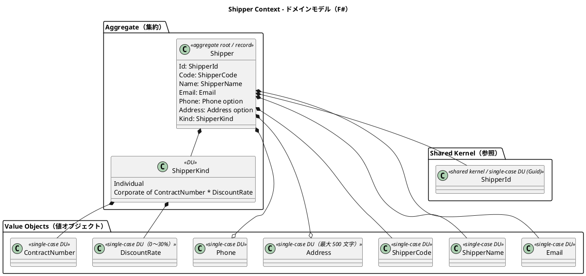

### 実装表現（F#）

C# 版はクラス継承（`CorporateShipper extends Shipper`）で法人荷主を表現していた。F# 版では `ShipperKind` DU の `Corporate` ケースに契約番号と割引率を埋め込むことで、「法人なのに契約番号がない」「個人なのに割引率を持つ」という不正状態を型で排除する。

```fsharp
namespace CargoTracker.Shipper.Domain

open CargoTracker.Shared.Domain

type ShipperCode = private ShipperCode of string
type Email = private Email of string

module Email =
    let create (value: string) : Result<Email, DomainError> =
        if System.Text.RegularExpressions.Regex.IsMatch(value, @"^[^@\s]+@[^@\s]+\.[^@\s]+$") then
            Ok (Email value)
        else
            Error (ValidationError ("Email", "メールアドレスの形式が不正です。"))

/// 割引率：0〜30% の不変条件をスマートコンストラクタで保証
type DiscountRate = private DiscountRate of decimal

module DiscountRate =
    let create (value: decimal) : Result<DiscountRate, DomainError> =
        if value < 0.0000m || value > 0.3000m then
            Error (ValidationError ("DiscountRate", "割引率は 0〜30% の範囲でなければなりません。"))
        else
            Ok (DiscountRate value)

    let value (DiscountRate v) = v

/// 継承ではなく DU で個人・法人を表現。
/// Corporate は ContractNumber と DiscountRate を「必ず」持つ。
type ShipperKind =
    | Individual
    | Corporate of ContractNumber * DiscountRate

type Shipper =
    { Id: ShipperId
      Code: ShipperCode
      Name: ShipperName
      Email: Email
      Phone: Phone option
      Address: Address option
      Kind: ShipperKind }

module Shipper =
    open FsToolkit.ErrorHandling

    /// 複数フィールドの検証エラーを集約する場合は validation CE を使用
    let register id name email phone address kind
        : Validation<Shipper * DomainEvent list, DomainError> =
        validation {
            let! name = ShipperName.create name
            and! email = Email.create email
            let code = ShipperCode.generate id  // SHP- プレフィックス + Guid 先頭 8 文字
            let shipper =
                { Id = id; Code = code; Name = name; Email = email
                  Phone = phone; Address = address; Kind = kind }
            return shipper, [ ShipperRegistered (id, code) ]
        }
```

### 集約・エンティティ・値オブジェクト一覧

| 種別 | 型名 | 日本語名 | F# 表現 | 責務 |
|---|---|---|---|---|
| 集約ルート | Shipper | 荷主 | レコード | 荷主情報の管理。個人・法人の 2 種別 |
| 種別 | ShipperKind | 荷主種別 | DU（Corporate はデータ付き） | Individual / Corporate of 契約番号 × 割引率 |
| 値オブジェクト | ShipperCode | 荷主コード | 単一ケース DU | 自動生成される荷主の業務識別コード |
| 値オブジェクト | ShipperName | 荷主名 | 単一ケース DU | 荷主の氏名または社名 |
| 値オブジェクト | Email | メール | 単一ケース DU + スマートコンストラクタ | メールアドレス。一意制約あり |
| 値オブジェクト | Phone | 電話番号 | 単一ケース DU（option で保持） | 電話番号 |
| 値オブジェクト | Address | 住所 | 単一ケース DU（option、最大 500 文字） | 住所 |
| 値オブジェクト | ContractNumber | 契約番号 | 単一ケース DU | 法人荷主の契約番号 |
| 値オブジェクト | DiscountRate | 割引率 | 単一ケース DU（0〜30%） | 法人荷主の割引率 |
| 共有カーネル参照 | ShipperId | 荷主識別子 | 単一ケース DU（Guid） | Shared Domain に配置 |
| リポジトリ（ポート） | ShipperRepository | 荷主リポジトリ | レコード of 関数 | 荷主の永続化ポート |

### ビジネスルール

1. 荷主は必ず ShipperId・ShipperCode・ShipperName・Email・ShipperKind を持つ（レコードの必須フィールドで型保証）
2. Email はシステム全体で一意（重複はアプリケーション層で `DomainError.BusinessRuleViolation ("EmailAlreadyRegistered", ...)` として検出）
3. Corporate の場合、ContractNumber と DiscountRate は DU ケースのデータとして**型で必須化**される
4. DiscountRate の値域は 0.0000〜0.3000（0%〜30%）。スマートコンストラクタで保証する
5. ShipperCode は自動生成（`SHP-` プレフィックス + `Guid` 先頭 8 文字）

### コマンド一覧

| コマンド | 実行アクター | 主な処理 |
|---|---|---|
| `Shipper.register` | 営業担当者 | 荷主の新規登録。Email 重複チェックと ShipperCode 自動生成 |

## 3. Routing Context（経路コンテキスト）

モジュール：`CargoTracker.Routing.Domain`

対応 US：US07, US08, US10, US24, US25

### ドメインモデル図

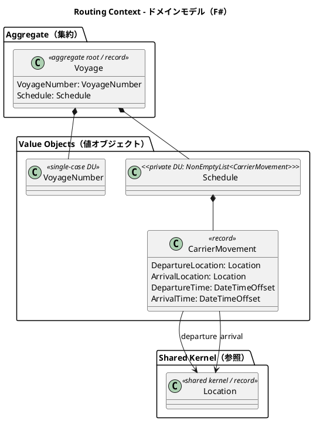

> 注記：C# 版で「エンティティ」だった CarrierMovement は、F# 版では同一性を持たないイミュータブルなレコード（値オブジェクト）としてモデリングする。区間の識別は Schedule 内の位置で十分であり、独立した ID を必要としない。

### 実装表現（F#）

```fsharp
namespace CargoTracker.Routing.Domain

open CargoTracker.Shared.Domain

type VoyageNumber = private VoyageNumber of string

type CarrierMovement =
    { DepartureLocation: Location
      ArrivalLocation: Location
      DepartureTime: System.DateTimeOffset
      ArrivalTime: System.DateTimeOffset }

/// 時系列整合性をスマートコンストラクタで保証
type Schedule = private Schedule of NonEmptyList<CarrierMovement>

module Schedule =
    let create (movements: CarrierMovement list) : Result<Schedule, DomainError> =
        match movements with
        | [] -> Error (ValidationError ("Schedule", "スケジュールは 1 つ以上の運送区間が必要です。"))
        | _ when movements |> List.exists (fun m -> Location.sameAs m.DepartureLocation m.ArrivalLocation) ->
            Error (BusinessRuleViolation ("SameDepartureArrival", "出発地と到着地は異なる必要があります。"))
        | _ when movements |> List.pairwise |> List.exists (fun (a, b) -> a.ArrivalTime > b.DepartureTime) ->
            Error (BusinessRuleViolation ("ChronologicalOrder", "運送区間は時系列順でなければなりません。"))
        | _ -> Ok (Schedule (NonEmptyList.ofList movements))

type Voyage =
    { VoyageNumber: VoyageNumber
      Schedule: Schedule }

module Voyage =
    let departureTime (location: Location) (voyage: Voyage) : System.DateTimeOffset option =
        voyage.Schedule
        |> Schedule.movements
        |> List.tryFind (fun m -> Location.sameAs m.DepartureLocation location)
        |> Option.map (fun m -> m.DepartureTime)
```

### 集約・エンティティ・値オブジェクト一覧

| 種別 | 型名 | 日本語名 | F# 表現 | 責務 |
|---|---|---|---|---|
| 集約ルート | Voyage | 航海 | レコード | 航路スケジュールを管理する中心エンティティ |
| 値オブジェクト | VoyageNumber | 航海番号 | 単一ケース DU | Routing Context 固有の航海一意識別子 |
| 値オブジェクト | Schedule | 航海スケジュール | private DU（NonEmptyList） | 時系列の CarrierMovement 一覧を保持 |
| 値オブジェクト | CarrierMovement | 運送区間 | レコード | 出発地・到着地・出発時刻・到着時刻の区間単位 |
| 共有カーネル参照 | Location | 位置情報 | レコード | UN/LOCODE で識別される港湾・地点 |

### ビジネスルール

1. 航海は必ず一意の VoyageNumber を持つ
2. Schedule は時系列順の CarrierMovement で構成される（スマートコンストラクタで検証）
3. CarrierMovement の出発地と到着地は異なる（スマートコンストラクタで検証）
4. Location は UN/LOCODE で一意に識別される（例: `JPOSA` = 大阪、`USLAX` = LA）

### コマンド一覧

| コマンド | 実行アクター | 主な処理 |
|---|---|---|
| `Voyage.register` | 経路設計者 | 新規航海スケジュールの登録 |
| `Voyage.updateSchedule` | 経路設計者 | 運送区間の追加・変更（新しい Schedule で置換） |

## 4. Tracking Context（追跡コンテキスト）

モジュール：`CargoTracker.Tracking.Domain`

対応 US：US14, US17〜US20

### ドメインモデル図

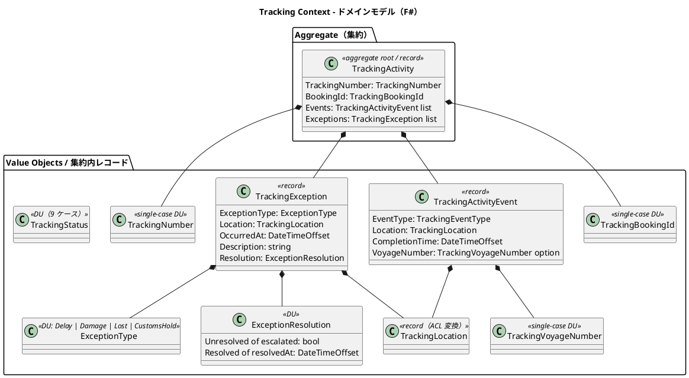

> 注記：C# 版で nullable の `resolvedAt: DateTime?` と `escalationFlag: bool` の組合せだった例外の解決状態は、F# 版では `ExceptionResolution` DU で表現し、「解決済みなのに resolvedAt が null」という不正状態を排除する。

### 実装表現（F#）

```fsharp
namespace CargoTracker.Tracking.Domain

open CargoTracker.Shared.Domain

type ExceptionType = Delay | Damage | Lost | CustomsHold

/// 「未解決（エスカレーション有無）」と「解決済み（解決時刻必須）」を DU で表現
type ExceptionResolution =
    | Unresolved of escalated: bool
    | Resolved of resolvedAt: System.DateTimeOffset

type TrackingException =
    { ExceptionType: ExceptionType
      Location: TrackingLocation
      OccurredAt: System.DateTimeOffset
      Description: string
      Resolution: ExceptionResolution }

module TrackingException =
    /// Lost の場合は必ずエスカレーションする（ビジネスルール 3 を関数で保証）
    let register exceptionType location occurredAt description : TrackingException =
        let escalated = (exceptionType = Lost)
        { ExceptionType = exceptionType; Location = location
          OccurredAt = occurredAt; Description = description
          Resolution = Unresolved escalated }

type TrackingStatus =
    | NotReceived | Received | Loaded | OnboardCarrier
    | Unloaded | AwaitingClaim | Claimed | InException | Unknown

type TrackingActivity =
    { TrackingNumber: TrackingNumber
      BookingId: TrackingBookingId
      Events: TrackingActivityEvent list      // 時系列（新しい順）
      Exceptions: TrackingException list }

type TrackingCommand =
    | AddEvent of TrackingActivityEvent
    | RegisterException of ExceptionType * TrackingLocation * System.DateTimeOffset * string
    | ResolveException of index: int * resolvedAt: System.DateTimeOffset

module TrackingActivity =

    /// 現在の追跡状態：アクティブな例外があれば InException、
    /// なければ最新イベントから導出（純粋関数）
    let currentStatus (activity: TrackingActivity) : TrackingStatus =
        let hasActiveException =
            activity.Exceptions
            |> List.exists (fun ex -> match ex.Resolution with Unresolved _ -> true | Resolved _ -> false)
        if hasActiveException then InException
        else
            match activity.Events with
            | [] -> NotReceived
            | latest :: _ -> TrackingEventType.toStatus latest.EventType

    let execute (activity: TrackingActivity) (command: TrackingCommand)
        : Result<TrackingActivity * DomainEvent list, DomainError> =
        match command with
        | AddEvent event ->
            Ok ({ activity with Events = event :: activity.Events }, [])

        | RegisterException (exType, location, occurredAt, description) ->
            let ex = TrackingException.register exType location occurredAt description
            let events =
                [ TrackingExceptionDetected (activity.BookingId, exType)
                  if exType = Lost then ExceptionEscalated (activity.TrackingNumber, exType) ]
            Ok ({ activity with Exceptions = ex :: activity.Exceptions }, events)

        | ResolveException (index, resolvedAt) ->
            match List.tryItem index activity.Exceptions with
            | None -> Error (NotFound ("TrackingException", string index))
            | Some { Resolution = Resolved _ } ->
                Error (BusinessRuleViolation ("AlreadyResolved", "この例外はすでに解決済みです。"))
            | Some ex ->
                let resolved = { ex with Resolution = Resolved resolvedAt }
                let exceptions = activity.Exceptions |> List.mapi (fun i e -> if i = index then resolved else e)
                Ok ({ activity with Exceptions = exceptions },
                    [ TrackingExceptionResolved (activity.TrackingNumber, ex.ExceptionType) ])
```

### 集約・エンティティ・値オブジェクト一覧

| 種別 | 型名 | 日本語名 | F# 表現 | 責務 |
|---|---|---|---|---|
| 集約ルート | TrackingActivity | 追跡レコード | レコード | 貨物の追跡情報全体を管理 |
| 集約内レコード | TrackingActivityEvent | 追跡イベント | レコード | 時系列で記録される追跡の出来事 |
| 集約内レコード | TrackingException | 追跡例外イベント | レコード + ExceptionResolution DU | 遅延・損傷・紛失・税関保留の例外記録 |
| 値オブジェクト | ExceptionResolution | 例外解決状態 | DU（Unresolved / Resolved of 時刻） | 解決済みなのに時刻がない状態を排除 |
| 値オブジェクト | TrackingNumber | 追跡番号 | 単一ケース DU | 追跡活動を一意に識別 |
| 値オブジェクト | TrackingBookingId | 予約参照 ID | 単一ケース DU | Booking Context との関連を保持 |
| 値オブジェクト | TrackingLocation | 追跡位置情報 | レコード | コンテキスト固有の位置情報型（ACL 変換） |
| 値オブジェクト | TrackingVoyageNumber | 追跡航海番号 | 単一ケース DU | Tracking Context 固有の航海番号型 |
| 状態 | TrackingStatus | 追跡状態 | DU（9 ケース） | イベント履歴から導出される追跡フェーズ |
| 値オブジェクト | ExceptionType | 例外種別 | DU | Delay / Damage / Lost / CustomsHold |

### ビジネスルール

1. 追跡活動は必ず一意の TrackingNumber を持つ
2. TrackingActivityEvent は時系列順で管理される。イベントごとに位置と時刻が必須（レコードの必須フィールドで型保証）
3. ExceptionType が Lost の場合、`TrackingException.register` が必ず `Unresolved escalated: true` で生成し、`ExceptionEscalated` イベントを発行する
4. CustomsHold 例外は税関システム（CustomsClearancePort）からの通知によって自動登録される
5. `ResolveException` の実行により例外は `Resolved` に遷移し、TrackingStatus は例外発生前の状態（最新イベントから導出）に復帰する。TrackingStatus は保持フィールドではなく `currentStatus` 関数による**導出値**であるため、復帰処理は自動的に成立する
6. 未解決例外のエスカレーション時限判定（発生からの経過時間チェック）に使う現在時刻は、`DateTimeOffset.Now` を直接呼ばず Clock ポート（`unit -> DateTimeOffset`）から取得した値を引数で受け取る

### コマンド一覧

| コマンド | 実行アクター | 主な処理 |
|---|---|---|
| `TrackingActivity.create` | 経路設計者（`IssueTrackingNumber` コマンド） | TrackingActivity を新規作成し TrackingNumber を発行。NotificationPort 経由で荷主へメール通知（US14） |
| `AddEvent` | 追跡管理者 | TrackingActivityEvent を時系列で追加 |
| `RegisterException` | 追跡管理者・税関システム | TrackingException を登録 |
| `ResolveException` | 追跡管理者 | 例外を Resolved に遷移し状態を復帰 |

## 5. Handling Context（荷役コンテキスト）

モジュール：`CargoTracker.Handling.Domain`

対応 US：US15, US16

### ドメインモデル図

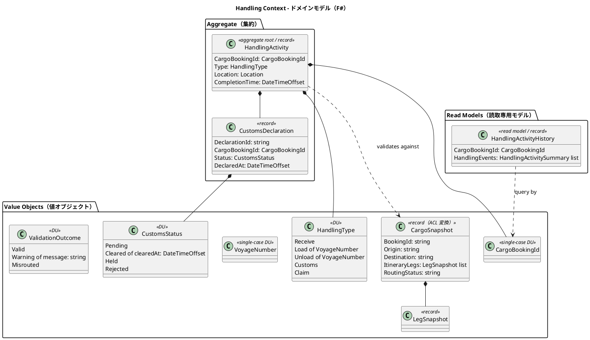

> 注記：C# 版では `HandlingType` は文字列 + `RequiresVoyageNumber()` 判定メソッドだったが、F# 版では `Load of VoyageNumber` / `Unload of VoyageNumber` として **VoyageNumber が必須の荷役種別にのみ航海番号を型で埋め込む**。「LOAD なのに VoyageNumber がない」状態は表現不能になる。

### 実装表現（F#）

```fsharp
namespace CargoTracker.Handling.Domain

open CargoTracker.Shared.Domain

/// VoyageNumber 必須判定（RequiresVoyageNumber）をデータ構造そのものに埋め込む
type HandlingType =
    | Receive
    | Load of VoyageNumber
    | Unload of VoyageNumber
    | Customs
    | Claim

/// Cleared には解除時刻が必ず付随する
type CustomsStatus =
    | Pending
    | Cleared of clearedAt: System.DateTimeOffset
    | Held
    | Rejected

/// 荷役妥当性検証の結果
type ValidationOutcome =
    | Valid
    | Warning of message: string
    | Misrouted

module HandlingActivity =

    /// 荷役妥当性検証（デシジョンテーブルの純粋関数化）
    let validateFor (snapshot: CargoSnapshot) (handlingType: HandlingType) (location: Location)
        : ValidationOutcome =
        match handlingType with
        | Receive ->
            if Location.unLocode location = snapshot.Origin then Valid
            else Warning "受領場所が出発港と一致しません。"
        | Load voyage ->
            let matches =
                snapshot.ItineraryLegs
                |> List.exists (fun leg ->
                    leg.LoadLocation = Location.unLocode location
                    && leg.VoyageNumber = VoyageNumber.value voyage)
            if matches then Valid else Misrouted
        | Unload voyage ->
            let matches =
                snapshot.ItineraryLegs
                |> List.exists (fun leg ->
                    leg.UnloadLocation = Location.unLocode location
                    && leg.VoyageNumber = VoyageNumber.value voyage)
            if matches then Valid else Misrouted
        | Customs ->
            if snapshot.RequiresCustoms then Valid
            else Warning "通関申告が不要な貨物に対する通関作業です。"
        | Claim ->
            if Location.unLocode location = snapshot.Destination then Valid
            else Warning "引取場所が目的港と一致しません。"

    /// 登録：LOAD / CLAIM は通関 Cleared が前提（ビジネスルール 2・3）
    let register (snapshot: CargoSnapshot) (customs: CustomsStatus option)
                 (handlingType: HandlingType) (location: Location)
                 (completionTime: System.DateTimeOffset)
        : Result<HandlingActivity * DomainEvent list, DomainError> =
        match handlingType, customs with
        | Load _, Some (Cleared _) | Load _, None when not snapshot.RequiresCustoms ->
            registerValidated snapshot handlingType location completionTime
        | Load _, _ when snapshot.RequiresCustoms ->
            Error (BusinessRuleViolation ("CustomsNotCleared", "通関が Cleared になるまで積込（Load）はできません。"))
        | Claim, Some (Cleared _) | Claim, None when snapshot.RequiresCustoms = false ->
            registerValidated snapshot handlingType location completionTime
        | Claim, _ ->
            Error (BusinessRuleViolation ("CustomsNotCleared", "通関が Cleared になるまで引取はできません。"))
        | _ ->
            registerValidated snapshot handlingType location completionTime
```

### 集約・エンティティ・値オブジェクト一覧

| 種別 | 型名 | 日本語名 | F# 表現 | 責務 |
|---|---|---|---|---|
| 集約ルート | HandlingActivity | 荷役作業 | レコード | 荷役作業の登録と妥当性検証 |
| 集約内レコード | CustomsDeclaration | 通関申告 | レコード + CustomsStatus DU | 通関申告の状態管理 |
| 値オブジェクト | CargoBookingId | 貨物予約識別子 | 単一ケース DU | Booking Context との関連識別子 |
| 値オブジェクト | HandlingType | 荷役種別 | DU（Load / Unload は VoyageNumber 付き） | Receive / Load / Unload / Customs / Claim |
| 値オブジェクト | CargoSnapshot | 貨物スナップショット | レコード | ACL 経由で取得した貨物情報。妥当性検証に使用 |
| 値オブジェクト | LegSnapshot | 旅程区間スナップショット | レコード | CargoSnapshot 内の区間情報 |
| 値オブジェクト | VoyageNumber | 航海番号 | 単一ケース DU | Handling Context 固有の航海番号型 |
| 状態 | CustomsStatus | 通関状態 | DU（Cleared は時刻付き） | Pending / Cleared / Held / Rejected |
| 値オブジェクト | ValidationOutcome | 検証結果 | DU | Valid / Warning / Misrouted |
| Read Model | HandlingActivityHistory | 荷役履歴 | レコード（クエリ専用） | 集約と切り離した荷役作業履歴 |

### ビジネスルール

荷役妥当性検証（`validateFor`）のデシジョンテーブル：

| 荷役タイプ | VoyageNumber | 場所チェック | MISROUTED 判定条件 |
|---|---|---|---|
| Receive（受領） | 不要（型で排除） | 出発港（RouteSpecification.Origin）と一致 | 不一致で Warning |
| Load（積込） | 必須（DU ケースに埋め込み） | Itinerary の積込港（Leg.LoadLocation）と一致 | 不一致で Misrouted |
| Unload（荷降し） | 必須（DU ケースに埋め込み） | Itinerary の荷降港（Leg.UnloadLocation）と一致 | 不一致で Misrouted |
| Claim（引取） | 不要（型で排除） | 目的港（RouteSpecification.Destination）と一致 | 不一致で Warning |

追加ルール：

1. Load / Unload 作業で Misrouted が確定した場合、`CargoMisrouted` イベントを発行し、Booking Context の RoutingStatus を Misrouted に更新する
2. 通関申告が必要な貨物は、CustomsStatus が `Cleared` になるまで Load（積込）を実施できない（`register` 関数で検証。通関完了前の積込を禁止する）
3. CustomsStatus が `Cleared` になるまで Claim（引取）は実施できない（`register` 関数で検証）
4. HandlingActivityHistory はクエリ専用の Read Model として管理され、集約とは切り離す

### コマンド一覧

| コマンド | 実行アクター | 主な処理 |
|---|---|---|
| `HandlingActivity.register` | 荷役作業員 | 荷役作業を登録し、CargoSnapshot で妥当性を検証 |
| `CustomsDeclaration.register` | 荷役作業員 | 通関申告を新規登録（Pending 状態で作成） |
| `CustomsDeclaration.updateStatus` | 税関システム（ACL） | 通関申告の状態を更新（Cleared / Held / Rejected） |

## 6. Billing Context（精算コンテキスト）

モジュール：`CargoTracker.Billing.Domain`

対応 US：US21〜US23

### ドメインモデル図

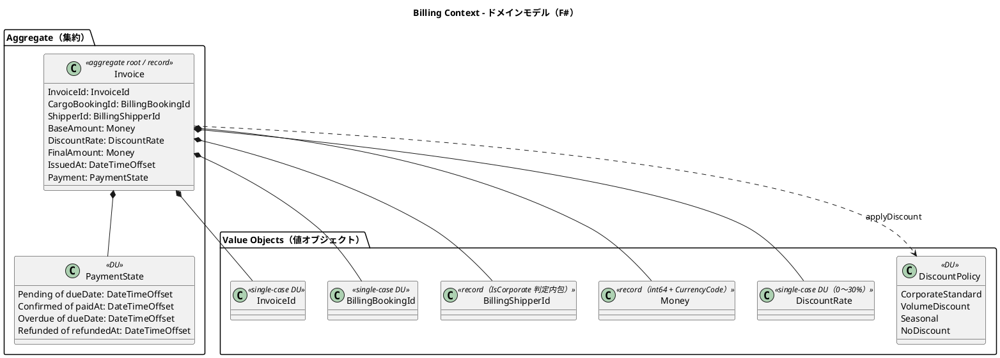

> 注記：C# 版の `PaymentStatus` 列挙型 + nullable `paidAt` は、F# 版では `PaymentState` DU の各ケースに時刻を埋め込み、「Confirmed なのに paidAt が null」を排除する。

### 実装表現（F#）

```fsharp
namespace CargoTracker.Billing.Domain

open CargoTracker.Shared.Domain

/// 支払い状態：各ケースに必要な時刻データを埋め込む
type PaymentState =
    | Pending of dueDate: System.DateTimeOffset
    | Confirmed of paidAt: System.DateTimeOffset
    | Overdue of dueDate: System.DateTimeOffset
    | Refunded of refundedAt: System.DateTimeOffset

type DiscountPolicy =
    | CorporateStandard
    | VolumeDiscount
    | Seasonal
    | NoDiscount

module DiscountPolicy =
    /// 割引率計算（純粋関数）
    let calculateRate (shipper: BillingShipperId) (amount: Money) (policy: DiscountPolicy)
        : Result<DiscountRate, DomainError> =
        match policy with
        | NoDiscount -> DiscountRate.create 0.0m
        | CorporateStandard when BillingShipperId.isCorporate shipper -> DiscountRate.create 0.10m
        | CorporateStandard -> DiscountRate.create 0.0m   // Individual は割引なし
        | VolumeDiscount when amount.Amount >= 1_000_000L -> DiscountRate.create 0.15m
        | VolumeDiscount -> DiscountRate.create 0.05m
        | Seasonal -> DiscountRate.create 0.08m

type InvoiceCommand =
    | ConfirmPayment of paidAt: System.DateTimeOffset
    | MarkOverdue of now: System.DateTimeOffset
    | IssueRefund of refundedAt: System.DateTimeOffset

module Invoice =
    open FsToolkit.ErrorHandling

    /// 発行：割引適用と最終金額計算を Railway Oriented に合成
    let generate invoiceId bookingId shipperId baseAmount policy issuedAt
        : Result<Invoice * DomainEvent list, DomainError> =
        result {
            let! discountRate = DiscountPolicy.calculateRate shipperId baseAmount policy
            let finalAmount = baseAmount |> Money.multiply (1.0m - DiscountRate.value discountRate)
            let dueDate = issuedAt.AddDays 30.0
            let invoice =
                { InvoiceId = invoiceId; CargoBookingId = bookingId; ShipperId = shipperId
                  BaseAmount = baseAmount; DiscountRate = discountRate
                  FinalAmount = finalAmount; IssuedAt = issuedAt
                  Payment = Pending dueDate }
            return invoice, [ InvoiceCreated (invoiceId, bookingId, finalAmount) ]
        }

    let execute (invoice: Invoice) (command: InvoiceCommand)
        : Result<Invoice * DomainEvent list, DomainError> =
        match invoice.Payment, command with
        | Pending _, ConfirmPayment paidAt
        | Overdue _, ConfirmPayment paidAt ->
            Ok ({ invoice with Payment = Confirmed paidAt },
                [ PaymentConfirmed (invoice.InvoiceId, paidAt) ])
        | Pending dueDate, MarkOverdue now when now > dueDate ->
            Ok ({ invoice with Payment = Overdue dueDate }, [ PaymentOverdue invoice.InvoiceId ])
        | Confirmed _, IssueRefund refundedAt ->
            Ok ({ invoice with Payment = Refunded refundedAt },
                [ PaymentRefunded (invoice.InvoiceId, refundedAt) ])
        | state, cmd ->
            Error (InvalidStateTransition (paymentStateName state, commandName cmd))
```

### 集約・エンティティ・値オブジェクト一覧

| 種別 | 型名 | 日本語名 | F# 表現 | 責務 |
|---|---|---|---|---|
| 集約ルート | Invoice | 精算書 | レコード | 貨物輸送 1 件に対する精算書の発行・管理 |
| 状態 | PaymentState | 支払い状態 | DU（各ケースに時刻付き） | Pending / Confirmed / Overdue / Refunded |
| 値オブジェクト | InvoiceId | 精算書 ID | 単一ケース DU | 精算書の一意識別子 |
| 値オブジェクト | BillingBookingId | 予約参照 ID | 単一ケース DU | Booking Context の Cargo との関連識別子 |
| 値オブジェクト | BillingShipperId | 荷主参照 ID | レコード | 法人判定（isCorporate）を内包 |
| 値オブジェクト | Money | 金額 | レコード（int64 + CurrencyCode） | 最小通貨単位の整数と通貨コード |
| 値オブジェクト | DiscountRate | 割引率 | 単一ケース DU（0〜30%） | 範囲バリデーション付き |
| 値オブジェクト | DiscountPolicy | 割引方針 | DU + `calculateRate` 純粋関数 | 法人・ボリューム・シーズン割引のロジック |

### ビジネスルール

1. Invoice は貨物配送完了（BookingState = Delivered）後にのみ発行できる（`InvoiceRequested` イベント駆動）
2. 法人荷主（Corporate）には最大 30% の割引が適用される
3. 支払期限（issuedAt + 30 日）を超過した場合、`MarkOverdue` コマンドで Overdue に遷移する。期限計算・超過判定に使う現在時刻は `DateTimeOffset.Now` を直接呼ばず、Clock ポート（`unit -> DateTimeOffset`）から取得した値を `Invoice.generate` / `MarkOverdue now` の引数として受け取る
4. 支払い確定（Confirmed）後のキャンセルは `IssueRefund` で対応し、Refunded に遷移する。遷移規則は `Invoice.execute` のパターンマッチで表現する

料金計算ロジック：

```text
基本料金 = 距離係数 × 重量（kg） × 貨物種別係数
  - General（一般貨物）: 係数 1.0
  - Hazardous（危険物）: 係数 1.8
  - Refrigerated（冷凍・冷蔵）: 係数 1.5

割引後料金 = 基本料金 × (1 - 割引率)
  - Corporate 荷主: 割引率 0〜30%
  - Individual 荷主: 割引なし（割引率 0%）
```

### コマンド一覧

| コマンド | 実行アクター | 主な処理 |
|---|---|---|
| `Invoice.generate` | 経理担当者 | 精算書を新規発行（Pending 状態で作成） |
| `ConfirmPayment` | 経理担当者 | 支払い確認を記録し Confirmed に遷移 |
| `MarkOverdue` | システム（バッチ） | 期限超過を検出し Overdue に遷移 |
| `IssueRefund` | 経理担当者 | 返金を記録し Refunded に遷移 |

## 7. Estimation Context（見積コンテキスト）

モジュール：`CargoTracker.Estimation.Domain`

対応 US：US01

### ドメインモデル図

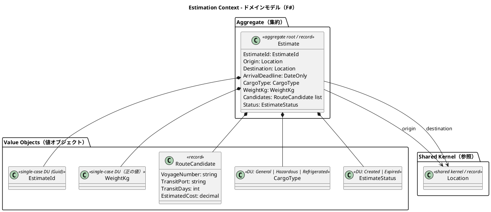

### 実装表現（F#）

```fsharp
namespace CargoTracker.Estimation.Domain

open CargoTracker.Shared.Domain

type EstimateId = private EstimateId of System.Guid

module EstimateId =
    /// Guid.NewGuid() を直接呼ばず、NewId ポート（unit -> Guid）を引数で受けて純粋性を保つ
    let generate (newId: unit -> System.Guid) = EstimateId (newId ())
    let value (EstimateId v) = v

/// 正の値かつ 30,000 kg（コンテナ最大積載相当）以下のみを許容する重量
type WeightKg = private WeightKg of decimal

module WeightKg =
    let maxWeightKg = 30_000m  // コンテナ最大積載相当の上限

    let create (value: decimal) : Result<WeightKg, DomainError> =
        if value <= 0m then
            Error (ValidationError ("WeightKg", "重量は正の値でなければなりません。"))
        elif value > maxWeightKg then
            Error (ValidationError ("WeightKg", "重量は 30,000 kg（コンテナ最大積載相当）以下でなければなりません。"))
        else Ok (WeightKg value)

type RouteCandidate =
    { VoyageNumber: string
      TransitPort: string
      TransitDays: int
      EstimatedCost: decimal }

module RouteCandidate =
    let create voyageNumber transitPort transitDays estimatedCost
        : Result<RouteCandidate, DomainError> =
        if System.String.IsNullOrWhiteSpace voyageNumber then
            Error (ValidationError ("VoyageNumber", "航海番号は空にできません。"))
        elif transitDays <= 0 then
            Error (ValidationError ("TransitDays", "輸送日数は正の値でなければなりません。"))
        elif estimatedCost <= 0m then
            Error (ValidationError ("EstimatedCost", "見積コストは正の値でなければなりません。"))
        else
            Ok { VoyageNumber = voyageNumber; TransitPort = transitPort
                 TransitDays = transitDays; EstimatedCost = estimatedCost }

type EstimateStatus = Created | Expired

type Estimate =
    { EstimateId: EstimateId
      Origin: Location
      Destination: Location
      ArrivalDeadline: System.DateOnly
      CargoType: CargoType
      WeightKg: WeightKg
      Candidates: RouteCandidate list
      Status: EstimateStatus }

module Estimate =
    open FsToolkit.ErrorHandling

    /// newId は NewId ポート（unit -> Guid）。アプリケーション層で部分適用により注入する
    let create (newId: unit -> System.Guid) origin destination arrivalDeadline cargoType weightKg
        : Result<Estimate * DomainEvent list, DomainError> =
        result {
            do! if Location.sameAs origin destination then
                    Error (BusinessRuleViolation ("SameOriginDestination", "同一地点への見積は作成できません。"))
                else Ok ()
            let estimateId = EstimateId.generate newId
            let estimate =
                { EstimateId = estimateId; Origin = origin; Destination = destination
                  ArrivalDeadline = arrivalDeadline; CargoType = cargoType
                  WeightKg = weightKg; Candidates = []; Status = Created }
            return estimate, [ EstimateCreated estimateId ]
        }

    /// ルート候補の一括入替（イミュータブル更新）
    let replaceCandidates (candidates: RouteCandidate list) (estimate: Estimate)
        : Result<Estimate * DomainEvent list, DomainError> =
        match estimate.Status with
        | Expired -> Error (InvalidStateTransition ("Expired", "ReplaceCandidates"))
        | Created -> Ok ({ estimate with Candidates = candidates }, [])
```

### 集約・エンティティ・値オブジェクト一覧

| 種別 | 型名 | 日本語名 | F# 表現 | 責務 |
|---|---|---|---|---|
| 集約ルート | Estimate | 見積 | レコード | 輸送見積の中心エンティティ。出発地・仕向地・貨物種別・重量・ルート候補を管理 |
| 値オブジェクト | EstimateId | 見積 ID | 単一ケース DU（Guid） | `generate newId` で生成（NewId ポート注入。`Guid.NewGuid()` を直接呼ばない） |
| 値オブジェクト | WeightKg | 重量 | 単一ケース DU（0 超〜30,000 kg） | 貨物重量。不正値・上限超過をスマートコンストラクタで排除 |
| 値オブジェクト | RouteCandidate | ルート候補 | レコード + スマートコンストラクタ | 航海番号・経由港・輸送日数・見積コスト |
| 状態 | EstimateStatus | 見積状態 | DU | Created（作成済）/ Expired（期限切れ） |
| 値オブジェクト | CargoType | 貨物種別 | DU | General / Hazardous / Refrigerated |
| 共有カーネル参照 | Location | 位置情報 | レコード | UN/LOCODE で識別される港湾・地点 |
| リポジトリ（ポート） | EstimateRepository | 見積リポジトリ | レコード of 関数 | `save` / `findByEstimateId` / `findAll` |

### ビジネスルール

1. 見積は必ず EstimateId・Origin・Destination・ArrivalDeadline・CargoType・WeightKg を持つ（レコードの必須フィールドで型保証）
2. Origin と Destination は異なる（`Estimate.create` で検証）
3. WeightKg は正の値かつ 30,000 kg（コンテナ最大積載相当）以下でなければならない。超過は `ValidationError` を返す（スマートコンストラクタで保証）
4. RouteCandidate の VoyageNumber は空でない文字列、TransitDays は正の値、EstimatedCost は正の値（スマートコンストラクタで保証）
5. 見積作成時のデフォルトステータスは `Created`
6. ルート候補はスタブ実装（固定値）で生成される。将来、外部ルーティングサービスとの連携時に置換予定
7. RouteCandidate の重複排除はレコードの構造的等価性（全フィールド一致）を基準とする（「値オブジェクトの等価性」参照。`List.distinct` で成立する）

### コマンド一覧

| コマンド | 実行アクター | 主な処理 |
|---|---|---|
| `Estimate.create` | 営業担当者 | 見積を新規作成し、スタブのルート候補を自動付与 |

### Booking Context との関係

Estimation Context は Booking Context と以下の関係を持つ。

- **共有**: CargoType の基本 3 分類（General / Hazardous / Refrigerated）は両コンテキストで共通。ただし Booking Context の CargoType は申告・温度条件データを DU ケースに持つ拡張型である
- **参照**: Location（Shared Domain）を経由して出発地・仕向地を共有する
- **将来の連携**: 見積から予約への引き継ぎ（見積情報を基に Cargo を作成するフロー）は将来イテレーションで実装予定

## 8. Shared Domain（共有ドメイン）

モジュール：`CargoTracker.Shared.Domain`

対応 US：—（全 US を横断的に支援する共有カーネル）

### ドメインモデル図

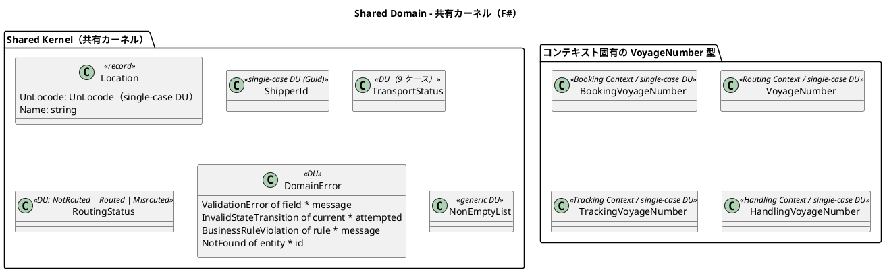

### 実装表現（F#）

```fsharp
namespace CargoTracker.Shared.Domain

/// 全コンテキスト共通のドメインエラー
type DomainError =
    | ValidationError of field: string * message: string
    | InvalidStateTransition of current: string * attempted: string
    | BusinessRuleViolation of rule: string * message: string
    | NotFound of entity: string * id: string

/// UN/LOCODE：正規表現 ^[A-Z]{2}[A-Z2-9]{3}$ で検証
type UnLocode = private UnLocode of string

module UnLocode =
    let create (value: string) : Result<UnLocode, DomainError> =
        if System.Text.RegularExpressions.Regex.IsMatch(value, "^[A-Z]{2}[A-Z2-9]{3}$") then
            Ok (UnLocode value)
        else
            Error (ValidationError ("UnLocode", $"UN/LOCODE の形式が不正です：{value}"))

type Location = { UnLocode: UnLocode; Name: string }

module Location =
    /// 構造的等価性により sameAs は = 演算子で成立するが、
    /// 業務的な同一性は UnLocode のみで判定する
    let sameAs (a: Location) (b: Location) = a.UnLocode = b.UnLocode

type ShipperId = ShipperId of System.Guid

type TransportStatus =
    | NotReceived | Received | Loaded | OnboardCarrier
    | Unloaded | AwaitingClaim | Claimed | InException | Unknown

type RoutingStatus = NotRouted | Routed | Misrouted

/// 「1 つ以上」を型で保証する非空リスト
type NonEmptyList<'T> = { Head: 'T; Tail: 'T list }

module NonEmptyList =
    let ofList = function
        | [] -> invalidArg "list" "NonEmptyList は空リストから生成できません。"
        | head :: tail -> { Head = head; Tail = tail }
    let toList nel = nel.Head :: nel.Tail
    let last nel = nel |> toList |> List.last
```

### 共有コンポーネント一覧

| 種別 | 型名 | 日本語名 | F# 表現 | 責務 |
|---|---|---|---|---|
| 共有カーネル | Location | 位置情報 | レコード + UnLocode 単一ケース DU | UN/LOCODE で識別される港湾・地点。全コンテキストで共有 |
| 共有カーネル | ShipperId | 荷主識別子 | 単一ケース DU（Guid） | Booking Context と Shipper Context で共有 |
| 共有 DU | TransportStatus | 輸送状態 | DU（9 ケース） | 輸送フェーズ。Booking・Tracking で共有 |
| 共有 DU | RoutingStatus | 経路状態 | DU | NotRouted / Routed / Misrouted。Booking・Handling で共有 |
| 共有 DU | DomainError | ドメインエラー | DU | 全コンテキスト共通のエラー表現（ROP の Error レール） |
| 共有型 | NonEmptyList | 非空リスト | ジェネリックレコード | 「1 つ以上」の不変条件を型で保証 |

### VoyageNumber のコンテキスト分離設計

VoyageNumber は各コンテキストが独自の単一ケース DU を保持する。これにより各コンテキストの自律性を保ちながら意味的な一貫性を維持し、かつ**コンテキストをまたいだ取り違えをコンパイルエラーにする**（単なる文字列であれば混同できてしまう）。

| コンテキスト | 型名 | 役割 |
|---|---|---|
| Routing Context | VoyageNumber | 航海スケジュールの識別子 |
| Tracking Context | TrackingVoyageNumber | 追跡イベントに紐づく航海番号（ACL 変換） |
| Handling Context | HandlingVoyageNumber | 荷役作業に紐づく航海番号（ACL 変換） |

### ビジネスルール

1. Location の変更は全コンテキストチームの合意のもとに行う（Shared Kernel の制約）
2. UN/LOCODE は国際規格（ISO 3166-1 alpha-2 + 3 文字のロケーションコード）に従う。`UnLocode.create` スマートコンストラクタで検証する
3. TransportStatus と RoutingStatus は Booking Context と Tracking / Handling Context の間で整合性を保つ

### TransportStatus と TrackingStatus の変換規則

Shared の `TransportStatus` と Tracking Context 固有の `TrackingStatus` は、いずれも同一の 9 ケース（NotReceived / Received / Loaded / OnboardCarrier / Unloaded / AwaitingClaim / Claimed / InException / Unknown）を持つが、意図的に別型として分離している。TrackingStatus はイベント履歴からの導出値（`currentStatus` 関数）として Tracking Context 内で独自に進化しうるためである。両者の変換は**ドメイン層では行わず、Tracking Context のアプリケーション層**（イベントハンドラ / ACL）が担う。`HandlingActivityRegistered` イベントの処理時に、アプリケーション層の変換関数（`TrackingStatus -> TransportStatus` の網羅的パターンマッチ）で Shared 型へ写像し、Booking Context の `Delivery.TransportStatus` へ同期する。これにより各ドメイン層は他コンテキストの型を参照せず、ケースの追加・変更はコンパイルエラーとして変換関数に伝播する。

## ドメインイベント

ドメインイベントは `DomainEvent` 判別共用体として定義する。各ケースは**プリミティブ / 共有型のみを持つ Payload レコード**で構成し、`CargoTracker.Shared.Domain` に配置することで BC → Event → 全 BC の循環参照を回避する（ADR-0002・architecture_backend.md 参照）。イベントは集約操作（純粋関数）の戻り値 `Result<'State * DomainEvent list, DomainError>` の一部として発行され、アプリケーション層のディスパッチャがハンドラへ配信する。イベント自体は不変データであり、副作用を持たない。

| イベント（DU ケース） | 発生元 | 処理先 | 内容 |
|---|---|---|---|
| `CargoBooked` | Booking Context | Tracking Context | 新規貨物予約の成立を通知（追跡番号の割り当ては経路設計者の手動コマンドで行う。US14 参照） |
| `CargoRouted` | Booking Context | Tracking Context | 旅程確定後、経路・旅程情報を追跡コンテキストに同期 |
| `HandlingActivityRegistered` | Handling Context | Tracking Context・Booking Context | 荷役作業完了後、TransportStatus と BookingState を同期 |
| `TrackingExceptionDetected` | Tracking Context | Booking Context・Notification | 例外（遅延・損傷・紛失・税関保留）検知後、通知を配信 |
| `InvoiceCreated` | Billing Context | Notification | 精算書発行後、荷主への通知を配信 |

### 実装表現（F#）

```fsharp
namespace CargoTracker.Shared.Domain

/// イベント Payload はプリミティブ / 共有型のみを持つレコードとして定義する。
/// 各 BC の具体型（Cargo・CargoItinerary・Invoice 等）を直接参照しないため、
/// Shared → BC の依存が発生しない（ADR-0002 参照）
type CargoBookedPayload =
    { BookingId: System.Guid
      ShipperId: System.Guid }

type CargoRoutedPayload =
    { BookingId: System.Guid
      LegVoyageNumbers: string list }

type HandlingActivityPayload =
    { BookingId: System.Guid
      HandlingType: string
      UnLocode: string
      CompletionTime: System.DateTimeOffset }

type TrackingExceptionPayload =
    { TrackingNumber: string
      ExceptionType: string
      Escalated: bool }

type InvoicePayload =
    { InvoiceId: System.Guid
      BookingId: System.Guid
      AmountMinorUnit: int64
      CurrencyCode: string }

/// コンテキスト横断のドメインイベント。すべてのケースが Payload レコードを持つ
type DomainEvent =
    // Booking Context
    | CargoBooked of CargoBookedPayload
    | CargoRouted of CargoRoutedPayload
    | BookingConfirmed of bookingId: System.Guid
    | TrackingNumberAssigned of bookingId: System.Guid * trackingNumber: string
    | CargoDelivered of bookingId: System.Guid
    | InvoiceRequested of bookingId: System.Guid * shipperId: System.Guid
    | BookingSettled of bookingId: System.Guid
    | BookingCancelled of bookingId: System.Guid * reason: string
    // Handling Context
    | HandlingActivityRegistered of HandlingActivityPayload
    | CargoMisrouted of bookingId: System.Guid
    // Tracking Context
    | TrackingExceptionDetected of TrackingExceptionPayload
    | ExceptionEscalated of trackingNumber: string * exceptionType: string
    | TrackingExceptionResolved of trackingNumber: string * exceptionType: string
    // Billing Context
    | InvoiceCreated of InvoicePayload
    | PaymentConfirmed of invoiceId: System.Guid * paidAt: System.DateTimeOffset
    | PaymentOverdue of invoiceId: System.Guid
    | PaymentRefunded of invoiceId: System.Guid * refundedAt: System.DateTimeOffset
    // Shipper / Estimation Context
    | ShipperRegistered of shipperId: System.Guid * shipperCode: string
    | EstimateCreated of estimateId: System.Guid

// ハンドラ側（Tracking Context）：イベントディスパッチはアプリケーション層の
// パターンマッチで行い、C# 版の MediatR に相当する配線を型安全に置き換える
module TrackingEventHandlers =
    let handle (dependencies: TrackingDependencies) (event: DomainEvent) : Async<unit> =
        match event with
        | HandlingActivityRegistered payload ->
            // TransportStatus を同期する（追跡番号の発行は経路設計者の手動コマンド。US14 参照）
            updateTransportStatus dependencies payload
        | _ -> async.Return ()
```

> **集約操作との整合**: 集約操作は `Result<'State * DomainEvent list, DomainError>` を返す。集約内では BookingId・TrackingNumber などのドメイン型を使い、イベント発行時に `BookingId.value` 等でプリミティブへ変換して Payload を構築する。これにより集約はドメイン型の安全性を保ちつつ、イベントは BC 間で共有可能な形に保たれる。本文中の集約コード例で `CargoBooked (bookingId, shipperId)` のように略記している箇所は、この Payload 構築を省略した表記である。

### ドメインイベントフロー

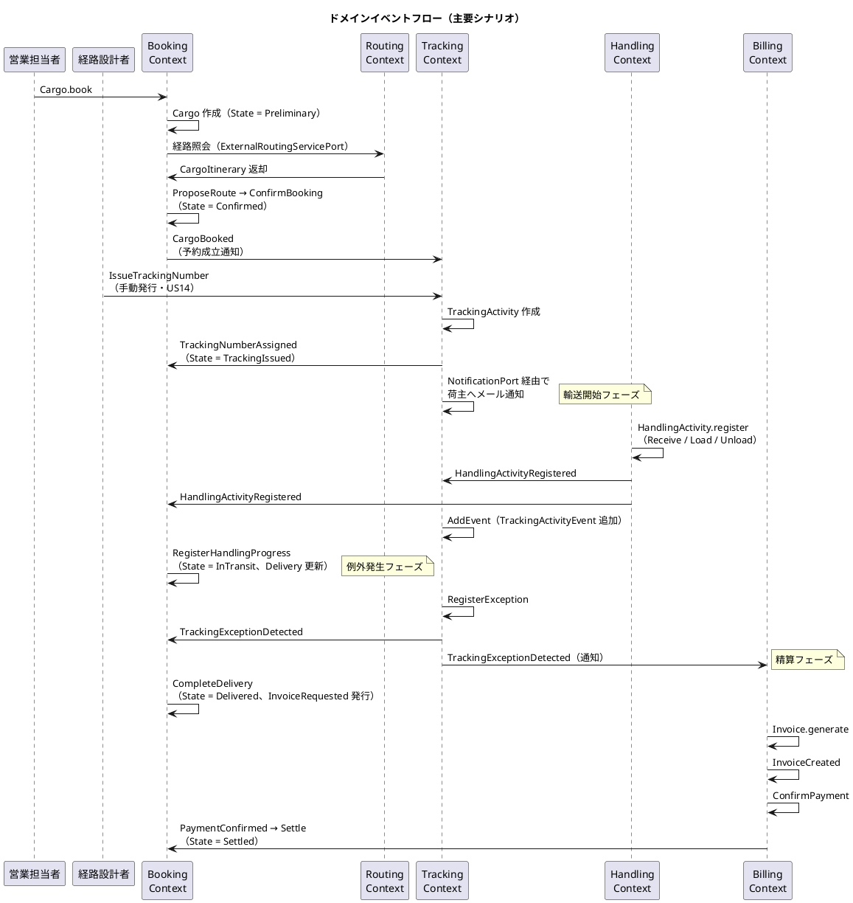

## 外部システム ACL Ports

| ポート名 | 対応外部システム | 責務 |
|---|---|---|
| ExternalRoutingServicePort | 外部経路最適化システム | 出発地・目的地・期限を渡し最適 CargoItinerary を取得 |
| CustomsClearancePort | 税関システム | 通関申告の提出・状態照会・CustomsHold 例外の自動通知受信 |
| PaymentGatewayPort | 決済機関 | 支払い処理の実行と支払い確認の受信 |
| PortManagementPort | 港湾管理システム | 港湾の取扱可能貨物種別（Hazardous / Refrigerated）の照会 |
| NotificationPort | 通知システム | 荷主・荷受人へのメール / SMS 通知の送信 |
| Clock | システム時計 | 現在時刻（`DateTimeOffset`）の取得。ドメイン関数は時刻を引数で受ける |
| NewId | GUID 生成器 | 新規識別子（`Guid`）の生成。ドメイン関数は生成済み ID または生成関数を引数で受ける |

Clock / NewId は外部システムそのものではないが、**非決定的な副作用**（現在時刻・乱数）を隔離する注入ポートとして同列に扱う。Invoice の支払期限計算（issuedAt + 30 日）、EstimateId の生成、Tracking の例外エスカレーション時限判定は、`DateTimeOffset.Now` や `Guid.NewGuid()` を直接呼ばず、これらのポート経由で受け取った値を引数として使用する。これによりドメイン関数は純粋関数のままとなり、テスト時は固定時刻・固定 GUID を渡すだけで再現可能になる。

各ポートはヘキサゴナルアーキテクチャの出力ポート（Secondary Port）として、C# の `interface` ではなく**関数型またはレコード of 関数**で定義する。インフラ層のアダプターが実装関数を提供し、アプリケーション層で部分適用によって注入する。これにより DI コンテナへの依存を最小化し、テスト時はモックフレームワーク不要で純粋な関数を差し替えられる。

```fsharp
namespace CargoTracker.Shared.Ports

/// 単機能ポートは関数型で十分
type ExternalRoutingServicePort =
    RouteSpecification -> Async<Result<CargoItinerary list, DomainError>>

/// 複数操作を持つポートはレコード of 関数
type CustomsClearancePort =
    { SubmitDeclaration: CargoBookingId -> Async<Result<CustomsDeclaration, DomainError>>
      QueryStatus: string -> Async<Result<CustomsStatus, DomainError>> }

type NotificationPort =
    { SendEmail: Email -> subject: string -> body: string -> Async<Result<unit, DomainError>>
      SendSms: Phone -> message: string -> Async<Result<unit, DomainError>> }

/// 非決定的な副作用の注入ポート：ドメイン関数の純粋性を保つ
type Clock = unit -> System.DateTimeOffset
type NewId = unit -> System.Guid
```

## 集約設計の判断

### Booking Context：Cargo 集約

Cargo を集約ルートとし、BookingId・ShipperId・RouteSpecification・BookingState（旅程・追跡番号・配送状況を状態ケースに内包）を集約内に含める設計とした。

**根拠**：予約の状態遷移はこれらのオブジェクトが一体として整合性を保つ必要がある。特に CargoItinerary の Leg 連結制約（`Leg[n].UnloadLocation = Leg[n+1].LoadLocation`）は `CargoItinerary.create` スマートコンストラクタで生成時に検証し、以降は不変条件が常に成立する。Consignee は Cargo に対して 1 対 1 であるため、独立した集約とせず値オブジェクトとして含める。

**F# 化の判断**：C# 版では BookingStatus・CargoItinerary・TrackingNumber・Delivery が独立フィールドで、状態と付随データの整合性は実行時検証に依存していた。F# 版では `BookingState` DU の各ケースが「その状態で存在すべきデータ」のみを保持するため、「TrackingIssued なのに追跡番号がない」等の不正状態がコンパイル時に排除される。CargoType も同様に、Hazardous / Refrigerated ケースへ申告・温度条件データを埋め込むことで必須制約を型に昇格した。

### Routing Context：Voyage 集約

Voyage を集約ルートとし、Schedule（CarrierMovement の非空リスト）を内包する設計とした。

**根拠**：Schedule と CarrierMovement は Voyage の文脈でのみ意味を持つ。Schedule の時系列整合性（CarrierMovement の順序・連続性）は `Schedule.create` スマートコンストラクタで生成時に一括検証するため、Voyage 単位のトランザクション整合性が構造的に保証される。

**F# 化の判断**：C# 版でエンティティだった CarrierMovement は、独自の同一性を必要としないためイミュータブルなレコード（値オブジェクト）に格下げした。「1 つ以上の区間」は `NonEmptyList` で型保証する。

### Tracking Context：TrackingActivity 集約

TrackingActivity を集約ルートとし、TrackingActivityEvent と TrackingException をイミュータブルなリストとして管理する設計とした。

**根拠**：追跡状態（TrackingStatus）は時系列の全イベントと例外状態を総合的に判定するため、単一集約としてまとめる必要がある。

**F# 化の判断**：TrackingStatus を保持フィールドではなく `currentStatus` **導出関数**とした。これにより「例外解決時に例外発生前の状態に復帰」というロジックは、例外を `Resolved` に更新するだけで自動的に成立し、状態の二重管理と復帰処理のバグを構造的に排除できる。例外の解決状態は `ExceptionResolution` DU（`Unresolved of escalated` / `Resolved of resolvedAt`）で表現し、nullable な `resolvedAt` を排除した。

### Handling Context：HandlingActivity 集約 + Read Model 分離

HandlingActivity を集約ルートとし、CustomsDeclaration を集約内レコードとした。荷役履歴は Read Model（HandlingActivityHistory）として集約と切り離す設計とした。

**根拠**：個々の荷役作業は独立した記録単位であり、互いに強い整合性制約を持たない。一方、通関申告と荷役作業は「Cleared にならないと Claim 不可」という不変条件があるため、同一集約に含める。クエリ専用の履歴参照は Read Model として分離することで、コマンド側（集約）の複雑性を低減する。

**F# 化の判断**：`HandlingType` を `Load of VoyageNumber` / `Unload of VoyageNumber` のデータ付き DU とすることで、C# 版の `RequiresVoyageNumber()` 実行時判定を型制約に置き換えた。妥当性検証のデシジョンテーブルは `validateFor` 純粋関数 + `ValidationOutcome` DU（Valid / Warning / Misrouted）として表現し、テーブル駆動テストが容易になる。

### Billing Context：Invoice 集約

Invoice を集約ルートとし、DiscountPolicy はドメインサービスではなく DU + 純粋関数 `calculateRate` として Invoice の発行フローに合成する設計とした。

**根拠**：精算書 1 件の整合性（基本料金・割引率・最終金額の一貫性）は `Invoice.generate` の `result` CE 内で Railway Oriented に合成され、途中で検証に失敗すれば Invoice は生成されない。支払い状態の遷移も `Invoice.execute` のパターンマッチが責任を持つ。

**F# 化の判断**：`PaymentState` DU の各ケース（Pending of 期限 / Confirmed of 支払時刻 / Refunded of 返金時刻）に時刻データを埋め込み、nullable な `paidAt` を排除した。

### Estimation Context：Estimate 集約

Estimate を集約ルートとし、RouteCandidate（ルート候補）のリストを集約内に保持する設計とした。

**根拠**：見積とルート候補は 1 対多の関係にあり、ルート候補は見積の文脈でのみ意味を持つ。`replaceCandidates` でルート候補の一括入替を行うため、トランザクション整合性の観点から単一集約に含める。現在のルート候補生成はスタブ実装（重量ベースの固定コスト計算）であり、将来の外部ルーティングサービス連携時に `ExternalRoutingServicePort` 関数を差し替える設計とした。

**F# 化の判断**：WeightKg・RouteCandidate の「正の値」制約をスマートコンストラクタに集約し、集約本体の検証コードを排除した。イミュータブル更新（`{ estimate with Candidates = ... }`）により `ReplaceCandidates` は新しい Estimate 値を返す純粋関数となる。

## F# 化の設計判断まとめ

| # | 判断 | 内容 |
|---|---|---|
| 1 | 状態 DU + データ埋め込み | BookingState・PaymentState・CustomsStatus・ExceptionResolution は状態ごとに必要なデータを DU ケースに保持し、nullable フィールドと実行時整合性検証を排除する |
| 2 | 集約操作の標準シグネチャ | `execute : State -> Command -> Result<State * DomainEvent list, DomainError>`。純粋関数のため単体テストは入出力の検証のみで完結する |
| 3 | スマートコンストラクタ | 値オブジェクトは private コンストラクタ + `create : ... -> Result<T, DomainError>`。生成に成功した値は以降常に妥当（Parse, don't validate） |
| 4 | Railway Oriented Programming | FsToolkit.ErrorHandling の `result` / `validation` CE で検証・遷移を合成。複数フィールドのエラー集約には `Validation` を使用する |
| 5 | 継承の排除 | CorporateShipper（クラス継承）は `ShipperKind` DU に置換。HandlingType の判定メソッドはデータ付き DU ケースに置換 |
| 6 | 導出値の関数化 | TrackingStatus は保持せず `currentStatus` で都度導出。状態の二重管理を排除する |
| 7 | ポートの関数化 | ACL・リポジトリは interface ではなく関数型 / レコード of 関数。部分適用で注入し、DI コンテナへの依存を最小化する |
| 8 | イベントの純粋発行 | DomainEvent は集約操作の戻り値。MediatR の代わりにアプリケーション層のパターンマッチでディスパッチする |
