# ドメインモデル設計 - 国際貨物輸送管理システム（C# 版）

## 概要

本ドキュメントは、国際貨物輸送管理システムの DDD（ドメイン駆動設計）戦術的設計を定義します。システムは以下の 8 つの境界付けられたコンテキスト（Bounded Context）で構成されます。

実装は C# / .NET を前提とし、値オブジェクトは C# の `record`、ドメインイベントは MediatR の `INotification`、名前空間は `CargoTracker.Domain.*` で表現します。

| コンテキスト | 日本語名 | 名前空間 | 主な責務 |
|---|---|---|---|
| Booking Context | 予約コンテキスト | `CargoTracker.Domain.Booking` | 貨物予約の受付・旅程管理・状態遷移 |
| Shipper Context | 荷主コンテキスト | `CargoTracker.Domain.Shipper` | 荷主の登録・管理・法人割引 |
| Routing Context | 経路コンテキスト | `CargoTracker.Domain.Routing` | 航海スケジュール・経路情報の管理 |
| Tracking Context | 追跡コンテキスト | `CargoTracker.Domain.Tracking` | 貨物追跡・例外イベント管理 |
| Handling Context | 荷役コンテキスト | `CargoTracker.Domain.Handling` | 荷役作業登録・通関申告管理 |
| Billing Context | 精算コンテキスト | `CargoTracker.Domain.Billing` | 請求書発行・割引・支払い管理 |
| Estimation Context | 見積コンテキスト | `CargoTracker.Domain.Estimation` | 輸送見積の作成・ルート候補の管理 |
| Shared Domain | 共有ドメイン | `CargoTracker.Domain.Shared` | 共有カーネル（Location・ShipperId・TransportStatus） |

各コンテキストは自律的に変更可能な集約を持ち、コンテキスト間の連携はドメインイベント（MediatR `INotification`）および ACL（Anti-Corruption Layer）ポートを通じて行います。

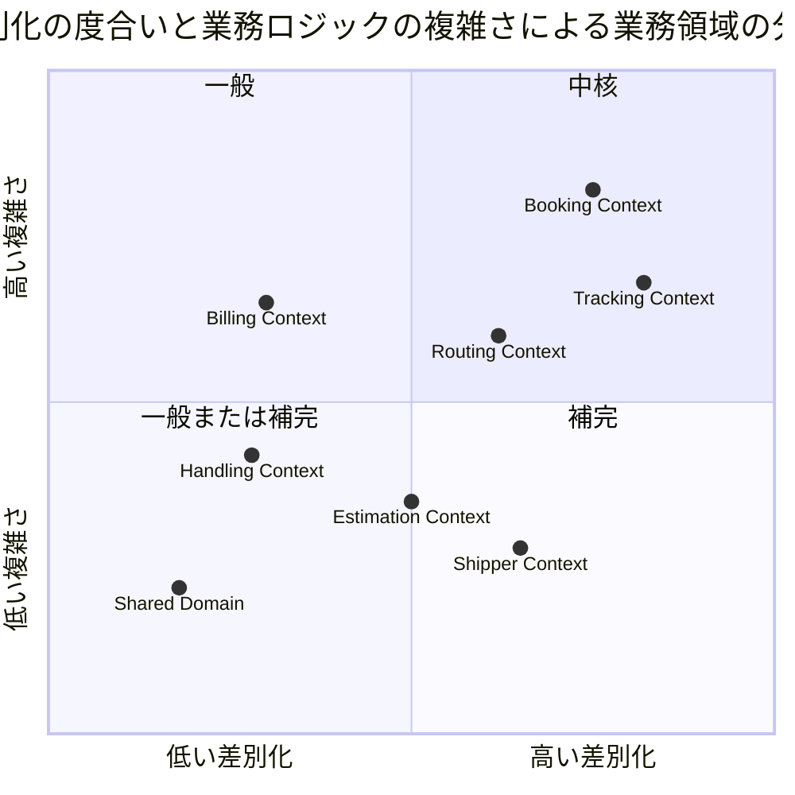

## ユビキタス言語

| 英語（コード名） | 日本語（業務用語） | 使用コンテキスト | 説明 |
|---|---|---|---|
| Cargo | 貨物 | Booking Context | 予約の中心的エンティティ。荷主から荷受人へ輸送される物品 |
| Shipper | 荷主 | Shipper Context | 貨物を発送する主体。個人・法人の 2 種別 |
| CorporateShipper | 法人荷主 | Shipper Context | Shipper のサブタイプ。契約番号と割引率を持つ |
| Address | 住所 | Shipper Context | 荷主の住所情報（最大 500 文字） |
| Dimensions | 寸法 | Booking Context | 貨物の長さ・幅・高さ（オプション） |
| Quantity | 個数 | Booking Context | 貨物の個数（オプション、1 以上） |
| Description | 品名 | Booking Context | 貨物の品名（オプション、最大 500 文字） |
| HazardousDeclaration | 危険物申告 | Booking Context | 危険物クラス・UN 番号・正式輸送品名 |
| TemperatureRequirement | 温度管理条件 | Booking Context | 最低温度・最高温度・温度単位 |
| ShipperExistenceChecker | 荷主存在確認 ACL | Booking Context | 荷主コンテキストへの存在確認ポート |
| Consignee | 荷受人 | Booking Context | 貨物を受け取る主体。氏名・住所・連絡先を保持 |
| BookingId | 予約 ID | Booking Context | 予約を一意に識別する値オブジェクト |
| RouteSpecification | ルート仕様 | Booking Context | 出発地・目的地・到着期限の要件定義 |
| CargoItinerary | 旅程 | Booking Context | 貨物の輸送経路全体。1 つ以上の Leg で構成 |
| Leg | 輸送区間 | Booking Context | 単一航海での積込港から荷降港までの区間 |
| Delivery | 配送状況 | Booking Context | 現在の輸送状態・経路状態・最終荷役イベントの集合 |
| Voyage | 航海 | Routing Context | 特定の船舶が実施する一連の運送区間 |
| Schedule | 航海スケジュール | Routing Context | 航海を構成する時系列の運送区間一覧 |
| CarrierMovement | 運送区間 | Routing Context | 出発港・到着港・出発時刻・到着時刻を持つ区間単位 |
| TrackingActivity | 追跡レコード | Tracking Context | 貨物の追跡情報全体を管理する集約 |
| TrackingNumber | 追跡番号 | Tracking Context | 追跡活動を一意に識別する番号 |
| TrackingActivityEvent | 追跡イベント | Tracking Context | 時系列で記録される追跡の出来事 |
| TrackingExceptionEvent | 追跡例外イベント | Tracking Context | 遅延・損傷・紛失・税関保留などの例外事象 |
| HandlingActivity | 荷役作業 | Handling Context | 実際に行われた荷役作業の記録 |
| HandlingActivityHistory | 荷役履歴 | Handling Context | クエリ専用の荷役作業履歴（Read Model） |
| Invoice | 精算書 | Billing Context | 貨物輸送 1 件に対して発行される請求書 |
| DiscountPolicy | 割引方針 | Billing Context | 法人・ボリューム・シーズン割引のポリシー |
| Location | 位置情報 | Shared Domain | UN/LOCODE で識別される港湾・地点の共有カーネル |
| TransportStatus | 輸送状態 | Shared Domain | 貨物の現在の輸送フェーズを表す共有列挙型 |
| RoutingStatus | 経路状態 | Shared Domain | 経路の妥当性状態（NotRouted / Routed / Misrouted） |
| BookingStatus | 予約状態 | Booking Context | 予約ライフサイクルの状態（8 値） |
| CargoType | 貨物種別 | Booking Context | General / Hazardous / Refrigerated |
| ExceptionType | 例外種別 | Tracking Context | Delay / Damage / Lost / CustomsHold |
| CustomsStatus | 通関状態 | Handling Context | Pending / Cleared / Held / Rejected |
| PaymentStatus | 支払い状態 | Billing Context | Pending / Confirmed / Overdue / Refunded |
| Estimate | 見積 | Estimation Context | 輸送見積の中心エンティティ。出発地・仕向地・期限・貨物種別・重量を保持 |
| EstimateId | 見積 ID | Estimation Context | UUID（`Guid`）ベースの見積一意識別子 |
| RouteCandidate | ルート候補 | Estimation Context | 見積に紐づく輸送ルート候補。航海番号・経由港・輸送日数・見積コストを保持 |
| CargoType | 貨物種別 | Estimation Context | General / Hazardous / Refrigerated（Booking Context と共通） |
| EstimateStatus | 見積状態 | Estimation Context | Created（作成済）/ Expired（期限切れ） |

## アクターとコンテキストの対応

| アクター | 対話するコンテキスト | 主要コマンド / 操作 |
|---|---|---|
| 営業担当者 | Booking Context・Estimation Context | `BookCargoCommand`・`RouteCargoCommand`・`CreateEstimateCommand` |
| 経路設計者 | Routing Context + Booking Context | `RouteCargoCommand`・`AssignTrackingNumberCommand` |
| 荷役作業員 | Handling Context | `HandlingActivityRegistrationCommand` |
| 追跡管理者 | Tracking Context | `AddTrackingEventCommand`・例外登録 |
| 荷主 | Booking Context（読取）+ Tracking Context（読取） | 追跡照会・状態確認 |
| 荷受人 | Tracking Context（読取）+ Booking Context（読取） | 到着確認・引取手続き |
| 経理担当者 | Billing Context | `GenerateInvoiceCommand`・`ConfirmPaymentCommand` |

## 境界付けられたコンテキスト概要

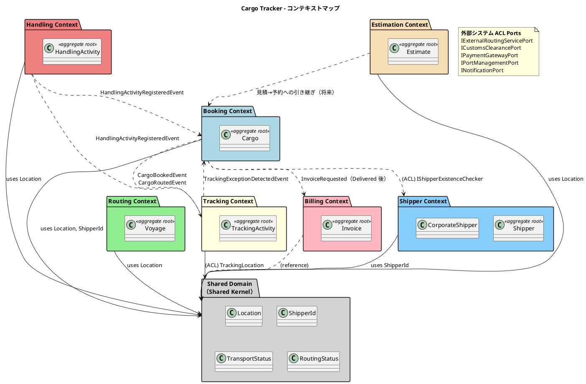

## 1. Booking Context（予約コンテキスト）

名前空間：`CargoTracker.Domain.Booking`

### ドメインモデル図

```plantuml
@startuml
title Booking Context - ドメインモデル

package "Aggregate（集約）" {
  class Cargo <<aggregate root>> {
    -bookingId: BookingId
    -shipperId: ShipperId
    -consignee: Consignee
    -routeSpecification: RouteSpecification
    -cargoItinerary: CargoItinerary
    -delivery: Delivery
    -bookingAmount: Money
    -bookingStatus: BookingStatus
    -cargoType: CargoType
    -dimensions: Dimensions
    -quantity: Quantity
    -description: Description
    -hazardousDeclaration: HazardousDeclaration
    -temperatureRequirement: TemperatureRequirement
  }
}

package "Value Objects（値オブジェクト）" {
  class BookingId <<record>> {
    -Id: string
  }
  class ShipperId <<record>> {
    -Id: string
    -ShipperType: ShipperType
  }
  class Consignee <<record>> {
    -Name: string
    -Address: string
    -ContactEmail: string
  }
  class RouteSpecification <<record>> {
    -Origin: Location
    -Destination: Location
    -ArrivalDeadline: DateTime
    +IsSatisfiedBy(itinerary): bool
  }
  class CargoItinerary <<record>> {
    -Legs: IReadOnlyList<Leg>
    +ExpectedArrivalTime(): DateTime
  }
  class Leg <<record>> {
    -LoadLocation: Location
    -UnloadLocation: Location
    -LoadTime: DateTime
    -UnloadTime: DateTime
    -Voyage: VoyageNumber
  }
  class Delivery <<record>> {
    -TransportStatus: TransportStatus
    -RoutingStatus: RoutingStatus
    -LastCargoHandledEvent: CargoHandlingActivity
  }
  class Money <<record>> {
    -Amount: long（最小通貨単位）
    -Currency: CurrencyCode
    +Add(other: Money): Money
    +Multiply(factor: decimal): Money
  }
  class CargoHandlingActivity <<record>> {
    -HandlingType: string
    -Location: Location
    -CompletionTime: DateTime
  }
  enum BookingStatus {
    Preliminary
    RouteProposed
    Confirmed
    TrackingIssued
    InTransit
    Delivered
    Settled
    Cancelled
  }
  enum ShipperType {
    Individual
    Corporate
  }
  class Dimensions <<record>> {
    -Length: decimal
    -Width: decimal
    -Height: decimal
  }
  class Quantity <<record>> {
    -Value: int
  }
  class Description <<record>> {
    -Value: string
  }
  class HazardousDeclaration <<record>> {
    -HazardousClass: string
    -UnNumber: string
    -ProperShippingName: string
  }
  class TemperatureRequirement <<record>> {
    -MinTemperature: decimal
    -MaxTemperature: decimal
    -Unit: TemperatureUnit
  }
  enum CargoType {
    General
    Hazardous
    Refrigerated
  }
  enum RoutingStatus {
    NotRouted
    Routed
    Misrouted
  }
}

interface IShipperExistenceChecker <<ACL Port>> {
  +ExistsAsync(shipperId: ShipperId): Task<bool>
}

Cargo *-- BookingId
Cargo *-- ShipperId
Cargo *-- Consignee
Cargo *-- RouteSpecification
Cargo *-- CargoItinerary
Cargo *-- Delivery
Cargo *-- Money
Cargo *-- BookingStatus
Cargo *-- CargoType
Cargo *-o Dimensions
Cargo *-o Quantity
Cargo *-o Description
Cargo *-o HazardousDeclaration
Cargo *-o TemperatureRequirement
ShipperId *-- ShipperType
CargoItinerary *-- Leg
Delivery *-- RoutingStatus

@enduml
```

### 実装表現（C#）

```csharp
namespace CargoTracker.Domain.Booking;

public sealed record BookingId(string Id);

public sealed record RouteSpecification(
    Location Origin,
    Location Destination,
    DateTime ArrivalDeadline)
{
    public bool IsSatisfiedBy(CargoItinerary itinerary) =>
        itinerary.FirstLoadLocation == Origin
        && itinerary.LastUnloadLocation == Destination
        && itinerary.ExpectedArrivalTime() <= ArrivalDeadline;
}

// Amount は最小通貨単位（円・セント等）の整数。浮動小数点誤差を排除する（data-model 設計判断 #3）
public sealed record Money(long Amount, CurrencyCode Currency)
{
    public Money Add(Money other)
    {
        if (Currency != other.Currency) throw new CurrencyMismatchException(Currency, other.Currency);
        return this with { Amount = Amount + other.Amount };
    }

    // 割引率等の乗算は最小通貨単位へ丸める（銀行家丸め）
    public Money Multiply(decimal factor)
        => this with { Amount = (long)Math.Round(Amount * factor, MidpointRounding.ToEven) };
}

public interface IShipperExistenceChecker // ACL Port
{
    Task<bool> ExistsAsync(ShipperId shipperId, CancellationToken ct = default);
}
```

### 集約・エンティティ・値オブジェクト一覧

| 種別 | クラス名 | 日本語名 | 責務 |
|---|---|---|---|
| 集約ルート | Cargo | 貨物 | 予約の中心。状態遷移・旅程・配送状況を統括 |
| 値オブジェクト（record） | BookingId | 予約 ID | 予約の一意識別 |
| 値オブジェクト（record） | ShipperId | 荷主識別子 | 荷主 ID と種別（個人・法人）の保持 |
| 値オブジェクト（record） | Consignee | 荷受人情報 | 荷受人の名前・住所・連絡先メール |
| 値オブジェクト（record） | RouteSpecification | ルート仕様 | 出発地・目的地・到着期限の要件定義 |
| 値オブジェクト（record） | CargoItinerary | 旅程 | 輸送区間（Leg）の集合と到着時刻計算 |
| 値オブジェクト（record） | Leg | 輸送区間 | 単一航海での積込港から荷降港までの区間 |
| 値オブジェクト（record） | Delivery | 配送状況 | 現在の輸送状態・経路状態・最終荷役イベント |
| 値オブジェクト（record） | Money | 金額 | 最小通貨単位の整数と通貨コードのペア。多通貨対応 |
| 値オブジェクト（record） | CargoHandlingActivity | 荷役活動（参照用） | 最終荷役イベントの記録 |
| 列挙型 | BookingStatus | 予約状態 | 8 段階の予約ライフサイクル |
| 列挙型 | ShipperType | 荷主種別 | Individual / Corporate |
| 値オブジェクト（record） | Dimensions | 寸法 | 貨物の長さ・幅・高さ（オプション） |
| 値オブジェクト（record） | Quantity | 個数 | 貨物の個数（1 以上、オプション） |
| 値オブジェクト（record） | Description | 品名 | 貨物の品名（最大 500 文字、オプション） |
| 値オブジェクト（record） | HazardousDeclaration | 危険物申告 | 危険物クラス・UN 番号・正式輸送品名 |
| 値オブジェクト（record） | TemperatureRequirement | 温度管理条件 | 最低/最高温度・温度単位 |
| 列挙型 | CargoType | 貨物種別 | General / Hazardous / Refrigerated |
| 列挙型 | RoutingStatus | 経路状態 | NotRouted / Routed / Misrouted |
| ACL ポート | IShipperExistenceChecker | 荷主存在確認 | Shipper Context への ACL。荷主 ID の存在確認 |

### ビジネスルール

1. 貨物は必ず BookingId・ShipperId・CargoType を持つ
2. RouteSpecification の出発地と目的地は異なる（UN/LOCODE 形式で検証）
3. CargoItinerary は 1 つ以上の Leg で構成される。`Leg[n].UnloadLocation == Leg[n+1].LoadLocation` の連結制約を満たす必要がある
4. BookingStatus の遷移は `Preliminary → RouteProposed → Confirmed → TrackingIssued → InTransit → Delivered → Settled` の順に進む。いずれの状態からも Cancelled に遷移可能
5. Corporate ShipperType の荷主は割引適用の対象となる（割引率上限 30%）
6. Hazardous / Refrigerated の CargoType は指定港のみ取扱可能
7. Hazardous CargoType の場合、HazardousDeclaration は必須
8. Refrigerated CargoType の場合、TemperatureRequirement は必須
9. Booking Context は Shipper Context に直接依存せず、IShipperExistenceChecker ACL ポートを通じて荷主の存在を確認する

### コマンド一覧

| コマンド | 実行アクター | 主な処理 |
|---|---|---|
| BookCargoCommand | 営業担当者 | 貨物予約の新規登録（Preliminary 状態で作成） |
| AssignToRoutingCommand | 営業担当者 | 予約情報を経路設計者に引き渡す（Preliminary → RouteProposed に遷移） |
| RouteCargoCommand | 経路設計者 | 確定経路（CandidateRoute）を CargoItinerary に変換して Cargo に割り当てる（US11。状態は RouteProposed のまま維持） |
| ConfirmBookingCommand | 営業担当者 | 予約を確定する（US13。RouteProposed → Confirmed に遷移） |
| ReturnToRoutingCommand | 営業担当者 | 荷主のルート変更希望で経路再設計に差し戻す（US13。RouteProposed → Preliminary に遷移） |
| CancelBookingCommand | 営業担当者 | 予約をキャンセルする（Cancelled に遷移） |
| AssignTrackingNumberCommand | 経路設計者 | TrackingNumber を Cargo に紐付け、TrackingIssued に遷移 |
| UpdateBookingStatusCommand | システム | BookingStatus の状態遷移を更新 |

> **状態遷移の確定（IT4 Day1 0.1・実装整合）**: US06（`AssignToRoutingCommand`）が既に `Preliminary → RouteProposed` を担うため、US11（`RouteCargoCommand`）は **CargoItinerary の割当のみ**を行い状態は `RouteProposed` を維持する。予約の `Confirmed` 遷移は US13（`ConfirmBookingCommand`）に集約する。UC フローの呼称「経路設計中／経路提案中」はそれぞれ `Preliminary`（経路設計者へ引き渡し済み）／`RouteProposed`（経路提案中）に対応する。

## 2. Shipper Context（荷主コンテキスト）

名前空間：`CargoTracker.Domain.Shipper`

### ドメインモデル図

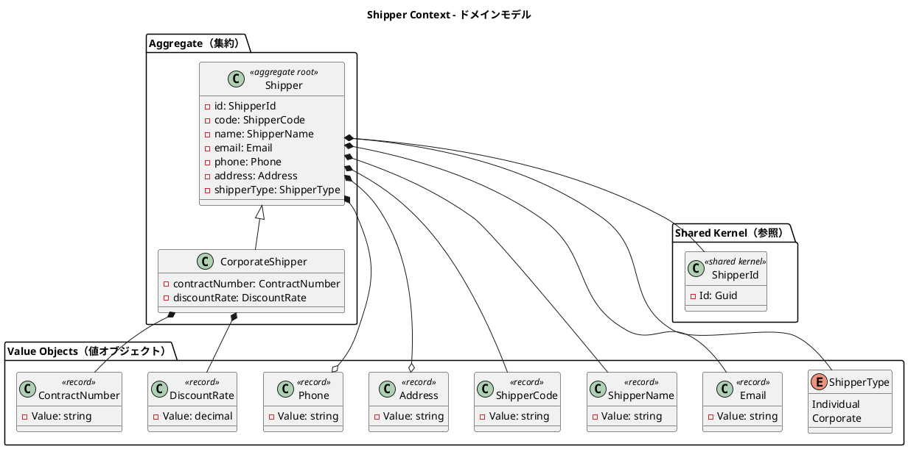

### 実装表現（C#）

```csharp
namespace CargoTracker.Domain.Shipper;

public sealed record ShipperCode(string Value);
public sealed record Email(string Value);

public sealed record DiscountRate
{
    public decimal Value { get; }

    public DiscountRate(decimal value)
    {
        if (value is < 0.0000m or > 0.3000m)
            throw new ArgumentOutOfRangeException(nameof(value), "割引率は 0〜30% の範囲でなければなりません。");
        Value = value;
    }
}
```

### 集約・エンティティ・値オブジェクト一覧

| 種別 | クラス名 | 日本語名 | 責務 |
|---|---|---|---|
| 集約ルート | Shipper | 荷主 | 荷主情報の管理。個人・法人の 2 種別 |
| エンティティ | CorporateShipper | 法人荷主 | Shipper のサブタイプ。契約番号と割引率を追加保持 |
| 値オブジェクト（record） | ShipperCode | 荷主コード | 自動生成される荷主の業務識別コード |
| 値オブジェクト（record） | ShipperName | 荷主名 | 荷主の氏名または社名 |
| 値オブジェクト（record） | Email | メール | メールアドレス。一意制約あり |
| 値オブジェクト（record） | Phone | 電話番号 | 電話番号（オプション） |
| 値オブジェクト（record） | Address | 住所 | 住所（オプション、最大 500 文字） |
| 値オブジェクト（record） | ContractNumber | 契約番号 | 法人荷主の契約番号 |
| 値オブジェクト（record） | DiscountRate | 割引率 | 法人荷主の割引率（0〜30%） |
| 列挙型 | ShipperType | 荷主種別 | Individual / Corporate |
| 共有カーネル参照 | ShipperId | 荷主識別子 | `Guid` ベースの一意識別子。Shared Domain に配置 |
| リポジトリ（ポート） | IShipperRepository | 荷主リポジトリ | 荷主の永続化ポート |

### ビジネスルール

1. 荷主は必ず ShipperId・ShipperCode・ShipperName・Email・ShipperType を持つ
2. Email はシステム全体で一意（`EmailAlreadyRegisteredException` で重複検出）
3. Corporate ShipperType の場合、CorporateShipper として ContractNumber と DiscountRate が必須
4. DiscountRate の値域は 0.0000〜0.3000（0%〜30%）
5. ShipperCode は自動生成（`SHP-` プレフィックス + `Guid` 先頭 8 文字）

### コマンド一覧

| コマンド | 実行アクター | 主な処理 |
|---|---|---|
| RegisterShipperCommand | 営業担当者 | 荷主の新規登録。Email 重複チェックと ShipperCode 自動生成 |

## 3. Routing Context（経路コンテキスト）

名前空間：`CargoTracker.Domain.Routing`

### ドメインモデル図

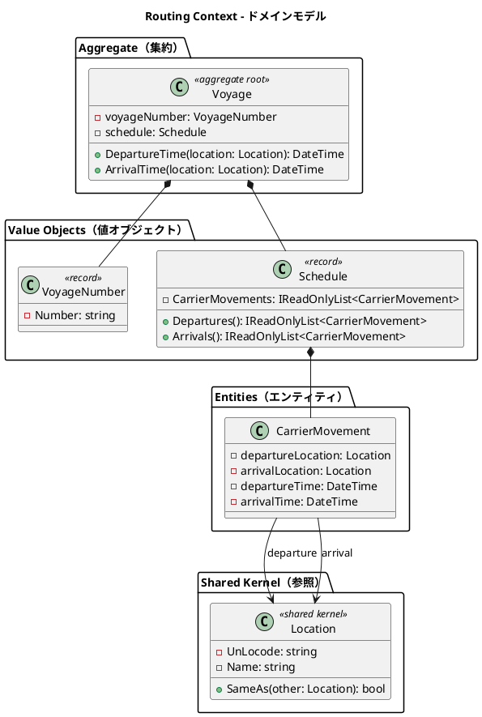

### 集約・エンティティ・値オブジェクト一覧

| 種別 | クラス名 | 日本語名 | 責務 |
|---|---|---|---|
| 集約ルート | Voyage | 航海 | 航路スケジュールを管理する中心エンティティ。船名・運送会社・対応貨物種別を保持 |
| 集約ルート | SelectedRoute | 確定経路 | 経路設計者が経路候補から選択・確定した経路を予約単位で保持する（US09）。CandidateRoute と RouteStatus を持つ |
| 列挙型 | RouteStatus | 経路状態 | 確定経路の状態（Confirmed）。US09 で使用 |
| 値オブジェクト（record） | VoyageNumber | 航海番号 | Routing Context 固有の航海一意識別子 |
| 値オブジェクト（record） | Schedule | 航海スケジュール | 時系列の CarrierMovement 一覧を保持 |
| エンティティ | CarrierMovement | 運送区間 | 出発地・到着地・出発時刻・到着時刻の区間単位 |
| 列挙型 | SupportedCargoType | 対応貨物種別 | 航海が対応する貨物種別（General/Hazardous/Refrigerated）。Booking の CargoType とは共有せず BC 独立（ADR-0007） |
| 値オブジェクト（record） | CandidateRoute | 経路候補 | 経路設計者向けに算出する経路候補（VoyageNumber 列・経由港・所要日数・費用）。US08 で使用 |
| ドメインサービス | RouteCandidateCalculator | 経路候補算出 | 利用可能な航海群から出発地→目的地の経路候補を、寄港地接続評価・時刻接続・期限フィルタ・直行優先ソートで算出する純粋ドメインロジック（US08）。費用・所要日数は暫定係数 |
| ドリブンポート | IRouteCandidateService | 経路候補算出ポート | 航海スケジュール検索結果と出発地・目的地・期限から CandidateRoute を算出（外部経路サービス ACL。WireMock.Net で契約固定は実連携時に実施） |
| 共有カーネル参照 | Location | 位置情報 | UN/LOCODE で識別される港湾・地点 |

> **注（IT3・BC 独立の設計判断）**: 経路候補は **Routing Context 固有の `CandidateRoute`** として定義し、Estimation Context の `RouteCandidate`（見積用）とは分離する（DDD の BC 独立原則。CargoType 二重定義と同種）。経路候補算出ポートも Routing 固有の `IRouteCandidateService` とし、Estimation の `IExternalRoutingServicePort`（見積用）と分離する。両者はライフサイクル・責務が異なり、共有すると BC 結合が生じるため。

### ビジネスルール

1. 航海は必ず一意の VoyageNumber を持つ
2. Schedule は時系列順の CarrierMovement で構成される
3. CarrierMovement の出発地と到着地は異なる
4. Location は UN/LOCODE で一意に識別される（例: `JPOSA` = 大阪、`USLAX` = LA）
5. Voyage は対応貨物種別（General/Hazardous/Refrigerated）を保持し、US07 検索・US08 算出で危険物・冷凍貨物の絞り込みに用いる
6. CandidateRoute は所要日数が期限内の航海連鎖のみを対象とし、直行を最優先に推奨順で並べる（US08）

### コマンド一覧

| コマンド | 実行アクター | 主な処理 |
|---|---|---|
| RegisterVoyageCommand | 経路設計者 | 新規航海スケジュールの登録 |
| UpdateScheduleCommand | 経路設計者 | 運送区間の追加・変更 |
| SelectRouteCommand | 経路設計者 | 経路候補を選択して確定経路（SelectedRoute）を予約単位で保存する（US09） |

## 4. Tracking Context（追跡コンテキスト）

名前空間：`CargoTracker.Domain.Tracking`

### ドメインモデル図

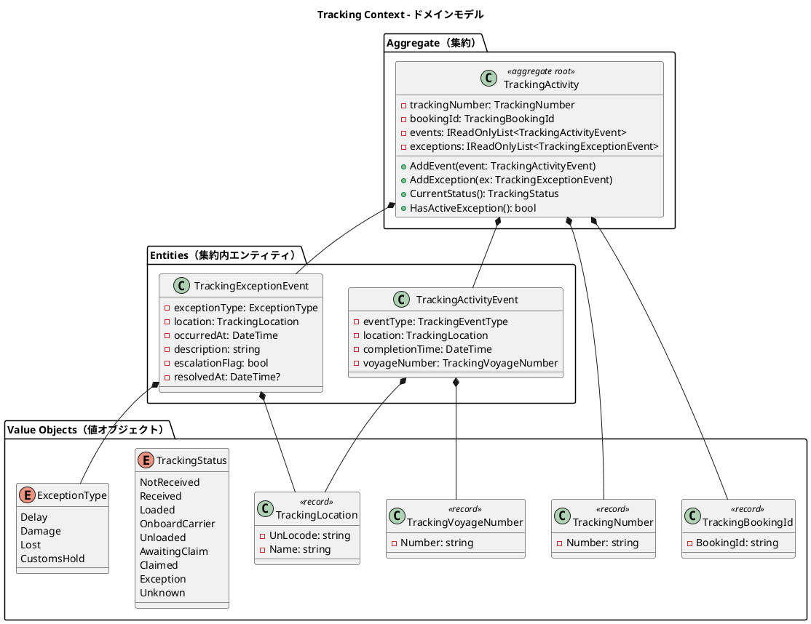

### 集約・エンティティ・値オブジェクト一覧

| 種別 | クラス名 | 日本語名 | 責務 |
|---|---|---|---|
| 集約ルート | TrackingActivity | 追跡レコード | 貨物の追跡情報全体を管理 |
| エンティティ（集約内） | TrackingActivityEvent | 追跡イベント | 時系列で記録される追跡の出来事 |
| エンティティ（集約内） | TrackingExceptionEvent | 追跡例外イベント | 遅延・損傷・紛失・税関保留の例外記録 |
| 値オブジェクト（record） | TrackingNumber | 追跡番号 | 追跡活動を一意に識別 |
| 値オブジェクト（record） | TrackingBookingId | 予約参照 ID | Booking Context との関連を保持 |
| 値オブジェクト（record） | TrackingLocation | 追跡位置情報 | コンテキスト固有の位置情報型（ACL 変換） |
| 値オブジェクト（record） | TrackingVoyageNumber | 追跡航海番号 | Tracking Context 固有の航海番号型 |
| 列挙型 | TrackingStatus | 追跡状態 | 9 段階の追跡フェーズ |
| 列挙型 | ExceptionType | 例外種別 | Delay / Damage / Lost / CustomsHold |

### ビジネスルール

1. 追跡活動は必ず一意の TrackingNumber を持つ
2. TrackingActivityEvent は時系列順で管理される。イベントごとに位置と時刻が必須
3. ExceptionType が Lost の場合、escalationFlag を `true` に設定し上位管理者へエスカレーションする
4. CustomsHold 例外は税関システム（ICustomsClearancePort）からの通知によって自動登録される
5. `ResolveExceptionCommand` の実行により TrackingStatus は例外発生前の状態に復帰する

### コマンド一覧

| コマンド | 実行アクター | 主な処理 |
|---|---|---|
| AssignTrackingNumberCommand | Booking Context（イベント駆動） | TrackingActivity を新規作成し TrackingNumber を割り当て |
| AddTrackingEventCommand | 追跡管理者 | TrackingActivityEvent を時系列で追加 |
| RegisterExceptionCommand | 追跡管理者・税関システム | TrackingExceptionEvent を登録 |
| ResolveExceptionCommand | 追跡管理者 | 例外を解決し TrackingStatus を復帰 |

## 5. Handling Context（荷役コンテキスト）

名前空間：`CargoTracker.Domain.Handling`

### ドメインモデル図

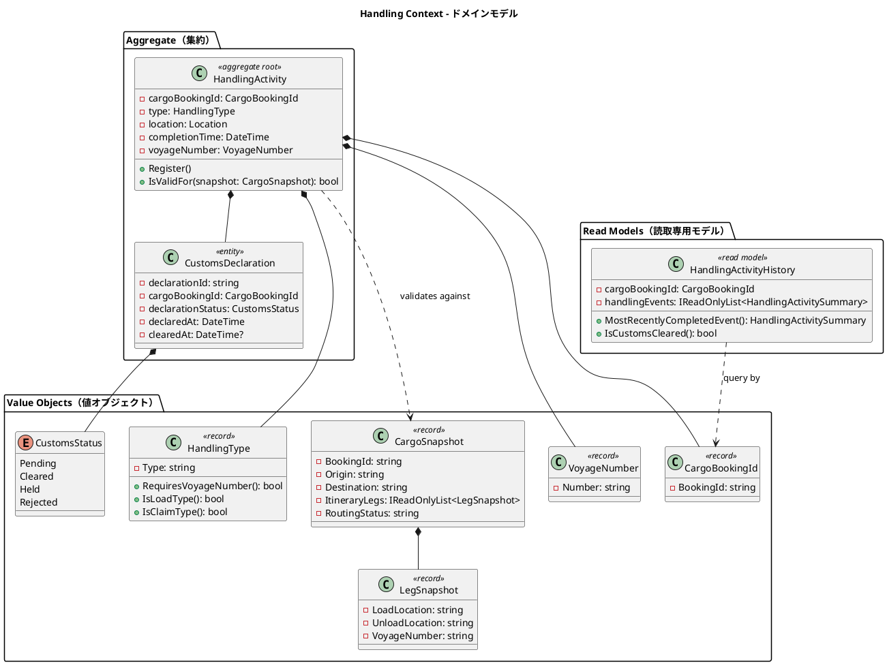

### 集約・エンティティ・値オブジェクト一覧

| 種別 | クラス名 | 日本語名 | 責務 |
|---|---|---|---|
| 集約ルート | HandlingActivity | 荷役作業 | 荷役作業の登録と妥当性検証 |
| エンティティ（集約内） | CustomsDeclaration | 通関申告 | 通関申告の状態管理 |
| 値オブジェクト（record） | CargoBookingId | 貨物予約識別子 | Booking Context との関連識別子 |
| 値オブジェクト（record） | HandlingType | 荷役種別 | RECEIVE / LOAD / UNLOAD / CUSTOMS / CLAIM。VoyageNumber 必須判定を内包 |
| 値オブジェクト（record） | CargoSnapshot | 貨物スナップショット | ACL 経由で取得した貨物情報。妥当性検証に使用 |
| 値オブジェクト（record） | LegSnapshot | 旅程区間スナップショット | CargoSnapshot 内の区間情報 |
| 値オブジェクト（record） | VoyageNumber | 航海番号 | Handling Context 固有の航海番号型 |
| 列挙型 | CustomsStatus | 通関状態 | Pending / Cleared / Held / Rejected |
| Read Model | HandlingActivityHistory | 荷役履歴 | クエリ専用の荷役作業履歴。集約と切り離して管理 |

### ビジネスルール

荷役妥当性検証（`IsValidFor`）のデシジョンテーブル：

| 荷役タイプ | VoyageNumber 必須 | 場所チェック | MISROUTED 判定条件 |
|---|---|---|---|
| RECEIVE（受領） | 不要 | 出発港（RouteSpecification.Origin）と一致 | 不一致で警告 |
| LOAD（積込） | 必須 | Itinerary の積込港（Leg.LoadLocation）と一致 | 不一致で MISROUTED |
| UNLOAD（荷降し） | 必須 | Itinerary の荷降港（Leg.UnloadLocation）と一致 | 不一致で MISROUTED |
| CLAIM（引取） | 不要 | 目的港（RouteSpecification.Destination）と一致 | 不一致で警告 |

追加ルール：

1. LOAD / UNLOAD 作業で MISROUTED が確定した場合、Booking Context の RoutingStatus を Misrouted に更新する
2. CustomsDeclaration が Cleared 状態になるまで CLAIM（引取）は実施できない
3. HandlingActivityHistory はクエリ専用の Read Model として管理され、集約とは切り離す

### コマンド一覧

| コマンド | 実行アクター | 主な処理 |
|---|---|---|
| HandlingActivityRegistrationCommand | 荷役作業員 | 荷役作業を登録し、CargoSnapshot で妥当性を検証 |
| RegisterCustomsDeclarationCommand | 荷役作業員 | 通関申告を新規登録（Pending 状態で作成） |
| UpdateCustomsStatusCommand | 税関システム（ACL） | 通関申告の状態を更新（Cleared / Held / Rejected） |

## 6. Billing Context（精算コンテキスト）

名前空間：`CargoTracker.Domain.Billing`

### ドメインモデル図

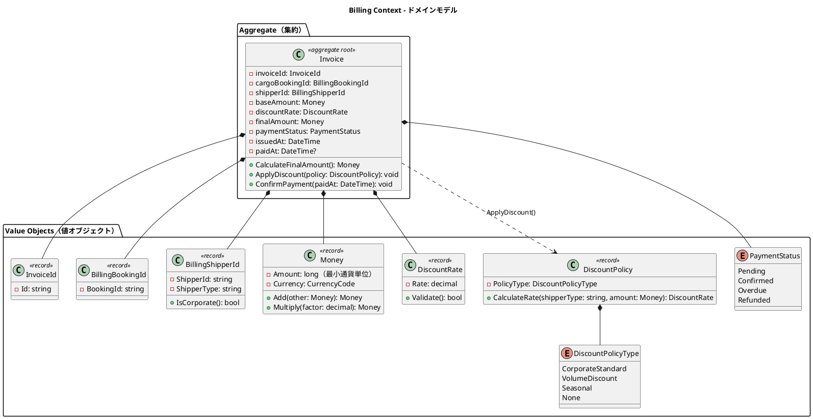

### 集約・エンティティ・値オブジェクト一覧

| 種別 | クラス名 | 日本語名 | 責務 |
|---|---|---|---|
| 集約ルート | Invoice | 精算書 | 貨物輸送 1 件に対する請求書の発行・管理 |
| 値オブジェクト（record） | InvoiceId | 請求書 ID | 精算書の一意識別子 |
| 値オブジェクト（record） | BillingBookingId | 予約参照 ID | Booking Context の Cargo との関連識別子 |
| 値オブジェクト（record） | BillingShipperId | 荷主参照 ID | 法人判定（IsCorporate）を内包 |
| 値オブジェクト（record） | Money | 金額 | 最小通貨単位の整数と通貨コードのペア |
| 値オブジェクト（record） | DiscountRate | 割引率 | 0〜30% の割引率。範囲バリデーション付き |
| 値オブジェクト（record） | DiscountPolicy | 割引方針 | 法人・ボリューム・シーズン割引のロジック |
| 列挙型 | PaymentStatus | 支払い状態 | Pending / Confirmed / Overdue / Refunded |
| 列挙型 | DiscountPolicyType | 割引方針種別 | CorporateStandard / VolumeDiscount / Seasonal / None |

### ビジネスルール

1. Invoice は貨物配送完了（BookingStatus = Delivered）後にのみ発行できる
2. 法人荷主（Corporate）には最大 30% の割引が適用される
3. 支払期限（issuedAt + 30 日）を超過した場合、PaymentStatus を Overdue に更新する
4. 支払い確定（Confirmed）後のキャンセルは `IssueRefundCommand` で対応し、Refunded 状態に遷移する

料金計算ロジック：

```
基本料金 = 距離係数 × 重量（kg） × 貨物種別係数
  - General（一般貨物）: 係数 1.0
  - Hazardous（危険物）: 係数 1.8
  - Refrigerated（冷凍・冷蔵）: 係数 1.5

割引後料金 = 基本料金 × (1 - 割引率)
  - Corporate 荷主: 割引率 0〜30%
  - Individual 荷主: 割引なし（割引率 0%）
```

### コマンド一覧

| コマンド | 実行アクター | 主な処理 |
|---|---|---|
| GenerateInvoiceCommand | 経理担当者 | 請求書を新規発行（Pending 状態で作成） |
| ConfirmPaymentCommand | 経理担当者 | 支払い確認を記録し Confirmed に遷移 |

## 7. Estimation Context（見積コンテキスト）

名前空間：`CargoTracker.Domain.Estimation`

### ドメインモデル図

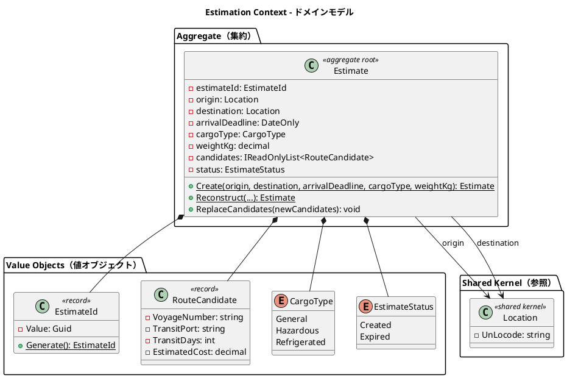

### 実装表現（C#）

```csharp
namespace CargoTracker.Domain.Estimation;

public sealed record EstimateId(Guid Value)
{
    public static EstimateId Generate() => new(Guid.NewGuid());
}

public sealed record RouteCandidate(
    string VoyageNumber,
    string TransitPort,
    int TransitDays,
    decimal EstimatedCost);
```

### 集約・エンティティ・値オブジェクト一覧

| 種別 | クラス名 | 日本語名 | 責務 |
|---|---|---|---|
| 集約ルート | Estimate | 見積 | 輸送見積の中心エンティティ。出発地・仕向地・貨物種別・重量・ルート候補を管理 |
| 値オブジェクト（record） | EstimateId | 見積 ID | `Guid` ベースの見積一意識別子。`Generate()` で自動生成 |
| 値オブジェクト（record） | RouteCandidate | ルート候補 | 航海番号・経由港・輸送日数・見積コストを保持。Estimate に複数紐づく |
| 列挙型 | CargoType | 貨物種別 | General / Hazardous / Refrigerated |
| 列挙型 | EstimateStatus | 見積状態 | Created（作成済）/ Expired（期限切れ）。表示名（日本語）を保持 |
| 共有カーネル参照 | Location | 位置情報 | UN/LOCODE で識別される港湾・地点。Shared Domain に配置 |
| リポジトリ（ポート） | IEstimateRepository | 見積リポジトリ | `SaveAsync` / `FindByEstimateIdAsync` / `FindAllAsync` |

### ビジネスルール

1. 見積は必ず EstimateId・Origin・Destination・ArrivalDeadline・CargoType・WeightKg を持つ
2. Origin と Destination は異なる（同一地点への見積は不可）
3. WeightKg は正の値でなければならない
4. RouteCandidate の VoyageNumber は空でない文字列、TransitDays は正の値、EstimatedCost は正の値
5. 見積作成時のデフォルトステータスは `Created`
6. ルート候補はスタブ実装（固定値）で生成される。将来、外部ルーティングサービスとの連携時に置換予定

### コマンド一覧

| コマンド | 実行アクター | 主な処理 |
|---|---|---|
| CreateEstimateCommand | 営業担当者 | 見積を新規作成し、スタブのルート候補を自動付与 |

### Booking Context との関係

Estimation Context は Booking Context と以下の関係を持ちます。

- **共有**: CargoType 列挙型は両コンテキストで同一の値（General / Hazardous / Refrigerated）を使用する
- **参照**: Location（Shared Domain）を経由して出発地・仕向地を共有する
- **将来の連携**: 見積から予約への引き継ぎ（見積情報を基に Cargo を作成するフロー）は将来イテレーションで実装予定

## 8. Shared Domain（共有ドメイン）

名前空間：`CargoTracker.Domain.Shared`

### ドメインモデル図

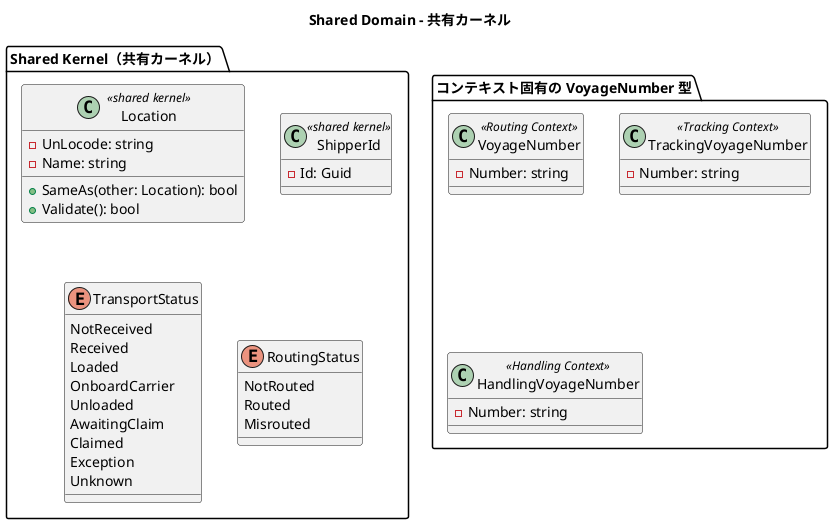

### 共有コンポーネント一覧

| 種別 | クラス名 | 日本語名 | 責務 |
|---|---|---|---|
| 共有カーネル | Location | 位置情報 | UN/LOCODE で識別される港湾・地点。全コンテキストで共有 |
| 共有カーネル | ShipperId | 荷主識別子 | `Guid` ベースの荷主 ID。Booking Context と Shipper Context で共有 |
| 共有列挙型 | TransportStatus | 輸送状態 | 9 段階の輸送フェーズ。Booking・Tracking で共有 |
| 共有列挙型 | RoutingStatus | 経路状態 | NotRouted / Routed / Misrouted。Booking・Handling で共有 |

### VoyageNumber のコンテキスト分離設計

VoyageNumber は各コンテキストが独自型を保持します。これにより各コンテキストの自律性を保ちながら意味的な一貫性を維持します。

| コンテキスト | 型名 | 役割 |
|---|---|---|
| Routing Context | VoyageNumber | 航海スケジュールの識別子 |
| Tracking Context | TrackingVoyageNumber | 追跡イベントに紐づく航海番号（ACL 変換） |
| Handling Context | HandlingVoyageNumber | 荷役作業に紐づく航海番号（ACL 変換） |

### ビジネスルール

1. Location の変更は全コンテキストチームの合意のもとに行う（Shared Kernel の制約）
2. UN/LOCODE は国際規格（ISO 3166-1 alpha-2 + 3 文字のロケーションコード）に従う
3. TransportStatus と RoutingStatus は Booking Context と Tracking / Handling Context の間で整合性を保つ

## ドメインイベント

ドメインイベントは MediatR の `INotification` を実装する不変の `record` として定義し、`IMediator.Publish` によりコンテキスト間へ配信します。

| イベント名 | 発生元 | 処理先 | 内容 |
|---|---|---|---|
| CargoBookedEvent | Booking Context | Tracking Context | 新規貨物予約後、追跡番号割り当て依頼を通知 |
| CargoRoutedEvent | Booking Context | Tracking Context | 旅程確定後、経路・旅程情報を追跡コンテキストに同期 |
| HandlingActivityRegisteredEvent | Handling Context | Tracking Context・Booking Context | 荷役作業完了後、TransportStatus と BookingStatus を同期 |
| TrackingExceptionDetectedEvent | Tracking Context | Booking Context・Notification | 例外（遅延・損傷・紛失・税関保留）検知後、通知を配信 |
| InvoiceCreatedEvent | Billing Context | Notification | 請求書発行後、荷主への通知を配信 |

### 実装表現（C#）

```csharp
using MediatR;

namespace CargoTracker.Domain.Booking.Events;

public sealed record CargoBookedEvent(
    BookingId BookingId,
    ShipperId ShipperId,
    DateTime OccurredAt) : INotification;

// ハンドラー側（Tracking Context）
public sealed class CargoBookedEventHandler : INotificationHandler<CargoBookedEvent>
{
    public Task Handle(CargoBookedEvent notification, CancellationToken ct)
    {
        // TrackingActivity を新規作成し TrackingNumber を割り当てる
        ...
    }
}
```

### ドメインイベントフロー

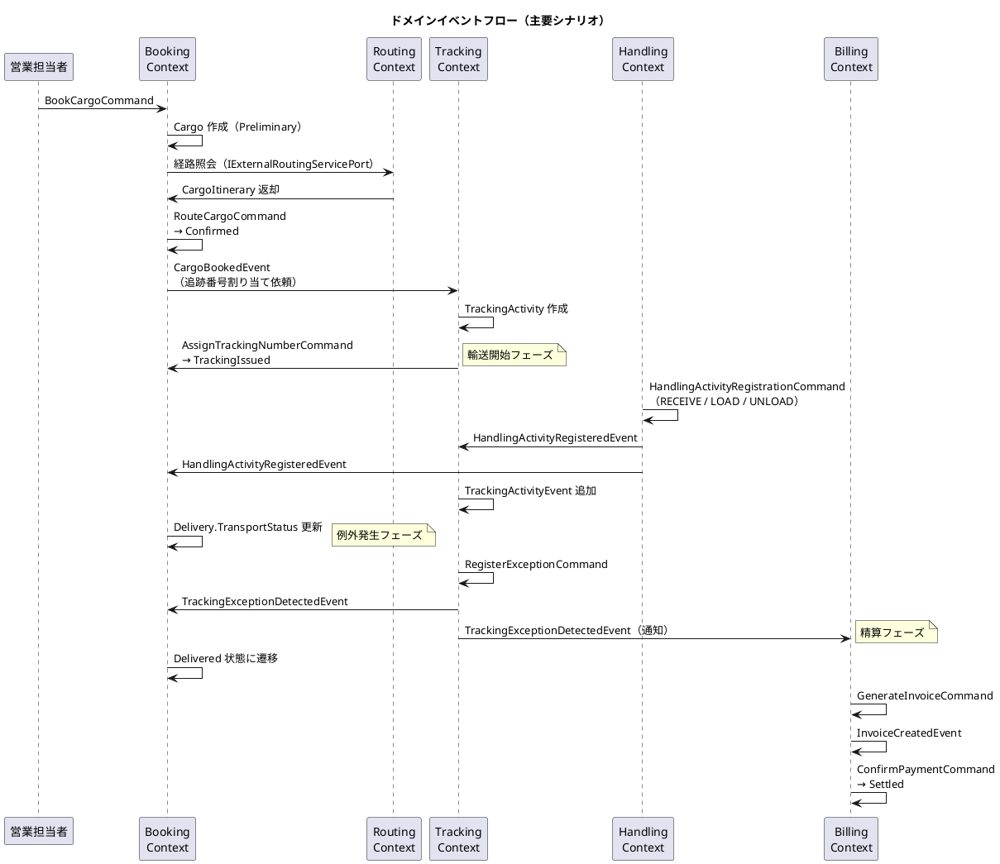

## 外部システム ACL Ports

| ポート名 | 対応外部システム | 責務 |
|---|---|---|
| IExternalRoutingServicePort | 外部経路最適化システム | 出発地・目的地・期限を渡し最適 CargoItinerary を取得 |
| ICustomsClearancePort | 税関システム | 通関申告の提出・状態照会・CUSTOMS_HOLD 例外の自動通知受信 |
| IPaymentGatewayPort | 決済機関 | 支払い処理の実行と支払い確認の受信 |
| IPortManagementPort | 港湾管理システム | 港湾の取扱可能貨物種別（HAZARDOUS / REFRIGERATED）の照会 |
| INotificationPort | 通知システム | 荷主・荷受人へのメール / SMS 通知の送信 |

各ポートはヘキサゴナルアーキテクチャの出力ポート（Secondary Port）として C# の `interface` で定義し、DI コンテナ（`Microsoft.Extensions.DependencyInjection`）を通じてインフラ層のアダプターが実装を担います。これにより外部システムの変更がドメインロジックに影響しません。

## 集約設計の判断

### Booking Context：Cargo 集約

Cargo を集約ルートとし、BookingId・ShipperId・RouteSpecification・CargoItinerary・Delivery を集約内に含める設計としました。

**根拠**：予約の状態遷移（BookingStatus）はこれらのオブジェクトが一体として整合性を保つ必要があります。特に CargoItinerary の Leg 連結制約（`Leg[n].UnloadLocation == Leg[n+1].LoadLocation`）は単一トランザクション内で検証しなければ不整合が生じます。Consignee は Cargo に対して 1 対 1 であるため、独立した集約とせず値オブジェクトとして含めます。

### Routing Context：Voyage 集約

Voyage を集約ルートとし、Schedule（CarrierMovement のリスト）を内包する設計としました。

**根拠**：Schedule と CarrierMovement は Voyage の文脈でのみ意味を持ちます。Schedule の時系列整合性（CarrierMovement の順序・連続性）は Voyage 単位で保証する必要があるため、単一集約に含めます。

### Tracking Context：TrackingActivity 集約

TrackingActivity を集約ルートとし、TrackingActivityEvent と TrackingExceptionEvent を集約内エンティティとして管理する設計としました。

**根拠**：追跡状態（TrackingStatus）は時系列の全イベントと例外状態を総合的に判定するため、単一集約としてまとめる必要があります。例外解決時に「例外発生前の状態に復帰」するロジックは集約内の一貫したトランザクションで実行されます。

### Handling Context：HandlingActivity 集約 + Read Model 分離

HandlingActivity を集約ルートとし、CustomsDeclaration を集約内エンティティとしました。荷役履歴は Read Model（HandlingActivityHistory）として集約と切り離す設計としました。

**根拠**：個々の荷役作業は独立した記録単位であり、互いに強い整合性制約を持ちません。一方、通関申告（CustomsDeclaration）と荷役作業は「Cleared にならないと CLAIM 不可」という不変条件があるため、同一集約に含めます。クエリ専用の履歴参照は Read Model として分離することで、コマンド側（集約）の複雑性を低減します。

### Billing Context：Invoice 集約

Invoice を集約ルートとし、DiscountPolicy はドメインサービスではなく値オブジェクトとして Invoice に委譲する設計としました。

**根拠**：請求書 1 件の整合性（基本料金・割引率・最終金額の一貫性）は Invoice 集約内で保証されます。DiscountPolicy の割引率計算ロジックは Invoice の `ApplyDiscount()` 内で完結するため、外部ドメインサービスとして切り出す必要はありません。支払い状態（PaymentStatus）の遷移も Invoice 集約が責任を持ちます。

### Estimation Context：Estimate 集約

Estimate を集約ルートとし、RouteCandidate（ルート候補）のリストを集約内に保持する設計としました。

**根拠**：見積とルート候補は 1 対多の関係にあり、ルート候補は見積の文脈でのみ意味を持ちます。`ReplaceCandidates()` でルート候補の一括入替を行うため、トランザクション整合性の観点から単一集約に含めます。RouteCandidate は C# の `record` で実装し、不変性を保証します。現在のルート候補生成はスタブ実装（重量ベースの固定コスト計算）であり、将来の外部ルーティングサービス連携時にアダプターを差し替える設計としました。
