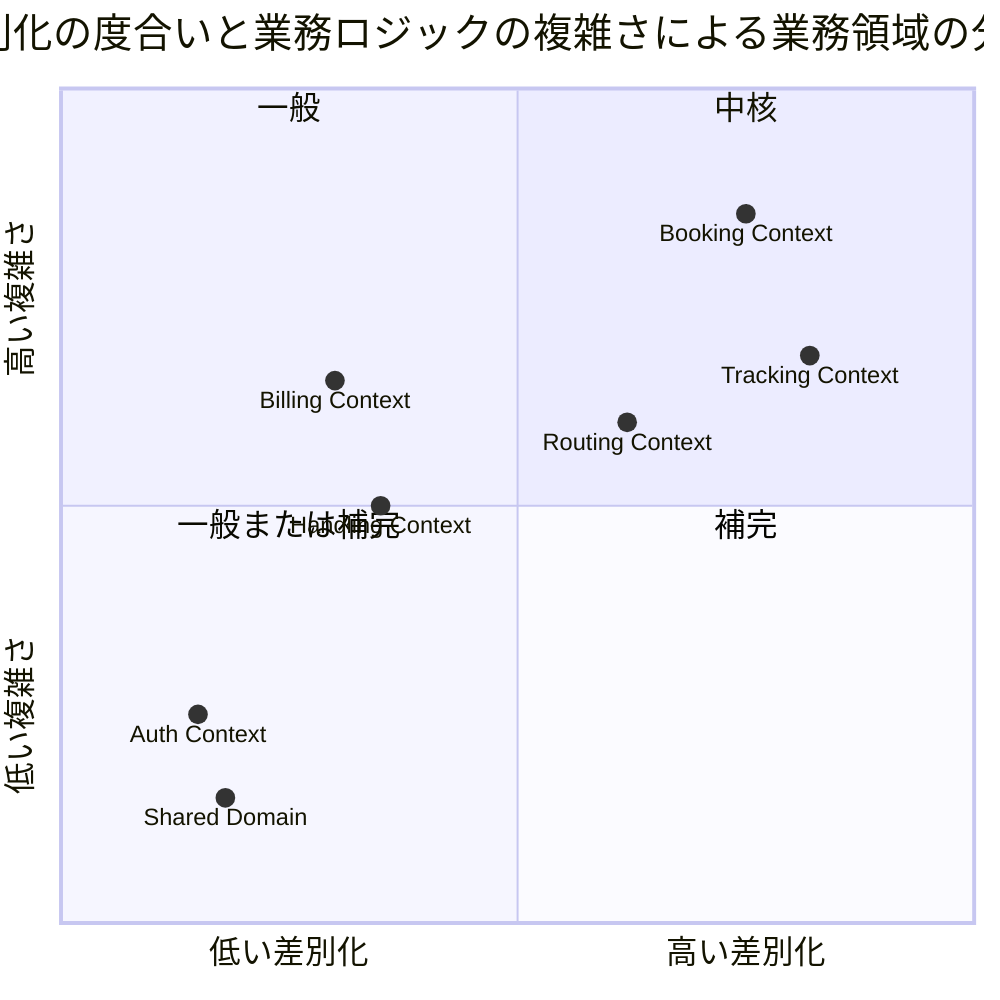
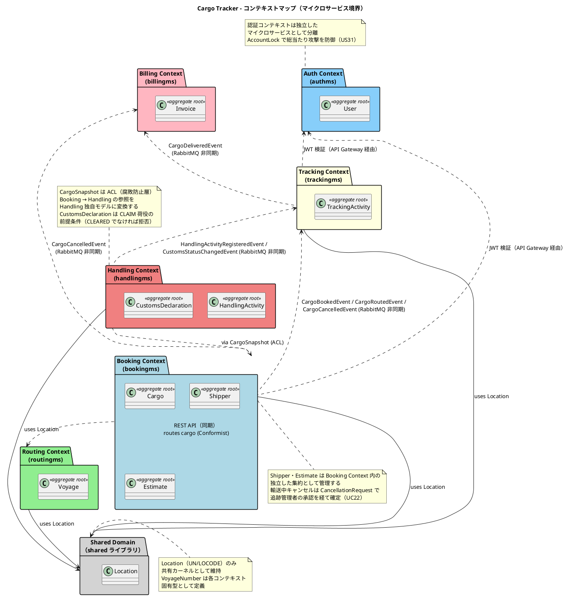
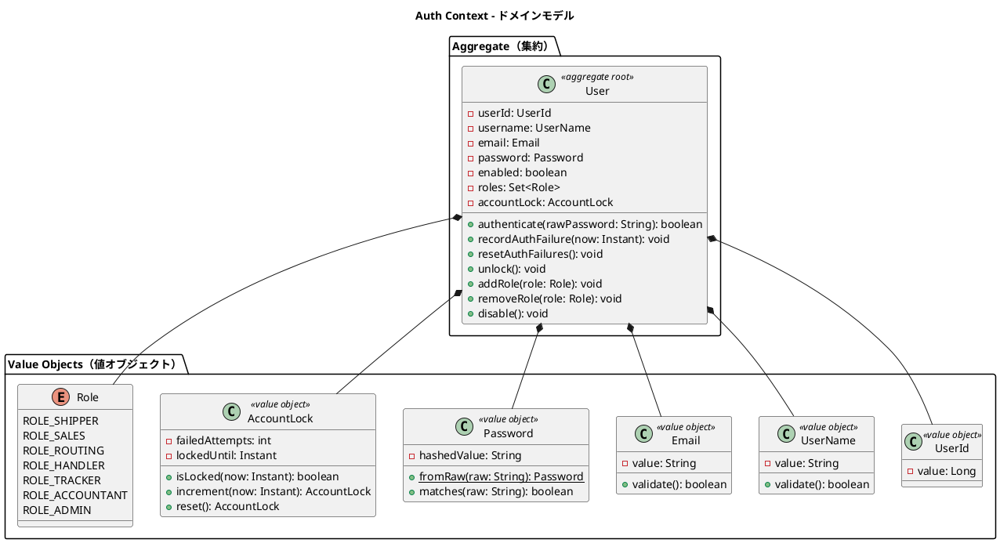
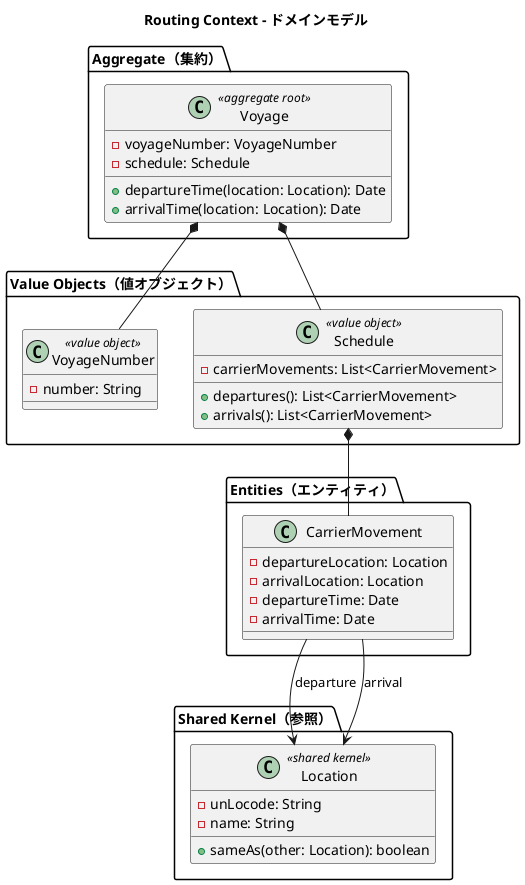
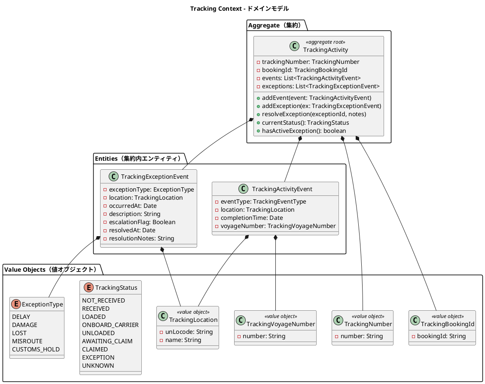
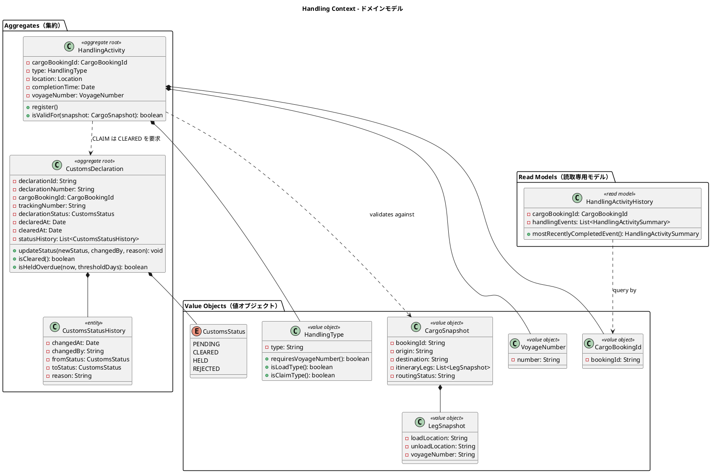
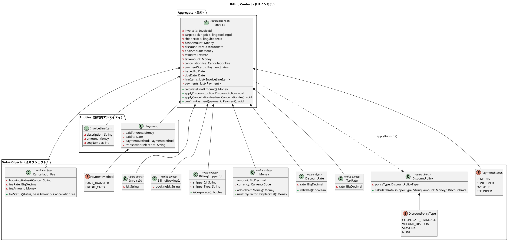
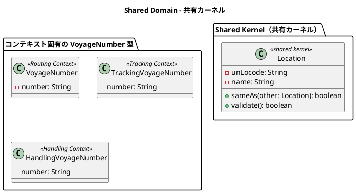
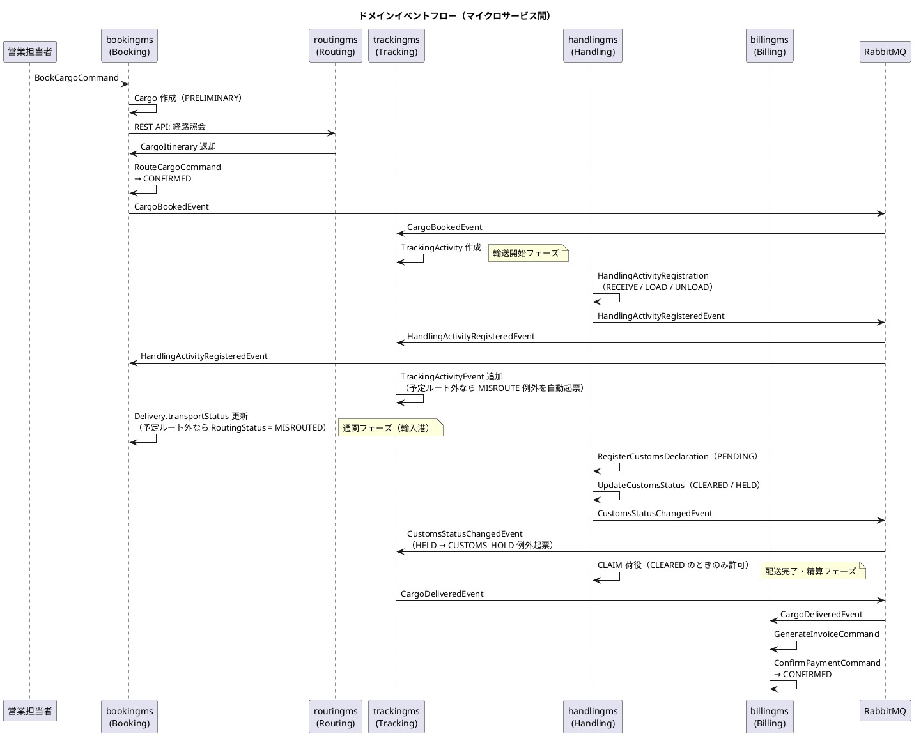

```plantuml
@startuml
title Booking Context - ドメインモデル

package "Cargo 集約" {
  class Cargo <<aggregate root>> {
    -bookingId: BookingId
    -shipperId: ShipperId
    -consignee: Consignee
    -routeSpecification: RouteSpecification
    -weightKg: BigDecimal
    -cargoItinerary: CargoItinerary
    -delivery: Delivery
    -bookingAmount: Money
    -bookingStatus: BookingStatus
    -cargoType: CargoType
    -dimensions: Dimensions
    -quantity: Quantity
    -description: Description
    -hazardousDeclaration: HazardousDeclaration
    -temperatureRequirement: TemperatureRequirement
    -trackingNumber: String
    -cancellationRequests: List<CancellationRequest>
    +requestCancellation(reason, requestedBy): CancellationRequest
    +approveCancellation(dischargeLocation, approvedBy): void
    +rejectCancellation(reason, rejectedBy): void
    +canCancelImmediately(): boolean
  }
  class CancellationRequest <<entity>> {
    -requestId: String
    -reason: String
    -status: CancellationStatus
    -requestedBy: String
    -requestedAt: Instant
    -dischargeLocation: Location
    -decidedBy: String
    -decidedAt: Instant
    -decisionReason: String
  }
}

package "Shipper 集約" {
  class Shipper <<aggregate root>> {
    -shipperId: ShipperId
    -code: ShipperCode
    -name: String
    -email: String
    -address: String
    -phone: String
    -shipperType: ShipperType
    -contractNumber: ContractNumber
    -discountRate: DiscountRate
    +isCorporate(): boolean
  }
  note bottom of Shipper
    ADR-012: 単一クラスとし、サブタイプに分けない。
    種別は変わりうる（個人事業主の法人成り）ため、
    サブタイプにすると識別子の引き継ぎが要る。
    契約番号・割引率は法人のときだけ値を持つ。
  end note
}

package "Estimate 集約" {
  class Estimate <<aggregate root>> {
    -estimateId: EstimateId
    -origin: Location
    -destination: Location
    -arrivalDeadline: LocalDate
    -cargoType: CargoType
    -weightKg: BigDecimal
    -candidates: List<RouteCandidate>
    -status: EstimateStatus
    +{static} create(origin, destination, arrivalDeadline, cargoType, weightKg): Estimate
    +replaceCandidates(newCandidates): void
  }
}

package "Value Objects（値オブジェクト）" {
  class BookingId <<value object>> {
    -id: String
  }
  class ShipperId <<value object>> {
    -id: String
  }
  class Consignee <<value object>> {
    -name: String
    -contactEmail: String
  }
  class RouteSpecification <<value object>> {
    -departureDate: LocalDate
    -origin: Location
    -destination: Location
    -arrivalDeadline: Date
    +isSatisfiedBy(itinerary): boolean
  }
  class CargoItinerary <<value object>> {
    -legs: List<Leg>
    +expectedArrivalTime(): Date
    +includesLocation(location: Location): boolean
  }
  class Leg <<value object>> {
    -loadLocation: Location
    -unloadLocation: Location
    -loadTime: Date
    -unloadTime: Date
    -voyage: VoyageNumber
  }
  class Delivery <<value object>> {
    -transportStatus: TransportStatus
    -routingStatus: RoutingStatus
    -lastCargoHandledEvent: CargoHandlingActivity
  }
  class Money <<value object>> {
    -amount: BigDecimal
    -currency: CurrencyCode
    +add(other: Money): Money
    +multiply(factor: BigDecimal): Money
  }
  class CargoHandlingActivity <<value object>> {
    -handlingType: String
    -location: Location
    -completionTime: Date
  }
  class ShipperCode <<value object>> {
    -value: String
  }
  class Email <<value object>> {
    -value: String
  }
  class Phone <<value object>> {
    -value: String
  }
  class ContractNumber <<value object>> {
    -value: String
  }
  class DiscountRate <<value object>> {
    -value: BigDecimal
  }
  class Dimensions <<value object>> {
    -length: BigDecimal
    -width: BigDecimal
    -height: BigDecimal
  }
  class Quantity <<value object>> {
    -value: int
  }
  class Description <<value object>> {
    -value: String
  }
  class HazardousDeclaration <<value object>> {
    -hazardousClass: String
    -unNumber: String
    -properShippingName: String
  }
  class TemperatureRequirement <<value object>> {
    -minTemperature: BigDecimal
    -maxTemperature: BigDecimal
    -unit: TemperatureUnit
  }
  class EstimateId <<value object>> {
    -value: UUID
    +{static} generate(): EstimateId
  }
  class RouteCandidate <<value object>> {
    -voyageNumber: String
    -transitPort: String
    -transitDays: int
    -estimatedCost: BigDecimal
  }
  enum BookingStatus {
    PRELIMINARY
    ROUTE_PROPOSED
    CONFIRMED
    TRACKING_ISSUED
    IN_TRANSIT
    DELIVERED
    SETTLED
    CANCELLED
  }
  enum CargoType {
    GENERAL
    HAZARDOUS
    REFRIGERATED
  }
  enum ShipperType {
    INDIVIDUAL
    CORPORATE
  }
  enum RoutingStatus {
    NOT_ROUTED
    ROUTED
    MISROUTED
  }
  enum TransportStatus {
    NOT_RECEIVED
    RECEIVED
    LOADED
    IN_TRANSIT
    UNLOADED
    AWAITING_CLAIM
    DELIVERED
    MISROUTED
  }
  enum EstimateStatus {
    CREATED
    EXPIRED
  }
  enum CancellationStatus {
    REQUESTED
    APPROVED
    REJECTED
  }
}

' Cargo 集約の関連
Cargo *-- BookingId
Cargo *-- ShipperId
Cargo *-o Consignee
Cargo *-- RouteSpecification
Cargo *-o CargoItinerary
Cargo *-- Delivery
Cargo *-- Money
Cargo *-- BookingStatus
Cargo *-- CargoType
Cargo *-o Dimensions
Cargo *-o Quantity
Cargo *-o Description
Cargo *-o HazardousDeclaration
Cargo *-o TemperatureRequirement
Cargo *-- CancellationRequest
CancellationRequest *-- CancellationStatus
CargoItinerary *-- Leg
Delivery *-- RoutingStatus
Delivery *-- TransportStatus

' Shipper 集約の関連
Shipper *-- ShipperId
Shipper *-- ShipperCode
Shipper *-- ShipperType
Shipper *-o ContractNumber
Shipper *-o DiscountRate

' Estimate 集約の関連
Estimate *-- EstimateId
Estimate *-- CargoType
Estimate *-- EstimateStatus
Estimate *-- RouteCandidate

@enduml
```

# ドメインモデル設計 - 国際貨物輸送管理システム

## 概要

本ドキュメントは、国際貨物輸送管理システムの DDD（ドメイン駆動設計）戦術的設計を定義する。システムは 7 つの境界付けられたコンテキスト（Bounded Context）で構成され、各コンテキストが独立したマイクロサービスとしてデプロイされる。

take-3 のドメインモデルを基礎とし、本プロジェクトの要件で追加された
通関申告の集約化と監査履歴（UC21 / US29）・輸送中キャンセルの承認フロー（UC22 / US30）・誤配検知（US28）・アカウント保護（US31）を反映している。

| コンテキスト | サービス名 | 日本語名 | 主な責務 |
|---|---|---|---|
| Auth Context | authms | 認証コンテキスト | ユーザー認証・認可・JWT トークン管理・アカウント保護 |
| Booking Context | bookingms | 予約コンテキスト | 荷主管理・貨物予約・旅程管理・見積・状態遷移・キャンセル承認 |
| Routing Context | routingms | 経路コンテキスト | 航海スケジュール・経路情報の管理 |
| Tracking Context | trackingms | 追跡コンテキスト | 貨物追跡・例外イベント管理（誤配・税関保留含む） |
| Handling Context | handlingms | 荷役コンテキスト | 荷役作業登録・通関申告管理 |
| Billing Context | billingms | 精算コンテキスト | 請求書発行・割引・キャンセル料・支払い管理 |
| Shared Domain | shared | 共有ドメイン | 共有カーネル（Location） |

各コンテキストは自律的に変更可能な集約を持ち、コンテキスト間の連携はドメインイベント（RabbitMQ + Spring Cloud Stream)および ACL（Anti-Corruption Layer）ポートを通じて行う。



> Handling Context は take-3 より複雑さを高めに評価している。通関ガード（CLEARED でなければ CLAIM 不可）と監査履歴が加わったため。

## ユビキタス言語

| 英語（コード名） | 日本語（業務用語） | 使用コンテキスト | 説明 |
|---|---|---|---|
| User | ユーザー | Auth Context | システムにアクセスする認証済みユーザー |
| Role | ロール | Auth Context | ユーザーに割り当てられる権限（6 業務ロール + ADMIN） |
| Password | パスワード | Auth Context | BCrypt ハッシュで保存される認証情報 |
| AccountLock | アカウントロック | Auth Context | 連続認証失敗によるロック状態（失敗回数・ロック期限） |
| Cargo | 貨物 | Booking Context | 予約の中心的エンティティ。荷主から荷受人へ輸送される物品 |
| Shipper | 荷主 | Booking Context | 貨物を発送する主体。個人・法人の 2 種別を属性で持つ単一クラス（[ADR-012](../adr/012-value-object-granularity.md)） |
| BookingId | 予約 ID | Booking Context | 予約を一意に識別する値オブジェクト |
| RouteSpecification | ルート仕様 | Booking Context | 出発地・目的地・到着期限の要件定義 |
| CargoItinerary | 旅程 | Booking Context | 貨物の輸送経路全体。1 つ以上の Leg で構成 |
| Leg | 輸送区間 | Booking Context | 単一航海での積込港から荷降港までの区間 |
| Delivery | 配送状況 | Booking Context | 現在の輸送状態・経路状態・最終荷役イベントの集合 |
| Consignee | 荷受人 | Booking Context | 貨物を受け取る主体。氏名・メールアドレスを保持 |
| Estimate | 見積 | Booking Context | 輸送見積の中心エンティティ |
| RouteCandidate | ルート候補 | Booking Context | 見積に紐づく輸送ルート候補 |
| CancellationRequest | キャンセル申請 | Booking Context | 予約キャンセルの申請・承認・却下の記録。理由必須 |
| DischargeLocation | 陸揚げ地 | Booking Context | 輸送中キャンセル承認時に指定する荷降し先の港 |
| Dimensions | 寸法 | Booking Context | 貨物の長さ・幅・高さ（オプション） |
| HazardousDeclaration | 危険物申告 | Booking Context | 危険物クラス・UN 番号・正式輸送品名 |
| TemperatureRequirement | 温度管理条件 | Booking Context | 最低温度・最高温度・温度単位 |
| Voyage | 航海 | Routing Context | 特定の船舶が実施する一連の運送区間 |
| Schedule | 航海スケジュール | Routing Context | 航海を構成する時系列の運送区間一覧 |
| CarrierMovement | 運送区間 | Routing Context | 出発港・到着港・出発時刻・到着時刻を持つ区間単位 |
| TrackingActivity | 追跡レコード | Tracking Context | 貨物の追跡情報全体を管理する集約 |
| TrackingNumber | 追跡番号 | Tracking Context | 追跡活動を一意に識別する番号 |
| TrackingActivityEvent | 追跡イベント | Tracking Context | 時系列で記録される追跡の出来事 |
| TrackingExceptionEvent | 追跡例外イベント | Tracking Context | 遅延・破損・紛失・誤配・税関保留の例外事象 |
| HandlingActivity | 荷役作業 | Handling Context | 実際に行われた荷役作業の記録 |
| CargoSnapshot | 貨物スナップショット | Handling Context | ACL 経由で取得した貨物情報。妥当性検証に使用 |
| CustomsDeclaration | 通関申告 | Handling Context | 通関申告の状態管理（集約ルート）。監査履歴を内包 |
| CustomsStatusHistory | 通関状態履歴 | Handling Context | 通関状態の変更履歴（日時・変更者・理由） |
| Invoice | 精算書 | Billing Context | 貨物輸送 1 件に対して発行される請求書 |
| Money | 金額 | Billing Context | 金額と通貨コードのペア。多通貨対応 |
| DiscountPolicy | 割引方針 | Billing Context | 法人・ボリューム・シーズン割引のポリシー |
| CancellationFee | キャンセル料 | Billing Context | 予約状態に応じた料率で算定されるキャンセル料 |
| Location | 位置情報 | Shared Domain | UN/LOCODE で識別される港湾・地点の共有カーネル |
| BookingStatus | 予約状態 | Booking Context | 予約ライフサイクルの状態（8 値） |
| TransportStatus | 輸送状態 | Tracking Context | 貨物の現在の輸送フェーズ |
| RoutingStatus | 経路状態 | Booking Context | 経路の妥当性状態（NOT_ROUTED / ROUTED / MISROUTED） |
| CargoType | 貨物種別 | Booking Context | GENERAL / HAZARDOUS / REFRIGERATED |
| HandlingType | 荷役種別 | Handling Context | RECEIVE / LOAD / UNLOAD / CLAIM |
| ExceptionType | 例外種別 | Tracking Context | DELAY / DAMAGE / LOST / MISROUTE / CUSTOMS_HOLD |
| CustomsStatus | 通関状態 | Handling Context | PENDING / CLEARED / HELD / REJECTED |
| CancellationStatus | キャンセル申請状態 | Booking Context | REQUESTED / APPROVED / REJECTED |
| PaymentStatus | 支払い状態 | Billing Context | PENDING / CONFIRMED / OVERDUE / REFUNDED |

## アクターとコンテキストの対応

| アクター | 対話するコンテキスト | 主要コマンド / 操作 |
|---|---|---|
| 全ユーザー | Auth Context | `LoginCommand`・`RefreshTokenCommand` |
| 営業担当者 | Booking Context | `BookCargoCommand`・`RouteCargoCommand`・`CreateEstimateCommand`・`RegisterShipperCommand`・`RequestCancellationCommand` |
| 経路設計者 | Routing Context + Booking Context | `RouteCargoCommand`・`AssignTrackingNumberCommand`・`RegisterVoyageCommand` |
| 荷役作業員 | Handling Context | `HandlingActivityRegistrationCommand`・`RegisterCustomsDeclarationCommand` |
| 追跡管理者 | Tracking Context + Booking Context + Handling Context | `AddTrackingEventCommand`・例外登録・`ApproveCancellationCommand`・`UpdateCustomsStatusCommand` |
| 荷主 | Booking Context（読取）+ Tracking Context（読取） | 追跡照会・状態確認 |
| 荷受人 | Tracking Context（読取） | 到着確認（追跡番号のみ・認証不要） |
| 経理担当者 | Billing Context | `GenerateInvoiceCommand`・`ConfirmPaymentCommand` |
| システム管理者 | Auth Context | `UnlockAccountCommand`・`RegisterUserCommand` |

## 境界付けられたコンテキスト概要



---

## 1. Auth Context（認証コンテキスト）― authms

### ドメインモデル図



### 集約・エンティティ・値オブジェクト一覧

| 種別 | クラス名 | 日本語名 | 責務 |
|---|---|---|---|
| 集約ルート | User | ユーザー | ユーザー認証・認可の管理。ロールの付与・剥奪・ロック制御 |
| 値オブジェクト | UserId | ユーザー ID | ユーザーの一意識別子 |
| 値オブジェクト | UserName | ユーザー名 | ログイン名。50 文字以内 |
| 値オブジェクト | Email | メール | メールアドレス。一意制約あり |
| 値オブジェクト | Password | パスワード | BCrypt ハッシュ。生パスワードからの生成と照合 |
| 値オブジェクト | AccountLock | アカウントロック | 連続失敗回数とロック期限。5 回失敗でロック（US31） |
| 列挙型 | Role | ロール | ROLE_SHIPPER / ROLE_SALES / **ROLE_ROUTING** / ROLE_HANDLER / ROLE_TRACKER / ROLE_ACCOUNTANT / ROLE_ADMIN |
| 値オブジェクト | AuthResult | 認証結果 | 認証の成否と失敗理由（認証情報誤り / ロック中 / 無効化）を保持する。**画面へは常に同一メッセージを返す**ため、理由は監査ログにのみ使う |

### ビジネスルール

1. ユーザーは必ず UserName・Email・Password を持つ
2. Email はシステム全体で一意
3. Password は BCrypt でハッシュ化して保存する。生パスワードは保持しない
4. ユーザーは 1 つ以上の Role を持つ
5. `enabled = false` のユーザーは認証を拒否される
6. 認証失敗が 5 回連続すると AccountLock によりアカウントを一時ロックする。ロック中は正しいパスワードでもログインできない
7. ロック中・認証情報誤り・無効化アカウントで**同一のエラーメッセージ**を返す（アカウントの存在有無を攻撃者に教えない）
8. 認証成功時に失敗回数をリセットする。ロックは一定時間の経過または管理者の解除操作（`UnlockAccountCommand`）で解除する
9. 認証試行（成功・失敗）・ロック・解除は監査ログに記録する

### コマンド一覧

| コマンド | 実行アクター | 主な処理 |
|---|---|---|
| LoginCommand | 全ユーザー | UserName（利用者 ID）/Password で認証し JWT トークンを発行。失敗時は AccountLock を進める |
| RefreshTokenCommand | 全ユーザー | リフレッシュトークンで JWT を再発行 |
| RegisterUserCommand | 管理者 | 新規ユーザーの登録 |
| UnlockAccountCommand | 管理者 | ロックされたアカウントの解除 |

---

## 2. Booking Context（予約コンテキスト）― bookingms

Booking Context は予約の中核ロジックに加え、荷主管理と見積機能を内包する。参考実装では Shipper Context と Estimation Context を独立コンテキストとしていたが、マイクロサービスの粒度を適切に保つため、bookingms 内の独立した集約として統合した。
キャンセル承認フロー（UC22）は Cargo 集約内の CancellationRequest エンティティで管理する。

> **値オブジェクトの粒度（[ADR-012](../adr/012-value-object-granularity.md)）**: 値オブジェクトは
> **破りうる不変条件を持つ属性にだけ**定義する（`DiscountRate` は 0〜30%、`RouteSpecification` は
> 出発地 ≠ 目的地、`TemperatureRequirement` は下限 ≦ 上限）。規則が「空でない」だけの属性
> （氏名・住所・電話番号）は `String` のまま持つ。ラッパーを作っても守るものが増えず、変換のコードだけが増える。
> `Email` は形式検査があるため本来は値オブジェクトだが、IT1 で `String` として永続化済みのため、
> 荷主を編集するストーリーに着手する IT3 以降で導入する。


### ドメインモデル図



### 集約・エンティティ・値オブジェクト一覧

#### Cargo 集約

| 種別 | クラス名 | 日本語名 | 責務 |
|---|---|---|---|
| 集約ルート | Cargo | 貨物 | 予約の中心。状態遷移・旅程・配送状況・キャンセル承認を統括 |
| エンティティ（集約内） | CancellationRequest | キャンセル申請 | 申請・承認・却下の記録。理由と履歴を保持（UC22） |
| 値オブジェクト | BookingId | 予約 ID | 予約の一意識別。`BKG-YYYYNNNNNN`。**DB シーケンスで採番**し、追跡番号とは別の識別子とする（[ADR-011](../adr/011-booking-id-numbering.md)） |
| 値オブジェクト | ShipperId | 荷主識別子 | 荷主 ID の保持。Shipper 集約への参照 |
| 値オブジェクト | Consignee | 荷受人情報 | 荷受人の名前・連絡先メール |
| 値オブジェクト | RouteSpecification | ルート仕様 | 出発地・目的地・到着期限の要件定義 |
| 値オブジェクト | CargoItinerary | 旅程 | 輸送区間（Leg）の集合と到着時刻計算。予定ルート判定（誤配検知の根拠） |
| 値オブジェクト | Leg | 輸送区間 | 単一航海での積込港から荷降港までの区間 |
| 値オブジェクト | Delivery | 配送状況 | 現在の輸送状態・経路状態・最終荷役イベント |
| 値オブジェクト | Money | 金額 | 金額と通貨コードのペア。多通貨対応 |
| 値オブジェクト | CargoHandlingActivity | 荷役活動（参照用） | 最終荷役イベントの記録 |
| 値オブジェクト | Dimensions | 寸法 | 貨物の長さ・幅・高さ（オプション） |
| 値オブジェクト | Quantity | 個数 | 貨物の個数（1 以上、オプション） |
| 値オブジェクト | Description | 品名 | 貨物の品名（最大 500 文字、オプション） |
| 値オブジェクト | HazardousDeclaration | 危険物申告 | 危険物クラス・UN 番号・正式輸送品名 |
| 値オブジェクト | TemperatureRequirement | 温度管理条件 | 最低/最高温度・温度単位 |
| 列挙型 | BookingStatus | 予約状態 | 8 段階の予約ライフサイクル |
| 列挙型 | CargoType | 貨物種別 | GENERAL / HAZARDOUS / REFRIGERATED |
| 列挙型 | RoutingStatus | 経路状態 | NOT_ROUTED / ROUTED / MISROUTED |
| 列挙型 | TransportStatus | 輸送状態 | 8 段階の輸送フェーズ |
| 列挙型 | CancellationStatus | キャンセル申請状態 | REQUESTED / APPROVED / REJECTED |

#### Shipper 集約

| 種別 | クラス名 | 日本語名 | 責務 |
|---|---|---|---|
| 集約ルート | Shipper | 荷主 | 荷主情報の管理。個人・法人の 2 種別 |
| エンティティ | CorporateShipper | 法人荷主 | Shipper のサブタイプ。契約番号と割引率を追加保持 |
| 値オブジェクト | ShipperCode | 荷主コード | 自動生成される荷主の業務識別コード |
| 値オブジェクト | Email | メール | メールアドレス。一意制約あり |
| 値オブジェクト | Phone | 電話番号 | 電話番号（オプション） |
| 値オブジェクト | ContractNumber | 契約番号 | 法人荷主の契約番号。**法人では必須**（ADR-012） |
| 値オブジェクト | DiscountRate | 割引率 | 法人荷主の割引率（0〜30%）。**任意**。未設定は 0% ではなく「未設定」（ADR-012） |
| 列挙型 | ShipperType | 荷主種別 | INDIVIDUAL / CORPORATE |

#### Estimate 集約

| 種別 | クラス名 | 日本語名 | 責務 |
|---|---|---|---|
| 集約ルート | Estimate | 見積 | 輸送見積の中心エンティティ。出発地・仕向地・貨物種別・重量・ルート候補を管理 |
| 値オブジェクト | EstimateId | 見積 ID | UUID ベースの見積一意識別子 |
| 値オブジェクト | RouteCandidate | ルート候補 | 航海番号・経由港・輸送日数・見積コストを保持 |
| 列挙型 | EstimateStatus | 見積状態 | CREATED / EXPIRED |

### ビジネスルール

#### Cargo 集約

1. 貨物は必ず BookingId・ShipperId・CargoType を持つ
2. RouteSpecification の出発地と目的地は異なる（UN/LOCODE 形式で検証）
3. CargoItinerary は 1 つ以上の Leg で構成される。`Leg[n].unloadLocation == Leg[n+1].loadLocation` の連結制約を満たす必要がある
4. BookingStatus の遷移は `PRELIMINARY → ROUTE_PROPOSED → CONFIRMED → TRACKING_ISSUED → IN_TRANSIT → DELIVERED → SETTLED` の順に進む
5. HAZARDOUS CargoType の場合、HazardousDeclaration は必須
6. REFRIGERATED CargoType の場合、TemperatureRequirement は必須
7. ShipperId は同一サービス内の Shipper 集約を参照する（DB 外部キーで保証）
8. **キャンセル規則（UC22）**:
    - `PRELIMINARY`〜`TRACKING_ISSUED` は営業担当者の操作で即時 `CANCELLED` に遷移できる
    - `IN_TRANSIT` は `CancellationRequest`（理由必須）を起票し、追跡管理者が陸揚げ地（現在地の港または次の寄港地）を指定して承認した場合のみ `CANCELLED` に遷移する。却下時は `IN_TRANSIT` を維持する
    - `DELIVERED` 以降はキャンセルできない（返送は別業務）
    - 申請・承認・却下の履歴（日時・実行者・理由）を CancellationRequest に保持する
9. **誤配検知（US28）**: 予定ルート外の荷役イベントを受信した場合、RoutingStatus を `MISROUTED` に更新する。再設計（現在地起点の RouteCargoCommand）で `ROUTED` に復帰する

#### Shipper 集約

1. 荷主は必ず ShipperId・ShipperCode・氏名/社名・メールアドレス・住所・ShipperType を持つ
2. Email はシステム全体で一意
3. CORPORATE の場合、ContractNumber が必須。DiscountRate は任意（US22 で設定しうる）
3.1. INDIVIDUAL の場合、ContractNumber と DiscountRate を持てない（付け忘れと同じく、付けすぎも誤り）
4. DiscountRate の値域は 0.0000〜0.3000（0%〜30%）
5. ShipperCode は**永続化の経路（DB シーケンス）で採番**する（`SHP-` + 連番 6 桁。例: `SHP-000001`）。集約側で MAX+1 のように自前採番するとシーケンスと衝突し、原因でない他の登録が UNIQUE 制約で落ちる

#### Estimate 集約

1. 見積は必ず EstimateId・origin・destination・arrivalDeadline・CargoType・weightKg を持つ
2. origin と destination は異なる
3. weightKg は正の値
4. RouteCandidate の voyageNumber は空でない文字列、transitDays は正の値、estimatedCost は正の値

### コマンド一覧

| コマンド | 実行アクター | 主な処理 |
|---|---|---|
| RegisterShipperCommand | 営業担当者 | 荷主の新規登録。Email 重複チェックと ShipperCode 自動生成 |
| CreateEstimateCommand | 営業担当者 | 見積を新規作成し、ルート候補を自動付与 |
| BookCargoCommand | 営業担当者 | 貨物予約の新規登録（PRELIMINARY 状態で作成） |
| AssignToRoutingCommand | 営業担当者 | 予約情報を経路設計者に引き渡す |
| RouteCargoCommand | 経路設計者 | CargoItinerary を Cargo に割り当て（誤配再設計時は現在地起点） |
| ConfirmBookingCommand | 営業担当者 | 予約を確定する |
| RequestCancellationCommand | 営業担当者 | キャンセル申請。輸送開始前は即時確定、輸送中は承認待ち |
| ApproveCancellationCommand | 追跡管理者 | 陸揚げ地を指定してキャンセルを承認・確定 |
| RejectCancellationCommand | 追跡管理者 | キャンセル申請の却下（理由必須） |
| AssignTrackingNumberCommand | 経路設計者 | TrackingNumber を Cargo に紐付け |
| UpdateBookingStatusCommand | システム | BookingStatus の状態遷移を更新 |

---

## 3. Routing Context（経路コンテキスト）― routingms

### ドメインモデル図



### 集約・エンティティ・値オブジェクト一覧

| 種別 | クラス名 | 日本語名 | 責務 |
|---|---|---|---|
| 集約ルート | Voyage | 航海 | 航路スケジュールを管理する中心エンティティ |
| 値オブジェクト | VoyageNumber | 航海番号 | Routing Context 固有の航海一意識別子 |
| 値オブジェクト | Schedule | 航海スケジュール | 時系列の CarrierMovement 一覧を保持 |
| エンティティ | CarrierMovement | 運送区間 | 出発地・到着地・出発時刻・到着時刻の区間単位 |
| 共有カーネル参照 | Location | 位置情報 | UN/LOCODE で識別される港湾・地点 |

### ビジネスルール

1. 航海は必ず一意の VoyageNumber を持つ
2. Schedule は時系列順の CarrierMovement で構成される
3. CarrierMovement の出発地と到着地は異なる
4. Location は UN/LOCODE で一意に識別される
5. 経路候補算出は任意の出発地（貨物の現在地を含む）を起点にできる（US28 の再設計に対応）

### コマンド一覧

| コマンド | 実行アクター | 主な処理 |
|---|---|---|
| RegisterVoyageCommand | 経路設計者 | 新規航海スケジュールの登録。同一航海番号は差分確認のうえ上書き更新 |
| UpdateScheduleCommand | 経路設計者 | 運送区間の追加・変更 |

---

## 4. Tracking Context（追跡コンテキスト）― trackingms

### ドメインモデル図



### 集約・エンティティ・値オブジェクト一覧

| 種別 | クラス名 | 日本語名 | 責務 |
|---|---|---|---|
| 集約ルート | TrackingActivity | 追跡レコード | 貨物の追跡情報全体を管理 |
| エンティティ（集約内） | TrackingActivityEvent | 追跡イベント | 時系列で記録される追跡の出来事 |
| エンティティ（集約内） | TrackingExceptionEvent | 追跡例外イベント | 遅延・破損・紛失・誤配・税関保留の例外記録 |
| 値オブジェクト | TrackingNumber | 追跡番号 | 追跡活動を一意に識別 |
| 値オブジェクト | TrackingBookingId | 予約参照 ID | Booking Context との関連を保持（論理参照） |
| 値オブジェクト | TrackingLocation | 追跡位置情報 | コンテキスト固有の位置情報型（ACL 変換） |
| 値オブジェクト | TrackingVoyageNumber | 追跡航海番号 | Tracking Context 固有の航海番号型 |
| 列挙型 | TrackingStatus | 追跡状態 | 9 段階の追跡フェーズ |
| 列挙型 | ExceptionType | 例外種別 | DELAY / DAMAGE / LOST / MISROUTE / CUSTOMS_HOLD |

### ビジネスルール

1. 追跡活動は必ず一意の TrackingNumber を持つ
2. TrackingActivityEvent は時系列順で管理される。イベントごとに位置と時刻が必須
3. ExceptionType が LOST の場合、escalationFlag を `true` に設定し上位管理者へエスカレーションする
4. **MISROUTE（誤配）例外は荷役イベントの作業場所が予定ルート外の場合に自動起票される**（US28）。検知した荷役イベントの場所・日時を記録し、経路再設計の入口を提供する
5. **CUSTOMS_HOLD（税関保留）例外は `CustomsStatusChangedEvent`（HELD）の受信で自動起票される**（UC21 連携）
6. `ResolveExceptionCommand` の実行により TrackingStatus は例外発生前の状態に復帰する。解決後も例外の事実は記録として残り、料金調整の根拠として参照できる
7. 例外の起票・解決は荷主への通知をトリガーする

### コマンド一覧

| コマンド | 実行アクター | 主な処理 |
|---|---|---|
| AssignTrackingNumberCommand | Booking Context（イベント駆動） | TrackingActivity を新規作成し TrackingNumber を割り当て |
| AddTrackingEventCommand | 追跡管理者 | TrackingActivityEvent を時系列で追加 |
| RegisterExceptionCommand | 追跡管理者・システム（誤配/税関保留の自動起票） | TrackingExceptionEvent を登録 |
| ResolveExceptionCommand | 追跡管理者 | 例外を解決し TrackingStatus を復帰 |

---

## 5. Handling Context（荷役コンテキスト）― handlingms

### ドメインモデル図



### 集約・エンティティ・値オブジェクト一覧

| 種別 | クラス名 | 日本語名 | 責務 |
|---|---|---|---|
| 集約ルート | HandlingActivity | 荷役作業 | 荷役作業の登録と妥当性検証 |
| 集約ルート | CustomsDeclaration | 通関申告 | 通関申告の状態管理と監査履歴（UC21） |
| エンティティ（集約内） | CustomsStatusHistory | 通関状態履歴 | 状態変更の日時・変更者・理由の記録 |
| 値オブジェクト | CargoBookingId | 貨物予約識別子 | Booking Context との関連識別子（論理参照） |
| 値オブジェクト | HandlingType | 荷役種別 | RECEIVE / LOAD / UNLOAD / CLAIM |
| 値オブジェクト | CargoSnapshot | 貨物スナップショット | ACL 経由で取得した貨物情報。妥当性検証に使用 |
| 値オブジェクト | LegSnapshot | 旅程区間スナップショット | CargoSnapshot 内の区間情報 |
| 値オブジェクト | VoyageNumber | 航海番号 | Handling Context 固有の航海番号型 |
| 列挙型 | CustomsStatus | 通関状態 | PENDING / CLEARED / HELD / REJECTED |
| Read Model | HandlingActivityHistory | 荷役履歴 | クエリ専用の荷役作業履歴 |

### ビジネスルール

荷役妥当性検証（`isValidFor`）のデシジョンテーブル：

| 荷役タイプ | VoyageNumber 必須 | 場所チェック | MISROUTED 判定条件 |
|---|---|---|---|
| RECEIVE（受領） | 不要 | 出発港と一致 | 不一致で警告 |
| LOAD（積込） | 必須 | Itinerary の積込港と一致 | 不一致で MISROUTED |
| UNLOAD（荷降し） | 必須 | Itinerary の荷降港と一致 | 不一致で MISROUTED |
| CLAIM（引取） | 不要 | 目的港と一致 | 不一致で警告 |

追加ルール：

1. LOAD / UNLOAD 作業で MISROUTED が確定した場合、Booking Context の RoutingStatus と Tracking Context の例外起票を `HandlingActivityRegisteredEvent` 経由で連動させる（US28）
2. **通関ガード**: 対象貨物の CustomsDeclaration が CLEARED 状態になるまで CLAIM（引取）は実施できない。拒否時は現在の通関状態を提示する
3. **通関申告の登録**は追跡番号・申告番号・申告日時を必須とし、初期状態は PENDING（審査中）とする
4. **通関状態の更新**（CLEARED / HELD / REJECTED）には理由の入力が必須で、CustomsStatusHistory（日時・変更者・理由）として監査履歴に残す
5. HELD（留置）への遷移時は `CustomsStatusChangedEvent` により Tracking Context に例外種別「税関保留」を自動起票させる。**HELD のまま 3 日を超えた申告は督促対象**として警告表示・件数集計する
6. CLEARED への遷移時は荷主・荷受人に通関完了を通知する。REJECTED への遷移時は荷主に返送または廃棄の判断を求める
7. HandlingActivityHistory はクエリ専用の Read Model として管理され、集約とは切り離す
8. CargoSnapshot は ACL 経由で Booking Context の REST API から取得する

### コマンド一覧

| コマンド | 実行アクター | 主な処理 |
|---|---|---|
| HandlingActivityRegistrationCommand | 荷役作業員 | 荷役作業を登録し、CargoSnapshot で妥当性を検証。CLAIM は通関ガードを通す |
| RegisterCustomsDeclarationCommand | 荷役作業員 | 通関申告を新規登録（PENDING 状態で作成） |
| UpdateCustomsStatusCommand | 追跡管理者 | 通関申告の状態を更新（理由必須・監査履歴記録） |

---

## 6. Billing Context（精算コンテキスト）― billingms

### ドメインモデル図



### 集約・エンティティ・値オブジェクト一覧

| 種別 | クラス名 | 日本語名 | 責務 |
|---|---|---|---|
| 集約ルート | Invoice | 精算書 | 貨物輸送 1 件に対する請求書の発行・管理 |
| エンティティ（集約内） | InvoiceLineItem | 精算明細 | 請求明細項目 |
| エンティティ（集約内） | Payment | 支払記録 | 支払い実績の記録 |
| 値オブジェクト | InvoiceId | 請求書 ID | 精算書の一意識別子 |
| 値オブジェクト | BillingBookingId | 予約参照 ID | Booking Context の Cargo との関連識別子（論理参照） |
| 値オブジェクト | BillingShipperId | 荷主参照 ID | 法人判定（isCorporate）を内包 |
| 値オブジェクト | Money | 金額 | 金額と通貨コードのペア |
| 値オブジェクト | DiscountRate | 割引率 | 0〜30% の割引率 |
| 値オブジェクト | TaxRate | 税率 | 消費税率 |
| 値オブジェクト | CancellationFee | キャンセル料 | 予約状態に応じた料率で算定（UC22） |
| 値オブジェクト | DiscountPolicy | 割引方針 | 法人・ボリューム・シーズン割引のロジック |
| 列挙型 | PaymentStatus | 支払い状態 | PENDING / CONFIRMED / OVERDUE / REFUNDED |
| 列挙型 | PaymentMethod | 支払方法 | BANK_TRANSFER / CREDIT_CARD |
| 列挙型 | DiscountPolicyType | 割引方針種別 | CORPORATE_STANDARD / VOLUME_DISCOUNT / SEASONAL / NONE |

### ビジネスルール

1. Invoice は貨物配送完了（`CargoDeliveredEvent` 受信）またはキャンセル確定（`CargoCancelledEvent` 受信）後にのみ発行できる
2. 法人荷主（CORPORATE）には最大 30% の割引が適用される
3. 支払期限（issuedAt + 30 日）を超過した場合、PaymentStatus を OVERDUE に更新する
4. 支払い確定（CONFIRMED）後のキャンセルは REFUNDED 状態に遷移する
5. `booking_id` に UNIQUE 制約を設け、同一貨物への二重請求を防止する
6. **キャンセル料はキャンセル時点の予約状態に応じた料率で算定する**（輸送開始後は高くなる）。算定根拠（状態・料率）を CancellationFee に保持する
7. 例外（遅延・破損等）が発生している場合、料金調整（減額・補償費用）を明細（InvoiceLineItem）として記録できる

料金計算ロジック：

```
基本料金 = 距離係数 × 重量（kg） × 貨物種別係数
  - GENERAL（一般貨物）: 係数 1.0
  - HAZARDOUS（危険物）: 係数 1.8
  - REFRIGERATED（冷凍・冷蔵）: 係数 1.5

割引後料金 = 基本料金 × (1 - 割引率)
  - CORPORATE 荷主: 割引率 0〜30%
  - INDIVIDUAL 荷主: 割引なし（割引率 0%）

キャンセル料 = 基本料金 × 状態別料率
  - 輸送開始前（PRELIMINARY〜TRACKING_ISSUED）: 低率
  - 輸送中（IN_TRANSIT・要承認）: 高率 + 陸揚げ実費
```

### コマンド一覧

| コマンド | 実行アクター | 主な処理 |
|---|---|---|
| GenerateInvoiceCommand | 経理担当者 | 請求書を新規発行（PENDING 状態で作成） |
| ConfirmPaymentCommand | 経理担当者 | 支払い確認を記録し CONFIRMED に遷移 |
| ApplyCancellationFeeCommand | システム（CargoCancelledEvent 駆動） | キャンセル料を算定し請求に反映 |

---

## 7. Shared Domain（共有ドメイン）― shared ライブラリ

### ドメインモデル図



### 共有コンポーネント一覧

| 種別 | クラス名 | 日本語名 | 責務 |
|---|---|---|---|
| 共有カーネル | Location | 位置情報 | UN/LOCODE で識別される港湾・地点。全コンテキストで共有 |

### VoyageNumber のコンテキスト分離設計

VoyageNumber は各コンテキストが独自型を保持する。これにより各マイクロサービスの自律性を保ちながら意味的な一貫性を維持する。

| コンテキスト | 型名 | 役割 |
|---|---|---|
| Routing Context | VoyageNumber | 航海スケジュールの識別子 |
| Tracking Context | TrackingVoyageNumber | 追跡イベントに紐づく航海番号（ACL 変換） |
| Handling Context | HandlingVoyageNumber | 荷役作業に紐づく航海番号（ACL 変換） |

### ビジネスルール

1. Location の変更は全コンテキストチームの合意のもとに行う（Shared Kernel の制約）
2. UN/LOCODE は国際規格（ISO 3166-1 alpha-2 + 3 文字のロケーションコード）に従う
3. マイクロサービス間で Location データの同期が必要な場合は、各サービスの DB にローカルコピーを保持する（Database per Service パターン）

---

## ドメインイベント

| イベント名 | 発生元 | 処理先 | トランスポート | 内容 |
|---|---|---|---|---|
| CargoBookedEvent | bookingms | trackingms | RabbitMQ | 新規貨物予約後、追跡番号割り当て依頼を通知 |
| CargoRoutedEvent | bookingms | trackingms | RabbitMQ | 旅程確定後、経路・旅程情報を追跡コンテキストに同期 |
| CargoCancelledEvent | bookingms | trackingms・billingms | RabbitMQ | キャンセル確定後、追跡終了とキャンセル料算定をトリガー |
| HandlingActivityRegisteredEvent | handlingms | trackingms・bookingms | RabbitMQ | 荷役作業完了後、TransportStatus と BookingStatus を同期。予定ルート外の作業場所は誤配検知の入力（US28） |
| CustomsStatusChangedEvent | handlingms | trackingms | RabbitMQ | 通関状態変更。HELD なら例外「税関保留」を自動起票、CLEARED なら通関完了通知（UC21） |
| TrackingExceptionDetectedEvent | trackingms | bookingms | RabbitMQ | 例外検知後、通知を配信 |
| CargoDeliveredEvent | trackingms | billingms | RabbitMQ | 配送完了後、精算処理をトリガー |
| InvoiceCreatedEvent | billingms | （通知） | RabbitMQ | 請求書発行後、荷主への通知を配信 |

### ドメインイベントフロー



---

## 外部システム ACL Ports

| ポート名 | 対応外部システム | 使用サービス | 責務 |
|---|---|---|---|
| ExternalRoutingServicePort | routingms（経路最適化） | bookingms | 出発地（現在地含む）・目的地・期限を渡し最適 CargoItinerary を取得 |
| PaymentGatewayPort | 決済機関 | billingms | 支払い処理の実行と支払い確認の受信 |
| PortManagementPort | 港湾管理システム | handlingms | 港湾の取扱可能貨物種別の照会 |
| NotificationPort | 通知システム | bookingms / trackingms / billingms | 荷主・荷受人へのメール / SMS 通知の送信 |

各ポートはヘキサゴナルアーキテクチャの出力ポート（Secondary Port）として定義され、各マイクロサービスのインフラ層アダプターが実装を担う。

> 税関システムとの電子連携は行わない。通関状態は担当者による手入力とする（UC21 の技術バリエーションに準拠）。

---

## 集約設計の判断

### Auth Context：User 集約

User を集約ルートとし、Role を値オブジェクト（列挙型）の Set、AccountLock を値オブジェクトとして内包する設計とした。

**根拠**: ロールの付与・剥奪とロック状態の更新は必ず User 経由で行う。ロック判定（5 回失敗）と失敗回数リセットは認証と同一トランザクションで整合させる必要があるため、独立させず User 集約の不変条件として扱う。

### Booking Context：3 集約の統合判断と CancellationRequest の配置

Cargo・Shipper・Estimate の 3 つの集約を単一マイクロサービス（bookingms）に配置し、CancellationRequest は Cargo 集約内エンティティとした。

**根拠**:

1. **Shipper → Booking 統合**: 荷主情報は予約プロセスでのみ参照・更新される。独立サービスのオーバーヘッドに見合わない
2. **Estimation → Booking 統合**: 見積は予約の前段プロセスであり、見積からの予約作成を同一トランザクション内で行える方が整合性が保てる
3. **CancellationRequest を Cargo 集約内に置く**: 「輸送中の予約は承認なしにキャンセルできない」は Cargo の状態遷移の不変条件そのものであり、申請と状態遷移を同一トランザクションで守る必要がある。承認待ち一覧はクエリ側（CQRS）で提供する
4. **集約間の独立性**: 3 つの集約は同一 DB（`booking_db`）に配置するが、集約間の参照は ShipperId 値オブジェクト経由であり、ドメインモデルとしての独立性は維持する

### Routing Context：Voyage 集約

Voyage を集約ルートとし、Schedule（CarrierMovement のリスト）を内包する設計とした。

**根拠**: Schedule と CarrierMovement は Voyage の文脈でのみ意味を持つ。Schedule の時系列整合性は Voyage 単位で保証する。

### Tracking Context：TrackingActivity 集約

TrackingActivity を集約ルートとし、TrackingActivityEvent と TrackingExceptionEvent を集約内エンティティとして管理する設計とした。

**根拠**: 追跡状態は時系列の全イベントと例外状態を総合的に判定するため、単一集約としてまとめる必要がある。誤配・税関保留の自動起票もイベント受信からこの集約の操作として閉じる。CQRS の読み取り側モデルとして機能し、イベントサブスクリプションでデータを構築する。

### Handling Context：HandlingActivity と CustomsDeclaration の 2 集約 + Read Model 分離

take-3 では CustomsDeclaration を HandlingActivity の集約内エンティティとしていたが、本設計では**独立した集約ルート**に昇格させた。

**根拠**:

1. 通関申告は荷役作業とライフサイクルが異なる（申告 → 審査 → 状態変更が荷役作業の登録とは独立に進む）。UC21 では申告の登録者（荷役作業員）と状態の管理者（追跡管理者）も異なる
2. 状態変更ごとの監査履歴（CustomsStatusHistory）と「HELD 3 日超の督促」の検査は申告単位の不変条件であり、荷役作業集約に含める必然性がない
3. 「CLEARED でなければ CLAIM 不可」の通関ガードは、CLAIM 登録時に CustomsDeclaration を参照して検証する（集約間参照は ID 経由・同一サービス内）
4. 荷役履歴は Read Model（HandlingActivityHistory）として集約と切り離し、コマンド側の複雑性を低減する

### Billing Context：Invoice 集約

Invoice を集約ルートとし、InvoiceLineItem と Payment を集約内エンティティ、CancellationFee を値オブジェクトとして管理する設計とした。

**根拠**: 請求書 1 件の整合性（基本料金・割引率・キャンセル料・最終金額・税額の一貫性）は Invoice 集約内で保証される。`CargoDeliveredEvent` / `CargoCancelledEvent` をサブスクライブして自動的に精算書を生成するイベント駆動設計とする。

---

## データモデルとの対応

各集約とデータモデル（`data-model.md`）のテーブルとの対応関係を以下に示す。

| コンテキスト | 集約ルート | データベース | テーブル |
|---|---|---|---|
| Auth | User | `auth_db` | `users`, `user_roles` |
| Booking | Cargo | `booking_db` | `cargo`, `leg`, `cancellation_request` |
| Booking | Shipper | `booking_db` | `shipper` |
| Booking | Estimate | `booking_db` | `estimate`, `route_candidate` |
| Routing | Voyage | `routing_db` | `voyage`, `carrier_movement` |
| Tracking | TrackingActivity | `tracking_db` | `tracking_activity`, `tracking_handling_event`, `tracking_exception_event` |
| Handling | HandlingActivity | `handling_db` | `handling_activity` |
| Handling | CustomsDeclaration | `handling_db` | `customs_declaration`, `customs_status_history` |
| Billing | Invoice | `billing_db` | `invoice`, `invoice_line_item`, `payment` |
| Shared | Location | 各 DB | `location`（各 DB にローカルコピー） |

---

## 参照

- [要件定義書](../requirements/requirements_definition.md)
- [システムユースケース](../requirements/system_usecase.md)
- [ユーザーストーリー](../requirements/user_story.md)
- [バックエンドアーキテクチャ設計](architecture_backend.md)
- [ドメインモデル設計ガイド](../reference/ドメインモデル設計ガイド.md)
