# ドメインモデル設計 - 国際貨物輸送管理システム

## 概要

本ドキュメントでは、国際貨物輸送管理システムのドメインモデルを定義する。バックエンドアーキテクチャの 7 コンテキスト（Auth / Booking / Routing / Tracking / Handling / Billing / Shared Domain）に対し、Axon Framework 5 + CQRS + Event Sourcing + Saga の前提でドメインオブジェクトを設計する。

参照プロジェクトの DDD 分析レビュー（[`docs/review/ドメインモデル分析_review_20260331.md`](../review/ドメインモデル分析_review_20260331.md)）の高 11 件・中 12 件・低 5 件の指摘事項をすべて取り込む。具体的には次の改善が反映されている。

- 9 値の `TransportStatus`（要件状態と整合）
- Billing Context の独立化（精算・割引・決済機関連携）
- 荷主（Shipper）・荷受人（Consignee）エンティティの追加
- 識別子（`BookingId` / `TrackingNumber` / `VoyageNumber` 等）の値オブジェクト化
- Handling → Booking の依存を `CargoSnapshot` ACL で隔離
- `HandlingActivityHistory` 循環依存の解消
- `BookingStatus` の予約業務状態の表現
- 税関（Customs）連携 ACL の追加
- 例外（`TrackingException` / `ExceptionType`）の追加
- `Money` 値オブジェクトによる多通貨・割引計算対応
- 貨物種別（`CargoType`: 一般 / 危険物 / 冷凍）の追加

## 戦略的設計（業務領域の分類）

各コンテキストを「差別化の度合い」と「業務ロジックの複雑さ」の 2 軸で分類する。中核（Core Domain）には内製でリソースを集中し、補完・一般領域は汎用パッケージや既製サービスの活用を検討する。

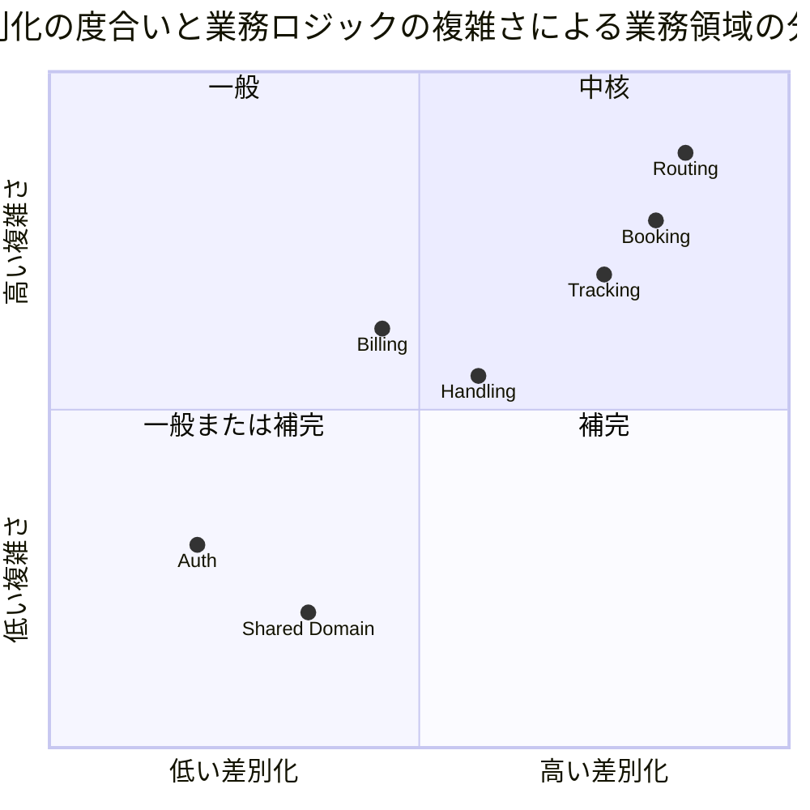

| コンテキスト | 分類 | 理由 |
| :--- | :--- | :--- |
| **Routing** | 中核 | 航海スケジュール・寄港地接続・港湾制約・貨物種別を考慮した最適経路自動算出は競合優位性そのもの |
| **Booking** | 中核 | 予約状態遷移と Saga（経路 → 追跡発行）はビジネスの基幹プロセス |
| **Tracking** | 中核（寄り） | リアルタイム追跡・例外管理は荷主との信頼関係を作る差別化要因 |
| **Handling** | 補完 | 荷役記録の正確性は基盤だが業界共通の業務 |
| **Billing** | 補完 | 法人割引計算は固有だが精算自体は業界共通 |
| **Auth** | 一般または補完 | 認証・認可は汎用機能。差別化要因にはならない |
| **Shared Domain** | 一般または補完 | UN/LOCODE 等の国際標準。差別化なし |

## ユビキタス言語の用語集

ドメインエキスパートと開発者の認識を揃えるための用語集。日本語と英語、コード上の識別子を対応付ける。

### コア概念

| 日本語 | 英語 | コード識別子 | 説明 |
| :--- | :--- | :--- | :--- |
| 貨物 | Cargo | `Cargo` | 輸送対象となる荷物。予約単位の集約ルート |
| 予約 | Booking | `Cargo` 集約 | 貨物の輸送予約。`BookingId` で識別 |
| 予約番号 | Booking ID | `BookingId` | 予約を識別する一意な番号 |
| 追跡番号 | Tracking Number | `TrackingNumber` | 荷主が貨物を追跡するための一意な番号 |
| 経路仕様 | Route Specification | `RouteSpecification` | 出発地・目的地・到着期限の指定 |
| 旅程 | Itinerary | `CargoItinerary` | 確定した輸送区間（Leg）の順序付き列 |
| 輸送区間 | Leg | `Leg` | 航海単位の輸送区間（出発港・到着港・日時・航海番号） |
| 航海 | Voyage | `Voyage` | 運送会社が運航する 1 つの航海。集約ルート |
| 航海番号 | Voyage Number | `VoyageNumber` | 航海を識別する一意な番号（運送会社独自） |
| 運搬移動 | Carrier Movement | `CarrierMovement` | 航海内の港間移動 |
| 経由港 | Port of Call | `Location` | 寄港地。UN/LOCODE で表現 |
| 港湾コード | UN/LOCODE | `UnLocode` | 国連が定める港湾識別コード（例: `JPTYO`） |
| 荷主 | Shipper | `Shipper` | 貨物の依頼主。個人または法人 |
| 荷受人 | Consignee | `Consignee` | 貨物を受け取る人 |
| 法人契約 | Corporate Contract | `CorporateContract` | 法人荷主の割引契約 |
| 追跡活動 | Tracking Activity | `TrackingActivity` | 貨物の追跡状況。集約ルート |
| 輸送ステータス | Transport Status | `TransportStatus` | 貨物の輸送上の状態（9 値） |
| 例外事象 | Tracking Exception | `TrackingException` | 遅延・破損・紛失の例外 |
| 荷役作業 | Handling Activity | `HandlingActivity` | 港湾での積込・荷降し・受領・引取作業。集約ルート |
| 荷役タイプ | Handling Type | `HandlingType` | 荷役作業の種別 |
| 請求書 | Invoice | `Invoice` | 輸送料金の請求書。集約ルート |
| 金額 | Money | `Money` | 通貨と数量を伴う金額値 |

### 状態遷移

| 状態タイプ | 日本語 | 英語（コード） |
| :--- | :--- | :--- |
| 予約状態 | 仮受付 | `PRELIMINARY` |
| | 経路設計中 | `ROUTING` |
| | 経路提案中 | `ROUTE_PROPOSED` |
| | 予約確定 | `CONFIRMED` |
| | 追跡番号発行済 | `TRACKING_ISSUED` |
| | 輸送中 | `IN_TRANSIT` |
| | 配送完了 | `DELIVERED` |
| | 精算済 | `SETTLED` |
| | キャンセル | `CANCELLED` |
| 輸送ステータス | 未受領 | `NOT_RECEIVED` |
| | 受領済 | `RECEIVED` |
| | 積込済 | `LOADED` |
| | 輸送中 | `IN_TRANSIT` |
| | 荷降し済 | `UNLOADED` |
| | 引取待ち | `AWAITING_CLAIM` |
| | 引取済（配送完了） | `DELIVERED` |
| | 誤配送 | `MISROUTED` |
| | 例外発生 | `EXCEPTION` |
| 荷役タイプ | 受領 | `RECEIVE` |
| | 積込 | `LOAD` |
| | 荷降し | `UNLOAD` |
| | 引取 | `CLAIM` |
| | 税関通過 | `CUSTOMS` |
| 経路設定状態 | 未設定 | `NOT_ROUTED` |
| | 設定済 | `ROUTED` |
| | 誤設定 | `MISROUTED` |
| 例外種別 | 遅延 | `DELAY` |
| | 破損 | `DAMAGE` |
| | 紛失 | `LOSS` |
| 精算状態 | 算出待ち | `PENDING` |
| | 算出済 | `CALCULATED` |
| | 請求済 | `INVOICED` |
| | 入金済 | `PAID` |
| | 督促中 | `OVERDUE` |

## アクターとコンテキストの対応

レビュー指摘 M5 に対応。どのアクターがどのコンテキストを使用するかを明示する。

| アクター | Auth | Booking | Routing | Tracking | Handling | Billing |
| :--- | :--: | :--: | :--: | :--: | :--: | :--: |
| 荷主 | ◯ | ◯ | | ◯（参照） | | ◯（精算書受領） |
| 荷受人 | ◯ | | | ◯（参照） | | |
| 営業担当者 | ◯ | ◎ | | | | |
| 経路設計者 | ◯ | ◯ | ◎ | | | |
| 追跡管理者 | ◯ | | | ◎ | | |
| 荷役作業員 | ◯ | | | | ◎ | |
| 経理担当者 | ◯ | | | | | ◎ |
| システム管理者 | ◎ | | | | | |

凡例: ◎ 主たる利用、◯ 参照・付随的利用

## コンテキストマップ

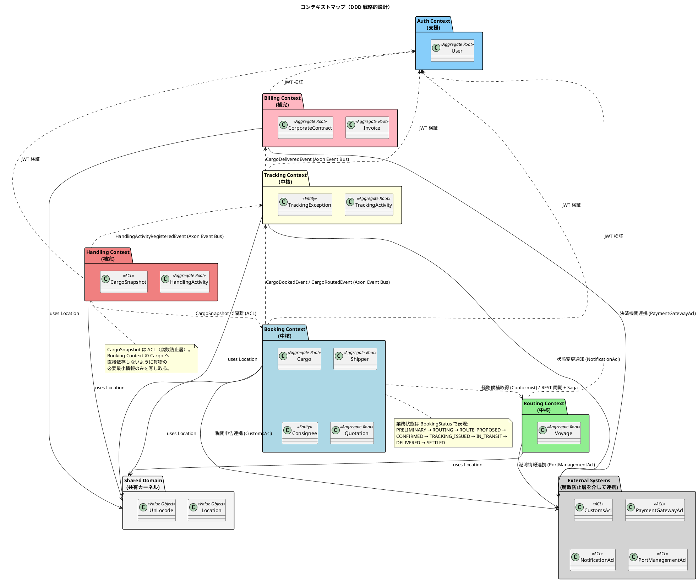

## Shared Domain（共有カーネル）

すべてのコンテキストで参照される基本値オブジェクト。変更頻度が低く、ビジネス全体で共通の概念に限定する。

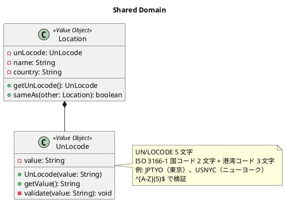

### 不変条件

- `UnLocode` は 5 文字の英大文字のみ受け入れる（`^[A-Z]{5}$`）
- `Location` の同一性は `UnLocode` の値で判定する

## Booking Context（中核ドメイン）

予約・荷主・見積を担う中核コンテキスト。Saga（`BookingSagaManager`）で経路割当 → 追跡番号発行まで連動する。

```plantuml
@startuml
title Booking Context

class Cargo <<Aggregate Root>> {
  - bookingId: BookingId
  - shipperId: ShipperId
  - cargoSpec: CargoSpecification
  - routeSpecification: RouteSpecification
  - itinerary: CargoItinerary
  - bookingStatus: BookingStatus
  - routingStatus: RoutingStatus
  - trackingNumber: TrackingNumber
  - estimatedAmount: Money
  + handle(BookCargoCommand)
  + handle(AssignRouteToCargoCommand)
  + handle(ChangeDestinationCommand)
  + handle(AssignTrackingDetailsCommand)
  + handle(ConfirmBookingCommand)
  + handle(CancelBookingCommand)
  + apply(events): void
}

class BookingId <<Value Object>> {
  - value: String
  + BookingId(String)
  + getValue(): String
}

class TrackingNumber <<Value Object>> {
  - value: String
  + TrackingNumber(String)
  + getValue(): String
}

class CargoSpecification <<Value Object>> {
  - cargoType: CargoType
  - weightKg: BigDecimal
  - dimensions: Dimensions
  - quantity: int
  - productName: String
  - hazardInfo: HazardInfo (optional)
  - temperatureCondition: TemperatureCondition (optional)
}

class HazardInfo <<Value Object>> {
  - imoClass: String
  - unNumber: String
  - declaration: String
}

class TemperatureCondition <<Value Object>> {
  - minCelsius: BigDecimal
  - maxCelsius: BigDecimal
}

class Dimensions <<Value Object>> {
  - lengthCm: int
  - widthCm: int
  - heightCm: int
}

class RouteSpecification <<Value Object>> {
  - origin: Location
  - destination: Location
  - arrivalDeadline: LocalDate
}

class CargoItinerary <<Value Object>> {
  - legs: List<Leg>
  + isEmpty(): boolean
  + finalArrivalDate(): LocalDate
  + finalDestination(): Location
  + isExpected(handlingActivity: HandlingType, location: Location): boolean
}

class Leg <<Value Object>> {
  - voyageNumber: VoyageNumber
  - loadLocation: Location
  - unloadLocation: Location
  - loadDate: LocalDateTime
  - unloadDate: LocalDateTime
}

class VoyageNumber <<Value Object>> {
  - value: String
}

class Money <<Value Object>> {
  - amount: BigDecimal
  - currency: Currency
  + add(Money): Money
  + subtract(Money): Money
  + multiply(BigDecimal): Money
  + applyDiscount(rate: Percentage): Money
}

enum CargoType {
  GENERAL
  HAZARDOUS
  REFRIGERATED
}

enum BookingStatus {
  PRELIMINARY
  ROUTING
  ROUTE_PROPOSED
  CONFIRMED
  TRACKING_ISSUED
  IN_TRANSIT
  DELIVERED
  SETTLED
  CANCELLED
}

enum RoutingStatus {
  NOT_ROUTED
  ROUTED
  MISROUTED
}

class Shipper <<Aggregate Root>> {
  - shipperId: ShipperId
  - shipperType: ShipperType
  - name: ShipperName
  - address: Address
  - contact: ContactInfo
  - corporateContract: CorporateContract (optional)
  + handle(RegisterShipperCommand)
  + handle(UpdateContactCommand)
  + handle(AssignCorporateContractCommand)
}

class ShipperId <<Value Object>>
class ShipperName <<Value Object>>
class Address <<Value Object>>
class ContactInfo <<Value Object>> {
  - email: Email
  - phone: PhoneNumber
}
class Email <<Value Object>>
class PhoneNumber <<Value Object>>

enum ShipperType {
  INDIVIDUAL
  CORPORATE
}

class CorporateContract <<Value Object>> {
  - contractNumber: String
  - discountRate: Percentage  ' null 可（IT10 / US31）
}

note bottom of CorporateContract
  discountRate は IT10 / US31 で null 許容に拡張。
  RestShipperInfoAcl の Circuit Breaker OPEN 時 fallback として
  「未確定」状態を null で表現し、S23 で「割引率未確定」
  alert-warning を表示して経理担当者の判断を仰ぐ。
  IT8 の fallback「discountRate=0（個人扱い）」は法人荷主の
  誤適用リスクがあったため、IT10 M3 対応で null fallback に変更。
end note

class Percentage <<Value Object>> {
  - value: BigDecimal
  + Percentage(value: BigDecimal)
  + apply(amount: Money): Money
}

class Consignee <<Entity>> {
  - consigneeId: ConsigneeId
  - name: String
  - contact: ContactInfo
}

class ConsigneeId <<Value Object>>

class Quotation <<Aggregate Root>> {
  - quotationId: QuotationId
  - routeSpec: RouteSpecification
  - cargoSpec: CargoSpecification
  - candidateRoutes: List<RouteCandidate>
  - estimatedAmount: Money
  - validUntil: LocalDate
  + handle(CreateQuotationCommand)
  + handle(SelectRouteCandidateCommand)
}

class QuotationId <<Value Object>>

class RouteCandidate <<Value Object>> {
  - itinerary: CargoItinerary
  - estimatedDays: int
  - estimatedCost: Money
}

Cargo *-- BookingId
Cargo *-- CargoSpecification
Cargo *-- RouteSpecification
Cargo *-- CargoItinerary
Cargo *-- BookingStatus
Cargo *-- RoutingStatus
Cargo *-- "0..1" TrackingNumber
Cargo *-- "0..1" Money

CargoSpecification *-- CargoType
CargoSpecification *-- Dimensions
CargoSpecification *-- "0..1" HazardInfo
CargoSpecification *-- "0..1" TemperatureCondition

RouteSpecification *-- Location
CargoItinerary "1" *-- "1..*" Leg
Leg *-- VoyageNumber
Leg *-- Location

Shipper *-- ShipperId
Shipper *-- ShipperType
Shipper *-- ShipperName
Shipper *-- Address
Shipper *-- ContactInfo
Shipper *-- "0..1" CorporateContract
ContactInfo *-- Email
ContactInfo *-- PhoneNumber
CorporateContract *-- Percentage

Consignee *-- ConsigneeId
Consignee *-- ContactInfo

Quotation *-- QuotationId
Quotation *-- "1..*" RouteCandidate
RouteCandidate *-- CargoItinerary
RouteCandidate *-- Money

@enduml
```

### Cargo 集約の不変条件

- `BookingId` は不変。一度発行されたら変更不可
- `bookingStatus = CONFIRMED` 未満では `TrackingNumber` を持たない
- `routingStatus = ROUTED` の状態で `AssignRouteToCargoCommand` を再度受けると `IllegalStateException`
- `bookingStatus = CANCELLED` の Cargo はそれ以降のコマンドを受け付けない
- `CargoItinerary.legs` は 1 件以上、時刻昇順、`leg[i].unloadLocation == leg[i+1].loadLocation` を満たす（M8 対応）
- `CargoSpecification.cargoType = HAZARDOUS` の場合、`hazardInfo` は必須
- `CargoSpecification.cargoType = REFRIGERATED` の場合、`temperatureCondition` は必須
- `Money` の通貨は集約内で一貫している必要がある（混在不可）

### Shipper 集約の不変条件

- `shipperType = CORPORATE` の場合、`corporateContract` は必須
- `corporateContract.discountRate` は 0% 以上 30% 以下、または null（IT10 / US31、Circuit Breaker OPEN 時 fallback の「未確定」状態）。null 時は Invoice 集約は割引適用を保留し、S23 で alert-warning を表示
- `Email` の同一性は予約検索のキーとなる（重複検出用に Projection 側でインデックス）

### ドメインイベント

| イベント | 発生コマンド | 内容 |
| :--- | :--- | :--- |
| `CargoBookedEvent` | `BookCargoCommand` | 予約登録完了。Saga 開始 |
| `CargoRoutedEvent` | `AssignRouteToCargoCommand` | 経路確定 |
| `CargoDestinationChangedEvent` | `ChangeDestinationCommand` | 仕向地変更 |
| `CargoTrackedEvent` | `AssignTrackingDetailsCommand` | 追跡番号発行・Saga 終了 |
| `BookingConfirmedEvent` | `ConfirmBookingCommand` | 予約正式確定 |
| `BookingCancelledEvent` | `CancelBookingCommand` | 予約キャンセル |
| `ShipperRegisteredEvent` | `RegisterShipperCommand` | 荷主登録 |
| `CorporateContractAssignedEvent` | `AssignCorporateContractCommand` | 法人契約割当 |
| `QuotationCreatedEvent` | `CreateQuotationCommand` | 見積作成 |

## Routing Context（中核ドメイン）

航海スケジュール管理と最適経路の自動算出を担う。

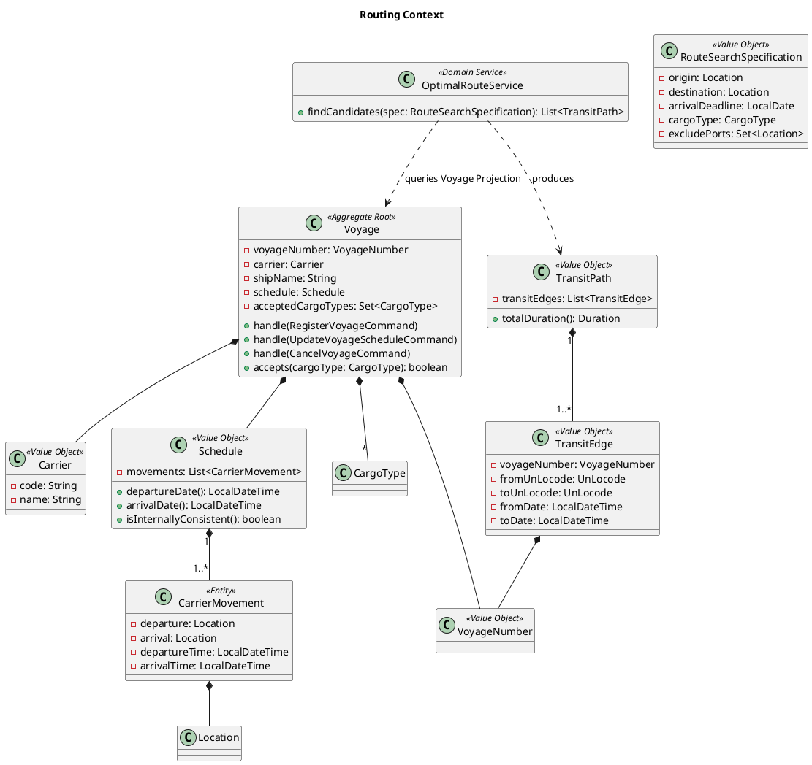

### Voyage 集約の不変条件

- 同一 `VoyageNumber` は 1 つだけ存在する
- `Schedule.movements` は時刻昇順、連続する移動の `arrival.location` と次の `departure.location` は同一
- `CarrierMovement.arrivalTime` は `departureTime` より後
- `acceptedCargoTypes` が空の場合は一般貨物のみ受け入れる
- スケジュール更新時は既存予約への影響をイベントで通知する（`VoyageScheduleUpdatedEvent` → `Booking` 側で要監視）

### ドメインイベント

| イベント | 発生コマンド | 内容 |
| :--- | :--- | :--- |
| `VoyageRegisteredEvent` | `RegisterVoyageCommand` | 航海スケジュール登録 |
| `VoyageScheduleUpdatedEvent` | `UpdateVoyageScheduleCommand` | スケジュール更新 |
| `VoyageCancelledEvent` | `CancelVoyageCommand` | 航海キャンセル |

### ドメインサービス

`OptimalRouteService` は Voyage の集約境界を超えてグラフ探索を行うため、集約に属さない**ドメインサービス**として実装する。Projection を参照し、Dijkstra/A* 等で最短経路を算出する。

## Tracking Context（中核ドメイン）

貨物の位置・状態の追跡と例外管理を担う。Event Sourcing の効果が最も顕著なコンテキスト。

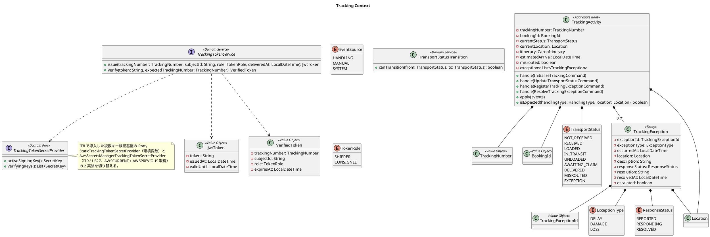

### TransportStatus 状態遷移

レビュー指摘 H1 に対応した 9 値の状態遷移。

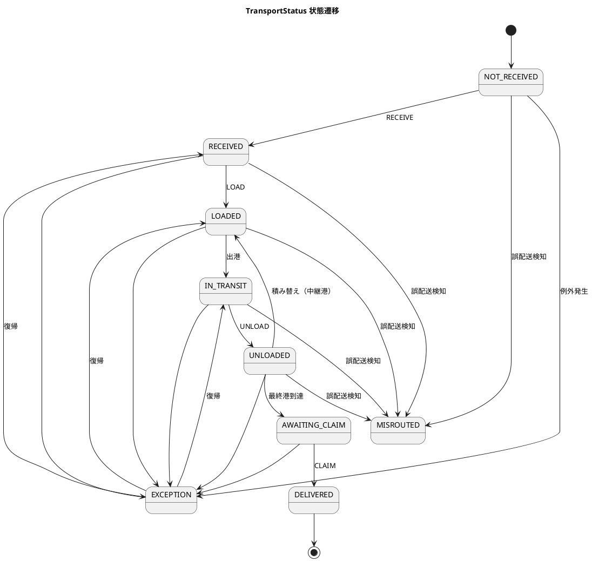

### TrackingActivity 集約の不変条件

- `TransportStatus` の遷移は `TransportStatusTransition.canTransition` が許可するもののみ
- `MISROUTED` 状態の場合 `misrouted = true`
- `TrackingException` は時系列で記録され、不変（解決時は `responseStatus` を更新）
- `EXCEPTION` 状態から復帰する場合、必ず `ExceptionType` の `responseStatus = RESOLVED` を経由する

### ドメインイベント

| イベント | 発生コマンド | 内容 |
| :--- | :--- | :--- |
| `TrackingInitializedEvent` | `InitializeTrackingCommand` | 追跡開始（Booking からの連携） |
| `TransportStatusUpdatedEvent` | `UpdateTransportStatusCommand` | 状態遷移 |
| `CargoMisroutedEvent` | （内部で発火） | 誤配送検知 |
| `TrackingExceptionRegisteredEvent` | `RegisterTrackingExceptionCommand` | 例外発生 |
| `TrackingExceptionResolvedEvent` | `ResolveTrackingExceptionCommand` | 例外解決 |
| `CargoDeliveredEvent` | `UpdateTransportStatusCommand(DELIVERED)` | 配送完了。Billing への精算開始トリガー |

## Handling Context（補完）

港湾での荷役作業を記録する。レビュー H5・H6 に対応し、`CargoSnapshot` ACL で Booking への依存を隔離し、循環依存を解消した設計とする。

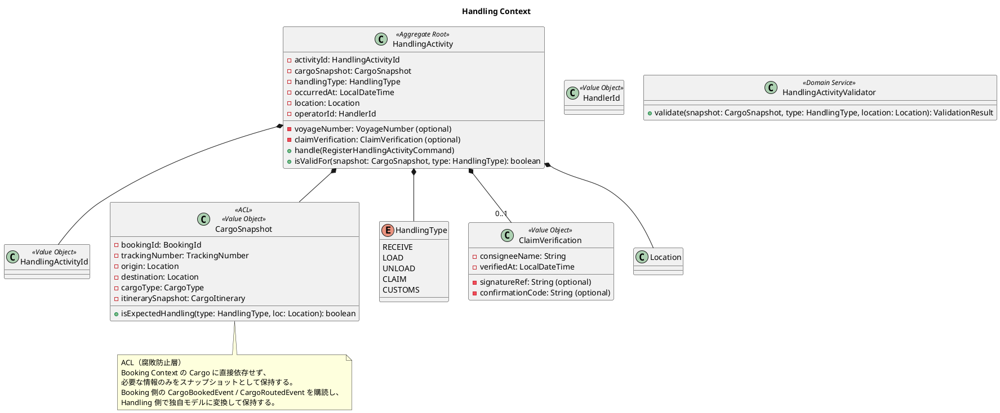

### HandlingActivity 集約の不変条件

- `handlingType = CLAIM` の場合、`claimVerification` は必須（H10 対応）
- `handlingType = LOAD` / `UNLOAD` の場合、`voyageNumber` は必須
- `occurredAt` は集約生成時より過去または同時
- `cargoSnapshot.isExpectedHandling(type, location)` が `false` の場合は警告イベントを発行（記録は許容）
- 同一 `cargoSnapshot.trackingNumber` + 同一 `handlingType` + 同一 `location` + 近接時刻（5 分以内）の重複登録を拒否

### ドメインイベント

| イベント | 発生コマンド | 内容 |
| :--- | :--- | :--- |
| `HandlingActivityRegisteredEvent` | `RegisterHandlingActivityCommand` | 荷役作業登録（Tracking へ連携） |
| `UnexpectedHandlingDetectedEvent` | （内部発火） | 予定外の場所/種別を検知 |

## Billing Context（補完）

輸送料金算出・割引適用・精算処理を担う。レビュー H2 に対応した独立コンテキスト。

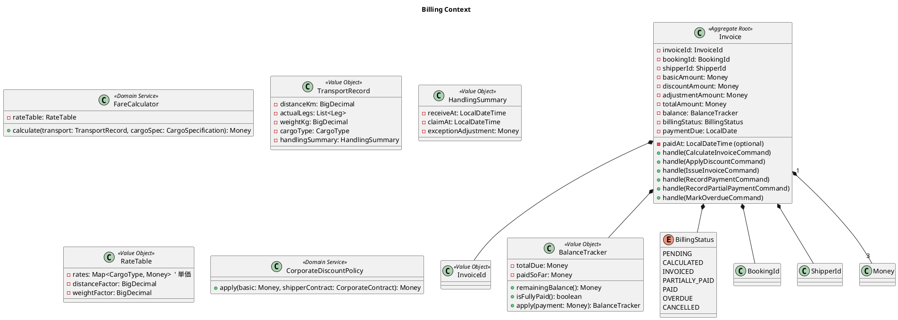

### Invoice 集約の不変条件

- `totalAmount = basicAmount - discountAmount + adjustmentAmount`（金額計算の整合）
- `billingStatus = PAID` への遷移時、`paidAt` は必須
- 通貨は集約内で一貫（混在不可）
- `paymentDue` は `INVOICED` 状態への遷移時に確定する
- `cancelled` 状態の Invoice は再発行不可（新規 Invoice を発行する）
- `PARTIALLY_PAID` 遷移は `INVOICED` または `PARTIALLY_PAID`（追加部分入金）からのみ可能（IT9 / US26）
- `balance.remainingBalance() == 0` のとき `PAID` 状態へ遷移する（`PARTIALLY_PAID` ・ `INVOICED` いずれからも）
- 単一入金 ≧ 総額の場合は `PaymentRecordedEvent`、単一入金 < 総額の場合は `PartialPaymentRecordedEvent` を発火する

### ドメインイベント

| イベント | 発生コマンド | 内容 |
| :--- | :--- | :--- |
| `InvoiceCalculatedEvent` | `CalculateInvoiceCommand` | 料金算出 |
| `DiscountAppliedEvent` | `ApplyDiscountCommand` | 法人割引適用 |
| `InvoiceIssuedEvent` | `IssueInvoiceCommand` | 請求書発行 |
| `PaymentRecordedEvent` | `RecordPaymentCommand` | 入金記録（完全入金） |
| `PartialPaymentRecordedEvent` | `RecordPartialPaymentCommand` | 部分入金記録（IT9 / US26） |
| `InvoiceOverdueEvent` | `MarkOverdueCommand` | 期日超過 |

## Auth Context（支援）

ユーザー認証・認可。Event Sourcing は適用せず、MyBatis で状態管理する。

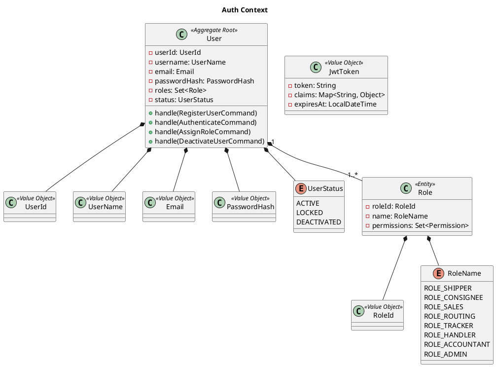

### User 集約の不変条件

- `username` と `email` はシステム全体で一意
- `passwordHash` は平文を保持しない（生成時にハッシュ化）
- `status = DEACTIVATED` の User は認証に失敗する
- 最低 1 つの `Role` を持つ

## 外部システム連携の ACL

レビュー M7 に対応。外部システムは ACL（Anti-Corruption Layer）を介して連携する。各 ACL は対応するコンテキストの `application/internal/outboundservices/acl/` に配置される。

| ACL | 連携先 | 担当コンテキスト | 主な用途 |
| :--- | :--- | :--- | :--- |
| `CustomsAcl` | 税関システム | Booking / Tracking | 通関情報の連携（輸出入申告） |
| `PaymentGatewayAcl` | 決済機関 | Billing | 入金確認・与信処理 |
| `NotificationAcl` | 通知システム（メール・SMS） | Tracking | 荷主・荷受人への状態変更通知 |
| `PortManagementAcl` | 港湾管理システム | Routing | 港湾の利用可能状況の取得 |
| `ExternalCargoRoutingService` | Routing Service | Booking | 経路候補の同期取得（内部マイクロサービス間） |

## ドメインイベント一覧（コンテキスト横断）

Axon Server を介して購読される全イベントの一覧。

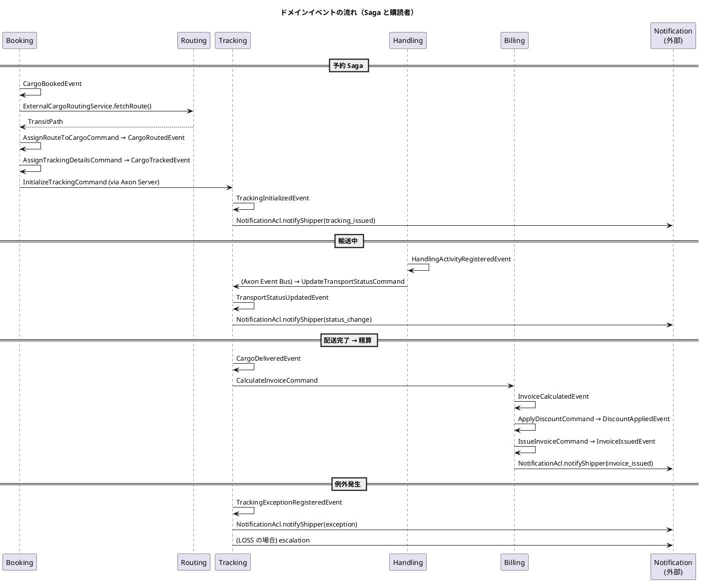

| イベント | 発行元 | 主な購読者 |
| :--- | :--- | :--- |
| `CargoBookedEvent` | Booking | Booking（Projection）, Booking（Saga 起動） |
| `CargoRoutedEvent` | Booking | Booking（Projection）, Tracking |
| `CargoDestinationChangedEvent` | Booking | Booking（Projection） |
| `CargoTrackedEvent` | Booking | Booking（Projection）, Tracking |
| `BookingConfirmedEvent` | Booking | Booking（Projection） |
| `BookingCancelledEvent` | Booking | Booking, Routing, Tracking, Handling, Billing |
| `ShipperRegisteredEvent` | Booking | Booking（Projection）, Billing |
| `QuotationCreatedEvent` | Booking | Booking（Projection） |
| `VoyageRegisteredEvent` | Routing | Routing（Projection） |
| `VoyageScheduleUpdatedEvent` | Routing | Routing, Booking, Tracking |
| `TrackingInitializedEvent` | Tracking | Tracking（Projection） |
| `TransportStatusUpdatedEvent` | Tracking | Tracking（Projection）, Notification |
| `TrackingExceptionRegisteredEvent` | Tracking | Tracking, Notification, Booking（Saga 再起動の可能性） |
| `CargoDeliveredEvent` | Tracking | Billing, Booking |
| `HandlingActivityRegisteredEvent` | Handling | Handling, Tracking, Booking |
| `InvoiceCalculatedEvent` | Billing | Billing（Projection） |
| `DiscountAppliedEvent` | Billing | Billing |
| `InvoiceIssuedEvent` | Billing | Billing, Notification |
| `PaymentRecordedEvent` | Billing | Billing, Booking |
| `PartialPaymentRecordedEvent` | Billing | Billing, Booking（IT9 / US26、Stripe webhook） |
| `InvoiceOverdueEvent` | Billing | Billing, Notification |

## コマンド一覧

| コンテキスト | コマンド | 主アクター | UC |
| :--- | :--- | :--- | :--- |
| Booking | `CreateQuotationCommand` | 営業担当者 | UC01 |
| Booking | `RegisterShipperCommand` | 営業担当者 | UC02 |
| Booking | `AssignCorporateContractCommand` | 営業担当者 | UC02 |
| Booking | `BookCargoCommand` | 営業担当者 | UC03 |
| Booking | `HandOffToRoutingCommand` | 営業担当者 | UC04 |
| Booking | `AssignRouteToCargoCommand` | Saga / 経路設計者 | UC09 |
| Booking | `ChangeDestinationCommand` | 経路設計者 | UC08 |
| Booking | `AssignTrackingDetailsCommand` | Saga / 経路設計者 | UC12 |
| Booking | `ConfirmBookingCommand` | 営業担当者 | UC11 |
| Booking | `CancelBookingCommand` | 営業担当者 | UC11（拡張） |
| Routing | `RegisterVoyageCommand` | 経路設計者 | UC19 |
| Routing | `UpdateVoyageScheduleCommand` | 経路設計者 | UC19 |
| Routing | `CancelVoyageCommand` | 経路設計者 | UC19（拡張） |
| Tracking | `InitializeTrackingCommand` | Saga | UC12 |
| Tracking | `UpdateTransportStatusCommand` | 追跡管理者 / イベント | UC14 |
| Tracking | `RegisterTrackingExceptionCommand` | 追跡管理者 | UC16 |
| Tracking | `ResolveTrackingExceptionCommand` | 追跡管理者 | UC16 |
| Handling | `RegisterHandlingActivityCommand` | 荷役作業員 | UC13 |
| Billing | `CalculateInvoiceCommand` | 経理担当者 / イベント | UC17 |
| Billing | `ApplyDiscountCommand` | 経理担当者 / 内部 | UC17 |
| Billing | `IssueInvoiceCommand` | 経理担当者 | UC18 |
| Billing | `RecordPaymentCommand` | 経理担当者 / 外部連携 | UC18 |
| Billing | `RecordPartialPaymentCommand` | Stripe webhook | UC18（IT9 / US26） |
| Billing | `MarkOverdueCommand` | 内部スケジューラ | UC18（拡張） |
| Auth | `RegisterUserCommand` | システム管理者 | - |
| Auth | `AuthenticateCommand` | 全ユーザー | - |
| Auth | `AssignRoleCommand` | システム管理者 | - |

## クエリ一覧

| コンテキスト | クエリ | 戻り型 | UC |
| :--- | :--- | :--- | :--- |
| Booking | `CargoSummaryQuery(bookingId)` | `CargoSummaryResult` | UC03, UC04, UC11 |
| Booking | `ListCargoSummariesQuery(offset, limit, status?)` | `ListCargoSummaryResult` | UC03 |
| Booking | `ShipperQuery(shipperId)` | `ShipperResult` | UC02 |
| Booking | `QuotationQuery(quotationId)` | `QuotationResult` | UC01 |
| Routing | `VoyageQuery(voyageNumber)` | `VoyageResult` | UC05, UC19 |
| Routing | `ListVoyagesQuery(filter)` | `ListVoyageResult` | UC05 |
| Routing | `OptimalRouteQuery(routeSearchSpec)` | `List<RouteCandidate>` | UC06 |
| Tracking | `TrackingQuery(trackingNumber)` | `TrackingResult` | UC15 |
| Tracking | `TrackingHistoryQuery(trackingNumber)` | `List<TrackingEvent>` | UC15 |
| Handling | `HandlingActivityHistoryQuery(trackingNumber)` | `List<HandlingActivitySummary>` | UC13 参照 |
| Billing | `InvoiceQuery(invoiceId)` | `InvoiceResult` | UC18 |
| Billing | `ListInvoicesQuery(filter)` | `ListInvoiceResult` | UC18 |

> **実装状況（ADR-0008 整合）**: `ListCargoSummariesQuery` の `status?` フィルタは IT2 時点で未実装。一覧は `offset` / `limit` のページネーションのみ対応し、Controller は `PageResponse<T> { items, totalCount, page, size }` を返す。状態絞り込みは IT3 以降で `PageRequest` を拡張して実装予定（[ADR-0008](../adr/0008-pagination-strategy.md)）。

## Saga（業務プロセス）

### BookingSagaManager（Booking Context）

予約 → 経路割当 → 追跡番号発行までを調整する。

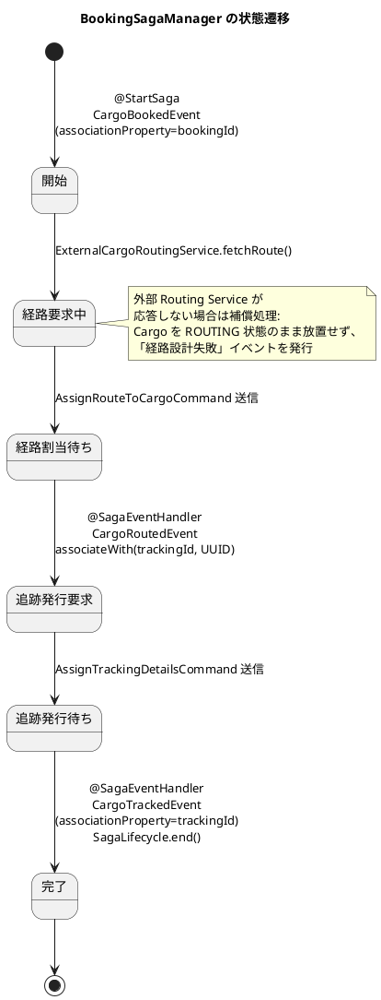

### TrackingSagaManager（Tracking Context、必要に応じて）

例外発生時の Booking Context への通知・代替ルート要求を調整する。

| 起動トリガー | 完了条件 | 補償アクション |
| :--- | :--- | :--- |
| `TrackingExceptionRegisteredEvent`（重大例外） | `TrackingExceptionResolvedEvent` または `BookingCancelledEvent` | Booking 側に再経路設計依頼を発行 |

## トレーサビリティ（UC ↔ 集約・コマンド）

| UC | 主集約 | 主コマンド | 主イベント |
| :--- | :--- | :--- | :--- |
| UC01 見積作成 | `Quotation` | `CreateQuotationCommand` | `QuotationCreatedEvent` |
| UC02 荷主登録 | `Shipper` | `RegisterShipperCommand`, `AssignCorporateContractCommand` | `ShipperRegisteredEvent`, `CorporateContractAssignedEvent` |
| UC03 貨物予約登録 | `Cargo` | `BookCargoCommand` | `CargoBookedEvent` |
| UC04 予約引渡 | `Cargo` | `HandOffToRoutingCommand` | （内部 Saga トリガー） |
| UC05 航海検索 | `Voyage` | （Query） | - |
| UC06 経路候補算出 | - | （Domain Service） | - |
| UC07 経路選択・確定 | `Cargo` | `AssignRouteToCargoCommand` | `CargoRoutedEvent` |
| UC08 経路条件調整 | `Cargo` | `ChangeDestinationCommand` | `CargoDestinationChangedEvent` |
| UC09 経路情報紐付 | `Cargo` | `AssignRouteToCargoCommand` | `CargoRoutedEvent` |
| UC10 確定経路通知 | - | （Notification ACL） | - |
| UC11 予約確定 | `Cargo` | `ConfirmBookingCommand` / `CancelBookingCommand` | `BookingConfirmedEvent` / `BookingCancelledEvent` |
| UC12 追跡番号発行 | `Cargo` | `AssignTrackingDetailsCommand` | `CargoTrackedEvent` |
| UC13 荷役作業記録 | `HandlingActivity` | `RegisterHandlingActivityCommand` | `HandlingActivityRegisteredEvent` |
| UC14 貨物状態更新 | `TrackingActivity` | `UpdateTransportStatusCommand` | `TransportStatusUpdatedEvent` |
| UC15 追跡情報照会 | - | （Query） | - |
| UC16 例外処理 | `TrackingActivity` | `RegisterTrackingExceptionCommand`, `ResolveTrackingExceptionCommand` | `TrackingExceptionRegisteredEvent`, `TrackingExceptionResolvedEvent` |
| UC17 輸送料金算出 | `Invoice` | `CalculateInvoiceCommand`, `ApplyDiscountCommand` | `InvoiceCalculatedEvent`, `DiscountAppliedEvent` |
| UC18 精算処理 | `Invoice` | `IssueInvoiceCommand`, `RecordPaymentCommand` | `InvoiceIssuedEvent`, `PaymentRecordedEvent` |
| UC19 航海スケジュール登録 | `Voyage` | `RegisterVoyageCommand`, `UpdateVoyageScheduleCommand` | `VoyageRegisteredEvent`, `VoyageScheduleUpdatedEvent` |

## レビュー指摘事項の対応状況

過去のドメインモデル分析レビュー（2026-03-31）の指摘を全件反映した。

### 高優先度（11 件）すべて反映

| # | 指摘 | 対応箇所 |
| :--- | :--- | :--- |
| H1 | `TransportStatus` を 9 値に拡張 | Tracking Context・状態遷移図 |
| H2 | Billing Context を追加 | Billing Context セクション |
| H3 | 荷主・荷受人エンティティを追加 | Booking Context（`Shipper` 集約・`Consignee`） |
| H4 | `BookingId` 等を値オブジェクト化 | 全コンテキストの値オブジェクト |
| H5 | Handling → Booking を ACL 経由に | `CargoSnapshot` ACL |
| H6 | 循環依存を解消 | `HandlingActivityHistory` を廃止し、履歴は Projection 側で構築 |
| H7 | `BookingStatus` 列挙型を追加 | Booking Context（9 値の業務状態） |
| H8 | 税関連携 ACL を追加 | `CustomsAcl`（外部連携） |
| H9 | 例外概念を追加 | Tracking Context（`TrackingException`, `ExceptionType`, `ResponseStatus`） |
| H10 | `HandlingActivity` の検証ルール定義 | 不変条件節および `HandlingActivityValidator` |
| H11 | `BookingAmount` → `Money` | 全コンテキストで `Money` 値オブジェクト |

### 中優先度（12 件）すべて反映

| # | 指摘 | 対応箇所 |
| :--- | :--- | :--- |
| M1 | Shared Domain 方針統一 | Shared Domain は `Location` / `UnLocode` のみ共有 |
| M2 | Tracking ↔ Handling を一方向化 | Handling → Tracking のみのイベント連携 |
| M3 | `TrackingBookingId` を値オブジェクト化 | `BookingId` の参照値オブジェクトを利用 |
| M4 | 通知ドメインイベント | `NotificationAcl` 経由で各種イベントから通知発行 |
| M5 | アクターとコンテキストの対応表 | 「アクターとコンテキストの対応」セクション |
| M6 | 英語と日本語の用語対応表 | 「ユビキタス言語の用語集」 |
| M7 | 外部システム連携 ACL を Port として定義 | 「外部システム連携の ACL」セクション |
| M8 | `CargoItinerary` の Leg 制約 | Cargo 集約の不変条件 |
| M9 | `TrackingActivity.currentStatus` の型 | `TransportStatus` で統一 |
| M10 | 貨物種別 `CargoType` の追加 | `CargoSpecification` に追加 |
| M11 | `CargoStatusUpdated` の依存方向逆転 | Tracking → Booking ではなく、Booking が Tracking のイベントを購読 |
| M12 | `TrackingActivity` と `TrackingEvent` の重複解消 | `TrackingException` のみをエンティティとし、履歴は Event Store に集約 |

### 低優先度（5 件）すべて反映

| # | 指摘 | 対応箇所 |
| :--- | :--- | :--- |
| L1 | 見積概念を追加 | Booking Context に `Quotation` 集約 |
| L2 | `UNKNOWN` ステータスの廃止 | 9 値の `TransportStatus` に未受領 = `NOT_RECEIVED` を含めて廃止 |
| L3 | コマンド入力値検証ルール | 各値オブジェクトの不変条件節 |
| L4 | `Leg → 輸送区間` の対応 | ユビキタス言語の用語集 |
| L5 | 履歴の不変性の扱い | 履歴は Event Store でイベント列として永続化、VO は廃止 |

## 設計判断と推奨事項

### 集約の粒度

- **小さく保つ**：`Cargo` 集約は `bookingId` 1 件分のみを境界とし、`Shipper` は別集約とする
- **Itinerary は値オブジェクト**：`CargoItinerary` は集約として独立させず、`Cargo` 内の値オブジェクトとする（順序・整合性を `Cargo` が保証する）
- **TrackingException はエンティティ**：解決状態が変わるためエンティティだが、Tracking Activity 集約内に閉じる

### 識別子の方針

- すべての識別子は**値オブジェクト**（不変・等価性比較あり）
- 採番は集約生成時、または Saga / Application Service で `UUID.randomUUID()` ベース
- `TrackingNumber` は荷主に共有される識別子であるため、推測されにくい形式（例: `TRK-` + 大文字英数字 10 桁）

### Axon Framework 5 との対応

- すべての集約は `@Aggregate` を付与
- コマンドハンドラは `@CommandHandler`、状態再構築は `@EventSourcingHandler`
- Saga は `@Saga` + `@StartSaga` + `@SagaEventHandler(associationProperty=...)`
- 永続化は **MyBatis Mapper**（XML / Annotation）で実装。Projection はプレーンな POJO とし、JPA アノテーションは付与しない

## 参照

- [要件定義書](../requirements/requirements_definition.md)
- [ビジネスユースケース](../requirements/business_usecase.md)
- [システムユースケース](../requirements/system_usecase.md)
- [ユーザーストーリー](../requirements/user_story.md)
- [バックエンドアーキテクチャ](architecture_backend.md)
- [フロントエンドアーキテクチャ](architecture_frontend.md)
- [ADR-0001 メッセージング基盤として Axon Framework 5 を採用する](../adr/0001-axon-framework-adoption.md)
- [ドメインモデル分析レビュー（2026-03-31）](../review/ドメインモデル分析_review_20260331.md)
- [ドメインモデル設計ガイド](../reference/ドメインモデル設計ガイド.md)
