# ドメインモデル設計 - 国際貨物輸送管理システム（Flix 版）

## 概要

本ドキュメントは、国際貨物輸送管理システムの DDD（ドメイン駆動設計）戦術的設計を定義する。システムは以下の 8 つの境界付けられたコンテキスト（Bounded Context）で構成される。

| コンテキスト | 日本語名 | 主な責務 |
|---|---|---|
| Booking Context | 予約コンテキスト | 貨物予約の受付・旅程管理・状態遷移 |
| Shipper Context | 荷主コンテキスト | 荷主の登録・管理・法人割引 |
| Routing Context | 経路コンテキスト | 航海スケジュール・経路情報の管理 |
| Tracking Context | 追跡コンテキスト | 貨物追跡・例外イベント管理 |
| Handling Context | 荷役コンテキスト | 荷役作業登録・通関申告管理 |
| Billing Context | 精算コンテキスト | 請求書発行・割引・支払い管理 |
| Estimation Context | 見積コンテキスト | 輸送見積の作成・ルート候補の管理 |
| Shared Domain | 共有ドメイン | 共有カーネル（Location・ShipperId・TransportStatus） |

各コンテキストは自律的に変更可能な集約を持ち、コンテキスト間の連携はドメインイベントおよび ACL（Anti-Corruption Layer）ポートを通じて行う。

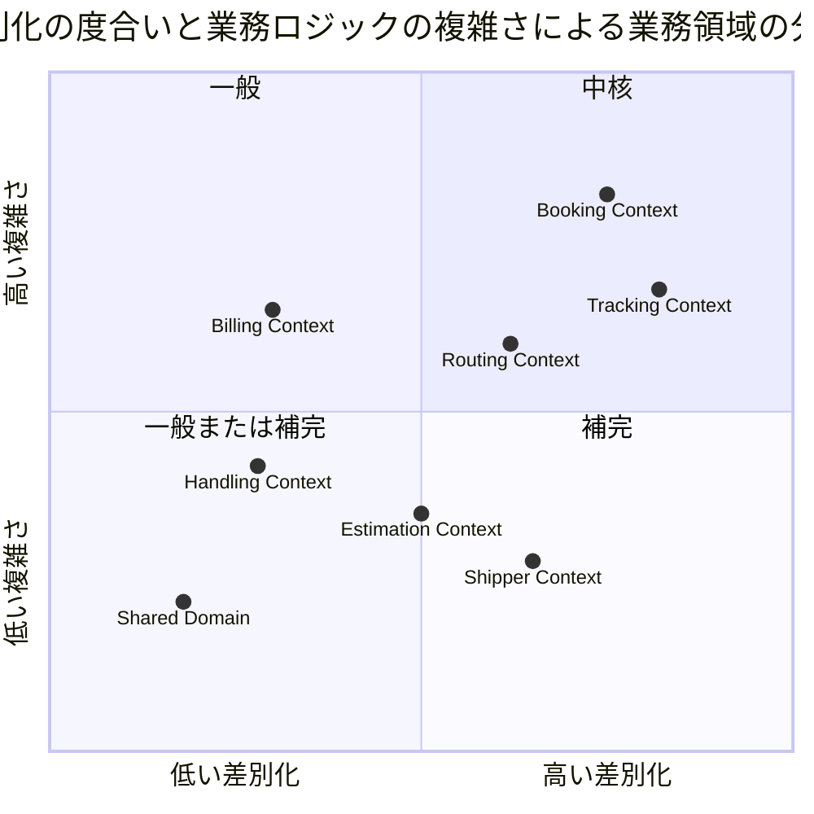

## ユビキタス言語

| 英語（コード名） | 日本語（業務用語） | 使用コンテキスト | 説明 |
|---|---|---|---|
| Cargo | 貨物 | Booking Context | 予約の中心的エンティティ。荷主から荷受人へ輸送される物品 |
| Shipper | 荷主 | Shipper Context | 貨物を発送���る主体。���人・法人の 2 種別 |
| CorporateShipper | 法人荷主 | Shipper Context | Shipper のサブタイプ。契約番号と割引率を持つ |
| Address | 住所 | Shipper Context | 荷主���住所情報（最大 500 文字） |
| Dimensions | ���法 | Booking Context | 貨物の長さ・幅���高さ（オプション） |
| Quantity | 個数 | Booking Context | 貨物の個数（オプション、1 以上） |
| Description | 品名 | Booking Context | 貨物の品名（オプション、最大 500 文字） |
| HazardousDeclaration | 危険物申告 | Booking Context | 危険物クラス・UN 番号・正式輸送品名 |
| TemperatureRequirement | 温度管理条件 | Booking Context | 最低温度・最高温度・温度単位 |
| ShipperExistenceChecker | 荷主存在確認 ACL | Booking Context | 荷主コンテキストへの存在確認ポート |
| Consignee | 荷受人 | Booking Context | 貨物を受け取る主体。氏名・住所・連絡先を保持 |
| BookingId | 予約 ID | Booking Context | 予約を一意に識別する値オブジェクト |
| RouteSpecification | ルート仕様 | Booking Context | 出発地・目的地・到着期限の要件定義 |
| CargoItinerary | 旅程 | Booking Context | 貨物の輸送経路全体。1 つ以上の Leg で構成 |
| Leg | 輸送区間 | Booking Context | 単一航海での積込港から荷降港までの区間 |
| Delivery | 配送状況 | Booking Context | 現在の輸送状態・経路状態・最終荷役イベントの集合 |
| Voyage | 航海 | Routing Context | 特定の船舶が実施する一連の運送区間 |
| Schedule | 航海スケジュール | Routing Context | 航海を構成する時系列の運送区間一覧 |
| CarrierMovement | 運送区間 | Routing Context | 出発港・到着港・出発時刻・到着時刻を持つ区間単位 |
| CargoCapability | 対応可能貨物種別 | Routing Context | 航海が運べる貨物の種別。Booking の CargoType とは別の概念 |
| TrackingActivity | 追跡レコード | Tracking Context | 貨物の追跡情報全体を管理する集約 |
| TrackingNumber | 追跡番号 | Tracking Context | 追跡活動を一意に識別する番号 |
| TrackingActivityEvent | 追跡イベント | Tracking Context | 時系列で記録される追跡の出来事 |
| TrackingExceptionEvent | 追跡例外イベント | Tracking Context | 遅延・損傷・紛失・税関保留などの例外事象 |
| HandlingActivity | 荷役作業 | Handling Context | 実際に行われた荷役作業の記録 |
| HandlingActivityHistory | 荷役履歴 | Handling Context | クエリ専用の荷役作業履歴（Read Model） |
| Invoice | 精算書 | Billing Context | 貨物輸送 1 件に対して発行される請求書 |
| DiscountPolicy | 割引方針 | Billing Context | 法人・ボリューム・シーズン割引のポリシー |
| Location | 位置情報 | Shared Domain | UN/LOCODE で識別される港湾・地点の共有カーネル |
| TransportStatus | 輸送状態 | Shared Domain | 貨物の現在の輸送フェーズを表す共有列挙型 |
| RoutingStatus | 経路状態 | Shared Domain | 経路の妥当性状態（NOT_ROUTED / ROUTED / MISROUTED） |
| BookingStatus | 予約状態 | Booking Context | 予約ライフサイクルの状態（8 値） |
| CargoType | 貨物種別 | Booking Context | GENERAL / HAZARDOUS / REFRIGERATED |
| ExceptionType | 例外種別 | Tracking Context | DELAY / DAMAGE / LOST / CUSTOMS_HOLD |
| CustomsStatus | 通関状態 | Handling Context | PENDING / CLEARED / HELD / REJECTED |
| PaymentStatus | 支払い状態 | Billing Context | PENDING / CONFIRMED / OVERDUE / REFUNDED |
| Estimate | 見積 | Estimation Context | 輸送見積の中心エンティティ。出発地・仕向地・期限・貨物種別・重量を保持。識別子は `EST-XXXXXXXX`（採番時に確定。予約の `BK-` と同じ形） |
| EstimateId | 見積 ID | Estimation Context | `EST-XXXXXXXX`。採番時に確定し URL と画面表示に使う |
| RouteCandidate | ルート候補 | Estimation Context | 見積に紐づく輸送ルート候補。**航海番号と経由港は複数**（積替のある候補）。輸送日数・見積コストを保持 |
| CargoKind | 貨物種別 | Estimation Context | GENERAL / HAZARDOUS / REFRIGERATED。**Booking の `CargoType` とは別の型**（`arch-lint` 規約 4・ADR-0002）。値が一致するのは同じ業務語彙を指すからであって、同じ型だからではない |
| EstimateStatus | 見積状態 | Estimation Context | CREATED（作成済）/ EXPIRED（期限切れ） |

## アクターとコンテキストの対応

| アクター | 対話するコンテキスト | 主要コマンド / 操作 |
|---|---|---|
| 営業担当者 | Booking Context・Estimation Context | `BookCargoCommand`・`AssignToRoutingCommand`・`ConfirmBookingCommand`・`CancelBookingCommand`・`CreateEstimateCommand` |
| 経路設計者 | Routing Context + Booking Context | `RouteCargoCommand`・`AssignTrackingNumberCommand` |
| 荷役作業員 | Handling Context | `HandlingActivityRegistrationCommand` |
| 追跡管理者 | Tracking Context | `AddTrackingEventCommand`・例外登録 |
| 荷主 | Booking Context（読取）+ Tracking Context（読取） | 追跡照会・状態確認 |
| 荷受人 | Tracking Context（読取）+ Booking Context（読取） | 到着確認・引取手続き |
| 経理担当者 | Billing Context | `GenerateInvoiceCommand`・`ConfirmPaymentCommand` |

## 境界付けられたコンテキスト概要

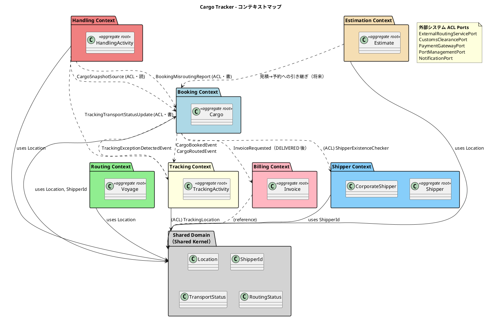

## 1. Booking Context（予約コンテキスト）

> **実装状況（本リポジトリ = Flix 実装。IT4 時点）**:
>
> - ✅ IT4 で実装: `Cargo`（集約）・`BookingId`・`ShipperId`・`RouteSpecification`・`BookingStatus`・`CargoType`・`Dimensions`・`Quantity`・`Description`・`ShipperExistenceChecker`（ACL）
> - ✅ IT5 で実装: `HazardousDeclaration`・`TemperatureRequirement`・`TemperatureUnit`（US05）、`assignToRouting`（US06）
> - ⏳ IT5 以降: `Consignee`・`CargoItinerary`・`Leg`・`Delivery`・`Money`・`CargoHandlingActivity`・`RoutingStatus`
>
> **旧記述について**: 本ドキュメントに残っていた「IT1/IT2 実装状況（2026-04-xx 完了）」は
> `tmp/case-study-cargo-tracker`（Jakarta EE 参考実装）の実績であり、本リポジトリの
> ものではない。IT4 のレビューで、`HazardousDeclaration` を「実装済み」としながら
> 実装側は「IT5 以降」と書いている矛盾が検出された。

### ドメインモデル図

```plantuml
@startuml
title Booking Context - ドメインモデル

package "Aggregate（集約）" {
  class Cargo <<aggregate root>> {
    -bookingId: BookingId
    -shipperId: ShipperId
    -consignee: Consignee
    -routeSpecification: RouteSpecification
    -cargoItinerary: CargoItinerary
    -delivery: Delivery
    -bookingAmount: Money
    -bookingStatus: BookingStatus
    -cargoType: CargoType
    -dimensions: Dimensions
    -quantity: Quantity
    -description: Description
    -hazardousDeclaration: HazardousDeclaration
    -temperatureRequirement: TemperatureRequirement
  }
}

package "Value Objects（値オブジェクト）" {
  class BookingId <<value object>> {
    -id: String
  }
  class ShipperId <<value object>> {
    -id: String
    -shipperType: ShipperType
  }
  class Consignee <<value object>> {
    -name: String
    -address: String
    -contactEmail: String
  }
  class RouteSpecification <<value object>> {
    -origin: Location
    -destination: Location
    -arrivalDeadline: Date
    +isSatisfiedBy(itinerary): boolean
  }
  class CargoItinerary <<value object>> {
    -legs: List<Leg>
    +expectedArrivalTime(): Date
  }
  class Leg <<value object>> {
    -loadLocation: Location
    -unloadLocation: Location
    -loadTime: Date
    -unloadTime: Date
    -voyage: VoyageNumber
  }
  class Delivery <<value object>> {
    -transportStatus: TransportStatus
    -routingStatus: RoutingStatus
    -lastCargoHandledEvent: CargoHandlingActivity
  }
  class Money <<value object>> {
    -amount: BigDecimal
    -currency: CurrencyCode
    +add(other: Money): Money
    +multiply(factor: BigDecimal): Money
  }
  class CargoHandlingActivity <<value object>> {
    -handlingType: String
    -location: Location
    -completionTime: Date
  }
  enum BookingStatus {
    PRELIMINARY
    ROUTE_PROPOSED
    CONFIRMED
    TRACKING_ISSUED
    IN_TRANSIT
    DELIVERED
    SETTLED
    CANCELLED
  }
  enum ShipperType {
    INDIVIDUAL
    CORPORATE
  }
  class Dimensions <<value object>> {
    -length: BigDecimal
    -width: BigDecimal
    -height: BigDecimal
  }
  class Quantity <<value object>> {
    -value: int
  }
  class Description <<value object>> {
    -value: String
  }
  class HazardousDeclaration <<value object>> {
    -hazardousClass: String
    -unNumber: String
    -properShippingName: String
  }
  class TemperatureRequirement <<value object>> {
    -minTemperatureMilli: Int64
    -maxTemperatureMilli: Int64
    -unit: TemperatureUnit
  }
  enum CargoType {
    GENERAL
    HAZARDOUS
    REFRIGERATED
  }
}

note as RoutingStatusNote
  RoutingStatus は Shared Domain の共有カーネルで定義する
  （NOT_ROUTED / ROUTED / MISROUTED）。
  Booking Context は Delivery を通じてこれを参照するだけで、
  独自の列挙型は持たない。
end note

interface ShipperExistenceChecker <<ACL Port>> {
  +exists(shipperId: ShipperId): boolean
}

Cargo *-- BookingId
Cargo *-- ShipperId
Cargo *-- Consignee
Cargo *-- RouteSpecification
Cargo *-- CargoItinerary
Cargo *-- Delivery
Cargo *-- Money
Cargo *-- BookingStatus
Cargo *-- CargoType
Cargo *-o Dimensions
Cargo *-o Quantity
Cargo *-o Description
Cargo *-o HazardousDeclaration
Cargo *-o TemperatureRequirement
ShipperId *-- ShipperType
CargoItinerary *-- Leg

@enduml
```

### 集約・エンティティ・値オブジェクト一覧

| 種別 | クラス名 | 日本語名 | 責務 |
|---|---|---|---|
| 集約ルート | Cargo | 貨物 | 予約の中心。状態遷移・旅程・配送状況を統括 |
| 値オブジェクト | BookingId | 予約 ID | 予約の一意識別 |
| 値オブジェクト | ShipperId | 荷主識別子 | 荷主 ID と種別（個人・法人）の保持 |
| 値オブジェクト | Consignee | 荷受人情報 | 荷受人の名前・住所・連絡先メール |
| 値オブジェクト | RouteSpecification | ルート仕様 | 出発地・目的地・到着期限の要件定義 |
| 値オブジェクト | CargoItinerary | 旅程 | 輸送区間（Leg）の集合と到着時刻計算 |
| 値オブジェクト | Leg | 輸送区間 | 単一航海での積込港から荷降港までの区間 |
| 値オブジェクト | Delivery | 配送状況 | 現在の輸送状態・経路状態・最終荷役イベント |
| 値オブジェクト | Money | 金額 | 金額と通貨コードのペア。多通貨対応 |
| 値オブジェクト | CargoHandlingActivity | 荷役活動（参照用） | 最終荷役イベントの記録 |
| 列挙型 | BookingStatus | 予約状態 | 8 段階の予約ライフサイクル |
| 列挙型 | ShipperType | 荷主種別 | INDIVIDUAL / CORPORATE |
| 値オブジェクト | Dimensions | 寸法 | 貨物の長さ・幅・高さ（オプション） |
| 値オブジェクト | Quantity | 個数 | 貨物の個数（1 以上、オプション） |
| 値オブジェクト | Description | 品名 | 貨物の品名（最大 500 文字、オプション） |
| 値オブジェクト | HazardousDeclaration | 危険物申告 | 危険物クラス・UN 番号・正式輸送品名 |
| 値オブジェクト | TemperatureRequirement | 温度管理条件 | 最低/最高温度（**千分の一度の整数**）・温度単位 |
| 列挙型 | TemperatureUnit | 温度単位 | CELSIUS / FAHRENHEIT |
| 列挙型 | CargoKind | 貨物種別 | GENERAL / HAZARDOUS / REFRIGERATED。**Booking の `CargoType` とは別の型**（`arch-lint` 規約 4） |
| 列挙型 | RoutingStatus | 経路状態 | NOT_ROUTED / ROUTED / MISROUTED |
| ACL ポート | ShipperExistenceChecker | 荷主参照解決 | Shipper Context への ACL。荷主コードから荷主 ID を解決し、荷主 ID から**表示に足る情報（コード・氏名 / 社名）だけ**を引く |

> **温度を固定小数点整数で持つ理由（IT5 で確定）**: 当初 `BigDecimal` としていたが、
> IT4 で割引率（万分率）・重量（グラム）に採った方針に揃え、**千分の一度の整数**とした。
> 浮動小数点の誤差を料金や積載判定へ持ち込まない。DB は `NUMERIC(10,3)`（度）で、
> 境界で変換する。詳細は ADR-0006 を参照。
>
> **温度単位は摂氏・華氏の両方を残す（IT6 で確定）**: IT5 の引き継ぎで
> 「摂氏固定にするか」を保留していた。**残す**と決めた。荷主が仕様書の値を
> そのまま入力できることに意味があり、入力時に換算させると換算ミスが持ち込まれる。
> 単位は保存し、**未知の単位は既定値へ倒さない**（華氏 -13°F を -13°C として
> 読むと 12 度ずれ、冷凍と冷蔵が入れ替わる）。表示・検索は単位を伴って行う。

> **実装形との差**: `Dimensions`・`Quantity`・`Description` は本表で値オブジェクトと
> しているが、実装（IT4）はそれぞれ `Option[(Int32, Int32, Int32)]`（ミリメートル）・
> `Option[Int32]`・`Option[String]` のままである。値オブジェクト化は独立した変更として
> 扱う（他の変更と混ぜると失敗の切り分けができなくなる）。

### ビジネスルール

1. 貨物は必ず BookingId・ShipperId・CargoType を持つ
2. RouteSpecification の出発地と目的地は異なる（UN/LOCODE 形式で検証）
3. CargoItinerary は 1 つ以上の Leg で構成される。`Leg[n].unloadLocation == Leg[n+1].loadLocation` の連結制約を満たす必要がある
4. BookingStatus の遷移は `PRELIMINARY → ROUTE_PROPOSED → CONFIRMED → TRACKING_ISSUED → IN_TRANSIT → DELIVERED → SETTLED` の順に進む。いずれの状態からも CANCELLED に遷移可能
   - 例外（US13・IT9）: 確定済みの予約は営業担当者が**経路設計へ差し戻す**ことができ、`CONFIRMED → ROUTE_PROPOSED` の逆行が 1 箇所だけ許される。差し戻し時は割り当て済みの CargoItinerary を外し、RoutingStatus を NOT_ROUTED に戻す
   - BookingStatus と RoutingStatus は**独立した 2 軸**である。経路の割り当て（US09・US11）は RoutingStatus だけを動かし、BookingStatus は営業担当者の確定（US13）まで ROUTE_PROPOSED のまま保たれる
5. CORPORATE ShipperType の荷主は割引適用の対象となる（割引率上限 30%）
6. HAZARDOUS / REFRIGERATED の CargoType は指定港のみ取扱可能
7. HAZARDOUS CargoType の場合、HazardousDeclaration は必須
8. REFRIGERATED CargoType の場合、TemperatureRequirement は必須
9. Booking Context は Shipper Context に直接依存せず、ShipperExistenceChecker ACL ポートを通じて荷主を確認する

> **ルール 9 の実装形（IT4 で確定）**: ポートの操作は `exists(shipperId)` ではなく
> **`resolveShipperId(shipperCode): Option[String]`** とする。
>
> 利用者が目にする荷主の識別子は**荷主コード**（`SHP-XXXXXXXX`）であり、内部識別子（UUID）ではない。
> 予約フォームが UUID を求める形にすると、荷主一覧に UUID が出ていない限り
> **利用者は予約を完了できない**。IT4 の受入テストを「利用者と同じ経路で識別子を得る」形で
> 書いたことで、この行き止まりに気付いた。
>
> 解決は存在確認を兼ねる（`None` なら存在しない）。返すのは識別子だけであり、
> 氏名や割引率までは返さない。返せる形にすると、いずれ「ついでに氏名も」と越境が始まる。

### コマンド一覧

| コマンド | 実行アクター | 主な処理 |
|---|---|---|
| BookCargoCommand | 営業担当者 | 貨物予約の新規登録（PRELIMINARY 状態で作成） |
| AssignToRoutingCommand | 営業担当者 | 予約情報を経路設計者に引き渡す（PRELIMINARY → ROUTE_PROPOSED に遷移） |
| ConfirmBookingCommand | 営業担当者 | 予約を確定する（ROUTE_PROPOSED → CONFIRMED に遷移。経路が割り当て済み（RoutingStatus = ROUTED）であることが前提） |
| CancelBookingCommand | 営業担当者 | 予約をキャンセルする（CANCELLED に遷移） |
| RouteCargoCommand | 経路設計者 | CargoItinerary を Cargo に割り当て、RoutingStatus を NOT_ROUTED → ROUTED に遷移させる（BookingStatus は ROUTE_PROPOSED のまま変わらない） |
| AssignTrackingNumberCommand | 経路設計者 | TrackingNumber を Cargo に紐付け、TRACKING_ISSUED に遷移 |
| UpdateBookingStatusCommand | システム | BookingStatus の状態遷移を更新 |

## 2. Shipper Context（荷主コンテキスト）

> **実装状況（本リポジトリ = Flix 実装。IT4 時点）**:
>
> - ✅ IT4 で実装: `Shipper`（集約）・`ShipperCode`・`ShipperName`・`Email`・`Phone`・`Address`・`ContractNumber`・`DiscountRate`・`ShipperType`・`ShipperRepo`（ポート。設計名は `ShipperRepository`。実装名は既存ポートの命名に合わせた）
> - `CorporateShipper` は継承ではなく、`Shipper` が `ShipperType` と法人固有フィールド（オプション）を持つ形で表す（Flix に継承はない）

### ドメインモデル図

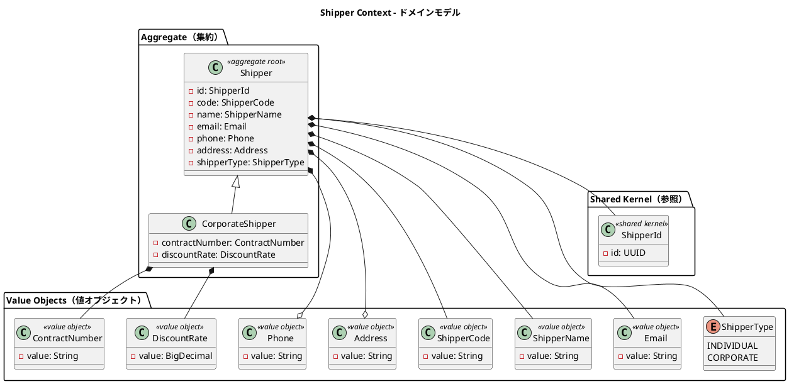

### 集約・エンティティ・値オブジェクト一覧

| 種別 | クラス名 | 日本語名 | 責務 |
|---|---|---|---|
| 集約ルート | Shipper | 荷主 | 荷主情報の管理。個人・法人の 2 種別 |
| エンティティ | CorporateShipper | 法人荷主 | Shipper のサブタイプ。契約番号と割引率を追加保持 |
| 値オブジェクト | ShipperCode | 荷主コード | 自動生成される荷主の業務識別コード |
| 値オブジェクト | ShipperName | 荷主名 | 荷主の氏名または社名 |
| 値オブジェクト | Email | メール | メールアドレス。一意制約あり |
| 値オブジェクト | Phone | 電話番号 | 電話番号（オプション） |
| 値オブジェクト | Address | 住所 | 住所（オプション、最大 500 文字） |
| 値オブジェクト | ContractNumber | 契約番号 | 法人荷主の契約番号 |
| 値オブジェクト | DiscountRate | 割引率 | 法人荷主の割引率（0〜30%） |
| 列挙型 | ShipperType | 荷主種別 | INDIVIDUAL / CORPORATE |
| 共有カーネル参照 | ShipperId | 荷主識別子 | UUID ベースの一意識別子。Shared Domain に配置 |

### ビジネスルール

1. 荷主は必ず ShipperId・ShipperCode・ShipperName・Email・ShipperType を持つ
2. Email はシステム全体で一意（`EmailAlreadyRegisteredException` で重複検出）
3. CORPORATE ShipperType の場合、CorporateShipper として ContractNumber と DiscountRate が必須
4. DiscountRate の値域は 0.0000〜0.3000（0%〜30%）
5. ShipperCode は自動生成（`SHP-` プレフィックス + UUID 先頭 8 文字）

> **ルール 5 の既知の限界（IT4 で実測）**: UUID の先頭 8 文字は 32 ビットしかなく、
> 誕生日問題により**約 77,000 件で 5 割の確率で衝突する**。`shipper_code` には
> 一意制約があるため、衝突した登録は失敗する（500 ではなく登録エラーとして扱われる）。
>
> **現時点では衝突を再試行しない**。件数が桁違いに増えるまで実害がなく、再試行の導入は
> コード生成の責務をアプリケーション層へ移す設計変更を伴うためである。
> 振る舞いは `JdbcShipperRepoTest.testShipperCodeCollisionIsRejected` で固定しており、
> **限界を知らないまま運用に入ることはない**。荷主が数万件規模になる見込みが立った時点で
> ADR として再検討する。

### コマンド一覧

| コマンド | 実行アクター | 主な処理 |
|---|---|---|
| RegisterShipperCommand | 営業担当者 | 荷主の新規登録。Email 重複チェックと ShipperCode 自動生成 |

## 3. Routing Context（経路コンテキスト）

### ドメインモデル図

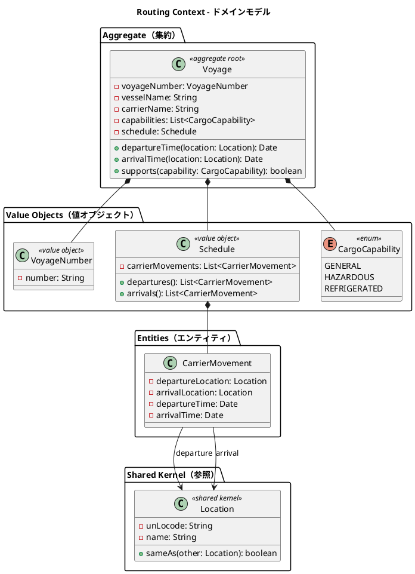

### 集約・エンティティ・値オブジェクト一覧

| 種別 | クラス名 | 日本語名 | 責務 |
|---|---|---|---|
| 集約ルート | Voyage | 航海 | 航路スケジュールを管理する中心エンティティ |
| 値オブジェクト | VoyageNumber | 航海番号 | Routing Context 固有の航海一意識別子 |
| 値オブジェクト | Schedule | 航海スケジュール | 時系列の CarrierMovement 一覧を保持 |
| エンティティ | CarrierMovement | 運送区間 | 出発地・到着地・出発時刻・到着時刻の区間単位 |
| 値オブジェクト | RouteSpec | 経路探索条件 | 出発地・仕向地・到着期限・必要な対応貨物種別（US08・IT7） |
| 値オブジェクト | RouteCandidate | 経路候補 | 区間（RouteLeg）の並び。積み替え回数・所要日数・経由港を導出する（US08・IT7） |
| 値オブジェクト | RouteLeg | 候補の区間 | 航海番号・積込港・荷降港・積込時刻・荷降時刻（US08・IT7） |
| ドメインサービス | RouteFinder | 経路探索 | 到達可能性（Datalog の推移閉包）・接続の時間整合・期限・対応種別を検証し、推奨順の候補を返す（US08・IT7） |
| 列挙型 | CargoCapability | 対応可能貨物種別 | 航海が運べる貨物の種別（`GENERAL` / `HAZARDOUS` / `REFRIGERATED`） |
| 列挙型 | VoyageError | 航海の不成立理由 | 航海として成立しない理由（Routing Context 固有） |
| 列挙型 | RouteSpecError | 探索条件の不成立理由 | 探索条件として成立しない理由（`VoyageError` と分ける。関心が違う） |
| ACL ポート | BookingRouteRequest | 経路設計依頼の照会 | Booking Context への ACL。予約から出発地・仕向地・期限・貨物種別を引き、**Routing の言葉へ翻訳する**（US08・IT7） |
| 共有カーネル参照 | Location | 位置情報 | UN/LOCODE で識別される港湾・地点 |

> **`RouteSpec` を Booking の `RouteSpecification` と共有しない**（IT7・US08）。
> 前者は「予約が要求する輸送の仕様」、後者は「経路探索へ渡す入力」であり文脈が違う。
> `CargoCapability` を `CargoType` と分けたのと同じ判断であり、予約側の項目が増えても
> 経路探索は影響を受けない。変換は ACL（`BookingRouteRequest`）が担う。
>
> **`RouteLeg` を Booking の `Leg` と共有しない**。あちらは確定した旅程の構成要素、
> こちらは候補の構成要素である。確定していないものに確定後の型を使うと、
> 「まだ選ばれていない」という状態が型から読めなくなる。

> **`CargoCapability` を Booking の `CargoType` と共有しない**（IT6・US24）。
> 前者は「この貨物は何か」、後者は「この航海は何を運べるか」であり、文脈が違う。
> 同じ列挙を共有すると BC 独立性（`arch-lint` 規約 4）に反する。
> `VoyageError` を `BookingError` と分けるのも同じ理由である。

### ビジネスルール

1. 航海は必ず一意の VoyageNumber を持つ（**利用者が決める**。採番しない）
2. Schedule は時系列順の CarrierMovement で構成される
3. CarrierMovement の出発地と到着地は異なる
4. Location は UN/LOCODE で一意に識別される（例: `JPOSA` = 大阪、`USLAX` = LA）
5. 隣り合う CarrierMovement は**連結している**（前区間の到着地 = 次区間の出発地）
6. CarrierMovement の出発時刻は到着時刻**以前**である（同一時刻は許す）
7. 航海は**少なくとも 1 つの CargoCapability を持つ**（何も運べない航海は登録できない）
8. 船名・運送会社名は必須である（US24 の受入基準 1）
9. 航海番号は**利用者が決める**（採番しない）。半角の大文字英数字とハイフン 1〜20 文字

**経路候補の算出（US08・IT7）**:

10. 貨物は航海の**任意の寄港地で積み、以降の任意の寄港地で降ろせる**（区間の部分利用）
11. 積み替えの接続は**前区間の到着時刻 ≤ 次区間の出発時刻**で成立する。**同時刻を許す**
    （ルール 6 と揃える。最低接続時間は業務ルールとして未定義であり、実装が決めない）
12. 到着期限との比較は**日付単位**で行う。期限は `DATE`、到着は `TIMESTAMP` であり、
    素朴に比較すると**期限当日に着く便がすべて刈られる**
13. 積み替えは**最大 2 回（区間 3 本）**まで。推移閉包は経路数が指数的に増え、
    業務上も 3 回以上の積み替えは採らない
14. **同じ航海を 2 度使う経路は候補にしない**（港で除外すると、同じ港へ戻ってから
    別の船で出る正当な経路まで消えるため、航海で除外する）
15. 経路の全区間が、要求された `CargoCapability` に対応していること
    （片方だけ冷凍対応でも、もう片方で解凍される）
16. 推奨順は**積み替え回数の少ない順 → 到着日時の早い順 → 航海番号の昇順**。
    直行便を最優先にするのは US08 受入基準 5 であり、到着順を上に置くと
    「より早く着く積み替え便」に直行便が沈む

### コマンド一覧

| コマンド | 実行アクター | 主な処理 |
|---|---|---|
| RegisterVoyageCommand | 経路設計者 | 新規航海スケジュールの登録 |
| UpdateScheduleCommand | 経路設計者 | 運送区間の追加・変更 |
| （照会） FindRouteCandidates | 経路設計者 | 予約番号から経路候補を求める（US08・IT7。**状態を変えない**） |

## 4. Tracking Context（追跡コンテキスト）

### ドメインモデル図

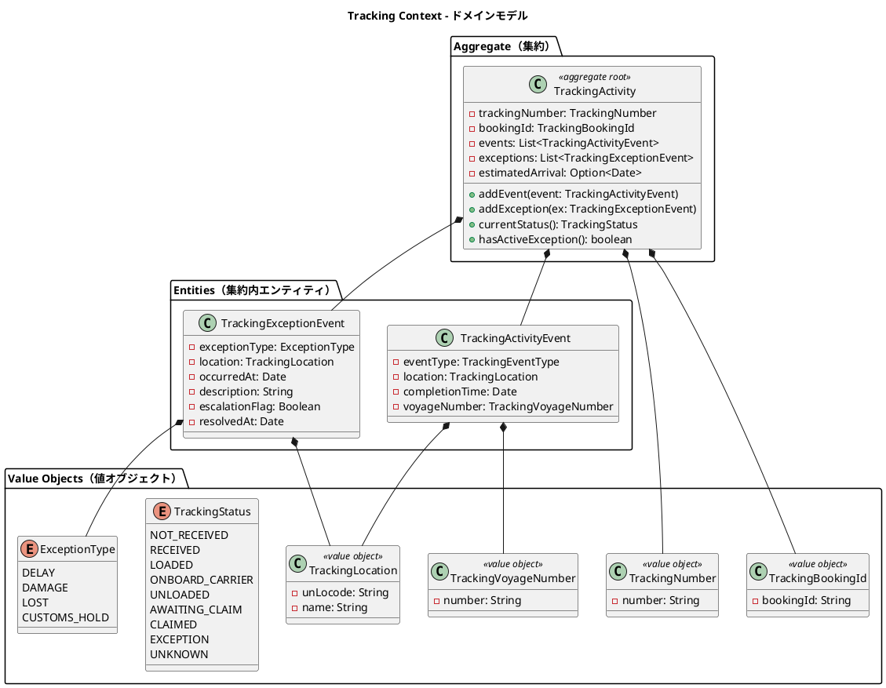

### 集約・エンティティ・値オブジェクト一覧

| 種別 | クラス名 | 日本語名 | 責務 |
|---|---|---|---|
| 集約ルート | TrackingActivity | 追跡レコード | 貨物の追跡情報全体を管理 |
| エンティティ（集約内） | TrackingActivityEvent | 追跡イベント | 時系列で記録される追跡の出来事 |
| エンティティ（集約内） | TrackingExceptionEvent | 追跡例外イベント | 遅延・損傷・紛失・税関保留の例外記録 |
| 値オブジェクト | TrackingNumber | 追跡番号 | 追跡活動を一意に識別 |
| 値オブジェクト | TrackingBookingId | 予約参照 ID | Booking Context との関連を保持 |
| 値オブジェクト | TrackingLocation | 追跡位置情報 | コンテキスト固有の位置情報型（ACL 変換） |
| 値オブジェクト | TrackingVoyageNumber | 追跡航海番号 | Tracking Context 固有の航海番号型 |
| 列挙型 | TrackingStatus | 追跡状態 | 9 段階の追跡フェーズ |
| 列挙型 | ExceptionType | 例外種別 | DELAY / DAMAGE / LOST / CUSTOMS_HOLD |

> **状態は保持する。履歴から導出しない**（IT10・US14 で是正）。
> 本節のクラス図は当初 `currentStatus()` でイベント履歴から輸送状態を
> **導出する**形で描いていたが、実装は `transportStatus` を保持する。
> DB（`V1__init.sql`）も最初から `transport_status` 列を持っており、
> **設計だけが導出型のまま残っていた**。
>
> 導出型は「発生前の状態を永続化せず履歴から再導出する」形であり、
> ユニットテストが緑でもクロスリクエストで誤復帰する。

> **出来事も残す**（IT11・H8 で是正）。IT10 の `applyHandling` は輸送状態だけを
> 書き換え、`TrackingActivityEvent` に相当する行を 1 件も作っていなかった。
> 荷主にはバッジが変わるだけで**いつ・どこで積まれたかが出なかった**。
>
> 現在の形は `applyHandling(status, event)` で、**出来事を記録した結果として
> 状態が変わる**。順序が逆ではない——状態だけを書ける口を残すと、
> また片方だけが書かれる。
>
> 種別（`RECEIVE` 等）は**文字列で受け取る**。`HandlingType` は Handling Context の
> 型であり、Tracking からは参照できない（`arch-lint` 規約 4）。
> 翻訳は ACL アダプタが行う。

### ビジネスルール

1. 追跡活動は必ず一意の TrackingNumber を持つ
2. TrackingActivityEvent は時系列順で管理される。イベントごとに位置と時刻が必須
3. ExceptionType が LOST の場合、escalationFlag を `true` に設定し上位管理者へエスカレーションする
4. CUSTOMS_HOLD 例外は税関システム（CustomsClearancePort）からの通知によって自動登録される
5. `ResolveExceptionCommand` の実行により TrackingStatus は例外発生前の状態に復帰する
6. 推定到着日は経路が確定している場合にのみ定まる。未確定の貨物では値を持たない（照会時は「未定」として扱う）

### コマンド一覧

| コマンド | 実行アクター | 主な処理 |
|---|---|---|
| AssignTrackingNumberCommand | 経路設計者（US14・IT10） | TrackingActivity を新規作成し、ACL 経由で Booking へ番号を記録する（`CONFIRMED → TRACKING_ISSUED`）。**イベント駆動ではない**（[ADR-0012](../adr/ADR-0012-cross-context-writes-go-through-the-target-aggregate.md)） |
| AddTrackingEventCommand | 追跡管理者 | TrackingActivityEvent を時系列で追加 |
| （ACL）ApplyHandling | 荷役作業員（US15・IT10。IT11 で出来事も記録） | 荷役の記録を受け、**出来事を 1 件足したうえで**輸送状態を進める。`findForUpdate` で行を押さえる |
| RegisterExceptionCommand | 追跡管理者・税関システム | TrackingExceptionEvent を登録 |
| ResolveExceptionCommand | 追跡管理者 | 例外を解決し TrackingStatus を復帰 |

## 5. Handling Context（荷役コンテキスト）

### ドメインモデル図

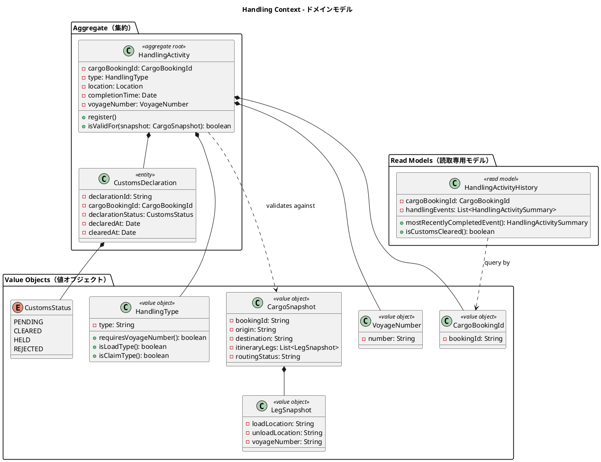

### 集約・エンティティ・値オブジェクト一覧

| 種別 | クラス名 | 日本語名 | 責務 |
|---|---|---|---|
| 集約ルート | HandlingActivity | 荷役作業 | 荷役作業の登録と妥当性検証 |
| エンティティ（集約内） | CustomsDeclaration | 通関申告 | 通関申告の状態管理 |
| 値オブジェクト | CargoBookingId | 貨物予約識別子 | Booking Context との関連識別子 |
| 値オブジェクト | HandlingType | 荷役種別 | RECEIVE / LOAD / UNLOAD / CUSTOMS / CLAIM。VoyageNumber 必須判定を内包。**IT11 で全 5 値を実装**（US15 で 3 値・US16 で CUSTOMS / CLAIM） |
| 値オブジェクト | ConsigneeConfirmation | 荷受人確認 | 引取時の確認コード。**CLAIM の不変条件**（無いと構築できない。US16・[ADR-0014](../adr/ADR-0014-customs-clearance-is-a-handling-record.md) 決定 3）。署名画像は扱わない |
| 値オブジェクト | CargoSnapshot | 貨物スナップショット | ACL 経由で取得した貨物情報。妥当性検証に使用 |
| 値オブジェクト | LegSnapshot | 旅程区間スナップショット | CargoSnapshot 内の区間情報 |
| 値オブジェクト | VoyageNumber | 航海番号 | Handling Context 固有の航海番号型 |
| 列挙型 | CustomsStatus | 通関状態 | PENDING / CLEARED / HELD / REJECTED |
| Read Model | HandlingActivityHistory | 荷役履歴 | クエリ専用の荷役作業履歴。集約と切り離して管理 |

### ビジネスルール

荷役妥当性検証（`isValidFor`）のデシジョンテーブル：

| 荷役タイプ | VoyageNumber 必須 | 場所チェック | MISROUTED 判定条件 |
|---|---|---|---|
| RECEIVE（受領） | 不要 | 出発港（RouteSpecification.origin）と一致 | 不一致で警告 |
| LOAD（積込） | 必須 | Itinerary の積込港（Leg.loadLocation）と一致 | 不一致で MISROUTED |
| UNLOAD（荷降し） | 必須 | Itinerary の荷降港（Leg.unloadLocation）と一致 | 不一致で MISROUTED |
| CUSTOMS（通関） | 不要 | 目的港（RouteSpecification.destination）と一致 | 不一致で警告 |
| CLAIM（引取） | 不要 | 目的港（RouteSpecification.destination）と一致 | 不一致で警告 |

> **荷役の結果もたらす輸送状態**（IT11・US16）。RECEIVE → RECEIVED、
> LOAD → LOADED、UNLOAD → **中継港なら UNLOADED・最終目的港なら AWAITING_CLAIM**、
> CUSTOMS → **変えない**、CLAIM → CLAIMED。
> 「変えない」は現在の状態の書き戻しではなく `None` で表す——
> 同じ値の書き戻しは競合を隠す（ADR-0014 決定 2）。

追加ルール：

1. LOAD / UNLOAD 作業で MISROUTED が確定した場合、Booking Context の RoutingStatus を MISROUTED に更新する
2. CustomsDeclaration が CLEARED 状態になるまで CLAIM（引取）は実施できない

   > **実装は `CUSTOMS` 種別の荷役記録で表す**（IT11・[ADR-0014](../adr/ADR-0014-customs-clearance-is-a-handling-record.md)）。
   > `CustomsDeclaration` エンティティと `customs_declaration` テーブルは
   > **本リリースでは作らない**——状態を `CLEARED` にするのは税関システムの ACL
   > （`CustomsClearancePort`）であり、それは TS07 として
   > [ADR-0007](../adr/ADR-0007-defer-external-acl-and-scope-v1.md) で延期中である。
   > そのままゲートにすると**引取が永久にできない**。
   >
   > 通関の記録があるかどうかで判定する。留置（`HELD`）・却下（`REJECTED`）は
   > 表現できないため、**例外として US19/US20 で扱う**。
3. HandlingActivityHistory はクエリ専用の Read Model として管理され、集約とは切り離す

### コマンド一覧

| コマンド | 実行アクター | 主な処理 |
|---|---|---|
| HandlingActivityRegistrationCommand | 荷役作業員 | 荷役作業を登録し、CargoSnapshot で妥当性を検証 |
| RegisterCustomsDeclarationCommand | 荷役作業員 | 通関申告を新規登録（PENDING 状態で作成） |
| UpdateCustomsStatusCommand | 税関システム（ACL） | 通関申告の状態を更新（CLEARED / HELD / REJECTED） |

## 6. Billing Context（精算コンテキスト）

### ドメインモデル図

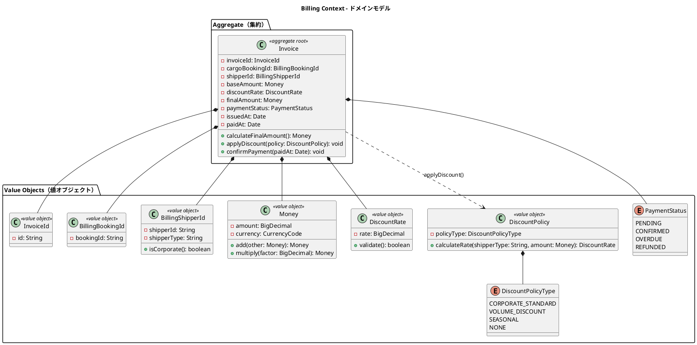

### 集約・エンティティ・値オブジェクト一覧

| 種別 | クラス名 | 日本語名 | 責務 |
|---|---|---|---|
| 集約ルート | Invoice | 精算書 | 貨物輸送 1 件に対する請求書の発行・管理 |
| 値オブジェクト | InvoiceId | 請求書 ID | 精算書の一意識別子 |
| 値オブジェクト | BillingBookingId | 予約参照 ID | Booking Context の Cargo との関連識別子 |
| 値オブジェクト | BillingShipperId | 荷主参照 ID | 法人判定（isCorporate）を内包 |
| 値オブジェクト | Money | 金額 | 金額と通貨コードのペア |
| 値オブジェクト | DiscountRate | 割引率 | 0〜30% の割引率。範囲バリデーション付き |
| 値オブジェクト | DiscountPolicy | 割引方針 | 法人・ボリューム・シーズン割引のロジック |
| 列挙型 | PaymentStatus | 支払い状態 | PENDING / CONFIRMED / OVERDUE / REFUNDED |
| 列挙型 | DiscountPolicyType | 割引方針種別 | CORPORATE_STANDARD / VOLUME_DISCOUNT / SEASONAL / NONE |

### ビジネスルール

1. Invoice は貨物配送完了（BookingStatus = DELIVERED）後にのみ発行できる
2. 法人荷主（CORPORATE）には最大 30% の割引が適用される
3. 支払期限（issuedAt + 30 日）を超過した場合、PaymentStatus を OVERDUE に更新する
4. 支払い確定（CONFIRMED）後のキャンセルは `IssueRefundCommand` で対応し、REFUNDED 状態に遷移する

料金計算ロジック：

```
基本料金 = 距離係数 × 重量（kg） × 貨物種別係数
  - GENERAL（一般貨物）: 係数 1.0
  - HAZARDOUS（危険物）: 係数 1.8
  - REFRIGERATED（冷凍・冷蔵）: 係数 1.5

割引後料金 = 基本料金 × (1 - 割引率)
  - CORPORATE 荷主: 割引率 0〜30%
  - INDIVIDUAL 荷主: 割引なし（割引率 0%）
```

### コマンド一覧

| コマンド | 実行アクター | 主な処理 |
|---|---|---|
| GenerateInvoiceCommand | 経理担当者 | 請求書を新規発行（PENDING 状態で作成） |
| ConfirmPaymentCommand | 経理担当者 | 支払い確認を記録し CONFIRMED に遷移 |

## 7. Estimation Context（見積コンテキスト）

> **実装状況（本リポジトリ = Flix 実装。IT4 時点）**: **未着手**。`src/` に estimation モジュールは存在しない。
> US01（輸送見積を作成する）は IT5 の対象である。

### ドメインモデル図

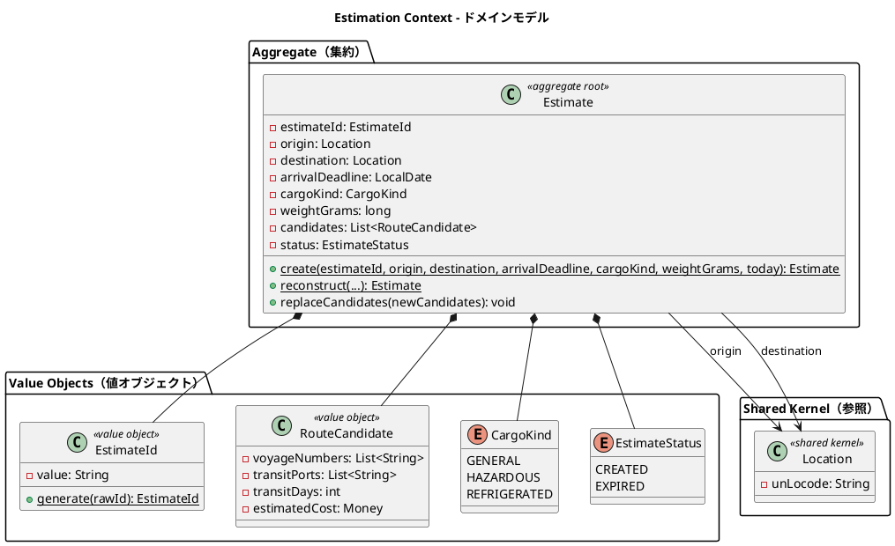

### 集約・エンティティ・値オブジェクト一覧

| 種別 | クラス名 | 日本語名 | 責務 |
|---|---|---|---|
| 集約ルート | Estimate | 見積 | 輸送見積の中心エンティティ。出発地・仕向地・貨物種別・重量・ルート候補を管理 |
| 値オブジェクト | EstimateId | 見積 ID | `EST-XXXXXXXX`（UUID の先頭 8 桁を大文字化）。**採番時に確定し、そのまま集約の識別子・URL・画面表示に使う**。荷主コード（`SHP-`）と同じ方式であり、**同じ限界**（先頭 8 桁は 32 ビット）を持つ |
| 値オブジェクト（record） | RouteCandidate | ルート候補 | 航海番号（複数）・経由港（複数）・輸送日数・見積コスト（`Money`）を保持 |
| 列挙型 | CargoKind | 貨物種別 | GENERAL / HAZARDOUS / REFRIGERATED。**Booking の `CargoType` とは別の型**（`arch-lint` 規約 4） |
| 列挙型 | EstimateStatus | 見積状態 | CREATED（作成済）/ EXPIRED（期限切れ）。表示名（日本語）を保持 |
| 共有カーネル参照 | Location | 位置情報 | UN/LOCODE で識別される港湾・地点。Shared Domain に配置 |
| リポジトリ | EstimateRepo | 見積リポジトリ | `save`（候補も一緒に保存）/ `findByEstimateId` / `findAll`（**新しい順**） |
| ACL ポート | RouteSearch | 経路探索 | Routing の経路探索を Estimation の語彙で引く（[ADR-0010](../adr/ADR-0010-estimation-reuses-route-finder-via-composition.md)） |
| ドメインサービス | FreightRate | 運賃 | `CargoKind` を運賃区分（`SharedFreightTariff.TariffClass`）へ写す。**計算式は共有カーネル** |

### ビジネスルール

1. 見積は必ず EstimateId・origin・destination・arrivalDeadline・CargoKind・重量を持つ。
   到着期限は**今日以降**でなければならない（当日は通す。今日中に着く便がありうる）
2. origin と destination は異なる（同一地点への見積は不可）
3. 重量は正の値でなければならない
4. RouteCandidate は**航海番号と経由港を複数**持てる（積替のある候補）。
   直行便の経由港は空リストである。transitDays は日数、estimatedCost は `Money`
5. 見積作成時のデフォルトステータスは `CREATED`
6. ルート候補は **Routing Context の経路探索（`RouteFinder`）を再利用**して算出される。
   Estimation は `RouteSearch` ACL ポートを自分の語彙で宣言し、その実装（Routing の型への翻訳）は
   合成ルートに置く（[ADR-0010](../adr/ADR-0010-estimation-reuses-route-finder-via-composition.md)。IT8 で実装）。
   設計当初は「スタブ実装（固定値）」としていたが、`RouteFinder` の実装後は
   **同じ業務ルールを 2 箇所に書かない**ことを優先した——探索が 2 つあると、
   見積で出した候補と経路割り当てで出る候補が食い違う
7. 概算運賃は `(基本料金 × 区間数 + 重量単価 × 重量) × 貨物種別割増` で求める。
   **計算式は共有カーネル**（`SharedFreightTariff`）にある。運賃表は全社で 1 つであり、
   見積の画面と経路割り当ての画面（US08 受入基準 3）で違う金額を見せることはあり得ない。
   Estimation は自分の `CargoKind` を運賃区分（`TariffClass`）へ写すだけを担う
8. 金額は**銭（1/100 円）の整数**で保持する（[ADR-0006](../adr/ADR-0006-fixed-point-quantities.md)）。
   端数は各段階で切り上げる——切り捨てると積み上げた合計が個別の合計より小さくなり、
   「明細を足しても合計に合わない」が起きる
9. 重量は**グラムの整数**で保持する（Booking の `weightGrams` と同じ表現）

### コマンド一覧

| コマンド | 実行アクター | 主な処理 |
|---|---|---|
| CreateEstimateCommand | 営業担当者 | 見積を新規作成し、スタブのルート候補を自動付与 |

### Booking Context との関係

Estimation Context は Booking Context と以下の関係を持つ。

- **値の一致**: 貨物種別の**値**は両コンテキストで同じだが、**型は共有しない**（Booking は `CargoType`・Estimation は `CargoKind`）。決めるもの（申告情報の要否 / 運賃の割増）が違う。値の一致は `WiringTest.testCargoVocabulariesAgreeAcrossContexts` が固定する
- **参照**: Location（Shared Domain）を経由して出発地・仕向地を共有する
- **将来の連携**: 見積から予約への引き継ぎ（見積情報を基に Cargo を作成するフロー）は将来イテレーションで実装予定

## 8. Shared Domain（共有ドメイン）

### ドメインモデル図

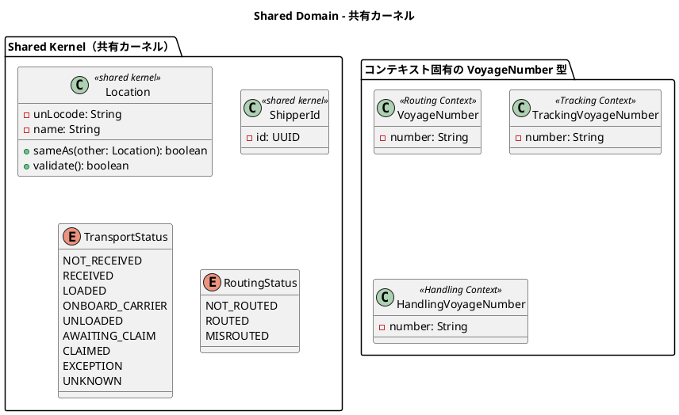

### 共有コンポーネント一覧

| 種別 | クラス名 | 日本語名 | 責務 |
|---|---|---|---|
| 共有カーネル | Location | 位置情報 | UN/LOCODE で識別される港湾・地点。全コンテキストで共有 |
| 共有カーネル | ShipperId | 荷主識別子 | UUID ベースの荷主 ID。Booking Context と Shipper Context で共有 |
| 共有列挙型 | TransportStatus | 輸送状態 | 9 段階の輸送フェーズ。Booking・Tracking で共有 |
| 共有列挙型 | RoutingStatus | 経路状態 | NOT_ROUTED / ROUTED / MISROUTED。Booking・Handling で共有 |

### VoyageNumber のコンテキスト分離設計

VoyageNumber は各コンテキストが独自型を保持する。これにより各コンテキストの自律性を保ちながら意味的な一貫性を維持する。

| コンテキスト | 型名 | 役割 |
|---|---|---|
| Routing Context | VoyageNumber | 航海スケジュールの識別子 |
| Tracking Context | TrackingVoyageNumber | 追跡イベントに紐づく航海番号（ACL 変換） |
| Handling Context | HandlingVoyageNumber | 荷役作業に紐づく航海番号（ACL 変換） |

### ビジネスルール

1. Location の変更は全コンテキストチームの合意のもとに行う（Shared Kernel の制約）
2. UN/LOCODE は国際規格（ISO 3166-1 alpha-2 + 3 文字のロケーションコード）に従う
3. TransportStatus と RoutingStatus は Booking Context と Tracking / Handling Context の間で整合性を保つ

## ドメインイベント

| イベント名 | 発生元 | 処理先 | 内容 |
|---|---|---|---|
| CargoBookedEvent | Booking Context | Tracking Context | 新規貨物予約後、追跡番号割り当て依頼を通知 |
| CargoRoutedEvent | Booking Context | Tracking Context | 旅程確定後、経路・旅程情報を追跡コンテキストに同期 |
| ~~HandlingActivityRegisteredEvent~~ | ~~Handling Context~~ | ~~Tracking Context・Booking Context~~ | **未採用**（[ADR-0012](../adr/ADR-0012-cross-context-writes-go-through-the-target-aggregate.md)）。荷役の反映は**同期の ACL ポートで相手の集約を通す**。設計図に描いたまま実装しない矢印を残さない |
| TrackingExceptionDetectedEvent | Tracking Context | Booking Context・Notification | 例外（遅延・損傷・紛失・税関保留）検知後、通知を配信 |
| InvoiceCreatedEvent | Billing Context | Notification | 請求書発行後、荷主への通知を配信 |

### ドメインイベントフロー

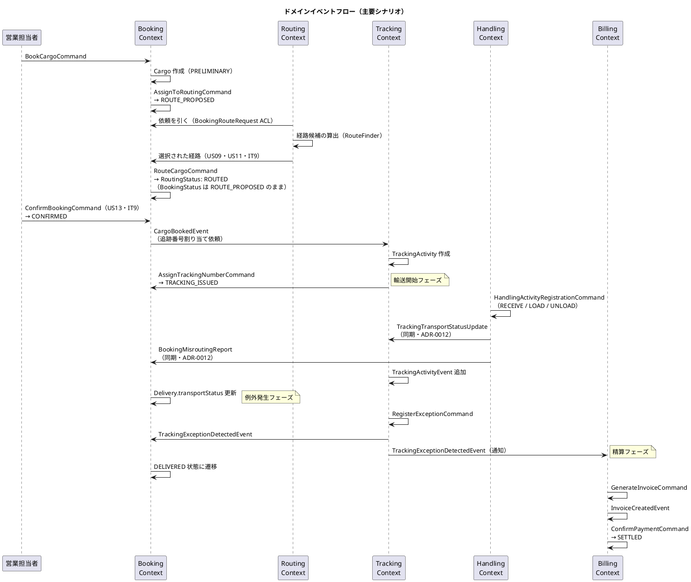

## 外部システム ACL Ports

| ポート名 | 対応外部システム | 責務 |
|---|---|---|
| ExternalRoutingServicePort | 外部経路最適化システム | 出発地・目的地・期限を渡し最適 CargoItinerary を取得。**v1.0.0 では未使用**（[ADR-0007](../adr/ADR-0007-defer-external-acl-and-scope-v1.md) で延期。経路候補は Datalog による自前実装） |
| CustomsClearancePort | 税関システム | 通関申告の提出・状態照会・CUSTOMS_HOLD 例外の自動通知受信 |
| PaymentGatewayPort | 決済機関 | 支払い処理の実行と支払い確認の受信 |
| PortManagementPort | 港湾管理システム | 港湾の取扱可能貨物種別（HAZARDOUS / REFRIGERATED）の照会 |
| NotificationPort | 通知システム | 荷主・荷受人へのメール / SMS 通知の送信 |

各ポートはヘキサゴナルアーキテクチャの出力ポート（Secondary Port）として定義され、インフラ層のアダプターが実装を担う。これにより外部システムの変更がドメインロジックに影響しない。

### コンテキスト間 ACL ポート

外部システムだけでなく、**コンテキスト間の参照も ACL ポートで行う**。
一般形は「**必要とする側が、必要な形に翻訳して引く（pull）**」である。

| ポート名 | 向き | 責務 |
|---|---|---|
| ShipperExistenceChecker | Booking → Shipper | 荷主コードから荷主 ID を解決し、表示に足る情報だけを引く |
| BookingRouteRequest | Routing → Booking | 引き渡し済みの予約から出発地・仕向地・期限・貨物種別を引き、**Routing の言葉へ翻訳する**（`cargo_type` → `CargoCapability`） |

> **経路照会の向きは IT7 で反転した**（[ADR-0009](../adr/ADR-0009-routing-pulls-booking-via-acl.md)）。
> 当初は Booking が Routing（あるいは外部システム）へ問い合わせる形だったが、
> 経路割り当ての画面が Routing 側にあり、外部の経路最適化システムを使わない
> （Datalog による自前実装）ため、**Routing が Booking から引く**形に改めた。
>
> **経路の確定（US09・IT8）は書き込みであり、向きが異なる**。Routing が
> ドメインイベントを発行し、Booking の購読者が `Cargo` を更新する。
> Routing が `cargo` / `leg` テーブルへ書く形は採らない——読み取りの ACL は
> 「相手のスキーマに依存する」だけだが、書き込みの ACL は
> 「相手の不変条件を壊しうる」。

## 集約設計の判断

### Booking Context：Cargo 集約

Cargo を集約ルートとし、BookingId・ShipperId・RouteSpecification・CargoItinerary・Delivery を集約内に含める設計とした。

**根拠**：予約の状態遷移（BookingStatus）はこれらのオブジェクトが一体として整合性を保つ必要がある。特に CargoItinerary の Leg 連結制約（`Leg[n].unloadLocation == Leg[n+1].loadLocation`）は単一トランザクション内で検証しなければ不整合が生じる。Consignee は Cargo に対して 1 対 1 であるため、独立した集約とせず値オブジェクトとして含める。

### Routing Context：Voyage 集約

Voyage を集約ルートとし、Schedule（CarrierMovement のリスト）を内包する設計とした。

**根拠**：Schedule と CarrierMovement は Voyage の文脈でのみ意味を持つ。Schedule の時系列整合性（CarrierMovement の順序・連続性）は Voyage 単位で保証する必要があるため、単一集約に含める。

### Tracking Context：TrackingActivity 集約

TrackingActivity を集約ルートとし、TrackingActivityEvent と TrackingExceptionEvent を集約内エンティティとして管理する設計とした。

**根拠**：追跡状態（TrackingStatus）は時系列の全イベントと例外状態を総合的に判定するため、単一集約としてまとめる必要がある。例外解決時に「例外発生前の状態に復帰」するロジックは集約内の一貫したトランザクションで実行される。

### Handling Context：HandlingActivity 集約 + Read Model 分離

HandlingActivity を集約ルートとし、CustomsDeclaration を集約内エンティティとした。荷役履歴は Read Model（HandlingActivityHistory）として集約と切り離す設計とした。

**根拠**：個々の荷役作業は独立した記録単位であり、互いに強い整合性制約を持たない。一方、通関申告（CustomsDeclaration）と荷役作業は「CLEARED にならないと CLAIM 不可」という不変条件があるため、同一集約に含める。クエリ専用の履歴参照は Read Model として分離することで、コマンド側（集約）の複雑性を低減する。

### Billing Context：Invoice 集約

Invoice を集約ルートとし、DiscountPolicy はドメインサービスではなく値オブジェクトとして Invoice に委譲する設計とした。

**根拠**：請求書 1 件の整合性（基本料金・割引率・最終金額の一貫性）は Invoice 集約内で保証される。DiscountPolicy の割引率計算ロジックは Invoice の `applyDiscount()` 内で完結するため、外部ドメインサービスとして切り出す必要はない。支払い状態（PaymentStatus）の遷移も Invoice 集約が責任を持つ。

### Estimation Context：Estimate 集約

Estimate を集約ルートとし、RouteCandidate（ルート候補）のリストを集約内に保持する設計とした。

**根拠**：見積とルート候補は 1 対多の関係にあり、ルート候補は見積の文脈でのみ意味を持つ。`replaceCandidates()` でルート候補の一括入替を行うため、トランザクション整合性の観点から単一集約に含める。RouteCandidate は Flix の不変レコード型で表現し、不変性を言語レベルで保証する。現在のルート候補生成はスタブ実装（重量ベースの固定コスト計算）であり、将来の外部ルーティングサービス連携時にアダプターを差し替える設計とした。

---

## Flix 実装へのマッピング方針

本ドキュメントで定義したドメインモデルを Flix でどう表現するかを規定する。実装の詳細は [バックエンドアーキテクチャ](architecture_backend.md) を参照すること。

### 戦術的パターンと Flix 構文の対応

| DDD パターン | Flix での表現 | 補足 |
| :--- | :--- | :--- |
| 値オブジェクト | 単一ケースの `enum` + スマートコンストラクタ（`of: String -> Result[DomainError, t]`） | 構造的等価性が既定で得られる。生の `String` / `Int` をドメインに露出させない |
| エンティティ | 不変レコード（識別子フィールドを持つ） | 同一性判定は識別子で行う関数を明示的に定義する |
| 集約ルート | 不変レコード + 「状態遷移関数」の集合 | `def confirm(cargo: Cargo, at: Timestamp): Result[DomainError, Cargo]` の形。**元の集約は変更せず、新しい集約を返す** |
| 状態（`BookingStatus` 等） | `enum` | パターンマッチの網羅性検査により、状態追加時の考慮漏れをコンパイラが検出する |
| 不変条件 | 状態遷移関数が返す `Result[DomainError, t]` | 例外を使わない。呼び出し側は失敗を扱うことを型で強制される |
| ドメインサービス | 効果を要求しない純粋関数 | 副作用がないことが型に現れる |
| ドメインイベント | `enum DomainEvent` の各ケース | 1 つの ADT に集約し、購読側でパターンマッチする |
| リポジトリ | `eff`（効果宣言） | インターフェースではなく効果。実装はハンドラで注入する |
| ACL（腐敗防止層） | 効果宣言 + 変換関数 | 外部モデル → 自ドメイン型への変換関数を ACL に閉じる |
| ファクトリ | モジュール内の `pub def create...` 関数 | 生成時の不変条件をここで検証する |

### 集約の実装規約

| 規約 | 内容 |
| :--- | :--- |
| **不変性** | 集約は不変レコードとする。状態変更は新しい値を返す関数で表現し、破壊的更新を行わない |
| **時刻の受け取り** | 現在時刻はドメイン層で取得せず、引数（`at: Timestamp`）で受け取る。時刻依存ロジックをテストで固定できる |
| **効果を持たない** | 集約・値オブジェクトの関数は効果を一切要求しない。永続化・イベント発行はアプリケーション層の責務とする |
| **集約境界** | 1 トランザクションで更新する集約は 1 つ。他集約への波及はドメインイベントで行う |
| **参照** | 他集約は識別子（値オブジェクト）で参照する。集約そのものを保持しない |
| **状態の永続化** | 状態は必ずカラムとして永続化する。イベント履歴から状態を再導出する実装は行わない（再導出は結果整合の破れを見逃す） |
| **フィールド名の衝突** | 複数コンテキストで同名フィールド（`origin`・`destination` 等）が現れるため、モジュールを明示して参照し、`use` による無修飾の一括取り込みは避ける |

### 段階的な導入方針

集約へのフィールド追加など、既存データを伴う変更は `Option[t]`（当面 `None` を許容）で導入し、
バックフィル完了後に必須化する 2 段階で進める。判断は ADR に記録すること。
