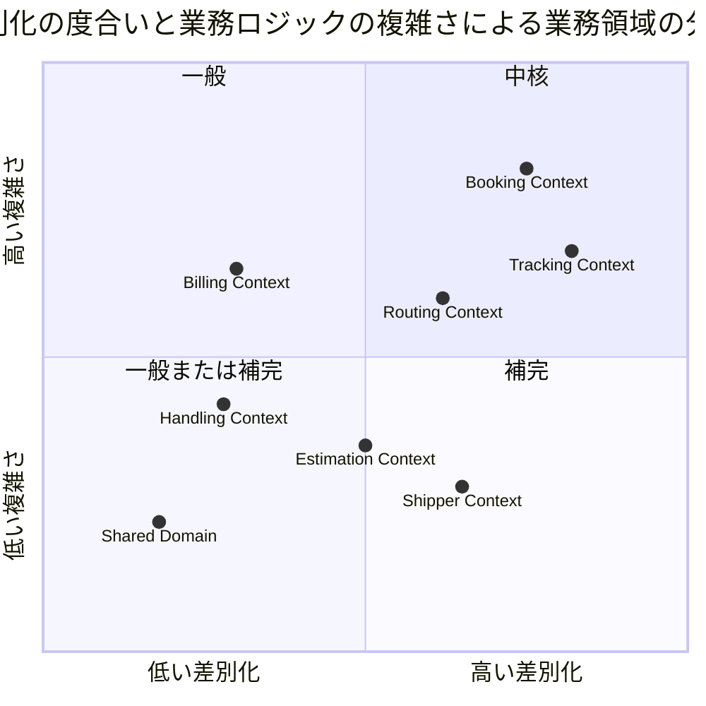
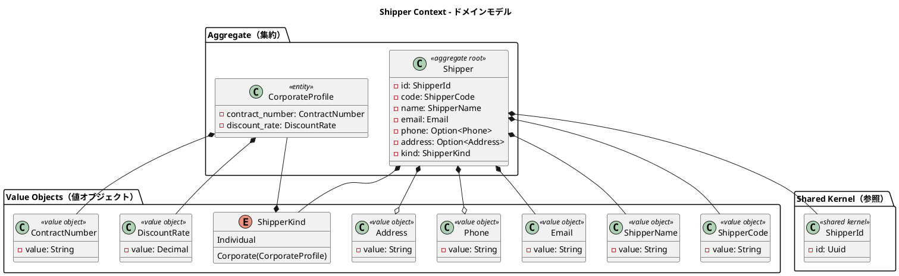
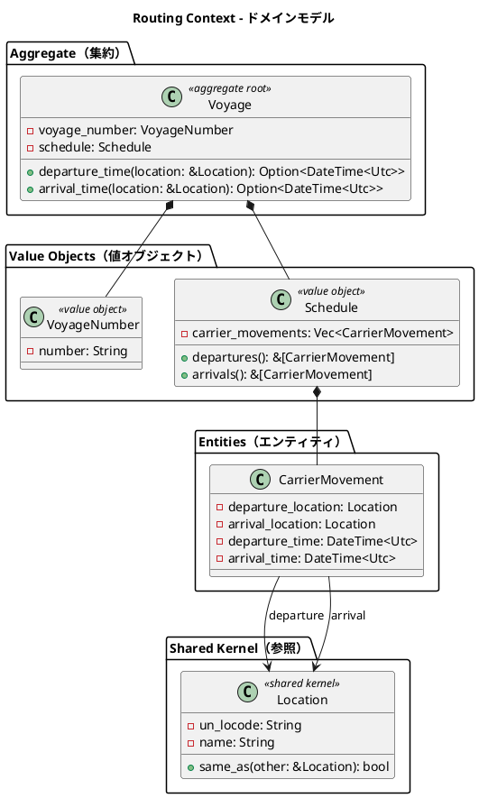
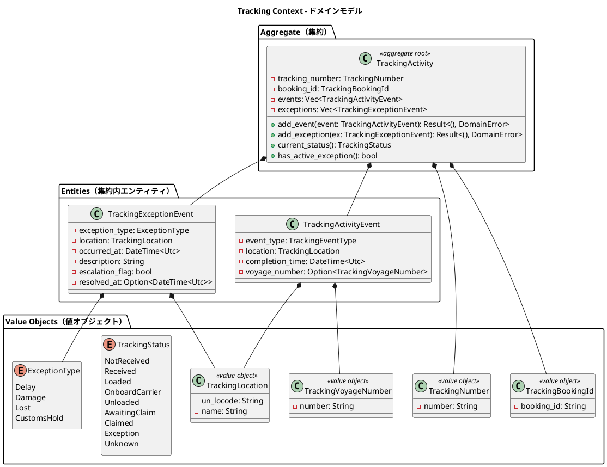
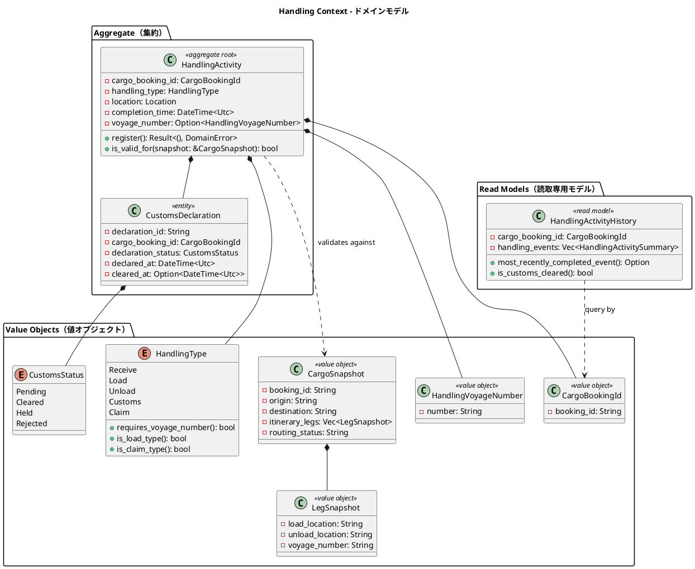
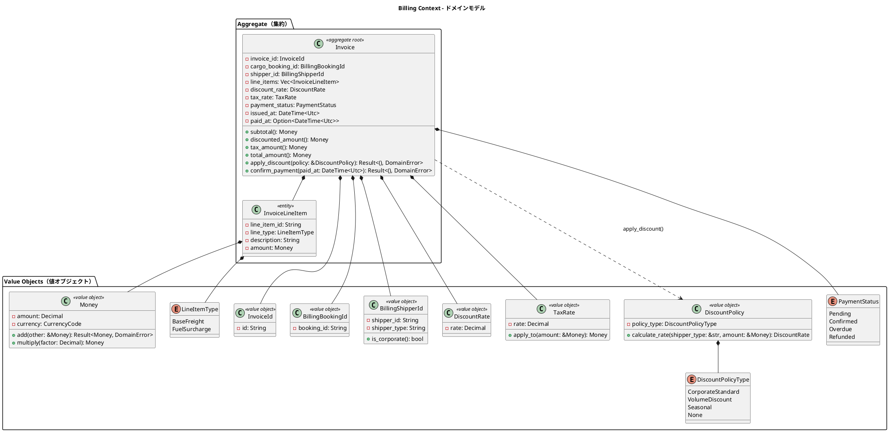
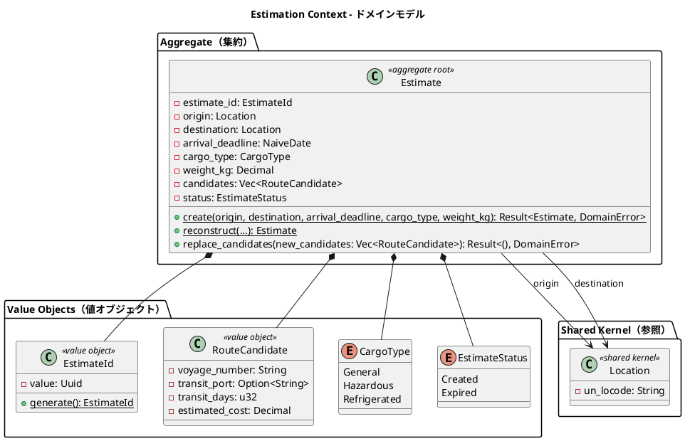
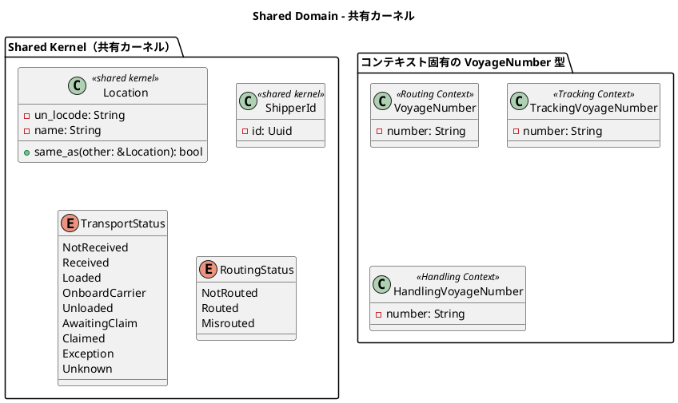
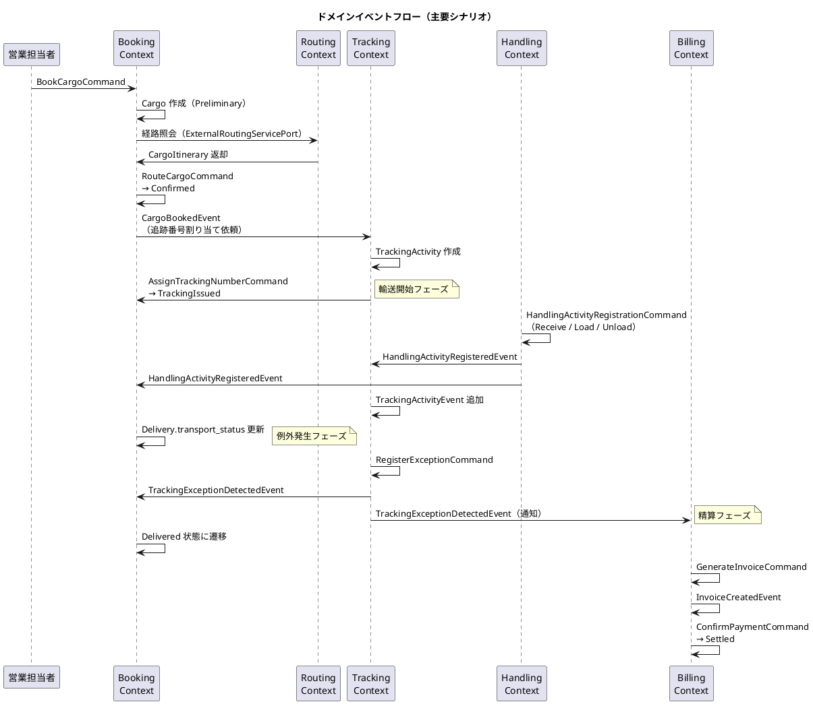

```plantuml
@startuml
title Booking Context - ドメインモデル

package "Aggregate（集約）" {
  class Cargo <<aggregate root>> {
    -booking_id: BookingId
    -shipper_id: ShipperId
    -consignee: Option<Consignee>
    -route_specification: RouteSpecification
    -cargo_itinerary: Option<CargoItinerary>
    -delivery: Delivery
    -booking_amount: Money
    -booking_status: BookingStatus
    -cargo_type: CargoType
    -dimensions: Option<Dimensions>
    -quantity: Option<Quantity>
    -description: Option<Description>
    -hazardous_declaration: Option<HazardousDeclaration>
    -temperature_requirement: Option<TemperatureRequirement>
  }
}

package "Value Objects（値オブジェクト）" {
  class BookingId <<value object>> {
    -id: String
  }
  class ShipperId <<value object>> {
    -id: String
    -shipper_type: ShipperType
  }
  class Consignee <<value object>> {
    -name: String
    -address: String
    -contact_email: String
  }
  class RouteSpecification <<value object>> {
    -origin: Location
    -destination: Location
    -arrival_deadline: DateTime<Utc>
    +is_satisfied_by(itinerary: &CargoItinerary): bool
  }
  class CargoItinerary <<value object>> {
    -legs: Vec<Leg>
    +expected_arrival_time(): DateTime<Utc>
  }
  class Leg <<value object>> {
    -load_location: Location
    -unload_location: Location
    -load_time: DateTime<Utc>
    -unload_time: DateTime<Utc>
    -voyage: VoyageNumber
  }
  class Delivery <<value object>> {
    -transport_status: TransportStatus
    -routing_status: RoutingStatus
    -last_cargo_handled_event: Option<CargoHandlingActivity>
  }
  class Money <<value object>> {
    -amount: Decimal
    -currency: CurrencyCode
    +add(other: &Money): Result<Money, DomainError>
    +multiply(factor: Decimal): Money
  }
  class CargoHandlingActivity <<value object>> {
    -handling_type: String
    -location: Location
    -completion_time: DateTime<Utc>
  }
  enum BookingStatus {
    Preliminary
    RouteProposed
    Confirmed
    TrackingIssued
    InTransit
    Delivered
    Settled
    Cancelled
  }
  enum ShipperType {
    Individual
    Corporate
  }
  class Dimensions <<value object>> {
    -length: Decimal
    -width: Decimal
    -height: Decimal
  }
  class Quantity <<value object>> {
    -value: u32
  }
  class Description <<value object>> {
    -value: String
  }
  class HazardousDeclaration <<value object>> {
    -hazardous_class: String
    -un_number: String
    -proper_shipping_name: String
  }
  class TemperatureRequirement <<value object>> {
    -min_temperature: Decimal
    -max_temperature: Decimal
    -unit: TemperatureUnit
  }
  enum CargoType {
    General
    Hazardous
    Refrigerated
  }
  enum RoutingStatus {
    NotRouted
    Routed
    Misrouted
  }
}

interface ShipperExistenceChecker <<ACL Port>> {
  +exists(shipper_id: &ShipperId): Result<bool, DomainError>
}

Cargo *-- BookingId
Cargo *-- ShipperId
Cargo *-- Consignee
Cargo *-- RouteSpecification
Cargo *-- CargoItinerary
Cargo *-- Delivery
Cargo *-- Money
Cargo *-- BookingStatus
Cargo *-- CargoType
Cargo *-o Dimensions
Cargo *-o Quantity
Cargo *-o Description
Cargo *-o HazardousDeclaration
Cargo *-o TemperatureRequirement
ShipperId *-- ShipperType
CargoItinerary *-- Leg
Delivery *-- RoutingStatus

@enduml
```

# ドメインモデル設計 - 国際貨物輸送管理システム

## 概要

本ドキュメントは、国際貨物輸送管理システムの DDD（ドメイン駆動設計）戦術的設計を定義する。実装言語は Rust（edition 2024）であり、cargo workspace によりレイヤ・コンテキスト単位のクレート分割を行う。システムは以下の 8 つの境界付けられたコンテキスト（Bounded Context）で構成される。

| コンテキスト | 日本語名 | 主な責務 |
|---|---|---|
| Booking Context | 予約コンテキスト | 貨物予約の受付・旅程管理・状態遷移 |
| Shipper Context | 荷主コンテキスト | 荷主の登録・管理・法人割引 |
| Routing Context | 経路コンテキスト | 航海スケジュール・経路情報の管理 |
| Tracking Context | 追跡コンテキスト | 貨物追跡・例外イベント管理 |
| Handling Context | 荷役コンテキスト | 荷役作業登録・通関申告管理 |
| Billing Context | 精算コンテキスト | 請求書発行・割引・支払い管理 |
| Estimation Context | 見積コンテキスト | 輸送見積の作成・ルート候補の管理 |
| Shared Domain | 共有ドメイン | 共有カーネル（Location・ShipperId・TransportStatus） |

各コンテキストは自律的に変更可能な集約を持ち、コンテキスト間の連携はドメインイベントおよび ACL（Anti-Corruption Layer）ポートを通じて行う。

### Rust における戦術的設計パターンの対応

| DDD パターン | Rust での表現 |
|---|---|
| 値オブジェクト | newtype（例: `struct TrackingId(String)`）。`Clone` / `PartialEq` / `Eq` を derive し、不変とする |
| 不変条件 | スマートコンストラクタ `fn new(...) -> Result<Self, DomainError>`。生成時に検証を強制する |
| 状態・列挙 | `enum`（`BookingStatus` 等）。状態遷移は網羅的 `match` で表現しコンパイラが漏れを検出する |
| 集約 | 集約ルート `struct` が内部フィールドを非公開に保ち、公開メソッド経由でのみ変更する（所有権・借用による整合性保護） |
| リポジトリ | ポート trait（`#[async_trait]` もしくは async fn in trait）としてドメイン層に定義し、sqlx アダプターがインフラ層で実装する |
| ドメインエラー | `thiserror` による `DomainError` 列挙型 |
| ドメインイベント | `serde` でシリアライズ可能な `enum` / `struct` |

```rust
use thiserror::Error;

#[derive(Debug, Error)]
pub enum DomainError {
    #[error("検証エラー: {0}")]
    Validation(String),
    #[error("不正な状態遷移: {from} -> {to}")]
    InvalidTransition { from: String, to: String },
    #[error("エンティティが見つかりません: {0}")]
    NotFound(String),
}
```



## ユビキタス言語

| 英語（コード名） | 日本語（業務用語） | 使用コンテキスト | 説明 |
|---|---|---|---|
| Cargo | 貨物 | Booking Context | 予約の中心的エンティティ。荷主から荷受人へ輸送される物品 |
| Shipper | 荷主 | Shipper Context | 貨物を発送する主体。個人・法人の 2 種別 |
| CorporateShipper | 法人荷主 | Shipper Context | Shipper のサブタイプ。契約番号と割引率を持つ |
| Address | 住所 | Shipper Context | 荷主の住所情報（最大 500 文字） |
| Dimensions | 寸法 | Booking Context | 貨物の長さ・幅・高さ（オプション） |
| Quantity | 個数 | Booking Context | 貨物の個数（オプション、1 以上） |
| Description | 品名 | Booking Context | 貨物の品名（オプション、最大 500 文字） |
| HazardousDeclaration | 危険物申告 | Booking Context | 危険物クラス・UN 番号・正式輸送品名 |
| TemperatureRequirement | 温度管理条件 | Booking Context | 最低温度・最高温度・温度単位 |
| ShipperExistenceChecker | 荷主存在確認 ACL | Booking Context | 荷主コンテキストへの存在確認ポート |
| Consignee | 荷受人 | Booking Context | 貨物を受け取る主体。氏名・住所・連絡先を保持 |
| BookingId | 予約 ID | Booking Context | 予約を一意に識別する値オブジェクト |
| RouteSpecification | ルート仕様 | Booking Context | 出発地・目的地・到着期限の要件定義 |
| CargoItinerary | 旅程 | Booking Context | 貨物の輸送経路全体。1 つ以上の Leg で構成 |
| Leg | 輸送区間 | Booking Context | 単一航海での積込港から荷降港までの区間 |
| Delivery | 配送状況 | Booking Context | 現在の輸送状態・経路状態・最終荷役イベントの集合 |
| Voyage | 航海 | Routing Context | 特定の船舶が実施する一連の運送区間 |
| Schedule | 航海スケジュール | Routing Context | 航海を構成する時系列の運送区間一覧 |
| CarrierMovement | 運送区間 | Routing Context | 出発港・到着港・出発時刻・到着時刻を持つ区間単位 |
| TrackingActivity | 追跡レコード | Tracking Context | 貨物の追跡情報全体を管理する集約 |
| TrackingNumber | 追跡番号 | Tracking Context | 追跡活動を一意に識別する番号 |
| TrackingActivityEvent | 追跡イベント | Tracking Context | 時系列で記録される追跡の出来事 |
| TrackingExceptionEvent | 追跡例外イベント | Tracking Context | 遅延・損傷・紛失・税関保留などの例外事象 |
| HandlingActivity | 荷役作業 | Handling Context | 実際に行われた荷役作業の記録 |
| HandlingActivityHistory | 荷役履歴 | Handling Context | クエリ専用の荷役作業履歴（Read Model） |
| Invoice | 精算書 | Billing Context | 貨物輸送 1 件に対して発行される請求書 |
| DiscountPolicy | 割引方針 | Billing Context | 法人・ボリューム・シーズン割引のポリシー |
| Location | 位置情報 | Shared Domain | UN/LOCODE で識別される港湾・地点の共有カーネル |
| TransportStatus | 輸送状態 | Shared Domain | 貨物の現在の輸送フェーズを表す共有列挙型 |
| RoutingStatus | 経路状態 | Shared Domain | 経路の妥当性状態（NOT_ROUTED / ROUTED / MISROUTED） |
| BookingStatus | 予約状態 | Booking Context | 予約ライフサイクルの状態（8 値） |
| CargoType | 貨物種別 | Booking Context | GENERAL / HAZARDOUS / REFRIGERATED |
| ExceptionType | 例外種別 | Tracking Context | DELAY / DAMAGE / LOST / CUSTOMS_HOLD |
| CustomsStatus | 通関状態 | Handling Context | PENDING / CLEARED / HELD / REJECTED |
| PaymentStatus | 支払い状態 | Billing Context | PENDING / CONFIRMED / OVERDUE / REFUNDED |
| Estimate | 見積 | Estimation Context | 輸送見積の中心エンティティ。出発地・仕向地・期限・貨物種別・重量を保持 |
| EstimateId | 見積 ID | Estimation Context | UUID ベースの見積一意識別子 |
| RouteCandidate | ルート候補 | Estimation Context | 見積に紐づく輸送ルート候補。航海番号・経由港・輸送日数・見積コストを保持 |
| CargoType | 貨物種別 | Estimation Context | GENERAL / HAZARDOUS / REFRIGERATED（Booking Context と共通） |
| EstimateStatus | 見積状態 | Estimation Context | CREATED（作成済）/ EXPIRED（期限切れ） |

## アクターとコンテキストの対応

| アクター | 対話するコンテキスト | 主要コマンド / 操作 |
|---|---|---|
| 営業担当者 | Booking Context・Estimation Context | `BookCargoCommand`・`RouteCargoCommand`・`CreateEstimateCommand` |
| 経路設計者 | Routing Context + Booking Context | `RouteCargoCommand`・`AssignTrackingNumberCommand` |
| 荷役作業員 | Handling Context | `HandlingActivityRegistrationCommand` |
| 追跡管理者 | Tracking Context | `AddTrackingEventCommand`・例外登録 |
| 荷主 | Booking Context（読取）+ Tracking Context（読取） | 追跡照会・状態確認 |
| 荷受人 | Tracking Context（読取）+ Booking Context（読取） | 到着確認・引取手続き |
| 経理担当者 | Billing Context | `GenerateInvoiceCommand`・`ConfirmPaymentCommand` |

## 境界付けられたコンテキスト概要


### cargo workspace 構成

各コンテキストはドメイン層クレートとして独立させ、アプリケーション層・インフラ層（axum / sqlx アダプター）と分離する。

```text
crates/
  shared-kernel/         # 共有カーネル（Location・ShipperId・TransportStatus 等）
  domain-booking/        # Booking Context ドメイン層
  domain-shipper/        # Shipper Context ドメイン層
  domain-routing/        # Routing Context ドメイン層
  domain-tracking/       # Tracking Context ドメイン層
  domain-handling/       # Handling Context ドメイン層
  domain-billing/        # Billing Context ドメイン層
  domain-estimation/     # Estimation Context ドメイン層
  app-booking/           # ユースケース（コマンド / クエリサービス）※コンテキスト別に app-* を配置
  app-shipper/
  app-estimation/
  infra-persistence/     # sqlx リポジトリ実装・Read Model
  infra-external/        # 外部システムアダプター（reqwest）
  infra-eventbus/        # in-process イベントバス（tokio broadcast）
  interface-rest/        # axum ハンドラー・REST API・ルーティング
  interface-web/         # Askama SSR 画面ハンドラー
  cargo-tracker-server/  # 実行バイナリ（合成ルート）
```

> クレート命名は [バックエンドアーキテクチャ設計](architecture_backend.md) と実際の `apps/cargo-tracker/Cargo.toml` を正とする。
> アプリケーション層は単一クレートではなくコンテキスト別（`app-booking` 等）に分割する。

## 1. Booking Context（予約コンテキスト）

### ドメインモデル図



### Rust 実装例

値オブジェクトは newtype で表現し、スマートコンストラクタで不変条件を強制する。

```rust
use chrono::{DateTime, Utc};
use rust_decimal::Decimal;

/// 予約 ID（newtype）
#[derive(Debug, Clone, PartialEq, Eq, Hash, serde::Serialize, serde::Deserialize)]
pub struct BookingId(String);

impl BookingId {
    pub fn new(id: impl Into<String>) -> Result<Self, DomainError> {
        let id = id.into();
        if id.is_empty() || id.len() > 20 {
            return Err(DomainError::Validation("BookingId は 1〜20 文字".into()));
        }
        Ok(Self(id))
    }

    pub fn as_str(&self) -> &str {
        &self.0
    }
}

/// ルート仕様
#[derive(Debug, Clone, PartialEq, Eq)]
pub struct RouteSpecification {
    origin: Location,
    destination: Location,
    arrival_deadline: DateTime<Utc>,
}

impl RouteSpecification {
    pub fn new(
        origin: Location,
        destination: Location,
        arrival_deadline: DateTime<Utc>,
    ) -> Result<Self, DomainError> {
        if origin == destination {
            return Err(DomainError::Validation(
                "出発地と目的地は異なる必要がある".into(),
            ));
        }
        Ok(Self { origin, destination, arrival_deadline })
    }

    pub fn is_satisfied_by(&self, itinerary: &CargoItinerary) -> bool {
        itinerary.expected_arrival_time() <= self.arrival_deadline
    }
}

/// 旅程（Leg 連結制約をコンストラクタで検証）
#[derive(Debug, Clone, PartialEq, Eq)]
pub struct CargoItinerary {
    legs: Vec<Leg>,
}

impl CargoItinerary {
    pub fn new(legs: Vec<Leg>) -> Result<Self, DomainError> {
        if legs.is_empty() {
            return Err(DomainError::Validation("旅程は 1 つ以上の Leg が必要".into()));
        }
        for pair in legs.windows(2) {
            if pair[0].unload_location() != pair[1].load_location() {
                return Err(DomainError::Validation(
                    "Leg[n].unload_location と Leg[n+1].load_location が連結していない".into(),
                ));
            }
        }
        Ok(Self { legs })
    }
}
```

集約ルート `Cargo` は状態遷移を `&mut self` メソッドとして公開し、不正な遷移を `Result` で拒否する。

```rust
#[derive(Debug, Clone, Copy, PartialEq, Eq, serde::Serialize, serde::Deserialize)]
pub enum BookingStatus {
    Preliminary,
    RouteProposed,
    Confirmed,
    TrackingIssued,
    InTransit,
    Delivered,
    Settled,
    Cancelled,
}

impl Cargo {
    /// 新規予約（PRELIMINARY 状態で作成）
    pub fn book(
        booking_id: BookingId,
        shipper_id: ShipperId,
        route_specification: RouteSpecification,
        cargo_type: CargoType,
        booking_amount: Money,
        hazardous_declaration: Option<HazardousDeclaration>,
        temperature_requirement: Option<TemperatureRequirement>,
    ) -> Result<Self, DomainError> {
        match cargo_type {
            CargoType::Hazardous if hazardous_declaration.is_none() => {
                return Err(DomainError::Validation("HAZARDOUS は危険物申告が必須".into()));
            }
            CargoType::Refrigerated if temperature_requirement.is_none() => {
                return Err(DomainError::Validation("REFRIGERATED は温度管理条件が必須".into()));
            }
            _ => {}
        }
        Ok(Self {
            booking_id,
            shipper_id,
            route_specification,
            cargo_type,
            booking_amount,
            booking_status: BookingStatus::Preliminary,
            delivery: Delivery::not_routed(),
            hazardous_declaration,
            temperature_requirement,
            ..Default::default()
        })
    }

    /// 旅程を割り当てる（ROUTE_PROPOSED → CONFIRMED）
    pub fn assign_itinerary(&mut self, itinerary: CargoItinerary) -> Result<(), DomainError> {
        match self.booking_status {
            BookingStatus::RouteProposed => {
                if !self.route_specification.is_satisfied_by(&itinerary) {
                    return Err(DomainError::Validation("旅程がルート仕様を満たさない".into()));
                }
                self.cargo_itinerary = Some(itinerary);
                self.delivery = self.delivery.with_routing_status(RoutingStatus::Routed);
                self.booking_status = BookingStatus::Confirmed;
                Ok(())
            }
            other => Err(DomainError::InvalidTransition {
                from: format!("{other:?}"),
                to: "Confirmed".into(),
            }),
        }
    }
}
```

リポジトリと ACL はポート trait として定義する。

```rust
/// 荷主存在確認 ACL ポート（Shipper Context への腐敗防止層）
#[async_trait::async_trait]
pub trait ShipperExistenceChecker: Send + Sync {
    async fn exists(&self, shipper_id: &ShipperId) -> Result<bool, DomainError>;
}

/// Cargo リポジトリポート（sqlx アダプターがインフラ層で実装）
#[async_trait::async_trait]
pub trait CargoRepository: Send + Sync {
    async fn save(&self, cargo: &Cargo) -> Result<(), DomainError>;
    async fn find_by_booking_id(&self, id: &BookingId) -> Result<Option<Cargo>, DomainError>;
    async fn find_all(&self) -> Result<Vec<Cargo>, DomainError>;
}
```

### 集約・エンティティ・値オブジェクト一覧

| 種別 | 型名 | 日本語名 | 責務 |
|---|---|---|---|
| 集約ルート | Cargo | 貨物 | 予約の中心。状態遷移・旅程・配送状況を統括 |
| 値オブジェクト | BookingId | 予約 ID | 予約の一意識別（newtype） |
| 値オブジェクト | ShipperId | 荷主識別子 | 荷主 ID と種別（個人・法人）の保持 |
| 値オブジェクト | Consignee | 荷受人情報 | 荷受人の名前・住所・連絡先メール |
| 値オブジェクト | RouteSpecification | ルート仕様 | 出発地・目的地・到着期限の要件定義 |
| 値オブジェクト | CargoItinerary | 旅程 | 輸送区間（Leg）の集合と到着時刻計算 |
| 値オブジェクト | Leg | 輸送区間 | 単一航海での積込港から荷降港までの区間 |
| 値オブジェクト | Delivery | 配送状況 | 現在の輸送状態・経路状態・最終荷役イベント |
| 値オブジェクト | Money | 金額 | `rust_decimal::Decimal` と通貨コードのペア。多通貨対応 |
| 値オブジェクト | CargoHandlingActivity | 荷役活動（参照用） | 最終荷役イベントの記録 |
| 列挙型 | BookingStatus | 予約状態 | 8 段階の予約ライフサイクル |
| 列挙型 | ShipperType | 荷主種別 | Individual / Corporate |
| 値オブジェクト | Dimensions | 寸法 | 貨物の長さ・幅・高さ（`Option`） |
| 値オブジェクト | Quantity | 個数 | 貨物の個数（1 以上、`Option`） |
| 値オブジェクト | Description | 品名 | 貨物の品名（最大 500 文字、`Option`） |
| 値オブジェクト | HazardousDeclaration | 危険物申告 | 危険物クラス・UN 番号・正式輸送品名 |
| 値オブジェクト | TemperatureRequirement | 温度管理条件 | 最低/最高温度・温度単位 |
| 列挙型 | CargoType | 貨物種別 | General / Hazardous / Refrigerated |
| 列挙型 | RoutingStatus | 経路状態 | NotRouted / Routed / Misrouted |
| ACL ポート | ShipperExistenceChecker | 荷主存在確認 | Shipper Context への ACL trait。荷主 ID の存在確認 |
| リポジトリポート | CargoRepository | 貨物リポジトリ | `save` / `find_by_booking_id` / `find_all` |

### ビジネスルール

1. 貨物は必ず BookingId・ShipperId・CargoType を持つ
2. RouteSpecification の出発地と目的地は異なる（UN/LOCODE 形式で検証、スマートコンストラクタで強制）
3. CargoItinerary は 1 つ以上の Leg で構成される。`Leg[n].unload_location == Leg[n+1].load_location` の連結制約を `CargoItinerary::new` で検証する
4. BookingStatus の遷移は `Preliminary → RouteProposed → Confirmed → TrackingIssued → InTransit → Delivered → Settled` の順に進む。いずれの状態からも Cancelled に遷移可能。遷移は網羅的 `match` で実装しコンパイラが漏れを検出する
5. Corporate ShipperType の荷主は割引適用の対象となる（割引率上限 30%）
6. Hazardous / Refrigerated の CargoType は指定港のみ取扱可能
7. Hazardous CargoType の場合、HazardousDeclaration は必須（`Cargo::book` で検証）
8. Refrigerated CargoType の場合、TemperatureRequirement は必須（`Cargo::book` で検証）
9. Booking Context は Shipper Context に直接依存せず、ShipperExistenceChecker ACL ポート trait を通じて荷主の存在を確認する

### コマンド一覧

| コマンド | 実行アクター | 主な処理 |
|---|---|---|
| BookCargoCommand | 営業担当者 | 貨物予約の新規登録（Preliminary 状態で作成） |
| AssignToRoutingCommand | 営業担当者 | 予約情報を経路設計者に引き渡す（Preliminary → RouteProposed に遷移） |
| ConfirmBookingCommand | 営業担当者 | 予約を確定する（Preliminary → Confirmed に遷移） |
| CancelBookingCommand | 営業担当者 | 予約をキャンセルする（Cancelled に遷移） |
| RouteCargoCommand | 経路設計者 | CargoItinerary を Cargo に割り当て、RouteProposed → Confirmed に遷移 |
| AssignTrackingNumberCommand | 経路設計者 | TrackingNumber を Cargo に紐付け、TrackingIssued に遷移 |
| UpdateBookingStatusCommand | システム | BookingStatus の状態遷移を更新 |

## 2. Shipper Context（荷主コンテキスト）

### ドメインモデル図



### Rust 実装例

Java 版の継承（`CorporateShipper extends Shipper`）は、Rust では enum によるサブタイプ表現に置き換える。これにより「法人なら契約番号と割引率が必須」という不変条件を型で強制できる。

```rust
use rust_decimal::Decimal;
use uuid::Uuid;

/// 荷主種別（法人は契約情報を型として内包する）
#[derive(Debug, Clone, PartialEq, Eq)]
pub enum ShipperKind {
    Individual,
    Corporate(CorporateProfile),
}

#[derive(Debug, Clone, PartialEq, Eq)]
pub struct CorporateProfile {
    contract_number: ContractNumber,
    discount_rate: DiscountRate,
}

/// 割引率（0.0000〜0.3000）
#[derive(Debug, Clone, Copy, PartialEq, Eq)]
pub struct DiscountRate(Decimal);

impl DiscountRate {
    pub fn new(value: Decimal) -> Result<Self, DomainError> {
        let max = Decimal::new(3000, 4); // 0.3000
        if value < Decimal::ZERO || value > max {
            return Err(DomainError::Validation("割引率は 0〜30% の範囲".into()));
        }
        Ok(Self(value))
    }
}

/// 荷主コード（SHP- プレフィックス + UUID 先頭 8 文字を自動生成）
#[derive(Debug, Clone, PartialEq, Eq)]
pub struct ShipperCode(String);

impl ShipperCode {
    pub fn generate() -> Self {
        let uuid = Uuid::new_v4().simple().to_string();
        Self(format!("SHP-{}", &uuid[..8].to_uppercase()))
    }
}

#[async_trait::async_trait]
pub trait ShipperRepository: Send + Sync {
    async fn save(&self, shipper: &Shipper) -> Result<(), DomainError>;
    async fn find_by_id(&self, id: &ShipperId) -> Result<Option<Shipper>, DomainError>;
    async fn exists_by_email(&self, email: &Email) -> Result<bool, DomainError>;
}
```

### 集約・エンティティ・値オブジェクト一覧

| 種別 | 型名 | 日本語名 | 責務 |
|---|---|---|---|
| 集約ルート | Shipper | 荷主 | 荷主情報の管理。個人・法人の 2 種別 |
| エンティティ（enum バリアント） | CorporateProfile | 法人荷主情報 | `ShipperKind::Corporate` が内包。契約番号と割引率を保持 |
| 値オブジェクト | ShipperCode | 荷主コード | 自動生成される荷主の業務識別コード |
| 値オブジェクト | ShipperName | 荷主名 | 荷主の氏名または社名 |
| 値オブジェクト | Email | メール | メールアドレス。一意制約あり |
| 値オブジェクト | Phone | 電話番号 | 電話番号（`Option`） |
| 値オブジェクト | Address | 住所 | 住所（`Option`、最大 500 文字） |
| 値オブジェクト | ContractNumber | 契約番号 | 法人荷主の契約番号 |
| 値オブジェクト | DiscountRate | 割引率 | 法人荷主の割引率（0〜30%） |
| 列挙型 | ShipperKind | 荷主種別 | Individual / Corporate（法人情報を内包） |
| 共有カーネル参照 | ShipperId | 荷主識別子 | UUID ベースの一意識別子。shared-kernel クレートに配置 |
| リポジトリポート | ShipperRepository | 荷主リポジトリ | `save` / `find_by_id` / `exists_by_email` |

### ビジネスルール

1. 荷主は必ず ShipperId・ShipperCode・ShipperName・Email・ShipperKind を持つ
2. Email はシステム全体で一意（`DomainError::Validation`（Email 重複）で重複検出）
3. Corporate の場合、`ShipperKind::Corporate(CorporateProfile)` として ContractNumber と DiscountRate が型レベルで必須
4. DiscountRate の値域は 0.0000〜0.3000（0%〜30%）
5. ShipperCode は自動生成（`SHP-` プレフィックス + UUID 先頭 8 文字）

### コマンド一覧

| コマンド | 実行アクター | 主な処理 |
|---|---|---|
| RegisterShipperCommand | 営業担当者 | 荷主の新規登録。Email 重複チェックと ShipperCode 自動生成 |

## 3. Routing Context（経路コンテキスト）

### ドメインモデル図



### Rust 実装例

```rust
#[derive(Debug, Clone, PartialEq, Eq, Hash)]
pub struct VoyageNumber(String);

impl VoyageNumber {
    pub fn new(number: impl Into<String>) -> Result<Self, DomainError> {
        let number = number.into();
        if number.is_empty() || number.len() > 20 {
            return Err(DomainError::Validation("VoyageNumber は 1〜20 文字".into()));
        }
        Ok(Self(number))
    }
}

#[async_trait::async_trait]
pub trait VoyageRepository: Send + Sync {
    async fn save(&self, voyage: &Voyage) -> Result<(), DomainError>;
    async fn find_by_voyage_number(
        &self,
        number: &VoyageNumber,
    ) -> Result<Option<Voyage>, DomainError>;
}
```

### 集約・エンティティ・値オブジェクト一覧

| 種別 | 型名 | 日本語名 | 責務 |
|---|---|---|---|
| 集約ルート | Voyage | 航海 | 航路スケジュールを管理する中心エンティティ |
| 値オブジェクト | VoyageNumber | 航海番号 | Routing Context 固有の航海一意識別子（newtype） |
| 値オブジェクト | Schedule | 航海スケジュール | 時系列の CarrierMovement 一覧を保持 |
| エンティティ | CarrierMovement | 運送区間 | 出発地・到着地・出発時刻・到着時刻の区間単位 |
| 共有カーネル参照 | Location | 位置情報 | UN/LOCODE で識別される港湾・地点 |
| 値オブジェクト | CargoType | 貨物種別 | Routing 固有の対応貨物種別（GENERAL/HAZARDOUS/REFRIGERATED。BC 独立のため Booking の同名型と共有しない・IT2） |
| 値オブジェクト | RouteLeg | 経路区間 | 経路候補の 1 区間（航海番号・積込/荷降地・積込/荷降時刻）。Booking の Leg と同形だが BC 独立のため Routing 固有型として定義（IT3） |
| 値オブジェクト | RouteCandidate | 経路候補 | 連結した RouteLeg 列。所要日数・経由港・航海番号列・到着予定・期限内判定を提供（IT3。Estimation の RouteCandidate とは別物） |
| ドメインサービス | RouteCandidateCalculator | 経路探索サービス | 登録済み航海から直行→単純接続→多段接続を段階探索し推奨順の経路候補を算出（US08・IT3） |
| リポジトリポート | VoyageRepository | 航海リポジトリ | `save` / `find_by_voyage_number` / `search`（出発港・到着港・貨物種別・出発期間） |
| リポジトリポート | SelectedRouteRepository | 確定経路リポジトリ | 確定経路（RouteCandidate）を予約番号に紐づけ永続化（US09・IT3） |
| ACL ポート | CargoSpecProvider | 貨物仕様プロバイダ | 予約番号から貨物仕様（出発地・目的地・期限・貨物種別）を射影。Booking を直接参照しない腐敗防止層（US07/US08・IT3） |

### ビジネスルール

1. 航海は必ず一意の VoyageNumber を持つ
2. Schedule は時系列順の CarrierMovement で構成される（`Schedule::new` で順序を検証）
3. CarrierMovement の出発地と到着地は異なる
4. Location は UN/LOCODE で一意に識別される（例: `JPOSA` = 大阪、`USLAX` = LA）

### コマンド一覧

| コマンド | 実行アクター | 主な処理 |
|---|---|---|
| RegisterVoyageCommand | 経路設計者 | 新規航海スケジュールの登録 |
| UpdateScheduleCommand | 経路設計者 | 運送区間の追加・変更 |

## 4. Tracking Context（追跡コンテキスト）

### ドメインモデル図



### Rust 実装例

```rust
impl TrackingActivity {
    /// 例外を登録する。LOST はエスカレーションフラグを強制的に立てる
    pub fn add_exception(
        &mut self,
        exception_type: ExceptionType,
        location: TrackingLocation,
        occurred_at: DateTime<Utc>,
        description: String,
    ) -> Result<(), DomainError> {
        let escalation_flag = matches!(exception_type, ExceptionType::Lost);
        self.exceptions.push(TrackingExceptionEvent {
            exception_type,
            location,
            occurred_at,
            description,
            escalation_flag,
            resolved_at: None,
        });
        Ok(())
    }

    /// 現在の追跡状態（イベントと未解決例外から導出する）
    pub fn current_status(&self) -> TrackingStatus {
        if self.has_active_exception() {
            return TrackingStatus::Exception;
        }
        self.events
            .last()
            .map(|e| e.event_type.into())
            .unwrap_or(TrackingStatus::NotReceived)
    }

    pub fn has_active_exception(&self) -> bool {
        self.exceptions.iter().any(|ex| ex.resolved_at.is_none())
    }
}

#[async_trait::async_trait]
pub trait TrackingActivityRepository: Send + Sync {
    async fn save(&self, activity: &TrackingActivity) -> Result<(), DomainError>;
    async fn find_by_tracking_number(
        &self,
        number: &TrackingNumber,
    ) -> Result<Option<TrackingActivity>, DomainError>;
}
```

### 集約・エンティティ・値オブジェクト一覧

| 種別 | 型名 | 日本語名 | 責務 |
|---|---|---|---|
| 集約ルート | TrackingActivity | 追跡レコード | 貨物の追跡情報全体を管理 |
| エンティティ（集約内） | TrackingActivityEvent | 追跡イベント | 時系列で記録される追跡の出来事 |
| エンティティ（集約内） | TrackingExceptionEvent | 追跡例外イベント | 遅延・損傷・紛失・税関保留の例外記録 |
| 値オブジェクト | TrackingNumber | 追跡番号 | 追跡活動を一意に識別（newtype） |
| 値オブジェクト | TrackingBookingId | 予約参照 ID | Booking Context との関連を保持 |
| 値オブジェクト | TrackingLocation | 追跡位置情報 | コンテキスト固有の位置情報型（ACL 変換） |
| 値オブジェクト | TrackingVoyageNumber | 追跡航海番号 | Tracking Context 固有の航海番号型 |
| 列挙型 | TrackingStatus | 追跡状態 | 9 段階の追跡フェーズ |
| 列挙型 | ExceptionType | 例外種別 | Delay / Damage / Lost / CustomsHold |
| リポジトリポート | TrackingActivityRepository | 追跡リポジトリ | `save` / `find_by_tracking_number` |

### ビジネスルール

1. 追跡活動は必ず一意の TrackingNumber を持つ
2. TrackingActivityEvent は時系列順で管理される。イベントごとに位置と時刻が必須
3. ExceptionType が Lost の場合、`escalation_flag` を `true` に設定し上位管理者へエスカレーションする（`add_exception` 内で `matches!` により強制）
4. CustomsHold 例外は税関システム（CustomsClearancePort）からの通知によって自動登録される
5. `ResolveExceptionCommand` の実行により TrackingStatus は例外発生前の状態に復帰する（`resolved_at` を設定し `current_status()` の導出結果が復帰する）

### コマンド一覧

| コマンド | 実行アクター | 主な処理 |
|---|---|---|
| AssignTrackingNumberCommand | Booking Context（イベント駆動） | TrackingActivity を新規作成し TrackingNumber を割り当て |
| AddTrackingEventCommand | 追跡管理者 | TrackingActivityEvent を時系列で追加 |
| RegisterExceptionCommand | 追跡管理者・税関システム | TrackingExceptionEvent を登録 |
| ResolveExceptionCommand | 追跡管理者 | 例外を解決し TrackingStatus を復帰 |

## 5. Handling Context（荷役コンテキスト）

### ドメインモデル図



### Rust 実装例

Java 版で文字列 + 判定メソッドだった HandlingType は、Rust では enum として表現し判定を網羅的 `match` にする。

```rust
#[derive(Debug, Clone, Copy, PartialEq, Eq, serde::Serialize, serde::Deserialize)]
pub enum HandlingType {
    Receive,
    Load,
    Unload,
    Customs,
    Claim,
}

impl HandlingType {
    pub fn requires_voyage_number(self) -> bool {
        matches!(self, Self::Load | Self::Unload)
    }

    pub fn is_load_type(self) -> bool {
        matches!(self, Self::Load)
    }

    pub fn is_claim_type(self) -> bool {
        matches!(self, Self::Claim)
    }
}

impl HandlingActivity {
    /// 登録時バリデーション：VoyageNumber の要否を荷役種別と突き合わせる。
    /// Load / Unload で None、または Receive / Claim / Customs で Some の場合はエラー。
    pub fn register(&self) -> Result<(), DomainError> {
        match (self.handling_type.requires_voyage_number(), &self.voyage_number) {
            (true, None) => Err(DomainError::Validation(
                "Load / Unload には VoyageNumber が必須".into(),
            )),
            (false, Some(_)) => Err(DomainError::Validation(
                "この荷役種別に VoyageNumber は指定できない".into(),
            )),
            _ => Ok(()),
        }
    }

    /// CargoSnapshot（ACL 経由で取得した貨物情報）に対する妥当性検証。
    /// Load / Unload は初期実装では場所一致のみ（`any()`）で判定し、
    /// 直前の荷役履歴と照合する順序検証は将来の拡張とする（設計判断を参照）。
    pub fn is_valid_for(&self, snapshot: &CargoSnapshot) -> bool {
        match self.handling_type {
            HandlingType::Receive => snapshot.origin() == self.location.un_locode(),
            HandlingType::Load => snapshot
                .itinerary_legs()
                .iter()
                .any(|leg| leg.load_location() == self.location.un_locode()),
            HandlingType::Unload => snapshot
                .itinerary_legs()
                .iter()
                .any(|leg| leg.unload_location() == self.location.un_locode()),
            HandlingType::Claim => snapshot.destination() == self.location.un_locode(),
            // 通関は行政手続きだが、誤入力検出のため申告地が itinerary 上の港であることを課す
            HandlingType::Customs => {
                let loc = self.location.un_locode();
                snapshot.origin() == loc
                    || snapshot.destination() == loc
                    || snapshot.itinerary_legs().iter().any(|leg| {
                        leg.load_location() == loc || leg.unload_location() == loc
                    })
            }
        }
    }
}
```

### 集約・エンティティ・値オブジェクト一覧

| 種別 | 型名 | 日本語名 | 責務 |
|---|---|---|---|
| 集約ルート | HandlingActivity | 荷役作業 | 荷役作業の登録と妥当性検証 |
| エンティティ（集約内） | CustomsDeclaration | 通関申告 | 通関申告の状態管理 |
| 値オブジェクト | CargoBookingId | 貨物予約識別子 | Booking Context との関連識別子 |
| 列挙型 | HandlingType | 荷役種別 | Receive / Load / Unload / Customs / Claim。VoyageNumber 必須判定を内包 |
| 値オブジェクト | CargoSnapshot | 貨物スナップショット | ACL 経由で取得した貨物情報。妥当性検証に使用 |
| 値オブジェクト | LegSnapshot | 旅程区間スナップショット | CargoSnapshot 内の区間情報 |
| 値オブジェクト | HandlingVoyageNumber | 航海番号 | Handling Context 固有の航海番号型 |
| 列挙型 | CustomsStatus | 通関状態 | Pending / Cleared / Held / Rejected |
| Read Model | HandlingActivityHistory | 荷役履歴 | クエリ専用の荷役作業履歴。集約と切り離し、sqlx の `query_as!` で直接構築する |

### ビジネスルール

荷役妥当性検証（`is_valid_for`）のデシジョンテーブル：

| 荷役タイプ | VoyageNumber | 場所条件 | 判定結果 |
|---|---|---|---|
| Receive（受領） | 不要（None） | 出発港（RouteSpecification.origin）と一致 | valid |
| Receive（受領） | 不要（None） | 出発港と不一致 | invalid（警告。MISROUTED 遷移なし） |
| Load（積込） | 必須（Some） | いずれかの Leg.load_location と一致 | valid |
| Load（積込） | 必須（Some） | いずれの Leg.load_location とも不一致 | invalid → MISROUTED |
| Load（積込） | None | （場所チェック前に判定） | バリデーションエラー（DomainError::Validation。妥当性判定に進まない） |
| Unload（荷降し） | 必須（Some） | いずれかの Leg.unload_location と一致 | valid |
| Unload（荷降し） | 必須（Some） | いずれの Leg.unload_location とも不一致 | invalid → MISROUTED |
| Unload（荷降し） | None | （場所チェック前に判定） | バリデーションエラー（DomainError::Validation。妥当性判定に進まない） |
| Claim（引取） | 不要（None） | 目的港（RouteSpecification.destination）と一致 | valid |
| Claim（引取） | 不要（None） | 目的港と不一致 | invalid（警告。MISROUTED 遷移なし） |
| Customs（通関） | 不要（None） | 申告地が itinerary 上の港（いずれかの Leg の load_location / unload_location または origin / destination）であること | 該当港なら valid、それ以外は invalid（警告） |

設計判断（記録）：

- **Customs の場所制約**：通関は行政手続きであり本質的には場所非依存だが、無条件に valid とすると誤入力（無関係な港での申告登録）を検出できない。そこで「申告地が itinerary 上の港であること」を制約として課す。制約違反は警告（invalid）に留め、MISROUTED 遷移は発生させない
- **Leg の順序検証**：複数 Leg のうち一部のみ一致するケース（ルート順序を無視した積込等）について、初期実装では場所一致のみ（`any()` 一致）で判定し、順序逸脱の検出は行わない。直前の荷役履歴（HandlingActivityHistory.most_recently_completed_event）との照合による順序検証は将来の拡張とし、導入時に順序逸脱も MISROUTED と判定する方針とする
- **VoyageNumber の事前バリデーション**：`requires_voyage_number()` が true（Load / Unload）にもかかわらず VoyageNumber が None の場合は、`is_valid_for` の妥当性判定ではなく登録時（`register`）のバリデーションエラー（`DomainError::Validation`）として拒否する。逆に Receive / Claim / Customs で VoyageNumber が指定された場合も同様にエラーとする

追加ルール：

1. Load / Unload 作業で MISROUTED が確定した場合、Booking Context の RoutingStatus を Misrouted に更新する
2. CustomsDeclaration が Cleared 状態になるまで Claim（引取）は実施できない
3. HandlingActivityHistory はクエリ専用の Read Model として管理され、集約とは切り離す
4. Receive / Claim / Customs の場所不一致は警告（invalid）として記録するが、RoutingStatus の MISROUTED 遷移は Load / Unload の不一致に限定する

### コマンド一覧

| コマンド | 実行アクター | 主な処理 |
|---|---|---|
| HandlingActivityRegistrationCommand | 荷役作業員 | 荷役作業を登録し、CargoSnapshot で妥当性を検証 |
| RegisterCustomsDeclarationCommand | 荷役作業員 | 通関申告を新規登録（Pending 状態で作成） |
| UpdateCustomsStatusCommand | 税関システム（ACL） | 通関申告の状態を更新（Cleared / Held / Rejected） |

## 6. Billing Context（精算コンテキスト）

### ドメインモデル図



### Rust 実装例

```rust
use rust_decimal::Decimal;
use rust_decimal_macros::dec;

impl Invoice {
    /// 支払いを確定する（Pending → Confirmed）
    pub fn confirm_payment(&mut self, paid_at: DateTime<Utc>) -> Result<(), DomainError> {
        match self.payment_status {
            PaymentStatus::Pending | PaymentStatus::Overdue => {
                self.payment_status = PaymentStatus::Confirmed;
                self.paid_at = Some(paid_at);
                Ok(())
            }
            other => Err(DomainError::InvalidTransition {
                from: format!("{other:?}"),
                to: "Confirmed".into(),
            }),
        }
    }
}

impl CargoType {
    /// 貨物種別係数
    pub fn rate_factor(self) -> Decimal {
        match self {
            Self::General => dec!(1.0),
            Self::Hazardous => dec!(1.8),
            Self::Refrigerated => dec!(1.5),
        }
    }
}

impl Invoice {
    /// 明細合計（基本運賃 + 燃油サーチャージ等）
    pub fn subtotal(&self) -> Money {
        self.line_items
            .iter()
            .fold(Money::zero(self.currency), |acc, item| acc.add_unchecked(item.amount()))
    }

    /// 割引適用後の課税対象額（割引率上限 30%）
    pub fn discounted_amount(&self) -> Money {
        self.subtotal().multiply(Decimal::ONE - self.discount_rate.rate())
    }

    /// 消費税額。丸めはこの最終段階で 1 回のみ行い、1 円未満を切り捨てる
    pub fn tax_amount(&self) -> Money {
        self.discounted_amount()
            .multiply(self.tax_rate.rate())
            .floor() // Decimal::floor 相当（1 円未満切り捨て）
    }

    /// 請求合計 = 課税対象額 + 消費税額
    pub fn total_amount(&self) -> Money {
        self.discounted_amount().add_unchecked(&self.tax_amount())
    }
}

#[async_trait::async_trait]
pub trait InvoiceRepository: Send + Sync {
    async fn save(&self, invoice: &Invoice) -> Result<(), DomainError>;
    async fn find_by_booking_id(
        &self,
        booking_id: &BillingBookingId,
    ) -> Result<Option<Invoice>, DomainError>;
}
```

### 集約・エンティティ・値オブジェクト一覧

| 種別 | 型名 | 日本語名 | 責務 |
|---|---|---|---|
| 集約ルート | Invoice | 精算書 | 貨物輸送 1 件に対する請求書の発行・管理 |
| エンティティ（集約内） | InvoiceLineItem | 請求明細 | 基本運賃・燃油サーチャージ等の明細行 |
| 値オブジェクト | InvoiceId | 請求書 ID | 精算書の一意識別子（newtype） |
| 値オブジェクト | BillingBookingId | 予約参照 ID | Booking Context の Cargo との関連識別子 |
| 値オブジェクト | BillingShipperId | 荷主参照 ID | 法人判定（`is_corporate`）を内包 |
| 値オブジェクト | Money | 金額 | `rust_decimal::Decimal` と通貨コードのペア |
| 値オブジェクト | DiscountRate | 割引率 | 0〜30% の割引率。範囲バリデーション付き |
| 値オブジェクト | TaxRate | 消費税率 | 消費税率（現行 10%）。税額計算（1 円未満切り捨て）を内包 |
| 値オブジェクト | DiscountPolicy | 割引方針 | 法人・ボリューム・シーズン割引のロジック |
| 列挙型 | LineItemType | 明細種別 | BaseFreight（基本運賃）/ FuelSurcharge（燃油サーチャージ） |
| 列挙型 | PaymentStatus | 支払い状態 | Pending / Confirmed / Overdue / Refunded |
| 列挙型 | DiscountPolicyType | 割引方針種別 | CorporateStandard / VolumeDiscount / Seasonal / None |
| リポジトリポート | InvoiceRepository | 精算書リポジトリ | `save` / `find_by_booking_id` |

### ビジネスルール

1. Invoice は貨物配送完了（BookingStatus = Delivered）後にのみ発行できる
2. 法人荷主（Corporate）には最大 30% の割引が適用される
3. 支払期限（issued_at + 30 日）を超過した場合、PaymentStatus を Overdue に更新する
4. 支払い確定（Confirmed）後のキャンセルは `IssueRefundCommand` で対応し、Refunded 状態に遷移する
5. Invoice は明細（InvoiceLineItem）の合計から算出する。基本運賃と燃油サーチャージは独立した明細行として保持する
6. 消費税（10%）は割引適用後の課税対象額に対して課す。端数（1 円未満）は切り捨てとし、丸めは税計算の最終段階で 1 回のみ行う（中間計算では丸めない）

料金計算ロジック（計算順序）：

```text
1. 基本運賃 = 距離係数 × 重量（kg） × 貨物種別係数
     - General（一般貨物）: 係数 1.0
     - Hazardous（危険物）: 係数 1.8
     - Refrigerated（冷凍・冷蔵）: 係数 1.5

2. 明細合計（小計） = 基本運賃 + 燃油サーチャージ

3. 課税対象額 = 明細合計 × (1 - 割引率)
     - Corporate 荷主: 割引率 0〜30%（上限 30%）
     - Individual 荷主: 割引なし（割引率 0%）

4. 消費税額 = floor(課税対象額 × 10%)
     - 1 円未満切り捨て（`Decimal::floor` 相当）
     - 丸めはこの最終段階で 1 回のみ

5. 請求合計 = 課税対象額 + 消費税額
```

### コマンド一覧

| コマンド | 実行アクター | 主な処理 |
|---|---|---|
| GenerateInvoiceCommand | 経理担当者 | 請求書を新規発行（Pending 状態で作成） |
| ConfirmPaymentCommand | 経理担当者 | 支払い確認を記録し Confirmed に遷移 |

## 7. Estimation Context（見積コンテキスト）

### ドメインモデル図



### Rust 実装例

```rust
use chrono::NaiveDate;
use rust_decimal::Decimal;
use uuid::Uuid;

#[derive(Debug, Clone, Copy, PartialEq, Eq, Hash)]
pub struct EstimateId(Uuid);

impl EstimateId {
    pub fn generate() -> Self {
        Self(Uuid::new_v4())
    }
}

/// ルート候補（不変な値オブジェクト。Java の record に相当）
#[derive(Debug, Clone, PartialEq, Eq)]
pub struct RouteCandidate {
    voyage_number: String,
    transit_port: Option<String>,
    transit_days: u32,
    estimated_cost: Decimal,
}

impl RouteCandidate {
    pub fn new(
        voyage_number: String,
        transit_port: Option<String>,
        transit_days: u32,
        estimated_cost: Decimal,
    ) -> Result<Self, DomainError> {
        if voyage_number.is_empty() {
            return Err(DomainError::Validation("voyage_number は空にできない".into()));
        }
        if transit_days == 0 {
            return Err(DomainError::Validation("transit_days は正の値".into()));
        }
        if estimated_cost <= Decimal::ZERO {
            return Err(DomainError::Validation("estimated_cost は正の値".into()));
        }
        Ok(Self { voyage_number, transit_port, transit_days, estimated_cost })
    }
}

impl Estimate {
    pub fn create(
        origin: Location,
        destination: Location,
        arrival_deadline: NaiveDate,
        cargo_type: CargoType,
        weight_kg: Decimal,
    ) -> Result<Self, DomainError> {
        if origin == destination {
            return Err(DomainError::Validation("同一地点への見積は不可".into()));
        }
        if weight_kg <= Decimal::ZERO {
            return Err(DomainError::Validation("weight_kg は正の値".into()));
        }
        Ok(Self {
            estimate_id: EstimateId::generate(),
            origin,
            destination,
            arrival_deadline,
            cargo_type,
            weight_kg,
            candidates: Vec::new(),
            status: EstimateStatus::Created,
        })
    }
}

#[async_trait::async_trait]
pub trait EstimateRepository: Send + Sync {
    async fn save(&self, estimate: &Estimate) -> Result<(), DomainError>;
    async fn find_by_estimate_id(&self, id: &EstimateId) -> Result<Option<Estimate>, DomainError>;
    async fn find_all(&self) -> Result<Vec<Estimate>, DomainError>;
}
```

### 集約・エンティティ・値オブジェクト一覧

| 種別 | 型名 | 日本語名 | 責務 |
|---|---|---|---|
| 集約ルート | Estimate | 見積 | 輸送見積の中心エンティティ。出発地・仕向地・貨物種別・重量・ルート候補を管理 |
| 値オブジェクト | EstimateId | 見積 ID | `uuid::Uuid` ベースの見積一意識別子。`generate()` で自動生成 |
| 値オブジェクト | RouteCandidate | ルート候補 | 航海番号・経由港・輸送日数・見積コストを保持。Estimate に複数紐づく |
| 列挙型 | CargoType | 貨物種別 | General / Hazardous / Refrigerated |
| 列挙型 | EstimateStatus | 見積状態 | Created（作成済）/ Expired（期限切れ）。表示名（日本語）を保持 |
| 共有カーネル参照 | Location | 位置情報 | UN/LOCODE で識別される港湾・地点。shared-domain クレートに配置 |
| リポジトリポート | EstimateRepository | 見積リポジトリ | `save` / `find_by_estimate_id` / `find_all` |

### ビジネスルール

1. 見積は必ず EstimateId・origin・destination・arrival_deadline・CargoType・weight_kg を持つ
2. origin と destination は異なる（同一地点への見積は不可、`Estimate::create` で検証）
3. weight_kg は正の値でなければならない
4. RouteCandidate の voyage_number は空でない文字列、transit_days は正の値、estimated_cost は正の値（`RouteCandidate::new` で検証）
5. 見積作成時のデフォルトステータスは `Created`
6. ルート候補はスタブ実装（固定値）で生成される。将来、外部ルーティングサービスとの連携時に置換予定

### コマンド一覧

| コマンド | 実行アクター | 主な処理 |
|---|---|---|
| CreateEstimateCommand | 営業担当者 | 見積を新規作成し、スタブのルート候補を自動付与 |

### Booking Context との関係

Estimation Context は Booking Context と以下の関係を持つ。

- **共有**: CargoType 列挙型は両コンテキストで同一の値（General / Hazardous / Refrigerated）を使用する
- **参照**: Location（shared-domain クレート）を経由して出発地・仕向地を共有する
- **将来の連携**: 見積から予約への引き継ぎ（見積情報を基に Cargo を作成するフロー）は将来イテレーションで実装予定

## 8. Shared Domain（共有ドメイン）

### ドメインモデル図



### Rust 実装例

```rust
/// UN/LOCODE で識別される位置情報（shared-domain クレート）
#[derive(Debug, Clone, PartialEq, Eq, Hash, serde::Serialize, serde::Deserialize)]
pub struct Location {
    un_locode: UnLocode,
    name: String,
}

/// UN/LOCODE（ISO 3166-1 alpha-2 + 3 文字のロケーションコード）
#[derive(Debug, Clone, PartialEq, Eq, Hash, serde::Serialize, serde::Deserialize)]
pub struct UnLocode(String);

impl UnLocode {
    pub fn new(code: impl Into<String>) -> Result<Self, DomainError> {
        let code = code.into();
        let valid = code.len() == 5 && code.chars().all(|c| c.is_ascii_uppercase());
        if !valid {
            return Err(DomainError::Validation(format!("不正な UN/LOCODE: {code}")));
        }
        Ok(Self(code))
    }
}
```

### 共有コンポーネント一覧

| 種別 | 型名 | 日本語名 | 責務 |
|---|---|---|---|
| 共有カーネル | Location | 位置情報 | UN/LOCODE で識別される港湾・地点。全コンテキストで共有 |
| 共有カーネル | ShipperId | 荷主識別子 | UUID ベースの荷主 ID。Booking Context と Shipper Context で共有 |
| 共有列挙型 | TransportStatus | 輸送状態 | 9 段階の輸送フェーズ。Booking・Tracking で共有 |
| 共有列挙型 | RoutingStatus | 経路状態 | NotRouted / Routed / Misrouted。Booking・Handling で共有 |

### VoyageNumber のコンテキスト分離設計

VoyageNumber は各コンテキストが独自の newtype を保持する。これにより各コンテキストの自律性を保ちながら意味的な一貫性を維持する。Rust の newtype は型として互換性がないため、コンテキスト間の誤用をコンパイル時に防げる。

| コンテキスト | 型名 | 役割 |
|---|---|---|
| Routing Context | VoyageNumber | 航海スケジュールの識別子 |
| Tracking Context | TrackingVoyageNumber | 追跡イベントに紐づく航海番号（ACL 変換） |
| Handling Context | HandlingVoyageNumber | 荷役作業に紐づく航海番号（ACL 変換） |

### ビジネスルール

1. Location の変更は全コンテキストチームの合意のもとに行う（Shared Kernel の制約。shared-domain クレートの変更として管理する）
2. UN/LOCODE は国際規格（ISO 3166-1 alpha-2 + 3 文字のロケーションコード）に従う
3. TransportStatus と RoutingStatus は Booking Context と Tracking / Handling Context の間で整合性を保つ

## ドメインイベント

ドメインイベントは `serde` でシリアライズ可能な型として定義し、コンテキスト間の非同期連携に用いる。

| イベント名 | 発生元 | 処理先 | 内容 |
|---|---|---|---|
| CargoBookedEvent | Booking Context | Tracking Context | 新規貨物予約後、追跡番号割り当て依頼を通知 |
| CargoRoutedEvent | Booking Context | Tracking Context | 旅程確定後、経路・旅程情報を追跡コンテキストに同期 |
| HandlingActivityRegisteredEvent | Handling Context | Tracking Context・Booking Context | 荷役作業完了後、TransportStatus と BookingStatus を同期 |
| TrackingExceptionDetectedEvent | Tracking Context | Booking Context・Notification | 例外（遅延・損傷・紛失・税関保留）検知後、通知を配信 |
| InvoiceCreatedEvent | Billing Context | Notification | 請求書発行後、荷主への通知を配信 |

イベント型は発生元コンテキストのクレートで固有型として定義する。共有カーネルには全イベントを束ねる enum を置かず、
`EventEnvelope`（トピック名 + シリアライズ済みペイロード）と `EventPublisher` trait のみを置く
（配置方針の詳細は [バックエンドアーキテクチャ](architecture_backend.md) を参照）。

```rust
// domain-booking クレート（発生元コンテキストで固有型として定義）
#[derive(Debug, Clone, serde::Serialize, serde::Deserialize)]
pub struct CargoBookedEvent {
    pub booking_id: String,
    pub occurred_at: DateTime<Utc>,
}

// domain-handling クレート
#[derive(Debug, Clone, serde::Serialize, serde::Deserialize)]
pub struct HandlingActivityRegisteredEvent {
    pub booking_id: String,
    pub handling_type: String,
    pub location: String,
    pub occurred_at: DateTime<Utc>,
}

// shared-kernel クレート（トピック + ペイロードのエンベロープのみ共有）
#[derive(Debug, Clone, serde::Serialize, serde::Deserialize)]
pub struct EventEnvelope {
    pub topic: String,               // 例: "booking.cargo-booked"
    pub payload: serde_json::Value,  // 固有イベント型をシリアライズしたもの
    pub occurred_at: DateTime<Utc>,
}
```

### ドメインイベントフロー



## 外部システム ACL Ports

| ポート名 | 対応外部システム | 責務 |
|---|---|---|
| ExternalRoutingServicePort | 外部経路最適化システム | 出発地・目的地・期限を渡し最適 CargoItinerary を取得 |
| CustomsClearancePort | 税関システム | 通関申告の提出・状態照会・CUSTOMS_HOLD 例外の自動通知受信 |
| PaymentGatewayPort | 決済機関 | 支払い処理の実行と支払い確認の受信 |
| PortManagementPort | 港湾管理システム | 港湾の取扱可能貨物種別（HAZARDOUS / REFRIGERATED）の照会 |
| NotificationPort | 通知システム | 荷主・荷受人へのメール / SMS 通知の送信 |

各ポートはヘキサゴナルアーキテクチャの出力ポート（Secondary Port）として `#[async_trait]` trait で定義され、インフラ層クレートのアダプターが実装を担う。これにより外部システムの変更がドメインロジックに影響しない。

```rust
#[async_trait::async_trait]
pub trait ExternalRoutingServicePort: Send + Sync {
    async fn fetch_routes_for_specification(
        &self,
        spec: &RouteSpecification,
    ) -> Result<Vec<CargoItinerary>, DomainError>;
}
```

## 集約設計の判断

### Booking Context：Cargo 集約

Cargo を集約ルートとし、BookingId・ShipperId・RouteSpecification・CargoItinerary・Delivery を集約内に含める設計とした。

**根拠**：予約の状態遷移（BookingStatus）はこれらのオブジェクトが一体として整合性を保つ必要がある。特に CargoItinerary の Leg 連結制約（`Leg[n].unload_location == Leg[n+1].load_location`）は単一トランザクション内で検証しなければ不整合が生じる。Consignee は Cargo に対して 1 対 1 であるため、独立した集約とせず値オブジェクトとして含める。Rust では集約内部のフィールドを非公開とし、`&mut self` メソッド経由でのみ変更を許すことで、借用チェッカーが同時変更を静的に排除する。

### Shipper Context：Shipper 集約と enum によるサブタイプ

Java 版の継承（`CorporateShipper extends Shipper`）は、Rust では `ShipperKind::Corporate(CorporateProfile)` の enum バリアントで表現する。

**根拠**：Rust には実装継承がないため、直和型で「法人なら契約番号と割引率を必ず持つ」という制約を型レベルで表現する。これにより実行時チェックが不要になり、不正な状態（契約番号のない法人荷主）が構築不可能になる。

### Routing Context：Voyage 集約

Voyage を集約ルートとし、Schedule（CarrierMovement の `Vec`）を内包する設計とした。

**根拠**：Schedule と CarrierMovement は Voyage の文脈でのみ意味を持つ。Schedule の時系列整合性（CarrierMovement の順序・連続性）は Voyage 単位で保証する必要があるため、単一集約に含める。

### Tracking Context：TrackingActivity 集約

TrackingActivity を集約ルートとし、TrackingActivityEvent と TrackingExceptionEvent を集約内エンティティとして管理する設計とした。

**根拠**：追跡状態（TrackingStatus）は時系列の全イベントと例外状態を総合的に判定するため、単一集約としてまとめる必要がある。例外解決時に「例外発生前の状態に復帰」するロジックは集約内の一貫したトランザクションで実行される。`current_status()` は保持データからの純粋関数として導出するため、状態の二重管理を避けられる。

### Handling Context：HandlingActivity 集約 + Read Model 分離

HandlingActivity を集約ルートとし、CustomsDeclaration を集約内エンティティとした。荷役履歴は Read Model（HandlingActivityHistory）として集約と切り離す設計とした。

**根拠**：個々の荷役作業は独立した記録単位であり、互いに強い整合性制約を持たない。一方、通関申告（CustomsDeclaration）と荷役作業は「Cleared にならないと Claim 不可」という不変条件があるため、同一集約に含める。クエリ専用の履歴参照は Read Model として分離し、sqlx の `query_as!` で DTO を直接構築することで、コマンド側（集約）の複雑性を低減する。

### Billing Context：Invoice 集約

Invoice を集約ルートとし、DiscountPolicy はドメインサービスではなく値オブジェクトとして Invoice に委譲する設計とした。

**根拠**：請求書 1 件の整合性（基本料金・割引率・最終金額の一貫性）は Invoice 集約内で保証される。DiscountPolicy の割引率計算ロジックは Invoice の `apply_discount()` 内で完結するため、外部ドメインサービスとして切り出す必要はない。支払い状態（PaymentStatus）の遷移も Invoice 集約が責任を持つ。

### Estimation Context：Estimate 集約

Estimate を集約ルートとし、RouteCandidate（ルート候補）の `Vec` を集約内に保持する設計とした。

**根拠**：見積とルート候補は 1 対多の関係にあり、ルート候補は見積の文脈でのみ意味を持つ。`replace_candidates()` でルート候補の一括入替を行うため、トランザクション整合性の観点から単一集約に含める。RouteCandidate は Java 版の `record` に相当する不変 struct として実装し、スマートコンストラクタで不変性と不変条件を保証する。現在のルート候補生成はスタブ実装（重量ベースの固定コスト計算）であり、将来の外部ルーティングサービス連携時にアダプター trait 実装を差し替える設計とした。
