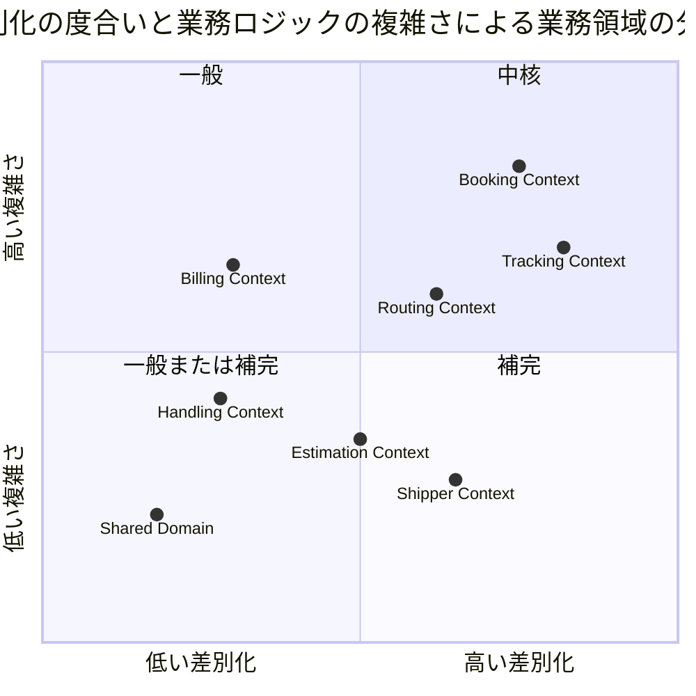
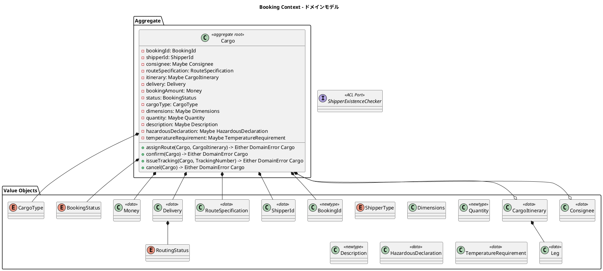
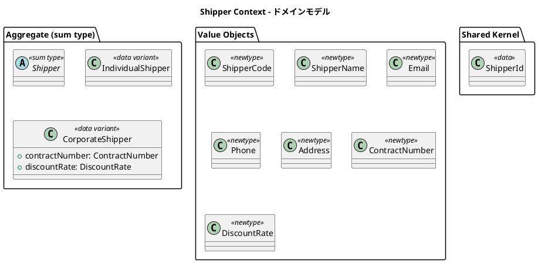
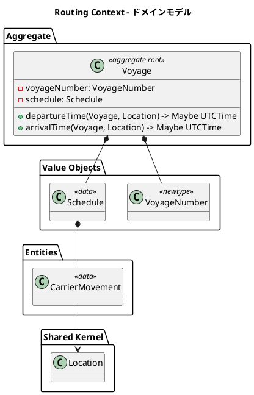
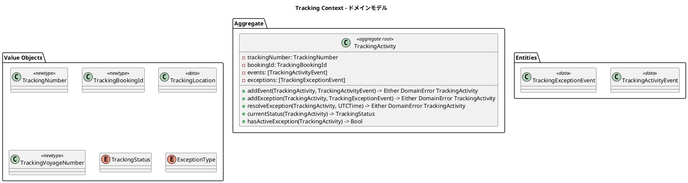
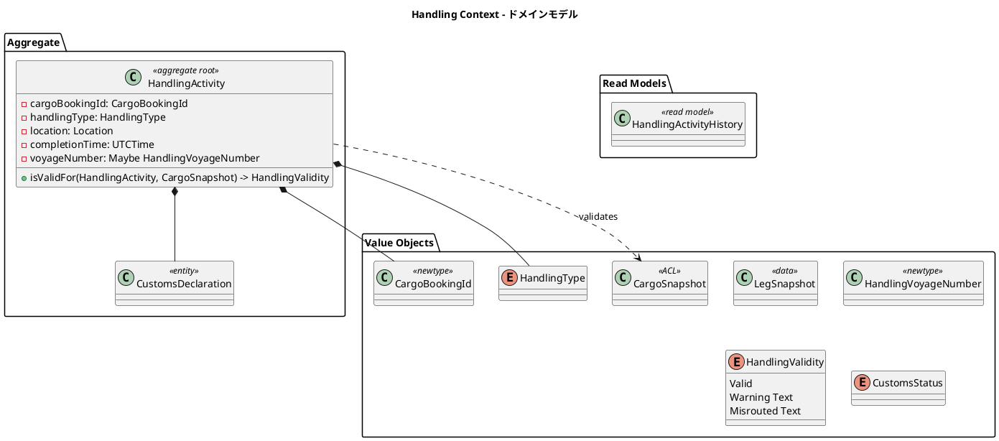
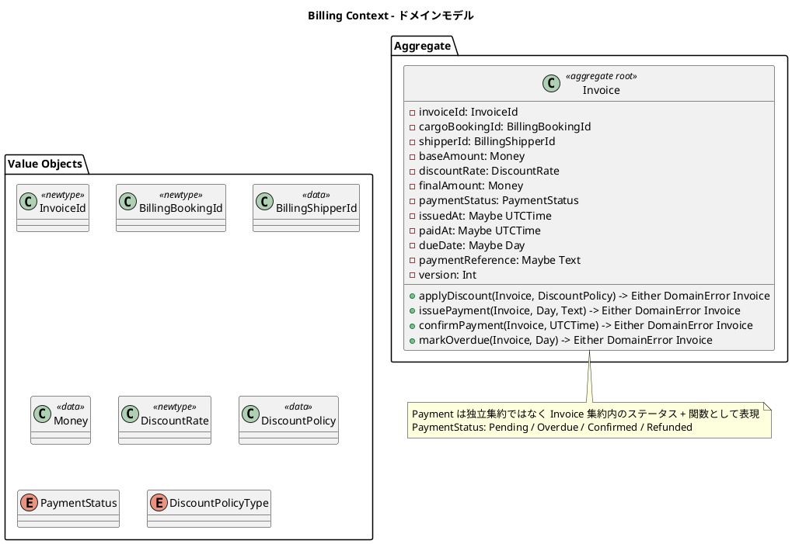
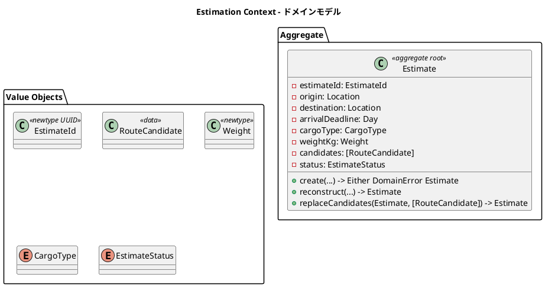
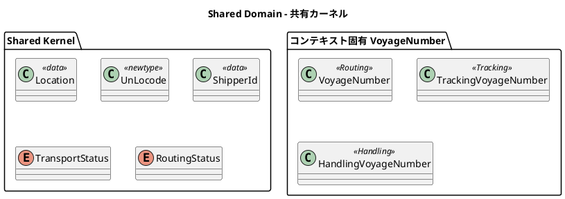
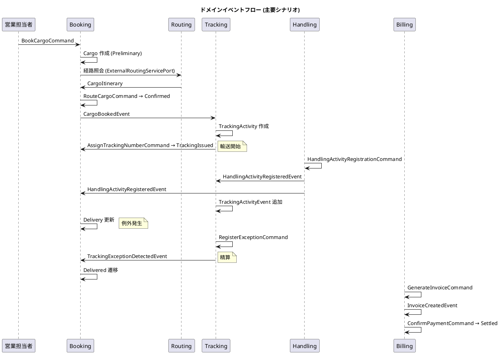

# ドメインモデル設計 - 国際貨物輸送管理システム (Haskell 版)

## 概要

本ドキュメントは、国際貨物輸送管理システム (Haskell 版) の DDD 戦術的設計を定義する。
システムは以下の 8 つの境界付けられたコンテキストで構成される。

| コンテキスト | 日本語名 | 主な責務 |
|---|---|---|
| Booking Context | 予約コンテキスト | 貨物予約の受付・旅程管理・状態遷移 |
| Shipper Context | 荷主コンテキスト | 荷主の登録・管理・法人割引 |
| Routing Context | 経路コンテキスト | 航海スケジュール・経路情報の管理 |
| Tracking Context | 追跡コンテキスト | 貨物追跡・例外イベント管理 |
| Handling Context | 荷役コンテキスト | 荷役作業登録・通関申告管理 |
| Billing Context | 精算コンテキスト | 請求書発行・割引・支払い管理 |
| Estimation Context | 見積コンテキスト | 輸送見積の作成・ルート候補の管理 |
| Shared Domain | 共有ドメイン | 共有カーネル (Location・ShipperId・TransportStatus) |

各コンテキストは自律的に変更可能な集約を持ち、コンテキスト間の連携はドメインイベントおよび ACL ポート (型クラス) を通じて行う。

> [バックエンドアーキテクチャ](architecture_backend.md) のコンテキストマップは主要 5 コンテキスト + 共有カーネルの概観であり、
> 本ドキュメントが Shipper / Estimation を含む戦術的設計の正とする。



## Haskell によるドメインモデル表現規約

ドメイン層はフレームワーク・DB・効果システムに依存しない純粋 Haskell で表現する
([バックエンドアーキテクチャ](architecture_backend.md) の表現方針を本ドキュメントで具体化する)。

| DDD 概念 | Haskell での表現 | 規約 |
|---|---|---|
| 集約ルート・エンティティ | `data` レコード (イミュータブル) | 状態変更関数は `a -> Either DomainError a`。同一性は識別子フィールドで判定 |
| 値オブジェクト (単一値) | `newtype` + スマートコンストラクタ (`mkXxx`) | `mkXxx :: a -> Either DomainError T`。永続化からの復元は `unsafeXxx` |
| 値オブジェクト (複合値) | `data` レコード | 等価性は `deriving Eq` の構造比較 |
| サブタイプを持つ概念 | sum type (`data T = A ... \| B ...`) | パターンマッチの網羅性検査が効く (`-Wincomplete-patterns`) |
| 状態・種別 (列挙) | `data` の 0 引数コンストラクタ | 状態遷移可否は純粋関数として実装 (`canTransitionTo`) |
| コマンド | `data` レコード | アプリケーションサービスへの入力。`Domain.Model.Commands` に配置 |
| ドメインイベント | sum type `DomainEvent` + 個別 `data` | 過去形で命名 (`CargoBookedEvent`) |
| ドメインサービス | モジュール内純粋関数 / 依存を引数で受ける関数 | 状態を持たない |
| リポジトリ (出力ポート) | 型クラス (`class Monad m => CargoRepository m`) | ドメイン層に定義し、インフラ層がインスタンス提供 |
| ファクトリ | モジュール内の `create` (検証あり) / `reconstruct` (永続化復元・検証なし) | 生成経路を 2 系統に限定 |

```haskell
-- 値オブジェクト (単一値): newtype + スマートコンストラクタ
newtype BookingId = BookingId { unBookingId :: Text }
  deriving (Eq, Ord, Show)

mkBookingId :: Text -> Either DomainError BookingId
mkBookingId t
  | T.length t == 9 && T.isPrefixOf "BK-" t && T.all isAlphaNumUpper (T.drop 3 t)
      = Right (BookingId t)
  | otherwise = Left (InvalidBookingId t)

unsafeBookingId :: Text -> BookingId
unsafeBookingId = BookingId  -- 永続化復元専用。アプリケーションコードでは使用しない

-- 値オブジェクト (複合値): 金額は最小通貨単位の Integer で保持
data Money = Money
  { moneyAmount   :: !Integer
  , moneyCurrency :: !Currency
  } deriving (Eq, Show)

addMoney :: Money -> Money -> Either DomainError Money
addMoney (Money a c) (Money b c')
  | c == c'   = Right (Money (a + b) c)
  | otherwise = Left (CurrencyMismatch c c')

multiplyMoney :: Money -> Rational -> Money
multiplyMoney (Money a c) f =
  Money (roundHalfUp (toRational a * f)) c

-- 状態列挙 + 遷移可否
data BookingStatus
  = Preliminary
  | RouteProposed
  | RouteAssigned
  | Confirmed
  | TrackingIssued
  | InTransit
  | Delivered
  | Settled
  | Cancelled
  deriving (Eq, Show, Read, Generic)

canTransitionTo :: BookingStatus -> BookingStatus -> Bool
canTransitionTo Preliminary    RouteProposed   = True
canTransitionTo RouteProposed  RouteAssigned   = True
canTransitionTo RouteAssigned  Confirmed       = True
canTransitionTo RouteAssigned  RouteProposed   = True  -- 経路再設計
canTransitionTo Confirmed      TrackingIssued  = True
canTransitionTo TrackingIssued InTransit       = True
canTransitionTo InTransit      Delivered       = True
canTransitionTo Delivered      Settled         = True
canTransitionTo s              Cancelled
  | s `elem` [Preliminary, RouteProposed, RouteAssigned, Confirmed] = True
canTransitionTo _              _               = False

-- 集約: 状態変更は Either で検証して新しい値を返す
data Cargo = Cargo
  { cargoBookingId          :: !BookingId
  , cargoShipperId          :: !ShipperId
  , cargoRouteSpecification :: !RouteSpecification
  , cargoItinerary          :: !(Maybe CargoItinerary)
  , cargoDelivery           :: !Delivery
  , cargoStatus             :: !BookingStatus
  } deriving (Eq, Show, Generic)

assignRoute :: Cargo -> CargoItinerary -> Either DomainError Cargo
assignRoute cargo newItinerary = do
  unless (isSatisfiedBy (cargoRouteSpecification cargo) newItinerary) $
    Left (RouteNotSatisfied (cargoBookingId cargo))
  transitioned <- transitionTo cargo RouteProposed
  Right $ transitioned { cargoItinerary = Just newItinerary }

transitionTo :: Cargo -> BookingStatus -> Either DomainError Cargo
transitionTo cargo next
  | canTransitionTo (cargoStatus cargo) next
      = Right cargo { cargoStatus = next }
  | otherwise
      = Left (InvalidStatusTransition (cargoBookingId cargo) (cargoStatus cargo) next)
```

> `unless` は `Control.Monad`。`Either DomainError` は `Monad` なので do 記法で連鎖可能。

## ユビキタス言語

| 英語 (コード名) | 日本語 | 使用コンテキスト | 説明 |
|---|---|---|---|
| Cargo | 貨物 | Booking | 予約の中心エンティティ |
| Shipper | 荷主 | Shipper | 個人・法人の 2 種別 |
| CorporateShipper | 法人荷主 | Shipper | 契約番号と割引率を持つ |
| Address | 住所 | Shipper | 最大 500 文字 |
| Dimensions | 寸法 | Booking | 長さ・幅・高さ |
| Quantity | 個数 | Booking | 1 以上 |
| Description | 品名 | Booking | 最大 500 文字 |
| HazardousDeclaration | 危険物申告 | Booking | 危険物クラス・UN 番号・正式輸送品名 |
| TemperatureRequirement | 温度管理条件 | Booking | 最低・最高温度・温度単位 |
| ShipperExistenceChecker | 荷主存在確認 ACL | Booking | Shipper Context への ACL ポート |
| Consignee | 荷受人 | Booking | 氏名・住所・連絡先 |
| BookingId | 予約 ID | Booking | `BK-XXXXXX` 形式 |
| RouteSpecification | ルート仕様 | Booking | 出発地・目的地・到着期限 |
| CargoItinerary | 旅程 | Booking | 1 つ以上の Leg で構成 |
| Leg | 輸送区間 | Booking | 単一航海の積込港〜荷降港 |
| Delivery | 配送状況 | Booking | 輸送状態・経路状態・最終荷役 |
| Voyage | 航海 | Routing | 特定船舶の運送区間集合 |
| Schedule | 航海スケジュール | Routing | 時系列の運送区間一覧 |
| CarrierMovement | 運送区間 | Routing | 出発港・到着港・時刻 |
| TrackingActivity | 追跡レコード | Tracking | 追跡情報全体 |
| TrackingNumber | 追跡番号 | Tracking | 追跡活動一意識別 |
| TrackingActivityEvent | 追跡イベント | Tracking | 時系列の出来事 |
| TrackingExceptionEvent | 追跡例外 | Tracking | 遅延・損傷・紛失・税関保留 |
| HandlingActivity | 荷役作業 | Handling | 荷役作業の記録 |
| HandlingActivityHistory | 荷役履歴 | Handling | Read Model |
| Invoice | 精算書 | Billing | 貨物 1 件の請求書 |
| DiscountPolicy | 割引方針 | Billing | 法人・ボリューム・シーズン割引 |
| Location | 位置情報 | Shared | UN/LOCODE 識別の共有カーネル |
| TransportStatus | 輸送状態 | Shared | 共有列挙型 |
| RoutingStatus | 経路状態 | Shared | NotRouted / Routed / Misrouted |
| Estimate | 見積 | Estimation | 輸送見積エンティティ |
| EstimateId | 見積 ID | Estimation | UUID ベース |
| RouteCandidate | ルート候補 | Estimation | 見積に紐づく候補 |
| EstimateStatus | 見積状態 | Estimation | Created / Expired |

> 列挙値は DB には `SCREAMING_SNAKE_CASE` 文字列 (例: `ROUTE_PROPOSED`) で永続化し、
> Haskell コード上はコンストラクタ名 (例: `RouteProposed`) で表現する。

## アクターとコンテキストの対応

| アクター | 対話するコンテキスト | 主要コマンド |
|---|---|---|
| 営業担当者 | Booking, Estimation | `BookCargoCommand`, `RouteCargoCommand`, `CreateEstimateCommand` |
| 経路設計者 | Routing + Booking | `RegisterVoyageCommand`, `AssignTrackingNumberCommand` |
| 荷役作業員 | Handling | `HandlingActivityRegistrationCommand` |
| 追跡管理者 | Tracking | `AddTrackingEventCommand`, 例外登録 |
| 荷主 | Booking (読取) + Tracking (読取) | 追跡照会・状態確認 |
| 荷受人 | Tracking + Booking | 到着確認・引取 |
| 経理担当者 | Billing | `GenerateInvoiceCommand`, `ConfirmPaymentCommand` |

## 境界付けられたコンテキスト概要

```plantuml
@startuml
title Cargo Tracker - コンテキストマップ

package "Booking Context" #lightblue { class Cargo <<aggregate root>> }
package "Shipper Context" #lightskyblue { class Shipper <<aggregate root>> }
package "Routing Context" #lightgreen { class Voyage <<aggregate root>> }
package "Tracking Context" #lightyellow { class TrackingActivity <<aggregate root>> }
package "Handling Context" #lightcoral { class HandlingActivity <<aggregate root>> }
package "Billing Context" #lightpink { class Invoice <<aggregate root>> }
package "Estimation Context" #wheat { class Estimate <<aggregate root>> }
package "Shared Domain" #lightgray {
  class Location
  class ShipperId
  class TransportStatus
  class RoutingStatus
}

booking --> shared : uses Location, ShipperId
booking ..> shipper : (ACL) ShipperExistenceChecker
shipper --> shared
routing --> shared
tracking --> shared : (ACL) TrackingLocation
handling --> shared
estimation --> shared

booking ..> tracking : CargoBookedEvent / CargoRoutedEvent
handling ..> tracking : HandlingActivityRegisteredEvent
handling ..> booking : HandlingActivityRegisteredEvent
tracking ..> booking : TrackingExceptionDetectedEvent
booking ..> billing : InvoiceRequested (Delivered 後)
estimation ..> booking : 見積→予約引き継ぎ (将来)

note as ACL_NOTE
  **外部 ACL ポート (型クラス)**
  ExternalRoutingServicePort
  CustomsClearancePort
  PaymentGatewayPort
  PortManagementPort
  NotificationPort
end note
@enduml
```

## 1. Booking Context

### ドメインモデル図



### 集約・値オブジェクト一覧

| 種別 | 型名 | 日本語名 | Haskell 表現 | 責務 |
|---|---|---|---|---|
| 集約ルート | `Cargo` | 貨物 | `data` | 状態遷移・旅程・配送状況を統括 |
| 値オブジェクト | `BookingId` | 予約 ID | `newtype Text` | `BK-XXXXXX` 形式 |
| 値オブジェクト | `ShipperId` | 荷主識別子 | `data` | ID と種別 |
| 値オブジェクト | `Consignee` | 荷受人 | `data` | 名前・住所・メール |
| 値オブジェクト | `RouteSpecification` | ルート仕様 | `data` | 出発地・目的地・期限 |
| 値オブジェクト | `CargoItinerary` | 旅程 | `data` (`[Leg]`) | Leg 連結制約をスマートコンストラクタで検証 |
| 値オブジェクト | `Leg` | 輸送区間 | `data` | 単一航海の積込〜荷降区間 |
| 値オブジェクト | `Delivery` | 配送状況 | `data` | 輸送状態・経路状態・最終荷役 |
| 値オブジェクト | `Money` | 金額 | `data` (`Integer` 最小通貨単位) | 多通貨対応 |
| 列挙型 | `BookingStatus` | 予約状態 | sum type | 9 段階のライフサイクル |
| 列挙型 | `ShipperType` | 荷主種別 | sum type | `Individual` / `Corporate` |
| 値オブジェクト | `Dimensions` | 寸法 | `data` | 長さ・幅・高さ |
| 値オブジェクト | `Quantity` | 個数 | `newtype Int` | 1 以上 |
| 値オブジェクト | `Description` | 品名 | `newtype Text` | 最大 500 文字 |
| 値オブジェクト | `HazardousDeclaration` | 危険物申告 | `data` | クラス・UN 番号・正式名称 |
| 値オブジェクト | `TemperatureRequirement` | 温度管理 | `data` | 最低・最高温度・単位 |
| 列挙型 | `CargoType` | 貨物種別 | sum type | `General` / `Hazardous` / `Refrigerated` |
| 列挙型 | `RoutingStatus` | 経路状態 | sum type | `NotRouted` / `Routed` / `Misrouted` |
| ACL ポート | `ShipperExistenceChecker` | 荷主存在確認 | 型クラス | Shipper Context への ACL |

### ビジネスルール

1. 貨物は必ず `BookingId` / `ShipperId` / `CargoType` を持つ
2. `RouteSpecification` の出発地と目的地は異なる (`mkRouteSpecification` で検証)
3. `CargoItinerary` は 1 つ以上の `Leg` で構成され、`legs !! n` の荷降港 == `legs !! (n+1)` の積込港 を `mkCargoItinerary` で検証。違反時 `Left DisconnectedLegs`
4. `BookingStatus` の遷移は `canTransitionTo` に集約。違反は `InvalidStatusTransition` で表現
5. Corporate 荷主は割引適用対象 (割引率上限 30%)
6. Hazardous / Refrigerated の `CargoType` は指定港のみ取扱可能
7. `CargoType == Hazardous` の場合 `hazardousDeclaration` は `Just` でなければならない
8. `CargoType == Refrigerated` の場合 `temperatureRequirement` は `Just` でなければならない
9. Booking Context は Shipper Context に直接依存せず、`ShipperExistenceChecker` 型クラスを通じて荷主存在を確認

### コマンド一覧

```haskell
-- Domain.Model.Commands
data BookCargoCommand = BookCargoCommand
  { bcShipperId :: ShipperId
  , bcRouteSpec :: RouteSpecification
  , bcCargoType :: CargoType
  , bcDimensions :: Maybe Dimensions
  , bcHazardous :: Maybe HazardousDeclaration
  , bcTemperature :: Maybe TemperatureRequirement
  } deriving (Eq, Show)

data AssignToRoutingCommand = AssignToRoutingCommand { atrBookingId :: BookingId }
data ConfirmBookingCommand  = ConfirmBookingCommand  { cbBookingId :: BookingId }
data CancelBookingCommand   = CancelBookingCommand   { cancelBookingId :: BookingId }
data RouteCargoCommand      = RouteCargoCommand      { rcBookingId :: BookingId, rcItinerary :: CargoItinerary }
data AssignTrackingNumberCommand = AssignTrackingNumberCommand
  { atnBookingId :: BookingId, atnTrackingNumber :: TrackingNumber }
```

## 2. Shipper Context

### ドメインモデル図



Java 版の継承 (`CorporateShipper extends Shipper`) は、Haskell 版では **sum type** で表現する。
パターンマッチの網羅性検査により分岐漏れをコンパイル時に検出できる。

```haskell
data Shipper
  = IndividualShipper
      { shipperId      :: !ShipperId
      , shipperCode    :: !ShipperCode
      , shipperName    :: !ShipperName
      , shipperEmail   :: !Email
      , shipperPhone   :: !(Maybe Phone)
      , shipperAddress :: !(Maybe Address)
      }
  | CorporateShipper
      { shipperId      :: !ShipperId
      , shipperCode    :: !ShipperCode
      , shipperName    :: !ShipperName
      , shipperEmail   :: !Email
      , shipperPhone   :: !(Maybe Phone)
      , shipperAddress :: !(Maybe Address)
      , contractNumber :: !ContractNumber
      , discountRate   :: !DiscountRate
      }
  deriving (Eq, Show, Generic)

discountRateOf :: Shipper -> DiscountRate
discountRateOf CorporateShipper{ discountRate = r } = r
discountRateOf IndividualShipper{}                  = zeroDiscount
-- 網羅性検査により、新バリアント追加時のパターン漏れがコンパイル時に検出される
```

### 集約・値オブジェクト一覧

| 種別 | 型名 | Haskell 表現 | 責務 |
|---|---|---|---|
| 集約ルート | `Shipper` | sum type | 個人・法人の 2 バリアント |
| 値オブジェクト | `ShipperCode` | `newtype Text` | `SHP-XXXXXXXX` 自動生成 |
| 値オブジェクト | `ShipperName` | `newtype Text` | 氏名または社名 |
| 値オブジェクト | `Email` | `newtype Text` | 形式検証あり |
| 値オブジェクト | `Phone` | `newtype Text` | 電話番号 |
| 値オブジェクト | `Address` | `newtype Text` | 最大 500 文字 |
| 値オブジェクト | `ContractNumber` | `newtype Text` | 法人契約番号 |
| 値オブジェクト | `DiscountRate` | `newtype` (Scientific or Decimal) | 0.0000〜0.3000 |
| 共有カーネル | `ShipperId` | `data` (UUID 含む) | Shared Domain 配置 |

### ビジネスルール

1. 荷主は必ず `ShipperId` / `ShipperCode` / `ShipperName` / `Email` を持つ
2. `Email` はシステム全体で一意。重複は `EmailAlreadyRegistered` で表現
3. 法人荷主は `ContractNumber` と `DiscountRate` が必須 (sum type の構造で型的に保証)
4. `DiscountRate` の値域は 0.0000〜0.3000。`mkDiscountRate` で検証
5. `ShipperCode` は自動生成 (`SHP-` + UUID 先頭 8 文字)

### コマンド

| コマンド | アクター | 処理 |
|---|---|---|
| `RegisterShipperCommand` | 営業担当者 | 荷主の新規登録。Email 重複チェックと `ShipperCode` 自動生成 |

## 3. Routing Context

### ドメインモデル図



### 集約・値オブジェクト一覧

| 種別 | 型名 | Haskell 表現 | 責務 |
|---|---|---|---|
| 集約ルート | `Voyage` | `data` | 航路スケジュール管理 |
| 値オブジェクト | `VoyageNumber` | `newtype Text` | Routing Context 固有の航海識別子 |
| 値オブジェクト | `Schedule` | `data` (`[CarrierMovement]`) | 順序・連続性を `mkSchedule` で検証 |
| エンティティ | `CarrierMovement` | `data` | 出発港・到着港・出発時刻・到着時刻 |

### ビジネスルール

1. 航海は必ず一意の `VoyageNumber` を持つ
2. `Schedule` は時系列順の `CarrierMovement` で構成。`mkSchedule` で順序・連続性を検証
3. `CarrierMovement` の出発地と到着地は異なる。出発時刻は到着時刻より前 (US24 日付整合性検証)
4. `Location` は UN/LOCODE で一意識別 (例: `JPOSA`, `USLAX`)

### コマンド

| コマンド | アクター | 処理 |
|---|---|---|
| `RegisterVoyageCommand` | 経路設計者 | 新規航海スケジュール登録 (US24) |
| `UpdateScheduleCommand` | 経路設計者 | 運送区間の追加・変更 (US25) |

## 4. Tracking Context

### ドメインモデル図



### 集約・値オブジェクト一覧

| 種別 | 型名 | Haskell 表現 | 責務 |
|---|---|---|---|
| 集約ルート | `TrackingActivity` | `data` | 追跡情報全体。イベント追加は新値を返す |
| エンティティ (集約内) | `TrackingActivityEvent` | `data` | 時系列の出来事 |
| エンティティ (集約内) | `TrackingExceptionEvent` | `data` | 例外記録 |
| 値オブジェクト | `TrackingNumber` | `newtype Text` | 追跡活動の一意識別 |
| 値オブジェクト | `TrackingBookingId` | `newtype Text` | Booking Context との関連 |
| 値オブジェクト | `TrackingLocation` | `data` | コンテキスト固有の位置情報 (ACL 変換) |
| 値オブジェクト | `TrackingVoyageNumber` | `newtype Text` | Tracking 固有の航海番号型 |
| 列挙型 | `TrackingStatus` | sum type | 9 段階の追跡フェーズ。`currentStatus` がイベント履歴から導出 |
| 列挙型 | `ExceptionType` | sum type | `Delay` / `Damage` / `Lost` / `CustomsHold` |
| 値オブジェクト | `ConfirmationCode` (IT5 追加) | `data` | 引取確認コード (US16)。6 桁数字 + 発行/使用時刻 + 試行回数 |
| ドメインサービス | `ConfirmationCodeGenerator` (IT5 追加) | 関数群 | `generate` / `verify` (純粋)。bcrypt ハッシュ化は Application 層でラップ (T-03 準拠) |

#### IT5 追加: 引取確認コード (`ConfirmationCode`)

US16 (引取作業を記録する) の受入基準「確認コード検証成功時のみ CLAIM イベントを発行」を実現するため、Tracking Context に `ConfirmationCode` VO を追加する。TrackingActivity は `claimConfirmation :: Maybe ConfirmationCode` フィールドで発行済み確認コードを保持する。

```haskell
-- Cargotracker.Tracking.Domain.Model.ConfirmationCode
data ConfirmationCode = ConfirmationCode
  { ccValue        :: !Text       -- 6 桁数字 (平文)
  , ccIssuedAt     :: !UTCTime
  , ccUsedAt       :: !(Maybe UTCTime)
  , ccAttemptCount :: !Int        -- 検証失敗回数 (5 回で lock)
  } deriving stock (Eq, Show)

mkConfirmationCode :: UTCTime -> Text -> Either DomainError ConfirmationCode
mkConfirmationCode now raw
  | T.length raw == 6 && T.all isDigit raw
      = Right (ConfirmationCode raw now Nothing 0)
  | otherwise
      = Left (InvalidConfirmationCodeFormat raw)

-- Cargotracker.Tracking.Domain.Service.ConfirmationCodeGenerator (純粋、T-03)
verify :: Text -> ConfirmationCode -> Either DomainError ConfirmationCode
verify input cc
  | ccAttemptCount cc >= 5     = Left (ConfirmationCodeMaxAttemptsExceeded 5)
  | isJust (ccUsedAt cc)       = Left ConfirmationCodeAlreadyUsed
  | input /= ccValue cc        = Left ConfirmationCodeMismatch
  | otherwise                  = Right cc
```

> **セキュリティ規約 (SEC-04)**: 永続化 (`confirmation_code.code_hash`) は bcrypt (cost=10) でハッシュ化し、平文 (`ccValue`) は Application 層で受け取り DB 保存直前に破棄する。ドメイン層は平文を受け取るだけの純粋関数として実装する (T-03 準拠、`bcryptHash` の IO は Application 層でラップ)。

```haskell
data TrackingStatus
  = NotReceived | Received | Loaded | OnboardCarrier | Unloaded
  | AwaitingClaim | Claimed | InException | UnknownStatus
  deriving (Eq, Show, Read, Generic)

-- 導出関数: 状態フィールドを持たず、イベント履歴と未解決例外から計算
currentStatus :: TrackingActivity -> TrackingStatus
currentStatus ta
  | hasActiveException ta = InException
  | otherwise             = deriveFromEvents (taEvents ta)
```

> `currentStatus` は保持する状態フィールドでなく、**イベント履歴と未解決例外から導出する純粋関数**として実装する。
> 状態とイベントの二重管理による不整合を構造的に排除する。

### ビジネスルール

1. 追跡活動は必ず一意の `TrackingNumber` を持つ
2. `TrackingActivityEvent` は時系列順。`addEvent` は最終イベントより過去の時刻を拒否
3. `ExceptionType == Lost` の場合、`escalationFlag` を `True` に設定しエスカレーション通知 (US20)。ユビキタス言語注記: `Lost` を「紛失状態」「紛失事象」両方の意味で統一使用し、`Loss` は用いない
4. `CustomsHold` 例外は税関システム (`CustomsClearancePort`) からの通知で自動登録
5. `resolveException` 実行により `TrackingStatus` は例外発生前の状態に復帰 (`currentStatus` の導出ロジックで自然に実現)

### コマンド

| コマンド | アクター | 処理 |
|---|---|---|
| `AssignTrackingNumberCommand` | Booking (イベント駆動) | `TrackingActivity` 新規作成 |
| `AddTrackingEventCommand` | 追跡管理者 | イベント追加 |
| `RegisterExceptionCommand` | 追跡管理者・税関 | 例外登録 |
| `ResolveExceptionCommand` | 追跡管理者 | 例外解決 |
| `IssueConfirmationCodeCommand` (IT5) | Tracking (`CargoBookedEvent` 購読) | 6 桁確認コード発行 + bcrypt 保存 |
| `VerifyClaimConfirmationCommand` (IT5) | 荷役作業員 (US16) | 引取確認 + Claim イベント追加 |

## 5. Handling Context

### ドメインモデル図



### 集約・値オブジェクト一覧

| 種別 | 型名 | Haskell 表現 | 責務 |
|---|---|---|---|
| 集約ルート | `HandlingActivity` | `data` | 荷役作業登録と妥当性検証 |
| エンティティ (集約内) | `CustomsDeclaration` | `data` | 通関申告の状態管理 |
| 値オブジェクト | `CargoBookingId` | `newtype Text` | Booking Context との関連 |
| 列挙型 | `HandlingType` | sum type | `Receive` / `Load` / `Unload` / `Customs` / `Claim` |
| 値オブジェクト | `CargoSnapshot` | `data` | ACL 経由の貨物情報 |
| 値オブジェクト | `LegSnapshot` | `data` | スナップショット内区間 |
| 値オブジェクト | `HandlingVoyageNumber` | `newtype Text` | Handling 固有の航海番号型 |
| 列挙型 | `HandlingValidity` | sum type with payload | `Valid` / `Warning Text` / `Misrouted Text` |
| 列挙型 | `CustomsStatus` | sum type | `Pending` / `Cleared` / `Held` / `Rejected` |
| Read Model | `HandlingActivityHistory` | `data` (Query DTO) | 集約と分離 |

```haskell
data HandlingValidity
  = Valid
  | Warning   !Text   -- 警告 (続行可能)
  | Misrouted !Text   -- 経路逸脱確定
  deriving (Eq, Show)

requiresVoyageNumber :: HandlingType -> Bool
requiresVoyageNumber Load   = True
requiresVoyageNumber Unload = True
requiresVoyageNumber _      = False
```

### ビジネスルール

荷役妥当性検証 (`isValidFor`) のデシジョンテーブル:

| 荷役タイプ | VoyageNumber 必須 | 場所チェック | 不一致時 |
|---|---|---|---|
| `Receive` | 不要 | 出発港と一致 | `Warning` |
| `Load` | 必須 | 旅程の積込港と一致 | `Misrouted` |
| `Unload` | 必須 | 旅程の荷降港と一致 | `Misrouted` |
| `Claim` | 不要 | 目的港と一致 | `Warning` |

追加ルール:

1. Load / Unload で `Misrouted` 確定時、Booking Context の `RoutingStatus` を `Misrouted` に更新 (イベント経由)
2. `CustomsDeclaration` が `Cleared` になるまで `Claim` は実施不可
3. `HandlingActivityHistory` はクエリ専用 Read Model として集約と切り離す

### コマンド

| コマンド | アクター | 処理 |
|---|---|---|
| `HandlingActivityRegistrationCommand` | 荷役作業員 | 妥当性検証付きで荷役登録 |
| `RegisterCustomsDeclarationCommand` | 荷役作業員 | 通関申告新規登録 |
| `UpdateCustomsStatusCommand` | 税関 (ACL) | 通関状態更新 |

## 6. Billing Context

### ドメインモデル図



### 集約・値オブジェクト一覧

| 種別 | 型名 | Haskell 表現 | 責務 |
|---|---|---|---|
| 集約ルート | `Invoice` | `data` | 請求書発行・管理 |
| 値オブジェクト | `InvoiceId` | `newtype Text` | 精算書一意識別子 |
| 値オブジェクト | `BillingBookingId` | `newtype Text` | Cargo との関連 |
| 値オブジェクト | `BillingShipperId` | `data` | `isCorporate` 関数内包 |
| 値オブジェクト | `Money` | `data` (`Integer` 最小単位) | 金額と通貨 |
| 値オブジェクト | `DiscountRate` | `newtype` (`Decimal`/`Scientific`) | 0〜30% |
| 値オブジェクト | `DiscountPolicy` | `data` | 法人・ボリューム・シーズン割引 |
| 列挙型 | `PaymentStatus` | sum type | `Pending` / `Confirmed` / `Overdue` / `Refunded` |
| 列挙型 | `DiscountPolicyType` | sum type | `CorporateStandard` / `VolumeDiscount` / `Seasonal` / `NoDiscount` |

### ビジネスルール

1. `Invoice` は `BookingStatus == Delivered` 後にのみ発行可能
2. 法人荷主には最大 30% の割引を適用
3. 支払期限 (`issuedAt + 30 日`) 超過時、`PaymentStatus` を `Overdue` に更新
4. 支払い確定後のキャンセルは `IssueRefundCommand` で対応し `Refunded` に遷移

料金計算:

```text
基本料金 = 距離係数 × 重量 (kg) × 貨物種別係数
  General: 1.0 / Hazardous: 1.8 / Refrigerated: 1.5

割引後料金 = 基本料金 × (1 - 割引率)
  Corporate: 0〜30% / Individual: 0%
```

> 金額計算は `Money` (`Integer` 最小通貨単位) 上で行い、端数は `HALF_UP` で丸める。
> `Double` は金額計算に使用しない。

### コマンド

| コマンド | アクター | 処理 |
|---|---|---|
| `GenerateInvoiceCommand` | 経理担当者 | 請求書発行 |
| `ConfirmPaymentCommand` | 経理担当者 | 支払い確認 |

## 7. Estimation Context

### ドメインモデル図



### 集約・値オブジェクト一覧

| 種別 | 型名 | Haskell 表現 | 責務 |
|---|---|---|---|
| 集約ルート | `Estimate` | `data` | 見積エンティティ |
| 値オブジェクト | `EstimateId` | `newtype UUID` | 一意識別子 |
| 値オブジェクト | `RouteCandidate` | `data` | 航海番号・経由港・輸送日数・コスト |
| 値オブジェクト | `Weight` | `newtype` (`Decimal`/`Scientific`) | 正の値のみ |
| 列挙型 | `CargoType` | sum type | Booking と同一値 |
| 列挙型 | `EstimateStatus` | sum type | `Created` / `Expired` |
| リポジトリ | `EstimateRepository` | 型クラス | `save` / `findByEstimateId` / `findAll` |

### ビジネスルール

1. 見積は必ず `EstimateId` / `origin` / `destination` / `arrivalDeadline` / `CargoType` / `weightKg` を持つ
2. `origin` と `destination` は異なる (`createEstimate` で検証)
3. `weightKg` は正の値 (`Weight` の newtype で型的に保証)
4. `RouteCandidate` の `voyageNumber` は空でない、`transitDays` は正、`estimatedCost` は正
5. デフォルトステータスは `Created`
6. ルート候補生成はスタブ実装。将来 `ExternalRoutingServicePort` 経由に差し替え

### コマンド

| コマンド | アクター | 処理 |
|---|---|---|
| `CreateEstimateCommand` | 営業担当者 | 見積新規作成 + スタブ候補付与 |

### Booking Context との関係

- **共有**: `CargoType` 列挙型は両コンテキストで同一値
- **参照**: `Location` (Shared Domain) を経由
- **将来の連携**: 見積→予約引き継ぎは将来イテレーションで実装

## 8. Shared Domain

### ドメインモデル図



### 共有コンポーネント一覧

| 種別 | 型名 | Haskell 表現 | 責務 |
|---|---|---|---|
| 共有カーネル | `Location` | `data` | UN/LOCODE 識別。全コンテキスト共有 |
| 共有カーネル | `UnLocode` | `newtype Text` | 5 文字コード。`mkUnLocode` で検証 |
| 共有カーネル | `ShipperId` | `data` (UUID) | Booking と Shipper で共有 |
| 共有列挙型 | `TransportStatus` | sum type | 9 段階の輸送フェーズ |
| 共有列挙型 | `RoutingStatus` | sum type | `NotRouted` / `Routed` / `Misrouted` |
| 共有 | `DomainEvent` | sum type | イベント発行ポートの契約型 |
| 共有 | `DomainError` | sum type | `Either` 左側の契約型 |

```haskell
data UnLocode = UnLocode { unUnLocode :: !Text }
  deriving (Eq, Ord, Show)

mkUnLocode :: Text -> Either DomainError UnLocode
mkUnLocode t
  | T.length t == 5
    && T.all isAsciiUpper (T.take 2 t)
    && T.all (\c -> isAsciiUpper c || isDigit c) (T.drop 2 t)
      = Right (UnLocode t)
  | otherwise = Left (InvalidUnLocode t)

data TransportStatus
  = TsNotReceived | TsReceived | TsLoaded | TsOnboardCarrier | TsUnloaded
  | TsAwaitingClaim | TsClaimed | TsInException | TsUnknown
  deriving (Eq, Show, Read, Generic)
```

> **`TransportStatus` の値について**: 上記 9 値を正とする。要件定義の貨物状態遷移との対応は
> 受領待ち = `TsNotReceived`、受領済 = `TsReceived`、積込済 = `TsLoaded`、輸送中 = `TsOnboardCarrier`、
> 荷降し済 = `TsUnloaded`、引取待ち = `TsAwaitingClaim`、引取済 = `TsClaimed`、例外発生・対応中 = `TsInException`。

### `TransportStatus` と `TrackingStatus` の関係

Tracking Context の `TrackingStatus` と共有ドメインの `TransportStatus` は同じ 9 段階のフェーズを表すが、
意図的に**別の型**として定義する。

| 型 | 所属 | 役割 |
|---|---|---|
| `TrackingStatus` | Tracking Context 固有 | `currentStatus` がイベント履歴から導出する内部状態 |
| `TransportStatus` | Shared Domain | コンテキスト間連携 (イベントペイロード)・画面表示の公開語彙 |

連携規約:

- Tracking Context の出口 (イベント発行・クエリサービス) で `trackingStatusToTransportStatus` により変換。全域かつ 1 対 1 (9 値 ↔ 9 値)
- 他コンテキストが `TrackingStatus` を直接参照することを禁止 (import 規約チェッカで強制)
- 両 sum type の対応はプロパティテスト (hedgehog) で全網羅検証

```haskell
trackingStatusToTransportStatus :: TrackingStatus -> TransportStatus
trackingStatusToTransportStatus NotReceived    = TsNotReceived
trackingStatusToTransportStatus Received       = TsReceived
trackingStatusToTransportStatus Loaded         = TsLoaded
trackingStatusToTransportStatus OnboardCarrier = TsOnboardCarrier
trackingStatusToTransportStatus Unloaded       = TsUnloaded
trackingStatusToTransportStatus AwaitingClaim  = TsAwaitingClaim
trackingStatusToTransportStatus Claimed        = TsClaimed
trackingStatusToTransportStatus InException    = TsInException
trackingStatusToTransportStatus UnknownStatus  = TsUnknown
-- ↑ 網羅性検査 (-Wincomplete-patterns) でケース追加時のコンパイルエラーを保証
```

### `VoyageNumber` のコンテキスト分離設計

`VoyageNumber` は各コンテキストが独自の newtype を保持する。型レベルでコンテキスト間の取り違えを防止する
(`VoyageNumber` を `TrackingVoyageNumber` の引数に渡すとコンパイルエラー)。

| コンテキスト | 型名 | 役割 |
|---|---|---|
| Routing | `VoyageNumber` | 航海スケジュール識別子 |
| Tracking | `TrackingVoyageNumber` | 追跡イベントに紐づく航海番号 (ACL 変換) |
| Handling | `HandlingVoyageNumber` | 荷役作業に紐づく航海番号 (ACL 変換) |

### ビジネスルール

1. `Location` の変更は全コンテキストチームの合意のもとに行う (Shared Kernel の制約)
2. UN/LOCODE は国際規格 (ISO 3166-1 alpha-2 + 3 文字) に従う。`mkUnLocode` で検証
3. `TransportStatus` と `RoutingStatus` は Booking と Tracking / Handling 間で整合性を保つ (イベント連携で同期)

## ドメインエラー

すべての検証失敗は `DomainError` sum type で表現する。`Either DomainError a` を返す関数を組み合わせる。

```haskell
data DomainError
  -- Booking
  = InvalidBookingId         !Text
  | InvalidStatusTransition  !BookingId !BookingStatus !BookingStatus
  | RouteNotSatisfied        !BookingId
  | DisconnectedLegs
  | HazardousDeclarationRequired
  | TemperatureRequirementRequired
  -- Shipper
  | EmailAlreadyRegistered   !Text
  | InvalidEmail             !Text
  | DiscountRateOutOfRange   !Rational
  -- Routing
  | InvalidVoyageNumber      !Text
  | InvalidScheduleOrder
  -- Tracking
  | InvalidTrackingNumber    !Text
  | EventTimestampInPast
  -- Handling
  | CustomsNotCleared        !CargoBookingId
  -- Billing
  | CurrencyMismatch         !Currency !Currency
  | NotDeliveredYet          !BillingBookingId
  -- Shared
  | InvalidUnLocode          !Text
  | ConcurrentModification   !Text
  deriving (Eq, Show)
```

## ドメインイベント

イベントは `DomainEvent` sum type として共有カーネルに定義し、個別イベントは各コンテキストの
`Domain.Model.Events` に配置する。

```haskell
data DomainEvent
  = DECargoBooked       !CargoBookedEvent
  | DECargoRouted       !CargoRoutedEvent
  | DEHandlingRegistered !HandlingActivityRegisteredEvent
  | DETrackingExceptionDetected !TrackingExceptionDetectedEvent
  | DEInvoiceCreated    !InvoiceCreatedEvent
  deriving (Eq, Show)
```

| イベント | 発生元 | 処理先 | 内容 |
|---|---|---|---|
| `CargoBookedEvent` | Booking | Tracking | 追跡番号割り当て依頼 |
| `CargoRoutedEvent` | Booking | Tracking | 旅程確定後の経路同期 |
| `HandlingActivityRegisteredEvent` | Handling | Tracking, Booking | 荷役 → 状態同期 |
| `TrackingExceptionDetectedEvent` | Tracking | Booking, Notification | 例外検知 |
| `InvoiceCreatedEvent` | Billing | Notification | 請求書発行通知 |

### ドメインイベントフロー



## 外部システム ACL ポート

ACL ポートは型クラスとして定義し、インフラ層の `http-client` ベースの実装が `AppM` のインスタンスを提供する。

| ポート (型クラス) | 対応外部システム | 責務 |
|---|---|---|
| `ExternalRoutingServicePort m` | 外部経路最適化 | 最適 `CargoItinerary` の取得 |
| `CustomsClearancePort m` | 税関 | 通関申告の提出・状態照会 |
| `PaymentGatewayPort m` | 決済機関 | 支払い処理 |
| `PortManagementPort m` | 港湾管理 | 取扱可能貨物種別照会 |
| `NotificationPort m` | 通知 | メール / SMS 通知送信 |

```haskell
class Monad m => ExternalRoutingServicePort m where
  findOptimalItinerary :: RouteSpecification -> m (Either DomainError CargoItinerary)

class Monad m => NotificationPort m where
  notify :: NotificationKind -> ShipperId -> Text -> m ()
```

## 並行性制御 (楽観ロック)

イミュータブル集約は単一トランザクション内の整合性を保証するが、複数ユーザーが同じ集約を同時に開いて
別々に上書きする lost update は別問題であり、楽観ロックで防止する。

- すべての集約ルートテーブルに `version` カラム (`INTEGER NOT NULL DEFAULT 0`) を持たせる
- リポジトリの `save` は `UPDATE ... SET version = version + 1 WHERE id = ? AND version = ?` で比較更新し、
  更新行数 0 の場合は `DomainError.ConcurrentModification` を返す (先勝ち)
- アプリケーションサービスは `Left ConcurrentModification` を受けたら HTTP 409 相当として扱う
- 対象は更新系操作を持つ集約 (Cargo / Voyage / TrackingActivity / Invoice / Estimate / Shipper)。追記のみのテーブル
  (イベント系) は対象外
- 競合シナリオは hspec-wai 統合テストで検証

## 集約設計の判断

### Booking Context: `Cargo` 集約

`Cargo` を集約ルートとし、`BookingId` / `ShipperId` / `RouteSpecification` / `CargoItinerary` / `Delivery` を集約内に含める。

**根拠**: 予約の状態遷移 (`BookingStatus`) はこれらが一体として整合性を保つ必要がある。特に `CargoItinerary` の Leg 連結制約は単一トランザクション内で検証しなければ不整合が生じる。`Consignee` は `Cargo` に対して 1 対 1 のため、独立した集約とせず値オブジェクトとして含める。イミュータブル設計により、検証失敗の中間状態の集約はそもそも存在し得ない。

### Shipper Context: `Shipper` 集約 (sum type)

`Shipper` を sum type とし、`IndividualShipper` / `CorporateShipper` の 2 バリアントで表現する。

**根拠**: Java 版の継承を sum type で表現することで、「法人のみが契約番号・割引率を持つ」という制約が型構造そのものになり、`Nothing` チェックや実行時検証が不要になる。割引適用などの分岐はパターンマッチの網羅性検査で漏れを防げる。

### Routing Context: `Voyage` 集約

`Voyage` を集約ルートとし、`Schedule` (`[CarrierMovement]`) を内包する。

**根拠**: `Schedule` と `CarrierMovement` は `Voyage` の文脈でのみ意味を持つ。時系列整合性は `Voyage` 単位で保証する必要があり、`mkSchedule` (スマートコンストラクタ) に集約する。

### Tracking Context: `TrackingActivity` 集約

`TrackingActivity` を集約ルートとし、`TrackingActivityEvent` と `TrackingExceptionEvent` を集約内エンティティとして管理する。

**根拠**: 追跡状態は時系列の全イベントと例外状態を総合的に判定するため、単一集約とする。`currentStatus` をイベント履歴からの**導出関数**として実装し、状態フィールドの二重管理を排除する。「例外発生前の状態に復帰」も、例外解決後に導出ロジックが自然に元の状態を返すことで実現される。

### Handling Context: `HandlingActivity` 集約 + Read Model 分離

`HandlingActivity` を集約ルートとし、`CustomsDeclaration` を集約内エンティティとした。荷役履歴は Read Model として分離。

**根拠**: 個々の荷役作業は独立した記録単位で互いに強い整合性制約を持たない。一方、通関申告と荷役作業は「`Cleared` にならないと `Claim` 不可」という不変条件があるため、同一集約に含める。クエリ専用の履歴参照は Read Model (CQRS クエリ側 DTO) として分離し、コマンド側の複雑性を低減する。妥当性検証結果は payload 付き sum type `HandlingValidity` で表現し、警告と経路逸脱を型で区別する。

### Billing Context: `Invoice` 集約

`Invoice` を集約ルートとし、`DiscountPolicy` はドメインサービスでなく値オブジェクトとして `Invoice` に委譲。

**根拠**: 請求書 1 件の整合性 (基本料金・割引率・最終金額の一貫性) は `Invoice` 集約内で保証される。`DiscountPolicy` の割引率計算は `applyDiscount` 内で完結するため、外部ドメインサービスとして切り出す必要はない。金額は `Money` (`Integer` 最小通貨単位) で表現。

#### `DiscountPolicy` の sum type 表現 (M-06 反映)

割引種別は **sum type** で表現し、パターンマッチの網羅性検査により「新しい割引種別追加時のロジック漏れ」をコンパイル時に検出する。

```haskell
data DiscountPolicy
  = CorporateStandard !DiscountRate     -- 法人標準割引 (契約割引率)
  | VolumeDiscount    !VolumeThreshold !DiscountRate  -- ボリューム割引 (重量閾値超過時)
  | Seasonal          !SeasonId !DiscountRate  -- シーズン割引 (期間限定)
  | NoDiscount                          -- 割引なし (個人荷主のデフォルト)
  deriving (Eq, Show, Generic)

-- 割引率算出: 全パターン網羅 (-Wincomplete-patterns でコンパイル時検出)
calculateDiscountRate :: DiscountPolicy -> Shipper -> Money -> DiscountRate
calculateDiscountRate (CorporateStandard r) _ _ = r
calculateDiscountRate (VolumeDiscount threshold r) _ amount
  | moneyAmount amount >= threshold = r
  | otherwise                       = zeroDiscount
calculateDiscountRate (Seasonal sid r) _ _ = r  -- 期間判定は呼び出し側
calculateDiscountRate NoDiscount _ _        = zeroDiscount
```

利点:

- **新しい割引種別 (例: `Promotional`) の追加時、`calculateDiscountRate` のパターン漏れがコンパイルエラー**
- DB 永続化時は `policy_type VARCHAR(30) CHECK (... IN ('CORPORATE_STANDARD', 'VOLUME_DISCOUNT', 'SEASONAL', 'NO_DISCOUNT'))` で対応
- パラメータ (DiscountRate, VolumeThreshold, SeasonId) は別カラムに保存

新規割引追加の影響範囲:

1. `DiscountPolicy` に新コンストラクタ追加
2. `calculateDiscountRate` にパターンマッチ追加 (コンパイラが強制)
3. DB CHECK 制約を更新するマイグレーション追加
4. テストケース追加

### Estimation Context: `Estimate` 集約

`Estimate` を集約ルートとし、`RouteCandidate` のリストを集約内に保持。

**根拠**: 見積とルート候補は 1 対多の関係にあり、ルート候補は見積の文脈でのみ意味を持つ。`replaceCandidates` で一括入替するため、トランザクション整合性の観点から単一集約に含める。

## ファクトリパターン

```haskell
-- create: 検証あり (新規生成専用)
createCargo :: BookCargoCommand -> Either DomainError Cargo
createCargo cmd = do
  bookingId <- generateBookingId
  -- 危険物・冷凍貨物の必須情報チェック
  case bcCargoType cmd of
    Hazardous   | Nothing <- bcHazardous cmd  -> Left HazardousDeclarationRequired
    Refrigerated| Nothing <- bcTemperature cmd -> Left TemperatureRequirementRequired
    _ -> Right ()
  Right Cargo
    { cargoBookingId          = bookingId
    , cargoShipperId          = bcShipperId cmd
    , cargoRouteSpecification = bcRouteSpec cmd
    , cargoItinerary          = Nothing
    , cargoDelivery           = initialDelivery
    , cargoStatus             = Preliminary
    , ...
    }

-- reconstruct: 検証なし (永続化からの復元専用)
reconstructCargo :: CargoRow -> Cargo
reconstructCargo row = Cargo
  { cargoBookingId = unsafeBookingId (rowBookingId row)
  , ...
  }
```

## IT2 / IT3 実装反映 (U-09)

本ドキュメントは戦術的設計の正準である一方、IT2-IT3 で実装した追加要素は
以下にまとめる (本セクション以前の記述と矛盾する場合は本セクションを正とする)。
詳細はリポジトリの該当モジュール (`apps/cargo-tracker/src/Cargotracker/`) を参照。

### IT2 反映 (2026-06-27 完了)

| 概念 | モジュール / 型 | 補足 |
|---|---|---|
| `CargoType` sum type | `Booking.Domain.Model.Value.CargoType` (`General` / `Hazardous` / `Refrigerated`) | スマートコンストラクタで HazardousDeclaration / TemperatureRequirement の必須性を型レベル排除 |
| `HazardousDeclaration` 値オブジェクト | `Booking.Domain.Model.Value.HazardousDeclaration` | クラス / UN 番号 / 正式輸送品名 |
| `TemperatureRequirement` 値オブジェクト | `Booking.Domain.Model.Value.TemperatureRequirement` | 最低 / 最高 / 単位 (C / F) |
| `Estimate` 集約 | `Estimation.Domain.Model.Estimate` | `EstimateStatus` (Created / Expired) + `[RouteCandidate]` |
| `submitBooking` / `requestRouting` | `Booking.Domain.Model.Cargo` | Draft → Submitted → RouteProposed の段階遷移 |

### IT3 反映 (US07 / US08a / US27)

#### Routing Context: 航海検索ドメインサービス (US07)

| 概念 | モジュール / 型 | 補足 |
|---|---|---|
| `VoyageSearchCriteria` 値オブジェクト | `Routing.Domain.Model.Value.VoyageSearchCriteria` | 出発地 / 目的地 / 出発期間 from..to。`mkVoyageSearchCriteria` で from > to (`InvalidSearchPeriod`) / 同一港 (`SameOriginDestination`) を検証 |
| `VoyageQuery` ドメインサービス | `Routing.Domain.Service.VoyageQuery` | `matchesCriteria :: VoyageSearchCriteria -> Voyage -> Bool` + `sortByDeparture :: [Voyage] -> [Voyage]`。純粋関数 |

> `VoyageSearchCriteria` の判定規約: 出発地は voyage の **先頭** `CarrierMovement.departureLocation`、目的地は **末尾** `CarrierMovement.arrivalLocation` で照合する (経由便も含む)。

#### Booking Context: 通関情報集約 (US27)

| 概念 | モジュール / 型 | 補足 |
|---|---|---|
| `CustomsDeclaration` 集約 | `Booking.Domain.Model.CustomsDeclaration` | BookingId + HsCode + brokerName + DeclarationStatus。`mkCustomsDeclaration` で一括検証 |
| `HsCode` 値オブジェクト | `Booking.Domain.Model.Value.HsCode` | `newtype HsCode = Text` + `mkHsCode` (6-10 桁の数字を検証) |
| `DeclarationStatus` 列挙型 | `Booking.Domain.Model.State.DeclarationStatus` | sum type `Pending` / `Cleared` / `Held` / `Rejected`。DB は SCREAMING_SNAKE_CASE 文字列 |

> **IT3 スコープ調整 (U-09 注記)**: 元の戦術的設計 (§5 Handling Context) では `CustomsDeclaration` を Handling Context 内の集約内エンティティとしていた。IT3 では Handling Context (handling_activity テーブル) が未実装のため、US27 の要求 (国際輸送の通関最小機能) を満たすために `CustomsDeclaration` を **Booking Context 内の独立集約** として実装した。Handling Context 実装時 (IT4+) に再配置を検討する。

#### ADR-0005: BC 固有エラーの分離 (Phase 1)

`Cargotracker.Booking.Domain.Error` を新設し、`BookingError` 型エイリアスと `pattern BookingNotFound` / `pattern InvalidStateTransition` (PatternSynonyms) を提供する。`Shared.Domain.DomainError` の該当コンストラクタには段階移行のための注記を付与した。詳細は [ADR 0005](../adr/0005-bounded-context-error-types.md)。

### `DomainError` の IT2 / IT3 追加コンストラクタ

| コンストラクタ | 追加 IT | 用途 |
|---|---|---|
| `InvalidStateTransition !Text !Text` | IT2 | 状態遷移違反 (from / to の状態名を保持) |
| `BookingNotFound !Text` | IT2 | 予約 (Cargo) 未検出 |
| `InvalidSearchPeriod !UTCTime !UTCTime` | IT3 | 航海検索の出発期間が逆順 |
| `SameOriginDestination !Text` | IT3 | 出発地 = 目的地 |
| `InvalidHsCode !Text` | IT3 | HS コード形式不正 |
| `InvalidDeclarationStatus !Text` | IT3 | 申告ステータス文字列が想定値外 |
| `InvalidBrokerName !Text` | IT3 | 通関業者名が空または 100 文字超 |

## 参照

- [バックエンドアーキテクチャ](architecture_backend.md)
- [データモデル設計](data-model.md)
- [要件定義書](../requirements/requirements_definition.md)
- [システムユースケース](../requirements/system_usecase.md)
- [ユーザーストーリー](../requirements/user_story.md)
- [ADR-0005 BC 固有エラーの分離](../adr/0005-bounded-context-error-types.md)
- Scala 版参考: `tmp/case-study-cargo-tracker/docs/design/domain-model.md`
