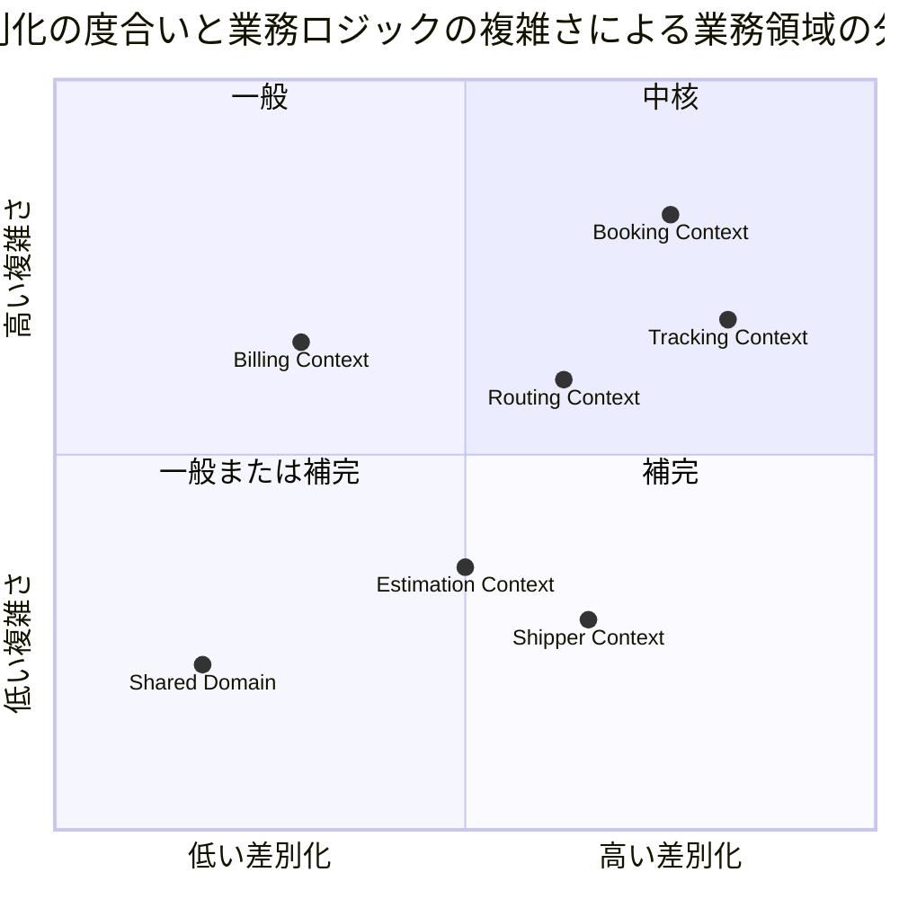
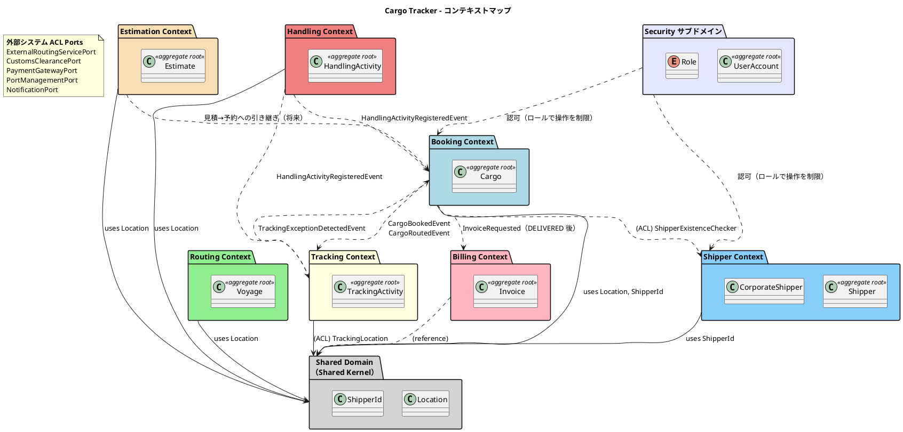
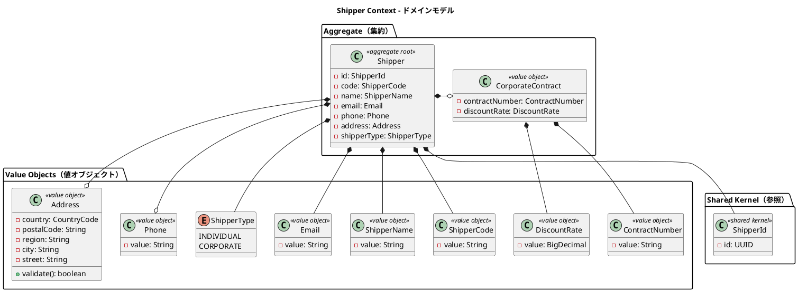
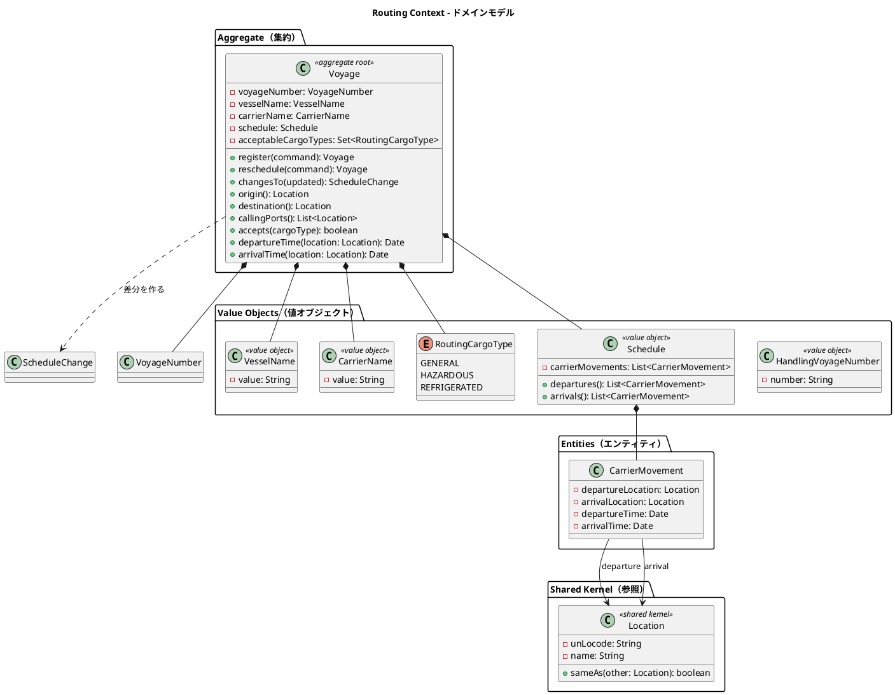
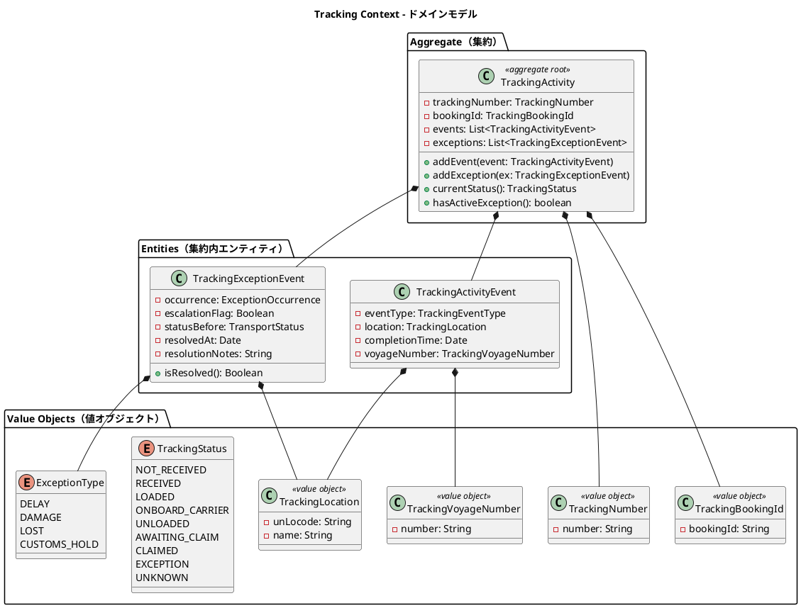
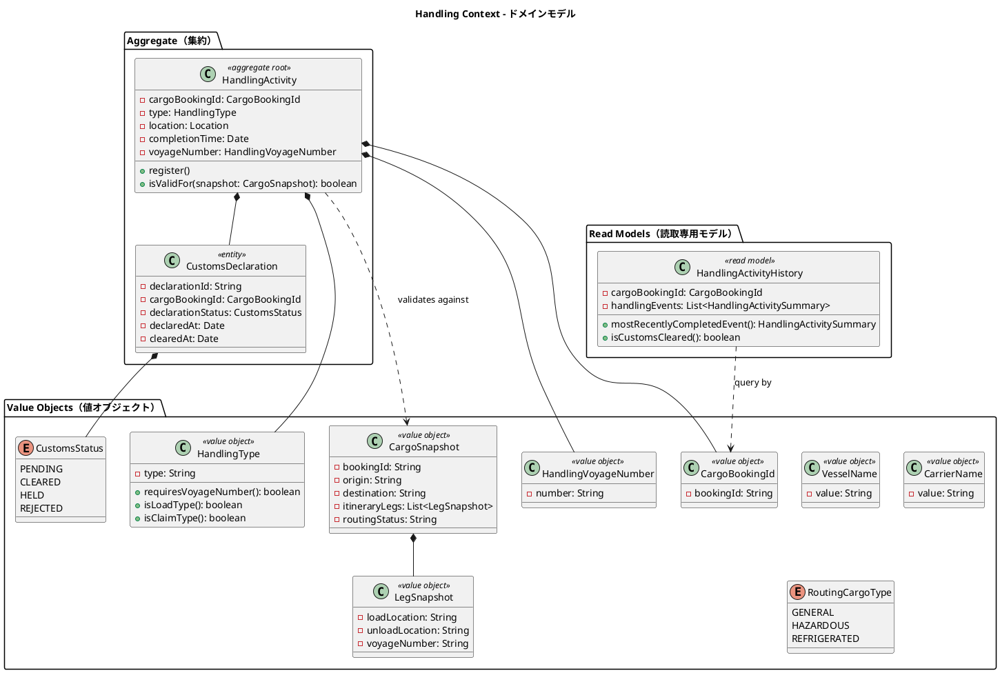
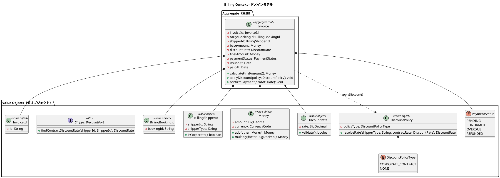
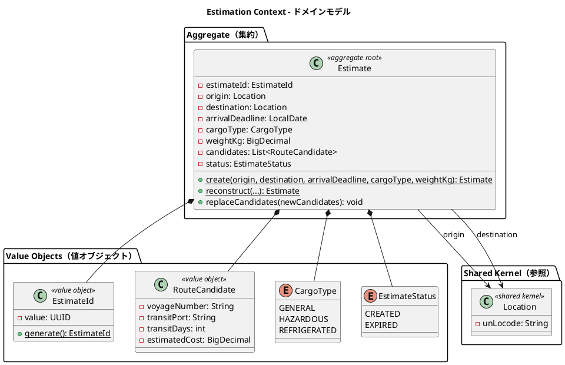
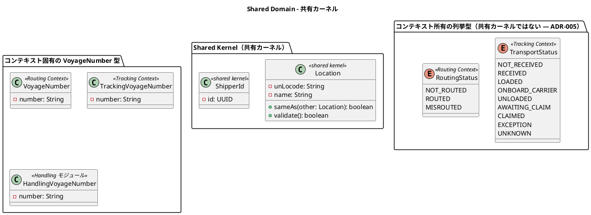

```plantuml
@startuml
title Booking Context - ドメインモデル

package "Aggregate（集約）" {
  class Cargo <<aggregate root>> {
    -bookingId: BookingId
    -shipperId: ShipperId
    -consignee: Consignee
    -routeSpecification: RouteSpecification
    -cargoItinerary: CargoItinerary
    -delivery: Delivery
    -bookingAmount: Money
    -bookingStatus: BookingStatus
    -cargoType: CargoType
    -dimensions: Dimensions
    -quantity: Quantity
    -description: Description
    -hazardousDeclaration: HazardousDeclaration
    -temperatureRequirement: TemperatureRequirement
  }
}

package "Value Objects（値オブジェクト）" {
  class BookingId <<value object>> {
    -id: String
  }
  class ShipperId <<value object>> {
    -id: String
    -shipperType: ShipperType
  }
  class Consignee <<value object>> {
    -name: String
    -address: String
    -contactEmail: String
  }
  class RouteSpecification <<value object>> {
    -origin: Location
    -destination: Location
    -arrivalDeadline: Date
    +isSatisfiedBy(itinerary): boolean
  }
  class CargoItinerary <<value object>> {
    -legs: List<Leg>
    +expectedArrivalTime(): Date
  }
  class Leg <<value object>> {
    -loadLocation: Location
    -unloadLocation: Location
    -loadTime: Date
    -unloadTime: Date
    -voyage: VoyageNumber
  }
  class Delivery <<value object>> {
    -transportStatus: TransportStatus
    -routingStatus: RoutingStatus
    -lastCargoHandledEvent: CargoHandlingActivity
  }
  class Money <<value object>> {
    -amount: BigDecimal
    -currency: CurrencyCode
    +add(other: Money): Money
    +multiply(factor: BigDecimal): Money
  }
  class CargoHandlingActivity <<value object>> {
    -handlingType: String
    -location: Location
    -completionTime: Date
  }
  enum BookingStatus {
    PRELIMINARY
    ROUTE_PROPOSED
    CONFIRMED
    TRACKING_ISSUED
    IN_TRANSIT
    DELIVERED
    SETTLED
    CANCELLED
  }
  enum ShipperType {
    INDIVIDUAL
    CORPORATE
  }
  class Dimensions <<value object>> {
    -length: BigDecimal
    -width: BigDecimal
    -height: BigDecimal
  }
  class Quantity <<value object>> {
    -value: int
  }
  class Description <<value object>> {
    -value: String
  }
  class HazardousDeclaration <<value object>> {
    -hazardousClass: String
    -unNumber: String
    -properShippingName: String
  }
  class TemperatureRequirement <<value object>> {
    -minTemperature: BigDecimal
    -maxTemperature: BigDecimal
    -unit: TemperatureUnit
  }
  enum CargoType {
    GENERAL
    HAZARDOUS
    REFRIGERATED
  }
  enum RoutingStatus {
    NOT_ROUTED
    ROUTED
    MISROUTED
  }
}

interface ShipperExistenceChecker <<ACL Port>> {
  +exists(shipperId: ShipperId): boolean
}

Cargo *-- BookingId
Cargo *-- ShipperId
Cargo *-- Consignee
Cargo *-- RouteSpecification
Cargo *-- CargoItinerary
Cargo *-- Delivery
Cargo *-- Money
Cargo *-- BookingStatus
Cargo *-- CargoType
Cargo *-o Dimensions
Cargo *-o Quantity
Cargo *-o Description
Cargo *-o HazardousDeclaration
Cargo *-o TemperatureRequirement
ShipperId *-- ShipperType
CargoItinerary *-- Leg
Delivery *-- RoutingStatus

@enduml
```

# ドメインモデル設計 - 国際貨物輸送管理システム

## 概要

本ドキュメントは、国際貨物輸送管理システムの DDD（ドメイン駆動設計）戦術的設計を定義する。システムは以下の 6 つの境界付けられたコンテキスト（Bounded Context）と共有ドメイン（共有カーネル）で構成される。

| コンテキスト | 日本語名 | 主な責務 |
|---|---|---|
| Booking Context | 予約コンテキスト | 貨物予約の受付・旅程管理・状態遷移 |
| Shipper Context | 荷主コンテキスト | 荷主の登録・管理・法人割引 |
| Routing Context | 経路コンテキスト | 航海スケジュール・経路情報の管理 |
| Tracking Context | 追跡コンテキスト | 貨物追跡・例外イベント管理 |
| Handling Context | 荷役コンテキスト | 荷役作業登録・通関申告管理。**独立した境界付けられたコンテキスト**（ADR-010。ADR-002 を置き換えた） |
| Billing Context | 精算コンテキスト | 請求書発行・割引・支払い管理 |
| Estimation Context | 見積コンテキスト | 輸送見積の作成・ルート候補の管理 |
| Shared Domain | 共有ドメイン | 共有カーネル（`Location`・`ShipperId` の 2 要素のみ — ADR-005） |

各コンテキストは自律的に変更可能な集約を持ち、コンテキスト間の連携はドメインイベントおよび ACL（Anti-Corruption Layer）ポートを通じて行う。

> **本ドキュメントは「設計」である。** 実装されたドメインモデルは JIG で可視化できる
> （`./gradlew jigReports` → `build/jig/domain.html`・`glossary.html`）。
> 本ドキュメントの集約・値オブジェクト一覧と JIG の出力を突き合わせることで、
> **設計したモデルが実際にコードとして存在するか**を確認できる。ユビキタス言語の実装状況は
> `glossary.html`（Javadoc から抽出）に現れる。



## ユビキタス言語

| 英語（コード名） | 日本語（業務用語） | 使用コンテキスト | 説明 |
|---|---|---|---|
| Cargo | 貨物 | Booking Context | 予約の中心的エンティティ。荷主から荷受人へ輸送される物品 |
| Shipper | 荷主 | Shipper Context | 貨物を発送する主体。個人・法人の 2 種別 |
| CorporateContract | 法人契約 | Shipper Context | 契約番号と契約割引率のひと組。**法人荷主が持つ値**であり、Shipper のサブタイプではない（IT7） |
| ContractNumber | 契約番号 | Shipper Context | 法人契約の番号。精算時に割引の根拠として請求書に記載する |
| DiscountRate | 契約割引率 | Shipper Context | 0.0000〜0.3000（0〜30%）。**上限はドメインの不変条件**であり画面に別の上限を書かない |
| Address | 住所 | Shipper Context | 荷主の住所（国・郵便番号・都道府県・市区町村・番地） |
| Dimensions | 寸法 | Booking Context | 貨物の長さ・幅・高さ（オプション） |
| Quantity | 個数 | Booking Context | 貨物の個数（オプション、1 以上） |
| Description | 品名 | Booking Context | 貨物の品名（オプション、最大 500 文字） |
| HazardousDeclaration | 危険物申告 | Booking Context | 危険物クラス・UN 番号・正式輸送品名 |
| TemperatureRequirement | 温度管理条件 | Booking Context | 最低温度・最高温度・温度単位 |
| ScheduleChange | 変更内容 | Routing Context | 運航変更の差分（変わった項目だけ。US25） |
| ShipperExistenceChecker | 荷主存在確認 ACL | Booking Context | 荷主コンテキストへの存在確認ポート |
| Consignee | 荷受人 | Booking Context | 貨物を受け取る主体。氏名・住所・連絡先を保持 |
| BookingId | 予約 ID | Booking Context | 予約を一意に識別する値オブジェクト |
| RouteSpecification | ルート仕様 | Booking Context | 出発地・目的地・到着期限の要件定義 |
| CargoItinerary | 旅程 | Booking Context | 貨物の輸送経路全体。1 つ以上の Leg で構成 |
| Leg | 輸送区間 | Booking Context | 単一航海での積込港から荷降港までの区間 |
| Delivery | 配送状況 | Booking Context | 現在の輸送状態・経路状態・最終荷役イベントの集合 |
| Voyage | 航海 | Routing Context | 特定の船舶が実施する一連の運送区間 |
| Schedule | 航海スケジュール | Routing Context | 航海を構成する時系列の運送区間一覧 |
| CarrierMovement | 運送区間 | Routing Context | 出発港・到着港・出発時刻・到着時刻を持つ区間単位 |
| TrackingActivity | 追跡レコード | Tracking Context | 貨物の追跡情報全体を管理する集約 |
| TrackingNumber | 追跡番号 | Tracking Context | 追跡活動を一意に識別する番号 |
| TrackingActivityEvent | 追跡イベント | Tracking Context | 時系列で記録される追跡の出来事 |
| TrackingExceptionEvent | 追跡例外イベント | Tracking Context | 遅延・損傷・紛失・税関保留などの例外事象。発生前の輸送状態を持つ |
| ExceptionOccurrence | 例外の発生状況 | Tracking Context | 種別・場所・日時・理由をひとまとめにした値 |
| HandlingActivity | 荷役作業 | Handling Context | 実際に行われた荷役作業の記録 |
| HandlingActivityHistory | 荷役履歴 | Handling Context | クエリ専用の荷役作業履歴（Read Model） |
| HandlingDetails | 荷役の詳細 | Handling Context | 種別と、その種別に応じて要る詳細（航海番号・荷受人確認）のひと組（IT7） |
| HandledCargo | 作業対象の貨物 | Handling Context | 読み取った追跡番号と引き当てた予約 ID のひと組（IT7） |
| ScannedTrackingNumber | 読み取った追跡番号 | Handling Context | 作業員がその場で読み取った番号。**予約への参照ではなく作業自体の事実**であり、誤読しても書き換えない（IT7） |
| ClaimConfirmation | 荷受人確認 | Handling Context | 引取時の確認方法・確認コード・受け取った人の氏名。**引き渡し証明は事故時の唯一の防御線**（US16） |
| 誤配 | 誤配 | Handling Context | 積込・荷降しが予定ルートから外れること。**受領・引取の場所違いは警告に留める**（輸送そのものは予定どおり進むため） |
| 引取 | 引取（CLAIM） | Handling Context | 目的港で荷受人へ引き渡す作業。**成功すると予約が配送完了になる**（遷移表 #7） |
| Invoice | 精算書 | Billing Context | 貨物輸送 1 件に対して発行される請求書 |
| DiscountPolicy | 割引方針 | Billing Context | 荷主種別と契約割引率から適用割引率を決定する |
| Location | 位置情報 | Shared Domain | UN/LOCODE で識別される港湾・地点の共有カーネル |
| TransportStatus | 輸送状態 | Tracking Context | 貨物の現在の輸送フェーズ（9 値）。**共有カーネルではない**（ADR-005）。他 BC は ACL ポート経由で自前の型に変換して参照する |
| RoutingStatus | 経路状態 | Routing Context | 経路の妥当性状態（NOT_ROUTED / ROUTED / MISROUTED）。**共有カーネルではない**（ADR-005） |
| BookingStatus | 予約状態 | Booking Context | 予約ライフサイクルの状態（8 値） |
| CargoType | 貨物種別 | Booking Context | GENERAL / HAZARDOUS / REFRIGERATED |
| ExceptionType | 例外種別 | Tracking Context | DELAY / DAMAGE / LOST / CUSTOMS_HOLD |
| CustomsStatus | 通関状態 | Handling Context | PENDING / CLEARED / HELD / REJECTED |
| PaymentStatus | 支払い状態 | Billing Context | PENDING / CONFIRMED / OVERDUE / REFUNDED |
| Estimate | 見積 | Estimation Context | 輸送見積の中心エンティティ。出発地・仕向地・期限・貨物種別・重量を保持 |
| EstimateId | 見積 ID | Estimation Context | UUID ベースの見積一意識別子 |
| RouteCandidate | ルート候補 | Estimation Context | 見積に紐づく輸送ルート候補。航海番号・経由港・輸送日数・見積コストを保持 |
| CargoType | 貨物種別 | Estimation Context | GENERAL / HAZARDOUS / REFRIGERATED（Booking Context と共通） |
| EstimateStatus | 見積状態 | Estimation Context | CREATED（作成済）/ EXPIRED（期限切れ） |

## アクターとコンテキストの対応

| アクター | 対話するコンテキスト | 主要コマンド / 操作 |
|---|---|---|
| 営業担当者 | Booking Context・Estimation Context | `BookCargoCommand`・`RouteCargoCommand`・`CreateEstimateCommand` |
| 経路設計者 | Routing Context + Booking Context | `RouteCargoCommand`・`AssignTrackingNumberCommand` |
| 荷役作業員 | Handling Context | `HandlingActivityRegistrationCommand` |
| 追跡管理者 | Tracking Context | `AddTrackingEventCommand`・例外登録 |
| 荷主 | Booking Context（読取）+ Tracking Context（読取） | 追跡照会・状態確認 |
| 荷受人 | Tracking Context（読取）+ Booking Context（読取） | 到着確認・引取手続き |
| 経理担当者 | Billing Context | `GenerateInvoiceCommand`・`ConfirmPaymentCommand` |

## 境界付けられたコンテキスト概要



## 1. Booking Context（予約コンテキスト）

> **実装状況（2026-08-06 時点 / IT2）**: `Cargo` 集約・`BookingId`・`RouteSpecification`・
> `Weight`・`BookingStatus`（遷移表の全 64 セルをテストで網羅）・`CargoType`・
> `CargoSpecification`・`Dimensions`・`Quantity`・`Description`・
> `ShipperExistenceChecker`（ACL）を実装済み。
>
> `CargoSpecification` は設計図には無いが、種別・重量・寸法・個数・品名をひとまとまりで
> 扱うために IT2 で導入した。画面でも 1 つの入力ブロックとして現れる。
>
> `HazardousDeclaration` / `TemperatureRequirement` は US05（**IT9** で実装済み）、
> `Consignee` / `CargoItinerary` / `Leg` / `Delivery` / `Money` / `CargoHandlingActivity` は
> 経路・追跡・精算の各イテレーションで実装する。

### ドメインモデル図



### 集約・エンティティ・値オブジェクト一覧

| 種別 | クラス名 | 日本語名 | 責務 |
|---|---|---|---|
| 集約ルート | Cargo | 貨物 | 予約の中心。状態遷移・旅程・配送状況を統括 |
| 値オブジェクト | BookingId | 予約 ID | 予約の一意識別 |
| 値オブジェクト | ShipperId | 荷主識別子 | 荷主 ID と種別（個人・法人）の保持 |
| 値オブジェクト | Consignee | 荷受人情報 | 荷受人の名前・住所・連絡先メール。**3 項目とも素の文字列**（Shipper Context の `Email`・`Address` を参照しない）。**氏名のみ必須**であり、住所・連絡先は引き渡しの当日までに分かればよい（US16 / IT7）|
| 値オブジェクト | RouteSpecification | ルート仕様 | 出発地・目的地・到着期限の要件定義 |
| 値オブジェクト | CargoItinerary | 旅程 | 輸送区間（Leg）の集合と到着時刻計算 |
| 値オブジェクト | Leg | 輸送区間 | 単一航海での積込港から荷降港までの区間。**航海番号は文字列で持つ**（Routing の `VoyageNumber` を参照しない） |
| 値オブジェクト | CargoRouting | 経路 | 経路状態と旅程の**ひと組**。「割り当て済なのに区間が無い」組み合わせを作らせない |
| 列挙型 | CargoRoutingStatus | 経路状態 | `NOT_ROUTED` / `ROUTED` / `MISROUTED`。**Routing の状態とは別の型**である |
| 値オブジェクト | CargoProgress | 予約の進み方 | 予約状態・経路・追跡番号の**ひと組**。「確定前なのに追跡番号がある」組み合わせを作らせない |
| 値オブジェクト | BookingTrackingNumber | 追跡番号 | Booking 側の自前型（US14）。Tracking の `TrackingNumber` は参照しない |
| 値オブジェクト | Delivery | 配送状況 | 経路状態・最終荷役イベント。**`TransportStatus` は持たない**（所有は Tracking Context。ADR-005）。**IT6 時点では未導入**であり、輸送状態は `tracking_activity` から読む |
| 値オブジェクト | Money | 金額 | 金額と通貨コードのペア。多通貨対応 |
| 値オブジェクト | CargoHandlingActivity | 荷役活動（参照用） | 最終荷役イベントの記録 |
| 列挙型 | BookingStatus | 予約状態 | 8 段階の予約ライフサイクル |
| 列挙型 | ShipperType | 荷主種別 | INDIVIDUAL / CORPORATE |
| 集約ルート | BookingNotification | 通知の送信記録 | 荷主へ送った事実（US12）。**ADR-006 により外部へは送らないため、この記録が「通知」の実体である。** 失敗も残す |
| 値オブジェクト | NotificationContent | 通知内容 | 経由港・所要日数・到着予定日・追跡番号・**期限の差分**。料金は載せない（US21 で算出する。見せた瞬間に請求額として読まれる） |
| 値オブジェクト | NotificationDelivery | 送信の事実 | いつ・誰が送って・どうなったか。**結果と理由を離して持たない**（失敗なのに理由が無い組み合わせを作れなくする） |
| 列挙型 | NotificationType | 通知種別 | ROUTE_CONFIRMED / SCHEDULE_CHANGED / EXCEPTION_RAISED |
| 列挙型 | NotificationResult | 送信結果 | SUCCEEDED / FAILED。**失敗したものだけ再送できる** |
| 値オブジェクト | Dimensions | 寸法 | 貨物の長さ・幅・高さ（オプション） |
| 値オブジェクト | Quantity | 個数 | 貨物の個数（1 以上、オプション） |
| 値オブジェクト | Description | 品名 | 貨物の品名（最大 500 文字、オプション） |
| 値オブジェクト | HazardousDeclaration | 危険物申告 | 危険物クラス・UN 番号・正式輸送品名 |
| 値オブジェクト | TemperatureRequirement | 温度管理条件 | 最低/最高温度・温度単位 |
| 列挙型 | CargoType | 貨物種別 | GENERAL / HAZARDOUS / REFRIGERATED |
| 列挙型 | RoutingStatus | 経路状態 | NOT_ROUTED / ROUTED / MISROUTED |
| ACL ポート | ShipperExistenceChecker | 荷主存在確認 | Shipper Context への ACL。荷主 ID の存在確認 |

### ビジネスルール

1. 貨物は必ず BookingId・ShipperId・CargoType を持つ
2. RouteSpecification の出発地と目的地は異なる（UN/LOCODE 形式で検証）
2-1. **到着期限の判定は日付単位で行う。** `RouteSpecification.arrivalDeadline` は `DATE`（時刻を持たない）、`Leg.unloadTime` は `TIMESTAMPTZ`（時刻を持つ）であるため、`unloadTime > arrivalDeadline` と素朴に比較すると **`arrivalDeadline` が 00:00 として扱われ、期限当日に時刻付きで到着した貨物が MISROUTED と誤判定される**。`unloadTime` を運航港のタイムゾーンで日付に丸めてから `arrivalDeadline` と比較すること。テストケースに「期限当日 23:59 着」を必ず含める
3. CargoItinerary は 1 つ以上の Leg で構成される。`Leg[n].unloadLocation == Leg[n+1].loadLocation` の連結制約と、`Leg[n+1].loadTime >= Leg[n].unloadTime` の時系列制約を満たす。**どちらも行をまたぐため DB の CHECK 制約では守れず、`CargoItinerary` が守る**（`Schedule` と同じ理由）
3-1. **旅程の端点は予約の出発地・目的地と一致する。** 一致しない旅程を割り当てると、荷主が頼んだ場所と違う場所へ運ぶことになる
3-2. **旅程の割り当ては `BookingStatus` を変えない。** 動くのは経路状態だけである（遷移表 3）
4. BookingStatus の遷移は「[BookingStatus 状態遷移表](#bookingstatus-状態遷移表正典)」に従う。表に無い遷移はすべて拒否する
5. CORPORATE ShipperType の荷主は割引適用の対象となる（割引率上限 30%）
6. HAZARDOUS / REFRIGERATED の CargoType は指定港のみ取扱可能
7. HAZARDOUS CargoType の場合、HazardousDeclaration は必須
8. REFRIGERATED CargoType の場合、TemperatureRequirement は必須
9. Booking Context は Shipper Context に直接依存せず、ShipperExistenceChecker ACL ポートを通じて荷主の存在を確認する

### BookingStatus 状態遷移表（正典）

**本表が BookingStatus の遷移の正典である。** 他ドキュメント（`ui_design.md` のボタン出し分け、`test_strategy.md` の遷移テスト）は本表を参照し、独自の遷移規則を持たない。

| # | 遷移元 | コマンド | 遷移先 | 実行ロール | 画面 / 操作 | 対応 US |
|---|---|---|---|---|---|---|
| 1 | （なし） | `BookCargoCommand` | `PRELIMINARY` | ROLE_SALES | 貨物予約登録 `[登録]` | US04, US05 |
| 2 | `PRELIMINARY` | `AssignToRoutingCommand` | `ROUTE_PROPOSED` | ROLE_SALES | 予約詳細 `[経路設計者に引き渡す]` | US06 |
| 3 | `ROUTE_PROPOSED` | `RouteCargoCommand` | `ROUTE_PROPOSED`（状態は変わらず `RoutingStatus` が `ROUTED` になる） | ROLE_ROUTER | 経路割り当て `[この経路で確定]` | US09, US11 |
| 4 | `ROUTE_PROPOSED`（かつ `RoutingStatus = ROUTED`） | `ConfirmBookingCommand` | `CONFIRMED` | ROLE_SALES | 予約詳細 `[予約を確定]` | US13 |
| 5 | `CONFIRMED` | `AssignTrackingNumberCommand` | `TRACKING_ISSUED` | ROLE_TRACKER | 予約詳細 `[追跡番号を発行]` | US14 |
| 6 | `TRACKING_ISSUED` | `StartTransportCommand` | `IN_TRANSIT` | システム | 最初の `LOAD` 荷役登録により自動遷移 | US15 |
| 7 | `IN_TRANSIT` | `CompleteDeliveryCommand` | `DELIVERED` | システム | `CLAIM` 荷役（引取）登録により自動遷移 | US16 |
| 8 | `DELIVERED` | `SettleBookingCommand` | `SETTLED` | ROLE_BILLING | 請求書詳細 `[精算完了]` | US23 |
| 9 | `PRELIMINARY` / `ROUTE_PROPOSED` / `CONFIRMED` / `TRACKING_ISSUED` | `CancelBookingCommand` | `CANCELLED` | ROLE_SALES | 予約詳細 `[キャンセル]` | US04 |
| 10 | `IN_TRANSIT` | `CancelBookingCommand` | `CANCELLED` | 申請は ROLE_SALES、**承認は ROLE_TRACKER** | 予約詳細 `[キャンセル（要承認）]` | US30 |

**遷移に関する不変条件**:

- **表に無い遷移はすべて拒否する。** 実装は `InvalidBookingStatusTransitionException` を送出し、テストは 8 状態 × 全コマンドの拒否側セルも `@ParameterizedTest` で網羅する
- `SETTLED` と `CANCELLED` は**終端状態**であり、いかなるコマンドも受け付けない
- **`ConfirmBookingCommand` は経路未割り当てでは実行できない**（遷移 #4 の事前条件）。旧版は `PRELIMINARY → CONFIRMED` を許可すると記述していたが、経路の無い予約を確定できてしまうため誤りであった
- **`DELIVERED` からの直接キャンセルは認めない。** 引き渡し済みの貨物をキャンセルするのは業務上「返送」であり、別のユースケースである
- **US13 の受入基準「荷主がルート変更を希望する場合、予約を『経路設計中』に戻せる」は、本表に無い遷移である**（`CONFIRMED → ROUTE_PROPOSED`）。表に無い遷移を受入基準の側から通すと、**正典が正典でなくなる**。確定前の予約は `ROUTE_PROPOSED` のままであり、経路の選び直しは現状でもできる。確定後の差し戻しが要るかは **US10（IT8）で判断する**（IT6 で保留）
- **`IN_TRANSIT` からのキャンセルは他の状態と同一視しない**（遷移 #10）。貨物が船上にあるため「どこで降ろすか」の判断とキャンセル料の発生を伴う。承認フローは US30 で定義する（追跡管理者が陸揚げ地を指定して承認し、却下時は輸送中のまま維持する）

### コマンド一覧

| コマンド | 実行アクター | 主な処理 |
|---|---|---|
| BookCargoCommand | 営業担当者 | 貨物予約の新規登録（PRELIMINARY 状態で作成） |
| AssignToRoutingCommand | 営業担当者 | 予約情報を経路設計者に引き渡す（PRELIMINARY → ROUTE_PROPOSED） |
| RouteCargoCommand | 経路設計者 | CargoItinerary を Cargo に割り当てる（BookingStatus は変えず RoutingStatus を ROUTED に） |
| ConfirmBookingCommand | 営業担当者 | 予約を確定する（ROUTE_PROPOSED → CONFIRMED。経路未割り当てでは拒否） |
| AssignTrackingNumberCommand | 追跡管理者 | TrackingNumber を Cargo に紐付ける（CONFIRMED → TRACKING_ISSUED） |
| StartTransportCommand | システム | 最初の LOAD 荷役により輸送開始（TRACKING_ISSUED → IN_TRANSIT） |
| CompleteDeliveryCommand | システム | 引取完了（IN_TRANSIT → DELIVERED） |
| SettleBookingCommand | 経理担当者 | 精算完了（DELIVERED → SETTLED） |
| CancelBookingCommand | 営業担当者 | 予約をキャンセルする（IN_TRANSIT からの実行は追跡管理者の承認が必要） |

## 2. Shipper Context（荷主コンテキスト）

> **実装状況（2026-08-06 時点 / IT1 完了時）**:
>
> - 実装済み: `Shipper`（集約）・`ShipperCode`・`ShipperName`・`Email`・`Phone`・`Address`・`ShipperType`・`ShipperRepository`（ポート）
> - 実装済み: `CorporateContract`・`ContractNumber`・`DiscountRate`（法人荷主。US03 / IT7）
>
> **IT7 で `CorporateShipper` サブタイプをやめた。** 旧版は `CorporateShipper extends Shipper`
> と定義していたが、実装の `Shipper` は `final` かつ不変であり、継承すると
> **「法人なのに契約が無い」「個人なのに契約がある」組み合わせを型で防げない**。
> 契約を値オブジェクトとしてひと組で持ち、種別との整合を集約が守る形に改めた
> （DB の `chk_shipper_corporate_contract` と同じ不変条件）。
> IT6 の `ProposedRoute.Path`・`CargoProgress` と同じ判断である。

### ドメインモデル図



### 集約・エンティティ・値オブジェクト一覧

| 種別 | クラス名 | 日本語名 | 責務 |
|---|---|---|---|
| 集約ルート | Shipper | 荷主 | 荷主情報の管理。個人・法人の 2 種別 |
| 値オブジェクト | CorporateContract | 法人契約 | 契約番号と契約割引率の**ひと組**。個人荷主では `null`。**Shipper のサブタイプにしない**（下記） |
| 値オブジェクト | ShipperCode | 荷主コード | 自動生成される荷主の業務識別コード |
| 値オブジェクト | ShipperName | 荷主名 | 荷主の氏名または社名 |
| 値オブジェクト | Email | メール | メールアドレス。一意制約あり |
| 値オブジェクト | Phone | 電話番号 | 電話番号（オプション） |
| 値オブジェクト | Address | 住所 | 国（ISO 3166-1 alpha-2）・郵便番号・都道府県・市区町村・番地。**番地以外は必須**（US02 の受入基準・`data-model.md` の `shipper` テーブル） |
| リポジトリ | ShipperRepository | 荷主リポジトリ | `save` / `findById` / `findByShipperCode` / `findByEmail` / `findAll`（出力ポート） |
| 値オブジェクト | ContractNumber | 契約番号 | 法人荷主の契約番号 |
| 値オブジェクト | DiscountRate | 割引率 | 法人荷主の割引率（0〜30%） |
| 列挙型 | ShipperType | 荷主種別 | INDIVIDUAL / CORPORATE |
| 集約ルート | BookingNotification | 通知の送信記録 | 荷主へ送った事実（US12）。**ADR-006 により外部へは送らないため、この記録が「通知」の実体である。** 失敗も残す |
| 値オブジェクト | NotificationContent | 通知内容 | 経由港・所要日数・到着予定日・追跡番号・**期限の差分**。料金は載せない（US21 で算出する。見せた瞬間に請求額として読まれる） |
| 値オブジェクト | NotificationDelivery | 送信の事実 | いつ・誰が送って・どうなったか。**結果と理由を離して持たない**（失敗なのに理由が無い組み合わせを作れなくする） |
| 列挙型 | NotificationType | 通知種別 | ROUTE_CONFIRMED / SCHEDULE_CHANGED / EXCEPTION_RAISED |
| 列挙型 | NotificationResult | 送信結果 | SUCCEEDED / FAILED。**失敗したものだけ再送できる** |
| 共有カーネル参照 | ShipperId | 荷主識別子 | UUID ベースの一意識別子。Shared Domain に配置 |

### ビジネスルール

1. 荷主は必ず ShipperId・ShipperCode・ShipperName・Email・ShipperType を持つ
2. Email はシステム全体で一意（`EmailAlreadyRegisteredException` で重複検出）
3. CORPORATE ShipperType の場合、`CorporateContract`（ContractNumber と DiscountRate）が必須。**INDIVIDUAL の場合は契約を持てない**（両方向を守る）
4. DiscountRate の値域は 0.0000〜0.3000（0%〜30%）
5. ShipperCode は自動生成（`SHP-` プレフィックス + UUID 先頭 8 文字）

### コマンド一覧

| コマンド | 実行アクター | 主な処理 |
|---|---|---|
| RegisterShipperCommand | 営業担当者 | 荷主の新規登録。Email 重複チェックと ShipperCode 自動生成 |

## 3. Routing Context（経路コンテキスト）

> **実装状況（2026-08-07 時点 / IT4）**: `Voyage` 集約・`VoyageNumber`・`VesselName`・
> `CarrierName`・`Schedule`（連結制約）・`CarrierMovement`・`RoutingCargoType`（IT3）に加え、
> `BookingRouteProposal`・`ProposedRoute`・`RoutingCriteria`・`RoutingBookingId`・
> `RoutingWeight`・`Money`・`RouteSearchService`・`FreightEstimator` を実装済み（IT4 / US08）。
> `RoutingStatus` は Routing Context が所有する概念だが、**貨物の側の経路状態は
> Booking の `CargoRoutingStatus` が持つ**（IT5 / US09・US11）。値は同じ 3 つだが、
> 「経路提案の状態」と「貨物の経路状態」は別の事実である。提案が確定済みでも、
> 貨物への反映が失敗すれば貨物は `NOT_ROUTED` のままである。BC をまたいで型を
> 共有しない（ADR-005・ArchUnit ルール 4）。`RoutingCargoType` と同じ扱いである。

### ドメインモデル図



### 集約・エンティティ・値オブジェクト一覧

| 種別 | クラス名 | 日本語名 | 責務 |
|---|---|---|---|
| 集約ルート | Voyage | 航海 | 航路スケジュールを管理する中心エンティティ |
| 値オブジェクト | VoyageNumber | 航海番号 | Routing Context 固有の航海一意識別子 |
| 値オブジェクト | VesselName | 船名 | 便を特定するための船の名称（US24） |
| 値オブジェクト | CarrierName | 運送会社 | 便を運航する船会社（US24） |
| 列挙型 | RoutingCargoType | 取扱貨物種別 | **その航海が運べる**貨物種別。Booking の `CargoType`（その貨物は何か）とは意味が異なる |
| 値オブジェクト | Schedule | 航海スケジュール | 時系列の CarrierMovement 一覧を保持 |
| エンティティ | CarrierMovement | 運送区間 | 出発地・到着地・出発時刻・到着時刻の区間単位 |
| 集約ルート | BookingRouteProposal | 経路提案 | **予約 1 件に対して算出した経路候補の集合**。US09（選択・確定）と US10（条件変更・再算出）の対象 |
| エンティティ | ProposedRoute | 経路候補 | 提案 1 件分の候補。経由港・所要日数・費用・空き容量・取扱可否を保持 |
| 値オブジェクト | RoutingCriteria | 経路探索条件 | 出発地・目的地・希望期限・**当初の希望期限**・貨物種別・重量・経由回数上限。US10 で緩められる |
| 値オブジェクト | RoutingBookingId | 予約 ID | Routing Context が扱う予約の識別子。Booking の `BookingId` は参照しない（ADR-005） |
| 値オブジェクト | RoutingWeight | 重量 | Routing Context が扱う貨物の重量。概算費用の基礎になる |
| 値オブジェクト | Money | 金額 | 概算費用（ADR-008）。**通貨を必ず伴う** |
| ドメインサービス | RouteSearchService | 経路探索 | 条件に合う候補を推奨順で返す。打ち切りの条件を持つ |
| ドメインサービス | FreightEstimator | 概算費用の算出 | 重量と所要日数から目安を出す（ADR-008）。**実際の運賃ではない** |
| 値オブジェクト | RelaxationRequest | 緩和の要求 | 条件をどれだけ緩めるか（延長日数・経由回数の上限）。**上限を持つ**（延長 30 日 / 経由 5 回）。無制限に延ばせるなら期限そのものが業務上の意味を失う。**上限を超えた要求は切り詰めず拒否する**（US10） |
| 列挙型 | RoutingStatus | 経路状態 | `NOT_ROUTED` / `ROUTED` / `MISROUTED`（本コンテキストが所有。ADR-005） |
| 共有カーネル参照 | Location | 位置情報 | UN/LOCODE で識別される港湾・地点 |

> **`BookingRouteProposal` を新設した理由**: 旧版で経路候補（`RouteCandidate`）は Estimation Context の `Estimate` にのみ従属しており、**予約に紐づく経路候補の置き場が存在しなかった**。US09「候補から 1 件選択して確定」と US10「条件を調整して再算出」は最優先のストーリー群であり、置き場が無いままでは実装に着手できない。
>
> 見積の `RouteCandidate` とは目的が異なるため統合しない。見積は予約前の概算（荷主に提示する参考値）であり、経路提案は確定した予約に対する実行計画である。**同じ「候補」という言葉でも、拘束力と生存期間が違う。**

> **`RoutingCargoType` を Booking の `CargoType` と分けている理由**: 値は同じ 3 つだが
> **意味が違う**。Booking の `CargoType` は「この貨物は何か」、`RoutingCargoType` は
> 「この航海は何を運べるか」である。Booking の型を参照すると BC 間の直接参照になり
> ArchUnit ルール 4 で落ちる。共有カーネルに上げる案も採らない（ADR-005 により
> 共有カーネルは `Location` と `ShipperId` の 2 要素のみ）。

### ビジネスルール

1. 航海は必ず一意の VoyageNumber を持つ
2. Schedule は時系列順の CarrierMovement で構成される。
   **連結制約**（区間 n の到着港 = 区間 n+1 の出発港）と
   **時系列制約**（区間 n+1 の出発 ≧ 区間 n の到着）を満たす。
   いずれも行をまたぐため DB の CHECK 制約では守れず、`Schedule` が守る。
   乗り継ぎ時間 0（到着と同時刻の出発）は認める
2-2. 航海の端点（出発港・目的港）は Schedule から導く。**Voyage は保持しない**
   （同じ事実を 2 か所に持つと、区間を足したときに端点だけ古いままになる）
2-3. 航海は取り扱える貨物種別を 1 つ以上持つ。**何も運べない航海は存在しない**
3. CarrierMovement の出発地と到着地は異なる。到着時刻は出発時刻より後である
   （同時刻も認めない。移動していない）
4. Location は UN/LOCODE で一意に識別される（例: `JPOSA` = 大阪、`USLAX` = LA）
5. `BookingRouteProposal` は予約 1 件につき 1 つ存在し、**再算出のたびに候補集合を丸ごと入れ替える**（履歴として何回目の算出かを保持する）
6. 選択できる候補は **空き容量があり、貨物種別の取扱が可能なもの**に限る。**空き容量は「航海の積載可能重量 − 確定済みの貨物の重量合計」で判定する**（IT5）。条件を満たさない候補も一覧には残し、選択不可の理由を示す（「なぜあの便が出てこないのか」を確認できなくなるため候補から消さない）
7. 候補が 0 件の場合、提案は「候補ゼロ」の状態を保持する。経路割り当て待ち一覧でこの状態を表示し、条件を緩めた再算出を促す（US10）
8. 候補を 1 件選択して確定すると、経路が `Cargo` の `CargoItinerary` に反映され、`RoutingStatus` が `ROUTED` になる
9. 誤配（`MISROUTED`）検知後の再設計では、**貨物の現在地を出発地とした新しい `RoutingCriteria`** で再算出する（US28）
10. **経路候補は 1 つの航海の中で完結する。** 出発地から目的地まで乗り通せる区間を探し、途中の港から乗ることも途中の港で降りることもできる。複数の航海を乗り継ぐ経路は扱わない（`proposed_route` が航海番号を 1 つだけ持つことに対応する）
11. **探索は打ち切りの条件を持つ。** 経由回数が `RoutingCriteria.maxTransitCount`（既定 2）を超える候補は作らない。上限が無いと、港と便が増えるほど候補が増えて経路設計者は選べなくなる
12. **目的地に着いた後に出発地を出る航海は候補にしない。** 乗る港と降りる港がどちらも航路上にあっても、順序が逆なら乗れない。順序を見ないと**到着が出発より前の候補**が生まれる
13. **推奨順は ①期限を満たす候補が先 ②直行が先 ③所要日数の短い順 ④概算費用の安い順**である。直行を所要日数より優先するのは、乗り継ぎが遅延の影響を受けやすく日数だけでは比べられないためである。**概算である費用は最後の基準に留める**（ADR-008）
14. **所要日数は切り上げる。** 12 日 20 時間の航海を 12 日と呼ぶと、到着を 1 日早く見せることになる
15. **選べるかどうかを決めるのは取扱可否だけ**である。期限超過は警告であって禁止ではない（期限を延ばして使う判断は経路設計者がする）。空き容量は経路の確定（US09）まで判定できない

### コマンド一覧

| コマンド | 実行アクター | 主な処理 |
|---|---|---|
| RegisterVoyageCommand | 経路設計者 | 新規航海スケジュールの登録（US24） |
| UpdateScheduleCommand | 経路設計者 | 運送区間の追加・変更（US25） |
| ProposeRoutesCommand | 経路設計者 | 予約に対する経路候補を算出し `BookingRouteProposal` を作成・更新（US08 / US10） |
| SelectRouteCommand | 経路設計者 | 候補を 1 件選択して確定し、`RoutingStatus` を `ROUTED` にする（US09 / US11）。**選べない候補（空きなし・取扱不可）は選択を拒否する** |

## 4. Tracking Context（追跡コンテキスト）

### ドメインモデル図



### 集約・エンティティ・値オブジェクト一覧

| 種別 | クラス名 | 日本語名 | 責務 |
|---|---|---|---|
| 集約ルート | TrackingActivity | 追跡レコード | 貨物の追跡情報全体を管理 |
| エンティティ（集約内） | TrackingActivityEvent | 追跡イベント | 時系列で記録される追跡の出来事 |
| エンティティ（集約内） | TrackingExceptionEvent | 追跡例外イベント | 遅延・損傷・紛失・税関保留の例外記録。**発生前の輸送状態（`statusBefore`）を持ち、解決でそこへ戻す** |
| 値オブジェクト | ExceptionOccurrence | 例外の発生状況 | 種別・場所・日時・理由。受入基準がこの 4 つをひとまとまりで要求している（個別の引数だと場所を渡し忘れても型の上で成立する） |
| 値オブジェクト | TrackingNumber | 追跡番号 | 追跡活動を一意に識別 |
| 値オブジェクト | TrackingBookingId | 予約参照 ID | Booking Context との関連を保持 |
| 値オブジェクト | TrackingLocation | 追跡位置情報 | コンテキスト固有の位置情報型（ACL 変換） |
| 値オブジェクト | TrackingVoyageNumber | 追跡航海番号 | Tracking Context 固有の航海番号型 |
| 列挙型 | TrackingEventType | 追跡イベント種別 | RECEIVE / LOAD / UNLOAD / CUSTOMS / CLAIM に加え、**手動更新でのみ入る** DEPART（出港）/ ARRIVE（入港）/ AWAIT_CLAIM（引取待ち）。どの種別がどの輸送状態に進めるかは列挙型が持つ（US17） |
| 列挙型 | TrackingEventSource | イベントの出どころ | HANDLING（荷役由来）/ MANUAL（手動更新）。**混ぜると「誰がいつ手で入れたか」を追えない**（US17） |
| 列挙型 | TrackingStatus | 追跡状態 | 9 段階の追跡フェーズ |
| 列挙型 | ExceptionType | 例外種別 | DELAY / DAMAGE / LOST / CUSTOMS_HOLD |

### ビジネスルール

1. 追跡活動は必ず一意の TrackingNumber を持つ
2. TrackingActivityEvent は時系列順で管理される。イベントごとに位置と時刻が必須
3. ExceptionType が LOST の場合、escalationFlag を `true` に設定し上位管理者へエスカレーションする。**要否は種別が持つ**（呼び出し側から渡せる形にすると、紛失をエスカレーションせずに起票できる）。**エスカレーションは外部へ送らず、管理者が見る画面で受ける**（ADR-006。`ui_design.md` のエスカレーション一覧）
4. CUSTOMS_HOLD は**画面から登録できない**。`domain-model.md` はかつて「税関システムから自動登録される」と書いていたが、**ADR-006（外部システムとは連携しない）と矛盾する**。どう起票するかは US29（通関管理）で決める。選べる形にすると「選べるのに正しく使えない」項目が画面に残る
5. `ResolveExceptionCommand` の実行により TransportStatus は例外発生前の状態に復帰する。**復帰先は `statusBefore` に永続化した値である**（`data-model.md` の `status_before`）。荷役イベント履歴から導き直すと、例外の対応中に荷役が記録された瞬間に誤った状態へ戻る
5-1. **未解決の例外が 2 つ並ぶことは許さない。** 復帰先が 2 つになり、どちらの解決でどこへ戻るのかが決まらない
5-2. **引取が完了した貨物には例外を起票できない。** 輸送が終わった貨物に遅延・破損・紛失は起きない（手動更新を引取後に塞いだのと同じ判断）。塞がないと、解決したときに「引取完了」へ戻すという意味の通らない操作ができる
5-3. **二度は解決できない。** 再解決を許すと最初の対応日時が上書きされ、いつ収束したのかが分からなくなる
6. **手動更新（US17）は逆行を許さない。** 進んだ状態より前へ戻す更新は受け付けない。戻す必要が生じるのは誤登録の訂正であり、承認を伴う取り消し（US36）で扱う。**手動更新で黙って戻せると、引き渡し済みの貨物を輸送中に戻せてしまう。** 拒否したときはイベントも残さない（起きなかった出来事を記録しない）
7. **手動更新で入れられるのは荷役作業ではない種別だけである**（出港・入港・引取待ち）。受領・積込・荷降し・引取は現場の作業であり、追跡管理者が机上で入れてよいものではない
8. **入港（ARRIVE）は輸送状態を動かさない。** 貨物の状態を変えるのは荷降ろしであり、入港は船が着いただけである（通関と同じ扱い）
9. 目的地と推定到着日は**追跡が自分で持つ**（ADR-012）。追跡番号の発行時に受け取り、経路が変わったら `CargoRoutedEvent` で追随する。**結果整合の写しであり、反映には間がある**

### コマンド一覧

| コマンド | 実行アクター | 主な処理 |
|---|---|---|
| AssignTrackingNumberCommand | Booking Context（イベント駆動） | TrackingActivity を新規作成し TrackingNumber を割り当て |
| AddTrackingEventCommand | 追跡管理者 | TrackingActivityEvent を時系列で追加 |
| UpdateTrackingStatusCommand | 追跡管理者 | 荷役を伴わない状態変化を手で反映する（US17）。**逆行は拒否する** |
| RegisterExceptionCommand | 追跡管理者・税関システム | TrackingExceptionEvent を登録 |
| ResolveExceptionCommand | 追跡管理者 | 例外を解決し TrackingStatus を復帰 |

## 5. Handling Context（荷役コンテキスト — ADR-010）

### ドメインモデル図



### 集約・エンティティ・値オブジェクト一覧

| 種別 | クラス名 | 日本語名 | 責務 |
|---|---|---|---|
| 集約ルート | HandlingActivity | 荷役作業 | 荷役作業の登録と妥当性検証 |
| エンティティ（集約内） | CustomsDeclaration | 通関申告 | 通関申告の状態管理 |
| 値オブジェクト | CargoBookingId | 貨物予約識別子 | Booking Context との関連識別子 |
| 列挙型 | HandlingType | 荷役種別 | RECEIVE / LOAD / UNLOAD / CUSTOMS / CLAIM。**航海番号と荷受人確認の要否を内包する**（`requiresVoyageNumber` / `requiresClaimConfirmation`） |
| 値オブジェクト | HandlingDetails | 荷役の詳細 | 種別と、その種別に応じて要る詳細（航海番号・荷受人確認）の**ひと組**。「受領なのに荷受人確認が付いている」「通関なのに航海番号がある」という組み合わせを作らせない（US16 / IT7） |
| 値オブジェクト | HandledCargo | 作業対象の貨物 | 読み取った追跡番号と引き当てた予約 ID の**ひと組**。「番号はあるが予約が無い」組み合わせを作らせない（IT7） |
| 値オブジェクト | ScannedTrackingNumber | 読み取った追跡番号 | **予約への参照ではなく作業自体の事実**。誤読しても誤った番号がそのまま残る（IT7 / レビュー H12） |
| 値オブジェクト | ClaimConfirmation | 荷受人確認 | 確認方法・確認コード・受け取った人の氏名の**ひと組**。引取でのみ持つ（US16） |
| 列挙型 | ClaimConfirmationMethod | 確認方法 | `CONFIRMATION_CODE`。**署名は列挙子に置かない**（押しても何も起きない選択肢を作らない。IT7 で除外） |
| 値オブジェクト | CargoSnapshot | 貨物スナップショット | ACL 経由で取得した貨物情報。妥当性検証に使用 |
| 値オブジェクト | LegSnapshot | 旅程区間スナップショット | CargoSnapshot 内の区間情報 |
| 値オブジェクト | HandlingVoyageNumber | 航海番号 | Handling モジュール固有の航海番号型（「VoyageNumber のコンテキスト分離設計」と同じ名前を使う） |
| 列挙型 | CustomsStatus | 通関状態 | PENDING / CLEARED / HELD / REJECTED |
| Read Model | HandlingActivityHistory | 荷役履歴 | クエリ専用の荷役作業履歴。集約と切り離して管理 |

### ビジネスルール

荷役妥当性検証（`isValidFor`）のデシジョンテーブル：

| 荷役タイプ | VoyageNumber 必須 | 場所チェック | MISROUTED 判定条件 |
|---|---|---|---|
| RECEIVE（受領） | 不要 | 出発港（RouteSpecification.origin）と一致 | 不一致で警告 |
| LOAD（積込） | 必須 | Itinerary の積込港（Leg.loadLocation）と一致 | 不一致で MISROUTED |
| UNLOAD（荷降し） | 必須 | Itinerary の荷降港（Leg.unloadLocation）と一致 | 不一致で MISROUTED |
| CLAIM（引取） | 不要 | 目的港（RouteSpecification.destination）と一致 | 不一致で警告 |

追加ルール：

1. LOAD / UNLOAD 作業で MISROUTED が確定した場合、Booking Context の RoutingStatus を MISROUTED に更新する
2. CustomsDeclaration が CLEARED 状態になるまで CLAIM（引取）は実施できない
3. HandlingActivityHistory はクエリ専用の Read Model として管理され、集約とは切り離す

### コマンド一覧

| コマンド | 実行アクター | 主な処理 |
|---|---|---|
| HandlingActivityRegistrationCommand | 荷役作業員 | 荷役作業を登録し、CargoSnapshot で妥当性を検証 |
| RegisterCustomsDeclarationCommand | 荷役作業員 | 通関申告を新規登録（PENDING 状態で作成） |
| UpdateCustomsStatusCommand | 税関システム（ACL） | 通関申告の状態を更新（CLEARED / HELD / REJECTED） |

## 6. Billing Context（精算コンテキスト）

### ドメインモデル図



### 集約・エンティティ・値オブジェクト一覧

| 種別 | クラス名 | 日本語名 | 責務 |
|---|---|---|---|
| 集約ルート | Invoice | 精算書 | 貨物輸送 1 件に対する請求書の発行・管理 |
| 値オブジェクト | InvoiceId | 請求書 ID | 精算書の一意識別子 |
| 値オブジェクト | BillingBookingId | 予約参照 ID | Booking Context の Cargo との関連識別子 |
| 値オブジェクト | BillingShipperId | 荷主参照 ID | 法人判定（isCorporate）を内包 |
| 値オブジェクト | Money | 金額 | 金額と通貨コードのペア |
| 値オブジェクト | DiscountRate | 割引率 | 0〜30% の割引率。範囲バリデーション付き |
| 値オブジェクト | DiscountPolicy | 割引方針 | 法人・ボリューム・シーズン割引のロジック |
| 列挙型 | PaymentStatus | 支払い状態 | PENDING / CONFIRMED / OVERDUE / REFUNDED |
| 列挙型 | DiscountPolicyType | 割引方針種別 | CORPORATE_CONTRACT（法人の契約割引）/ NONE |
| ACL ポート | ShipperDiscountPort | 荷主割引率取得 | Shipper Context から荷主の**契約**割引率を取得する（US22） |

> **US22（法人割引）の設計是正**: 旧版の `DiscountPolicy.calculateRate(shipperType, amount)` は荷主種別と金額から割引率を算出する設計で、**US03/US22 が要求する「荷主ごとの契約割引率」を参照していなかった**。契約率の取得経路（`ShipperDiscountPort`）が無いため実装不能だったため、契約率を Shipper Context から取得して適用する形に改めた。
>
> `VOLUME_DISCOUNT` / `SEASONAL` は `user_story.md` に要求元が無いため削除した（YAGNI。`docs/development/release_scope.md` のスコープ外を参照）。

### ビジネスルール

1. Invoice は貨物配送完了（BookingStatus = DELIVERED）後にのみ発行できる
2. 法人荷主（CORPORATE）には荷主ごとの**契約割引率**（上限 30%）が適用される。割引率は `ShipperDiscountPort` 経由で Shipper Context から取得する
3. 支払期限（issuedAt + 30 日）を超過した場合、PaymentStatus を OVERDUE に更新する
4. 支払い確定（CONFIRMED）後のキャンセルは `IssueRefundCommand` で対応し、REFUNDED 状態に遷移する
5. **金額の丸めは下記の丸め規則に従う。** 規則を定めずに実装すると、実装者ごとに異なる丸めが混入し、請求額が 1 円単位で食い違う

料金計算ロジック：

```
基本料金 = 距離係数 × 重量（kg） × 貨物種別係数
  - GENERAL（一般貨物）: 係数 1.0
  - HAZARDOUS（危険物）: 係数 1.8
  - REFRIGERATED（冷凍・冷蔵）: 係数 1.5

割引後料金 = 基本料金 × (1 - 割引率)
  - CORPORATE 荷主: 契約割引率 0〜30%
  - INDIVIDUAL 荷主: 割引なし（割引率 0%）

消費税額 = 割引後料金 × 税率（既定 10%）
請求総額 = 割引後料金 + 消費税額
```

#### 金額の丸め規則

**金額計算は法的・会計的な争いの対象になりうるため、丸めの規則と適用順序を仕様として固定する。**

| 項目 | 規則 |
| :--- | :--- |
| 丸めモード | **切り捨て**（`RoundingMode.DOWN`）。荷主に不利な方向へ丸めない |
| 丸めの単位 | 通貨の最小単位（日本円は 1 円、米ドルは 1 セント）。`Money` は最小通貨単位の整数で保持する |
| 適用箇所 | **基本料金・割引後料金・消費税額のそれぞれで丸める**（段階丸め）。総額での一括丸めは行わない |
| 適用順序 | 基本料金を丸める → 割引を適用して丸める → 消費税を計算して丸める → 加算して総額とする |
| 中間計算 | 丸める直前までは `BigDecimal`（スケール 10 以上）で保持する。`double` を使わない |

**適用順序を固定する理由**: 「割引 → 丸め → 課税」と「割引 → 課税 → 丸め」では結果が 1 円ずれることがある。順序が決まっていないと、同じ入力でも実装者によって請求額が変わる。

**計算例**（基本料金 100,003 円、割引率 15%、税率 10%）:

```
基本料金        : 100,003（丸め済み）
割引後料金      : 100,003 × 0.85 = 85,002.55 → 切り捨て → 85,002
消費税額        : 85,002 × 0.10 = 8,500.2   → 切り捨て → 8,500
請求総額        : 85,002 + 8,500 = 93,502
```

**永続化**: 丸め後の値を `invoice.base_amount_value` / `discount_rate` / `tax_amount_value` / `total_amount_value` に保存する。**再計算で導出しない。** 税率や係数が将来変わっても、発行済み請求書の金額は変わってはならない（`data-model.md` の該当テーブルを参照）。

### コマンド一覧

| コマンド | 実行アクター | 主な処理 |
|---|---|---|
| GenerateInvoiceCommand | 経理担当者 | 請求書を新規発行（PENDING 状態で作成） |
| ConfirmPaymentCommand | 経理担当者 | 支払い確認を記録し CONFIRMED に遷移 |

## 7. Estimation Context（見積コンテキスト）

> **実装状況（2026-08-06 時点 / IT1 完了時）**: 未着手。`package-info.java` のみ。
> 見積は Release 2.0（IT9 以降）の対象であり、Release 1 のスコープ外である（`release_scope.md`）。

### ドメインモデル図



### 集約・エンティティ・値オブジェクト一覧

| 種別 | クラス名 | 日本語名 | 責務 |
|---|---|---|---|
| 集約ルート | Estimate | 見積 | 輸送見積の中心エンティティ。出発地・仕向地・貨物種別・重量・ルート候補を管理 |
| 値オブジェクト | EstimateId | 見積 ID | UUID ベースの見積一意識別子。`generate()` で自動生成 |
| 値オブジェクト（record） | RouteCandidate | ルート候補 | 航海番号・経由港・輸送日数・見積コストを保持。Estimate に複数紐づく |
| 列挙型 | CargoType | 貨物種別 | GENERAL / HAZARDOUS / REFRIGERATED |
| 列挙型 | EstimateStatus | 見積状態 | CREATED（作成済）/ EXPIRED（期限切れ）。表示名（日本語）を保持 |
| 共有カーネル参照 | Location | 位置情報 | UN/LOCODE で識別される港湾・地点。Shared Domain に配置 |
| リポジトリ | EstimateRepository | 見積リポジトリ | `save` / `findByEstimateId` / `findAll` |

### ビジネスルール

1. 見積は必ず EstimateId・origin・destination・arrivalDeadline・CargoType・weightKg を持つ
2. origin と destination は異なる（同一地点への見積は不可）
3. weightKg は正の値でなければならない
4. RouteCandidate の voyageNumber は空でない文字列、transitDays は正の値、estimatedCost は正の値
5. 見積作成時のデフォルトステータスは `CREATED`
6. ルート候補はスタブ実装（固定値）で生成される。将来、外部ルーティングサービスとの連携時に置換予定

### コマンド一覧

| コマンド | 実行アクター | 主な処理 |
|---|---|---|
| CreateEstimateCommand | 営業担当者 | 見積を新規作成し、スタブのルート候補を自動付与 |

### Booking Context との関係

Estimation Context は Booking Context と以下の関係を持つ。

- **共有**: CargoType 列挙型は両コンテキストで同一の値（GENERAL / HAZARDOUS / REFRIGERATED）を使用する
- **参照**: Location（Shared Domain）を経由して出発地・仕向地を共有する
- **将来の連携**: 見積から予約への引き継ぎ（見積情報を基に Cargo を作成するフロー）は将来イテレーションで実装予定

## 8. Shared Domain（共有ドメイン）

### ドメインモデル図



### 共有コンポーネント一覧

| 種別 | クラス名 | 日本語名 | 責務 |
|---|---|---|---|
| 共有カーネル | Location | 位置情報 | UN/LOCODE で識別される港湾・地点。全コンテキストで共有 |
| 共有カーネル | ShipperId | 荷主識別子 | UUID ベースの荷主 ID。Booking Context と Shipper Context で共有 |

> **共有カーネルは上記 2 要素のみである**（ADR-005）。旧版は `TransportStatus` と `RoutingStatus` も共有カーネルに含めていたが、いずれも所有コンテキストの集約状態・業務判断の結果であり、共有すると**状態を 1 つ増やすだけで全 BC の再ビルドとレビューを強制する**ため所有コンテキストに戻した。
>
> ArchUnit で「共有カーネルのパッケージに `Location` と `ShipperId` 以外のクラスが存在しない」ことを検証する。共有カーネルは放置すると必ず肥大化するため、人間のレビューではなくテストで固定する。

#### 所有コンテキストに戻した列挙型と参照方法

| 列挙型 | 所有コンテキスト | 他 BC からの参照方法 |
|---|---|---|
| TransportStatus | Tracking Context | ACL ポート経由。参照側は必要な粒度の自前型に変換する（例: Billing が必要とするのは「配達完了か否か」の 1 ビットであり 9 値ではない） |
| RoutingStatus | Routing Context | ACL ポート経由。Booking は経路割り当て結果を自前の型で保持する |

### BC 間 ACL ポート一覧（正典）

**本表が Bounded Context 間 ACL ポートの正典である。**

> **「実装」列は現在の状態である。** 未実装のポートは Release 2.0（Billing）の予定であり、
> **正典に載っているからといって実装があるとは限らない**。区別が無いと、
> 棚卸しする人が「消してよい」と判断する。
>
> **向きは「呼び出し元 → 委譲先」で書く**（ADR-012 と同じ）。パッケージ依存は逆になる。 `architecture_backend.md`・`test_strategy.md` は本表を参照し、独自の一覧を持たない。ポート名はコンテキスト間の契約そのものであり、文書ごとに異なる名前が並ぶことは契約が定まっていないことを意味する。

| ポート | 呼び出し元 BC | 委譲先 BC | 役割 | 対応 US | 実装 |
|---|---|---|---|---|---|
| `ShipperExistenceChecker` | Booking | Shipper | 荷主 ID の存在を確認する | US04 | **実装済み**（IT2） |
| `ShipperDiscountPort` | Billing | Shipper | 荷主の**契約**割引率を取得する | US22 | 未実装（Release 2.0） |
| `TrackingPort` | Booking | Tracking | 予約確定時に追跡番号を発行する。**目的地と推定到着日を一緒に渡す**（ADR-012。渡さないと Tracking から問い合わせることになり循環する） | US14 | **実装済み**（IT6 / IT8 で引数追加） |
| `TrackingStatusPort` | Billing | Tracking | 配達完了か否かを取得する（9 値の `TransportStatus` ではなく必要な粒度に変換する。ADR-005） | US21 | 未実装（Release 2.0） |
| `CargoRouteAssignments` | Routing | Booking | 確定した経路（区間）を貨物に割り当てる | US09, US11 | **実装済み**（IT5） |
| `VoyageCapacityPort` | Booking | Routing | **確定の瞬間に**便の空き容量を数え直す（算出時の判定は古くなっている） | US13 | **実装済み**（IT6） |
| `RoutableBookings` | Routing | Booking | 経路割り当て待ちの予約を読む（一覧と 1 件） | US06, US08 | **実装済み**（IT4） |
| `AffectedBookings` | Routing | Booking | 航海のスケジュール変更が影響する予約を数える（確定した経路のみ） | US25 | **実装済み**（IT9） |
| `BookingSettlementPort` | Billing | Booking | 精算完了時に予約を `SETTLED` へ遷移させる | US23 | 未実装（Release 2.0） |
| `CargoSnapshots` | Handling | Booking | 荷役登録時に予約の予定ルートを参照する（誤配判定） | US15 | **実装済み**（IT6） |
| `RouteRelaxations` | Booking | Routing | 経路探索で期限を緩めた事実（当初の期限と日数）を参照する。荷主への通知に載せる | US10, US12 | **実装済み**（IT8） |

> **`CargoArrivalEstimates`（Tracking → Booking）は IT8 で廃止した**（ADR-012）。
> 目的地と推定到着日は追跡番号の発行時に渡し、経路が変わったら `CargoRoutedEvent` で
> 追随する。**逆向きのポートを足す前に、順方向の呼び出しでデータを渡せないかを先に問う。**
> これにより Booking ⇄ Tracking のパッケージ循環が消えた。

> **ポート名は複数形、運ぶ値は単数形とする。** 旧版は `CargoSnapshot` をポート名としていたが、それは Handling モジュールの値オブジェクトと同名であり実装できない（IT6 で判明）。
>
> **ポートが運ぶ値は、ポートと同じパッケージに置く。** 相手側の `domain.model` に置くと、実装する BC がそこを参照することになり ArchUnit ルール 4 に落ちる。除外されているのは ACL ポートのパッケージだけであり、**そこが唯一の越境点**である。
>
> 旧版は `RoutingStatusPort`（Booking → Routing）を挙げていたが、実装は逆向きの `CargoRouteAssignments`（Routing → Booking）である。経路を確定するのは経路設計者の操作であり、その結果を貨物へ伝えるのは Routing 側の仕事だからである。**契約の正典に実装と違う契約が載っていると、次に読む人はそちらを信じる。**

> **ACL ポートが担うのは「問い合わせ」と「コマンド」だけである**（ADR-009）。
> 状態の伝播（起きた事実を他 BC が自分のモデルに反映する）は**ドメインイベント**で行う。
> 荷役の登録が追跡と予約に及ぼす影響は `HandlingActivityRegisteredEvent` の購読であり、
> ACL ポートではない。

**外部システムとの HTTP 連携ポートは存在しない**（ADR-006）。経路算出・通関・決済・港湾・通知はいずれも内部シミュレーションである。

すべてのポート実装は連携先 BC のアプリケーションサービス / クエリサービスへ委譲する薄い内部実装であり、HTTP 通信・タイムアウト・リトライは介在しない。

### VoyageNumber のコンテキスト分離設計

VoyageNumber は各コンテキストが独自型を保持する。これにより各コンテキストの自律性を保ちながら意味的な一貫性を維持する。

| コンテキスト | 型名 | 役割 |
|---|---|---|
| Routing Context | VoyageNumber | 航海スケジュールの識別子 |
| Tracking Context | TrackingVoyageNumber | 追跡イベントに紐づく航海番号（ACL 変換） |
| Handling Context | HandlingVoyageNumber | 荷役作業に紐づく航海番号（ACL 変換） |

### ビジネスルール

1. Location の変更は全コンテキストチームの合意のもとに行う（Shared Kernel の制約）
2. UN/LOCODE は国際規格（ISO 3166-1 alpha-2 + 3 文字のロケーションコード）に従う
3. TransportStatus は Tracking Context、RoutingStatus は Routing Context が所有し、他 BC は ACL ポート経由で参照する（ADR-005）

## 9. Security サブドメイン（認証・認可）

**支援サブドメインであり、業務の境界付けられたコンテキストではない。** 貨物輸送という業務そのものを表さず、
すべての BC の入口に横断的に効く関心事であるため、独立したパッケージ `security` に置く。

> **共有カーネルには置かない。** 「全 BC から使うから shared へ」は常に正しく聞こえるが、
> 共有カーネルの構成要素は `Location` と `ShipperId` の 2 つのみと定めている（ADR-005）。
> `UserAccount` を shared に置くと、ロールを 1 つ増やすだけで全 BC の再ビルドとレビューを強制する。
> この規律は ArchUnit ルール 6 で固定している。

### 集約・エンティティ・値オブジェクト一覧

| 種別 | クラス名 | 日本語名 | 責務 |
|---|---|---|---|
| 集約ルート | UserAccount | 利用者アカウント | 認証情報とロック状態、**紐づく荷主（`ShipperId`）**を保持する。ログイン可否の判断を集約が持つ |
| 列挙型 | Role | ロール | RBAC のロール。値の正典は `non_functional.md` §4.1 |

### ビジネスルール

1. 連続ログイン失敗が閾値に達したアカウントは、一定時間ロックする（US27。閾値と時間の正典は `non_functional.md` §4.1）
2. **ロック状態は永続化する**。ログイン履歴から都度導出しない。導出にするとリクエストをまたいだ時点で誤って解除される
3. ロック中の試行では失敗回数を増やさない。増やすとロックが際限なく延長され、正当な利用者が復帰できなくなる
4. 認証成功で失敗回数を 0 に戻す
5. 無効化されたアカウント（`enabled = false`）は、パスワードが一致してもログインできない
6. **利用者は荷主に紐づきうる**（US34）。持つのは共有カーネルの `ShipperId` だけであり、
   **Shipper Context のモデルは参照しない**（ADR-005 / ArchUnit ルール 4）。社内ロールは紐づかない
7. **絞るかどうかはロールで決め、紐付けの有無では決めない。** 「紐付けが無い = 絞らない」に
   すると、設定を忘れた荷主に全社の予約が見える。判断の記録は [ADR-013](../adr/013-user-shipper-link.md)

### 共有の約束（BC をまたがずに紐付けを渡す）

画面は Security Context のクラスを参照しない。**共有の約束越しにだけ**紐付けを読む。

| 名前 | 置き場 | 役割 |
|---|---|---|
| ShipperScopedPrincipal | `shared/application/security` | 認証情報が「紐づく荷主」を答える約束。実装は Security Context の `ShipperScopedUser` |
| CurrentUser | `shared/application/security` | いまの利用者の紐付けと、絞り込みの要否を答える約束 |

### コマンド一覧

| コマンド | 説明 |
|---|---|
| RecordAuthenticationFailure | 認証失敗を記録し、閾値に達したらロックする |
| RecordAuthenticationSuccess | 認証成功を記録し、失敗回数を戻す |
| UnlockUserAccount | ロックを手動で解除する |

## ドメインイベント

| イベント名 | 発生元 | 処理先 | 内容 |
|---|---|---|---|
| CargoBookedEvent | Booking Context | Tracking Context | 新規貨物予約後、追跡番号割り当て依頼を通知 |
| CargoRoutedEvent | Booking Context | Tracking Context | 経路の割り当て後、**目的地と推定到着日**を追跡に反映（ADR-012）。`AFTER_COMMIT` で購読する。追跡番号が未発行なら取りこぼしではない（発行時に渡されるため） |
| HandlingActivityRegisteredEvent | Handling | Tracking・Booking | 荷役作業の登録。**運ぶのは起きた事実であり命令ではない**（購読側が輸送状態・誤配・輸送開始を解釈する）。`AFTER_COMMIT` で購読する（ADR-009） |
| TrackingExceptionDetectedEvent | Tracking Context | Booking Context・Notification | 例外（遅延・損傷・紛失・税関保留）検知後、通知を配信 |
| InvoiceCreatedEvent | Billing Context | Notification | 請求書発行後、荷主への通知を配信 |

### ドメインイベントフロー


## 外部システム ACL Ports

| ポート名 | 対応外部システム | 責務 |
|---|---|---|
| ExternalRoutingServicePort | 外部経路最適化システム | 出発地・目的地・期限を渡し最適 CargoItinerary を取得 |
| CustomsClearancePort | 税関システム | 通関申告の提出・状態照会・CUSTOMS_HOLD 例外の自動通知受信 |
| PaymentGatewayPort | 決済機関 | 支払い処理の実行と支払い確認の受信 |
| PortManagementPort | 港湾管理システム | 港湾の取扱可能貨物種別（HAZARDOUS / REFRIGERATED）の照会 |
| NotificationPort | 通知システム | 荷主・荷受人へのメール / SMS 通知の送信。**実装しない**（ADR-006）。US12 の通知は `booking_notification` への記録であり、外部へは送らない。「送ったつもり」を後から検知できることが目的である |

各ポートはヘキサゴナルアーキテクチャの出力ポート（Secondary Port）として定義され、インフラ層のアダプターが実装を担う。これにより外部システムの変更がドメインロジックに影響しない。

## 集約設計の判断

### Booking Context：Cargo 集約

Cargo を集約ルートとし、BookingId・ShipperId・RouteSpecification・CargoItinerary・Delivery を集約内に含める設計とした。

**根拠**：予約の状態遷移（BookingStatus）はこれらのオブジェクトが一体として整合性を保つ必要がある。特に CargoItinerary の Leg 連結制約（`Leg[n].unloadLocation == Leg[n+1].loadLocation`）は単一トランザクション内で検証しなければ不整合が生じる。Consignee は Cargo に対して 1 対 1 であるため、独立した集約とせず値オブジェクトとして含める。

### Routing Context：Voyage 集約

Voyage を集約ルートとし、Schedule（CarrierMovement のリスト）を内包する設計とした。

**根拠**：Schedule と CarrierMovement は Voyage の文脈でのみ意味を持つ。Schedule の時系列整合性（CarrierMovement の順序・連続性）は Voyage 単位で保証する必要があるため、単一集約に含める。

### Tracking Context：TrackingActivity 集約

TrackingActivity を集約ルートとし、TrackingActivityEvent と TrackingExceptionEvent を集約内エンティティとして管理する設計とした。

**根拠**：追跡状態（TrackingStatus）は時系列の全イベントと例外状態を総合的に判定するため、単一集約としてまとめる必要がある。例外解決時に「例外発生前の状態に復帰」するロジックは集約内の一貫したトランザクションで実行される。

### Tracking Context / Handling モジュール：HandlingActivity 集約 + Read Model 分離

HandlingActivity を集約ルートとし、CustomsDeclaration を集約内エンティティとした。荷役履歴は Read Model（HandlingActivityHistory）として集約と切り離す設計とした。

**根拠**：個々の荷役作業は独立した記録単位であり、互いに強い整合性制約を持たない。一方、通関申告（CustomsDeclaration）と荷役作業は「CLEARED にならないと CLAIM 不可」という不変条件があるため、同一集約に含める。クエリ専用の履歴参照は Read Model として分離することで、コマンド側（集約）の複雑性を低減する。

### Billing Context：Invoice 集約

Invoice を集約ルートとし、DiscountPolicy はドメインサービスではなく値オブジェクトとして Invoice に委譲する設計とした。

**根拠**：請求書 1 件の整合性（基本料金・割引率・最終金額の一貫性）は Invoice 集約内で保証される。DiscountPolicy の割引率計算ロジックは Invoice の `applyDiscount()` 内で完結するため、外部ドメインサービスとして切り出す必要はない。支払い状態（PaymentStatus）の遷移も Invoice 集約が責任を持つ。

### Estimation Context：Estimate 集約

Estimate を集約ルートとし、RouteCandidate（ルート候補）のリストを集約内に保持する設計とした。

**根拠**：見積とルート候補は 1 対多の関係にあり、ルート候補は見積の文脈でのみ意味を持つ。`replaceCandidates()` でルート候補の一括入替を行うため、トランザクション整合性の観点から単一集約に含める。RouteCandidate は Java の `record` で実装し、不変性を保証する。現在のルート候補生成はスタブ実装（重量ベースの固定コスト計算）であり、将来の外部ルーティングサービス連携時にアダプターを差し替える設計とした。
