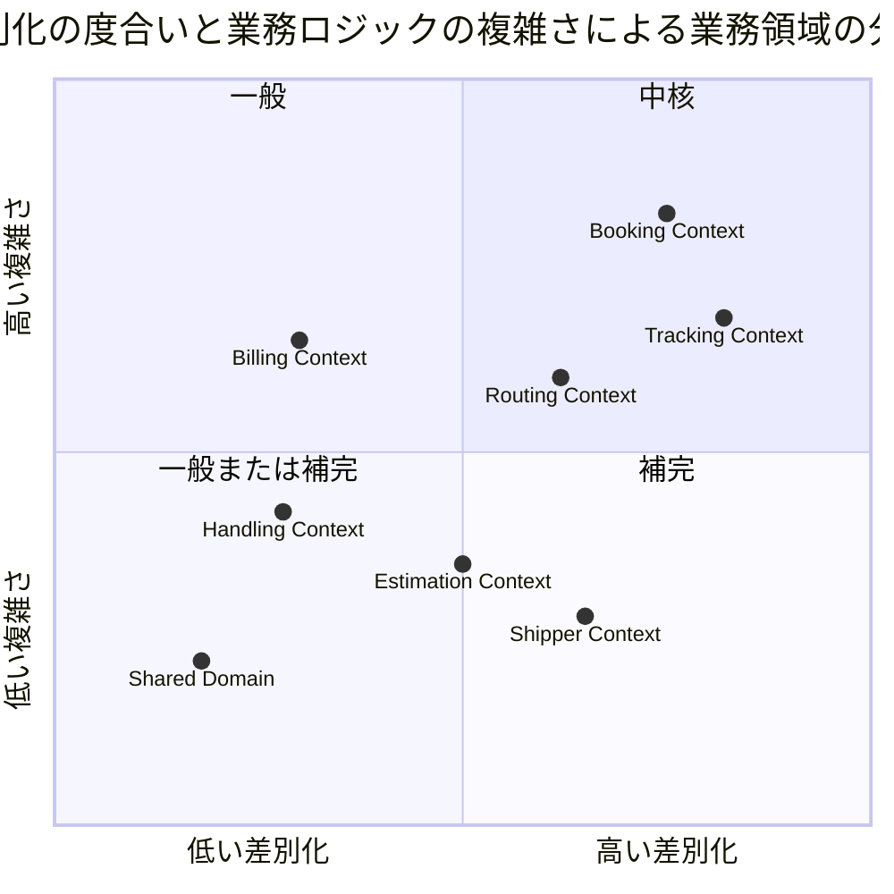
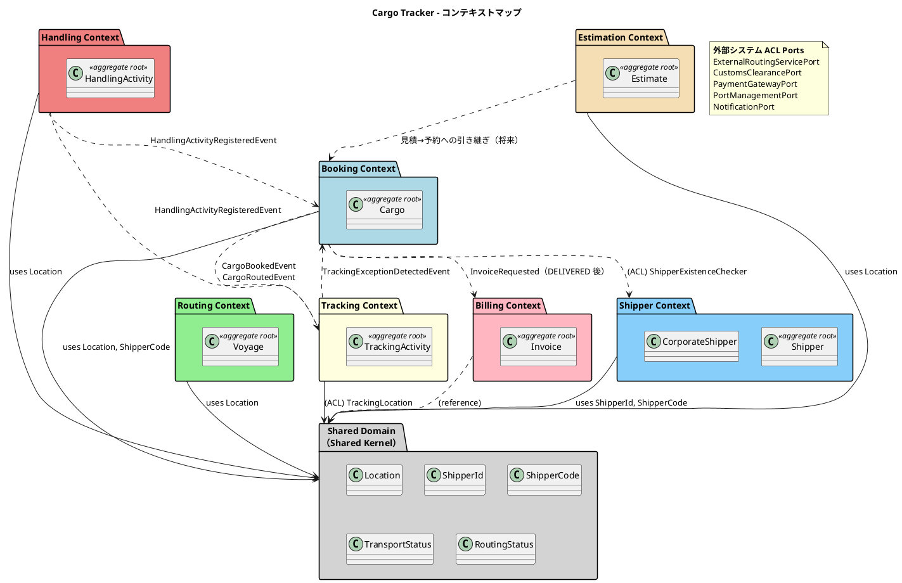
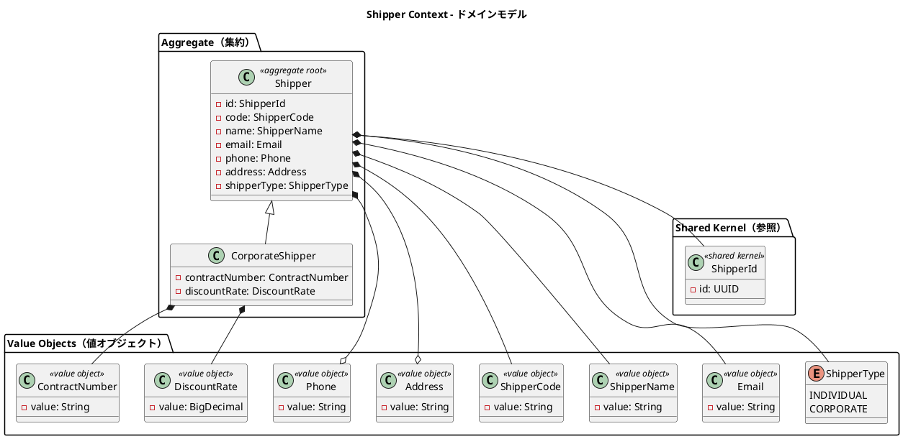
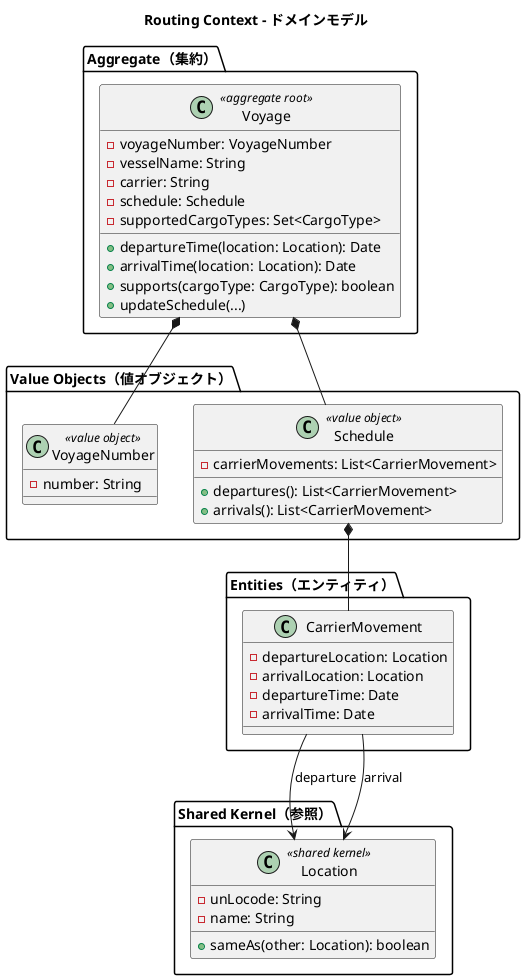
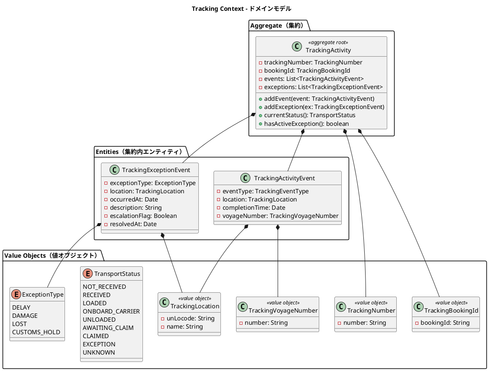
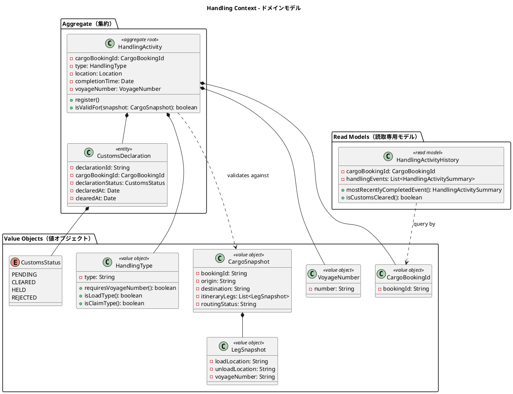
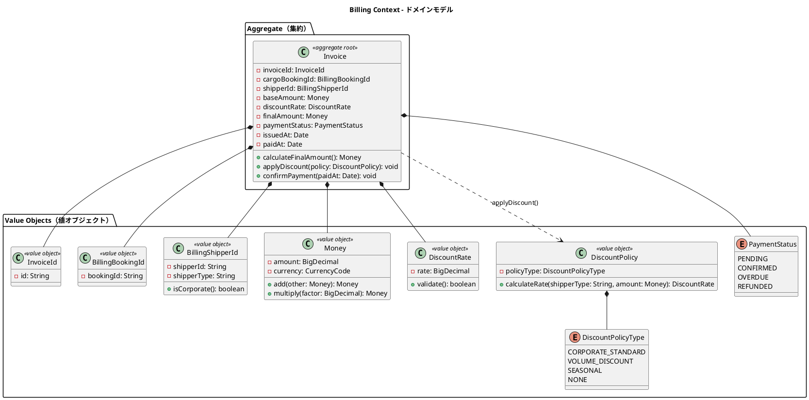
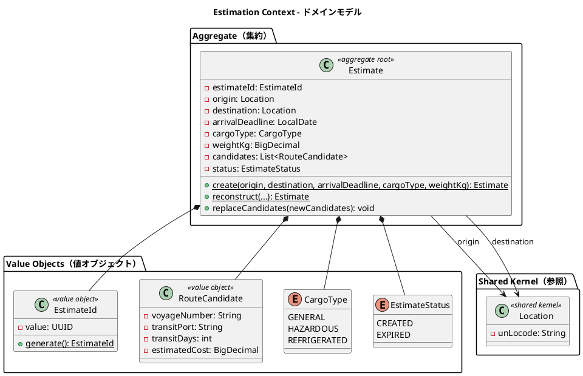
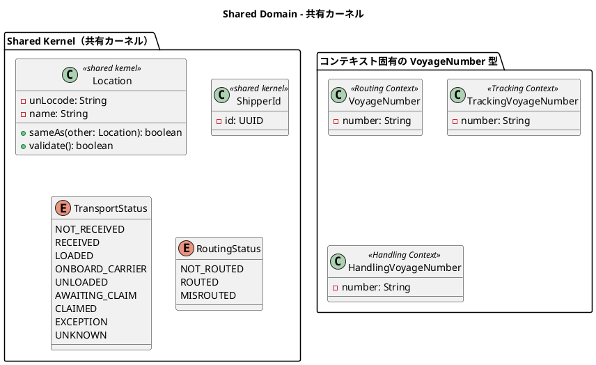

```plantuml
@startuml
title Booking Context - ドメインモデル

package "Aggregate（集約）" {
  class Cargo <<aggregate root>> {
    -bookingId: BookingId
    -shipperCode: ShipperCode
    -consignee: Consignee
    -routeSpecification: RouteSpecification
    -cargoItinerary: CargoItinerary
    -delivery: Delivery
    -bookingAmount: Money
    -bookingStatus: BookingStatus
    -cargoType: CargoType
    -dimensions: Dimensions
    -quantity: Quantity
    -description: Description
    -hazardousDeclaration: HazardousDeclaration
    -temperatureRequirement: TemperatureRequirement
  }
}

package "Value Objects（値オブジェクト）" {
  class BookingId <<value object>> {
    -id: String
  }
  class ShipperCode <<shared kernel>> {
    -code: String
  }
  class Consignee <<value object>> {
    -name: String
    -address: String
    -contactEmail: String
  }
  class RouteSpecification <<value object>> {
    -origin: Location
    -destination: Location
    -arrivalDeadline: Date
    +isSatisfiedBy(itinerary): boolean
  }
  class CargoItinerary <<value object>> {
    -legs: List<Leg>
    +expectedArrivalTime(): Date
  }
  class Leg <<value object>> {
    -loadLocation: Location
    -unloadLocation: Location
    -loadTime: Date
    -unloadTime: Date
    -voyage: VoyageNumber
  }
  class Delivery <<value object>> {
    -transportStatus: TransportStatus
    -routingStatus: RoutingStatus
    -lastCargoHandledEvent: CargoHandlingActivity
  }
  class Money <<value object>> {
    -amount: BigDecimal
    -currency: CurrencyCode
    +add(other: Money): Money
    +multiply(factor: BigDecimal): Money
  }
  class CargoHandlingActivity <<value object>> {
    -handlingType: String
    -location: Location
    -completionTime: Date
  }
  enum BookingStatus {
    PRELIMINARY
    ROUTE_PROPOSED
    CONFIRMED
    TRACKING_ISSUED
    IN_TRANSIT
    DELIVERED
    SETTLED
    CANCELLED
  }
  enum ShipperType {
    INDIVIDUAL
    CORPORATE
  }
  class Dimensions <<value object>> {
    -length: BigDecimal
    -width: BigDecimal
    -height: BigDecimal
  }
  class Quantity <<value object>> {
    -value: int
  }
  class Description <<value object>> {
    -value: String
  }
  class HazardousDeclaration <<value object>> {
    -hazardousClass: String
    -unNumber: String
    -properShippingName: String
  }
  class TemperatureRequirement <<value object>> {
    -minTemperature: BigDecimal
    -maxTemperature: BigDecimal
    -unit: TemperatureUnit
  }
  enum CargoType {
    GENERAL
    HAZARDOUS
    REFRIGERATED
  }
  enum RoutingStatus {
    NOT_ROUTED
    ROUTED
    MISROUTED
  }
}

interface ShipperExistenceChecker <<ACL Port>> {
  +exists(shipperCode: ShipperCode): boolean
}

Cargo *-- BookingId
Cargo *-- ShipperCode
Cargo *-- Consignee
Cargo *-- RouteSpecification
Cargo *-- CargoItinerary
Cargo *-- Delivery
Cargo *-- Money
Cargo *-- BookingStatus
Cargo *-- CargoType
Cargo *-o Dimensions
Cargo *-o Quantity
Cargo *-o Description
Cargo *-o HazardousDeclaration
Cargo *-o TemperatureRequirement
CargoItinerary *-- Leg
Delivery *-- RoutingStatus

@enduml
```

# ドメインモデル設計 - 国際貨物輸送管理システム（Go 版）

## 概要

本ドキュメントは、国際貨物輸送管理システムの DDD（ドメイン駆動設計）戦術的設計を定義する。ドメインモデル自体は言語非依存であり、本ドキュメントでは各モデルの Go への実装マッピングを併記する。システムは以下の 7 つの境界付けられたコンテキスト（Bounded Context）と共有ドメイン（Shared Domain）で構成される。Shared Domain は境界付けられたコンテキストではなく、共有カーネル（Shared Kernel）の置き場である。

| コンテキスト | 日本語名 | 主な責務 | Go パッケージ |
|---|---|---|---|
| Booking Context | 予約コンテキスト | 貨物予約の受付・旅程管理・状態遷移 | `internal/booking/domain` |
| Shipper Context | 荷主コンテキスト | 荷主の登録・管理・法人割引 | `internal/shipper/domain` |
| Routing Context | 経路コンテキスト | 航海スケジュール・経路情報の管理 | `internal/routing/domain` |
| Tracking Context | 追跡コンテキスト | 貨物追跡・例外イベント管理 | `internal/tracking/domain` |
| Handling Context | 荷役コンテキスト | 荷役作業登録・通関申告管理 | `internal/handling/domain` |
| Billing Context | 精算コンテキスト | 請求書発行・割引・支払い管理 | `internal/billing/domain` |
| Estimation Context | 見積コンテキスト | 輸送見積の作成・ルート候補の管理 | `internal/estimation/domain` |
| Shared Domain | 共有ドメイン | 共有カーネル（Location・ShipperCode・CargoType・TransportStatus。ShipperId は Shipper BC 内へ移設） | `internal/shared/domain` |

各コンテキストは自律的に変更可能な集約を持ち、コンテキスト間の連携はドメインイベントおよび ACL（Anti-Corruption Layer）ポートを通じて行う。



## Go 実装マッピング方針

Java 実装（参照元）から Go への移植にあたり、以下のマッピング規約を適用する。ドメインモデルの構造・不変条件・ビジネスルールは変更しない。

| 概念 | Java 実装 | Go 実装 |
|---|---|---|
| 値オブジェクト | `record` / 不変クラス | 不変 struct + コンストラクタ関数 `NewXxx` でバリデーション。フィールドは非公開にし getter で公開 |
| エンティティ・集約ルート | クラス | struct + メソッド。生成は `NewXxx` / 再構築は `ReconstructXxx` |
| Repository・ポート | インターフェース（domain / application 層） | Go `interface`（application 層で定義し、infrastructure 層のアダプターが実装） |
| ACL ポート | インターフェース | Go `interface`（利用側コンテキストの application 層で定義） |
| ドメインイベント | Spring Application Events | 自作 in-process イベントディスパッチャ（`internal/shared/event`）で発行・購読 |
| enum | `enum` 型 | 型付き定数（`iota`）または文字列ベースの独自型 + バリデーション関数 |
| BigDecimal | `java.math.BigDecimal` | 最小通貨単位の `int64`（IT8 注1・`shopspring/decimal` は不使用。整数演算で丸め誤差を排除し data-model の金額 INTEGER と一貫） |
| 日時 | `Date` / `LocalDate` | `time.Time` |
| 例外 | 独自 Exception | ドメインエラー値（`errors.New` / 独自エラー型）を戻り値で返却 |

値オブジェクトの実装例（Booking Context の `BookingId`）：

```go
package domain

import "errors"

// BookingId は予約を一意に識別する値オブジェクトです。
type BookingId struct {
	value string
}

// NewBookingId はバリデーション付きで BookingId を生成します。
func NewBookingId(value string) (BookingId, error) {
	if value == "" {
		return BookingId{}, errors.New("booking id must not be empty")
	}
	return BookingId{value: value}, nil
}

func (b BookingId) Value() string { return b.value }
```

enum の実装例（`BookingStatus`）：

```go
// BookingStatus は予約ライフサイクルの状態を表します。
type BookingStatus string

const (
	BookingStatusPreliminary    BookingStatus = "PRELIMINARY"
	BookingStatusRouteProposed  BookingStatus = "ROUTE_PROPOSED"
	BookingStatusConfirmed      BookingStatus = "CONFIRMED"
	BookingStatusTrackingIssued BookingStatus = "TRACKING_ISSUED"
	BookingStatusInTransit      BookingStatus = "IN_TRANSIT"
	BookingStatusDelivered      BookingStatus = "DELIVERED"
	BookingStatusSettled        BookingStatus = "SETTLED"
	BookingStatusCancelled      BookingStatus = "CANCELLED"
)
```

ドメインイベントは Spring Events の代替として、自作の in-process イベントディスパッチャを使用する：

```go
package event

// Event はすべてのドメインイベントが実装するマーカーインターフェースです。
type Event interface {
	EventName() string
}

// Handler はイベント購読側の処理関数です。
type Handler func(ctx context.Context, event Event) error

// Dispatcher はイベント名単位で Handler を登録・発行する in-process ディスパッチャです。
type Dispatcher struct {
	handlers map[string][]Handler
}

func (d *Dispatcher) Subscribe(eventName string, h Handler)          { /* ... */ }
func (d *Dispatcher) Publish(ctx context.Context, event Event) error { /* ... */ }
```

## ユビキタス言語

| 英語（コード名） | 日本語（業務用語） | 使用コンテキスト | 説明 |
|---|---|---|---|
| Cargo | 貨物 | Booking Context | 予約の中心的エンティティ。荷主から荷受人へ輸送される物品 |
| Shipper | 荷主 | Shipper Context | 貨物を発送する主体。個人・法人の 2 種別 |
| CorporateShipper | 法人荷主 | Shipper Context | Shipper のサブタイプ。契約番号と割引率を持つ |
| Address | 住所 | Shipper Context | 荷主の住所情報（最大 500 文字） |
| Dimensions | 寸法 | Booking Context | 貨物の長さ・幅・高さ（オプション） |
| Quantity | 個数 | Booking Context | 貨物の個数（オプション、1 以上） |
| Description | 品名 | Booking Context | 貨物の品名（オプション、最大 500 文字） |
| HazardousDeclaration | 危険物申告 | Booking Context | 危険物クラス・UN 番号・正式輸送品名 |
| TemperatureRequirement | 温度管理条件 | Booking Context | 最低温度・最高温度・温度単位 |
| ShipperExistenceChecker | 荷主存在確認 ACL | Booking Context | 荷主コンテキストへの存在確認ポート |
| Consignee | 荷受人 | Booking Context | 貨物を受け取る主体。氏名・住所・連絡先を保持 |
| BookingId | 予約 ID | Booking Context | 予約を一意に識別する値オブジェクト |
| RouteSpecification | ルート仕様 | Booking Context | 出発地・目的地・到着期限の要件定義 |
| CargoItinerary | 旅程 | Booking Context | 貨物の輸送経路全体。1 つ以上の Leg で構成 |
| Leg | 輸送区間 | Booking Context | 単一航海での積込港から荷降港までの区間 |
| Delivery | 配送状況 | Booking Context | 現在の輸送状態・経路状態・最終荷役イベントの集合 |
| Voyage | 航海 | Routing Context | 特定の船舶が実施する一連の運送区間 |
| Schedule | 航海スケジュール | Routing Context | 航海を構成する時系列の運送区間一覧 |
| CarrierMovement | 運送区間 | Routing Context | 出発港・到着港・出発時刻・到着時刻を持つ区間単位 |
| TrackingActivity | 追跡レコード | Tracking Context | 貨物の追跡情報全体を管理する集約 |
| TrackingNumber | 追跡番号 | Tracking Context | 追跡活動を一意に識別する番号 |
| TrackingActivityEvent | 追跡イベント | Tracking Context | 時系列で記録される追跡の出来事 |
| TrackingExceptionEvent | 追跡例外イベント | Tracking Context | 遅延・損傷・紛失・税関保留などの例外事象 |
| HandlingActivity | 荷役作業 | Handling Context | 実際に行われた荷役作業の記録 |
| HandlingActivityHistory | 荷役履歴 | Handling Context | クエリ専用の荷役作業履歴（Read Model） |
| Invoice | 精算書 | Billing Context | 貨物輸送 1 件に対して発行される請求書 |
| DiscountPolicy | 割引方針 | Billing Context | 法人・ボリューム・シーズン割引のポリシー |
| Location | 位置情報 | Shared Domain | UN/LOCODE で識別される港湾・地点の共有カーネル |
| TransportStatus | 輸送状態 | Shared Domain | 貨物の現在の輸送フェーズを表す共有列挙型 |
| RoutingStatus | 経路状態 | Shared Domain | 経路の妥当性状態（NOT_ROUTED / ROUTED / MISROUTED） |
| BookingStatus | 予約状態 | Booking Context | 予約ライフサイクルの状態（8 値） |
| CargoType | 貨物種別 | 共有カーネル（Shared Domain） | GENERAL / HAZARDOUS / REFRIGERATED。Booking/Estimation/Routing で共有（ADR-0006） |
| ExceptionType | 例外種別 | Tracking Context | DELAY / DAMAGE / LOST / CUSTOMS_HOLD |
| CustomsStatus | 通関状態 | Handling Context | PENDING / CLEARED / HELD / REJECTED |
| PaymentStatus | 支払い状態 | Billing Context | PENDING / CONFIRMED / OVERDUE / REFUNDED |
| Estimate | 見積 | Estimation Context | 輸送見積の中心エンティティ。出発地・仕向地・期限・貨物種別・重量を保持 |
| EstimateId | 見積 ID | Estimation Context | UUID ベースの見積一意識別子 |
| RouteCandidate | ルート候補 | Estimation Context | 見積に紐づく輸送ルート候補。航海番号・経由港・輸送日数・見積コストを保持 |
| CargoType | 貨物種別 | 共有カーネル参照 | 共有カーネルの CargoType を参照（ADR-0006） |
| EstimateStatus | 見積状態 | Estimation Context | CREATED（作成済）/ EXPIRED（期限切れ） |

## アクターとコンテキストの対応

| アクター | 対話するコンテキスト | 主要コマンド / 操作 |
|---|---|---|
| 営業担当者 | Booking Context・Estimation Context | `BookCargoCommand`・`RouteCargoCommand`・`CreateEstimateCommand` |
| 経路設計者 | Routing Context + Booking Context | `RouteCargoCommand`・`AssignTrackingNumberCommand` |
| 荷役作業員 | Handling Context | `HandlingActivityRegistrationCommand` |
| 追跡管理者 | Tracking Context | `AddTrackingEventCommand`・例外登録 |
| 荷主 | Booking Context（読取）+ Tracking Context（読取） | 追跡照会・状態確認 |
| 荷受人 | Tracking Context（読取）+ Booking Context（読取） | 到着確認・引取手続き |
| 経理担当者 | Billing Context | `GenerateInvoiceCommand`・`ConfirmPaymentCommand` |

## 境界付けられたコンテキスト概要



## 1. Booking Context（予約コンテキスト）

> **Go 実装マッピング**: `internal/booking/domain` に集約 `Cargo` と値オブジェクト群を配置する。値オブジェクトは不変 struct + `NewXxx` コンストラクタ関数で実装し、`ShipperExistenceChecker` は `internal/booking/application` の Go interface として定義する（実装は infrastructure 層の ACL アダプター）。

### ドメインモデル図



### 集約・エンティティ・値オブジェクト一覧

| 種別 | 型名 | 日本語名 | 責務 |
|---|---|---|---|
| 集約ルート | Cargo | 貨物 | 予約の中心。状態遷移・旅程・配送状況を統括 |
| 値オブジェクト | BookingId | 予約 ID | 予約の一意識別 |
| 共有カーネル | ShipperCode | 荷主参照コード | BC 独立性のため業務識別子で Shipper を参照（SHP-XXXXXX・ADR-0005） |
| 値オブジェクト | Consignee | 荷受人情報 | 荷受人の名前・住所・連絡先メール |
| 値オブジェクト | RouteSpecification | ルート仕様 | 出発地・目的地・到着期限の要件定義 |
| 値オブジェクト | CargoItinerary | 旅程 | 輸送区間（Leg）の集合と到着時刻計算 |
| 値オブジェクト | Leg | 輸送区間 | 単一航海での積込港から荷降港までの区間 |
| 値オブジェクト | Delivery | 配送状況 | 現在の輸送状態・経路状態・最終荷役イベント |
| 値オブジェクト | Money | 金額 | 金額と通貨コードのペア。多通貨対応 |
| 値オブジェクト | CargoHandlingActivity | 荷役活動（参照用） | 最終荷役イベントの記録 |
| 列挙型 | BookingStatus | 予約状態 | 8 段階の予約ライフサイクル |
| 列挙型 | ShipperType | 荷主種別 | INDIVIDUAL / CORPORATE |
| 値オブジェクト | Dimensions | 寸法 | 貨物の長さ・幅・高さ（オプション） |
| 値オブジェクト | Quantity | 個数 | 貨物の個数（1 以上、オプション） |
| 値オブジェクト | Description | 品名 | 貨物の品名（最大 500 文字、オプション） |
| 値オブジェクト | HazardousDeclaration | 危険物申告 | 危険物クラス・UN 番号・正式輸送品名 |
| 値オブジェクト | TemperatureRequirement | 温度管理条件 | 最低/最高温度・温度単位 |
| 列挙型 | CargoType | 貨物種別 | GENERAL / HAZARDOUS / REFRIGERATED |
| 列挙型 | RoutingStatus | 経路状態 | NOT_ROUTED / ROUTED / MISROUTED |
| 値オブジェクト | Notification | 確定経路通知の送信記録 | 宛先 ShipperCode・通知サマリ・送信日時（US12・migration 000011） |
| ACL ポート | ShipperExistenceChecker | 荷主存在確認 | Shipper Context への ACL。荷主 ID の存在確認（Go interface） |
| 出力ポート | NotificationPort | 荷主通知の送信 | 確定経路通知の送信を抽象化（US12・booking/application に定義。実装はログ。shared には置かない） |

集約 `Cargo` の主な操作（IT4/IT5 追加分）:

- `AssignItinerary(itinerary)`（US09）: 確定経路を割り当て `Delivery.routingStatus` を ROUTED にする。BookingStatus は ROUTE_PROPOSED のまま。
- `MarkMisrouted()`（US10）: 確定済み（ROUTED）経路を再調整のため MISROUTED にする。再算出後に `AssignItinerary` で ROUTED に戻す。
- `BuildRouteNotificationContent()`（US12）: 確定経路から通知内容（経由港・所要日数・到着予定日・料金概算）を組み立てる。経路未確定はエラー。

`RouteSpecification` の条件調整（US10）は、cargo の routeSpec を永続更新せず、経路探索時に到着期限を一時オーバーライドして再算出する（`RouteAdjustment`）。

Go 実装の補足：

- オプション項目（Dimensions・Quantity・Description など）はポインタ型（`*Dimensions`）で表現し、`nil` を「未指定」とする
- `Money` の金額は最小通貨単位の `int64`（IT8 注1）、`add` / `multiply(rate)` は値レシーバのメソッド `Add` / `MultiplyRate` として実装する
- `BookingStatus`・`CargoType` などの列挙型は文字列ベースの独自型 + 定数で実装し、DB・JSON との相互変換を容易にする

### ビジネスルール

1. 貨物は必ず BookingId・ShipperCode・CargoType を持つ
2. RouteSpecification の出発地と目的地は異なる（UN/LOCODE 形式で検証）
3. CargoItinerary は 1 つ以上の Leg で構成される。`Leg[n].unloadLocation == Leg[n+1].loadLocation` の連結制約を満たす必要がある
4. BookingStatus の遷移は `PRELIMINARY → ROUTE_PROPOSED → CONFIRMED → TRACKING_ISSUED → IN_TRANSIT → DELIVERED → SETTLED` の順に進む。予約確定は PRELIMINARY / ROUTE_PROPOSED から CONFIRMED へ、経路再設計への差し戻しは ROUTE_PROPOSED / CONFIRMED から PRELIMINARY へ遷移する（US13）。いずれの状態からも CANCELLED に遷移可能
5. CORPORATE ShipperType の荷主は割引適用の対象となる（割引率上限 30%）
6. HAZARDOUS / REFRIGERATED の CargoType は指定港のみ取扱可能
7. HAZARDOUS CargoType の場合、HazardousDeclaration は必須
8. REFRIGERATED CargoType の場合、TemperatureRequirement は必須
9. Booking Context は Shipper Context に直接依存せず、ShipperExistenceChecker ACL ポートを通じて荷主の存在を確認する

### コマンド一覧

| コマンド | 実行アクター | 主な処理 |
|---|---|---|
| BookCargoCommand | 営業担当者 | 貨物予約の新規登録（PRELIMINARY 状態で作成） |
| AssignToRoutingCommand | 営業担当者 | 予約情報を経路設計者に引き渡す（PRELIMINARY → ROUTE_PROPOSED に遷移） |
| ConfirmBookingCommand | 営業担当者 | 予約を確定する（PRELIMINARY → CONFIRMED に遷移） |
| CancelBookingCommand | 営業担当者 | 予約をキャンセルする（CANCELLED に遷移） |
| RouteCargoCommand | 経路設計者 | CargoItinerary を Cargo に割り当て、Delivery.routingStatus を ROUTED に更新（US09）。BookingStatus は ROUTE_PROPOSED のまま（予約確定 CONFIRMED は荷主承認後の US13）。US11（経路情報の予約紐付け）はこの操作に含まれ、営業担当者は予約一覧の経路状態で提案状態を確認する（別コマンドは設けない） |
| ReadjustRouteCommand | 経路設計者 | 確定経路を MISROUTED にして条件調整・再算出する（US10）。候補ゼロ時は営業へ条件協議を依頼（RouteNegotiationRequested イベント） |
| NotifyRouteCommand | 営業担当者 | 確定経路（ROUTED）を荷主に通知し送信記録（Notification）を残す（US12・NotificationPort 経由） |
| AssignTrackingNumberCommand | 経路設計者 | TrackingNumber を Cargo に紐付け、TRACKING_ISSUED に遷移 |
| UpdateBookingStatusCommand | システム | BookingStatus の状態遷移を更新 |

## 2. Shipper Context（荷主コンテキスト）

> **Go 実装マッピング**: `internal/shipper/domain` に配置する。Java の継承（`CorporateShipper extends Shipper`）は Go では埋め込み（embedding）で表現し、`Shipper` struct を `CorporateShipper` に埋め込んで契約番号・割引率を追加する。`ShipperRepository` は `internal/shipper/application` の Go interface として定義する。

### ドメインモデル図



### 集約・エンティティ・値オブジェクト一覧

| 種別 | 型名 | 日本語名 | 責務 |
|---|---|---|---|
| 集約ルート | Shipper | 荷主 | 荷主情報の管理。個人・法人の 2 種別 |
| エンティティ | CorporateShipper | 法人荷主 | Shipper のサブタイプ。契約番号と割引率を追加保持（Go では struct 埋め込みで実装） |
| 値オブジェクト | ShipperCode | 荷主コード | 自動生成される荷主の業務識別コード |
| 値オブジェクト | ShipperName | 荷主名 | 荷主の氏名または社名 |
| 値オブジェクト | Email | メール | メールアドレス。一意制約あり |
| 値オブジェクト | Phone | 電話番号 | 電話番号（オプション） |
| 値オブジェクト | Address | 住所 | 住所（オプション、最大 500 文字） |
| 値オブジェクト | ContractNumber | 契約番号 | 法人荷主の契約番号 |
| 値オブジェクト | DiscountRate | 割引率 | 法人荷主の割引率（0〜30%） |
| 列挙型 | ShipperType | 荷主種別 | INDIVIDUAL / CORPORATE |
| 共有カーネル参照 | ShipperId | 荷主識別子 | UUID ベースの一意識別子。Shared Domain に配置 |

### ビジネスルール

1. 荷主は必ず ShipperId・ShipperCode・ShipperName・Email・ShipperType を持つ
2. Email はシステム全体で一意（重複時はドメインエラー `ErrEmailAlreadyRegistered` を返す）
3. CORPORATE ShipperType の場合、CorporateShipper として ContractNumber と DiscountRate が必須
4. DiscountRate の値域は 0.0000〜0.3000（0%〜30%）
5. ShipperCode は自動生成（`SHP-` プレフィックス + UUID 先頭 8 文字）

### コマンド一覧

| コマンド | 実行アクター | 主な処理 |
|---|---|---|
| RegisterShipperCommand | 営業担当者 | 荷主の新規登録。Email 重複チェックと ShipperCode 自動生成 |

## 3. Routing Context（経路コンテキスト）

> **Go 実装マッピング**: `internal/routing/domain` に配置する。`Voyage` 集約は struct + メソッド、`Schedule` は `CarrierMovement` のスライスを保持する不変 struct として実装する。

### ドメインモデル図



### 集約・エンティティ・値オブジェクト一覧

| 種別 | 型名 | 日本語名 | 責務 |
|---|---|---|---|
| 集約ルート | Voyage | 航海 | 航路スケジュールを管理する中心エンティティ。船名・運送会社・対応貨物種別を保持（US24） |
| 値オブジェクト | VoyageNumber | 航海番号 | Routing Context 固有の航海一意識別子 |
| 値オブジェクト | Schedule | 航海スケジュール | 時系列の CarrierMovement 一覧。連結制約（空間・時刻）を保証 |
| エンティティ | CarrierMovement | 運送区間 | 出発地・到着地・出発時刻・到着時刻の区間単位 |
| 共有カーネル参照 | Location | 位置情報 | UN/LOCODE で識別される港湾・地点 |
| 共有カーネル参照 | CargoType | 貨物種別 | 対応貨物種別（`supportedCargoTypes`）。US07 の危険物・冷凍絞り込みに使用（ADR-0006） |

### ビジネスルール

1. 航海は必ず一意の VoyageNumber を持つ
2. Schedule は時系列順の CarrierMovement で構成される
3. CarrierMovement の出発地と到着地は異なる
4. Location は UN/LOCODE で一意に識別される（例: `JPOSA` = 大阪、`USLAX` = LA）

### コマンド一覧

| コマンド | 実行アクター | 主な処理 |
|---|---|---|
| RegisterVoyageCommand | 経路設計者 | 新規航海スケジュールの登録 |
| UpdateScheduleCommand | 経路設計者 | 運送区間の追加・変更 |

## 4. Tracking Context（追跡コンテキスト）

> **Go 実装マッピング**: `internal/tracking/domain` に配置する。集約内エンティティ（TrackingActivityEvent・TrackingExceptionEvent）は集約ルート `TrackingActivity` のスライスとして保持し、追加・解決の操作は集約ルートのメソッド（`AddEvent` / `AddException` / `ResolveException`）経由でのみ行う。

### ドメインモデル図



### 集約・エンティティ・値オブジェクト一覧

| 種別 | 型名 | 日本語名 | 責務 |
|---|---|---|---|
| 集約ルート | TrackingActivity | 追跡レコード | 貨物の追跡情報全体を管理 |
| エンティティ（集約内） | TrackingActivityEvent | 追跡イベント | 時系列で記録される追跡の出来事 |
| エンティティ（集約内） | TrackingExceptionEvent | 追跡例外イベント | 遅延・損傷・紛失・税関保留の例外記録 |
| 値オブジェクト | TrackingNumber | 追跡番号 | 追跡活動を一意に識別 |
| 値オブジェクト | TrackingBookingId | 予約参照 ID | Booking Context との関連を保持 |
| 値オブジェクト | TrackingLocation | 追跡位置情報 | コンテキスト固有の位置情報型（ACL 変換） |
| 値オブジェクト | TrackingVoyageNumber | 追跡航海番号 | Tracking Context 固有の航海番号型 |
| 共有列挙型 | TransportStatus | 輸送状態 | 9 段階の輸送フェーズ。Shared Domain の共有カーネル（`internal/shared/domain`）を Tracking Context が利用する（IT6 注1・旧称 TrackingStatus を統一） |
| 列挙型 | ExceptionType | 例外種別 | DELAY / DAMAGE / LOST / CUSTOMS_HOLD |

### ビジネスルール

1. 追跡活動は必ず一意の TrackingNumber を持つ
2. TrackingActivityEvent は時系列順で管理される。イベントごとに位置と時刻が必須
3. エスカレーション判定は 2 系統（`EscalationPolicy` ステートレスドメインサービス・判定基準時刻は `ExceptionService` に注入した Clock から渡す・IT7 注3）: (a) ExceptionType が **LOST の場合は即時** escalationFlag を `true` に設定、(b) ExceptionType が **DELAY の場合は occurredAt から 48 時間を超過**（`>` 判定・48:00 ちょうどは対象外）で escalationFlag を `true` に設定。いずれも上位管理者へエスカレーション通知する。**既知の制約（IT8 課題）**: escalationFlag は例外登録時に 1 回評価して固定する。登録後に 48 時間を超過しても再評価・再エスカレーションは行わない（定期再評価バッチは後続イテレーションで検討）
4. CUSTOMS_HOLD 例外は税関システム（CustomsClearancePort）からの通知によって自動登録される
5. `ResolveExceptionCommand` の実行により TransportStatus は例外発生前の状態に復帰する

### コマンド一覧

| コマンド | 実行アクター | 主な処理 |
|---|---|---|
| AssignTrackingNumberCommand | Booking Context（イベント駆動） | TrackingActivity を新規作成し TrackingNumber を割り当て |
| AddTrackingEventCommand | 追跡管理者 | TrackingActivityEvent を時系列で追加 |
| RegisterExceptionCommand | 追跡管理者・税関システム | TrackingExceptionEvent を登録 |
| ResolveExceptionCommand | 追跡管理者 | 例外を解決し TransportStatus を復帰 |

## 5. Handling Context（荷役コンテキスト）

> **Go 実装マッピング**: `internal/handling/domain` に配置する。荷役妥当性検証 `isValidFor` は `HandlingActivity` のメソッド `IsValidFor(snapshot CargoSnapshot) bool` として実装する。Read Model（HandlingActivityHistory）は `internal/handling/application` のクエリサービスとして集約から分離する。

### ドメインモデル図



### 集約・エンティティ・値オブジェクト一覧

| 種別 | 型名 | 日本語名 | 責務 |
|---|---|---|---|
| 集約ルート | HandlingActivity | 荷役作業 | 荷役作業の登録と妥当性検証 |
| エンティティ（集約内） | CustomsDeclaration | 通関申告 | 通関申告の状態管理 |
| 値オブジェクト | CargoBookingId | 貨物予約識別子 | Booking Context との関連識別子 |
| 値オブジェクト | HandlingType | 荷役種別 | RECEIVE / LOAD / UNLOAD / CUSTOMS / CLAIM。VoyageNumber 必須判定を内包 |
| 値オブジェクト | CargoSnapshot | 貨物スナップショット | ACL 経由で取得した貨物情報。妥当性検証に使用 |
| 値オブジェクト | LegSnapshot | 旅程区間スナップショット | CargoSnapshot 内の区間情報 |
| 値オブジェクト | VoyageNumber | 航海番号 | Handling Context 固有の航海番号型 |
| 列挙型 | CustomsStatus | 通関状態 | PENDING / CLEARED / HELD / REJECTED |
| Read Model | HandlingActivityHistory | 荷役履歴 | クエリ専用の荷役作業履歴。集約と切り離して管理 |

### ビジネスルール

荷役妥当性検証（`isValidFor`）のデシジョンテーブル：

| 荷役タイプ | VoyageNumber 必須 | 場所チェック | MISROUTED 判定条件 |
|---|---|---|---|
| RECEIVE（受領） | 不要 | 出発港（RouteSpecification.origin）と一致 | 不一致で警告 |
| LOAD（積込） | 必須 | Itinerary の積込港（Leg.loadLocation）と一致 | 不一致で MISROUTED |
| UNLOAD（荷降し） | 必須 | Itinerary の荷降港（Leg.unloadLocation）と一致 | 不一致で MISROUTED |
| CLAIM（引取） | 不要 | 目的港（RouteSpecification.destination）と一致 | 不一致で警告 |

追加ルール：

1. LOAD / UNLOAD 作業で MISROUTED が確定した場合、Booking Context の RoutingStatus を MISROUTED に更新する
2. CustomsDeclaration が CLEARED 状態になるまで CLAIM（引取）は実施できない
3. HandlingActivityHistory はクエリ専用の Read Model として管理され、集約とは切り離す

### コマンド一覧

| コマンド | 実行アクター | 主な処理 |
|---|---|---|
| HandlingActivityRegistrationCommand | 荷役作業員 | 荷役作業を登録し、CargoSnapshot で妥当性を検証 |
| RegisterCustomsDeclarationCommand | 荷役作業員 | 通関申告を新規登録（PENDING 状態で作成） |
| UpdateCustomsStatusCommand | 税関システム（ACL） | 通関申告の状態を更新（CLEARED / HELD / REJECTED） |

## 6. Billing Context（精算コンテキスト）

> **Go 実装マッピング**: `internal/billing/domain` に配置する。`Invoice` の `applyDiscount` / `confirmPayment` はポインタレシーバのメソッド（`ApplyDiscount` / `ConfirmPayment`）として実装し、状態遷移違反はドメインエラーを返す。金額計算は最小通貨単位の `int64` を使用する（IT8 注1・`decimal` 不使用）。料金の距離係数は実距離データが無いため旅程区間数ベースのスタブ（IT8 注2）。法人割引率は Shipper への ACL（`ShipperContractProvider`・shipper_code で直読・ADR-0005 先例）で取得する（IT8 注3）。

### ドメインモデル図



### 集約・エンティティ・値オブジェクト一覧

| 種別 | 型名 | 日本語名 | 責務 |
|---|---|---|---|
| 集約ルート | Invoice | 精算書 | 貨物輸送 1 件に対する請求書の発行・管理 |
| 値オブジェクト | InvoiceId | 請求書 ID | 精算書の一意識別子 |
| 値オブジェクト | BillingBookingId | 予約参照 ID | Booking Context の Cargo との関連識別子 |
| 値オブジェクト | BillingShipperId | 荷主参照 ID | 法人判定（IsCorporate）を内包 |
| 値オブジェクト | Money | 金額 | 金額と通貨コードのペア |
| 値オブジェクト | DiscountRate | 割引率 | 0〜30% の割引率。範囲バリデーション付き |
| 値オブジェクト | DiscountPolicy | 割引方針 | 法人・ボリューム・シーズン割引のロジック |
| 列挙型 | PaymentStatus | 支払い状態 | PENDING / CONFIRMED / OVERDUE / REFUNDED |
| 列挙型 | DiscountPolicyType | 割引方針種別 | CORPORATE_STANDARD / VOLUME_DISCOUNT / SEASONAL / NONE |

### ビジネスルール

1. Invoice は貨物配送完了（BookingStatus = DELIVERED）後にのみ発行できる
2. 法人荷主（CORPORATE）には最大 30% の割引が適用される
3. 支払期限（issuedAt + 30 日）を超過した場合、PaymentStatus を OVERDUE に更新する
4. 支払い確定（CONFIRMED）後のキャンセルは `IssueRefundCommand` で対応し、REFUNDED 状態に遷移する

料金計算ロジック：

```
基本料金 = 距離係数 × 重量（kg） × 貨物種別係数
  - GENERAL（一般貨物）: 係数 1.0
  - HAZARDOUS（危険物）: 係数 1.8
  - REFRIGERATED（冷凍・冷蔵）: 係数 1.5

割引後料金 = 基本料金 × (1 - 割引率)
  - CORPORATE 荷主: 割引率 0〜30%
  - INDIVIDUAL 荷主: 割引なし（割引率 0%）
```

### コマンド一覧

| コマンド | 実行アクター | 主な処理 |
|---|---|---|
| GenerateInvoiceCommand | 経理担当者 | 請求書を新規発行（PENDING 状態で作成） |
| ConfirmPaymentCommand | 経理担当者 | 支払い確認を記録し CONFIRMED に遷移 |

## 7. Estimation Context（見積コンテキスト）

> **Go 実装マッピング**: `internal/estimation/domain` に配置する。集約の生成は `NewEstimate`（バリデーション付き）、永続化からの再構築は `ReconstructEstimate` として実装する。`EstimateRepository` は `internal/estimation/application` の Go interface として定義する。

### ドメインモデル図



### 集約・エンティティ・値オブジェクト一覧

| 種別 | 型名 | 日本語名 | 責務 |
|---|---|---|---|
| 集約ルート | Estimate | 見積 | 輸送見積の中心エンティティ。出発地・仕向地・貨物種別・重量・ルート候補を管理 |
| 値オブジェクト | EstimateId | 見積 ID | UUID ベースの見積一意識別子。`GenerateEstimateId()` で自動生成 |
| 値オブジェクト | RouteCandidate | ルート候補 | 航海番号・経由港・輸送日数・見積コストを保持。Estimate に複数紐づく |
| 列挙型 | CargoType | 貨物種別 | GENERAL / HAZARDOUS / REFRIGERATED |
| 列挙型 | EstimateStatus | 見積状態 | CREATED（作成済）/ EXPIRED（期限切れ）。表示名（日本語）を保持 |
| 共有カーネル参照 | Location | 位置情報 | UN/LOCODE で識別される港湾・地点。Shared Domain に配置 |
| リポジトリ | EstimateRepository | 見積リポジトリ | `Save` / `FindByEstimateId` / `FindAll`（application 層の Go interface） |

### ビジネスルール

1. 見積は必ず EstimateId・origin・destination・arrivalDeadline・CargoType・weightKg を持つ
2. origin と destination は異なる（同一地点への見積は不可）
3. weightKg は正の値でなければならない
4. RouteCandidate の voyageNumber は空でない文字列、transitDays は正の値、estimatedCost は正の値
5. 見積作成時のデフォルトステータスは `CREATED`
6. ルート候補はスタブ実装（固定値）で生成される。将来、外部ルーティングサービスとの連携時に置換予定

### コマンド一覧

| コマンド | 実行アクター | 主な処理 |
|---|---|---|
| CreateEstimateCommand | 営業担当者 | 見積を新規作成し、スタブのルート候補を自動付与 |

### Booking Context との関係

Estimation Context は Booking Context と以下の関係を持つ。

- **共有**: CargoType 列挙型は両コンテキストで同一の値（GENERAL / HAZARDOUS / REFRIGERATED）を使用する
- **参照**: Location（Shared Domain）を経由して出発地・仕向地を共有する
- **将来の連携**: 見積から予約への引き継ぎ（見積情報を基に Cargo を作成するフロー）は将来イテレーションで実装予定

## 8. Shared Domain（共有ドメイン）

> **Go 実装マッピング**: `internal/shared/domain` に共有カーネル（Location・ShipperId・TransportStatus・RoutingStatus）を配置する。イベントディスパッチャは `internal/shared/event` に配置し、全コンテキストから利用する。

### ドメインモデル図



### 共有コンポーネント一覧

| 種別 | 型名 | 日本語名 | 責務 |
|---|---|---|---|
| 共有カーネル | Location | 位置情報 | UN/LOCODE で識別される港湾・地点。全コンテキストで共有 |
| 共有カーネル | ShipperId | 荷主識別子 | UUID ベースの荷主内部 ID。Shipper Context 内部で使用 |
| 共有カーネル | ShipperCode | 荷主参照コード | 業務識別子（SHP-XXXXXX）。BC 間の Shipper 参照キー（ADR-0005。Booking は本コードで参照） |
| 共有列挙型 | TransportStatus | 輸送状態 | 9 段階の輸送フェーズ。Booking・Tracking で共有 |
| 共有列挙型 | RoutingStatus | 経路状態 | NOT_ROUTED / ROUTED / MISROUTED。Booking・Handling で共有 |

### VoyageNumber のコンテキスト分離設計

VoyageNumber は各コンテキストが独自型を保持する。Go では各コンテキストの domain パッケージに独自 struct を定義することで、コンパイル時に型の混在を防止できる。これにより各コンテキストの自律性を保ちながら意味的な一貫性を維持する。

| コンテキスト | 型名 | 役割 |
|---|---|---|
| Routing Context | VoyageNumber | 航海スケジュールの識別子 |
| Tracking Context | TrackingVoyageNumber | 追跡イベントに紐づく航海番号（ACL 変換） |
| Handling Context | HandlingVoyageNumber | 荷役作業に紐づく航海番号（ACL 変換） |

### ビジネスルール

1. Location の変更は全コンテキストチームの合意のもとに行う（Shared Kernel の制約）
2. UN/LOCODE は国際規格（ISO 3166-1 alpha-2 + 3 文字のロケーションコード）に従う
3. TransportStatus と RoutingStatus は Booking Context と Tracking / Handling Context の間で整合性を保つ

## ドメインイベント

| イベント名 | 発生元 | 処理先 | 内容 |
|---|---|---|---|
| CargoBookedEvent | Booking Context | Tracking Context | 新規貨物予約後、追跡番号割り当て依頼を通知 |
| CargoRoutedEvent | Booking Context | Tracking Context | 旅程確定後、経路・旅程情報を追跡コンテキストに同期 |
| HandlingActivityRegisteredEvent | Handling Context | Tracking Context・Booking Context | 荷役作業完了後、TransportStatus と BookingStatus を同期 |
| TrackingExceptionDetectedEvent | Tracking Context | Booking Context・Notification | 例外（遅延・損傷・紛失・税関保留）検知後、通知を配信 |
| InvoiceCreatedEvent | Billing Context | Notification | 請求書発行後、荷主への通知を配信 |

Go 実装では、各イベントは `internal/<context>/domain` に定義した struct（`event.Event` インターフェースを実装）とし、application 層のコマンドサービスがトランザクション確定後に `Dispatcher.Publish` で発行する。購読側コンテキストは起動時（DI 組み立て時）に `Dispatcher.Subscribe` でハンドラを登録する。

### ドメインイベントフロー


## 外部システム ACL Ports

| ポート名 | 対応外部システム | 責務 |
|---|---|---|
| ExternalRoutingServicePort | 外部経路最適化システム | 出発地・目的地・期限を渡し最適 CargoItinerary を取得 |
| CustomsClearancePort | 税関システム | 通関申告の提出・状態照会・CUSTOMS_HOLD 例外の自動通知受信 |
| PaymentGatewayPort | 決済機関 | 支払い処理の実行と支払い確認の受信 |
| PortManagementPort | 港湾管理システム | 港湾の取扱可能貨物種別（HAZARDOUS / REFRIGERATED）の照会 |
| NotificationPort | 通知システム | 荷主・荷受人へのメール / SMS 通知の送信 |

各ポートはヘキサゴナルアーキテクチャの出力ポート（Secondary Port）として、利用側コンテキストの application 層に Go interface で定義され、infrastructure 層のアダプターが実装を担う。これにより外部システムの変更がドメインロジックに影響しない。

## 集約設計の判断

### Booking Context：Cargo 集約

Cargo を集約ルートとし、BookingId・ShipperId・RouteSpecification・CargoItinerary・Delivery を集約内に含める設計とした。

**根拠**：予約の状態遷移（BookingStatus）はこれらのオブジェクトが一体として整合性を保つ必要がある。特に CargoItinerary の Leg 連結制約（`Leg[n].unloadLocation == Leg[n+1].loadLocation`）は単一トランザクション内で検証しなければ不整合が生じる。Consignee は Cargo に対して 1 対 1 であるため、独立した集約とせず値オブジェクトとして含める。

### Routing Context：Voyage 集約

Voyage を集約ルートとし、Schedule（CarrierMovement のリスト）を内包する設計とした。

**根拠**：Schedule と CarrierMovement は Voyage の文脈でのみ意味を持つ。Schedule の時系列整合性（CarrierMovement の順序・連続性）は Voyage 単位で保証する必要があるため、単一集約に含める。

### Tracking Context：TrackingActivity 集約

TrackingActivity を集約ルートとし、TrackingActivityEvent と TrackingExceptionEvent を集約内エンティティとして管理する設計とした。

**根拠**：追跡状態（TransportStatus）は時系列の全イベントと例外状態を総合的に判定するため、単一集約としてまとめる必要がある。例外解決時に「例外発生前の状態に復帰」するロジックは集約内の一貫したトランザクションで実行される。

### Handling Context：HandlingActivity 集約 + Read Model 分離

HandlingActivity を集約ルートとし、CustomsDeclaration を集約内エンティティとした。荷役履歴は Read Model（HandlingActivityHistory）として集約と切り離す設計とした。

**根拠**：個々の荷役作業は独立した記録単位であり、互いに強い整合性制約を持たない。一方、通関申告（CustomsDeclaration）と荷役作業は「CLEARED にならないと CLAIM 不可」という不変条件があるため、同一集約に含める。クエリ専用の履歴参照は Read Model として分離することで、コマンド側（集約）の複雑性を低減する。

### Billing Context：Invoice 集約

Invoice を集約ルートとし、DiscountPolicy はドメインサービスではなく値オブジェクトとして Invoice に委譲する設計とした。

**根拠**：請求書 1 件の整合性（基本料金・割引率・最終金額の一貫性）は Invoice 集約内で保証される。DiscountPolicy の割引率計算ロジックは Invoice の `ApplyDiscount()` 内で完結するため、外部ドメインサービスとして切り出す必要はない。支払い状態（PaymentStatus）の遷移も Invoice 集約が責任を持つ。

### Estimation Context：Estimate 集約

Estimate を集約ルートとし、RouteCandidate（ルート候補）のリストを集約内に保持する設計とした。

**根拠**：見積とルート候補は 1 対多の関係にあり、ルート候補は見積の文脈でのみ意味を持つ。`ReplaceCandidates()` でルート候補の一括入替を行うため、トランザクション整合性の観点から単一集約に含める。RouteCandidate は Go の不変 struct（非公開フィールド + `NewRouteCandidate` コンストラクタ関数）で実装し、不変性を保証する。現在のルート候補生成はスタブ実装（重量ベースの固定コスト計算）であり、将来の外部ルーティングサービス連携時にアダプターを差し替える設計とした。
