# ドメインモデル設計 - 国際貨物輸送管理システム

## 概要

本ドキュメントは、国際貨物輸送管理システムの DDD（ドメイン駆動設計）戦術的設計を定義する。システムは以下の 8 つの境界付けられたコンテキスト（Bounded Context）で構成される。ドメインモデル自体は実装言語に依存しないため、コンテキスト・集約・値オブジェクト・ドメインイベントの構造は Java 版と同一であり、実装方針のみ Ruby on Rails 向けに定義する。

| コンテキスト | 日本語名 | 主な責務 |
|---|---|---|
| Booking Context | 予約コンテキスト | 貨物予約の受付・旅程管理・状態遷移 |
| Shipper Context | 荷主コンテキスト | 荷主の登録・管理・法人割引 |
| Routing Context | 経路コンテキスト | 航海スケジュール・経路情報の管理 |
| Tracking Context | 追跡コンテキスト | 貨物追跡・例外イベント管理 |
| Handling Context | 荷役コンテキスト | 荷役作業登録・通関申告管理 |
| Billing Context | 精算コンテキスト | 請求書発行・割引・支払い管理 |
| Estimation Context | 見積コンテキスト | 輸送見積の作成・ルート候補の管理 |
| Shared Domain | 共有ドメイン | 共有カーネル（Location・ShipperId・TransportStatus） |

各コンテキストは自律的に変更可能な集約を持ち、コンテキスト間の連携はドメインイベントおよび ACL（Anti-Corruption Layer）ポートを通じて行う。

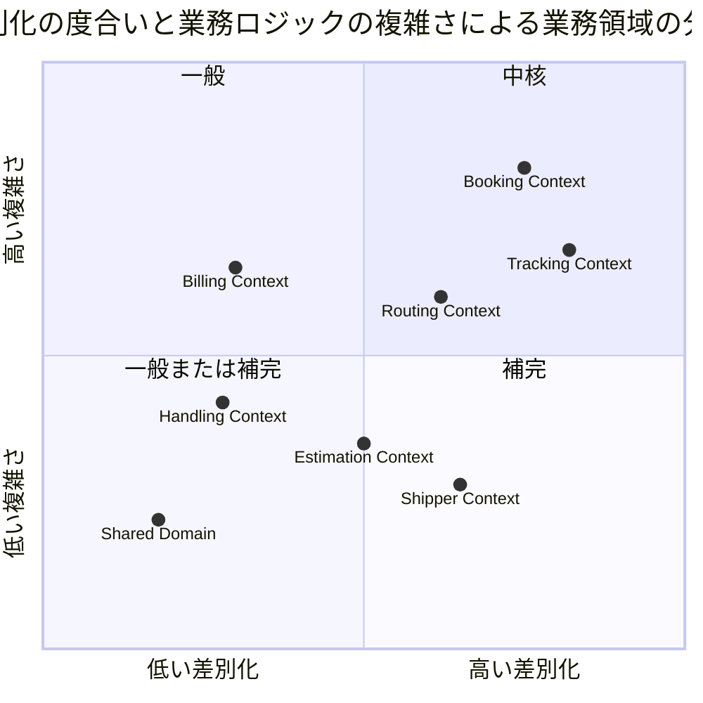

## Ruby / Rails 実装方針

ドメイン層の実装は以下の方針に従う。Rails の慣習（Fat Model）に流されず、ドメインモデルの純粋性を守ることを最優先とする。

### 1. ドメイン層は Rails / Active Record に依存しない PORO

ドメイン層（集約・エンティティ・値オブジェクト・ドメインサービス）はすべて PORO（Plain Old Ruby Object）で実装し、`ActiveRecord::Base` を継承しない。Active Record モデルは永続化専用のインフラ層コンポーネントとして扱い、ドメインオブジェクトとの変換はリポジトリが担う。

```ruby
# packs/booking/app/domain/model/cargo.rb（PORO 集約 — Rails に依存しない）
module Booking
  module Domain
    class Cargo
      attr_reader :booking_id, :shipper_id, :booking_status, :cargo_type,
                  :route_specification, :cargo_itinerary, :delivery

      def initialize(booking_id:, shipper_id:, cargo_type:, route_specification:, ...)
        # 不変条件の検証（後述）
      end
    end
  end
end
```

### 2. 値オブジェクトは Data.define または比較可能な PORO

Ruby 3.2 以降の `Data.define` を第一候補とし、値の等価性（`==` / `eql?` / `hash`）を言語機能で保証する。バリデーションやファクトリメソッドが必要な場合は `Data.define` のサブクラス化、または `Comparable` を include した凍結 PORO で実装する。

```ruby
# 値オブジェクト（Data.define + バリデーション）
BookingId = Data.define(:value) do
  def initialize(value:)
    raise ArgumentError, "BookingId は空にできません" if value.to_s.strip.empty?
    super(value: value.freeze)
  end
end

# 振る舞いを持つ値オブジェクト
MoneyAmount = Data.define(:amount, :currency) do
  def add(other)
    raise ArgumentError, "通貨が一致しません" unless currency == other.currency
    with(amount: amount + other.amount)
  end

  def multiply(factor)
    with(amount: amount * factor)
  end
end
```

### 3. 永続化はリポジトリ経由で分離

集約の保存・復元はリポジトリ（ポート）を経由し、Active Record への依存はインフラ層のリポジトリ実装に閉じ込める。ドメイン層はリポジトリのインターフェース（duck type）のみを知る。

```ruby
# ドメイン層：ポート（インターフェース定義。ドキュメント目的の抽象クラス）
module Booking
  module Domain
    class CargoRepository
      def save(cargo) = raise NotImplementedError
      def find_by_booking_id(booking_id) = raise NotImplementedError
    end
  end
end

# インフラ層：Active Record アダプター
module Booking
  module Infrastructure
    class ActiveRecordCargoRepository < Domain::CargoRepository
      def save(cargo)
        record = CargoRecord.find_or_initialize_by(booking_id: cargo.booking_id.value)
        record.update!(CargoMapper.to_record_attributes(cargo))
      end

      def find_by_booking_id(booking_id)
        record = CargoRecord.find_by(booking_id: booking_id.value)
        record && CargoMapper.to_domain(record)
      end
    end
  end
end
```

### 4. ドメインイベントは DomainEvents モジュール経由で発行

ドメインイベントの発行は `ActiveSupport::Notifications` をラップした `DomainEvents` モジュールに集約する。ドメイン層は `DomainEvents.publish` のみに依存し、購読側（他コンテキストのイベントハンドラ）はアプリケーション層で `DomainEvents.subscribe` により登録する。

```ruby
# lib/domain_events.rb
module DomainEvents
  def self.publish(event_name, payload)
    ActiveSupport::Notifications.instrument("domain_event.#{event_name}", payload)
  end

  def self.subscribe(event_name, &handler)
    ActiveSupport::Notifications.subscribe("domain_event.#{event_name}") do |_name, _start, _finish, _id, payload|
      handler.call(payload)
    end
  end
end

# 発行例（Tracking Context のアプリケーションサービスがコミット後に発行・US14）
DomainEvents.publish(:tracking_number_issued, booking_id: cargo.booking_id.value, tracking_number: tracking_number.value)

# 購読例（通知ハンドラの初期化時）
DomainEvents.subscribe(:tracking_number_issued) do |payload|
  Shared::Public::NotificationRecorder.record(payload)
end
```

> **注（IT5・US14 発行主体）**: 追跡番号発行は `cargo_confirmed`（TRACKING_REQUESTED）購読による自動生成は採らず、経路設計者（MVP は営業担当者が代替）の明示発行操作をトリガーとする。`AssignTrackingNumber` が Booking 公開 API 経由で CONFIRMED→TRACKING_ISSUED を検証し、成立時のみ TrackingActivity を生成して `tracking_number_issued` を発行する。

### 5. Packwerk によるコンテキスト境界の保護

各 Bounded Context は Packwerk のパッケージとして定義し、`package.yml` の `enforce_dependencies` / `enforce_privacy` でコンテキスト間の不正な参照を CI で検出する。コンテキスト間で共有するのは Shared Domain パッケージと、公開 API（ACL ポート・ドメインイベントのペイロード）のみとする。

```yaml
# packs/booking/package.yml
enforce_dependencies: true
enforce_privacy: true
dependencies:
  - packs/shared
```

### 6. nil の取り扱い方針

Java 版の `Optional` に相当する仕組みは導入せず、Ruby の慣習に沿った明示的な nil 取り扱いとする。Sorbet 等の型チェッカーは導入しない。

- 必須属性はコンストラクタで `nil` を拒否し、`ArgumentError` を送出する（不変条件の即時検証）
- オプション属性（`Dimensions`・`Quantity`・`Phone` など）は「`nil` 許容」であることをモデル一覧に明記し、使用側は `&.` や明示的な nil ガードで扱う
- リポジトリの検索メソッドは「見つからない場合は `nil` を返す」規約で統一し、`find_by_*` の命名で表現する。存在が前提の取得は `find_*!` とし、`NotFoundError` を送出する
- `nil` をドメインの意味として使わない。「未ルーティング」などの状態は `RoutingStatus::NOT_ROUTED` のように列挙値で表現する

### 7. 列挙型の実装

Ruby には enum 型がないため、列挙型は凍結した定数値オブジェクト、または許容値を検証する `Data.define` で実装する。Active Record の `enum` 機能は永続化レコード側でのみ使用し、ドメイン層には持ち込まない。

本ドキュメントの列挙値表記はすべて大文字定数（`PRELIMINARY` 形式）で統一する。永続化時の Active Record enum へのマッピングは string カラムに小文字（例: `preliminary`）で保存し、リポジトリのマッパーがドメイン層の大文字定数と相互変換する。この注記が唯一の正であり、各コンテキストの節では繰り返さない。

```ruby
module Booking
  module Domain
    class BookingStatus
      VALUES = %w[
        PRELIMINARY ROUTE_REQUESTED ROUTE_PROPOSED CONFIRMED
        TRACKING_ISSUED IN_TRANSIT DELIVERED SETTLED CANCELLED
      ].freeze

      attr_reader :value

      def initialize(value)
        raise ArgumentError, "不正な BookingStatus: #{value}" unless VALUES.include?(value)
        @value = value
        freeze
      end

      def ==(other) = other.is_a?(self.class) && value == other.value
      alias eql? ==
      def hash = value.hash
    end
  end
end
```

## ユビキタス言語

| 英語（コード名） | 日本語（業務用語） | 使用コンテキスト | 説明 |
|---|---|---|---|
| Cargo | 貨物 | Booking Context | 予約の中心的エンティティ。荷主から荷受人へ輸送される物品 |
| Shipper | 荷主 | Shipper Context | 貨物を発送する主体。個人・法人の 2 種別 |
| CorporateShipper | 法人荷主 | Shipper Context | Shipper のサブタイプ。契約番号と割引率を持つ |
| Address | 住所 | Shipper Context | 荷主の住所情報（最大 500 文字） |
| Dimensions | 寸法 | Booking Context | 貨物の長さ・幅・高さ（オプション） |
| Quantity | 個数 | Booking Context | 貨物の個数（オプション、1 以上） |
| Description | 品名 | Booking Context | 貨物の品名（オプション、最大 500 文字） |
| HazardousDeclaration | 危険物申告 | Booking Context | 危険物クラス・UN 番号・正式輸送品名 |
| TemperatureRequirement | 温度管理条件 | Booking Context | 最低温度・最高温度・温度単位 |
| ShipperExistenceChecker | 荷主存在確認 ACL | Booking Context | 荷主コンテキストへの存在確認ポート |
| Consignee | 荷受人 | Booking Context | 貨物を受け取る主体。氏名・住所・連絡先を保持 |
| BookingId | 予約 ID | Booking Context | 予約を一意に識別する値オブジェクト |
| RouteSpecification | ルート仕様 | Booking Context | 出発地・目的地・到着期限の要件定義 |
| CargoItinerary | 旅程 | Booking Context | 貨物の輸送経路全体。1 つ以上の Leg で構成 |
| Leg | 輸送区間 | Booking Context | 単一航海での積込港から荷降港までの区間 |
| Delivery | 配送状況 | Booking Context | 現在の輸送状態・経路状態・最終荷役イベントの集合（IT4 時点では VO 化せず、経路状態は `cargos.routing_status` カラムで表現。IT6 で旅程外荷役（LOAD/UNLOAD の MISROUTED）時に `handling_activity_registered` の `route_check` 経由で `routing_status` を MISROUTED に確定・T32。Delivery VO は将来 IT で導入） |
| Voyage | 航海 | Routing Context | 特定の船舶が実施する一連の運送区間 |
| Schedule | 航海スケジュール | Routing Context | 航海を構成する時系列の運送区間一覧 |
| CarrierMovement | 運送区間 | Routing Context | 出発港・到着港・出発時刻・到着時刻を持つ区間単位 |
| TrackingActivity | 追跡レコード | Tracking Context | 貨物の追跡情報全体を管理する集約 |
| TrackingNumber | 追跡番号 | Tracking Context | 追跡活動を一意に識別する番号 |
| TrackingActivityEvent | 追跡イベント | Tracking Context | 時系列で記録される追跡の出来事 |
| TrackingExceptionEvent | 追跡例外イベント | Tracking Context | 遅延・損傷・紛失・税関保留などの例外事象 |
| HandlingActivity | 荷役作業 | Handling Context | 実際に行われた荷役作業の記録 |
| HandlingActivityHistory | 荷役履歴 | Handling Context | クエリ専用の荷役作業履歴（Read Model） |
| Invoice | 精算書 | Billing Context | 貨物輸送 1 件に対して発行される請求書 |
| DiscountPolicy | 割引方針 | Billing Context | 法人・ボリューム・シーズン割引のポリシー |
| Location | 位置情報 | Shared Domain | UN/LOCODE で識別される港湾・地点の共有カーネル |
| TransportStatus | 輸送状態 | Shared Domain | 貨物の現在の輸送フェーズを表す共有列挙型 |
| RoutingStatus | 経路状態 | Booking Context | 経路の妥当性状態（NOT_ROUTED / ROUTED / MISROUTED）。IT4 時点では `cargos.routing_status` カラムで表現（旅程有無から NOT_ROUTED / ROUTED を導出。MISROUTED は Handling Context 連携時に導入） |
| BookingStatus | 予約状態 | Booking Context | 予約ライフサイクルの状態（9 値。ROUTE_REQUESTED は経路設計中を表す） |
| CargoType | 貨物種別 | Booking Context | GENERAL / HAZARDOUS / REFRIGERATED |
| ExceptionType | 例外種別 | Tracking Context | DELAY / DAMAGE / LOST / CUSTOMS_HOLD |
| CustomsStatus | 通関状態 | Handling Context | PENDING / CLEARED / HELD / REJECTED |
| PaymentStatus | 支払い状態 | Billing Context | PENDING / CONFIRMED / OVERDUE / REFUNDED |
| Estimate | 見積 | Estimation Context | 輸送見積の中心エンティティ。出発地・仕向地・期限・貨物種別・重量を保持 |
| EstimateId | 見積 ID | Estimation Context | UUID ベースの見積一意識別子 |
| RouteCandidate | ルート候補 | Estimation Context | 見積に紐づく輸送ルート候補。航海番号・経由港・輸送日数・見積コストを保持 |
| CargoType | 貨物種別 | Estimation Context | GENERAL / HAZARDOUS / REFRIGERATED（Booking Context と共通） |
| EstimateStatus | 見積状態 | Estimation Context | CREATED（作成済）/ EXPIRED（期限切れ） |

## アクターとコンテキストの対応

| アクター | 対話するコンテキスト | 主要コマンド / 操作 |
|---|---|---|
| 営業担当者 | Booking Context・Estimation Context | `BookCargoCommand`・`RouteCargoCommand`・`CreateEstimateCommand` |
| 経路設計者 | Routing Context + Booking Context | `RouteCargoCommand`・`AssignTrackingNumberCommand` |
| 荷役作業員 | Handling Context | `HandlingActivityRegistrationCommand` |
| 追跡管理者 | Tracking Context | `AddTrackingEventCommand`・例外登録 |
| 荷主 | Booking Context（読取）+ Tracking Context（読取） | 追跡照会・状態確認 |
| 荷受人 | Tracking Context（読取）+ Booking Context（読取） | 到着確認・引取手続き |
| 経理担当者 | Billing Context | `GenerateInvoiceCommand`・`ConfirmPaymentCommand` |

## 境界付けられたコンテキスト概要

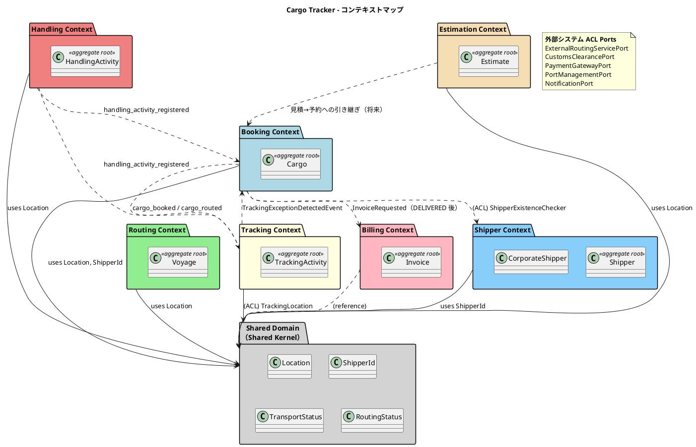

各コンテキストは Packwerk パッケージ（`packs/<context>/app/...`）として実装し、上図の依存関係のみを `package.yml` で許可する。

## 1. Booking Context（予約コンテキスト）

### ドメインモデル図

```plantuml
@startuml
title Booking Context - ドメインモデル

package "Aggregate（集約）" {
  class Cargo <<aggregate root>> {
    -bookingId: BookingId
    -shipperId: BigInt（shippers.id・ADR-0003）
    -consignee: Consignee
    -routeSpecification: RouteSpecification
    -cargoItinerary: CargoItinerary
    -delivery: Delivery
    -bookingAmount: MoneyAmount
    -bookingStatus: BookingStatus
    -cargoType: CargoType
    -dimensions: Dimensions
    -quantity: Quantity
    -description: Description
    -hazardousDeclaration: HazardousDeclaration
    -temperatureRequirement: TemperatureRequirement
  }
}

package "Value Objects（値オブジェクト）" {
  class BookingId <<value object>> {
    -id: String
  }
  class Consignee <<value object>> {
    -name: String
    -address: String
    -contactEmail: String
  }
  class RouteSpecification <<value object>> {
    -origin: Location
    -destination: Location
    -arrivalDeadline: Date
    +isSatisfiedBy(itinerary): boolean
  }
  class CargoItinerary <<value object>> {
    -legs: List<Leg>
    +expectedArrivalTime(): Date
  }
  class Leg <<value object>> {
    -loadLocation: Location
    -unloadLocation: Location
    -loadTime: Date
    -unloadTime: Date
    -voyage: VoyageNumber
  }
  class Delivery <<value object>> {
    -transportStatus: TransportStatus
    -routingStatus: RoutingStatus
    -lastCargoHandledEvent: CargoHandlingActivity
  }
  class MoneyAmount <<value object>> {
    -amount: BigDecimal
    -currency: CurrencyCode
    +add(other: MoneyAmount): MoneyAmount
    +multiply(factor: BigDecimal): MoneyAmount
  }
  class CargoHandlingActivity <<value object>> {
    -handlingType: String
    -location: Location
    -completionTime: Date
  }
  enum BookingStatus {
    PRELIMINARY
    ROUTE_REQUESTED
    ROUTE_PROPOSED
    CONFIRMED
    TRACKING_ISSUED
    IN_TRANSIT
    DELIVERED
    SETTLED
    CANCELLED
  }
  enum ShipperType {
    INDIVIDUAL
    CORPORATE
  }
  class Dimensions <<value object>> {
    -length: BigDecimal
    -width: BigDecimal
    -height: BigDecimal
  }
  class Quantity <<value object>> {
    -value: int
  }
  class Description <<value object>> {
    -value: String
  }
  class HazardousDeclaration <<value object>> {
    -hazardousClass: String
    -unNumber: String
    -properShippingName: String
  }
  class TemperatureRequirement <<value object>> {
    -minTemperature: BigDecimal
    -maxTemperature: BigDecimal
    -unit: TemperatureUnit
  }
  enum CargoType {
    GENERAL
    HAZARDOUS
    REFRIGERATED
  }
  enum RoutingStatus {
    NOT_ROUTED
    ROUTED
    MISROUTED
  }
}

interface ShipperExistenceChecker <<ACL Port>> {
  +exists(shipperId: BigInt): boolean
}

Cargo *-- BookingId
Cargo *-- Consignee
Cargo *-- RouteSpecification
Cargo *-- CargoItinerary
Cargo *-- Delivery
Cargo *-- MoneyAmount
Cargo *-- BookingStatus
Cargo *-- CargoType
Cargo *-o Dimensions
Cargo *-o Quantity
Cargo *-o Description
Cargo *-o HazardousDeclaration
Cargo *-o TemperatureRequirement
CargoItinerary *-- Leg
Delivery *-- RoutingStatus

@enduml
```

### 集約・エンティティ・値オブジェクト一覧

| 種別 | クラス名 | 日本語名 | 責務 |
|---|---|---|---|
| 集約ルート | Cargo | 貨物 | 予約の中心。状態遷移・旅程・配送状況を統括 |
| 値オブジェクト | BookingId | 予約 ID | 予約の一意識別 |
| スカラー参照 | shipperId | 荷主識別子 | 越境識別子 shippers.id（bigint サロゲート）を素の値で保持（ADR-0003・VO 化しない）。荷主種別は Shipper Context 側で保持 |
| 値オブジェクト | Consignee | 荷受人情報 | 荷受人の名前・住所・連絡先メール |
| 値オブジェクト | RouteSpecification | ルート仕様 | 出発地・目的地・到着期限の要件定義 |
| 値オブジェクト | CargoItinerary | 旅程 | 輸送区間（Leg）の集合と到着時刻計算 |
| 値オブジェクト | Leg | 輸送区間 | 単一航海での積込港から荷降港までの区間 |
| 値オブジェクト | Delivery | 配送状況 | 現在の輸送状態・経路状態・最終荷役イベント |
| 値オブジェクト | MoneyAmount | 金額 | 金額と通貨コードのペア。多通貨対応 |
| 値オブジェクト | CargoHandlingActivity | 荷役活動（参照用） | 最終荷役イベントの記録 |
| 列挙型 | BookingStatus | 予約状態 | 9 段階の予約ライフサイクル（ROUTE_REQUESTED = 経路設計中を含む） |
| 列挙型 | ShipperType | 荷主種別 | INDIVIDUAL / CORPORATE |
| 値オブジェクト | Dimensions | 寸法 | 貨物の長さ・幅・高さ（オプション、nil 許容） |
| 値オブジェクト | Quantity | 個数 | 貨物の個数（1 以上、オプション、nil 許容） |
| 値オブジェクト | Description | 品名 | 貨物の品名（最大 500 文字、オプション、nil 許容） |
| 値オブジェクト | HazardousDeclaration | 危険物申告 | 危険物クラス・UN 番号・正式輸送品名 |
| 値オブジェクト | TemperatureRequirement | 温度管理条件 | 最低/最高温度・温度単位 |
| 列挙型 | CargoType | 貨物種別 | GENERAL / HAZARDOUS / REFRIGERATED |
| 列挙型 | RoutingStatus | 経路状態 | NOT_ROUTED / ROUTED / MISROUTED |
| ACL ポート | ShipperExistenceChecker | 荷主存在確認 | Shipper Context への ACL。荷主 ID の存在確認 |

### Ruby 実装例

Cargo 集約は PORO として実装し、不変条件をコンストラクタと状態遷移メソッドで守る。

```ruby
module Booking
  module Domain
    class Cargo
      attr_reader :booking_id, :shipper_id, :cargo_type, :booking_status,
                  :route_specification, :cargo_itinerary, :delivery,
                  :hazardous_declaration, :temperature_requirement

      def initialize(booking_id:, shipper_id:, cargo_type:, route_specification:,
                     booking_status: BookingStatus.new("PRELIMINARY"),
                     hazardous_declaration: nil, temperature_requirement: nil, **options)
        raise ArgumentError, "booking_id は必須です" if booking_id.nil?
        raise ArgumentError, "shipper_id は必須です" if shipper_id.nil?
        validate_cargo_type_requirements!(cargo_type, hazardous_declaration, temperature_requirement)

        @booking_id = booking_id
        @shipper_id = shipper_id
        @cargo_type = cargo_type
        @route_specification = route_specification
        @booking_status = booking_status
        @hazardous_declaration = hazardous_declaration
        @temperature_requirement = temperature_requirement
        # dimensions / quantity / description はオプション（nil 許容）
      end

      # 経路設計者への引き渡し：PRELIMINARY → ROUTE_REQUESTED（US06）
      def assign_to_routing = transition_to("ROUTE_REQUESTED")

      # 旅程割り当て：ROUTE_REQUESTED → ROUTE_PROPOSED
      def assign_itinerary(itinerary)
        unless route_specification.satisfied_by?(itinerary)
          raise Domain::InvalidItineraryError, "旅程がルート仕様を満たしません"
        end
        @cargo_itinerary = itinerary
        transition_to("ROUTE_PROPOSED")
      end

      # 予約確定：ROUTE_PROPOSED → CONFIRMED
      def confirm = transition_to("CONFIRMED")

      # ルート変更の差戻し：ROUTE_PROPOSED → ROUTE_REQUESTED（US13。旅程を破棄して経路設計中に戻す）
      def back_to_routing
        @cargo_itinerary = nil
        transition_to("ROUTE_REQUESTED")
      end

      def cancel = transition_to("CANCELLED")

      private

      def validate_cargo_type_requirements!(cargo_type, hazardous, temperature)
        if cargo_type.hazardous? && hazardous.nil?
          raise ArgumentError, "HAZARDOUS には HazardousDeclaration が必須です"
        end
        if cargo_type.refrigerated? && temperature.nil?
          raise ArgumentError, "REFRIGERATED には TemperatureRequirement が必須です"
        end
      end

      def transition_to(next_status)
        @booking_status = @booking_status.transition_to(next_status) # 不正遷移は例外
      end
    end
  end
end
```

`CargoItinerary` の Leg 連結制約は値オブジェクト側で検証する。

```ruby
CargoItinerary = Data.define(:legs) do
  def initialize(legs:)
    raise ArgumentError, "旅程は 1 つ以上の Leg が必要です" if legs.empty?
    legs.each_cons(2) do |prev, succ|
      unless prev.unload_location == succ.load_location
        raise ArgumentError, "Leg の連結制約違反: #{prev.unload_location} != #{succ.load_location}"
      end
    end
    super(legs: legs.freeze)
  end

  def expected_arrival_time = legs.last.unload_time
end
```

### ビジネスルール

1. 貨物は必ず BookingId・ShipperId・CargoType を持つ
2. RouteSpecification の出発地と目的地は異なる（UN/LOCODE 形式で検証）
3. CargoItinerary は 1 つ以上の Leg で構成される。`Leg[n].unloadLocation == Leg[n+1].loadLocation` の連結制約を満たす必要がある
4. BookingStatus の遷移は `PRELIMINARY → ROUTE_REQUESTED → ROUTE_PROPOSED → CONFIRMED → TRACKING_ISSUED → IN_TRANSIT → DELIVERED → SETTLED` の順に進む。ROUTE_REQUESTED（経路設計中）は営業担当者が経路設計者へ予約を引き渡した状態（US06）であり、経路設計者が経路候補を提示すると ROUTE_PROPOSED に遷移する。いずれの状態からも CANCELLED に遷移可能。各遷移は `can_transition_to?` で可能な場合のみ実行する（IT5）
11. CONFIRMED→TRACKING_ISSUED は追跡番号発行（US14・`AssignTrackingNumber`）で遷移する。**TRACKING_ISSUED→IN_TRANSIT の起点は初回 LOAD 荷役**（US15・`handling_activity_registered` 経由）とし、出港（ONBOARD_CARRIER の手動更新・US17）では BookingStatus を遷移させない。IN_TRANSIT→DELIVERED は引取（US16・CLAIM）で遷移し、精算開始条件となる（IT5）
10. ROUTE_PROPOSED（経路提案中）の予約は、荷主のルート変更希望により ROUTE_REQUESTED（経路設計中）へ差し戻せる（US13・`back_to_routing`）。差戻し時は割り当て済みの CargoItinerary を破棄する（後方遷移）
5. CORPORATE ShipperType の荷主は割引適用の対象となる（割引率上限 30%）
6. HAZARDOUS / REFRIGERATED の CargoType は指定港のみ取扱可能
7. HAZARDOUS CargoType の場合、HazardousDeclaration は必須
8. REFRIGERATED CargoType の場合、TemperatureRequirement は必須
9. Booking Context は Shipper Context に直接依存せず、ShipperExistenceChecker ACL ポートを通じて荷主の存在を確認する（Packwerk の依存設定でも直接参照を禁止する）

### コマンド一覧

| コマンド | 実行アクター | 主な処理 |
|---|---|---|
| BookCargoCommand | 営業担当者 | 貨物予約の新規登録（PRELIMINARY 状態で作成） |
| AssignToRoutingCommand | 営業担当者 | 予約情報を経路設計者に引き渡す（PRELIMINARY → ROUTE_REQUESTED に遷移、US06） |
| ConfirmBookingCommand | 営業担当者 | 予約を確定する（ROUTE_PROPOSED → CONFIRMED に遷移） |
| RequestReroutingCommand | 営業担当者 | 荷主のルート変更希望で予約を差し戻す（ROUTE_PROPOSED → ROUTE_REQUESTED に遷移・旅程破棄、US13・`back_to_routing`） |
| CancelBookingCommand | 営業担当者 | 予約をキャンセルする（任意状態 → CANCELLED に遷移） |
| RouteCargoCommand | 経路設計者 | CargoItinerary を Cargo に割り当て、ROUTE_REQUESTED → ROUTE_PROPOSED に遷移 |
| AssignTrackingNumberCommand | 経路設計者（MVP は営業担当者が代替） | 明示発行操作（`POST /bookings/:id/issue_tracking`）をトリガーに CONFIRMED→TRACKING_ISSUED を検証。成立時に Tracking Context が TrackingActivity を生成（`cargo_confirmed` 購読による自動生成は不採用・IT5） |
| UpdateBookingStatusCommand | システム | BookingStatus の状態遷移を更新 |

## 2. Shipper Context（荷主コンテキスト）

### ドメインモデル図

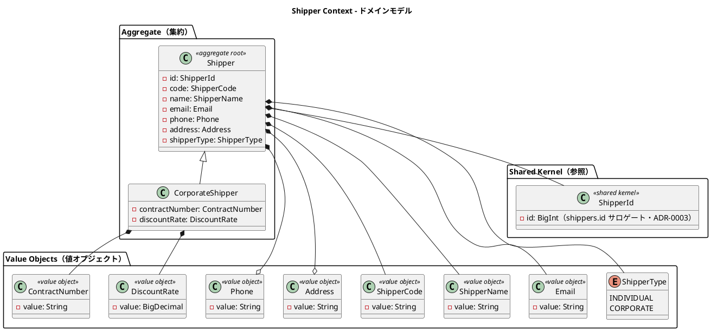

### 集約・エンティティ・値オブジェクト一覧

| 種別 | クラス名 | 日本語名 | 責務 |
|---|---|---|---|
| 集約ルート | Shipper | 荷主 | 荷主情報の管理。個人・法人の 2 種別 |
| エンティティ | CorporateShipper | 法人荷主 | Shipper のサブタイプ。契約番号と割引率を追加保持 |
| 値オブジェクト | ShipperCode | 荷主コード | 自動生成される荷主の業務識別コード |
| 値オブジェクト | ShipperName | 荷主名 | 荷主の氏名または社名 |
| 値オブジェクト | Email | メール | メールアドレス。一意制約あり |
| 値オブジェクト | Phone | 電話番号 | 電話番号（オプション、nil 許容） |
| 値オブジェクト | Address | 住所 | 住所（オプション、nil 許容、最大 500 文字） |
| 値オブジェクト | ContractNumber | 契約番号 | 法人荷主の契約番号 |
| 値オブジェクト | DiscountRate | 割引率 | 法人荷主の割引率（0〜30%） |
| 列挙型 | ShipperType | 荷主種別 | INDIVIDUAL / CORPORATE |
| 共有カーネル参照 | ShipperId | 荷主識別子 | shippers.id（bigint サロゲート）ベースの越境識別子。Shared Domain に配置（ADR-0003） |

### Ruby 実装例

サブタイプは Ruby の継承で表現し、値オブジェクトは `Data.define` で実装する。

```ruby
DiscountRate = Data.define(:value) do
  RANGE = (BigDecimal("0")..BigDecimal("0.3")).freeze

  def initialize(value:)
    rate = BigDecimal(value.to_s)
    raise ArgumentError, "割引率は 0〜30% です" unless RANGE.cover?(rate)
    super(value: rate)
  end
end

module Shipper
  module Domain
    class CorporateShipper < Shipper
      attr_reader :contract_number, :discount_rate

      def initialize(contract_number:, discount_rate:, **shipper_attrs)
        raise ArgumentError, "法人荷主には契約番号が必須です" if contract_number.nil?
        raise ArgumentError, "法人荷主には割引率が必須です" if discount_rate.nil?
        super(**shipper_attrs, shipper_type: ShipperType.new("CORPORATE"))
        @contract_number = contract_number
        @discount_rate = discount_rate
      end
    end
  end
end
```

### ビジネスルール

1. 荷主は必ず ShipperId・ShipperCode・ShipperName・Email・ShipperType を持つ
2. Email はシステム全体で一意（`EmailAlreadyRegisteredError` で重複検出。DB 側にも一意インデックスを設ける）
3. CORPORATE ShipperType の場合、CorporateShipper として ContractNumber と DiscountRate が必須
4. DiscountRate の値域は 0.0000〜0.3000（0%〜30%）
5. ShipperCode は自動生成（`SHP-` プレフィックス + UUID 先頭 8 文字）

### コマンド一覧

| コマンド | 実行アクター | 主な処理 |
|---|---|---|
| RegisterShipperCommand | 営業担当者 | 荷主の新規登録。Email 重複チェックと ShipperCode 自動生成 |

## 3. Routing Context（経路コンテキスト）

### ドメインモデル図

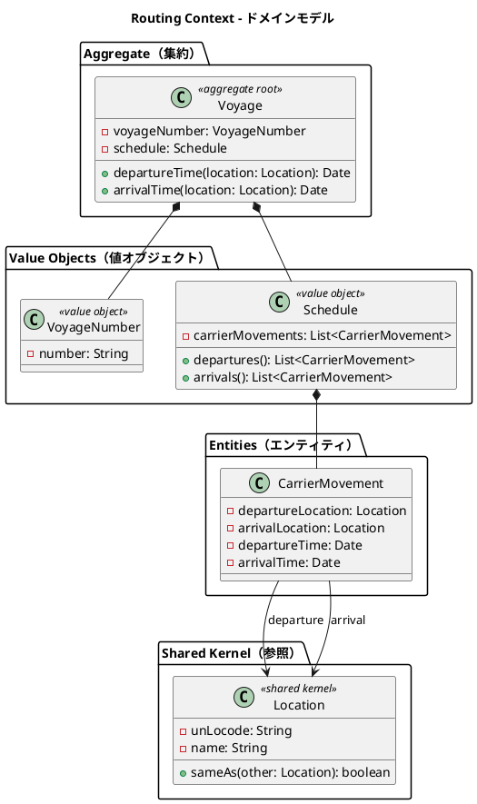

### 集約・エンティティ・値オブジェクト一覧

| 種別 | クラス名 | 日本語名 | 責務 |
|---|---|---|---|
| 集約ルート | Voyage | 航海 | 航路スケジュールを管理する中心エンティティ |
| 値オブジェクト | VoyageNumber | 航海番号 | Routing Context 固有の航海一意識別子 |
| 値オブジェクト | Schedule | 航海スケジュール | 時系列の CarrierMovement 一覧を保持 |
| エンティティ | CarrierMovement | 運送区間 | 出発地・到着地・出発時刻・到着時刻の区間単位 |
| 共有カーネル参照 | Location | 位置情報 | UN/LOCODE で識別される港湾・地点 |
| 値オブジェクト（一時計算値） | RouteCandidate | 経路候補 | US08 で算出する一時的な経路候補（所要日数・経由港・費用・航海番号）。**非永続**。永続化は Estimation Context の責務（ADR-0004） |
| ACL ポート | ExternalCargoRoutingService | 外部経路探索 | 外部経路システムへの経路探索リクエスト。Faraday HTTP アダプタで実装、タイムアウト時は過去実績データにフォールバック |

> **US08 経路候補算出の BC 帰属（ADR-0004）**: `RouteCandidate` は本来 Estimation Context の要素（`Estimate` 集約の子、`route_candidates` テーブルで永続化）だが、Estimation は IT7 まで未着手のため、IT3 では Routing Context で **一時計算値（非永続）** として算出し経路割り当て画面に提示する。永続化は IT7 で Estimation が担う。

### ビジネスルール

1. 航海は必ず一意の VoyageNumber を持つ
2. Schedule は時系列順の CarrierMovement で構成される
3. CarrierMovement の出発地と到着地は異なる
4. Location は UN/LOCODE で一意に識別される（例: `JPOSA` = 大阪、`USLAX` = LA）
5. 航海の出発日は到着日より前でなければならない（US24 日付整合）
6. 寄港地（CarrierMovement）は順序付き（`seq_number` 1 始まり）で保持する

### コマンド一覧

| コマンド | 実行アクター | 主な処理 |
|---|---|---|
| RegisterVoyageCommand | 経路設計者 | 新規航海スケジュールの登録（US24） |
| UpdateScheduleCommand | 経路設計者 | 運送区間の追加・変更（US25） |
| CalculateRouteCandidatesCommand | 経路設計者/営業担当者 | 経路候補の算出（US08・一時計算値・ADR-0004） |

## 4. Tracking Context（追跡コンテキスト）

### ドメインモデル図

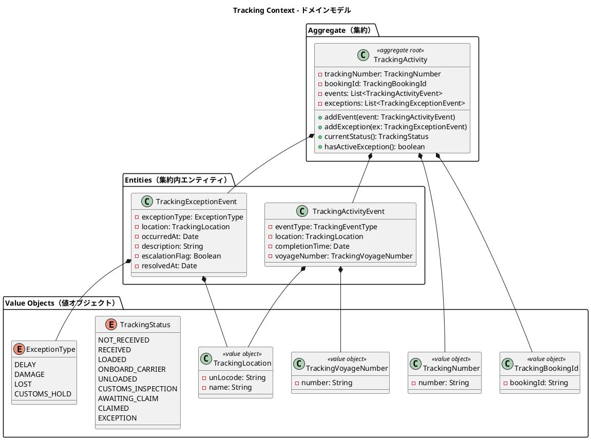

### 集約・エンティティ・値オブジェクト一覧

| 種別 | クラス名 | 日本語名 | 責務 |
|---|---|---|---|
| 集約ルート | TrackingActivity | 追跡レコード | 貨物の追跡情報全体を管理 |
| エンティティ（集約内） | TrackingActivityEvent | 追跡イベント | 時系列で記録される追跡の出来事 |
| エンティティ（集約内） | TrackingExceptionEvent | 追跡例外イベント | 遅延・損傷・紛失・税関保留の例外記録 |
| 値オブジェクト | TrackingNumber | 追跡番号 | 追跡活動を一意に識別 |
| 値オブジェクト | TrackingBookingId | 予約参照 ID | Booking Context との関連を保持 |
| 値オブジェクト | TrackingLocation | 追跡位置情報 | コンテキスト固有の位置情報型（ACL 変換） |
| 値オブジェクト | TrackingVoyageNumber | 追跡航海番号 | Tracking Context 固有の航海番号型 |
| 列挙型 | TrackingStatus | 追跡状態 | 9 段階の追跡フェーズ（NOT_RECEIVED / RECEIVED / LOADED / ONBOARD_CARRIER / UNLOADED / CUSTOMS_INSPECTION / AWAITING_CLAIM / CLAIMED / EXCEPTION） |
| 列挙型 | ExceptionType | 例外種別 | DELAY / DAMAGE / LOST / CUSTOMS_HOLD |

### ビジネスルール

1. 追跡活動は必ず一意の TrackingNumber を持つ
2. TrackingActivityEvent は時系列順で管理される。イベントごとに位置と時刻が必須
3. ExceptionType が LOST の場合、escalationFlag を `true` に設定し上位管理者へエスカレーションする
4. CUSTOMS_HOLD 例外は税関システム（CustomsClearancePort）からの通知によって自動登録される
5. `ResolveExceptionCommand` の実行により TrackingStatus は例外発生前の状態に復帰する
6. 未解決の例外は `resolved_at` が `nil` であることで表現する（唯一の例外的な nil 利用であり、`resolved?` 述語メソッドで判定を隠蔽する）
7. ユビキタス言語は **TrackingStatus** に統一する。データモデル上は `tracking_activities.transport_status` カラムに永続化し（Shared Domain の `TransportStatus` と同一 9 値のうち IT5 は NOT_RECEIVED / RECEIVED / LOADED / ONBOARD_CARRIER / UNLOADED / AWAITING_CLAIM / CLAIMED を使用）、リポジトリのマッパーが `TrackingStatus` と相互変換する。荷役種別からの状態マッピングは `TrackingStatus.for_handling`（RECEIVE→RECEIVED / LOAD→LOADED / UNLOAD→UNLOADED / CLAIM→CLAIMED）で解決する（IT5）

### コマンド一覧

| コマンド | 実行アクター | 主な処理 |
|---|---|---|
| AssignTrackingNumberCommand | 経路設計者（MVP は営業担当者が代替）の明示発行操作 | Booking 公開 API で CONFIRMED→TRACKING_ISSUED を検証し、成立時のみ TrackingActivity を新規作成して TrackingNumber を割り当て、`tracking_number_issued` を発行（IT5・`cargo_confirmed` 購読による自動生成は不採用） |
| AddTrackingEventCommand | 追跡管理者 | TrackingActivityEvent を時系列で追加 |
| RegisterExceptionCommand | 追跡管理者・税関システム | TrackingExceptionEvent を登録 |
| ResolveExceptionCommand | 追跡管理者 | 例外を解決し TrackingStatus を復帰 |

## 5. Handling Context（荷役コンテキスト）

### ドメインモデル図

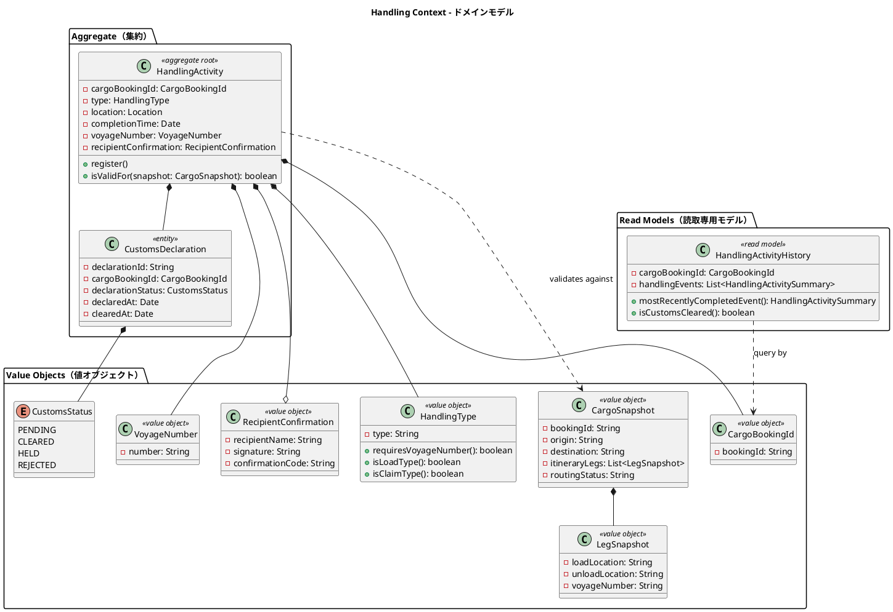

### 集約・エンティティ・値オブジェクト一覧

| 種別 | クラス名 | 日本語名 | 責務 |
|---|---|---|---|
| 集約ルート | HandlingActivity | 荷役作業 | 荷役作業の登録と妥当性検証 |
| エンティティ（集約内） | CustomsDeclaration | 通関申告 | 通関申告の状態管理 |
| 値オブジェクト | CargoBookingId | 貨物予約識別子 | Booking Context との関連識別子 |
| 値オブジェクト | HandlingType | 荷役種別 | RECEIVE / LOAD / UNLOAD / CUSTOMS / CLAIM。VoyageNumber 必須判定を内包 |
| 値オブジェクト | CargoSnapshot | 貨物スナップショット | ACL 経由で取得した貨物情報。妥当性検証に使用 |
| 値オブジェクト | LegSnapshot | 旅程区間スナップショット | CargoSnapshot 内の区間情報 |
| 値オブジェクト | VoyageNumber | 航海番号 | Handling Context 固有の航海番号型 |
| 値オブジェクト | RecipientConfirmation | 荷受人確認 | 引取時の荷受人確認記録。recipient_name と、signature または confirmation_code のいずれかを保持（CLAIM 時必須、US16） |
| 列挙型 | CustomsStatus | 通関状態 | PENDING / CLEARED / HELD / REJECTED |
| Read Model | HandlingActivityHistory | 荷役履歴 | クエリ専用の荷役作業履歴。集約と切り離して管理 |

### ビジネスルール

荷役妥当性検証（`valid_for?`）のデシジョンテーブル：

| 荷役タイプ | VoyageNumber 必須 | 場所チェック | MISROUTED 判定条件 |
|---|---|---|---|
| RECEIVE（受領） | 不要 | 出発港（RouteSpecification.origin）と一致 | 不一致で警告 |
| LOAD（積込） | 必須 | Itinerary の積込港（Leg.loadLocation）と一致 | 不一致で MISROUTED |
| UNLOAD（荷降し） | 必須 | Itinerary の荷降港（Leg.unloadLocation）と一致 | 不一致で MISROUTED |
| CLAIM（引取） | 不要 | 目的港（RouteSpecification.destination）と一致 | 不一致で警告 |

追加ルール：

1. LOAD / UNLOAD 作業で MISROUTED が確定した場合、Booking Context の RoutingStatus を MISROUTED に更新する（`HandlingActivityRegisteredEvent` 経由）
2. CustomsDeclaration が CLEARED 状態になるまで CLAIM（引取）は実施できない
3. CLAIM（引取）登録時には RecipientConfirmation（荷受人確認）が必須。`recipient_name` に加えて、`signature`（署名）または `confirmation_code`（確認コード）のいずれか一方を必ず保持する（US16）。CLAIM 以外の荷役種別では `nil` 許容
4. HandlingActivityHistory はクエリ専用の Read Model として管理され、集約とは切り離す。Rails では読取専用のクエリオブジェクト（Active Record を直接参照してよい CQRS の Query 側）として実装する

### コマンド一覧

| コマンド | 実行アクター | 主な処理 |
|---|---|---|
| HandlingActivityRegistrationCommand | 荷役作業員 | 荷役作業を登録し、CargoSnapshot で妥当性を検証 |
| RegisterCustomsDeclarationCommand | 荷役作業員 | 通関申告を新規登録（PENDING 状態で作成） |
| UpdateCustomsStatusCommand | 税関システム（ACL） | 通関申告の状態を更新（CLEARED / HELD / REJECTED） |

## 6. Billing Context（精算コンテキスト）

### ドメインモデル図

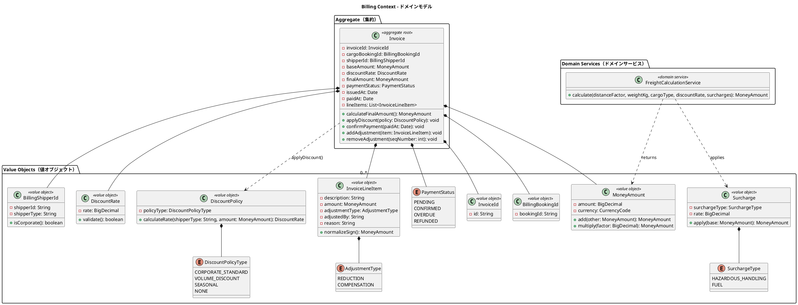

### 集約・エンティティ・値オブジェクト一覧

| 種別 | クラス名 | 日本語名 | 責務 |
|---|---|---|---|
| 集約ルート | Invoice | 精算書 | 貨物輸送 1 件に対する請求書の発行・管理 |
| 値オブジェクト | InvoiceId | 請求書 ID | 精算書の一意識別子 |
| 値オブジェクト | BillingBookingId | 予約参照 ID | Booking Context の Cargo との関連識別子 |
| 値オブジェクト | BillingShipperId | 荷主参照 ID | 法人判定（corporate?）を内包 |
| 値オブジェクト | MoneyAmount | 金額 | 金額と通貨コードのペア |
| 値オブジェクト | DiscountRate | 割引率 | 0〜30% の割引率。範囲バリデーション付き |
| 値オブジェクト | DiscountPolicy | 割引方針 | 法人・ボリューム・シーズン割引のロジック |
| 値オブジェクト | Surcharge | 割増 | 割引（DiscountRate 0〜30%）とは別概念の加算料金。危険物取扱割増・燃油サーチャージ等 |
| 値オブジェクト | InvoiceLineItem | 料金調整明細 | 料金調整（減額・補償費用）。生成時に符号を負値へ正規化し請求額から減算。担当者・理由を監査証跡として保持（US21-6・IT8/IT9） |
| 列挙型 | SurchargeType | 割増種別 | HAZARDOUS_HANDLING（危険物割増）/ FUEL（燃油サーチャージ） |
| 列挙型 | AdjustmentType | 料金調整種別 | REDUCTION（減額）/ COMPENSATION（補償費用）。いずれも請求額を減算（IT9/T45） |
| 列挙型 | PaymentStatus | 支払い状態 | PENDING / CONFIRMED / OVERDUE / REFUNDED |
| 列挙型 | DiscountPolicyType | 割引方針種別 | CORPORATE_STANDARD / VOLUME_DISCOUNT / SEASONAL / NONE |
| ドメインサービス | FreightCalculationService | 料金計算サービス | 基本料金・割引・割増・消費税を統合した最終請求額の算出 |

### Ruby 実装例

```ruby
module Billing
  module Domain
    class Invoice
      attr_reader :invoice_id, :base_amount, :discount_rate, :final_amount,
                  :payment_status, :issued_at, :paid_at

      def apply_discount(policy)
        @discount_rate = policy.calculate_rate(shipper_id.shipper_type, base_amount)
        @final_amount = base_amount.multiply(1 - discount_rate.value)
      end

      def confirm_payment(paid_at)
        unless payment_status.pending?
          raise Domain::InvalidPaymentTransitionError, "PENDING 以外は支払い確定できません"
        end
        @payment_status = PaymentStatus.new("CONFIRMED")
        @paid_at = paid_at
      end
    end
  end
end
```

### ビジネスルール

1. Invoice は貨物配送完了（BookingStatus = DELIVERED）後にのみ発行できる
2. 法人荷主（CORPORATE）には最大 30% の割引が適用される
3. 支払期限（issuedAt + 30 日）を超過した場合、PaymentStatus を OVERDUE に更新する
4. 支払い確定（CONFIRMED）後のキャンセルは `IssueRefundCommand` で対応し、REFUNDED 状態に遷移する

### 料金計算ドメインサービス（FreightCalculationService）

料金計算は Invoice 集約から独立したドメインサービス FreightCalculationService に配置する。計算手順は以下のとおりです。

1. 基本料金 = 距離係数 × 重量（kg） × 貨物種別係数（GENERAL: 1.0 / HAZARDOUS: 1.8 / REFRIGERATED: 1.5）
2. 割引適用 = 基本料金 × (1 - 割引率)（CORPORATE 荷主: DiscountRate 0〜30%、INDIVIDUAL 荷主: 0%）
3. 割増適用 = 割引後料金 + Surcharge（危険物取扱割増・燃油サーチャージ等。割引とは独立に加算）
4. 消費税適用 = 割増適用後料金 × 1.10（消費税 10%）

なお、割増（Surcharge）は割引（DiscountRate 0〜30%）とは別概念の値オブジェクトであり、危険物割増（HAZARDOUS_HANDLING）や燃油サーチャージ（FUEL）のように基本料金に対する加算率として定義する。

```ruby
module Billing
  module Domain
    CARGO_TYPE_FACTORS = {
      "GENERAL" => BigDecimal("1.0"),
      "HAZARDOUS" => BigDecimal("1.8"),
      "REFRIGERATED" => BigDecimal("1.5")
    }.freeze

    TAX_RATE = BigDecimal("0.10")

    Surcharge = Data.define(:surcharge_type, :rate) do
      def apply(base)
        base.add(base.multiply(rate))
      end
    end

    class FreightCalculationService
      def calculate(distance_factor:, weight_kg:, cargo_type:, discount_rate:, surcharges: [])
        base = base_freight(distance_factor, weight_kg, cargo_type)
        discounted = base.multiply(1 - discount_rate.value)
        surcharged = surcharges.reduce(discounted) { |amount, surcharge| surcharge.apply(amount) }
        surcharged.multiply(1 + TAX_RATE) # 消費税 10%
      end

      private

      def base_freight(distance_factor, weight_kg, cargo_type)
        factor = CARGO_TYPE_FACTORS.fetch(cargo_type.value)
        MoneyAmount.new(amount: distance_factor * weight_kg * factor, currency: "JPY")
      end
    end
  end
end
```

### コマンド一覧

| コマンド | 実行アクター | 主な処理 |
|---|---|---|
| GenerateInvoiceCommand | 経理担当者 | 請求書を新規発行（PENDING 状態で作成） |
| ConfirmPaymentCommand | 経理担当者 | 支払い確認を記録し CONFIRMED に遷移 |

## 7. Estimation Context（見積コンテキスト）

### ドメインモデル図

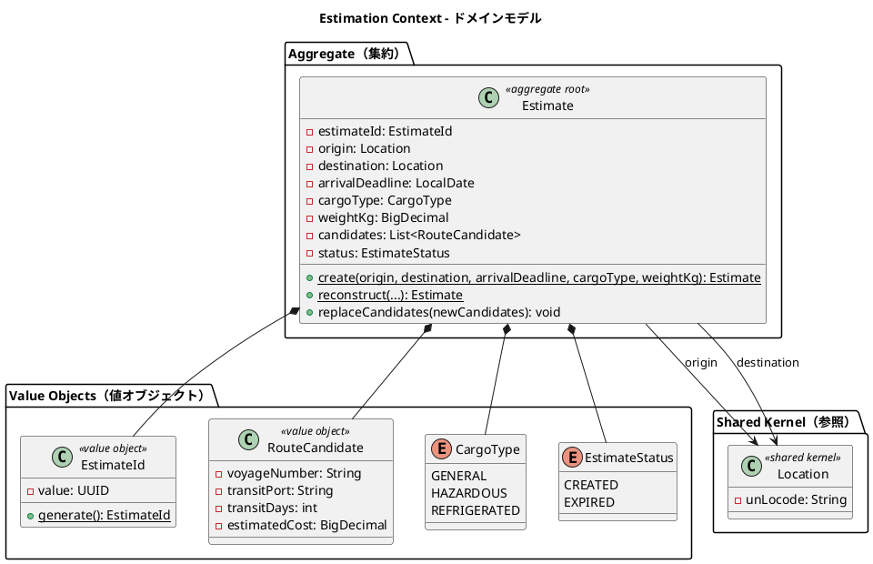

### 集約・エンティティ・値オブジェクト一覧

| 種別 | クラス名 | 日本語名 | 責務 |
|---|---|---|---|
| 集約ルート | Estimate | 見積 | 輸送見積の中心エンティティ。出発地・仕向地・貨物種別・重量・ルート候補を管理 |
| 値オブジェクト | EstimateId | 見積 ID | UUID ベースの見積一意識別子。`generate` で自動生成 |
| 値オブジェクト（Data.define） | RouteCandidate | ルート候補 | 航海番号・経由港・輸送日数・見積コストを保持。Estimate に複数紐づく |
| 列挙型 | CargoType | 貨物種別 | GENERAL / HAZARDOUS / REFRIGERATED |
| 列挙型 | EstimateStatus | 見積状態 | CREATED（作成済）/ EXPIRED（期限切れ）。表示名（日本語）を保持 |
| 共有カーネル参照 | Location | 位置情報 | UN/LOCODE で識別される港湾・地点。Shared Domain に配置 |
| リポジトリ | EstimateRepository | 見積リポジトリ | `save` / `find_by_estimate_id` / `find_all` |

### ビジネスルール

1. 見積は必ず EstimateId・origin・destination・arrivalDeadline・CargoType・weightKg を持つ
2. origin と destination は異なる（同一地点への見積は不可）
3. weightKg は正の値でなければならない
4. RouteCandidate の voyageNumber は空でない文字列、transitDays は正の値、estimatedCost は正の値
5. 見積作成時のデフォルトステータスは `CREATED`
6. ルート候補はスタブ実装（固定値）で生成される。将来、外部ルーティングサービスとの連携時に置換予定

### コマンド一覧

| コマンド | 実行アクター | 主な処理 |
|---|---|---|
| CreateEstimateCommand | 営業担当者 | 見積を新規作成し、スタブのルート候補を自動付与 |
| UpdateEstimateCommand | 営業担当者 | 見積条件（出発地・仕向地・期限・貨物種別・重量）を調整して経路候補を再算出し、`replaceCandidates` で一括入替する（US10） |

### Booking Context との関係

Estimation Context は Booking Context と以下の関係を持つ。

- **共有**: CargoType 列挙型は両コンテキストで同一の値（GENERAL / HAZARDOUS / REFRIGERATED）を使用する
- **参照**: Location（Shared Domain）を経由して出発地・仕向地を共有する
- **将来の連携**: 見積から予約への引き継ぎ（見積情報を基に Cargo を作成するフロー）は将来イテレーションで実装予定

## 認証・認可基盤（共通）

> **位置づけ**: 認証・認可は 8 つの業務コンテキストのいずれにも属さない**横断的な共通基盤**であり、業務ドメインモデルの一部ではない。Rails 標準認証（`has_secure_password` + セッション）と 5 ロール RBAC（Pundit）で実現し、実装は業務パックではなくメインアプリ（`app/models` / `app/controllers` / `app/services`）に配置する。ここでは業務コンテキストとの語彙一貫性のために構造のみを記録する（IT1 で実装）。

### モデル

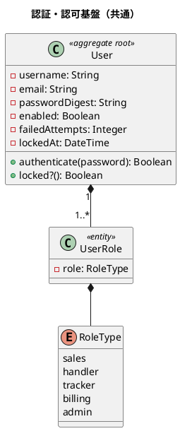

### 構成要素一覧

| 種別 | クラス名 | 日本語名 | 責務 |
|---|---|---|---|
| 集約ルート | User | 利用者 | 認証情報の保持・パスワード検証・アカウントロック（5 回連続失敗で `locked_at` 設定） |
| エンティティ | UserRole | 利用者ロール | 利用者に割り当てるロール（`(user_id, role)` 一意） |
| 列挙型 | RoleType | ロール種別 | `sales` / `handler` / `tracker` / `billing` / `admin`（5 ロール RBAC） |

### ビジネスルール

1. 認証は利用者 ID とパスワードで行い、成功・失敗はログに記録する（US26）
2. 認証失敗が 5 回連続するとアカウントを一時ロックする（`locked_at` を設定）
3. 無効化（`enabled = false`）された利用者はログインできない
4. ロール名は 5 ロール RBAC の値集合に限定する（`user_roles.role`）

## 8. Shared Domain（共有ドメイン）

### ドメインモデル図

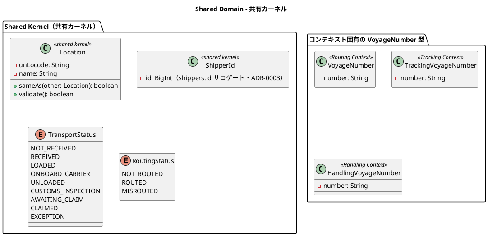

### 共有コンポーネント一覧

| 種別 | クラス名 | 日本語名 | 責務 |
|---|---|---|---|
| 共有カーネル | Location | 位置情報 | UN/LOCODE で識別される港湾・地点。全コンテキストで共有 |
| 共有カーネル | ShipperId | 荷主識別子 | shippers.id（bigint サロゲート）ベースの越境識別子。Booking と Shipper で共有（ADR-0003） |
| 共有列挙型 | TransportStatus | 輸送状態 | 9 段階の輸送フェーズ（TrackingStatus と同一の 9 値: NOT_RECEIVED / RECEIVED / LOADED / ONBOARD_CARRIER / UNLOADED / CUSTOMS_INSPECTION / AWAITING_CLAIM / CLAIMED / EXCEPTION）。Booking・Tracking で共有 |
| （帰属: Booking Context） | RoutingStatus | 経路状態 | NOT_ROUTED / ROUTED / MISROUTED。**帰属は Booking Context に一意化**（IT4）。IT4 では `cargos.routing_status` カラムで表現し、MISROUTED は Handling Context の荷役結果を Booking が受けて更新する（列挙型そのものは共有せず、イベントペイロードで値を受け渡す） |

Shared Domain は Packwerk 上で唯一すべてのコンテキストパッケージから依存を許可されるパッケージ（`packs/shared`）である。

```ruby
# packs/shared/app/domain/location.rb
Location = Data.define(:un_locode, :name) do
  UN_LOCODE_FORMAT = /\A[A-Z]{2}[A-Z2-9]{3}\z/

  def initialize(un_locode:, name:)
    unless un_locode.match?(UN_LOCODE_FORMAT)
      raise ArgumentError, "不正な UN/LOCODE: #{un_locode}"
    end
    super
  end

  def same_as?(other) = un_locode == other.un_locode
end
```

### VoyageNumber のコンテキスト分離設計

VoyageNumber は各コンテキストが独自型を保持する。これにより各コンテキストの自律性を保ちながら意味的な一貫性を維持する。

| コンテキスト | 型名 | 役割 |
|---|---|---|
| Routing Context | VoyageNumber | 航海スケジュールの識別子 |
| Tracking Context | TrackingVoyageNumber | 追跡イベントに紐づく航海番号（ACL 変換） |
| Handling Context | HandlingVoyageNumber | 荷役作業に紐づく航海番号（ACL 変換） |

### ビジネスルール

1. Location の変更は全コンテキストチームの合意のもとに行う（Shared Kernel の制約）
2. UN/LOCODE は国際規格（ISO 3166-1 alpha-2 + 3 文字のロケーションコード）に従う
3. TransportStatus と RoutingStatus は Booking Context と Tracking / Handling Context の間で整合性を保つ

## ドメインイベント

イベント名は snake_case のユビキタス言語で統一し、`DomainEvents` モジュール（`ActiveSupport::Notifications` のラッパー）経由で `domain_event.<snake_case>`（例: `domain_event.cargo_routed`）として発行・購読する。ペイロードはプリミティブ値のみの Hash とすることでコンテキスト間のクラス共有を避ける（結果的に ACL の役割を果たす）。

| イベント名（実装名 snake_case） | 発火タイミング | 発生元 | 処理先 | 内容 |
|---|---|---|---|---|
| `cargo_booked` | 貨物予約登録時 | Booking Context | Tracking Context | 新規貨物予約後、追跡番号割り当て依頼を通知（将来連携） |
| `cargo_routed` | `assign_itinerary`（経路紐付け・US09/US11） | Booking Context | 通知ハンドラ | 経路紐付け後、荷主へ確定経路を通知（US12・event `ROUTE_NOTIFIED`） |
| `cargo_confirmed` | `confirm`（予約確定・US13） | Booking Context | 通知ハンドラ | 予約確定後、経路設計者へ追跡番号発行依頼を通知（event `TRACKING_REQUESTED`） |
| `cargo_cancelled` | `cancel`（予約キャンセル・US13） | Booking Context | 通知ハンドラ | キャンセル後、荷主へキャンセル確認を通知（event `BOOKING_CANCELLED`） |
| `tracking_number_issued` | `AssignTrackingNumber`（追跡番号発行・US14） | Tracking Context | 通知ハンドラ | 追跡番号発行後、荷主へ追跡番号と追跡方法を通知（event `TRACKING_ISSUED`・**IT5 実装済み**） |
| `handling_activity_registered` | `RegisterHandlingActivity`（荷役作業完了・US15/US16） | Handling Context | Tracking Context・Booking Context・通知ハンドラ | 荷役作業完了後、Tracking が TrackingStatus と TrackingActivityEvent 履歴を同期、Booking が BookingStatus（LOAD→IN_TRANSIT・CLAIM→DELIVERED）と `last_handling_event_*` を同期、荷主へ状態変更通知（event `HANDLING_*`・**IT5 実装済み**） |
| `tracking_status_updated` | `UpdateTrackingStatusManually`（状態手動更新・US17） | Tracking Context | 通知ハンドラ | 手動状態更新後、荷主へ状態変更を通知（event `STATUS_UPDATED`・**IT5 実装済み**） |
| `tracking_exception_detected` | `RegisterException`（例外登録・US19/US20） | Tracking Context | 通知ハンドラ | 例外（遅延・破損・紛失）検知後、荷主へ通知・紛失時は管理職へエスカレーション（**IT6 実装済み**。税関保留の自動登録は将来スコープ） |
| `tracking_exception_resolved` | `ResolveException`（対応報告・US19/US20） | Tracking Context | 通知ハンドラ | 例外の対応報告を荷主へ通知（**IT6 実装済み**） |
| `invoice_created` | `CalculateFreight`（料金算出・請求書発行・US21/US22） | Billing Context | 通知ハンドラ | 請求書発行後、荷主へ精算書発行を通知（`INVOICE_CREATED`・**IT7 実装済み**） |
| `invoice_settled` | `SettleInvoice`（精算完了・US23） | Billing Context | 通知ハンドラ | 入金確認後、荷主へ精算完了を通知し予約を SETTLED に同期（`INVOICE_SETTLED`・**IT7 実装済み**） |
| `invoice_overdue` | `MarkOverdueInvoices`（支払期限超過・US23-5） | Billing Context | 通知ハンドラ | 期限超過の PENDING を OVERDUE にし経理担当者へ未払い通知（`INVOICE_OVERDUE`・**IT8 実装済み**・Rake タスクで駆動） |

> **実装状況（IT4）**: Booking Context 起点の `cargo_routed`（US12 荷主通知・営業の明示操作 NotifyShipperOfRoute で発行）/ `cargo_confirmed`（US13）/ `cargo_cancelled`（US13）/ `cargo_consultation_requested`（US10 条件協議依頼）を実装済み。**イベントは集約直下ではなくアプリケーションサービスが状態遷移確定（`with_locked_cargo`）直後に発行する**（ドメイン集約 Cargo は純 PORO を保ち `DomainEvents` に非依存・DIP 優先。ADR-0002 決定#1 参照）。`Booking::Application::NotificationSubscribers`（`Booking::Public::NotificationWiring` で結線）が購読して `Shared::Public::NotificationRecorder` 経由で `notifications` に永続化する。購読側の例外は非伝播（`DomainEvents` が捕捉し状態遷移を妨げない）。将来的に非同期処理が必要になった場合は、購読ハンドラ内で Active Job にディスパッチする構成へ発展させる。
>
> **実装状況（IT5）**: Tracking Context 起点の `tracking_number_issued`（US14）/ `tracking_status_updated`（US17）、Handling Context 起点の `handling_activity_registered`（US15/US16）を追加実装済み。いずれも各コンテキストのアプリケーションサービスがコミット後に発行する（ADR-0002 決定#1）。`handling_activity_registered` の購読側は、Tracking Context が TrackingStatus と TrackingActivityEvent 履歴を同期し、Booking Context が BookingStatus（初回 LOAD→IN_TRANSIT・CLAIM→DELIVERED）と `cargos.last_handling_event_*` を同期し、通知ハンドラが荷主へ状態変更通知を記録する。**US14 の追跡番号発行は `cargo_confirmed`（TRACKING_REQUESTED）購読による自動生成は採らず、経路設計者（MVP は営業担当者が代替）の明示発行操作（予約詳細の「追跡番号発行」→ `POST /bookings/:id/issue_tracking`）をトリガーとする**。`AssignTrackingNumber` が Booking 公開 API 経由で CONFIRMED→TRACKING_ISSUED を検証し、成立時のみ TrackingActivity を生成する。

### 通知の設計方針

通知はドメインイベント駆動で実現します。状態遷移を確定させたアプリケーションサービスがドメインイベントを発行し、通知ハンドラ（アプリケーション層のイベント購読者）が通知記録（NotificationRecorder）を残し、将来はメール / SMS を送信します。ドメイン層（集約）は通知手段もイベント発行基盤も知らず、状態遷移の不変条件のみに責務を持ちます（イベント発行はアプリケーションサービスの責務・ADR-0002 決定#1）。

```text
集約（イベント発行） → DomainEvents.publish → 通知ハンドラ → NotificationPort → notifications テーブルに送信記録を永続化
```

ドメインイベントと通知の対応表：

| ドメインイベント | 契機 | 通知先（recipient_type） | event_type | 通知内容 |
|---|---|---|---|---|
| `cargo_routed` | 経路紐付け（US09/US11・US12） | 荷主（SHIPPER） | `ROUTE_NOTIFIED` | 確定経路・予定到着日の経路通知 |
| `cargo_confirmed` | 予約確定（US13） | 経路設計者（OPERATOR） | `TRACKING_REQUESTED` | 追跡番号発行依頼の通知 |
| `cargo_cancelled` | 予約キャンセル（US13） | 荷主（SHIPPER） | `BOOKING_CANCELLED` | キャンセル確認の通知 |
| `tracking_number_issued` | 追跡番号発行（US14） | 荷主（SHIPPER） | `TRACKING_ISSUED` | 追跡番号と追跡方法の通知 |
| `handling_activity_registered` | 荷役作業完了（US15/US16） | 荷主（SHIPPER） | `HANDLING_*` | 輸送状況の更新通知（CLAIM 時は引取完了通知） |
| `tracking_status_updated` | 状態手動更新（US17） | 荷主（SHIPPER） | `STATUS_UPDATED` | 手動更新された状態変更の通知 |
| `tracking_exception_detected` | 例外検知（US19/US20・IT6） | 荷主（`EXCEPTION_*`）・紛失時は管理職（`EXCEPTION_ESCALATION`） | NotificationPort | 例外（遅延・破損・紛失）の発生通知・重大例外エスカレーション |
| `tracking_exception_resolved` | 例外の対応報告（US19/US20・IT6） | 荷主（`EXCEPTION_RESOLVED`） | NotificationPort | 例外への対応内容の報告通知 |
| `invoice_created` | 請求書発行（将来） | 荷主 | - | 請求書発行の通知 |

### ドメインイベントフロー

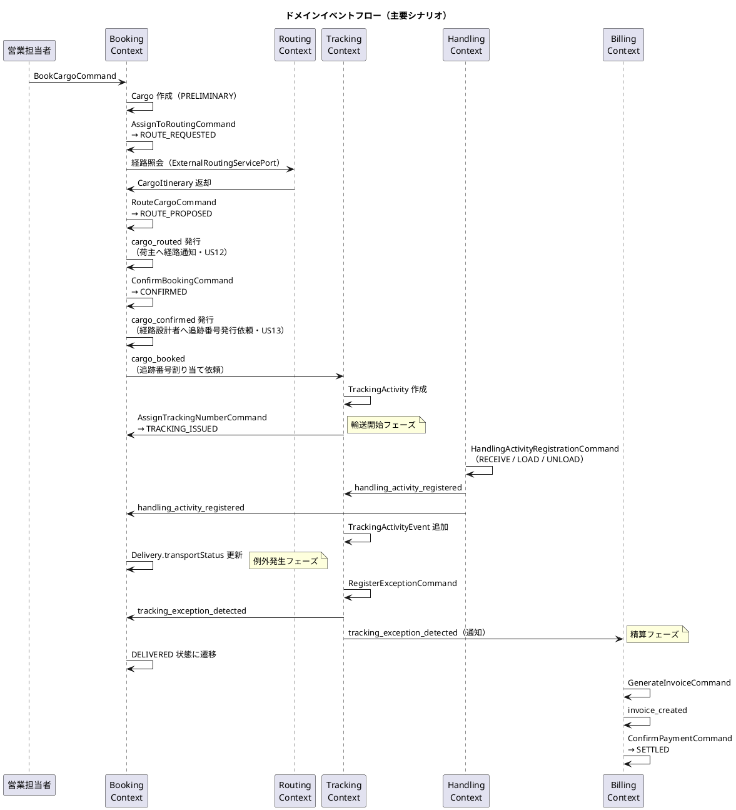

## 外部システム ACL Ports

| ポート名 | 対応外部システム | 責務 |
|---|---|---|
| ExternalRoutingServicePort | 外部経路最適化システム | 出発地・目的地・期限を渡し最適 CargoItinerary を取得 |
| CustomsClearancePort | 税関システム | 通関申告の提出・状態照会・CUSTOMS_HOLD 例外の自動通知受信 |
| PaymentGatewayPort | 決済機関 | 支払い処理の実行と支払い確認の受信 |
| PortManagementPort | 港湾管理システム | 港湾の取扱可能貨物種別（HAZARDOUS / REFRIGERATED）の照会 |
| NotificationPort | 通知システム | 荷主・荷受人へのメール / SMS 通知の送信 |

各ポートはヘキサゴナルアーキテクチャの出力ポート（Secondary Port）として定義され、インフラ層のアダプターが実装を担う。Ruby では明示的なインターフェース構文がないため、ポートはドメイン層に置いた抽象クラス（`NotImplementedError` を送出するメソッド定義）で契約を表現し、アダプター側で継承・実装する。テストではポート契約に沿ったフェイク実装を注入する。これにより外部システムの変更がドメインロジックに影響しない。

## 集約設計の判断

### Booking Context：Cargo 集約

Cargo を集約ルートとし、BookingId・ShipperId・RouteSpecification・CargoItinerary・Delivery を集約内に含める設計とした。

**根拠**：予約の状態遷移（BookingStatus）はこれらのオブジェクトが一体として整合性を保つ必要がある。特に CargoItinerary の Leg 連結制約（`Leg[n].unloadLocation == Leg[n+1].loadLocation`）は単一トランザクション内で検証しなければ不整合が生じる。Consignee は Cargo に対して 1 対 1 であるため、独立した集約とせず値オブジェクトとして含める。永続化はリポジトリが集約全体を単一の `ActiveRecord::Base.transaction` 内で保存することで整合性を保証する。

### Routing Context：Voyage 集約

Voyage を集約ルートとし、Schedule（CarrierMovement のリスト）を内包する設計とした。

**根拠**：Schedule と CarrierMovement は Voyage の文脈でのみ意味を持つ。Schedule の時系列整合性（CarrierMovement の順序・連続性）は Voyage 単位で保証する必要があるため、単一集約に含める。

### Tracking Context：TrackingActivity 集約

TrackingActivity を集約ルートとし、TrackingActivityEvent と TrackingExceptionEvent を集約内エンティティとして管理する設計とした。

**根拠**：追跡状態（TrackingStatus）は時系列の全イベントと例外状態を総合的に判定するため、単一集約としてまとめる必要がある。例外解決時に「例外発生前の状態に復帰」するロジックは集約内の一貫したトランザクションで実行される。

### Handling Context：HandlingActivity 集約 + Read Model 分離

HandlingActivity を集約ルートとし、CustomsDeclaration を集約内エンティティとした。荷役履歴は Read Model（HandlingActivityHistory）として集約と切り離す設計とした。

**根拠**：個々の荷役作業は独立した記録単位であり、互いに強い整合性制約を持たない。一方、通関申告（CustomsDeclaration）と荷役作業は「CLEARED にならないと CLAIM 不可」という不変条件があるため、同一集約に含める。クエリ専用の履歴参照は Read Model として分離することで、コマンド側（集約）の複雑性を低減する。Rails では Read Model を Active Record スコープベースのクエリオブジェクトとして実装し、リポジトリを介さず直接参照してよい（CQRS の Query 側の例外規定）。

### Billing Context：Invoice 集約

Invoice を集約ルートとし、DiscountPolicy はドメインサービスではなく値オブジェクトとして Invoice に委譲する設計とした。

**根拠**：請求書 1 件の整合性（基本料金・割引率・最終金額の一貫性）は Invoice 集約内で保証される。DiscountPolicy の割引率計算ロジックは Invoice の `apply_discount` 内で完結するため、外部ドメインサービスとして切り出す必要はない。支払い状態（PaymentStatus）の遷移も Invoice 集約が責任を持つ。

### Estimation Context：Estimate 集約

Estimate を集約ルートとし、RouteCandidate（ルート候補）のリストを集約内に保持する設計とした。

**根拠**：見積とルート候補は 1 対多の関係にあり、ルート候補は見積の文脈でのみ意味を持つ。`replace_candidates` でルート候補の一括入替を行うため、トランザクション整合性の観点から単一集約に含める。RouteCandidate は Ruby の `Data.define` で実装し、不変性を保証する。現在のルート候補生成はスタブ実装（重量ベースの固定コスト計算）であり、将来の外部ルーティングサービス連携時にアダプターを差し替える設計とした。
