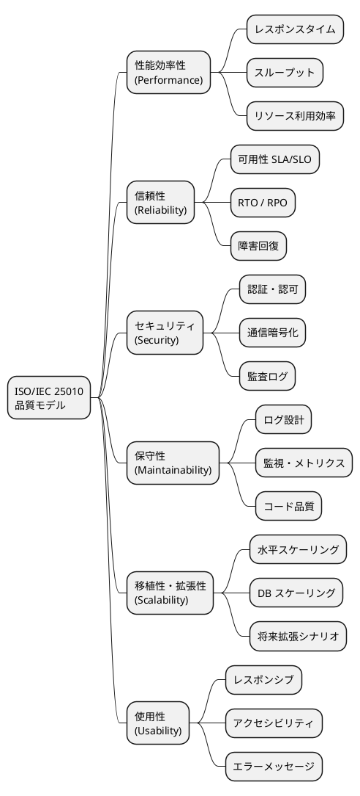

# 非機能要件定義 - 国際貨物輸送管理システム

## 1. 概要

### 1.1 目的と対象範囲

本ドキュメントは、国際貨物輸送管理システムの非機能要件を ISO/IEC 25010 品質モデルに基づいて定義します。機能要件（何ができるか）に対し、非機能要件は「システムがどう振る舞うべきか」を規定するものであり、性能・可用性・セキュリティ・保守性・拡張性のすべての要件を測定可能な数値で表現します。

**対象範囲**:

- 国際貨物輸送の予約から配送完了・精算までを一元管理する Web アプリケーション
- バックエンド: Ruby on Rails 8 / Ruby 3.4（DDD + レイヤードアーキテクチャ + CQRS 風の読み書き分離）
- フロントエンド: Rails SSR（ERB）+ Hotwire（Turbo / Stimulus、30 秒ポーリング）
- インフラ: AWS ECS Fargate + RDS PostgreSQL 16（Multi-AZ）+ ALB
- 外部システム連携 5 件（外部経路システム、税関システム、決済機関、港湾管理システム、通知システム）

**主要アクター**: 荷主（顧客）、荷受人、営業担当者、経路設計者、追跡管理者、荷役作業員、経理担当者（計 7 名）

### 1.2 ISO/IEC 25010 品質モデルとの対応

本ドキュメントは ISO/IEC 25010 が定める 8 品質特性のうち、システムの運用に直結する 6 特性を対象とします。



---

## 2. 性能要件（Performance）

### 2.1 レスポンスタイム目標

業務シナリオに基づき、画面・操作別のレスポンスタイム目標を定義します。計測は ALB アクセスログおよび CloudWatch メトリクスを基準とします。

| 操作 | p50 | p95 | p99 | 備考 |
|---|---|---|---|---|
| 貨物一覧ページ読み込み | 200ms | 500ms | 1,000ms | - |
| 貨物詳細ページ読み込み | 150ms | 300ms | 800ms | - |
| 追跡番号検索（公開 API） | 100ms | 200ms | 500ms | 認証不要 |
| 最適ルート検索（外部 API 呼び出し含む） | 2,000ms | 5,000ms | 10,000ms | 外部依存あり |
| 荷役作業登録 | 200ms | 500ms | 1,000ms | コマンド処理 |
| 請求書生成 | 500ms | 1,500ms | 3,000ms | 非同期処理候補（Solid Queue） |
| Turbo 部分更新（追跡ステータス） | 100ms | 200ms | 500ms | 30 秒ポーリング |

> **計測方法**: 本番相当の負荷試験環境にて JMeter または k6 で計測します。外部 API 呼び出しを含む操作はスタブを用いた内部計測と外部込みの E2E 計測を両方実施します。

**Rails アプリケーション側の性能対策**:

- YJIT を有効化（`RUBY_YJIT_ENABLE=1`）し、リクエスト処理のスループットを向上させます
- jemalloc をコンテナイメージに組み込み（`LD_PRELOAD`）、メモリ断片化を抑制します
- N+1 クエリは `includes` / `preload` による事前ロードと `strict_loading` による検知で防止し、開発環境では Bullet gem で自動検出します
- 貨物一覧・追跡照会などの読み取り系は Rails.cache（Solid Cache）による低レベルキャッシュとフラグメントキャッシュを併用します（TTL: 追跡ステータス 30 秒、マスターデータ 10 分）

### 2.2 スループット目標

| 区分 | 同時接続ユーザー数 | RPS（Requests Per Second） | 想定シナリオ |
|---|---|---|---|
| 平常時 | 50 | 50 | 通常業務 |
| ピーク時 | 200 | 200 | 繁忙期・月末精算 |
| 追跡 API（公開） | - | 1,000 | 荷受人の大量アクセス |

- ピーク時は平常時の 4 倍を想定し、ECS Auto Scaling が自動対応できること
- 追跡 API は内部ユーザーと荷受人（外部公開）が分離されるため、個別にレートリミットを設定します（荷受人: 100 RPS/IP、Rack::Attack で実装）

**Puma ワーカー / スレッド設定**:

```ruby
# config/puma.rb
workers ENV.fetch("WEB_CONCURRENCY", 2)        # 1 vCPU あたり 2 ワーカー
threads_count = ENV.fetch("RAILS_MAX_THREADS", 5)
threads threads_count, threads_count            # ワーカーあたり 5 スレッド
preload_app!                                    # Copy-on-Write によるメモリ効率化
```

- タスクあたりの同時処理能力: 2 ワーカー × 5 スレッド = 10 リクエスト
- ピーク時のタスク数 10 で計 100 同時リクエストを処理し、キューイングを含め 200 RPS に対応します

### 2.3 データ量・ストレージ見積もり

**前提**:

- 年間新規予約件数: 10,000 件
- 追跡イベント: 予約 1 件あたり平均 20 件 → 年間 200,000 件
- 保持期間: 5 年（法令要件に基づく）

**テーブル別データ量見積もり（5 年累計）**:

| テーブル | 想定行数（5 年） | 1 行あたりサイズ | 概算合計 |
|---|---|---|---|
| cargoes（予約） | 50,000 件 | 2 KB | 100 MB |
| tracking_events（追跡イベント） | 1,000,000 件 | 512 B | 512 MB |
| route_candidates（経路候補） | 150,000 件 | 1 KB | 150 MB |
| invoices（請求書） | 50,000 件 | 4 KB | 200 MB |
| audit_logs（監査ログ） | 5,000,000 件 | 256 B | 1.28 GB |
| **合計（インデックス込み）** | - | - | **≈ 5 GB** |

> RDS db.t3.medium（汎用 SSD 100 GB）で 5 年間は十分に対応可能です。ストレージの 70% 超過時にアラートを設定します。

### 2.4 性能劣化基準（SLO 違反時の対応）

| 違反レベル | 条件 | 対応アクション |
|---|---|---|
| **Warning** | p95 がしきい値の 150% を超過（例: 貨物一覧 750ms） | CloudWatch アラート発報 → Slack #ops 通知 → 翌営業日中に原因調査 |
| **Critical** | p95 がしきい値の 200% を超過（例: 貨物一覧 1,000ms） | PagerDuty 呼び出し → 30 分以内に担当エンジニアが対応開始 |
| **SLO Breach** | 1 時間以内に p95 が連続して Critical 状態 | インシデント宣言 → RCA（根本原因分析）実施 → 24 時間以内に改善計画提出 |

---

## 3. 可用性要件（Availability）

### 3.1 稼働率 SLA / SLO

| レベル | 目標稼働率 | 月間許容停止時間 | 対象機能 |
|---|---|---|---|
| SLA（顧客向け） | 99.9% | 43.8 分/月 | 全機能（追跡含む） |
| SLO（内部目標） | 99.95% | 21.9 分/月 | コア機能 |
| 追跡機能（公開） | 99.99% | 4.4 分/月 | 追跡照会のみ |

> **SLA と SLO の関係**: SLO は SLA より厳しい内部目標として設定します。SLO を維持することで SLA 違反のリスクをバッファとして吸収します。追跡機能は荷受人が 24 時間アクセスするため、他機能より高い稼働率を要求します。

**稼働率の計測除外時間**:

- 定期メンテナンスウィンドウ（毎週日曜 2:00〜4:00 JST）
- 外部システム障害（税関・港湾システム等）に起因する機能制限

### 3.2 RTO / RPO

| 障害種別 | RTO（復旧時間目標） | RPO（データ復旧目標） | 対応方式 |
|---|---|---|---|
| ECS タスク障害 | 5 分以内 | 0（ステートレス） | ECS ヘルスチェック自動再起動 |
| RDS フェイルオーバー | 2 分以内 | 0（Multi-AZ 同期） | RDS Multi-AZ 自動フェイルオーバー |
| AZ 障害 | 10 分以内 | 0 | ECS 複数 AZ 配置 + ALB ヘルスチェック |
| リージョン障害 | 4 時間以内 | 1 時間以内 | RDS スナップショット + 手動リストア手順 |

### 3.3 メンテナンスウィンドウ

| 種別 | スケジュール | 事前通知 | 最大停止時間 |
|---|---|---|---|
| 定期メンテナンス | 毎週日曜 2:00〜4:00（JST） | 72 時間前にメール通知 | 2 時間 |
| 緊急セキュリティパッチ | 随時 | 可能な限り事前通知（平日は顧客通知優先） | 30 分以内 |
| RDS マイナーバージョンアップ | 定期メンテナンス枠内 | 1 週間前 | 10 分（Multi-AZ フェイルオーバー） |

### 3.4 ヘルスチェック設計

**ECS タスクレベルのヘルスチェック設定**:

```
ヘルスチェックエンドポイント: GET /up
ヘルスチェック間隔: 30 秒
タイムアウト: 5 秒
連続失敗回数（Unhealthy 判定）: 3 回
連続成功回数（Healthy 判定）: 2 回
```

**フェイルオーバー動作**:

1. ECS ヘルスチェック失敗（3 回連続）→ タスクを Unhealthy に変更
2. ALB がタスクをターゲットグループから除外（新規リクエストのルーティング停止）
3. ECS が新しいタスクを別の AZ で起動
4. 新タスクのヘルスチェック成功後、ALB に再登録
5. 旧タスクを停止（既存接続のドレイン: 30 秒）

**Rails ヘルスチェック構成**:

Rails 標準の `Rails::HealthController`（`/up`）をベースとし、DB 接続を含む詳細チェックはカスタムエンドポイントで提供します。

```ruby
# config/routes.rb
get "up" => "rails/health#show", as: :rails_health_check

# app/controllers/health_controller.rb（詳細チェック）
class HealthController < ActionController::API
  def show
    ActiveRecord::Base.connection.execute("SELECT 1")  # RDS 接続確認
    render json: { status: "ok" }
  rescue StandardError
    render json: { status: "unavailable" }, status: :service_unavailable
  end
end
```

---

## 4. セキュリティ要件（Security）

### 4.1 認証・認可

**認証方式**: Rails 8 標準の認証ジェネレーター（`rails generate authentication`）によるフォームベース認証（セッション管理 + `has_secure_password`）。認可は Pundit のポリシークラスで実装します。

**RBAC ロール定義**:

| ロール | 説明 | 主要画面 |
|---|---|---|
| admin | システム管理者 | 全画面 |
| sales | 営業担当者 | 予約・荷主管理・見積 |
| router | 経路設計者 | 経路割り当て・航路管理 |
| handler | 荷役作業員 | 荷役登録のみ |
| tracker | 追跡管理者 | 追跡管理・例外処理 |
| billing | 経理担当者 | 請求書管理 |
| shipper | 荷主（将来） | 自社予約・追跡（Phase 2） |

- Pundit の各ポリシー（`CargoPolicy`、`InvoicePolicy` 等）でロール別のアクセス制御を定義し、`ApplicationController` の `after_action :verify_authorized` で認可漏れを検知します

**パスワードポリシー**:

- ハッシュアルゴリズム: bcrypt（コスト係数 12、`has_secure_password` + `BCrypt::Engine.cost = 12`）
- 最低文字数: 8 文字以上
- 文字種要件: 大文字・小文字・数字・記号をそれぞれ 1 文字以上含む（カスタムバリデーションで実装）
- パスワード有効期限: 90 日（期限切れ時はログイン後に強制変更）
- 過去 5 世代のパスワード再利用禁止
- ログイン失敗 5 回でアカウントロック（30 分自動解除または管理者解除）

**セッション管理**:

- セッションタイムアウト: ロール別に設定（最終アクセスから）
  - `handler`（荷役作業員）: **2 時間**（港湾・倉庫現場での連続作業・バーコードスキャン業務を考慮）
  - その他全ロール: **30 分**
- CSRF 保護: Rails 標準の `protect_from_forgery`（フォーム送信・Turbo リクエスト両対応、`csrf-token` メタタグ経由）
- セッション固定攻撃対策: 認証成功後に `reset_session` でセッション ID を再生成
- 同一ユーザーの同時セッション数: 1（セッションレコードを DB 管理し、後続ログインが既存セッションを無効化）
- セッションクッキー: `secure`・`httponly`・`SameSite=Lax` を設定

**Turbo / Hotwire 認証**:

- セッション切れ時: HTTP 401 を返却し、Stimulus コントローラーがエラーダイアログを表示
- リダイレクトではなくインラインエラーメッセージとして通知（入力データの消失を防止）

### 4.2 通信セキュリティ

| 対象 | 方式 | 設定内容 |
|---|---|---|
| ブラウザ〜ALB | HTTPS 強制 | TLS 1.2 以上、HTTP → HTTPS 301 リダイレクト |
| ALB〜ECS | HTTP（VPC 内部） | セキュリティグループで ALB からのみ許可 |
| ECS〜RDS | 暗号化接続 | SSL/TLS（RDS sslmode=require） |
| ECS〜外部 API | HTTPS 強制 | TLS 1.2 以上、証明書検証有効 |

**HTTP セキュリティヘッダー**:

Rails は `X-Content-Type-Options` 等のデフォルトヘッダーを自動付与します。加えて `config.force_ssl = true`（HSTS 有効化）と Content Security Policy DSL で以下を保証します。

```
Strict-Transport-Security: max-age=31536000; includeSubDomains
X-Content-Type-Options: nosniff
X-Frame-Options: DENY
X-XSS-Protection: 1; mode=block
Content-Security-Policy: default-src 'self'; script-src 'self' 'nonce-{random}'
```

```ruby
# config/initializers/content_security_policy.rb
Rails.application.configure do
  config.content_security_policy do |policy|
    policy.default_src :self
    policy.script_src  :self
  end
  config.content_security_policy_nonce_generator = ->(_) { SecureRandom.base64(16) }
end
```

**外部 API 接続タイムアウト設定**:

| 設定項目 | 値 | 備考 |
|---|---|---|
| 接続タイムアウト | 3 秒 | DNS 解決 + TCP 接続（Faraday `open_timeout`） |
| 読み取りタイムアウト | 10 秒 | レスポンスボディ受信（Faraday `timeout`） |
| 最大リトライ回数 | 3 回 | Exponential Backoff（初回 1 秒、倍増、faraday-retry） |
| サーキットブレーカー閾値 | 5 回連続失敗 | 60 秒間オープン状態を維持（circuitbox gem） |

### 4.3 データ保護

| 対象データ | 保護方式 | 管理 |
|---|---|---|
| DB 接続情報（URL、ユーザー、パスワード） | AWS Secrets Manager | アプリケーション起動時に動的取得（Rails credentials は開発用途に限定） |
| RDS 保存データ | AES-256（AWS KMS 管理キー） | RDS 暗号化有効 |
| S3 バックアップ | AES-256（SSE-S3） | バケットポリシーで暗号化必須 |
| 個人情報（荷主メール・電話） | Active Record Encryption（検討中） | Phase 2 で対応（`encrypts :email, deterministic: true`） |
| AWS アクセスキー | ECS Task Role（IAM） | 静的なアクセスキーは使用しない |

### 4.4 監査ログ

| ログ種別 | 記録内容 | 保持期間 |
|---|---|---|
| 認証ログ | ログイン成功/失敗・IP アドレス・ユーザーエージェント | 1 年 |
| 業務操作ログ | 予約作成/変更、荷役登録、請求書発行・変更 | 5 年 |
| 管理操作ログ | ユーザー管理、権限変更、システム設定変更 | 5 年 |
| エラーログ | アプリケーションエラー・スタックトレース | 90 日 |

**監査ログの実装方針**:

- `ActiveSupport::Notifications` とコントローラーの `around_action` によりコマンド系操作の入力を自動記録します
- ログには `user_id`・`request_id`・`timestamp`・`operation`・`entity_id`・`before`・`after` を含めます
- 監査ログは書き込み専用（UPDATE/DELETE 禁止）とし、CloudWatch Logs で改ざん検知を行います

### 4.5 脆弱性対策

**OWASP Top 10 対応**:

| 脅威 | 対応方針 |
|---|---|
| A01: 認証の不備 | Rails 標準認証・bcrypt・アカウントロック・Pundit による認可徹底 |
| A02: 暗号化の失敗 | TLS 強制・KMS 暗号化・Secrets Manager |
| A03: インジェクション | Active Record（プレースホルダー）使用・Strong Parameters・Active Model バリデーション |
| A04: 安全でない設計 | セキュリティレビューをリリース前チェックリストに含める |
| A05: セキュリティ設定ミス | Rails デフォルト保護設定（CSRF・エスケープ・セキュアヘッダー）を有効化 |
| A06: 脆弱なコンポーネント | GitHub Dependabot + bundler-audit による自動脆弱性スキャン |
| A07: 認証・セッション管理の不備 | `reset_session`・CSRF 保護・タイムアウト設定 |
| A08: ソフトウェアの整合性 | CI/CD パイプラインでの署名検証・`Gemfile.lock` による依存関係ロック |
| A09: セキュリティログとモニタリングの失敗 | CloudWatch + 監査ログ・異常検知アラート |
| A10: SSRF | 外部 API URL のホワイトリスト管理・VPC エンドポイント活用 |

**定期的な脆弱性管理**:

- GitHub Dependabot: 毎週自動スキャン・PR 自動生成
- Brakeman: CI ビルドで静的セキュリティ解析（警告 0 件をマージ条件とする）
- bundler-audit: CI で毎ビルド実行 + 月次の定期レビュー・CVSS スコア 7.0 以上は即時対応

---

## 5. 保守性要件（Maintainability）

### 5.1 ログ設計

**ログレベル定義**:

| ログレベル | 出力条件 | 例 |
|---|---|---|
| ERROR | システムエラー・外部 API 接続失敗 | DB 接続不可、決済 API エラー、未捕捉例外 |
| WARN | 業務上の警告・リトライ発生 | 外部 API タイムアウト（再試行）、バリデーション警告 |
| INFO | 業務イベント・リクエスト受付 | 予約登録、追跡番号発行、ユーザーログイン |
| DEBUG | デバッグ用詳細（本番は無効） | SQL クエリ、HTTP リクエスト内容、ドメインイベント詳細 |

**ログフォーマット（lograge による JSON 構造化ログ）**:

```json
{
  "timestamp": "2025-01-15T10:30:00.123Z",
  "level": "INFO",
  "controller": "BookingsController",
  "action": "create",
  "message": "予約を登録しました",
  "request_id": "req-abc123",
  "user_id": "user-456",
  "trace_id": "trace-789",
  "booking_id": "BOOK-2025-001234",
  "duration_ms": 145
}
```

```ruby
# config/environments/production.rb
config.lograge.enabled = true
config.lograge.formatter = Lograge::Formatters::Json.new
config.lograge.custom_payload do |controller|
  {
    request_id: controller.request.request_id,
    user_id: controller.try(:current_user)&.id
  }
end
```

**ログ出力先と保持期間**:

| 用途 | 出力先 | ホット保持 | アーカイブ |
|---|---|---|---|
| アプリケーションログ | CloudWatch Logs | 30 日 | S3（5 年） |
| アクセスログ | ALB → CloudWatch Logs | 30 日 | S3（1 年） |
| 監査ログ | CloudWatch Logs（専用ロググループ） | 1 年 | S3（5 年） |
| RDS スロークエリログ | CloudWatch Logs | 14 日 | - |

**コンテキスト情報の自動付与**:

- `request_id`: Rails の `ActionDispatch::RequestId` ミドルウェアが自動生成（`config.log_tags` で付与）
- `user_id`: `CurrentAttributes`（`Current.user`）でリクエストスコープに保持し lograge の custom_payload で出力
- `trace_id`: AWS X-Ray トレース ID（後続の分散トレーシング対応）

### 5.2 監視・メトリクス

**CloudWatch メトリクスとアラート閾値**:

| メトリクス | 警告閾値 | 緊急閾値 | 通知先 |
|---|---|---|---|
| ECS CPU 使用率 | 70% | 90% | Slack #ops |
| ECS メモリ使用率 | 75% | 90% | Slack #ops |
| RDS CPU 使用率 | 60% | 80% | Slack #ops |
| ALB 5xx エラー率 | 1% | 5% | Slack #ops + PagerDuty |
| ALB レスポンスタイム p95 | 1,000ms | 3,000ms | Slack #ops |
| RDS 接続数 | max の 80% | max の 95% | Slack #ops |
| RDS 空きストレージ | 30% | 15% | Slack #ops |
| ECS タスク起動失敗 | 1 回 | 3 回連続 | Slack #ops + PagerDuty |

**カスタムメトリクス（CloudWatch EMF）**:

- 予約登録件数（業務 KPI）
- 追跡番号検索件数（API 使用量）
- 外部 API 呼び出しレイテンシ（連携先別）
- Turbo ポーリングリクエスト数（負荷監視）
- Puma のビジースレッド数・バックログ（キュー詰まりの早期検知）

### 5.3 コード品質目標

| 指標 | 目標値 | 計測ツール |
|---|---|---|
| テストカバレッジ（ドメイン層） | 85% 以上 | SimpleCov |
| テストカバレッジ（アプリケーション層） | 80% 以上 | SimpleCov |
| SonarQube Reliability | A（バグゼロ） | SonarQube |
| SonarQube Security | A（脆弱性ゼロ） | SonarQube |
| コード重複率 | 3% 以下 | SonarQube |
| 技術的負債比率 | 5% 以下 | SonarQube |
| RuboCop 違反数 | 0 件 | RuboCop（rubocop-rails / rubocop-rspec） |
| Brakeman 警告数 | 0 件 | Brakeman |

**CI 統合**:

- Pull Request 時に SimpleCov カバレッジレポートをコメントで自動投稿
- SonarQube Quality Gate 失敗時はマージをブロック
- RuboCop + Brakeman + bundler-audit の違反はビルドエラーとして扱う

---

## 6. 拡張性要件（Scalability）

### 6.1 水平スケーリング

**ECS Fargate Auto Scaling 設定**:

| パラメーター | 値 | 備考 |
|---|---|---|
| 最小タスク数 | 2 | Multi-AZ 配置（各 AZ に 1 タスク） |
| 最大タスク数 | 10 | コスト上限を考慮した値 |
| スケールアウトトリガー | CPU 70% または メモリ 75% | ターゲット追跡スケーリング |
| スケールアウト速度 | 60 秒で追加インスタンス起動 | 新タスクのウォームアップを含む |
| スケールイン冷却期間 | 300 秒 | 急激なスケールイン防止 |

**タスクリソース設定**:

| 環境 | CPU | メモリ | 備考 |
|---|---|---|---|
| 本番（通常） | 1 vCPU | 2 GB | 2 タスク × 2 AZ、Puma 2 ワーカー × 5 スレッド |
| 本番（ピーク） | 2 vCPU | 4 GB | Auto Scaling 後の最大値、Puma 4 ワーカー |
| ステージング | 0.5 vCPU | 1 GB | コスト最適化 |

- Rails アプリはセッションを DB / クッキーで管理するステートレス構成とし、タスク増減に影響されないこと
- jemalloc + `preload_app!` によりワーカー増加時のメモリ増分を抑制します

### 6.2 DB スケーリング

**接続プール設定（Active Record コネクションプール）**:

```yaml
# config/database.yml
production:
  adapter: postgresql
  pool: <%= ENV.fetch("RAILS_MAX_THREADS", 5) * 2 + 2 %>  # スレッド数 + Solid Queue 分 = 12
  checkout_timeout: 3        # 接続タイムアウト（秒）
  idle_timeout: 600          # アイドル接続の解放時間（10 分）
  reaping_frequency: 60      # 死んだ接続の回収間隔（秒）
```

**RDS 接続数上限**:

| 設定 | 値 | 備考 |
|---|---|---|
| `max_connections`（RDS） | 200 | db.t3.medium のデフォルト |
| 最大同時接続数（計算） | タスク数(10) × ワーカー(2) × プール(12) ≈ 240 | ピーク時に上限超過の可能性あり |
| Read Replica 追加基準 | 追跡 API の読み取り RPS が 500 を超過 | クエリ側をレプリカに分離 |

> **注意**: ピーク時は RDS 接続数上限を超過する可能性があるため、プールサイズの調整に加え、必要に応じて RDS Proxy を導入し接続プーリングを委譲します。

**Read Replica の活用方針**:

- Rails の複数データベース機能（`connects_to database: { writing: :primary, reading: :replica }`）でクエリ側（追跡照会・貨物一覧・レポート）を Read Replica に向け、プライマリへの読み取り負荷を軽減します
- 追跡 API（1,000 RPS）が成長した場合は Read Replica を 2 本に増やします

### 6.3 将来の拡張シナリオ

| シナリオ | 想定時期 | 対応方針 |
|---|---|---|
| 荷主セルフサービスポータル（Phase 2） | 1 年後 | shipper ロール追加、omniauth による OAuth2 / OIDC 対応 |
| 多言語対応（日本語・英語・中国語） | 2 年後 | Rails I18n（`config/locales/*.yml`）、URL パスにロケール追加（`/en/`, `/zh/`） |
| マイクロサービス分割 | 3 年後 | ドメイン境界（モジュール / packwerk パッケージ）を REST/gRPC API 境界に昇格、サービス間認証に JWT 追加 |
| イベントソーシング移行（Billing） | 2 年後 | Outbox パターンを先行実装 → Amazon SQS/EventBridge 経由で Kafka への移行を段階的に実施 |
| 荷受人向けモバイルアプリ | 2 年後 | 追跡 API を REST API として公開済みのため、フロントエンドのみ追加 |

---

## 7. ユーザビリティ要件（Usability）

### 7.1 レスポンシブ対応

- Bootstrap 5 を使用したレスポンシブレイアウト
- 荷役作業員のスマートフォン利用を考慮した最小画面幅: 375px（iPhone SE 相当）
- タッチ操作対応: タップターゲットは最小 44px × 44px（WCAG 2.1 推奨）
- 貨物一覧・荷役登録画面はモバイルファーストで設計

### 7.2 アクセシビリティ

- WCAG 2.1 AA 準拠を目標とします
- 色コントラスト比: テキストと背景の比率は 4.5:1 以上（通常テキスト）、3:1 以上（大きなテキスト）
- キーボード操作: すべての機能はキーボードのみで操作可能
- スクリーンリーダー対応: セマンティック HTML + ARIA ランドマーク
- フォームバリデーション: エラーメッセージは `aria-describedby` で入力フィールドに関連付け

### 7.3 エラーメッセージ設計

- **原則**: ユーザーが次のアクションを理解できる具体的なメッセージを表示します
- **禁止表現**: 「エラーが発生しました」「システムエラー」等の技術的な表現のみの表示
- **推奨形式**: 「〇〇が正しくありません。△△を確認して再度入力してください。」

### 7.4 ローディング・フィードバック

- Turbo リクエスト中: `turbo-submits-with` および `aria-busy` 属性を利用したローディングインジケーター表示（スピナーまたはプログレスバー）
- 30 秒ポーリング（追跡ステータス更新）: 更新時に差分がある場合のみ視覚的フィードバック（フェードイン）
- 長時間処理（請求書生成等）: プログレスバーまたは「処理中...（通常 1〜3 秒）」のメッセージを表示

### 7.5 セッションタイムアウト警告

- セッション残り **5 分**で画面上部にバナー通知（入力データ消失防止）
- 通知テキスト: 「セッションが 5 分後に切れます。作業を保存するか、[セッションを延長] をクリックしてください。」
- セッション延長ボタン: クリックで `/keep-alive` エンドポイントを呼び出しタイムアウトをリセット
- タイムアウト後: 入力中フォームの値を `sessionStorage` に一時保存し、再ログイン後に復元（Phase 2）
- `handler`（荷役作業員）のタイムアウト（2 時間）でも同様に残り 5 分でバナー通知を行います

---

## 8. 法令・コンプライアンス要件

| 要件 | 根拠 | 対応内容 |
|---|---|---|
| 個人情報保護 | 個人情報保護法 | 荷主・荷受人の個人情報取得時に利用目的を明示し同意取得、収集は業務遂行に必要な最小限に限定 |
| 消費税表示 | 消費税法 | 請求書に税率（10%）・税額を明示、軽減税率対象品目は区分を記載 |
| 商業帳票保存 | 電子帳簿保存法 | 請求書・精算記録を電子的に 7 年間保存（改ざん防止のため監査ログで変更履歴を記録） |
| 国際輸送規制 | SOLAS 条約 | 危険物申告（HAZARDOUS）の内容・重量・荷主情報を適切に記録・保持 |
| 輸出入規制 | 外為法・関税法 | 税関申告情報（品目コード・原産地・価格）を記録し、税関システムへの連携履歴を保持 |
| データ越境移転 | GDPR（荷主が EU 居住者の場合） | EU 居住者の個人データ取り扱いに関するプライバシーポリシーを整備（Phase 2） |

---

## 付録: 非機能要件確認チェックリスト

リリース前に以下をすべて確認します。

**性能**:

- [ ] 負荷試験を実施し、全操作の p95 が目標値以内であることを確認
- [ ] 追跡 API が 1,000 RPS 相当の負荷に耐えられることを確認
- [ ] Puma のワーカー / スレッド設定と DB 接続プール設定が本番環境に適用されていることを確認
- [ ] YJIT・jemalloc が本番コンテナで有効であることを確認
- [ ] Bullet / strict_loading により N+1 クエリが検出されないことを確認

**可用性**:

- [ ] ECS ヘルスチェック（`/up`）が正しく設定されていることを確認
- [ ] RDS Multi-AZ フェイルオーバーを実際にテストし、RTO 2 分以内を確認
- [ ] メンテナンス通知の送信フローが確立されていることを確認

**セキュリティ**:

- [ ] HTTPS 強制が ALB および `config.force_ssl` で設定されていることを確認
- [ ] すべての HTTP セキュリティヘッダー（HSTS・CSP 等）が設定されていることを確認
- [ ] AWS Secrets Manager 経由での DB 接続が機能していることを確認
- [ ] CSRF 保護が有効であることを確認（フォームおよび Turbo リクエスト）
- [ ] Pundit の `verify_authorized` が全コントローラーで機能していることを確認
- [ ] Brakeman・bundler-audit の警告が 0 件であることを確認
- [ ] OWASP Top 10 対応のレビューが完了していることを確認

**保守性**:

- [ ] lograge による JSON 構造化ログが CloudWatch Logs に出力されていることを確認
- [ ] CloudWatch アラートが適切に通知されることを確認（テスト通知）
- [ ] SonarQube Quality Gate がパスしていることを確認
- [ ] SimpleCov のテストカバレッジが目標値を達成していることを確認

**拡張性**:

- [ ] ECS Auto Scaling のトリガーが設定されていることを確認
- [ ] Active Record 接続プール設定が本番環境に適用されていることを確認
