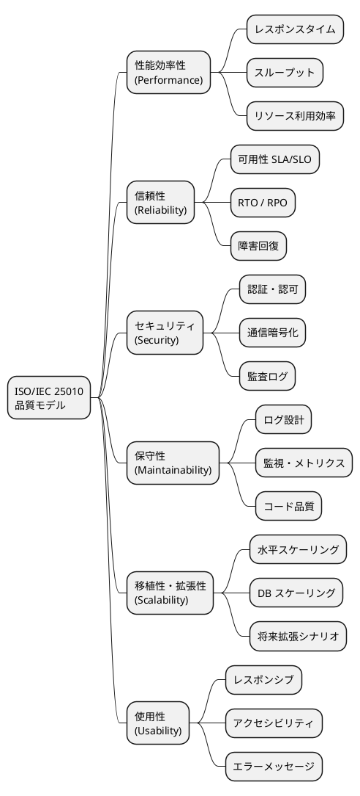

# 非機能要件定義 - 国際貨物輸送管理システム

## 1. 概要

### 1.1 目的と対象範囲

本ドキュメントは、国際貨物輸送管理システムの非機能要件を ISO/IEC 25010 品質モデルに基づいて定義する。機能要件（何ができるか）に対し、非機能要件は「システムがどう振る舞うべきか」を規定するものであり、性能・可用性・セキュリティ・保守性・拡張性のすべての要件を測定可能な数値で表現する。

**対象範囲**:

- 国際貨物輸送の予約から配送完了・精算までを一元管理する Web アプリケーション
- バックエンド: Spring Boot 4.0 / Java 25（DDD + ヘキサゴナル + CQRS）
- フロントエンド: Thymeleaf SSR + htmx（30 秒ポーリング）
- インフラ: AWS ECS Fargate + RDS PostgreSQL 16（Multi-AZ）+ ALB
- 外部システムとの HTTP 連携は行わない（経路算出・通関・決済・港湾・通知はいずれも内部シミュレーション。ADR-006）

**主要アクター**: 荷主（顧客）、荷受人、営業担当者、経路設計者、追跡管理者、荷役作業員、経理担当者（計 7 名）

### 1.2 ISO/IEC 25010 品質モデルとの対応

本ドキュメントは ISO/IEC 25010 が定める 8 品質特性のうち、システムの運用に直結する 6 特性を対象とする。



---

## 2. 性能要件（Performance）

### 2.1 レスポンスタイム目標

業務シナリオに基づき、画面・操作別のレスポンスタイム目標を定義する。計測は ALB アクセスログおよび CloudWatch メトリクスを基準とする。

| 操作 | p50 | p95 | p99 | 備考 |
|---|---|---|---|---|
| 貨物一覧ページ読み込み | 200ms | 500ms | 1,000ms | - |
| 貨物詳細ページ読み込み | 150ms | 300ms | 800ms | - |
| 追跡番号検索（公開 API） | 100ms | 200ms | 500ms | 認証不要 |
| 最適ルート検索（内部シミュレーション） | 2,000ms | 5,000ms | 10,000ms | 経路探索の計算量に依存 |
| 荷役作業登録 | 200ms | 500ms | 1,000ms | コマンド処理 |
| 請求書生成 | 500ms | 1,500ms | 3,000ms | 非同期処理候補 |
| htmx 部分更新（追跡ステータス） | 100ms | 200ms | 500ms | 30 秒ポーリング |

> **計測方法**: 本番相当の負荷試験環境にて k6 で計測する（ツールは `test_strategy.md` と一致させること）。

### 2.2 スループット目標

| 区分 | 同時接続ユーザー数 | RPS（Requests Per Second） | 想定シナリオ |
|---|---|---|---|
| 平常時 | 50 | 50 | 通常業務 |
| ピーク時 | 200 | 200 | 繁忙期・月末精算 |
| 追跡 API（公開） | - | 1,000 | 荷受人の大量アクセス |

- ピーク時は平常時の 4 倍を想定し、ECS Auto Scaling が自動対応できること
- 追跡 API は内部ユーザーと荷受人（外部公開）が分離されるため、個別にレートリミットを設定する（荷受人: 100 RPS/IP）。**`/actuator/health` は対象外**（§3.4 を参照）

> **実装状況（IT8 時点）**: `/public/**` に対して `PublicRateLimitFilter` が送信元ごとに数える（ADR-011）。
>
> - **実クライアントの判定**: `cargotracker.public-rate-limit.trusted-proxy-count` に信頼できるプロキシの段数を設定すると、その段数だけ `X-Forwarded-For` を**右から遡った値**で数える（IT8 で対応）。**既定は 0 = ヘッダを信用しない。** 段数は環境の事実であり、ALB / CloudFront を置く環境で上書きする
> - **残る限界**: 数えるのは **1 プロセスの中だけ**であり、N 台構成では実効上限が N 倍になる（ADR-011 の課題 1）
>
> **「レートリミットがある」ことと「上限が守られている」ことは別である。**

### 2.3 データ量・ストレージ見積もり

**前提**:

- 年間新規予約件数: 10,000 件
- 追跡イベント: 予約 1 件あたり平均 20 件 → 年間 200,000 件
- 保持期間: 7 年（電子帳簿保存法。§4.4 監査ログの保持期間と一致させること）

**テーブル別データ量見積もり（5 年累計）**:

| テーブル | 想定行数（5 年） | 1 行あたりサイズ | 概算合計 |
|---|---|---|---|
| cargoes（予約） | 50,000 件 | 2 KB | 100 MB |
| tracking_events（追跡イベント） | 1,000,000 件 | 512 B | 512 MB |
| route_candidates（経路候補） | 150,000 件 | 1 KB | 150 MB |
| invoices（請求書） | 50,000 件 | 4 KB | 200 MB |
| audit_logs（監査ログ） | 5,000,000 件 | 256 B | 1.28 GB |
| **合計（インデックス込み）** | - | - | **≈ 5 GB** |

> RDS db.t3.medium（汎用 SSD 100 GB）で 5 年間は十分に対応可能。ストレージの 70% 超過時にアラートを設定する。

### 2.4 性能劣化基準（SLO 違反時の対応）

| 違反レベル | 条件 | 対応アクション |
|---|---|---|
| **Warning** | p95 がしきい値の 150% を超過（例: 貨物一覧 750ms） | CloudWatch アラート発報 → Slack #cargo-ops 通知 → 翌営業日中に原因調査 |
| **Critical** | p95 がしきい値の 200% を超過（例: 貨物一覧 1,000ms） | PagerDuty 呼び出し → 30 分以内に担当エンジニアが対応開始 |
| **SLO Breach** | 1 時間以内に p95 が連続して Critical 状態 | インシデント宣言 → RCA（根本原因分析）実施 → 24 時間以内に改善計画提出 |

---

## 3. 可用性要件（Availability）

### 3.1 稼働率 SLA / SLO

| レベル | 目標稼働率 | 月間許容停止時間 | 対象機能 |
|---|---|---|---|
| SLA（顧客向け） | 99.9% | 43.8 分/月 | 全機能（追跡含む） |
| SLO（内部目標） | 99.95% | 21.9 分/月 | コア機能 |
| 追跡機能（公開） | 99.99% | 4.4 分/月 | 追跡照会のみ |

> **SLA と SLO の関係**: SLO は SLA より厳しい内部目標として設定する。SLO を維持することで SLA 違反のリスクをバッファとして吸収する。追跡機能は荷受人が 24 時間アクセスするため、他機能より高い稼働率を要求する。

**稼働率の計測除外時間**:

- 定期メンテナンスウィンドウ（毎週日曜 2:00〜4:00 JST）

### 3.2 RTO / RPO

> **本表が RTO / RPO の正典である。** `operation.md` は本表を参照し、独自の値を持たない。

| 障害種別 | RTO（復旧時間目標） | RPO（データ復旧目標） | 対応方式 |
|---|---|---|---|
| ECS タスク障害 | 5 分以内 | 0（ステートレス） | ECS ヘルスチェック自動再起動 |
| RDS フェイルオーバー | 2 分以内 | 0（Multi-AZ 同期レプリケーション） | RDS Multi-AZ 自動フェイルオーバー |
| AZ 障害 | 30 分以内 | 0（Multi-AZ 同期レプリケーション） | ECS 複数 AZ 配置 + ALB ヘルスチェック |
| リージョン障害 | 4 時間以内 | **24 時間以内** | RDS 日次スナップショット + 手動リストア手順 |

> **リージョン障害の RPO を 24 時間としている根拠**: 現行のインフラ構成にクロスリージョンレプリケーションは含まれておらず、復旧の起点は日次スナップショットである。旧版は RPO 1 時間としていたが、それを達成する手段が設計されていなかった。**達成手段のない目標値は目標ではない**ため、実際の復旧機構に合わせて是正した。1 時間を要件とする場合は、クロスリージョンリードレプリカまたは継続的バックアップの導入を先に決める必要がある。

### 3.3 メンテナンスウィンドウ

| 種別 | スケジュール | 事前通知 | 最大停止時間 |
|---|---|---|---|
| 定期メンテナンス | 毎週日曜 2:00〜4:00（JST） | 72 時間前にメール通知 | 2 時間 |
| 緊急セキュリティパッチ | 随時 | 可能な限り事前通知（平日は顧客通知優先） | 30 分以内 |
| RDS マイナーバージョンアップ | 定期メンテナンス枠内 | 1 週間前 | 10 分（Multi-AZ フェイルオーバー） |

### 3.4 ヘルスチェック設計

**ECS タスクレベルのヘルスチェック設定**:

```
ヘルスチェックエンドポイント: GET /actuator/health
ヘルスチェック間隔: 30 秒
タイムアウト: 5 秒
連続失敗回数（Unhealthy 判定）: 3 回
連続成功回数（Healthy 判定）: 2 回
```

**ヘルスチェックは横断的な防御の対象外とする**:

`/actuator/health` は**レートリミット・同時実行数制限・認証のいずれの対象にもしない**。

過負荷時にこれらの防御がヘルスチェックにも適用されると、liveness プローブが 503 を返し、**ECS が「異常」と判断してタスクを再起動する。再起動により残ったタスクの負荷がさらに上がり、次のタスクも 503 を返す** — 負荷を減らすための防御が、負荷を増やす再起動ループを引き起こす。

- レートリミットのフィルタチェーンから `/actuator/health` を除外する
- 同時実行数を制限するセマフォ等を導入する場合も同様に除外する
- 除外が効いていることを統合テストで検証する（`test_strategy.md` §7.2）

**フェイルオーバー動作**:

1. ECS ヘルスチェック失敗（3 回連続）→ タスクを Unhealthy に変更
2. ALB がタスクをターゲットグループから除外（新規リクエストのルーティング停止）
3. ECS が新しいタスクを別の AZ で起動
4. 新タスクのヘルスチェック成功後、ALB に再登録
5. 旧タスクを停止（既存接続のドレイン: 30 秒）

**Spring Boot Actuator ヘルスチェック構成**:

```java
// application.yml
management:
  endpoint:
    health:
      show-details: when-authorized
  health:
    db:
      enabled: true      // RDS 接続確認
    diskSpace:
      enabled: true      // EFS/ローカルディスク確認
    ping:
      enabled: true      // アプリ起動確認
```

---

## 4. セキュリティ要件（Security）

### 4.1 認証・認可

**認証方式**: Spring Security フォームベース認証（セッション管理）

**RBAC ロール定義**（本表を全設計ドキュメントのロール名の正典とする）:

| ロール | 説明 | 主要画面 |
|---|---|---|
| ROLE_ADMIN | システム管理者 | アカウント管理・**エスカレーション中の例外の確認**（US20） |
| ROLE_SALES | 営業担当者 | 予約・荷主管理・見積 |
| ROLE_ROUTER | 経路設計者 | 経路割り当て・航路管理 |
| ROLE_HANDLER | 荷役作業員 | 荷役登録・**通関申告の登録と状態更新**（US29） |
| ROLE_TRACKER | 追跡管理者 | 追跡管理・例外処理（登録と解決）・**通関状態の確認と更新**（US29。引き渡しを止める仕組みであり、追跡の判断に要る） |
| ROLE_BILLING | 経理担当者 | **輸送料金の算出・料金調整の入力・料金の確定**（US21 / US22。IT13）、請求書管理。**請求書は金額であり、他ロールには開かせない** |
| ROLE_CONSIGNEE | 荷受人 | 追跡照会（限定情報の閲覧） |

> **ROLE_ADMIN は「全画面」ではない。** 旧版はそう書いていたが、実装では業務画面（予約・経路・荷役・請求）を管理者に開いていない。管理者の仕事はアカウントの復旧と、**現場の権限を超える判断**（紛失時の保険手続き・補償対応）であり、業務の操作そのものではない。
>
> 例外のエスカレーションは ADR-006 により外部へ送らないため、**管理者が気づく場所は画面だけである**。エスカレーション中の一覧（`/tracking/exceptions/escalated`）と、そこへ至るダッシュボードのカードがその受け皿である。管理者は内容を確認できるが、**対応の記録は追跡管理者の操作である**。
| ROLE_SHIPPER | 荷主 | 追跡照会（US18 / IT7）と**自社予約の照会**（US34 / IT9）。予約の登録・キャンセルはできない。**他社の予約は URL を直接指定しても開けない**（404。存在を漏らさない）。紐付けの正典は [ADR-013](../adr/013-user-shipper-link.md) |

**パスワードポリシー**:

- ハッシュアルゴリズム: BCrypt（コスト係数 12）
- 最低文字数: 8 文字以上
- 文字種要件: 大文字・小文字・数字・記号をそれぞれ 1 文字以上含む
- パスワード有効期限: 90 日（期限切れ時はログイン後に強制変更）
- 過去 5 世代のパスワード再利用禁止
- ログイン失敗 5 回でアカウントロック（30 分自動解除または管理者解除）

**セッション管理**:

- セッションタイムアウト: ロール別に設定（最終アクセスから）
  - `ROLE_HANDLER`（荷役作業員）: **2 時間**（港湾・倉庫現場での連続作業・バーコードスキャン業務を考慮）
  - その他全ロール: **30 分**
- CSRF 保護: Spring Security CSRF トークン有効（フォーム送信・htmx リクエスト両対応）
- セッション固定攻撃対策: 認証成功後にセッション ID を再生成
- 同一ユーザーの同時セッション数: 1（後続ログインが既存セッションを無効化）

**htmx 認証**:

- セッション切れ時: HTTP 401 を返却し、htmx が `hx-on:htmx:response-error` でエラーダイアログを表示
- リダイレクトではなくインラインエラーメッセージとして通知（入力データの消失を防止）

### 4.2 通信セキュリティ

| 対象 | 方式 | 設定内容 |
|---|---|---|
| ブラウザ〜ALB | HTTPS 強制 | TLS 1.2 以上、HTTP → HTTPS 301 リダイレクト |
| ALB〜ECS | HTTP（VPC 内部） | セキュリティグループで ALB からのみ許可 |
| ECS〜RDS | 暗号化接続 | SSL/TLS（RDS ssl-mode=require） |

**HTTP セキュリティヘッダー**:

```
Strict-Transport-Security: max-age=31536000; includeSubDomains
X-Content-Type-Options: nosniff
X-Frame-Options: DENY
X-XSS-Protection: 1; mode=block
Content-Security-Policy: default-src 'self'; script-src 'self' 'nonce-{random}'
```

> **外部 API 接続のタイムアウト・リトライ・サーキットブレーカーは定義しない。** 本システムは外部システムと HTTP 連携しないため（ADR-006）、対象が存在しない要件は達成も未達も判定できない。将来、実連携を導入する際に ADR-006 の改訂とあわせて定義する。

### 4.3 データ保護

| 対象データ | 保護方式 | 管理 |
|---|---|---|
| DB 接続情報（URL、ユーザー、パスワード） | AWS Secrets Manager | アプリケーション起動時に動的取得 |
| RDS 保存データ | AES-256（AWS KMS 管理キー） | RDS 暗号化有効 |
| S3 バックアップ | AES-256（SSE-S3） | バケットポリシーで暗号化必須 |
| 個人情報（荷主メール・電話） | DB レベル暗号化（検討中） | Phase 2 で対応 |
| AWS アクセスキー | ECS Task Role（IAM） | 静的なアクセスキーは使用しない |

### 4.4 監査ログ

| ログ種別 | 記録内容 | 保持期間 |
|---|---|---|
| 認証ログ | ログイン成功/失敗・IP アドレス・ユーザーエージェント | 1 年 |
| 業務操作ログ | 予約作成/変更、荷役登録、請求書発行・変更 | **7 年** |
| 管理操作ログ | ユーザー管理、権限変更、システム設定変更 | **7 年** |
| エラーログ | アプリケーションエラー・スタックトレース | 90 日 |

> **監査ログの保持期間は 7 年**（電子帳簿保存法。本ドキュメント §7 の法令要件と一致させる）。旧版は 5 年としていたが、同一ドキュメント内の法令要件と矛盾していたため是正した。**本表が保持期間の正典であり、`operation.md` は本表を参照する。**

**監査ログの実装方針**:

- Spring AOP を使用してコマンドハンドラーへの入力を自動記録
- ログには `userId`・`requestId`・`timestamp`・`operation`・`entityId`・`before`・`after` を含める
- 監査ログは書き込み専用（UPDATE/DELETE 禁止）とし、CloudWatch Logs で改ざん検知

### 4.5 脆弱性対策

**OWASP Top 10 対応**:

| 脅威 | 対応方針 |
|---|---|
| A01: 認証の不備 | Spring Security フォーム認証・BCrypt・アカウントロック |
| A02: 暗号化の失敗 | TLS 強制・KMS 暗号化・Secrets Manager |
| A03: インジェクション | MyBatis のパラメータバインディング（`#{}`）による SQL インジェクション対策・入力値バリデーション（Bean Validation） |
| A04: 安全でない設計 | セキュリティレビューをリリース前チェックリストに含める |
| A05: セキュリティ設定ミス | Spring Security デフォルト保護設定を有効化 |
| A06: 脆弱なコンポーネント | GitHub Dependabot による自動脆弱性スキャン |
| A07: 認証・セッション管理の不備 | セッション固定対策・CSRF 保護・タイムアウト設定 |
| A08: ソフトウェアの整合性 | CI/CD パイプラインでの署名検証・依存関係ロック |
| A09: セキュリティログとモニタリングの失敗 | CloudWatch + 監査ログ・異常検知アラート |
| A10: SSRF | 外部への HTTP 送信を行わない（ADR-006）。将来導入時は URL ホワイトリストと VPC エンドポイントを必須とする |

**定期的な脆弱性管理**:

- GitHub Dependabot: 毎週自動スキャン・PR 自動生成
- SpotBugs + SpotBugs Security Plugin: CI ビルドで静的解析
- OWASP Dependency-Check: 月次実行・CVSS スコア 7.0 以上は即時対応

---

## 5. 保守性要件（Maintainability）

### 5.1 ログ設計

**ログレベル定義**:

| ログレベル | 出力条件 | 例 |
|---|---|---|
| ERROR | システムエラー | DB 接続不可、未捕捉例外 |
| WARN | 業務上の警告・リトライ発生 | DB 接続のリトライ、バリデーション警告 |
| INFO | 業務イベント・リクエスト受付 | 予約登録、追跡番号発行、ユーザーログイン |
| DEBUG | デバッグ用詳細（本番は無効） | SQL クエリ、HTTP リクエスト内容、ドメインイベント詳細 |

**ログフォーマット（JSON 構造化ログ）**:

```json
{
  "timestamp": "2025-01-15T10:30:00.123Z",
  "level": "INFO",
  "logger": "c.e.cargo.application.BookingCommandHandler",
  "message": "予約を登録しました",
  "requestId": "req-abc123",
  "userId": "user-456",
  "traceId": "trace-789",
  "bookingId": "BOOK-2025-001234",
  "duration_ms": 145
}
```

**ログ出力先と保持期間**:

| 用途 | 出力先 | ホット保持 | アーカイブ |
|---|---|---|---|
| アプリケーションログ | CloudWatch Logs | 30 日 | S3（5 年） |
| アクセスログ | ALB → CloudWatch Logs | 30 日 | S3（1 年） |
| 監査ログ | CloudWatch Logs（専用ロググループ） | 1 年 | S3（**7 年**） |
| RDS スロークエリログ | CloudWatch Logs | 14 日 | - |

**MDC（Mapped Diagnostic Context）による自動付与**:

- `requestId`: HTTP リクエストフィルターで UUID を生成し付与
- `userId`: 認証フィルターでログインユーザー ID を付与
- `traceId`: AWS X-Ray トレース ID（後続の分散トレーシング対応）

### 5.2 監視・メトリクス

**CloudWatch メトリクスとアラート閾値**:

| メトリクス | 警告閾値 | 緊急閾値 | 通知先 |
|---|---|---|---|
| ECS CPU 使用率 | 70% | 90% | Slack #cargo-ops |
| ECS メモリ使用率 | 75% | 90% | Slack #cargo-ops |
| RDS CPU 使用率 | 60% | 80% | Slack #cargo-ops |
| ALB 5xx エラー率 | 1% | 5% | Slack #cargo-ops + PagerDuty |
| ALB レスポンスタイム p95 | 1,000ms | 3,000ms | Slack #cargo-ops |
| RDS 接続数 | max の 80% | max の 95% | Slack #cargo-ops |
| RDS 空きストレージ | 30% | 15% | Slack #cargo-ops |
| ECS タスク起動失敗 | 1 回 | 3 回連続 | Slack #cargo-ops + PagerDuty |

**カスタムメトリクス（CloudWatch EMF）**:

- 予約登録件数（業務 KPI）
- 追跡番号検索件数（API 使用量）
- htmx ポーリングリクエスト数（負荷監視）

### 5.3 コード品質目標

**カバレッジ目標と Quality Gate の基準値は `test_strategy.md` §6 を正典とする。** 本ドキュメントは値を再掲しない。

> 旧版は本節に独自の目標値表を持ち、`test_strategy.md` の層別目標・JaCoCo 強制値と二系統になっていた。**DoD は条件を書き写さず引用する。** 書き写した条件は正典が変わっても追随せず、達成状況を誤って記録し続ける。

| 指標 | 正典 |
|---|---|
| テストカバレッジ（層別目標・CI 強制値） | `test_strategy.md` §6.1 / §6.3 |
| SonarQube Quality Gate（Reliability / Security / 重複率 / 技術的負債比率 / Checkstyle / SpotBugs） | `test_strategy.md` §6.2 |

**CI 統合**:

- Pull Request 時に JaCoCo カバレッジレポートをコメントで自動投稿
- SonarQube Quality Gate 失敗時はマージをブロック
- Checkstyle + SpotBugs の違反はビルドエラーとして扱う

---

## 6. 拡張性要件（Scalability）

### 6.1 水平スケーリング

**ECS Fargate Auto Scaling 設定**:

| パラメーター | 値 | 備考 |
|---|---|---|
| 最小タスク数 | 2 | Multi-AZ 配置（各 AZ に 1 タスク） |
| 最大タスク数 | 10 | コスト上限を考慮した値 |
| スケールアウトトリガー | CPU 70% または メモリ 75% | ターゲット追跡スケーリング |
| スケールアウト速度 | 60 秒で追加インスタンス起動 | 新タスクのウォームアップを含む |
| スケールイン冷却期間 | 300 秒 | 急激なスケールイン防止 |

**タスクリソース設定**:

| 環境 | CPU | メモリ | 備考 |
|---|---|---|---|
| 本番（通常） | 0.5 vCPU | 1 GB | 2 タスク × 2 AZ。`architecture_infrastructure.md` の ECS タスク定義と一致させること |
| 本番（ピーク） | 1 vCPU | 2 GB | Auto Scaling 後の最大値 |
| ステージング | 0.5 vCPU | 1 GB | コスト最適化 |

### 6.2 DB スケーリング

**接続プール設定（HikariCP）**:

```java
// application.yml
spring:
  datasource:
    hikari:
      maximum-pool-size: 20        // タスクあたり最大接続数
      minimum-idle: 5              // 最小アイドル接続数
      connection-timeout: 3000     // 接続タイムアウト（ms）
      idle-timeout: 600000         // アイドル接続の解放時間（10 分）
      max-lifetime: 1800000        // 接続の最大生存時間（30 分）
```

**RDS 接続数上限**:

| 設定 | 値 | 備考 |
|---|---|---|
| `max_connections`（RDS） | 200 | db.t3.medium のデフォルト |
| 最大同時接続数（計算） | タスク数(10) × 接続プール(20) = 200 | ピーク時に上限到達する可能性あり |
| Read Replica 追加基準 | 追跡 API の読み取り RPS が 500 を超過 | CQRS 読み取り側をレプリカに分離 |

> **注意**: ピーク時（10 タスク × 20 接続 = 200）は RDS 接続数上限に達するため、必要に応じて RDS Proxy を導入し接続プーリングを委譲する。

**Read Replica の活用方針**:

- CQRS のクエリ側（追跡照会・貨物一覧・レポート）を Read Replica に向けることでプライマリへの読み取り負荷を軽減
- 追跡 API（1,000 RPS）が成長した場合は Read Replica を 2 本に増やす

### 6.3 将来の拡張シナリオ

| シナリオ | 想定時期 | 対応方針 |
|---|---|---|
| 荷主セルフサービスポータル（Phase 2） | 1 年後 | ROLE_SHIPPER ロール追加、Spring Security 認証フロー拡張（OAuth2 / OIDC 対応） |
| 多言語対応（日本語・英語・中国語） | 2 年後 | Spring MessageSource + Thymeleaf `#{...}` 国際化、URL パスにロケール追加（`/en/`, `/zh/`） |
| マイクロサービス分割 | 3 年後 | ヘキサゴナルアーキテクチャのポート境界を REST/gRPC API 境界に昇格、サービス間認証に JWT 追加 |
| イベントソーシング移行（Billing） | 2 年後 | Outbox パターンを先行実装 → Amazon SQS/EventBridge 経由で Kafka への移行を段階的に実施 |
| 荷受人向けモバイルアプリ | 2 年後 | 追跡 API を REST API として公開済みのため、フロントエンドのみ追加 |

---

## 7. ユーザビリティ要件（Usability）

### 7.1 レスポンシブ対応

- Bootstrap 5 を使用したレスポンシブレイアウト
- 荷役作業員のスマートフォン利用を考慮した最小画面幅: 375px（iPhone SE 相当）
- タッチ操作対応: タップターゲットは最小 44px × 44px（WCAG 2.1 推奨）
- 貨物一覧・荷役登録画面はモバイルファーストで設計

### 7.2 アクセシビリティ

- WCAG 2.1 AA 準拠を目標とする
- 色コントラスト比: テキストと背景の比率は 4.5:1 以上（通常テキスト）、3:1 以上（大きなテキスト）
- キーボード操作: すべての機能はキーボードのみで操作可能
- スクリーンリーダー対応: セマンティック HTML + ARIA ランドマーク
- フォームバリデーション: エラーメッセージは `aria-describedby` で入力フィールドに関連付け

### 7.3 エラーメッセージ設計

- **原則**: ユーザーが次のアクションを理解できる具体的なメッセージを表示する
- **禁止表現**: 「エラーが発生しました」「システムエラー」等の技術的な表現のみの表示
- **推奨形式**: 「〇〇が正しくありません。△△を確認して再度入力してください。」

### 7.4 ローディング・フィードバック

- htmx リクエスト中: `htmx-request` クラスを利用したローディングインジケーター表示（スピナーまたはプログレスバー）
- 30 秒ポーリング（追跡ステータス更新）: 更新時に差分がある場合のみ視覚的フィードバック（フェードイン）
- 長時間処理（請求書生成等）: プログレスバーまたは「処理中...（通常 1〜3 秒）」のメッセージを表示

### 7.5 セッションタイムアウト警告

- セッション残り **5 分**で画面上部にバナー通知（入力データ消失防止）
- 通知テキスト: 「セッションが 5 分後に切れます。作業を保存するか、[セッションを延長] をクリックしてください。」
- セッション延長ボタン: クリックで `/keep-alive` エンドポイントを呼び出しタイムアウトをリセット
- タイムアウト後: 入力中フォームの値を `sessionStorage` に一時保存し、再ログイン後に復元（Phase 2）
- `ROLE_HANDLER` のタイムアウト（2 時間）でも同様に残り 5 分でバナー通知を行う

---

## 8. 法令・コンプライアンス要件

| 要件 | 根拠 | 対応内容 |
|---|---|---|
| 個人情報保護 | 個人情報保護法 | 荷主・荷受人の個人情報取得時に利用目的を明示し同意取得、収集は業務遂行に必要な最小限に限定 |
| 消費税表示 | 消費税法 | 請求書に税率（10%）・税額を明示、軽減税率対象品目は区分を記載 |
| 商業帳票保存 | 電子帳簿保存法 | 請求書・精算記録を電子的に 7 年間保存（改ざん防止のため監査ログで変更履歴を記録） |
| 国際輸送規制 | SOLAS 条約 | 危険物申告（HAZARDOUS）の内容・重量・荷主情報を適切に記録・保持 |
| 輸出入規制 | 外為法・関税法 | 税関申告情報（品目コード・原産地・価格）を記録し、税関システムへの連携履歴を保持 |
| データ越境移転 | GDPR（荷主が EU 居住者の場合） | EU 居住者の個人データ取り扱いに関するプライバシーポリシーを整備（Phase 2） |

---

## 付録: 非機能要件確認チェックリスト

リリース前に以下をすべて確認する。

**性能**:

- [ ] 負荷試験を実施し、全操作の p95 が目標値以内であることを確認
- [ ] 追跡 API が 1,000 RPS 相当の負荷に耐えられることを確認
- [ ] DB 接続プールの設定が本番環境に適用されていることを確認

**可用性**:

- [ ] ECS ヘルスチェックが正しく設定されていることを確認
- [ ] RDS Multi-AZ フェイルオーバーを実際にテストし、RTO 2 分以内を確認
- [ ] メンテナンス通知の送信フローが確立されていることを確認

**セキュリティ**:

- [ ] HTTPS 強制が ALB で設定されていることを確認
- [ ] すべての HTTP セキュリティヘッダーが設定されていることを確認
- [ ] AWS Secrets Manager 経由での DB 接続が機能していることを確認
- [ ] CSRF 保護が有効であることを確認（フォームおよび htmx リクエスト）
- [ ] OWASP Top 10 対応のレビューが完了していることを確認

**保守性**:

- [ ] JSON 構造化ログが CloudWatch Logs に出力されていることを確認
- [ ] CloudWatch アラートが適切に通知されることを確認（テスト通知）
- [ ] SonarQube Quality Gate がパスしていることを確認
- [ ] テストカバレッジが目標値を達成していることを確認

**拡張性**:

- [ ] ECS Auto Scaling のトリガーが設定されていることを確認
- [ ] HikariCP の接続プール設定が本番環境に適用されていることを確認
