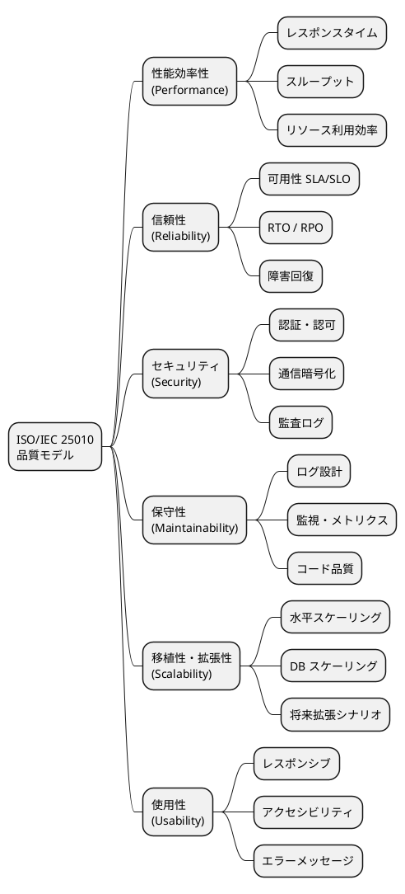

# 非機能要件定義 - 国際貨物輸送管理システム

## 1. 概要

### 1.1 目的と対象範囲

本ドキュメントは、国際貨物輸送管理システムの非機能要件を ISO/IEC 25010 品質モデルに基づいて定義する。機能要件（何ができるか）に対し、非機能要件は「システムがどう振る舞うべきか」を規定するものであり、性能・可用性・セキュリティ・保守性・拡張性のすべての要件を測定可能な数値で表現する。

**対象範囲**:

- 国際貨物輸送の予約から配送完了・精算までを一元管理する Web アプリケーション
- バックエンド: Play Framework 3.x / Scala 3.3 LTS（DDD + ヘキサゴナル + CQRS）
- フロントエンド: Twirl SSR + htmx（30 秒ポーリング）
- インフラ: AWS ECS Fargate + RDS PostgreSQL 16（Multi-AZ）+ ALB
- 外部システム連携 5 件（外部経路システム、税関システム、決済機関、港湾管理システム、通知システム）

**主要アクター**: 荷主（顧客）、荷受人、営業担当者、経路設計者、追跡管理者、荷役作業員、経理担当者（計 7 名）

### 1.2 ISO/IEC 25010 品質モデルとの対応

本ドキュメントは ISO/IEC 25010 が定める 8 品質特性のうち、システムの運用に直結する 6 特性を対象とする。



---

## 2. 性能要件（Performance）

### 2.1 レスポンスタイム目標

業務シナリオに基づき、画面・操作別のレスポンスタイム目標を定義する。計測は ALB アクセスログおよび CloudWatch メトリクスを基準とする。

| 操作 | p50 | p95 | p99 | 備考 |
|---|---|---|---|---|
| 貨物一覧ページ読み込み | 200ms | 500ms | 1,000ms | - |
| 貨物詳細ページ読み込み | 150ms | 300ms | 800ms | - |
| 追跡番号検索（公開） | 100ms | 200ms | 500ms | 認証不要 |
| 最適ルート検索（外部 API 呼び出し含む） | 2,000ms | 5,000ms | 10,000ms | 外部依存あり |
| 荷役作業登録 | 200ms | 500ms | 1,000ms | コマンド処理 |
| 請求書生成 | 500ms | 1,500ms | 3,000ms | 非同期処理候補 |
| htmx 部分更新（追跡ステータス） | 100ms | 200ms | 500ms | 30 秒ポーリング |

> **計測方法**: 本番相当の負荷試験環境にて Gatling または k6 で計測する。外部 API 呼び出しを含む操作はスタブ（WireMock）を用いた内部計測と外部込みの E2E 計測を両方実施する。Gatling は Scala DSL でシナリオを記述でき、本プロジェクトの技術スタックと親和性が高い。

### 2.2 スループット目標

| 区分 | 同時接続ユーザー数 | RPS（Requests Per Second） | 想定シナリオ |
|---|---|---|---|
| 平常時 | 50 | 50 | 通常業務 |
| ピーク時 | 200 | 200 | 繁忙期・月末精算 |
| 追跡照会（公開） | - | 1,000 | 荷受人の大量アクセス |

- ピーク時は平常時の 4 倍を想定し、ECS Auto Scaling が自動対応できること
- 追跡照会は内部ユーザーと荷受人（外部公開）が分離されるため、個別にレートリミットを設定する（荷受人: 100 RPS/IP）
- Play Framework は Pekko HTTP ベースのノンブロッキング I/O で動作するため、ScalikeJDBC のブロッキング DB アクセスは専用の ExecutionContext（`database.dispatcher`）に隔離し、デフォルトディスパッチャーの枯渇を防ぐ

### 2.3 データ量・ストレージ見積もり

**前提**:

- 年間新規予約件数: 10,000 件
- 追跡イベント: 予約 1 件あたり平均 20 件 → 年間 200,000 件
- 保持期間: 5 年（法令要件に基づく）

**テーブル別データ量見積もり（5 年累計）**:

| テーブル | 想定行数（5 年） | 1 行あたりサイズ | 概算合計 |
|---|---|---|---|
| `cargo`（貨物・予約） | 50,000 件 | 2 KB | 100 MB |
| `tracking_handling_event` / `tracking_exception_event`（追跡イベント） | 1,000,000 件 | 512 B | 512 MB |
| `route_candidate`（ルート候補） | 150,000 件 | 1 KB | 150 MB |
| `invoice` / `invoice_line_item`（精算書・明細） | 50,000 件 + 200,000 件 | 4 KB / 512 B | 300 MB |
| その他（`voyage` / `leg` / `handling_activity` 等） | - | - | 500 MB |
| **DB 合計（インデックス込み）** | - | - | **≈ 3.5 GB** |

> RDS db.t3.medium（汎用 SSD 100 GB）で 5 年間は十分に対応可能。ストレージの 70% 超過時にアラートを設定する。
>
> 監査ログ（5 年で約 500 万件・1.3 GB 相当）は DB テーブルではなく CloudWatch Logs + S3 アーカイブで保持する（「4.4 監査ログ」参照）。テーブル定義の詳細は [データモデル設計](data-model.md) を参照。

### 2.4 性能劣化基準（SLO 違反時の対応）

| 違反レベル | 条件 | 対応アクション |
|---|---|---|
| **Warning** | p95 がしきい値の 150% を超過（例: 貨物一覧 750ms） | CloudWatch アラート発報 → Slack #ops 通知 → 翌営業日中に原因調査 |
| **Critical** | p95 がしきい値の 200% を超過（例: 貨物一覧 1,000ms） | PagerDuty 呼び出し → 30 分以内に担当エンジニアが対応開始 |
| **SLO Breach** | 1 時間以内に p95 が連続して Critical 状態 | インシデント宣言 → RCA（根本原因分析）実施 → 24 時間以内に改善計画提出 |

---

## 3. 可用性要件（Availability）

### 3.1 稼働率 SLA / SLO

| レベル | 目標稼働率 | 月間許容停止時間 | 対象機能 |
|---|---|---|---|
| SLA（顧客向け） | 99.9% | 43.8 分/月 | 全機能（追跡含む） |
| SLO（内部目標） | 99.95% | 21.9 分/月 | コア機能 |
| 追跡機能（公開） | 99.99% | 4.4 分/月 | 追跡照会のみ |

> **SLA と SLO の関係**: SLO は SLA より厳しい内部目標として設定する。SLO を維持することで SLA 違反のリスクをバッファとして吸収する。追跡機能は荷受人が 24 時間アクセスするため、他機能より高い稼働率を要求する。

**稼働率の計測除外時間**:

- 定期メンテナンスウィンドウ（毎週日曜 2:00〜4:00 JST）
- 外部システム障害（税関・港湾システム等）に起因する機能制限

### 3.2 RTO / RPO

| 障害種別 | RTO（復旧時間目標） | RPO（データ復旧目標） | 対応方式 |
|---|---|---|---|
| ECS タスク障害 | 5 分以内 | 0（ステートレス） | ECS ヘルスチェック自動再起動 |
| RDS フェイルオーバー | 2 分以内 | 0（Multi-AZ 同期） | RDS Multi-AZ 自動フェイルオーバー |
| AZ 障害 | 10 分以内 | 0 | ECS 複数 AZ 配置 + ALB ヘルスチェック |
| リージョン障害 | 4 時間以内 | 1 時間以内 | RDS スナップショット + 手動リストア手順 |

> セッションは署名付きクライアントサイド Cookie（Play Session）で保持するため、アプリケーションはステートレスであり、タスク再起動・フェイルオーバーでセッションが失われない。

### 3.3 メンテナンスウィンドウ

| 種別 | スケジュール | 事前通知 | 最大停止時間 |
|---|---|---|---|
| 定期メンテナンス | 毎週日曜 2:00〜4:00（JST） | 72 時間前にメール通知 | 2 時間 |
| 緊急セキュリティパッチ | 随時 | 可能な限り事前通知（平日は顧客通知優先） | 30 分以内 |
| RDS マイナーバージョンアップ | 定期メンテナンス枠内 | 1 週間前 | 10 分（Multi-AZ フェイルオーバー） |

> **追跡照会の縮退継続**: 荷主・荷受人は海外におり時差があるため、日本の深夜でも公開追跡照会は利用される。
> 追跡照会（公開・99.99% 目標）は定期メンテナンス中も**縮退運転で継続**する。
> ECS のローリングアップデートによりアプリ層は無停止とし、DB を伴うメンテナンス中は
> 直近の追跡スナップショット（読み取り専用）を返す縮退モードで照会のみ提供する。
> 全停止を伴う作業（RDS メジャーバージョンアップ等）は事前告知のうえ追跡照会の停止時間を最小化する計画を立てる。

### 3.4 ヘルスチェック設計

**ECS タスクレベルのヘルスチェック設定**:

```text
ヘルスチェックエンドポイント: GET /health
ヘルスチェック間隔: 30 秒
タイムアウト: 5 秒
連続失敗回数（Unhealthy 判定）: 3 回
連続成功回数（Healthy 判定）: 2 回
```

**フェイルオーバー動作**:

1. ECS ヘルスチェック失敗（3 回連続）→ タスクを Unhealthy に変更
2. ALB がタスクをターゲットグループから除外（新規リクエストのルーティング停止）
3. ECS が新しいタスクを別の AZ で起動
4. 新タスクのヘルスチェック成功後、ALB に再登録
5. 旧タスクを停止（既存接続のドレイン: 30 秒）

**ヘルスチェックエンドポイントの構成**:

Play Framework には Spring Boot Actuator に相当する標準機能がないため、自作の `HealthController` で `/health` エンドポイントを提供する（実装は [インフラストラクチャアーキテクチャ](architecture_infrastructure.md) を参照）。

| チェック項目 | 内容 | 失敗時のレスポンス |
|---|---|---|
| アプリ起動確認 | コントローラーが応答すること自体で確認 | -（応答なし） |
| RDS 接続確認 | `sql"SELECT 1"` の実行 | HTTP 503 + `{"status": "DOWN"}` |

---

## 4. セキュリティ要件（Security）

### 4.1 認証・認可

**認証方式**: Play Session ベースのフォーム認証（署名付きクライアントサイド Cookie + `AuthenticatedAction` / ロール検査 ActionBuilder）

**RBAC ロール定義**（[バックエンドアーキテクチャ](architecture_backend.md) のロール設計と対応）:

| ロール | 説明 | 主要画面 |
|---|---|---|
| `ADMIN` | システム管理者 | 全画面 |
| `SALES` | 営業担当者 | 見積・荷主管理・予約登録・確定・通知 |
| `ROUTE_DESIGNER` | 経路設計者 | 航海スケジュール管理・経路割り当て |
| `HANDLER` | 荷役作業員 | 荷役登録のみ |
| `TRACKER` | 追跡管理者 | 追跡管理・例外処理 |
| `ACCOUNTANT` | 経理担当者 | 請求書管理 |
| `SHIPPER` | 荷主 | 自社予約・追跡照会 |

> 荷受人はロールを持たない。追跡番号による認証不要の公開追跡照会のみを利用する（[UI 設計](ui_design.md) 参照）。

**パスワードポリシー**:

- ハッシュアルゴリズム: bcrypt（コスト係数 12、jbcrypt を使用）
- 最低文字数: 8 文字以上
- 文字種要件: 大文字・小文字・数字・記号をそれぞれ 1 文字以上含む
- パスワード有効期限: 90 日（期限切れ時はログイン後に強制変更）
- 過去 5 世代のパスワード再利用禁止
- ログイン失敗 5 回でアカウントロック（30 分自動解除または管理者解除）

**セッション管理**:

- セッションタイムアウト: ロール別に設定（最終アクセスから）
  - `HANDLER`（荷役作業員）: **2 時間**（港湾・倉庫現場での連続作業・バーコードスキャン業務を考慮）
  - その他全ロール: **30 分**
- Play Session はクライアントサイド Cookie のためサーバー側に有効期限の状態を持たない。タイムアウトは Session に格納した最終アクセス時刻（`lastAccessedAt`）を `AuthenticatedAction` が検証し、超過時に 401 を返して実現する。アクセスのたびに時刻を更新した Cookie を再発行する
- **htmx の自動ポーリング（`hx-trigger="every 30s"`）は keep-alive と見なさない**。ポーリングリクエスト（`HX-Trigger` ヘッダーで識別）では `lastAccessedAt` を更新せず、ユーザーの能動的操作（クリック・フォーム送信）のみをセッション延長の対象とする。追跡詳細を放置したまま開いていてもタイムアウトは通常どおり進行し、残り 5 分でバナー警告を表示する（7.5 参照）
- CSRF 保護: Play CSRF Filter 有効（フォーム送信は `@helper.CSRF.formField`、htmx リクエストは `Csrf-Token` ヘッダーで対応）
- セッション固定攻撃対策: 認証成功後に Session を破棄して新規発行（`withNewSession` + 再格納）
- 同一ユーザーの同時セッション数: 1。クライアントサイド Cookie 単体では制御できないため、`users` テーブルにセッション世代番号（`session_generation`）を保持し、ログイン時にインクリメント、`AuthenticatedAction` が Cookie 内の世代番号と照合して旧セッションを無効化する

**htmx 認証**:

- セッション切れ時: HTTP 401 を返却し、htmx が `hx-on:htmx:response-error` でエラーダイアログを表示
- リダイレクトではなくインラインエラーメッセージとして通知（入力データの消失を防止）

### 4.2 通信セキュリティ

| 対象 | 方式 | 設定内容 |
|---|---|---|
| ブラウザ〜ALB | HTTPS 強制 | TLS 1.2 以上、HTTP → HTTPS 301 リダイレクト |
| ALB〜ECS | HTTP（VPC 内部） | セキュリティグループで ALB からのみ許可 |
| ECS〜RDS | 暗号化接続 | SSL/TLS（RDS ssl-mode=require） |
| ECS〜外部 API | HTTPS 強制 | TLS 1.2 以上、証明書検証有効 |

**HTTP セキュリティヘッダー**:

Play 標準の `SecurityHeadersFilter` を有効化し、`application.conf` で以下を設定する。HSTS は ALB（CloudFront 経由の場合はそちら）で付与する。

```text
Strict-Transport-Security: max-age=31536000; includeSubDomains
X-Content-Type-Options: nosniff
X-Frame-Options: DENY
Content-Security-Policy: default-src 'self'; script-src 'self' 'nonce-{random}'
```

**外部 API 接続タイムアウト設定**（Play WS クライアント）:

| 設定項目 | 値 | 備考 |
|---|---|---|
| 接続タイムアウト | 3 秒 | `play.ws.timeout.connection` |
| 読み取りタイムアウト | 10 秒 | `play.ws.timeout.request` |
| 最大リトライ回数 | 3 回 | Exponential Backoff（初回 1 秒、倍増）。ACL アダプター側で実装 |
| サーキットブレーカー閾値 | 5 回連続失敗 | 60 秒間オープン状態を維持。Pekko の `CircuitBreaker` を使用 |

### 4.3 データ保護

| 対象データ | 保護方式 | 管理 |
|---|---|---|
| DB 接続情報（URL、ユーザー、パスワード） | AWS Secrets Manager | ECS タスク定義の `secrets` で環境変数に注入 |
| `play.http.secret.key`（Session 署名鍵） | AWS Secrets Manager | 漏洩時は即時ローテーション（全セッション無効化を伴う） |
| RDS 保存データ | AES-256（AWS KMS 管理キー） | RDS 暗号化有効 |
| S3 バックアップ | AES-256（SSE-S3） | バケットポリシーで暗号化必須 |
| 個人情報（荷主メール・電話） | DB レベル暗号化（検討中） | Phase 2 で対応 |
| AWS アクセスキー | ECS Task Role（IAM） | 静的なアクセスキーは使用しない |

### 4.4 監査ログ

| ログ種別 | 記録内容 | 保持期間 |
|---|---|---|
| 認証ログ | ログイン成功/失敗・IP アドレス・ユーザーエージェント | 1 年 |
| 業務操作ログ | 予約作成/変更、荷役登録、請求書発行・変更 | 5 年 |
| 管理操作ログ | ユーザー管理、権限変更、システム設定変更 | 5 年 |
| エラーログ | アプリケーションエラー・スタックトレース | 90 日 |

**監査ログの実装方針**:

- アプリケーションサービス層のコマンドハンドラーで監査ログを明示的に記録する（Spring AOP のような横断的差し込みではなく、コマンド実行の入口で共通の `AuditLogger` を呼び出す方式。明示的な呼び出しは Scala の関数合成で重複を排除する）
- ログには `userId`・`requestId`・`timestamp`・`operation`・`entityId`・`before`・`after` を含める
- 監査ログは書き込み専用（UPDATE/DELETE 禁止）とし、CloudWatch Logs で改ざん検知

### 4.5 脆弱性対策

**OWASP Top 10 対応**:

| 脅威 | 対応方針 |
|---|---|
| A01: 認証の不備 | Play Session フォーム認証・bcrypt・アカウントロック |
| A02: 暗号化の失敗 | TLS 強制・KMS 暗号化・Secrets Manager |
| A03: インジェクション | ScalikeJDBC SQL interpolation（プレースホルダーバインド）・入力値バリデーション（Play Form + ドメイン層スマートコンストラクタの二段構え） |
| A04: 安全でない設計 | セキュリティレビューをリリース前チェックリストに含める |
| A05: セキュリティ設定ミス | Play CSRF Filter / SecurityHeadersFilter / AllowedHostsFilter のデフォルトフィルター群を有効化 |
| A06: 脆弱なコンポーネント | GitHub Dependabot + Scala Steward による自動脆弱性・依存更新スキャン |
| A07: 認証・セッション管理の不備 | セッション固定対策・CSRF 保護・タイムアウト設定・セッション世代番号による同時セッション制御 |
| A08: ソフトウェアの整合性 | CI/CD パイプラインでの署名検証・依存関係ロック |
| A09: セキュリティログとモニタリングの失敗 | CloudWatch + 監査ログ・異常検知アラート |
| A10: SSRF | 外部 API URL のホワイトリスト管理・VPC エンドポイント活用 |

**定期的な脆弱性管理**:

- GitHub Dependabot: 毎週自動スキャン・PR 自動生成
- Scala Steward: sbt 依存ライブラリの更新 PR を毎週自動生成
- OWASP Dependency-Check: 月次実行・CVSS スコア 7.0 以上は即時対応

---

## 5. 保守性要件（Maintainability）

### 5.1 ログ設計

**ログレベル定義**:

| ログレベル | 出力条件 | 例 |
|---|---|---|
| ERROR | システムエラー・外部 API 接続失敗 | DB 接続不可、決済 API エラー、未捕捉例外 |
| WARN | 業務上の警告・リトライ発生 | 外部 API タイムアウト（再試行）、バリデーション警告 |
| INFO | 業務イベント・リクエスト受付 | 予約登録、追跡番号発行、ユーザーログイン |
| DEBUG | デバッグ用詳細（本番は無効） | SQL クエリ、HTTP リクエスト内容、ドメインイベント詳細 |

**ログフォーマット（JSON 構造化ログ）**:

Logback + logstash-logback-encoder で JSON 構造化ログを出力する（Play は標準で Logback を使用）。

```json
{
  "timestamp": "2026-06-12T10:30:00.123Z",
  "level": "INFO",
  "logger": "cargotracker.booking.application.BookCargoCommandHandler",
  "message": "予約を登録しました",
  "requestId": "req-abc123",
  "userId": "user-456",
  "traceId": "trace-789",
  "bookingId": "BOOK-2026-001234",
  "duration_ms": 145
}
```

**ログ出力先と保持期間**:

| 用途 | 出力先 | ホット保持 | アーカイブ |
|---|---|---|---|
| アプリケーションログ | CloudWatch Logs | 30 日 | S3（5 年） |
| アクセスログ | ALB → CloudWatch Logs | 30 日 | S3（1 年） |
| 監査ログ | CloudWatch Logs（専用ロググループ） | 1 年 | S3（5 年） |
| RDS スロークエリログ | CloudWatch Logs | 14 日 | - |

**MDC（Mapped Diagnostic Context）による自動付与**:

- `requestId`: Play の `Filter` で UUID を生成し MDC に付与
- `userId`: `AuthenticatedAction` でログインユーザー ID を付与
- `traceId`: AWS X-Ray トレース ID（後続の分散トレーシング対応）

> **設計判断（要 ADR）**: MDC はスレッドローカルベースのため、`Future` をまたぐ処理ではコンテキストが失われ、
> 監査ログ（5 年保持・コンプライアンス要件）の `userId` 欠落につながる。**MDC 伝搬対応の ExecutionContext を採用する**
> 方針とし、具体的な実装方式（MDC コピー付き ExecutionContext の自作 or ライブラリ採用）は実装イテレーションで
> ADR として記録する。MDC が `Future` をまたいで保持されることを検証する統合テストを 1 件設ける（[テスト戦略](test_strategy.md) 参照）。

### 5.2 監視・メトリクス

**CloudWatch メトリクスとアラート閾値**:

| メトリクス | 警告閾値 | 緊急閾値 | 通知先 |
|---|---|---|---|
| ECS CPU 使用率 | 70% | 90% | Slack #ops |
| ECS メモリ使用率 | 75% | 90% | Slack #ops |
| RDS CPU 使用率 | 60% | 80% | Slack #ops |
| ALB 5xx エラー率 | 1% | 5% | Slack #ops + PagerDuty |
| ALB レスポンスタイム p95 | 1,000ms | 3,000ms | Slack #ops |
| RDS 接続数 | max の 80% | max の 95% | Slack #ops |
| RDS 空きストレージ | 30% | 15% | Slack #ops |
| ECS タスク起動失敗 | 1 回 | 3 回連続 | Slack #ops + PagerDuty |

**カスタムメトリクス（CloudWatch EMF）**:

- 予約登録件数（業務 KPI）
- 追跡番号検索件数（API 使用量）
- 外部 API 呼び出しレイテンシ（連携先別）
- htmx ポーリングリクエスト数（負荷監視）

### 5.3 コード品質目標

[テスト戦略](test_strategy.md) のカバレッジ目標・CI ゲートと整合させる。

| 指標 | 目標値 | 計測ツール |
|---|---|---|
| テストカバレッジ（ドメイン層） | 85% 以上 | scoverage |
| テストカバレッジ（アプリケーション層） | 80% 以上 | scoverage |
| SonarQube Reliability | A（バグゼロ） | SonarQube |
| SonarQube Security | A（脆弱性ゼロ） | SonarQube |
| コード重複率 | 3% 以下 | SonarQube |
| 技術的負債比率 | 5% 以下 | SonarQube |
| scalafmt 違反数 | 0 件（`scalafmtCheckAll`） | scalafmt |
| scalafix 違反数 | 0 件（`scalafixAll --check`） | scalafix |
| コンパイラ警告 | 0 件（`-Werror`） | Scala 3 コンパイラ |

**CI 統合**:

- Pull Request 時に scoverage カバレッジレポートをコメントで自動投稿
- マージをブロックする品質ゲートは **scalafmt / scalafix / scoverage / `-Werror`** に限定する
- SonarQube は**可視化（非ブロッキング）として運用**する。Scala プラグインの保守状況リスク（[技術スタック選定](tech_stack.md) 参照）により、外部要因で CI が不安定化することを避けるため、Quality Gate の結果は参考情報としてレビューで確認する

---

## 6. 拡張性要件（Scalability）

### 6.1 水平スケーリング

**ECS Fargate Auto Scaling 設定**:

| パラメーター | 値 | 備考 |
|---|---|---|
| 最小タスク数 | 2 | Multi-AZ 配置（各 AZ に 1 タスク） |
| 最大タスク数 | 10 | コスト上限を考慮した値 |
| スケールアウトトリガー | CPU 70% または メモリ 75% | ターゲット追跡スケーリング |
| スケールアウト速度 | 60 秒で追加インスタンス起動 | 新タスクのウォームアップを含む |
| スケールイン冷却期間 | 300 秒 | 急激なスケールイン防止 |

> Play Session は署名付きクライアントサイド Cookie のため、スティッキーセッション不要で任意のタスクにルーティングできる。水平スケーリングとの相性がよい。

**タスクリソース設定**:

| 環境 | CPU | メモリ | 備考 |
|---|---|---|---|
| 本番（通常） | 1 vCPU | 2 GB | 2 タスク × 2 AZ |
| 本番（ピーク） | 2 vCPU | 4 GB | Auto Scaling 後の最大値 |
| ステージング | 0.5 vCPU | 1 GB | コスト最適化 |

### 6.2 DB スケーリング

**接続プール設定（HikariCP）**:

ScalikeJDBC + HikariCP の接続プールを `application.conf` で設定する。

```hocon
# conf/application.conf
db.default {
  driver = "org.postgresql.Driver"
  url = ${DATABASE_URL}
  hikaricp {
    maximumPoolSize = 15      # タスクあたり最大接続数（10 タスク × 15 = 150 < max_connections 200）
    minimumIdle = 5           # 最小アイドル接続数
    connectionTimeout = 3000  # 接続タイムアウト（ms）
    idleTimeout = 600000      # アイドル接続の解放時間（10 分）
    maxLifetime = 1800000     # 接続の最大生存時間（30 分）
  }
}

# ブロッキング DB アクセス専用ディスパッチャー
# スレッド数は HikariCP の maximumPoolSize と一致させる（接続待ちのスレッド滞留を防ぐ）
database.dispatcher {
  executor = "thread-pool-executor"
  thread-pool-executor.fixed-pool-size = 15
}
```

**RDS 接続数上限**:

| 設定 | 値 | 備考 |
|---|---|---|
| `max_connections`（RDS） | 200 | db.t3.medium のデフォルト |
| 最大同時接続数（計算） | タスク数(10) × 接続プール(15) = 150 | RDS 内部用接続・監視用に 50 のマージンを確保 |
| Read Replica 追加基準 | 追跡照会の読み取り RPS が 500 を超過 | CQRS 読み取り側をレプリカに分離 |

> **注意**: RDS は内部接続・モニタリング・レプリケーション用に接続を消費するため、アプリケーションで `max_connections` を使い切る設計にしない。タスクあたりプール 15 で不足する場合（最大タスク数の増枠時を含む）は、プール拡大ではなく **RDS Proxy の導入を前提条件**として接続プーリングを委譲する。

**Read Replica の活用方針**:

- CQRS のクエリ側（追跡照会・貨物一覧・レポート）を Read Replica に向けることでプライマリへの読み取り負荷を軽減（ScalikeJDBC の `NamedDB` で読み取り専用データソースを分離できる）
- 追跡照会（1,000 RPS）が成長した場合は Read Replica を 2 本に増やす

### 6.3 将来の拡張シナリオ

| シナリオ | 想定時期 | 対応方針 |
|---|---|---|
| 荷主セルフサービスポータルの拡充 | 1 年後 | `SHIPPER` ロールは初期リリースから提供済み。OAuth2 / OIDC 対応（pac4j 等）で外部 IdP 連携に拡張 |
| 多言語対応（日本語・英語・中国語） | 2 年後 | Play I18N（`MessagesApi` + Twirl の `@messages(...)`）、URL パスにロケール追加（`/en/`, `/zh/`） |
| マイクロサービス分割 | 3 年後 | ヘキサゴナルアーキテクチャのポート境界を REST/gRPC API 境界に昇格、サービス間認証に JWT 追加 |
| イベントソーシング移行（Billing） | 2 年後 | Outbox パターンを先行実装 → Amazon SQS/EventBridge 経由で Kafka への移行を段階的に実施 |
| 荷受人向けモバイルアプリ | 2 年後 | 追跡照会を JSON API（Play JSON）として公開し、フロントエンドのみ追加 |

---

## 7. ユーザビリティ要件（Usability）

### 7.1 レスポンシブ対応

- Bootstrap 5 を使用したレスポンシブレイアウト
- 荷役作業員のスマートフォン利用を考慮した最小画面幅: 375px（iPhone SE 相当）
- タッチ操作対応: タップターゲットは最小 44px × 44px（WCAG 2.1 推奨）
- 貨物一覧・荷役登録画面はモバイルファーストで設計

### 7.2 アクセシビリティ

- WCAG 2.1 AA 準拠を目標とする
- 色コントラスト比: テキストと背景の比率は 4.5:1 以上（通常テキスト）、3:1 以上（大きなテキスト）
- キーボード操作: すべての機能はキーボードのみで操作可能
- スクリーンリーダー対応: セマンティック HTML + ARIA ランドマーク
- フォームバリデーション: エラーメッセージは `aria-describedby` で入力フィールドに関連付け

### 7.3 エラーメッセージ設計

- **原則**: ユーザーが次のアクションを理解できる具体的なメッセージを表示する
- **禁止表現**: 「エラーが発生しました」「システムエラー」等の技術的な表現のみの表示
- **推奨形式**: 「〇〇が正しくありません。△△を確認して再度入力してください。」

### 7.4 ローディング・フィードバック

- htmx リクエスト中: `htmx-request` クラスを利用したローディングインジケーター表示（スピナーまたはプログレスバー）
- 30 秒ポーリング（追跡ステータス更新）: 更新時に差分がある場合のみ視覚的フィードバック（フェードイン）
- 長時間処理（請求書生成等）: プログレスバーまたは「処理中...（通常 1〜3 秒）」のメッセージを表示

### 7.5 セッションタイムアウト警告

- セッション残り **5 分**で画面上部にバナー通知（入力データ消失防止）
- 通知テキスト: 「セッションが 5 分後に切れます。作業を保存するか、[セッションを延長] をクリックしてください。」
- セッション延長ボタン: クリックで `/keep-alive` エンドポイントを呼び出し、`lastAccessedAt` を更新した Cookie を再発行
- タイムアウト後: 入力中フォームの値を `sessionStorage` に一時保存し、再ログイン後に復元（Phase 2）
- **例外: 荷役作業登録フォームのみ初期リリースで入力値のローカル退避・復帰時再送を実装する**。港湾・倉庫は通信が不安定（圏外含む）であり、現場作業の入力消失は業務影響が大きいため（[UI 設計](ui_design.md) の荷役作業登録を参照）
- `HANDLER` のタイムアウト（2 時間）でも同様に残り 5 分でバナー通知を行う

---

## 8. 法令・コンプライアンス要件

| 要件 | 根拠 | 対応内容 |
|---|---|---|
| 個人情報保護 | 個人情報保護法 | 荷主・荷受人の個人情報取得時に利用目的を明示し同意取得、収集は業務遂行に必要な最小限に限定 |
| 消費税表示 | 消費税法 | 請求書に税率（10%）・税額を明示、軽減税率対象品目は区分を記載 |
| 商業帳票保存 | 電子帳簿保存法 | 請求書・精算記録を電子的に 7 年間保存（改ざん防止のため監査ログで変更履歴を記録） |
| 国際輸送規制 | SOLAS 条約 | 危険物申告（HAZARDOUS）の内容・重量・荷主情報を適切に記録・保持 |
| 輸出入規制 | 外為法・関税法 | 税関申告情報（品目コード・原産地・価格）を記録し、税関システムへの連携履歴を保持 |
| データ越境移転 | GDPR（荷主が EU 居住者の場合） | EU 居住者の個人データ取り扱いに関するプライバシーポリシーを整備（Phase 2） |

---

## 付録: 非機能要件確認チェックリスト

リリース前に以下をすべて確認する。

**性能**:

- [ ] 負荷試験を実施し、全操作の p95 が目標値以内であることを確認
- [ ] 追跡照会が 1,000 RPS 相当の負荷に耐えられることを確認
- [ ] DB 接続プールの設定が本番環境に適用されていることを確認
- [ ] ブロッキング DB アクセスが専用 ExecutionContext に隔離されていることを確認

**可用性**:

- [ ] ECS ヘルスチェック（`/health`）が正しく設定されていることを確認
- [ ] RDS Multi-AZ フェイルオーバーを実際にテストし、RTO 2 分以内を確認
- [ ] メンテナンス通知の送信フローが確立されていることを確認

**セキュリティ**:

- [ ] HTTPS 強制が ALB で設定されていることを確認
- [ ] すべての HTTP セキュリティヘッダーが設定されていることを確認
- [ ] AWS Secrets Manager 経由での DB 接続・`play.http.secret.key` 注入が機能していることを確認
- [ ] CSRF 保護が有効であることを確認（フォームおよび htmx リクエスト）
- [ ] セッションタイムアウト・同時セッション制御が機能していることを確認
- [ ] OWASP Top 10 対応のレビューが完了していることを確認

**保守性**:

- [ ] JSON 構造化ログが CloudWatch Logs に出力されていることを確認
- [ ] CloudWatch アラートが適切に通知されることを確認（テスト通知）
- [ ] SonarQube Quality Gate がパスしていることを確認
- [ ] scoverage カバレッジが目標値を達成していることを確認

**拡張性**:

- [ ] ECS Auto Scaling のトリガーが設定されていることを確認
- [ ] HikariCP の接続プール設定が本番環境に適用されていることを確認

---

## 参照

- [バックエンドアーキテクチャ](architecture_backend.md) — 認証・認可の実装方式、ロール設計
- [インフラストラクチャアーキテクチャ](architecture_infrastructure.md) — AWS 構成、ヘルスチェック実装、CI/CD
- [データモデル設計](data-model.md) — テーブル定義、データ量見積もりの根拠
- [テスト戦略](test_strategy.md) — カバレッジ目標、CI 品質ゲート
- [技術スタック選定](tech_stack.md) — 各ツールのバージョンと選定理由
