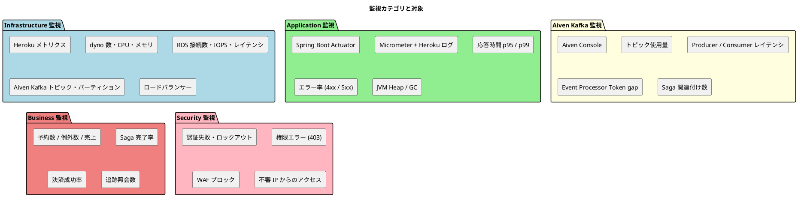
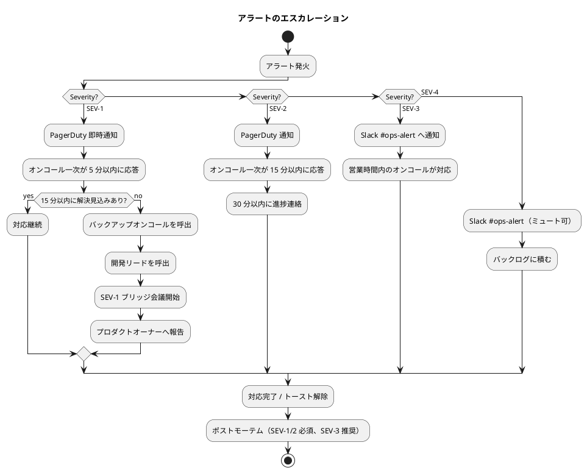
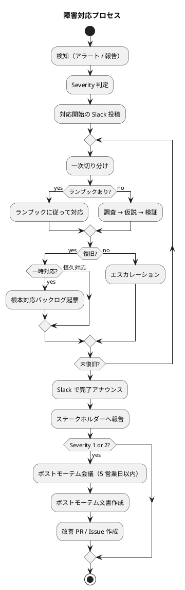
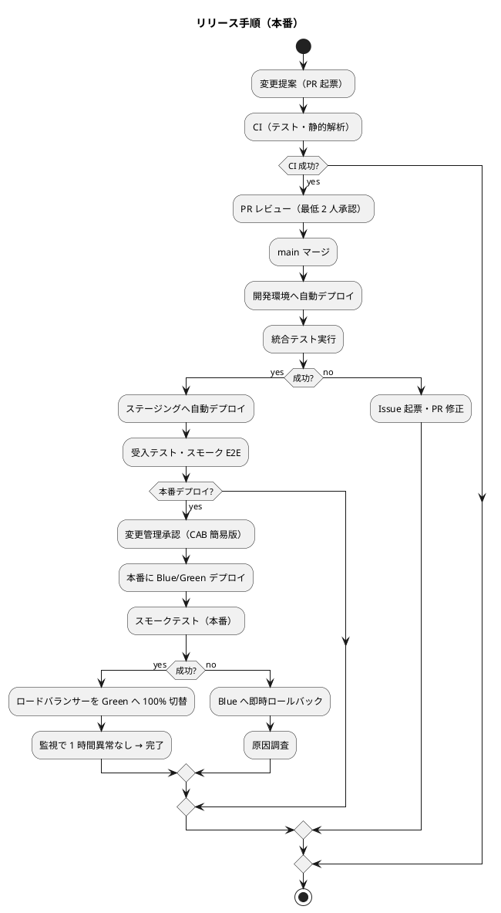
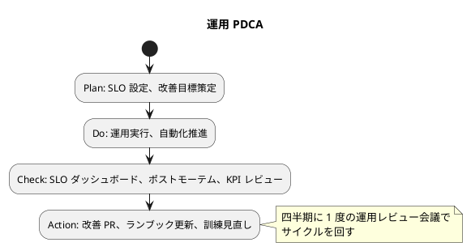

# 運用要件 - 国際貨物輸送管理システム

## 概要

国際貨物輸送管理システムの運用設計書。非機能要件（[`non_functional.md`](non_functional.md)）の SLA / SLO を達成するため、運用フロー・監視・バックアップ・障害対応・変更管理を定義する。

- **フェーズ 1（v1.0、Heroku + Aiven Kafka）**: 業務時間内可用率 99.9%、RTO < 4h、RPO Read Model < 1h / Event Store < 1h（Aiven Kafka のメッセージ保持 + 連続 S3 ストリーミングエクスポート）
- **フェーズ 2（冗長構成移行後）**: 業務時間内可用率 99.95%、RPO Event Store < 5 分

設計の指針：

- **自動化優先**: IaC（Terraform）・GitHub Actions により手動運用を最小化する
- **Observability ファースト**: メトリクス・ログ・トレースの三本柱で可視化
- **ランブック駆動**: 障害は事前に手順化、訓練で検証する
- **継続的改善**: ポストモーテム → 改善 PR の PDCA を回す
- **Aiven Kafka 特有の運用**: Event Store の保護・Projection 再構築・スキーマ進化を運用に組み込む

## 1. 運用体制

### 1.1 ロールと責任

| ロール | 主たる責務 |
| :--- | :--- |
| プロダクトオーナー | ビジネス要件・優先順位・SLA 合意 |
| アプリ開発チーム | 機能開発・バグ修正・PR レビュー |
| SRE / Platform チーム | インフラ・CI/CD・監視・障害対応 |
| セキュリティ担当 | 脆弱性対応・監査ログ確認・ペネトレ |
| オンコール（持ち回り） | 営業時間外のアラート初動対応 |
| ヘルプデスク | ユーザー問い合わせの一次対応 |

開発チームと SRE チームは **DevOps モデル** で連携し、本番障害の根本原因解析（RCA）には開発も参加する。

### 1.2 オンコール体制

| 区分 | 体制 | 対応窓口 |
| :--- | :--- | :--- |
| 業務時間内（平日 8:00–20:00 JST） | 開発チーム + SRE | Slack `#ops-alert` |
| 業務時間外（夜間・休日） | オンコール 2 名（一次 + バックアップ） | PagerDuty → 電話 |
| 重大障害（Severity 1） | 上記 + 開発リード + プロダクトオーナー | 緊急ブリッジ会議 |

オンコールローテーション: 1 週間交代、月 1 週担当を上限とする（持続可能なペース）。

## 2. 運用フロー

### 2.1 日次運用

| 時刻 | 作業 | 担当 | 自動化 |
| :--- | :--- | :--- | :--- |
| 03:00 | RDS 自動スナップショット | AWS | ✅ |
| 毎時 00 分 | **Aiven Kafka メッセージ保持確認（1h 頻度、24h 短期保持）** | Aiven | ✅ |
| 03:30 | RDS スナップショット（日次保持 7 日） | AWS | ✅ |
| 連続（5 分間隔） | **Event Store の S3 ストリーミングエクスポート（Lambda がポーリング）** | Lambda | ✅ |
| 04:00 | Event Store の S3 フルエクスポート（日次） | Lambda | ✅ |
| 04:30 | ログローテーション・古いログの S3 アーカイブ | Heroku ログ + Lambda | ✅ |
| 06:00 | バックアップ整合性チェック（最新スナップショットの存在確認） | Lambda → Slack 通知 | ✅ |
| 09:00 | 前日の SLO ダッシュボード確認、異常があれば調査開始 | SRE | 手動 |
| 営業時間中 | アラート対応、問い合わせ対応 | オンコール | 一部自動 |
| 18:00 | 当日の業務メトリクス確認（予約数・例外数） | SRE + PO | 手動 |

### 2.2 週次運用

| 曜日 | 作業 | 担当 |
| :--- | :--- | :--- |
| 月 | 前週のインシデント振り返り、SLO エラーバジェット確認 | SRE + 開発リード |
| 火 | 依存関係スキャン（Snyk・Dependabot）の確認、必要に応じて PR 作成 | 開発 + セキュリティ |
| 水 | 監査ログ抜き取りレビュー（ロール変更・管理者操作） | セキュリティ |
| 木 | 容量計画の進捗確認（Read Model・Event Store・コスト） | SRE |
| 金 | リリース準備会議、次週のデプロイ計画確定 | 全員 |

### 2.3 月次運用

| 作業 | 担当 |
| :--- | :--- |
| セキュリティパッチ適用（OS・依存関係のメジャー以外） | 開発 + SRE |
| Aiven Kafka 軽微なアップデート評価 | SRE |
| RDS スナップショットの古いものの削除（保持期間外） | AWS（自動）+ SRE が監査 |
| コスト分析（前月実績 vs 予算）、最適化 PR の起票 | SRE |
| インシデントメトリクス集計（MTTD / MTTR / 件数） | SRE |
| SLO レポートをステークホルダーへ共有 | SRE + PO |
| バックアップリストアテスト（半年に 1 度は本番フル復旧訓練） | SRE |
| 計画メンテナンス（夜間 1 時間、必要時のみ） | SRE |

### 2.4 四半期 / 年次運用

| 作業 | 頻度 | 担当 |
| :--- | :--- | :--- |
| ペネトレーションテスト | 年 1 回 | 外部委託 + セキュリティ |
| DR 訓練（リージョン切替を含むフル復旧） | 半年 1 回 | SRE + 開発 |
| ライセンス・契約更新（AWS リザーブド・SonarQube・Sentry 等） | 年次 | SRE + 調達 |
| 容量計画の年次見直し、構成変更計画 | 年次 | SRE + アーキテクト |
| 監査対応（ISO 27001 等） | 年次 | セキュリティ + 法務 |
| Java / Spring Boot メジャー LTS 評価 | 半年 1 回 | 開発 |
| Aiven Kafka スケールアップ評価 | 年次 | アーキテクト + SRE |
| **ロール棚卸し（後述 2.5）** | **四半期 1 回** | **セキュリティ + アプリ開発リード** |

### 2.5 ロール棚卸し（IT10 A1.6 / US30 / IT9 H10）

`@PreAuthorize` メソッド認可で利用するロール（`ROLE_SALES` / `ROLE_ROUTING` / `ROLE_HANDLER` /
`ROLE_TRACKER` / `ROLE_ACCOUNTANT` / `ROLE_ADMIN`）の付与状況を **四半期 1 回** 棚卸しする。
過剰権限・退職者残置・部門異動による不要権限の蓄積を防ぐ目的。

#### ロール一覧と対象 ms

| ロール | 対象 ms / Controller | 担当業務 |
| :--- | :--- | :--- |
| `ROLE_SALES` | bookingms（CargoBooking / Quotation / Shipper） | 営業担当者：荷主・予約・見積管理 |
| `ROLE_ROUTING` | routingms（Voyage / Route / RouteDesignRequest） | 経路設計者：航海スケジュール・経路算出 |
| `ROLE_HANDLER` | handlingms（HandlingActivity） | 荷役作業員：荷役・引取作業記録 |
| `ROLE_TRACKER` | trackingms（Tracking / TrackingException） | 追跡管理者：貨物状態・例外処理 |
| `ROLE_ACCOUNTANT` | billingms（Invoice / CircuitBreakerHealth） | 経理担当者：輸送料金算出・精算 |
| `ROLE_ADMIN` | 全 ms（バックアップロール） | システム管理者：緊急時の横断対応 |

#### 棚卸し手順

四半期初週（1 月 / 4 月 / 7 月 / 10 月の第 1 月曜日）に実施する。

1. **ロール付与状況のエクスポート**: authms から全ユーザーのロール一覧を CSV エクスポート（`/api/v1/admin/users?withRoles=true`）
2. **HR システムとの突合**: HR 側の在籍状況・部門マスタと突合し、以下の差分を抽出
   - 退職者で未削除のアカウント → 即時削除
   - 部門異動でロールが旧職務のまま残置 → 該当ロールを削除
   - 過剰な ROLE_ADMIN 付与（4 名超）→ 必要性を再確認
3. **アクセスログ突合**: 過去 90 日のアクセスログを確認し、付与されているロールを実際に使っていないアカウントを抽出 → 部門長に必要性を確認
4. **差分の修正**: authms 管理画面または `/api/v1/admin/users/{id}/roles` でロールを更新
5. **棚卸し結果の記録**: `docs/operation/role-audit-YYYY-QN.md` に棚卸し結果（チェック対象人数 / 修正件数 / 残課題）を記録
6. **監査ログ確認**: 棚卸し後 1 週間、`authorization_audit` イベント（`/api/v1/audit/auth`）を確認し、変更ロールでの認可違反 403 が増えていないかチェック

#### 新規ロール追加時のチェックリスト

新規 ms / Controller を追加する際、`@PreAuthorize` で新ロールを参照する場合は以下を実施。

- [ ] ロールを `ROLE_<NAME>` 形式の Constant として shared モジュールに追加
- [ ] HerokuSecurityConfig の URL ルール認可（`hasAnyRole`）にも同ロールを追加（二段重層）
- [ ] 認可テスト（`XxxControllerAuthorizationTest`）を追加し、401 / 403 / 業務応答の 3 件で検証
- [ ] 本「2.5 ロール棚卸し」セクションの「ロール一覧」表に新ロールを追記
- [ ] authms 管理画面でロール選択肢に新ロールが表示されることを確認
- [ ] 既存ユーザーの中で新ロールを付与すべき対象を部門長と確認

## 3. 監視設計

### 3.1 監視カテゴリ



### 3.2 監視項目一覧

#### Infrastructure 監視

| 項目 | 取得元 | 評価頻度 | Warning 閾値 | Critical 閾値 |
| :--- | :--- | :--- | :--- | :--- |
| Heroku dyno CPU 使用率 | Heroku ログ | 1 分 | > 70%（5 分継続） | > 85%（5 分継続） |
| Heroku dyno メモリ使用率 | Heroku ログ | 1 分 | > 70% | > 85% |
| RDS CPU | CloudWatch | 1 分 | > 70% | > 85% |
| RDS 接続数 | CloudWatch | 1 分 | > 70%（最大の） | > 90% |
| RDS フリーストレージ | CloudWatch | 5 分 | < 30% | < 15% |
| Aiven Kafka トピック使用率 | Aiven Console | 5 分 | > 70% | > 85% |
| ロードバランサー 5xx エラー率 | Heroku ログ | 1 分 | > 0.5% | > 2% |

#### Application 監視

| 項目 | 取得元 | Warning | Critical |
| :--- | :--- | :--- | :--- |
| HTTP p95 レスポンスタイム | Micrometer | > 1.0s | > 2.0s |
| HTTP p99 レスポンスタイム | Micrometer | > 2.0s | > 5.0s |
| 5xx エラー率 | Micrometer | > 0.5% | > 1% |
| 4xx エラー率（401/403 除く） | Micrometer | > 2% | > 5% |
| JVM Heap 使用率 | Micrometer | > 70% | > 85% |
| GC 停止時間（合算 / 1 分） | Micrometer | > 500ms | > 1000ms |
| アクティブスレッド数 | Micrometer | 想定の 1.5 倍 | 想定の 2 倍 |
| `/actuator/health` の失敗 | Heroku ログ | 1 回 / 5 分 | 3 回連続 |

#### Aiven Kafka 監視

| 項目 | 取得元 | Warning | Critical |
| :--- | :--- | :--- | :--- |
| Aiven Kafka ブローカープロセス | Health Check | - | 停止 |
| トピック使用量 | Aiven Metrics | > 70% | > 85% |
| Producer レイテンシ p95 | Aiven Metrics | > 500ms | > 1000ms |
| Consumer レイテンシ p99 | Aiven Metrics | > 1000ms | > 3000ms |
| Event Processor Token gap | アプリ Metrics | > 10 秒 | > 60 秒 |
| Saga アクティブ数 | アプリ Metrics | 想定の 1.5 倍 | 想定の 2 倍 |
| Consumer group ラグ | Aiven Metrics | > 1000 メッセージ | > 5000 メッセージ |
| イベント書き込み TPS（10 分平均） | Aiven Metrics | > 150 | > 200 |

#### Business 監視

| 項目 | 取得元 | アラート閾値 |
| :--- | :--- | :--- |
| 日次予約成立件数 | Micrometer custom metric | 過去 30 日平均の -50% |
| Saga 失敗率 | Aiven Kafka + アプリログ | > 5% |
| `LOSS` 例外発生 | Tracking Service | 1 件発生で escalation |
| 決済失敗率 | Billing Service | > 10% |
| Read Model 反映遅延（コマンド送信から照会成功まで） | アプリ独自メトリクス | p95 > 10s |
| 追跡照会 API スパイク | Heroku アクセスログ | 5 分間 500 req/s 超え |

#### Security 監視

| 項目 | 取得元 | アラート閾値 |
| :--- | :--- | :--- |
| 認証失敗 | アプリログ | 同一 IP から 1 分間 20 回超 |
| アカウントロックアウト | アプリログ | 1 時間に 10 件超 |
| 403 Forbidden | アクセスログ | 同一ユーザーから 1 時間に 50 件超 |
| WAF ブロック数 | AWS WAF | 1 時間に 1,000 件超 |
| 管理者操作 | 監査ログ | 全件 Slack `#ops-audit` に通知 |
| ロール変更 | 監査ログ | 全件 セキュリティ担当に通知 |
| **公開トークン secret rotation 失敗** | Micrometer (`tracking.public_token.refresh.failure` Counter / `tracking.public_token.refresh.consecutive_failures` Gauge) | **Gauge ≥ 3 (連続失敗 3 回)** で Critical: PagerDuty + Slack `#sec-incident`。Counter 増分（5 分窓）≥ 5 で Warning: Slack `#sec-monitoring`。IT10 A3.10 / US32 / IT9 H9。 |

### 3.3 ダッシュボード

| ダッシュボード | 用途 | 主な閲覧者 |
| :--- | :--- | :--- |
| SRE ダッシュボード | システム健全性の俯瞰 | SRE / オンコール |
| サービス別ダッシュボード | 各マイクロサービスの詳細 | 開発 + SRE |
| Aiven Kafka ダッシュボード | トピック / Consumer group / Event Processor | アーキテクト + SRE |
| Business KPI ダッシュボード | 予約・売上・例外などビジネス指標 | プロダクトオーナー |
| Security ダッシュボード | 認証・WAF・監査 | セキュリティ |
| SLO ダッシュボード | SLI / SLO / エラーバジェット | SRE + PO |

実装は Heroku ログ + 外部ダッシュボードツール（Datadog 等）で行い、社内 Wiki に常時表示する。

## 4. アラート・エスカレーション

### 4.1 重要度分類

| Severity | 説明 | 反応時間 | 通知 |
| :--- | :--- | :--- | :--- |
| **SEV-1** | システム停止、データ損失、セキュリティ侵害 | 即時 | PagerDuty + 電話 + Slack `#incident` + 経営層 |
| **SEV-2** | 重要機能の劣化、可用性低下 | 30 分以内 | PagerDuty + Slack |
| **SEV-3** | 部分的な機能不具合、性能劣化 | 営業時間内に対応 | Slack `#ops-alert` |
| **SEV-4** | 軽微な異常、Warning レベル | 翌営業日 | Slack `#ops-alert`（ミュート可） |

### 4.2 エスカレーションフロー



### 4.3 サイレンス・抑制

- 計画メンテナンス時はアラートを一時停止
- Flaky なアラートは Alert Manager で抑制ルールを設定し、改善 Issue を必ず起票
- 一定回数の自動回復で解決した軽微なエラーは Severity を下げる

## 5. バックアップとリストア

### 5.1 バックアップ方針

| 対象 | 方式 | 頻度 | 保持期間 | 暗号化 |
| :--- | :--- | :--- | :--- | :--- |
| RDS（Read Model） | 自動スナップショット | 日次（03:00 JST） | 7 日 | KMS |
| RDS（Read Model） | 手動スナップショット | リリース前 | 30 日 | KMS |
| RDS（Read Model） | Point-in-time Recovery（WAL） | 連続 | 7 日 | KMS |
| **Aiven Kafka（短期）** | **Aiven マネージドバックアップ** | **1 時間ごと** | **24 時間（24 件）** | Aiven 暗号化 |
| Aiven Kafka（日次） | Aiven マネージドバックアップ | 日次（03:30 JST） | 7 日 | Aiven 暗号化 |
| **Event Store ストリーミングエクスポート** | **Kafka Consumer → Lambda（5 分間隔ポーリング） → S3** | **連続（5 分以内）** | 1 年（オンライン）+ 7 年（Glacier） | SSE-KMS + Object Lock |
| Event Store フルエクスポート | Kafka Consumer → S3（Lambda） | 日次（04:00 JST） | **7 年** | SSE-KMS + Object Lock |
| アプリログ | Heroku ログ | 連続 | 30 日 → S3 へ 90 日 | KMS |
| 監査ログ | S3（Object Lock） | 連続 | 1 年（オンライン）+ 7 年（Glacier） | SSE-KMS |
| Terraform State | S3 + DynamoDB ロック | 変更時 | 全履歴 | SSE-KMS |
| シークレット | AWS Secrets Manager | 変更時自動 | 全履歴 | KMS |

### 5.2 リストア手順（代表例）

#### A. Read Model（RDS）の不整合

1. SRE が `tracking_read_db` の不整合を検知
2. 影響範囲を特定（テーブル / 期間）
3. Axon Event Processor の Token をリセット
4. Event Store からイベントを再生して Projection を再構築
5. 整合性チェッカーで完了確認
6. ユーザーへ復旧通知

```bash
# Token リセット手順（運用スクリプト）
$ ./ops/scripts/reset-projection-token.sh \
    --service tracking \
    --processor TrackingActivityProjection \
    --from-beginning
```

所要時間目安: 5〜30 分（イベント量による）

#### B. RDS インスタンス障害（ハードウェア・AZ）

1. Heroku ログ + CloudWatch Alarm で検知
2. Multi-AZ 構成のため自動フェイルオーバー（~60 秒）
3. アプリ層は接続切れを Resilience4j のリトライで吸収
4. 自動復旧確認、SRE が後追いで PostgreSQL の状態を確認

#### C. Aiven Kafka 障害

1. Heroku ログ + Aiven Console アラートで検知（ヘルスチェック失敗）
2. オンコールが PagerDuty に応答
3. Aiven マネージドサービスの自動復旧を確認
4. 自動復旧失敗時、Aiven サポートへ連絡
5. S3 にエクスポートしている Event Store から差分を確認
6. アプリ層のリトライ機構で接続再開
7. Consumer group ラグを確認し、Projection の追従状況を監視

所要時間目安: 30 分〜2 時間（Aiven マネージド SLA に依存）

#### D. Event Store の論理破壊（コードバグでの誤イベント発行）

1. **真に Event Store は不変** だが、誤投入イベントは「打消しイベント」で対応する
2. 影響範囲を特定（特定の集約 ID・期間）
3. 開発チームと協議し、補償イベント or 補償コマンドを準備
4. 本番への適用は変更管理プロセスを経る（5xx エラーレベルの扱い）
5. Read Model を Token リセットで再構築

> **Event Store のイベント物理削除は禁止**。AxonIQ の運用ベストプラクティスに従い、補正で対応する。

#### E. AZ 障害

1. Heroku ログ + CloudWatch Alarm が大量発火
2. アプリ層（Heroku dyno）は他 AZ で継続稼働
3. RDS は Multi-AZ フェイルオーバー
4. Aiven Kafka は Aiven マネージドの冗長構成で継続
5. RTO 目標 4 時間以内（実績は訓練で計測）

#### F. リージョン全体障害（DR）

1. SEV-1 として宣言、経営層エスカレーション
2. DR リージョン（ap-northeast-3）へ手動切替
3. Terraform で DR スタックを起動
4. S3 にエクスポートしている Event Store から復元
5. Read Model は RDS スナップショットから復元
6. DNS フェイルオーバー
7. 監視結果から復旧完了をアナウンス

> 現状はフェーズ 1 のため、Event Store のリージョン間レプリケーションは未対応。フェーズ 2 では Aiven Kafka のクロスリージョン機能を活用した自動同期を目指す。

### 5.3 リストアテスト

| テスト | 頻度 | 検証内容 |
| :--- | :--- | :--- |
| RDS スナップショット復元 | 月 1 回 | 別 DB へ復元し、基本クエリの結果を比較 |
| Aiven Kafka バックアップ復元 | 月 1 回 | 開発環境で復元、メッセージ数を確認 |
| Event Store S3 エクスポート読込 | 月 1 回 | 内容の整合性を抜き取り検証 |
| Token リセットによる Projection 再構築 | 四半期 | 開発環境で実施、所要時間を計測 |
| 本番フル復旧訓練（DR） | 半年 1 回 | RTO / RPO の実測 |

## 6. 障害対応

### 6.1 障害対応プロセス



### 6.2 障害パターンとランブック

| パターン | 検知 | ランブック | 想定時間 |
| :--- | :--- | :--- | :--- |
| アプリ層のサービス停止 | 5xx エラー率増 | `runbooks/app-service-down.md` | 15 分 |
| Read Model 反映遅延 | Token gap アラート | `runbooks/projection-lag.md` | 30 分 |
| Aiven Kafka ダウン | Health Check 失敗 | `runbooks/kafka-restart.md` | 30〜120 分 |
| RDS フェイルオーバー | 接続エラー | `runbooks/rds-failover.md` | 5 分（自動） |
| 認証障害（JWT 検証失敗） | 401 急増 | `runbooks/auth-failure.md` | 30 分 |
| 外部 ACL タイムアウト（決済・通知） | Circuit Breaker 発動 | `runbooks/external-acl-timeout.md` | サービス側次第 |
| 追跡照会スパイク | リクエスト急増 | `runbooks/tracking-spike.md` | 15 分 |
| LOSS 例外発生 | アラート | `runbooks/loss-escalation.md` | 即時報告 |
| セキュリティインシデント | WAF / 異常検知 | `runbooks/security-incident.md` | SEV-1 扱い |

ランブックは `docs/operation/runbooks/` 配下に Markdown で配置（次工程で詳細実装）。

### 6.3 ポストモーテム

SEV-1 / SEV-2 障害は **非難なき** ポストモーテムを実施。

| 項目 | 内容 |
| :--- | :--- |
| 開催時期 | インシデント完了から 5 営業日以内 |
| 参加者 | 障害対応者、開発リード、SRE、プロダクトオーナー |
| アウトプット | ポストモーテムドキュメント（タイムライン・根本原因・改善アクション） |
| 改善アクション | バックログ起票、責任者と期限を明確化、4 週間以内に完了 |
| 公開範囲 | 社内 Wiki で全社員に公開、機密部分のみマスク |

ポストモーテムフォーマット例：

```markdown
# Postmortem: <タイトル> (YYYY-MM-DD)

## サマリ
影響時間 / 影響範囲 / 概要を 3 行で

## タイムライン
HH:MM 検知
HH:MM 対応開始
HH:MM 復旧

## 根本原因
5 Whys で深堀り

## 短期対応
発生時に取った対処

## 改善アクション
- [ ] <アクション> 担当: <名前> 期限: <日付>

## 学んだこと
うまくいったこと / 改善できること
```

## 7. 変更管理

### 7.1 リリース手順



### 7.2 リリースカテゴリと承認

| カテゴリ | 例 | 承認 | 通知 | リリース時間帯 |
| :--- | :--- | :--- | :--- | :--- |
| 通常リリース | バグ修正・小機能 | 開発リード | Slack 事前告知 | 業務時間内（ピーク外） |
| メジャーリリース | 大機能・スキーマ変更 | CAB（簡易版） | Slack + メール 1 週前 | メンテナンス時間帯（夜間） |
| 緊急パッチ（SEV-1 修正） | 障害時の hotfix | オンコール + 開発リード | Slack 即時 | 即時 |
| インフラ変更 | Terraform Apply | SRE リード + アーキテクト | Slack 事前 | メンテナンス時間帯 |
| Aiven Kafka バージョンアップ | Aiven Kafka 更新 | アーキテクト + SRE | Slack + メール 1 週前 | メンテナンス時間帯 |

CAB（Change Advisory Board）は本プロジェクトでは **簡易版**（開発リード + SRE リード + PO の 3 名 + Slack 投票）とする。

### 7.3 ロールバック手順

| 変更種別 | ロールバック方法 | 所要時間 |
| :--- | :--- | :--- |
| アプリのデプロイ | Blue/Green の Blue へ即時切替 | < 1 分 |
| アプリのローリング更新（開発・ステージング） | 直前のイメージタグで再デプロイ | < 5 分 |
| Read Model スキーマ変更（Flyway） | 後方互換でない場合、ロールバック用 V スクリプト + スナップショット復元 | < 30 分 |
| Event スキーマ進化 | **ロールバック不可**（Upcaster は前方互換のみ）。発覚時は前方互換の Upcaster を追加 | - |
| Aiven Kafka バージョン | Aiven マネージドのロールバック機能を利用 | < 30 分 |
| インフラ（Terraform） | `terraform apply` で前バージョンの定義を再適用 | < 30 分 |
| シークレットローテーション | 旧バージョンを再有効化（Secrets Manager の履歴から） | < 5 分 |

> **Event スキーマ進化のロールバック不可** は重要原則。新しいイベントは Upcaster で旧バージョンも読めるようにし、削除は禁止。

### 7.4 メンテナンスウィンドウ

| 種別 | 時間帯 | 頻度 |
| :--- | :--- | :--- |
| 計画メンテナンス（短） | 平日 23:00–24:00 JST | 月 1 回 |
| 計画メンテナンス（長） | 日曜 02:00–06:00 JST | 必要時 |
| 緊急メンテナンス | 都度 | 緊急時 |

メンテナンス前 1 週間、3 日前、1 時間前にユーザーへ通知。

## 8. 容量管理

### 8.1 容量監視

| リソース | 監視メトリクス | 見直し頻度 |
| :--- | :--- | :--- |
| RDS ストレージ | フリーストレージ % | 週次 |
| Aiven Kafka トピック | 使用率 | 週次 |
| Event Store サイズ | 月次成長率 | 月次 |
| Read Model サイズ | 月次成長率 | 月次 |
| Heroku dyno キャパシティ | Auto Scaling 上限到達率 | 月次 |
| S3 ストレージコスト | $ / 月 | 月次 |
| データ転送量（Heroku・ロードバランサー） | GB / 月 | 月次 |

### 8.2 拡張トリガー

| トリガー | 自動 / 手動 | アクション |
| :--- | :--- | :--- |
| RDS フリーストレージ < 30% | 自動（RDS Storage Autoscaling） | +50% 増加 |
| RDS CPU > 70% 1 時間継続 | 手動 | インスタンスタイプを 1 段上げる検討 |
| Aiven Kafka 使用率 > 70% | 手動 | パーティション追加・プラン変更 |
| Heroku dyno 数が上限の 80% | 手動 | Auto Scaling 上限引き上げ |
| Event Store の月次成長率 > 想定の 1.5 倍 | 手動 | 容量計画見直し + Aiven Kafka スケールアップ検討 |

### 8.3 容量計画の継続更新

非機能要件の容量計画表（6 ヶ月・1 年・3 年）を四半期に 1 度実績と照合し、PR で更新する。

## 9. セキュリティ運用

### 9.1 アクセス管理

| 項目 | 運用 |
| :--- | :--- |
| ユーザー追加 | 申請 → 承認 → IAM ID Center で SSO 設定 |
| ユーザー削除 | 退職通知 → 即時無効化（72 時間以内に削除） |
| ロール変更 | 申請 → 承認 → 監査ログに記録 |
| 管理者操作 | 全操作を CloudTrail と監査ログに記録、週次レビュー |
| AWS Console 直接ログイン | 禁止。SSO + 一時クレデンシャルのみ |
| シークレット | AWS Secrets Manager、年次自動ローテーション |

### 9.2 脆弱性運用

| 区分 | 対応期限 |
| :--- | :--- |
| CVSS 9.0+（Critical） | **24 時間以内**にパッチ適用または緩和策実施 |
| CVSS 7.0–8.9（High） | 7 日以内 |
| CVSS 4.0–6.9（Medium） | 30 日以内 |
| CVSS < 4.0（Low） | 次回リリースに含める |
| ゼロデイ脆弱性 | 即時、SEV-1 扱い |

依存関係スキャンの自動 PR を Dependabot で受け、必ず 1 週間以内に判断する。

### 9.3 インシデント対応（セキュリティ）

| ステップ | 内容 |
| :--- | :--- |
| 1. 検知 | WAF・監視・通報 |
| 2. 隔離 | 当該インスタンスを SG で隔離、当該ユーザーをロック |
| 3. 影響範囲特定 | Event Store とログから時系列を再現 |
| 4. 通報 | 必要に応じて IPA / JPCERT へ通報 |
| 5. 復旧 | 修正リリース、影響ユーザーへの通知 |
| 6. 事後分析 | ポストモーテム、規程見直し |

個人情報漏洩時は個人情報保護法に基づき、関係機関への報告と本人通知を 72 時間以内に実施。

## 10. 運用スクリプト（Gulp タスク）

`ops/scripts/` 配下に運用スクリプトを配置し、Gulp タスクとして実行可能にする。

| タスク | 内容 |
| :--- | :--- |
| `gulp ops:deploy:dev` | 開発環境へのデプロイ |
| `gulp ops:deploy:staging` | ステージングへのデプロイ |
| `gulp ops:deploy:prod` | 本番への Blue/Green デプロイ（承認確認あり） |
| `gulp ops:rollback:prod` | 本番ロールバック |
| `gulp ops:backup:rds` | RDS 手動スナップショット |
| `gulp ops:backup:kafka` | Aiven Kafka バックアップ確認 |
| `gulp ops:restore:projection` | Projection の Token リセットによる再構築 |
| `gulp ops:restore:kafka` | Aiven Kafka からの復旧 |
| `gulp ops:health` | 全サービスのヘルス確認 |
| `gulp ops:logs:tail <service>` | サービスのログを tail（Heroku ログ） |
| `gulp ops:logs:export` | ログを S3 へエクスポート |
| `gulp ops:scale <service> <count>` | Heroku dyno 数の手動変更 |
| `gulp ops:secrets:rotate <name>` | シークレットローテーション |
| `gulp ops:cost:report` | 当月の AWS コストレポート |

詳細仕様は `operating-script` スキルで実装する（後続フェーズ）。

## 11. オブザーバビリティ（観測可能性）

### 11.1 三本柱

| 観点 | 実装 |
| :--- | :--- |
| **Metrics** | Micrometer → Heroku ログ（業務・アプリ・JVM・Aiven Kafka） |
| **Logs** | JSON 構造化 → Heroku ログ → S3（長期保存） |
| **Traces** | OpenTelemetry → Datadog / Jaeger（外部ツール） |

サービス間の traceId 伝播により、1 つのユーザー操作が全マイクロサービス・Axon Bus を通る経路を可視化する。

### 11.2 統一相関 ID

| ID | 用途 | 伝播経路 |
| :--- | :--- | :--- |
| `traceId` | 分散トレーシング | OpenTelemetry W3C Trace Context |
| `correlationId` | 業務的相関 | HTTP ヘッダ `X-Correlation-Id` + Axon MessageMetadata |
| `userId` | 操作者識別 | JWT サブジェクト + MDC |
| `bookingId` 等の業務 ID | 業務ログの絞り込み | MDC + Axon MessageMetadata |

すべてのログに `traceId` と `correlationId` を必ず付与する。

## 12. ドキュメント管理

| ドキュメント | 配置 | 更新責任者 |
| :--- | :--- | :--- |
| 非機能要件 | `docs/design/non_functional.md` | アーキテクト |
| 運用要件（本書） | `docs/design/operation.md` | SRE リード |
| ランブック | `docs/operation/runbooks/*.md` | SRE |
| 手順書（環境構築・デプロイ） | `docs/operation/setup-*.md` | SRE |
| ポストモーテム | `docs/operation/postmortems/YYYY-MM-DD-*.md` | 障害対応者 |
| API ドキュメント | OpenAPI 自動生成 → 社内ポータル | 開発 |
| README | リポジトリ直下 | 開発 |

ドキュメント更新は **コード変更と同じ PR** で行い、レビューで確認する。

## 13. 継続的改善（PDCA）



### 13.1 運用 KPI

| KPI | 目標 |
| :--- | :--- |
| 月間インシデント件数（SEV-1） | 0 件 |
| 月間インシデント件数（SEV-2） | < 3 件 |
| MTTD（平均検知時間） | < 5 分 |
| MTTR（平均復旧時間） | SEV-1: < 4h、SEV-2: < 1h |
| エラーバジェット消化率 | < 100%（破ったらリリース凍結） |
| ポストモーテム実施率（SEV-1/2） | 100% |
| 改善アクションのオンタイム完了率 | > 80% |
| 自動化率（運用作業に占める自動化） | > 80% |
| デプロイ頻度 | 週 1 回以上 |
| 変更失敗率 | < 15% |
| Flaky アラート数 | < 5 件 / 月 |

### 13.2 エラーバジェットポリシー

SLO 99.95%（業務時間内）に対し、月間エラーバジェットは約 22 分。

| 消化率 | アクション |
| :--- | :--- |
| 0–50% | 通常開発、新機能リリース可 |
| 50–80% | 監視強化、リリース前テスト厳格化 |
| 80–100% | リリースを **重要度高のみ** に絞る、改善優先 |
| 100% 超過 | **新機能リリース凍結**、信頼性改善のみ実施 |

## 14. ユーザーストーリーとの対応

| US | 関連する運用要件 |
| :--- | :--- |
| US15 / US16 荷役記録 | モバイル想定の高可用性、業務時間内 99.95%、Read Model 反映ラグ監視 |
| US18 追跡照会（公開） | 24 時間 99.9%（フェーズ 1）／ 99.95%（フェーズ 2）、スパイク対応（500 req/s）、CDN キャッシュ |
| US19 / US20 例外処理 | 紛失検知時の escalation（即時 PagerDuty）、監査ログ 7 年保持 |
| US23 精算 | 決済機関連携の Circuit Breaker、入金確認バッチ、SOX 監査対応のログ保持 |
| US24 / US25 航海登録 | スケジュール変更時の影響範囲分析（Read Model 全件の Token リセット必要性検討） |

## 15. リスクと緩和策

| リスク | 影響 | 緩和策 |
| :--- | :--- | :--- |
| オンコール疲弊 | 対応品質低下、離職 | 週単位ローテ、月 1 週上限、Flaky アラート即対応 |
| アラート疲れ | 重要アラートの見逃し | Severity 分類、サイレンス機能、四半期見直し |
| ランブックの陳腐化 | 障害時に役立たない | リリースごとにレビュー、訓練で実行 |
| Aiven Kafka 障害 | Event Store / Command / Event 受付停止 | Aiven マネージド SLA 確認、S3 エクスポート、復旧訓練 |
| バックアップの未テスト | リストア失敗 | 月次リストアテスト、半年 DR 訓練 |
| 監視ノイズ | 重要シグナル埋没 | アラート数 KPI、Flaky 改善優先 |
| 運用ドキュメント未更新 | 属人化、引き継ぎ困難 | コード変更と同 PR、ドキュメントレビュー必須 |

## 参照

- [要件定義書](../requirements/requirements_definition.md)
- [インフラストラクチャアーキテクチャ](architecture_infrastructure.md)
- [非機能要件](non_functional.md)
- [テスト戦略](test_strategy.md)
- [技術スタック](tech_stack.md)
- [運用要件定義ガイド](../reference/運用要件定義ガイド.md)
- [ADR-0001 メッセージング基盤として Axon Framework 5 を採用する](../adr/0001-axon-framework-adoption.md)
