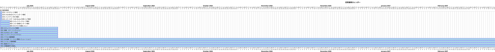
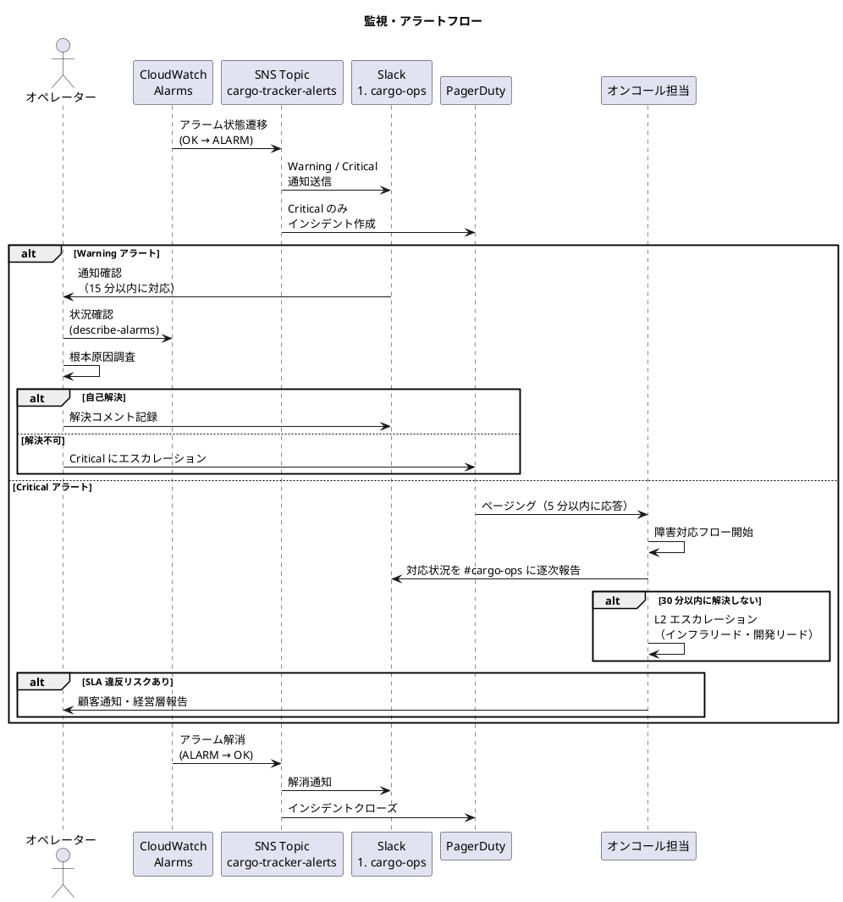
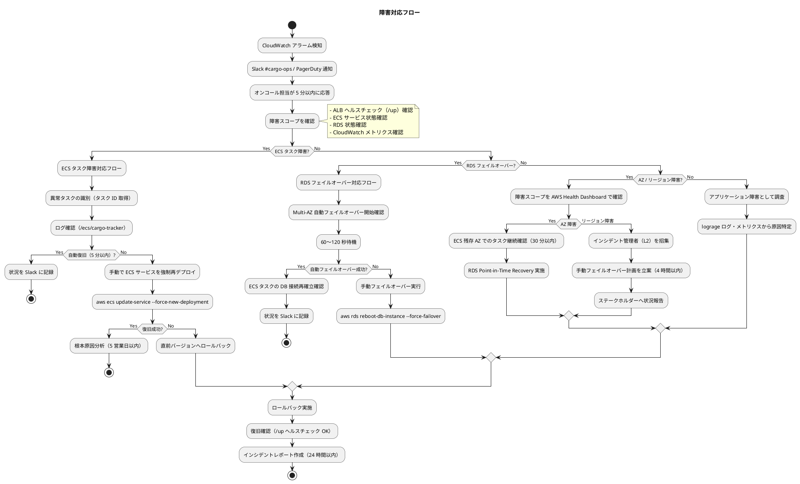
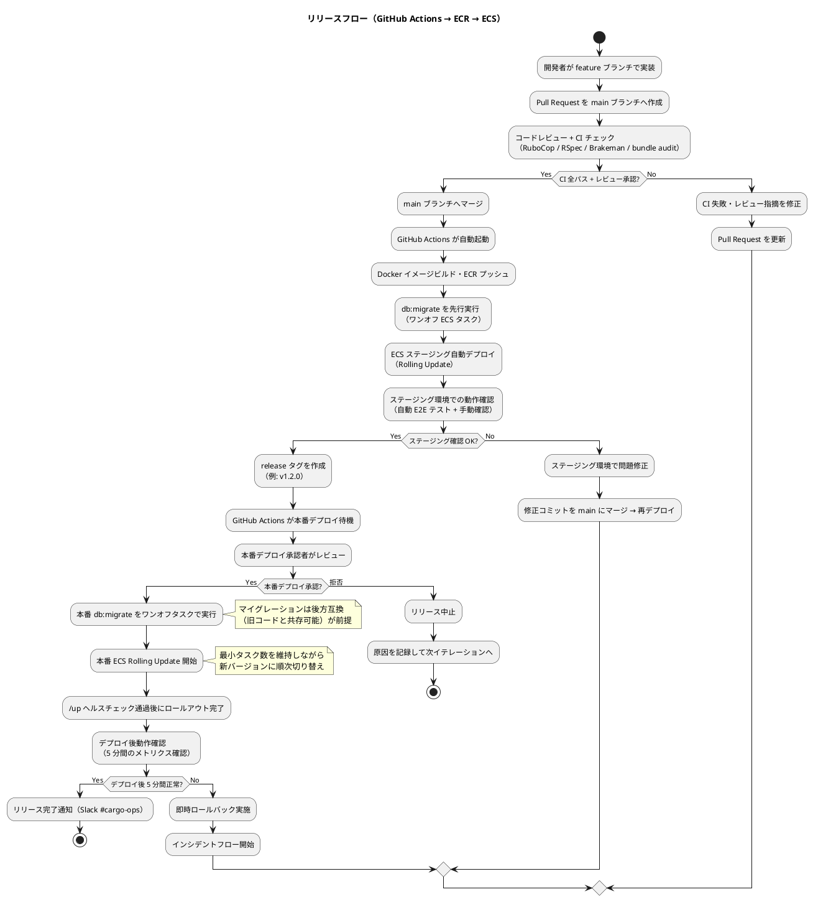

# 運用要件定義 - 国際貨物輸送管理システム

## 1. 概要

### 1.1 目的

本ドキュメントは、国際貨物輸送管理システム（Ruby on Rails 8 アプリケーション）の本番稼働後における運用手順・方針を定義します。運用設計の目標は以下のとおりです。

- **自動化優先**: 繰り返し発生する運用タスクはすべてスクリプト化・自動化し、人的ミスを排除する
- **IaC 管理**: インフラリソースはすべて Terraform で管理し、手動操作による構成ドリフトを防止する
- **観測可能性（Observability）の確保**: CloudWatch によるメトリクス・ログ・アラートを統合し、問題を早期に検知する
- **SLA/SLO 遵守**: 合意した SLA（99.9%）および内部 SLO（99.95%）を常に満たす状態を維持する

### 1.2 SLA / SLO

| 区分 | SLA（外部合意） | SLO（内部目標） | 月間許容停止時間 |
|---|---|---|---|
| システム全体稼働率 | 99.9% | 99.95% | SLA: 43.8 分 / SLO: 21.9 分 |
| 貨物追跡機能稼働率 | 99.99% | 99.995% | SLA: 4.4 分 / SLO: 2.2 分 |

### 1.3 RTO / RPO

| 障害種別 | RTO | RPO |
|---|---|---|
| ECS タスク異常終了 | 5 分（Auto Recovery） | 0（ステートレス） |
| RDS フェイルオーバー（Multi-AZ） | 60〜120 秒 | 数秒（同期レプリケーション） |
| AZ 全体障害 | 30 分 | 1 時間（Point-in-Time Recovery 基準） |
| リージョン全体障害 | 4 時間（手動フェイルオーバー） | 24 時間（日次スナップショット基準） |

### 1.4 運用基盤

| コンポーネント | 構成 |
|---|---|
| ECS クラスター | `cargo-tracker-cluster`（Fargate、CPU 512 / メモリ 1024 MB、min 2 / max 10、Puma） |
| RDS | PostgreSQL 16 Multi-AZ（`db.t3.medium`、自動バックアップ 7 日） |
| ALB | HTTPS:443 → ECS:3000（Puma）、ヘルスチェックパス `/up` |
| バックグラウンドジョブ | Solid Queue（Rails 8 標準、DB ベース、Puma プラグインまたは専用ワーカータスク） |
| 監視 | CloudWatch Logs・Metrics・Alarms・Dashboard |
| ネットワーク | VPC 10.0.0.0/16（ap-northeast-1a / ap-northeast-1c） |

**Rails 固有の運用前提**:

- ヘルスチェックは Rails 8 標準の `Rails::HealthController`（`/up`）を使用します。アプリのブートに失敗すると 500 を返すため、ALB / ECS のヘルスチェックとして十分に機能します
- ログは `RAILS_LOG_TO_STDOUT=1` + lograge による JSON 1 行ログを標準出力へ出し、awslogs ドライバー経由で CloudWatch Logs に集約します
- 定期ジョブ（スケジュール処理）は Solid Queue の recurring tasks（`config/recurring.yml`）で管理します

---

## 2. 運用フロー

### 2.1 定常運用カレンダー



### 2.2 日次運用

毎日 09:00 JST に以下の確認を実施します（所要時間: 15 分以内）。

**確認項目**:

- [ ] CloudWatch ダッシュボード（`cargo-tracker-dashboard`）で全メトリクスが正常範囲内であることを確認
- [ ] ECS サービスの HealthyHostCount が min 値（2）以上であることを確認
- [ ] 前夜の RDS 自動バックアップが正常完了していることを確認
- [ ] Alarm 状態のアラートがないことを確認（存在する場合は障害対応フローへ）
- [ ] Solid Queue の失敗ジョブ（`solid_queue_failed_executions`）が滞留していないことを確認

```bash
# ECS サービス状態確認
aws ecs describe-services \
  --cluster cargo-tracker-cluster \
  --services cargo-tracker-service \
  --query 'services[0].{Status:status,Running:runningCount,Desired:desiredCount}'

# CloudWatch アラーム確認
aws cloudwatch describe-alarms \
  --alarm-name-prefix "cargo-tracker" \
  --state-value ALARM

# RDS バックアップ確認（直近 1 件）
aws rds describe-db-snapshots \
  --db-instance-identifier cargo-tracker-db \
  --snapshot-type automated \
  --query 'sort_by(DBSnapshots, &SnapshotCreateTime)[-1].{Time:SnapshotCreateTime,Status:Status}'

# ヘルスチェックエンドポイント確認（Rails 8 標準 /up）
curl -f https://<ALB-DOMAIN>/up
```

### 2.3 週次運用

毎週月曜日 10:00 JST に実施します（所要時間: 30 分以内）。

**確認・作業項目**:

- [ ] セキュリティグループのインバウンドルールに不審な変更がないか確認
- [ ] AWS Cost Explorer でコストが予算範囲内（前週比 ±20% 以内）であることを確認
- [ ] ECR の未使用イメージを確認し、30 日以上前のイメージをクリーンアップ
- [ ] ECS タスク定義の最新バージョンに不審なリビジョンがないか確認

```bash
# 未使用 ECR イメージ一覧（30 日以上前）
aws ecr describe-images \
  --repository-name cargo-tracker-app \
  --query 'imageDetails[?imagePushedAt<=`'$(date -d "30 days ago" +%Y-%m-%dT%H:%M:%S)'`].[imageDigest,imagePushedAt]' \
  --output table
```

### 2.4 月次運用

毎月第 1 営業日の午前中に実施します（所要時間: 2 時間以内）。

**作業項目**:

- [ ] OS・ミドルウェア・Ruby / Rails のセキュリティパッチ確認と適用計画策定（→ 変更管理フローへ）
- [ ] RDS Point-in-Time Recovery のリストアテスト（→ バックアップ設計参照）
- [ ] SLA/SLO 達成状況レポートを作成し関係者へ共有
- [ ] ECS Auto Scaling の実績確認とスケーリング閾値の調整検討
- [ ] IAM ユーザー・ロールのアクセス権限棚卸
- [ ] `bundle audit` / Dependabot の結果に基づく gem 脆弱性対応状況の確認

```bash
# 月次 SLA レポート用: 過去 30 日の 5xx エラー率取得
aws cloudwatch get-metric-statistics \
  --namespace AWS/ApplicationELB \
  --metric-name HTTPCode_Target_5XX_Count \
  --dimensions Name=LoadBalancer,Value=<ALB-ARN> \
  --start-time $(date -d "30 days ago" --iso-8601=seconds) \
  --end-time $(date --iso-8601=seconds) \
  --period 2592000 \
  --statistics Sum
```

### 2.5 年次運用

毎年 1 月（年度初め）に実施します。

**作業項目**:

- [ ] DR 訓練: リージョン全体障害を想定したフェイルオーバー手順の実動演習（4 時間枠確保）
- [ ] AWS ライセンス・サポートプランの更新確認
- [ ] 監査ログ（`/ecs/cargo-tracker/audit`）の 1 年分をアーカイブして S3 に保存
- [ ] Ruby / Rails の EOL スケジュール確認とバージョンアップ計画策定
- [ ] 非機能要件（SLA/SLO/RTO/RPO）の見直しと関係者合意

---

## 3. 監視設計

### 3.1 監視・アラートフロー



### 3.2 監視項目とアラート閾値

#### 3.2.1 アプリケーションメトリクス

| メトリクス | ソース | Warning | Critical | 対応 |
|---|---|---|---|---|
| HTTP 5xx エラー率 | ALB | 1% | 5% | 障害対応フロー |
| HTTP レスポンスタイム p95 | ALB | 500ms | 1,000ms | アプリ調査 |
| ECS HealthyHostCount（`/up` 判定） | ECS / ALB | 1 | 0 | 即時 ECS 復旧 |
| ECS CPU 使用率 | ECS | 70% | 90% | スケールアウト確認 |
| ECS メモリ使用率 | ECS | 80% | 95% | スケールアウト確認 |
| Puma ビジースレッド率 | カスタムメトリクス（Puma control app / lograge 集計） | 80% | 95% | スレッド数・タスク数見直し |
| Solid Queue 滞留ジョブ数 | カスタムメトリクス（recurring task で PutMetricData） | 100 件 | 500 件 | ワーカー増強・失敗調査 |

Puma のメトリクス（実行中スレッド数・バックログ）は Puma の stats を定期的に CloudWatch カスタムメトリクスへ送信して収集します。より詳細なトレーシングが必要な場合は、OpenTelemetry 対応の汎用 APM（Datadog / New Relic / AWS X-Ray など）を追加導入できます。

#### 3.2.2 インフラメトリクス

| メトリクス | ソース | Warning | Critical | 対応 |
|---|---|---|---|---|
| RDS CPU 使用率 | RDS | 70% | 90% | クエリ最適化 |
| RDS 接続数 | RDS | 上限の 70% | 上限の 90% | 接続プール（`RAILS_MAX_THREADS`・pool 設定）調整 |
| RDS 空きストレージ | RDS | 20% 以下 | 10% 以下 | ストレージ拡張 |
| RDS レプリカラグ | RDS | 30 秒 | 120 秒 | フェイルオーバー検討 |

#### 3.2.3 性能 SLO メトリクス

| 操作 | p95 目標 | 計測ポイント |
|---|---|---|
| 貨物追跡検索 | 200ms | ALB アクセスログ + lograge の duration フィールド |
| 荷役作業登録 | 500ms | ALB アクセスログ + lograge の duration フィールド |
| 請求書生成 | 1,500ms | ALB アクセスログ + lograge の duration フィールド |

### 3.3 CloudWatch アラーム設定

```bash
# HTTP 5xx エラー率 Critical アラーム作成
aws cloudwatch put-metric-alarm \
  --alarm-name "cargo-tracker-5xx-critical" \
  --alarm-description "HTTP 5xx エラー率が 5% を超過" \
  --namespace "AWS/ApplicationELB" \
  --metric-name "HTTPCode_Target_5XX_Count" \
  --dimensions Name=LoadBalancer,Value=<ALB-ARN> \
  --statistic Sum \
  --period 60 \
  --evaluation-periods 3 \
  --threshold 5 \
  --comparison-operator GreaterThanThreshold \
  --alarm-actions <SNS-ARN> \
  --treat-missing-data notBreaching

# ECS HealthyHostCount Critical アラーム作成
aws cloudwatch put-metric-alarm \
  --alarm-name "cargo-tracker-healthy-host-critical" \
  --alarm-description "ECS HealthyHostCount が 0 になった" \
  --namespace "AWS/ApplicationELB" \
  --metric-name "HealthyHostCount" \
  --dimensions Name=TargetGroup,Value=<TG-ARN> \
  --statistic Minimum \
  --period 60 \
  --evaluation-periods 1 \
  --threshold 1 \
  --comparison-operator LessThanThreshold \
  --alarm-actions <SNS-ARN>
```

### 3.4 ログ設計

Rails アプリケーションは `RAILS_LOG_TO_STDOUT=1` を設定し、lograge により 1 リクエスト = 1 行の JSON ログを標準出力に出力します。ECS の awslogs ログドライバーが標準出力を CloudWatch Logs へ転送するため、コンテナ内にログファイルは保持しません。

```ruby
# config/environments/production.rb（抜粋）
config.lograge.enabled = true
config.lograge.formatter = Lograge::Formatters::Json.new
config.lograge.custom_payload do |controller|
  {
    request_id: controller.request.request_id,
    user_id: controller.respond_to?(:current_user) ? controller.current_user&.id : nil
  }
end
```

| ログ種別 | CloudWatch ロググループ | 保持期間 | 用途 |
|---|---|---|---|
| アプリケーション（lograge JSON） | `/ecs/cargo-tracker` | 30 日 | デバッグ・障害調査 |
| Solid Queue ワーカー | `/ecs/cargo-tracker/jobs` | 30 日 | ジョブ失敗調査 |
| 監査 | `/ecs/cargo-tracker/audit` | 1 年 | コンプライアンス対応 |
| ALB アクセスログ | S3 バケット（`cargo-tracker-alb-logs`） | 90 日 | 性能分析・セキュリティ |
| RDS 低速クエリ | RDS → CloudWatch | 14 日 | クエリ最適化 |

#### ログ検索例

```bash
# 直近 1 時間の 5xx ログを抽出（lograge JSON の status フィールド）
aws logs filter-log-events \
  --log-group-name "/ecs/cargo-tracker" \
  --start-time $(($(date +%s%3N) - 3600000)) \
  --filter-pattern '{ $.status >= 500 }' \
  --query 'events[*].{Time:timestamp,Message:message}' \
  --output table

# 特定 request_id のログ追跡
aws logs filter-log-events \
  --log-group-name "/ecs/cargo-tracker" \
  --filter-pattern '{ $.request_id = "abc-123" }' \
  --start-time $(($(date +%s%3N) - 86400000))

# 低速リクエスト（duration 1 秒以上）の確認
aws logs filter-log-events \
  --log-group-name "/ecs/cargo-tracker" \
  --filter-pattern '{ $.duration >= 1000 }' \
  --start-time $(($(date +%s%3N) - 86400000))

# RDS 低速クエリの確認
aws logs filter-log-events \
  --log-group-name "/aws/rds/instance/cargo-tracker-db/postgresql" \
  --filter-pattern "duration" \
  --start-time $(($(date +%s%3N) - 86400000))
```

### 3.5 CloudWatch ダッシュボード

ダッシュボード名: `cargo-tracker-dashboard`

**ウィジェット構成**:

- **SLA ステータス**: 直近 30 日の稼働率（5 分粒度）
- **HTTP メトリクス**: 2xx / 4xx / 5xx の時系列グラフ
- **ECS リソース**: CPU / メモリ使用率（タスクごと）
- **Puma / ジョブ**: ビジースレッド率・Solid Queue 滞留ジョブ数
- **RDS ステータス**: CPU / 接続数 / レプリカラグ
- **レスポンスタイム**: p50 / p95 / p99 の時系列グラフ

---

## 4. バックアップ・リカバリ設計

### 4.1 バックアップ方式

| 対象 | 方式 | スケジュール | 保持期間 | 担当 |
|---|---|---|---|---|
| RDS（自動） | スナップショット（フル） | 毎日 02:00 JST | 7 日間 | AWS 自動 |
| RDS（手動） | スナップショット（フル） | 月次リリース前 | 無期限（手動管理） | 運用担当 |
| ECS タスク定義 | IaC（Terraform State） | Git push 時 | Git 履歴で管理 | CI/CD |
| DB スキーマ定義 | `db/schema.rb`（Git 管理） | マイグレーション時 | Git 履歴で管理 | 開発担当 |
| アプリケーションログ | CloudWatch → S3 Export | 月次 | 1 年 | Lambda 自動 |
| 監査ログ | CloudWatch → S3 Export | 月次 | 7 年 | Lambda 自動 |

Solid Queue のジョブテーブルはアプリケーションと同一の PostgreSQL 上にあるため、RDS のバックアップに含まれます。

### 4.2 RDS バックアップ手順

#### 手動スナップショット作成

```bash
# リリース前など任意タイミングで手動スナップショット作成
aws rds create-db-snapshot \
  --db-instance-identifier cargo-tracker-db \
  --db-snapshot-identifier manual-snapshot-$(date +%Y%m%d-%H%M%S)

# スナップショット作成完了待ち（最大 30 分）
aws rds wait db-snapshot-available \
  --db-snapshot-identifier manual-snapshot-$(date +%Y%m%d)

# スナップショット一覧確認
aws rds describe-db-snapshots \
  --db-instance-identifier cargo-tracker-db \
  --query 'DBSnapshots[*].{ID:DBSnapshotIdentifier,Time:SnapshotCreateTime,Status:Status}' \
  --output table
```

### 4.3 リストア手順

#### 4.3.1 Point-in-Time Recovery（AZ 障害時）

RTO 目標: 30 分以内

```bash
# Step 1: リストア先の DB インスタンスを新規作成（既存は残す）
aws rds restore-db-instance-to-point-in-time \
  --source-db-instance-identifier cargo-tracker-db \
  --target-db-instance-identifier cargo-tracker-db-restore \
  --restore-time 2026-07-01T01:00:00Z  # 復旧したい時点の UTC 時刻

# Step 2: 復旧 DB が利用可能になるまで待機（最大 30 分）
aws rds wait db-instance-available \
  --db-instance-identifier cargo-tracker-db-restore

# Step 3: エンドポイント確認
aws rds describe-db-instances \
  --db-instance-identifier cargo-tracker-db-restore \
  --query 'DBInstances[0].Endpoint.Address'

# Step 4: Secrets Manager の接続情報（DATABASE_URL）を新エンドポイントに更新
aws secretsmanager update-secret \
  --secret-id cargo-tracker/db-credentials \
  --secret-string '{"DATABASE_URL":"postgres://<user>:<pass>@<new-endpoint>:5432/cargo_tracker_production"}'

# Step 5: ECS サービスを再デプロイして新 DB に接続切り替え
aws ecs update-service \
  --cluster cargo-tracker-cluster \
  --service cargo-tracker-service \
  --force-new-deployment
```

#### 4.3.2 スナップショットからのリストア（完全復旧）

```bash
# Step 1: 利用可能なスナップショット一覧を確認
aws rds describe-db-snapshots \
  --db-instance-identifier cargo-tracker-db \
  --query 'sort_by(DBSnapshots, &SnapshotCreateTime)[-5:].{ID:DBSnapshotIdentifier,Time:SnapshotCreateTime}' \
  --output table

# Step 2: スナップショットから新 DB インスタンスを復元
aws rds restore-db-instance-from-db-snapshot \
  --db-instance-identifier cargo-tracker-db-restored \
  --db-snapshot-identifier <snapshot-id> \
  --db-instance-class db.t3.medium \
  --multi-az \
  --vpc-security-group-ids <sg-id>

# Step 3 以降: Point-in-Time Recovery の Step 2〜5 と同様
```

### 4.4 月次リストアテスト

毎月第 1 営業日にリストアテストを実施し、RTO が目標内（30 分）で達成できることを確認します。

**テスト手順**:

1. 自動スナップショットの最新版を確認する
2. ステージング環境でスナップショットからリストアを実行する
3. リストア完了後、基本的な動作確認（`/up` の応答・貨物追跡・ログイン）を行う
4. `rails db:migrate:status` でマイグレーションがすべて `up` であることを確認する
5. 所要時間を記録し、RTO 目標（30 分）内であることを確認する
6. テスト結果を月次運用レポートに記録する

---

## 5. 障害対応設計

### 5.1 障害対応フロー



### 5.2 ECS タスク障害対応

#### 検知条件

- ECS HealthyHostCount が 1 以下（Warning）または 0（Critical）
- ALB ヘルスチェック（`/up`）失敗率が 50% を超過

#### 対応手順

```bash
# Step 1: 障害タスクの特定
aws ecs list-tasks \
  --cluster cargo-tracker-cluster \
  --service-name cargo-tracker-service \
  --desired-status STOPPED

# Step 2: タスク停止理由の確認
aws ecs describe-tasks \
  --cluster cargo-tracker-cluster \
  --tasks <TASK-ARN> \
  --query 'tasks[0].{StopCode:stopCode,Reason:stoppedReason,ContainerReason:containers[0].reason}'

# Step 3: アプリケーションログ確認（直近 100 行）
aws logs get-log-events \
  --log-group-name "/ecs/cargo-tracker" \
  --log-stream-name "ecs/cargo-tracker-app/<TASK-ID>" \
  --limit 100

# Step 4: 自動復旧しない場合、強制再デプロイ
aws ecs update-service \
  --cluster cargo-tracker-cluster \
  --service cargo-tracker-service \
  --force-new-deployment

# Step 5: 新タスクが正常起動するまで待機（最大 5 分）
aws ecs wait services-stable \
  --cluster cargo-tracker-cluster \
  --services cargo-tracker-service
```

### 5.3 RDS フェイルオーバー対応

#### 検知条件

- RDS のステータスが `available` 以外
- RDS レプリカラグが 120 秒を超過

#### 対応手順

```bash
# Step 1: RDS 現在の状態確認
aws rds describe-db-instances \
  --db-instance-identifier cargo-tracker-db \
  --query 'DBInstances[0].{Status:DBInstanceStatus,AZ:AvailabilityZone,MultiAZ:MultiAZ}'

# Step 2: 自動フェイルオーバーが発生していない場合、手動で実行
aws rds reboot-db-instance \
  --db-instance-identifier cargo-tracker-db \
  --force-failover

# Step 3: フェイルオーバー完了確認（120 秒程度）
aws rds wait db-instance-available \
  --db-instance-identifier cargo-tracker-db

# Step 4: 新エンドポイントに接続できることを確認
ENDPOINT=$(aws rds describe-db-instances \
  --db-instance-identifier cargo-tracker-db \
  --query 'DBInstances[0].Endpoint.Address' --output text)
echo "新エンドポイント: ${ENDPOINT}"

# Step 5: ECS タスクが新エンドポイントに接続できているか確認
aws ecs describe-services \
  --cluster cargo-tracker-cluster \
  --services cargo-tracker-service \
  --query 'services[0].{Running:runningCount,Desired:desiredCount}'
```

Active Record のコネクションプールはフェイルオーバー後に自動再接続しますが、接続が回復しない場合は ECS サービスの強制再デプロイでプールを再作成します。

### 5.4 コンソール調査（ECS Exec + rails console）

障害調査で DB の状態確認が必要な場合は、ECS Exec 経由で `rails console` を使用します。

**運用ルール（読み取り専用原則）**:

- 本番の `rails console` は **原則読み取り専用** とし、必ず sandbox モード（`rails console --sandbox`）で起動する（終了時にトランザクションがロールバックされる）
- データ更新が必要な場合は、レビュー済みの一時スクリプトまたはマイグレーション・rake タスクとして PR 経由で実行し、コンソールからの直接更新は Break Glass 承認時のみとする
- 実行内容（コマンド・目的・結果）を必ず Slack `#cargo-ops` と監査ログに記録する

```bash
# ECS Exec で本番コンテナに接続（承認必須。SSM Session Manager 経由で操作ログが記録される）
aws ecs execute-command \
  --cluster cargo-tracker-cluster \
  --task <TASK-ARN> \
  --container cargo-tracker-app \
  --interactive \
  --command "/bin/bash"

# コンテナ内: 読み取り専用の調査（sandbox モード必須）
bin/rails console --sandbox
```

```ruby
# 調査例（読み取りのみ）
Cargo.find_by(tracking_id: "ABC123")&.attributes
HandlingEvent.where(created_at: 1.hour.ago..).count
SolidQueue::FailedExecution.count
```

### 5.5 連絡体制とエスカレーション

| レベル | 担当 | 対応時間 | 連絡方法 |
|---|---|---|---|
| L1: 初期対応 | オンコール担当（輪番） | 5 分以内に応答 | PagerDuty + Slack |
| L2: エスカレーション | インフラリード / 開発リード | 30 分以内 | 電話 + Slack |
| L3: 経営報告 | システムマネージャー | SLA 違反リスク時 | メール + 電話 |
| 顧客通知 | 営業担当 | SLA 違反確定時 | メール・電話 |

**エスカレーション基準**:

- L1 → L2: 初期対応開始から 30 分以内に解決の見込みがない場合
- L2 → L3: SLA 違反（月間停止時間 43.8 分の 80% = 35 分を超える場合）
- 顧客通知: SLA 違反が確定した場合（確定後 2 時間以内に通知）

### 5.6 インシデントレポート

インシデント発生後 24 時間以内に以下の形式でレポートを作成し、関係者へ共有します。

**インシデントレポートテンプレート**:

```
## インシデントレポート

- **インシデント ID**: INC-YYYYMMDD-NNN
- **発生日時**: YYYY-MM-DD HH:MM JST
- **検知日時**: YYYY-MM-DD HH:MM JST
- **解消日時**: YYYY-MM-DD HH:MM JST
- **停止時間**: X 分 Y 秒
- **影響範囲**: [貨物追跡 / 全機能 / 特定機能]
- **SLA への影響**: [なし / あり（月次累積: XX 分）]

### 障害の経緯

1. HH:MM - [事象]
2. HH:MM - [対応内容]
3. HH:MM - [復旧確認]

### 根本原因

[根本原因の詳細]

### 再発防止策

| 対策 | 担当 | 期限 |
|---|---|---|
| [対策内容] | [担当者] | [YYYY-MM-DD] |
```

---

## 6. 変更管理設計

### 6.1 リリースフロー



**db:migrate の実行タイミング**:

- マイグレーションは新バージョンのタスク起動 **前** に、同一イメージを使ったワンオフ ECS タスク（`bin/rails db:migrate` を command 上書き）として実行します
- Rolling Update 中は旧コードと新スキーマが共存するため、マイグレーションは **常に後方互換**（旧コードが動作可能）であることをレビューで確認します（6.3 の Expand-Contract 参照）
- ロック競合を防ぐため、マイグレーションタスクは同時に 1 つのみ実行します

### 6.2 デプロイコマンド

#### ステージングデプロイ（自動 / main push）

```bash
# GitHub Actions から自動実行される（手動実行する場合）

# db:migrate をワンオフタスクとして実行
aws ecs run-task \
  --cluster cargo-tracker-cluster-staging \
  --task-definition cargo-tracker-app \
  --launch-type FARGATE \
  --network-configuration '<staging-network-config>' \
  --overrides '{"containerOverrides":[{"name":"cargo-tracker-app","command":["bin/rails","db:migrate"]}]}'

# アプリのローリングデプロイ
aws ecs update-service \
  --cluster cargo-tracker-cluster-staging \
  --service cargo-tracker-service \
  --task-definition cargo-tracker-app:latest \
  --force-new-deployment

# デプロイ完了待機
aws ecs wait services-stable \
  --cluster cargo-tracker-cluster-staging \
  --services cargo-tracker-service
```

#### 本番デプロイ（手動承認後）

```bash
# Step 1: ECR の最新イメージ SHA 確認
IMAGE_SHA=$(aws ecr describe-images \
  --repository-name cargo-tracker-app \
  --query 'sort_by(imageDetails, &imagePushedAt)[-1].imageDigest' \
  --output text)
echo "デプロイするイメージ: ${IMAGE_SHA}"

# Step 2: 本番デプロイ前の手動スナップショット取得
aws rds create-db-snapshot \
  --db-instance-identifier cargo-tracker-db \
  --db-snapshot-identifier pre-deploy-$(date +%Y%m%d-%H%M%S)

# Step 3: db:migrate をワンオフタスクで実行し完了を待つ
aws ecs run-task \
  --cluster cargo-tracker-cluster \
  --task-definition cargo-tracker-app:<NEW-REVISION> \
  --launch-type FARGATE \
  --network-configuration '<prod-network-config>' \
  --overrides '{"containerOverrides":[{"name":"cargo-tracker-app","command":["bin/rails","db:migrate"]}]}'

# Step 4: 本番 ECS Rolling Update
aws ecs update-service \
  --cluster cargo-tracker-cluster \
  --service cargo-tracker-service \
  --task-definition cargo-tracker-app:<NEW-REVISION> \
  --force-new-deployment

# Step 5: デプロイ完了を確認（最大 10 分）
aws ecs wait services-stable \
  --cluster cargo-tracker-cluster \
  --services cargo-tracker-service

# Step 6: デプロイ後 5 分間のエラー率確認
aws cloudwatch get-metric-statistics \
  --namespace AWS/ApplicationELB \
  --metric-name HTTPCode_Target_5XX_Count \
  --dimensions Name=LoadBalancer,Value=<ALB-ARN> \
  --start-time $(date -d "5 minutes ago" --iso-8601=seconds) \
  --end-time $(date --iso-8601=seconds) \
  --period 300 \
  --statistics Sum
```

### 6.3 ロールバック手順

#### アプリケーションのロールバック（ECS）

```bash
# Step 1: 前バージョンのタスク定義リビジョンを確認
aws ecs list-task-definitions \
  --family-prefix cargo-tracker-app \
  --status ACTIVE \
  --sort DESC \
  --query 'taskDefinitionArns[:5]' \
  --output table

# Step 2: 前バージョンの ECR イメージ SHA を確認
aws ecr describe-images \
  --repository-name cargo-tracker-app \
  --query 'sort_by(imageDetails, &imagePushedAt)[-2:].{Digest:imageDigest,PushedAt:imagePushedAt}' \
  --output table

# Step 3: 前バージョンのタスク定義でサービスを更新
aws ecs update-service \
  --cluster cargo-tracker-cluster \
  --service cargo-tracker-service \
  --task-definition cargo-tracker-app:<前バージョン番号> \
  --force-new-deployment

# Step 4: ロールバック完了確認
aws ecs wait services-stable \
  --cluster cargo-tracker-cluster \
  --services cargo-tracker-service

# Step 5: ロールバック後の動作確認
curl -f https://<ALB-DOMAIN>/up
```

#### DB マイグレーションのロールバック（Forward マイグレーション方式）

> **注記**: Active Record には `rails db:rollback` があるが、本番でのロールバックは Rolling Update 中のコード・スキーマ不整合やデータ損失を招きやすい。本プロジェクトでは本番環境での `db:rollback` を **禁止** し、以下の **Forward マイグレーション方式** を採用します。

**Forward マイグレーション方式**:

スキーマ変更のロールバックは「新しいマイグレーションファイルで元の状態に戻す」ことで実現します。

```ruby
# 例: カラム追加のロールバックは新しいマイグレーションでカラムを削除する

# 20260701000001_add_status_to_cargos.rb（本番反映済み）
class AddStatusToCargos < ActiveRecord::Migration[8.0]
  def change
    add_column :cargos, :status, :string, null: false, default: "PRELIMINARY"
  end
end

# 20260702000001_remove_status_from_cargos.rb（ロールバック相当の forward マイグレーション）
class RemoveStatusFromCargos < ActiveRecord::Migration[8.0]
  def change
    remove_column :cargos, :status, :string
  end
end
```

**スキーマ変更を含むリリースの推奨パターン（Expand-Contract）**:

| フェーズ | 内容 | 実施方法 |
|---|---|---|
| **Expand** | 新しいカラム・テーブルを追加（旧コードと共存可能な形で） | `add_column` 等の後方互換マイグレーション |
| **Migrate** | データ移行・新コードへの切り替え | データ移行 rake タスク + アプリケーションコードの更新 |
| **Contract** | 旧カラム・テーブルを削除（新コード完全切り替え後） | `remove_column` 等のマイグレーション（別リリース） |

**後方互換マイグレーションの運用ルール**:

- カラム削除・リネームは Contract フェーズの別リリースに分離し、削除前に `ignored_columns` で旧コードから参照を外す
- `NOT NULL` 追加はデフォルト値付きで行い、大量データへのバックフィルはマイグレーション外（rake タスク・バッチ）で実施する
- strong_migrations gem を導入し、危険なマイグレーション（ロックを伴う変更等）を CI で検出する

このパターンにより、ECS タスクのロールバック時でも旧コードが新スキーマと共存できます。

```bash
# スキーマ変更を含むリリースのロールバック手順

# Step 1: ECS タスクを旧バージョンイメージに戻す（アプリのみ）
aws ecs update-service \
  --cluster cargo-tracker-cluster \
  --service cargo-tracker-service \
  --task-definition cargo-tracker-app:<旧リビジョン番号>

# Step 2: DB スキーマは旧コードと共存可能であることを確認
# （Expand フェーズのマイグレーションが適用済みなら旧コードも動作する）

# Step 3: Contract フェーズのマイグレーションはロールバック完了を確認後に実施
# ※ Contract 前であれば旧コードで動作継続が可能

# Step 4: 動作確認
curl -f https://<ALB-DOMAIN>/up
```

### 6.4 変更承認フロー

| 変更種別 | 影響範囲 | 承認者 | 申請方法 |
|---|---|---|---|
| ホットフィックス（緊急） | 限定的 | 開発リード 1 名 | Slack 承認 + PR |
| 通常リリース | 機能追加・変更 | 開発リード + QA 担当 | GitHub PR レビュー |
| インフラ変更（軽微） | 設定値変更 | インフラリード 1 名 | GitHub PR（Terraform） |
| インフラ変更（重大） | VPC・スキーマ変更 | インフラリード + システムマネージャー | 変更管理チケット + PR |
| DB マイグレーション | スキーマ変更 | 開発リード + DBA | GitHub PR + strong_migrations チェック + 手動確認 |

---

## 7. セキュリティ運用

### 7.1 アクセス管理

#### IAM 最小権限原則

- ECS タスクロール: 必要なサービス（S3 / Secrets Manager / CloudWatch）のみ許可
- 開発者: 本番環境への直接アクセス不可（ステージング環境は可）
- 本番アクセス: 承認制（緊急時 Break Glass 手順を別途定義）
- 本番 `rails console` は sandbox モードのみ（5.4 参照）。書き込みを伴う操作は Break Glass 承認が必要

```bash
# 本番環境の ECS Exec（緊急デバッグ時のみ。承認必須）
aws ecs execute-command \
  --cluster cargo-tracker-cluster \
  --task <TASK-ARN> \
  --container cargo-tracker-app \
  --interactive \
  --command "/bin/bash"
# 実行後は必ず監査ログに記録すること
```

#### Secrets Manager 管理

Rails の `SECRET_KEY_BASE`・`RAILS_MASTER_KEY`・DB 接続情報（`DATABASE_URL`）は Secrets Manager で管理し、ECS タスク定義の `secrets` として注入します。

```bash
# シークレット一覧確認
aws secretsmanager list-secrets \
  --filters Key=name,Values=cargo-tracker \
  --query 'SecretList[*].{Name:Name,LastChanged:LastChangedDate}' \
  --output table

# 本番シークレットのローテーション（90 日ごとに手動実行）
aws secretsmanager rotate-secret \
  --secret-id cargo-tracker/db-credentials
```

### 7.2 パッチ管理

| 対象 | 頻度 | 方法 | 承認フロー |
|---|---|---|---|
| gem 依存ライブラリ | 月次（Critical は即時） | Dependabot PR + bundle audit + CI | 通常リリースフロー |
| Ruby / Rails 本体 | 四半期（セキュリティリリースは即時） | Gemfile / Dockerfile 更新 + CI | 通常リリースフロー |
| Docker ベースイメージ | 月次 | ECR 再ビルド + デプロイ | 通常リリースフロー |
| RDS マイナーバージョン | 四半期 | AWS コンソール / CLI | インフラ変更フロー |
| RDS メジャーバージョン | 年次（EOL 前） | Blue/Green デプロイ | 重大インフラ変更フロー |

```bash
# RDS エンジンバージョン確認（アップデート対象がないか確認）
aws rds describe-db-instances \
  --db-instance-identifier cargo-tracker-db \
  --query 'DBInstances[0].{Engine:Engine,Version:EngineVersion,PendingModification:PendingModifiedValues}'
```

### 7.3 セキュリティインシデント対応

| インシデント種別 | 初期対応 | エスカレーション |
|---|---|---|
| 不正アクセス検知 | 対象 IAM ユーザー・ロールを即時無効化 | セキュリティ担当 + システムマネージャー |
| データ漏洩疑い | ECS サービス停止 + 通信遮断 + `SECRET_KEY_BASE` ローテーション | CISO + 法務 |
| DDoS 攻撃 | AWS WAF ルール追加 + AWS Shield 確認 | インフラリード |
| 脆弱性発覚（Critical） | 24 時間以内にパッチ適用計画を策定 | 開発リード + セキュリティ担当 |

---

## 8. キャパシティ管理

### 8.1 ECS Auto Scaling 設定

| メトリクス | スケールアウト条件 | スケールイン条件 | クールダウン |
|---|---|---|---|
| CPU 使用率 | 70% 以上・3 分継続 | 30% 以下・5 分継続 | 300 秒 |
| メモリ使用率 | 80% 以上・3 分継続 | 40% 以下・5 分継続 | 300 秒 |
| ALB リクエスト数/タスク | 1,000 req/min を超過 | 300 req/min 以下 | 300 秒 |

**スケーリング範囲**: min 2 タスク / max 10 タスク

Puma のワーカー・スレッド設定（`WEB_CONCURRENCY` / `RAILS_MAX_THREADS`）はタスクの CPU / メモリサイズと整合させ、スケールアウト時の RDS 接続数上限（タスク数 × Puma スレッド数 + Solid Queue ワーカー分）を月次でレビューします。

```bash
# Auto Scaling 設定確認
aws application-autoscaling describe-scaling-policies \
  --service-namespace ecs \
  --resource-id service/cargo-tracker-cluster/cargo-tracker-service

# 手動スケールアウト（緊急時）
aws ecs update-service \
  --cluster cargo-tracker-cluster \
  --service cargo-tracker-service \
  --desired-count 5
```

### 8.2 容量計画

**月次レビュー観点**:

- ECS タスク数のピーク・平均の推移（max 10 の 70% = 7 タスクを超えたら増枠検討）
- RDS 接続数の推移（上限の 70% を超えたら Puma スレッド数・pool 設定を見直し）
- RDS ストレージ使用量（80% を超えたらストレージ拡張を計画）
- Solid Queue のジョブ処理レイテンシ（滞留が続く場合はワーカータスクの増強を検討）
- CloudWatch Logs のストレージコスト（保持期間の見直し）

```bash
# ECS タスク数の推移（過去 7 日）
aws cloudwatch get-metric-statistics \
  --namespace ECS/ContainerInsights \
  --metric-name RunningTaskCount \
  --dimensions Name=ClusterName,Value=cargo-tracker-cluster \
  --start-time $(date -d "7 days ago" --iso-8601=seconds) \
  --end-time $(date --iso-8601=seconds) \
  --period 3600 \
  --statistics Maximum Average \
  --output table

# RDS ストレージ使用量確認
aws cloudwatch get-metric-statistics \
  --namespace AWS/RDS \
  --metric-name FreeStorageSpace \
  --dimensions Name=DBInstanceIdentifier,Value=cargo-tracker-db \
  --start-time $(date -d "1 day ago" --iso-8601=seconds) \
  --end-time $(date --iso-8601=seconds) \
  --period 3600 \
  --statistics Minimum \
  --output table
```

### 8.3 コスト最適化

| 施策 | 効果 | 実施タイミング |
|---|---|---|
| ECS Spot インスタンス（ステージング） | ~70% コスト削減 | ステージング構築時 |
| RDS 本番外は夜間停止 | ~60% コスト削減 | ステージング適用済み |
| ECR ライフサイクルポリシー（30 日超古いイメージ削除） | ストレージコスト削減 | 設定済み |
| CloudWatch Logs 保持期間最適化 | 不要なログコスト削減 | 月次レビュー時 |
| Solid Queue 完了ジョブの定期パージ | DB ストレージ削減 | recurring task で自動化 |

---

## 9. 付録

### 9.1 運用チェックリスト

#### 日次チェックリスト

```markdown
## 日次運用チェック（YYYY-MM-DD）

### システム状態

- [ ] ECS HealthyHostCount: min 2 以上
- [ ] /up ヘルスチェック: 200 応答
- [ ] CloudWatch アラーム: ALARM 状態なし
- [ ] HTTP 5xx エラー率: 1% 未満
- [ ] Solid Queue 失敗ジョブ: 滞留なし
- [ ] RDS 自動バックアップ: 完了

### 確認コマンド実行済み

- [ ] aws ecs describe-services（ECS 状態）
- [ ] aws cloudwatch describe-alarms（アラーム状態）
- [ ] aws rds describe-db-snapshots（バックアップ状態）

### 異常・特記事項

（なし / 詳細を記載）

### 確認者

氏名:          確認時刻:
```

#### 月次チェックリスト

```markdown
## 月次運用チェック（YYYY-MM）

### セキュリティ

- [ ] セキュリティパッチ適用完了（または適用計画策定済み）
- [ ] bundle audit / Dependabot の Critical 対応完了
- [ ] IAM アクセス権限棚卸完了
- [ ] Secrets Manager ローテーション確認

### バックアップ

- [ ] RDS リストアテスト完了（所要時間: XX 分）
- [ ] テスト結果: RTO 目標（30 分）内 / 超過

### 容量・性能

- [ ] ECS タスク数ピーク確認（最大: X タスク）
- [ ] RDS 接続数確認（タスク数 × スレッド数の見直し要否）
- [ ] RDS ストレージ使用率確認（使用率: XX%）
- [ ] SLA/SLO 達成状況確認（稼働率: XX.XX%）

### コスト

- [ ] AWS コスト確認（予算比: +/-XX%）

### 作成者・確認者

作成者:        確認者:        実施日:
```

### 9.2 連絡先テンプレート

```markdown
## 障害連絡先一覧（機密情報のため別途管理）

### オンコール担当（輪番）

| 週 | 担当者 | 連絡先 |
|---|---|---|
| 第 1 週 | 担当 A | [電話番号] |
| 第 2 週 | 担当 B | [電話番号] |
| 第 3 週 | 担当 C | [電話番号] |
| 第 4 週 | 担当 D | [電話番号] |

### エスカレーション先

| レベル | 担当 | 連絡方法 |
|---|---|---|
| L2: インフラリード | [氏名] | [電話 / Slack] |
| L2: 開発リード | [氏名] | [電話 / Slack] |
| L3: システムマネージャー | [氏名] | [電話] |
| セキュリティ担当 | [氏名] | [電話 / メール] |

### 外部連絡先

| 対象 | 連絡先 | 備考 |
|---|---|---|
| AWS サポート | https://console.aws.amazon.com/support | Business サポートプラン |
| PagerDuty | https://[テナント].pagerduty.com | サービス: cargo-tracker |
```

### 9.3 Terraform 管理リソース一覧

| リソース | Terraform モジュール | State ファイル |
|---|---|---|
| VPC / サブネット / SG | `ops/terraform/modules/network` | S3: `cargo-tracker-tfstate/network` |
| ECS クラスター / サービス | `ops/terraform/modules/ecs` | S3: `cargo-tracker-tfstate/ecs` |
| RDS インスタンス | `ops/terraform/modules/rds` | S3: `cargo-tracker-tfstate/rds` |
| ALB / ターゲットグループ | `ops/terraform/modules/alb` | S3: `cargo-tracker-tfstate/alb` |
| CloudWatch アラーム / ダッシュボード | `ops/terraform/modules/monitoring` | S3: `cargo-tracker-tfstate/monitoring` |
| IAM ロール / ポリシー | `ops/terraform/modules/iam` | S3: `cargo-tracker-tfstate/iam` |

```bash
# Terraform State の確認
aws s3 ls s3://cargo-tracker-tfstate/ --recursive

# Terraform でのドリフト検出
cd ops/terraform
terraform plan -out=tfplan
terraform show -json tfplan | jq '.resource_changes[] | select(.change.actions != ["no-op"])'
```

### 9.4 用語集

| 用語 | 定義 |
|---|---|
| SLA | Service Level Agreement。顧客と合意した稼働率（99.9%） |
| SLO | Service Level Objective。内部目標稼働率（99.95%） |
| RTO | Recovery Time Objective。障害発生から復旧までの目標時間 |
| RPO | Recovery Point Objective。障害発生時に許容できるデータ損失範囲 |
| HealthyHostCount | ALB が正常と判断しているターゲット（ECS タスク）数 |
| `/up` | Rails 8 標準のヘルスチェックエンドポイント。ブート失敗時は 500 を返す |
| Rolling Update | 旧バージョンのタスクを順次新バージョンに置き換えるデプロイ方式 |
| Expand-Contract | 後方互換な追加（Expand）→ 移行 → 削除（Contract）の順でスキーマを変更するパターン |
| Solid Queue | Rails 8 標準の DB ベースバックグラウンドジョブ基盤 |
| lograge | Rails のリクエストログを 1 行の構造化ログ（JSON）に変換する gem |
| Break Glass | 緊急時に通常アクセス制限を超えた操作を行う手順（証跡必須） |
| PITR | Point-in-Time Recovery。任意の時点への RDS データ復元機能 |
